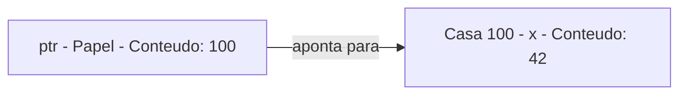
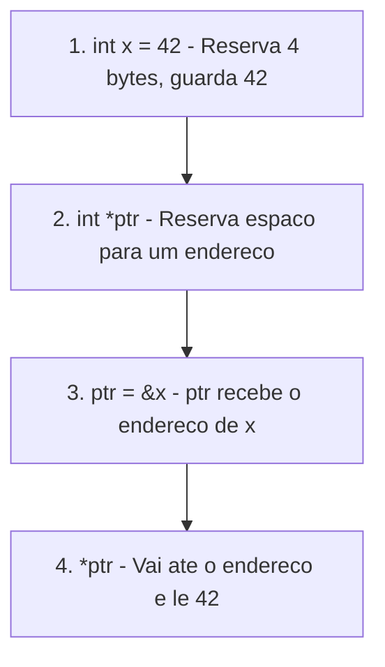
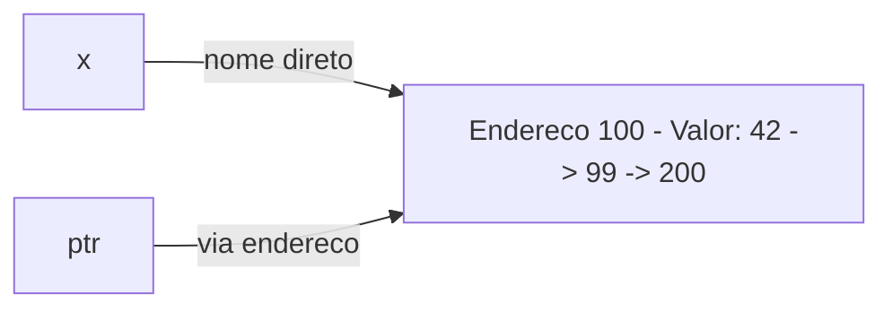
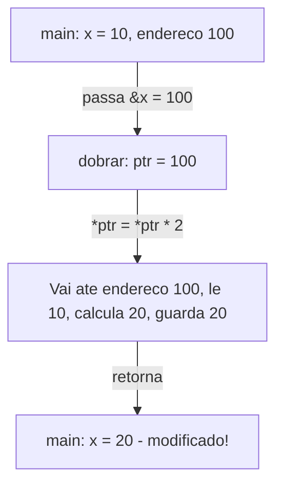
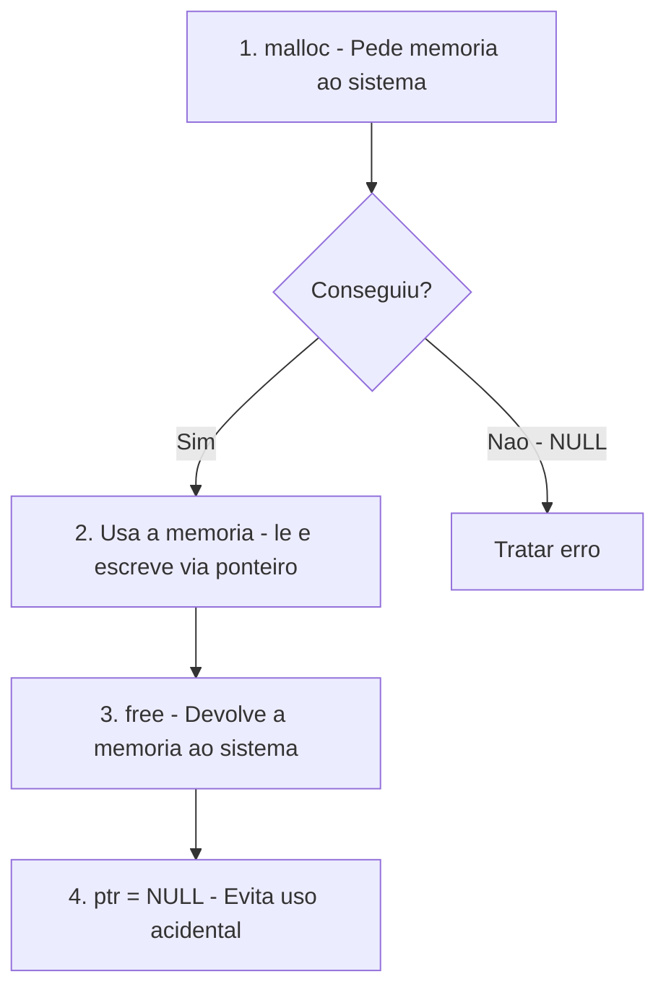
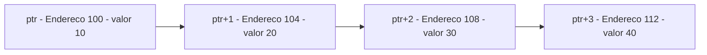
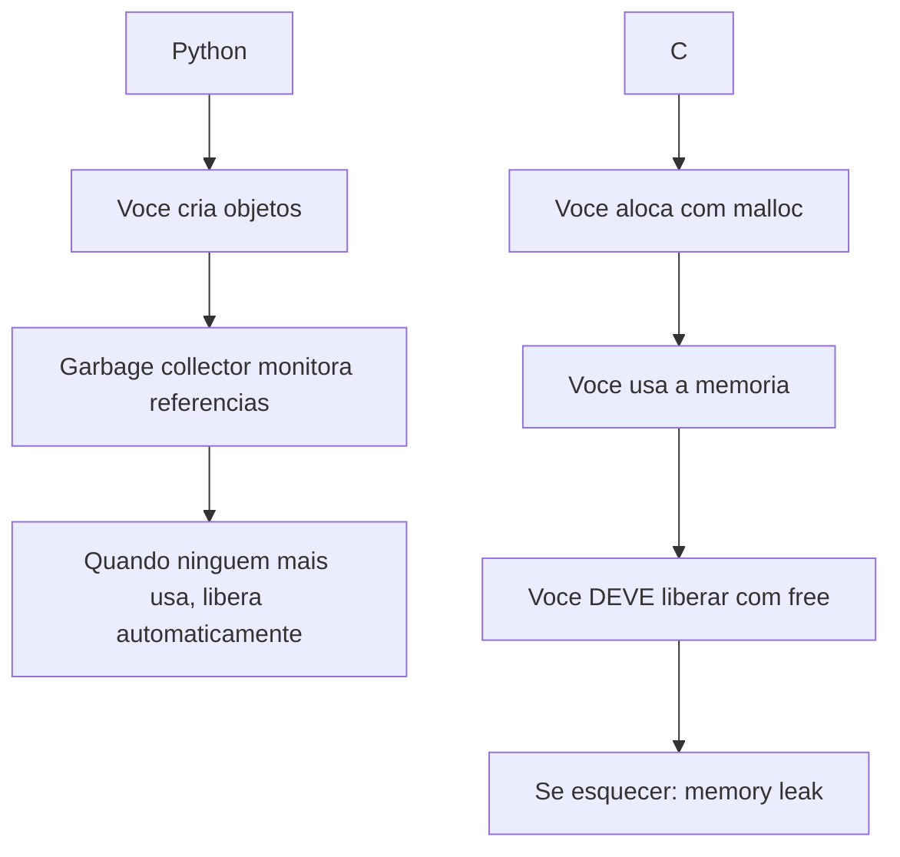
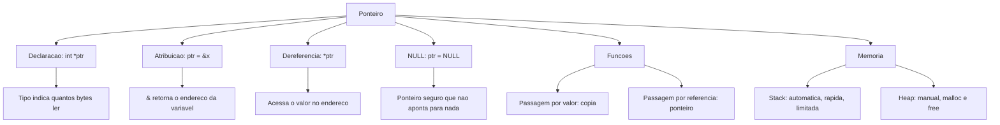

# 7.4 — Ponteiros

[← Anterior: Variáveis e Memória](cap07-mod03-variaveis-memoria-c-conteudo.md) · [Próximo: Arrays →](cap07-mod05-arrays-conteudo.md)

---

## Introdução

No módulo anterior, você aprendeu que toda variável em C ocupa um espaço na memória e que esse espaço tem um endereço. Viu que o operador `&` retorna o endereço de uma variável — o "número da casa" na nossa analogia da rua. E viu que o `scanf` precisa do `&` justamente para saber onde guardar o valor que o usuário digitou.

Agora vamos dar o próximo passo — e é um passo grande. Vamos aprender sobre **ponteiros**: variáveis que guardam endereços de outras variáveis. Se o módulo 7.3 foi o mais importante do capítulo para entender a base, este módulo é o mais importante para entender como C realmente funciona. Ponteiros são o conceito que mais assusta iniciantes em C, mas quando você entender a ideia central, vai perceber que não é tão complicado quanto parece.

A ideia central é simples: **um ponteiro é uma variável que, em vez de guardar um número ou uma letra, guarda o endereço de outra variável**. É como um papel onde você anotou o endereço de uma casa. O papel não é a casa — é apenas uma referência para ela. Mas com o papel na mão, você pode ir até a casa e ver o que tem dentro.

E aqui vai uma revelação que talvez te surpreenda: **você já usa ponteiros desde o capítulo 5, sem saber**. Em Python, quando você faz `a = [1, 2, 3]` e depois `b = a`, a variável `b` não recebe uma cópia da lista — ela recebe uma referência (um ponteiro escondido) para a mesma lista. Se você modificar `b`, `a` também muda. Python esconde os ponteiros de você. C mostra tudo.

---

## Como Executar os Exemplos Deste Módulo

Todos os exemplos deste módulo são programas C completos. Para cada um:

```bash
# Na pasta do capitulo 7
cd ~/meus-projetos/curso/cap07

# Compile com avisos ativados
gcc -Wall programa.c -o programa

# Execute
./programa
```

Alguns exemplos usam `malloc` e `free` — nesses casos, inclua `<stdlib.h>` no programa.

---

## A Analogia: O Papel com o Endereço

Antes de ver qualquer código, vamos fixar a analogia que vai te acompanhar por todo este módulo.

No módulo 7.3, comparamos a memória com uma rua cheia de casas numeradas. Cada casa tem um número (endereço) e um conteúdo (valor). Quando você cria uma variável `int x = 42;`, é como reservar uma casa, colocar o número 42 dentro dela, e lembrar que o nome "x" se refere àquela casa.

Agora imagine o seguinte: você anota o número da casa do `x` em um pedaço de papel. Esse papel é um **ponteiro**. O papel não contém o valor 42 — ele contém o endereço da casa onde o 42 está guardado. Mas com o papel na mão, você pode:

1. **Ler o endereço** que está no papel (ver para qual casa ele aponta)
2. **Ir até a casa** e ver o que tem dentro (acessar o valor)
3. **Ir até a casa** e trocar o que tem dentro (modificar o valor)
4. **Anotar outro endereço** no papel (fazer o ponteiro apontar para outra variável)

| Conceito | Analogia |
|----------|----------|
| Variável `int x = 42` | Casa número 100 com o valor 42 dentro |
| Ponteiro `int *ptr` | Papel onde você anota o número de uma casa |
| `ptr = &x` | Anotar "100" no papel (o endereco da casa do x) |
| `*ptr` | Ir ate a casa 100 e ver o que tem dentro (42) |
| `*ptr = 99` | Ir ate a casa 100 e trocar o conteúdo para 99 |

Vamos ver isso em um diagrama:



O ponteiro `ptr` guarda o valor 100 (que é o endereço da variável `x`). Quando você usa `*ptr`, está dizendo: "vá até o endereço que está no papel e veja o que tem lá". O resultado é 42.

---

## Declarando um Ponteiro

Em C, você declara um ponteiro colocando um asterisco `*` antes do nome da variável:

```c
int *ptr;    // ptr e um ponteiro para int
float *pf;   // pf e um ponteiro para float
char *pc;    // pc e um ponteiro para char
double *pd;  // pd e um ponteiro para double
```

A leitura é: "`ptr` é uma variável que guarda o endereço de um `int`". O tipo antes do `*` indica que tipo de dado está no endereço que o ponteiro guarda. Isso é importante porque o compilador precisa saber quantos bytes ler quando você acessar o valor apontado — um `int*` sabe que deve ler 4 bytes, um `char*` sabe que deve ler 1 byte.

### Onde colocar o asterisco?

Você vai encontrar três estilos diferentes em código C:

```c
int *ptr;    // Estilo 1: asterisco junto ao nome (mais comum)
int* ptr;    // Estilo 2: asterisco junto ao tipo
int * ptr;   // Estilo 3: asterisco separado
```

Os três são equivalentes — o compilador aceita qualquer um. Neste curso, vamos usar o **Estilo 1** (`int *ptr`) porque ele deixa mais claro o que está acontecendo quando você declara múltiplos ponteiros na mesma linha:

```c
int *a, *b;   // a e b sao ponteiros para int
int* a, b;    // CUIDADO: a e ponteiro, mas b e um int normal!
```

No segundo caso, o `*` se aplica apenas a `a`, não a `b`. Isso é uma armadilha comum. Por isso, muitos programadores preferem declarar um ponteiro por linha:

```c
int *a;  // ponteiro para int
int *b;  // ponteiro para int
```

---

## Os Três Operadores Fundamentais

Para trabalhar com ponteiros, você precisa de três operadores. Dois deles você já conhece do módulo anterior:

| Operador | Nome | O que faz | Analogia |
|----------|------|-----------|----------|
| `&` | Endereco de | Retorna o endereco de uma variável | Descobre o número da casa |
| `*` (na declaracao) | Ponteiro | Declara uma variável como ponteiro | Cria um papel para anotar enderecos |
| `*` (no uso) | Dereferencia | Acessa o valor no endereco que o ponteiro guarda | Vai ate a casa e ve o que tem dentro |

O asterisco `*` tem dois significados diferentes dependendo do contexto:
- Na **declaração**: `int *ptr;` — significa "ptr é um ponteiro"
- No **uso**: `*ptr` — significa "vá até o endereço que ptr guarda e acesse o valor"

Isso confunde muita gente no início. Vamos ver cada operador em ação:

```c
// ponteiro_basico.c — Os tres operadores fundamentais
#include <stdio.h>

int main() {
    int x = 42;       // Variavel normal: casa 100 com valor 42

    // & = "qual e o endereco de x?"
    printf("Valor de x:    %d\n", x);        // 42
    printf("Endereco de x: %p\n", (void*)&x); // ex: 0x7ffeefbff3fc

    // * na declaracao = "ptr e um ponteiro para int"
    int *ptr;

    // = atribuicao: "anote o endereco de x no papel"
    ptr = &x;

    printf("\nValor de ptr (endereco que ele guarda): %p\n", (void*)ptr);
    printf("Endereco de x (para comparar):          %p\n", (void*)&x);
    // Os dois sao iguais! ptr guarda o endereco de x

    // * no uso = "va ate o endereco e veja o valor"
    printf("\nValor apontado por ptr (*ptr): %d\n", *ptr);  // 42
    // *ptr e a mesma coisa que x!

    return 0;
}
```

Saída esperada (endereços variam):
```
Valor de x:    42
Endereco de x: 0x7ffeefbff3fc

Valor de ptr (endereco que ele guarda): 0x7ffeefbff3fc
Endereco de x (para comparar):          0x7ffeefbff3fc

Valor apontado por ptr (*ptr): 42
```

Vamos analisar passo a passo o que aconteceu na memória:



### Passo a Passo Visual

Vamos detalhar cada linha com um diagrama de memória. Endereços simplificados para facilitar:

**Passo 1: `int x = 42;`**

O compilador reserva 4 bytes na stack e guarda o valor 42:

```
Endereco  | Conteudo  | Nome
----------|-----------|------
100       | 42        | x
101       | (cont.)   |
102       | (cont.)   |
103       | (cont.)   |
```

**Passo 2: `int *ptr;`**

O compilador reserva espaço para um ponteiro (8 bytes em sistemas de 64 bits). O valor ainda é lixo — não inicializamos:

```
Endereco  | Conteudo  | Nome
----------|-----------|------
100       | 42        | x
...       |           |
200       | ???       | ptr (lixo!)
201-207   | ???       |
```

**Passo 3: `ptr = &x;`**

Agora `ptr` recebe o endereço de `x`, que é 100:

```
Endereco  | Conteudo  | Nome
----------|-----------|------
100       | 42        | x
...       |           |
200       | 100       | ptr (aponta para x)
```

**Passo 4: `*ptr`**

Quando usamos `*ptr`, o programa vai até o endereço 100 (que está guardado em `ptr`) e lê o valor: 42.

### Por que ponteiros têm 8 bytes?

No módulo 7.3, vimos que `int` tem 4 bytes e `char` tem 1 byte. Mas um ponteiro — independente do tipo que ele aponta — ocupa **8 bytes** em sistemas de 64 bits. Isso porque um ponteiro guarda um endereço de memória, e em sistemas de 64 bits, endereços têm 64 bits (8 bytes).

```c
// tamanho_ponteiro.c — Todos os ponteiros tem o mesmo tamanho
#include <stdio.h>

int main() {
    printf("Tamanho de int*:    %lu bytes\n", sizeof(int*));
    printf("Tamanho de char*:   %lu bytes\n", sizeof(char*));
    printf("Tamanho de float*:  %lu bytes\n", sizeof(float*));
    printf("Tamanho de double*: %lu bytes\n", sizeof(double*));
    printf("Tamanho de long*:   %lu bytes\n", sizeof(long*));

    return 0;
}
```

Saída esperada:
```
Tamanho de int*:    8 bytes
Tamanho de char*:   8 bytes
Tamanho de float*:  8 bytes
Tamanho de double*: 8 bytes
Tamanho de long*:   8 bytes
```

Todos 8 bytes. O tipo do ponteiro (`int*`, `char*`, etc.) não muda o tamanho do ponteiro — muda quantos bytes o programa lê quando você faz `*ptr`. Um `int*` lê 4 bytes a partir do endereço. Um `char*` lê 1 byte. Um `double*` lê 8 bytes. Mas o ponteiro em si sempre guarda um endereço de 8 bytes.

---

## Modificando Valores Através de Ponteiros

Até agora, usamos `*ptr` apenas para ler o valor. Mas podemos também **escrever** — ir até a casa e trocar o que tem dentro:

```c
// ponteiro_modifica.c — Modificando valores via ponteiro
#include <stdio.h>

int main() {
    int x = 42;
    int *ptr = &x;  // ptr aponta para x

    printf("Antes:\n");
    printf("  x    = %d\n", x);      // 42
    printf("  *ptr = %d\n", *ptr);    // 42

    // Modificar o valor ATRAVES do ponteiro
    *ptr = 99;  // "va ate o endereco de x e coloque 99 la"

    printf("\nDepois de *ptr = 99:\n");
    printf("  x    = %d\n", x);      // 99 — x mudou!
    printf("  *ptr = %d\n", *ptr);    // 99

    // Modificar x diretamente tambem afeta *ptr
    x = 200;

    printf("\nDepois de x = 200:\n");
    printf("  x    = %d\n", x);      // 200
    printf("  *ptr = %d\n", *ptr);    // 200 — *ptr tambem mudou!

    return 0;
}
```

Saída esperada:
```
Antes:
  x    = 42
  *ptr = 42

Depois de *ptr = 99:
  x    = 99
  *ptr = 99

Depois de x = 200:
  x    = 200
  *ptr = 200
```

Isso acontece porque `x` e `*ptr` se referem ao **mesmo espaço de memória**. Não importa se você acessa pelo nome `x` ou pelo ponteiro `*ptr` — é a mesma casa. Mudar por um caminho afeta o outro.



### Um Ponteiro Pode Apontar para Diferentes Variáveis

O ponteiro é um papel — você pode apagar o endereço antigo e anotar um novo:

```c
// ponteiro_redireciona.c — Ponteiro apontando para variaveis diferentes
#include <stdio.h>

int main() {
    int a = 10;
    int b = 20;
    int c = 30;

    int *ptr = &a;  // ptr aponta para a
    printf("ptr aponta para a: *ptr = %d\n", *ptr);  // 10

    ptr = &b;  // agora ptr aponta para b
    printf("ptr aponta para b: *ptr = %d\n", *ptr);  // 20

    ptr = &c;  // agora ptr aponta para c
    printf("ptr aponta para c: *ptr = %d\n", *ptr);  // 30

    // Modificar c atraves do ponteiro
    *ptr = 999;
    printf("\nDepois de *ptr = 999:\n");
    printf("a = %d\n", a);  // 10 — nao mudou
    printf("b = %d\n", b);  // 20 — nao mudou
    printf("c = %d\n", c);  // 999 — mudou! ptr apontava para c

    return 0;
}
```

Saída esperada:
```
ptr aponta para a: *ptr = 10
ptr aponta para b: *ptr = 20
ptr aponta para c: *ptr = 30

Depois de *ptr = 999:
a = 10
b = 20
c = 999
```

O ponteiro `ptr` foi redirecionado três vezes. Quando fizemos `*ptr = 999`, ele apontava para `c`, então apenas `c` foi modificado.

---

## Ponteiros e Funções: Passagem por Valor vs Passagem por Referência

Aqui está um dos motivos mais práticos para ponteiros existirem. Vamos começar com um problema:

```c
// problema_sem_ponteiro.c — Por que precisamos de ponteiros em funcoes
#include <stdio.h>

void dobrar(int n) {
    n = n * 2;  // Modifica apenas a COPIA local
    printf("Dentro da funcao: n = %d\n", n);
}

int main() {
    int x = 10;
    printf("Antes: x = %d\n", x);

    dobrar(x);  // Passa uma COPIA de x

    printf("Depois: x = %d\n", x);  // x NAO mudou!

    return 0;
}
```

Saída esperada:
```
Antes: x = 10
Dentro da funcao: n = 20
Depois: x = 10
```

O valor de `x` não mudou. Por quê? Porque em C, quando você passa uma variável para uma função, a função recebe uma **cópia** do valor. A variável `n` dentro de `dobrar` é uma variável completamente separada de `x` — ela começa com o mesmo valor (10), mas é uma cópia independente. Modificar `n` não afeta `x`.

Isso é chamado de **passagem por valor** (pass by value). É como se você tirasse uma fotocópia de um documento e entregasse a cópia para alguém. Se a pessoa rabiscar a cópia, o original continua intacto.

### O Problema

E se você **precisa** que a função modifique a variável original? Por exemplo, uma função que troca os valores de duas variáveis, ou uma função que lê um valor do teclado e guarda em uma variável?

### A Solução: Ponteiros

Em vez de passar o valor, passe o **endereço**. A função recebe o endereço e pode ir até lá para modificar o valor original:

```c
// solucao_com_ponteiro.c — Passagem por referencia com ponteiros
#include <stdio.h>

void dobrar(int *ptr) {  // Recebe um PONTEIRO para int
    *ptr = *ptr * 2;     // Vai ate o endereco e modifica o valor
    printf("Dentro da funcao: *ptr = %d\n", *ptr);
}

int main() {
    int x = 10;
    printf("Antes: x = %d\n", x);

    dobrar(&x);  // Passa o ENDERECO de x

    printf("Depois: x = %d\n", x);  // x MUDOU!

    return 0;
}
```

Saída esperada:
```
Antes: x = 10
Dentro da funcao: *ptr = 20
Depois: x = 20
```

Agora `x` mudou. Vamos entender o que aconteceu:

1. `dobrar(&x)` — passa o endereço de `x` (não o valor)
2. A função recebe esse endereço no parâmetro `int *ptr`
3. `*ptr = *ptr * 2` — vai até o endereço, lê o valor (10), multiplica por 2 (20), e guarda de volta no mesmo endereço
4. Como `ptr` aponta para `x`, o valor de `x` foi modificado

É como dar a alguém o endereço da sua casa em vez de uma foto da casa. Com o endereço, a pessoa pode ir até lá e mudar as coisas de lugar.



### Agora o scanf Faz Sentido

Lembra que no módulo 7.2 você usava `scanf` com `&`?

```c
int idade;
scanf("%d", &idade);  // Por que precisa do &?
```

Agora você sabe: `scanf` é uma função que precisa **modificar** a variável `idade` — ela precisa guardar o valor que o usuário digitou. Se recebesse apenas o valor de `idade` (que seria lixo, já que não foi inicializada), não teria como guardar o resultado. Recebendo o **endereço** (`&idade`), o `scanf` pode ir até aquele endereço e escrever o valor lá.

O `scanf` internamente faz algo como `*ptr = valor_digitado` — exatamente o que aprendemos.

### Exemplo Clássico: Trocar Dois Valores (Swap)

Um dos exemplos mais clássicos de ponteiros é a função que troca os valores de duas variáveis:

```c
// swap.c — Trocando valores com ponteiros
#include <stdio.h>

// Versao SEM ponteiro — NAO funciona
void swap_errado(int a, int b) {
    int temp = a;  // "temp" = temporario
    a = b;
    b = temp;
    // Trocou as COPIAS, nao os originais!
}

// Versao COM ponteiro — funciona
void swap(int *a, int *b) {
    int temp = *a;  // Guarda o valor apontado por a
    *a = *b;        // Coloca o valor de b no endereco de a
    *b = temp;      // Coloca o valor original de a no endereco de b
}

int main() {
    int x = 10, y = 20;

    printf("Antes: x=%d, y=%d\n", x, y);

    swap_errado(x, y);
    printf("Depois de swap_errado: x=%d, y=%d\n", x, y);  // Nao mudou!

    swap(&x, &y);
    printf("Depois de swap: x=%d, y=%d\n", x, y);  // Trocou!

    return 0;
}
```

Saída esperada:
```
Antes: x=10, y=20
Depois de swap_errado: x=10, y=20
Depois de swap: x=20, y=10
```

A função `swap_errado` recebe cópias — troca as cópias e os originais ficam intactos. A função `swap` recebe endereços — vai até os endereços e troca os valores diretamente na memória.

### Função que Retorna Múltiplos Valores

Em Python, uma função pode retornar múltiplos valores facilmente:

```python
def dividir(a, b):
    quociente = a // b
    resto = a % b
    return quociente, resto

q, r = dividir(17, 5)  # q=3, r=2
```

Em C, uma função só pode retornar um valor com `return`. Para "retornar" múltiplos valores, usamos ponteiros:

```c
// multiplos_retornos.c — Retornando multiplos valores via ponteiros
#include <stdio.h>

void dividir(int a, int b, int *quociente, int *resto) {
    *quociente = a / b;  // Guarda o quociente no endereco recebido
    *resto = a % b;      // Guarda o resto no endereco recebido
}

int main() {
    int q, r;  // "q" = quociente, "r" = resto

    dividir(17, 5, &q, &r);  // Passa os enderecos de q e r

    printf("17 / 5 = %d com resto %d\n", q, r);

    return 0;
}
```

Saída esperada:
```
17 / 5 = 3 com resto 2
```

A função `dividir` recebe os endereços de `q` e `r` e escreve os resultados diretamente neles. Quando a função retorna, `q` e `r` já têm os valores corretos.

---

## Passagem por Valor vs Referência: Python e C Lado a Lado

Esse é um ponto que merece atenção especial, porque o comportamento é diferente dependendo do tipo de dado em Python.

### Tipos Simples em Python (int, float, str)

```python
def dobrar(n):
    n = n * 2  # Cria um NOVO objeto, nao modifica o original

x = 10
dobrar(x)
print(x)  # 10 — nao mudou
```

Para tipos simples, Python se comporta como C sem ponteiros — a função recebe uma cópia (na verdade, uma referência ao mesmo objeto imutável, mas o efeito prático é o mesmo).

### Tipos Compostos em Python (list, dict)

```python
def adicionar(lista):
    lista.append(4)  # Modifica o MESMO objeto

minha_lista = [1, 2, 3]
adicionar(minha_lista)
print(minha_lista)  # [1, 2, 3, 4] — mudou!
```

Para listas e dicionários, Python passa uma referência ao mesmo objeto — como se passasse um ponteiro automaticamente. A função pode modificar o conteúdo do objeto original.

### Em C: Sempre Passagem por Valor

Em C, a passagem é **sempre por valor**. Mas quando o valor é um **endereço** (ponteiro), a função pode usar esse endereço para modificar o dado original. Então:

| Situação | C | Python |
|----------|---|--------|
| Passar int para função | Copia do valor, original não muda | Referência a objeto imutavel, original não muda |
| Modificar int na função | Precisa de ponteiro `int *ptr` | Não e possível diretamente |
| Passar lista para função | Não existe lista nativa, usa array/ponteiro | Referência ao mesmo objeto, original pode mudar |

A diferença fundamental: em C, você **escolhe explicitamente** quando quer que a função modifique o original (passando `&`). Em Python, isso depende do tipo do objeto (mutável vs imutável) e acontece automaticamente.

---

## Ponteiro NULL: O Ponteiro que Não Aponta para Nada

O que acontece se você declara um ponteiro mas não diz para onde ele aponta?

```c
int *ptr;  // ptr contem LIXO — aponta para um endereco aleatorio!
```

Assim como variáveis não inicializadas contêm lixo (módulo 7.3), um ponteiro não inicializado contém um endereço aleatório. Se você tentar usar `*ptr` nesse estado, o programa pode travar, corromper dados ou ter comportamento imprevisível. Isso é extremamente perigoso.

Para evitar isso, existe o valor especial **NULL** — um ponteiro que explicitamente não aponta para nada:

```c
// ponteiro_null.c — O ponteiro NULL
#include <stdio.h>

int main() {
    int *ptr = NULL;  // ptr nao aponta para nada — seguro

    // Verificar antes de usar
    if (ptr == NULL) {
        printf("ptr e NULL — nao aponta para nada\n");
    }

    // NUNCA faca isso:
    // *ptr = 42;  // CRASH! Segmentation fault!
    // Tentar acessar o endereco NULL causa erro fatal

    // Agora vamos fazer ptr apontar para algo
    int x = 42;
    ptr = &x;

    if (ptr != NULL) {
        printf("ptr aponta para x: *ptr = %d\n", *ptr);
    }

    return 0;
}
```

Saída esperada:
```
ptr e NULL — nao aponta para nada
ptr aponta para x: *ptr = 42
```

### Regra de Ouro: Sempre Inicialize Ponteiros

Assim como a regra de sempre inicializar variáveis (módulo 7.3), a regra para ponteiros é:

1. **Sempre inicialize** um ponteiro — com o endereço de uma variável ou com NULL
2. **Sempre verifique** se o ponteiro é NULL antes de usar `*ptr`
3. **Nunca use** um ponteiro que não foi inicializado

```c
// BOM: ponteiro inicializado com endereco
int x = 42;
int *ptr = &x;

// BOM: ponteiro inicializado com NULL
int *ptr2 = NULL;

// RUIM: ponteiro nao inicializado (contem lixo!)
int *ptr3;  // PERIGO!
```

Na analogia do papel com endereço: NULL é como um papel em branco — você sabe que não tem endereço nenhum anotado. Um ponteiro não inicializado é como um papel com um número rabiscado que pode ser o endereço de qualquer lugar — inclusive de uma casa que não existe ou que pertence a outra pessoa.

### O Famoso "Segmentation Fault"

Se você tentar acessar `*ptr` quando `ptr` é NULL ou contém um endereço inválido, o sistema operacional mata o programa com um erro chamado **Segmentation Fault** (ou "segfault"):

```
Segmentation fault (core dumped)
```

Esse é provavelmente o erro mais comum em programas C. Significa que o programa tentou acessar uma região de memória que não pertence a ele. O sistema operacional protege a memória — se o seu programa tenta ler ou escrever em um endereço que não foi alocado para ele, o sistema mata o processo para evitar danos.

Em Python, o equivalente seria um `NoneType has no attribute` — quando você tenta usar `None` como se fosse um objeto real. A diferença é que Python dá uma mensagem de erro clara. C simplesmente trava.

---

## Alocação Dinâmica: malloc e free

Até agora, todas as variáveis que criamos vivem na **stack** — a memória automática que é liberada quando a função termina. Mas e se você precisar de memória que:

- Sobreviva ao fim da função?
- Tenha tamanho decidido em tempo de execução (não na compilação)?
- Seja maior do que a stack permite?

Para isso existe a **alocação dinâmica** — pedir memória ao sistema operacional em tempo de execução. Em C, usamos duas funções:

- `malloc(tamanho)` — **M**emory **Alloc**ation — pede `tamanho` bytes ao sistema
- `free(ponteiro)` — devolve a memória ao sistema

### A Analogia do Hotel

Pense na memória heap como um hotel com muitos quartos:

- `malloc` = **reservar um quarto**. Você diz quantos metros quadrados precisa, o hotel encontra um quarto disponível e te dá a chave (o endereço).
- `free` = **devolver a chave**. O quarto fica disponível para outros hóspedes.
- **Memory leak** = **reservar quartos e nunca devolver as chaves**. Os quartos ficam ocupados sem ninguém usar, e eventualmente o hotel lota.

```c
// malloc_basico.c — Alocacao dinamica de memoria
#include <stdio.h>
#include <stdlib.h>  // Para malloc e free

int main() {
    // Pedir memoria para UM inteiro (4 bytes)
    int *ptr = (int*)malloc(sizeof(int));

    // Verificar se malloc conseguiu alocar
    if (ptr == NULL) {
        printf("Erro: nao foi possivel alocar memoria!\n");
        return 1;  // Sair com codigo de erro
    }

    // Usar a memoria alocada
    *ptr = 42;
    printf("Valor alocado: %d\n", *ptr);
    printf("Endereco: %p\n", (void*)ptr);

    // IMPORTANTE: devolver a memoria quando nao precisar mais
    free(ptr);

    // Boa pratica: setar para NULL depois de free
    ptr = NULL;

    return 0;
}
```

Saída esperada:
```
Valor alocado: 42
Endereco: 0x600000004010
```

### Anatomia do malloc

Vamos destrinchar a linha `int *ptr = (int*)malloc(sizeof(int));`:

| Parte | Significado |
|-------|-------------|
| `int *ptr` | Declara um ponteiro para int |
| `malloc(...)` | Pede memória ao sistema |
| `sizeof(int)` | Quantos bytes pedir (4 para int) |
| `(int*)` | Casting: diz que o endereco retornado aponta para um int |
| `= ` | Guarda o endereco da memória alocada em ptr |

O `malloc` retorna o endereço do bloco de memória alocado, ou `NULL` se não conseguiu alocar (por exemplo, se a memória acabou). Por isso **sempre** verificamos se o retorno é NULL antes de usar.

### Por que free é Obrigatório

Em Python, o garbage collector cuida de liberar memória automaticamente. Em C, **você** é responsável. Se alocar memória com `malloc` e não liberar com `free`, essa memória fica ocupada até o programa terminar. Isso é um **memory leak** (vazamento de memória).

Para um programa pequeno que roda e termina, memory leaks não são um problema grave — o sistema operacional recupera toda a memória quando o programa encerra. Mas para programas que rodam por muito tempo (servidores, sistemas operacionais, jogos), memory leaks são desastrosos — o programa vai consumindo cada vez mais memória até travar.

```c
// memory_leak.c — Exemplo de vazamento de memoria
#include <stdio.h>
#include <stdlib.h>

void funcao_com_leak() {
    int *ptr = (int*)malloc(sizeof(int));
    *ptr = 42;
    printf("Valor: %d\n", *ptr);
    // ESQUECEU de chamar free(ptr)!
    // A memoria fica alocada mas ninguem mais tem o endereco
    // Isso e um memory leak
}

void funcao_sem_leak() {
    int *ptr = (int*)malloc(sizeof(int));
    *ptr = 42;
    printf("Valor: %d\n", *ptr);
    free(ptr);  // Memoria devolvida ao sistema
    ptr = NULL; // Boa pratica
}

int main() {
    // Se chamar funcao_com_leak mil vezes,
    // desperdicamos 4000 bytes de memoria
    int i;
    for (i = 0; i < 1000; i++) {
        funcao_com_leak();  // Cada chamada vaza 4 bytes
    }
    // 4000 bytes perdidos!

    return 0;
}
```

### O Ciclo de Vida da Memória Dinâmica



Regras de ouro para alocação dinâmica:

1. **Sempre verifique** se `malloc` retornou NULL
2. **Sempre chame** `free` quando terminar de usar a memória
3. **Sempre defina** o ponteiro como NULL depois de `free`
4. **Nunca use** um ponteiro depois de chamar `free` nele (use-after-free)
5. **Nunca chame** `free` duas vezes no mesmo ponteiro (double-free)

### Alocando Múltiplos Valores

O `malloc` pode alocar espaço para vários valores de uma vez — isso será fundamental quando estudarmos arrays no próximo módulo:

```c
// malloc_multiplo.c — Alocando espaco para varios inteiros
#include <stdio.h>
#include <stdlib.h>

int main() {
    int quantidade = 5;

    // Alocar espaco para 5 inteiros (5 * 4 = 20 bytes)
    int *numeros = (int*)malloc(quantidade * sizeof(int));

    if (numeros == NULL) {
        printf("Erro ao alocar memoria!\n");
        return 1;
    }

    // Preencher os valores
    int i;
    for (i = 0; i < quantidade; i++) {
        numeros[i] = (i + 1) * 10;  // 10, 20, 30, 40, 50
    }

    // Imprimir os valores
    printf("Valores alocados:\n");
    for (i = 0; i < quantidade; i++) {
        printf("  numeros[%d] = %d\n", i, numeros[i]);
    }

    // Liberar a memoria
    free(numeros);
    numeros = NULL;

    return 0;
}
```

Saída esperada:
```
Valores alocados:
  numeros[0] = 10
  numeros[1] = 20
  numeros[2] = 30
  numeros[3] = 40
  numeros[4] = 50
```

Perceba que usamos `números[i]` para acessar cada posição — exatamente como um array. Na verdade, `números[i]` é uma forma simplificada de `*(números + i)` — aritmética de ponteiros que veremos brevemente mais adiante. No módulo 7.5 (Arrays), vamos explorar essa relação em profundidade.

---

## Stack vs Heap na Prática: Quando Usar Cada Um

No módulo 7.3, vimos a diferença conceitual entre stack e heap. Agora que sabemos usar `malloc` e `free`, podemos ver a diferença na prática:

```c
// stack_vs_heap.c — Comparando stack e heap
#include <stdio.h>
#include <stdlib.h>

int* criar_na_stack() {
    int x = 42;  // x vive na stack desta funcao
    printf("Dentro da funcao (stack): x = %d, endereco = %p\n", x, (void*)&x);
    return &x;   // PERIGO! Retorna endereco de variavel local!
    // Quando a funcao termina, x e destruido
    // O endereco retornado aponta para memoria invalida
}

int* criar_no_heap() {
    int *ptr = (int*)malloc(sizeof(int));  // Aloca no heap
    *ptr = 42;
    printf("Dentro da funcao (heap): *ptr = %d, endereco = %p\n", *ptr, (void*)ptr);
    return ptr;  // SEGURO! A memoria do heap sobrevive ao fim da funcao
}

int main() {
    // Versao ERRADA — stack
    // int *resultado_stack = criar_na_stack();
    // printf("Fora da funcao: %d\n", *resultado_stack);  // UNDEFINED BEHAVIOR!
    // O valor pode ser qualquer coisa — a memoria ja foi liberada

    // Versao CORRETA — heap
    int *resultado_heap = criar_no_heap();
    printf("Fora da funcao: %d\n", *resultado_heap);  // 42 — funciona!

    free(resultado_heap);  // Nao esquecer de liberar!
    resultado_heap = NULL;

    return 0;
}
```

Saída esperada:
```
Dentro da funcao (heap): *ptr = 42, endereco: 0x600000004010
Fora da funcao: 42
```

A função `criar_na_stack` é perigosa: retorna o endereço de uma variável local que deixa de existir quando a função termina. É como dar a alguém o endereço de uma casa que vai ser demolida — quando a pessoa chegar lá, pode encontrar qualquer coisa.

A função `criar_no_heap` é segura: a memória alocada com `malloc` sobrevive ao fim da função. Só é liberada quando alguém chama `free`.

### Quando Usar Stack vs Heap

| Use Stack quando... | Use Heap quando... |
|---------------------|-------------------|
| O tamanho e conhecido na compilação | O tamanho e decidido em tempo de execução |
| A variável so e usada dentro da função | A variável precisa sobreviver ao fim da função |
| O dado e pequeno (poucos KB) | O dado e grande (muitos KB ou MB) |
| Performance e critica (stack e mais rápida) | Flexibilidade e mais importante |

Exemplos práticos:
- **Stack**: contadores de loop, variáveis temporárias, parâmetros de função
- **Heap**: listas encadeadas (módulo 7.6), arrays de tamanho dinâmico, dados que precisam ser compartilhados entre funções

---

## Aritmética de Ponteiros: O Básico

Ponteiros em C suportam operações aritméticas — você pode somar e subtrair valores de um ponteiro. Isso é útil para navegar por blocos de memória contíguos (como arrays).

A regra é simples: quando você soma 1 a um ponteiro, ele avança **o tamanho do tipo apontado** em bytes, não apenas 1 byte.

```c
// aritmetica_ponteiro.c — Aritmetica basica de ponteiros
#include <stdio.h>

int main() {
    int numeros[4] = {10, 20, 30, 40};
    int *ptr = &numeros[0];  // ptr aponta para o primeiro elemento

    printf("ptr     aponta para endereco %p, valor = %d\n", (void*)ptr, *ptr);
    printf("ptr + 1 aponta para endereco %p, valor = %d\n", (void*)(ptr+1), *(ptr+1));
    printf("ptr + 2 aponta para endereco %p, valor = %d\n", (void*)(ptr+2), *(ptr+2));
    printf("ptr + 3 aponta para endereco %p, valor = %d\n", (void*)(ptr+3), *(ptr+3));

    printf("\nDiferenca entre enderecos consecutivos: %lu bytes\n",
           (unsigned long)((void*)(ptr+1) - (void*)ptr));

    return 0;
}
```

Saída esperada (endereços variam):
```
ptr     aponta para endereco 0x7ffeefbff3e0, valor = 10
ptr + 1 aponta para endereco 0x7ffeefbff3e4, valor = 20
ptr + 2 aponta para endereco 0x7ffeefbff3e8, valor = 30
ptr + 3 aponta para endereco 0x7ffeefbff3ec, valor = 40

Diferenca entre enderecos consecutivos: 4 bytes
```

Observe: `ptr + 1` não avançou 1 byte — avançou **4 bytes** (o tamanho de um `int`). Isso é porque o compilador sabe que `ptr` é um `int*`, então "avançar 1" significa "avançar para o próximo int".

Se fosse um `char*`, avançaria 1 byte. Se fosse um `double*`, avançaria 8 bytes. O compilador faz a conta automaticamente.



Não vamos aprofundar em aritmética de ponteiros complexa neste módulo — o importante é entender o conceito básico. No módulo 7.5 (Arrays), veremos como isso se conecta com o acesso a elementos de um array.

---

## Erros Comuns com Ponteiros

Ponteiros são poderosos, mas perigosos. Vamos ver os erros mais comuns para que você saiba reconhecê-los e evitá-los.

### Erro 1: Usar Ponteiro Não Inicializado

```c
// ERRADO — ptr contem lixo, aponta para lugar aleatorio
int *ptr;
*ptr = 42;  // Segmentation fault ou corrupcao de memoria!

// CORRETO — inicializar antes de usar
int x;
int *ptr = &x;
*ptr = 42;  // OK — ptr aponta para x
```

### Erro 2: Usar Ponteiro Depois de free (Use-After-Free)

```c
int *ptr = (int*)malloc(sizeof(int));
*ptr = 42;
free(ptr);     // Memoria devolvida ao sistema

// ERRADO — ptr ainda tem o endereco antigo, mas a memoria nao e mais sua
printf("%d\n", *ptr);  // Comportamento indefinido!

// CORRETO — setar para NULL depois de free
free(ptr);
ptr = NULL;
// Agora, se tentar usar *ptr, o programa trava com segfault
// em vez de ter comportamento imprevisivel
```

### Erro 3: Chamar free Duas Vezes (Double-Free)

```c
int *ptr = (int*)malloc(sizeof(int));
free(ptr);
free(ptr);  // ERRADO! Double-free pode corromper o gerenciador de memoria

// CORRETO — setar para NULL depois de free
free(ptr);
ptr = NULL;
free(ptr);  // free(NULL) e seguro — nao faz nada
```

### Erro 4: Retornar Endereço de Variável Local

```c
// ERRADO — x e destruido quando a funcao termina
int* criar_valor() {
    int x = 42;
    return &x;  // Endereco de variavel local — PERIGO!
}

// CORRETO — alocar no heap
int* criar_valor() {
    int *ptr = (int*)malloc(sizeof(int));
    *ptr = 42;
    return ptr;  // Memoria do heap sobrevive
}
```

### Erro 5: Esquecer de Verificar NULL Após malloc

```c
// ERRADO — se malloc falhar, ptr sera NULL
int *ptr = (int*)malloc(sizeof(int));
*ptr = 42;  // Se ptr for NULL, crash!

// CORRETO — sempre verificar
int *ptr = (int*)malloc(sizeof(int));
if (ptr == NULL) {
    printf("Erro: memoria insuficiente!\n");
    return 1;
}
*ptr = 42;  // Seguro — sabemos que ptr nao e NULL
```

### Tabela de Erros e Consequências

| Erro | Consequência | Como evitar |
|------|-------------|-------------|
| Ponteiro não inicializado | Segfault ou corrupcao | Sempre inicializar com endereco ou NULL |
| Use-after-free | Comportamento indefinido | Setar para NULL apos free |
| Double-free | Corrupcao do heap | Setar para NULL apos free |
| Retornar endereco local | Dados corrompidos | Usar malloc para dados que sobrevivem |
| Não verificar NULL | Segfault | Sempre verificar retorno de malloc |
| Memory leak | Consumo crescente de memória | Sempre chamar free quando terminar |

---

## Ponteiros em Python: A Referência Escondida

Vamos fechar o ciclo e entender como Python usa ponteiros sem que você perceba. Isso vai consolidar tudo que aprendemos.

### Tudo em Python é Referência

Quando você escreve `x = 42` em Python, a variável `x` não contém o número 42 diretamente. Ela contém uma **referência** (um ponteiro) para um objeto inteiro que vale 42. Vamos provar:

```python
# Em Python, id() mostra o endereco do objeto
a = [1, 2, 3]
b = a  # b recebe a REFERENCIA, nao uma copia

print(id(a))  # ex: 140234567890
print(id(b))  # ex: 140234567890 — MESMO endereco!

b.append(4)
print(a)  # [1, 2, 3, 4] — a tambem mudou!
```

Em C, o equivalente seria:

```c
// O equivalente em C do codigo Python acima
#include <stdio.h>
#include <stdlib.h>

int main() {
    // a = [1, 2, 3] em Python e como:
    int *a = (int*)malloc(3 * sizeof(int));
    a[0] = 1; a[1] = 2; a[2] = 3;

    // b = a em Python e como:
    int *b = a;  // b recebe o MESMO endereco que a

    // Agora a e b apontam para a mesma memoria
    b[0] = 999;  // Modifica atraves de b

    printf("a[0] = %d\n", a[0]);  // 999 — a tambem mudou!

    free(a);  // Liberar a memoria (so uma vez — a e b apontam para o mesmo lugar)
    a = NULL;
    b = NULL;

    return 0;
}
```

Saída esperada:
```
a[0] = 999
```

### O Garbage Collector vs free

A grande diferença entre Python e C no gerenciamento de memória:

- **Python**: o garbage collector monitora quantas referências apontam para cada objeto. Quando nenhuma referência aponta para um objeto, ele é automaticamente destruído e a memória é liberada. Você nunca precisa se preocupar com `free`.

- **C**: não existe garbage collector. Você aloca com `malloc` e **deve** liberar com `free`. Se esquecer, a memória vaza. Se liberar cedo demais, o programa pode travar.



Essa é a troca fundamental: Python é mais seguro e conveniente, mas usa mais memória e é mais lento. C é mais rápido e eficiente, mas coloca a responsabilidade no programador. É por isso que sistemas operacionais, drivers e jogos são escritos em C — a performance justifica o trabalho extra.

---

## Exemplo Completo: Programa com Ponteiros

Vamos juntar tudo em um programa mais completo que demonstra os principais usos de ponteiros:

```c
// ponteiros_completo.c — Programa completo demonstrando ponteiros
#include <stdio.h>
#include <stdlib.h>

// Funcao que troca dois valores usando ponteiros
void trocar(int *a, int *b) {
    int temp = *a;
    *a = *b;
    *b = temp;
}

// Funcao que calcula media e retorna via ponteiro
void calcular_media(int *valores, int quantidade, float *resultado) {
    int soma = 0;
    int i;
    for (i = 0; i < quantidade; i++) {
        soma += valores[i];
    }
    *resultado = (float)soma / quantidade;
}

// Funcao que encontra o maior e o menor valor
void encontrar_extremos(int *valores, int quantidade, int *maior, int *menor) {
    *maior = valores[0];
    *menor = valores[0];
    int i;
    for (i = 1; i < quantidade; i++) {
        if (valores[i] > *maior) {
            *maior = valores[i];
        }
        if (valores[i] < *menor) {
            *menor = valores[i];
        }
    }
}

int main() {
    printf("=== Demonstracao de Ponteiros ===\n\n");

    // 1. Trocar valores
    int x = 10, y = 20;
    printf("1. Trocar valores:\n");
    printf("   Antes:  x=%d, y=%d\n", x, y);
    trocar(&x, &y);
    printf("   Depois: x=%d, y=%d\n\n", x, y);

    // 2. Alocacao dinamica
    int n = 5;
    int *notas = (int*)malloc(n * sizeof(int));
    if (notas == NULL) {
        printf("Erro ao alocar memoria!\n");
        return 1;
    }

    // Preencher notas
    notas[0] = 85;
    notas[1] = 92;
    notas[2] = 78;
    notas[3] = 95;
    notas[4] = 88;

    printf("2. Notas: ");
    int i;
    for (i = 0; i < n; i++) {
        printf("%d ", notas[i]);
    }
    printf("\n");

    // 3. Calcular media via ponteiro
    float media;
    calcular_media(notas, n, &media);
    printf("\n3. Media: %.1f\n", media);

    // 4. Encontrar extremos via ponteiros
    int maior, menor;
    encontrar_extremos(notas, n, &maior, &menor);
    printf("\n4. Maior nota: %d\n", maior);
    printf("   Menor nota: %d\n", menor);

    // 5. Liberar memoria
    free(notas);
    notas = NULL;
    printf("\n5. Memoria liberada com sucesso.\n");

    return 0;
}
```

Saída esperada:
```
=== Demonstracao de Ponteiros ===

1. Trocar valores:
   Antes:  x=10, y=20
   Depois: x=20, y=10

2. Notas: 85 92 78 95 88

3. Media: 87.6

4. Maior nota: 95
   Menor nota: 78

5. Memoria liberada com sucesso.
```

Este programa demonstra os quatro usos principais de ponteiros:
1. **Modificar variáveis em funções** (trocar valores)
2. **Alocação dinâmica** (criar array de notas com malloc)
3. **Retornar múltiplos valores** (média, maior, menor)
4. **Gerenciamento de memória** (free e NULL)

---

## Resumo Visual: O Mapa Mental dos Ponteiros



---

## Como a IA pode te ajudar aqui
**Prompt 1 — Aprender passo a passo:**
> "Desenhe o estado da memória passo a passo para este código com ponteiros"

**Prompt 2 — Aprofundar o tema:**
> "Esse código tem memory leak? Onde?"

**Prompt 3 — Explorar o conceito:**
> "Explique a diferença entre `int *ptr = &x` e `int *ptr = (int*)malloc(sizeof(int))` com diagramas de memória"

---

## Casos de Uso no Mundo Real

### 1. Gerenciamento de Memória em Jogos

Jogos como Minecraft, Fortnite e qualquer jogo 3D precisam criar e destruir objetos constantemente — inimigos aparecem e desaparecem, projéteis são disparados e explodem, cenários são carregados e descarregados. Tudo isso é feito com alocação dinâmica de memória. Os motores de jogos (como Unreal Engine, escrito em C++) usam ponteiros extensivamente para gerenciar milhares de objetos em tempo real. Um memory leak em um jogo significa que, depois de algumas horas jogando, o jogo começa a ficar lento e eventualmente trava — porque a memória vai sendo consumida sem ser liberada.

### 2. Drivers de Hardware

Quando você conecta um mouse, teclado ou impressora no computador, um programa chamado **driver** faz a comunicação entre o hardware e o sistema operacional. Drivers são escritos em C e usam ponteiros para acessar endereços específicos de memória onde o hardware escreve dados. Por exemplo, quando você move o mouse, o hardware escreve as coordenadas em um endereço de memória específico. O driver usa um ponteiro para ler esse endereço e informar ao sistema operacional para onde o cursor deve ir. Sem ponteiros, seria impossível fazer essa comunicação direta com o hardware.

### 3. Bancos de Dados e Índices

Bancos de dados como PostgreSQL, MySQL e SQLite (que você vai usar no capítulo 8) são escritos em C e usam ponteiros para implementar estruturas de dados internas como árvores B+ (B-trees). Quando você faz uma busca no banco de dados, o sistema percorre uma árvore de ponteiros para encontrar o registro rapidamente — em vez de ler todos os registros um por um. Cada nó da árvore contém ponteiros para os nós filhos, formando uma hierarquia que permite encontrar qualquer registro em poucos passos, mesmo em tabelas com milhões de linhas.

---

## Resumo do Módulo

| Conceito | Definição |
|----------|-----------|
| Ponteiro | Variável que guarda o endereco de outra variável |
| Declaracao de ponteiro | `int *ptr` — ptr e um ponteiro para int |
| Operador & | Retorna o endereco de uma variável |
| Operador * (dereferencia) | Acessa o valor no endereco que o ponteiro guarda |
| NULL | Valor especial que indica que o ponteiro não aponta para nada |
| malloc | Função que aloca memória no heap e retorna o endereco |
| free | Função que devolve memória alocada ao sistema |
| Memory leak | Memória alocada que nunca e liberada |
| Passagem por valor | Função recebe copia do valor, original não muda |
| Passagem por referência | Função recebe endereco, pode modificar o original |
| Segmentation fault | Erro fatal ao acessar memória inválida |
| Use-after-free | Usar ponteiro apos liberar a memória que ele apontava |
| Double-free | Chamar free duas vezes no mesmo ponteiro |
| Aritmetica de ponteiros | Somar ou subtrair valores de um ponteiro para navegar na memória |

---

## Glossário do Módulo

| Termo | Definição |
|-------|-----------|
| Address | Endereco — número único que identifica a posição de um byte na memória |
| ASLR | Address Space Layout Randomization — técnica de segurança que aleatoriza enderecos |
| Casting | Conversao explicita de tipo, como `(int*)malloc(...)` |
| Core dump | Arquivo gerado quando um programa trava, contendo o estado da memória |
| Dangling pointer | Ponteiro que aponta para memória ja liberada |
| Dereference | Dereferencia — acessar o valor no endereco que um ponteiro guarda |
| Double-free | Erro de chamar free duas vezes no mesmo ponteiro |
| Dynamic allocation | Alocação dinâmica — pedir memória ao sistema em tempo de execução |
| Free | Função que libera memória alocada com malloc |
| Garbage collector | Mecanismo automático de liberacao de memória presente em Python e Java |
| Heap | Regiao de memória para alocação dinâmica controlada pelo programador |
| Malloc | Memory Allocation — função que aloca memória no heap |
| Memory leak | Vazamento de memória — memória alocada que nunca e liberada |
| NULL | Valor especial que representa um ponteiro que não aponta para nada |
| Pass by reference | Passagem por referência — passar o endereco para que a função modifique o original |
| Pass by value | Passagem por valor — passar uma copia do valor para a função |
| Pointer | Ponteiro — variável que armazena o endereco de outra variável |
| Segmentation fault | Erro fatal causado por acesso a memória inválida ou protegida |
| Sizeof | Operador que retorna o tamanho em bytes de um tipo ou variável |
| Stack | Regiao de memória automática para variáveis locais e chamadas de função |
| Stdlib.h | Biblioteca padrão de C que contem malloc, free e outras funções utilitarias |
| Undefined behavior | Comportamento indefinido — resultado imprevisivel de operação inválida em C |
| Use-after-free | Erro de usar um ponteiro apos a memória ter sido liberada |

---

## Na Cultura Popular

- **Matrix** (filme, 1999) — No filme, os personagens acessam a Matrix através de "endereços" — coordenadas que levam a locais específicos dentro da simulação. Um ponteiro funciona da mesma forma: é um endereço que leva a um local específico na memória. Quando Neo "segue o coelho branco", ele está essencialmente seguindo uma referência — um ponteiro — para chegar a um destino. E quando a Matrix é "resetada", é como chamar `free` em toda a memória alocada.

- **Inception** (filme, 2010) — A ideia de "sonho dentro de sonho" é uma boa analogia para ponteiros: cada nível de sonho é uma referência para outro nível. Quando Cobb precisa "voltar" de um sonho, ele precisa seguir a cadeia de referências de volta ao nível original — similar a seguir ponteiros de volta ao dado original. E o "limbo" do filme é como um memory leak: um espaço que foi criado mas do qual ninguém consegue sair.

- **Mr. Robot** (série, 2015) — Elliot frequentemente explora vulnerabilidades de memória em sistemas — buffer overflows, use-after-free e outros bugs relacionados a ponteiros. Essas são vulnerabilidades reais que existem porque C permite acesso direto à memória. Entender ponteiros é o primeiro passo para entender como essas vulnerabilidades funcionam e como se proteger delas.

---

## Para Saber Mais

- [Python Tutor — Visualize C](https://pythontutor.com/) — *Visualize a execução de código C passo a passo, vendo ponteiros, endereços e valores na memória em tempo real. Suporta C além de Python*

- [Visualgo — Linked List](https://visualgo.net/en/list) — *Visualização animada de listas encadeadas que usam ponteiros extensivamente — prévia do que vem no módulo 7.6*

- [CS50 — Pointers (Harvard)](https://cs50.harvard.edu/x/) — *As aulas do CS50 sobre ponteiros são excelentes, com animações e exemplos visuais que complementam este módulo*

- [Learn C — Pointers](https://www.learn-c.org/en/Pointers) — *Tutorial interativo de ponteiros em C que roda no navegador — pratique sem precisar compilar*

- [Programação Descomplicada — Ponteiros em C](https://www.youtube.com/@progdescomplicada) — *Canal brasileiro com explicações claras e detalhadas sobre ponteiros, malloc e free*

---

## Perguntas Frequentes (FAQ)

**P: Ponteiros são realmente necessários? Python não tem ponteiros e funciona bem.**
R: Python tem ponteiros — eles só estão escondidos. Quando você faz `b = a` com uma lista, `b` recebe um ponteiro (referência) para a mesma lista. A diferença é que Python gerência isso automaticamente. Em C, você gerência manualmente, o que dá mais controle e performance. Linguagens como Java e C# também usam referências (ponteiros gerenciados). Entender ponteiros em C ajuda a entender o comportamento de referências em qualquer linguagem.

**P: Por que `*` significa duas coisas diferentes (declaração e dereferência)?**
R: É uma decisão de design da linguagem C que confunde muita gente. Na declaração (`int *ptr`), o `*` indica que `ptr` é um ponteiro. No uso (`*ptr`), o `*` significa "acesse o valor no endereço". Uma forma de lembrar: na declaração, leia como "ptr é um ponteiro para int". No uso, leia como "o valor apontado por ptr".

**P: O que acontece se eu fizer `free` em um ponteiro que aponta para a stack?**
R: Comportamento indefinido — o programa pode travar, corromper memória ou parecer funcionar normalmente (o que é pior, porque o bug fica escondido). Só use `free` em ponteiros que foram criados com `malloc`. Nunca em variáveis locais ou globais.

**P: Posso ter um ponteiro que aponta para outro ponteiro?**
R: Sim, isso existe (`int **pp` — ponteiro para ponteiro). Mas não vamos cobrir isso neste curso porque adiciona complexidade sem benefício pedagógico neste momento. Quando você precisar disso no futuro, o conceito base que aprendeu aqui será suficiente para entender.

**P: malloc pode falhar? Quando?**
R: Sim, `malloc` retorna NULL quando não consegue alocar a memória pedida. Isso acontece quando a memória disponível é insuficiente — por exemplo, se você tentar alocar 100GB em um computador com 8GB de RAM. Em programas pequenos é raro, mas em sistemas grandes é importante sempre verificar.

**P: Qual a diferença entre `int *ptr = NULL` e `int *ptr = 0`?**
R: Na prática, são equivalentes — NULL é definido como 0 (ou `(void*)0`). Mas use `NULL` por clareza: quando alguém lê `ptr = NULL`, entende imediatamente que é um ponteiro nulo. `ptr = 0` pode ser confundido com atribuir o valor zero.

**P: Por que o endereço muda toda vez que executo o programa?**
R: Por causa do ASLR (Address Space Layout Randomization), uma técnica de segurança do sistema operacional que coloca o programa em endereços diferentes a cada execução. Isso dificulta ataques que dependem de saber onde os dados estão na memória. Os endereços mudam, mas o comportamento do programa é o mesmo.

**P: Memory leak pode danificar meu computador?**
R: Não permanentemente. Um memory leak faz o programa consumir cada vez mais memória, o que pode deixar o computador lento ou fazer o programa travar. Mas quando o programa termina (ou é fechado), o sistema operacional recupera toda a memória. O problema é sério em programas que rodam por muito tempo, como servidores web ou sistemas operacionais.

**P: Como sei se meu programa tem memory leak?**
R: Existem ferramentas como Valgrind (Linux) que analisam seu programa e reportam toda memória alocada que não foi liberada. No futuro, quando você trabalhar com C profissionalmente, Valgrind será seu melhor amigo. Por enquanto, a regra simples é: para cada `malloc`, deve existir um `free` correspondente.

**P: Posso usar ponteiros em Python?**
R: Não diretamente — Python não expõe ponteiros ao programador. Mas o módulo `ctypes` permite interagir com código C e manipular ponteiros. E bibliotecas como NumPy usam ponteiros internamente para performance. O importante é que, entendendo ponteiros em C, você entende melhor como Python funciona por baixo.

**P: O que é "undefined behavior" em C?**
R: É quando o programa faz algo que a linguagem C não define o que deve acontecer — como acessar memória já liberada, ler variável não inicializada ou acessar fora dos limites de um array. O resultado pode ser qualquer coisa: funcionar normalmente, dar resultado errado, travar, ou até parecer funcionar e falhar meses depois. É o tipo de bug mais perigoso porque pode ser intermitente e difícil de reproduzir.

**P: Ponteiros são usados em linguagens modernas?**
R: Sim, mas de formas diferentes. Go tem ponteiros explícitos (parecidos com C, mas sem aritmética de ponteiros). Rust tem referências com verificação de segurança em tempo de compilação. C++ tem ponteiros inteligentes (smart pointers) que liberam memória automaticamente. Java e C# usam referências gerenciadas pelo garbage collector. O conceito é universal — a forma de gerenciar é que varia.

---

## Exercícios Práticos

### Exercício 1 — Ponteiro Básico

Crie um programa que declare uma variável `int`, crie um ponteiro para ela, e imprima: o valor da variável, o endereço da variável (usando `&`), o valor do ponteiro (o endereço que ele guarda), e o valor acessado via dereferência (`*ptr`). Verifique que o endereço e o valor do ponteiro são iguais.

### Exercício 2 — Função com Ponteiros

Crie uma função `void incrementar(int *ptr, int valor)` que soma `valor` ao inteiro apontado por `ptr`. Teste chamando a função várias vezes e verificando que a variável original muda.

### Exercício 3 — Alocação Dinâmica

Peça ao usuário quantos números ele quer guardar. Use `malloc` para alocar espaço para essa quantidade de inteiros. Peça os números, calcule a soma e a média, e libere a memória com `free`.

---

[← Anterior: Variáveis e Memória](cap07-mod03-variaveis-memoria-c-conteudo.md) · [Próximo: Arrays →](cap07-mod05-arrays-conteudo.md)
