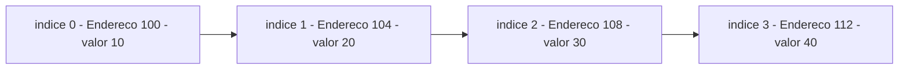
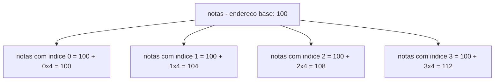
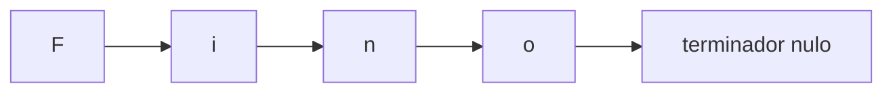
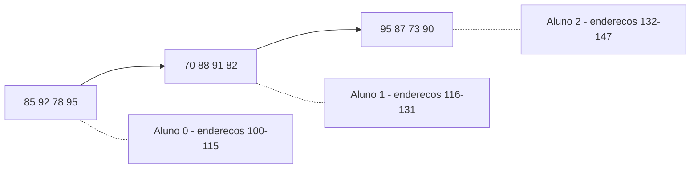
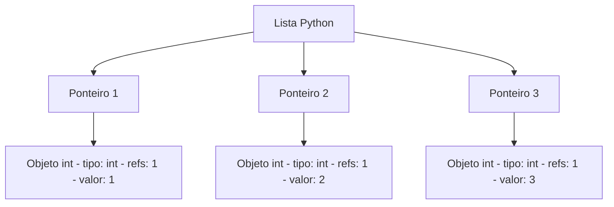

# 7.5 — Arrays: Dados em Sequência na Memória

[← Anterior: Ponteiros](cap07-mod04-ponteiros-conteudo.md) · [Próximo: Listas Encadeadas →](cap07-mod06-listas-conteudo.md)

---

## Introdução

No módulo anterior, você aprendeu sobre ponteiros — variáveis que guardam endereços de outras variáveis. Viu como usar `malloc` para alocar memória dinamicamente, como passar endereços para funções e como a aritmética de ponteiros permite navegar pela memória. No final, até usamos `números[i]` para acessar posições de memória alocada com `malloc`, sem explicar direito por que isso funciona.

Agora vamos entender a estrutura de dados mais fundamental que existe: o **array**. Um array é a forma mais simples e direta de guardar vários valores do mesmo tipo — e é a base sobre a qual quase todas as outras estruturas de dados são construídas. Listas em Python? Por baixo dos panos, são arrays. Vetores em Java? Arrays. Strings em C? Arrays de caracteres.

A beleza do array está na sua simplicidade: os dados ficam **lado a lado na memória**, em posições consecutivas. Isso significa que, sabendo onde o primeiro elemento está, você pode encontrar qualquer outro com uma conta simples. É como uma fileira de casas em uma rua — se você sabe o número da primeira casa e todas têm o mesmo tamanho, pode calcular o número de qualquer casa sem precisar caminhar até lá.

E aqui está a conexão com ponteiros que vai fazer tudo se encaixar: **em C, o nome de um array é um ponteiro para o primeiro elemento**. Arrays e ponteiros estão tão entrelaçados em C que é impossível entender um sem o outro. Este módulo vai mostrar essa relação em profundidade.

---

## Como Executar os Exemplos Deste Módulo

Todos os exemplos deste módulo são programas C completos. Para cada um:

```bash
# Na pasta do capitulo 7
cd ~/meus-projetos/curso/cap07

# Compile com avisos ativados
gcc -Wall programa.c -o programa

# Execute
./programa
```

Exemplos que usam alocação dinâmica incluem `<stdlib.h>`.

---

## A Analogia: A Fileira de Casas Gêmeas

Nos módulos anteriores, comparamos a memória com uma rua cheia de casas numeradas. Cada variável era uma casa individual — podia ter tamanhos diferentes (uma casa de 1 byte para `char`, uma de 4 bytes para `int`, uma de 8 bytes para `double`).

Agora imagine uma **fileira de casas gêmeas** — todas do mesmo tamanho, lado a lado, sem espaço entre elas. Cada casa tem um número sequencial. Se a primeira casa é a número 100 e cada casa ocupa 4 metros de frente, então:

- Casa 0 está no endereço 100
- Casa 1 está no endereço 104
- Casa 2 está no endereço 108
- Casa 3 está no endereço 112

Você não precisa caminhar pela rua para encontrar a casa 3 — basta calcular: `100 + (3 × 4) = 112`. Isso é exatamente o que o computador faz quando você acessa `array[3]`.

| Conceito | Analogia |
|----------|----------|
| Array | Fileira de casas gemeas, todas do mesmo tamanho |
| Elemento | Uma casa individual na fileira |
| Índice | O número da casa na fileira, comecando do 0 |
| Tamanho do array | Quantas casas tem na fileira |
| Endereco base | O número da primeira casa |
| Acesso por índice | Calcular o endereco: base + índice x tamanho |



A grande vantagem dessa organização é a **velocidade de acesso**: não importa se o array tem 5 ou 5 milhões de elementos — acessar qualquer posição leva o mesmo tempo, porque é apenas uma conta matemática. Isso é o que chamamos de **acesso em tempo constante** — ou O(1), como vimos no módulo 5.17 sobre Big O.

---

## Por que Arrays Existem: O Problema que Resolvem

Antes de ver como criar arrays em C, vamos entender o problema que eles resolvem. Imagine que você precisa guardar as notas de 5 alunos:

```c
// SEM array — uma variavel para cada nota
int nota1 = 85;
int nota2 = 92;
int nota3 = 78;
int nota4 = 95;
int nota5 = 88;
```

Funciona para 5 notas. Mas e se forem 100 alunos? Ou 10.000? Você precisaria de 10.000 variáveis com nomes diferentes. E como faria para calcular a média? Precisaria somar todas manualmente:

```c
// Isso e impraticavel para 10.000 notas
int soma = nota1 + nota2 + nota3 + nota4 + nota5;
```

Não dá para usar um loop, porque cada variável tem um nome diferente. Não existe `nota{i}` em C.

Com um array, o problema desaparece:

```c
// COM array — todos os valores em uma unica estrutura
int notas[5] = {85, 92, 78, 95, 88};

// Calcular a media com um loop — funciona para 5 ou 10.000
int soma = 0;
int i;
for (i = 0; i < 5; i++) {
    soma += notas[i];  // Acessa cada nota pelo indice
}
float media = (float)soma / 5;
```

O array resolve três problemas de uma vez:
1. **Organização**: todos os valores relacionados ficam juntos, sob um único nome
2. **Acesso por índice**: você pode acessar qualquer elemento com `notas[i]`
3. **Iteração**: pode percorrer todos os elementos com um loop

Em Python, você já usava listas para isso. A diferença é que em C, o array é muito mais "cru" — ele é literalmente um bloco contíguo de memória, sem nenhuma mágica por trás.

---

## Declarando Arrays em C

A sintaxe para declarar um array em C é:

```c
tipo nome[tamanho];
```

Onde:
- `tipo` é o tipo de cada elemento (`int`, `float`, `char`, etc.)
- `nome` é o nome do array
- `tamanho` é quantos elementos o array comporta (deve ser conhecido na compilação para arrays na stack)

```c
// array_declaracao.c — Formas de declarar arrays
#include <stdio.h>

int main() {
    // Forma 1: declarar e inicializar com valores
    int notas[5] = {85, 92, 78, 95, 88};

    // Forma 2: declarar com tamanho e preencher depois
    int idades[3];
    idades[0] = 20;
    idades[1] = 25;
    idades[2] = 30;

    // Forma 3: inicializar e deixar o compilador contar o tamanho
    int primos[] = {2, 3, 5, 7, 11, 13};
    // O compilador sabe que sao 6 elementos

    // Forma 4: inicializar parcialmente (resto fica zero)
    int parcial[5] = {10, 20};
    // parcial = {10, 20, 0, 0, 0}

    // Forma 5: inicializar tudo com zero
    int zeros[5] = {0};
    // zeros = {0, 0, 0, 0, 0}

    // Imprimir para verificar
    printf("notas:   ");
    int i;
    for (i = 0; i < 5; i++) printf("%d ", notas[i]);
    printf("\n");

    printf("idades:  ");
    for (i = 0; i < 3; i++) printf("%d ", idades[i]);
    printf("\n");

    printf("primos:  ");
    for (i = 0; i < 6; i++) printf("%d ", primos[i]);
    printf("\n");

    printf("parcial: ");
    for (i = 0; i < 5; i++) printf("%d ", parcial[i]);
    printf("\n");

    printf("zeros:   ");
    for (i = 0; i < 5; i++) printf("%d ", zeros[i]);
    printf("\n");

    return 0;
}
```

Saída esperada:
```
notas:   85 92 78 95 88
idades:  20 25 30
primos:  2 3 5 7 11 13
parcial: 10 20 0 0 0
zeros:   0 0 0 0 0
```

### Cuidado: Array Não Inicializado Contém Lixo

Assim como variáveis não inicializadas (módulo 7.3), um array declarado sem inicialização contém **lixo** — valores aleatórios que estavam na memória:

```c
// array_lixo.c — Array nao inicializado contem lixo
#include <stdio.h>

int main() {
    int lixo[5];  // NAO inicializado!

    printf("Valores de lixo (nao inicializado):\n");
    int i;
    for (i = 0; i < 5; i++) {
        printf("  lixo[%d] = %d\n", i, lixo[i]);
    }
    // Os valores serao aleatorios — diferentes a cada execucao

    return 0;
}
```

Saída esperada (valores variam):
```
Valores de lixo (nao inicializado):
  lixo[0] = 32767
  lixo[1] = -1234567
  lixo[2] = 0
  lixo[3] = 4196048
  lixo[4] = 0
```

Regra: **sempre inicialize seus arrays**. Use `= {0}` se quiser tudo zerado.

---

## Índices Começam em Zero: Por Quê?

Se você já programou em Python, sabe que listas começam no índice 0. Em C é a mesma coisa — e agora você vai entender **por quê**.

O índice de um array não é um "número de ordem" — é um **deslocamento** (offset) a partir do início. O primeiro elemento está a 0 posições do início, o segundo está a 1 posição, o terceiro a 2, e assim por diante.

Quando você escreve `notas[3]`, o computador faz esta conta:

```
endereco do elemento = endereco base + (indice × tamanho do tipo)
endereco do elemento = 100 + (3 × 4) = 112
```

Se o índice começasse em 1, a conta precisaria de uma subtração extra: `100 + ((3-1) × 4)`. Começar em 0 elimina essa subtração, tornando o acesso mais eficiente. Pode parecer pouco, mas quando você acessa milhões de elementos por segundo, cada operação conta.



### A Conta na Memória Real

Vamos ver isso acontecendo de verdade:

```c
// indice_zero.c — Por que indices comecam em zero
#include <stdio.h>

int main() {
    int notas[4] = {85, 92, 78, 95};

    printf("Endereco base do array: %p\n", (void*)notas);
    printf("\n");

    int i;
    for (i = 0; i < 4; i++) {
        printf("notas[%d]: valor=%d, endereco=%p, offset=%lu bytes\n",
               i, notas[i], (void*)&notas[i],
               (unsigned long)((char*)&notas[i] - (char*)notas));
    }

    return 0;
}
```

Saída esperada (endereços variam):
```
Endereco base do array: 0x7ffeefbff3e0

notas[0]: valor=85, endereco=0x7ffeefbff3e0, offset=0 bytes
notas[1]: valor=92, endereco=0x7ffeefbff3e4, offset=4 bytes
notas[2]: valor=78, endereco=0x7ffeefbff3e8, offset=8 bytes
notas[3]: valor=95, endereco=0x7ffeefbff3ec, offset=12 bytes
```

Observe: cada elemento está exatamente 4 bytes depois do anterior (porque `int` tem 4 bytes). O endereço do array (`notas`) é o mesmo endereço de `notas[0]` — o nome do array aponta para o primeiro elemento.

---

## Arrays e Ponteiros: A Conexão Fundamental

Aqui está a revelação mais importante deste módulo — e talvez do capítulo inteiro:

**Em C, o nome de um array é um ponteiro para o primeiro elemento.**

Quando você escreve `notas`, o compilador entende como `&notas[0]` — o endereço do primeiro elemento. Isso significa que tudo que você aprendeu sobre ponteiros no módulo 7.4 se aplica diretamente a arrays.

```c
// array_ponteiro.c — Array e ponteiro sao quase a mesma coisa
#include <stdio.h>

int main() {
    int notas[4] = {85, 92, 78, 95};

    // O nome do array E o endereco do primeiro elemento
    printf("notas     = %p\n", (void*)notas);
    printf("&notas[0] = %p\n", (void*)&notas[0]);
    // Sao iguais!

    // Podemos usar um ponteiro para acessar o array
    int *ptr = notas;  // Nao precisa de & — notas ja e um endereco

    printf("\nAcessando via array:\n");
    int i;
    for (i = 0; i < 4; i++) {
        printf("  notas[%d] = %d\n", i, notas[i]);
    }

    printf("\nAcessando via ponteiro:\n");
    for (i = 0; i < 4; i++) {
        printf("  *(ptr+%d) = %d\n", i, *(ptr + i));
    }

    printf("\nAcessando via ponteiro com notacao de array:\n");
    for (i = 0; i < 4; i++) {
        printf("  ptr[%d] = %d\n", i, ptr[i]);
    }

    return 0;
}
```

Saída esperada:
```
notas     = 0x7ffeefbff3e0
&notas[0] = 0x7ffeefbff3e0

Acessando via array:
  notas[0] = 85
  notas[1] = 92
  notas[2] = 78
  notas[3] = 95

Acessando via ponteiro:
  *(ptr+0) = 85
  *(ptr+1) = 92
  *(ptr+2) = 78
  *(ptr+3) = 95

Acessando via ponteiro com notacao de array:
  ptr[0] = 85
  ptr[1] = 92
  ptr[2] = 78
  ptr[3] = 95
```

As três formas de acesso produzem o mesmo resultado. Isso acontece porque:

```
notas[i]  é equivalente a  *(notas + i)
ptr[i]    é equivalente a  *(ptr + i)
```

A notação `[]` é apenas **açúcar sintático** (syntax sugar) — uma forma mais legível de escrever aritmética de ponteiros. Quando o compilador vê `notas[3]`, ele traduz internamente para `*(notas + 3)`.

### A Equivalência Completa

| Notação de array | Notação de ponteiro | Significado |
|-----------------|--------------------|----|
| `notas[0]` | `*notas` ou `*(notas+0)` | Primeiro elemento |
| `notas[1]` | `*(notas+1)` | Segundo elemento |
| `notas[i]` | `*(notas+i)` | Elemento na posição i |
| `&notas[i]` | `notas+i` | Endereco do elemento na posição i |

### A Diferença Sutil: Array vs Ponteiro

Apesar de serem quase intercambiáveis, existe uma diferença importante:

```c
int notas[4] = {85, 92, 78, 95};
int *ptr = notas;

// sizeof mostra a diferenca
printf("sizeof(notas) = %lu\n", sizeof(notas));  // 16 (4 ints × 4 bytes)
printf("sizeof(ptr)   = %lu\n", sizeof(ptr));     // 8 (tamanho de um ponteiro)
```

O `sizeof` de um array retorna o tamanho total do array em bytes. O `sizeof` de um ponteiro retorna o tamanho do ponteiro (8 bytes em 64 bits). Essa diferença é útil para calcular quantos elementos um array tem:

```c
int quantidade = sizeof(notas) / sizeof(notas[0]);  // 16 / 4 = 4
```

Outra diferença: você **não pode reatribuir** um array, mas pode reatribuir um ponteiro:

```c
int a[3] = {1, 2, 3};
int b[3] = {4, 5, 6};
int *ptr = a;

ptr = b;    // OK — ponteiro pode apontar para outro lugar
// a = b;   // ERRO! Nao pode reatribuir um array
```

O array é um endereço fixo — ele sempre aponta para o mesmo bloco de memória. O ponteiro é uma variável que pode mudar para onde aponta.

---

## Percorrendo Arrays com Loops

A operação mais comum com arrays é percorrer todos os elementos — para imprimir, somar, buscar ou transformar. Em C, usamos loops `for`:

```c
// percorrer_array.c — Operacoes basicas com arrays
#include <stdio.h>

int main() {
    int notas[6] = {85, 92, 78, 95, 88, 70};
    int tamanho = 6;

    // 1. Imprimir todos os elementos
    printf("Notas: ");
    int i;
    for (i = 0; i < tamanho; i++) {
        printf("%d ", notas[i]);
    }
    printf("\n");

    // 2. Calcular a soma
    int soma = 0;
    for (i = 0; i < tamanho; i++) {
        soma += notas[i];
    }
    printf("Soma: %d\n", soma);

    // 3. Calcular a media
    float media = (float)soma / tamanho;
    printf("Media: %.1f\n", media);

    // 4. Encontrar o maior valor
    int maior = notas[0];  // Comeca assumindo que o primeiro e o maior
    for (i = 1; i < tamanho; i++) {
        if (notas[i] > maior) {
            maior = notas[i];
        }
    }
    printf("Maior nota: %d\n", maior);

    // 5. Encontrar o menor valor
    int menor = notas[0];
    for (i = 1; i < tamanho; i++) {
        if (notas[i] < menor) {
            menor = notas[i];
        }
    }
    printf("Menor nota: %d\n", menor);

    // 6. Contar quantos estao acima da media
    int acima = 0;
    for (i = 0; i < tamanho; i++) {
        if (notas[i] > media) {
            acima++;
        }
    }
    printf("Acima da media: %d alunos\n", acima);

    return 0;
}
```

Saída esperada:
```
Notas: 85 92 78 95 88 70
Soma: 508
Media: 84.7
Maior nota: 95
Menor nota: 70
Acima da media: 4 alunos
```

### Comparação com Python

Em Python, essas operações são mais concisas graças a funções embutidas:

```python
notas = [85, 92, 78, 95, 88, 70]

print(f"Soma: {sum(notas)}")
print(f"Media: {sum(notas)/len(notas):.1f}")
print(f"Maior: {max(notas)}")
print(f"Menor: {min(notas)}")
```

Em C, não existem `sum()`, `max()`, `min()` ou `len()` para arrays. Você precisa implementar tudo manualmente com loops. Isso é mais trabalhoso, mas te dá controle total sobre o que acontece — e te ensina a pensar algoritmicamente.

Uma diferença crucial: em Python, `len(notas)` retorna o tamanho da lista. Em C, **o array não sabe seu próprio tamanho**. Você precisa guardar o tamanho em uma variável separada e passá-lo junto com o array para qualquer função. Isso é uma fonte constante de bugs em C — e um dos motivos pelos quais linguagens modernas guardam o tamanho junto com o array.

---

## Arrays e Funções

Quando você passa um array para uma função em C, o que é passado é o **endereço do primeiro elemento** — um ponteiro. A função não recebe uma cópia do array (isso seria muito caro para arrays grandes). Ela recebe o endereço e pode acessar (e modificar) os elementos originais.

Isso tem duas consequências importantes:
1. A função **pode modificar** o array original (diferente de `int`, que é copiado)
2. A função **não sabe o tamanho** do array — você precisa passar o tamanho como parâmetro separado

```c
// array_funcao.c — Passando arrays para funcoes
#include <stdio.h>

// Funcao que imprime um array
// "int arr[]" e equivalente a "int *arr"
void imprimir(int arr[], int tamanho) {
    int i;
    for (i = 0; i < tamanho; i++) {
        printf("%d ", arr[i]);
    }
    printf("\n");
}

// Funcao que calcula a soma
int somar(int arr[], int tamanho) {
    int soma = 0;
    int i;
    for (i = 0; i < tamanho; i++) {
        soma += arr[i];
    }
    return soma;
}

// Funcao que MODIFICA o array — dobra cada valor
void dobrar_valores(int arr[], int tamanho) {
    int i;
    for (i = 0; i < tamanho; i++) {
        arr[i] = arr[i] * 2;  // Modifica o array ORIGINAL
    }
}

int main() {
    int notas[5] = {10, 20, 30, 40, 50};

    printf("Original: ");
    imprimir(notas, 5);

    printf("Soma: %d\n", somar(notas, 5));

    dobrar_valores(notas, 5);  // Modifica o array original!
    printf("Dobrado:  ");
    imprimir(notas, 5);

    return 0;
}
```

Saída esperada:
```
Original: 10 20 30 40 50
Soma: 150
Dobrado:  20 40 60 80 100
```

Observe que `dobrar_valores` modificou o array original — não precisou de `&` como fazíamos com variáveis simples no módulo 7.4. Isso porque o nome do array já é um endereço.

### As Duas Formas de Declarar o Parâmetro

Estas duas declarações de função são **idênticas** para o compilador:

```c
void funcao(int arr[], int tamanho);   // Notacao de array
void funcao(int *arr, int tamanho);    // Notacao de ponteiro
```

Ambas recebem um ponteiro para `int`. A notação `int arr[]` é apenas uma forma mais legível de dizer "este parâmetro é um ponteiro para o início de um array". Use a que preferir — neste curso, usaremos `int arr[]` quando o parâmetro é claramente um array, e `int *ptr` quando é um ponteiro genérico.

---

## O Perigo: Acesso Fora dos Limites

Em Python, se você tentar acessar um índice que não existe, recebe um erro claro:

```python
notas = [85, 92, 78]
print(notas[10])  # IndexError: list index out of range
```

Em C, **não existe verificação de limites**. Se você acessar `notas[10]` em um array de 3 elementos, o programa não vai reclamar — vai simplesmente ler ou escrever na memória que está naquela posição, mesmo que não pertença ao array. Isso é um dos bugs mais perigosos em C.

```c
// fora_limites.c — O perigo de acessar fora dos limites
#include <stdio.h>

int main() {
    int notas[3] = {85, 92, 78};
    int segredo = 42;  // Variavel que esta "perto" na memoria

    printf("notas[0] = %d\n", notas[0]);  // 85 — OK
    printf("notas[1] = %d\n", notas[1]);  // 92 — OK
    printf("notas[2] = %d\n", notas[2]);  // 78 — OK

    // PERIGO: acessando fora dos limites!
    printf("notas[3] = %d\n", notas[3]);  // ??? — lixo ou outra variavel
    printf("notas[4] = %d\n", notas[4]);  // ??? — lixo ou outra variavel

    // Pior ainda: ESCREVENDO fora dos limites
    // notas[3] = 999;  // Pode sobrescrever outra variavel!
    // Isso pode corromper dados, travar o programa ou criar bugs impossiveis de encontrar

    printf("\nsegredo = %d\n", segredo);  // Pode ter sido corrompido!

    return 0;
}
```

Saída esperada (valores fora dos limites variam):
```
notas[0] = 85
notas[1] = 92
notas[2] = 78
notas[3] = 32767
notas[4] = 0

segredo = 42
```

### Buffer Overflow: O Bug Mais Famoso da História

Quando um programa escreve além dos limites de um array, isso é chamado de **buffer overflow**. É provavelmente a vulnerabilidade de segurança mais explorada na história da computação. Muitos dos maiores ataques cibernéticos — incluindo o worm Morris (1988), o Code Red (2001) e o Heartbleed (2014) — exploraram buffer overflows em programas C.

O problema é simples: se um programa aloca um array de 100 bytes para guardar uma senha, e o atacante envia uma "senha" de 200 bytes, os 100 bytes extras sobrescrevem memória adjacente. Com cuidado, o atacante pode sobrescrever o endereço de retorno de uma função e fazer o programa executar código malicioso.

É por isso que linguagens modernas como Python, Java e C# verificam os limites dos arrays automaticamente. C não faz isso por design — a verificação custaria performance, e C prioriza velocidade. A responsabilidade fica com o programador.

### Regra de Ouro: Sempre Verifique os Limites

```c
// SEGURO: verificar antes de acessar
if (indice >= 0 && indice < tamanho) {
    printf("notas[%d] = %d\n", indice, notas[indice]);
} else {
    printf("Erro: indice %d fora dos limites (0-%d)\n", indice, tamanho - 1);
}
```

---

## Aritmética de Ponteiros e Arrays

No módulo 7.4, vimos brevemente que somar 1 a um ponteiro avança pelo tamanho do tipo. Agora vamos aprofundar essa relação com arrays, porque é aqui que a aritmética de ponteiros realmente brilha.

### Navegando pelo Array com Ponteiros

```c
// aritmetica_array.c — Percorrendo array com aritmetica de ponteiros
#include <stdio.h>

int main() {
    int notas[5] = {85, 92, 78, 95, 88};
    int *ptr = notas;  // ptr aponta para o primeiro elemento

    printf("Percorrendo com aritmetica de ponteiros:\n");
    int i;
    for (i = 0; i < 5; i++) {
        printf("  *(ptr + %d) = %d  [endereco: %p]\n",
               i, *(ptr + i), (void*)(ptr + i));
    }

    printf("\nPercorrendo movendo o ponteiro:\n");
    ptr = notas;  // Volta ao inicio
    for (i = 0; i < 5; i++) {
        printf("  *ptr = %d  [endereco: %p]\n", *ptr, (void*)ptr);
        ptr++;  // Avanca para o proximo elemento
    }

    return 0;
}
```

Saída esperada (endereços variam):
```
Percorrendo com aritmetica de ponteiros:
  *(ptr + 0) = 85  [endereco: 0x7ffeefbff3d0]
  *(ptr + 1) = 92  [endereco: 0x7ffeefbff3d4]
  *(ptr + 2) = 78  [endereco: 0x7ffeefbff3d8]
  *(ptr + 3) = 95  [endereco: 0x7ffeefbff3dc]
  *(ptr + 4) = 88  [endereco: 0x7ffeefbff3e0]

Percorrendo movendo o ponteiro:
  *ptr = 85  [endereco: 0x7ffeefbff3d0]
  *ptr = 92  [endereco: 0x7ffeefbff3d4]
  *ptr = 78  [endereco: 0x7ffeefbff3d8]
  *ptr = 95  [endereco: 0x7ffeefbff3dc]
  *ptr = 88  [endereco: 0x7ffeefbff3e0]
```

As duas formas produzem o mesmo resultado. A primeira (`*(ptr + i)`) calcula o endereço a cada iteração. A segunda (`ptr++`) move o ponteiro para frente a cada passo. Ambas são idiomáticas em C.

### Operações Válidas com Ponteiros de Array

| Operação | Significado | Exemplo |
|----------|-------------|---------|
| `ptr + n` | Avanca n posições | `ptr + 3` = 4o elemento |
| `ptr - n` | Recua n posições | `ptr - 1` = elemento anterior |
| `ptr++` | Avanca 1 posição | Move para o próximo |
| `ptr--` | Recua 1 posição | Move para o anterior |
| `ptr2 - ptr1` | Distancia entre dois ponteiros | Quantos elementos entre eles |
| `ptr1 < ptr2` | Comparação de ponteiros | ptr1 esta antes de ptr2? |

### Subtração de Ponteiros

Subtrair dois ponteiros que apontam para o mesmo array retorna a **distância em elementos** (não em bytes):

```c
// subtracao_ponteiros.c — Distancia entre ponteiros
#include <stdio.h>

int main() {
    int arr[5] = {10, 20, 30, 40, 50};
    int *inicio = &arr[0];
    int *fim = &arr[4];

    printf("Distancia: %ld elementos\n", fim - inicio);  // 4
    printf("Distancia em bytes: %ld\n",
           (char*)fim - (char*)inicio);  // 16 (4 × 4 bytes)

    return 0;
}
```

Saída esperada:
```
Distancia: 4 elementos
Distancia em bytes: 16
```

---

## Arrays Dinâmicos com malloc

No módulo 7.4, já vimos como alocar memória com `malloc`. Agora vamos formalizar: quando o tamanho do array não é conhecido na compilação (por exemplo, o usuário decide quantos elementos quer), usamos alocação dinâmica.

```c
// array_dinamico.c — Array com tamanho definido pelo usuario
#include <stdio.h>
#include <stdlib.h>

int main() {
    int n;
    printf("Quantas notas voce quer guardar? ");
    scanf("%d", &n);

    // Alocar array dinamicamente
    int *notas = (int*)malloc(n * sizeof(int));
    if (notas == NULL) {
        printf("Erro: nao foi possivel alocar memoria!\n");
        return 1;
    }

    // Preencher
    int i;
    for (i = 0; i < n; i++) {
        printf("Nota %d: ", i + 1);
        scanf("%d", &notas[i]);  // notas[i] funciona com malloc!
    }

    // Calcular media
    int soma = 0;
    for (i = 0; i < n; i++) {
        soma += notas[i];
    }
    float media = (float)soma / n;

    // Imprimir resultado
    printf("\nNotas: ");
    for (i = 0; i < n; i++) {
        printf("%d ", notas[i]);
    }
    printf("\nMedia: %.1f\n", media);

    // Liberar memoria
    free(notas);
    notas = NULL;

    return 0;
}
```

Saída esperada (com entrada do usuário):
```
Quantas notas voce quer guardar? 3
Nota 1: 85
Nota 2: 92
Nota 3: 78

Notas: 85 92 78
Media: 85.0
```

### Array Estático vs Dinâmico

| Caracteristica | Array estático | Array dinâmico com malloc |
|---------------|---------------|--------------------------|
| Declaracao | `int arr[5]` | `int *arr = malloc(5 * sizeof(int))` |
| Tamanho | Fixo na compilação | Definido em tempo de execução |
| Onde vive | Stack | Heap |
| Liberacao | Automática ao sair do escopo | Manual com `free` |
| sizeof | Retorna tamanho total do array | Retorna tamanho do ponteiro (8) |
| Risco | Stack overflow se muito grande | Memory leak se esquecer free |
| Acesso | `arr[i]` | `arr[i]` (identico!) |

A forma de acessar os elementos é idêntica — `arr[i]` funciona tanto para arrays estáticos quanto para memória alocada com `malloc`. Isso acontece porque `arr[i]` é traduzido para `*(arr + i)`, e tanto o nome do array quanto o ponteiro retornado por `malloc` são endereços.

### Redimensionando com realloc

E se você alocou espaço para 5 elementos mas precisa de 10? Em Python, listas crescem automaticamente com `append()`. Em C, você precisa usar `realloc`:

```c
// realloc_exemplo.c — Redimensionando array dinamico
#include <stdio.h>
#include <stdlib.h>

int main() {
    int capacidade = 3;
    int quantidade = 0;

    // Alocar espaco inicial para 3 elementos
    int *numeros = (int*)malloc(capacidade * sizeof(int));
    if (numeros == NULL) {
        printf("Erro ao alocar!\n");
        return 1;
    }

    // Adicionar elementos
    numeros[quantidade++] = 10;  // quantidade vira 1
    numeros[quantidade++] = 20;  // quantidade vira 2
    numeros[quantidade++] = 30;  // quantidade vira 3

    printf("Antes do realloc (capacidade=%d):\n", capacidade);
    int i;
    for (i = 0; i < quantidade; i++) {
        printf("  numeros[%d] = %d\n", i, numeros[i]);
    }

    // Precisamos de mais espaco! Dobrar a capacidade
    capacidade = capacidade * 2;  // 3 -> 6
    int *temp = (int*)realloc(numeros, capacidade * sizeof(int));
    if (temp == NULL) {
        printf("Erro ao realocar!\n");
        free(numeros);  // Liberar o original se realloc falhar
        return 1;
    }
    numeros = temp;  // realloc pode mover o bloco para outro endereco

    // Agora temos espaco para mais elementos
    numeros[quantidade++] = 40;
    numeros[quantidade++] = 50;

    printf("\nDepois do realloc (capacidade=%d):\n", capacidade);
    for (i = 0; i < quantidade; i++) {
        printf("  numeros[%d] = %d\n", i, numeros[i]);
    }

    free(numeros);
    numeros = NULL;

    return 0;
}
```

Saída esperada:
```
Antes do realloc (capacidade=3):
  numeros[0] = 10
  numeros[1] = 20
  numeros[2] = 30

Depois do realloc (capacidade=6):
  numeros[0] = 10
  numeros[1] = 20
  numeros[2] = 30
  numeros[3] = 40
  numeros[4] = 50
```

O `realloc` faz o seguinte:
1. Tenta expandir o bloco atual (se houver espaço livre depois dele)
2. Se não conseguir, aloca um novo bloco maior, copia os dados e libera o antigo
3. Retorna o endereço do bloco (que pode ser diferente do original)
4. Retorna NULL se falhar (o bloco original continua intacto)

Por isso usamos uma variável temporária `temp` — se `realloc` falhar e retornar NULL, não perdemos o ponteiro original.

É exatamente assim que listas em Python funcionam por baixo: quando você faz `append()` e a lista está cheia, Python internamente faz um `realloc` para dobrar a capacidade. Você nunca vê isso acontecer, mas agora sabe o que está por trás.

---

## Strings em C: Arrays de Caracteres

Aqui está uma revelação que conecta tudo: **em C, strings são arrays de `char`**. Não existe um tipo "string" em C como existe em Python. Uma string é simplesmente uma sequência de caracteres terminada por um caractere especial: o **terminador nulo** `'\0'` (valor numérico 0).

```c
// strings_array.c — Strings sao arrays de char
#include <stdio.h>

int main() {
    // Forma 1: string literal — o compilador adiciona '\0' automaticamente
    char nome[] = "Fino";
    // Equivale a: char nome[] = {'F', 'i', 'n', 'o', '\0'};
    // O array tem 5 elementos (4 letras + terminador)

    printf("String: %s\n", nome);
    printf("Tamanho do array: %lu bytes\n", sizeof(nome));  // 5

    // Acessar cada caractere individualmente
    printf("\nCaractere por caractere:\n");
    int i;
    for (i = 0; nome[i] != '\0'; i++) {
        printf("  nome[%d] = '%c' (ASCII %d)\n", i, nome[i], nome[i]);
    }
    printf("  nome[%d] = '\\0' (ASCII %d) — terminador\n", i, nome[i]);

    // Forma 2: declarar com tamanho fixo
    char cidade[20] = "Sao Paulo";
    // Array de 20 bytes, mas so usa 10 (9 letras + '\0')
    printf("\nCidade: %s\n", cidade);
    printf("Tamanho do array: %lu bytes\n", sizeof(cidade));  // 20

    return 0;
}
```

Saída esperada:
```
String: Fino
Tamanho do array: 5 bytes

Caractere por caractere:
  nome[0] = 'F' (ASCII 70)
  nome[1] = 'i' (ASCII 105)
  nome[2] = 'n' (ASCII 110)
  nome[3] = 'o' (ASCII 111)
  nome[4] = '\0' (ASCII 0) — terminador

Cidade: Sao Paulo
Tamanho do array: 20 bytes
```

### Por que o Terminador Nulo Existe?

Em Python, uma string sabe seu próprio tamanho — `len("Fino")` retorna 4. Em C, o array não sabe seu tamanho. Então como funções como `printf` sabem onde a string termina?

A resposta é o terminador `'\0'`. Funções que trabalham com strings em C percorrem o array caractere por caractere até encontrar `'\0'`. Quando encontram, sabem que a string acabou.



Isso tem uma consequência importante: se o terminador for perdido ou sobrescrito, a função vai continuar lendo memória além da string, imprimindo lixo até encontrar um zero por acaso (ou travar). Esse é outro tipo de buffer overflow.

### Lendo Strings do Usuário

```c
// ler_string.c — Lendo strings com fgets
#include <stdio.h>

int main() {
    char nome[50];  // Buffer de 50 caracteres

    printf("Digite seu nome: ");
    fgets(nome, sizeof(nome), stdin);
    // fgets le ate 49 caracteres (deixa espaco para '\0')
    // Tambem inclui o '\n' se o usuario apertou Enter

    printf("Ola, %s", nome);  // nome ja inclui '\n'

    return 0;
}
```

Saída esperada:
```
Digite seu nome: Maria
Ola, Maria
```

Usamos `fgets` em vez de `scanf` para ler strings porque `scanf("%s", nome)` para no primeiro espaço — se o usuário digitar "Maria Silva", `scanf` leria apenas "Maria". Além disso, `fgets` limita a quantidade de caracteres lidos, prevenindo buffer overflow.

### Funções de String: string.h

A biblioteca `<string.h>` fornece funções para manipular strings:

```c
// string_funcoes.c — Funcoes de manipulacao de strings
#include <stdio.h>
#include <string.h>

int main() {
    char nome[50] = "Fino";
    char sobrenome[50] = "Gottardi";
    char completo[100];

    // strlen — comprimento da string (sem contar '\0')
    printf("strlen(nome) = %lu\n", strlen(nome));  // 4

    // strcpy — copiar string
    strcpy(completo, nome);  // completo = "Fino"
    printf("Apos strcpy: %s\n", completo);

    // strcat — concatenar strings
    strcat(completo, " ");        // completo = "Fino "
    strcat(completo, sobrenome);  // completo = "Fino Gottardi"
    printf("Apos strcat: %s\n", completo);

    // strcmp — comparar strings (0 = iguais)
    printf("strcmp(nome, \"Fino\") = %d\n", strcmp(nome, "Fino"));  // 0
    printf("strcmp(nome, \"Ana\") = %d\n", strcmp(nome, "Ana"));    // > 0

    return 0;
}
```

Saída esperada:
```
strlen(nome) = 4
Apos strcpy: Fino
Apos strcat: Fino Gottardi
strcmp(nome, "Fino") = 0
strcmp(nome, "Ana") = 5
```

| Função | O que faz | Equivalente Python |
|--------|-----------|-------------------|
| `strlen(s)` | Comprimento da string | `len(s)` |
| `strcpy(dest, src)` | Copia src para dest | `dest = src` |
| `strcat(dest, src)` | Concatena src ao final de dest | `dest += src` |
| `strcmp(a, b)` | Compara duas strings (0 = iguais) | `a == b` |
| `strncpy(dest, src, n)` | Copia ate n caracteres (mais seguro) | `dest = src[:n]` |

Em Python, strings são imutáveis e operações como concatenação criam novas strings automaticamente. Em C, você trabalha diretamente com o array de caracteres — precisa garantir que o buffer é grande o suficiente antes de copiar ou concatenar.

---

## Arrays Multidimensionais

Até agora, todos os arrays tinham uma dimensão — uma fileira de valores. Mas arrays podem ter duas ou mais dimensões. Um array bidimensional é como uma **tabela** com linhas e colunas:

```c
// array_2d.c — Arrays bidimensionais
#include <stdio.h>

int main() {
    // Tabela de notas: 3 alunos, 4 provas cada
    int notas[3][4] = {
        {85, 92, 78, 95},   // Aluno 0
        {70, 88, 91, 82},   // Aluno 1
        {95, 87, 73, 90}    // Aluno 2
    };

    // Imprimir a tabela
    printf("         P1   P2   P3   P4   Media\n");
    printf("--------------------------------------\n");

    int i, j;
    for (i = 0; i < 3; i++) {
        int soma = 0;
        printf("Aluno %d: ", i);
        for (j = 0; j < 4; j++) {
            printf("%-4d ", notas[i][j]);
            soma += notas[i][j];
        }
        printf(" %.1f\n", (float)soma / 4);
    }

    return 0;
}
```

Saída esperada:
```
         P1   P2   P3   P4   Media
--------------------------------------
Aluno 0: 85   92   78   95    87.5
Aluno 1: 70   88   91   82    82.8
Aluno 2: 95   87   73   90    86.3
```

### Como Arrays 2D Ficam na Memória

Apesar de pensarmos em linhas e colunas, na memória tudo é linear — uma sequência contínua de bytes. Um array `int notas[3][4]` ocupa 48 bytes contíguos (3 × 4 × 4 bytes). As linhas ficam uma após a outra:



O acesso `notas[i][j]` é traduzido para: `*(notas + i * 4 + j)` — o compilador calcula o deslocamento multiplicando a linha pelo número de colunas e somando a coluna.

Para este curso, arrays bidimensionais são suficientes. Arrays com 3 ou mais dimensões existem, mas são raros na prática (exceto em computação científica e processamento de imagens).

---

## Arrays vs Listas em Python: A Comparação Completa

Agora que você entende arrays em C, vamos comparar com as listas que você já conhece de Python. As diferenças são profundas e revelam decisões de design fundamentais de cada linguagem.

| Caracteristica | Array em C | Lista em Python |
|---------------|-----------|----------------|
| Tamanho | Fixo na declaracao ou no malloc | Cresce e diminui automaticamente |
| Tipos | Todos os elementos do mesmo tipo | Pode misturar tipos |
| Sabe o tamanho | Não — você precisa guardar separado | Sim — `len()` retorna o tamanho |
| Verificacao de limites | Não — acesso fora dos limites e silencioso | Sim — `IndexError` se sair dos limites |
| Memória | Contiguos, sem overhead | Cada elemento e um objeto com overhead |
| Performance de acesso | O(1) — cálculo direto do endereco | O(1) — internamente usa array de ponteiros |
| Inserir no meio | O(n) — precisa mover todos os seguintes | O(n) — mesma razao |
| Inserir no final | Não suportado nativamente | O(1) amortizado — `append()` |
| Remover | Não suportado nativamente | O(n) — precisa mover elementos |
| Liberacao de memória | Manual com `free` | Automática pelo garbage collector |

### Por que Python é Mais Lento

Uma lista Python `[1, 2, 3]` não guarda os números diretamente na memória como um array C. Cada elemento é um **objeto Python** completo, com tipo, contador de referências e valor. A lista em si é um array de **ponteiros** para esses objetos.



Em C, o array `int arr[3] = {1, 2, 3}` ocupa apenas 12 bytes (3 × 4). Em Python, a mesma lista ocupa centenas de bytes por causa de todos os objetos e ponteiros intermediários. Essa é a troca: Python é mais conveniente e seguro, C é mais eficiente.

É por isso que bibliotecas como **NumPy** existem em Python — elas usam arrays C por baixo para ter a performance de C com a conveniência de Python. Quando um cientista de dados processa milhões de números, NumPy faz a diferença entre esperar 1 segundo e esperar 1 minuto.

---

## Padrões Comuns com Arrays

Vamos ver alguns padrões que aparecem constantemente quando se trabalha com arrays. Esses padrões são a base de muitos algoritmos que você vai encontrar na carreira.

### Padrão 1: Busca Linear

Procurar um valor percorrendo o array do início ao fim:

```c
// busca_linear.c — Encontrar um valor no array
#include <stdio.h>

// Retorna o indice do valor, ou -1 se nao encontrar
int buscar(int arr[], int tamanho, int valor) {
    int i;
    for (i = 0; i < tamanho; i++) {
        if (arr[i] == valor) {
            return i;  // Encontrou! Retorna o indice
        }
    }
    return -1;  // Nao encontrou
}

int main() {
    int numeros[] = {45, 12, 78, 3, 56, 91, 34};
    int tamanho = 7;

    int pos = buscar(numeros, tamanho, 78);
    if (pos != -1) {
        printf("Valor 78 encontrado na posicao %d\n", pos);
    } else {
        printf("Valor 78 nao encontrado\n");
    }

    pos = buscar(numeros, tamanho, 99);
    if (pos != -1) {
        printf("Valor 99 encontrado na posicao %d\n", pos);
    } else {
        printf("Valor 99 nao encontrado\n");
    }

    return 0;
}
```

Saída esperada:
```
Valor 78 encontrado na posicao 2
Valor 99 nao encontrado
```

A busca linear tem complexidade O(n) — no pior caso, percorre todos os elementos. No módulo 7.10, veremos a busca binária, que é O(log n) mas exige que o array esteja ordenado.

### Padrão 2: Filtrar Elementos

Criar um novo array com apenas os elementos que atendem a uma condição:

```c
// filtrar.c — Filtrar elementos de um array
#include <stdio.h>

int main() {
    int notas[] = {85, 42, 92, 55, 78, 95, 38, 88, 70, 61};
    int tamanho = 10;

    // Contar quantos passaram (nota >= 60)
    int aprovados = 0;
    int i;
    for (i = 0; i < tamanho; i++) {
        if (notas[i] >= 60) {
            aprovados++;
        }
    }

    // Criar array com os aprovados
    int passou[10];  // No maximo 10 aprovados
    int j = 0;
    for (i = 0; i < tamanho; i++) {
        if (notas[i] >= 60) {
            passou[j] = notas[i];
            j++;
        }
    }

    printf("Todas as notas: ");
    for (i = 0; i < tamanho; i++) printf("%d ", notas[i]);
    printf("\n");

    printf("Aprovados (%d): ", aprovados);
    for (i = 0; i < aprovados; i++) printf("%d ", passou[i]);
    printf("\n");

    return 0;
}
```

Saída esperada:
```
Todas as notas: 85 42 92 55 78 95 38 88 70 61
Aprovados (7): 85 92 78 95 88 70 61
```

Em Python, isso seria `[n for n in notas if n >= 60]` — uma linha. Em C, precisamos de dois loops e um array auxiliar. Mais trabalhoso, mas o conceito é o mesmo.

### Padrão 3: Inverter um Array

Trocar o primeiro com o último, o segundo com o penúltimo, e assim por diante:

```c
// inverter.c — Inverter a ordem dos elementos
#include <stdio.h>

void inverter(int arr[], int tamanho) {
    int i;
    for (i = 0; i < tamanho / 2; i++) {
        // Trocar arr[i] com arr[tamanho - 1 - i]
        int temp = arr[i];
        arr[i] = arr[tamanho - 1 - i];
        arr[tamanho - 1 - i] = temp;
    }
}

void imprimir(int arr[], int tamanho) {
    int i;
    for (i = 0; i < tamanho; i++) printf("%d ", arr[i]);
    printf("\n");
}

int main() {
    int numeros[] = {1, 2, 3, 4, 5};

    printf("Original:  ");
    imprimir(numeros, 5);

    inverter(numeros, 5);

    printf("Invertido: ");
    imprimir(numeros, 5);

    return 0;
}
```

Saída esperada:
```
Original:  1 2 3 4 5
Invertido: 5 4 3 2 1
```

Observe que usamos a função `swap` que aprendemos no módulo 7.4 (aqui inline com `temp`). Só precisamos percorrer metade do array — cada troca posiciona dois elementos.

### Padrão 4: Copiar um Array

Em Python, `b = a[:]` cria uma cópia. Em C, atribuição de arrays não funciona — você precisa copiar elemento por elemento:

```c
// copiar.c — Copiando arrays em C
#include <stdio.h>
#include <string.h>

int main() {
    int original[5] = {10, 20, 30, 40, 50};
    int copia[5];

    // Forma 1: loop manual
    int i;
    for (i = 0; i < 5; i++) {
        copia[i] = original[i];
    }

    // Forma 2: memcpy (mais eficiente para arrays grandes)
    int copia2[5];
    memcpy(copia2, original, 5 * sizeof(int));
    // memcpy(destino, origem, quantidade_de_bytes)

    // Verificar que sao copias independentes
    copia[0] = 999;
    printf("original[0] = %d\n", original[0]);  // 10 — nao mudou
    printf("copia[0]    = %d\n", copia[0]);      // 999

    // ERRADO: isso NAO copia o array
    // int outro[5] = original;  // ERRO de compilacao!
    // int *ptr = original;      // Isso cria um PONTEIRO, nao uma copia

    return 0;
}
```

Saída esperada:
```
original[0] = 10
copia[0]    = 999
```

---

## Exemplo Completo: Sistema de Notas

Vamos juntar tudo em um programa mais completo que demonstra os principais conceitos de arrays:

```c
// sistema_notas.c — Sistema completo de gerenciamento de notas
#include <stdio.h>
#include <stdlib.h>

// Imprimir array
void imprimir_notas(int notas[], int n) {
    int i;
    for (i = 0; i < n; i++) {
        printf("%d ", notas[i]);
    }
    printf("\n");
}

// Calcular soma
int calcular_soma(int notas[], int n) {
    int soma = 0;
    int i;
    for (i = 0; i < n; i++) {
        soma += notas[i];
    }
    return soma;
}

// Encontrar maior
int encontrar_maior(int notas[], int n) {
    int maior = notas[0];
    int i;
    for (i = 1; i < n; i++) {
        if (notas[i] > maior) maior = notas[i];
    }
    return maior;
}

// Encontrar menor
int encontrar_menor(int notas[], int n) {
    int menor = notas[0];
    int i;
    for (i = 1; i < n; i++) {
        if (notas[i] < menor) menor = notas[i];
    }
    return menor;
}

// Contar aprovados (nota >= 60)
int contar_aprovados(int notas[], int n) {
    int count = 0;
    int i;
    for (i = 0; i < n; i++) {
        if (notas[i] >= 60) count++;
    }
    return count;
}

// Buscar nota
int buscar_nota(int notas[], int n, int valor) {
    int i;
    for (i = 0; i < n; i++) {
        if (notas[i] == valor) return i;
    }
    return -1;
}

int main() {
    int n;
    printf("=== Sistema de Notas ===\n\n");
    printf("Quantos alunos? ");
    scanf("%d", &n);

    if (n <= 0) {
        printf("Numero invalido!\n");
        return 1;
    }

    // Alocar array dinamicamente
    int *notas = (int*)malloc(n * sizeof(int));
    if (notas == NULL) {
        printf("Erro ao alocar memoria!\n");
        return 1;
    }

    // Ler notas
    int i;
    for (i = 0; i < n; i++) {
        printf("Nota do aluno %d: ", i + 1);
        scanf("%d", &notas[i]);
    }

    // Relatorio
    printf("\n=== Relatorio ===\n");
    printf("Notas: ");
    imprimir_notas(notas, n);

    int soma = calcular_soma(notas, n);
    float media = (float)soma / n;
    int maior = encontrar_maior(notas, n);
    int menor = encontrar_menor(notas, n);
    int aprovados = contar_aprovados(notas, n);

    printf("Soma:      %d\n", soma);
    printf("Media:     %.1f\n", media);
    printf("Maior:     %d\n", maior);
    printf("Menor:     %d\n", menor);
    printf("Amplitude: %d\n", maior - menor);
    printf("Aprovados: %d de %d (%.0f%%)\n",
           aprovados, n, (float)aprovados / n * 100);

    // Buscar uma nota especifica
    printf("\nBuscar nota: ");
    int busca;
    scanf("%d", &busca);
    int pos = buscar_nota(notas, n, busca);
    if (pos != -1) {
        printf("Nota %d encontrada — aluno %d\n", busca, pos + 1);
    } else {
        printf("Nota %d nao encontrada\n", busca);
    }

    // Liberar memoria
    free(notas);
    notas = NULL;
    printf("\nMemoria liberada. Programa encerrado.\n");

    return 0;
}
```

Saída esperada (com entrada do usuário):
```
=== Sistema de Notas ===

Quantos alunos? 5
Nota do aluno 1: 85
Nota do aluno 2: 42
Nota do aluno 3: 92
Nota do aluno 4: 78
Nota do aluno 5: 55

=== Relatorio ===
Notas: 85 42 92 78 55
Soma:      352
Media:     70.4
Maior:     92
Menor:     42
Amplitude: 50
Aprovados: 3 de 5 (60%)

Buscar nota: 78
Nota 78 encontrada — aluno 4

Memoria liberada. Programa encerrado.
```

Este programa demonstra:
- Alocação dinâmica com `malloc`
- Passagem de arrays para funções
- Padrões de busca, soma, máximo, mínimo e contagem
- Liberação de memória com `free`
- Interação com o usuário via `scanf`

---

## Limitações dos Arrays: Por que Precisamos de Outras Estruturas

Arrays são poderosos, mas têm limitações fundamentais que motivam a existência de outras estruturas de dados — que veremos nos próximos módulos.

### Limitação 1: Tamanho Fixo (ou Caro de Mudar)

Um array estático tem tamanho fixo na compilação. Um array dinâmico pode ser redimensionado com `realloc`, mas isso pode envolver copiar todos os elementos para um novo bloco — uma operação O(n).

### Limitação 2: Inserir e Remover no Meio é Caro

Se você quer inserir um elemento na posição 3 de um array de 10 elementos, precisa mover todos os elementos da posição 3 em diante uma posição para frente. Isso é O(n):

```c
// inserir_meio.c — O custo de inserir no meio de um array
#include <stdio.h>

void imprimir(int arr[], int n) {
    int i;
    for (i = 0; i < n; i++) printf("%d ", arr[i]);
    printf("\n");
}

int main() {
    int arr[10] = {10, 20, 30, 40, 50};
    int tamanho = 5;

    printf("Antes:  ");
    imprimir(arr, tamanho);

    // Inserir 25 na posicao 2
    int posicao = 2;
    int valor = 25;

    // Mover todos os elementos da posicao 2 em diante para a direita
    int i;
    for (i = tamanho; i > posicao; i--) {
        arr[i] = arr[i - 1];  // Move cada elemento uma posicao para frente
    }
    arr[posicao] = valor;
    tamanho++;

    printf("Depois: ");
    imprimir(arr, tamanho);

    return 0;
}
```

Saída esperada:
```
Antes:  10 20 30 40 50
Depois: 10 20 25 30 40 50
```

Para inserir um único elemento, precisamos mover todos os seguintes. Em um array de 1 milhão de elementos, inserir no início significa mover 1 milhão de elementos. Isso é inaceitável para muitas aplicações.

### Limitação 3: Todos os Elementos do Mesmo Tipo

Em C, um array de `int` só pode guardar `int`. Não dá para misturar tipos como em Python (`[1, "texto", 3.14]`). Para guardar dados heterogêneos, precisamos de structs (que veremos no módulo 7.6).

### O que Vem a Seguir

Essas limitações motivam as estruturas que veremos nos próximos módulos:

| Limitacao do array | Estrutura que resolve | Módulo |
|-------------------|----------------------|--------|
| Inserir e remover no meio e caro | Lista encadeada | 7.6 |
| Inserir e remover no inicio e caro | Fila e Pilha | 7.7 e 7.8 |
| Busca por valor e O(n) | Dicionário e tabela hash | 7.9 |
| Busca em array ordenado e O(n) | Busca binaria | 7.10 |

Cada estrutura resolve um problema específico que arrays não resolvem bem. Mas arrays continuam sendo a base — listas encadeadas usam ponteiros (módulo 7.4), filas e pilhas podem ser implementadas com arrays, e tabelas hash usam arrays internamente.

---

## Como a IA pode te ajudar aqui
**Prompt 1 — Ver exemplos práticos:**
> "Mostre passo a passo o que acontece na memória quando eu crio um array de 5 inteiros e acesso o elemento [3]"

**Prompt 2 — Aprofundar o tema:**
> "Esse código tem acesso fora dos limites do array? Onde?"

**Prompt 3 — Comparar alternativas:**
> "Converta este código Python que usa listas para C usando arrays, explicando cada diferença"

---

## Casos de Uso no Mundo Real

### 1. Processamento de Imagens

Toda imagem digital é um array. Uma foto de 1920×1080 pixels é um array bidimensional com 2.073.600 posições. Cada posição guarda 3 valores (vermelho, verde, azul) — totalizando mais de 6 milhões de números. Quando você aplica um filtro no Instagram ou ajusta o brilho de uma foto, o programa percorre esse array gigante e modifica cada valor. Bibliotecas como OpenCV (usada em visão computacional, carros autônomos e reconhecimento facial) trabalham com arrays de pixels em C/C++ para ter a performance necessária — processar 30 frames por segundo de vídeo em alta resolução exige que cada acesso ao array seja o mais rápido possível.

### 2. Planilhas e Bancos de Dados

Quando você abre uma planilha no Excel ou Google Sheets, cada coluna é essencialmente um array. Uma coluna com 10.000 linhas de vendas é um array de 10.000 números. Calcular a soma, média ou encontrar o maior valor são exatamente as operações que fizemos neste módulo. Bancos de dados como SQLite (que você vai usar no capítulo 8) armazenam tabelas como arrays de registros em disco — e usam arrays em memória para índices que aceleram as buscas. A operação `SELECT * FROM vendas WHERE valor > 1000` é, no fundo, uma busca linear em um array.

### 3. Áudio Digital e Streaming de Música

Quando você ouve música no Spotify ou YouTube Music, o áudio chega ao seu dispositivo como um array de números. Cada número representa a amplitude do som em um instante — e são 44.100 números por segundo para qualidade de CD (44.1 kHz). Uma música de 3 minutos tem quase 8 milhões de amostras. O player de áudio percorre esse array e envia cada valor para a placa de som, que converte os números em vibrações no alto-falante. Efeitos como equalização, reverb e compressão são operações matemáticas aplicadas a cada elemento do array — exatamente como fizemos com `dobrar_valores()` neste módulo, mas em escala muito maior.

---

## Resumo do Módulo

| Conceito | Definição |
|----------|-----------|
| Array | Coleção de elementos do mesmo tipo, contiguos na memória |
| Índice | Posição de um elemento no array, comecando em 0 |
| Acesso O(1) | Qualquer elemento acessado em tempo constante via cálculo de endereco |
| Nome do array | Ponteiro para o primeiro elemento |
| `arr[i]` | Equivalente a `*(arr + i)` — acucar sintático |
| Array estático | Tamanho fixo na compilação, vive na stack |
| Array dinâmico | Alocado com malloc, tamanho definido em tempo de execução |
| realloc | Redimensiona um bloco alocado com malloc |
| Buffer overflow | Acesso além dos limites do array — bug de segurança |
| String em C | Array de char terminado por `'\0'` |
| strlen | Retorna o comprimento de uma string sem contar o terminador |
| memcpy | Copia blocos de memória — útil para copiar arrays |
| Array 2D | Array de arrays — representa tabelas com linhas e colunas |
| Busca linear | Percorrer o array do inicio ao fim procurando um valor — O(n) |

---

## Glossário do Módulo

| Termo | Definição |
|-------|-----------|
| Array | Estrutura de dados que armazena elementos do mesmo tipo em posições contiguos de memória |
| Base address | Endereco base — endereco do primeiro elemento do array |
| Buffer | Regiao de memória usada para armazenar dados temporariamente |
| Buffer overflow | Escrita além dos limites de um buffer, causando corrupcao de memória |
| Contiguous | Contiguos — elementos armazenados lado a lado na memória, sem espacos |
| Element | Elemento — cada valor individual armazenado no array |
| fgets | Função que le uma linha de texto do teclado de forma segura |
| Index | Índice — posição de um elemento no array, comecando em zero |
| Linear search | Busca linear — percorrer todos os elementos ate encontrar o desejado |
| memcpy | Função que copia um bloco de bytes de uma posição para outra na memória |
| Multidimensional array | Array com mais de uma dimensao, como uma tabela de linhas e colunas |
| Null terminator | Terminador nulo — caractere `'\0'` que marca o fim de uma string em C |
| Offset | Deslocamento — distancia em bytes ou elementos a partir do inicio |
| O(1) | Complexidade constante — tempo de execução não depende do tamanho da entrada |
| O(n) | Complexidade linear — tempo de execução cresce proporcionalmente ao tamanho |
| realloc | Função que redimensiona um bloco de memória alocado com malloc |
| sizeof | Operador que retorna o tamanho em bytes de um tipo ou variável |
| strcat | Função que concatena duas strings |
| strcmp | Função que compara duas strings lexicograficamente |
| strcpy | Função que copia uma string para outra |
| string.h | Biblioteca padrão de C com funções para manipulação de strings |
| strlen | Função que retorna o comprimento de uma string sem contar o terminador nulo |
| Syntax sugar | Acucar sintático — notação mais legivel que o compilador traduz para outra forma |

---

## Na Cultura Popular

- **Matrix** (filme, 1999) — A Matrix em si pode ser pensada como um array multidimensional gigante. Cada ponto no espaço virtual tem coordenadas (x, y, z) — como um array 3D. Quando Neo começa a "ver o código" da Matrix, ele está essencialmente visualizando os dados brutos do array que compõe a realidade simulada. E o famoso efeito "bullet time" (câmera girando em torno de uma bala) foi criado com arrays de imagens capturadas por dezenas de câmeras posicionadas em sequência — cada câmera contribuiu com um frame no array.

- **O Jogo da Imitacao** (filme, 2014) — A máquina Enigma que Alan Turing tentava quebrar usava rotores que funcionavam como arrays circulares. Cada rotor tinha 26 posições (uma para cada letra), e a combinação dos rotores criava um mapeamento de letras. Turing precisou entender a estrutura desses "arrays mecânicos" para construir a máquina que decifrou o código nazista. O conceito de percorrer todas as combinações possíveis é essencialmente uma busca em um array multidimensional.

- **Minecraft** (jogo, 2011) — O mundo do Minecraft é um array tridimensional gigante de blocos. Cada bloco tem uma posição (x, y, z) e um tipo (terra, pedra, água, ar). Quando você quebra ou coloca um bloco, o jogo modifica um elemento nesse array 3D. O mundo "infinito" do Minecraft é possível porque o jogo carrega apenas os chunks (pedaços de 16×16×256 blocos) próximos ao jogador — arrays parciais carregados sob demanda, exatamente como um programa que usa `malloc` para alocar apenas a memória que precisa.

---

## Para Saber Mais

- [Visualgo — Sorting and Arrays](https://visualgo.net/en/sorting) — *Visualização animada de operações em arrays e algoritmos de ordenação — veja como elementos se movem na memória*

- [CS50 — Arrays (Harvard)](https://cs50.harvard.edu/x/) — *As aulas do CS50 sobre arrays em C são excelentes, com demonstracoes visuais de como arrays funcionam na memória*

- [Learn C — Arrays](https://www.learn-c.org/en/Arrays) — *Tutorial interativo de arrays em C que roda no navegador — pratique sem precisar compilar*

- [Data Structure Visualizations — Array](https://www.cs.usfca.edu/~galles/visualization/Algorithms.html) — *Visualizacoes interativas de operações em arrays: inserção, remoção, busca e ordenação*

- [Programação Descomplicada — Arrays em C](https://www.youtube.com/@progdescomplicada) — *Canal brasileiro com explicacoes claras sobre arrays, strings e manipulação de memória em C*

---

## Perguntas Frequentes (FAQ)

**P: Qual a diferença entre array e lista?**
R: Em C, "array" é a estrutura nativa — um bloco contíguo de memória com tamanho fixo. Em Python, "lista" é uma estrutura mais sofisticada que cresce automaticamente, aceita tipos mistos e verifica limites. Por baixo, listas Python usam arrays C internamente. No módulo 7.6, veremos "listas encadeadas" — uma estrutura completamente diferente onde cada elemento aponta para o próximo via ponteiro.

**P: Por que os índices começam em 0 e não em 1?**
R: Porque o índice é um deslocamento (offset) a partir do início do array. O primeiro elemento está a 0 posições do início. Isso simplifica o cálculo de endereço: `endereco = base + índice × tamanho`. Se começasse em 1, precisaria de uma subtração extra. Quase todas as linguagens modernas seguem essa convenção (Python, Java, C#, JavaScript, Go, Rust).

**P: O que acontece se eu declarar um array muito grande na stack?**
R: A stack tem tamanho limitado (geralmente 1-8 MB). Se você declarar `int arr[10000000]` (40 MB), o programa trava com "stack overflow". Para arrays grandes, use `malloc` — o heap é muito maior (limitado pela RAM disponível). Regra prática: arrays acima de alguns KB devem ir para o heap.

**P: Posso retornar um array de uma função?**
R: Não diretamente. Se você declarar um array local e retornar seu endereço, a memória será liberada quando a função terminar (o mesmo problema do módulo 7.4). A solução é alocar com `malloc` dentro da função e retornar o ponteiro — quem chamou a função fica responsável pelo `free`.

**P: Como sei o tamanho de um array dentro de uma função?**
R: Não tem como saber — quando um array é passado para uma função, ele "decai" para um ponteiro, e `sizeof` retorna o tamanho do ponteiro (8 bytes), não do array. Por isso, em C, sempre passamos o tamanho como parâmetro separado. Essa é uma das maiores fontes de bugs em C e um dos motivos pelos quais linguagens modernas guardam o tamanho junto com o array.

**P: `char nome[20] = "Fino"` desperdiça 15 bytes?**
R: Tecnicamente sim — 15 bytes ficam sem uso. Mas na prática, isso é intencional: você aloca espaço suficiente para o maior valor possível. Se o nome pode ter até 19 caracteres (+ terminador), declarar `char nome[20]` é correto. O desperdício de alguns bytes é preferível ao risco de buffer overflow.

**P: Posso usar índices negativos como em Python?**
R: Em Python, `arr[-1]` acessa o último elemento. Em C, `arr[-1]` acessa a memória antes do início do array — comportamento indefinido. C não tem índices negativos. Para acessar o último elemento, use `arr[tamanho - 1]`.

**P: realloc pode falhar? O que acontece com os dados?**
R: Sim, `realloc` pode retornar NULL se não conseguir alocar o novo tamanho. Nesse caso, o bloco original permanece intacto — seus dados não são perdidos. Por isso usamos uma variável temporária: `int *temp = realloc(ptr, novo_tamanho)`. Se `temp` for NULL, `ptr` ainda aponta para os dados originais.

**P: Qual a diferença entre `memcpy` e `strcpy`?**
R: `memcpy` copia uma quantidade fixa de bytes — funciona para qualquer tipo de dado (arrays de int, float, structs). `strcpy` copia caracteres até encontrar `'\0'` — funciona apenas para strings. Use `memcpy` para arrays genéricos e `strcpy` (ou `strncpy`) para strings.

**P: Arrays em C são passados por valor ou por referência?**
R: Tecnicamente, por valor — mas o "valor" é o endereço do primeiro elemento (um ponteiro). Então, na prática, a função recebe acesso direto ao array original e pode modificá-lo. É por isso que não precisamos de `&` ao passar arrays para funções — o nome do array já é um endereço.

**P: Por que C não verifica os limites do array automaticamente?**
R: Por performance. Verificar limites a cada acesso adicionaria uma comparação e um branch condicional — em loops que acessam milhões de elementos, isso faz diferença. C foi projetada para sistemas operacionais e software de baixo nível, onde cada ciclo de CPU conta. Linguagens como Rust resolvem isso de forma inteligente: verificam limites em tempo de compilação quando possível, e em tempo de execução apenas quando necessário.

**P: O que é um "array de ponteiros"?**
R: É um array onde cada elemento é um ponteiro. Por exemplo, `char *nomes[3]` é um array de 3 ponteiros para char — cada ponteiro pode apontar para uma string diferente. Isso é como listas Python usam internamente: um array de ponteiros para objetos. Veremos isso em mais detalhes nos próximos módulos.

---

## Exercícios Práticos

### Exercício 1 — Array Básico

Crie um programa que declare um array de 7 inteiros com os dias da semana em número (1 a 7), imprima todos usando um loop, e depois imprima na ordem inversa.

### Exercício 2 — Estatísticas

Peça ao usuário 10 números, guarde em um array alocado com `malloc`, e calcule: soma, média, maior, menor e amplitude (maior - menor). Libere a memória no final.

### Exercício 3 — Busca e Contagem

Crie um array com 15 números pré-definidos. Peça ao usuário um valor para buscar. Imprima em qual posição o valor foi encontrado (ou que não existe), e quantas vezes ele aparece no array.

---

[← Anterior: Ponteiros](cap07-mod04-ponteiros-conteudo.md) · [Próximo: Listas Encadeadas →](cap07-mod06-listas-conteudo.md)
