# 7.6 — Listas Encadeadas: A Base das Estruturas Dinâmicas

[← Anterior: Arrays](cap07-mod05-arrays-conteudo.md) · [Próximo: Filas →](cap07-mod07-filas-conteudo.md)

---

## Introdução

No módulo anterior, você aprendeu sobre arrays — a estrutura de dados mais fundamental que existe. Viu que arrays guardam elementos lado a lado na memória, que o acesso por índice é instantâneo (O(1)) e que strings em C são arrays de caracteres. Mas também viu as limitações: inserir ou remover no meio de um array é caro (O(n)), porque todos os elementos seguintes precisam ser movidos. E o tamanho é fixo — ou você define na compilação, ou precisa usar `realloc` para redimensionar, o que pode copiar tudo para outro lugar.

Agora imagine uma situação real: você está construindo um sistema de atendimento em um hospital. Pacientes chegam, são atendidos e vão embora. Novos pacientes podem ter prioridade e precisam entrar no meio da fila. Pacientes desistem e saem da fila. O número de pacientes muda o tempo todo — pode ser 3 de madrugada e 200 no horário de pico. Se você usar um array para isso, cada inserção no meio exige mover dezenas ou centenas de elementos. Cada remoção também. E o tamanho? Alocar espaço para 200 pacientes quando só tem 3 é desperdício. Alocar para 50 e precisar de 200 exige `realloc`.

Precisa existir uma forma melhor. E existe: a **lista encadeada** (em inglês, *linked list*).

A ideia é radicalmente diferente de um array. Em vez de guardar todos os elementos lado a lado na memória, cada elemento fica em qualquer lugar da memória e contém um **ponteiro** para o próximo elemento. É como uma corrente — cada elo sabe onde está o próximo elo, mas os elos não precisam estar fisicamente próximos.

Essa é a primeira estrutura de dados verdadeiramente dinâmica que você vai aprender. E ela é a base de quase tudo que vem depois: filas (módulo 7.7), pilhas (módulo 7.8) e até partes internas de dicionários (módulo 7.9) usam conceitos de listas encadeadas. Entender listas encadeadas é entender como dados podem ser organizados de forma flexível na memória.

---

## Como Executar os Exemplos Deste Módulo

Todos os exemplos deste módulo são programas C completos. Para cada um:

```bash
# Na pasta do capitulo 7
cd ~/meus-projetos/curso/cap07

# Compile com avisos ativados
gcc -Wall programa.c -o programa

# Execute
./programa
```

Todos os exemplos usam `malloc` e `free`, então incluem `<stdlib.h>`.

---

## A Analogia: A Caça ao Tesouro

Nos módulos anteriores, comparamos arrays com uma fileira de casas gêmeas — todas lado a lado, do mesmo tamanho, em sequência. Para encontrar a casa 5, você calcula o endereço direto.

Agora imagine uma **caça ao tesouro**. Você recebe um papel com o endereço da primeira pista. Vai até lá e encontra dois coisas: a pista em si (o dado) e outro papel com o endereço da próxima pista. Vai até a próxima pista e encontra a mesma coisa: o dado e o endereço da seguinte. E assim por diante, até encontrar uma pista que diz "fim — não há próxima".

As pistas não precisam estar em ordem na cidade. A primeira pode estar no centro, a segunda no bairro norte, a terceira no sul. Não importa onde cada uma está fisicamente — o que importa é que cada pista sabe onde está a próxima.

Essa é exatamente a ideia de uma lista encadeada:

| Conceito | Analogia da caca ao tesouro |
|----------|----------------------------|
| No (node) | Uma pista na caca ao tesouro |
| Dado do no | A informação escrita na pista |
| Ponteiro next | O papel com o endereco da próxima pista |
| Head (cabeca) | O endereco da primeira pista, que você recebe no inicio |
| NULL no final | A última pista diz "fim, não ha próxima" |
| Lista vazia | Você recebe um papel em branco — não ha nenhuma pista |

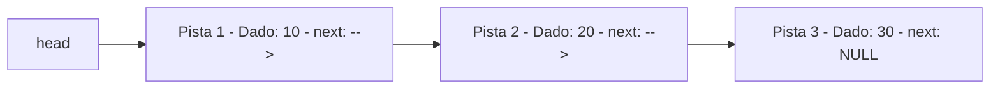

A diferença fundamental em relação ao array:

- No **array**, você sabe onde está qualquer elemento com um cálculo direto (endereço base + índice × tamanho). É como uma rua com casas numeradas — para ir à casa 50, você calcula o endereço e vai direto.
- Na **lista encadeada**, para chegar ao elemento 50, você precisa seguir 50 ponteiros, um por um, começando do primeiro. É como a caça ao tesouro — não tem atalho, você precisa seguir cada pista na ordem.

Isso parece pior, certo? E para acesso por posição, é pior mesmo. Mas a lista encadeada brilha em outro cenário: **inserir e remover elementos**. Para inserir uma nova pista entre a pista 2 e a pista 3, basta mudar dois papéis de endereço — não precisa mover nenhuma pista de lugar. Em um array, inserir no meio exige mover todos os elementos seguintes.

---

## A História: De Onde Vieram as Listas Encadeadas

Listas encadeadas não são uma invenção recente. Elas foram criadas em **1955-1956** por Allen Newell, Cliff Shaw e Herbert Simon, pesquisadores da RAND Corporation e da Carnegie Mellon University. Eles estavam trabalhando em um programa chamado **Logic Theorist** — considerado por muitos o primeiro programa de inteligência artificial da história.

O problema que enfrentavam era: como representar expressões lógicas que podiam crescer e mudar de forma durante a execução do programa? Arrays não serviam — o tamanho era fixo e inserir no meio era impraticável. Eles precisavam de uma estrutura que pudesse crescer e encolher dinamicamente, onde elementos pudessem ser adicionados e removidos em qualquer posição de forma eficiente.

A solução foi a lista encadeada: cada elemento guarda um ponteiro para o próximo. Eles implementaram isso na linguagem **IPL** (Information Processing Language), que foi uma das primeiras linguagens a suportar manipulação dinâmica de memória.

Pouco depois, em **1958**, a linguagem **LISP** (criada por John McCarthy no MIT) adotou listas encadeadas como sua estrutura de dados fundamental. O próprio nome LISP vem de "LISt Processing" — processamento de listas. Em LISP, tudo é uma lista: código, dados, funções. Essa decisão de design influenciou décadas de linguagens de programação.

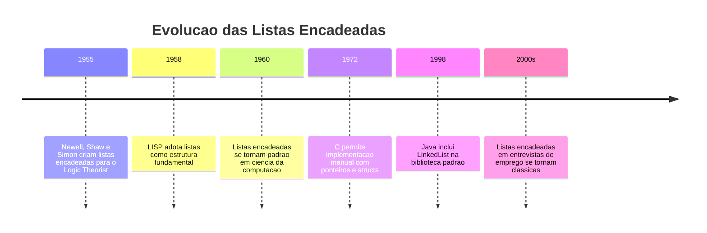

Hoje, listas encadeadas são ensinadas em todo curso de ciência da computação e são uma das perguntas mais comuns em entrevistas técnicas de empresas como Google, Amazon e Meta. Não porque sejam usadas diretamente no dia a dia (na maioria dos casos, arrays e suas variantes são mais eficientes), mas porque entender listas encadeadas demonstra que você compreende ponteiros, alocação de memória e raciocínio sobre estruturas de dados.

---

## O Conceito: Nó e Ponteiro

Uma lista encadeada é composta por **nós** (em inglês, *nodes*). Cada nó contém duas coisas:

1. **O dado** — o valor que queremos guardar (um número, um nome, qualquer coisa)
2. **Um ponteiro para o próximo nó** — o endereço de memória do nó seguinte

O último nó da lista tem o ponteiro `next` apontando para `NULL` — isso indica que não há próximo, a lista acabou.

E a lista em si? É apenas um ponteiro para o primeiro nó, chamado de **head** (cabeça). Se `head` é `NULL`, a lista está vazia.

Vamos visualizar uma lista com os valores 10, 20 e 30:

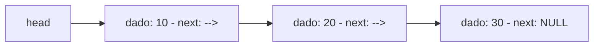

Cada caixa é um nó. O `head` aponta para o primeiro nó (dado 10). Esse nó aponta para o segundo (dado 20), que aponta para o terceiro (dado 30), que aponta para `NULL`.

Compare com um array:

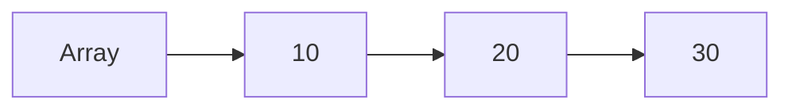

No array, os três valores estão lado a lado na memória — posições consecutivas. Na lista encadeada, cada nó pode estar em qualquer lugar da memória. O nó com 10 pode estar no endereço 1000, o nó com 20 no endereço 5000 e o nó com 30 no endereço 2000. Não importa — os ponteiros conectam tudo.

### A Diferença na Memória

Vamos ver como cada estrutura fica na memória real:

**Array `int arr[3] = {10, 20, 30}`:**

| Endereco | Conteúdo | O que e |
|----------|----------|---------|
| 1000 | 10 | arr[0] |
| 1004 | 20 | arr[1] |
| 1008 | 30 | arr[2] |

Total: 12 bytes, todos contíguos.

**Lista encadeada com 10, 20, 30:**

| Endereco | Conteúdo | O que e |
|----------|----------|---------|
| 2000 | 10 | dado do no 1 |
| 2004 | 5000 | ponteiro next do no 1 (aponta para no 2) |
| 5000 | 20 | dado do no 2 |
| 5004 | 3000 | ponteiro next do no 2 (aponta para no 3) |
| 3000 | 30 | dado do no 3 |
| 3004 | 0 (NULL) | ponteiro next do no 3 (fim da lista) |

Total: 24 bytes (em um sistema de 32 bits) ou 48 bytes (em 64 bits, onde ponteiros ocupam 8 bytes), espalhados pela memória.

A lista encadeada usa mais memória que o array — cada nó precisa guardar o dado E o ponteiro. Para 3 inteiros, o array usa 12 bytes e a lista usa pelo menos 24. Esse é o custo da flexibilidade. Mas quando o benefício de inserir e remover rapidamente supera o custo de memória extra, a lista encadeada vale a pena.

---

## Structs em C: Criando Tipos Compostos

Antes de implementar uma lista encadeada, precisamos aprender um conceito novo em C: **structs**. Uma struct (abreviação de *structure*, estrutura) permite criar um tipo de dado que agrupa vários valores diferentes em uma única unidade.

Até agora, cada variável em C guardava um único valor: um `int`, um `float`, um `char`. Mas e se você quiser representar um aluno com nome, idade e nota? Precisaria de três variáveis separadas. E se tiver 100 alunos? 300 variáveis? Isso é impraticável.

Structs resolvem esse problema: você define um tipo que contém vários campos, e depois cria variáveis desse tipo.

```c
// struct_basico.c — Primeiro exemplo de struct
#include <stdio.h>

// Definir um novo tipo chamado "Aluno"
struct Aluno {
    char nome[50];   // campo: nome do aluno
    int idade;       // campo: idade do aluno
    float nota;      // campo: nota do aluno
};

int main() {
    // Criar uma variavel do tipo struct Aluno
    struct Aluno a1;

    // Preencher os campos usando o operador ponto (.)
    // strcpy para strings — nao da para usar = com arrays
    #include <string.h>  // Normalmente no topo, aqui para clareza
    strcpy(a1.nome, "Maria");
    a1.idade = 20;
    a1.nota = 8.5;

    // Acessar os campos
    printf("Nome:  %s\n", a1.nome);
    printf("Idade: %d\n", a1.idade);
    printf("Nota:  %.1f\n", a1.nota);

    return 0;
}
```

Saída esperada:
```
Nome:  Maria
Idade: 20
Nota:  8.5
```

Vamos corrigir o exemplo acima para seguir a boa prática de colocar todos os `#include` no topo:

```c
// struct_correto.c — Struct com includes no topo
#include <stdio.h>
#include <string.h>

struct Aluno {
    char nome[50];
    int idade;
    float nota;
};

int main() {
    struct Aluno a1;
    strcpy(a1.nome, "Maria");
    a1.idade = 20;
    a1.nota = 8.5;

    printf("Nome: %s, Idade: %d, Nota: %.1f\n",
           a1.nome, a1.idade, a1.nota);

    // Inicializar na declaracao
    struct Aluno a2 = {"Carlos", 22, 7.3};
    printf("Nome: %s, Idade: %d, Nota: %.1f\n",
           a2.nome, a2.idade, a2.nota);

    return 0;
}
```

Saída esperada:
```
Nome: Maria, Idade: 20, Nota: 8.5
Nome: Carlos, Idade: 22, Nota: 7.3
```

### O Operador Ponto e o Operador Seta

Para acessar campos de uma struct, usamos o operador ponto (`.`):

```c
a1.idade = 20;       // acessa o campo "idade" da variavel a1
printf("%d", a1.idade);
```

Mas quando temos um **ponteiro** para uma struct, usamos o operador seta (`->`):

```c
// struct_ponteiro.c — Operador seta com ponteiros para struct
#include <stdio.h>
#include <string.h>
#include <stdlib.h>

struct Aluno {
    char nome[50];
    int idade;
    float nota;
};

int main() {
    // Criar struct na stack
    struct Aluno a1 = {"Maria", 20, 8.5};

    // Ponteiro para a struct
    struct Aluno *ptr = &a1;

    // Acessar via ponteiro — operador seta ->
    printf("Via ponteiro: %s, %d, %.1f\n",
           ptr->nome, ptr->idade, ptr->nota);

    // ptr->idade e equivalente a (*ptr).idade
    // A seta e um atalho para desreferenciar + acessar campo
    printf("Equivalente:  %s, %d, %.1f\n",
           (*ptr).nome, (*ptr).idade, (*ptr).nota);

    // Alocar struct no heap com malloc
    struct Aluno *p2 = (struct Aluno*)malloc(sizeof(struct Aluno));
    if (p2 == NULL) {
        printf("Erro ao alocar!\n");
        return 1;
    }

    strcpy(p2->nome, "Carlos");
    p2->idade = 22;
    p2->nota = 7.3;

    printf("No heap: %s, %d, %.1f\n",
           p2->nome, p2->idade, p2->nota);

    free(p2);  // Liberar memoria do heap
    return 0;
}
```

Saída esperada:
```
Via ponteiro: Maria, 20, 8.5
Equivalente:  Maria, 20, 8.5
No heap: Carlos, 22, 7.3
```

| Situação | Operador | Exemplo |
|----------|----------|---------|
| Variável struct direta | Ponto `.` | `a1.idade` |
| Ponteiro para struct | Seta `->` | `ptr->idade` |
| Desreferencia manual | `(*ptr).campo` | `(*ptr).idade` |

O operador `->` é apenas um atalho para `(*ptr).campo`. Ele existe porque acessar campos via ponteiro é tão comum em C que ter uma sintaxe mais curta faz diferença na legibilidade. Você vai usar `->` o tempo todo com listas encadeadas.

### typedef: Simplificando Nomes de Tipos

Escrever `struct Aluno` toda vez é verboso. O `typedef` permite criar um nome mais curto:

```c
// typedef_exemplo.c — Simplificando nomes com typedef
#include <stdio.h>

// Sem typedef: precisa escrever "struct Aluno" sempre
struct Aluno {
    char nome[50];
    int idade;
};

// Com typedef: cria um alias "Aluno" para "struct Aluno"
typedef struct {
    char nome[50];
    int idade;
} Professor;

int main() {
    struct Aluno a1 = {"Maria", 20};     // precisa do "struct"
    Professor p1 = {"Fino", 35};         // nao precisa do "struct"

    printf("Aluno: %s (%d)\n", a1.nome, a1.idade);
    printf("Professor: %s (%d)\n", p1.nome, p1.idade);

    return 0;
}
```

Saída esperada:
```
Aluno: Maria (20)
Professor: Fino (35)
```

Com `typedef`, `Professor` vira um tipo como `int` ou `float` — você usa direto, sem precisar escrever `struct` na frente. Vamos usar `typedef` em todas as nossas estruturas de dados daqui em diante.

---

## Implementando uma Lista Encadeada

Agora que você sabe o que são structs, ponteiros para structs e o operador `->`, temos todas as ferramentas para implementar uma lista encadeada. Vamos construir passo a passo.

### Passo 1: Definir o Nó

Cada nó da lista precisa guardar um dado e um ponteiro para o próximo nó:

```c
// Definicao do no da lista
typedef struct No {
    int dado;           // o valor armazenado
    struct No *next;    // ponteiro para o proximo no
} No;
```

Observe algo interessante: dentro da struct, usamos `struct No *next` (com `struct` na frente) porque o `typedef` ainda não foi completado nesse ponto — o compilador ainda não conhece o nome `No` como tipo. Essa é uma **struct auto-referencial**: uma struct que contém um ponteiro para outra struct do mesmo tipo.

Por que um ponteiro e não uma struct direta? Porque se colocássemos `struct No next` (sem o `*`), cada nó conteria outro nó inteiro dentro de si, que conteria outro, que conteria outro — uma recursão infinita. O tamanho da struct seria infinito. Com um ponteiro, o nó contém apenas o endereço (8 bytes) de onde o próximo nó está — o tamanho é finito e conhecido.

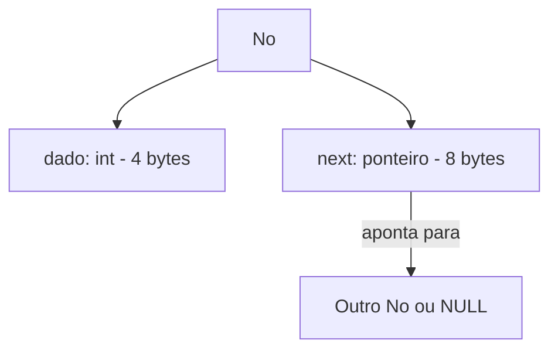

### Passo 2: Criar um Nó

Para criar um novo nó, alocamos memória com `malloc`, preenchemos o dado e definimos `next` como `NULL`:

```c
// Funcao para criar um novo no
No* criar_no(int valor) {
    No *novo = (No*)malloc(sizeof(No));
    if (novo == NULL) {
        printf("Erro: memoria insuficiente!\n");
        return NULL;
    }
    novo->dado = valor;   // guardar o valor
    novo->next = NULL;    // por enquanto, nao aponta para ninguem
    return novo;
}
```

Essa função retorna um ponteiro para o nó criado. Quem chamou a função recebe o endereço do nó na memória e pode usá-lo para conectar à lista.

### Passo 3: Inserir no Início

A operação mais simples em uma lista encadeada é inserir no início. O novo nó se torna a nova cabeça da lista:

```c
// Inserir no inicio da lista
// Recebe um ponteiro para o ponteiro head (para poder modificar head)
void inserir_inicio(No **head, int valor) {
    No *novo = criar_no(valor);
    if (novo == NULL) return;

    novo->next = *head;  // o novo no aponta para o antigo primeiro
    *head = novo;        // head agora aponta para o novo no
}
```

Espera — por que `No **head` (ponteiro para ponteiro)? Essa é uma dúvida muito comum e merece uma explicação detalhada.

Lembra do módulo 7.4, quando vimos que para uma função modificar uma variável externa, ela precisa receber o endereço dessa variável? Se `head` é um ponteiro (`No *head`), e queremos que a função mude para onde `head` aponta, precisamos passar o endereço de `head` — ou seja, um ponteiro para o ponteiro: `No **head`.

Se passássemos apenas `No *head`, a função receberia uma cópia do ponteiro. Modificar a cópia não afetaria o original — e o `head` no `main` continuaria apontando para o mesmo lugar de antes.

Vamos visualizar a inserção do valor 5 no início de uma lista que já tem 10 → 20 → 30:

**Antes:**
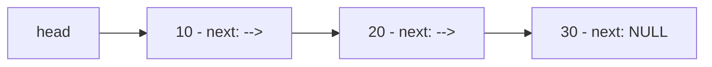

**Passo 1 — criar nó com valor 5:**
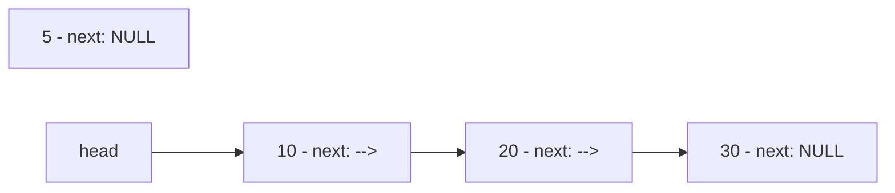

**Passo 2 — novo->next = *head (5 aponta para 10):**
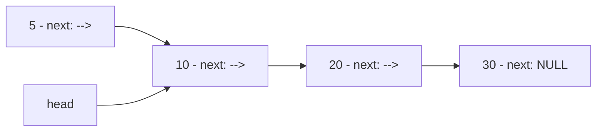

**Passo 3 — *head = novo (head aponta para 5):**
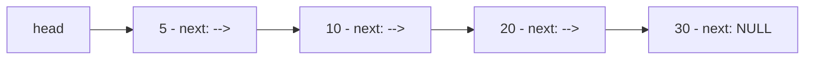

Pronto. Dois passos, dois ponteiros modificados. Não importa se a lista tem 3 elementos ou 3 milhões — inserir no início é sempre O(1), tempo constante. Compare com um array, onde inserir no início exige mover todos os elementos — O(n).

### Passo 4: Imprimir a Lista

Para percorrer a lista, começamos no `head` e seguimos os ponteiros `next` até encontrar `NULL`:

```c
// Imprimir todos os elementos da lista
void imprimir_lista(No *head) {
    No *atual = head;  // comeca no primeiro no
    printf("Lista: ");
    while (atual != NULL) {
        printf("%d", atual->dado);
        if (atual->next != NULL) {
            printf(" -> ");
        }
        atual = atual->next;  // avanca para o proximo no
    }
    printf(" -> NULL\n");
}
```

O padrão `atual = atual->next` é o equivalente de `i++` em um loop de array. Em vez de incrementar um índice, avançamos o ponteiro para o próximo nó. Quando `atual` chega em `NULL`, sabemos que percorremos toda a lista.

### Passo 5: Primeiro Programa Completo

Vamos juntar tudo em um programa que funciona:

```c
// lista_basica.c — Primeira lista encadeada completa
#include <stdio.h>
#include <stdlib.h>

// Definicao do no
typedef struct No {
    int dado;
    struct No *next;
} No;

// Criar um novo no
No* criar_no(int valor) {
    No *novo = (No*)malloc(sizeof(No));
    if (novo == NULL) {
        printf("Erro: memoria insuficiente!\n");
        return NULL;
    }
    novo->dado = valor;
    novo->next = NULL;
    return novo;
}

// Inserir no inicio
void inserir_inicio(No **head, int valor) {
    No *novo = criar_no(valor);
    if (novo == NULL) return;
    novo->next = *head;
    *head = novo;
}

// Imprimir a lista
void imprimir_lista(No *head) {
    No *atual = head;
    printf("Lista: ");
    while (atual != NULL) {
        printf("%d", atual->dado);
        if (atual->next != NULL) printf(" -> ");
        atual = atual->next;
    }
    printf(" -> NULL\n");
}

// Liberar toda a memoria da lista
void liberar_lista(No **head) {
    No *atual = *head;
    while (atual != NULL) {
        No *proximo = atual->next;  // salvar o proximo ANTES de liberar
        free(atual);                // liberar o no atual
        atual = proximo;            // avancar para o proximo
    }
    *head = NULL;  // lista agora esta vazia
}

int main() {
    No *lista = NULL;  // lista vazia

    printf("Lista vazia:\n");
    imprimir_lista(lista);

    // Inserir elementos no inicio
    inserir_inicio(&lista, 30);
    inserir_inicio(&lista, 20);
    inserir_inicio(&lista, 10);

    printf("\nApos inserir 30, 20, 10 no inicio:\n");
    imprimir_lista(lista);
    // Resultado: 10 -> 20 -> 30
    // (10 foi o ultimo inserido no inicio, entao ficou primeiro)

    inserir_inicio(&lista, 5);
    printf("\nApos inserir 5 no inicio:\n");
    imprimir_lista(lista);

    // Liberar toda a memoria
    liberar_lista(&lista);
    printf("\nApos liberar:\n");
    imprimir_lista(lista);

    return 0;
}
```

Saída esperada:
```
Lista vazia:
Lista:  -> NULL

Apos inserir 30, 20, 10 no inicio:
Lista: 10 -> 20 -> 30 -> NULL

Apos inserir 5 no inicio:
Lista: 5 -> 10 -> 20 -> 30 -> NULL

Apos liberar:
Lista:  -> NULL
```

Observe que ao inserir no início, a ordem fica invertida: inserimos 30 primeiro, depois 20 na frente do 30, depois 10 na frente do 20. O resultado é 10 → 20 → 30. Se quisermos manter a ordem de inserção, precisamos inserir no final.

### A Função liberar_lista: Por que é Importante

A função `liberar_lista` merece atenção especial. Cada nó foi alocado com `malloc`, então cada nó precisa ser liberado com `free`. Mas tem um detalhe crucial: **você precisa salvar o ponteiro `next` ANTES de liberar o nó atual**.

Se você fizer `free(atual)` primeiro e depois tentar acessar `atual->next`, estará acessando memória já liberada — comportamento indefinido. O nó foi devolvido ao sistema operacional, e o conteúdo pode ter sido sobrescrito.

```c
// ERRADO — acessa memoria liberada
while (atual != NULL) {
    free(atual);              // libera o no
    atual = atual->next;      // ERRO! atual ja foi liberado!
}

// CORRETO — salva next antes de liberar
while (atual != NULL) {
    No *proximo = atual->next;  // salva o proximo
    free(atual);                // libera o no com seguranca
    atual = proximo;            // avanca usando o valor salvo
}
```

---

## Inserir no Final

Inserir no início é O(1), mas a ordem fica invertida. Para manter a ordem de inserção, precisamos inserir no final — e isso exige percorrer toda a lista até o último nó:

```c
// Inserir no final da lista
void inserir_final(No **head, int valor) {
    No *novo = criar_no(valor);
    if (novo == NULL) return;

    // Caso especial: lista vazia
    if (*head == NULL) {
        *head = novo;
        return;
    }

    // Percorrer ate o ultimo no
    No *atual = *head;
    while (atual->next != NULL) {
        atual = atual->next;
    }
    // atual agora aponta para o ultimo no
    atual->next = novo;  // o ultimo no agora aponta para o novo
}
```

Vamos visualizar a inserção do valor 40 no final de uma lista 10 → 20 → 30:

**Antes:**


**Passo 1 — percorrer até o último nó (30):**

O ponteiro `atual` começa em 10, avança para 20, avança para 30. Como `30->next` é `NULL`, paramos.

**Passo 2 — atual->next = novo (30 aponta para 40):**
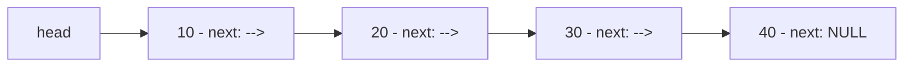

Inserir no final é O(n) — precisamos percorrer toda a lista para encontrar o último nó. Se a lista tem 1 milhão de elementos, percorremos 1 milhão de nós. Isso é uma desvantagem em relação ao array, onde inserir no final (quando há espaço) é O(1).

Uma otimização comum é manter um ponteiro `tail` (cauda) que sempre aponta para o último nó. Com isso, inserir no final vira O(1). Mas isso adiciona complexidade — precisamos atualizar `tail` em toda operação que modifica o final da lista.

```c
// lista_inserir_final.c — Inserindo no inicio e no final
#include <stdio.h>
#include <stdlib.h>

typedef struct No {
    int dado;
    struct No *next;
} No;

No* criar_no(int valor) {
    No *novo = (No*)malloc(sizeof(No));
    if (novo == NULL) return NULL;
    novo->dado = valor;
    novo->next = NULL;
    return novo;
}

void inserir_inicio(No **head, int valor) {
    No *novo = criar_no(valor);
    if (novo == NULL) return;
    novo->next = *head;
    *head = novo;
}

void inserir_final(No **head, int valor) {
    No *novo = criar_no(valor);
    if (novo == NULL) return;
    if (*head == NULL) {
        *head = novo;
        return;
    }
    No *atual = *head;
    while (atual->next != NULL) {
        atual = atual->next;
    }
    atual->next = novo;
}

void imprimir_lista(No *head) {
    No *atual = head;
    printf("Lista: ");
    while (atual != NULL) {
        printf("%d", atual->dado);
        if (atual->next != NULL) printf(" -> ");
        atual = atual->next;
    }
    printf(" -> NULL\n");
}

void liberar_lista(No **head) {
    No *atual = *head;
    while (atual != NULL) {
        No *proximo = atual->next;
        free(atual);
        atual = proximo;
    }
    *head = NULL;
}

int main() {
    No *lista = NULL;

    // Inserir no final — mantem a ordem
    inserir_final(&lista, 10);
    inserir_final(&lista, 20);
    inserir_final(&lista, 30);
    printf("Inserindo no final (10, 20, 30):\n");
    imprimir_lista(lista);

    // Inserir no inicio — vai para a frente
    inserir_inicio(&lista, 5);
    printf("Inserindo 5 no inicio:\n");
    imprimir_lista(lista);

    // Inserir no final novamente
    inserir_final(&lista, 40);
    printf("Inserindo 40 no final:\n");
    imprimir_lista(lista);

    liberar_lista(&lista);
    return 0;
}
```

Saída esperada:
```
Inserindo no final (10, 20, 30):
Lista: 10 -> 20 -> 30 -> NULL
Inserindo 5 no inicio:
Lista: 5 -> 10 -> 20 -> 30 -> NULL
Inserindo 40 no final:
Lista: 5 -> 10 -> 20 -> 30 -> 40 -> NULL
```

---

## Inserir no Meio: Onde a Lista Encadeada Brilha

Aqui está o grande trunfo da lista encadeada. Inserir um elemento entre dois nós existentes exige apenas mudar dois ponteiros — não importa o tamanho da lista:

```c
// Inserir apos um no especifico
void inserir_apos(No *no_anterior, int valor) {
    if (no_anterior == NULL) {
        printf("Erro: no anterior nao pode ser NULL!\n");
        return;
    }

    No *novo = criar_no(valor);
    if (novo == NULL) return;

    novo->next = no_anterior->next;    // novo aponta para o que vinha depois
    no_anterior->next = novo;          // anterior agora aponta para o novo
}
```

Vamos visualizar a inserção do valor 25 entre 20 e 30 na lista 10 → 20 → 30:

**Antes:**


**Passo 1 — novo->next = no_anterior->next (25 aponta para 30):**
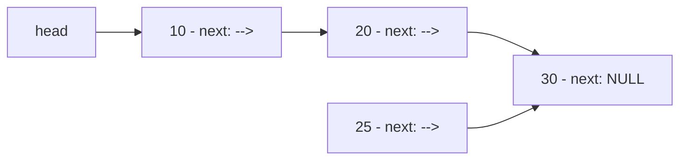

**Passo 2 — no_anterior->next = novo (20 aponta para 25):**
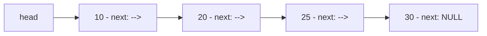

Dois ponteiros modificados. Nenhum elemento movido. Se a lista tivesse 1 milhão de elementos e você quisesse inserir entre o elemento 500.000 e o 500.001, bastaria mudar dois ponteiros. Em um array, seria necessário mover 500.000 elementos.

Claro, para chegar até o nó 500.000, você precisa percorrer 500.000 nós — isso é O(n). Mas a inserção em si é O(1). Se você já tem um ponteiro para o nó onde quer inserir (o que é comum em muitos algoritmos), a operação é instantânea.

### Inserir em uma Posição Específica

Vamos criar uma função que insere em uma posição numérica (como um índice de array):

```c
// Inserir na posicao especificada (0 = inicio)
void inserir_posicao(No **head, int valor, int posicao) {
    // Posicao 0: inserir no inicio
    if (posicao == 0) {
        inserir_inicio(head, valor);
        return;
    }

    // Percorrer ate a posicao anterior
    No *atual = *head;
    int i;
    for (i = 0; i < posicao - 1 && atual != NULL; i++) {
        atual = atual->next;
    }

    if (atual == NULL) {
        printf("Erro: posicao %d fora dos limites!\n", posicao);
        return;
    }

    inserir_apos(atual, valor);
}
```

---

## Buscar um Elemento

Para encontrar um valor na lista, percorremos nó por nó até encontrar ou chegar ao final:

```c
// Buscar um valor na lista
// Retorna o ponteiro para o no encontrado, ou NULL se nao encontrar
No* buscar(No *head, int valor) {
    No *atual = head;
    while (atual != NULL) {
        if (atual->dado == valor) {
            return atual;  // encontrou!
        }
        atual = atual->next;
    }
    return NULL;  // nao encontrou
}

// Buscar e retornar a posicao (indice)
int buscar_posicao(No *head, int valor) {
    No *atual = head;
    int posicao = 0;
    while (atual != NULL) {
        if (atual->dado == valor) {
            return posicao;
        }
        atual = atual->next;
        posicao++;
    }
    return -1;  // nao encontrou
}
```

A busca em lista encadeada é sempre O(n) — no pior caso, percorremos toda a lista. Isso é igual à busca linear em array. Mas em um array ordenado, podemos usar busca binária (O(log n)). Em uma lista encadeada, busca binária não funciona — não temos acesso direto ao elemento do meio.

---

## Remover um Elemento

Remover é a operação que exige mais cuidado. Precisamos encontrar o nó a ser removido, ajustar o ponteiro do nó anterior para pular o removido, e liberar a memória:

```c
// Remover a primeira ocorrencia de um valor
void remover(No **head, int valor) {
    // Lista vazia
    if (*head == NULL) {
        printf("Lista vazia!\n");
        return;
    }

    // Caso especial: remover o primeiro no
    if ((*head)->dado == valor) {
        No *temp = *head;
        *head = (*head)->next;  // head avanca para o segundo no
        free(temp);             // libera o antigo primeiro
        return;
    }

    // Caso geral: encontrar o no anterior ao que sera removido
    No *atual = *head;
    while (atual->next != NULL && atual->next->dado != valor) {
        atual = atual->next;
    }

    if (atual->next == NULL) {
        printf("Valor %d nao encontrado!\n", valor);
        return;
    }

    // atual->next e o no a ser removido
    No *temp = atual->next;
    atual->next = temp->next;  // pular o no removido
    free(temp);                // liberar a memoria
}
```

Vamos visualizar a remoção do valor 20 da lista 10 → 20 → 30:

**Antes:**


**Passo 1 — encontrar o nó anterior (10) ao nó com valor 20:**

Percorremos a lista. `atual` é o nó 10. `atual->next` é o nó 20, que tem o valor que queremos remover.

**Passo 2 — atual->next = temp->next (10 pula o 20 e aponta para 30):**
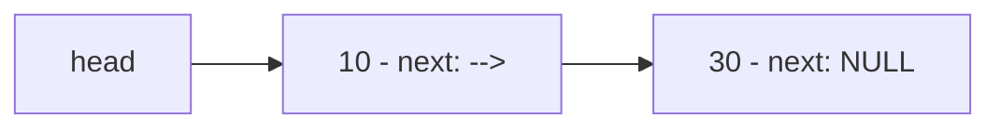

**Passo 3 — free(temp) (liberar a memória do nó 20):**

O nó com valor 20 é devolvido ao sistema operacional. A lista agora é 10 → 30.

Observe que a remoção no meio da lista é O(n) para encontrar o nó, mas O(1) para a remoção em si (apenas mudar um ponteiro e liberar memória). Em um array, remover no meio exige mover todos os elementos seguintes — O(n) para encontrar E O(n) para mover.

---

## Contar Elementos

Em um array, você sabe o tamanho porque guarda em uma variável separada. Em uma lista encadeada, para saber quantos elementos tem, você precisa percorrer toda a lista:

```c
// Contar quantos nos tem na lista
int contar(No *head) {
    int count = 0;
    No *atual = head;
    while (atual != NULL) {
        count++;
        atual = atual->next;
    }
    return count;
}
```

Isso é O(n). Se precisar saber o tamanho frequentemente, uma otimização é manter uma variável `tamanho` que é incrementada a cada inserção e decrementada a cada remoção.

---

## Programa Completo: Lista com Todas as Operações

Vamos juntar todas as operações em um programa completo e interativo:

```c
// lista_completa.c — Lista encadeada com todas as operacoes
#include <stdio.h>
#include <stdlib.h>

typedef struct No {
    int dado;
    struct No *next;
} No;

No* criar_no(int valor) {
    No *novo = (No*)malloc(sizeof(No));
    if (novo == NULL) {
        printf("Erro: memoria insuficiente!\n");
        return NULL;
    }
    novo->dado = valor;
    novo->next = NULL;
    return novo;
}

void inserir_inicio(No **head, int valor) {
    No *novo = criar_no(valor);
    if (novo == NULL) return;
    novo->next = *head;
    *head = novo;
}

void inserir_final(No **head, int valor) {
    No *novo = criar_no(valor);
    if (novo == NULL) return;
    if (*head == NULL) {
        *head = novo;
        return;
    }
    No *atual = *head;
    while (atual->next != NULL) atual = atual->next;
    atual->next = novo;
}

void inserir_apos(No *no_anterior, int valor) {
    if (no_anterior == NULL) return;
    No *novo = criar_no(valor);
    if (novo == NULL) return;
    novo->next = no_anterior->next;
    no_anterior->next = novo;
}

void remover(No **head, int valor) {
    if (*head == NULL) {
        printf("Lista vazia!\n");
        return;
    }
    if ((*head)->dado == valor) {
        No *temp = *head;
        *head = (*head)->next;
        free(temp);
        printf("Removido: %d\n", valor);
        return;
    }
    No *atual = *head;
    while (atual->next != NULL && atual->next->dado != valor) {
        atual = atual->next;
    }
    if (atual->next == NULL) {
        printf("Valor %d nao encontrado!\n", valor);
        return;
    }
    No *temp = atual->next;
    atual->next = temp->next;
    free(temp);
    printf("Removido: %d\n", valor);
}

No* buscar(No *head, int valor) {
    No *atual = head;
    while (atual != NULL) {
        if (atual->dado == valor) return atual;
        atual = atual->next;
    }
    return NULL;
}

int contar(No *head) {
    int count = 0;
    No *atual = head;
    while (atual != NULL) {
        count++;
        atual = atual->next;
    }
    return count;
}

void imprimir_lista(No *head) {
    No *atual = head;
    printf("Lista: ");
    while (atual != NULL) {
        printf("%d", atual->dado);
        if (atual->next != NULL) printf(" -> ");
        atual = atual->next;
    }
    printf(" -> NULL\n");
}

void liberar_lista(No **head) {
    No *atual = *head;
    while (atual != NULL) {
        No *proximo = atual->next;
        free(atual);
        atual = proximo;
    }
    *head = NULL;
}

int main() {
    No *lista = NULL;

    printf("=== Lista Encadeada — Demonstracao Completa ===\n\n");

    // Inserir no final (mantem ordem)
    inserir_final(&lista, 10);
    inserir_final(&lista, 20);
    inserir_final(&lista, 30);
    inserir_final(&lista, 40);
    inserir_final(&lista, 50);
    printf("Apos inserir 10, 20, 30, 40, 50 no final:\n");
    imprimir_lista(lista);
    printf("Tamanho: %d\n\n", contar(lista));

    // Inserir no inicio
    inserir_inicio(&lista, 5);
    printf("Apos inserir 5 no inicio:\n");
    imprimir_lista(lista);

    // Inserir no meio (apos o no com valor 20)
    No *no20 = buscar(lista, 20);
    if (no20 != NULL) {
        inserir_apos(no20, 25);
        printf("\nApos inserir 25 apos o 20:\n");
        imprimir_lista(lista);
    }

    // Buscar
    printf("\nBuscando valor 30: ");
    No *encontrado = buscar(lista, 30);
    if (encontrado != NULL) {
        printf("encontrado (dado=%d)\n", encontrado->dado);
    } else {
        printf("nao encontrado\n");
    }

    printf("Buscando valor 99: ");
    encontrado = buscar(lista, 99);
    if (encontrado != NULL) {
        printf("encontrado\n");
    } else {
        printf("nao encontrado\n");
    }

    // Remover
    printf("\nRemovendo elementos:\n");
    remover(&lista, 5);    // remover do inicio
    imprimir_lista(lista);

    remover(&lista, 25);   // remover do meio
    imprimir_lista(lista);

    remover(&lista, 50);   // remover do final
    imprimir_lista(lista);

    remover(&lista, 99);   // tentar remover inexistente

    printf("\nEstado final:\n");
    imprimir_lista(lista);
    printf("Tamanho: %d\n", contar(lista));

    // Liberar memoria
    liberar_lista(&lista);
    printf("\nMemoria liberada.\n");

    return 0;
}
```

Saída esperada:
```
=== Lista Encadeada — Demonstracao Completa ===

Apos inserir 10, 20, 30, 40, 50 no final:
Lista: 10 -> 20 -> 30 -> 40 -> 50 -> NULL
Tamanho: 5

Apos inserir 5 no inicio:
Lista: 5 -> 10 -> 20 -> 30 -> 40 -> 50 -> NULL

Apos inserir 25 apos o 20:
Lista: 5 -> 10 -> 20 -> 25 -> 30 -> 40 -> 50 -> NULL

Buscando valor 30: encontrado (dado=30)
Buscando valor 99: nao encontrado

Removendo elementos:
Removido: 5
Lista: 10 -> 20 -> 25 -> 30 -> 40 -> 50 -> NULL
Removido: 25
Lista: 10 -> 20 -> 30 -> 40 -> 50 -> NULL
Removido: 50
Lista: 10 -> 20 -> 30 -> 40 -> NULL
Valor 99 nao encontrado!

Estado final:
Lista: 10 -> 20 -> 30 -> 40 -> NULL
Tamanho: 4

Memoria liberada.
```

---

## Comparação Detalhada: Array vs Lista Encadeada

Agora que você conhece as duas estruturas, vamos comparar em profundidade:

| Operação | Array | Lista Encadeada |
|----------|-------|-----------------|
| Acesso por índice | O(1) — cálculo direto | O(n) — percorrer ate a posição |
| Busca por valor | O(n) linear, O(log n) se ordenado | O(n) — sempre linear |
| Inserir no inicio | O(n) — mover todos | O(1) — mudar um ponteiro |
| Inserir no final | O(1) se tem espaco, O(n) com realloc | O(n) sem tail, O(1) com tail |
| Inserir no meio | O(n) — mover metade | O(1) se ja tem o ponteiro |
| Remover do inicio | O(n) — mover todos | O(1) — mudar head |
| Remover do final | O(1) — decrementar tamanho | O(n) — percorrer ate o penultimo |
| Remover do meio | O(n) — mover metade | O(1) se ja tem o ponteiro anterior |
| Memória por elemento | Apenas o dado | Dado + ponteiro (overhead) |
| Localidade de cache | Excelente — dados contiguos | Ruim — dados espalhados |
| Tamanho | Fixo ou realloc | Cresce e encolhe naturalmente |

### Quando Usar Cada Um

**Use array quando:**
- Precisa de acesso rápido por índice (posição)
- O tamanho é conhecido ou muda pouco
- Precisa de boa performance de cache (processamento sequencial)
- Vai fazer muitas buscas em dados ordenados (busca binária)

**Use lista encadeada quando:**
- Insere e remove frequentemente no início ou no meio
- O tamanho muda muito e de forma imprevisível
- Não precisa de acesso por índice
- Memória é fragmentada e blocos contíguos grandes são difíceis de obter

### O Fator Cache: Por que Arrays São Mais Rápidos na Prática

Na teoria, acessar um elemento de array e seguir um ponteiro de lista são ambos O(1). Mas na prática, arrays são significativamente mais rápidos para processamento sequencial. O motivo é o **cache da CPU**.

Quando a CPU acessa um endereço de memória, ela não busca apenas aquele byte — ela busca um bloco inteiro (chamado *cache line*, geralmente 64 bytes) e guarda no cache. Se o próximo acesso for a um endereço próximo (como o próximo elemento de um array), ele já está no cache — acesso instantâneo.

Em uma lista encadeada, cada nó pode estar em qualquer lugar da memória. Quando a CPU busca o nó 1, o nó 2 provavelmente não está no mesmo cache line. Cada acesso a um novo nó pode causar um *cache miss* — a CPU precisa ir até a memória principal, que é 100x mais lenta que o cache.

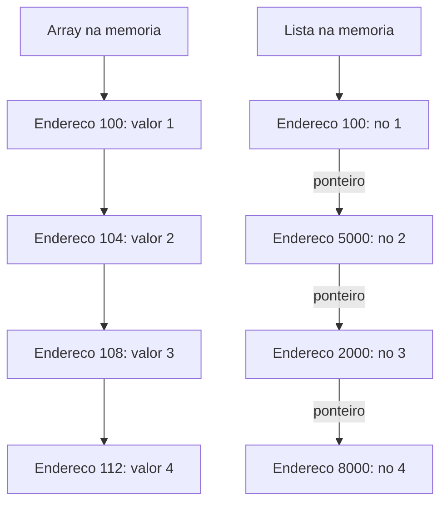

Isso explica por que, em muitos benchmarks, percorrer um array de 1 milhão de elementos é 5-10x mais rápido que percorrer uma lista encadeada com os mesmos dados — mesmo que ambos sejam O(n) na teoria. A notação Big O mede o número de operações, não o tempo real de cada operação.

---

## Variações de Listas Encadeadas

A lista que implementamos até agora é a mais simples — chamada de **lista simplesmente encadeada** (singly linked list). Cada nó aponta apenas para o próximo. Existem variações que resolvem limitações específicas:

### Lista Duplamente Encadeada

Cada nó tem dois ponteiros: um para o próximo (`next`) e um para o anterior (`prev`):

```c
typedef struct NoDuplo {
    int dado;
    struct NoDuplo *next;  // proximo no
    struct NoDuplo *prev;  // no anterior
} NoDuplo;
```

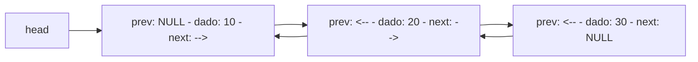

Vantagens da lista duplamente encadeada:
- Pode percorrer nos dois sentidos (frente e trás)
- Remover um nó é O(1) se você tem o ponteiro para ele (não precisa encontrar o anterior)
- Inserir antes de um nó é O(1)

Desvantagens:
- Cada nó usa mais memória (dois ponteiros em vez de um)
- Mais ponteiros para manter atualizados em cada operação
- Mais fácil de introduzir bugs

A lista duplamente encadeada é usada internamente por muitas linguagens. A `LinkedList` do Java, por exemplo, é duplamente encadeada. O histórico de navegação do seu browser (botões voltar/avançar) é conceitualmente uma lista duplamente encadeada.

### Lista Circular

O último nó aponta de volta para o primeiro, formando um ciclo:

```c
// Em uma lista circular, o ultimo no aponta para o primeiro
// ultimo->next = head (em vez de NULL)
```

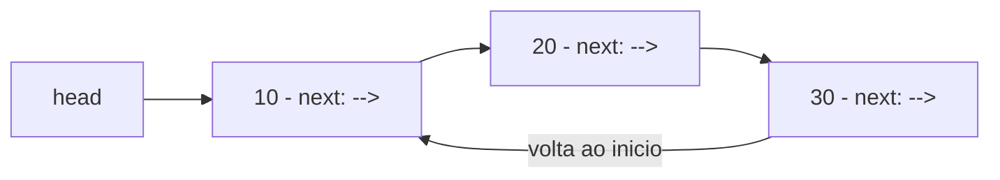

Listas circulares são úteis quando você precisa percorrer os elementos repetidamente, como:
- **Round-robin scheduling**: o sistema operacional distribui tempo de CPU entre processos, voltando ao primeiro quando chega ao último
- **Playlist de música em loop**: quando a última música termina, volta para a primeira
- **Buffer circular**: usado em streaming de áudio e vídeo para reutilizar memória

### Lista Circular Duplamente Encadeada

Combina as duas variações: cada nó tem `next` e `prev`, e o último aponta para o primeiro (e o primeiro aponta para o último via `prev`). É a variação mais flexível, mas também a mais complexa.

Para este curso, vamos focar na lista simplesmente encadeada — ela é suficiente para entender os conceitos e é a base para filas e pilhas nos próximos módulos. As variações são mencionadas para que você saiba que existem e possa pesquisar quando precisar.

---

## Erros Comuns com Listas Encadeadas

Listas encadeadas são um terreno fértil para bugs. Aqui estão os erros mais comuns que iniciantes cometem:

### Erro 1: Esquecer de Tratar Lista Vazia

```c
// ERRADO — trava se a lista estiver vazia
void imprimir(No *head) {
    printf("%d\n", head->dado);  // CRASH se head e NULL!
}

// CORRETO — verificar antes
void imprimir(No *head) {
    if (head == NULL) {
        printf("Lista vazia\n");
        return;
    }
    printf("%d\n", head->dado);
}
```

Sempre que uma função recebe um ponteiro, a primeira coisa a fazer é verificar se é `NULL`. Acessar `NULL->dado` causa *segmentation fault* — o programa trava.

### Erro 2: Perder a Referência ao Próximo Nó ao Remover

```c
// ERRADO — perde o resto da lista
void remover_primeiro(No **head) {
    free(*head);              // libera o primeiro no
    *head = (*head)->next;    // ERRO! *head ja foi liberado!
}

// CORRETO — salvar next antes de liberar
void remover_primeiro(No **head) {
    No *temp = *head;         // salvar referencia
    *head = (*head)->next;    // avancar head
    free(temp);               // agora pode liberar
}
```

### Erro 3: Memory Leak — Esquecer de Liberar Nós Removidos

```c
// ERRADO — memory leak
void remover_primeiro(No **head) {
    *head = (*head)->next;    // avanca head, mas nao libera o antigo!
    // O no antigo ainda existe na memoria, mas ninguem aponta para ele
    // Memoria perdida para sempre (ate o programa terminar)
}

// CORRETO — liberar o no removido
void remover_primeiro(No **head) {
    No *temp = *head;
    *head = (*head)->next;
    free(temp);               // devolver a memoria ao sistema
}
```

### Erro 4: Não Usar Ponteiro para Ponteiro

```c
// ERRADO — nao modifica o head original
void inserir_inicio(No *head, int valor) {
    No *novo = criar_no(valor);
    novo->next = head;
    head = novo;  // modifica a COPIA local, nao o original!
}

// CORRETO — receber ponteiro para ponteiro
void inserir_inicio(No **head, int valor) {
    No *novo = criar_no(valor);
    novo->next = *head;
    *head = novo;  // modifica o ponteiro original
}
```

### Erro 5: Loop Infinito ao Percorrer

```c
// ERRADO — esqueceu de avancar o ponteiro
No *atual = head;
while (atual != NULL) {
    printf("%d\n", atual->dado);
    // Esqueceu: atual = atual->next;
    // Loop infinito! Imprime o mesmo valor para sempre
}

// CORRETO
No *atual = head;
while (atual != NULL) {
    printf("%d\n", atual->dado);
    atual = atual->next;  // ESSENCIAL: avancar para o proximo
}
```

| Erro | Consequência | Como evitar |
|------|-------------|-------------|
| Não verificar NULL | Segmentation fault | Sempre checar ponteiros antes de usar |
| Liberar antes de salvar next | Acesso a memória liberada | Salvar next em variável temporária |
| Não liberar nos removidos | Memory leak | Sempre free ao remover |
| Não usar ponteiro para ponteiro | Head não e atualizado | Usar No** quando head pode mudar |
| Esquecer de avancar ponteiro | Loop infinito | Sempre ter `atual = atual->next` |

---

## Lista Encadeada em Python: A Comparação

Em Python, você não precisa implementar listas encadeadas para uso diário — as listas nativas (`list`) são suficientes para quase tudo. Mas é instrutivo ver como seria uma lista encadeada em Python, para comparar a complexidade:

```python
# lista_encadeada.py — Lista encadeada em Python (para comparacao)

class No:
    def __init__(self, dado):
        self.dado = dado    # o valor
        self.next = None    # ponteiro para o proximo (None = NULL)

class ListaEncadeada:
    def __init__(self):
        self.head = None    # lista vazia

    def inserir_inicio(self, valor):
        novo = No(valor)
        novo.next = self.head
        self.head = novo

    def imprimir(self):
        atual = self.head
        while atual is not None:
            print(atual.dado, end="")
            if atual.next is not None:
                print(" -> ", end="")
            atual = atual.next
        print(" -> None")

# Uso
lista = ListaEncadeada()
lista.inserir_inicio(30)
lista.inserir_inicio(20)
lista.inserir_inicio(10)
lista.imprimir()  # 10 -> 20 -> 30 -> None
```

Saída esperada:
```
10 -> 20 -> 30 -> None
```

Compare a versão Python com a versão C:

| Aspecto | C | Python |
|---------|---|--------|
| Definir o no | `typedef struct No { ... } No;` | `class No:` |
| Criar no | `malloc` + verificar NULL + preencher campos | `No(valor)` — automático |
| Ponteiro next | `struct No *next` | `self.next = None` |
| Acessar campo | `no->dado` (seta) | `no.dado` (ponto) |
| Liberar memória | `free(no)` — manual e obrigatório | Automático pelo garbage collector |
| Ponteiro para ponteiro | `No **head` — necessário | Não existe — Python usa referências |
| Verificar NULL | `if (ptr == NULL)` | `if ptr is None` |

A lógica é idêntica — a diferença está na quantidade de detalhes que C exige. Python esconde a alocação de memória, a liberação, os ponteiros e a verificação de NULL. C mostra tudo. É por isso que aprender listas encadeadas em C é tão valioso: você entende o que realmente acontece, e depois pode usar qualquer linguagem sabendo o que está por trás.

---

## Exemplo Prático: Lista de Contatos

Vamos criar algo mais próximo do mundo real — uma lista de contatos onde cada nó guarda um nome e um telefone:

```c
// lista_contatos.c — Lista encadeada de contatos
#include <stdio.h>
#include <stdlib.h>
#include <string.h>

typedef struct Contato {
    char nome[50];
    char telefone[20];
    struct Contato *next;
} Contato;

Contato* criar_contato(const char *nome, const char *telefone) {
    Contato *novo = (Contato*)malloc(sizeof(Contato));
    if (novo == NULL) return NULL;
    strncpy(novo->nome, nome, 49);
    novo->nome[49] = '\0';  // garantir terminador
    strncpy(novo->telefone, telefone, 19);
    novo->telefone[19] = '\0';
    novo->next = NULL;
    return novo;
}

// Inserir em ordem alfabetica
void inserir_ordenado(Contato **head, const char *nome, const char *tel) {
    Contato *novo = criar_contato(nome, tel);
    if (novo == NULL) return;

    // Inserir no inicio se lista vazia ou nome vem antes do primeiro
    if (*head == NULL || strcmp(nome, (*head)->nome) < 0) {
        novo->next = *head;
        *head = novo;
        return;
    }

    // Encontrar posicao correta
    Contato *atual = *head;
    while (atual->next != NULL && strcmp(nome, atual->next->nome) > 0) {
        atual = atual->next;
    }
    novo->next = atual->next;
    atual->next = novo;
}

// Buscar por nome
Contato* buscar_contato(Contato *head, const char *nome) {
    Contato *atual = head;
    while (atual != NULL) {
        if (strcmp(atual->nome, nome) == 0) return atual;
        atual = atual->next;
    }
    return NULL;
}

// Remover por nome
void remover_contato(Contato **head, const char *nome) {
    if (*head == NULL) return;

    if (strcmp((*head)->nome, nome) == 0) {
        Contato *temp = *head;
        *head = (*head)->next;
        free(temp);
        printf("Contato '%s' removido.\n", nome);
        return;
    }

    Contato *atual = *head;
    while (atual->next != NULL && strcmp(atual->next->nome, nome) != 0) {
        atual = atual->next;
    }

    if (atual->next == NULL) {
        printf("Contato '%s' nao encontrado.\n", nome);
        return;
    }

    Contato *temp = atual->next;
    atual->next = temp->next;
    free(temp);
    printf("Contato '%s' removido.\n", nome);
}

void imprimir_contatos(Contato *head) {
    if (head == NULL) {
        printf("Agenda vazia.\n");
        return;
    }
    printf("\n%-20s %s\n", "NOME", "TELEFONE");
    printf("%-20s %s\n", "----", "--------");
    Contato *atual = head;
    while (atual != NULL) {
        printf("%-20s %s\n", atual->nome, atual->telefone);
        atual = atual->next;
    }
    printf("\n");
}

void liberar_contatos(Contato **head) {
    Contato *atual = *head;
    while (atual != NULL) {
        Contato *proximo = atual->next;
        free(atual);
        atual = proximo;
    }
    *head = NULL;
}

int main() {
    Contato *agenda = NULL;

    printf("=== Agenda de Contatos ===\n");

    // Inserir contatos (serao ordenados automaticamente)
    inserir_ordenado(&agenda, "Maria", "11-99999-1111");
    inserir_ordenado(&agenda, "Carlos", "11-88888-2222");
    inserir_ordenado(&agenda, "Ana", "11-77777-3333");
    inserir_ordenado(&agenda, "Zeca", "11-66666-4444");
    inserir_ordenado(&agenda, "Fino", "11-55555-5555");

    printf("\nTodos os contatos (ordem alfabetica):");
    imprimir_contatos(agenda);

    // Buscar
    printf("Buscando 'Fino': ");
    Contato *encontrado = buscar_contato(agenda, "Fino");
    if (encontrado != NULL) {
        printf("%s — %s\n", encontrado->nome, encontrado->telefone);
    } else {
        printf("nao encontrado\n");
    }

    printf("Buscando 'Pedro': ");
    encontrado = buscar_contato(agenda, "Pedro");
    if (encontrado != NULL) {
        printf("%s — %s\n", encontrado->nome, encontrado->telefone);
    } else {
        printf("nao encontrado\n");
    }

    // Remover
    printf("\n");
    remover_contato(&agenda, "Carlos");
    printf("\nApos remover Carlos:");
    imprimir_contatos(agenda);

    liberar_contatos(&agenda);
    printf("Memoria liberada.\n");

    return 0;
}
```

Saída esperada:
```
=== Agenda de Contatos ===

Todos os contatos (ordem alfabetica):
NOME                 TELEFONE
----                 --------
Ana                  11-77777-3333
Carlos               11-88888-2222
Fino                 11-55555-5555
Maria                11-99999-1111
Zeca                 11-66666-4444

Buscando 'Fino': Fino — 11-55555-5555
Buscando 'Pedro': nao encontrado

Contato 'Carlos' removido.

Apos remover Carlos:
NOME                 TELEFONE
----                 --------
Ana                  11-77777-3333
Fino                 11-55555-5555
Maria                11-99999-1111
Zeca                 11-66666-4444

Memoria liberada.
```

Esse exemplo demonstra algo importante: a função `inserir_ordenado` mantém a lista sempre em ordem alfabética. Cada novo contato é inserido na posição correta. Em um array, isso exigiria mover elementos para abrir espaço. Na lista encadeada, basta ajustar ponteiros.

---

## A Conexão com Filas e Pilhas

Listas encadeadas são a base para duas estruturas que você vai aprender nos próximos módulos:

### Fila (Queue) — Módulo 7.7

Uma fila é uma lista encadeada onde você só insere no final e só remove do início. É como uma fila de banco: o primeiro a chegar é o primeiro a ser atendido (FIFO — First In, First Out).

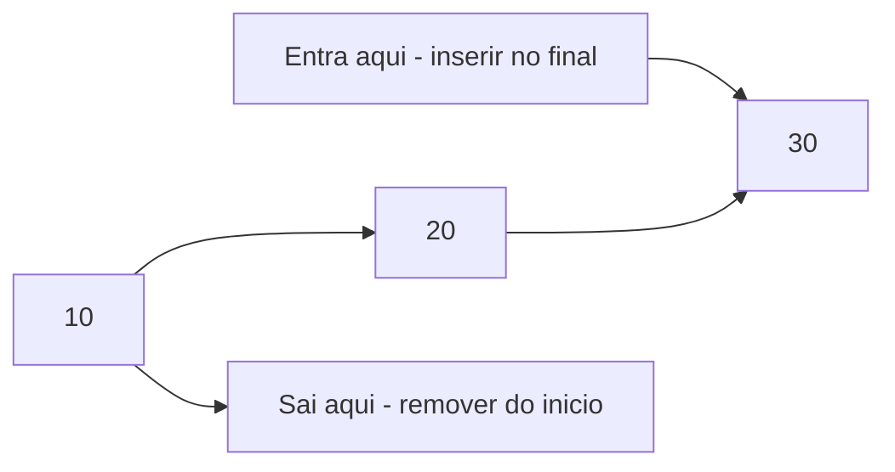

### Pilha (Stack) — Módulo 7.8

Uma pilha é uma lista encadeada onde você só insere e remove do início (ou do topo). É como uma pilha de pratos: o último prato colocado é o primeiro a ser retirado (LIFO — Last In, First Out).

```mermaid
flowchart TD
    TOPO[Topo - inserir e remover aqui] --> C[30 - ultimo inserido]
    C --> B[20]
    B --> A[10 - primeiro inserido]
```

A implementação de filas e pilhas usando listas encadeadas é quase idêntica ao que fizemos neste módulo — a diferença está em quais operações são permitidas. Entender listas encadeadas é entender 80% de filas e pilhas.

---

## Como a IA pode te ajudar aqui
**Prompt 1 — Aprender passo a passo:**
> "Desenhe passo a passo o que acontece na memória quando eu insiro os valores 10, 20 e 30 em uma lista encadeada"

**Prompt 2 — Aprofundar o tema:**
> "Esse código de lista encadeada tem memory leak? Onde?"

**Prompt 3 — Explorar o conceito:**
> "Implemente uma função que inverte uma lista encadeada em C e explique cada passo"

---

## Casos de Uso no Mundo Real

### 1. Histórico de Navegação do Browser

Quando você navega na internet, cada página visitada é adicionada a uma lista. Ao clicar no botão "Voltar", o browser remove a página atual do topo e mostra a anterior. Ao clicar em "Avançar", ele vai para a próxima. Internamente, browsers como Chrome e Firefox usam estruturas baseadas em listas duplamente encadeadas para implementar esse histórico. Cada nó guarda a URL, o título da página e ponteiros para a página anterior e a próxima. Quando você abre uma nova aba, uma nova lista é criada. Quando fecha a aba, a lista inteira é liberada da memória.

### 2. Sistema de Undo/Redo em Editores de Texto

Quando você digita no VSCode, Word ou Google Docs e pressiona Ctrl+Z para desfazer, o editor está percorrendo uma lista de ações. Cada ação (digitar uma letra, apagar um parágrafo, colar um texto) é um nó na lista. O "Undo" volta um nó, o "Redo" avança um nó. Se você desfaz 3 ações e depois digita algo novo, todos os nós à frente são removidos (as ações "refeitas" são descartadas) e um novo nó é inserido. Essa é uma lista duplamente encadeada com um ponteiro "atual" que se move para frente e para trás.

### 3. Gerenciamento de Processos no Sistema Operacional

O Linux mantém listas encadeadas de processos em execução. Quando você abre o terminal e digita `ps aux`, o sistema percorre uma lista encadeada de processos para mostrar cada um. O scheduler (agendador) do Linux usa listas para organizar quais processos devem receber tempo de CPU. Quando um processo é criado (`fork`), um novo nó é inserido na lista. Quando termina (`exit`), o nó é removido. O kernel do Linux usa listas encadeadas extensivamente — a implementação está no arquivo `include/linux/list.h` do código-fonte do kernel, e é uma das estruturas mais usadas em todo o sistema operacional.

---

## Resumo do Módulo

| Conceito | Definição |
|----------|-----------|
| Lista encadeada | Estrutura onde cada elemento aponta para o próximo via ponteiro |
| No (node) | Unidade da lista, contem dado e ponteiro next |
| Head | Ponteiro para o primeiro no da lista |
| NULL | Indica o fim da lista ou lista vazia |
| Struct | Tipo composto em C que agrupa vários campos |
| typedef | Cria um alias para um tipo, simplificando a sintaxe |
| Operador seta (->) | Acessa campo de struct via ponteiro |
| Inserir no inicio | O(1) — mudar head e um ponteiro |
| Inserir no final | O(n) — percorrer ate o último no |
| Inserir no meio | O(1) se ja tem o ponteiro do no anterior |
| Remover | Ajustar ponteiro do anterior e liberar memória |
| Buscar | O(n) — percorrer no por no |
| Lista duplamente encadeada | Cada no tem ponteiro para próximo e anterior |
| Lista circular | Último no aponta de volta para o primeiro |
| Cache miss | Acesso a memória que não esta no cache da CPU |

---

## Glossário do Módulo

| Termo | Definição |
|-------|-----------|
| Arrow operator | Operador seta `->` — acessa campo de struct via ponteiro, equivale a `(*ptr).campo` |
| Cache line | Bloco de memória (geralmente 64 bytes) que a CPU busca de uma vez |
| Cache miss | Quando o dado acessado não esta no cache da CPU, exigindo busca na memória principal |
| Circular linked list | Lista circular — o último no aponta de volta para o primeiro |
| Doubly linked list | Lista duplamente encadeada — cada no tem ponteiros next e prev |
| Garbage collector | Coletor de lixo — mecanismo automático de liberacao de memória em linguagens como Python e Java |
| Head | Cabeca — ponteiro para o primeiro no de uma lista encadeada |
| IPL | Information Processing Language — uma das primeiras linguagens a usar listas encadeadas |
| Linked list | Lista encadeada — estrutura de dados onde cada elemento aponta para o próximo |
| LISP | LISt Processing — linguagem de programação baseada em listas encadeadas |
| Memory leak | Vazamento de memória — memória alocada que nunca e liberada |
| Node | No — unidade básica de uma lista encadeada, contem dado e ponteiro |
| NULL | Valor especial que indica "nenhum endereco" ou "fim da lista" |
| Pointer to pointer | Ponteiro para ponteiro — usado quando uma função precisa modificar um ponteiro externo |
| prev | Ponteiro para o no anterior em uma lista duplamente encadeada |
| Round-robin | Algoritmo de escalonamento que distribui recursos de forma circular |
| Segmentation fault | Erro que ocorre ao acessar memória inválida, como desreferenciar NULL |
| Self-referential struct | Struct que contem um ponteiro para outra struct do mesmo tipo |
| Singly linked list | Lista simplesmente encadeada — cada no aponta apenas para o próximo |
| strncpy | Função que copia ate N caracteres de uma string, mais segura que strcpy |
| Struct | Tipo composto em C que agrupa multiplos campos de tipos diferentes |
| Tail | Cauda — ponteiro para o último no de uma lista encadeada |
| Traversal | Percorrimento — visitar cada no da lista do inicio ao fim |
| typedef | Palavra-chave em C que cria um alias para um tipo existente |

---

## Na Cultura Popular

- **O Jogo da Imitação** (filme, 2014) — O Logic Theorist, programa para o qual as listas encadeadas foram inventadas, é considerado o primeiro programa de inteligência artificial. Alan Turing, retratado neste filme, foi um dos pioneiros da computação que influenciou diretamente o trabalho de Newell, Shaw e Simon. A ideia de que máquinas podem processar símbolos e listas de dados — não apenas números — é central tanto para o trabalho de Turing quanto para a invenção das listas encadeadas.

- **Halt and Catch Fire** (série, 2014-2017) — Esta série mostra a evolução da computação pessoal e da internet nos anos 80 e 90. Os personagens frequentemente lidam com limitações de memória e performance — exatamente os problemas que estruturas de dados como listas encadeadas ajudam a resolver. Quando Cameron programa jogos com memória limitada, ela precisa escolher cuidadosamente entre arrays (rápidos mas fixos) e estruturas dinâmicas (flexíveis mas com overhead).

- **Inception** (filme, 2010) — A estrutura de sonhos dentro de sonhos no filme de Christopher Nolan é uma analogia interessante para listas encadeadas. Cada nível de sonho "aponta" para o próximo nível mais profundo, e para voltar você precisa percorrer os níveis na ordem inversa. O "kick" que acorda os personagens é como percorrer a lista de volta ao `head`. E se alguém "se perde" em um nível (perde o ponteiro), fica preso — como um memory leak onde um nó fica inacessível.

---

## Para Saber Mais

- [Visualgo — Linked List](https://visualgo.net/en/list) — *Visualização animada de operações em listas encadeadas — inserção, remoção e busca passo a passo*

- [CS50 — Linked Lists (Harvard)](https://cs50.harvard.edu/x/) — *A aula do CS50 sobre listas encadeadas e uma das melhores explicacoes visuais disponiveis, com demonstracoes usando caixas e setas fisicas*

- [Data Structure Visualizations — Linked List](https://www.cs.usfca.edu/~galles/visualization/Algorithms.html) — *Visualizacoes interativas onde você pode inserir e remover nos e ver os ponteiros mudando em tempo real*

- [mycodeschool — Linked Lists](https://www.youtube.com/playlist?list=PL2_aWCzGMAwI3W_JlcBbtYTwiQSsOTa6P) — *Playlist com explicacoes claras e animacoes sobre todos os tipos de listas encadeadas*

- [Programação Descomplicada — Listas em C](https://www.youtube.com/@progdescomplicada) — *Canal brasileiro com aulas detalhadas sobre listas encadeadas em C, com exemplos passo a passo*

---

## Perguntas Frequentes (FAQ)

**P: Por que não usar sempre listas encadeadas em vez de arrays?**
R: Porque arrays são mais rápidos para acesso por índice (O(1) vs O(n)) e têm melhor performance de cache — os dados ficam lado a lado na memória, o que a CPU adora. Listas encadeadas são melhores quando você insere e remove frequentemente, especialmente no início ou no meio. Cada estrutura tem seu lugar — a escolha depende do que você faz mais: acessar por posição ou inserir/remover.

**P: O que é um segmentation fault e por que acontece tanto com listas?**
R: Segmentation fault (ou "segfault") é um erro que acontece quando o programa tenta acessar memória que não lhe pertence. Com listas encadeadas, isso geralmente acontece quando você tenta acessar `NULL->dado` (esqueceu de verificar se o ponteiro é NULL) ou quando acessa memória já liberada com `free`. A solução é sempre verificar se ponteiros são NULL antes de usá-los.

**P: Por que preciso de `No **head` (ponteiro para ponteiro) nas funções?**
R: Porque quando você insere no início ou remove o primeiro elemento, o ponteiro `head` precisa mudar — ele precisa apontar para um nó diferente. Se a função receber apenas `No *head`, ela recebe uma cópia do ponteiro. Modificar a cópia não afeta o original. Com `No **head`, a função recebe o endereço do ponteiro original e pode modificá-lo. É o mesmo princípio do `&` no `scanf` — para modificar uma variável externa, você precisa do endereço dela.

**P: Listas encadeadas são usadas na prática ou só em entrevistas?**
R: Ambos. Na prática, listas encadeadas são usadas internamente por muitas estruturas e sistemas: o kernel do Linux usa extensivamente, browsers usam para histórico de navegação, editores de texto usam para undo/redo, e muitas linguagens implementam suas estruturas de dados com listas por baixo. Mas no dia a dia de um programador, você raramente implementa uma lista encadeada do zero — usa as que a linguagem oferece (como `LinkedList` em Java ou `collections.deque` em Python). Em entrevistas, listas encadeadas são populares porque testam compreensão de ponteiros e raciocínio sobre estruturas.

**P: Qual a diferença entre lista simplesmente e duplamente encadeada?**
R: Na simplesmente encadeada, cada nó tem apenas um ponteiro `next` — você só pode percorrer em uma direção (do início ao fim). Na duplamente encadeada, cada nó tem `next` e `prev` — pode percorrer nos dois sentidos. A duplamente encadeada facilita operações como remover um nó quando você tem o ponteiro para ele (não precisa encontrar o anterior), mas usa mais memória (dois ponteiros por nó em vez de um).

**P: O que acontece se eu fizer `free` em um nó e depois tentar acessá-lo?**
R: Comportamento indefinido — o resultado é imprevisível. O programa pode travar (segfault), pode imprimir lixo, ou pode até parecer funcionar corretamente por um tempo (o dado ainda está na memória, mas pode ser sobrescrito a qualquer momento). Esse tipo de bug é chamado "use after free" e é uma das vulnerabilidades de segurança mais exploradas em software escrito em C. Sempre defina o ponteiro como NULL após o `free` para evitar uso acidental.

**P: Posso criar uma lista encadeada de structs mais complexas?**
R: Sim, e é o uso mais comum na prática. O campo `dado` pode ser qualquer tipo — `int`, `float`, `char[50]`, ou até outra struct inteira. No exemplo da agenda de contatos, cada nó guarda nome e telefone. Em um sistema real, cada nó poderia guardar um registro de cliente com dezenas de campos. A estrutura da lista (ponteiros `next`) é independente do tipo de dado armazenado.

**P: Como sei se meu programa tem memory leak?**
R: Em C, a ferramenta mais usada é o **Valgrind** (no Linux). Você compila o programa normalmente e executa com `valgrind ./programa`. Ele mostra quantos bytes foram alocados, quantos foram liberados e quantos "vazaram". Se o número de `malloc` não bater com o número de `free`, tem leak. Outra abordagem é manter um contador: incrementar a cada `malloc` e decrementar a cada `free`. No final do programa, o contador deve ser zero.

**P: Por que a busca binária não funciona em listas encadeadas?**
R: Busca binária precisa acessar o elemento do meio diretamente — em um array, isso é `arr[n/2]`, que é O(1). Em uma lista encadeada, para chegar ao elemento do meio, você precisa percorrer n/2 nós, que é O(n). Isso elimina a vantagem da busca binária. Para busca eficiente em dados dinâmicos, existem estruturas como árvores binárias de busca e tabelas hash — mas essas são temas mais avançados.

**P: O que é uma "lista encadeada com sentinela"?**
R: Uma sentinela (ou nó dummy) é um nó especial que fica no início da lista e não contém dados reais. Ele simplifica o código porque elimina o caso especial de "lista vazia" e "inserir/remover no início" — o `head` sempre aponta para a sentinela, que nunca é removida. Isso reduz a quantidade de `if` no código, mas adiciona um nó extra de overhead. É uma técnica de implementação, não uma estrutura diferente.

**P: Listas encadeadas existem em Python?**
R: Python não tem uma classe `LinkedList` nativa, porque as listas (`list`) já são suficientes para a maioria dos casos. Mas o módulo `collections` tem o `deque` (double-ended queue), que internamente usa uma estrutura similar a uma lista duplamente encadeada e é otimizado para inserções e remoções nas duas pontas. Se você precisar de uma lista encadeada em Python, pode implementar uma com classes (como mostramos neste módulo) ou usar bibliotecas de terceiros.

---

## Exercícios Práticos

### Exercício 1: Implementar e Testar

Implemente uma lista encadeada de inteiros com as seguintes operações:
- `inserir_inicio`: inserir no início
- `inserir_final`: inserir no final
- `remover`: remover a primeira ocorrência de um valor
- `imprimir`: mostrar todos os elementos
- `contar`: retornar o número de elementos
- `liberar`: liberar toda a memória

Teste com a seguinte sequência:
1. Inserir 10, 20, 30 no final
2. Inserir 5 no início
3. Imprimir (deve mostrar: 5 → 10 → 20 → 30)
4. Remover 20
5. Imprimir (deve mostrar: 5 → 10 → 30)
6. Contar (deve retornar 3)
7. Liberar tudo

Dica: use o programa completo deste módulo como referência, mas tente escrever do zero antes de consultar.

### Exercício 2: Inverter uma Lista

Escreva uma função `void inverter(No **head)` que inverte a ordem dos elementos de uma lista encadeada. Se a lista é 10 → 20 → 30, após inverter deve ser 30 → 20 → 10.

Dica: você precisa de três ponteiros — `anterior`, `atual` e `próximo`. Percorra a lista e, para cada nó, faça `atual->next` apontar para `anterior` em vez de para `próximo`. No final, `head` aponta para o último nó (que agora é o primeiro).

### Exercício 3: Encontrar o Elemento do Meio

Escreva uma função que encontra o elemento do meio de uma lista encadeada sem contar os elementos primeiro. Use a técnica dos "dois ponteiros": um ponteiro `lento` avança um nó por vez, e um ponteiro `rápido` avança dois nós por vez. Quando o rápido chegar ao final, o lento estará no meio.

Dica: essa técnica é chamada de "Floyd's tortoise and hare" (tartaruga e lebre de Floyd) e é um clássico de entrevistas técnicas.

---

[← Anterior: Arrays](cap07-mod05-arrays-conteudo.md) · [Próximo: Filas →](cap07-mod07-filas-conteudo.md)
