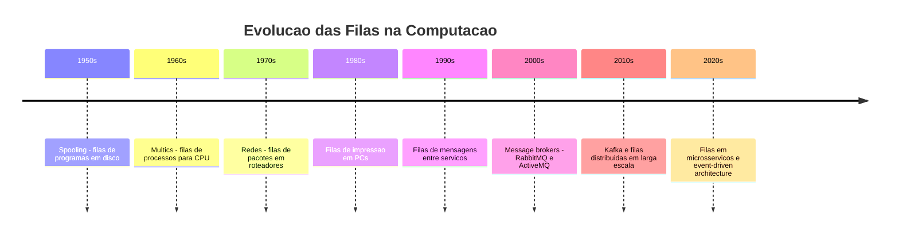
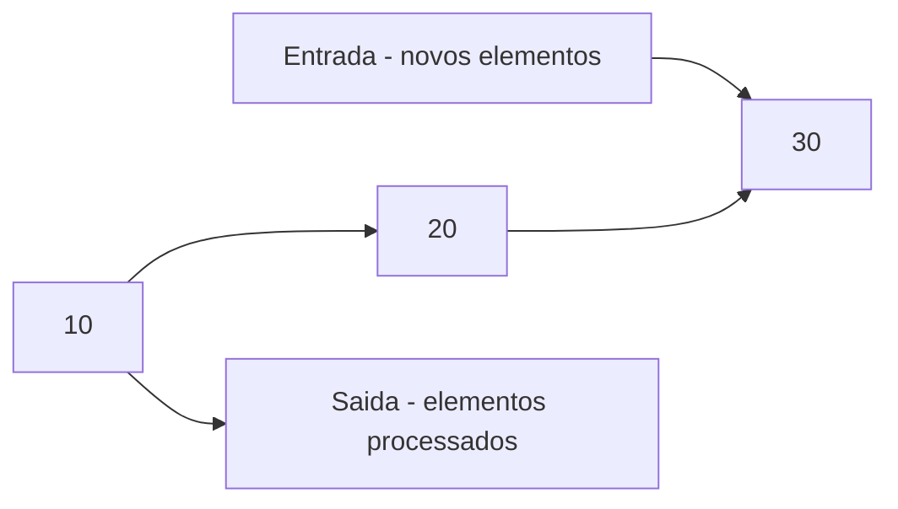
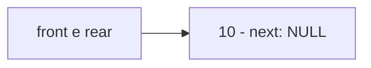
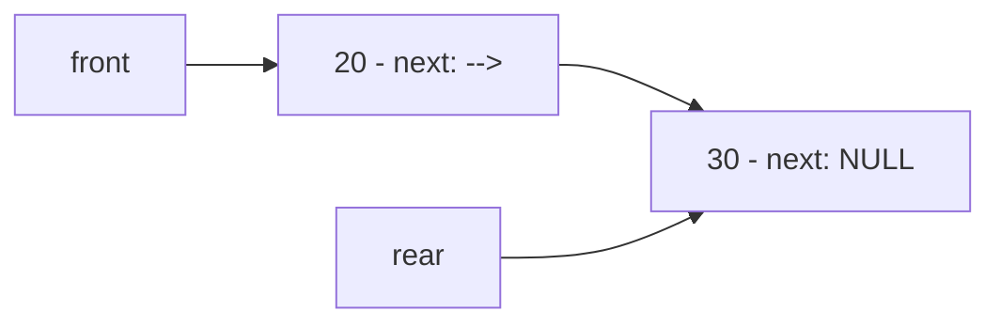
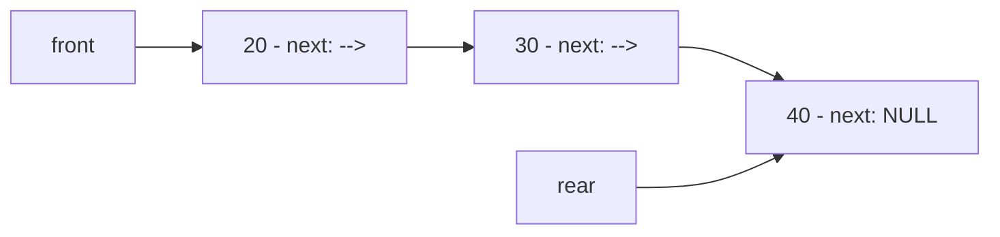
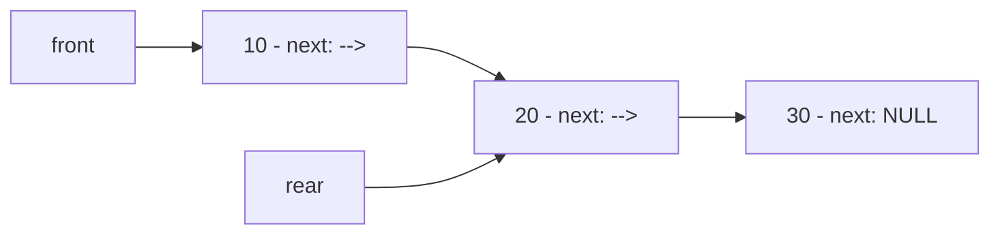
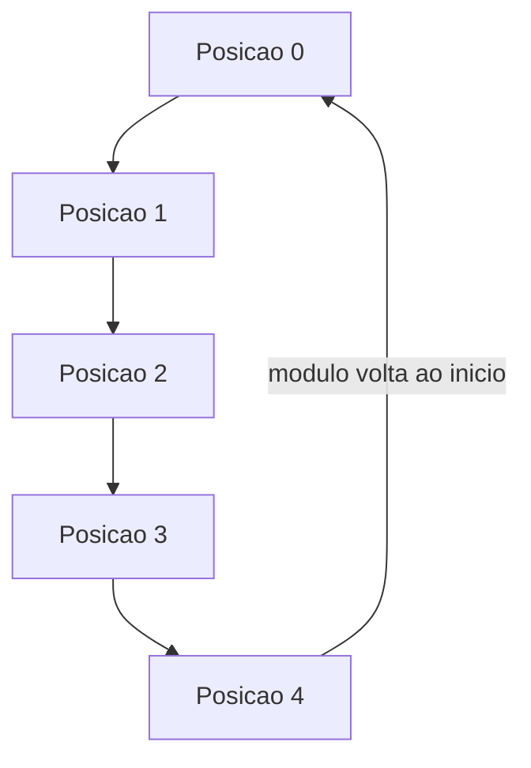
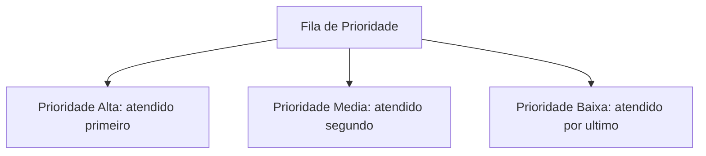
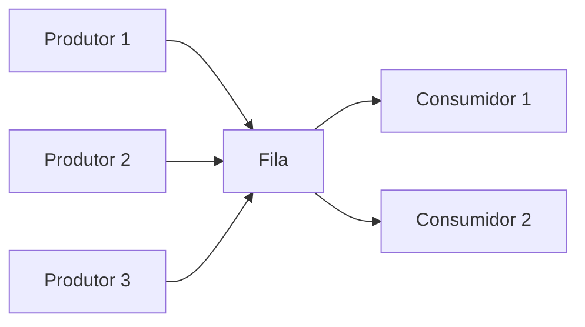
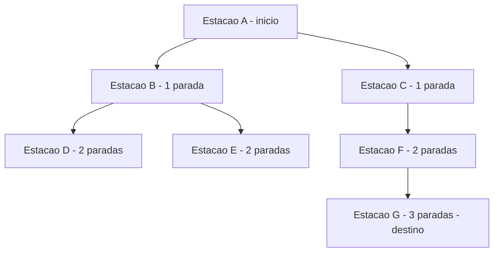

# 7.7 — Filas: Primeiro a Chegar, Primeiro a Sair (FIFO)

[← Anterior: Listas Encadeadas](cap07-mod06-listas-conteudo.md) · [Próximo: Pilhas →](cap07-mod08-pilhas-conteudo.md)

---

## Introdução

No módulo anterior, você aprendeu listas encadeadas — uma estrutura flexível onde podemos inserir e remover elementos em qualquer posição. Vimos que cada nó aponta para o próximo via ponteiro, e que a lista cresce e encolhe dinamicamente conforme a necessidade.

Agora vamos conhecer uma estrutura que é, na essência, uma lista encadeada com regras mais rígidas. Uma fila é uma lista onde você só pode inserir no final e só pode remover do início. Parece uma limitação, certo? Mas é exatamente essa restrição que torna a fila tão útil — ela garante uma ordem justa e previsível de processamento.

Pense na fila do banco. Você chega, pega uma senha e espera. Quem chegou primeiro é atendido primeiro. Não importa se você é mais rápido, mais importante ou mais impaciente — a regra é clara: primeiro a chegar, primeiro a sair. Em inglês, isso se chama **FIFO** (First In, First Out) — o primeiro a entrar é o primeiro a sair.

Essa ideia simples resolve um dos problemas mais fundamentais da computação: como processar tarefas na ordem em que chegam, de forma justa e organizada. Impressoras, servidores web, sistemas operacionais, jogos online — todos usam filas internamente. Quando você manda imprimir 3 documentos, eles são colocados em uma fila e impressos na ordem em que foram enviados. Quando 1000 pessoas acessam um site ao mesmo tempo, as requisições entram em uma fila e são processadas uma a uma.

Neste módulo, vamos entender por que filas existem, como funcionam por dentro, e implementar uma fila completa em C usando os conceitos de ponteiros e listas encadeadas que você já domina.

---

## Como Executar os Exemplos Deste Módulo

Todos os exemplos deste módulo são programas em C. Para compilar e executar:

```bash
# Compilar o programa
gcc -o nome_programa nome_programa.c

# Executar
./nome_programa
```

Se você está usando Docker (como vimos no capítulo 6), pode usar o container com GCC:

```bash
docker run --rm -v $(pwd):/code -w /code gcc:latest bash -c "gcc -o programa programa.c && ./programa"
```

Salve cada exemplo em um arquivo `.c` separado, compile e execute para ver o resultado.

---
## O Problema que Filas Resolvem

Imagine que você está construindo um sistema de atendimento para um hospital. Pacientes chegam a qualquer momento, e cada um precisa ser atendido por um médico. O problema: como decidir quem é atendido primeiro?

A resposta mais justa e simples é: quem chegou primeiro. Isso é uma fila.

Agora imagine que você não usa uma fila. Você coloca todos os pacientes em uma lista e, quando um médico fica livre, escolhe qualquer um. O resultado? Caos. Alguns pacientes esperam horas enquanto outros que chegaram depois são atendidos antes. Não há previsibilidade, não há justiça, não há como o paciente saber quando será sua vez.

A fila resolve isso com uma regra simples e inquebrável: o primeiro a entrar é o primeiro a sair. Essa regra é tão fundamental que aparece em praticamente todo sistema computacional:

| Cenário | O que entra na fila | Quem processa |
|---------|-------------------|---------------|
| Impressora | Documentos para imprimir | A impressora |
| Servidor web | Requisicoes HTTP | O servidor |
| Sistema operacional | Processos prontos para executar | A CPU |
| Jogo online | Jogadores esperando partida | O matchmaker |
| Suporte técnico | Chamados de clientes | Os atendentes |
| Streaming de video | Frames de video | O player |
| Fila de mensagens | Mensagens entre servicos | O consumidor |

Em todos esses casos, a lógica é a mesma: itens chegam, entram no final da fila, e são processados na ordem em que chegaram. Sem fila, cada um desses sistemas precisaria de uma lógica complexa para decidir "quem vai primeiro" — e provavelmente seria injusta ou ineficiente.

---
## A História das Filas na Computação

O conceito de fila na computação surgiu junto com os primeiros sistemas operacionais, nos anos 1950 e 1960. Quando os computadores começaram a ser compartilhados por múltiplos usuários (os chamados sistemas de *time-sharing*), surgiu um problema: como organizar as tarefas que cada usuário enviava para o computador?

Antes dos sistemas de fila, os computadores processavam um programa por vez. O operador (uma pessoa real) recebia cartões perfurados dos programadores, colocava no leitor e esperava o programa terminar para colocar o próximo. Isso era lento e desperdiçava o computador — enquanto o programa esperava dados do disco ou da fita magnética, a CPU ficava ociosa.

A solução foi o **spooling** (Simultaneous Peripheral Operations On-Line), inventado no final dos anos 1950. O spooling colocava os programas em uma fila no disco, e o sistema operacional ia processando um após o outro automaticamente. O operador humano foi substituído por uma fila de software. A impressora foi um dos primeiros dispositivos a usar spooling — em vez de cada programa esperar a impressora ficar livre, os documentos eram colocados em uma fila (o *print spool*) e impressos na ordem.

Nos anos 1960, o sistema operacional **Multics** (predecessor do Unix) formalizou o uso de filas para escalonamento de processos. Cada processo pronto para executar entrava em uma fila, e o scheduler (agendador) da CPU pegava o próximo da fila quando o anterior terminava ou esgotava seu tempo. Esse conceito — chamado **round-robin scheduling** — é usado até hoje em sistemas operacionais modernos como Linux, Windows e macOS.

Nos anos 1970 e 1980, filas se tornaram fundamentais em redes de computadores. Quando pacotes de dados chegam a um roteador mais rápido do que ele consegue encaminhar, os pacotes são colocados em uma fila (buffer). Se a fila enche, pacotes são descartados — é por isso que sua internet "trava" quando a rede está congestionada.



Hoje, filas são tão importantes que existem sistemas inteiros dedicados a gerenciar filas de mensagens entre serviços — como RabbitMQ, Apache Kafka e Amazon SQS. Você vai ouvir falar deles quando estudar integração de sistemas no capítulo 11. Mas o conceito por trás é o mesmo que vamos implementar neste módulo: primeiro a entrar, primeiro a sair.

---
## FIFO: A Regra de Ouro

FIFO significa **First In, First Out** — o primeiro a entrar é o primeiro a sair. Essa é a única regra que define uma fila. Tudo mais (como ela é implementada, que tipo de dado guarda, quantos elementos suporta) são detalhes de implementação. A essência é FIFO.

Para entender FIFO, compare com a vida real:

| Situação | Tipo | Regra |
|----------|------|-------|
| Fila do banco | FIFO | Quem chegou primeiro e atendido primeiro |
| Fila do supermercado | FIFO | Quem entrou na fila primeiro paga primeiro |
| Fila de espera no restaurante | FIFO | Quem reservou primeiro senta primeiro |
| Pilha de pratos | LIFO | O último prato colocado e o primeiro retirado |
| Pilha de roupas na gaveta | LIFO | A última roupa colocada e a primeira que você pega |

Observe que FIFO é o oposto de LIFO (Last In, First Out), que é a regra das pilhas — assunto do próximo módulo. A diferença é simples mas fundamental:

- **FIFO (Fila)**: o primeiro a entrar é o primeiro a sair — justo e ordenado
- **LIFO (Pilha)**: o último a entrar é o primeiro a sair — como uma pilha de pratos



Na fila acima, o elemento 10 entrou primeiro e será o primeiro a sair. O 30 entrou por último e será o último a sair. Essa ordem nunca muda — não existe "furar a fila" em uma fila bem implementada.

---

## As Duas Operações Fundamentais

Uma fila tem apenas duas operações principais, e seus nomes vêm do inglês:

### Enqueue (Enfileirar) — Inserir no Final

Quando um novo elemento chega, ele entra no final da fila. Em inglês, isso se chama **enqueue** (pronuncia-se "en-kiú"). É como quando você chega no banco e pega uma senha — você vai para o final da fila.

### Dequeue (Desenfileirar) — Remover do Início

Quando é hora de processar o próximo elemento, ele é removido do início da fila. Em inglês, isso se chama **dequeue** (pronuncia-se "di-kiú"). É como quando o painel do banco mostra o próximo número — a pessoa da frente é chamada.

Além dessas duas, existem operações auxiliares:

| Operação | Descrição | Complexidade |
|----------|-----------|-------------|
| enqueue | Inserir no final da fila | O(1) |
| dequeue | Remover do inicio da fila | O(1) |
| peek ou front | Ver o primeiro elemento sem remover | O(1) |
| isEmpty | Verificar se a fila esta vazia | O(1) |
| size | Contar quantos elementos tem | O(1) ou O(n) |

Observe que todas as operações principais são O(1) — tempo constante. Isso é possível porque mantemos ponteiros para o início (front/head) e para o final (rear/tail) da fila. Não precisamos percorrer nada.

Essa é a grande vantagem de restringir as operações: ao limitar onde podemos inserir e remover, ganhamos eficiência máxima. Uma lista encadeada genérica permite inserir e remover em qualquer lugar, mas inserir no final é O(n) (a menos que mantenhamos um ponteiro tail). Uma fila, por definição, mantém esse ponteiro — então inserir no final é sempre O(1).

---
## Visualizando uma Fila

Vamos acompanhar passo a passo o que acontece quando usamos uma fila. Começamos com uma fila vazia e fazemos uma série de operações:

### Estado Inicial: Fila Vazia

```
Fila: (vazia)
Front: NULL
Rear: NULL
```

### Passo 1: enqueue(10)

O elemento 10 entra na fila. Como a fila estava vazia, ele é tanto o primeiro (front) quanto o último (rear):



### Passo 2: enqueue(20)

O elemento 20 entra no final. O front continua no 10, mas o rear agora aponta para o 20:


### Passo 3: enqueue(30)

O elemento 30 entra no final:


### Passo 4: dequeue() — retorna 10

O elemento 10 é removido do início. O front avança para o 20:



O valor 10 é retornado para quem chamou `dequeue`. A memória do nó que continha o 10 é liberada com `free`.

### Passo 5: enqueue(40)

O elemento 40 entra no final:



### Passo 6: dequeue() — retorna 20

O elemento 20 é removido do início:


Observe o padrão: elementos sempre entram pela direita (rear) e saem pela esquerda (front). A fila "anda" da esquerda para a direita, como uma esteira de fábrica.

---
## Implementando uma Fila com Lista Encadeada

Agora vamos implementar uma fila em C. Como você já sabe criar listas encadeadas, a implementação vai parecer familiar — a diferença é que vamos restringir as operações para garantir o comportamento FIFO.

### A Estrutura do Nó

O nó é idêntico ao da lista encadeada:

```c
// Cada elemento da fila e um no
typedef struct No {
    int dado;           // o valor armazenado
    struct No *next;    // ponteiro para o proximo no
} No;
```

### A Estrutura da Fila

Aqui está a diferença em relação à lista encadeada simples. A fila mantém dois ponteiros: `front` (início, de onde removemos) e `rear` (final, onde inserimos). Também mantemos um contador de tamanho para não precisar percorrer a fila toda vez que quisermos saber quantos elementos tem:

```c
// A fila em si — contem ponteiros para o inicio e o final
typedef struct Fila {
    No *front;      // ponteiro para o primeiro no (de onde sai)
    No *rear;       // ponteiro para o ultimo no (onde entra)
    int tamanho;    // quantos elementos tem na fila
} Fila;
```

Por que usar uma struct separada para a fila em vez de apenas dois ponteiros soltos? Organização. Ao encapsular `front`, `rear` e `tamanho` em uma struct, todas as informações da fila ficam juntas. Isso facilita passar a fila como parâmetro para funções e evita confusão quando o programa tem múltiplas filas.

### Criar uma Fila Vazia

```c
// Criar uma fila vazia
// Retorna um ponteiro para a fila criada
Fila* criar_fila() {
    Fila *fila = (Fila*)malloc(sizeof(Fila));
    if (fila == NULL) {
        printf("Erro: memoria insuficiente!\n");
        return NULL;
    }
    fila->front = NULL;     // fila vazia — sem primeiro
    fila->rear = NULL;      // fila vazia — sem ultimo
    fila->tamanho = 0;      // zero elementos
    return fila;
}
```

Observe que alocamos memória para a struct `Fila` (que contém os ponteiros), não para os nós. Os nós serão alocados individualmente conforme elementos forem enfileirados.

---
## Enqueue: Inserir no Final

A operação `enqueue` adiciona um novo elemento no final da fila. Existem dois casos:

1. **Fila vazia**: o novo nó é tanto o front quanto o rear
2. **Fila com elementos**: o novo nó é adicionado após o rear atual, e o rear é atualizado

```c
// Enqueue — inserir no final da fila
void enqueue(Fila *fila, int valor) {
    // Criar o novo no
    No *novo = (No*)malloc(sizeof(No));
    if (novo == NULL) {
        printf("Erro: memoria insuficiente!\n");
        return;
    }
    novo->dado = valor;
    novo->next = NULL;  // o ultimo no sempre aponta para NULL

    // Caso 1: fila vazia
    if (fila->rear == NULL) {
        fila->front = novo;  // novo e o primeiro
        fila->rear = novo;   // novo e tambem o ultimo
    } else {
        // Caso 2: fila com elementos
        fila->rear->next = novo;  // o antigo ultimo aponta para o novo
        fila->rear = novo;        // rear agora e o novo no
    }

    fila->tamanho++;
    printf("Enqueue: %d (tamanho: %d)\n", valor, fila->tamanho);
}
```

Vamos visualizar o enqueue do valor 30 em uma fila que já tem 10 e 20:

**Antes:**


**Passo 1 — criar novo nó com valor 30:**

O novo nó é criado com `malloc`. Seu `dado` é 30 e seu `next` é NULL.

**Passo 2 — rear->next = novo (o nó 20 agora aponta para o 30):**


**Passo 3 — rear = novo (rear agora aponta para o 30):**


A operação é O(1) — não importa se a fila tem 1 ou 1 milhão de elementos, o enqueue sempre faz o mesmo número de operações: criar nó, ajustar dois ponteiros, incrementar tamanho.

---
## Dequeue: Remover do Início

A operação `dequeue` remove e retorna o elemento do início da fila. Existem três casos:

1. **Fila vazia**: não há nada para remover — erro
2. **Fila com um elemento**: remover o único nó e deixar a fila vazia
3. **Fila com múltiplos elementos**: remover o front e avançar para o próximo

```c
// Dequeue — remover do inicio da fila
// Retorna o valor removido, ou -1 se a fila estiver vazia
int dequeue(Fila *fila) {
    // Caso 1: fila vazia
    if (fila->front == NULL) {
        printf("Erro: fila vazia! Nao ha o que remover.\n");
        return -1;
    }

    // Salvar o no que sera removido
    No *temp = fila->front;
    int valor = temp->dado;

    // Avancar o front para o proximo no
    fila->front = fila->front->next;

    // Caso 2: se a fila ficou vazia, rear tambem deve ser NULL
    if (fila->front == NULL) {
        fila->rear = NULL;
    }

    // Liberar a memoria do no removido
    free(temp);
    fila->tamanho--;

    printf("Dequeue: %d (tamanho: %d)\n", valor, fila->tamanho);
    return valor;
}
```

O detalhe mais importante aqui é o caso 2: quando removemos o último elemento da fila, o `front` se torna NULL (porque `front->next` era NULL). Mas o `rear` ainda aponta para o nó que acabamos de liberar com `free` — isso é um ponteiro pendente (*dangling pointer*). Por isso, precisamos explicitamente definir `rear = NULL` quando a fila fica vazia.

Vamos visualizar o dequeue em uma fila com 10, 20 e 30:

**Antes:**


**Passo 1 — salvar referência ao front (nó 10) em temp:**

`temp` aponta para o nó 10. `valor` recebe 10.

**Passo 2 — front = front->next (front avança para o nó 20):**


**Passo 3 — free(temp) (liberar a memória do nó 10):**

O nó com valor 10 é devolvido ao sistema operacional. A fila agora tem 20 e 30.

Assim como o enqueue, o dequeue é O(1) — sempre o mesmo número de operações, independente do tamanho da fila.

---
## Peek: Espiar sem Remover

Às vezes você quer saber qual é o próximo elemento da fila sem removê-lo. É como olhar o painel do banco para ver qual número está sendo atendido — você não está sendo atendido, só está olhando.

```c
// Peek — ver o primeiro elemento sem remover
int peek(Fila *fila) {
    if (fila->front == NULL) {
        printf("Erro: fila vazia!\n");
        return -1;
    }
    return fila->front->dado;
}
```

### Verificar se a Fila está Vazia

```c
// Verificar se a fila esta vazia
// Retorna 1 se vazia, 0 se tem elementos
int esta_vazia(Fila *fila) {
    return fila->front == NULL;
}
```

### Imprimir a Fila

Para visualizar o conteúdo da fila, percorremos do front ao rear:

```c
// Imprimir todos os elementos da fila
void imprimir_fila(Fila *fila) {
    if (fila->front == NULL) {
        printf("Fila: (vazia)\n");
        return;
    }

    printf("Fila: FRONT -> ");
    No *atual = fila->front;
    while (atual != NULL) {
        printf("[%d]", atual->dado);
        if (atual->next != NULL) {
            printf(" -> ");
        }
        atual = atual->next;
    }
    printf(" <- REAR\n");
}
```

### Liberar a Fila

Quando terminamos de usar a fila, precisamos liberar toda a memória — tanto dos nós quanto da struct Fila:

```c
// Liberar toda a memoria da fila
void liberar_fila(Fila *fila) {
    No *atual = fila->front;
    while (atual != NULL) {
        No *proximo = atual->next;
        free(atual);
        atual = proximo;
    }
    free(fila);  // liberar a struct Fila tambem
}
```

Observe que liberamos cada nó individualmente (percorrendo a fila) e depois liberamos a struct `Fila`. Se liberássemos apenas a struct, os nós ficariam perdidos na memória — memory leak.

---
## Programa Completo: Fila com Todas as Operações

Vamos juntar tudo em um programa completo e funcional:

```c
// fila_completa.c — Fila FIFO com lista encadeada
#include <stdio.h>
#include <stdlib.h>

// --- Estruturas ---

typedef struct No {
    int dado;
    struct No *next;
} No;

typedef struct Fila {
    No *front;      // inicio da fila (de onde sai)
    No *rear;       // final da fila (onde entra)
    int tamanho;    // quantidade de elementos
} Fila;

// --- Funcoes ---

Fila* criar_fila() {
    Fila *fila = (Fila*)malloc(sizeof(Fila));
    if (fila == NULL) {
        printf("Erro: memoria insuficiente!\n");
        return NULL;
    }
    fila->front = NULL;
    fila->rear = NULL;
    fila->tamanho = 0;
    return fila;
}

void enqueue(Fila *fila, int valor) {
    No *novo = (No*)malloc(sizeof(No));
    if (novo == NULL) {
        printf("Erro: memoria insuficiente!\n");
        return;
    }
    novo->dado = valor;
    novo->next = NULL;

    if (fila->rear == NULL) {
        fila->front = novo;
        fila->rear = novo;
    } else {
        fila->rear->next = novo;
        fila->rear = novo;
    }
    fila->tamanho++;
}

int dequeue(Fila *fila) {
    if (fila->front == NULL) {
        printf("Erro: fila vazia!\n");
        return -1;
    }

    No *temp = fila->front;
    int valor = temp->dado;

    fila->front = fila->front->next;
    if (fila->front == NULL) {
        fila->rear = NULL;
    }

    free(temp);
    fila->tamanho--;
    return valor;
}

int peek(Fila *fila) {
    if (fila->front == NULL) {
        printf("Erro: fila vazia!\n");
        return -1;
    }
    return fila->front->dado;
}

int esta_vazia(Fila *fila) {
    return fila->front == NULL;
}

void imprimir_fila(Fila *fila) {
    if (fila->front == NULL) {
        printf("Fila: (vazia)\n");
        return;
    }
    printf("Fila: FRONT -> ");
    No *atual = fila->front;
    while (atual != NULL) {
        printf("[%d]", atual->dado);
        if (atual->next != NULL) printf(" -> ");
        atual = atual->next;
    }
    printf(" <- REAR (tamanho: %d)\n", fila->tamanho);
}

void liberar_fila(Fila *fila) {
    No *atual = fila->front;
    while (atual != NULL) {
        No *proximo = atual->next;
        free(atual);
        atual = proximo;
    }
    free(fila);
}

// --- Programa principal ---

int main() {
    printf("=== Fila FIFO — Demonstracao Completa ===\n\n");

    Fila *fila = criar_fila();

    // Enfileirar elementos
    printf("--- Enfileirando elementos ---\n");
    enqueue(fila, 10);
    imprimir_fila(fila);

    enqueue(fila, 20);
    imprimir_fila(fila);

    enqueue(fila, 30);
    imprimir_fila(fila);

    enqueue(fila, 40);
    imprimir_fila(fila);

    enqueue(fila, 50);
    imprimir_fila(fila);

    // Espiar o primeiro
    printf("\n--- Peek ---\n");
    printf("Proximo a sair: %d\n", peek(fila));

    // Desenfileirar elementos
    printf("\n--- Desenfileirando elementos ---\n");
    int valor;

    valor = dequeue(fila);
    printf("Removido: %d\n", valor);
    imprimir_fila(fila);

    valor = dequeue(fila);
    printf("Removido: %d\n", valor);
    imprimir_fila(fila);

    // Enfileirar mais elementos (a fila continua funcionando)
    printf("\n--- Enfileirando mais ---\n");
    enqueue(fila, 60);
    enqueue(fila, 70);
    imprimir_fila(fila);

    // Esvaziar a fila completamente
    printf("\n--- Esvaziando a fila ---\n");
    while (!esta_vazia(fila)) {
        valor = dequeue(fila);
        printf("Removido: %d\n", valor);
    }
    imprimir_fila(fila);

    // Tentar remover de fila vazia
    printf("\n--- Tentando remover de fila vazia ---\n");
    dequeue(fila);

    // Liberar memoria
    liberar_fila(fila);
    printf("\nMemoria liberada.\n");

    return 0;
}
```

Saída esperada:
```
=== Fila FIFO — Demonstracao Completa ===

--- Enfileirando elementos ---
Fila: FRONT -> [10] <- REAR (tamanho: 1)
Fila: FRONT -> [10] -> [20] <- REAR (tamanho: 2)
Fila: FRONT -> [10] -> [20] -> [30] <- REAR (tamanho: 3)
Fila: FRONT -> [10] -> [20] -> [30] -> [40] <- REAR (tamanho: 4)
Fila: FRONT -> [10] -> [20] -> [30] -> [40] -> [50] <- REAR (tamanho: 5)

--- Peek ---
Proximo a sair: 10

--- Desenfileirando elementos ---
Removido: 10
Fila: FRONT -> [20] -> [30] -> [40] -> [50] <- REAR (tamanho: 4)
Removido: 20
Fila: FRONT -> [30] -> [40] -> [50] <- REAR (tamanho: 3)

--- Enfileirando mais ---
Fila: FRONT -> [30] -> [40] -> [50] -> [60] -> [70] <- REAR (tamanho: 5)

--- Esvaziando a fila ---
Removido: 30
Removido: 40
Removido: 50
Removido: 60
Removido: 70
Fila: (vazia)

--- Tentando remover de fila vazia ---
Erro: fila vazia!

Memoria liberada.
```

Observe a ordem de saída: 10, 20, 30, 40, 50, 60, 70 — exatamente a ordem em que entraram. Isso é FIFO em ação.

---
## Fila com Array vs Fila com Lista Encadeada

A implementação que fizemos usa lista encadeada, mas filas também podem ser implementadas com arrays. Cada abordagem tem vantagens e desvantagens:

### Fila com Array Simples (O Problema)

A ideia mais intuitiva é usar um array e dois índices: `front` (início) e `rear` (final):

```c
// Fila com array — versao INGENUA (tem problema!)
#define MAX 5

typedef struct FilaArray {
    int dados[MAX];
    int front;  // indice do primeiro elemento
    int rear;   // indice do proximo espaco livre
} FilaArray;
```

O problema: quando fazemos dequeue, o `front` avança. Quando fazemos enqueue, o `rear` avança. Depois de várias operações, ambos avançaram para o final do array, e os espaços no início ficam vazios mas inutilizáveis:

```
Inicio: front=0, rear=0
         [  ][  ][  ][  ][  ]
          ^front/rear

Apos enqueue(10), enqueue(20), enqueue(30):
         [10][20][30][  ][  ]
          ^front      ^rear

Apos dequeue(), dequeue():
         [  ][  ][30][  ][  ]
                  ^front ^rear

Apos enqueue(40), enqueue(50):
         [  ][  ][30][40][50]
                  ^front      ^rear (fora do array!)

Problema: rear chegou ao fim do array, mas posicoes 0 e 1 estao vazias!
```

O array tem espaço, mas não podemos usá-lo porque o `rear` já passou do final. Teríamos que mover todos os elementos para o início (O(n)) ou desperdiçar memória.

### Fila Circular com Array (A Solução)

A solução é tratar o array como um círculo: quando o `rear` chega ao final, ele volta para o início (se houver espaço). Isso é feito com a operação módulo (`%`):

```c
// fila_circular.c — Fila circular com array
#include <stdio.h>

#define MAX 5

typedef struct FilaCircular {
    int dados[MAX];
    int front;      // indice do primeiro elemento
    int rear;       // indice do proximo espaco livre
    int tamanho;    // quantos elementos tem
} FilaCircular;

void inicializar(FilaCircular *fila) {
    fila->front = 0;
    fila->rear = 0;
    fila->tamanho = 0;
}

int esta_cheia(FilaCircular *fila) {
    return fila->tamanho == MAX;
}

int esta_vazia_arr(FilaCircular *fila) {
    return fila->tamanho == 0;
}

void enqueue_arr(FilaCircular *fila, int valor) {
    if (esta_cheia(fila)) {
        printf("Erro: fila cheia! (max: %d)\n", MAX);
        return;
    }
    fila->dados[fila->rear] = valor;
    fila->rear = (fila->rear + 1) % MAX;  // volta ao inicio se passar do fim
    fila->tamanho++;
    printf("Enqueue: %d\n", valor);
}

int dequeue_arr(FilaCircular *fila) {
    if (esta_vazia_arr(fila)) {
        printf("Erro: fila vazia!\n");
        return -1;
    }
    int valor = fila->dados[fila->front];
    fila->front = (fila->front + 1) % MAX;  // volta ao inicio se passar do fim
    fila->tamanho--;
    return valor;
}

void imprimir_fila_arr(FilaCircular *fila) {
    if (esta_vazia_arr(fila)) {
        printf("Fila: (vazia)\n");
        return;
    }
    printf("Fila: ");
    int i = fila->front;
    for (int count = 0; count < fila->tamanho; count++) {
        printf("[%d]", fila->dados[i]);
        if (count < fila->tamanho - 1) printf(" -> ");
        i = (i + 1) % MAX;
    }
    printf(" (tamanho: %d/%d)\n", fila->tamanho, MAX);
}

int main() {
    FilaCircular fila;
    inicializar(&fila);

    printf("=== Fila Circular com Array ===\n\n");

    // Enfileirar ate encher
    enqueue_arr(&fila, 10);
    enqueue_arr(&fila, 20);
    enqueue_arr(&fila, 30);
    enqueue_arr(&fila, 40);
    enqueue_arr(&fila, 50);
    imprimir_fila_arr(&fila);

    // Tentar enfileirar em fila cheia
    enqueue_arr(&fila, 60);

    // Desenfileirar alguns
    printf("\nDequeue: %d\n", dequeue_arr(&fila));
    printf("Dequeue: %d\n", dequeue_arr(&fila));
    imprimir_fila_arr(&fila);

    // Agora tem espaco — enfileirar mais (rear volta ao inicio do array)
    printf("\n");
    enqueue_arr(&fila, 60);
    enqueue_arr(&fila, 70);
    imprimir_fila_arr(&fila);

    return 0;
}
```

Saída esperada:
```
=== Fila Circular com Array ===

Enqueue: 10
Enqueue: 20
Enqueue: 30
Enqueue: 40
Enqueue: 50
Fila: [10] -> [20] -> [30] -> [40] -> [50] (tamanho: 5/5)
Erro: fila cheia! (max: 5)

Dequeue: 10
Dequeue: 20
Fila: [30] -> [40] -> [50] (tamanho: 3/5)

Enqueue: 60
Enqueue: 70
Fila: [30] -> [40] -> [50] -> [60] -> [70] (tamanho: 5/5)
```

O truque está na operação módulo: `(índice + 1) % MAX`. Quando o índice é 4 (último do array de tamanho 5), `(4 + 1) % 5 = 0` — volta para o início. Isso cria o efeito circular sem precisar mover elementos.



### Comparação: Array Circular vs Lista Encadeada

| Aspecto | Fila com Array Circular | Fila com Lista Encadeada |
|---------|------------------------|-------------------------|
| Tamanho máximo | Fixo, definido na criação | Ilimitado, cresce conforme necessário |
| Memória | Pre-alocada, pode desperdicar | Alocada sob demanda, sem desperdicio |
| Overhead por elemento | Nenhum (so o dado) | Ponteiro next (4-8 bytes extras) |
| Localidade de cache | Excelente — dados contiguos | Ruim — nos espalhados na memória |
| Complexidade do código | Mais simples | Mais complexo (malloc/free) |
| Fila cheia | Pode acontecer | Nunca (ate acabar a memória) |
| Uso tipico | Buffers de tamanho conhecido | Filas de tamanho imprevisivel |

Na prática, a escolha depende do contexto:
- Se você sabe o tamanho máximo da fila (ex: buffer de 1024 bytes), use array circular — é mais rápido e usa menos memória
- Se o tamanho é imprevisível (ex: fila de requisições de um servidor), use lista encadeada — nunca vai "encher"

Para este curso, vamos focar na implementação com lista encadeada porque ela exercita os conceitos de ponteiros e alocação dinâmica que estamos aprendendo. Mas saiba que a versão com array circular é muito usada em sistemas de baixo nível (drivers, kernels, buffers de rede).

---
## Exemplo Prático: Simulador de Fila de Atendimento

Vamos criar algo mais próximo do mundo real — um simulador de fila de atendimento de um banco. Clientes chegam, pegam uma senha e esperam. Quando um caixa fica livre, o próximo cliente da fila é atendido.

```c
// fila_atendimento.c — Simulador de fila de banco
#include <stdio.h>
#include <stdlib.h>
#include <string.h>

// Cada cliente na fila
typedef struct Cliente {
    int senha;              // numero da senha
    char nome[50];          // nome do cliente
    struct Cliente *next;
} Cliente;

// A fila de atendimento
typedef struct FilaAtendimento {
    Cliente *front;
    Cliente *rear;
    int tamanho;
    int proxima_senha;      // contador de senhas
} FilaAtendimento;

FilaAtendimento* criar_fila_atendimento() {
    FilaAtendimento *fila = (FilaAtendimento*)malloc(sizeof(FilaAtendimento));
    if (fila == NULL) return NULL;
    fila->front = NULL;
    fila->rear = NULL;
    fila->tamanho = 0;
    fila->proxima_senha = 1;  // senhas comecam em 1
    return fila;
}

// Cliente chega e pega senha
void chegar(FilaAtendimento *fila, const char *nome) {
    Cliente *novo = (Cliente*)malloc(sizeof(Cliente));
    if (novo == NULL) return;

    novo->senha = fila->proxima_senha++;
    strncpy(novo->nome, nome, 49);
    novo->nome[49] = '\0';
    novo->next = NULL;

    if (fila->rear == NULL) {
        fila->front = novo;
        fila->rear = novo;
    } else {
        fila->rear->next = novo;
        fila->rear = novo;
    }
    fila->tamanho++;

    printf("  [CHEGOU] %s — Senha %d (posicao: %d na fila)\n",
           nome, novo->senha, fila->tamanho);
}

// Proximo cliente e atendido
void atender(FilaAtendimento *fila, int caixa) {
    if (fila->front == NULL) {
        printf("  [CAIXA %d] Nenhum cliente na fila.\n", caixa);
        return;
    }

    Cliente *temp = fila->front;
    printf("  [CAIXA %d] Atendendo: %s (Senha %d)\n",
           caixa, temp->nome, temp->senha);

    fila->front = fila->front->next;
    if (fila->front == NULL) {
        fila->rear = NULL;
    }

    free(temp);
    fila->tamanho--;
}

// Mostrar quem esta na fila
void mostrar_fila(FilaAtendimento *fila) {
    if (fila->front == NULL) {
        printf("  Fila: (vazia)\n");
        return;
    }
    printf("  Fila (%d pessoas): ", fila->tamanho);
    Cliente *atual = fila->front;
    while (atual != NULL) {
        printf("[%d-%s]", atual->senha, atual->nome);
        if (atual->next != NULL) printf(" -> ");
        atual = atual->next;
    }
    printf("\n");
}

void liberar_fila_atendimento(FilaAtendimento *fila) {
    Cliente *atual = fila->front;
    while (atual != NULL) {
        Cliente *proximo = atual->next;
        free(atual);
        atual = proximo;
    }
    free(fila);
}

int main() {
    printf("=== Simulador de Fila de Banco ===\n\n");

    FilaAtendimento *fila = criar_fila_atendimento();

    // Clientes chegam
    printf("--- Periodo da manha: clientes chegando ---\n");
    chegar(fila, "Ana");
    chegar(fila, "Bruno");
    chegar(fila, "Carlos");
    chegar(fila, "Diana");
    chegar(fila, "Eduardo");
    printf("\n");
    mostrar_fila(fila);

    // Caixas comecam a atender
    printf("\n--- Caixas abrem ---\n");
    atender(fila, 1);  // Caixa 1 atende Ana
    atender(fila, 2);  // Caixa 2 atende Bruno
    printf("\n");
    mostrar_fila(fila);

    // Mais clientes chegam enquanto outros sao atendidos
    printf("\n--- Mais clientes chegam ---\n");
    chegar(fila, "Fernanda");
    chegar(fila, "Gustavo");
    printf("\n");
    mostrar_fila(fila);

    // Mais atendimentos
    printf("\n--- Continuando atendimento ---\n");
    atender(fila, 1);  // Caixa 1 atende Carlos
    atender(fila, 2);  // Caixa 2 atende Diana
    atender(fila, 1);  // Caixa 1 atende Eduardo
    printf("\n");
    mostrar_fila(fila);

    // Atender os ultimos
    printf("\n--- Finalizando ---\n");
    atender(fila, 2);  // Caixa 2 atende Fernanda
    atender(fila, 1);  // Caixa 1 atende Gustavo
    printf("\n");
    mostrar_fila(fila);

    // Tentar atender com fila vazia
    printf("\n");
    atender(fila, 1);

    liberar_fila_atendimento(fila);
    printf("\nMemoria liberada.\n");

    return 0;
}
```

Saída esperada:
```
=== Simulador de Fila de Banco ===

--- Periodo da manha: clientes chegando ---
  [CHEGOU] Ana — Senha 1 (posicao: 1 na fila)
  [CHEGOU] Bruno — Senha 2 (posicao: 2 na fila)
  [CHEGOU] Carlos — Senha 3 (posicao: 3 na fila)
  [CHEGOU] Diana — Senha 4 (posicao: 4 na fila)
  [CHEGOU] Eduardo — Senha 5 (posicao: 5 na fila)

  Fila (5 pessoas): [1-Ana] -> [2-Bruno] -> [3-Carlos] -> [4-Diana] -> [5-Eduardo]

--- Caixas abrem ---
  [CAIXA 1] Atendendo: Ana (Senha 1)
  [CAIXA 2] Atendendo: Bruno (Senha 2)

  Fila (3 pessoas): [3-Carlos] -> [4-Diana] -> [5-Eduardo]

--- Mais clientes chegam ---
  [CHEGOU] Fernanda — Senha 6 (posicao: 4 na fila)
  [CHEGOU] Gustavo — Senha 7 (posicao: 5 na fila)

  Fila (5 pessoas): [3-Carlos] -> [4-Diana] -> [5-Eduardo] -> [6-Fernanda] -> [7-Gustavo]

--- Continuando atendimento ---
  [CAIXA 1] Atendendo: Carlos (Senha 3)
  [CAIXA 2] Atendendo: Diana (Senha 4)
  [CAIXA 1] Atendendo: Eduardo (Senha 5)

  Fila (2 pessoas): [6-Fernanda] -> [7-Gustavo]

--- Finalizando ---
  [CAIXA 2] Atendendo: Fernanda (Senha 6)
  [CAIXA 1] Atendendo: Gustavo (Senha 7)

  Fila: (vazia)

  [CAIXA 1] Nenhum cliente na fila.

Memoria liberada.
```

Esse exemplo mostra vários aspectos importantes de filas no mundo real:

1. **Clientes chegam e saem em momentos diferentes** — a fila é dinâmica, não estática
2. **Múltiplos processadores (caixas)** — dois caixas consomem da mesma fila, cada um pegando o próximo
3. **A ordem é sempre respeitada** — Ana (senha 1) é atendida antes de Bruno (senha 2), que é atendido antes de Carlos (senha 3), e assim por diante
4. **Novos clientes entram no final** — Fernanda e Gustavo chegaram depois e ficaram atrás de quem já estava esperando
5. **A fila pode esvaziar e a vida continua** — quando não há clientes, os caixas ficam ociosos

---
## Exemplo Prático: Fila de Impressão

Outro cenário clássico de filas é a fila de impressão. Quando você manda imprimir um documento, ele não é impresso imediatamente — ele entra em uma fila. Se alguém mandou imprimir antes de você, o documento dessa pessoa sai primeiro.

```c
// fila_impressao.c — Simulador de fila de impressao
#include <stdio.h>
#include <stdlib.h>
#include <string.h>

typedef struct Documento {
    int id;
    char nome[100];
    int paginas;
    struct Documento *next;
} Documento;

typedef struct FilaImpressao {
    Documento *front;
    Documento *rear;
    int tamanho;
    int proximo_id;
    int total_paginas_impressas;
} FilaImpressao;

FilaImpressao* criar_fila_impressao() {
    FilaImpressao *fila = (FilaImpressao*)malloc(sizeof(FilaImpressao));
    if (fila == NULL) return NULL;
    fila->front = NULL;
    fila->rear = NULL;
    fila->tamanho = 0;
    fila->proximo_id = 1;
    fila->total_paginas_impressas = 0;
    return fila;
}

void enviar_documento(FilaImpressao *fila, const char *nome, int paginas) {
    Documento *novo = (Documento*)malloc(sizeof(Documento));
    if (novo == NULL) return;

    novo->id = fila->proximo_id++;
    strncpy(novo->nome, nome, 99);
    novo->nome[99] = '\0';
    novo->paginas = paginas;
    novo->next = NULL;

    if (fila->rear == NULL) {
        fila->front = novo;
        fila->rear = novo;
    } else {
        fila->rear->next = novo;
        fila->rear = novo;
    }
    fila->tamanho++;

    printf("  [ENVIADO] #%d '%s' (%d pags) — %d doc(s) na fila\n",
           novo->id, nome, paginas, fila->tamanho);
}

void imprimir_proximo(FilaImpressao *fila) {
    if (fila->front == NULL) {
        printf("  [IMPRESSORA] Fila vazia — nada para imprimir.\n");
        return;
    }

    Documento *temp = fila->front;
    printf("  [IMPRESSORA] Imprimindo #%d '%s' (%d pags)...\n",
           temp->id, temp->nome, temp->paginas);

    fila->total_paginas_impressas += temp->paginas;
    fila->front = fila->front->next;
    if (fila->front == NULL) {
        fila->rear = NULL;
    }

    free(temp);
    fila->tamanho--;
}

void status_fila(FilaImpressao *fila) {
    printf("  [STATUS] %d doc(s) na fila, %d paginas impressas no total\n",
           fila->tamanho, fila->total_paginas_impressas);
    if (fila->front != NULL) {
        printf("  [STATUS] Proximo: #%d '%s' (%d pags)\n",
               fila->front->id, fila->front->nome, fila->front->paginas);
    }
}

void liberar_fila_impressao(FilaImpressao *fila) {
    Documento *atual = fila->front;
    while (atual != NULL) {
        Documento *proximo = atual->next;
        free(atual);
        atual = proximo;
    }
    free(fila);
}

int main() {
    printf("=== Simulador de Fila de Impressao ===\n\n");

    FilaImpressao *impressora = criar_fila_impressao();

    // Usuarios enviam documentos
    printf("--- Documentos enviados ---\n");
    enviar_documento(impressora, "Relatorio Mensal", 15);
    enviar_documento(impressora, "Contrato de Servico", 8);
    enviar_documento(impressora, "Apresentacao Projeto", 32);
    enviar_documento(impressora, "Nota Fiscal", 1);
    enviar_documento(impressora, "Manual do Usuario", 120);

    printf("\n");
    status_fila(impressora);

    // Impressora comeca a trabalhar
    printf("\n--- Impressora trabalhando ---\n");
    imprimir_proximo(impressora);
    imprimir_proximo(impressora);

    // Mais documentos chegam enquanto imprime
    printf("\n--- Mais documentos chegam ---\n");
    enviar_documento(impressora, "Curriculo", 2);
    enviar_documento(impressora, "Foto 10x15", 1);

    printf("\n");
    status_fila(impressora);

    // Imprimir tudo
    printf("\n--- Imprimindo o restante ---\n");
    while (impressora->tamanho > 0) {
        imprimir_proximo(impressora);
    }

    printf("\n");
    status_fila(impressora);

    liberar_fila_impressao(impressora);
    printf("\nMemoria liberada.\n");

    return 0;
}
```

Saída esperada:
```
=== Simulador de Fila de Impressao ===

--- Documentos enviados ---
  [ENVIADO] #1 'Relatorio Mensal' (15 pags) — 1 doc(s) na fila
  [ENVIADO] #2 'Contrato de Servico' (8 pags) — 2 doc(s) na fila
  [ENVIADO] #3 'Apresentacao Projeto' (32 pags) — 3 doc(s) na fila
  [ENVIADO] #4 'Nota Fiscal' (1 pags) — 4 doc(s) na fila
  [ENVIADO] #5 'Manual do Usuario' (120 pags) — 5 doc(s) na fila

  [STATUS] 5 doc(s) na fila, 0 paginas impressas no total
  [STATUS] Proximo: #1 'Relatorio Mensal' (15 pags)

--- Impressora trabalhando ---
  [IMPRESSORA] Imprimindo #1 'Relatorio Mensal' (15 pags)...
  [IMPRESSORA] Imprimindo #2 'Contrato de Servico' (8 pags)...

--- Mais documentos chegam ---
  [ENVIADO] #6 'Curriculo' (2 pags) — 4 doc(s) na fila
  [ENVIADO] #7 'Foto 10x15' (1 pags) — 5 doc(s) na fila

  [STATUS] 5 doc(s) na fila, 23 paginas impressas no total
  [STATUS] Proximo: #3 'Apresentacao Projeto' (32 pags)

--- Imprimindo o restante ---
  [IMPRESSORA] Imprimindo #3 'Apresentacao Projeto' (32 pags)...
  [IMPRESSORA] Imprimindo #4 'Nota Fiscal' (1 pags)...
  [IMPRESSORA] Imprimindo #5 'Manual do Usuario' (120 pags)...
  [IMPRESSORA] Imprimindo #6 'Curriculo' (2 pags)...
  [IMPRESSORA] Imprimindo #7 'Foto 10x15' (1 pags)...

  [STATUS] 0 doc(s) na fila, 179 paginas impressas no total

Memoria liberada.
```

Observe que a Nota Fiscal (1 página) teve que esperar a Apresentação (32 páginas) ser impressa, mesmo sendo muito mais rápida. Isso é uma característica da fila FIFO — a ordem de chegada é respeitada, não a "urgência" ou o tamanho. Em sistemas reais, existem variações como **filas de prioridade** que resolvem esse problema, mas a fila FIFO básica é o ponto de partida.

---
## Variações de Filas

A fila FIFO que implementamos é a mais básica. Existem variações que resolvem problemas específicos:

### Fila de Prioridade (Priority Queue)

Em uma fila de prioridade, cada elemento tem um nível de prioridade. Elementos com prioridade mais alta são processados antes, independente da ordem de chegada. É como a triagem de um hospital: um paciente com infarto é atendido antes de alguém com dor de cabeça, mesmo que tenha chegado depois.



Implementações comuns:
- **Múltiplas filas**: uma fila para cada nível de prioridade. Processa a fila de alta prioridade primeiro, depois a média, depois a baixa
- **Heap**: estrutura de dados especializada que mantém o elemento de maior prioridade sempre acessível em O(1). Inserção e remoção são O(log n)

Filas de prioridade são usadas em:
- Sistemas operacionais (processos do sistema têm prioridade sobre processos do usuário)
- Redes (pacotes de voz/vídeo têm prioridade sobre downloads)
- Jogos (eventos críticos como colisão são processados antes de animações)

### Deque (Double-Ended Queue)

Um deque (pronuncia-se "deck") permite inserir e remover em ambas as pontas — tanto no início quanto no final. É uma generalização da fila e da pilha:

| Operação | Fila | Pilha | Deque |
|----------|------|-------|-------|
| Inserir no inicio | Não | Sim (push) | Sim |
| Inserir no final | Sim (enqueue) | Não | Sim |
| Remover do inicio | Sim (dequeue) | Não | Sim |
| Remover do final | Não | Sim (pop) | Sim |

O `deque` do Python (`collections.deque`) é exatamente isso — uma estrutura que permite operações eficientes nas duas pontas. Internamente, é implementado como uma lista duplamente encadeada otimizada.

### Fila Circular (Circular Queue)

Já vimos a fila circular com array — o rear volta ao início quando chega ao final. Essa variação é muito usada em:
- **Buffers de rede**: pacotes chegam e são processados em ciclo
- **Buffers de áudio/vídeo**: frames são escritos e lidos em ciclo, reutilizando memória
- **Logs circulares**: quando o log enche, as entradas mais antigas são sobrescritas

### Fila Bloqueante (Blocking Queue)

Em sistemas com múltiplas threads (execuções paralelas), uma fila bloqueante faz o consumidor esperar quando a fila está vazia, e o produtor esperar quando a fila está cheia. Isso sincroniza automaticamente quem produz e quem consome dados. É a base do padrão **Producer-Consumer**, um dos mais importantes em programação concorrente.

Você não precisa implementar essas variações agora — o importante é saber que existem e qual problema cada uma resolve. A fila FIFO básica é o fundamento de todas elas.

---
## Filas em Python: A Comparação

Em Python, você não precisa implementar filas manualmente. A linguagem oferece várias opções prontas:

### Usando `collections.deque`

A forma mais eficiente de usar filas em Python é com `deque` (double-ended queue):

```python
# fila_python.py — Fila em Python com deque
from collections import deque

# Criar uma fila
fila = deque()

# Enqueue — inserir no final
fila.append(10)    # append = enqueue
fila.append(20)
fila.append(30)
print(f"Fila: {list(fila)}")  # [10, 20, 30]

# Dequeue — remover do inicio
primeiro = fila.popleft()  # popleft = dequeue
print(f"Removido: {primeiro}")  # 10
print(f"Fila: {list(fila)}")    # [20, 30]

# Peek — ver o primeiro sem remover
print(f"Proximo: {fila[0]}")    # 20

# Tamanho
print(f"Tamanho: {len(fila)}")  # 2

# Verificar se esta vazia
print(f"Vazia: {len(fila) == 0}")  # False
```

Saída esperada:
```
Fila: [10, 20, 30]
Removido: 10
Fila: [20, 30]
Proximo: 20
Tamanho: 2
Vazia: False
```

### Por que `deque` e não `list`?

Você poderia usar uma lista Python como fila (`list.append` para enqueue e `list.pop(0)` para dequeue), mas `pop(0)` é O(n) — precisa mover todos os elementos. O `deque.popleft()` é O(1) — muito mais eficiente.

| Operação | list | deque |
|----------|------|-------|
| append (inserir no final) | O(1) | O(1) |
| pop(0) / popleft (remover do inicio) | O(n) | O(1) |
| Acesso por índice | O(1) | O(n) |

Se você precisa de fila, use `deque`. Se precisa de acesso por índice, use `list`. Cada estrutura tem seu ponto forte.

### Comparação C vs Python

| Aspecto | C | Python |
|---------|---|--------|
| Criar fila | malloc + inicializar campos | `deque()` |
| Enqueue | Criar no com malloc, ajustar ponteiros | `fila.append(valor)` |
| Dequeue | Salvar valor, avancar front, free | `fila.popleft()` |
| Peek | `fila->front->dado` | `fila[0]` |
| Tamanho | `fila->tamanho` (mantido manualmente) | `len(fila)` |
| Liberar memória | Percorrer e free cada no + free fila | Automático |
| Linhas de código | ~80 linhas | ~5 linhas |

A diferença é brutal. Em Python, uma fila funcional são 5 linhas. Em C, são 80+ linhas com gerenciamento manual de memória. Mas lembre-se: o `deque` do Python faz internamente tudo o que fizemos em C — alocação de memória, ponteiros, liberação. A diferença é que Python esconde essa complexidade. Ao implementar em C, você entende o que está por trás.

---
## Erros Comuns com Filas

### Erro 1: Esquecer de Atualizar o Rear ao Esvaziar

```c
// ERRADO — rear fica apontando para memoria liberada
int dequeue(Fila *fila) {
    No *temp = fila->front;
    int valor = temp->dado;
    fila->front = fila->front->next;
    free(temp);
    fila->tamanho--;
    return valor;
    // Se front ficou NULL, rear ainda aponta para o no liberado!
}

// CORRETO — verificar se a fila ficou vazia
int dequeue(Fila *fila) {
    No *temp = fila->front;
    int valor = temp->dado;
    fila->front = fila->front->next;
    if (fila->front == NULL) {
        fila->rear = NULL;  // ESSENCIAL!
    }
    free(temp);
    fila->tamanho--;
    return valor;
}
```

Se você não atualiza o `rear` quando a fila fica vazia, o próximo `enqueue` vai tentar acessar `rear->next` — que é um ponteiro para memória já liberada. Isso causa comportamento indefinido (crash, dados corrompidos, ou pior: parece funcionar mas está errado).

### Erro 2: Não Verificar Fila Vazia antes de Dequeue

```c
// ERRADO — crash se a fila estiver vazia
int dequeue(Fila *fila) {
    No *temp = fila->front;  // front e NULL! Crash!
    int valor = temp->dado;
    // ...
}

// CORRETO — verificar antes
int dequeue(Fila *fila) {
    if (fila->front == NULL) {
        printf("Erro: fila vazia!\n");
        return -1;
    }
    // ...
}
```

### Erro 3: Enqueue sem Tratar Fila Vazia

```c
// ERRADO — nao trata o caso de fila vazia
void enqueue(Fila *fila, int valor) {
    No *novo = criar_no(valor);
    fila->rear->next = novo;  // rear e NULL! Crash!
    fila->rear = novo;
}

// CORRETO — verificar se e o primeiro elemento
void enqueue(Fila *fila, int valor) {
    No *novo = criar_no(valor);
    if (fila->rear == NULL) {
        fila->front = novo;  // primeiro elemento
        fila->rear = novo;
    } else {
        fila->rear->next = novo;
        fila->rear = novo;
    }
}
```

### Erro 4: Liberar a Struct Fila sem Liberar os Nós

```c
// ERRADO — memory leak dos nos
void liberar_fila(Fila *fila) {
    free(fila);  // libera a struct, mas os nos ficam perdidos!
}

// CORRETO — liberar cada no primeiro
void liberar_fila(Fila *fila) {
    No *atual = fila->front;
    while (atual != NULL) {
        No *proximo = atual->next;
        free(atual);
        atual = proximo;
    }
    free(fila);  // agora sim, liberar a struct
}
```

| Erro | Consequência | Como evitar |
|------|-------------|-------------|
| Não atualizar rear ao esvaziar | Dangling pointer, crash no próximo enqueue | Sempre verificar `if (front == NULL) rear = NULL` |
| Dequeue em fila vazia | Segmentation fault | Sempre verificar `if (front == NULL)` antes |
| Enqueue sem tratar fila vazia | Segmentation fault | Tratar caso `rear == NULL` separadamente |
| Liberar struct sem liberar nos | Memory leak | Percorrer e free cada no antes de free na struct |

---
## Filas e o Padrão Producer-Consumer

Um dos padrões mais importantes em sistemas de software é o **Producer-Consumer** (Produtor-Consumidor). A ideia é simples: um componente produz dados e coloca em uma fila, outro componente consome dados tirando da fila. Os dois trabalham de forma independente — o produtor não precisa esperar o consumidor, e vice-versa.



Esse padrão aparece em todo lugar:

- **Servidor web**: requisições HTTP chegam (produtores) e são colocadas em uma fila. Worker threads (consumidores) pegam as requisições e processam. Se chegam mais requisições do que os workers conseguem processar, a fila cresce. Se os workers são rápidos, a fila fica vazia.

- **Streaming de vídeo**: o decodificador de vídeo produz frames e coloca em uma fila. O renderizador consome frames da fila e mostra na tela. Se o decodificador é mais rápido, a fila cresce (buffer). Se o renderizador é mais rápido, a fila esvazia (e o vídeo "trava" esperando mais frames).

- **Processamento de pedidos**: quando você compra algo online, seu pedido entra em uma fila. O sistema de estoque consome da fila, verifica disponibilidade, separa o produto e envia para a transportadora. Se muitas pessoas compram ao mesmo tempo (Black Friday), a fila cresce — mas todos os pedidos são processados na ordem.

- **Mensageria entre microsserviços**: em arquiteturas modernas, serviços se comunicam através de filas de mensagens (RabbitMQ, Kafka, SQS). O serviço A produz uma mensagem ("novo pedido criado") e coloca na fila. O serviço B consome a mensagem e processa ("enviar email de confirmação"). Se o serviço B cair, as mensagens ficam na fila esperando — nada é perdido.

A fila é o que desacopla o produtor do consumidor. Sem a fila, o produtor teria que esperar o consumidor terminar antes de produzir o próximo item — isso é lento e frágil. Com a fila, cada um trabalha no seu ritmo.

Esse conceito vai aparecer novamente quando você estudar integração de sistemas no capítulo 11. Por enquanto, o importante é entender que a fila FIFO que implementamos neste módulo é o bloco fundamental por trás de sistemas que processam milhões de mensagens por segundo.

---
## Complexidade das Operações

Vamos consolidar a complexidade de todas as operações da fila:

| Operação | Lista Encadeada | Array Circular | Descrição |
|----------|----------------|----------------|-----------|
| enqueue | O(1) | O(1) | Inserir no final — ajustar rear |
| dequeue | O(1) | O(1) | Remover do inicio — ajustar front |
| peek | O(1) | O(1) | Acessar front->dado |
| isEmpty | O(1) | O(1) | Verificar front == NULL |
| size | O(1) | O(1) | Retornar campo tamanho |
| buscar | O(n) | O(n) | Percorrer toda a fila |
| criar | O(1) | O(1) | Alocar struct e inicializar |
| liberar | O(n) | O(1) | Percorrer e free cada no |

Todas as operações fundamentais (enqueue, dequeue, peek) são O(1). Isso é possível porque mantemos ponteiros diretos para o front e o rear — não precisamos percorrer nada.

A busca é O(n) porque, em uma fila, não temos acesso direto a elementos no meio. Se você precisa buscar frequentemente, uma fila provavelmente não é a estrutura certa — considere um dicionário (hash table) ou uma árvore de busca.

Compare com as outras estruturas que já conhecemos:

| Operação | Array | Lista Encadeada | Fila |
|----------|-------|-----------------|------|
| Inserir no inicio | O(n) | O(1) | N/A |
| Inserir no final | O(1) amortizado | O(n) sem tail | O(1) — enqueue |
| Remover do inicio | O(n) | O(1) | O(1) — dequeue |
| Remover do final | O(1) | O(n) | N/A |
| Acesso por índice | O(1) | O(n) | N/A |
| Busca | O(n) ou O(log n) | O(n) | O(n) |

A fila é mais restrita que a lista encadeada (não permite inserir/remover em qualquer posição), mas essa restrição é o que garante O(1) para as operações que importam. É um trade-off: menos flexibilidade em troca de mais eficiência e previsibilidade.

---
## BFS: Filas em Algoritmos de Grafos

Uma das aplicações mais elegantes de filas é o algoritmo **BFS** (Breadth-First Search, ou Busca em Largura). BFS é usado para explorar grafos e árvores "camada por camada" — primeiro visita todos os vizinhos diretos, depois os vizinhos dos vizinhos, e assim por diante.

Imagine que você quer encontrar o caminho mais curto entre duas estações de metrô. BFS começa na estação de origem, visita todas as estações a 1 parada de distância, depois todas a 2 paradas, depois a 3, até encontrar o destino. A fila garante que as estações são visitadas na ordem correta — as mais próximas primeiro.



O algoritmo funciona assim:
1. Coloque a estação de origem na fila
2. Enquanto a fila não estiver vazia:
   - Retire a próxima estação da fila (dequeue)
   - Se é o destino, encontramos o caminho
   - Senão, coloque todos os vizinhos não visitados na fila (enqueue)
3. Se a fila esvaziar sem encontrar o destino, não há caminho

A fila é essencial aqui porque garante que exploramos as estações na ordem de distância — primeiro as que estão a 1 parada, depois a 2, depois a 3. Se usássemos uma pilha em vez de uma fila, teríamos DFS (Depth-First Search, Busca em Profundidade) — que explora um caminho até o fim antes de tentar outro, e não garante o caminho mais curto.

BFS é usado em:
- GPS e aplicativos de navegação (caminho mais curto)
- Redes sociais (encontrar conexões entre pessoas — "graus de separação")
- Jogos (pathfinding — encontrar o caminho de um personagem até um ponto)
- Web crawlers (explorar links de páginas web nível por nível)

Você não precisa implementar BFS agora, mas é importante saber que filas são a estrutura fundamental por trás de um dos algoritmos mais usados em ciência da computação.

---
## Como a IA pode te ajudar aqui
**Prompt 1 — Ver exemplos práticos:**
> "Simule passo a passo o que acontece quando eu faço enqueue(10), enqueue(20), dequeue(), enqueue(30), dequeue() em uma fila com lista encadeada. Mostre os ponteiros front e rear a cada passo."

**Prompt 2 — Entender erros comuns:**
> "Esse código de fila em C tem algum bug? Pode causar memory leak ou crash?"

**Prompt 3 — Explorar o conceito:**
> "Explique a diferença entre fila, pilha e deque com exemplos do dia a dia. Quando eu usaria cada uma?"

---

## Casos de Uso no Mundo Real

### 1. Fila de Requisições em Servidores Web

Quando você acessa um site como o Google, sua requisição HTTP não é processada instantaneamente — ela entra em uma fila. O servidor web (como Nginx ou Apache) recebe milhares de requisições por segundo e as coloca em uma fila interna. Worker threads consomem da fila e processam cada requisição: buscar dados no banco, montar a página HTML e enviar a resposta. Se o servidor recebe mais requisições do que consegue processar, a fila cresce. Se a fila ficar muito grande, o servidor começa a rejeitar requisições (erro 503 — Service Unavailable). É por isso que sites "caem" durante picos de acesso — a fila encheu. Empresas como Netflix e Amazon usam múltiplas camadas de filas para distribuir a carga entre centenas de servidores.

### 2. Fila de Mensagens em Aplicativos de Chat

Quando você envia uma mensagem no WhatsApp, ela não vai diretamente para o celular do destinatário. A mensagem entra em uma fila no servidor do WhatsApp. Se o destinatário está online, a mensagem é entregue quase instantaneamente (dequeue). Se está offline, a mensagem fica na fila esperando. Quando o destinatário conecta, todas as mensagens pendentes são entregues na ordem em que foram enviadas — FIFO. É por isso que, quando você liga o Wi-Fi depois de um tempo offline, as mensagens chegam na ordem correta, não embaralhadas. O WhatsApp processa mais de 100 bilhões de mensagens por dia usando sistemas de filas distribuídas.

### 3. Fila de Processos no Sistema Operacional

Quando você abre vários programas no computador, o sistema operacional precisa decidir qual programa usa a CPU a cada momento. O scheduler do Linux mantém filas de processos prontos para executar. Quando um processo esgota seu tempo de CPU (time slice), ele volta para o final da fila, e o próximo processo da fila recebe a CPU. Isso é o round-robin scheduling que mencionamos na história das filas. O Linux moderno usa o CFS (Completely Fair Scheduler), que é uma variação sofisticada de fila de prioridade — processos interativos (como o navegador) recebem prioridade sobre processos em background (como uma compilação). Mas o conceito fundamental é o mesmo: processos entram na fila e são atendidos na ordem.

---
## Resumo do Módulo

| Conceito | Definição |
|----------|-----------|
| Fila (Queue) | Estrutura de dados FIFO — primeiro a entrar, primeiro a sair |
| FIFO | First In, First Out — regra fundamental da fila |
| Enqueue | Inserir um elemento no final da fila — O(1) |
| Dequeue | Remover e retornar o elemento do inicio da fila — O(1) |
| Peek / Front | Ver o primeiro elemento sem remover — O(1) |
| Front | Ponteiro para o primeiro no da fila (de onde sai) |
| Rear / Tail | Ponteiro para o último no da fila (onde entra) |
| Fila circular | Fila com array onde o rear volta ao inicio via módulo |
| Fila de prioridade | Fila onde elementos com maior prioridade saem primeiro |
| Deque | Double-ended queue — insere e remove nas duas pontas |
| Producer-Consumer | Padrão onde produtores colocam na fila e consumidores retiram |
| BFS | Breadth-First Search — algoritmo de busca em largura que usa fila |
| Spooling | Técnica de colocar tarefas em fila para processamento posterior |
| Round-robin | Algoritmo de escalonamento circular baseado em fila |

---

## Glossário do Módulo

| Termo | Definição |
|-------|-----------|
| BFS | Breadth-First Search — algoritmo de busca em largura que explora grafos camada por camada usando fila |
| Blocking queue | Fila bloqueante — faz o consumidor esperar quando vazia e o produtor esperar quando cheia |
| Buffer | Area de memória temporária usada para armazenar dados entre produtor e consumidor |
| CFS | Completely Fair Scheduler — scheduler do Linux que usa fila de prioridade para distribuir CPU |
| Circular queue | Fila circular — implementação com array onde indices voltam ao inicio via operação módulo |
| Consumer | Consumidor — componente que retira e processa elementos da fila |
| Dangling pointer | Ponteiro pendente — ponteiro que aponta para memória ja liberada |
| Deque | Double-ended queue — estrutura que permite inserir e remover nas duas pontas |
| Dequeue | Operação de remover o elemento do inicio da fila |
| Enqueue | Operação de inserir um elemento no final da fila |
| FIFO | First In, First Out — o primeiro a entrar e o primeiro a sair |
| Front | Ponteiro para o primeiro elemento da fila, de onde elementos são removidos |
| Message broker | Sistema dedicado a gerenciar filas de mensagens entre servicos |
| Módulo | Operação matemática que retorna o resto da divisao, usada em filas circulares |
| Peek | Operação de ver o primeiro elemento da fila sem remove-lo |
| Priority queue | Fila de prioridade — elementos com maior prioridade são processados primeiro |
| Producer | Produtor — componente que cria e insere elementos na fila |
| Producer-Consumer | Padrão de design onde produtores e consumidores se comunicam via fila |
| Queue | Fila — estrutura de dados FIFO |
| Rear | Ponteiro para o último elemento da fila, onde novos elementos são inseridos |
| Round-robin | Algoritmo que distribui recursos de forma circular entre processos |
| Scheduler | Agendador — componente do SO que decide qual processo usa a CPU |
| Spooling | Simultaneous Peripheral Operations On-Line — técnica de enfileirar tarefas para dispositivos |
| Time-sharing | Sistema onde multiplos usuarios compartilham o mesmo computador via escalonamento |
| Time slice | Fatia de tempo de CPU que cada processo recebe antes de voltar para a fila |

---
## Na Cultura Popular

- **O Terminal** (filme, 2004) — Tom Hanks interpreta um viajante preso no aeroporto JFK porque seu país deixou de existir durante o voo. Ele entra em diversas filas — imigração, alimentação, informações — e experimenta na pele o que é esperar sua vez em um sistema FIFO. O filme ilustra bem a frustração de estar em uma fila longa e a importância da ordem de chegada.

- **O Poderoso Chefão** (filme, 1972) — A famosa cena do pedido de favor ao Don Corleone no dia do casamento da filha mostra uma fila informal de pessoas esperando para falar com ele. Cada pessoa espera sua vez, e a ordem é respeitada. É uma fila FIFO humana — quem chegou primeiro é atendido primeiro, independente da importância do pedido.

- **Matrix Reloaded** (filme, 2003) — A cena do Merovingian no restaurante mostra uma fila de programas esperando para serem "reciclados" (deletados) pelo sistema. Os programas são processados na ordem — FIFO. Alguns tentam "furar a fila" fugindo para o mundo real, o que causa bugs no sistema. Uma metáfora interessante para o que acontece quando elementos são removidos fora de ordem em uma fila.

---

## Para Saber Mais

- [Visualgo — Queue Visualization](https://visualgo.net/en/list) — *Visualização animada de operações em filas, mostrando enqueue e dequeue passo a passo com animações interativas*

- [Data Structure Visualizations — Queue](https://www.cs.usfca.edu/~galles/visualization/QueueLL.html) — *Simulador interativo de fila com lista encadeada, onde você pode inserir e remover elementos e ver os ponteiros mudando em tempo real*

- [CS50 — Harvard: Queues](https://cs50.harvard.edu/x/) — *O curso de Harvard explica filas no contexto de C, com exemplos práticos e exercícios*

- [Programação Descomplicada — Filas em C](https://www.youtube.com/@progdescomplicada) — *Canal brasileiro com aulas detalhadas sobre filas em C, incluindo implementação com array circular e lista encadeada*

- [mycodeschool — Queue Data Structure](https://www.youtube.com/playlist?list=PL2_aWCzGMAwI3W_JlcBbtYTwiQSsOTa6P) — *Playlist com explicações visuais sobre filas, incluindo implementação e aplicações como BFS*

---
## Perguntas Frequentes (FAQ)

**P: Qual a diferença entre fila e lista encadeada?**
R: Uma lista encadeada é uma estrutura genérica — você pode inserir e remover em qualquer posição (início, meio, final). Uma fila é uma lista encadeada com regras: só insere no final (enqueue) e só remove do início (dequeue). Essa restrição garante o comportamento FIFO e torna as operações mais previsíveis. Internamente, a fila usa uma lista encadeada (ou array circular), mas expõe apenas as operações permitidas.

**P: Por que não usar uma lista encadeada normal em vez de uma fila?**
R: Você pode, mas perde a garantia de FIFO. Se alguém (ou algum bug) inserir no meio da lista, a ordem é quebrada. A fila encapsula a lógica — quem usa a fila não precisa se preocupar com ponteiros ou posições, apenas com enqueue e dequeue. Isso é um princípio de design chamado "encapsulamento" — esconder a complexidade e expor apenas o necessário.

**P: O que acontece se eu fizer dequeue em uma fila vazia?**
R: Depende da implementação. Na nossa, retornamos -1 e imprimimos uma mensagem de erro. Em sistemas reais, pode lançar uma exceção (em linguagens como Java ou Python), retornar um código de erro, ou bloquear a thread até que um elemento esteja disponível (fila bloqueante). O importante é nunca acessar `front->dado` quando `front` é NULL — isso causa segmentation fault.

**P: A fila pode ficar cheia?**
R: Com lista encadeada, a fila só "enche" quando a memória do computador acaba — o que é raro para filas pequenas. Com array circular, sim — a fila tem um tamanho máximo definido na criação. Quando está cheia, o enqueue falha ou sobrescreve dados antigos (dependendo da implementação). Em sistemas reais, filas com tamanho limitado são comuns para evitar que um produtor muito rápido consuma toda a memória.

**P: Por que a fila tem dois ponteiros (front e rear) e a lista encadeada simples tem só um (head)?**
R: Eficiência. Na lista encadeada simples com apenas `head`, inserir no final é O(n) — precisa percorrer toda a lista. A fila precisa inserir no final frequentemente (enqueue), então manter um ponteiro `rear` torna essa operação O(1). É um trade-off: usar 8 bytes extras de memória (um ponteiro) para ganhar performance em todas as inserções.

**P: O que é uma fila de prioridade? É uma fila normal?**
R: Não exatamente. Uma fila de prioridade não segue FIFO — ela processa primeiro o elemento com maior prioridade, independente da ordem de chegada. É como a triagem de um hospital: um paciente com infarto é atendido antes de alguém com gripe, mesmo que tenha chegado depois. Internamente, filas de prioridade são implementadas com heaps (uma estrutura de árvore), não com listas encadeadas. O nome "fila" é porque a interface é similar (inserir e remover), mas o comportamento é diferente.

**P: Posso usar uma fila para ordenar dados?**
R: Não diretamente. A fila mantém a ordem de inserção, não ordena os dados. Se você inserir 30, 10, 20, eles sairão na ordem 30, 10, 20 — não 10, 20, 30. Para ordenar, você precisa de um algoritmo de ordenação (como os que veremos no módulo 7.10) ou de uma estrutura que mantenha os dados ordenados (como uma árvore de busca binária).

**P: O que é o `deque` do Python? É uma fila?**
R: O `deque` (double-ended queue) é uma generalização da fila — permite inserir e remover nas duas pontas. Você pode usá-lo como fila (append + popleft), como pilha (append + pop), ou como deque completo. Internamente, o `deque` do Python é implementado como uma lista duplamente encadeada de blocos de memória, otimizada para operações O(1) nas duas pontas.

**P: Filas são usadas em bancos de dados?**
R: Sim, extensivamente. Bancos de dados usam filas internas para gerenciar transações pendentes, queries em espera, e operações de escrita. Quando muitos usuários fazem queries ao mesmo tempo, elas entram em uma fila e são processadas na ordem. Além disso, sistemas de mensageria como Kafka e RabbitMQ são essencialmente bancos de dados especializados em filas — armazenam mensagens em disco e as entregam aos consumidores na ordem.

**P: Qual a relação entre filas e o padrão Producer-Consumer?**
R: A fila é o componente central do padrão Producer-Consumer. Produtores colocam itens na fila (enqueue) e consumidores retiram (dequeue). A fila desacopla os dois — o produtor não precisa saber quem vai consumir, e o consumidor não precisa saber quem produziu. Isso permite que produtores e consumidores trabalhem em ritmos diferentes e sejam escalados independentemente.

**P: O que acontece com as mensagens em uma fila se o consumidor cair?**
R: Em filas simples (como a que implementamos), as mensagens ficam na fila esperando. Quando o consumidor volta, ele continua de onde parou. Em sistemas de mensageria profissionais (RabbitMQ, Kafka), as mensagens são persistidas em disco — mesmo que o servidor inteiro reinicie, as mensagens não são perdidas. Isso é chamado de "durabilidade" e é uma propriedade essencial para sistemas críticos.

**P: Por que a operação se chama "enqueue" e não "insert" ou "add"?**
R: Os nomes `enqueue` e `dequeue` são convenções da ciência da computação que deixam claro que estamos trabalhando com uma fila FIFO. Se usássemos `insert` e `remove`, não ficaria claro onde a inserção e remoção acontecem. Os nomes específicos comunicam a semântica: `enqueue` = inserir no final, `dequeue` = remover do início. Em Python, os nomes são diferentes (`append` e `popleft`), mas o conceito é o mesmo.

**P: Posso ter uma fila de filas?**
R: Sim, e isso é mais comum do que parece. Em sistemas de atendimento com múltiplas categorias (como um banco com filas separadas para caixa, gerente e autoatendimento), cada categoria tem sua própria fila. O sistema principal mantém uma "fila de filas" para decidir qual categoria atender primeiro. Em programação, isso é implementado como um array ou lista de ponteiros para filas.

---
## Exercícios Práticos

### Exercício 1: Implementar uma Fila de Strings

Implemente uma fila que armazena nomes (strings) em vez de inteiros. A struct do nó deve ter um campo `char nome[50]` em vez de `int dado`. Implemente as funções `enqueue`, `dequeue`, `peek`, `imprimir` e `liberar`. Teste com a seguinte sequência:

1. Enqueue: "Alice", "Bob", "Carol", "David"
2. Imprimir (deve mostrar: Alice → Bob → Carol → David)
3. Dequeue (deve retornar "Alice")
4. Dequeue (deve retornar "Bob")
5. Enqueue: "Eva"
6. Imprimir (deve mostrar: Carol → David → Eva)
7. Liberar tudo

Dica: use `strncpy` para copiar strings e `strcmp` para comparar. Lembre-se de que `dequeue` deve retornar o nome — você pode usar um parâmetro de saída (`char *resultado`) em vez de retornar a string diretamente.

### Exercício 2: Fila Circular com Array

Implemente uma fila circular com array de tamanho 6. Use a operação módulo (`%`) para fazer os índices voltarem ao início. Teste com a seguinte sequência:

1. Enqueue: 10, 20, 30, 40, 50, 60
2. Tentar enqueue 70 (deve dar erro — fila cheia)
3. Dequeue 3 vezes (deve retornar 10, 20, 30)
4. Enqueue: 70, 80, 90 (deve funcionar — os espaços foram liberados)
5. Imprimir (deve mostrar: 40, 50, 60, 70, 80, 90)

Dica: mantenha um campo `tamanho` para saber se a fila está cheia ou vazia. Sem ele, é difícil distinguir "fila cheia" de "fila vazia" quando front == rear.

### Exercício 3: Simulador de Fila de Supermercado

Crie um simulador de supermercado com 2 caixas e uma fila única de clientes. Cada cliente tem um nome e uma quantidade de itens. O tempo de atendimento é proporcional à quantidade de itens (1 segundo por item). Simule a seguinte sequência:

1. Chegam: Ana (3 itens), Bruno (5 itens), Carol (2 itens), David (8 itens), Eva (1 item)
2. Caixa 1 atende Ana (3s), Caixa 2 atende Bruno (5s)
3. Caixa 1 termina primeiro e atende Carol (2s)
4. Caixa 1 termina e atende David (8s)
5. Caixa 2 termina e atende Eva (1s)

Imprima o estado da fila e dos caixas a cada passo. No final, mostre o tempo total de atendimento e quantos clientes cada caixa atendeu.

Dica: não precisa implementar tempo real — simule com variáveis que contam o "tempo restante" de cada caixa.

---

[← Anterior: Listas Encadeadas](cap07-mod06-listas-conteudo.md) · [Próximo: Pilhas →](cap07-mod08-pilhas-conteudo.md)
