# 7.8 — Pilhas: Último a Chegar, Primeiro a Sair (LIFO)

[← Anterior: Filas](cap07-mod07-filas-conteudo.md) · [Próximo: Dicionários e Tabelas Hash →](cap07-mod09-dicionarios-conteudo.md)

---

## Introdução

No módulo anterior, você aprendeu filas — uma estrutura onde o primeiro a entrar é o primeiro a sair (FIFO). Vimos que filas são como a fila do banco: quem chegou primeiro é atendido primeiro. Implementamos filas com lista encadeada e com array circular, e vimos que as operações fundamentais (enqueue e dequeue) são O(1) graças aos ponteiros front e rear.

Agora vamos conhecer a irmã da fila: a **pilha** (em inglês, *stack*). A pilha é o oposto exato da fila. Em vez de "primeiro a entrar, primeiro a sair", a regra é **LIFO** — Last In, First Out. O último a entrar é o primeiro a sair.

Pense em uma pilha de pratos na pia. Quando você lava um prato, coloca ele em cima da pilha. Quando precisa de um prato limpo, pega o de cima — que é o último que foi colocado. Você nunca puxa um prato do meio ou de baixo da pilha (a menos que queira uma catástrofe na cozinha). O prato que está no fundo foi o primeiro a ser colocado, mas será o último a ser retirado.

Essa ideia aparentemente simples é uma das mais poderosas da computação. Pilhas estão em todo lugar: quando seu programa chama uma função, os dados são empilhados na *call stack*. Quando você aperta Ctrl+Z para desfazer uma ação, o editor retira a última ação da pilha de undo. Quando o navegador guarda as páginas que você visitou para o botão "voltar", ele usa uma pilha. Compiladores usam pilhas para avaliar expressões matemáticas. Algoritmos de busca em profundidade (DFS) usam pilhas para explorar grafos.

Neste módulo, vamos entender por que pilhas existem, como funcionam por dentro, e implementar uma pilha completa em C. Você vai perceber que a implementação é muito parecida com a da fila — a diferença está nas regras de onde inserir e remover.

---

## Como Executar os Exemplos Deste Módulo

Todos os exemplos deste módulo são programas em C. Para compilar e executar:

```bash
# Compilar o programa
gcc -o nome_programa nome_programa.c

# Executar
./nome_programa
```

Se você está usando Docker (como vimos no capítulo 6), pode usar o container com GCC:

```bash
docker run --rm -v $(pwd):/code -w /code gcc:latest bash -c "gcc -o programa programa.c && ./programa"
```

Salve cada exemplo em um arquivo `.c` separado, compile e execute para ver o resultado.

---
## O Problema que Pilhas Resolvem

Imagine que você está escrevendo um texto longo no computador. Você digita uma frase, percebe que ficou errada e aperta Ctrl+Z. A última ação é desfeita. Aperta de novo — a penúltima ação é desfeita. E de novo — a antepenúltima. Cada Ctrl+Z desfaz a ação mais recente, não a mais antiga.

Agora pense: como o editor de texto sabe qual ação desfazer? Ele não pode usar uma fila, porque a fila desfaria a primeira ação (a mais antiga), não a última. Ele precisa de uma estrutura que sempre dê acesso ao elemento mais recente — e é exatamente isso que a pilha faz.

Outro exemplo: você está navegando na internet. Abre a página A, clica em um link e vai para a página B, depois para a C, depois para a D. Quando clica no botão "voltar", vai para a C. Clica de novo, vai para a B. De novo, vai para a A. O navegador está "desempilhando" as páginas — a última visitada é a primeira a ser revisitada.

Mais um: você está resolvendo uma expressão matemática como `(3 + (2 * (4 - 1)))`. Para calcular, você precisa resolver os parênteses de dentro para fora: primeiro `(4 - 1) = 3`, depois `(2 * 3) = 6`, depois `(3 + 6) = 9`. Cada vez que abre um parêntese, você "empilha" o contexto atual. Cada vez que fecha, "desempilha" e resolve. Compiladores fazem exatamente isso para avaliar expressões.

A pilha resolve um problema fundamental: **quando a ordem de processamento é inversa à ordem de chegada**. Sempre que você precisa "voltar" ao estado anterior, desfazer algo, ou processar de dentro para fora, a pilha é a estrutura certa.

| Cenário | O que e empilhado | Quando desempilha |
|---------|-------------------|-------------------|
| Ctrl+Z no editor | Ações do usuario | Quando o usuario aperta Ctrl+Z |
| Botao voltar do navegador | Páginas visitadas | Quando o usuario clica em voltar |
| Chamada de função | Variáveis locais e endereco de retorno | Quando a função termina |
| Avaliacao de expressao | Operadores e operandos parciais | Quando encontra um operador de menor precedencia |
| Parenteses em expressoes | Contexto antes do parentese | Quando encontra o parentese de fechamento |
| DFS em grafos | Nos a visitar | Quando um caminho não tem mais vizinhos |
| Recursao | Estado de cada chamada recursiva | Quando a chamada recursiva retorna |

---

## A História das Pilhas na Computação

O conceito de pilha na computação é tão antigo quanto os próprios computadores programáveis. A ideia surgiu da necessidade de gerenciar chamadas de sub-rotinas — o equivalente antigo das funções.

Nos anos 1940 e 1950, os primeiros computadores (como o ENIAC e o EDVAC) executavam instruções em sequência. Quando um programador queria reutilizar um trecho de código (uma sub-rotina), precisava de uma forma de "lembrar" de onde o programa tinha saído para poder voltar depois. A solução mais simples era guardar o endereço de retorno em um registrador fixo — mas isso só funcionava para uma sub-rotina por vez. Se a sub-rotina A chamasse a sub-rotina B, o endereço de retorno de A era sobrescrito pelo de B, e o programa não sabia mais como voltar para A.

Em 1946, Alan Turing descreveu o conceito de uma "pilha de endereços de retorno" em seu trabalho sobre o ACE (Automatic Computing Engine). A ideia era simples: cada vez que uma sub-rotina é chamada, o endereço de retorno é empilhado. Quando a sub-rotina termina, o endereço é desempilhado e o programa volta para o ponto correto. Se A chama B que chama C, a pilha tem: endereço de A (fundo), endereço de B (topo). Quando C termina, desempilha B. Quando B termina, desempilha A.

Em 1955, Friedrich Bauer e Klaus Samelson formalizaram o conceito de pilha como estrutura de dados abstrata, publicando o primeiro artigo acadêmico sobre o tema. Bauer é frequentemente creditado como o "inventor" da pilha, embora o conceito já existisse na prática.

O primeiro computador a implementar uma pilha em hardware foi o **Burroughs B5000** (1961). Em vez de usar registradores tradicionais, o B5000 tinha uma pilha embutida no processador. Todas as operações aritméticas trabalhavam com os valores no topo da pilha. Isso simplificou enormemente o compilador — em vez de decidir quais registradores usar, o compilador simplesmente empilhava valores e chamava operações. Essa arquitetura, chamada "stack machine", influenciou a Java Virtual Machine (JVM) décadas depois.

Nos anos 1960, a linguagem ALGOL 60 popularizou a recursão — funções que chamam a si mesmas. A recursão depende fundamentalmente de pilhas: cada chamada recursiva empilha um novo conjunto de variáveis locais, e cada retorno desempilha. Sem pilha, recursão seria impossível.

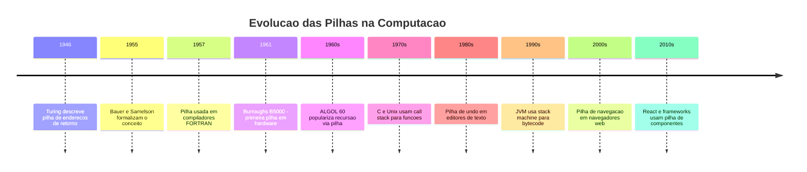

Hoje, toda CPU moderna tem suporte a pilha em hardware. O registrador **ESP** (Extended Stack Pointer) em processadores x86 aponta para o topo da pilha. Instruções como `PUSH` e `POP` manipulam a pilha diretamente. Quando você chama uma função em C, o compilador gera instruções `PUSH` para empilhar os parâmetros e o endereço de retorno, e `POP` para desempilhar quando a função retorna.

---

## LIFO: A Regra de Ouro

LIFO significa **Last In, First Out** — o último a entrar é o primeiro a sair. Essa é a única regra que define uma pilha. Assim como FIFO define a fila, LIFO define a pilha.

Para entender LIFO, compare com situações do dia a dia:

| Situação | Tipo | Regra |
|----------|------|-------|
| Pilha de pratos | LIFO | O último prato colocado e o primeiro retirado |
| Pilha de roupas na gaveta | LIFO | A última roupa colocada e a primeira que você pega |
| Pilha de livros na mesa | LIFO | O último livro colocado e o primeiro que você pega |
| Ctrl+Z no editor | LIFO | A última ação e a primeira desfeita |
| Botao voltar do navegador | LIFO | A última página visitada e a primeira revisitada |
| Fila do banco | FIFO | Quem chegou primeiro e atendido primeiro |
| Fila do supermercado | FIFO | Quem entrou na fila primeiro paga primeiro |

Observe que LIFO é o oposto de FIFO:

- **FIFO (Fila)**: o primeiro a entrar é o primeiro a sair — justo e ordenado
- **LIFO (Pilha)**: o último a entrar é o primeiro a sair — como uma pilha de pratos

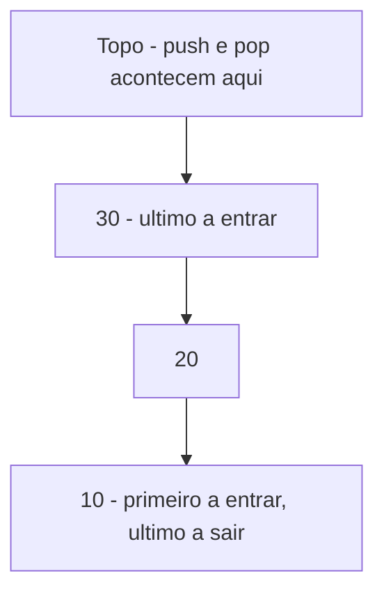

Na pilha acima, o elemento 10 entrou primeiro e está no fundo. O 30 entrou por último e está no topo. Quando fizermos `pop`, o 30 sai primeiro. Depois o 20. Por último, o 10. A ordem de saída é inversa à ordem de entrada.

---

## As Duas Operações Fundamentais

Uma pilha tem apenas duas operações principais:

### Push (Empilhar) — Inserir no Topo

Quando um novo elemento chega, ele é colocado no topo da pilha. Em inglês, isso se chama **push** (empurrar). É como colocar um prato limpo em cima da pilha de pratos.

### Pop (Desempilhar) — Remover do Topo

Quando precisamos de um elemento, retiramos o do topo da pilha. Em inglês, isso se chama **pop** (estourar/retirar). É como pegar o prato de cima da pilha.

Observe a diferença fundamental em relação à fila:

| Aspecto | Fila (FIFO) | Pilha (LIFO) |
|---------|-------------|--------------|
| Inserir | No final (enqueue) | No topo (push) |
| Remover | Do inicio (dequeue) | Do topo (pop) |
| Ponteiros necessários | front e rear (dois) | top (um) |
| Analogia | Fila do banco | Pilha de pratos |

A pilha é mais simples que a fila porque precisa de apenas um ponteiro — o topo. Tanto a inserção quanto a remoção acontecem no mesmo lugar: o topo. Na fila, inserção e remoção acontecem em pontas opostas, por isso precisa de dois ponteiros.

Além de push e pop, existem operações auxiliares:

| Operação | Descrição | Complexidade |
|----------|-----------|-------------|
| push | Inserir no topo da pilha | O(1) |
| pop | Remover do topo da pilha | O(1) |
| peek ou top | Ver o elemento do topo sem remover | O(1) |
| isEmpty | Verificar se a pilha esta vazia | O(1) |
| size | Contar quantos elementos tem | O(1) |

Todas as operações são O(1) — tempo constante. Assim como na fila, a restrição de onde podemos operar é o que garante a eficiência.

---
## Visualizando uma Pilha

Vamos acompanhar passo a passo o que acontece quando usamos uma pilha. Começamos com uma pilha vazia e fazemos uma série de operações:

### Estado Inicial: Pilha Vazia

```
Pilha: (vazia)
Top: NULL
```

### Passo 1: push(10)

O elemento 10 entra na pilha. Como a pilha estava vazia, ele é o topo (e o fundo):

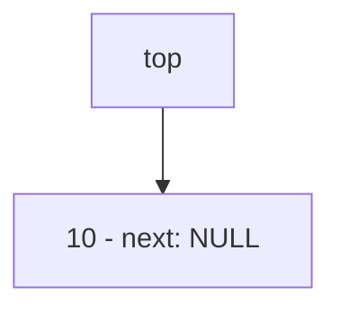

### Passo 2: push(20)

O elemento 20 entra no topo. O 10 fica embaixo:

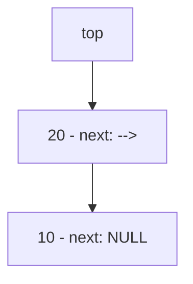

### Passo 3: push(30)

O elemento 30 entra no topo. O 20 fica no meio, o 10 no fundo:

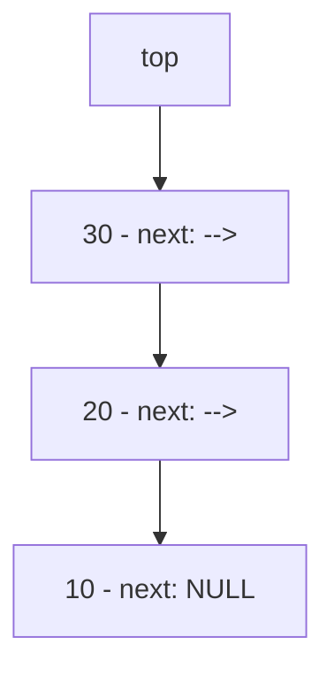

### Passo 4: pop() — retorna 30

O elemento 30 é removido do topo. O topo agora é o 20:


O valor 30 é retornado para quem chamou `pop`. A memória do nó que continha o 30 é liberada com `free`.

### Passo 5: push(40)

O elemento 40 entra no topo:


### Passo 6: pop() — retorna 40

O elemento 40 é removido do topo:


Observe o padrão: elementos sempre entram e saem pelo topo. O fundo da pilha é o lugar mais "antigo" — o primeiro elemento inserido. O topo é o mais "recente" — o último inserido. Diferente da fila (onde entrada e saída são em pontas opostas), na pilha tudo acontece no mesmo lugar.

---

## A Analogia: A Pilha de Pratos e o Elevador

Nos módulos anteriores, usamos analogias para cada estrutura: arrays são casas gêmeas em fileira, listas encadeadas são uma caça ao tesouro, filas são a fila do banco. Para pilhas, a analogia mais natural é a **pilha de pratos**.

Imagine a pia da cozinha. Você lava os pratos e vai empilhando: o primeiro prato lavado fica embaixo, o segundo em cima dele, o terceiro em cima do segundo. Quando alguém precisa de um prato, pega o de cima — o último que foi lavado.

| Conceito | Analogia da pilha de pratos |
|----------|----------------------------|
| Push | Colocar um prato limpo em cima da pilha |
| Pop | Pegar o prato de cima da pilha |
| Peek / Top | Olhar qual prato esta em cima sem pegar |
| Pilha vazia | Nenhum prato na pilha |
| Stack overflow | Pilha tao alta que cai (ou não cabe mais) |
| Stack underflow | Tentar pegar um prato quando não tem nenhum |

Outra analogia útil é o **elevador de um prédio**. Imagine um elevador que só para em cada andar na ordem inversa em que os botões foram apertados. Se alguém aperta 3, depois 7, depois 5, o elevador vai primeiro ao 5 (último apertado), depois ao 7, depois ao 3. Não é assim que elevadores reais funcionam, mas é exatamente como uma pilha funciona — o último pedido é atendido primeiro.

Uma terceira analogia: a **mochila**. Quando você arruma uma mochila, o primeiro item que coloca fica no fundo. O último item fica em cima. Quando precisa de algo, tira o que está em cima primeiro. Se o que você precisa está no fundo, tem que tirar tudo que está em cima antes. Isso é LIFO na prática.

---

## Implementando uma Pilha com Lista Encadeada

A implementação de uma pilha com lista encadeada é surpreendentemente simples — mais simples que a fila, na verdade. Enquanto a fila precisa de dois ponteiros (front e rear), a pilha precisa de apenas um: o topo (top).

### A Estrutura do Nó

O nó é idêntico ao da fila e da lista encadeada:

```c
// Cada elemento da pilha e um no
typedef struct No {
    int dado;           // o valor armazenado
    struct No *next;    // ponteiro para o proximo no (o que esta embaixo)
} No;
```

### A Estrutura da Pilha

A pilha é mais simples que a fila — precisa de apenas um ponteiro:

```c
// A pilha em si — contem ponteiro para o topo
typedef struct Pilha {
    No *top;        // ponteiro para o no do topo (de onde sai e onde entra)
    int tamanho;    // quantos elementos tem na pilha
} Pilha;
```

Compare com a fila:

| Campo | Fila | Pilha |
|-------|------|-------|
| Ponteiro 1 | front (inicio, de onde sai) | top (topo, onde entra e sai) |
| Ponteiro 2 | rear (final, onde entra) | — (não precisa) |
| Tamanho | tamanho | tamanho |

A pilha precisa de menos ponteiros porque inserção e remoção acontecem no mesmo lugar. Na fila, inserção é no final e remoção é no início — por isso precisa de dois ponteiros.

### Criar uma Pilha Vazia

```c
// Criar uma pilha vazia
// Retorna um ponteiro para a pilha criada
Pilha* criar_pilha() {
    Pilha *pilha = (Pilha*)malloc(sizeof(Pilha));
    if (pilha == NULL) {
        printf("Erro: memoria insuficiente!\n");
        return NULL;
    }
    pilha->top = NULL;      // pilha vazia — sem topo
    pilha->tamanho = 0;     // zero elementos
    return pilha;
}
```

---

## Push: Inserir no Topo

A operação `push` adiciona um novo elemento no topo da pilha. É equivalente a "inserir no início" de uma lista encadeada — o novo nó se torna o primeiro, e o antigo primeiro fica embaixo dele.

```c
// Push — inserir no topo da pilha
void push(Pilha *pilha, int valor) {
    // Criar o novo no
    No *novo = (No*)malloc(sizeof(No));
    if (novo == NULL) {
        printf("Erro: memoria insuficiente!\n");
        return;
    }
    novo->dado = valor;
    novo->next = pilha->top;  // o novo no aponta para o antigo topo
    pilha->top = novo;        // o topo agora e o novo no
    pilha->tamanho++;
    printf("Push: %d (tamanho: %d)\n", valor, pilha->tamanho);
}
```

Observe como o push é mais simples que o enqueue da fila. Na fila, precisávamos tratar dois casos (fila vazia e fila com elementos). Na pilha, não há caso especial — o código funciona igual para pilha vazia e pilha com elementos:

- Se a pilha está vazia, `pilha->top` é NULL. O novo nó aponta para NULL (correto — é o único elemento).
- Se a pilha tem elementos, `pilha->top` aponta para o antigo topo. O novo nó aponta para ele (correto — fica em cima).

Vamos visualizar o push do valor 30 em uma pilha que já tem 10 e 20:

**Antes:**


**Passo 1 — criar novo nó com valor 30, next aponta para o topo atual (20):**
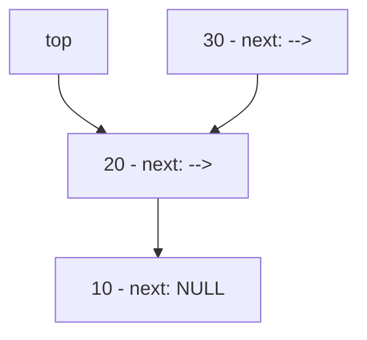

**Passo 2 — top agora aponta para o novo nó (30):**


Duas linhas de código fazem todo o trabalho: `novo->next = pilha->top` e `pilha->top = novo`. A operação é O(1).

---

## Pop: Remover do Topo

A operação `pop` remove e retorna o elemento do topo da pilha. É equivalente a "remover do início" de uma lista encadeada.

```c
// Pop — remover do topo da pilha
// Retorna o valor removido, ou -1 se a pilha estiver vazia
int pop(Pilha *pilha) {
    // Verificar se a pilha esta vazia
    if (pilha->top == NULL) {
        printf("Erro: pilha vazia! Nao ha o que remover.\n");
        return -1;
    }

    // Salvar o no que sera removido
    No *temp = pilha->top;
    int valor = temp->dado;

    // O topo agora e o proximo no
    pilha->top = pilha->top->next;

    // Liberar a memoria do no removido
    free(temp);
    pilha->tamanho--;

    printf("Pop: %d (tamanho: %d)\n", valor, pilha->tamanho);
    return valor;
}
```

Compare com o dequeue da fila:

| Aspecto | Dequeue (Fila) | Pop (Pilha) |
|---------|---------------|-------------|
| Remove de onde | Do inicio (front) | Do topo (top) |
| Atualiza | front = front->next | top = top->next |
| Caso especial | Se fila ficou vazia, rear = NULL | Nenhum — top fica NULL naturalmente |
| Complexidade | O(1) | O(1) |

O pop é mais simples que o dequeue porque não precisa se preocupar com o ponteiro rear. Na fila, quando removemos o último elemento, precisamos atualizar tanto o front quanto o rear. Na pilha, só existe o top — quando removemos o último elemento, `top->next` é NULL, então `top` fica NULL automaticamente. Sem caso especial.

Vamos visualizar o pop em uma pilha com 30, 20 e 10:

**Antes:**


**Passo 1 — salvar referência ao topo (nó 30) em temp:**

`temp` aponta para o nó 30. `valor` recebe 30.

**Passo 2 — top = top->next (top avança para o nó 20):**


**Passo 3 — free(temp) (liberar a memória do nó 30):**

O nó com valor 30 é devolvido ao sistema operacional. A pilha agora tem 20 e 10.

---
## Peek, isEmpty e Funções Auxiliares

### Peek: Espiar sem Remover

Às vezes você quer saber qual é o elemento do topo sem removê-lo. É como olhar o prato de cima da pilha sem pegá-lo.

```c
// Peek — ver o elemento do topo sem remover
int peek(Pilha *pilha) {
    if (pilha->top == NULL) {
        printf("Erro: pilha vazia!\n");
        return -1;
    }
    return pilha->top->dado;
}
```

### Verificar se a Pilha está Vazia

```c
// Verificar se a pilha esta vazia
// Retorna 1 se vazia, 0 se tem elementos
int esta_vazia(Pilha *pilha) {
    return pilha->top == NULL;
}
```

### Imprimir a Pilha

Para visualizar o conteúdo da pilha, percorremos do topo ao fundo:

```c
// Imprimir todos os elementos da pilha
void imprimir_pilha(Pilha *pilha) {
    if (pilha->top == NULL) {
        printf("Pilha: (vazia)\n");
        return;
    }

    printf("Pilha: TOP -> ");
    No *atual = pilha->top;
    while (atual != NULL) {
        printf("[%d]", atual->dado);
        if (atual->next != NULL) {
            printf(" -> ");
        }
        atual = atual->next;
    }
    printf(" <- FUNDO (tamanho: %d)\n", pilha->tamanho);
}
```

### Liberar a Pilha

Quando terminamos de usar a pilha, precisamos liberar toda a memória:

```c
// Liberar toda a memoria da pilha
void liberar_pilha(Pilha *pilha) {
    No *atual = pilha->top;
    while (atual != NULL) {
        No *proximo = atual->next;
        free(atual);
        atual = proximo;
    }
    free(pilha);  // liberar a struct Pilha tambem
}
```

---

## Programa Completo: Pilha com Todas as Operações

Vamos juntar tudo em um programa completo e funcional:

```c
// pilha_completa.c — Pilha LIFO com lista encadeada
#include <stdio.h>
#include <stdlib.h>

// --- Estruturas ---

typedef struct No {
    int dado;
    struct No *next;
} No;

typedef struct Pilha {
    No *top;        // topo da pilha (onde entra e sai)
    int tamanho;    // quantidade de elementos
} Pilha;

// --- Funcoes ---

Pilha* criar_pilha() {
    Pilha *pilha = (Pilha*)malloc(sizeof(Pilha));
    if (pilha == NULL) {
        printf("Erro: memoria insuficiente!\n");
        return NULL;
    }
    pilha->top = NULL;
    pilha->tamanho = 0;
    return pilha;
}

void push(Pilha *pilha, int valor) {
    No *novo = (No*)malloc(sizeof(No));
    if (novo == NULL) {
        printf("Erro: memoria insuficiente!\n");
        return;
    }
    novo->dado = valor;
    novo->next = pilha->top;
    pilha->top = novo;
    pilha->tamanho++;
}

int pop(Pilha *pilha) {
    if (pilha->top == NULL) {
        printf("Erro: pilha vazia!\n");
        return -1;
    }

    No *temp = pilha->top;
    int valor = temp->dado;
    pilha->top = pilha->top->next;
    free(temp);
    pilha->tamanho--;
    return valor;
}

int peek(Pilha *pilha) {
    if (pilha->top == NULL) {
        printf("Erro: pilha vazia!\n");
        return -1;
    }
    return pilha->top->dado;
}

int esta_vazia(Pilha *pilha) {
    return pilha->top == NULL;
}

void imprimir_pilha(Pilha *pilha) {
    if (pilha->top == NULL) {
        printf("Pilha: (vazia)\n");
        return;
    }
    printf("Pilha: TOP -> ");
    No *atual = pilha->top;
    while (atual != NULL) {
        printf("[%d]", atual->dado);
        if (atual->next != NULL) printf(" -> ");
        atual = atual->next;
    }
    printf(" <- FUNDO (tamanho: %d)\n", pilha->tamanho);
}

void liberar_pilha(Pilha *pilha) {
    No *atual = pilha->top;
    while (atual != NULL) {
        No *proximo = atual->next;
        free(atual);
        atual = proximo;
    }
    free(pilha);
}

// --- Programa principal ---

int main() {
    printf("=== Pilha LIFO — Demonstracao Completa ===\n\n");

    Pilha *pilha = criar_pilha();

    // Empilhar elementos
    printf("--- Empilhando elementos ---\n");
    push(pilha, 10);
    imprimir_pilha(pilha);

    push(pilha, 20);
    imprimir_pilha(pilha);

    push(pilha, 30);
    imprimir_pilha(pilha);

    push(pilha, 40);
    imprimir_pilha(pilha);

    push(pilha, 50);
    imprimir_pilha(pilha);

    // Espiar o topo
    printf("\n--- Peek ---\n");
    printf("Topo: %d\n", peek(pilha));

    // Desempilhar elementos
    printf("\n--- Desempilhando elementos ---\n");
    int valor;

    valor = pop(pilha);
    printf("Removido: %d\n", valor);
    imprimir_pilha(pilha);

    valor = pop(pilha);
    printf("Removido: %d\n", valor);
    imprimir_pilha(pilha);

    // Empilhar mais elementos
    printf("\n--- Empilhando mais ---\n");
    push(pilha, 60);
    push(pilha, 70);
    imprimir_pilha(pilha);

    // Esvaziar a pilha completamente
    printf("\n--- Esvaziando a pilha ---\n");
    while (!esta_vazia(pilha)) {
        valor = pop(pilha);
        printf("Removido: %d\n", valor);
    }
    imprimir_pilha(pilha);

    // Tentar remover de pilha vazia
    printf("\n--- Tentando remover de pilha vazia ---\n");
    pop(pilha);

    // Liberar memoria
    liberar_pilha(pilha);
    printf("\nMemoria liberada.\n");

    return 0;
}
```

Saída esperada:
```
=== Pilha LIFO — Demonstracao Completa ===

--- Empilhando elementos ---
Pilha: TOP -> [10] <- FUNDO (tamanho: 1)
Pilha: TOP -> [20] -> [10] <- FUNDO (tamanho: 2)
Pilha: TOP -> [30] -> [20] -> [10] <- FUNDO (tamanho: 3)
Pilha: TOP -> [40] -> [30] -> [20] -> [10] <- FUNDO (tamanho: 4)
Pilha: TOP -> [50] -> [40] -> [30] -> [20] -> [10] <- FUNDO (tamanho: 5)

--- Peek ---
Topo: 50

--- Desempilhando elementos ---
Removido: 50
Pilha: TOP -> [40] -> [30] -> [20] -> [10] <- FUNDO (tamanho: 4)
Removido: 40
Pilha: TOP -> [30] -> [20] -> [10] <- FUNDO (tamanho: 3)

--- Empilhando mais ---
Pilha: TOP -> [70] -> [60] -> [30] -> [20] -> [10] <- FUNDO (tamanho: 5)

--- Esvaziando a pilha ---
Removido: 70
Removido: 60
Removido: 30
Removido: 20
Removido: 10
Pilha: (vazia)

--- Tentando remover de pilha vazia ---
Erro: pilha vazia!

Memoria liberada.
```

Observe a ordem de saída: 50, 40, 70, 60, 30, 20, 10. Os elementos saem na ordem inversa em que entraram. Isso é LIFO em ação. Compare com a fila do módulo anterior, onde os elementos saíam na mesma ordem em que entraram (FIFO).

---

## A Call Stack: A Pilha Mais Importante da Computação

A aplicação mais fundamental de pilhas na computação é a **call stack** (pilha de chamadas). Toda vez que seu programa chama uma função, o computador usa uma pilha para gerenciar a execução. Entender a call stack é entender como programas funcionam por dentro.

### O que Acontece Quando Você Chama uma Função

Quando uma função é chamada, o computador precisa guardar várias informações:
- O endereço de retorno (para onde voltar quando a função terminar)
- Os parâmetros da função
- As variáveis locais da função

Todas essas informações são empilhadas em um bloco chamado **stack frame** (quadro de pilha). Cada chamada de função cria um novo stack frame no topo da pilha. Quando a função retorna, seu stack frame é desempilhado.

Vamos ver isso com um exemplo em C:

```c
// call_stack_demo.c — Demonstracao da call stack
#include <stdio.h>

int multiplicar(int a, int b) {
    int resultado = a * b;  // variavel local
    printf("  multiplicar(%d, %d) = %d\n", a, b, resultado);
    return resultado;
}

int calcular_area(int largura, int altura) {
    printf("  calcular_area(%d, %d) — chamando multiplicar\n", largura, altura);
    int area = multiplicar(largura, altura);  // chama outra funcao
    return area;
}

int main() {
    printf("main() — chamando calcular_area\n");
    int resultado = calcular_area(5, 3);
    printf("main() — resultado: %d\n", resultado);
    return 0;
}
```

Saída esperada:
```
main() — chamando calcular_area
  calcular_area(5, 3) — chamando multiplicar
  multiplicar(5, 3) = 15
main() — resultado: 15
```

Vamos visualizar a call stack durante a execução:

**Passo 1 — main() começa:**
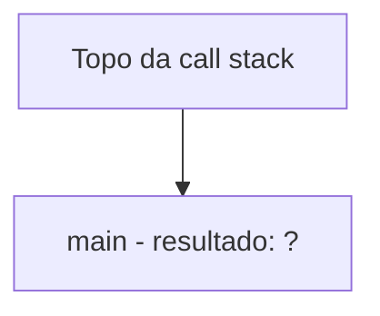

**Passo 2 — main() chama calcular_area(5, 3):**
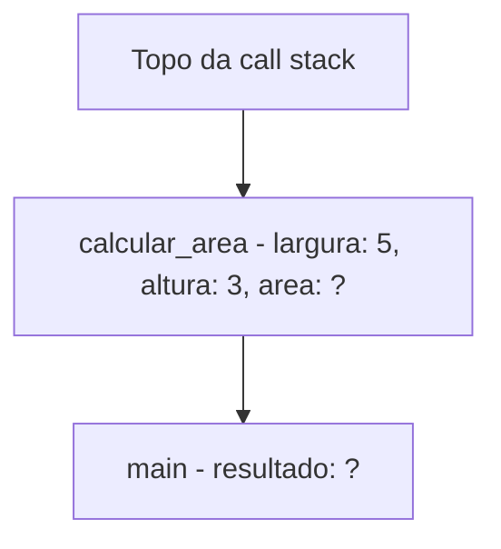

**Passo 3 — calcular_area() chama multiplicar(5, 3):**
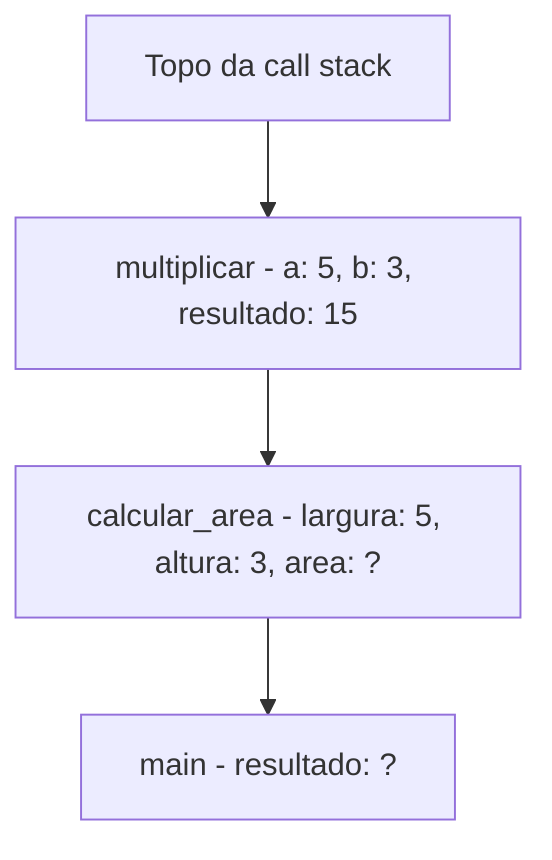

**Passo 4 — multiplicar() retorna 15 (desempilha):**
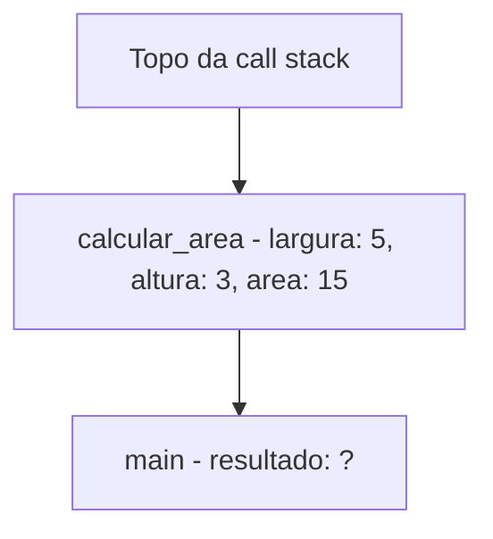

**Passo 5 — calcular_area() retorna 15 (desempilha):**
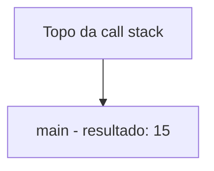

**Passo 6 — main() termina (desempilha):**

A pilha fica vazia. O programa termina.

Cada função empilha seu contexto quando é chamada e desempilha quando retorna. A ordem é sempre LIFO: a última função chamada é a primeira a retornar. Isso é fundamental para que o programa saiba "para onde voltar" após cada chamada.

### Stack Overflow: Quando a Pilha Estoura

A call stack tem um tamanho limitado (geralmente entre 1 MB e 8 MB, dependendo do sistema operacional). Se você empilhar frames demais — por exemplo, com uma recursão infinita — a pilha estoura. Isso se chama **stack overflow** (estouro de pilha).

```c
// stack_overflow_demo.c — CUIDADO: este programa vai crashar!
#include <stdio.h>

void recursao_infinita(int n) {
    printf("Chamada %d\n", n);
    recursao_infinita(n + 1);  // nunca para!
}

int main() {
    recursao_infinita(1);  // vai crashar com "Segmentation fault"
    return 0;
}
```

Saída (parcial):
```
Chamada 1
Chamada 2
Chamada 3
...
Chamada 261634
Segmentation fault (core dumped)
```

O número exato de chamadas antes do crash depende do tamanho da pilha e do tamanho de cada stack frame. Mas o resultado é sempre o mesmo: quando a pilha não tem mais espaço, o programa é encerrado pelo sistema operacional.

O site Stack Overflow (stackoverflow.com), um dos mais importantes para programadores, recebeu esse nome justamente por causa desse erro — é um lugar onde programadores vão quando seus programas "estouram".

### Recursão e a Call Stack

Recursão é quando uma função chama a si mesma. Cada chamada recursiva empilha um novo stack frame. Quando a condição de parada é atingida, os frames são desempilhados um a um, e cada chamada retorna seu resultado.

```c
// fatorial_recursivo.c — Recursao usando a call stack
#include <stdio.h>

int fatorial(int n) {
    printf("  fatorial(%d) — empilhando\n", n);

    // Caso base: fatorial de 0 ou 1 e 1
    if (n <= 1) {
        printf("  fatorial(%d) = 1 — caso base, comecando a desempilhar\n", n);
        return 1;
    }

    // Caso recursivo: n * fatorial(n-1)
    int resultado = n * fatorial(n - 1);
    printf("  fatorial(%d) = %d — desempilhando\n", n, resultado);
    return resultado;
}

int main() {
    printf("Calculando fatorial de 5:\n\n");
    int resultado = fatorial(5);
    printf("\nResultado: 5! = %d\n", resultado);
    return 0;
}
```

Saída esperada:
```
Calculando fatorial de 5:

  fatorial(5) — empilhando
  fatorial(4) — empilhando
  fatorial(3) — empilhando
  fatorial(2) — empilhando
  fatorial(1) — empilhando
  fatorial(1) = 1 — caso base, comecando a desempilhar
  fatorial(2) = 2 — desempilhando
  fatorial(3) = 6 — desempilhando
  fatorial(4) = 24 — desempilhando
  fatorial(5) = 120 — desempilhando

Resultado: 5! = 120
```

A call stack durante o cálculo de fatorial(5):

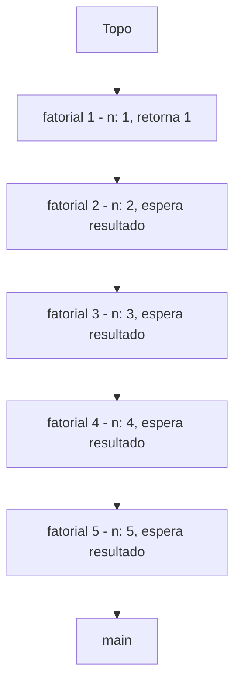

Quando fatorial(1) retorna 1, o desempilhamento começa: fatorial(2) calcula 2*1=2, fatorial(3) calcula 3*2=6, fatorial(4) calcula 4*6=24, fatorial(5) calcula 5*24=120.

---
## Exemplo Prático: Sistema de Undo/Redo

Vamos implementar um sistema de undo/redo como o de um editor de texto. Cada ação do usuário é empilhada na pilha de undo. Quando o usuário desfaz (Ctrl+Z), a ação é desempilhada do undo e empilhada no redo. Quando refaz (Ctrl+Y), a ação é desempilhada do redo e empilhada no undo.

```c
// undo_redo.c — Sistema de undo/redo com duas pilhas
#include <stdio.h>
#include <stdlib.h>
#include <string.h>

// Cada acao do usuario
typedef struct Acao {
    char descricao[100];
    struct Acao *next;
} Acao;

// Pilha de acoes
typedef struct PilhaAcoes {
    Acao *top;
    int tamanho;
} PilhaAcoes;

PilhaAcoes* criar_pilha_acoes() {
    PilhaAcoes *p = (PilhaAcoes*)malloc(sizeof(PilhaAcoes));
    if (p == NULL) return NULL;
    p->top = NULL;
    p->tamanho = 0;
    return p;
}

void push_acao(PilhaAcoes *pilha, const char *descricao) {
    Acao *nova = (Acao*)malloc(sizeof(Acao));
    if (nova == NULL) return;
    strncpy(nova->descricao, descricao, 99);
    nova->descricao[99] = '\0';
    nova->next = pilha->top;
    pilha->top = nova;
    pilha->tamanho++;
}

// Pop que retorna a descricao via parametro de saida
int pop_acao(PilhaAcoes *pilha, char *resultado) {
    if (pilha->top == NULL) return 0;  // falha

    Acao *temp = pilha->top;
    strncpy(resultado, temp->descricao, 99);
    resultado[99] = '\0';
    pilha->top = pilha->top->next;
    free(temp);
    pilha->tamanho--;
    return 1;  // sucesso
}

void limpar_pilha(PilhaAcoes *pilha) {
    Acao *atual = pilha->top;
    while (atual != NULL) {
        Acao *proximo = atual->next;
        free(atual);
        atual = proximo;
    }
    pilha->top = NULL;
    pilha->tamanho = 0;
}

void mostrar_pilha(PilhaAcoes *pilha, const char *nome) {
    printf("  %s (%d): ", nome, pilha->tamanho);
    if (pilha->top == NULL) {
        printf("(vazia)\n");
        return;
    }
    Acao *atual = pilha->top;
    while (atual != NULL) {
        printf("[%s]", atual->descricao);
        if (atual->next != NULL) printf(" -> ");
        atual = atual->next;
    }
    printf("\n");
}

void liberar_pilha_acoes(PilhaAcoes *pilha) {
    limpar_pilha(pilha);
    free(pilha);
}

// --- Sistema de undo/redo ---

void executar_acao(PilhaAcoes *undo, PilhaAcoes *redo, const char *descricao) {
    push_acao(undo, descricao);
    limpar_pilha(redo);  // nova acao invalida o historico de redo
    printf("[ACAO] %s\n", descricao);
}

void desfazer(PilhaAcoes *undo, PilhaAcoes *redo) {
    char acao[100];
    if (pop_acao(undo, acao)) {
        push_acao(redo, acao);
        printf("[UNDO] Desfeito: %s\n", acao);
    } else {
        printf("[UNDO] Nada para desfazer.\n");
    }
}

void refazer(PilhaAcoes *undo, PilhaAcoes *redo) {
    char acao[100];
    if (pop_acao(redo, acao)) {
        push_acao(undo, acao);
        printf("[REDO] Refeito: %s\n", acao);
    } else {
        printf("[REDO] Nada para refazer.\n");
    }
}

int main() {
    printf("=== Sistema de Undo/Redo ===\n\n");

    PilhaAcoes *undo = criar_pilha_acoes();
    PilhaAcoes *redo = criar_pilha_acoes();

    // Usuario executa acoes
    printf("--- Usuario editando documento ---\n");
    executar_acao(undo, redo, "Digitar: Ola mundo");
    executar_acao(undo, redo, "Negrito: Ola");
    executar_acao(undo, redo, "Digitar: Como vai?");
    executar_acao(undo, redo, "Inserir imagem");
    executar_acao(undo, redo, "Digitar: Fim do texto");

    printf("\n");
    mostrar_pilha(undo, "Undo");
    mostrar_pilha(redo, "Redo");

    // Usuario desfaz 3 acoes (Ctrl+Z, Ctrl+Z, Ctrl+Z)
    printf("\n--- Usuario apertando Ctrl+Z ---\n");
    desfazer(undo, redo);
    desfazer(undo, redo);
    desfazer(undo, redo);

    printf("\n");
    mostrar_pilha(undo, "Undo");
    mostrar_pilha(redo, "Redo");

    // Usuario refaz 1 acao (Ctrl+Y)
    printf("\n--- Usuario apertando Ctrl+Y ---\n");
    refazer(undo, redo);

    printf("\n");
    mostrar_pilha(undo, "Undo");
    mostrar_pilha(redo, "Redo");

    // Usuario executa nova acao (invalida o redo restante)
    printf("\n--- Usuario executa nova acao ---\n");
    executar_acao(undo, redo, "Digitar: Novo texto");

    printf("\n");
    mostrar_pilha(undo, "Undo");
    mostrar_pilha(redo, "Redo");

    // Tentar desfazer tudo
    printf("\n--- Desfazendo tudo ---\n");
    while (undo->tamanho > 0) {
        desfazer(undo, redo);
    }
    desfazer(undo, redo);  // tentar desfazer com pilha vazia

    liberar_pilha_acoes(undo);
    liberar_pilha_acoes(redo);
    printf("\nMemoria liberada.\n");

    return 0;
}
```

Saída esperada:
```
=== Sistema de Undo/Redo ===

--- Usuario editando documento ---
[ACAO] Digitar: Ola mundo
[ACAO] Negrito: Ola
[ACAO] Digitar: Como vai?
[ACAO] Inserir imagem
[ACAO] Digitar: Fim do texto

  Undo (5): [Digitar: Fim do texto] -> [Inserir imagem] -> [Digitar: Como vai?] -> [Negrito: Ola] -> [Digitar: Ola mundo]
  Redo (0): (vazia)

--- Usuario apertando Ctrl+Z ---
[UNDO] Desfeito: Digitar: Fim do texto
[UNDO] Desfeito: Inserir imagem
[UNDO] Desfeito: Digitar: Como vai?

  Undo (2): [Negrito: Ola] -> [Digitar: Ola mundo]
  Redo (3): [Digitar: Como vai?] -> [Inserir imagem] -> [Digitar: Fim do texto]

--- Usuario apertando Ctrl+Y ---
[REDO] Refeito: Digitar: Como vai?

  Undo (3): [Digitar: Como vai?] -> [Negrito: Ola] -> [Digitar: Ola mundo]
  Redo (2): [Inserir imagem] -> [Digitar: Fim do texto]

--- Usuario executa nova acao ---
[ACAO] Digitar: Novo texto

  Undo (4): [Digitar: Novo texto] -> [Digitar: Como vai?] -> [Negrito: Ola] -> [Digitar: Ola mundo]
  Redo (0): (vazia)

--- Desfazendo tudo ---
[UNDO] Desfeito: Digitar: Novo texto
[UNDO] Desfeito: Digitar: Como vai?
[UNDO] Desfeito: Negrito: Ola
[UNDO] Desfeito: Digitar: Ola mundo
[UNDO] Nada para desfazer.

Memoria liberada.
```

Pontos importantes deste exemplo:

1. **Duas pilhas trabalham juntas** — undo e redo são pilhas separadas que transferem ações entre si
2. **Nova ação limpa o redo** — quando o usuário executa uma nova ação após desfazer, o histórico de redo é invalidado (não faz sentido "refazer" algo que foi substituído por uma ação nova)
3. **A ordem é sempre LIFO** — a última ação executada é a primeira desfeita, a última desfeita é a primeira refeita

Esse é exatamente o padrão usado por editores de texto (VSCode, Word, Google Docs), editores de imagem (Photoshop, GIMP), e qualquer software que suporte undo/redo.

---

## Exemplo Prático: Verificador de Parênteses Balanceados

Um dos usos clássicos de pilhas é verificar se parênteses, colchetes e chaves estão balanceados em uma expressão. Compiladores fazem isso para validar código-fonte. A regra é: cada abertura deve ter um fechamento correspondente, na ordem correta.

Exemplos válidos: `()`, `(())`, `({[]})`, `[()]{}`
Exemplos inválidos: `(`, `)(`, `({)`, `[}`, `(()`

O algoritmo é simples:
1. Percorra a string caractere por caractere
2. Se encontrar uma abertura (`(`, `[`, `{`), empilhe
3. Se encontrar um fechamento (`)`, `]`, `}`), desempilhe e verifique se corresponde
4. No final, a pilha deve estar vazia

```c
// parenteses.c — Verificador de parenteses balanceados
#include <stdio.h>
#include <stdlib.h>
#include <string.h>

typedef struct NoChar {
    char dado;
    struct NoChar *next;
} NoChar;

typedef struct PilhaChar {
    NoChar *top;
    int tamanho;
} PilhaChar;

PilhaChar* criar_pilha_char() {
    PilhaChar *p = (PilhaChar*)malloc(sizeof(PilhaChar));
    if (p == NULL) return NULL;
    p->top = NULL;
    p->tamanho = 0;
    return p;
}

void push_char(PilhaChar *pilha, char c) {
    NoChar *novo = (NoChar*)malloc(sizeof(NoChar));
    if (novo == NULL) return;
    novo->dado = c;
    novo->next = pilha->top;
    pilha->top = novo;
    pilha->tamanho++;
}

char pop_char(PilhaChar *pilha) {
    if (pilha->top == NULL) return '\0';
    NoChar *temp = pilha->top;
    char c = temp->dado;
    pilha->top = pilha->top->next;
    free(temp);
    pilha->tamanho--;
    return c;
}

void liberar_pilha_char(PilhaChar *pilha) {
    NoChar *atual = pilha->top;
    while (atual != NULL) {
        NoChar *proximo = atual->next;
        free(atual);
        atual = proximo;
    }
    free(pilha);
}

// Verifica se o fechamento corresponde a abertura
int corresponde(char abertura, char fechamento) {
    return (abertura == '(' && fechamento == ')') ||
           (abertura == '[' && fechamento == ']') ||
           (abertura == '{' && fechamento == '}');
}

int verificar_parenteses(const char *expressao) {
    PilhaChar *pilha = criar_pilha_char();
    int valido = 1;

    printf("  Verificando: %s\n", expressao);

    for (int i = 0; expressao[i] != '\0'; i++) {
        char c = expressao[i];

        // Se e abertura, empilha
        if (c == '(' || c == '[' || c == '{') {
            push_char(pilha, c);
            printf("    [%d] '%c' — empilhado\n", i, c);
        }
        // Se e fechamento, desempilha e verifica
        else if (c == ')' || c == ']' || c == '}') {
            if (pilha->top == NULL) {
                printf("    [%d] '%c' — ERRO: fechamento sem abertura!\n", i, c);
                valido = 0;
                break;
            }
            char topo = pop_char(pilha);
            if (!corresponde(topo, c)) {
                printf("    [%d] '%c' — ERRO: esperava fechamento de '%c', encontrou '%c'\n",
                       i, c, topo, c);
                valido = 0;
                break;
            }
            printf("    [%d] '%c' — corresponde a '%c', desempilhado\n", i, c, topo);
        }
    }

    // Se a pilha nao esta vazia, faltam fechamentos
    if (valido && pilha->tamanho > 0) {
        printf("    ERRO: %d abertura(s) sem fechamento!\n", pilha->tamanho);
        valido = 0;
    }

    liberar_pilha_char(pilha);
    return valido;
}

int main() {
    printf("=== Verificador de Parenteses ===\n\n");

    const char *testes[] = {
        "()",
        "(())",
        "({[]})",
        "[()]()",
        "(()",
        ")()",
        "({)",
        "[}",
        "{[()]}([])",
        NULL
    };

    for (int i = 0; testes[i] != NULL; i++) {
        int resultado = verificar_parenteses(testes[i]);
        printf("  Resultado: %s\n\n", resultado ? "VALIDO" : "INVALIDO");
    }

    return 0;
}
```

Saída esperada (resumida):
```
=== Verificador de Parenteses ===

  Verificando: ()
    [0] '(' — empilhado
    [1] ')' — corresponde a '(', desempilhado
  Resultado: VALIDO

  Verificando: (())
    [0] '(' — empilhado
    [1] '(' — empilhado
    [2] ')' — corresponde a '(', desempilhado
    [3] ')' — corresponde a '(', desempilhado
  Resultado: VALIDO

  Verificando: (()
    [0] '(' — empilhado
    [1] '(' — empilhado
    [2] ')' — corresponde a '(', desempilhado
    ERRO: 1 abertura(s) sem fechamento!
  Resultado: INVALIDO

  Verificando: )()
    [0] ')' — ERRO: fechamento sem abertura!
  Resultado: INVALIDO

  Verificando: ({)
    [0] '(' — empilhado
    [1] '{' — empilhado
    [2] ')' — ERRO: esperava fechamento de '{', encontrou ')'
  Resultado: INVALIDO
```

Esse algoritmo é usado por compiladores, editores de código (para destacar parênteses correspondentes), e ferramentas de validação de JSON, XML e HTML. A pilha é perfeita para isso porque cada abertura precisa ser fechada na ordem inversa — exatamente LIFO.

---
## Exemplo Prático: Calculadora com Notação Pós-fixa (RPN)

Existe uma forma de escrever expressões matemáticas que elimina completamente a necessidade de parênteses: a **notação pós-fixa** (ou **RPN** — Reverse Polish Notation, Notação Polonesa Reversa). Em vez de escrever `3 + 4`, você escreve `3 4 +`. Em vez de `(3 + 4) * 2`, escreve `3 4 + 2 *`.

A avaliação de expressões em RPN usa uma pilha:
1. Se o token é um número, empilhe
2. Se o token é um operador, desempilhe dois números, aplique o operador, empilhe o resultado
3. No final, o resultado está no topo da pilha

```c
// rpn_calc.c — Calculadora RPN com pilha
#include <stdio.h>
#include <stdlib.h>
#include <string.h>
#include <ctype.h>

typedef struct NoFloat {
    float dado;
    struct NoFloat *next;
} NoFloat;

typedef struct PilhaFloat {
    NoFloat *top;
    int tamanho;
} PilhaFloat;

PilhaFloat* criar_pilha_float() {
    PilhaFloat *p = (PilhaFloat*)malloc(sizeof(PilhaFloat));
    if (p == NULL) return NULL;
    p->top = NULL;
    p->tamanho = 0;
    return p;
}

void push_float(PilhaFloat *pilha, float valor) {
    NoFloat *novo = (NoFloat*)malloc(sizeof(NoFloat));
    if (novo == NULL) return;
    novo->dado = valor;
    novo->next = pilha->top;
    pilha->top = novo;
    pilha->tamanho++;
}

float pop_float(PilhaFloat *pilha) {
    if (pilha->top == NULL) {
        printf("Erro: pilha vazia!\n");
        return 0;
    }
    NoFloat *temp = pilha->top;
    float valor = temp->dado;
    pilha->top = pilha->top->next;
    free(temp);
    pilha->tamanho--;
    return valor;
}

void liberar_pilha_float(PilhaFloat *pilha) {
    NoFloat *atual = pilha->top;
    while (atual != NULL) {
        NoFloat *proximo = atual->next;
        free(atual);
        atual = proximo;
    }
    free(pilha);
}

float calcular_rpn(const char *expressao) {
    PilhaFloat *pilha = criar_pilha_float();
    char copia[200];
    strncpy(copia, expressao, 199);
    copia[199] = '\0';

    printf("  Expressao RPN: %s\n", expressao);

    char *token = strtok(copia, " ");
    while (token != NULL) {
        // Se e um numero, empilha
        if (isdigit(token[0]) || (token[0] == '-' && isdigit(token[1]))) {
            float num = atof(token);
            push_float(pilha, num);
            printf("    Push: %.1f\n", num);
        }
        // Se e um operador, desempilha dois e opera
        else if (strlen(token) == 1 && strchr("+-*/", token[0])) {
            float b = pop_float(pilha);  // segundo operando (desempilha primeiro)
            float a = pop_float(pilha);  // primeiro operando
            float resultado = 0;

            switch (token[0]) {
                case '+': resultado = a + b; break;
                case '-': resultado = a - b; break;
                case '*': resultado = a * b; break;
                case '/':
                    if (b == 0) {
                        printf("    Erro: divisao por zero!\n");
                        liberar_pilha_float(pilha);
                        return 0;
                    }
                    resultado = a / b;
                    break;
            }

            push_float(pilha, resultado);
            printf("    %.1f %c %.1f = %.1f (push resultado)\n",
                   a, token[0], b, resultado);
        }

        token = strtok(NULL, " ");
    }

    float resultado_final = pop_float(pilha);
    liberar_pilha_float(pilha);
    return resultado_final;
}

int main() {
    printf("=== Calculadora RPN ===\n\n");

    // 3 + 4 = 7
    float r1 = calcular_rpn("3 4 +");
    printf("  Resultado: %.1f\n\n", r1);

    // (3 + 4) * 2 = 14
    float r2 = calcular_rpn("3 4 + 2 *");
    printf("  Resultado: %.1f\n\n", r2);

    // 5 + ((1 + 2) * 4) - 3 = 14
    float r3 = calcular_rpn("5 1 2 + 4 * + 3 -");
    printf("  Resultado: %.1f\n\n", r3);

    // 10 / 3 = 3.3
    float r4 = calcular_rpn("10 3 /");
    printf("  Resultado: %.1f\n\n", r4);

    return 0;
}
```

Saída esperada:
```
=== Calculadora RPN ===

  Expressao RPN: 3 4 +
    Push: 3.0
    Push: 4.0
    3.0 + 4.0 = 7.0 (push resultado)
  Resultado: 7.0

  Expressao RPN: 3 4 + 2 *
    Push: 3.0
    Push: 4.0
    3.0 + 4.0 = 7.0 (push resultado)
    Push: 2.0
    7.0 * 2.0 = 14.0 (push resultado)
  Resultado: 14.0

  Expressao RPN: 5 1 2 + 4 * + 3 -
    Push: 5.0
    Push: 1.0
    Push: 2.0
    1.0 + 2.0 = 3.0 (push resultado)
    Push: 4.0
    3.0 * 4.0 = 12.0 (push resultado)
    5.0 + 12.0 = 17.0 (push resultado)
    Push: 3.0
    17.0 - 3.0 = 14.0 (push resultado)
  Resultado: 14.0

  Expressao RPN: 10 3 /
    Push: 10.0
    Push: 3.0
    10.0 / 3.0 = 3.3 (push resultado)
  Resultado: 3.3
```

A notação RPN foi inventada pelo matemático polonês Jan Lukasiewicz nos anos 1920 e popularizada pela Hewlett-Packard em suas calculadoras científicas nos anos 1970. Engenheiros e cientistas adoravam calculadoras HP porque a RPN é mais eficiente para cálculos complexos — não precisa de parênteses nem de se preocupar com precedência de operadores. Até hoje, calculadoras HP e muitos programadores preferem RPN.

Compiladores usam uma variação desse algoritmo para avaliar expressões. Primeiro, convertem a expressão infixa (`3 + 4 * 2`) para pós-fixa (`3 4 2 * +`) usando o algoritmo Shunting-yard (que também usa pilha), e depois avaliam a expressão pós-fixa com o algoritmo que acabamos de implementar.

---

## Pilha com Array vs Pilha com Lista Encadeada

Assim como filas, pilhas podem ser implementadas com arrays ou listas encadeadas:

### Pilha com Array

```c
// pilha_array.c — Pilha com array de tamanho fixo
#include <stdio.h>

#define MAX 10

typedef struct PilhaArray {
    int dados[MAX];
    int topo;       // indice do proximo espaco livre
} PilhaArray;

void inicializar(PilhaArray *pilha) {
    pilha->topo = 0;  // pilha vazia — topo no indice 0
}

int esta_cheia_arr(PilhaArray *pilha) {
    return pilha->topo == MAX;
}

int esta_vazia_arr(PilhaArray *pilha) {
    return pilha->topo == 0;
}

void push_arr(PilhaArray *pilha, int valor) {
    if (esta_cheia_arr(pilha)) {
        printf("Erro: pilha cheia! (max: %d)\n", MAX);
        return;
    }
    pilha->dados[pilha->topo] = valor;
    pilha->topo++;
    printf("Push: %d (topo: %d)\n", valor, pilha->topo);
}

int pop_arr(PilhaArray *pilha) {
    if (esta_vazia_arr(pilha)) {
        printf("Erro: pilha vazia!\n");
        return -1;
    }
    pilha->topo--;
    int valor = pilha->dados[pilha->topo];
    return valor;
}

int peek_arr(PilhaArray *pilha) {
    if (esta_vazia_arr(pilha)) {
        printf("Erro: pilha vazia!\n");
        return -1;
    }
    return pilha->dados[pilha->topo - 1];
}

void imprimir_arr(PilhaArray *pilha) {
    if (esta_vazia_arr(pilha)) {
        printf("Pilha: (vazia)\n");
        return;
    }
    printf("Pilha: TOP -> ");
    for (int i = pilha->topo - 1; i >= 0; i--) {
        printf("[%d]", pilha->dados[i]);
        if (i > 0) printf(" -> ");
    }
    printf(" <- FUNDO (%d/%d)\n", pilha->topo, MAX);
}

int main() {
    printf("=== Pilha com Array ===\n\n");

    PilhaArray pilha;
    inicializar(&pilha);

    push_arr(&pilha, 10);
    push_arr(&pilha, 20);
    push_arr(&pilha, 30);
    push_arr(&pilha, 40);
    push_arr(&pilha, 50);
    imprimir_arr(&pilha);

    printf("\nPop: %d\n", pop_arr(&pilha));
    printf("Pop: %d\n", pop_arr(&pilha));
    imprimir_arr(&pilha);

    printf("\nPeek: %d\n", peek_arr(&pilha));

    return 0;
}
```

Saída esperada:
```
=== Pilha com Array ===

Push: 10 (topo: 1)
Push: 20 (topo: 2)
Push: 30 (topo: 3)
Push: 40 (topo: 4)
Push: 50 (topo: 5)
Pilha: TOP -> [50] -> [40] -> [30] -> [20] -> [10] <- FUNDO (5/10)

Pop: 50
Pop: 40
Pilha: TOP -> [30] -> [20] -> [10] <- FUNDO (3/10)

Peek: 30
```

A pilha com array é mais simples que a fila circular com array. Não precisa de operação módulo porque o topo sempre avança para frente (push incrementa, pop decrementa). Não há o problema de "espaço desperdiçado" que a fila com array simples tem.

### Comparação: Array vs Lista Encadeada

| Aspecto | Pilha com Array | Pilha com Lista Encadeada |
|---------|----------------|--------------------------|
| Tamanho máximo | Fixo, definido na criação | Ilimitado |
| Memória | Pre-alocada | Alocada sob demanda |
| Overhead por elemento | Nenhum | Ponteiro next (4-8 bytes) |
| Localidade de cache | Excelente | Ruim |
| Complexidade do código | Mais simples | Mais complexo (malloc/free) |
| Pilha cheia | Pode acontecer | Nunca (ate acabar a memória) |
| Uso tipico | Call stack, buffers | Undo/redo, parsing |

A call stack do sistema operacional usa array (uma região contígua de memória). Pilhas de aplicação (undo/redo, parsing) geralmente usam lista encadeada pela flexibilidade.

---

## DFS: Pilhas em Algoritmos de Grafos

No módulo de filas, vimos que BFS (Busca em Largura) usa uma fila para explorar grafos camada por camada. O equivalente com pilha é o **DFS** (Depth-First Search, Busca em Profundidade). DFS explora um caminho até o fim antes de voltar e tentar outro.

Imagine que você está em um labirinto. A estratégia DFS é: siga em frente até encontrar um beco sem saída. Quando encontrar, volte até a última bifurcação e tente outro caminho. Continue até encontrar a saída ou explorar todos os caminhos.

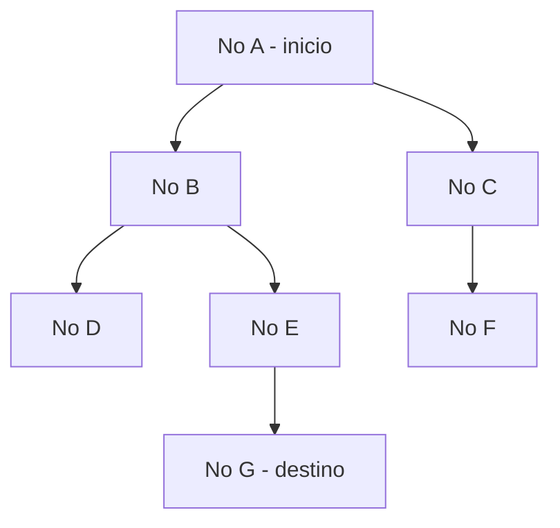

Com DFS (usando pilha), a ordem de visita seria: A, B, D (beco sem saída, volta), E, G (encontrou). Com BFS (usando fila), seria: A, B, C, D, E, F, G.

A diferença:
- **BFS (fila)**: explora todos os vizinhos antes de ir mais fundo — encontra o caminho mais curto
- **DFS (pilha)**: vai o mais fundo possível antes de voltar — usa menos memória, mas não garante o caminho mais curto

| Aspecto | BFS com Fila | DFS com Pilha |
|---------|-------------|---------------|
| Estrutura | Fila (FIFO) | Pilha (LIFO) |
| Estrategia | Largura primeiro | Profundidade primeiro |
| Caminho mais curto | Sim, garantido | Não garantido |
| Uso de memória | Alto (guarda toda a "fronteira") | Baixo (guarda apenas o caminho atual) |
| Uso tipico | GPS, redes sociais | Labirintos, puzzles, compiladores |

DFS pode ser implementado de duas formas: com uma pilha explícita (como a que implementamos) ou com recursão (que usa a call stack implicitamente). Na prática, as duas formas são equivalentes — recursão é DFS usando a pilha do sistema operacional.

---

## Pilhas em Python: A Comparação

Em Python, pilhas são triviais de implementar usando listas:

```python
# pilha_python.py — Pilha em Python com lista
# Criar uma pilha (lista vazia)
pilha = []

# Push — inserir no topo (final da lista)
pilha.append(10)    # append = push
pilha.append(20)
pilha.append(30)
print(f"Pilha: {pilha}")  # [10, 20, 30] — 30 e o topo

# Pop — remover do topo (final da lista)
topo = pilha.pop()  # pop = pop (mesmo nome!)
print(f"Pop: {topo}")     # 30
print(f"Pilha: {pilha}")  # [10, 20]

# Peek — ver o topo sem remover
print(f"Topo: {pilha[-1]}")  # 20 (indice -1 = ultimo)

# Tamanho
print(f"Tamanho: {len(pilha)}")  # 2

# Verificar se esta vazia
print(f"Vazia: {len(pilha) == 0}")  # False
```

Saída esperada:
```
Pilha: [10, 20, 30]
Pop: 30
Pilha: [10, 20]
Topo: 20
Tamanho: 2
Vazia: False
```

Diferente da fila (onde `list.pop(0)` é O(n) e `deque.popleft()` é O(1)), para pilhas a lista Python é perfeita: `list.append()` e `list.pop()` são ambos O(1) porque operam no final da lista.

### Comparação C vs Python

| Aspecto | C | Python |
|---------|---|--------|
| Criar pilha | malloc + inicializar | `pilha = []` |
| Push | Criar no com malloc, ajustar ponteiro | `pilha.append(valor)` |
| Pop | Salvar valor, avancar top, free | `pilha.pop()` |
| Peek | `pilha->top->dado` | `pilha[-1]` |
| Tamanho | `pilha->tamanho` | `len(pilha)` |
| Liberar memória | Percorrer e free cada no | Automático |
| Linhas de código | ~60 linhas | ~3 linhas |

---

## Erros Comuns com Pilhas

### Erro 1: Pop em Pilha Vazia

```c
// ERRADO — crash se a pilha estiver vazia
int pop(Pilha *pilha) {
    No *temp = pilha->top;  // top e NULL! Crash!
    int valor = temp->dado;
    // ...
}

// CORRETO — verificar antes
int pop(Pilha *pilha) {
    if (pilha->top == NULL) {
        printf("Erro: pilha vazia!\n");
        return -1;
    }
    // ...
}
```

### Erro 2: Esquecer de Liberar Memória

```c
// ERRADO — memory leak
void liberar_pilha(Pilha *pilha) {
    free(pilha);  // libera a struct, mas os nos ficam perdidos!
}

// CORRETO — liberar cada no primeiro
void liberar_pilha(Pilha *pilha) {
    No *atual = pilha->top;
    while (atual != NULL) {
        No *proximo = atual->next;
        free(atual);
        atual = proximo;
    }
    free(pilha);
}
```

### Erro 3: Recursão sem Caso Base

```c
// ERRADO — stack overflow!
int fatorial(int n) {
    return n * fatorial(n - 1);  // nunca para!
}

// CORRETO — caso base que para a recursao
int fatorial(int n) {
    if (n <= 1) return 1;  // caso base!
    return n * fatorial(n - 1);
}
```

### Erro 4: Confundir Push com Enqueue

```c
// ERRADO — inserir no final (isso e enqueue, nao push!)
void push(Pilha *pilha, int valor) {
    No *novo = criar_no(valor);
    // Percorrer ate o final... ERRADO para pilha!
    No *atual = pilha->top;
    while (atual->next != NULL) {
        atual = atual->next;
    }
    atual->next = novo;
}

// CORRETO — inserir no topo (inicio)
void push(Pilha *pilha, int valor) {
    No *novo = criar_no(valor);
    novo->next = pilha->top;
    pilha->top = novo;
}
```

| Erro | Consequência | Como evitar |
|------|-------------|-------------|
| Pop em pilha vazia | Segmentation fault | Sempre verificar `if (top == NULL)` |
| Liberar struct sem nos | Memory leak | Percorrer e free cada no antes |
| Recursao sem caso base | Stack overflow | Sempre definir condição de parada |
| Inserir no final em vez do topo | Comportamento de fila, não pilha | Push = inserir no inicio da lista |

---

## Complexidade das Operações

| Operação | Lista Encadeada | Array | Descrição |
|----------|----------------|-------|-----------|
| push | O(1) | O(1) | Inserir no topo |
| pop | O(1) | O(1) | Remover do topo |
| peek | O(1) | O(1) | Acessar top->dado |
| isEmpty | O(1) | O(1) | Verificar top == NULL |
| size | O(1) | O(1) | Retornar campo tamanho |
| buscar | O(n) | O(n) | Percorrer toda a pilha |
| criar | O(1) | O(1) | Alocar e inicializar |
| liberar | O(n) | O(1) | Percorrer e free cada no |

Compare pilha com fila:

| Operação | Fila | Pilha |
|----------|------|-------|
| Inserir | O(1) — enqueue no final | O(1) — push no topo |
| Remover | O(1) — dequeue do inicio | O(1) — pop do topo |
| Ponteiros | 2 (front e rear) | 1 (top) |
| Regra | FIFO | LIFO |
| Caso especial no remover | Atualizar rear se ficou vazia | Nenhum |

A pilha é a estrutura de dados mais simples que existe (junto com o array). Duas operações, um ponteiro, sem casos especiais. Essa simplicidade é o que a torna tão versátil — é fácil de implementar, fácil de entender e fácil de usar corretamente.

---
## Pilha vs Fila: Quando Usar Cada Uma

Agora que você conhece as duas estruturas, a pergunta natural é: quando usar fila e quando usar pilha?

A resposta está na ordem de processamento:

| Pergunta | Estrutura | Exemplo |
|----------|-----------|---------|
| Preciso processar na ordem de chegada? | Fila (FIFO) | Fila de impressao, requisicoes HTTP |
| Preciso processar na ordem inversa? | Pilha (LIFO) | Undo/redo, botao voltar |
| Preciso voltar ao estado anterior? | Pilha (LIFO) | Call stack, recursao |
| Preciso garantir justica na ordem? | Fila (FIFO) | Fila de atendimento, escalonamento |
| Preciso resolver de dentro para fora? | Pilha (LIFO) | Parenteses, expressoes matematicas |
| Preciso explorar em largura? | Fila (FIFO) | BFS, caminho mais curto |
| Preciso explorar em profundidade? | Pilha (LIFO) | DFS, labirintos |

Se nenhuma das duas se encaixa — por exemplo, se você precisa acessar elementos no meio, buscar por valor, ou inserir em posição arbitrária — então nem fila nem pilha são a estrutura certa. Considere uma lista encadeada, um array, ou um dicionário (que veremos no próximo módulo).

---

## Como a IA pode te ajudar aqui
**Prompt 1 — Ver exemplos práticos:**
> "Simule passo a passo o que acontece na call stack quando main() chama funcaoA(), que chama funcaoB(), que chama funcaoC(). Mostre o stack frame de cada uma com suas variáveis locais."

**Prompt 2 — Entender erros comuns:**
> "Esse código de pilha em C tem algum bug? Pode causar memory leak ou crash?"

**Prompt 3 — Explorar o conceito:**
> "Me dê 5 problemas do dia a dia que são resolvidos com pilhas e 5 que são resolvidos com filas. Explique por que cada um usa a estrutura que usa."

---

## Casos de Uso no Mundo Real

### 1. Ctrl+Z em Editores de Texto e IDEs

Quando você programa no VSCode e aperta Ctrl+Z, a última ação é desfeita. Aperta de novo, a penúltima. O VSCode mantém uma pilha de ações para cada arquivo aberto. Cada digitação, cada delete, cada paste é empilhado. O Ctrl+Z faz pop da pilha de undo e push na pilha de redo. O Ctrl+Y (redo) faz o inverso. Editores profissionais como o VSCode mantêm pilhas com milhares de ações — você pode desfazer horas de trabalho se precisar. O Google Docs vai além: mantém o histórico completo de todas as edições de todos os colaboradores, usando uma variação de pilha distribuída.

### 2. Navegação em Aplicativos Mobile

Quando você usa um aplicativo no celular — Instagram, WhatsApp, ou qualquer outro — e navega entre telas (feed → perfil → foto → comentários), cada tela é empilhada. Quando você aperta o botão "voltar" do Android ou faz o gesto de swipe back no iOS, a tela atual é desempilhada e a anterior aparece. O Android chama isso de "back stack" — literalmente uma pilha de telas. Se você abrir muitas telas em sequência, a pilha cresce. Se apertar "voltar" muitas vezes, volta até a tela inicial. Frameworks como React Navigation (React Native) e Jetpack Compose (Android) implementam essa navegação usando pilhas explicitamente.

### 3. Compiladores e Interpretadores de Código

Quando o compilador GCC compila seu código C, ele usa pilhas em várias etapas. Na análise sintática, uma pilha verifica se parênteses, chaves e colchetes estão balanceados (exatamente como nosso verificador de parênteses). Na avaliação de expressões, uma pilha converte expressões infixas (`a + b * c`) para pós-fixas (`a b c * +`) e depois avalia o resultado. Na geração de código, a call stack é usada para gerenciar chamadas de função. O interpretador Python (CPython) também usa uma pilha interna para executar bytecode — cada instrução empilha ou desempilha valores de uma pilha de operandos. Sem pilhas, compiladores e interpretadores simplesmente não funcionariam.

---

## Resumo do Módulo

| Conceito | Definição |
|----------|-----------|
| Pilha (Stack) | Estrutura de dados LIFO — último a entrar, primeiro a sair |
| LIFO | Last In, First Out — regra fundamental da pilha |
| Push | Inserir um elemento no topo da pilha — O(1) |
| Pop | Remover e retornar o elemento do topo da pilha — O(1) |
| Peek / Top | Ver o elemento do topo sem remover — O(1) |
| Top | Ponteiro para o no do topo da pilha |
| Call stack | Pilha de chamadas de funções gerenciada pelo sistema operacional |
| Stack frame | Bloco de dados empilhado para cada chamada de função |
| Stack overflow | Estouro de pilha — quando a call stack excede seu tamanho máximo |
| Undo/Redo | Padrão que usa duas pilhas para desfazer e refazer ações |
| RPN | Reverse Polish Notation — notação pos-fixa avaliada com pilha |
| DFS | Depth-First Search — algoritmo de busca em profundidade que usa pilha |
| Recursao | Função que chama a si mesma, usando a call stack implicitamente |

---

## Glossário do Módulo

| Termo | Definição |
|-------|-----------|
| Back stack | Pilha de telas em aplicativos mobile, usada para navegação com botao voltar |
| BFS | Breadth-First Search — busca em largura usando fila, encontra caminho mais curto |
| Call stack | Pilha de chamadas de funções mantida pelo sistema operacional |
| DFS | Depth-First Search — busca em profundidade usando pilha |
| ESP | Extended Stack Pointer — registrador x86 que aponta para o topo da call stack |
| LIFO | Last In, First Out — o último a entrar e o primeiro a sair |
| Peek | Operação de ver o elemento do topo sem remove-lo |
| Pop | Operação de remover o elemento do topo da pilha |
| Push | Operação de inserir um elemento no topo da pilha |
| Recursao | Técnica onde uma função chama a si mesma, empilhando frames na call stack |
| RPN | Reverse Polish Notation — notação matemática pos-fixa avaliada com pilha |
| Shunting-yard | Algoritmo que converte expressoes infixas para pos-fixas usando pilha |
| Stack | Pilha — estrutura de dados LIFO |
| Stack frame | Bloco de dados na call stack contendo variáveis locais e endereco de retorno |
| Stack machine | Arquitetura de processador baseada em pilha, como o Burroughs B5000 |
| Stack overflow | Erro causado quando a pilha excede seu tamanho máximo |
| Stack underflow | Erro causado ao tentar pop em uma pilha vazia |
| Top | Ponteiro para o elemento no topo da pilha |
| Undo | Operação de desfazer a última ação, usando pop na pilha de ações |
| Redo | Operação de refazer a última ação desfeita, usando pop na pilha de redo |

---

## Na Cultura Popular

- **Inception** (filme, 2010) — O filme de Christopher Nolan sobre sonhos dentro de sonhos é uma metáfora perfeita para pilhas. Cada nível de sonho é um "push" na pilha. Para voltar à realidade, os personagens precisam "acordar" (pop) de cada nível na ordem inversa — do sonho mais profundo para o mais superficial. O "kick" que acorda os personagens é literalmente um pop na pilha de sonhos. Se alguém fica preso em um nível profundo sem conseguir fazer pop, fica perdido — como um stack overflow ao contrário.

- **O Labirinto do Fauno** (filme, 2006) — Ofelia precisa navegar por um labirinto para completar suas tarefas. A estratégia clássica para resolver labirintos é DFS — ir o mais fundo possível, e quando encontrar um beco sem saída, voltar (pop) até a última bifurcação e tentar outro caminho. O labirinto do filme ilustra perfeitamente a busca em profundidade.

- **Memento** (filme, 2000) — O filme de Christopher Nolan conta a história de trás para frente — cada cena revela o que aconteceu antes da cena anterior. Isso é LIFO na narrativa: a última cena cronologicamente é a primeira mostrada, e a primeira cronologicamente é a última. O espectador "desempilha" a história conforme o filme avança.

---

## Para Saber Mais

- [Visualgo — Stack Visualization](https://visualgo.net/en/list) — *Visualização animada de operações em pilhas, mostrando push e pop passo a passo com animações interativas*

- [Data Structure Visualizations — Stack](https://www.cs.usfca.edu/~galles/visualization/StackLL.html) — *Simulador interativo de pilha com lista encadeada, onde você pode empilhar e desempilhar elementos visualmente*

- [CS50 — Harvard: Stacks](https://cs50.harvard.edu/x/) — *O curso de Harvard explica pilhas no contexto de C, com exemplos de call stack e recursão*

- [mycodeschool — Stack Data Structure](https://www.youtube.com/playlist?list=PL2_aWCzGMAwI3W_JlcBbtYTwiQSsOTa6P) — *Playlist com explicações visuais sobre pilhas, incluindo implementação e aplicações como verificação de parênteses*

- [Programação Descomplicada — Pilhas em C](https://www.youtube.com/@progdescomplicada) — *Canal brasileiro com aulas detalhadas sobre pilhas em C, incluindo implementação com array e lista encadeada*

---

## Perguntas Frequentes (FAQ)

**P: Qual a diferença entre pilha e fila?**
R: A diferença é a regra de ordenação. A fila é FIFO (primeiro a entrar, primeiro a sair) — como a fila do banco. A pilha é LIFO (último a entrar, primeiro a sair) — como uma pilha de pratos. Na fila, inserção é no final e remoção é no início. Na pilha, inserção e remoção são no topo. A fila precisa de dois ponteiros (front e rear), a pilha precisa de um (top).

**P: Por que a pilha é mais simples que a fila?**
R: Porque inserção e remoção acontecem no mesmo lugar (o topo). Na fila, acontecem em pontas opostas, o que exige dois ponteiros e um caso especial (atualizar rear quando a fila esvazia). Na pilha, não há caso especial — quando o último elemento é removido, top fica NULL naturalmente.

**P: O que é stack overflow?**
R: É quando a pilha de chamadas (call stack) excede seu tamanho máximo. Geralmente acontece por recursão infinita — uma função que chama a si mesma sem condição de parada. A call stack tem tamanho limitado (1-8 MB), e cada chamada de função empilha um stack frame. Se empilhar demais, o programa é encerrado pelo sistema operacional com "Segmentation fault".

**P: Posso usar uma lista Python como pilha?**
R: Sim, e é a forma recomendada. `list.append()` é push (O(1)) e `list.pop()` é pop (O(1)). Ambos operam no final da lista, que é eficiente. Para filas, use `collections.deque` em vez de lista, porque `list.pop(0)` é O(n).

**P: O que é recursão e como se relaciona com pilhas?**
R: Recursão é quando uma função chama a si mesma. Cada chamada recursiva empilha um novo stack frame na call stack com suas variáveis locais. Quando a condição de parada é atingida, os frames são desempilhados um a um. Recursão é essencialmente DFS usando a call stack do sistema operacional como pilha implícita.

**P: O que é RPN e por que usa pilha?**
R: RPN (Reverse Polish Notation) é uma forma de escrever expressões matemáticas sem parênteses: `3 4 +` em vez de `3 + 4`. A avaliação usa pilha: números são empilhados, operadores desempilham dois números, operam e empilham o resultado. Calculadoras HP usam RPN, e compiladores usam uma variação para avaliar expressões.

**P: DFS e BFS — qual é melhor?**
R: Depende do problema. BFS (fila) encontra o caminho mais curto, mas usa mais memória. DFS (pilha) usa menos memória, mas não garante o caminho mais curto. Para GPS e navegação, BFS. Para labirintos e puzzles, DFS. Para explorar todas as possibilidades, ambos funcionam.

**P: A call stack é a mesma coisa que a pilha que implementamos?**
R: O conceito é o mesmo (LIFO), mas a implementação é diferente. A call stack é gerenciada pelo sistema operacional e pelo hardware (registrador ESP), usa uma região contígua de memória (como um array), e tem tamanho fixo. A pilha que implementamos usa lista encadeada, é gerenciada pelo nosso código, e cresce dinamicamente.

**P: Por que o site se chama Stack Overflow?**
R: O nome é uma referência ao erro de estouro de pilha (stack overflow), que acontece quando a call stack excede seu tamanho máximo. É um dos erros mais comuns em programação, especialmente para iniciantes que escrevem recursão sem caso base. O site foi criado em 2008 por Joel Spolsky e Jeff Atwood como um lugar onde programadores podem perguntar e responder dúvidas — quando seus programas "estouram".

**P: Posso ter uma pilha de pilhas?**
R: Sim. Na prática, isso acontece em editores que suportam múltiplos níveis de undo — cada documento tem sua própria pilha de ações. O editor mantém uma coleção de pilhas, uma para cada documento aberto. Também acontece em algoritmos que exploram múltiplos caminhos simultaneamente.

**P: Pilhas são usadas em jogos?**
R: Muito. Jogos usam pilhas para: estados de menu (menu principal → opções → áudio → voltar), ações do jogador para undo (jogos de estratégia), avaliação de expressões em scripts, e DFS para pathfinding e geração procedural de labirintos. O Unity e o Unreal Engine têm classes de pilha embutidas.

**P: O que acontece se eu fizer push em uma pilha com array que está cheia?**
R: Depende da implementação. Na nossa, imprimimos um erro e não inserimos. Em sistemas reais, pode lançar uma exceção, redimensionar o array (como `realloc` em C ou `ArrayList` em Java), ou sobrescrever o elemento mais antigo (pilha circular). A call stack do sistema operacional não redimensiona — se encher, o programa é encerrado.

**P: Qual a relação entre pilhas e o padrão Command?**
R: O padrão Command (design pattern) encapsula ações como objetos. Cada objeto Command tem um método `execute()` e um método `undo()`. Quando o usuário executa uma ação, o Command é empilhado. Quando desfaz, o Command do topo é desempilhado e seu `undo()` é chamado. É exatamente o que implementamos no sistema de undo/redo, mas formalizado como um design pattern.

---

## Exercícios Práticos

### Exercício 1: Implementar uma Pilha de Strings

Implemente uma pilha que armazena nomes (strings) em vez de inteiros. Implemente push, pop, peek, imprimir e liberar. Teste empilhando 5 nomes e desempilhando todos — a ordem de saída deve ser inversa à de entrada.

### Exercício 2: Inverter uma String com Pilha

Escreva uma função que recebe uma string e retorna ela invertida usando uma pilha. Empilhe cada caractere, depois desempilhe todos. "Hello" deve virar "olleH".

### Exercício 3: Verificador de Parênteses Expandido

Expanda o verificador de parênteses para também verificar tags HTML simples: `<b>` deve ser fechado com `</b>`, `<i>` com `</i>`. Teste com strings como `<b>texto <i>italico</i></b>` (válido) e `<b>texto <i>italico</b></i>` (inválido).

---

[← Anterior: Filas](cap07-mod07-filas-conteudo.md) · [Próximo: Dicionários e Tabelas Hash →](cap07-mod09-dicionarios-conteudo.md)
