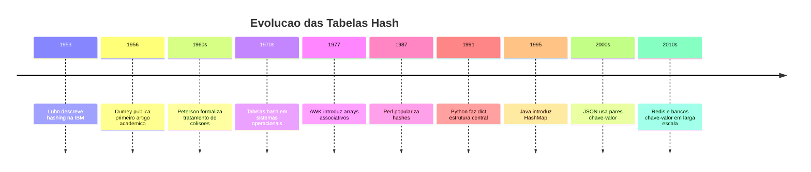
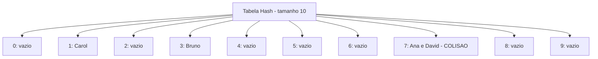
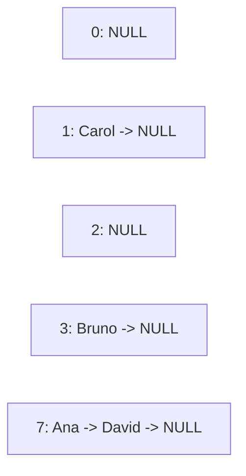

# 7.9 — Dicionários e Tabelas Hash

[← Anterior: Pilhas](cap07-mod08-pilhas-conteudo.md) · [Próximo: Algoritmos de Busca e Ordenação →](cap07-mod10-busca-ordenacao-conteudo.md)

---

## Introdução

Nos módulos anteriores, você aprendeu três estruturas de dados fundamentais: listas encadeadas (inserção e remoção flexíveis), filas (FIFO — primeiro a entrar, primeiro a sair) e pilhas (LIFO — último a entrar, primeiro a sair). Todas elas têm algo em comum: para encontrar um elemento específico, você precisa percorrer a estrutura elemento por elemento. Se a lista tem 1 milhão de elementos e o que você procura está no final, precisa olhar todos os 999.999 anteriores. Isso é O(n) — tempo linear.

Agora imagine que você está construindo um sistema de cadastro de alunos. Cada aluno tem um número de matrícula único. Quando alguém digita a matrícula 12345, você precisa encontrar os dados desse aluno instantaneamente — não pode percorrer todos os alunos um por um. Se o sistema tem 50.000 alunos, percorrer todos a cada consulta seria inaceitável.

Precisa existir uma forma de ir direto ao elemento que queremos, sem percorrer nada. E existe: o **dicionário** (em inglês, *dictionary* ou *map*), implementado internamente como uma **tabela hash** (em inglês, *hash table*).

A ideia é genial: em vez de guardar os dados em sequência e procurar um por um, usamos uma função matemática que transforma a chave (ex: matrícula 12345) diretamente em uma posição no array. Quando queremos buscar, aplicamos a mesma função e vamos direto à posição. Sem percorrer nada. Tempo O(1) — constante.

Dicionários são provavelmente a estrutura de dados mais usada em programação moderna. Em Python, você já usou dicionários (`dict`) no capítulo 5. Em JavaScript, objetos são dicionários. Em Java, `HashMap`. Em Go, `map`. Em C#, `Dictionary`. Toda linguagem moderna tem uma implementação de dicionário embutida, porque a necessidade de buscar dados por chave é universal.

Neste módulo, vamos entender como dicionários funcionam por dentro — a matemática da função hash, o problema das colisões, e as estratégias para resolvê-las. Diferente dos módulos anteriores, não vamos implementar uma tabela hash completa em C (seria muito complexo para este ponto do curso), mas vamos implementar uma versão simplificada para entender os conceitos e fazer exercícios práticos que mostram quando e como usar dicionários.

---

## Como Executar os Exemplos Deste Módulo

Os exemplos em C deste módulo seguem o mesmo padrão dos módulos anteriores:

```bash
# Compilar o programa
gcc -o nome_programa nome_programa.c

# Executar
./nome_programa
```

Alguns exemplos são em Python para comparação. Execute com:

```bash
python3 nome_programa.py
```

---
## O Problema que Dicionários Resolvem

Vamos voltar ao problema do cadastro de alunos. Você tem 50.000 alunos e precisa buscar um pelo número de matrícula. Quais são as opções com as estruturas que já conhecemos?

**Opção 1: Array não ordenado**
Guardar os alunos em um array e percorrer um por um até encontrar a matrícula. No pior caso, percorre todos os 50.000. Complexidade: O(n).

**Opção 2: Array ordenado**
Guardar os alunos em um array ordenado por matrícula e usar busca binária. Complexidade: O(log n). Para 50.000 alunos, são no máximo 16 comparações. Muito melhor, mas inserir um novo aluno exige mover elementos para manter a ordem — O(n).

**Opção 3: Lista encadeada**
Percorrer nó por nó. Complexidade: O(n). Pior que o array ordenado.

**Opção 4: Dicionário (tabela hash)**
Aplicar uma função matemática na matrícula que retorna diretamente a posição no array. Complexidade: O(1). Uma operação. Não importa se tem 50.000 ou 50 milhões de alunos.

| Estrutura | Busca | Inserção | Remoção |
|-----------|-------|----------|---------|
| Array não ordenado | O(n) | O(1) | O(n) |
| Array ordenado | O(log n) | O(n) | O(n) |
| Lista encadeada | O(n) | O(1) | O(n) |
| Tabela hash | O(1) medio | O(1) medio | O(1) medio |

A tabela hash é O(1) em média para todas as operações principais. Isso parece bom demais para ser verdade — e de fato, há um custo: a tabela hash usa mais memória que as outras estruturas, e no pior caso (muitas colisões) pode degradar para O(n). Mas na prática, com uma boa função hash, o caso médio é O(1).

---

## A Analogia: O Armário com Etiquetas

Imagine um armário com 100 gavetas numeradas de 0 a 99. Você quer guardar fichas de alunos nesse armário de forma que possa encontrar qualquer ficha instantaneamente.

A estratégia ingênua seria colocar as fichas em ordem nas gavetas: aluno 1 na gaveta 1, aluno 2 na gaveta 2, etc. Mas e se as matrículas vão de 10.000 a 60.000? Você precisaria de um armário com 60.000 gavetas, a maioria vazia.

A estratégia inteligente é usar uma regra para decidir em qual gaveta colocar cada ficha. Por exemplo: **gaveta = matrícula % 100** (resto da divisão por 100). O aluno 12345 vai para a gaveta 45 (12345 % 100 = 45). O aluno 67890 vai para a gaveta 90. Para encontrar o aluno 12345, basta calcular 12345 % 100 = 45 e ir direto à gaveta 45.

| Conceito | Analogia do armario |
|----------|---------------------|
| Tabela hash | O armario com gavetas numeradas |
| Chave (key) | O número da matricula do aluno |
| Valor (value) | A ficha com os dados do aluno |
| Função hash | A regra para decidir a gaveta (matricula % 100) |
| Índice | O número da gaveta |
| Colisao | Dois alunos caem na mesma gaveta |
| Encadeamento | Colocar várias fichas na mesma gaveta, uma atras da outra |

Mas e se dois alunos caem na mesma gaveta? O aluno 12345 e o aluno 12445 ambos dão resto 45. Isso se chama **colisão**, e é o principal desafio das tabelas hash. Vamos ver como resolver isso mais adiante.

---

## A História das Tabelas Hash

A ideia de usar uma função para mapear chaves a posições em um array surgiu nos anos 1950, junto com os primeiros computadores comerciais.

Em 1953, Hans Peter Luhn, pesquisador da IBM, descreveu o conceito de "hashing" em um memorando interno. Luhn propôs usar uma função matemática para distribuir registros em "buckets" (baldes), permitindo busca direta em vez de busca sequencial. Ele estava trabalhando em sistemas de recuperação de informação — o problema de encontrar documentos específicos em grandes coleções.

Em 1956, Arnold Dumey publicou o primeiro artigo acadêmico sobre tabelas hash, descrevendo o uso de funções hash para indexar dados em fitas magnéticas. Na época, o acesso a dados em fita era extremamente lento (a fita precisava ser rebobinada até a posição correta), então qualquer técnica que reduzisse o número de acessos era valiosa.

Nos anos 1960, W. Wesley Peterson publicou trabalhos fundamentais sobre tratamento de colisões, descrevendo as técnicas de encadeamento (chaining) e endereçamento aberto (open addressing) que são usadas até hoje.

A grande revolução veio nos anos 1970, quando tabelas hash foram incorporadas em linguagens de programação. A linguagem AWK (1977) tinha arrays associativos — essencialmente dicionários. Perl (1987) popularizou hashes como estrutura de dados de primeira classe. Python (1991) fez do dicionário (`dict`) uma das estruturas mais importantes da linguagem.



Hoje, tabelas hash são tão fundamentais que existem bancos de dados inteiros baseados nelas. Redis, Memcached e DynamoDB são essencialmente tabelas hash distribuídas em rede. Quando você acessa um site e ele carrega rápido, provavelmente há um cache baseado em tabela hash acelerando a resposta.

---

## Como Funciona uma Tabela Hash

Uma tabela hash tem três componentes:

1. **Um array** — onde os dados são armazenados
2. **Uma função hash** — que transforma a chave em um índice do array
3. **Uma estratégia de colisão** — para lidar com chaves que caem no mesmo índice

### A Função Hash

A função hash recebe uma chave (qualquer tipo de dado) e retorna um número inteiro que será usado como índice no array. Uma boa função hash deve:

- Ser determinística: a mesma chave sempre produz o mesmo índice
- Distribuir uniformemente: chaves diferentes devem cair em posições diferentes (idealmente)
- Ser rápida: calcular o hash deve ser O(1)

A função hash mais simples para números inteiros é o módulo:

```c
// Funcao hash simples: resto da divisao pelo tamanho da tabela
int hash(int chave, int tamanho_tabela) {
    return chave % tamanho_tabela;
}
```

Para strings, uma função hash comum é somar os valores ASCII de cada caractere e aplicar módulo:

```c
// Funcao hash para strings
int hash_string(const char *chave, int tamanho_tabela) {
    unsigned int soma = 0;
    for (int i = 0; chave[i] != '\0'; i++) {
        soma += chave[i];
    }
    return soma % tamanho_tabela;
}
```

Essa função é simples mas tem um problema: "abc" e "cba" produzem o mesmo hash (porque a soma dos caracteres é a mesma). Uma função melhor leva em conta a posição de cada caractere:

```c
// Funcao hash melhorada para strings (djb2)
unsigned int hash_djb2(const char *chave, int tamanho_tabela) {
    unsigned int hash = 5381;
    int c;
    while ((c = *chave++)) {
        hash = ((hash << 5) + hash) + c;  // hash * 33 + c
    }
    return hash % tamanho_tabela;
}
```

A função `djb2` foi criada por Daniel J. Bernstein e é uma das funções hash mais usadas para strings. O número mágico 5381 e o multiplicador 33 foram escolhidos empiricamente por produzirem boa distribuição.

### Visualizando o Processo

Vamos ver como uma tabela hash com 10 posições armazena dados:

```
Tabela hash com tamanho 10:

Chave: "Ana"    → hash("Ana") % 10 = 7    → posicao 7
Chave: "Bruno"  → hash("Bruno") % 10 = 3  → posicao 3
Chave: "Carol"  → hash("Carol") % 10 = 1  → posicao 1
Chave: "David"  → hash("David") % 10 = 7  → posicao 7  ← COLISAO com Ana!
```



Ana e David caíram na mesma posição (7). Isso é uma colisão. Precisamos de uma estratégia para resolver.

---

## Colisões e Como Resolvê-las

Colisões são inevitáveis. Pelo **princípio da casa dos pombos** (pigeonhole principle), se você tem mais chaves possíveis do que posições na tabela, pelo menos duas chaves vão cair na mesma posição. Por exemplo, se a tabela tem 10 posições e você insere 11 elementos, pelo menos uma posição terá dois elementos.

Existem duas estratégias principais para resolver colisões:

### Estratégia 1: Encadeamento (Chaining)

Cada posição da tabela contém uma lista encadeada. Quando há colisão, o novo elemento é adicionado à lista daquela posição.



Para buscar "David":
1. Calcular hash("David") % 10 = 7
2. Ir à posição 7
3. Percorrer a lista: Ana (não é), David (encontrou!)

No melhor caso (sem colisões), a busca é O(1). No pior caso (todos os elementos na mesma posição), é O(n). Na média, com uma boa função hash e tabela grande o suficiente, é O(1).

### Estratégia 2: Endereçamento Aberto (Open Addressing)

Quando há colisão, procura a próxima posição livre na tabela. A forma mais simples é a **sondagem linear** (linear probing): se a posição está ocupada, tenta a próxima, depois a seguinte, até encontrar uma vazia.

```
Inserir "David" na posicao 7 (ocupada por Ana):
  Posicao 7: ocupada (Ana) → tentar 8
  Posicao 8: vazia → inserir David aqui
```

Para buscar "David":
1. Calcular hash("David") % 10 = 7
2. Posição 7: Ana (não é David) → continuar
3. Posição 8: David (encontrou!)

O endereçamento aberto tem a vantagem de não usar listas encadeadas (menos overhead de memória), mas tem o problema de **clustering** — quando muitas colisões acontecem em sequência, formam "blocos" de posições ocupadas que tornam as próximas inserções e buscas mais lentas.

### Comparação das Estratégias

| Aspecto | Encadeamento | Enderecamento Aberto |
|---------|-------------|---------------------|
| Estrutura extra | Lista encadeada em cada posição | Nenhuma |
| Memória | Mais (ponteiros dos nos) | Menos (so o array) |
| Fator de carga | Pode ser > 1 (mais elementos que posições) | Deve ser < 1 |
| Performance com muitas colisoes | Degrada gradualmente | Degrada rapidamente (clustering) |
| Implementação | Mais complexa | Mais simples |
| Uso tipico | Java HashMap, Python dict | Tabelas hash em C, Go map |

Na prática, a maioria das implementações modernas usa encadeamento ou variações sofisticadas de endereçamento aberto (como Robin Hood hashing ou cuckoo hashing).

---

## Implementação Simplificada em C

Vamos implementar uma tabela hash simples com encadeamento. Esta versão armazena pares chave-valor onde a chave é uma string e o valor é um inteiro (como um dicionário de nomes e idades):

```c
// hash_table.c — Tabela hash com encadeamento
#include <stdio.h>
#include <stdlib.h>
#include <string.h>

#define TABLE_SIZE 10

// Cada entrada na tabela (no da lista encadeada)
typedef struct Entry {
    char chave[50];
    int valor;
    struct Entry *next;
} Entry;

// A tabela hash — um array de ponteiros para listas
typedef struct HashTable {
    Entry *buckets[TABLE_SIZE];
    int tamanho;  // quantos elementos no total
} HashTable;

// Funcao hash djb2
unsigned int hash(const char *chave) {
    unsigned int h = 5381;
    int c;
    while ((c = *chave++)) {
        h = ((h << 5) + h) + c;
    }
    return h % TABLE_SIZE;
}

HashTable* criar_tabela() {
    HashTable *tabela = (HashTable*)malloc(sizeof(HashTable));
    if (tabela == NULL) return NULL;
    for (int i = 0; i < TABLE_SIZE; i++) {
        tabela->buckets[i] = NULL;
    }
    tabela->tamanho = 0;
    return tabela;
}

// Inserir ou atualizar um par chave-valor
void inserir(HashTable *tabela, const char *chave, int valor) {
    unsigned int indice = hash(chave);

    // Verificar se a chave ja existe (atualizar)
    Entry *atual = tabela->buckets[indice];
    while (atual != NULL) {
        if (strcmp(atual->chave, chave) == 0) {
            printf("  Atualizar: '%s' = %d (indice %d)\n", chave, valor, indice);
            atual->valor = valor;
            return;
        }
        atual = atual->next;
    }

    // Chave nova — inserir no inicio da lista
    Entry *nova = (Entry*)malloc(sizeof(Entry));
    if (nova == NULL) return;
    strncpy(nova->chave, chave, 49);
    nova->chave[49] = '\0';
    nova->valor = valor;
    nova->next = tabela->buckets[indice];
    tabela->buckets[indice] = nova;
    tabela->tamanho++;

    printf("  Inserir: '%s' = %d (indice %d)\n", chave, valor, indice);
}

// Buscar um valor pela chave
int buscar(HashTable *tabela, const char *chave, int *encontrado) {
    unsigned int indice = hash(chave);

    Entry *atual = tabela->buckets[indice];
    while (atual != NULL) {
        if (strcmp(atual->chave, chave) == 0) {
            *encontrado = 1;
            return atual->valor;
        }
        atual = atual->next;
    }

    *encontrado = 0;
    return -1;
}

// Remover um par chave-valor
int remover_entry(HashTable *tabela, const char *chave) {
    unsigned int indice = hash(chave);

    Entry *atual = tabela->buckets[indice];
    Entry *anterior = NULL;

    while (atual != NULL) {
        if (strcmp(atual->chave, chave) == 0) {
            if (anterior == NULL) {
                tabela->buckets[indice] = atual->next;
            } else {
                anterior->next = atual->next;
            }
            printf("  Remover: '%s' (indice %d)\n", chave, indice);
            free(atual);
            tabela->tamanho--;
            return 1;
        }
        anterior = atual;
        atual = atual->next;
    }

    printf("  Remover: '%s' — nao encontrado\n", chave);
    return 0;
}

// Imprimir toda a tabela
void imprimir_tabela(HashTable *tabela) {
    printf("\n  === Tabela Hash (%d elementos) ===\n", tabela->tamanho);
    for (int i = 0; i < TABLE_SIZE; i++) {
        printf("  [%d]: ", i);
        if (tabela->buckets[i] == NULL) {
            printf("(vazio)\n");
        } else {
            Entry *atual = tabela->buckets[i];
            while (atual != NULL) {
                printf("{'%s': %d}", atual->chave, atual->valor);
                if (atual->next != NULL) printf(" -> ");
                atual = atual->next;
            }
            printf("\n");
        }
    }
    printf("\n");
}

void liberar_tabela(HashTable *tabela) {
    for (int i = 0; i < TABLE_SIZE; i++) {
        Entry *atual = tabela->buckets[i];
        while (atual != NULL) {
            Entry *proximo = atual->next;
            free(atual);
            atual = proximo;
        }
    }
    free(tabela);
}

int main() {
    printf("=== Tabela Hash — Demonstracao ===\n\n");

    HashTable *tabela = criar_tabela();

    // Inserir dados
    printf("--- Inserindo dados ---\n");
    inserir(tabela, "Ana", 25);
    inserir(tabela, "Bruno", 30);
    inserir(tabela, "Carol", 22);
    inserir(tabela, "David", 28);
    inserir(tabela, "Eva", 35);
    inserir(tabela, "Fernando", 27);
    inserir(tabela, "Gustavo", 31);

    imprimir_tabela(tabela);

    // Buscar dados
    printf("--- Buscando dados ---\n");
    int encontrado;
    int valor;

    valor = buscar(tabela, "Carol", &encontrado);
    if (encontrado) printf("  Carol: %d anos\n", valor);

    valor = buscar(tabela, "Gustavo", &encontrado);
    if (encontrado) printf("  Gustavo: %d anos\n", valor);

    valor = buscar(tabela, "Zelia", &encontrado);
    if (!encontrado) printf("  Zelia: nao encontrada\n");

    // Atualizar
    printf("\n--- Atualizando ---\n");
    inserir(tabela, "Ana", 26);  // Ana fez aniversario

    // Remover
    printf("\n--- Removendo ---\n");
    remover_entry(tabela, "David");
    remover_entry(tabela, "Inexistente");

    imprimir_tabela(tabela);

    liberar_tabela(tabela);
    printf("Memoria liberada.\n");

    return 0;
}
```

Saída esperada (os índices podem variar dependendo da função hash):
```
=== Tabela Hash — Demonstracao ===

--- Inserindo dados ---
  Inserir: 'Ana' = 25 (indice 4)
  Inserir: 'Bruno' = 30 (indice 7)
  Inserir: 'Carol' = 22 (indice 0)
  Inserir: 'David' = 28 (indice 3)
  Inserir: 'Eva' = 35 (indice 2)
  Inserir: 'Fernando' = 27 (indice 6)
  Inserir: 'Gustavo' = 31 (indice 5)

  === Tabela Hash (7 elementos) ===
  [0]: {'Carol': 22}
  [1]: (vazio)
  [2]: {'Eva': 35}
  [3]: {'David': 28}
  [4]: {'Ana': 25}
  [5]: {'Gustavo': 31}
  [6]: {'Fernando': 27}
  [7]: {'Bruno': 30}
  [8]: (vazio)
  [9]: (vazio)

--- Buscando dados ---
  Carol: 22 anos
  Gustavo: 31 anos
  Zelia: nao encontrada

--- Atualizando ---
  Atualizar: 'Ana' = 26 (indice 4)

--- Removendo ---
  Remover: 'David' (indice 3)
  Remover: 'Inexistente' — nao encontrado

  === Tabela Hash (6 elementos) ===
  [0]: {'Carol': 22}
  [1]: (vazio)
  [2]: {'Eva': 35}
  [3]: (vazio)
  [4]: {'Ana': 26}
  [5]: {'Gustavo': 31}
  [6]: {'Fernando': 27}
  [7]: {'Bruno': 30}
  [8]: (vazio)
  [9]: (vazio)

Memoria liberada.
```

---
## Fator de Carga e Redimensionamento

O **fator de carga** (load factor) é a razão entre o número de elementos e o tamanho da tabela:

```
fator_de_carga = numero_de_elementos / tamanho_da_tabela
```

Se a tabela tem 10 posições e 7 elementos, o fator de carga é 0.7 (70%). Quanto maior o fator de carga, mais colisões acontecem e mais lenta a tabela fica.

| Fator de carga | Significado | Performance |
|----------------|-------------|-------------|
| 0.0 - 0.5 | Tabela com bastante espaco | Excelente — poucas colisoes |
| 0.5 - 0.75 | Tabela moderadamente cheia | Boa — colisoes aceitaveis |
| 0.75 - 1.0 | Tabela quase cheia | Degradando — muitas colisoes |
| > 1.0 | Mais elementos que posições | Ruim — so funciona com encadeamento |

Na prática, quando o fator de carga ultrapassa um limite (geralmente 0.75), a tabela é **redimensionada**: cria-se um novo array maior (geralmente o dobro), e todos os elementos são reinseridos (rehashing). Isso é O(n) — caro — mas acontece raramente, então o custo amortizado é O(1).

O Python `dict` redimensiona quando o fator de carga atinge 2/3 (0.67). O Java `HashMap` redimensiona em 0.75. O Go `map` redimensiona em 6.5 (usa encadeamento com buckets de 8 elementos).

---

## Dicionários em Python: O que Acontece por Dentro

Quando você escreve `alunos = {"Ana": 25, "Bruno": 30}` em Python, o interpretador cria uma tabela hash internamente. Vamos ver como as operações do `dict` se mapeiam para operações da tabela hash:

```python
# dicionario_python.py — Dicionarios em Python
# Criar um dicionario (tabela hash por dentro)
alunos = {}

# Inserir (hash da chave → posicao no array interno)
alunos["Ana"] = 25       # hash("Ana") → posicao X → armazenar (Ana, 25)
alunos["Bruno"] = 30     # hash("Bruno") → posicao Y → armazenar (Bruno, 30)
alunos["Carol"] = 22
alunos["David"] = 28
alunos["Eva"] = 35

print(f"Dicionario: {alunos}")
print(f"Tamanho: {len(alunos)}")

# Buscar (hash da chave → ir direto a posicao)
print(f"Ana: {alunos['Ana']} anos")       # O(1)
print(f"Carol: {alunos['Carol']} anos")   # O(1)

# Verificar se chave existe
if "Zelia" in alunos:                     # O(1)
    print(f"Zelia: {alunos['Zelia']}")
else:
    print("Zelia nao encontrada")

# Atualizar
alunos["Ana"] = 26  # Ana fez aniversario

# Remover
del alunos["David"]

# Iterar sobre chaves e valores
print("\nTodos os alunos:")
for nome, idade in alunos.items():
    print(f"  {nome}: {idade} anos")
```

Saída esperada:
```
Dicionario: {'Ana': 25, 'Bruno': 30, 'Carol': 22, 'David': 28, 'Eva': 35}
Tamanho: 5
Ana: 25 anos
Carol: 22 anos
Zelia nao encontrada

Todos os alunos:
  Ana: 26 anos
  Bruno: 30 anos
  Carol: 22 anos
  Eva: 35 anos
```

Cada operação (`alunos["Ana"]`, `"Zelia" in alunos`, `del alunos["David"]`) é O(1) em média. O Python cuida de tudo: função hash, tratamento de colisões, redimensionamento. Você só usa.

### Comparação C vs Python

| Operação | C (nossa implementação) | Python |
|----------|------------------------|--------|
| Criar | `criar_tabela()` | `d = {}` |
| Inserir | `inserir(tabela, "Ana", 25)` | `d["Ana"] = 25` |
| Buscar | `buscar(tabela, "Ana", &enc)` | `d["Ana"]` ou `d.get("Ana")` |
| Verificar existência | Buscar e checar flag | `"Ana" in d` |
| Remover | `remover_entry(tabela, "Ana")` | `del d["Ana"]` |
| Iterar | Loop manual nos buckets | `for k, v in d.items()` |
| Liberar | `liberar_tabela(tabela)` | Automático |
| Linhas de código | ~150 linhas | ~5 linhas |

---

## Quando Usar Dicionários

Dicionários são a estrutura certa quando você precisa de:

1. **Busca rápida por chave** — encontrar um elemento específico sem percorrer todos
2. **Associação chave-valor** — mapear uma coisa para outra (nome → idade, CPF → pessoa, URL → página)
3. **Contagem de frequência** — contar quantas vezes cada elemento aparece
4. **Cache** — guardar resultados de operações caras para reutilizar
5. **Eliminação de duplicatas** — verificar rapidamente se um elemento já foi visto

### Exemplo: Contagem de Frequência de Palavras

```c
// frequencia.c — Contar frequencia de palavras com tabela hash
#include <stdio.h>
#include <stdlib.h>
#include <string.h>
#include <ctype.h>

#define TABLE_SIZE 50

typedef struct WordEntry {
    char palavra[50];
    int contagem;
    struct WordEntry *next;
} WordEntry;

typedef struct WordTable {
    WordEntry *buckets[TABLE_SIZE];
} WordTable;

unsigned int hash_word(const char *palavra) {
    unsigned int h = 5381;
    int c;
    while ((c = *palavra++)) {
        h = ((h << 5) + h) + tolower(c);
    }
    return h % TABLE_SIZE;
}

WordTable* criar_word_table() {
    WordTable *t = (WordTable*)malloc(sizeof(WordTable));
    for (int i = 0; i < TABLE_SIZE; i++) t->buckets[i] = NULL;
    return t;
}

void contar_palavra(WordTable *tabela, const char *palavra) {
    unsigned int idx = hash_word(palavra);

    // Verificar se ja existe
    WordEntry *atual = tabela->buckets[idx];
    while (atual != NULL) {
        if (strcmp(atual->palavra, palavra) == 0) {
            atual->contagem++;
            return;
        }
        atual = atual->next;
    }

    // Nova palavra
    WordEntry *nova = (WordEntry*)malloc(sizeof(WordEntry));
    strncpy(nova->palavra, palavra, 49);
    nova->palavra[49] = '\0';
    nova->contagem = 1;
    nova->next = tabela->buckets[idx];
    tabela->buckets[idx] = nova;
}

void imprimir_frequencias(WordTable *tabela) {
    printf("  Frequencia de palavras:\n");
    for (int i = 0; i < TABLE_SIZE; i++) {
        WordEntry *atual = tabela->buckets[i];
        while (atual != NULL) {
            printf("    '%s': %d vez(es)\n", atual->palavra, atual->contagem);
            atual = atual->next;
        }
    }
}

void liberar_word_table(WordTable *tabela) {
    for (int i = 0; i < TABLE_SIZE; i++) {
        WordEntry *atual = tabela->buckets[i];
        while (atual != NULL) {
            WordEntry *proximo = atual->next;
            free(atual);
            atual = proximo;
        }
    }
    free(tabela);
}

int main() {
    printf("=== Contagem de Frequencia ===\n\n");

    WordTable *tabela = criar_word_table();

    // Simular contagem de palavras em um texto
    const char *palavras[] = {
        "o", "gato", "sentou", "no", "tapete",
        "o", "gato", "dormiu", "no", "sofa",
        "o", "cachorro", "sentou", "no", "tapete",
        NULL
    };

    for (int i = 0; palavras[i] != NULL; i++) {
        contar_palavra(tabela, palavras[i]);
    }

    imprimir_frequencias(tabela);

    liberar_word_table(tabela);
    return 0;
}
```

Saída esperada:
```
=== Contagem de Frequencia ===

  Frequencia de palavras:
    'o': 3 vez(es)
    'gato': 2 vez(es)
    'sentou': 2 vez(es)
    'no': 3 vez(es)
    'tapete': 2 vez(es)
    'dormiu': 1 vez(es)
    'sofa': 1 vez(es)
    'cachorro': 1 vez(es)
```

Sem dicionário, contar frequências exigiria percorrer toda a lista de palavras já vistas para cada nova palavra — O(n²). Com dicionário, cada operação é O(1) — total O(n).

---

## Quando NÃO Usar Dicionários

Dicionários não são a resposta para tudo. Existem situações onde outras estruturas são melhores:

| Situação | Estrutura melhor | Por que |
|----------|-----------------|---------|
| Dados ordenados | Array ordenado ou árvore | Dicionário não mantem ordem |
| Acesso por posição (índice) | Array | Dicionário não tem índice numerico |
| Processar na ordem de chegada | Fila | Dicionário não tem ordem de inserção garantida |
| Desfazer ações | Pilha | Dicionário não tem conceito de "último" |
| Pouca memória disponível | Array | Dicionário usa mais memória (overhead do hash) |
| Chaves não são unicas | Lista ou array | Dicionário sobrescreve valores com mesma chave |

Uma regra prática: se você precisa buscar por chave, use dicionário. Se precisa de ordem, use array ou lista. Se precisa de ambos, use uma combinação (como `OrderedDict` em Python ou `LinkedHashMap` em Java).

---

## Complexidade das Operações

| Operação | Caso medio | Pior caso | Descrição |
|----------|-----------|-----------|-----------|
| Inserir | O(1) | O(n) | Hash + inserir na lista |
| Buscar | O(1) | O(n) | Hash + percorrer lista |
| Remover | O(1) | O(n) | Hash + encontrar e remover |
| Verificar existência | O(1) | O(n) | Mesmo que buscar |
| Iterar todos | O(n + m) | O(n + m) | n = elementos, m = tamanho da tabela |

O pior caso O(n) acontece quando todas as chaves caem na mesma posição (todas as colisões no mesmo bucket). Isso é extremamente raro com uma boa função hash e tabela adequadamente dimensionada. Na prática, considere O(1) para todas as operações.

### Comparação com Outras Estruturas

| Operação | Array | Lista | Fila | Pilha | Dicionário |
|----------|-------|-------|------|-------|------------|
| Busca por chave | O(n) | O(n) | N/A | N/A | O(1) |
| Busca por índice | O(1) | O(n) | N/A | N/A | N/A |
| Inserir | O(1) ou O(n) | O(1) | O(1) | O(1) | O(1) |
| Remover | O(n) | O(n) | O(1) | O(1) | O(1) |
| Ordenado | Pode ser | Não | N/A | N/A | Não |
| Memória extra | Nenhuma | Ponteiro next | Ponteiros | Ponteiro | Hash + ponteiros |

O dicionário é imbatível para busca por chave. Mas não substitui arrays (acesso por índice), filas (processamento ordenado) ou pilhas (processamento reverso). Cada estrutura tem seu ponto forte.

---

## Como a IA pode te ajudar aqui

**Prompt 1 — Explorar o conceito:**
> "Explique como a função hash djb2 funciona passo a passo. Por que o número 5381 e o multiplicador 33 foram escolhidos?"

**Prompt 2 — Ver exemplos práticos:**
> "Me dê 5 problemas reais que são resolvidos com dicionários e explique por que um array ou lista não seriam eficientes."

**Prompt 3 — Entender erros comuns:**
> "Esse código de tabela hash em C tem algum bug? Pode causar memory leak ou colisões não tratadas?"

---

## Casos de Uso no Mundo Real

### 1. Cache de Páginas Web

Quando você acessa um site, o navegador guarda a página em um cache local — um dicionário onde a chave é a URL e o valor é o conteúdo da página. Na próxima vez que você acessar a mesma URL, o navegador verifica o cache primeiro (busca O(1)). Se a página está no cache e não expirou, mostra direto sem fazer uma nova requisição ao servidor. Isso é o que faz sites carregarem instantaneamente na segunda visita. Servidores como Nginx e CDNs como Cloudflare usam o mesmo princípio em escala massiva — tabelas hash com milhões de entradas, servindo bilhões de requisições por dia.

### 2. Detecção de Duplicatas em Sistemas de Pagamento

Quando você faz uma compra online e o sistema demora para responder, você pode clicar no botão "pagar" de novo. Sem proteção, o sistema cobraria duas vezes. Para evitar isso, sistemas de pagamento usam um dicionário de "idempotência": cada transação tem um ID único. Antes de processar, o sistema verifica se o ID já existe no dicionário (O(1)). Se existe, retorna o resultado anterior sem processar de novo. Se não existe, processa e guarda o ID no dicionário. Empresas como Stripe e PayPal usam esse padrão para garantir que nenhuma transação seja processada duas vezes.

### 3. Resolução de DNS

Quando você digita "google.com" no navegador, o computador precisa descobrir o endereço IP correspondente (ex: 142.250.80.46). Isso é feito pelo DNS (Domain Name System). O sistema operacional mantém um cache DNS — um dicionário onde a chave é o nome do domínio e o valor é o endereço IP. Antes de consultar um servidor DNS externo (que é lento — envolve rede), o sistema verifica o cache local (O(1)). Se o domínio está no cache, retorna o IP instantaneamente. Servidores DNS como o 8.8.8.8 do Google mantêm tabelas hash com centenas de milhões de entradas para resolver bilhões de consultas por dia.

---

## Resumo do Módulo

| Conceito | Definição |
|----------|-----------|
| Dicionário (Dictionary/Map) | Estrutura que armazena pares chave-valor com busca O(1) |
| Tabela hash (Hash Table) | Implementação de dicionário usando array + função hash |
| Função hash | Função que transforma uma chave em um índice do array |
| Colisao | Quando duas chaves diferentes produzem o mesmo índice |
| Encadeamento (Chaining) | Resolver colisoes com lista encadeada em cada posição |
| Enderecamento aberto | Resolver colisoes procurando a próxima posição livre |
| Fator de carga | Razao entre elementos e tamanho da tabela |
| Rehashing | Redimensionar a tabela quando o fator de carga e alto |
| Bucket | Cada posição da tabela hash |
| djb2 | Função hash popular para strings, criada por Daniel Bernstein |

---

## Glossário do Módulo

| Termo | Definição |
|-------|-----------|
| Bucket | Cada posição no array da tabela hash, pode conter zero ou mais elementos |
| Cache | Armazenamento temporário de dados para acesso rápido, geralmente implementado com tabela hash |
| Chaining | Encadeamento — resolver colisoes usando lista encadeada em cada bucket |
| Clustering | Agrupamento de elementos em posições consecutivas no enderecamento aberto |
| Colisao | Situação onde duas chaves diferentes produzem o mesmo índice hash |
| Deterministica | Propriedade de função que sempre produz o mesmo resultado para a mesma entrada |
| Dictionary | Dicionário — estrutura de dados que mapeia chaves a valores |
| djb2 | Função hash para strings criada por Daniel J. Bernstein |
| DNS | Domain Name System — sistema que traduz nomes de dominio em enderecos IP |
| Fator de carga | Load factor — razao entre número de elementos e tamanho da tabela |
| Função hash | Função matemática que transforma uma chave em um índice inteiro |
| HashMap | Implementação de dicionário em Java |
| Hash table | Tabela hash — estrutura de dados que implementa dicionários |
| Idempotencia | Propriedade de operação que produz o mesmo resultado se executada multiplas vezes |
| Key | Chave — identificador único usado para buscar um valor no dicionário |
| Linear probing | Sondagem linear — resolver colisoes tentando a próxima posição |
| Load factor | Fator de carga — razao entre elementos e tamanho da tabela |
| Map | Mapa — outro nome para dicionário |
| Open addressing | Enderecamento aberto — resolver colisoes dentro do proprio array |
| Pigeonhole principle | Principio da casa dos pombos — se ha mais itens que posições, colisoes são inevitaveis |
| Rehashing | Processo de redimensionar a tabela e reinserir todos os elementos |
| Value | Valor — dado associado a uma chave no dicionário |

---

## Na Cultura Popular

- **O Código Da Vinci** (filme, 2006) — O protagonista precisa decifrar códigos e encontrar informações usando chaves e pistas. Cada pista leva a uma localização específica — como uma função hash que mapeia uma chave (a pista) a um valor (o local). A ideia de "dado uma chave, encontrar o valor correspondente" é a essência dos dicionários.

- **The Imitation Game** (filme, 2014) — Alan Turing e sua equipe em Bletchley Park precisavam decodificar mensagens da máquina Enigma. O processo envolvia testar combinações de chaves e verificar se o resultado fazia sentido — conceitualmente similar a uma tabela hash onde você aplica uma função à chave e verifica se o resultado é válido. A velocidade de busca era crucial: cada minuto perdido significava vidas.

---

## Para Saber Mais

- [Visualgo — Hash Table](https://visualgo.net/en/hashtable) — *Visualização animada de tabelas hash, mostrando inserção, busca e colisões passo a passo*

- [Data Structure Visualizations — Hash Tables](https://www.cs.usfca.edu/~galles/visualization/OpenHash.html) — *Simulador interativo de tabela hash com encadeamento e endereçamento aberto*

- [CS50 — Harvard: Hash Tables](https://cs50.harvard.edu/x/) — *O curso de Harvard explica tabelas hash no contexto de C, com exemplos práticos*

- [Programação Descomplicada — Tabelas Hash](https://www.youtube.com/@progdescomplicada) — *Canal brasileiro com aulas sobre tabelas hash em C*

- [Python Wiki — Dictionary Implementation](https://docs.python.org/3/faq/design.html) — *Documentação oficial explicando como o dict do Python funciona internamente*

---

## Perguntas Frequentes (FAQ)

**P: Dicionário e tabela hash são a mesma coisa?**
R: Quase. "Dicionário" é o conceito abstrato — uma estrutura que mapeia chaves a valores. "Tabela hash" é a implementação mais comum desse conceito. Existem outras implementações de dicionário (como árvores de busca balanceadas), mas tabela hash é de longe a mais usada por ser O(1) em média.

**P: Por que não usar dicionário para tudo?**
R: Porque dicionários não mantêm ordem, não permitem acesso por índice, e usam mais memória que arrays. Se você precisa de dados ordenados, acesso por posição, ou economia de memória, outras estruturas são melhores. Dicionários são ótimos para busca por chave, mas não substituem arrays, filas ou pilhas.

**P: O que acontece se duas chaves diferentes tiverem o mesmo hash?**
R: Isso é uma colisão. A tabela hash resolve usando encadeamento (lista encadeada na posição) ou endereçamento aberto (procurar próxima posição livre). Colisões são normais e esperadas — o importante é que sejam raras e bem distribuídas.

**P: Qual o tamanho ideal para uma tabela hash?**
R: Depende de quantos elementos você espera. Uma regra prática é que o fator de carga fique entre 0.5 e 0.75. Se você espera 1000 elementos, uma tabela com 1500-2000 posições é adequada. Muitas implementações redimensionam automaticamente.

**P: Por que a função hash usa números primos?**
R: Números primos distribuem melhor os resultados do módulo. Se o tamanho da tabela é primo, a operação `hash % tamanho` tende a distribuir as chaves mais uniformemente. Se o tamanho é uma potência de 2 (como 16, 32, 64), apenas os bits menos significativos do hash são usados, o que pode causar mais colisões.

**P: O dict do Python mantém a ordem de inserção?**
R: Sim, desde o Python 3.7 (2018). Internamente, o Python usa uma tabela hash combinada com um array de inserção que preserva a ordem. Isso é uma exceção — a maioria das implementações de tabela hash não garante ordem.

**P: Posso usar qualquer tipo como chave de dicionário?**
R: Em Python, as chaves devem ser "hashable" — tipos imutáveis como strings, números e tuplas. Listas e dicionários não podem ser chaves porque são mutáveis (se mudassem, o hash mudaria e o elemento ficaria "perdido" na tabela). Em C, qualquer dado pode ser chave desde que você escreva uma função hash para ele.

**P: O que é uma "boa" função hash?**
R: Uma boa função hash distribui as chaves uniformemente pelas posições da tabela, é rápida de calcular, e produz poucos padrões (chaves similares devem cair em posições diferentes). A função djb2 é considerada boa para strings. Para inteiros, o módulo por um número primo funciona bem.

**P: Dicionários são usados em bancos de dados?**
R: Sim. Índices hash em bancos de dados são essencialmente tabelas hash que mapeiam valores de colunas para posições dos registros. Quando você faz `SELECT * FROM alunos WHERE matricula = 12345`, se há um índice hash na coluna `matricula`, o banco vai direto ao registro sem percorrer a tabela toda. Redis e Memcached são bancos de dados inteiros baseados em tabelas hash.

**P: Qual a diferença entre HashMap e HashSet?**
R: HashMap armazena pares chave-valor (como nosso dicionário). HashSet armazena apenas chaves (sem valores associados) — é usado para verificar se um elemento existe em um conjunto. Internamente, HashSet é um HashMap onde o valor é ignorado. Em Python, `dict` é HashMap e `set` é HashSet.

**P: O que é consistent hashing?**
R: É uma técnica usada em sistemas distribuídos para distribuir dados entre múltiplos servidores. Quando um servidor é adicionado ou removido, apenas uma fração dos dados precisa ser redistribuída (em vez de todos). É usado por CDNs, bancos de dados distribuídos e caches como Memcached.

---

## Exercícios Práticos

### Exercício 1: Tabela Hash com Endereçamento Aberto

Implemente uma tabela hash que usa sondagem linear (linear probing) em vez de encadeamento. Quando há colisão, tente a próxima posição. Implemente inserir, buscar e imprimir. Teste com 7 nomes em uma tabela de tamanho 10.

### Exercício 2: Contador de Caracteres

Usando a tabela hash que implementamos, crie um programa que conta a frequência de cada caractere em uma string. Entrada: "abracadabra". Saída: a=5, b=2, r=2, c=1, d=1.

### Exercício 3: Verificador de Anagramas

Usando dicionários (em C ou Python), escreva uma função que verifica se duas palavras são anagramas (contêm as mesmas letras). "listen" e "silent" são anagramas. "hello" e "world" não são. Dica: conte a frequência de cada letra nas duas palavras e compare.

---

[← Anterior: Pilhas](cap07-mod08-pilhas-conteudo.md) · [Próximo: Algoritmos de Busca e Ordenação →](cap07-mod10-busca-ordenacao-conteudo.md)
