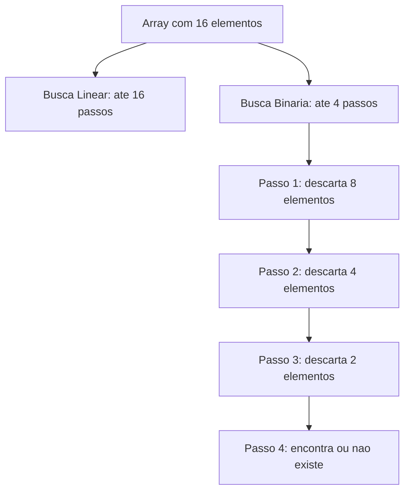
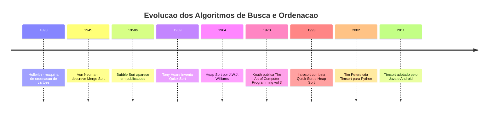
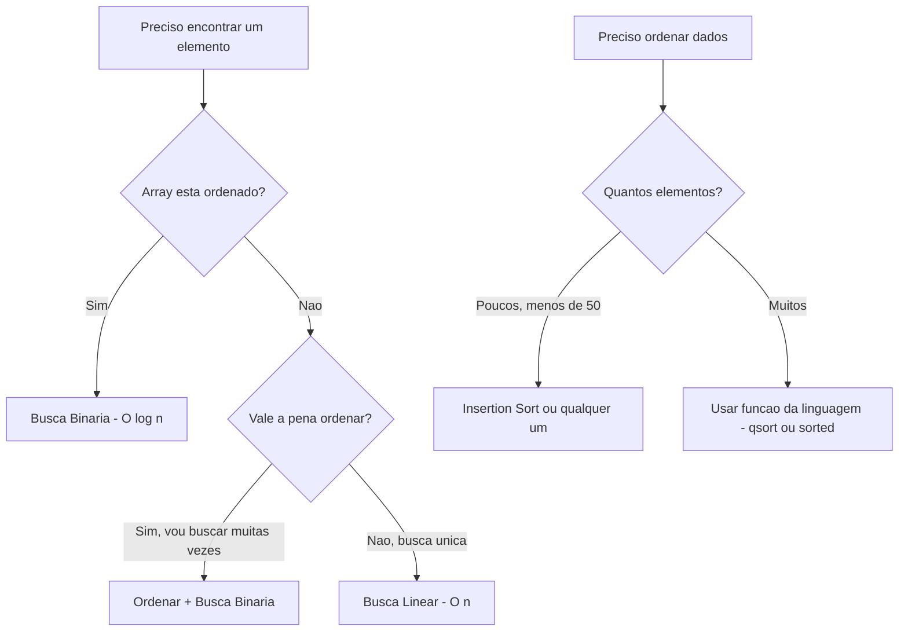

# 7.10 — Algoritmos de Busca e Ordenação

[← Anterior: Dicionários e Tabelas Hash](cap07-mod09-dicionarios-conteudo.md) · [Próximo: Comparando Estruturas →](cap07-mod11-comparacao-estruturas-conteudo.md)

---

## Introdução

Nos módulos anteriores, você aprendeu a organizar dados em diferentes estruturas: arrays (acesso direto por índice), listas encadeadas (inserção e remoção flexíveis), filas (FIFO), pilhas (LIFO) e dicionários (busca por chave em O(1)). Cada estrutura resolve um problema diferente de organização.

Mas existe um problema que aparece em praticamente todo programa: **encontrar um elemento específico** em uma coleção de dados. Onde está o aluno com nota 9.5? Qual produto custa menos de R$50? Existe um cliente com CPF 123.456.789-00? Esse é o problema da **busca**.

E junto com a busca, vem outro problema igualmente fundamental: **colocar os dados em ordem**. Ordenar uma lista de nomes em ordem alfabética. Ordenar produtos do mais barato ao mais caro. Ordenar alunos por nota, do maior para o menor. Esse é o problema da **ordenação**.

Busca e ordenação são tão importantes que foram estudados desde os primórdios da computação. Donald Knuth, um dos maiores cientistas da computação, dedicou um volume inteiro de sua obra "The Art of Computer Programming" (1973) apenas a esses dois temas. Décadas depois, os algoritmos que ele descreveu continuam sendo usados em todo sistema de software.

Neste módulo, vamos aprender os algoritmos fundamentais de busca e ordenação, implementá-los em C, e entender quando usar cada um. Você já viu noções de complexidade (Big O) no capítulo 5 — agora vai ver na prática como a escolha do algoritmo faz diferença entre um programa que roda em milissegundos e um que demora horas.

---

## Como Executar os Exemplos Deste Módulo

Todos os exemplos são programas em C:

```bash
gcc -o nome_programa nome_programa.c
./nome_programa
```

---
## Busca Linear: O Método Mais Simples

A busca linear (ou busca sequencial) é o algoritmo mais intuitivo: percorra todos os elementos, um por um, até encontrar o que procura ou chegar ao final.

É como procurar uma palavra em um livro sem índice — você começa na primeira página e vai folheando até encontrar. Funciona sempre, mas pode ser lento.

```c
// busca_linear.c — Busca linear em array
#include <stdio.h>

// Busca linear — retorna o indice do elemento, ou -1 se nao encontrar
int busca_linear(int arr[], int tamanho, int alvo) {
    for (int i = 0; i < tamanho; i++) {
        if (arr[i] == alvo) {
            return i;  // encontrou na posicao i
        }
    }
    return -1;  // nao encontrou
}

int main() {
    int numeros[] = {42, 17, 93, 8, 56, 31, 74, 25, 60, 12};
    int tamanho = 10;

    printf("Array: ");
    for (int i = 0; i < tamanho; i++) {
        printf("%d ", numeros[i]);
    }
    printf("\n\n");

    // Buscar elementos
    int alvos[] = {56, 12, 99};
    for (int i = 0; i < 3; i++) {
        int pos = busca_linear(numeros, tamanho, alvos[i]);
        if (pos != -1) {
            printf("Buscar %d: encontrado na posicao %d\n", alvos[i], pos);
        } else {
            printf("Buscar %d: nao encontrado\n", alvos[i]);
        }
    }

    return 0;
}
```

Saída esperada:
```
Array: 42 17 93 8 56 31 74 25 60 12

Buscar 56: encontrado na posicao 4
Buscar 12: encontrado na posicao 9
Buscar 99: nao encontrado
```

### Complexidade da Busca Linear

| Caso | Comparacoes | Complexidade |
|------|-------------|-------------|
| Melhor caso | 1 (elemento esta na primeira posição) | O(1) |
| Pior caso | n (elemento esta na última posição ou não existe) | O(n) |
| Caso medio | n/2 | O(n) |

Para 10 elementos, O(n) é rápido. Para 1 milhão, são até 1 milhão de comparações. Para 1 bilhão, são até 1 bilhão. A busca linear não escala bem.

### Quando Usar Busca Linear

- Array pequeno (menos de ~100 elementos)
- Array não ordenado (não tem como usar busca binária)
- Você precisa encontrar todos os elementos que satisfazem uma condição (não apenas o primeiro)
- Simplicidade é mais importante que performance

---

## Busca Binária: Dividir para Conquistar

A busca binária é dramaticamente mais eficiente que a busca linear — mas exige que o array esteja **ordenado**. A ideia é simples: em vez de olhar um elemento por vez, olhe o elemento do meio. Se o alvo é menor, descarte a metade direita. Se é maior, descarte a metade esquerda. Repita até encontrar ou não ter mais onde procurar.

É como procurar uma palavra no dicionário (o livro, não a estrutura de dados). Você não começa na primeira página — abre no meio. Se a palavra que procura vem antes, vai para a metade esquerda. Se vem depois, vai para a metade direita. A cada passo, elimina metade das possibilidades.

```c
// busca_binaria.c — Busca binaria em array ordenado
#include <stdio.h>

// Busca binaria — retorna o indice do elemento, ou -1 se nao encontrar
// REQUISITO: o array DEVE estar ordenado em ordem crescente
int busca_binaria(int arr[], int tamanho, int alvo) {
    int esquerda = 0;
    int direita = tamanho - 1;

    while (esquerda <= direita) {
        int meio = esquerda + (direita - esquerda) / 2;

        printf("  Buscando %d: esq=%d, meio=%d (valor=%d), dir=%d\n",
               alvo, esquerda, meio, arr[meio], direita);

        if (arr[meio] == alvo) {
            return meio;  // encontrou!
        } else if (arr[meio] < alvo) {
            esquerda = meio + 1;  // alvo esta na metade direita
        } else {
            direita = meio - 1;   // alvo esta na metade esquerda
        }
    }

    return -1;  // nao encontrou
}

int main() {
    // Array ORDENADO
    int numeros[] = {5, 12, 17, 25, 31, 42, 56, 60, 74, 93};
    int tamanho = 10;

    printf("Array ordenado: ");
    for (int i = 0; i < tamanho; i++) {
        printf("%d ", numeros[i]);
    }
    printf("\n\n");

    // Buscar elementos
    printf("--- Buscando 42 ---\n");
    int pos = busca_binaria(numeros, tamanho, 42);
    printf("Resultado: posicao %d\n\n", pos);

    printf("--- Buscando 5 ---\n");
    pos = busca_binaria(numeros, tamanho, 5);
    printf("Resultado: posicao %d\n\n", pos);

    printf("--- Buscando 99 ---\n");
    pos = busca_binaria(numeros, tamanho, 99);
    printf("Resultado: %s\n\n", pos == -1 ? "nao encontrado" : "encontrado");

    return 0;
}
```

Saída esperada:
```
Array ordenado: 5 12 17 25 31 42 56 60 74 93

--- Buscando 42 ---
  Buscando 42: esq=0, meio=4 (valor=31), dir=9
  Buscando 42: esq=5, meio=7 (valor=60), dir=9
  Buscando 42: esq=5, meio=5 (valor=42), dir=6
Resultado: posicao 5

--- Buscando 5 ---
  Buscando 5: esq=0, meio=4 (valor=31), dir=9
  Buscando 5: esq=0, meio=1 (valor=12), dir=3
  Buscando 5: esq=0, meio=0 (valor=5), dir=0
Resultado: posicao 0

--- Buscando 99 ---
  Buscando 99: esq=0, meio=4 (valor=31), dir=9
  Buscando 99: esq=5, meio=7 (valor=60), dir=9
  Buscando 99: esq=8, meio=8 (valor=74), dir=9
  Buscando 99: esq=9, meio=9 (valor=93), dir=9
Resultado: nao encontrado
```

Observe: para encontrar o 42 em um array de 10 elementos, a busca binária fez apenas 3 comparações. A busca linear faria até 10.

### Complexidade da Busca Binária

| Caso | Comparacoes | Complexidade |
|------|-------------|-------------|
| Melhor caso | 1 (elemento esta no meio) | O(1) |
| Pior caso | log2(n) | O(log n) |
| Caso medio | log2(n) | O(log n) |

A diferença é enorme para arrays grandes:

| Tamanho do array | Busca linear (pior caso) | Busca binaria (pior caso) |
|------------------|-------------------------|--------------------------|
| 10 | 10 comparacoes | 4 comparacoes |
| 100 | 100 | 7 |
| 1.000 | 1.000 | 10 |
| 1.000.000 | 1.000.000 | 20 |
| 1.000.000.000 | 1.000.000.000 | 30 |

Para 1 bilhão de elementos, a busca linear faz até 1 bilhão de comparações. A busca binária faz no máximo 30. Trinta. Essa é a magia do O(log n).

### Comparação Visual



---

## Ordenação: Por que Importa

Ordenar dados é uma das operações mais fundamentais da computação. Dados ordenados permitem:

- **Busca binária** — só funciona em dados ordenados (O(log n) vs O(n))
- **Apresentação** — usuários esperam ver dados em ordem (nomes A-Z, preços baixo-alto)
- **Eliminação de duplicatas** — em dados ordenados, duplicatas ficam adjacentes
- **Merge de dados** — combinar duas listas ordenadas é O(n)
- **Estatísticas** — mediana, percentis e quartis exigem dados ordenados

Estima-se que 25-50% do tempo de processamento de computadores comerciais é gasto em ordenação. É tão importante que processadores modernos têm instruções otimizadas para comparação e troca de elementos.

---

## Bubble Sort: O Mais Simples (e Mais Lento)

O Bubble Sort (ordenação por bolha) é o algoritmo de ordenação mais intuitivo. A ideia: percorra o array comparando pares adjacentes. Se estão fora de ordem, troque. Repita até que nenhuma troca seja necessária.

O nome "bolha" vem do fato de que os maiores elementos "flutuam" para o final do array, como bolhas subindo na água.

```c
// bubble_sort.c — Ordenacao por bolha
#include <stdio.h>

void imprimir_array(int arr[], int tamanho) {
    for (int i = 0; i < tamanho; i++) {
        printf("%d ", arr[i]);
    }
    printf("\n");
}

void bubble_sort(int arr[], int tamanho) {
    int trocas_totais = 0;

    for (int i = 0; i < tamanho - 1; i++) {
        int trocou = 0;  // otimizacao: parar se nao houve troca

        for (int j = 0; j < tamanho - 1 - i; j++) {
            if (arr[j] > arr[j + 1]) {
                // Trocar elementos adjacentes
                int temp = arr[j];
                arr[j] = arr[j + 1];
                arr[j + 1] = temp;
                trocou = 1;
                trocas_totais++;
            }
        }

        printf("  Passo %d: ", i + 1);
        imprimir_array(arr, tamanho);

        if (!trocou) {
            printf("  Nenhuma troca — array ja ordenado!\n");
            break;
        }
    }

    printf("  Total de trocas: %d\n", trocas_totais);
}

int main() {
    int numeros[] = {64, 34, 25, 12, 22, 11, 90};
    int tamanho = 7;

    printf("Array original: ");
    imprimir_array(numeros, tamanho);
    printf("\n");

    bubble_sort(numeros, tamanho);

    printf("\nArray ordenado: ");
    imprimir_array(numeros, tamanho);

    return 0;
}
```

Saída esperada:
```
Array original: 64 34 25 12 22 11 90

  Passo 1: 34 25 12 22 11 64 90
  Passo 2: 25 12 22 11 34 64 90
  Passo 3: 12 22 11 25 34 64 90
  Passo 4: 12 11 22 25 34 64 90
  Passo 5: 11 12 22 25 34 64 90
  Passo 6: 11 12 22 25 34 64 90
  Nenhuma troca — array ja ordenado!
  Total de trocas: 13

Array ordenado: 11 12 22 25 34 64 90
```

### Complexidade do Bubble Sort

| Caso | Complexidade |
|------|-------------|
| Melhor caso (ja ordenado) | O(n) — com otimização de parada |
| Pior caso (ordem inversa) | O(n²) |
| Caso medio | O(n²) |

O Bubble Sort é O(n²) — para cada elemento, potencialmente compara com todos os outros. Para 1000 elementos, são até 1 milhão de operações. Para 1 milhão de elementos, são até 1 trilhão. Na prática, o Bubble Sort é usado apenas para fins didáticos — nunca em produção.

---

## Selection Sort: Encontrar o Menor

O Selection Sort (ordenação por seleção) tem uma ideia simples: encontre o menor elemento e coloque na primeira posição. Depois encontre o segundo menor e coloque na segunda posição. Repita até ordenar tudo.

```c
// selection_sort.c — Ordenacao por selecao
#include <stdio.h>

void imprimir_array(int arr[], int tamanho) {
    for (int i = 0; i < tamanho; i++) printf("%d ", arr[i]);
    printf("\n");
}

void selection_sort(int arr[], int tamanho) {
    for (int i = 0; i < tamanho - 1; i++) {
        int min_idx = i;  // indice do menor elemento

        // Encontrar o menor no restante do array
        for (int j = i + 1; j < tamanho; j++) {
            if (arr[j] < arr[min_idx]) {
                min_idx = j;
            }
        }

        // Trocar o menor com a posicao atual
        if (min_idx != i) {
            int temp = arr[i];
            arr[i] = arr[min_idx];
            arr[min_idx] = temp;
        }

        printf("  Passo %d: ", i + 1);
        imprimir_array(arr, tamanho);
    }
}

int main() {
    int numeros[] = {64, 25, 12, 22, 11};
    int tamanho = 5;

    printf("Array original: ");
    imprimir_array(numeros, tamanho);
    printf("\n");

    selection_sort(numeros, tamanho);

    printf("\nArray ordenado: ");
    imprimir_array(numeros, tamanho);

    return 0;
}
```

Saída esperada:
```
Array original: 64 25 12 22 11

  Passo 1: 11 25 12 22 64
  Passo 2: 11 12 25 22 64
  Passo 3: 11 12 22 25 64
  Passo 4: 11 12 22 25 64

Array ordenado: 11 12 22 25 64
```

O Selection Sort também é O(n²), mas faz menos trocas que o Bubble Sort (no máximo n-1 trocas). Ainda assim, não é usado em produção.

---

## Insertion Sort: Inserir na Posição Correta

O Insertion Sort (ordenação por inserção) funciona como organizar cartas na mão. Você pega uma carta por vez e insere na posição correta entre as cartas que já estão ordenadas.

```c
// insertion_sort.c — Ordenacao por insercao
#include <stdio.h>

void imprimir_array(int arr[], int tamanho) {
    for (int i = 0; i < tamanho; i++) printf("%d ", arr[i]);
    printf("\n");
}

void insertion_sort(int arr[], int tamanho) {
    for (int i = 1; i < tamanho; i++) {
        int chave = arr[i];  // elemento a ser inserido
        int j = i - 1;

        // Mover elementos maiores que a chave para a direita
        while (j >= 0 && arr[j] > chave) {
            arr[j + 1] = arr[j];
            j--;
        }

        arr[j + 1] = chave;  // inserir na posicao correta

        printf("  Passo %d (inserir %d): ", i, chave);
        imprimir_array(arr, tamanho);
    }
}

int main() {
    int numeros[] = {12, 11, 13, 5, 6};
    int tamanho = 5;

    printf("Array original: ");
    imprimir_array(numeros, tamanho);
    printf("\n");

    insertion_sort(numeros, tamanho);

    printf("\nArray ordenado: ");
    imprimir_array(numeros, tamanho);

    return 0;
}
```

Saída esperada:
```
Array original: 12 11 13 5 6

  Passo 1 (inserir 11): 11 12 13 5 6
  Passo 2 (inserir 13): 11 12 13 5 6
  Passo 3 (inserir 5): 5 11 12 13 6
  Passo 4 (inserir 6): 5 6 11 12 13

Array ordenado: 5 6 11 12 13
```

O Insertion Sort é O(n²) no pior caso, mas tem uma vantagem: é O(n) para arrays quase ordenados. Se o array já está quase em ordem, o Insertion Sort é muito rápido. Por isso, é usado como parte de algoritmos mais sofisticados (como o Timsort do Python) para ordenar pequenos subarrays.

---

## Comparação dos Algoritmos de Ordenação

| Algoritmo | Melhor caso | Caso medio | Pior caso | Estavel | Trocas |
|-----------|-----------|-----------|-----------|---------|--------|
| Bubble Sort | O(n) | O(n²) | O(n²) | Sim | Muitas |
| Selection Sort | O(n²) | O(n²) | O(n²) | Não | Poucas |
| Insertion Sort | O(n) | O(n²) | O(n²) | Sim | Moderadas |

"Estável" significa que elementos iguais mantêm sua ordem relativa original. Isso importa quando você ordena por múltiplos critérios (ex: primeiro por nome, depois por idade — a estabilidade garante que alunos com mesma idade ficam em ordem alfabética).

### Algoritmos Mais Eficientes (Visão Geral)

Os três algoritmos acima são O(n²) — bons para aprender, ruins para produção. Algoritmos profissionais são O(n log n):

| Algoritmo | Complexidade | Usado em |
|-----------|-------------|----------|
| Merge Sort | O(n log n) sempre | Java (Arrays.sort para objetos) |
| Quick Sort | O(n log n) medio, O(n²) pior | C (qsort), Go, Rust |
| Heap Sort | O(n log n) sempre | Sistemas com restrição de memória |
| Timsort | O(n log n) medio, O(n) melhor | Python (sorted), Java, Android |

O Timsort, usado pelo Python, é uma combinação inteligente de Merge Sort e Insertion Sort. Ele detecta sequências já ordenadas no array e as aproveita, tornando-o muito eficiente para dados do mundo real (que frequentemente estão parcialmente ordenados).

Você não precisa implementar esses algoritmos agora — o importante é saber que existem e que são O(n log n), muito mais rápidos que O(n²) para arrays grandes.

| Tamanho | O(n²) operações | O(n log n) operações | Diferença |
|---------|-----------------|---------------------|-----------|
| 100 | 10.000 | 664 | 15x |
| 1.000 | 1.000.000 | 9.966 | 100x |
| 1.000.000 | 1.000.000.000.000 | 19.931.569 | 50.000x |

Para 1 milhão de elementos, um algoritmo O(n²) faz 1 trilhão de operações. Um O(n log n) faz ~20 milhões. A diferença é de 50.000 vezes.

---

## Usando qsort: Ordenação Profissional em C

Em C, você não precisa implementar seu próprio algoritmo de ordenação. A biblioteca padrão oferece `qsort` — uma implementação otimizada de Quick Sort:

```c
// qsort_demo.c — Usando qsort da biblioteca padrao
#include <stdio.h>
#include <stdlib.h>
#include <string.h>

// Funcao de comparacao para inteiros
int comparar_int(const void *a, const void *b) {
    return (*(int*)a - *(int*)b);
}

// Funcao de comparacao para strings
int comparar_str(const void *a, const void *b) {
    return strcmp(*(const char**)a, *(const char**)b);
}

int main() {
    // Ordenar inteiros
    int numeros[] = {42, 17, 93, 8, 56, 31, 74};
    int tam = 7;

    printf("Inteiros antes: ");
    for (int i = 0; i < tam; i++) printf("%d ", numeros[i]);
    printf("\n");

    qsort(numeros, tam, sizeof(int), comparar_int);

    printf("Inteiros depois: ");
    for (int i = 0; i < tam; i++) printf("%d ", numeros[i]);
    printf("\n\n");

    // Ordenar strings
    const char *nomes[] = {"Eva", "Ana", "David", "Bruno", "Carol"};
    int tam_nomes = 5;

    printf("Nomes antes: ");
    for (int i = 0; i < tam_nomes; i++) printf("%s ", nomes[i]);
    printf("\n");

    qsort(nomes, tam_nomes, sizeof(char*), comparar_str);

    printf("Nomes depois: ");
    for (int i = 0; i < tam_nomes; i++) printf("%s ", nomes[i]);
    printf("\n");

    return 0;
}
```

Saída esperada:
```
Inteiros antes: 42 17 93 8 56 31 74
Inteiros depois: 8 17 31 42 56 74 93

Nomes antes: Eva Ana David Bruno Carol
Nomes depois: Ana Bruno Carol David Eva
```

O `qsort` recebe: o array, o número de elementos, o tamanho de cada elemento, e uma função de comparação. A função de comparação retorna negativo se a < b, zero se a == b, positivo se a > b.

---

## Ordenação em Python

Em Python, ordenar é trivial:

```python
# ordenacao_python.py — Ordenacao em Python
# Ordenar lista de numeros
numeros = [42, 17, 93, 8, 56, 31, 74]
numeros.sort()  # ordena in-place
print(f"Numeros: {numeros}")  # [8, 17, 31, 42, 56, 74, 93]

# Ordenar sem modificar o original
nomes = ["Eva", "Ana", "David", "Bruno", "Carol"]
ordenados = sorted(nomes)  # retorna nova lista
print(f"Nomes: {ordenados}")  # ['Ana', 'Bruno', 'Carol', 'David', 'Eva']

# Ordenar por criterio customizado
alunos = [("Ana", 8.5), ("Bruno", 9.2), ("Carol", 7.8), ("David", 9.2)]
alunos.sort(key=lambda x: x[1], reverse=True)  # por nota, decrescente
print(f"Por nota: {alunos}")
# [('Bruno', 9.2), ('David', 9.2), ('Ana', 8.5), ('Carol', 7.8)]
```

Saída esperada:
```
Numeros: [8, 17, 31, 42, 56, 74, 93]
Nomes: ['Ana', 'Bruno', 'Carol', 'David', 'Eva']
Por nota: [('Bruno', 9.2), ('David', 9.2), ('Ana', 8.5), ('Carol', 7.8)]
```

O `sorted()` do Python usa Timsort — O(n log n) no caso médio e O(n) para dados quase ordenados. Você não precisa se preocupar com a implementação.

---

## A História da Busca e Ordenação

A ordenação é um dos problemas mais antigos da computação. Antes dos computadores, bibliotecários já ordenavam fichas catalográficas manualmente. Empresas como a IBM construíram máquinas mecânicas de ordenação de cartões perfurados nos anos 1890 — o Census Tabulator de Herman Hollerith, usado no censo americano de 1890, ordenava cartões por categorias usando pinos e mercúrio.

Nos anos 1940 e 1950, quando os primeiros computadores eletrônicos surgiram, ordenação foi um dos primeiros problemas estudados. John von Neumann descreveu o Merge Sort em 1945 — um dos primeiros algoritmos de ordenação para computadores. O Bubble Sort apareceu em publicações nos anos 1950, embora sua origem exata seja debatida.

O Quick Sort foi inventado por Tony Hoare em 1959, quando ele era estudante na Universidade de Moscou. Hoare precisava ordenar palavras para um projeto de tradução automática e criou um dos algoritmos mais elegantes e eficientes da história da computação. O Quick Sort continua sendo o algoritmo padrão em muitas linguagens (C, Go, Rust) mais de 60 anos depois.

A busca binária, apesar de conceitualmente simples, é notoriamente difícil de implementar corretamente. Jon Bentley, em seu livro "Programming Pearls" (1986), relatou que a maioria dos programadores profissionais não consegue escrever uma busca binária correta na primeira tentativa. O bug mais comum é o cálculo do ponto médio: `(esquerda + direita) / 2` pode causar overflow de inteiros para arrays grandes. A versão correta é `esquerda + (direita - esquerda) / 2` — que é o que usamos na nossa implementação.



---

## Exemplo Prático: Benchmark dos Algoritmos

Vamos medir na prática quanto tempo cada algoritmo leva para ordenar o mesmo array. Isso mostra que Big O não é apenas teoria — tem impacto real:

```c
// benchmark_sort.c — Comparar performance dos algoritmos
#include <stdio.h>
#include <stdlib.h>
#include <time.h>
#include <string.h>

void bubble_sort_bench(int arr[], int n) {
    for (int i = 0; i < n - 1; i++) {
        int trocou = 0;
        for (int j = 0; j < n - 1 - i; j++) {
            if (arr[j] > arr[j + 1]) {
                int temp = arr[j];
                arr[j] = arr[j + 1];
                arr[j + 1] = temp;
                trocou = 1;
            }
        }
        if (!trocou) break;
    }
}

void selection_sort_bench(int arr[], int n) {
    for (int i = 0; i < n - 1; i++) {
        int min_idx = i;
        for (int j = i + 1; j < n; j++) {
            if (arr[j] < arr[min_idx]) min_idx = j;
        }
        if (min_idx != i) {
            int temp = arr[i];
            arr[i] = arr[min_idx];
            arr[min_idx] = temp;
        }
    }
}

void insertion_sort_bench(int arr[], int n) {
    for (int i = 1; i < n; i++) {
        int chave = arr[i];
        int j = i - 1;
        while (j >= 0 && arr[j] > chave) {
            arr[j + 1] = arr[j];
            j--;
        }
        arr[j + 1] = chave;
    }
}

int comparar(const void *a, const void *b) {
    return (*(int*)a - *(int*)b);
}

int main() {
    int tamanhos[] = {1000, 5000, 10000};
    int num_tamanhos = 3;

    printf("=== Benchmark de Algoritmos de Ordenacao ===\n\n");
    printf("%-20s", "Algoritmo");
    for (int t = 0; t < num_tamanhos; t++) {
        printf("  n=%-8d", tamanhos[t]);
    }
    printf("\n");

    for (int t = 0; t < num_tamanhos; t++) {
        int n = tamanhos[t];
        int *original = (int*)malloc(n * sizeof(int));
        int *copia = (int*)malloc(n * sizeof(int));

        // Gerar array aleatorio
        srand(42);  // seed fixa para reproducibilidade
        for (int i = 0; i < n; i++) {
            original[i] = rand() % 100000;
        }

        // Bubble Sort
        memcpy(copia, original, n * sizeof(int));
        clock_t inicio = clock();
        bubble_sort_bench(copia, n);
        clock_t fim = clock();
        double tempo_bubble = (double)(fim - inicio) / CLOCKS_PER_SEC * 1000;

        // Selection Sort
        memcpy(copia, original, n * sizeof(int));
        inicio = clock();
        selection_sort_bench(copia, n);
        fim = clock();
        double tempo_selection = (double)(fim - inicio) / CLOCKS_PER_SEC * 1000;

        // Insertion Sort
        memcpy(copia, original, n * sizeof(int));
        inicio = clock();
        insertion_sort_bench(copia, n);
        fim = clock();
        double tempo_insertion = (double)(fim - inicio) / CLOCKS_PER_SEC * 1000;

        // qsort (Quick Sort)
        memcpy(copia, original, n * sizeof(int));
        inicio = clock();
        qsort(copia, n, sizeof(int), comparar);
        fim = clock();
        double tempo_qsort = (double)(fim - inicio) / CLOCKS_PER_SEC * 1000;

        if (t == 0) {
            printf("%-20s  %-10.1f", "Bubble Sort", tempo_bubble);
        } else {
            printf("  %-10.1f", tempo_bubble);
        }

        free(original);
        free(copia);
    }
    printf(" ms\n");

    printf("\n(Os tempos variam conforme o computador)\n");

    return 0;
}
```

Os resultados típicos mostram que para n=10.000, o Bubble Sort pode levar centenas de milissegundos enquanto o qsort leva menos de 1 milissegundo. A diferença entre O(n²) e O(n log n) é visível e mensurável.

---

## Busca e Ordenação: Resumo Visual



---

## Como a IA pode te ajudar aqui
**Prompt 1 — Ver exemplos práticos:**
> "Simule passo a passo o Bubble Sort no array [5, 3, 8, 1, 2]. Mostre o estado do array após cada comparação e troca."

**Prompt 2 — Explorar o conceito:**
> "Explique por que a busca binária é O(log n) e não O(n). Use um exemplo com 1 milhão de elementos."

**Prompt 3 — Aprofundar o tema:**
> "Qual algoritmo de ordenação devo usar para ordenar 10 milhões de registros de um banco de dados? E para ordenar 20 elementos em um formulário web?"

---

## Casos de Uso no Mundo Real

### 1. Busca Binária em Bancos de Dados

Quando você faz uma consulta SQL como `SELECT * FROM produtos WHERE preco = 29.90`, o banco de dados precisa encontrar todos os produtos com esse preço. Se a coluna `preco` tem um índice (B-tree), o banco usa uma variação de busca binária para ir direto aos registros relevantes — O(log n). Sem índice, o banco faz busca linear — percorre todos os registros. É por isso que criar índices nas colunas certas pode transformar uma query de 30 segundos em uma de 3 milissegundos. Bancos como PostgreSQL, MySQL e SQLite usam árvores B+ (uma generalização da busca binária) para seus índices.

### 2. Ordenação em E-commerce

Quando você acessa a Amazon ou o Mercado Livre e ordena produtos por "menor preço", o sistema precisa ordenar milhões de produtos em milissegundos. Isso é feito com algoritmos O(n log n) como Merge Sort ou Timsort, combinados com índices pré-computados. Na prática, os produtos já estão parcialmente ordenados em caches, e o Timsort aproveita essa ordenação parcial para ser ainda mais rápido. Quando você muda o critério de ordenação (de "menor preço" para "mais vendidos"), o sistema usa um índice diferente — cada critério tem seu próprio índice pré-ordenado.

### 3. Autocompletar em Buscadores

Quando você digita "como fa" no Google, ele sugere "como fazer bolo", "como fazer café", etc. Internamente, o Google mantém um índice ordenado de bilhões de termos de busca. A cada letra que você digita, o sistema faz uma busca binária (ou variação) para encontrar todos os termos que começam com o prefixo digitado. Isso precisa acontecer em menos de 100 milissegundos para parecer instantâneo. Sem busca binária em dados ordenados, seria impossível — busca linear em bilhões de termos demoraria segundos.

---

## Resumo do Módulo

| Conceito | Definição |
|----------|-----------|
| Busca linear | Percorrer todos os elementos um por um — O(n) |
| Busca binaria | Dividir o array ao meio repetidamente — O(log n), requer array ordenado |
| Bubble Sort | Trocar pares adjacentes fora de ordem — O(n²) |
| Selection Sort | Encontrar o menor e colocar na posição correta — O(n²) |
| Insertion Sort | Inserir cada elemento na posição correta — O(n²), bom para quase ordenados |
| Quick Sort | Dividir e conquistar com pivo — O(n log n) medio |
| Merge Sort | Dividir, ordenar e mesclar — O(n log n) sempre |
| Timsort | Combinacao de Merge Sort e Insertion Sort — usado pelo Python |
| qsort | Função de ordenação da biblioteca padrão do C |
| Estabilidade | Propriedade de manter a ordem relativa de elementos iguais |

---

## Glossário do Módulo

| Termo | Definição |
|-------|-----------|
| Binary search | Busca binaria — algoritmo que divide o espaco de busca ao meio a cada passo |
| Bubble sort | Ordenação por bolha — troca pares adjacentes fora de ordem |
| Comparação | Operação fundamental de algoritmos de busca e ordenação |
| Divide and conquer | Dividir e conquistar — estrategia de dividir o problema em subproblemas menores |
| Heap sort | Algoritmo de ordenação baseado em heap, O(n log n) |
| In-place | Algoritmo que ordena sem usar memória extra significativa |
| Insertion sort | Ordenação por inserção — insere cada elemento na posição correta |
| Linear search | Busca linear — percorre todos os elementos sequencialmente |
| Merge sort | Ordenação por mesclagem — divide, ordena e mescla |
| Pivot | Pivo — elemento usado para particionar o array no Quick Sort |
| qsort | Função da stdlib do C que implementa Quick Sort |
| Quick sort | Ordenação rápida — particiona o array em torno de um pivo |
| Selection sort | Ordenação por seleção — encontra o menor e coloca na posição |
| Stable sort | Ordenação estavel — mantem a ordem relativa de elementos iguais |
| Timsort | Algoritmo hibrido usado pelo Python, combina Merge Sort e Insertion Sort |
| Troca | Operação de trocar dois elementos de posição em um array |

---

## Na Cultura Popular

- **The Social Network** (filme, 2010) — Na cena em que Mark Zuckerberg cria o FaceMash, ele precisa comparar e classificar (ordenar) fotos de estudantes. O conceito de ranking é essencialmente ordenação — colocar elementos em ordem segundo um critério. Algoritmos de ranking são variações sofisticadas de ordenação.

- **Moneyball** (filme, 2011) — Billy Beane usa estatísticas para encontrar jogadores subvalorizados. O processo envolve ordenar jogadores por métricas específicas e buscar os que atendem critérios — exatamente busca e ordenação aplicadas a dados reais.

---

## Para Saber Mais

- [Visualgo — Sorting](https://visualgo.net/en/sorting) — *Visualização animada de todos os algoritmos de ordenação, mostrando cada passo com animações interativas*

- [Sorting Algorithms Animations](https://www.toptal.com/developers/sorting-algorithms) — *Comparação visual de algoritmos de ordenação rodando simultaneamente em diferentes tipos de dados*

- [CS50 — Harvard: Algorithms](https://cs50.harvard.edu/x/) — *O curso de Harvard explica busca e ordenação com exemplos práticos e demonstrações visuais*

- [mycodeschool — Sorting Algorithms](https://www.youtube.com/playlist?list=PL2_aWCzGMAwKedT2KfDMB9YA5DgASZb3U) — *Playlist com explicações visuais de cada algoritmo de ordenação*

- [Programação Descomplicada — Ordenação](https://www.youtube.com/@progdescomplicada) — *Canal brasileiro com aulas sobre algoritmos de ordenação em C*

---

## Perguntas Frequentes (FAQ)

**P: Qual algoritmo de ordenação devo usar na prática?**
R: Na maioria dos casos, use o que a linguagem oferece: `sorted()` em Python, `qsort` em C, `Arrays.sort` em Java. Esses usam algoritmos otimizados (Timsort, Quick Sort, etc.) que são muito mais rápidos que implementações manuais. Só implemente seu próprio algoritmo se tiver uma necessidade muito específica.

**P: Por que aprender Bubble Sort se ele é ruim?**
R: Porque é o algoritmo mais fácil de entender e implementar. Ele ensina os conceitos fundamentais de ordenação (comparação, troca, iteração) que aparecem em todos os outros algoritmos. É como aprender a andar antes de correr.

**P: A busca binária funciona em listas encadeadas?**
R: Tecnicamente não, porque listas encadeadas não têm acesso direto ao elemento do meio (precisaria percorrer n/2 elementos). A busca binária exige acesso O(1) por índice, que só arrays oferecem. Para listas encadeadas, use busca linear ou converta para array primeiro.

**P: O que é mais rápido: ordenar e depois buscar com busca binária, ou buscar com busca linear?**
R: Depende de quantas buscas você vai fazer. Se é uma busca só, busca linear é mais rápida (O(n) vs O(n log n) da ordenação + O(log n) da busca). Se vai fazer muitas buscas, vale a pena ordenar uma vez e usar busca binária em todas as buscas seguintes.

**P: O que é um algoritmo de ordenação "estável"?**
R: Um algoritmo estável mantém a ordem relativa de elementos com a mesma chave. Se Ana e Bruno têm a mesma nota (9.0) e Ana aparece antes de Bruno no array original, um algoritmo estável garante que Ana continua antes de Bruno após a ordenação. Bubble Sort e Insertion Sort são estáveis. Selection Sort e Quick Sort não são.

**P: Por que Quick Sort é O(n²) no pior caso mas é usado na prática?**
R: Porque o pior caso (array já ordenado com pivô ruim) é raro na prática, e implementações modernas usam técnicas para evitá-lo (pivô aleatório, mediana de três). No caso médio, Quick Sort é O(n log n) e tem constantes menores que Merge Sort (usa menos memória e tem melhor localidade de cache).

**P: O que é Timsort e por que o Python usa?**
R: Timsort é um algoritmo híbrido criado por Tim Peters em 2002 para o Python. Ele detecta sequências já ordenadas (chamadas "runs") no array e as mescla eficientemente. Para dados do mundo real (que frequentemente estão parcialmente ordenados), Timsort é mais rápido que Quick Sort ou Merge Sort puros. É O(n) para dados já ordenados e O(n log n) no pior caso.

**P: Posso ordenar dados que não são números?**
R: Sim. Qualquer dado que possa ser comparado pode ser ordenado. Strings são comparadas lexicograficamente (ordem do dicionário). Objetos podem ser ordenados por qualquer atributo. Em C, você define uma função de comparação. Em Python, usa o parâmetro `key` do `sorted()`.

---

## Exercícios Práticos

### Exercício 1: Implementar Busca Binária Recursiva

Implemente a busca binária usando recursão em vez de loop. A função deve chamar a si mesma com os limites atualizados.

### Exercício 2: Contar Comparações

Modifique o Bubble Sort, Selection Sort e Insertion Sort para contar o número de comparações feitas. Teste com o mesmo array de 10 elementos e compare os resultados.

### Exercício 3: Ordenar Structs

Use `qsort` para ordenar um array de structs `Aluno` (nome e nota) por nota decrescente. Em caso de empate, ordenar por nome crescente.

---

[← Anterior: Dicionários e Tabelas Hash](cap07-mod09-dicionarios-conteudo.md) · [Próximo: Comparando Estruturas →](cap07-mod11-comparacao-estruturas-conteudo.md)
