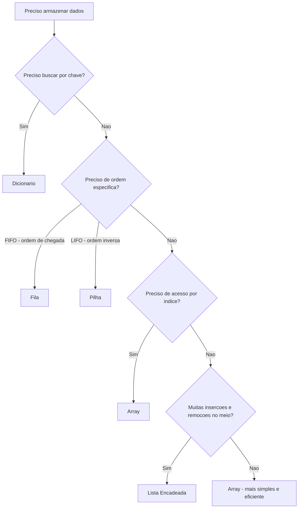

# 7.11 — Comparando Estruturas: Quando Usar Cada Uma

[← Anterior: Algoritmos de Busca e Ordenação](cap07-mod10-busca-ordenacao-conteudo.md) · [Próximo: Projeto do Capítulo 7 →](../projects/projeto-cap07-estrutura-dados-c.md)

---

## Introdução

Ao longo deste capítulo, você aprendeu cinco estruturas de dados fundamentais: arrays, listas encadeadas, filas, pilhas e dicionários. Também aprendeu algoritmos de busca e ordenação que operam sobre essas estruturas. Cada uma resolve um problema diferente, tem vantagens e desvantagens, e é mais adequada para certos cenários.

Agora vem a pergunta mais importante: **quando usar cada uma?**

Essa é a habilidade que separa um programador iniciante de um programador experiente. Saber implementar uma lista encadeada é útil, mas saber quando usar uma lista encadeada em vez de um array — e por quê — é o que realmente importa no dia a dia.

Neste módulo, vamos consolidar tudo que aprendemos, comparar as estruturas lado a lado, e desenvolver a intuição de qual estrutura escolher para cada problema. Vamos usar cenários reais para mostrar que a escolha da estrutura de dados pode ser a diferença entre um programa que funciona e um que não funciona.

---

## Como Executar os Exemplos Deste Módulo

Os exemplos deste módulo são em C e Python:

```bash
# C
gcc -o nome_programa nome_programa.c
./nome_programa

# Python
python3 nome_programa.py
```

---

## Recapitulação: O que Aprendemos

Antes de comparar, vamos relembrar cada estrutura com uma frase e sua analogia:

| Estrutura | O que e | Analogia |
|-----------|---------|----------|
| Array | Coleção de tamanho fixo com acesso direto por índice | Fileira de casas gemeas — cada casa tem um número |
| Lista encadeada | Coleção dinâmica onde cada elemento aponta para o próximo | Caca ao tesouro — cada pista leva a próxima |
| Fila (Queue) | Coleção FIFO — primeiro a entrar, primeiro a sair | Fila do banco — quem chegou primeiro e atendido primeiro |
| Pilha (Stack) | Coleção LIFO — último a entrar, primeiro a sair | Pilha de pratos — o último colocado e o primeiro retirado |
| Dicionário (Hash Table) | Coleção de pares chave-valor com busca O(1) | Armario com gavetas etiquetadas — vai direto a gaveta certa |

Cada estrutura nasceu para resolver um problema específico. Arrays resolvem o problema de acesso rápido por posição. Listas encadeadas resolvem o problema de inserção e remoção flexíveis. Filas resolvem o problema de processamento ordenado. Pilhas resolvem o problema de processamento reverso. Dicionários resolvem o problema de busca rápida por chave.

---
## A Grande Tabela de Comparação

Vamos começar com a visão geral de todas as estruturas:

| Operação | Array | Lista Encadeada | Fila | Pilha | Dicionário |
|----------|-------|-----------------|------|-------|------------|
| Acesso por índice | O(1) | O(n) | N/A | N/A | N/A |
| Busca por valor | O(n) ou O(log n) | O(n) | O(n) | O(n) | N/A |
| Busca por chave | N/A | N/A | N/A | N/A | O(1) |
| Inserir no inicio | O(n) | O(1) | N/A | O(1) push | N/A |
| Inserir no final | O(1) amortizado | O(n) ou O(1) com tail | O(1) enqueue | N/A | N/A |
| Inserir no meio | O(n) | O(1) se tem ponteiro | N/A | N/A | N/A |
| Remover do inicio | O(n) | O(1) | O(1) dequeue | O(1) pop | N/A |
| Remover do final | O(1) | O(n) | N/A | N/A | N/A |
| Remover por valor | O(n) | O(n) | N/A | N/A | O(1) |
| Ordenar | O(n log n) | O(n log n) | N/A | N/A | N/A |
| Memória | Contígua, eficiente | Espalhada, overhead de ponteiros | Overhead de ponteiros | Overhead de ponteiros | Overhead de hash + ponteiros |

### Resumo em Uma Frase

- **Array**: acesso direto por posição, tamanho fixo (ou redimensionável com custo)
- **Lista encadeada**: inserção e remoção flexíveis, sem acesso direto
- **Fila**: processamento na ordem de chegada (FIFO)
- **Pilha**: processamento na ordem inversa (LIFO)
- **Dicionário**: busca instantânea por chave

---

## O Fluxograma de Decisão

Quando você precisa escolher uma estrutura de dados, faça estas perguntas:



### Regras Práticas

1. **Se precisa buscar por chave** → Dicionário. Sempre. Não há estrutura melhor para isso.

2. **Se precisa processar na ordem de chegada** → Fila. Impressoras, servidores, filas de mensagens.

3. **Se precisa desfazer/voltar** → Pilha. Undo/redo, navegação, call stack.

4. **Se precisa de acesso por posição** → Array. Índices, matrizes, buffers.

5. **Se precisa inserir/remover muito no meio** → Lista encadeada. Editores de texto, playlists.

6. **Na dúvida** → Array. É a estrutura mais simples, mais eficiente em memória e mais rápida para a maioria dos casos. Só troque por outra quando tiver um motivo claro.

---

## Cenários Reais: Qual Estrutura Usar?

### Cenário 1: Sistema de Playlist de Música

Você está construindo um player de música. Precisa de:
- Lista de músicas que o usuário pode reordenar
- Adicionar músicas em qualquer posição
- Remover músicas de qualquer posição
- Avançar para a próxima música
- Voltar para a música anterior

**Melhor estrutura: Lista duplamente encadeada**

Por quê? O usuário insere e remove músicas em posições arbitrárias (no meio da playlist). Com array, cada inserção/remoção no meio exige mover elementos — O(n). Com lista encadeada, é O(1) se você tem o ponteiro para a posição. A lista duplamente encadeada permite navegar para frente e para trás (próxima/anterior).

### Cenário 2: Histórico de Navegação do Browser

Você está implementando o botão "voltar" de um navegador:
- Cada página visitada é registrada
- "Voltar" vai para a página anterior
- "Avançar" vai para a próxima (se voltou antes)

**Melhor estrutura: Duas pilhas**

Por quê? O botão "voltar" é LIFO — a última página visitada é a primeira a ser revisitada. Uma pilha para o histórico de "voltar" e outra para "avançar". Quando o usuário visita uma nova página, a pilha de "avançar" é limpa.

### Cenário 3: Sistema de Atendimento de Suporte

Clientes abrem chamados e esperam atendimento na ordem:
- Chamados são processados na ordem de abertura
- Novos chamados entram no final
- O próximo chamado a ser atendido é sempre o mais antigo

**Melhor estrutura: Fila**

Por quê? É FIFO puro — primeiro a abrir, primeiro a ser atendido. Enqueue quando o chamado é aberto, dequeue quando um atendente fica livre.

### Cenário 4: Cache de Resultados de API

Seu servidor faz chamadas a uma API externa que é lenta. Você quer guardar os resultados para não repetir chamadas:
- Dado um parâmetro (ex: CEP), verificar se já tem o resultado
- Se tem, retornar imediatamente
- Se não tem, chamar a API e guardar o resultado

**Melhor estrutura: Dicionário**

Por quê? Busca por chave (CEP) em O(1). Inserção em O(1). Não precisa de ordem, não precisa de acesso por índice. Dicionário é perfeito.

### Cenário 5: Ranking de Jogadores

Um jogo online precisa manter um ranking dos 100 melhores jogadores:
- Atualizar a pontuação de um jogador
- Mostrar o ranking ordenado
- Encontrar a posição de um jogador específico

**Melhor estrutura: Array ordenado**

Por quê? O ranking é pequeno (100 elementos), precisa estar ordenado, e precisa de acesso por posição ("quem está em 1º?"). Inserção é O(n) mas n=100, então é instantâneo. Busca binária para encontrar um jogador é O(log 100) = 7 comparações.

### Cenário 6: Avaliação de Expressões Matemáticas

Um compilador precisa avaliar expressões como `(3 + 4) * (2 - 1)`:
- Processar parênteses de dentro para fora
- Respeitar precedência de operadores

**Melhor estrutura: Pilha (duas pilhas)**

Por quê? Parênteses são LIFO — o último aberto é o primeiro fechado. Uma pilha para operandos e outra para operadores. O algoritmo Shunting-yard usa pilhas para converter expressões infixas em pós-fixas.

### Cenário 7: Processamento de Pedidos em E-commerce

Uma loja online recebe pedidos que precisam ser processados:
- Pedidos chegam a qualquer momento
- São processados na ordem de chegada
- Pedidos prioritários (ex: entrega expressa) são processados antes

**Melhor estrutura: Fila de prioridade**

Por quê? É uma fila (FIFO) com a adição de prioridade. Pedidos normais seguem a ordem de chegada. Pedidos expressos "furam a fila" — são processados antes dos normais, mas entre si seguem a ordem de chegada.

### Cenário 8: Verificação de Duplicatas em Upload de Arquivos

Um sistema de armazenamento precisa verificar se um arquivo já foi enviado antes:
- Calcular o hash do arquivo
- Verificar se o hash já existe no sistema
- Se existe, rejeitar (duplicata). Se não, aceitar.

**Melhor estrutura: Dicionário (HashSet)**

Por quê? Verificar existência por chave (hash do arquivo) é O(1). Inserir nova chave é O(1). Não precisa de ordem nem de acesso por posição.

---

## O Que Vem Depois: Estruturas Avançadas

As cinco estruturas que aprendemos neste capítulo são a base de tudo. Mas existem estruturas mais avançadas que você vai encontrar ao longo da carreira:

### Árvores

Uma árvore é como uma lista encadeada onde cada nó pode ter múltiplos "filhos". A árvore de busca binária (BST) mantém dados ordenados e permite busca, inserção e remoção em O(log n). Árvores B e B+ são usadas em bancos de dados para índices. Árvores AVL e Red-Black são BSTs que se auto-balanceiam para garantir O(log n) no pior caso.

### Grafos

Um grafo é uma rede de nós conectados por arestas. Redes sociais (pessoas conectadas por amizades), mapas (cidades conectadas por estradas) e a internet (páginas conectadas por links) são grafos. Algoritmos como BFS e DFS (que mencionamos nos módulos de filas e pilhas) são usados para explorar grafos.

### Heaps

Um heap é uma árvore especial onde o elemento de maior (ou menor) prioridade está sempre na raiz. É a base das filas de prioridade eficientes — inserção e remoção em O(log n). O Heap Sort usa um heap para ordenar dados.

### Tries

Uma trie (pronuncia-se "try") é uma árvore especializada para strings. É usada em autocompletar (como o Google Suggest), correção ortográfica e roteamento de redes. Busca por prefixo é O(m) onde m é o comprimento do prefixo — independente de quantas strings existem.

Você não precisa aprender essas estruturas agora. O importante é saber que existem e que são construídas sobre os mesmos conceitos que aprendemos: ponteiros, alocação dinâmica, nós e referências. Se você entendeu listas encadeadas, filas, pilhas e dicionários, tem a base para entender qualquer estrutura de dados.

---

## Combinando Estruturas

Na prática, sistemas reais usam múltiplas estruturas combinadas:

| Sistema | Estruturas usadas | Por que |
|---------|-------------------|---------|
| Editor de texto | Pilha (undo) + Lista (texto) + Dicionário (buscar/substituir) | Cada funcionalidade precisa de uma estrutura diferente |
| Navegador web | Pilha (histórico) + Dicionário (cache) + Fila (downloads) | Histórico e LIFO, cache e busca por chave, downloads são FIFO |
| Sistema operacional | Fila (processos) + Pilha (call stack) + Dicionário (tabela de processos) | Escalonamento e FIFO, funções usam pilha, busca por PID e O(1) |
| Jogo online | Array (mapa) + Fila (matchmaking) + Dicionário (jogadores) + Pilha (undo) | Cada subsistema tem necessidades diferentes |
| Banco de dados | Array (páginas) + Dicionário (indices) + Fila (queries) | Armazenamento, busca rápida e processamento ordenado |

A habilidade de combinar estruturas é o que permite construir sistemas complexos. Cada parte do sistema usa a estrutura mais adequada para sua função.

---

## Exemplo Prático: O Mesmo Problema com Estruturas Diferentes

Vamos resolver o mesmo problema — encontrar se um número existe em uma coleção — usando diferentes estruturas, e comparar:

```c
// comparacao_busca.c — Mesmo problema, estruturas diferentes
#include <stdio.h>
#include <stdlib.h>
#include <string.h>
#include <time.h>

// Busca em array nao ordenado — O(n)
int busca_array(int arr[], int tam, int alvo) {
    for (int i = 0; i < tam; i++) {
        if (arr[i] == alvo) return 1;
    }
    return 0;
}

// Busca em array ordenado — O(log n)
int busca_binaria(int arr[], int tam, int alvo) {
    int esq = 0, dir = tam - 1;
    while (esq <= dir) {
        int meio = esq + (dir - esq) / 2;
        if (arr[meio] == alvo) return 1;
        if (arr[meio] < alvo) esq = meio + 1;
        else dir = meio - 1;
    }
    return 0;
}

// Busca em "hash set" simples — O(1) medio
#define HASH_SIZE 20000
int hash_set[HASH_SIZE];
int hash_ocupado[HASH_SIZE];

void hash_inserir(int valor) {
    int idx = abs(valor) % HASH_SIZE;
    while (hash_ocupado[idx]) {
        if (hash_set[idx] == valor) return;  // ja existe
        idx = (idx + 1) % HASH_SIZE;
    }
    hash_set[idx] = valor;
    hash_ocupado[idx] = 1;
}

int hash_buscar(int valor) {
    int idx = abs(valor) % HASH_SIZE;
    while (hash_ocupado[idx]) {
        if (hash_set[idx] == valor) return 1;
        idx = (idx + 1) % HASH_SIZE;
    }
    return 0;
}

int comparar_int(const void *a, const void *b) {
    return (*(int*)a - *(int*)b);
}

int main() {
    int n = 10000;
    int *dados = (int*)malloc(n * sizeof(int));
    int *ordenado = (int*)malloc(n * sizeof(int));

    // Gerar dados
    srand(42);
    for (int i = 0; i < n; i++) {
        dados[i] = rand() % 100000;
    }

    // Preparar array ordenado
    memcpy(ordenado, dados, n * sizeof(int));
    qsort(ordenado, n, sizeof(int), comparar_int);

    // Preparar hash set
    memset(hash_ocupado, 0, sizeof(hash_ocupado));
    for (int i = 0; i < n; i++) {
        hash_inserir(dados[i]);
    }

    // Buscar 1000 elementos
    int buscas = 1000;
    int alvos[1000];
    for (int i = 0; i < buscas; i++) {
        alvos[i] = rand() % 100000;
    }

    // Medir busca linear
    clock_t inicio = clock();
    int encontrados_linear = 0;
    for (int i = 0; i < buscas; i++) {
        encontrados_linear += busca_array(dados, n, alvos[i]);
    }
    double tempo_linear = (double)(clock() - inicio) / CLOCKS_PER_SEC * 1000;

    // Medir busca binaria
    inicio = clock();
    int encontrados_binaria = 0;
    for (int i = 0; i < buscas; i++) {
        encontrados_binaria += busca_binaria(ordenado, n, alvos[i]);
    }
    double tempo_binaria = (double)(clock() - inicio) / CLOCKS_PER_SEC * 1000;

    // Medir busca hash
    inicio = clock();
    int encontrados_hash = 0;
    for (int i = 0; i < buscas; i++) {
        encontrados_hash += hash_buscar(alvos[i]);
    }
    double tempo_hash = (double)(clock() - inicio) / CLOCKS_PER_SEC * 1000;

    printf("=== Comparacao de Busca (%d elementos, %d buscas) ===\n\n", n, buscas);
    printf("Busca Linear (array):    %.2f ms — %d encontrados\n", tempo_linear, encontrados_linear);
    printf("Busca Binaria (ordenado): %.2f ms — %d encontrados\n", tempo_binaria, encontrados_binaria);
    printf("Busca Hash (dicionario): %.2f ms — %d encontrados\n", tempo_hash, encontrados_hash);

    free(dados);
    free(ordenado);
    return 0;
}
```

Este programa mostra na prática a diferença entre O(n), O(log n) e O(1). Para 10.000 elementos e 1.000 buscas, a busca linear é visivelmente mais lenta que a binária, que é mais lenta que a hash. A diferença cresce exponencialmente com o tamanho dos dados.

---

## Memória e Performance: O que Importa na Prática

Além da complexidade algorítmica (Big O), existem fatores práticos que influenciam a escolha:

### Localidade de Cache

Processadores modernos têm caches (L1, L2, L3) que armazenam dados acessados recentemente. Quando o processador acessa um endereço de memória, ele carrega um bloco inteiro (cache line, geralmente 64 bytes) para o cache. Se os próximos acessos estão no mesmo bloco, são muito rápidos (cache hit). Se estão em outro lugar da memória, são lentos (cache miss).

| Estrutura | Localidade de cache | Por que |
|-----------|-------------------|---------|
| Array | Excelente | Elementos contiguos na memória — cache hits frequentes |
| Lista encadeada | Ruim | Nos espalhados pela memória — cache misses frequentes |
| Fila com array | Excelente | Mesma razao do array |
| Fila com lista | Ruim | Mesma razao da lista |
| Pilha com array | Excelente | Mesma razao do array |
| Dicionário | Moderada | Array de buckets e contiguo, mas listas de colisao são espalhadas |

Na prática, um array pode ser 10-100x mais rápido que uma lista encadeada para operações sequenciais, mesmo que ambos sejam O(n), por causa da localidade de cache. Isso é chamado de "constante oculta" do Big O.

### Uso de Memória

| Estrutura | Overhead por elemento | Para 1 milhao de inteiros (4 bytes cada) |
|-----------|----------------------|------------------------------------------|
| Array | 0 bytes | 4 MB |
| Lista encadeada | 8 bytes (ponteiro next) | 12 MB |
| Lista duplamente encadeada | 16 bytes (next + prev) | 20 MB |
| Dicionário (encadeamento) | ~24 bytes (chave + valor + ponteiro + hash) | ~28 MB |

Para dados pequenos (como inteiros), o overhead da lista encadeada triplica o uso de memória. Para dados grandes (como structs de 1 KB), o overhead é insignificante.

### Previsibilidade de Performance

Outro fator importante é a previsibilidade. Algumas estruturas têm performance consistente, outras variam:

| Estrutura | Performance previsivel? | Por que |
|-----------|------------------------|---------|
| Array | Sim | Acesso direto, sem variacao |
| Lista encadeada | Sim | Sempre percorre, sem surpresas |
| Fila | Sim | Operações sempre O(1) |
| Pilha | Sim | Operações sempre O(1) |
| Dicionário | Geralmente sim | O(1) medio, mas colisoes podem causar picos |

Em sistemas de tempo real (como controle de aeronaves ou equipamentos médicos), a previsibilidade é mais importante que a velocidade média. Nesses casos, arrays e filas com array são preferidos porque nunca têm "picos" de latência causados por alocação de memória ou colisões de hash.

---

## Pensando em Trade-offs

Toda escolha de estrutura de dados envolve trade-offs — você ganha algo e perde algo. Não existe estrutura perfeita para todos os casos.

### Trade-off 1: Velocidade vs Memória

Dicionários são mais rápidos para busca (O(1)) mas usam mais memória. Arrays são mais econômicos em memória mas mais lentos para busca (O(n)). Se memória é escassa (dispositivos embarcados, IoT), prefira arrays. Se velocidade é crítica (servidores web), prefira dicionários.

### Trade-off 2: Flexibilidade vs Simplicidade

Listas encadeadas são mais flexíveis (inserção/remoção em qualquer posição) mas mais complexas de implementar e debugar. Arrays são mais simples e mais rápidos para a maioria dos casos. Na dúvida, comece com array e só troque se tiver um motivo claro.

### Trade-off 3: Generalidade vs Especialização

Filas e pilhas são mais restritivas que listas (só permitem operações em pontas específicas), mas essa restrição é uma vantagem — garante que o código usa a estrutura corretamente. Se você precisa de FIFO, use fila — não use lista e "combine" de não inserir no meio. A restrição previne bugs.

### Trade-off 4: Tempo de Inserção vs Tempo de Busca

Arrays ordenados permitem busca binária (O(log n)) mas inserção é cara (O(n)). Arrays não ordenados permitem inserção rápida (O(1)) mas busca é cara (O(n)). Dicionários oferecem ambos em O(1), mas usam mais memória. Escolha baseado na operação mais frequente.

---

## O Princípio da Simplicidade

Na dúvida, escolha a estrutura mais simples que resolve o problema. Não use uma lista encadeada quando um array resolve. Não use um dicionário quando uma busca linear em 10 elementos é suficiente.

Razões para preferir simplicidade:
- Código mais simples tem menos bugs
- Estruturas simples são mais fáceis de debugar
- Arrays são mais rápidos que listas na maioria dos casos (cache)
- Otimização prematura é a raiz de todo mal (Donald Knuth)

A regra de ouro: **faça funcionar primeiro, otimize depois**. Se o programa está lento, meça onde está o gargalo antes de trocar estruturas de dados. Muitas vezes, o problema não é a estrutura — é o algoritmo, a query do banco, ou a chamada de rede.

---

## Erros Comuns na Escolha de Estruturas

### Erro 1: Usar Lista para Busca Frequente

```python
# ERRADO — busca O(n) em lista
usuarios = ["ana", "bruno", "carol", ...]  # 100.000 usuarios

# Verificar login — O(n) CADA VEZ
if username in usuarios:  # percorre ate 100.000 elementos
    print("Login OK")
```

```python
# CORRETO — busca O(1) em set
usuarios = {"ana", "bruno", "carol", ...}  # set = hash table

# Verificar login — O(1)
if username in usuarios:  # vai direto ao bucket
    print("Login OK")
```

Se você faz busca frequente, use dicionário ou set. A diferença entre O(n) e O(1) é a diferença entre um sistema que responde em milissegundos e um que demora segundos.

### Erro 2: Usar Array quando Precisa de FIFO

```c
// ERRADO — remover do inicio de array e O(n)
int fila[1000];
int tamanho = 0;

// Enqueue — O(1)
fila[tamanho++] = valor;

// Dequeue — O(n)! Precisa mover todos os elementos
int primeiro = fila[0];
for (int i = 0; i < tamanho - 1; i++) {
    fila[i] = fila[i + 1];  // mover tudo
}
tamanho--;
```

```c
// CORRETO — usar fila com lista encadeada ou array circular
// Dequeue — O(1)
```

Se você precisa de FIFO, use uma fila de verdade. Remover do início de um array é O(n) — inaceitável para filas grandes.

### Erro 3: Usar Dicionário quando Array Basta

```python
# DESNECESSARIO — dicionario para indices sequenciais
notas = {0: 8.5, 1: 9.2, 2: 7.8, 3: 9.0}
print(notas[2])  # 7.8
```

```python
# MELHOR — array (lista) para indices sequenciais
notas = [8.5, 9.2, 7.8, 9.0]
print(notas[2])  # 7.8 — mais simples, mais rapido, menos memoria
```

Se as chaves são inteiros sequenciais (0, 1, 2, 3...), use array. Dicionário é para chaves arbitrárias (nomes, IDs, strings).

### Erro 4: Implementar Estrutura quando a Linguagem já Oferece

```c
// Em C, voce PRECISA implementar (nao tem alternativa)
// Mas em Python...
```

```python
# ERRADO — implementar fila manualmente em Python
class MinhaFila:
    def __init__(self):
        self.dados = []
    def enqueue(self, valor):
        self.dados.append(valor)
    def dequeue(self):
        return self.dados.pop(0)  # O(n)!

# CORRETO — usar deque da biblioteca padrao
from collections import deque
fila = deque()
fila.append(valor)      # enqueue O(1)
fila.popleft()           # dequeue O(1)
```

Em linguagens de alto nível, use as estruturas da biblioteca padrão. Elas são otimizadas, testadas e corretas. Só implemente manualmente se estiver aprendendo (como neste capítulo) ou se tiver uma necessidade muito específica.

---

## Como a IA pode te ajudar aqui
**Prompt 1 — Criar com ajuda da IA:**
> "Estou construindo um sistema de [descreva o sistema]. Quais estruturas de dados devo usar para cada parte?"

**Prompt 2 — Otimizar o código:**
> "Meu programa está lento ao buscar elementos em uma lista de 100.000 itens. Qual estrutura de dados devo usar para melhorar?"

**Prompt 3 — Comparar alternativas:**
> "Compare array vs lista encadeada para um sistema que insere e remove elementos frequentemente no meio de uma coleção de 10.000 itens."

---

## Casos de Uso no Mundo Real

### 1. Redis: Dicionário como Banco de Dados

Redis é um banco de dados que é essencialmente um dicionário gigante em memória. Empresas como Twitter, GitHub e Stack Overflow usam Redis para cache — armazenar dados frequentemente acessados em um dicionário que responde em menos de 1 milissegundo. A chave pode ser qualquer string (ex: "user:12345:profile") e o valor pode ser uma string, lista, conjunto ou outro dicionário. Redis processa milhões de operações por segundo porque tabelas hash em memória são extremamente rápidas.

### 2. Git: Pilha de Commits e Dicionário de Objetos

O Git (que você aprendeu no capítulo 4) usa múltiplas estruturas internamente. O histórico de commits é uma lista encadeada — cada commit aponta para o commit anterior. Os objetos (blobs, trees, commits) são armazenados em um dicionário onde a chave é o hash SHA-1 do conteúdo. Quando você faz `git log`, o Git percorre a lista de commits. Quando faz `git show abc123`, ele busca o objeto no dicionário por hash — O(1). Branches são ponteiros para commits específicos na lista.

### 3. Sistemas Operacionais: Todas as Estruturas Juntas

O Linux usa praticamente todas as estruturas que aprendemos. O scheduler usa filas de prioridade para decidir qual processo roda. A call stack de cada processo é uma pilha. A tabela de processos é um dicionário (PID → processo). Buffers de I/O são filas circulares com arrays. A tabela de páginas de memória virtual é uma tabela hash. Listas encadeadas conectam processos, arquivos abertos e blocos de memória. Cada estrutura foi escolhida para otimizar a operação mais frequente daquele subsistema.

---

## Resumo do Módulo

| Conceito | Definição |
|----------|-----------|
| Escolha de estrutura | Depende das operações mais frequentes do problema |
| Array | Melhor para acesso por índice e dados contiguos |
| Lista encadeada | Melhor para inserção e remoção frequentes no meio |
| Fila | Melhor para processamento FIFO |
| Pilha | Melhor para processamento LIFO |
| Dicionário | Melhor para busca por chave |
| Localidade de cache | Arrays são mais rapidos na prática por causa do cache da CPU |
| Principio da simplicidade | Usar a estrutura mais simples que resolve o problema |

---

## Glossário do Módulo

| Termo | Definição |
|-------|-----------|
| Cache hit | Quando o dado acessado esta no cache da CPU — acesso rápido |
| Cache line | Bloco de memória carregado para o cache da CPU, geralmente 64 bytes |
| Cache miss | Quando o dado não esta no cache — acesso lento, precisa ir a memória principal |
| Constante oculta | Fator constante na complexidade que Big O ignora mas afeta performance real |
| Localidade de cache | Propriedade de acessar dados proximos na memória, aproveitando o cache |
| Otimização prematura | Otimizar código antes de medir onde esta o gargalo — geralmente desperdiça tempo |
| Overhead | Custo extra de memória ou processamento de uma estrutura de dados |
| Trade-off | Troca entre vantagens e desvantagens ao escolher uma estrutura |

---

## Na Cultura Popular

- **The Matrix** (filme, 1999) — O mundo da Matrix é essencialmente uma estrutura de dados gigante que armazena a realidade simulada. Cada pessoa, objeto e lugar é um "nó" em uma estrutura complexa. Neo aprende a "ver" a estrutura por trás da realidade — como um programador que entende as estruturas de dados por trás de um sistema. A cena em que ele vê o código verde caindo é uma metáfora para entender a organização dos dados.

- **Inception** (filme, 2010) — Os níveis de sonho são uma pilha (LIFO). Os diferentes cenários dentro de cada nível são como diferentes estruturas de dados — cada um organizado de forma diferente para resolver um problema específico. A combinação de estruturas (pilha de níveis + labirinto em cada nível) é análoga a como sistemas reais combinam múltiplas estruturas.

---

## Para Saber Mais

- [Visualgo](https://visualgo.net/) — *Visualização animada de todas as estruturas de dados e algoritmos que aprendemos neste capítulo*

- [Data Structure Visualizations](https://www.cs.usfca.edu/~galles/visualization/Algorithms.html) — *Simuladores interativos para cada estrutura de dados*

- [Big-O Cheat Sheet](https://www.bigocheatsheet.com/) — *Tabela de referência rápida com complexidade de todas as estruturas e algoritmos*

- [CS50 — Harvard](https://cs50.harvard.edu/x/) — *O curso de Harvard cobre todas essas estruturas com exemplos em C*

- [mycodeschool — Data Structures](https://www.youtube.com/playlist?list=PL2_aWCzGMAwI3W_JlcBbtYTwiQSsOTa6P) — *Playlist completa sobre estruturas de dados com animações*

---

## Perguntas Frequentes (FAQ)

**P: Preciso memorizar a complexidade de todas as operações?**
R: Não precisa decorar, mas precisa entender a lógica. Se você sabe que array tem acesso direto por índice, sabe que é O(1). Se sabe que lista encadeada precisa percorrer, sabe que é O(n). A tabela de complexidade é uma referência — consulte quando precisar.

**P: Na prática, qual estrutura é mais usada?**
R: Arrays e dicionários, de longe. A maioria dos programas usa arrays (listas em Python) para coleções ordenadas e dicionários para busca por chave. Filas e pilhas aparecem em cenários específicos. Listas encadeadas são raras em código de aplicação (mas comuns em código de sistema).

**P: Se dicionário é O(1) para busca, por que não usar sempre?**
R: Porque dicionário não mantém ordem, não permite acesso por índice, e usa mais memória. Se você precisa de "o terceiro elemento" ou "todos os elementos em ordem", dicionário não ajuda. Cada estrutura tem seu ponto forte.

**P: Quando a escolha da estrutura realmente importa?**
R: Quando o volume de dados é grande (milhares ou milhões de elementos) ou quando a operação é frequente (milhares de vezes por segundo). Para 10 elementos, qualquer estrutura é rápida. Para 10 milhões, a escolha errada pode tornar o programa inutilizável.

**P: Como sei se meu programa está lento por causa da estrutura de dados?**
R: Use profiling (medição de performance). Em Python, use `cProfile`. Em C, use `gprof` ou `perf`. Identifique qual função consome mais tempo. Se é uma busca em lista, troque por dicionário. Se é inserção em array ordenado, considere lista encadeada ou árvore.

**P: Árvores não foram cobertas neste capítulo. São importantes?**
R: Sim, árvores são muito importantes — especialmente árvores de busca binária (BST) e árvores B (usadas em bancos de dados). Elas oferecem O(log n) para busca, inserção e remoção, mantendo os dados ordenados. Não cobrimos neste capítulo porque exigem conceitos mais avançados de recursão e balanceamento, mas você vai encontrá-las em cursos de estruturas de dados avançados.

**P: Qual a diferença entre estrutura de dados e algoritmo?**
R: Estrutura de dados é como os dados são organizados (array, lista, fila, pilha, dicionário). Algoritmo é o procedimento para resolver um problema (busca linear, busca binária, bubble sort). Estruturas e algoritmos trabalham juntos — a escolha da estrutura influencia quais algoritmos são eficientes, e vice-versa.

**P: Em entrevistas técnicas, o que é mais cobrado?**
R: Arrays, dicionários (hash maps), pilhas e filas são os mais cobrados. Problemas clássicos incluem: Two Sum (dicionário), verificação de parênteses (pilha), BFS/DFS (fila/pilha), e merge de arrays ordenados. Saber a complexidade de cada operação e quando usar cada estrutura é essencial.

**P: Posso usar múltiplas estruturas no mesmo programa?**
R: Sim, e é o mais comum. Um editor de texto usa pilha para undo, lista para o texto, e dicionário para buscar/substituir. Um navegador usa pilha para histórico, dicionário para cache, e fila para downloads. Cada parte do programa usa a estrutura mais adequada para sua função.

**P: O que são árvores e grafos? Vou precisar aprender?**
R: Árvores e grafos são estruturas mais avançadas que generalizam listas. Uma árvore é como uma lista onde cada nó pode ter múltiplos "próximos" (filhos). Um grafo é como uma rede onde qualquer nó pode se conectar a qualquer outro. São usados em bancos de dados (B-trees), redes sociais (grafos), GPS (grafos com pesos) e compiladores (árvores sintáticas). Você vai encontrá-los em cursos mais avançados.

**P: Como as linguagens de programação implementam suas estruturas internamente?**
R: Python usa arrays dinâmicos para listas, tabelas hash para dicionários e sets, e listas duplamente encadeadas de blocos para deques. Java usa arrays para ArrayList, tabelas hash para HashMap, e árvores red-black para TreeMap. Go usa arrays para slices e tabelas hash para maps. Cada linguagem otimiza suas estruturas para os padrões de uso mais comuns.

**P: Existe uma estrutura que é boa em tudo?**
R: Não. Toda estrutura envolve trade-offs. Dicionários são ótimos para busca mas usam mais memória. Arrays são ótimos para acesso por índice mas ruins para inserção no meio. Filas e pilhas são ótimas para suas operações específicas mas não permitem acesso aleatório. A habilidade de escolher a estrutura certa para cada situação é o que diferencia um bom programador.

**P: Devo me preocupar com performance desde o início?**
R: Não. Primeiro faça funcionar corretamente. Depois, se o programa estiver lento, meça onde está o gargalo e otimize apenas essa parte. Na maioria dos casos, a escolha "óbvia" de estrutura (array para coleções, dicionário para busca por chave) é suficiente. Só troque quando tiver evidência de que a estrutura atual é o problema.

**P: Qual o próximo passo depois de aprender essas estruturas?**
R: Praticar. Resolva problemas no LeetCode, HackerRank ou Exercism. Cada problema pede que você escolha a estrutura certa e implemente a solução. Com o tempo, a escolha se torna intuitiva — você olha para um problema e sabe imediatamente se precisa de fila, pilha, dicionário ou array. Depois, estude árvores e grafos para expandir seu repertório.

**P: Estruturas de dados são importantes para desenvolvimento web?**
R: Muito. Mesmo que você use frameworks que abstraem os detalhes, entender estruturas ajuda a escrever código mais eficiente. Saber que busca em lista é O(n) e em dicionário é O(1) evita que você crie APIs lentas. Saber que filas existem ajuda a projetar sistemas assíncronos. E em entrevistas técnicas para empresas de tecnologia, estruturas de dados são o tema mais cobrado — independente da vaga ser frontend, backend ou fullstack.

---

## Exercícios Práticos

### Exercício 1: Escolha a Estrutura

Para cada cenário abaixo, escolha a estrutura de dados mais adequada e justifique:

a) Um sistema de chamados de TI onde os mais antigos são atendidos primeiro
b) Um editor de código que precisa verificar se parênteses estão balanceados
c) Um sistema de login que precisa verificar se um username já existe
d) Um jogo que precisa armazenar o mapa como uma grade 100x100
e) Uma playlist de música onde o usuário pode inserir músicas em qualquer posição
f) Um sistema de undo com 50 níveis de desfazer
g) Um servidor web que processa requisições na ordem de chegada
h) Um compilador que precisa avaliar expressões matemáticas com parênteses
i) Um sistema de recomendação que precisa encontrar rapidamente os interesses de um usuário
j) Um buffer de vídeo que armazena os próximos 30 segundos de um stream

**Respostas:**

| Cenário | Estrutura | Justificativa |
|---------|-----------|---------------|
| a) Chamados TI | Fila | FIFO — mais antigo atendido primeiro |
| b) Parenteses | Pilha | LIFO — último aberto e primeiro fechado |
| c) Username existe | Dicionário (HashSet) | Busca por chave O(1) |
| d) Mapa 100x100 | Array 2D | Acesso direto por coordenada O(1) |
| e) Playlist | Lista encadeada | Inserção em qualquer posição O(1) |
| f) Undo 50 níveis | Pilha | LIFO — última ação desfeita primeiro |
| g) Servidor web | Fila | FIFO — requisicoes processadas na ordem |
| h) Expressoes | Pilha (duas) | Operandos e operadores empilhados |
| i) Interesses usuario | Dicionário | Busca por chave (user_id) O(1) |
| j) Buffer video | Fila circular com array | FIFO com tamanho fixo, sem alocação |

### Exercício 2: Análise de Complexidade

Dado um programa que faz as seguintes operações 10.000 vezes cada:
- Inserir um elemento
- Buscar um elemento por valor
- Remover o primeiro elemento

Calcule o número total de operações para cada estrutura (array, lista encadeada, dicionário) e determine qual é a melhor escolha.

**Resposta:**

| Operação | Array | Lista Encadeada | Dicionário |
|----------|-------|-----------------|------------|
| 10.000 insercoes | 10.000 (O(1) no final) | 10.000 (O(1) no inicio) | 10.000 (O(1)) |
| 10.000 buscas | 100.000.000 (O(n) cada) | 100.000.000 (O(n) cada) | 10.000 (O(1) cada) |
| 10.000 remocoes do inicio | 100.000.000 (O(n) cada) | 10.000 (O(1) cada) | 10.000 (O(1) cada) |
| Total | ~200.010.000 | ~100.020.000 | ~30.000 |

O dicionário é a melhor escolha — 30.000 operações vs 200 milhões. A busca O(1) faz toda a diferença.

### Exercício 3: Projeto Mini-Sistema

Projete (no papel) as estruturas de dados para um sistema de biblioteca simples:
- Cadastro de livros (busca por ISBN)
- Fila de espera para livros emprestados
- Histórico de empréstimos de cada usuário (último empréstimo primeiro)

Para cada funcionalidade, indique qual estrutura usar e por quê.

**Resposta sugerida:**
- Cadastro de livros: Dicionário (ISBN → dados do livro) — busca O(1) por ISBN
- Fila de espera: Fila (FIFO) — quem pediu primeiro recebe primeiro
- Histórico de empréstimos: Pilha por usuário (LIFO) — último empréstimo aparece primeiro

### Exercício 4: Refatorar com Estrutura Melhor

O código abaixo usa busca linear para verificar se um usuário existe. Refatore para usar dicionário:

```python
# ANTES — O(n) para cada verificacao
usuarios = ["ana", "bruno", "carol", "david", "eva"]

def usuario_existe(nome):
    for u in usuarios:
        if u == nome:
            return True
    return False

# Verificar 1000 nomes
for i in range(1000):
    usuario_existe(f"usuario_{i}")
```

Refatore para:

```python
# DEPOIS — O(1) para cada verificacao
usuarios = {"ana", "bruno", "carol", "david", "eva"}  # set = HashSet

def usuario_existe(nome):
    return nome in usuarios  # O(1)!
```

### Exercício 5: Combinar Estruturas

Projete as estruturas de dados para um sistema de e-commerce simplificado:
- Catálogo de produtos (busca por ID e por nome)
- Carrinho de compras (adicionar, remover, listar)
- Fila de pedidos para processamento
- Histórico de compras do cliente

Para cada funcionalidade, indique a estrutura e justifique.

---

## Estruturas de Dados em Diferentes Linguagens

Cada linguagem de programação oferece suas próprias implementações das estruturas que aprendemos. Saber o nome em cada linguagem ajuda quando você mudar de linguagem:

| Conceito | C | Python | Java | JavaScript | Go | C# |
|----------|---|--------|------|------------|----|----|
| Array dinâmico | realloc | list | ArrayList | Array | slice | List |
| Lista encadeada | implementar | collections.deque | LinkedList | — | container/list | LinkedList |
| Fila | implementar | collections.deque | Queue, LinkedList | — | channel | Queue |
| Pilha | implementar | list (append/pop) | Stack, Deque | Array (push/pop) | slice | Stack |
| Dicionário | implementar | dict | HashMap | Object, Map | map | Dictionary |
| Conjunto (Set) | implementar | set | HashSet | Set | map[T]bool | HashSet |

Observe que em C, você precisa implementar tudo manualmente (como fizemos neste capítulo). Em Python, tudo está pronto. Essa é a diferença entre linguagens de baixo nível e alto nível — em C você entende como funciona, em Python você usa sem se preocupar com os detalhes.

O importante é que os conceitos são os mesmos em todas as linguagens. Uma fila é FIFO em C, Python, Java ou qualquer outra linguagem. Uma pilha é LIFO em qualquer lugar. Um dicionário busca por chave em O(1) em qualquer implementação. Os nomes mudam, os conceitos permanecem.

---

[← Anterior: Algoritmos de Busca e Ordenação](cap07-mod10-busca-ordenacao-conteudo.md) · [Próximo: Projeto do Capítulo 7 →](../projects/projeto-cap07-estrutura-dados-c.md)
