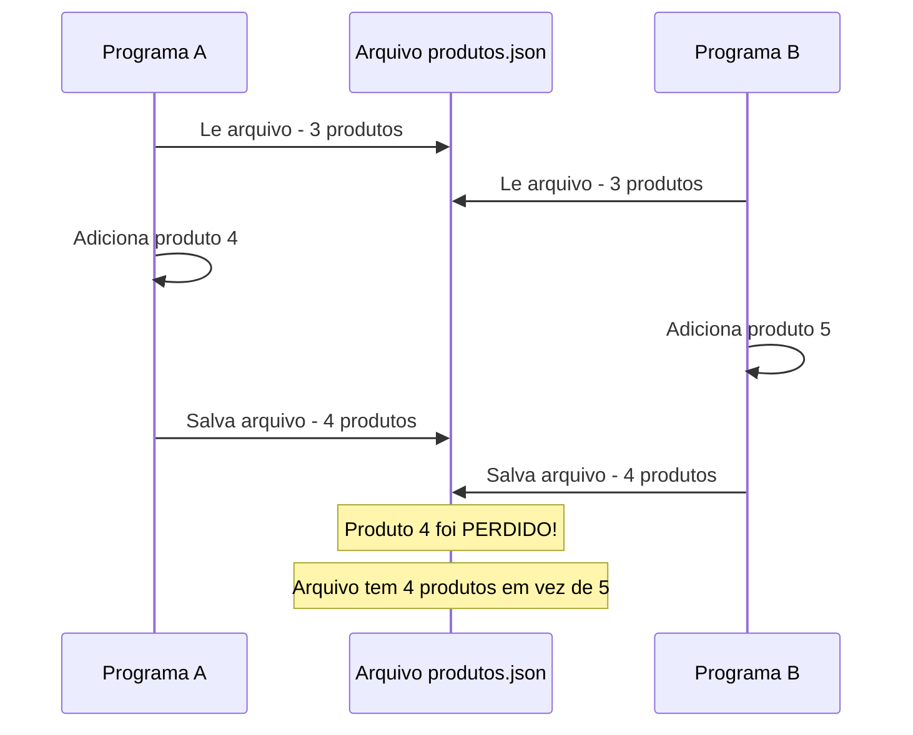
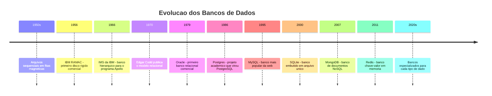
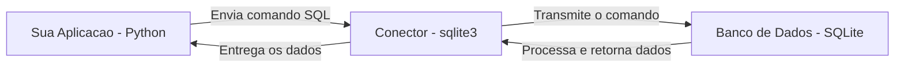
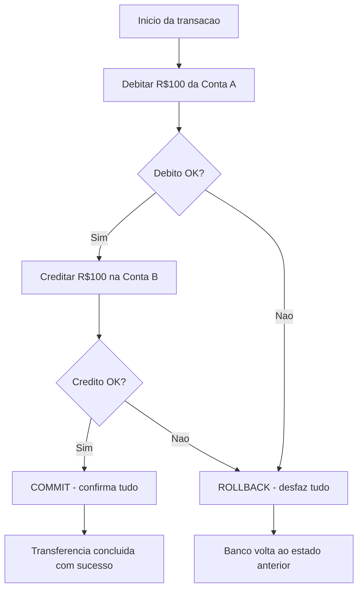
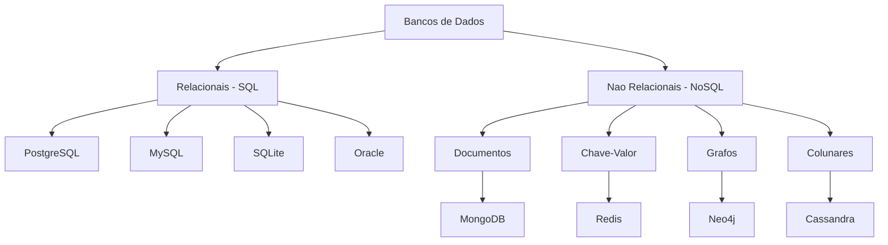

# 8.1 — O que são Bancos de Dados: Quando os Dados Precisam Sobreviver

[← Anterior: Comparando Estruturas de Dados](cap07-mod11-comparacao-estruturas-conteudo.md) · [Próximo: Dados Relacionais →](cap08-mod02-dados-relacionais-conteudo.md)

---

## Introdução

Nos capítulos anteriores, você aprendeu a programar em Python, a organizar dados em estruturas como listas, filas, pilhas e dicionários, e a pensar sobre eficiência com Big O. Tudo isso acontecia dentro do seu programa — enquanto ele estava rodando, os dados existiam na memória RAM. Quando o programa terminava, tudo desaparecia. Lembra do CRUD que fizemos no capítulo 5? Você cadastrava produtos, listava, editava, removia... e quando fechava o programa, tudo sumia. Na próxima execução, começava do zero.

Isso é um problema enorme. Imagine se o Instagram perdesse todas as suas fotos toda vez que o servidor reiniciasse. Ou se o banco perdesse o saldo da sua conta toda vez que o sistema fosse atualizado. Ou se a Netflix esquecesse todos os filmes do catálogo a cada manutenção. Seria inaceitável.

O problema é claro: precisamos de uma forma de guardar dados de maneira permanente, organizada e confiável, de modo que eles sobrevivam ao fim do programa, ao desligamento do computador e até a falhas de hardware. Essa é a razão de existir dos bancos de dados.

Mas este capítulo traz algo ainda mais importante do que aprender SQL ou criar tabelas. Pela primeira vez no curso, você vai lidar com um **recurso externo** à sua aplicação. Até agora, tudo acontecia dentro do seu programa — variáveis, funções, estruturas de dados, tudo vivia no mesmo processo. Agora, os dados vão morar em outro lugar. O banco de dados é um programa separado, que roda independentemente da sua aplicação. Sua aplicação precisa se conectar a ele, enviar comandos e receber respostas. É como se, até agora, você cozinhasse sozinho na sua cozinha — e agora precisasse fazer pedidos a um restaurante.

Essa mudança de paradigma é fundamental para sua formação como desenvolvedor. Todo sistema real no mundo profissional usa bancos de dados. Entender como eles funcionam, por que existem e como se comunicar com eles é uma das habilidades mais importantes que você vai adquirir.

---

## Como Executar os Exemplos Deste Módulo

Este módulo é predominantemente conceitual, mas inclui alguns exemplos em Python para ilustrar os problemas que bancos de dados resolvem. Para executar:

```bash
# Criar uma pasta para os exemplos do capítulo 8
mkdir -p ~/meus-projetos/curso/cap08

# Executar um exemplo Python
python3 nome_exemplo.py
```

Nos próximos módulos, vamos instalar e usar o SQLite. Por enquanto, foque em entender os conceitos.

---

## O Problema: Dados que Desaparecem

Vamos começar com um exemplo concreto. No capítulo 5, você fez um programa que cadastrava produtos em uma lista:

```python
# produtos_memoria.py
# Programa que guarda produtos em memoria (lista)
# "products" = produtos

products = []  # lista vazia para guardar produtos

def add_product(name, price):
    """Adiciona um produto a lista"""
    # "product" = produto, "name" = nome, "price" = preco
    product = {"name": name, "price": price}
    products.append(product)
    print(f"Produto '{name}' cadastrado com sucesso!")

def list_products():
    """Lista todos os produtos"""
    if not products:
        print("Nenhum produto cadastrado.")
        return
    for i, product in enumerate(products, 1):
        # "i" = indice, "product" = produto
        print(f"{i}. {product['name']} - R$ {product['price']:.2f}")

# Cadastrando alguns produtos
add_product("Arroz", 5.99)
add_product("Feijao", 8.49)
add_product("Macarrao", 3.79)

print("\nProdutos cadastrados:")
list_products()

print(f"\nTotal de produtos: {len(products)}")
print("Agora feche o programa e execute novamente...")
print("Os produtos vao ter sumido!")
```

Saída esperada:

```
Produto 'Arroz' cadastrado com sucesso!
Produto 'Feijao' cadastrado com sucesso!
Produto 'Macarrao' cadastrado com sucesso!

Produtos cadastrados:
1. Arroz - R$ 5.99
2. Feijao - R$ 8.49
3. Macarrao - R$ 3.79

Total de produtos: 3
Agora feche o programa e execute novamente...
Os produtos vao ter sumido!
```

Execute esse programa duas vezes. Na segunda vez, a lista começa vazia de novo. Os produtos que você cadastrou na primeira execução desapareceram. Isso acontece porque a lista `products` vive na memória RAM, e a RAM é **volátil** — quando o programa termina, a memória é liberada e os dados são perdidos.

Lembra do capítulo 1, quando falamos sobre a diferença entre RAM e armazenamento? A RAM é a bancada de trabalho — rápida, mas temporária. O armazenamento (HD/SSD) é a despensa — mais lento, mas permanente. Nossos dados estão na bancada e precisam ir para a despensa.

---

## A Primeira Tentativa: Salvar em Arquivo

A solução mais óbvia é salvar os dados em um arquivo no disco. Vamos tentar:

```python
# produtos_arquivo.py
# Programa que salva produtos em um arquivo de texto
# "file" = arquivo, "save" = salvar, "load" = carregar
import json  # "json" = formato de dados estruturados

FILE_NAME = "produtos.json"  # "file_name" = nome do arquivo

def load_products():
    """Carrega produtos do arquivo"""
    try:
        with open(FILE_NAME, "r") as file:
            # "open" = abrir, "r" = read (leitura)
            return json.load(file)
    except FileNotFoundError:
        # Arquivo nao existe ainda - retorna lista vazia
        return []

def save_products(products):
    """Salva produtos no arquivo"""
    with open(FILE_NAME, "w") as file:
        # "w" = write (escrita)
        json.dump(products, file, indent=2)

def add_product(products, name, price):
    """Adiciona um produto e salva no arquivo"""
    product = {"name": name, "price": price}
    products.append(product)
    save_products(products)  # salva no disco apos cada alteracao
    print(f"Produto '{name}' cadastrado com sucesso!")

# Carrega produtos existentes do arquivo
products = load_products()
print(f"Produtos carregados do arquivo: {len(products)}")

# Adiciona um novo produto
add_product(products, "Cafe", 12.90)

# Lista todos
print("\nTodos os produtos:")
for i, p in enumerate(products, 1):
    print(f"{i}. {p['name']} - R$ {p['price']:.2f}")
```

Saída esperada (primeira execução):

```
Produtos carregados do arquivo: 0
Produto 'Cafe' cadastrado com sucesso!

Todos os produtos:
1. Cafe - R$ 12.90
```

Saída esperada (segunda execução):

```
Produtos carregados do arquivo: 1
Produto 'Cafe' cadastrado com sucesso!

Todos os produtos:
1. Cafe - R$ 12.90
2. Cafe - R$ 12.90
```

Agora os dados sobrevivem entre execuções. Problema resolvido? Não exatamente. Essa abordagem funciona para programas simples, mas tem problemas sérios quando as coisas ficam mais complexas:

### Os Problemas de Usar Arquivos Diretamente

**Problema 1: Busca ineficiente**

Se você tem 100.000 produtos e quer encontrar o produto com ID 54321, precisa carregar o arquivo inteiro na memória e percorrer todos os registros até encontrar. Com 1 milhão de registros, isso fica lento. Com 100 milhões, fica inviável.

```python
# Para buscar UM produto, precisa carregar TODOS
products = load_products()  # carrega 100.000 produtos na memoria
for p in products:
    if p["id"] == 54321:  # percorre um por um ate encontrar
        print(p)
        break
```

**Problema 2: Acesso simultâneo**

Imagine que dois programas tentam modificar o arquivo ao mesmo tempo. O programa A lê o arquivo, adiciona um produto e salva. Mas entre a leitura e a escrita do programa A, o programa B também leu o arquivo, adicionou outro produto e salvou. O resultado? O produto do programa A é perdido, porque o programa B sobrescreveu o arquivo com uma versão que não incluía a alteração de A.



Esse problema se chama **condição de corrida** (em inglês, *race condition*) — dois processos "correndo" para modificar o mesmo recurso, e o resultado depende de quem chega primeiro.

**Problema 3: Integridade dos dados**

Se o programa trava no meio de uma escrita, o arquivo pode ficar corrompido — metade dos dados antigos, metade dos novos. Não há garantia de que a operação será "tudo ou nada".

**Problema 4: Estrutura rígida**

Se você precisa mudar a estrutura dos dados (adicionar um campo novo, por exemplo), precisa reescrever o arquivo inteiro. E se outros programas dependem desse formato, todos precisam ser atualizados ao mesmo tempo.

**Problema 5: Sem relacionamentos**

Se você tem produtos e categorias, e quer saber "todos os produtos da categoria Alimentos", precisa implementar essa lógica manualmente. Não existe uma forma nativa de relacionar dados entre arquivos diferentes.

| Problema | Arquivo | Banco de dados |
|----------|---------|----------------|
| Busca por critério | Percorre tudo - O(n) | Usa indices - O(log n) ou O(1) |
| Acesso simultaneo | Corrupcao de dados | Controle de concorrência |
| Falha no meio da escrita | Arquivo corrompido | Transações atomicas |
| Mudar estrutura | Reescrever tudo | ALTER TABLE |
| Relacionar dados | Lógica manual | JOINs nativos |
| Milhoes de registros | Lento e inviavel | Otimizado para escala |

Esses problemas foram identificados nos anos 1960, quando empresas começaram a usar computadores para gerenciar grandes volumes de dados — cadastros de clientes, inventários, transações financeiras. A solução foi criar programas especializados em gerenciar dados: os bancos de dados.

---

## A Evolução: De Arquivos a Bancos de Dados

A história dos bancos de dados é a história de como a humanidade aprendeu a organizar informações em computadores. Cada etapa resolveu problemas da anterior, e entender essa evolução ajuda a entender por que os bancos de dados modernos são como são.

### Era 1: Arquivos Sequenciais (anos 1950)

Os primeiros computadores comerciais, como o UNIVAC I (1951) e o IBM 701 (1952), armazenavam dados em fitas magnéticas. Os dados eram gravados sequencialmente — um registro após o outro, como uma fita cassete. Para encontrar um registro específico, era preciso rebobinar a fita e ler do início até encontrar.

Empresas como seguradoras e bancos foram as primeiras a usar computadores para processar dados em massa. O censo americano de 1950 foi processado pelo UNIVAC I — milhões de registros lidos sequencialmente da fita. Funcionava, mas era lento e inflexível.

O problema principal: para acessar o registro número 50.000, era preciso ler os 49.999 anteriores. Não existia "ir direto" a um registro.

### Era 2: Arquivos Indexados (anos 1960)

Com a chegada dos discos magnéticos (como o IBM 305 RAMAC em 1956, o primeiro disco rígido comercial), tornou-se possível acessar dados em qualquer posição do disco sem ler tudo sequencialmente. Isso é chamado de **acesso aleatório** (em inglês, *random access*) — a mesma ideia da RAM (Random Access Memory).

Programadores começaram a criar **índices** — arquivos auxiliares que mapeavam uma chave (como o número do cliente) para a posição no disco onde o registro estava. Em vez de percorrer todos os registros, bastava consultar o índice e ir direto à posição.

Isso era muito mais rápido, mas cada programa criava seus próprios arquivos e índices de forma independente. Não havia padronização. Se o departamento de vendas e o departamento financeiro precisavam dos mesmos dados de clientes, cada um tinha sua própria cópia — e as cópias frequentemente ficavam desatualizadas ou inconsistentes.

### Era 3: Bancos de Dados Hierárquicos e em Rede (anos 1960-1970)

Para resolver o problema de dados duplicados e inconsistentes, surgiram os primeiros sistemas de gerenciamento de banco de dados (em inglês, **DBMS** — Database Management System). A ideia era centralizar os dados em um único lugar e permitir que múltiplos programas acessassem os mesmos dados de forma controlada.

O **IMS** (Information Management System) da IBM, lançado em 1966, foi um dos primeiros. Ele organizava dados em uma estrutura hierárquica — como uma árvore, onde cada registro tinha um "pai" e podia ter vários "filhos". Foi criado originalmente para gerenciar o inventário do programa espacial Apollo da NASA. Imagine a complexidade: milhões de peças, cada uma pertencendo a um componente, que pertencia a um módulo, que pertencia à nave. Uma hierarquia natural.

O problema do modelo hierárquico era a rigidez. Se um dado precisava pertencer a dois "pais" diferentes (por exemplo, um funcionário que trabalha em dois departamentos), o modelo não conseguia representar isso de forma natural. Surgiu então o **modelo em rede** (CODASYL), que permitia relacionamentos mais flexíveis — mas era extremamente complexo de programar e manter.

### Era 4: O Modelo Relacional (1970 — até hoje)

Em 1970, um pesquisador da IBM chamado **Edgar F. Codd** publicou um artigo que mudou tudo: "A Relational Model of Data for Large Shared Data Banks" (Um Modelo Relacional de Dados para Grandes Bancos de Dados Compartilhados). A ideia de Codd era revolucionária na sua simplicidade: organizar dados em **tabelas** (que ele chamou de "relações"), onde cada linha é um registro e cada coluna é um atributo.

A genialidade do modelo relacional está na sua simplicidade matemática. Codd usou conceitos da teoria dos conjuntos e da álgebra relacional para definir operações sobre tabelas — selecionar linhas, projetar colunas, juntar tabelas. Essas operações são a base do **SQL** (Structured Query Language), a linguagem que você vai aprender nos próximos módulos.

O modelo relacional demorou para ser adotado porque os computadores da época não eram potentes o suficiente para executá-lo com boa performance. Os defensores dos modelos hierárquico e em rede argumentavam que o modelo relacional era "lento demais". Mas conforme os computadores ficaram mais rápidos, a simplicidade e flexibilidade do modelo relacional venceram.

Os primeiros bancos de dados relacionais comerciais surgiram no final dos anos 1970:
- **Oracle** (1979) — Larry Ellison criou a Oracle Corporation após ler o artigo de Codd
- **IBM DB2** (1983) — a própria IBM finalmente implementou o modelo que seu pesquisador inventou
- **PostgreSQL** (1986, como Postgres) — projeto acadêmico da UC Berkeley que se tornou um dos bancos mais usados do mundo
- **MySQL** (1995) — criado por Michael Widenius, tornou-se o banco mais popular da web
- **SQLite** (2000) — criado por D. Richard Hipp, um banco leve que roda embutido na aplicação

### Era 5: NoSQL e Bancos Especializados (2000 — até hoje)

No início dos anos 2000, empresas como Google, Amazon e Facebook enfrentaram um problema novo: volumes de dados tão grandes que nenhum banco relacional conseguia lidar. O Google processava bilhões de páginas web. O Facebook armazenava bilhões de posts e fotos. A Amazon gerenciava milhões de transações por segundo.

Para esses cenários extremos, surgiram os bancos **NoSQL** (Not Only SQL) — bancos que abrem mão de algumas garantias do modelo relacional em troca de escala e flexibilidade. Vamos falar mais sobre eles no módulo 8.8.



Hoje, o modelo relacional continua sendo o mais usado no mundo. A maioria dos sistemas que você vai encontrar na sua carreira usa bancos relacionais — PostgreSQL, MySQL, SQL Server, Oracle. É por isso que vamos focar neles neste capítulo.

---

## O que é um Banco de Dados, Afinal?

Agora que você entende a história, vamos definir com precisão o que é um banco de dados.

Um **banco de dados** (em inglês, *database*) é um sistema organizado para armazenar, gerenciar e recuperar dados de forma eficiente, segura e confiável. Mas essa definição é muito genérica. Vamos ser mais específicos.

Na prática, quando falamos "banco de dados", estamos falando de duas coisas:

1. **Os dados em si** — as tabelas, registros, arquivos onde a informação está guardada
2. **O sistema que gerência os dados** — o programa que controla o acesso, garante a integridade e executa as operações

O programa que gerência os dados se chama **SGBD** (Sistema de Gerenciamento de Banco de Dados), ou em inglês, **DBMS** (Database Management System). Quando alguém diz "estou usando PostgreSQL", está se referindo ao SGBD. O banco de dados em si é o conjunto de tabelas e dados que o PostgreSQL gerência.

Pense assim: o SGBD é como o bibliotecário de uma biblioteca. Os livros são os dados. O bibliotecário sabe onde cada livro está, controla quem pode pegar emprestado, garante que os livros sejam devolvidos e mantém o catálogo atualizado. Você não vai direto à estante pegar o livro — você pede ao bibliotecário, e ele busca para você.

| Conceito | Analogia da biblioteca | No banco de dados |
|----------|----------------------|-------------------|
| Dados | Os livros | Tabelas e registros |
| SGBD | O bibliotecario | PostgreSQL, MySQL, SQLite |
| Consulta | Pedir um livro ao bibliotecario | Comando SQL SELECT |
| Inserção | Doar um livro novo | Comando SQL INSERT |
| Catalogo | Fichario com localização dos livros | Indices do banco |
| Regras | Limite de emprestimos, prazo de devolucao | Constraints e validacoes |

---

## O Conceito-Chave: Banco de Dados como Recurso Externo

Este é o conceito mais importante deste módulo, e talvez um dos mais importantes do curso inteiro. Preste muita atenção.

Até agora, tudo que seu programa fazia acontecia dentro dele mesmo. Variáveis, listas, dicionários, funções — tudo vivia no mesmo processo, na mesma memória. Quando você chamava uma função, ela acessava os dados diretamente. Não havia intermediários.

Com um banco de dados, isso muda completamente. O banco é um **programa separado** que roda independentemente da sua aplicação. Mesmo quando usamos SQLite (que é um arquivo local), o conceito é o mesmo: os dados não estão "dentro" do seu programa — estão "fora", em outro lugar, e seu programa precisa se comunicar com esse outro lugar para acessá-los.

Vamos usar uma analogia que vai acompanhar todo este capítulo:

**Sua aplicação é o cliente sentado no salão de um restaurante. O banco de dados é a cozinha.**

- O cliente (aplicação) não entra na cozinha para pegar a comida
- O cliente faz um pedido (envia um comando SQL)
- O garçom leva o pedido para a cozinha (driver/conector do banco)
- A cozinha prepara o prato (o banco processa a query)
- O garçom traz o prato pronto (o banco retorna os dados)
- O cliente não precisa saber como a cozinha funciona por dentro — só precisa saber fazer pedidos



Essa separação entre aplicação e banco de dados é chamada de **arquitetura cliente-servidor**. Sua aplicação é o cliente, o banco é o servidor. Mesmo que ambos rodem na mesma máquina (como no caso do SQLite), conceitualmente são entidades separadas.

### Por que essa separação importa?

1. **Independência**: o banco pode ser atualizado sem mexer na aplicação, e vice-versa
2. **Compartilhamento**: múltiplas aplicações podem acessar o mesmo banco ao mesmo tempo
3. **Especialização**: o banco é otimizado para gerenciar dados, a aplicação é otimizada para lógica de negócio
4. **Escalabilidade**: o banco pode rodar em uma máquina mais potente, separada da aplicação
5. **Segurança**: o banco controla quem pode acessar quais dados, independente da aplicação

### Na prática: SQLite vs bancos cliente-servidor

No nosso curso, vamos usar **SQLite**, que é um caso especial. O SQLite não roda como um servidor separado — ele é uma biblioteca que a aplicação carrega diretamente, e os dados ficam em um único arquivo no disco. Isso torna o SQLite perfeito para aprender, porque não precisa instalar nem configurar nada.

Mas em sistemas profissionais, o banco geralmente roda em um servidor separado. Quando você trabalhar em uma empresa, provavelmente vai usar PostgreSQL ou MySQL rodando em um servidor dedicado (ou na nuvem), e sua aplicação vai se conectar a ele pela rede.

| Caracteristica | SQLite | PostgreSQL e MySQL |
|----------------|--------|-------------------|
| Onde roda | Dentro da aplicação | Servidor separado |
| Armazenamento | Arquivo único no disco | Servidor dedicado |
| Conexão | Biblioteca local | Rede TCP/IP |
| Configuração | Zero - ja vem com Python | Instalar e configurar servidor |
| Acesso simultaneo | Limitado | Milhares de conexões |
| Uso tipico | Apps mobile, prototipos, aprendizado | Sistemas web, empresariais |

A boa notícia: o SQL que você vai aprender funciona em todos eles. A sintaxe é praticamente a mesma. Quando você souber usar SQLite, vai saber usar PostgreSQL — a diferença é apenas na configuração da conexão, não nos comandos.

---

## O que um Banco de Dados Faz por Você

Um banco de dados não é apenas um "arquivo sofisticado". Ele oferece garantias e funcionalidades que seriam extremamente difíceis de implementar manualmente. Vamos entender cada uma:

### 1. Persistência

O mais básico: os dados sobrevivem ao fim do programa, ao reinício do computador e até a quedas de energia. O banco garante que dados gravados estão seguros no disco.

### 2. Busca Eficiente

Bancos de dados usam estruturas internas (como árvores B e tabelas hash — conceitos que você viu no capítulo 7) para encontrar dados rapidamente. Em vez de percorrer todos os registros, o banco usa **índices** para ir direto ao dado que você procura.

Lembra da comparação entre busca linear O(n) e busca binária O(log n) do capítulo 7? Bancos de dados usam estruturas ainda mais sofisticadas. Um banco com 1 milhão de registros pode encontrar qualquer um deles em milissegundos.

### 3. Controle de Concorrência

Múltiplos programas (ou múltiplos usuários) podem acessar o banco ao mesmo tempo sem corromper os dados. O banco gerência isso internamente com mecanismos de **bloqueio** (em inglês, *locking*) e **isolamento** (em inglês, *isolation*).

Quando dois caixas de supermercado processam vendas ao mesmo tempo, o banco garante que o estoque é atualizado corretamente — mesmo que ambos vendam o mesmo produto no mesmo instante.

### 4. Transações (ACID)

Uma **transação** (em inglês, *transaction*) é um conjunto de operações que devem ser executadas como "tudo ou nada". Se qualquer operação falhar, todas são desfeitas. Isso é chamado de **ACID**:

- **A — Atomicidade** (Atomicity): a transação é indivisível — ou todas as operações acontecem, ou nenhuma acontece
- **C — Consistência** (Consistency): o banco sempre passa de um estado válido para outro estado válido
- **I — Isolamento** (Isolation): transações simultâneas não interferem umas nas outras
- **D — Durabilidade** (Durability): uma vez confirmada, a transação sobrevive a qualquer falha

Exemplo real: uma transferência bancária. Você transfere R$ 100 da conta A para a conta B. Isso envolve duas operações: debitar R$ 100 da conta A e creditar R$ 100 na conta B. Se o sistema travar entre as duas operações (debitou de A mas não creditou em B), o dinheiro "desaparece". Com transações ACID, se qualquer parte falhar, tudo é desfeito — o débito é revertido e o dinheiro volta para a conta A.



### 5. Integridade dos Dados

O banco pode impor regras sobre os dados:
- Um campo de email deve ser único (não pode ter dois clientes com o mesmo email)
- O preço de um produto não pode ser negativo
- Todo pedido deve pertencer a um cliente que existe no cadastro
- A data de nascimento não pode ser no futuro

Essas regras são chamadas de **constraints** (restrições) e são verificadas automaticamente pelo banco. Se alguém tentar inserir um dado que viola uma regra, o banco rejeita a operação.

### 6. Linguagem Padronizada (SQL)

Em vez de cada programa inventar sua própria forma de acessar dados, existe uma linguagem padrão: **SQL** (Structured Query Language, ou Linguagem de Consulta Estruturada). SQL é usada por praticamente todos os bancos relacionais. Aprender SQL uma vez permite trabalhar com qualquer banco relacional.

| Funcionalidade | Sem banco de dados | Com banco de dados |
|----------------|-------------------|-------------------|
| Persistência | Implementar manualmente com arquivos | Automática |
| Busca eficiente | Implementar indices manualmente | Indices automaticos |
| Acesso simultaneo | Implementar locks manualmente | Gerenciado pelo banco |
| Tudo ou nada | Implementar rollback manualmente | Transações ACID |
| Regras de dados | Validar no código da aplicação | Constraints no banco |
| Linguagem padrão | Cada programa inventa a sua | SQL universal |

---

## Tipos de Bancos de Dados: Uma Visão Geral

Existem vários tipos de bancos de dados, cada um otimizado para um tipo diferente de dado ou caso de uso. Neste módulo, vamos apenas apresentá-los. No módulo 8.8, vamos comparar SQL e NoSQL em profundidade.

### Bancos Relacionais (SQL)

Organizam dados em **tabelas** com linhas e colunas. As tabelas se relacionam entre si através de chaves. Usam SQL como linguagem. São os mais usados no mundo e o foco deste capítulo.

Exemplos: PostgreSQL, MySQL, SQLite, Oracle, SQL Server.

Quando usar: dados estruturados com relacionamentos claros — cadastros, transações financeiras, inventários, sistemas de e-commerce, qualquer sistema onde a integridade dos dados é crítica.

### Bancos de Documentos (NoSQL)

Armazenam dados como **documentos** (geralmente em formato JSON). Cada documento pode ter uma estrutura diferente — não há schema fixo. São flexíveis e escalam bem horizontalmente.

Exemplos: MongoDB, CouchDB, Amazon DynamoDB.

Quando usar: dados com estrutura variável — catálogos de produtos com atributos diferentes, perfis de usuários com campos opcionais, logs de aplicação.

### Bancos Chave-Valor (NoSQL)

O tipo mais simples: cada dado é um par chave-valor, como um dicionário Python gigante. Extremamente rápidos para leitura e escrita.

Exemplos: Redis, Memcached, Amazon DynamoDB.

Quando usar: cache (dados temporários para acesso rápido), sessões de usuário, contadores, filas simples.

### Bancos de Grafos (NoSQL)

Otimizados para dados com muitos **relacionamentos complexos**. Em vez de tabelas, usam nós (entidades) e arestas (relacionamentos).

Exemplos: Neo4j, Amazon Neptune, ArangoDB.

Quando usar: redes sociais (quem é amigo de quem), sistemas de recomendação (quem comprou X também comprou Y), detecção de fraude (conexões suspeitas entre contas).

### Bancos Colunares (NoSQL)

Armazenam dados por **coluna** em vez de por linha. Isso torna consultas analíticas (somas, médias, contagens) muito mais rápidas quando você precisa de apenas algumas colunas de milhões de registros.

Exemplos: Apache Cassandra, ClickHouse, Amazon Redshift.

Quando usar: análise de grandes volumes de dados, data warehouses, métricas e logs em escala.



| Tipo | Estrutura | Exemplo | Melhor para |
|------|-----------|---------|-------------|
| Relacional | Tabelas com linhas e colunas | PostgreSQL, MySQL, SQLite | Dados estruturados com relacionamentos |
| Documentos | Documentos JSON flexiveis | MongoDB | Dados com estrutura variável |
| Chave-Valor | Pares chave e valor simples | Redis | Cache e dados temporarios |
| Grafos | Nos e arestas | Neo4j | Relacionamentos complexos |
| Colunar | Colunas otimizadas | Cassandra | Análise de grandes volumes |

Para este curso, vamos focar nos bancos relacionais com SQLite. Eles são a base — entendendo bancos relacionais, você terá facilidade para aprender qualquer outro tipo depois.

---

## Onde Bancos de Dados São Usados

Bancos de dados estão em praticamente todo sistema digital que você usa. Vamos ver alguns exemplos concretos:

### Redes Sociais

Quando você abre o Instagram, o aplicativo se conecta a servidores que consultam bancos de dados para buscar suas fotos, seus seguidores, seus likes, seus stories. Cada post é um registro. Cada like é um registro. Cada comentário é um registro. O Instagram processa bilhões de registros por dia.

### E-commerce

Quando você compra algo na Amazon ou no Mercado Livre, o sistema consulta o banco para verificar se o produto está em estoque, calcula o frete, processa o pagamento, atualiza o estoque e registra o pedido. Tudo isso em uma transação — se o pagamento falhar, o estoque não é decrementado.

### Bancos e Finanças

Seu saldo bancário é um registro em um banco de dados. Cada transferência, cada pagamento, cada depósito é uma transação registrada. Bancos financeiros são os sistemas mais exigentes em termos de integridade de dados — um erro de R$ 0,01 em milhões de transações pode significar milhões de reais de diferença.

### Saúde

Hospitais usam bancos de dados para armazenar prontuários de pacientes, resultados de exames, prescrições médicas, agendamentos. A integridade é crítica — um erro no prontuário pode colocar a vida do paciente em risco.

### Jogos Online

Quando você joga um jogo online, seu progresso, seus itens, sua pontuação, tudo é salvo em um banco de dados. Se o servidor cair e voltar, seu progresso está lá. Jogos como Fortnite e League of Legends gerenciam milhões de jogadores simultâneos com bancos de dados.

### Streaming

Netflix, Spotify e YouTube usam bancos de dados para armazenar catálogos de conteúdo, preferências de usuários, histórico de visualização e recomendações. Quando o Netflix sugere um filme "porque você assistiu X", essa recomendação vem de consultas complexas em bancos de dados.

### Governo

Sistemas de governo como o SUS, a Receita Federal, o Detran — todos usam bancos de dados para gerenciar informações de milhões de cidadãos. Seu CPF, seu título de eleitor, seu histórico de vacinação — tudo está em bancos de dados.

---

## SQL: A Linguagem dos Bancos de Dados

Nos próximos módulos, você vai aprender SQL em detalhes. Por enquanto, vamos apenas entender o que é e como funciona em alto nível.

**SQL** (Structured Query Language, ou Linguagem de Consulta Estruturada) é a linguagem usada para se comunicar com bancos de dados relacionais. Ela foi criada nos anos 1970 pela IBM, baseada no modelo relacional de Edgar Codd, e se tornou um padrão internacional (ISO/IEC 9075).

SQL não é uma linguagem de programação como Python ou C. Você não escreve loops, condicionais ou funções em SQL (pelo menos não no nível básico). SQL é uma linguagem **declarativa** — você diz O QUE quer, não COMO fazer. O banco decide a melhor forma de executar.

Comparação:

```python
# Python (imperativo): voce diz COMO fazer
products = load_all_products()  # carrega todos
result = []
for p in products:              # percorre um por um
    if p["price"] > 10:         # verifica a condicao
        result.append(p)        # adiciona ao resultado
```

```sql
-- SQL (declarativo): voce diz O QUE quer
SELECT * FROM products WHERE price > 10;
```

Em Python, você precisa dizer passo a passo: carregue tudo, percorra cada um, verifique a condição, adicione ao resultado. Em SQL, você simplesmente diz: "me dê todos os produtos com preço maior que 10". O banco decide internamente como fazer isso da forma mais eficiente.

SQL tem quatro grupos principais de comandos:

| Grupo | Sigla | Comandos | O que faz |
|-------|-------|----------|-----------|
| Definição | DDL | CREATE, ALTER, DROP | Cria e modifica a estrutura das tabelas |
| Manipulação | DML | INSERT, UPDATE, DELETE | Adiciona, modifica e remove dados |
| Consulta | DQL | SELECT | Busca e filtra dados |
| Controle | DCL | GRANT, REVOKE | Controla permissões de acesso |

No nosso curso, vamos focar em DDL (criar tabelas), DML (inserir, atualizar e remover dados) e DQL (consultar dados). Controle de permissões é um tema mais avançado que não vamos cobrir.

---

## Conectando com o que Você Já Sabe

Este capítulo não começa do zero — ele se conecta com tudo que você aprendeu até agora:

### Capítulo 5 — Python

Você vai usar Python para se conectar ao banco de dados e executar comandos SQL. O módulo `sqlite3` já vem instalado com Python — não precisa instalar nada extra. O CRUD que fizemos em memória no capítulo 5 vai ser refeito com persistência em banco.

### Capítulo 7 — Estruturas de Dados

As estruturas que você estudou em C são a base de como bancos de dados funcionam internamente:
- **Arrays** → tabelas são essencialmente arrays de registros
- **Dicionários/Tabelas Hash** → índices hash permitem busca O(1) por chave
- **Árvores** (conceito do módulo 7.10) → índices B-tree permitem busca O(log n) e ordenação eficiente
- **Listas** → resultados de consultas são listas de registros

Quando você faz um `SELECT * FROM products WHERE id = 42`, o banco internamente usa uma estrutura parecida com um dicionário para encontrar o registro com id 42 em O(1). Quando você faz `SELECT * FROM products ORDER BY price`, o banco usa algoritmos de ordenação como os que vimos no módulo 7.10.

### Capítulo 5.12 — Coleções

Listas e dicionários em Python são a versão "em memória" do que tabelas e registros são em um banco de dados:

| Python (memória) | Banco de dados (disco) |
|-------------------|----------------------|
| Lista de dicionários | Tabela com registros |
| Chave do dicionário | Coluna da tabela |
| Valor do dicionário | Valor do campo |
| len(lista) | COUNT(*) |
| lista.append(item) | INSERT INTO tabela |
| del lista[i] | DELETE FROM tabela |
| lista[i]["campo"] = valor | UPDATE tabela SET campo = valor |

A diferença fundamental: em Python, os dados vivem na RAM e desaparecem quando o programa termina. No banco, os dados vivem no disco e sobrevivem para sempre.

---

## O Caminho do Capítulo 8

Antes de mergulhar nos próximos módulos, vamos ver o mapa completo do que você vai aprender neste capítulo:

| Módulo | Tema | O que você vai aprender |
|--------|------|------------------------|
| 8.1 | O que são Bancos de Dados | Por que existem, história, conceito de recurso externo (você esta aqui) |
| 8.2 | Dados Relacionais | Tabelas, linhas, colunas, chaves, relacionamentos |
| 8.3 | Modelagem de Dados | Como projetar um banco antes de implementar |
| 8.4 | SQLite e Ambiente | Instalar e usar o SQLite no terminal e com Python |
| 8.5 | CREATE e INSERT | Criar tabelas e inserir dados |
| 8.6 | SELECT e Consultas | Buscar e filtrar dados, joins básicos |
| 8.7 | UPDATE e DELETE | Atualizar e remover dados com segurança |
| 8.8 | SQL vs NoSQL | Comparação entre tipos de bancos |
| 8.9 | Projeto CRUD | CRUD completo de produtos com Python e SQLite |

O capítulo segue uma progressão natural: primeiro você entende O QUE são bancos de dados (módulos 8.1-8.3), depois aprende a USAR (módulos 8.4-8.7), depois COMPARA alternativas (8.8) e finalmente CONSTRÓI um projeto real (8.9).

Ao final deste capítulo, você vai ter construído um CRUD de produtos com Python e SQLite — similar ao que fez no capítulo 5, mas agora com dados que sobrevivem entre execuções. Essa é a diferença que um banco de dados faz.

---

## Como a IA pode te ajudar aqui

A inteligência artificial é uma ótima parceira para aprender sobre bancos de dados. Aqui estão alguns prompts que você pode usar:

**Prompt 1 — Explorar o conceito:**
> "Explique como se eu tivesse 12 anos: o que é um banco de dados e por que ele é diferente de salvar dados em um arquivo?"

**Prompt 2 — Explorar a história:**
> "Me conte a história do Edgar Codd e como ele inventou o modelo relacional. Por que a IBM demorou para implementar a ideia dele?"

**Prompt 3 — Comparar alternativas:**
> "Quais são as diferenças práticas entre SQLite, PostgreSQL e MySQL? Quando eu usaria cada um em um projeto real?"

---

## Casos de Uso no Mundo Real

### Caso 1: Sistema de Pedidos do iFood

Quando você faz um pedido no iFood, dezenas de operações acontecem em bancos de dados em frações de segundo. O sistema verifica se o restaurante está aberto (consulta na tabela de restaurantes), busca o cardápio (consulta na tabela de produtos), calcula o preço com descontos (consulta na tabela de promoções), registra o pedido (inserção na tabela de pedidos), notifica o restaurante (inserção na tabela de notificações) e atualiza o status em tempo real (atualizações na tabela de pedidos). Sem um banco de dados robusto, nada disso funcionaria — imagine se o pedido sumisse porque o servidor reiniciou no meio do processo.

### Caso 2: Prontuário Eletrônico em Hospitais

O sistema de prontuário eletrônico do SUS (e-SUS) armazena informações de saúde de milhões de brasileiros. Cada consulta médica, cada exame, cada vacina é registrada em um banco de dados. A integridade é crítica: se um registro de alergia a medicamento for perdido, o paciente pode receber um remédio que causa reação grave. Bancos de dados garantem que esses dados nunca se perdem, mesmo em caso de falha de hardware, e que apenas profissionais autorizados podem acessá-los.

### Caso 3: Controle de Estoque da Amazon

A Amazon gerência centenas de milhões de produtos em dezenas de centros de distribuição ao redor do mundo. Cada produto tem localização exata (corredor, prateleira, posição), quantidade em estoque, preço, fornecedor e histórico de vendas. Quando você compra um produto, o banco de dados precisa decrementar o estoque atomicamente — se duas pessoas compram o último item ao mesmo tempo, apenas uma deve conseguir. Isso é garantido por transações ACID no banco de dados.

---

## Resumo do Módulo

| Conceito | Definição |
|----------|-----------|
| Banco de dados | Sistema organizado para armazenar, gerenciar e recuperar dados de forma permanente |
| SGBD / DBMS | Programa que gerência o banco de dados (PostgreSQL, MySQL, SQLite) |
| Persistência | Dados sobrevivem ao fim do programa e a reinicializacoes |
| Recurso externo | O banco roda separado da aplicação - a aplicação se conecta a ele |
| SQL | Linguagem padrão para comunicação com bancos relacionais |
| ACID | Atomicidade, Consistência, Isolamento, Durabilidade - garantias de transações |
| Modelo relacional | Dados organizados em tabelas com linhas e colunas que se relacionam |
| NoSQL | Bancos que não usam o modelo relacional - documentos, chave-valor, grafos, colunares |
| Índice | Estrutura que acelera buscas no banco, similar a índice de um livro |
| Transação | Conjunto de operações executadas como tudo ou nada |
| Constraint | Regra imposta pelo banco sobre os dados (unicidade, obrigatoriedade, etc.) |

---

## Glossário do Módulo

| Termo | Definição |
|-------|-----------|
| ACID | Atomicity, Consistency, Isolation, Durability - propriedades que garantem confiabilidade de transações |
| Banco de dados (database) | Coleção organizada de dados armazenados e gerenciados por um SGBD |
| Banco relacional | Banco que organiza dados em tabelas relacionadas entre si |
| Cache | Armazenamento temporário de dados para acesso rápido |
| Colisao (collision) | Quando duas chaves diferentes geram o mesmo índice em uma tabela hash |
| Concorrência (concurrency) | Multiplos processos acessando o mesmo recurso ao mesmo tempo |
| Constraint | Regra de validação imposta pelo banco sobre os dados |
| DBMS (Database Management System) | Sistema de Gerenciamento de Banco de Dados - o programa que controla o banco |
| DDL (Data Definition Language) | Comandos SQL para definir estrutura: CREATE, ALTER, DROP |
| DML (Data Manipulation Language) | Comandos SQL para manipular dados: INSERT, UPDATE, DELETE |
| DQL (Data Query Language) | Comandos SQL para consultar dados: SELECT |
| Durabilidade (durability) | Garantia de que dados confirmados sobrevivem a falhas |
| Índice (index) | Estrutura auxiliar que acelera buscas no banco de dados |
| Integridade referencial | Garantia de que referências entre tabelas são validas |
| JSON (JavaScript Object Notation) | Formato de texto para representar dados estruturados |
| Modelo relacional | Modelo de organização de dados em tabelas proposto por Edgar Codd em 1970 |
| NoSQL (Not Only SQL) | Categoria de bancos que não seguem o modelo relacional |
| Persistência (persistence) | Capacidade de dados sobreviverem ao fim do programa |
| Race condition | Situação onde o resultado depende da ordem de execução de processos concorrentes |
| SGBD | Sistema de Gerenciamento de Banco de Dados - equivalente em portugues de DBMS |
| SQL (Structured Query Language) | Linguagem padrão para comunicação com bancos relacionais |
| SQLite | Banco de dados relacional leve que armazena dados em um único arquivo |
| Transação (transaction) | Conjunto de operações executadas atomicamente - tudo ou nada |
| Volátil (volatile) | Tipo de memória que perde dados quando desligada (como a RAM) |

---

## Na Cultura Popular

- **O Jogo da Imitação** (filme, 2014) — mostra Alan Turing criando uma das primeiras máquinas de computação. Embora o filme foque em criptografia, o conceito de processar grandes volumes de dados organizados (as mensagens interceptadas) é a essência do que bancos de dados fazem: armazenar, organizar e buscar informações de forma eficiente.

- **O Dilema das Redes** (documentário, 2020) — revela como redes sociais usam dados dos usuários para personalizar conteúdo. Cada like, cada clique, cada segundo que você passa em um post é registrado em bancos de dados gigantescos. O documentário mostra o poder (e o perigo) de ter bilhões de registros sobre o comportamento humano.

- **Halt and Catch Fire** (série, 2014-2017) — acompanha a evolução da computação dos anos 1980 aos 2000. Na terceira temporada, os personagens constroem um serviço de indexação da web — essencialmente, um banco de dados gigante que cataloga páginas da internet. É fascinante ver como os desafios de armazenar e buscar dados em escala moldaram a internet que conhecemos.

---

## Para Saber Mais

- [SQLBolt](https://sqlbolt.com/) — *Tutorial interativo de SQL com exercícios no navegador. Ótimo para praticar os conceitos que vamos ver nos próximos módulos.*

- [Select Star SQL](https://selectstarsql.com/) — *Livro interativo que ensina SQL usando dados reais de casos judiciais. Aprenda SQL resolvendo mistérios.*

- [Curso em Vídeo — MySQL](https://www.youtube.com/playlist?list=PLHz_AreHm4dkBs-795Dsgvau_ekxg8g1r) — *Curso completo de banco de dados em português, gratuito. Excelente complemento ao material escrito.*

- [SQLite Documentation](https://www.sqlite.org/docs.html) — *Documentação oficial do SQLite. Referência técnica completa para quando você precisar de detalhes específicos.*

- [DB Fiddle](https://www.db-fiddle.com/) — *Playground SQL no navegador. Teste queries sem instalar nada — perfeito para experimentar enquanto aprende.*

---

## Perguntas Frequentes (FAQ)

**P: Banco de dados é a mesma coisa que uma planilha do Excel?**
R: Não, embora a analogia ajude a entender. Uma planilha é um arquivo que você abre e edita manualmente. Um banco de dados é um sistema que gerência dados automaticamente, com controle de acesso, transações, índices e integridade. Uma planilha funciona bem para centenas de linhas. Um banco de dados funciona bem para milhões ou bilhões.

**P: Preciso instalar um servidor para usar banco de dados?**
R: Depende do banco. PostgreSQL e MySQL precisam de um servidor rodando. SQLite não — ele é um arquivo que sua aplicação acessa diretamente. Por isso vamos usar SQLite para aprender: zero configuração.

**P: SQL é uma linguagem de programação?**
R: Não no sentido tradicional. SQL é uma linguagem declarativa — você diz O QUE quer, não COMO fazer. Não tem loops, variáveis ou funções como Python. Mas é uma linguagem poderosa e essencial para qualquer desenvolvedor.

**P: Todo sistema precisa de banco de dados?**
R: Não necessariamente. Um programa que calcula a média de notas e mostra na tela não precisa de banco. Mas qualquer sistema que precisa guardar dados entre execuções (cadastros, históricos, configurações) se beneficia de um banco de dados.

**P: Qual banco de dados devo aprender primeiro?**
R: SQLite é perfeito para começar — simples, sem configuração, já vem com Python. Os conceitos e o SQL que você aprende com SQLite se aplicam a qualquer banco relacional. Depois, PostgreSQL é a escolha mais recomendada para projetos profissionais.

**P: Banco de dados é difícil de aprender?**
R: Os conceitos básicos são surpreendentemente simples. Criar uma tabela, inserir dados, buscar dados — tudo isso você vai aprender em poucos módulos. A complexidade aparece em cenários avançados (otimização, escala, modelagem complexa), mas a base é acessível.

**P: O que acontece se o banco de dados corromper?**
R: Bancos de dados modernos têm mecanismos de recuperação. Eles mantêm logs de todas as operações, e em caso de falha, podem reconstruir o estado correto a partir desses logs. Além disso, sistemas profissionais fazem backups regulares. Corrupção total é extremamente rara.

**P: Posso usar Python para acessar qualquer banco de dados?**
R: Sim. Python tem bibliotecas para se conectar a praticamente qualquer banco: `sqlite3` para SQLite (já vem instalado), `psycopg2` para PostgreSQL, `mysql-connector` para MySQL, `pymongo` para MongoDB, entre outros. A lógica é sempre a mesma: conectar, enviar comandos, receber resultados.

**P: Por que existem tantos bancos de dados diferentes?**
R: Porque diferentes tipos de dados e diferentes volumes exigem diferentes abordagens. Um banco relacional é ótimo para dados estruturados com relacionamentos. Um banco de documentos é melhor para dados flexíveis. Um banco de grafos é ideal para redes de relacionamentos. Cada um resolve um problema específico da melhor forma.

**P: O que é "migração de banco de dados"?**
R: É o processo de alterar a estrutura do banco (adicionar tabelas, modificar colunas, etc.) de forma controlada e reversível. Quando seu sistema evolui e precisa de novos campos ou tabelas, você cria uma migração que aplica essas mudanças. Vamos ver isso de forma básica nos próximos módulos.

**P: Banco de dados na nuvem é diferente de banco local?**
R: Conceitualmente, não. O SQL é o mesmo, as tabelas são as mesmas, as operações são as mesmas. A diferença é onde o banco roda: no seu computador (local) ou em um servidor remoto (nuvem). Na nuvem, você não precisa se preocupar com hardware, backups e manutenção — o provedor cuida disso.

**P: O que é um ORM?**
R: ORM (Object-Relational Mapping) é uma técnica que permite acessar o banco de dados usando objetos da linguagem de programação em vez de escrever SQL diretamente. Em vez de `SELECT * FROM products`, você escreveria algo como `Product.objects.all()`. ORMs são úteis mas adicionam uma camada de abstração. Neste curso, vamos usar SQL diretamente para que você entenda o que acontece por baixo. ORMs são tema para cursos mais avançados.

---

## Exercícios Práticos

### Exercício 1: Reflexão sobre Dados Persistentes

Liste 5 aplicativos ou sistemas que você usa no dia a dia e, para cada um, responda:
- Que tipo de dados ele armazena?
- O que aconteceria se esses dados fossem perdidos?
- Quantos registros você estima que o sistema tenha no total (considerando todos os usuários)?

### Exercício 2: Identificando o Problema

Releia o exemplo do programa `produtos_arquivo.py` e responda:
- O que acontece se dois programas tentarem salvar no mesmo arquivo ao mesmo tempo?
- Como você resolveria o problema de busca lenta em um arquivo com 1 milhão de registros, sem usar banco de dados?
- Por que a abordagem de arquivo funciona para um programa pessoal mas não para um sistema com milhares de usuários?

### Exercício 3: Pesquisa — Bancos de Dados no Mundo

Pesquise e escreva um parágrafo sobre cada tema:
- Qual banco de dados o Wikipedia usa? Por que essa escolha?
- O que é o DB-Engines Ranking? Quais são os 5 bancos mais populares hoje?
- O que Edgar Codd fez depois de publicar o artigo sobre o modelo relacional? A IBM reconheceu sua contribuição?

---

[← Anterior: Comparando Estruturas de Dados](cap07-mod11-comparacao-estruturas-conteudo.md) · [Próximo: Dados Relacionais →](cap08-mod02-dados-relacionais-conteudo.md)
