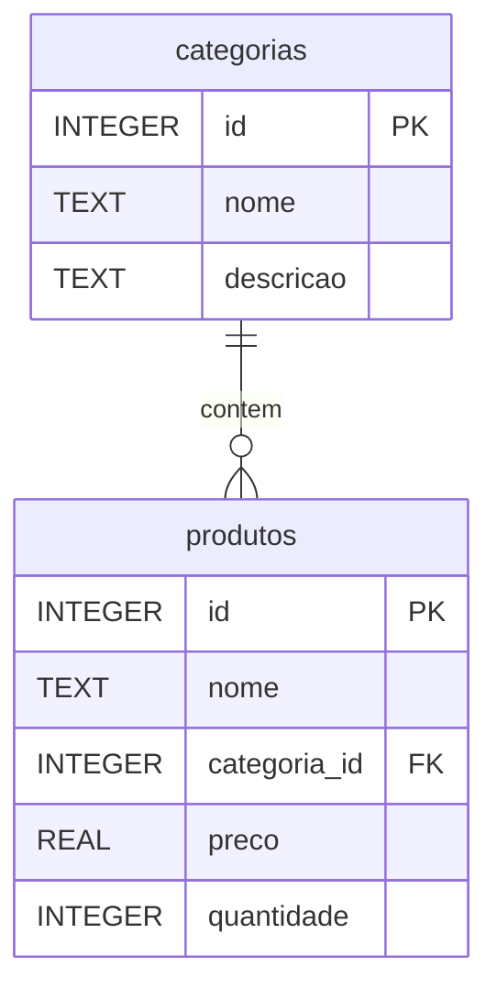
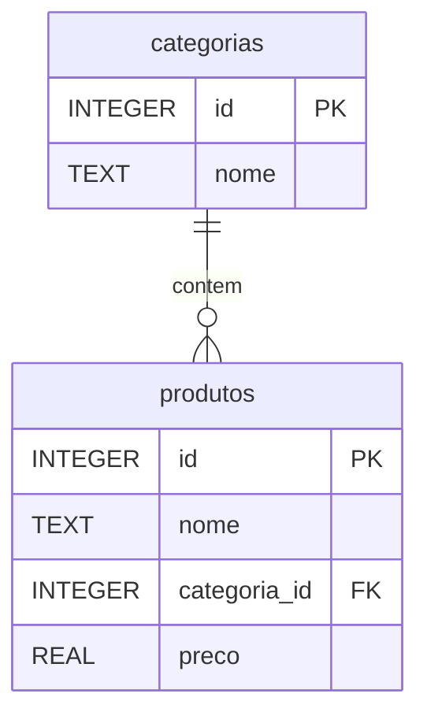
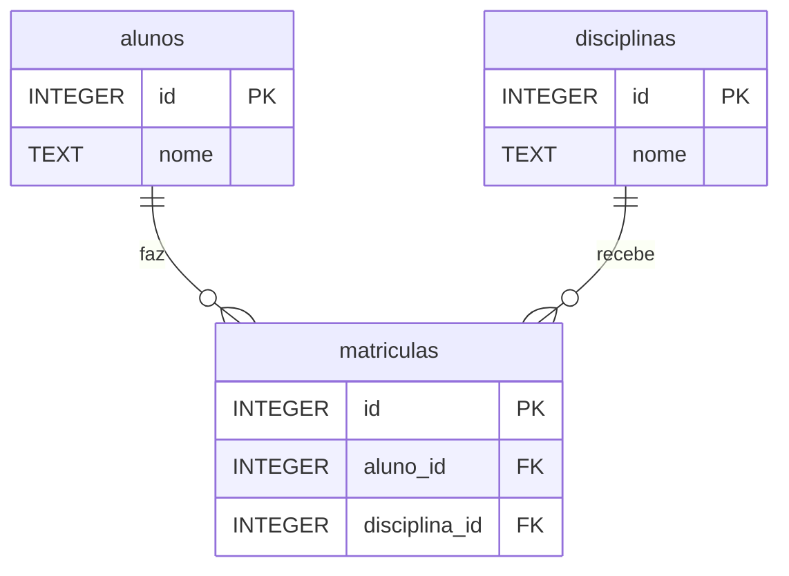
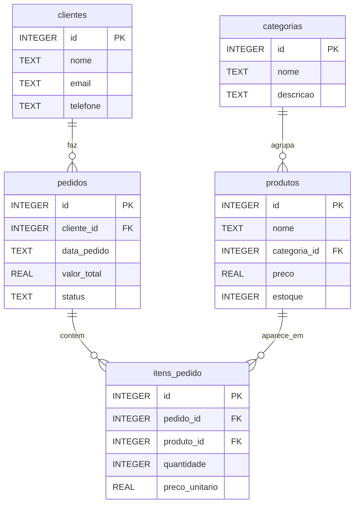
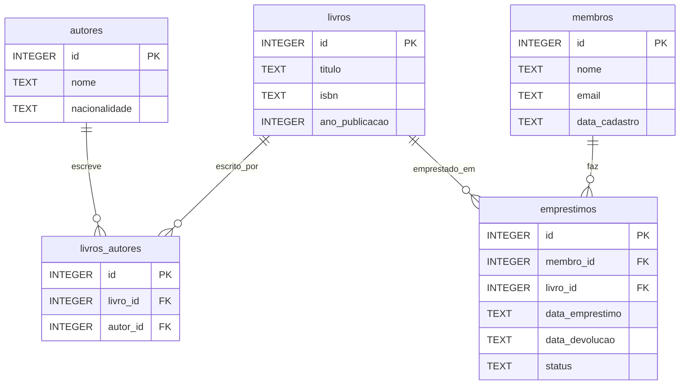

# 8.2 — Dados Relacionais: Tabelas, Chaves e Relacionamentos

[← Anterior: O que são Bancos de Dados](cap08-mod01-intro-bancos-conteudo.md) · [Próximo: Modelagem de Dados →](cap08-mod03-modelagem-conteudo.md)

---

## Introdução

No módulo anterior, você entendeu por que bancos de dados existem — eles resolvem os problemas de persistência, busca eficiente, acesso simultâneo e integridade que arquivos simples não conseguem resolver. Vimos que existem vários tipos de bancos de dados, mas que o modelo relacional é o mais usado no mundo e o foco deste capítulo.

Agora vamos mergulhar no coração do modelo relacional: como os dados são organizados. A ideia central é surpreendentemente simples — dados são organizados em **tabelas**, e tabelas se **relacionam** entre si. Se você já usou uma planilha do Excel ou do Google Sheets, já tem uma intuição do que é uma tabela. Mas o modelo relacional vai muito além de uma planilha.

Edgar Codd, quando propôs o modelo relacional em 1970, usou conceitos da matemática — especificamente da teoria dos conjuntos e da álgebra relacional. O nome "relacional" não vem de "relacionamento entre tabelas" (embora isso exista), mas de "relação" no sentido matemático — uma tabela é uma relação, um conjunto de tuplas (linhas) com atributos (colunas) definidos.

Não se preocupe com a matemática por trás. O importante é entender os conceitos práticos: o que são tabelas, linhas, colunas, chaves primárias, chaves estrangeiras e como tudo isso se conecta. Esses conceitos são a base de tudo que vamos fazer nos próximos módulos.

---

## Como Executar os Exemplos Deste Módulo

Este módulo é predominantemente conceitual, com diagramas e tabelas de exemplo. Não há código para executar ainda — isso começa no módulo 8.4. Foque em entender os conceitos e visualizar as estruturas.

---

## Tabelas: A Estrutura Fundamental

Uma **tabela** (em inglês, *table*) é a estrutura básica de um banco relacional. Ela organiza dados em um formato de grade com linhas e colunas — exatamente como uma planilha.

Cada tabela representa um tipo de entidade do mundo real. Se você está construindo um sistema para uma loja, pode ter tabelas como:
- `produtos` — cada produto que a loja vende
- `clientes` — cada pessoa que compra na loja
- `pedidos` — cada compra realizada
- `categorias` — cada categoria de produto (Alimentos, Bebidas, Limpeza)

Vamos ver como uma tabela de produtos se parece:

**Tabela: produtos**

| id | nome | categoria | preco | quantidade |
|----|------|-----------|-------|------------|
| 1 | Arroz 5kg | Alimentos | 22.90 | 150 |
| 2 | Feijao 1kg | Alimentos | 8.49 | 200 |
| 3 | Detergente 500ml | Limpeza | 2.99 | 300 |
| 4 | Cafe 250g | Bebidas | 12.90 | 100 |
| 5 | Sabao em po 1kg | Limpeza | 15.50 | 80 |

Essa tabela tem 5 **linhas** (registros) e 5 **colunas** (campos). Cada linha representa um produto específico. Cada coluna representa uma informação sobre o produto.

### Terminologia: Os Nomes que Você Vai Encontrar

O modelo relacional tem uma terminologia formal (da matemática) e uma terminologia informal (do dia a dia). Você vai encontrar ambas:

| Formal (matemática) | Informal (dia a dia) | SQL | Significado |
|---------------------|---------------------|-----|-------------|
| Relação | Tabela | TABLE | Conjunto de dados de um tipo |
| Tupla | Linha ou registro | ROW | Um item específico (um produto, um cliente) |
| Atributo | Coluna ou campo | COLUMN | Uma informação sobre o item (nome, preco) |
| Dominio | Tipo de dado | DATA TYPE | Valores possiveis para um atributo (texto, número) |
| Cardinalidade | Número de linhas | COUNT | Quantos registros a tabela tem |
| Grau | Número de colunas | - | Quantas colunas a tabela tem |

No dia a dia, usamos "tabela", "linha" e "coluna". Em documentação formal, você pode encontrar "relação", "tupla" e "atributo". Em SQL, usamos TABLE, ROW e COLUMN. Todos significam a mesma coisa.

---

## Linhas (Registros): Cada Item é Único

Cada **linha** (em inglês, *row*) de uma tabela representa um registro individual — um produto, um cliente, um pedido. Cada linha deve ser única — não pode haver duas linhas idênticas na mesma tabela.

Pense em uma ficha de cadastro. Cada ficha preenchida é uma linha na tabela. A ficha do "Arroz 5kg" tem todas as informações desse produto: id 1, categoria Alimentos, preço 22.90, quantidade 150. A ficha do "Café 250g" tem informações diferentes: id 4, categoria Bebidas, preço 12.90, quantidade 100.

Características importantes das linhas:
- Cada linha é independente das outras — remover uma linha não afeta as demais
- A ordem das linhas não importa — o banco pode armazená-las em qualquer ordem internamente
- Cada linha deve ser identificável de forma única (veremos como com chaves primárias)

---

## Colunas (Campos): Cada Informação Tem Seu Lugar

Cada **coluna** (em inglês, *column*) define um tipo de informação que a tabela armazena. Na tabela de produtos, temos colunas para id, nome, categoria, preço e quantidade. Cada coluna tem:

1. **Nome**: identifica a coluna (ex: `preco`, `nome`, `quantidade`)
2. **Tipo de dado**: define que tipo de valor a coluna aceita (texto, número inteiro, número decimal, data)
3. **Restrições**: regras sobre os valores (obrigatório, único, valor padrão)

| Coluna | Tipo | Obrigatório | Descrição |
|--------|------|-------------|-----------|
| id | INTEGER | Sim | Identificador único do produto |
| nome | TEXT | Sim | Nome do produto |
| categoria | TEXT | Sim | Categoria do produto |
| preco | REAL | Sim | Preco em reais |
| quantidade | INTEGER | Sim | Quantidade em estoque |

O tipo de dado é importante porque determina o que você pode fazer com a coluna. Você pode somar preços (porque são números), mas não pode somar nomes (porque são textos). Você pode ordenar por preço (do menor para o maior), e também pode ordenar por nome (em ordem alfabética). Vamos aprofundar tipos de dados no módulo 8.5.

### A Analogia: Tabela como Planilha

Se você já usou uma planilha, a analogia é direta:

| Planilha | Banco de dados |
|----------|----------------|
| Arquivo .xlsx | Banco de dados |
| Aba da planilha | Tabela |
| Linha da planilha | Registro (linha) |
| Coluna da planilha | Campo (coluna) |
| Celula | Valor de um campo em um registro |
| Cabecalho da coluna | Nome da coluna |

A diferença crucial: em uma planilha, você pode colocar qualquer coisa em qualquer célula — um número onde deveria ser texto, uma célula vazia onde deveria ter valor. Em um banco de dados, as regras são rígidas: cada coluna aceita apenas o tipo definido, e restrições são verificadas automaticamente.

---

## Chave Primária: O RG de Cada Registro

Cada registro em uma tabela precisa ser identificável de forma única. Não pode haver ambiguidade — quando você pede "o produto 42", deve existir exatamente um produto com esse identificador.

A **chave primária** (em inglês, *primary key*, abreviada PK) é a coluna (ou conjunto de colunas) que identifica cada registro de forma única. É como o RG de uma pessoa — cada pessoa tem um RG diferente, e dado um RG, você encontra exatamente uma pessoa.

Na nossa tabela de produtos, a coluna `id` é a chave primária:

| id (PK) | nome | preco |
|---------|------|-------|
| 1 | Arroz 5kg | 22.90 |
| 2 | Feijao 1kg | 8.49 |
| 3 | Detergente 500ml | 2.99 |

Regras da chave primária:
- **Unicidade**: dois registros nunca podem ter o mesmo valor de chave primária
- **Obrigatoriedade**: a chave primária nunca pode ser vazia (NULL)
- **Imutabilidade** (recomendação): idealmente, o valor da chave primária não deve mudar depois de criado

### Tipos de Chave Primária

Existem diferentes formas de criar chaves primárias:

**Auto-incremento (a mais comum)**

O banco gera automaticamente um número sequencial para cada novo registro: 1, 2, 3, 4... Você não precisa informar o valor — o banco cuida disso.

```
Registro 1: id = 1 (gerado automaticamente)
Registro 2: id = 2 (gerado automaticamente)
Registro 3: id = 3 (gerado automaticamente)
```

Vantagem: simples e eficiente. Desvantagem: o número não tem significado — id 42 não diz nada sobre o produto.

**Chave natural**

Usar um valor que já existe e é naturalmente único. Por exemplo, CPF para pessoas, ISBN para livros, código de barras para produtos.

Vantagem: o valor tem significado. Desvantagem: pode mudar (uma pessoa pode trocar de CPF em casos raros), e nem sempre existe um valor naturalmente único.

**UUID (Universally Unique Identifier)**

Um identificador gerado aleatoriamente com 128 bits, como `550e8400-e29b-41d4-a716-446655440000`. A probabilidade de dois UUIDs serem iguais é astronomicamente pequena.

Vantagem: único globalmente (funciona mesmo entre bancos diferentes). Desvantagem: ocupa mais espaço e é menos legível que um número sequencial.

Para o nosso curso, vamos usar auto-incremento — é o mais simples e o mais comum em sistemas pequenos e médios.

---

## Chave Estrangeira: O Link Entre Tabelas

Agora chegamos ao conceito que dá nome ao modelo "relacional": como tabelas se conectam entre si.

Olhe a tabela de produtos que criamos. A coluna `categoria` contém texto: "Alimentos", "Limpeza", "Bebidas". Isso funciona, mas tem problemas:

1. Se alguém digitar "alimentos" (minúsculo) em vez de "Alimentos", são tratados como categorias diferentes
2. Se você quiser mudar o nome de "Limpeza" para "Produtos de Limpeza", precisa atualizar todos os produtos dessa categoria
3. Se quiser adicionar informações sobre a categoria (descrição, ícone), não tem onde colocar

A solução é criar uma tabela separada para categorias e fazer os produtos **referenciarem** essa tabela:

**Tabela: categorias**

| id | nome | descrição |
|----|------|-----------|
| 1 | Alimentos | Produtos alimenticios em geral |
| 2 | Bebidas | Bebidas quentes e frias |
| 3 | Limpeza | Produtos de limpeza domestica |

**Tabela: produtos**

| id | nome | categoria_id (FK) | preco | quantidade |
|----|------|--------------------|-------|------------|
| 1 | Arroz 5kg | 1 | 22.90 | 150 |
| 2 | Feijao 1kg | 1 | 8.49 | 200 |
| 3 | Detergente 500ml | 3 | 2.99 | 300 |
| 4 | Cafe 250g | 2 | 12.90 | 100 |
| 5 | Sabao em po 1kg | 3 | 15.50 | 80 |

Agora, em vez de guardar o texto "Alimentos" em cada produto, guardamos o número `1` — que é o `id` da categoria "Alimentos" na tabela de categorias. Esse número é uma **chave estrangeira** (em inglês, *foreign key*, abreviada FK).

A chave estrangeira é uma coluna em uma tabela que referência a chave primária de outra tabela. É como uma "referência cruzada" — "para saber a categoria deste produto, vá à tabela de categorias e procure o registro com id = 1".



### Integridade Referencial

Quando você define uma chave estrangeira, o banco garante a **integridade referencial** — ou seja, garante que a referência é válida. Se a tabela de produtos tem `categoria_id = 1`, o banco garante que existe uma categoria com `id = 1` na tabela de categorias.

O que acontece se você tentar:
- Inserir um produto com `categoria_id = 99` (que não existe)? O banco **rejeita** a operação
- Remover a categoria com `id = 1` (que tem produtos associados)? O banco **rejeita** a operação (ou remove os produtos em cascata, dependendo da configuração)

Isso evita dados "órfãos" — produtos que referenciam categorias que não existem. Em um arquivo JSON, nada impede você de colocar `"categoria_id": 99` mesmo que a categoria 99 não exista. O banco de dados impede.

---

## Tipos de Relacionamentos

Tabelas podem se relacionar de diferentes formas. Existem três tipos fundamentais de relacionamento:

### 1:1 (Um para Um)

Cada registro de uma tabela se relaciona com exatamente um registro de outra tabela. É o tipo mais raro.

Exemplo: cada pessoa tem exatamente um CPF, e cada CPF pertence a exatamente uma pessoa.

**Tabela: pessoas**

| id | nome | data_nascimento |
|----|------|-----------------|
| 1 | Ana Silva | 1990-05-15 |
| 2 | Carlos Santos | 1985-11-20 |

**Tabela: documentos**

| id | pessoa_id (FK) | cpf | rg |
|----|----------------|-----|-----|
| 1 | 1 | 123.456.789-00 | 12.345.678-9 |
| 2 | 2 | 987.654.321-00 | 98.765.432-1 |

Na prática, relacionamentos 1:1 são pouco comuns porque geralmente faz mais sentido colocar tudo na mesma tabela. Eles são usados quando:
- Uma parte dos dados é acessada raramente (separar para performance)
- Uma parte dos dados é sensível (separar para segurança)
- A tabela ficaria com muitas colunas

### 1:N (Um para Muitos)

O tipo mais comum. Cada registro de uma tabela pode se relacionar com vários registros de outra tabela, mas cada registro da segunda tabela se relaciona com apenas um da primeira.

Exemplo: uma categoria tem muitos produtos, mas cada produto pertence a apenas uma categoria.



Outros exemplos de 1:N:
- Um cliente faz muitos pedidos, mas cada pedido pertence a um cliente
- Um autor escreve muitos livros, mas cada livro tem um autor principal
- Uma cidade tem muitos moradores, mas cada morador mora em uma cidade
- Um professor leciona muitas turmas, mas cada turma tem um professor

A chave estrangeira sempre fica no lado "muitos" (N). Na tabela de produtos, a coluna `categoria_id` aponta para a tabela de categorias. Não faria sentido colocar `produto_id` na tabela de categorias, porque uma categoria tem muitos produtos — precisaria de múltiplos campos.

### N:M (Muitos para Muitos)

Cada registro de uma tabela pode se relacionar com vários registros de outra tabela, e vice-versa.

Exemplo: um aluno pode estar matriculado em muitas disciplinas, e cada disciplina tem muitos alunos.

Esse tipo de relacionamento não pode ser representado diretamente com chaves estrangeiras. A solução é criar uma **tabela intermediária** (também chamada de tabela de junção ou tabela associativa) que conecta as duas:

**Tabela: alunos**

| id | nome |
|----|------|
| 1 | Ana |
| 2 | Bruno |
| 3 | Carla |

**Tabela: disciplinas**

| id | nome |
|----|------|
| 1 | Matemática |
| 2 | Portugues |
| 3 | História |

**Tabela: matriculas (tabela intermediaria)**

| id | aluno_id (FK) | disciplina_id (FK) |
|----|---------------|-------------------|
| 1 | 1 | 1 |
| 2 | 1 | 2 |
| 3 | 2 | 1 |
| 4 | 2 | 3 |
| 5 | 3 | 2 |
| 6 | 3 | 3 |

Lendo a tabela de matrículas: Ana (1) está em Matemática (1) e Português (2). Bruno (2) está em Matemática (1) e História (3). Carla (3) está em Português (2) e História (3).



Outros exemplos de N:M:
- Atores e filmes (um ator participa de muitos filmes, um filme tem muitos atores)
- Produtos e pedidos (um pedido tem muitos produtos, um produto aparece em muitos pedidos)
- Tags e posts (um post tem muitas tags, uma tag aparece em muitos posts)

| Tipo | Exemplo | Onde fica a FK |
|------|---------|----------------|
| 1:1 | Pessoa e CPF | Em qualquer uma das tabelas |
| 1:N | Categoria e Produtos | Na tabela do lado N (produtos) |
| N:M | Alunos e Disciplinas | Em uma tabela intermediaria |

---

## Normalização: Por que Não Colocar Tudo em Uma Tabela Só?

Quando você começa a pensar em bancos de dados, a tentação é colocar tudo em uma tabela gigante. Por que criar tabelas separadas para categorias e produtos se podemos colocar tudo junto?

Vamos ver o que acontece quando colocamos tudo em uma tabela:

**Tabela única (NAO normalizada)**

| id | produto | preco | qtd | categoria | cat_descricao |
|----|---------|-------|-----|-----------|---------------|
| 1 | Arroz 5kg | 22.90 | 150 | Alimentos | Produtos alimenticios |
| 2 | Feijao 1kg | 8.49 | 200 | Alimentos | Produtos alimenticios |
| 3 | Detergente | 2.99 | 300 | Limpeza | Produtos de limpeza |
| 4 | Cafe 250g | 12.90 | 100 | Bebidas | Bebidas quentes e frias |
| 5 | Sabao em po | 15.50 | 80 | Limpeza | Produtos de limpeza |

Parece funcionar, certo? Mas observe os problemas:

### Problema 1: Redundância (dados repetidos)

A informação "Alimentos — Produtos alimentícios" aparece nas linhas 1 e 2. "Limpeza — Produtos de limpeza" aparece nas linhas 3 e 5. Se tivermos 1000 produtos na categoria Alimentos, a descrição "Produtos alimentícios" será repetida 1000 vezes. Isso desperdiça espaço e torna atualizações difíceis.

### Problema 2: Anomalia de Atualização

Se quisermos mudar a descrição de "Alimentos" para "Gêneros alimentícios", precisamos atualizar TODAS as linhas que contêm "Alimentos". Se esquecermos uma, teremos dados inconsistentes — algumas linhas dizem "Produtos alimentícios" e outras dizem "Gêneros alimentícios".

### Problema 3: Anomalia de Inserção

Se quisermos cadastrar uma nova categoria "Eletrônicos" sem nenhum produto ainda, não conseguimos — porque a tabela exige um produto. A categoria só pode existir se tiver pelo menos um produto associado.

### Problema 4: Anomalia de Exclusão

Se removermos o único produto da categoria "Bebidas" (Café 250g), perdemos a informação de que a categoria "Bebidas" existe e sua descrição é "Bebidas quentes e frias". A categoria desaparece junto com o produto.

### A Solução: Normalização

**Normalização** é o processo de organizar dados em tabelas separadas para eliminar redundância e evitar anomalias. A ideia é simples: cada informação deve existir em apenas um lugar.

Em vez de uma tabela gigante, criamos duas:

**Tabela: categorias**

| id | nome | descrição |
|----|------|-----------|
| 1 | Alimentos | Produtos alimenticios |
| 2 | Bebidas | Bebidas quentes e frias |
| 3 | Limpeza | Produtos de limpeza |

**Tabela: produtos**

| id | nome | preco | qtd | categoria_id |
|----|------|-------|-----|-------------|
| 1 | Arroz 5kg | 22.90 | 150 | 1 |
| 2 | Feijao 1kg | 8.49 | 200 | 1 |
| 3 | Detergente | 2.99 | 300 | 3 |
| 4 | Cafe 250g | 12.90 | 100 | 2 |
| 5 | Sabao em po | 15.50 | 80 | 3 |

Agora:
- A descrição de cada categoria existe em apenas um lugar
- Para atualizar a descrição, basta mudar uma linha na tabela de categorias
- Podemos criar categorias sem produtos
- Remover um produto não apaga a categoria

| Problema | Tabela única | Tabelas normalizadas |
|----------|-------------|---------------------|
| Dados repetidos | Descrição repetida em cada produto | Descrição existe uma vez so |
| Atualizar categoria | Precisa atualizar N linhas | Atualiza 1 linha |
| Categoria sem produto | Impossível | Possível |
| Remover último produto | Perde a categoria | Categoria permanece |

A normalização tem diferentes "níveis" (chamados de formas normais: 1FN, 2FN, 3FN, etc.), mas para o nosso curso, o importante é entender o princípio: **cada informação em um lugar só, tabelas conectadas por chaves estrangeiras**.

---

## NULL: O Valor que Não Existe

Em bancos de dados, existe um valor especial chamado **NULL** que significa "ausência de valor" — não é zero, não é texto vazio, não é falso. É literalmente "não tem valor".

Exemplo: um cliente pode não ter informado o telefone. Nesse caso, o campo telefone é NULL:

| id | nome | email | telefone |
|----|------|-------|----------|
| 1 | Ana | ana@email.com | 11-99999-0001 |
| 2 | Bruno | bruno@email.com | NULL |
| 3 | Carla | carla@email.com | 11-99999-0003 |

Bruno não tem telefone cadastrado. Isso é diferente de ter um telefone vazio ("") ou um telefone zero (0). NULL significa "não sabemos" ou "não se aplica".

NULL pode causar confusão porque se comporta de forma diferente em comparações:
- `NULL = NULL` resulta em... NULL (não é verdadeiro nem falso)
- `NULL > 0` resulta em NULL
- `NULL + 5` resulta em NULL

Por isso, em SQL existe um operador especial para verificar NULL: `IS NULL` e `IS NOT NULL`. Vamos ver isso em detalhes no módulo 8.6.

Quando definimos uma coluna, podemos dizer se ela aceita NULL ou não:
- `NOT NULL` — o campo é obrigatório, não aceita NULL
- Sem restrição — o campo é opcional, aceita NULL

Na nossa tabela de produtos, faz sentido que `nome` e `preco` sejam NOT NULL (todo produto precisa de nome e preço), mas `descrição` poderia aceitar NULL (nem todo produto tem descrição detalhada).

---

## Diagramas Entidade-Relacionamento (ER)

Para visualizar a estrutura de um banco de dados — suas tabelas, colunas e relacionamentos — usamos **diagramas ER** (Entidade-Relacionamento). Esses diagramas são a "planta baixa" do banco, assim como um arquiteto desenha a planta de uma casa antes de construí-la.

Vamos ver um exemplo mais completo: um sistema de e-commerce simples com clientes, pedidos e produtos.



Lendo o diagrama:
- Um cliente faz muitos pedidos (1:N)
- Um pedido contém muitos itens (1:N)
- Um produto aparece em muitos itens de pedido (1:N)
- Uma categoria agrupa muitos produtos (1:N)
- A tabela `itens_pedido` é a tabela intermediária que resolve o relacionamento N:M entre pedidos e produtos

Esse diagrama mostra 5 tabelas e 4 relacionamentos. Com ele, qualquer desenvolvedor entende a estrutura do banco sem precisar ler código SQL. No próximo módulo, vamos aprender a criar esses diagramas a partir de problemas reais.

---

## Comparando com o que Você Já Conhece

Vamos conectar os conceitos deste módulo com o que você já aprendeu:

### Tabelas vs Listas de Dicionários (Python)

No capítulo 5, você usou listas de dicionários para representar coleções de dados:

```python
# Em Python: lista de dicionarios
products = [
    {"id": 1, "name": "Arroz", "price": 22.90},
    {"id": 2, "name": "Feijao", "price": 8.49},
    {"id": 3, "name": "Detergente", "price": 2.99},
]
```

Isso é conceitualmente uma tabela. Cada dicionário é uma linha. Cada chave do dicionário é uma coluna. A diferença é que em Python não há regras — você pode colocar qualquer chave em qualquer dicionário, misturar tipos, ter dicionários com chaves diferentes. No banco de dados, a estrutura é rígida e garantida.

### Chaves Primárias vs Índices de Array

No capítulo 7, você aprendeu que arrays usam índices numéricos para acessar elementos: `array[0]`, `array[1]`, `array[2]`. A chave primária funciona de forma similar — é o "endereço" de cada registro. Mas diferente de um array, a chave primária não precisa ser sequencial (pode ter "buracos" se registros forem removidos) e pode ser qualquer tipo de dado (não apenas números).

### Chaves Estrangeiras vs Ponteiros

No capítulo 7, você aprendeu que ponteiros em C são referências a posições de memória. Chaves estrangeiras são conceitualmente a mesma coisa — são referências a registros em outra tabela. Quando a tabela de produtos tem `categoria_id = 1`, é como um ponteiro que diz "vá à tabela de categorias e encontre o registro com id = 1".

| Conceito em C | Conceito em banco de dados |
|---------------|---------------------------|
| Ponteiro para struct | Chave estrangeira |
| Índice do array | Chave primaria |
| Struct com campos | Tabela com colunas |
| Array de structs | Tabela com registros |
| NULL (ponteiro nulo) | NULL (valor ausente) |

---

## Exemplo Completo: Sistema de Biblioteca

Para consolidar todos os conceitos, vamos ver um exemplo mais elaborado: um sistema de biblioteca. Esse exemplo vai ser retomado no módulo 8.3 (Modelagem) e no capítulo 9 (OOP com C#).

Uma biblioteca precisa gerenciar:
- Livros (título, autor, ISBN, ano de publicação)
- Autores (nome, nacionalidade)
- Membros (nome, email, data de cadastro)
- Empréstimos (quem pegou qual livro, quando, quando devolveu)

Vamos pensar nos relacionamentos:
- Um autor pode escrever muitos livros, e um livro pode ter muitos autores → N:M
- Um membro pode fazer muitos empréstimos, mas cada empréstimo é de um membro → 1:N
- Um livro pode ser emprestado muitas vezes, mas cada empréstimo é de um livro → 1:N



**Tabela: autores**

| id | nome | nacionalidade |
|----|------|---------------|
| 1 | Machado de Assis | Brasileira |
| 2 | Clarice Lispector | Brasileira |
| 3 | Gabriel Garcia Marquez | Colombiana |

**Tabela: livros**

| id | título | isbn | ano_publicacao |
|----|--------|------|----------------|
| 1 | Dom Casmurro | 978-85-359-0277-5 | 1899 |
| 2 | A Hora da Estrela | 978-85-325-0528-3 | 1977 |
| 3 | Cem Anos de Solidao | 978-85-01-01291-1 | 1967 |

**Tabela: livros_autores (intermediaria)**

| id | livro_id | autor_id |
|----|----------|----------|
| 1 | 1 | 1 |
| 2 | 2 | 2 |
| 3 | 3 | 3 |

**Tabela: membros**

| id | nome | email | data_cadastro |
|----|------|-------|---------------|
| 1 | Pedro Lima | pedro@email.com | 2024-01-15 |
| 2 | Maria Costa | maria@email.com | 2024-02-20 |

**Tabela: emprestimos**

| id | membro_id | livro_id | data_emprestimo | data_devolucao | status |
|----|-----------|----------|-----------------|----------------|--------|
| 1 | 1 | 1 | 2024-03-01 | 2024-03-15 | devolvido |
| 2 | 1 | 3 | 2024-03-10 | NULL | emprestado |
| 3 | 2 | 2 | 2024-03-05 | 2024-03-12 | devolvido |

Observe:
- Pedro (membro 1) pegou Dom Casmurro e já devolveu, e pegou Cem Anos de Solidão que ainda está com ele (data_devolucao é NULL)
- Maria (membro 2) pegou A Hora da Estrela e já devolveu
- A tabela `livros_autores` conecta livros e autores (N:M)
- Cada empréstimo referência um membro e um livro via chaves estrangeiras

Esse é o poder do modelo relacional: com 5 tabelas simples e chaves estrangeiras, conseguimos representar um sistema completo de biblioteca com todas as informações necessárias, sem redundância e com integridade garantida.

---

## Como a IA pode te ajudar aqui

**Prompt 1 — Explorar o conceito:**
> "Me dê 5 exemplos de relacionamentos 1:N e 5 exemplos de N:M do mundo real. Para cada um, explique por que é esse tipo e não outro."

**Prompt 2 — Pedir ajuda prática:**
> "Tenho uma tabela com colunas: pedido_id, produto_nome, produto_preco, cliente_nome, cliente_email, data_pedido. Me ajude a normalizar essa tabela em tabelas separadas."

**Prompt 3 — Criar com ajuda da IA:**
> "Crie um diagrama ER em Mermaid para um sistema de escola com alunos, professores, turmas e notas. Explique cada relacionamento."

---

## Casos de Uso no Mundo Real

### Caso 1: Spotify e Playlists

O Spotify usa um modelo relacional para gerenciar músicas, artistas, álbuns e playlists. Uma música pode estar em muitos álbuns (coletâneas) e muitas playlists — relacionamento N:M. Um artista pode ter muitas músicas — relacionamento 1:N. Quando você cria uma playlist, o Spotify não copia as músicas — ele cria registros em uma tabela intermediária que conecta sua playlist às músicas. Se o artista atualizar o nome de uma música, a mudança aparece automaticamente em todas as playlists, porque a informação existe em um lugar só (normalização).

### Caso 2: Sistema de Matrícula Universitária

Universidades usam bancos relacionais para gerenciar matrículas. Alunos se matriculam em disciplinas (N:M), disciplinas pertencem a departamentos (1:N), professores lecionam disciplinas (1:N ou N:M). A integridade referencial garante que um aluno não pode se matricular em uma disciplina que não existe, e que uma disciplina não pode ser removida se tem alunos matriculados. Chaves estrangeiras e constraints protegem a consistência dos dados acadêmicos.

### Caso 3: Mercado Livre e Avaliações

No Mercado Livre, cada produto pode receber muitas avaliações, e cada comprador pode avaliar muitos produtos — relacionamento N:M. A tabela de avaliações conecta compradores a produtos, com campos adicionais como nota (1-5), comentário e data. A chave estrangeira garante que toda avaliação pertence a um comprador real e a um produto real. Se um produto for removido, as avaliações associadas também são tratadas (geralmente mantidas para histórico ou removidas em cascata).

---

## Resumo do Módulo

| Conceito | Definição |
|----------|-----------|
| Tabela | Estrutura que organiza dados em linhas e colunas |
| Linha (registro) | Um item individual na tabela (um produto, um cliente) |
| Coluna (campo) | Uma informação sobre o item (nome, preco, data) |
| Chave primaria (PK) | Coluna que identifica cada registro de forma única |
| Chave estrangeira (FK) | Coluna que referência a chave primaria de outra tabela |
| Relacionamento 1:1 | Cada registro se relaciona com exatamente um de outra tabela |
| Relacionamento 1:N | Um registro se relaciona com muitos de outra tabela |
| Relacionamento N:M | Muitos registros se relacionam com muitos de outra tabela |
| Tabela intermediaria | Tabela que resolve relacionamentos N:M |
| Normalização | Processo de separar dados em tabelas para eliminar redundancia |
| NULL | Valor especial que indica ausência de dado |
| Integridade referencial | Garantia de que chaves estrangeiras apontam para registros validos |
| Diagrama ER | Representacao visual da estrutura do banco de dados |

---

## Glossário do Módulo

| Termo | Definição |
|-------|-----------|
| Anomalia de atualização | Problema causado por dados redundantes que ficam inconsistentes ao atualizar |
| Anomalia de exclusao | Perda de informação ao remover um registro que continha dados unicos |
| Anomalia de inserção | Impossibilidade de inserir dados por falta de dados relacionados |
| Atributo (attribute) | Nome formal para coluna em uma tabela |
| Auto-incremento (auto increment) | Mecanismo que gera valores sequenciais automaticamente para chave primaria |
| Cardinalidade (cardinality) | Número de registros em uma tabela |
| Chave estrangeira (foreign key, FK) | Coluna que referência a chave primaria de outra tabela |
| Chave natural (natural key) | Chave primaria baseada em um valor real do dominio (CPF, ISBN) |
| Chave primaria (primary key, PK) | Coluna que identifica cada registro de forma única e obrigatória |
| Diagrama ER (Entity-Relationship) | Representacao visual de tabelas, colunas e relacionamentos |
| Dominio (domain) | Conjunto de valores validos para uma coluna |
| Forma normal (normal form) | Nível de normalização de uma tabela (1FN, 2FN, 3FN) |
| Grau (degree) | Número de colunas em uma tabela |
| Integridade referencial (referential integrity) | Garantia de que toda FK aponta para um registro existente |
| NOT NULL | Restrição que impede valores nulos em uma coluna |
| NULL | Valor especial que representa ausência de dado |
| Normalização (normalization) | Processo de organizar dados para eliminar redundancia |
| Redundancia (redundancy) | Dados repetidos desnecessariamente em multiplos lugares |
| Registro (record, row) | Uma linha em uma tabela, representando um item individual |
| Relação (relation) | Nome formal para tabela no modelo relacional |
| Tabela associativa (junction table) | Tabela intermediaria que resolve relacionamentos N:M |
| Tupla (tuple) | Nome formal para linha em uma tabela |
| UUID (Universally Unique Identifier) | Identificador único de 128 bits gerado aleatoriamente |

---

## Na Cultura Popular

- **The Social Network** (filme, 2010) — conta a criação do Facebook. Uma das cenas mais icônicas mostra Mark Zuckerberg criando o FaceMash, um site que comparava fotos de estudantes. Para funcionar, ele precisou de um banco de dados com fotos e informações dos alunos — tabelas de pessoas, fotos e votos, conectadas por relacionamentos. O filme mostra como dados organizados em tabelas podem criar produtos que mudam o mundo.

- **Silicon Valley** (série, 2014-2019) — a série acompanha uma startup que cria um algoritmo de compressão. Em vários episódios, os personagens discutem como armazenar e organizar dados de forma eficiente. A tensão entre "colocar tudo junto" (rápido de implementar) e "organizar direito" (sustentável a longo prazo) é exatamente o dilema da normalização.

---

## Para Saber Mais

- [SQLBolt — Lição 1: SELECT queries](https://sqlbolt.com/lesson/select_queries_introduction) — *Tutorial interativo que começa do básico. Perfeito para ver tabelas e consultas em ação.*

- [SQL Murder Mystery](https://mystery.knightlab.com/) — *Jogo de detetive onde você usa SQL para resolver um crime. Excelente para praticar consultas em tabelas relacionadas.*

- [Curso em Vídeo — MySQL](https://www.youtube.com/playlist?list=PLHz_AreHm4dkBs-795Dsgvau_ekxg8g1r) — *Curso completo de banco de dados em português. As primeiras aulas cobrem exatamente os conceitos deste módulo.*

- [DB Fiddle](https://www.db-fiddle.com/) — *Playground SQL no navegador. Crie tabelas e teste relacionamentos sem instalar nada.*

---

## Perguntas Frequentes (FAQ)

**P: Por que não usar apenas uma tabela gigante com tudo?**
R: Porque causa redundância (dados repetidos), anomalias de atualização (inconsistências ao mudar dados), anomalias de inserção (não conseguir cadastrar dados parciais) e anomalias de exclusão (perder informações ao remover registros). A normalização resolve todos esses problemas separando dados em tabelas relacionadas.

**P: Chave primária precisa ser um número?**
R: Não. Pode ser texto (como um código de produto "PROD-001"), UUID, ou qualquer valor único. Mas números inteiros com auto-incremento são os mais comuns por serem simples e eficientes.

**P: O que acontece se eu tentar inserir um registro com chave primária duplicada?**
R: O banco rejeita a operação com um erro. A unicidade da chave primária é garantida pelo banco — ele nunca permite duplicatas.

**P: Posso ter mais de uma chave primária em uma tabela?**
R: Cada tabela tem exatamente uma chave primária, mas ela pode ser composta por mais de uma coluna. Por exemplo, na tabela de matrículas, a chave primária poderia ser a combinação (aluno_id, disciplina_id) — garantindo que um aluno não se matricule duas vezes na mesma disciplina.

**P: NULL é a mesma coisa que zero ou texto vazio?**
R: Não. NULL significa "não tem valor" ou "desconhecido". Zero é um valor numérico. Texto vazio ("") é um valor de texto. NULL é a ausência de qualquer valor. Essa distinção é importante em consultas SQL.

**P: Normalização sempre é melhor?**
R: Na maioria dos casos, sim. Mas em cenários de altíssima performance (milhões de consultas por segundo), às vezes se faz "desnormalização" proposital — colocar dados redundantes para evitar JOINs custosos. Isso é uma otimização avançada que só faz sentido em casos específicos.

**P: Como sei se um relacionamento é 1:N ou N:M?**
R: Faça a pergunta nos dois sentidos. "Um autor pode ter muitos livros?" Sim. "Um livro pode ter muitos autores?" Sim. Então é N:M. "Uma categoria pode ter muitos produtos?" Sim. "Um produto pode ter muitas categorias?" Se não (cada produto tem uma categoria), é 1:N.

**P: O que é "schema" de um banco de dados?**
R: Schema é a estrutura completa do banco — todas as tabelas, colunas, tipos, chaves e relacionamentos. É o "projeto" do banco, sem os dados. Quando você cria tabelas com CREATE TABLE, está definindo o schema.

**P: Posso mudar a estrutura de uma tabela depois de criada?**
R: Sim, usando o comando ALTER TABLE. Você pode adicionar colunas, remover colunas, mudar tipos e adicionar constraints. Mas mudanças em tabelas com muitos dados podem ser demoradas e precisam de cuidado.

**P: Diagrama ER é obrigatório?**
R: Não é obrigatório tecnicamente, mas é fortemente recomendado. Assim como você não construiria uma casa sem planta, não deveria criar um banco sem diagrama. O diagrama ajuda a visualizar a estrutura, identificar problemas e comunicar o design para outros desenvolvedores.

---

## Exercícios Práticos

### Exercício 1: Identificando Relacionamentos

Para cada par de entidades abaixo, identifique o tipo de relacionamento (1:1, 1:N ou N:M) e justifique:

a) País e Cidades
b) Médico e Pacientes
c) Filme e Atores
d) Pessoa e Passaporte
e) Produto e Fornecedores
f) Post de blog e Comentários

### Exercício 2: Desenhando um Diagrama ER

Desenhe (no papel ou usando Mermaid) o diagrama ER para um sistema de pizzaria com:
- Pizzas (nome, tamanho, preço)
- Ingredientes (nome, tipo)
- Clientes (nome, telefone, endereço)
- Pedidos (data, valor total, status)

Identifique os relacionamentos e as chaves estrangeiras necessárias.

### Exercício 3: Normalizando uma Tabela

A tabela abaixo está desnormalizada. Identifique os problemas e proponha uma versão normalizada com tabelas separadas:

| pedido_id | cliente_nome | cliente_email | produto_nome | produto_preco | quantidade | data |
|-----------|-------------|---------------|-------------|---------------|------------|------|
| 1 | Ana | ana@email.com | Arroz | 22.90 | 2 | 2024-03-01 |
| 1 | Ana | ana@email.com | Feijao | 8.49 | 1 | 2024-03-01 |
| 2 | Bruno | bruno@email.com | Cafe | 12.90 | 3 | 2024-03-02 |
| 3 | Ana | ana@email.com | Cafe | 12.90 | 1 | 2024-03-03 |

---

[← Anterior: O que são Bancos de Dados](cap08-mod01-intro-bancos-conteudo.md) · [Próximo: Modelagem de Dados →](cap08-mod03-modelagem-conteudo.md)
