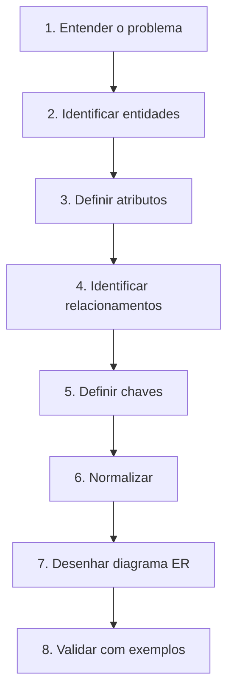
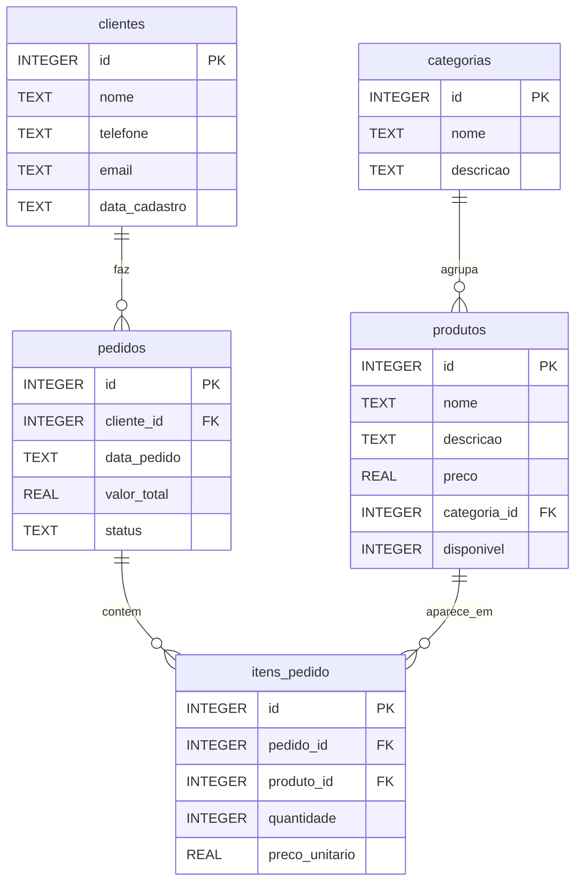
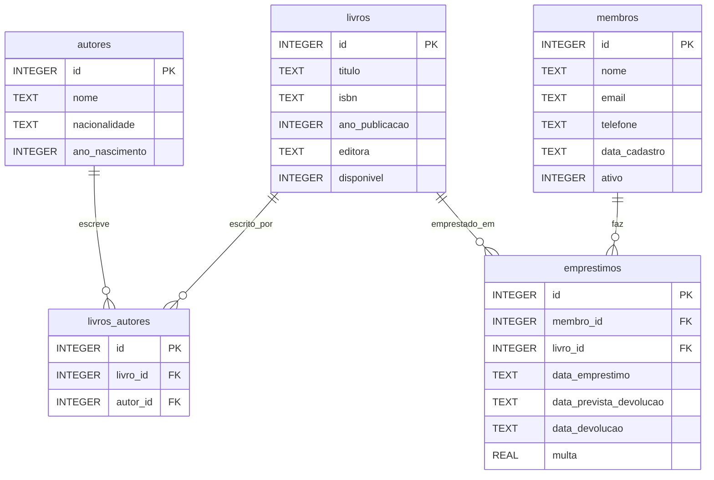
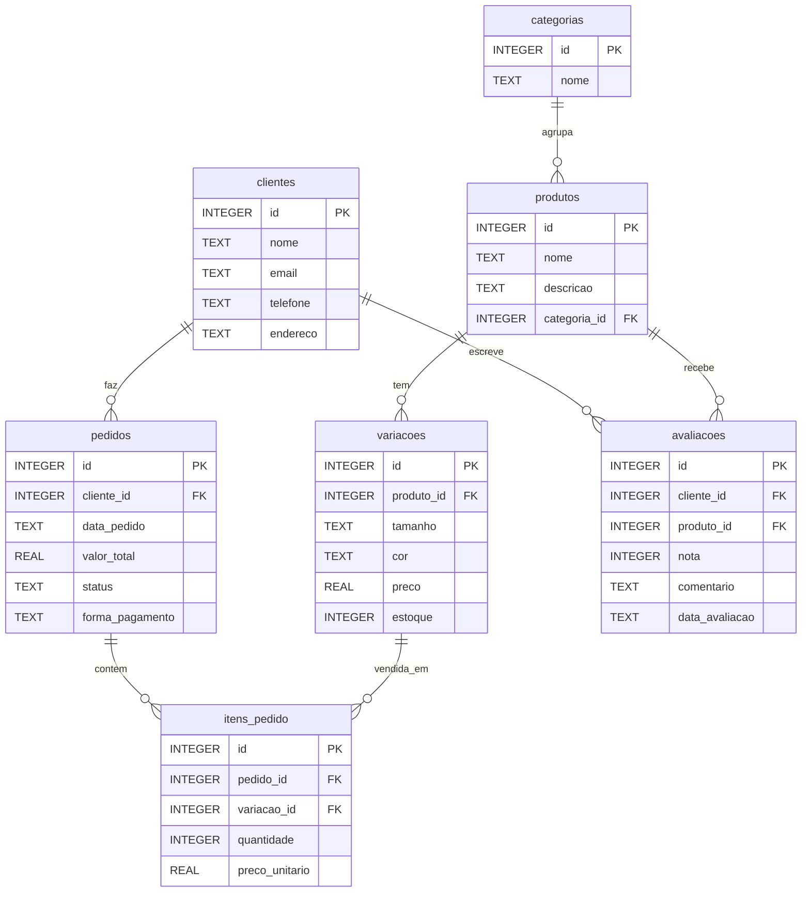

# 8.3 — Modelagem de Dados: Projetando Antes de Construir

[← Anterior: Dados Relacionais](cap08-mod02-dados-relacionais-conteudo.md) · [Próximo: SQLite e Ambiente →](cap08-mod04-sqlite-ambiente-conteudo.md)

---

## Introdução

No módulo anterior, você aprendeu os conceitos fundamentais do modelo relacional: tabelas, linhas, colunas, chaves primárias, chaves estrangeiras, tipos de relacionamento e normalização. Viu exemplos prontos de tabelas bem organizadas e diagramas ER bonitos. Mas ficou uma pergunta no ar: como chegar nessa estrutura a partir de um problema real?

Quando alguém te pede para criar um sistema de cadastro de produtos, ou um sistema de biblioteca, ou um controle de estoque — como você decide quais tabelas criar, quais colunas cada tabela deve ter, como as tabelas se relacionam? Esse processo se chama **modelagem de dados**, e é uma das habilidades mais importantes que um desenvolvedor pode ter.

Modelagem de dados é como a planta de uma casa. Antes de colocar um tijolo, o arquiteto desenha a planta — define quantos cômodos, onde ficam as portas, como os espaços se conectam. Se a planta estiver errada, a casa vai ter problemas que são caros de consertar depois. Com bancos de dados é a mesma coisa: se a modelagem estiver errada, o sistema vai ter problemas de performance, inconsistência e dificuldade de manutenção que são muito mais caros de corrigir depois do que acertar desde o início.

Este módulo é o mais importante do capítulo em termos conceituais. Nos próximos módulos, você vai aprender os comandos SQL para criar tabelas e manipular dados. Mas sem saber modelar, você vai criar tabelas erradas — e SQL perfeito em tabelas erradas produz resultados errados.

---

## O Processo de Modelagem

Modelar um banco de dados é traduzir um problema do mundo real em tabelas, colunas e relacionamentos. O processo segue etapas:

Vamos percorrer cada etapa com um exemplo prático: um sistema de controle de pedidos para uma lanchonete.

---

## Etapa 1: Entender o Problema

Antes de pensar em tabelas, você precisa entender o que o sistema precisa fazer. Converse com quem vai usar o sistema (ou leia os requisitos) e responda:

- Que informações o sistema precisa guardar?
- Que perguntas o sistema precisa responder?
- Quem vai usar o sistema e como?

Para a nossa lanchonete, o dono precisa de um sistema que:
- Cadastre os produtos do cardápio (lanches, bebidas, sobremesas)
- Registre os pedidos dos clientes
- Saiba quais produtos cada pedido contém
- Calcule o valor total de cada pedido
- Mostre o histórico de pedidos de cada cliente
- Controle o estoque de ingredientes

As perguntas que o sistema precisa responder:
- "Quais são os produtos disponíveis?"
- "Quanto custa o pedido do cliente X?"
- "Quais foram os pedidos de hoje?"
- "Qual é o produto mais vendido?"
- "Quanto de queijo temos em estoque?"

Essas perguntas vão guiar toda a modelagem. Se o sistema precisa responder "qual é o produto mais vendido", precisamos de uma forma de contar quantas vezes cada produto foi pedido. Se precisa mostrar "pedidos de hoje", precisamos guardar a data de cada pedido.

---

## Etapa 2: Identificar Entidades

Uma **entidade** é qualquer "coisa" do mundo real que o sistema precisa representar. Para identificar entidades, procure os substantivos na descrição do problema:

- **Produto**: cada item do cardápio (X-Burguer, Coca-Cola, Pudim)
- **Categoria**: tipo de produto (Lanches, Bebidas, Sobremesas)
- **Cliente**: cada pessoa que faz pedidos
- **Pedido**: cada compra realizada
- **Item do pedido**: cada produto dentro de um pedido (com quantidade)

Cada entidade vai se tornar uma tabela no banco de dados.

### Como saber se algo é uma entidade?

Faça estas perguntas:
- Preciso guardar informações sobre isso? Se sim, é uma entidade
- Existem múltiplas instâncias disso? Se sim, é uma entidade
- Preciso identificar cada instância individualmente? Se sim, é uma entidade

"Produto" é uma entidade porque existem muitos produtos, cada um com informações próprias (nome, preço), e preciso identificar cada um. "Cor do produto" provavelmente não é uma entidade — é um atributo do produto.

### Entidades vs Atributos

Às vezes é difícil decidir se algo é uma entidade separada ou apenas um atributo. A regra prática:

- Se tem apenas um valor simples associado a outra entidade → atributo
- Se tem múltiplos atributos próprios → entidade
- Se pode existir independentemente → entidade
- Se é compartilhado por muitas entidades → entidade

Exemplo: "categoria" poderia ser apenas um atributo de texto no produto ("Lanches"). Mas se queremos guardar descrição da categoria, ícone, ordem de exibição — então categoria é uma entidade separada com seus próprios atributos.

---

## Etapa 3: Definir Atributos

Para cada entidade, liste todas as informações que precisam ser guardadas. Cada informação vira uma coluna na tabela.

**Produto**:
- id (identificador único)
- nome (nome do produto)
- descrição (descrição detalhada)
- preco (preço de venda)
- categoria_id (referência à categoria)
- disponível (se está disponível para venda)

**Categoria**:
- id (identificador único)
- nome (nome da categoria)
- descrição (descrição da categoria)

**Cliente**:
- id (identificador único)
- nome (nome do cliente)
- telefone (telefone para contato)
- email (email do cliente)
- data_cadastro (quando se cadastrou)

**Pedido**:
- id (identificador único)
- cliente_id (referência ao cliente)
- data_pedido (quando o pedido foi feito)
- valor_total (valor total do pedido)
- status (pendente, preparando, pronto, entregue)

**Item do Pedido**:
- id (identificador único)
- pedido_id (referência ao pedido)
- produto_id (referência ao produto)
- quantidade (quantas unidades)
- preco_unitario (preço no momento do pedido)

### Por que guardar preco_unitario no item do pedido?

Observe que guardamos o preço no item do pedido, mesmo que o produto já tenha preço. Isso é intencional: o preço do produto pode mudar no futuro (promoção, reajuste), mas o preço que o cliente pagou naquele pedido específico não deve mudar. Se guardarmos apenas a referência ao produto, e o preço do produto mudar, todos os pedidos antigos mostrariam o preço novo — o que seria incorreto.

Essa é uma decisão de modelagem importante: **dados que podem mudar e que precisam ser preservados no estado original devem ser copiados, não referenciados**.

### Escolhendo Tipos de Dados

Cada atributo precisa de um tipo de dado. No SQLite, os tipos principais são:

| Tipo SQLite | Uso | Exemplos |
|-------------|-----|----------|
| INTEGER | Números inteiros | id, quantidade, ano |
| REAL | Números decimais | preco, peso, nota |
| TEXT | Texto | nome, email, descrição |
| BLOB | Dados binarios | imagens, arquivos (raro) |

Dicas para escolher tipos:
- IDs: sempre INTEGER
- Preços e valores monetários: REAL (em bancos profissionais, usa-se DECIMAL para precisão exata)
- Nomes, descrições, emails: TEXT
- Datas: TEXT no formato "AAAA-MM-DD" (SQLite não tem tipo DATE nativo)
- Sim/Não: INTEGER (0 = não, 1 = sim)
- Status com opções fixas: TEXT ("pendente", "preparando", "pronto")

---

## Etapa 4: Identificar Relacionamentos

Agora conectamos as entidades. Para cada par de entidades, pergunte: "existe uma relação entre elas?"

**Categoria → Produto**: Uma categoria tem muitos produtos. Um produto pertence a uma categoria. → **1:N**

**Cliente → Pedido**: Um cliente faz muitos pedidos. Um pedido pertence a um cliente. → **1:N**

**Pedido → Item do Pedido**: Um pedido tem muitos itens. Um item pertence a um pedido. → **1:N**

**Produto → Item do Pedido**: Um produto aparece em muitos itens. Um item referência um produto. → **1:N**

Note que Pedido e Produto têm um relacionamento N:M (um pedido tem muitos produtos, um produto aparece em muitos pedidos), mas ele é resolvido pela tabela intermediária "Item do Pedido".

---

## Etapa 5: Definir Chaves

Para cada tabela:
- **Chave primária**: geralmente `id` com auto-incremento
- **Chaves estrangeiras**: colunas que referenciam outras tabelas

| Tabela | Chave primaria | Chaves estrangeiras |
|--------|---------------|-------------------|
| categorias | id | - |
| produtos | id | categoria_id → categorias.id |
| clientes | id | - |
| pedidos | id | cliente_id → clientes.id |
| itens_pedido | id | pedido_id → pedidos.id, produto_id → produtos.id |

---

## Etapa 6: Normalizar

Verifique se há redundância. No nosso modelo, cada informação existe em um lugar só:
- Dados da categoria estão apenas na tabela categorias
- Dados do cliente estão apenas na tabela clientes
- Dados do produto estão apenas na tabela produtos
- O preço no momento do pedido está no item (cópia intencional, não redundância)

O modelo está normalizado.

---

## Etapa 7: Desenhar o Diagrama ER

Com todas as informações, desenhamos o diagrama completo:

---

## Etapa 8: Validar com Exemplos

A última etapa é testar o modelo com dados reais. Preencha as tabelas com exemplos e verifique se o modelo consegue responder todas as perguntas que identificamos na etapa 1.

**categorias**

| id | nome | descrição |
|----|------|-----------|
| 1 | Lanches | Sanduiches e hamburgueres |
| 2 | Bebidas | Refrigerantes, sucos e agua |
| 3 | Sobremesas | Doces e sorvetes |

**produtos**

| id | nome | descrição | preco | categoria_id | disponível |
|----|------|-----------|-------|-------------|------------|
| 1 | X-Burguer | Hamburguer com queijo | 18.90 | 1 | 1 |
| 2 | X-Salada | Hamburguer com salada | 21.90 | 1 | 1 |
| 3 | Coca-Cola 350ml | Refrigerante | 6.00 | 2 | 1 |
| 4 | Suco Natural | Suco de laranja | 8.00 | 2 | 0 |
| 5 | Pudim | Pudim de leite | 10.00 | 3 | 1 |

**clientes**

| id | nome | telefone | email | data_cadastro |
|----|------|----------|-------|---------------|
| 1 | Joao Silva | 11-99999-0001 | joao@email.com | 2024-01-10 |
| 2 | Maria Santos | 11-99999-0002 | maria@email.com | 2024-02-15 |

**pedidos**

| id | cliente_id | data_pedido | valor_total | status |
|----|-----------|-------------|-------------|--------|
| 1 | 1 | 2024-03-01 | 43.80 | entregue |
| 2 | 2 | 2024-03-01 | 28.90 | pronto |

**itens_pedido**

| id | pedido_id | produto_id | quantidade | preco_unitario |
|----|-----------|-----------|------------|----------------|
| 1 | 1 | 1 | 1 | 18.90 |
| 2 | 1 | 3 | 2 | 6.00 |
| 3 | 1 | 5 | 1 | 10.00 |
| 4 | 2 | 2 | 1 | 21.90 |
| 5 | 2 | 4 | 1 | 7.00 |

Agora vamos verificar se o modelo responde as perguntas:

- "Quais são os produtos disponíveis?" → Buscar em produtos onde disponível = 1 ✓
- "Quanto custa o pedido 1?" → Somar preco_unitario * quantidade dos itens do pedido 1: (18.90*1) + (6.00*2) + (10.00*1) = 40.90 ✓
- "Quais foram os pedidos de hoje?" → Buscar em pedidos onde data_pedido = hoje ✓
- "Qual é o produto mais vendido?" → Contar quantas vezes cada produto_id aparece em itens_pedido ✓

O modelo funciona. Se alguma pergunta não pudesse ser respondida, precisaríamos ajustar o modelo — adicionar tabelas, colunas ou relacionamentos.

---

## Exercício Guiado: Modelando um Sistema de Biblioteca

Vamos praticar o processo completo com outro exemplo: um sistema de biblioteca. Esse é um caso clássico de modelagem que aparece em entrevistas de emprego e cursos de banco de dados.

### Entendendo o Problema

A biblioteca precisa:
- Cadastrar livros (título, ISBN, ano, editora)
- Cadastrar autores (nome, nacionalidade, ano de nascimento)
- Saber quais autores escreveram cada livro (um livro pode ter vários autores)
- Cadastrar membros da biblioteca (nome, email, telefone)
- Registrar empréstimos (quem pegou qual livro, quando, prazo de devolução)
- Saber se um livro está disponível ou emprestado
- Controlar multas por atraso

### Identificando Entidades

- **Livro**: cada exemplar na biblioteca
- **Autor**: cada escritor
- **Membro**: cada pessoa cadastrada na biblioteca
- **Empréstimo**: cada vez que alguém pega um livro

### Identificando Relacionamentos

- Autor ↔ Livro: um autor escreve muitos livros, um livro pode ter muitos autores → **N:M** (precisa de tabela intermediária)
- Membro → Empréstimo: um membro faz muitos empréstimos → **1:N**
- Livro → Empréstimo: um livro pode ser emprestado muitas vezes → **1:N**

### Definindo Atributos e Chaves

**livros**: id (PK), título, isbn (UNIQUE), ano_publicacao, editora, disponível

**autores**: id (PK), nome, nacionalidade, ano_nascimento

**livros_autores**: id (PK), livro_id (FK), autor_id (FK)

**membros**: id (PK), nome, email (UNIQUE), telefone, data_cadastro, ativo

**emprestimos**: id (PK), membro_id (FK), livro_id (FK), data_emprestimo, data_prevista_devolucao, data_devolucao, multa

### Diagrama ER

### Decisões de Modelagem

Algumas decisões que tomamos e por quê:

1. **isbn como UNIQUE**: cada livro tem um ISBN único no mundo. Isso evita cadastrar o mesmo livro duas vezes.

2. **email como UNIQUE em membros**: cada membro tem um email único. Evita cadastros duplicados.

3. **disponível em livros**: um campo simples (0 ou 1) que indica se o livro está na prateleira. Poderia ser calculado a partir dos empréstimos (se tem empréstimo sem devolução, não está disponível), mas guardar diretamente é mais rápido para consultas frequentes.

4. **data_devolucao pode ser NULL**: quando o livro ainda não foi devolvido, esse campo é NULL. Quando for devolvido, preenchemos com a data.

5. **multa em emprestimos**: calculada quando o livro é devolvido com atraso. Poderia ser calculada dinamicamente, mas guardar o valor facilita relatórios.

6. **Tabela livros_autores**: resolve o N:M entre livros e autores. Sem ela, teríamos que repetir dados de autores em cada livro ou vice-versa.

---

## Exercício Guiado: Modelando um E-commerce Simples

Vamos praticar com mais um exemplo para fixar o processo. Desta vez, um e-commerce simples — uma loja online que vende roupas.

### Entendendo o Problema

A loja precisa:
- Cadastrar produtos (camisetas, calças, vestidos) com nome, descrição, preço e estoque
- Cada produto tem um tamanho (P, M, G, GG) e uma cor
- Organizar produtos em categorias (Masculino, Feminino, Infantil)
- Cadastrar clientes com nome, email, telefone e endereço de entrega
- Registrar pedidos com data, valor total, status e forma de pagamento
- Saber quais produtos cada pedido contém, com quantidade e tamanho escolhido
- Permitir que clientes avaliem produtos (nota de 1 a 5 e comentário)

### Identificando Entidades

Vamos analisar cada substantivo:

- **Produto**: sim, é uma entidade — tem muitos atributos e muitas instâncias
- **Categoria**: sim — tem nome e descrição próprios, compartilhada por muitos produtos
- **Tamanho e Cor**: decisão importante. Se cada produto tem apenas um tamanho e uma cor, são atributos. Mas em uma loja de roupas, o mesmo modelo de camiseta existe em vários tamanhos e cores. Isso sugere que precisamos de uma entidade **variação de produto** (ou SKU — Stock Keeping Unit)
- **Cliente**: sim — tem dados próprios e múltiplas instâncias
- **Pedido**: sim — cada compra é um registro
- **Item do pedido**: sim — conecta pedido a produto (com quantidade e tamanho)
- **Avaliação**: sim — conecta cliente a produto (com nota e comentário)

### O Conceito de SKU (Variação de Produto)

Em lojas de roupas, um "produto" como "Camiseta Básica Preta" pode existir nos tamanhos P, M, G e GG. Cada combinação de produto + tamanho + cor é um **SKU** (Stock Keeping Unit) — a unidade mínima de estoque.

Sem SKU, teríamos que criar um produto separado para cada combinação:
- Camiseta Básica Preta P
- Camiseta Básica Preta M
- Camiseta Básica Preta G
- Camiseta Básica Branca P
- Camiseta Básica Branca M
- ...

Com SKU, temos um produto "Camiseta Básica" e várias variações:

Observe que:
- O item do pedido referência a **variação** (não o produto), porque o cliente compra "Camiseta Preta M", não apenas "Camiseta"
- A avaliação referência o **produto** (não a variação), porque o cliente avalia a camiseta em geral, não um tamanho específico
- Preço e estoque ficam na variação, porque tamanhos diferentes podem ter preços e estoques diferentes

Essa é uma decisão de modelagem real que lojas como Mercado Livre, Amazon e Shopee precisam tomar. A modelagem correta de variações de produto é um dos desafios mais comuns em e-commerce.

---

## Erros Comuns de Modelagem

Ao longo da sua carreira, você vai ver (e cometer) erros de modelagem. Conhecer os mais comuns ajuda a evitá-los:

### Erro 1: A Tabela "Faz Tudo"

Colocar tudo em uma tabela só. Exemplo: uma tabela "dados" com colunas para produto, cliente, pedido, categoria, tudo junto. Isso causa todos os problemas de redundância e anomalias que vimos no módulo anterior.

**Como evitar**: se uma tabela tem mais de 10-12 colunas, provavelmente precisa ser dividida. Se tem dados que se repetem em muitas linhas, precisa ser normalizada.

### Erro 2: Campos Multivalorados

Colocar múltiplos valores em um único campo. Exemplo: uma coluna "telefones" com valor "11-9999-0001, 11-9999-0002, 11-9999-0003".

**Problema**: como buscar por um telefone específico? Como adicionar ou remover um telefone? Como garantir que não há duplicatas?

**Solução**: criar uma tabela separada de telefones com chave estrangeira para a pessoa.

### Erro 3: Colunas Numeradas

Criar colunas como `telefone1`, `telefone2`, `telefone3`. Parece resolver o problema de múltiplos valores, mas cria outros: e se a pessoa tem 4 telefones? E se tem apenas 1 (os outros ficam NULL)?

**Solução**: mesma do erro anterior — tabela separada.

### Erro 4: Ignorar Relacionamentos N:M

Tentar representar N:M sem tabela intermediária. Exemplo: colocar `autor_ids = "1,2,3"` na tabela de livros.

**Problema**: impossível fazer JOINs, impossível garantir integridade referencial, impossível buscar "todos os livros do autor 2" de forma eficiente.

**Solução**: sempre usar tabela intermediária para N:M.

### Erro 5: Não Pensar no Futuro

Modelar apenas para o cenário atual sem considerar evolução. Exemplo: um sistema de escola que só permite um professor por turma. Quando a escola decidir ter dois professores por turma (titular e auxiliar), o modelo quebra.

**Como evitar**: pergunte "e se isso mudar?" para cada decisão. Se a resposta for "é possível", modele de forma flexível.

### Erro 6: Chaves Primárias com Significado de Negócio

Usar CPF, email ou código de produto como chave primária. Parece prático, mas esses valores podem mudar (pessoa troca de CPF, email muda, código de produto é reformulado).

**Solução**: usar id auto-incremento como chave primária e manter CPF/email como campos UNIQUE separados.

| Erro | Exemplo | Solução |
|------|---------|---------|
| Tabela faz tudo | Tudo em uma tabela | Normalizar em tabelas separadas |
| Campos multivalorados | telefones = "1,2,3" | Tabela separada com FK |
| Colunas numeradas | tel1, tel2, tel3 | Tabela separada com FK |
| N:M sem intermediaria | autor_ids = "1,2,3" | Tabela intermediaria |
| Não pensar no futuro | 1 professor por turma fixo | Modelar com flexibilidade |
| PK com significado | CPF como PK | id auto-incremento + UNIQUE |

---

## Modelagem na Prática: Dicas de Quem Trabalha com Isso

Algumas dicas que vêm da experiência profissional:

1. **Comece pelo papel**: antes de abrir qualquer ferramenta, desenhe as entidades e relacionamentos no papel ou quadro branco. É mais rápido iterar no papel do que no código.

2. **Nomeie bem**: use nomes descritivos e consistentes. Se uma tabela se chama `clientes`, a chave estrangeira em outra tabela deve ser `cliente_id` (não `cli_id`, `id_cliente` ou `fk_clientes`). Consistência facilita a vida de todos.

3. **Tabelas no plural, colunas no singular**: `clientes` (tabela com muitos clientes), `nome` (cada registro tem um nome). Essa é uma convenção comum, não uma regra absoluta.

4. **Tudo em minúsculas, sem acentos**: `data_cadastro` em vez de `Data_Cadastro` ou `dataCadastro`. Evita problemas de case-sensitivity entre bancos diferentes.

5. **Datas no formato ISO**: `AAAA-MM-DD` (ex: `2024-03-15`). Esse formato é ordenável naturalmente e não tem ambiguidade (15/03 vs 03/15).

6. **Não otimize prematuramente**: modele para clareza primeiro. Otimizações (desnormalização, índices especiais) vêm depois, quando houver problemas reais de performance.

7. **Documente decisões**: quando tomar uma decisão não óbvia (como guardar preço no item do pedido), documente o porquê. Seu eu do futuro (ou outro desenvolvedor) vai agradecer.

8. **Pense nas consultas**: antes de finalizar o modelo, imagine as queries SQL que serão mais frequentes. Se uma consulta comum exige JOINs em 5 tabelas, talvez o modelo possa ser simplificado. O modelo deve facilitar as operações mais comuns.

9. **Revise com outra pessoa**: modelagem é uma atividade que se beneficia muito de revisão. Outra pessoa pode identificar entidades que você esqueceu, relacionamentos que não fazem sentido ou nomes confusos. Em empresas, revisão de modelo de dados é uma prática comum antes de implementar.

10. **Itere**: seu primeiro modelo raramente será o final. Modele, teste com dados, identifique problemas, ajuste. Duas ou três iterações são normais antes de chegar a um modelo sólido.

---

## Convenções de Nomenclatura

Nomear tabelas e colunas de forma consistente é mais importante do que parece. Em projetos com dezenas de tabelas, convenções claras evitam confusão e erros.

### Regras Recomendadas

| Regra | Exemplo bom | Exemplo ruim |
|-------|-------------|-------------|
| Tabelas no plural | clientes, produtos | cliente, produto |
| Colunas no singular | nome, preco | nomes, precos |
| Tudo em minusculas | data_cadastro | Data_Cadastro, dataCadastro |
| Separar palavras com underscore | valor_total | valorTotal, ValorTotal |
| Sem acentos | descrição | descrição |
| FK com nome da tabela + _id | cliente_id | fk_cli, id_do_cliente |
| PK sempre como id | id | código, número |
| Datas no formato ISO | 2024-03-15 | 15/03/2024 |

### Por que Essas Convenções?

- **Minúsculas**: alguns bancos diferenciam maiúsculas de minúsculas (case-sensitive). Usar tudo em minúsculas evita problemas ao migrar entre bancos.
- **Underscore**: é o padrão mais comum em SQL. CamelCase é mais usado em linguagens de programação.
- **Sem acentos**: caracteres especiais podem causar problemas em diferentes sistemas operacionais e bancos.
- **FK com nome da tabela**: quando você vê `cliente_id` em uma tabela de pedidos, sabe imediatamente que é uma referência à tabela `clientes`. Se fosse apenas `id_ref` ou `fk1`, não saberia.

Essas convenções não são regras absolutas — cada empresa pode ter as suas. O importante é ser consistente dentro do mesmo projeto.

---

## Como a IA pode te ajudar aqui

**Prompt 1 — Criar com ajuda da IA:**
> "Preciso modelar um banco de dados para um sistema de estacionamento. Me ajude a identificar as entidades, atributos e relacionamentos. Depois, crie o diagrama ER em Mermaid."

**Prompt 2 — Entender erros comuns:**
> "Criei este modelo de banco de dados [cole o diagrama]. Quais problemas você identifica? O que eu poderia melhorar?"

**Prompt 3 — Ver exemplos práticos:**
> "Por que em sistemas de e-commerce o preço é guardado no item do pedido e não apenas no produto? Me dê exemplos de problemas que aconteceriam se não fizéssemos isso."

---

## Casos de Uso no Mundo Real

### Caso 1: Modelagem do Uber

O Uber precisa modelar motoristas, passageiros, corridas, veículos, pagamentos e avaliações. A modelagem é complexa: um motorista pode ter vários veículos (mas usa um por vez), uma corrida conecta um passageiro a um motorista, cada corrida tem origem e destino (coordenadas geográficas), o preço é calculado dinamicamente mas precisa ser registrado no momento da corrida (não pode mudar depois). Decisões de modelagem como "guardar o preço calculado na corrida" seguem o mesmo princípio que vimos com o preço no item do pedido.

### Caso 2: Modelagem do Twitter/X

O Twitter precisa modelar usuários, tweets, likes, retweets, seguidores e hashtags. O relacionamento "seguidores" é N:M (um usuário segue muitos, e é seguido por muitos) — resolvido com tabela intermediária. Hashtags e tweets também são N:M (um tweet tem muitas hashtags, uma hashtag aparece em muitos tweets). A modelagem precisa suportar bilhões de registros com consultas em milissegundos — o que exige decisões de modelagem muito cuidadosas.

### Caso 3: Modelagem de um Hospital

Um hospital precisa modelar pacientes, médicos, consultas, exames, prescrições, leitos e internações. A complexidade é enorme: um paciente pode ter muitos médicos, um médico atende muitos pacientes (N:M via consultas). Cada consulta pode gerar muitos exames e prescrições. Uma internação ocupa um leito por um período. A modelagem precisa garantir integridade absoluta — um erro pode custar vidas. Por isso, hospitais investem muito tempo na fase de modelagem antes de escrever qualquer código.

---

## Resumo do Módulo

| Conceito | Definição |
|----------|-----------|
| Modelagem de dados | Processo de traduzir um problema real em tabelas, colunas e relacionamentos |
| Entidade | Algo do mundo real que o sistema precisa representar (produto, cliente, pedido) |
| Atributo | Informação sobre uma entidade (nome, preco, data) |
| Diagrama ER | Representacao visual do modelo de dados |
| Normalização | Organizar dados para eliminar redundancia |
| Tabela intermediaria | Tabela que resolve relacionamentos N:M |
| Validação do modelo | Testar com dados reais se o modelo responde todas as perguntas necessárias |

---

## Glossário do Módulo

| Termo | Definição |
|-------|-----------|
| Anomalia | Problema causado por modelagem inadequada (inserção, atualização, exclusao) |
| Atributo (attribute) | Propriedade de uma entidade que se torna coluna na tabela |
| Campo multivalorado | Campo que tenta armazenar multiplos valores (anti-pattern) |
| Cardinalidade | Tipo de relacionamento entre entidades (1:1, 1:N, N:M) |
| Chave composta (composite key) | Chave primaria formada por mais de uma coluna |
| Constraint UNIQUE | Restrição que garante valores unicos em uma coluna |
| Desnormalizacao (denormalization) | Adicionar redundancia proposital para melhorar performance |
| Entidade (entity) | Objeto do mundo real representado como tabela no banco |
| Forma normal (normal form) | Nível de organização de uma tabela (1FN, 2FN, 3FN) |
| ISBN (International Standard Book Number) | Código único internacional para identificar livros |
| ISO 8601 | Padrão internacional para formato de datas (AAAA-MM-DD) |
| Modelagem de dados (data modeling) | Processo de projetar a estrutura de um banco de dados |
| Relacionamento (relationship) | Conexão lógica entre duas entidades |
| Schema | Estrutura completa do banco - tabelas, colunas, tipos, chaves |
| Tabela associativa (junction table) | Tabela intermediaria para relacionamentos N:M |

---

## Na Cultura Popular

- **Moneyball — O Homem que Mudou o Jogo** (filme, 2011) — conta como o time de baseball Oakland Athletics usou análise de dados para montar um time competitivo com orçamento limitado. O filme mostra o poder de ter dados bem organizados e fazer as perguntas certas. A modelagem de dados dos jogadores (estatísticas, performance, custo) foi o que permitiu encontrar jogadores subvalorizados. Sem um bom modelo de dados, a análise seria impossível.

- **O Código Enigma** (documentário, 2015) — explora como a criptografia e a organização de dados moldaram conflitos históricos. A capacidade de organizar, buscar e cruzar informações em grandes volumes de dados é o que torna a modelagem tão poderosa.

---

## Para Saber Mais

- [DB Fiddle](https://www.db-fiddle.com/) — *Playground SQL no navegador. Crie tabelas e teste seu modelo sem instalar nada.*

- [SQLBolt — Lição sobre CREATE TABLE](https://sqlbolt.com/lesson/creating_tables) — *Tutorial interativo para criar tabelas. Perfeito para praticar a modelagem que aprendemos.*

- [Curso em Vídeo — MySQL](https://www.youtube.com/playlist?list=PLHz_AreHm4dkBs-795Dsgvau_ekxg8g1r) — *As aulas sobre modelagem e diagrama ER complementam perfeitamente este módulo.*

- [Use The Index, Luke](https://use-the-index-luke.com/) — *Guia sobre como índices funcionam. Entender índices ajuda a tomar melhores decisões de modelagem.*

---

## Perguntas Frequentes (FAQ)

**P: Preciso sempre fazer modelagem antes de criar o banco?**
R: Para projetos sérios, sim. Para um script pessoal rápido, pode ir direto. Mas mesmo em projetos pequenos, 10 minutos de modelagem no papel economizam horas de refatoração depois.

**P: Existe ferramenta para desenhar diagramas ER?**
R: Sim, várias. Mermaid (que usamos no curso) funciona em texto. Ferramentas visuais incluem dbdiagram.io, draw.io, Lucidchart e MySQL Workbench. Para aprender, papel e caneta funcionam perfeitamente.

**P: Quantas tabelas um banco de dados típico tem?**
R: Varia muito. Um sistema simples pode ter 5-10 tabelas. Um sistema empresarial médio tem 50-200 tabelas. Sistemas grandes como ERPs podem ter milhares de tabelas. O importante não é o número, mas que cada tabela tenha um propósito claro.

**P: Posso mudar o modelo depois de ter dados no banco?**
R: Sim, mas com cuidado. Adicionar tabelas e colunas é fácil. Remover colunas ou mudar relacionamentos com dados existentes é mais complexo e pode exigir migração de dados. Por isso a modelagem inicial é tão importante.

**P: Como sei se meu modelo está bom?**
R: Teste com dados reais (etapa 8). Se o modelo responde todas as perguntas que o sistema precisa, sem redundância e sem anomalias, está bom. Se alguma consulta é impossível ou muito complexa, o modelo precisa de ajuste.

**P: Devo normalizar sempre até a 3FN?**
R: Para a maioria dos sistemas, normalizar até a 3FN (terceira forma normal) é suficiente e recomendado. Formas normais mais altas (4FN, 5FN) são raramente necessárias na prática. O importante é eliminar redundância óbvia e garantir integridade.

**P: O que é "desnormalização"?**
R: É o oposto da normalização — adicionar redundância proposital para melhorar performance de leitura. Exemplo: guardar o nome do cliente diretamente no pedido (além da FK) para evitar um JOIN em consultas frequentes. Só faça isso quando houver problema real de performance, não preventivamente.

**P: Modelagem de dados é a mesma coisa que modelagem de objetos (OOP)?**
R: São relacionadas mas diferentes. Modelagem de dados foca em como dados são armazenados (tabelas, colunas, relacionamentos). Modelagem de objetos foca em como dados são representados no código (classes, atributos, métodos). No capítulo 9, você vai ver como classes em C# mapeiam para tabelas no banco.

**P: Como lidar com dados que mudam de estrutura ao longo do tempo?**
R: Use migrações — scripts que alteram a estrutura do banco de forma controlada e reversível. Adicionar uma coluna nova é uma migração. Criar uma tabela nova é uma migração. Frameworks modernos têm ferramentas para gerenciar migrações automaticamente.

**P: Posso ter uma tabela sem chave primária?**
R: Tecnicamente sim, mas nunca faça isso. Toda tabela deve ter uma chave primária. Sem ela, não há como identificar registros de forma única, o que causa problemas em atualizações, exclusões e relacionamentos.

**P: Como modelar dados que têm hierarquia (categorias com subcategorias)?**
R: A forma mais simples é a auto-referência: a tabela de categorias tem uma coluna `categoria_pai_id` que é uma FK para a própria tabela. Uma categoria com `categoria_pai_id = NULL` é uma categoria raiz. Exemplo: "Eletrônicos" (pai NULL) → "Celulares" (pai = Eletrônicos) → "Smartphones" (pai = Celulares).

**P: Qual a diferença entre modelagem conceitual, lógica e física?**
R: A modelagem conceitual define entidades e relacionamentos sem se preocupar com tecnologia (diagrama ER simples). A modelagem lógica adiciona tipos de dados, chaves e normalização (o que fizemos neste módulo). A modelagem física define detalhes específicos do banco escolhido (índices, partições, tablespaces). Para o nosso nível, a modelagem lógica é suficiente.

**P: Devo modelar pensando em performance desde o início?**
R: Não. Modele para clareza e correção primeiro. Otimizações de performance (índices, desnormalização, cache) são feitas depois, quando houver dados reais e problemas mensuráveis. Um modelo correto e claro é muito mais fácil de otimizar do que um modelo confuso que foi "otimizado" prematuramente.

**P: Existe um número ideal de colunas por tabela?**
R: Não existe regra fixa, mas tabelas com mais de 15-20 colunas geralmente indicam que a tabela está fazendo coisas demais e poderia ser dividida. Tabelas com 5-12 colunas são as mais comuns. O importante é que cada coluna tenha um propósito claro e pertença logicamente àquela entidade.

---

## Exercícios Práticos

### Exercício 1: Modelando um E-commerce

Modele um banco de dados para uma loja online simples. O sistema precisa:
- Cadastrar produtos com nome, descrição, preço e estoque
- Organizar produtos em categorias
- Cadastrar clientes com nome, email e endereço
- Registrar pedidos com data, status e valor total
- Saber quais produtos cada pedido contém (com quantidade e preço)

Entregue: lista de entidades, lista de atributos por entidade, tipos de relacionamento e diagrama ER em Mermaid.

### Exercício 2: Identificando Erros

O modelo abaixo tem vários erros de modelagem. Identifique cada erro e proponha a correção:

**Tabela: tudo**

| pedido_id | cliente_nome | cliente_email | produto1 | preco1 | produto2 | preco2 | produto3 | preco3 | data | tags |
|-----------|-------------|---------------|----------|--------|----------|--------|----------|--------|------|------|
| 1 | Ana | ana@email.com | Arroz | 22.90 | Feijao | 8.49 | NULL | NULL | 01/03/2024 | comida,básico |

### Exercício 3: Modelando uma Rede Social Simples

Modele um banco de dados para uma rede social básica onde usuários podem:
- Criar um perfil (nome, bio, foto)
- Publicar posts (texto, data)
- Seguir outros usuários
- Curtir posts
- Comentar em posts

Identifique todos os relacionamentos N:M e crie as tabelas intermediárias necessárias.

---

[← Anterior: Dados Relacionais](cap08-mod02-dados-relacionais-conteudo.md) · [Próximo: SQLite e Ambiente →](cap08-mod04-sqlite-ambiente-conteudo.md)
