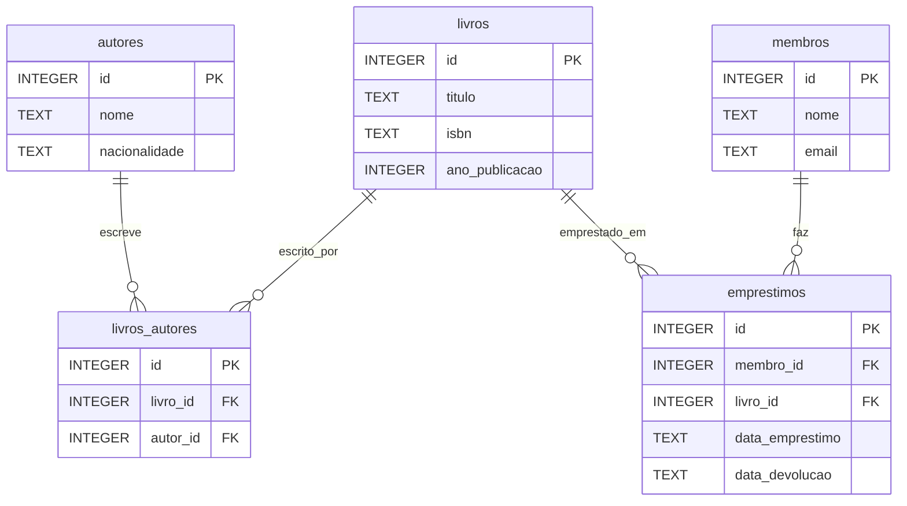

# 8.3 — Exercícios: Modelagem de Dados

[← Voltar ao conteúdo: Modelagem de Dados](cap08-mod03-modelagem-conteudo.md)

---

## Sobre Estes Exercícios

Estes exercícios cobrem o processo completo de modelagem de dados: identificar entidades, definir atributos, mapear relacionamentos, normalizar e desenhar diagramas ER. Modelagem é uma habilidade que se desenvolve com prática — quanto mais sistemas você modelar, melhor fica.

---

## Exercício 1: Modelando um E-commerce de Roupas

Uma loja online de roupas precisa de um sistema que:

- Cadastre produtos (camisetas, calças, vestidos) com nome, descrição e imagem
- Cada produto existe em diferentes tamanhos (P, M, G, GG) e cores, com estoque separado por variação
- Organize produtos em categorias (Masculino, Feminino, Infantil, Acessórios)
- Cadastre clientes com nome, email, telefone e múltiplos endereços de entrega
- Registre pedidos com data, valor total, status e forma de pagamento
- Saiba quais variações de produto cada pedido contém (com quantidade e preço pago)
- Permita que clientes avaliem produtos (nota de 1 a 5 e comentário)

Siga o processo completo de modelagem:

a) Liste todas as entidades identificadas e justifique por que cada uma é uma entidade (e não um atributo).

b) Defina os atributos de cada entidade com tipos de dados (INTEGER, TEXT, REAL).

c) Identifique todos os relacionamentos com cardinalidade (1:1, 1:N, N:M).

d) Defina chaves primárias e estrangeiras.

e) Desenhe o diagrama ER completo em Mermaid.

f) Preencha as tabelas com dados de exemplo (3-5 registros por tabela).

g) Verifique se o modelo responde estas perguntas:
   - "Quais camisetas azuis tamanho M estão em estoque?"
   - "Qual o valor total do pedido #1?"
   - "Qual produto tem a melhor avaliação média?"
   - "Quais são os endereços de entrega do cliente Ana?"

---

## Exercício 2: Identificando Erros de Modelagem

O modelo abaixo foi criado por um desenvolvedor iniciante. Identifique TODOS os erros e proponha correções.

**Tabela: tudo**

| pedido_id | cliente_nome | cliente_email | produto1 | preco1 | qtd1 | produto2 | preco2 | qtd2 | produto3 | preco3 | qtd3 | data | tags | telefones |
|-----------|-------------|---------------|----------|--------|------|----------|--------|------|----------|--------|------|------|------|-----------|
| 1 | Ana | ana@email.com | Arroz | 22.90 | 2 | Feijao | 8.49 | 1 | NULL | NULL | NULL | 01/03/2024 | comida,básico | 11-9999-0001,11-9999-0002 |
| 2 | Bruno | bruno@email.com | Cafe | 12.90 | 3 | NULL | NULL | NULL | NULL | NULL | NULL | 02/03/2024 | bebida | 11-8888-0001 |

Para cada erro encontrado:
a) Descreva o erro e por que é problemático
b) Classifique o tipo de erro (tabela faz tudo, colunas numeradas, campo multivalorado, falta de normalização, formato de data incorreto, etc.)
c) Proponha a correção com o modelo normalizado

---

## Exercício 3: Modelando uma Rede Social

Modele um banco de dados para uma rede social básica onde usuários podem:

- Criar um perfil (nome, bio, foto de perfil, data de cadastro)
- Publicar posts (texto, imagem opcional, data de publicação)
- Seguir outros usuários (quem segue quem)
- Curtir posts de outros usuários
- Comentar em posts (texto, data)
- Responder comentários (comentário dentro de comentário)

a) Identifique todas as entidades e relacionamentos. Atenção especial para:
   - "Seguir" é um relacionamento N:M de usuário consigo mesmo (self-referencing)
   - "Curtir" é um relacionamento N:M entre usuário e post
   - "Responder comentário" cria uma hierarquia (comentário pai → comentário filho)

b) Crie todas as tabelas com atributos e chaves.

c) Desenhe o diagrama ER em Mermaid.

d) Preencha com dados de exemplo que mostrem:
   - Ana segue Bruno e Carla
   - Bruno segue Ana
   - Ana publicou 2 posts
   - Bruno curtiu o post 1 de Ana
   - Carla comentou no post 1 de Ana
   - Ana respondeu o comentário de Carla

e) Explique como o modelo responde: "Quantos seguidores Ana tem?" e "Quais posts Ana curtiu?"

---

## Exercício 4: Decisões de Modelagem

Para cada situação abaixo, tome uma decisão de modelagem e justifique:

a) **Preço no pedido**: um sistema de e-commerce registra pedidos. O preço do produto pode mudar com o tempo (promoções, reajustes). Onde você guarda o preço que o cliente pagou — no produto ou no item do pedido? Por quê?

b) **Endereço do cliente**: um cliente pode ter vários endereços (casa, trabalho, entrega). Você cria uma coluna `endereco` na tabela de clientes ou uma tabela separada `enderecos`? Por quê?

c) **Status do pedido**: um pedido passa por vários status (pendente → pago → preparando → enviado → entregue). Você guarda apenas o status atual ou o histórico completo de mudanças? Como modelaria cada abordagem?

d) **Categorias hierárquicas**: uma loja tem categorias e subcategorias (Eletrônicos → Celulares → Smartphones). Como você modelaria essa hierarquia? Uma tabela com auto-referência (categoria_pai_id) ou tabelas separadas para cada nível?

e) **Soft delete vs hard delete**: quando um cliente pede para "excluir" sua conta, você realmente remove o registro do banco ou apenas marca como inativo? Quais são os prós e contras de cada abordagem?

---

## Exercício 5: Validando um Modelo com Perguntas

Dado o modelo abaixo de um sistema de biblioteca:

Para cada pergunta abaixo, diga se o modelo consegue responder. Se sim, explique como. Se não, proponha a alteração necessária:

a) "Quais livros o membro João tem emprestados agora?"
b) "Qual é o livro mais emprestado de todos os tempos?"
c) "Quais livros foram escritos por autores brasileiros?"
d) "O livro 'Dom Casmurro' está disponível para empréstimo?"
e) "Quanto de multa o membro Maria deve por atrasos?"
f) "Quantos exemplares do livro 'Dom Casmurro' a biblioteca tem?"
g) "Quais livros foram emprestados no mês de março de 2024?"
h) "Qual membro leu mais livros no último ano?"

---

## Exercício 6: Convenções de Nomenclatura

Corrija os nomes das tabelas e colunas abaixo seguindo as convenções apresentadas no módulo:

| Original | Problema | Corrigido |
|----------|----------|-----------|
| `Clientes` | ? | ? |
| `dataCadastro` | ? | ? |
| `Preço` | ? | ? |
| `fk_cli` | ? | ? |
| `ID_DO_PRODUTO` | ? | ? |
| `tel1`, `tel2`, `tel3` | ? | ? |
| `endereço_completo` | ? | ? |
| `15/03/2024` | ? | ? |

---

## Exercício 7: Do Problema ao Modelo (Processo Completo)

Um amigo quer criar um aplicativo para gerenciar campeonatos de futebol amador. Ele descreveu as necessidades assim:

> "Preciso cadastrar os times com nome, escudo e cor do uniforme. Cada time tem jogadores com nome, posição e número da camisa. Um jogador pode jogar em mais de um time (em campeonatos diferentes). Preciso registrar os campeonatos com nome, ano e regulamento. Cada campeonato tem vários jogos, e cada jogo é entre dois times, com data, local, placar e árbitro. Quero saber quem fez gol em cada jogo e em qual minuto."

Siga o processo completo de 8 etapas do módulo:

1. Entender o problema (liste as perguntas que o sistema precisa responder)
2. Identificar entidades
3. Definir atributos
4. Identificar relacionamentos
5. Definir chaves
6. Normalizar
7. Desenhar diagrama ER
8. Validar com exemplos

---

## Exercício 8: Refatorando um Modelo

O modelo abaixo funciona, mas tem problemas de design. Identifique os problemas e proponha melhorias:

**Tabela: pedidos**

| id | cliente_nome | cliente_email | cliente_telefone | produto_nome | produto_preco | produto_categoria | quantidade | data | status |
|----|-------------|---------------|------------------|-------------|---------------|-------------------|------------|------|--------|

Problemas para identificar:
a) Quais dados estão redundantes?
b) Quais anomalias podem ocorrer (inserção, atualização, exclusão)?
c) O que acontece se um cliente fizer 100 pedidos? Quantas vezes o nome dele aparece?
d) O que acontece se quisermos mudar o email de um cliente?
e) Podemos ter um cliente sem pedidos?
f) Podemos ter um produto sem pedidos?

Proponha o modelo normalizado com pelo menos 4 tabelas.

---

## Gabarito Comentado

### Exercício 2 — Identificando Erros

Erros encontrados:

1. **Tabela faz tudo**: todos os dados em uma única tabela. Solução: separar em clientes, produtos, pedidos e itens_pedido.

2. **Colunas numeradas**: `produto1/preco1/qtd1`, `produto2/preco2/qtd2`, `produto3/preco3/qtd3`. Limite artificial de 3 produtos por pedido. Solução: tabela `itens_pedido` com FK para pedido e produto.

3. **Campo multivalorado (tags)**: `"comida,básico"` em um único campo. Impossível buscar por tag específica de forma eficiente. Solução: tabela `tags` + tabela intermediária `pedido_tags`.

4. **Campo multivalorado (telefones)**: `"11-9999-0001,11-9999-0002"` em um campo. Solução: tabela `telefones` com FK para cliente.

5. **Formato de data incorreto**: `01/03/2024` é ambíguo (1 de março ou 3 de janeiro?). Solução: usar formato ISO `2024-03-01`.

6. **Sem chave primária explícita para cliente**: o cliente é identificado pelo nome, que pode se repetir. Solução: tabela `clientes` com `id` auto-incremento.

7. **Sem normalização**: dados do cliente repetidos em cada pedido. Se Ana fizer 50 pedidos, nome e email aparecem 50 vezes.

### Exercício 4 — Decisões de Modelagem

a) **No item do pedido**. O preço que o cliente pagou deve ser preservado. Se guardar apenas no produto, quando o preço mudar, todos os pedidos antigos mostrariam o preço novo — incorreto para contabilidade e relatórios.

b) **Tabela separada `enderecos`** com FK para cliente. Um cliente pode ter vários endereços, e cada endereço tem múltiplos campos (rua, número, bairro, cidade, CEP). Colocar tudo na tabela de clientes limitaria a um endereço ou criaria colunas numeradas.

c) **Depende do requisito**. Se só precisa do status atual: coluna `status` na tabela pedidos. Se precisa do histórico: tabela `historico_status` com pedido_id, status, data_mudanca. O histórico é mais completo mas ocupa mais espaço. Para auditoria e rastreamento, o histórico é preferível.

d) **Auto-referência** (coluna `categoria_pai_id` na mesma tabela). É mais flexível — permite qualquer nível de profundidade sem criar novas tabelas. Tabelas separadas por nível são rígidas e difíceis de manter.

e) **Soft delete** (marcar como inativo) é preferível na maioria dos casos. Prós: mantém histórico, permite auditoria, pedidos antigos continuam referenciando o cliente. Contras: banco cresce mais, queries precisam filtrar inativos. Hard delete é mais simples mas pode causar problemas de integridade referencial.

### Exercício 5 — Validando com Perguntas

a) **Sim** — buscar empréstimos onde `membro_id = João` e `data_devolucao IS NULL`.

b) **Sim** — contar empréstimos agrupados por `livro_id` e ordenar por contagem decrescente.

c) **Sim** — buscar em `livros_autores` JOIN `autores` WHERE `nacionalidade = 'Brasileira'` JOIN `livros`.

d) **Parcialmente** — o modelo não tem campo `disponível` no livro. Seria necessário verificar se existe empréstimo ativo (sem devolução) para esse livro. Melhoria: adicionar coluna `disponível` em livros.

e) **Não** — o modelo não tem campo de multa. Melhoria: adicionar coluna `multa` em empréstimos, ou `data_prevista_devolucao` para calcular atraso.

f) **Não** — o modelo não diferencia exemplares. Um livro com `id = 1` é um título, não um exemplar físico. Melhoria: criar tabela `exemplares` com `livro_id` FK, e empréstimos referenciam `exemplar_id`.

g) **Sim** — buscar empréstimos WHERE `data_emprestimo BETWEEN '2024-03-01' AND '2024-03-31'`.

h) **Sim** — contar empréstimos por `membro_id` WHERE `data_emprestimo` no último ano, ordenar decrescente.

### Exercício 6 — Convenções

| Original | Problema | Corrigido |
|----------|----------|-----------|
| `Clientes` | Maiúscula inicial | `clientes` |
| `dataCadastro` | camelCase | `data_cadastro` |
| `Preço` | Maiúscula e acento | `preco` |
| `fk_cli` | Abreviação obscura | `cliente_id` |
| `ID_DO_PRODUTO` | Maiúsculas, verbose | `produto_id` |
| `tel1`, `tel2`, `tel3` | Colunas numeradas | Tabela `telefones` com FK |
| `endereço_completo` | Acento | `endereco_completo` |
| `15/03/2024` | Formato ambíguo | `2024-03-15` (ISO) |

---

[← Voltar ao conteúdo: Modelagem de Dados](cap08-mod03-modelagem-conteudo.md)
