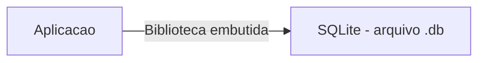
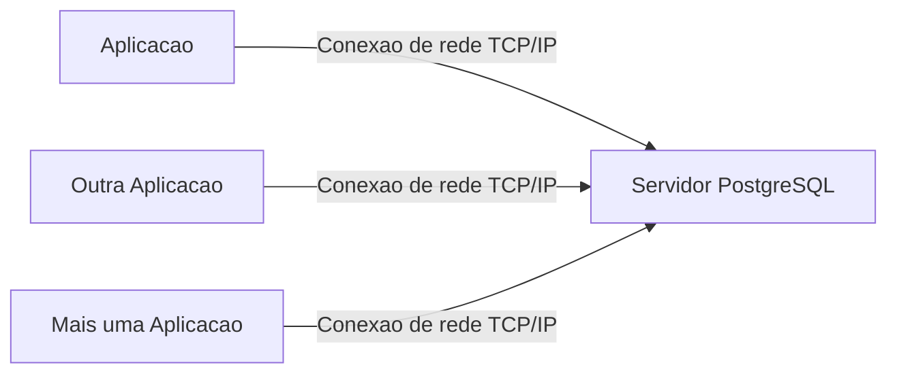
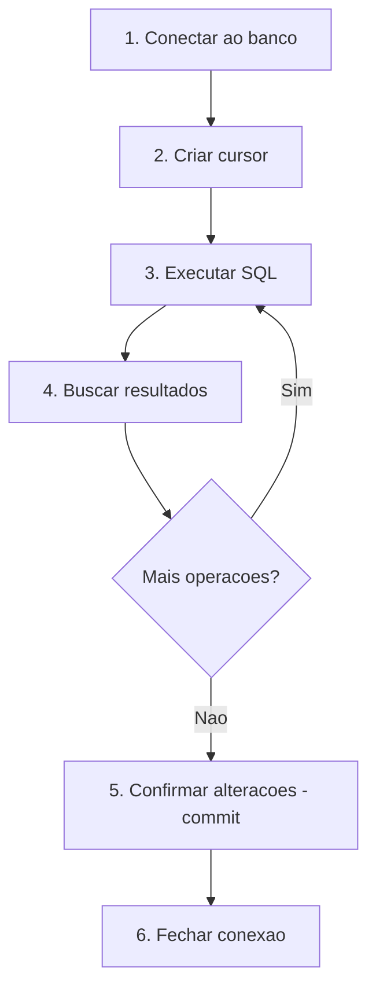

# 8.4 — SQLite e Ambiente: Seu Primeiro Banco de Dados

[← Anterior: Modelagem de Dados](cap08-mod03-modelagem-conteudo.md) · [Próximo: CREATE e INSERT →](cap08-mod05-sql-criar-inserir-conteudo.md)

---

## Introdução

Nos três módulos anteriores, você aprendeu a teoria: o que são bancos de dados, como dados relacionais funcionam e como modelar um banco antes de construí-lo. Agora vamos colocar a mão na massa.

Neste módulo, você vai instalar e configurar o SQLite, criar seu primeiro banco de dados e aprender a usar tanto a ferramenta de linha de comando quanto a biblioteca Python `sqlite3`. A partir daqui, todo módulo terá código para você executar, testar e experimentar.

Escolhemos o **SQLite** por uma razão simples: ele é o banco de dados mais fácil de começar. Não precisa instalar um servidor, não precisa configurar usuários e senhas, não precisa de rede. O SQLite armazena todo o banco em um único arquivo no seu computador. Você cria o arquivo, e pronto — tem um banco de dados funcionando.

Mas não se engane pela simplicidade. O SQLite é usado em produção por empresas gigantes. Ele está embutido em todo celular Android e iPhone (cada app usa SQLite internamente), em todos os navegadores (Chrome, Firefox, Safari usam SQLite para armazenar histórico, cookies e cache), e em milhões de aplicações embarcadas ao redor do mundo. O SQLite é provavelmente o banco de dados mais implantado do planeta — estima-se que existam mais de 1 trilhão de bancos SQLite ativos no mundo.

---

## Como Executar os Exemplos Deste Módulo

A partir deste módulo, você vai precisar do SQLite instalado e do Python 3. Siga as instruções de instalação abaixo antes de continuar.

Para os exemplos de linha de comando:

```bash
# Abrir o SQLite com um banco de dados
sqlite3 meu_banco.db
```

Para os exemplos em Python:

```bash
# Criar pasta para os exemplos
mkdir -p ~/meus-projetos/curso/cap08

# Executar um script Python
python3 nome_exemplo.py
```

---

## O que é SQLite

**SQLite** (pronuncia-se "ess-queue-el-ite" ou "sequel-ite") é um banco de dados relacional que armazena todos os dados em um único arquivo. Foi criado em 2000 por **D. Richard Hipp**, um engenheiro americano que trabalhava em um projeto para a Marinha dos Estados Unidos.

A história é interessante: Hipp estava desenvolvendo um sistema de controle de mísseis para destróieres da Marinha. O sistema usava o banco de dados Informix, que exigia um servidor rodando e um administrador de banco de dados (DBA) para manter. Hipp pensou: "e se o banco de dados não precisasse de servidor? E se fosse apenas uma biblioteca que a aplicação carrega diretamente?" Assim nasceu o SQLite.

### SQLite vs Bancos Cliente-Servidor

A diferença fundamental entre SQLite e bancos como PostgreSQL ou MySQL é a arquitetura:





No SQLite, não existe servidor. A biblioteca SQLite é carregada diretamente pela sua aplicação, e ela lê e escreve no arquivo do banco. No PostgreSQL, existe um servidor rodando separadamente, e as aplicações se conectam a ele pela rede.

| Caracteristica | SQLite | PostgreSQL e MySQL |
|----------------|--------|-------------------|
| Instalacao | Mínima - um arquivo | Instalar e configurar servidor |
| Servidor | Não precisa | Precisa estar rodando |
| Armazenamento | Arquivo único .db | Diretório de dados do servidor |
| Acesso simultaneo | Limitado (1 escritor por vez) | Milhares de conexões simultaneas |
| Tamanho máximo | 281 terabytes (teorico) | Ilimitado (prático) |
| Uso tipico | Apps mobile, desktop, prototipos | Sistemas web, empresariais |
| Performance | Excelente para leitura | Excelente para leitura e escrita |
| Backup | Copiar o arquivo | Ferramentas especificas |
| Preco | Gratuito, dominio público | Gratuito (open source) |

### Quando Usar SQLite

SQLite é ideal para:
- **Aprendizado**: perfeito para aprender SQL sem complicação
- **Protótipos**: testar ideias rapidamente antes de migrar para um banco maior
- **Aplicações desktop**: programas que rodam no computador do usuário
- **Aplicações mobile**: todo app Android e iOS usa SQLite internamente
- **Testes**: bancos de teste que são criados e destruídos rapidamente
- **Dados locais**: configurações, cache, histórico

SQLite NÃO é ideal para:
- **Sistemas web com muitos usuários simultâneos**: o SQLite permite apenas um escritor por vez
- **Dados distribuídos**: o arquivo precisa estar no mesmo computador que a aplicação
- **Volumes muito grandes**: embora suporte terabytes, bancos muito grandes são melhor servidos por PostgreSQL

Para o nosso curso, SQLite é perfeito. E o SQL que você vai aprender funciona em qualquer banco relacional.

---

## Instalando o SQLite

### No Linux (Ubuntu/Debian)

O SQLite geralmente já vem instalado. Para verificar:

```bash
sqlite3 --version
```

Saída esperada (versão pode variar):

```
3.37.2 2022-01-06 13:25:41
```

Se não estiver instalado:

```bash
sudo apt update
sudo apt install sqlite3
```

### No macOS

O SQLite já vem instalado no macOS. Verifique:

```bash
sqlite3 --version
```

### No Windows (WSL)

Se você está usando WSL (Windows Subsystem for Linux), siga as instruções do Linux acima.

### Verificando a Instalação

Após instalar, teste criando um banco temporário:

```bash
# Cria um banco de dados de teste
sqlite3 teste.db "SELECT 'SQLite funcionando!';"
```

Saída esperada:

```
SQLite funcionando!
```

```bash
# Remove o banco de teste
rm teste.db
```

Se você viu "SQLite funcionando!", está tudo pronto.

---

## O Shell Interativo do SQLite

O SQLite tem uma ferramenta de linha de comando chamada `sqlite3` que permite interagir com bancos de dados diretamente no terminal. Vamos explorar:

### Criando e Abrindo um Banco

```bash
# Cria (ou abre) um banco de dados chamado loja.db
sqlite3 loja.db
```

Saída esperada:

```
SQLite version 3.37.2 2022-01-06 13:25:41
Enter ".help" for usage hints.
sqlite>
```

O prompt `sqlite>` indica que você está dentro do shell do SQLite. Tudo que digitar aqui será interpretado como comando SQL ou comando especial do SQLite.

### Comandos Especiais (Dot Commands)

O SQLite tem comandos especiais que começam com ponto (`.`). Eles não são SQL — são comandos do shell do SQLite:

| Comando | O que faz |
|---------|-----------|
| .help | Mostra todos os comandos disponiveis |
| .tables | Lista todas as tabelas do banco |
| .schema | Mostra a estrutura (SQL de criação) de todas as tabelas |
| .schema nome_tabela | Mostra a estrutura de uma tabela específica |
| .headers on | Mostra os nomes das colunas nos resultados |
| .mode column | Formata a saida em colunas alinhadas |
| .mode table | Formata a saida como tabela com bordas |
| .quit | Sai do shell do SQLite |
| .exit | Sai do shell do SQLite (mesmo que .quit) |
| .databases | Mostra os bancos de dados abertos |
| .dump | Exporta todo o banco como comandos SQL |
| .read arquivo.sql | Executa comandos SQL de um arquivo |

Vamos testar alguns:

```bash
sqlite> .headers on
sqlite> .mode column
sqlite> .tables
```

Saída esperada (banco vazio):

```
(nada - o banco ainda nao tem tabelas)
```

### Criando Sua Primeira Tabela

Vamos criar uma tabela simples para testar:

```sql
-- Cria uma tabela de produtos
-- "CREATE TABLE" = criar tabela
-- "id" = identificador, "INTEGER" = numero inteiro
-- "PRIMARY KEY" = chave primaria
-- "AUTOINCREMENT" = incremento automatico
CREATE TABLE produtos (
    id INTEGER PRIMARY KEY AUTOINCREMENT,
    nome TEXT NOT NULL,
    preco REAL NOT NULL
);
```

Saída esperada:

```
(nenhuma saida - significa que funcionou)
```

No SQLite, quando um comando é executado com sucesso e não retorna dados, não há saída. Isso é normal.

Agora vamos verificar:

```sql
sqlite> .tables
```

Saída esperada:

```
produtos
```

```sql
sqlite> .schema produtos
```

Saída esperada:

```
CREATE TABLE produtos (
    id INTEGER PRIMARY KEY AUTOINCREMENT,
    nome TEXT NOT NULL,
    preco REAL NOT NULL
);
```

### Inserindo e Consultando Dados

```sql
-- Insere alguns produtos
-- "INSERT INTO" = inserir em
INSERT INTO produtos (nome, preco) VALUES ('Arroz 5kg', 22.90);
INSERT INTO produtos (nome, preco) VALUES ('Feijao 1kg', 8.49);
INSERT INTO produtos (nome, preco) VALUES ('Cafe 250g', 12.90);

-- Consulta todos os produtos
-- "SELECT" = selecionar, "*" = todas as colunas, "FROM" = de
SELECT * FROM produtos;
```

Saída esperada:

```
id  nome        preco
--  ----------  -----
1   Arroz 5kg   22.9
2   Feijao 1kg  8.49
3   Cafe 250g   12.9
```

Você acabou de criar um banco de dados, uma tabela, inserir dados e consultar — tudo pelo terminal. Nos próximos módulos, vamos aprofundar cada um desses comandos.

### Saindo do Shell

```sql
sqlite> .quit
```

O banco `loja.db` foi salvo automaticamente no diretório onde você executou o comando. Você pode reabri-lo a qualquer momento:

```bash
sqlite3 loja.db
```

E os dados estarão lá — persistência em ação.

---

## SQLite com Python

Agora vamos ao que mais importa para nós: usar SQLite a partir do Python. O módulo `sqlite3` já vem instalado com Python — não precisa instalar nada extra.

### Conexão Básica

```python
# conexao_basica.py
# Demonstra como conectar ao SQLite com Python
# "import" = importar, "sqlite3" = modulo de banco de dados
import sqlite3

# Conecta ao banco (cria o arquivo se nao existir)
# "connect" = conectar, "connection" = conexao
connection = sqlite3.connect("loja.db")

# Cria um cursor para executar comandos SQL
# "cursor" = ponteiro que percorre os resultados
cursor = connection.cursor()

# Executa um comando SQL
# "execute" = executar
cursor.execute("SELECT sqlite_version();")

# Busca o resultado
# "fetchone" = buscar um resultado
version = cursor.fetchone()
print(f"Versao do SQLite: {version[0]}")

# Fecha a conexao
# "close" = fechar
connection.close()
print("Conexao fechada com sucesso!")
```

Saída esperada:

```
Versao do SQLite: 3.37.2
Conexao fechada com sucesso!
```

### Entendendo o Fluxo

O fluxo de trabalho com banco de dados em Python sempre segue estes passos:



1. **Conectar** (`sqlite3.connect()`): abre o arquivo do banco (ou cria se não existir)
2. **Criar cursor** (`connection.cursor()`): o cursor é o objeto que executa comandos SQL
3. **Executar SQL** (`cursor.execute()`): envia um comando SQL para o banco
4. **Buscar resultados** (`cursor.fetchone()` ou `cursor.fetchall()`): recupera os dados retornados
5. **Confirmar** (`connection.commit()`): salva as alterações no disco (para INSERT, UPDATE, DELETE)
6. **Fechar** (`connection.close()`): libera a conexão

### Usando Context Manager (with)

Python tem uma forma mais segura de trabalhar com conexões — o `with` statement. Ele garante que a conexão será fechada mesmo se ocorrer um erro:

```python
# conexao_with.py
# Usando context manager para conexao segura
# "with" garante que a conexao sera fechada automaticamente
import sqlite3

# "with" abre e fecha a conexao automaticamente
with sqlite3.connect("loja.db") as connection:
    cursor = connection.cursor()
    
    # Cria tabela (se nao existir)
    # "IF NOT EXISTS" = se nao existir
    cursor.execute("""
        CREATE TABLE IF NOT EXISTS clientes (
            id INTEGER PRIMARY KEY AUTOINCREMENT,
            nome TEXT NOT NULL,
            email TEXT UNIQUE NOT NULL
        )
    """)
    
    # Insere um cliente
    cursor.execute("""
        INSERT OR IGNORE INTO clientes (nome, email)
        VALUES ('Ana Silva', 'ana@email.com')
    """)
    
    # Confirma as alteracoes
    # "commit" = confirmar, salvar no disco
    connection.commit()
    
    # Consulta os clientes
    cursor.execute("SELECT * FROM clientes")
    
    # Busca todos os resultados
    # "fetchall" = buscar todos
    clients = cursor.fetchall()
    
    print("Clientes cadastrados:")
    for client in clients:
        # Cada resultado e uma tupla (id, nome, email)
        print(f"  ID: {client[0]}, Nome: {client[1]}, Email: {client[2]}")

print("Conexao fechada automaticamente pelo 'with'!")
```

Saída esperada:

```
Clientes cadastrados:
  ID: 1, Nome: Ana Silva, Email: ana@email.com
Conexao fechada automaticamente pelo 'with'!
```

### Métodos de Busca

O cursor tem três métodos para buscar resultados:

| Método | O que faz | Quando usar |
|--------|-----------|-------------|
| fetchone() | Retorna uma linha | Quando espera 1 resultado |
| fetchall() | Retorna todas as linhas como lista | Quando quer todos os resultados |
| fetchmany(n) | Retorna n linhas | Quando quer um lote específico |

```python
# metodos_busca.py
# Demonstra os diferentes metodos de busca
import sqlite3

with sqlite3.connect("loja.db") as conn:
    cursor = conn.cursor()
    
    # Buscar um resultado
    cursor.execute("SELECT * FROM produtos WHERE id = 1")
    one = cursor.fetchone()
    print(f"fetchone(): {one}")
    # Saida: fetchone(): (1, 'Arroz 5kg', 22.9)
    
    # Buscar todos os resultados
    cursor.execute("SELECT * FROM produtos")
    all_products = cursor.fetchall()
    print(f"fetchall(): {all_products}")
    # Saida: fetchall(): [(1, 'Arroz 5kg', 22.9), (2, 'Feijao 1kg', 8.49), ...]
    
    # Buscar 2 resultados
    cursor.execute("SELECT * FROM produtos")
    two = cursor.fetchmany(2)
    print(f"fetchmany(2): {two}")
    # Saida: fetchmany(2): [(1, 'Arroz 5kg', 22.9), (2, 'Feijao 1kg', 8.49)]
```

Saída esperada:

```
fetchone(): (1, 'Arroz 5kg', 22.9)
fetchall(): [(1, 'Arroz 5kg', 22.9), (2, 'Feijao 1kg', 8.49), (3, 'Cafe 250g', 12.9)]
fetchmany(2): [(1, 'Arroz 5kg', 22.9), (2, 'Feijao 1kg', 8.49)]
```

---

## Parâmetros SQL: Evitando SQL Injection

Quando você precisa inserir dados que vêm do usuário (input, formulário, API), NUNCA coloque os valores diretamente na string SQL. Isso abre uma vulnerabilidade grave chamada **SQL Injection**.

### O Problema: SQL Injection

```python
# ERRADO - NUNCA faca isso!
# O usuario pode digitar algo malicioso no campo nome
nome = input("Nome do produto: ")
preco = input("Preco: ")

# Se o usuario digitar: '; DROP TABLE produtos; --
# O SQL vira: INSERT INTO produtos (nome, preco) VALUES (''; DROP TABLE produtos; --', 0)
# Isso APAGA a tabela inteira!
cursor.execute(f"INSERT INTO produtos (nome, preco) VALUES ('{nome}', {preco})")
```

SQL Injection é um dos ataques mais comuns e perigosos em sistemas web. Em 2017, a Equifax (empresa de crédito americana) sofreu um vazamento de dados de 147 milhões de pessoas por causa de uma vulnerabilidade de SQL Injection.

### A Solução: Parâmetros

Use **placeholders** (`?`) e passe os valores como tupla separada:

```python
# parametros_seguros.py
# Demonstra o uso correto de parametros SQL
import sqlite3

with sqlite3.connect("loja.db") as conn:
    cursor = conn.cursor()
    
    # Cria tabela se nao existir
    cursor.execute("""
        CREATE TABLE IF NOT EXISTS produtos (
            id INTEGER PRIMARY KEY AUTOINCREMENT,
            nome TEXT NOT NULL,
            preco REAL NOT NULL
        )
    """)
    
    # CORRETO - usando placeholder ?
    # Os valores sao passados como tupla separada
    nome = "Leite 1L"
    preco = 5.49
    
    cursor.execute(
        "INSERT INTO produtos (nome, preco) VALUES (?, ?)",
        (nome, preco)  # tupla com os valores
    )
    conn.commit()
    
    # Consulta com parametro
    preco_minimo = 10.0
    cursor.execute(
        "SELECT * FROM produtos WHERE preco > ?",
        (preco_minimo,)  # tupla com um elemento (note a virgula)
    )
    
    results = cursor.fetchall()
    print(f"Produtos com preco > R$ {preco_minimo}:")
    for row in results:
        print(f"  {row[1]} - R$ {row[2]:.2f}")
```

Saída esperada:

```
Produtos com preco > R$ 10.0:
  Arroz 5kg - R$ 22.90
  Cafe 250g - R$ 12.90
```

O banco de dados trata os parâmetros como dados puros — nunca como comandos SQL. Mesmo que o usuário digite `'; DROP TABLE produtos; --`, o banco vai tentar inserir essa string literalmente como nome do produto, não vai executar como comando.

| Abordagem | Segurança | Exemplo |
|-----------|-----------|---------|
| String formatada (f-string) | INSEGURO - vulneravel a SQL Injection | f"SELECT * FROM t WHERE id = {user_input}" |
| Concatenacao | INSEGURO - vulneravel a SQL Injection | "SELECT * FROM t WHERE id = " + user_input |
| Placeholder ? | SEGURO - parametros tratados como dados | "SELECT * FROM t WHERE id = ?", (user_input,) |

**Regra de ouro**: sempre use `?` para valores que vêm de fora do seu código. Sempre.

---

## Inserindo Múltiplos Registros

Quando precisa inserir vários registros de uma vez, use `executemany()`:

```python
# inserir_multiplos.py
# Demonstra insercao de multiplos registros
import sqlite3

with sqlite3.connect("loja_nova.db") as conn:
    cursor = conn.cursor()
    
    # Cria tabela
    cursor.execute("""
        CREATE TABLE IF NOT EXISTS produtos (
            id INTEGER PRIMARY KEY AUTOINCREMENT,
            nome TEXT NOT NULL,
            preco REAL NOT NULL,
            categoria TEXT NOT NULL
        )
    """)
    
    # Lista de produtos para inserir
    # Cada tupla tem (nome, preco, categoria)
    products = [
        ("Arroz 5kg", 22.90, "Alimentos"),
        ("Feijao 1kg", 8.49, "Alimentos"),
        ("Cafe 250g", 12.90, "Bebidas"),
        ("Detergente 500ml", 2.99, "Limpeza"),
        ("Sabao em po 1kg", 15.50, "Limpeza"),
        ("Leite 1L", 5.49, "Bebidas"),
        ("Acucar 1kg", 4.99, "Alimentos"),
        ("Oleo 900ml", 7.89, "Alimentos"),
    ]
    
    # Insere todos de uma vez
    # "executemany" = executar muitos
    cursor.executemany(
        "INSERT INTO produtos (nome, preco, categoria) VALUES (?, ?, ?)",
        products
    )
    
    conn.commit()
    print(f"{len(products)} produtos inseridos com sucesso!")
    
    # Verifica
    cursor.execute("SELECT COUNT(*) FROM produtos")
    count = cursor.fetchone()[0]
    print(f"Total de produtos no banco: {count}")
    
    # Lista todos
    cursor.execute("SELECT * FROM produtos")
    for row in cursor.fetchall():
        print(f"  [{row[0]}] {row[1]} - R$ {row[2]:.2f} ({row[3]})")
```

Saída esperada:

```
8 produtos inseridos com sucesso!
Total de produtos no banco: 8
  [1] Arroz 5kg - R$ 22.90 (Alimentos)
  [2] Feijao 1kg - R$ 8.49 (Alimentos)
  [3] Cafe 250g - R$ 12.90 (Bebidas)
  [4] Detergente 500ml - R$ 2.99 (Limpeza)
  [5] Sabao em po 1kg - R$ 15.50 (Limpeza)
  [6] Leite 1L - R$ 5.49 (Bebidas)
  [7] Acucar 1kg - R$ 4.99 (Alimentos)
  [8] Oleo 900ml - R$ 7.89 (Alimentos)
```

---

## Acessando Resultados por Nome de Coluna

Por padrão, os resultados vêm como tuplas, e você acessa por índice: `row[0]`, `row[1]`, `row[2]`. Isso funciona, mas é difícil de ler — você precisa lembrar que `row[0]` é o id, `row[1]` é o nome, etc.

Uma forma melhor é configurar a conexão para retornar resultados como objetos que permitem acesso por nome:

```python
# acesso_por_nome.py
# Demonstra acesso a resultados por nome de coluna
import sqlite3

with sqlite3.connect("loja_nova.db") as conn:
    # Configura para retornar linhas como objetos Row
    # "row_factory" = fabrica de linhas
    conn.row_factory = sqlite3.Row
    cursor = conn.cursor()
    
    cursor.execute("SELECT * FROM produtos WHERE categoria = ?", ("Alimentos",))
    
    products = cursor.fetchall()
    print("Produtos da categoria Alimentos:")
    for product in products:
        # Acesso por nome de coluna - muito mais legivel!
        print(f"  {product['nome']} - R$ {product['preco']:.2f}")
        # Tambem funciona por indice
        # print(f"  {product[1]} - R$ {product[2]:.2f}")
```

Saída esperada:

```
Produtos da categoria Alimentos:
  Arroz 5kg - R$ 22.90
  Feijao 1kg - R$ 8.49
  Acucar 1kg - R$ 4.99
  Oleo 900ml - R$ 7.89
```

`sqlite3.Row` é muito útil porque torna o código mais legível. Em vez de `row[2]` (o que é o campo 2?), você escreve `row['preco']` (claro e óbvio).

---

## O Arquivo do Banco de Dados

O banco SQLite é um arquivo comum no seu sistema de arquivos. Vamos entender como ele funciona:

```bash
# Ver o arquivo do banco
ls -la loja.db
```

Saída esperada:

```
-rw-r--r-- 1 usuario usuario 12288 mar 15 10:30 loja.db
```

O arquivo `loja.db` contém todas as tabelas, dados, índices e metadados do banco. Algumas coisas importantes:

- **Backup**: para fazer backup do banco, basta copiar o arquivo (`cp loja.db loja_backup.db`)
- **Portabilidade**: o arquivo funciona em qualquer sistema operacional — copie de Linux para macOS ou Windows e funciona
- **Tamanho**: o arquivo cresce conforme você adiciona dados e encolhe quando você executa `VACUUM`
- **Exclusão**: para apagar o banco inteiro, basta deletar o arquivo (`rm loja.db`)

### Bancos em Memória

O SQLite também pode criar bancos que existem apenas na memória RAM — sem arquivo no disco:

```python
# banco_em_memoria.py
# Banco de dados que existe apenas na memoria
import sqlite3

# ":memory:" cria um banco temporario na RAM
# Quando a conexao fechar, o banco desaparece
with sqlite3.connect(":memory:") as conn:
    cursor = conn.cursor()
    
    cursor.execute("""
        CREATE TABLE teste (
            id INTEGER PRIMARY KEY,
            valor TEXT
        )
    """)
    
    cursor.execute("INSERT INTO teste (valor) VALUES ('Ola mundo!')")
    conn.commit()
    
    cursor.execute("SELECT * FROM teste")
    print(cursor.fetchone())
    # Saida: (1, 'Ola mundo!')

# Aqui o banco ja nao existe mais - estava so na memoria
print("Banco em memoria foi destruido ao fechar a conexao")
```

Saída esperada:

```
(1, 'Ola mundo!')
Banco em memoria foi destruido ao fechar a conexao
```

Bancos em memória são úteis para testes automatizados — você cria um banco limpo para cada teste e ele desaparece automaticamente.

---

## Reforçando: O Banco como Recurso Externo

Mesmo usando SQLite (que é "apenas um arquivo"), é importante manter a mentalidade de recurso externo. Observe o padrão:

1. Sua aplicação Python **abre uma conexão** com o banco
2. Envia **comandos SQL** através da conexão
3. Recebe **resultados** de volta
4. **Fecha a conexão** quando termina

Esse padrão é idêntico ao que você faria com PostgreSQL ou MySQL — a única diferença é a string de conexão. Em vez de `sqlite3.connect("loja.db")`, seria algo como `psycopg2.connect("host=servidor port=5432 dbname=loja user=admin password=senha")`.

O SQL que você escreve é o mesmo. Os métodos `execute()`, `fetchone()`, `fetchall()` são os mesmos. A lógica é a mesma. Por isso, aprender com SQLite prepara você para qualquer banco relacional.

---

## Como a IA pode te ajudar aqui
**Prompt 1 — Entender erros comuns:**
> "Estou recebendo o erro 'sqlite3.OperationalError: table produtos already exists' no Python. O que está acontecendo e como resolvo?"

**Prompt 2 — Explorar o conceito:**
> "Explique o que cada parte deste código faz: `cursor.execute('SELECT * FROM produtos WHERE preco > ?', (10.0,))`"

**Prompt 3 — Ver exemplos práticos:**
> "Quais são os comandos dot (.) mais úteis do shell do SQLite? Me dê exemplos práticos de cada um."

---

## Casos de Uso no Mundo Real

### Caso 1: WhatsApp e Mensagens Locais

O WhatsApp armazena todas as suas mensagens em um banco SQLite no seu celular. Cada conversa, cada mensagem, cada mídia enviada — tudo está em um arquivo SQLite. Quando você faz backup do WhatsApp, está essencialmente copiando esse arquivo. Quando pesquisa uma mensagem antiga, o WhatsApp faz um SELECT no SQLite local. É por isso que a busca funciona mesmo sem internet.

### Caso 2: Navegadores e Histórico

Chrome, Firefox e Safari usam SQLite para armazenar histórico de navegação, cookies, senhas salvas, favoritos e cache. Cada perfil de navegador tem vários arquivos SQLite. Quando você limpa o histórico, o navegador executa DELETE no SQLite. Quando o navegador sugere URLs enquanto você digita, está fazendo SELECT no histórico SQLite.

### Caso 3: Aplicações Desktop

Muitas aplicações desktop usam SQLite como banco local: Skype, iTunes, Dropbox, Adobe Lightroom. O Lightroom, por exemplo, armazena todo o catálogo de fotos (metadados, edições, coleções) em um arquivo SQLite. Fotógrafos profissionais com catálogos de 100.000+ fotos dependem do SQLite para organizar seu trabalho.

---

## Resumo do Módulo

| Conceito | Definição |
|----------|-----------|
| SQLite | Banco de dados relacional que armazena tudo em um único arquivo |
| sqlite3 (CLI) | Ferramenta de linha de comando para interagir com bancos SQLite |
| sqlite3 (Python) | Módulo Python para acessar bancos SQLite (ja vem instalado) |
| Conexão (connection) | Objeto que representa a ligacao entre a aplicação e o banco |
| Cursor | Objeto que executa comandos SQL e percorre resultados |
| Commit | Confirma alteracoes e salva no disco |
| Placeholder (?) | Marcador seguro para parametros em comandos SQL |
| SQL Injection | Ataque que explora inserção de SQL malicioso via dados do usuario |
| Dot commands | Comandos especiais do shell SQLite que comecam com ponto |
| row_factory | Configuração que permite acessar resultados por nome de coluna |

---

## Glossário do Módulo

| Termo | Definição |
|-------|-----------|
| CLI (Command Line Interface) | Interface de linha de comando |
| Commit | Operação que confirma e salva alteracoes no banco de dados |
| Connection (conexão) | Objeto que representa a ligacao entre aplicação e banco |
| Context manager (with) | Padrão Python que garante liberacao de recursos automaticamente |
| Cursor | Objeto que executa SQL e permite percorrer resultados |
| D. Richard Hipp | Criador do SQLite, engenheiro americano |
| DBA (Database Administrator) | Profissional que administra bancos de dados |
| Dot command | Comando especial do shell SQLite que comeca com ponto |
| executemany | Método para executar o mesmo SQL com multiplos conjuntos de parametros |
| fetchall | Método que retorna todos os resultados de uma consulta |
| fetchmany | Método que retorna um número específico de resultados |
| fetchone | Método que retorna um único resultado |
| Placeholder | Marcador ? usado para parametros seguros em SQL |
| row_factory | Propriedade da conexão que define como resultados são retornados |
| SQL Injection | Ataque de segurança que insere SQL malicioso via dados do usuario |
| SQLite | Banco de dados relacional embutido, armazena dados em arquivo único |
| VACUUM | Comando que compacta o arquivo do banco, recuperando espaco |

---

## Na Cultura Popular

- **Mr. Robot** (série, 2015-2019) — a série mostra vários ataques de hacking, incluindo SQL Injection. Em uma cena, o protagonista Elliot explora vulnerabilidades em sistemas de banco de dados para acessar informações confidenciais. A série é tecnicamente precisa e mostra por que segurança em bancos de dados é tão importante.

---

## Para Saber Mais

- [SQLite Documentation](https://www.sqlite.org/docs.html) — *Documentação oficial do SQLite. Referência completa para todos os comandos e funcionalidades.*

- [SQLBolt](https://sqlbolt.com/) — *Tutorial interativo de SQL. Agora que você tem o SQLite instalado, pode praticar os exercícios do SQLBolt localmente.*

- [DB Fiddle](https://www.db-fiddle.com/) — *Playground SQL no navegador. Útil para testar queries rapidamente sem abrir o terminal.*

- [Curso em Vídeo — MySQL](https://www.youtube.com/playlist?list=PLHz_AreHm4dkBs-795Dsgvau_ekxg8g1r) — *As aulas sobre instalação e primeiros comandos complementam este módulo.*

---

## Perguntas Frequentes (FAQ)

**P: O arquivo .db pode ser aberto por qualquer programa?**
R: Não diretamente. O arquivo .db tem formato binário específico do SQLite. Você precisa do sqlite3 (CLI ou biblioteca) para ler o conteúdo. Existem também ferramentas visuais como DB Browser for SQLite que permitem abrir e explorar o arquivo graficamente.

**P: Posso ter vários bancos SQLite no mesmo projeto?**
R: Sim. Cada arquivo .db é um banco independente. Você pode ter `usuarios.db`, `produtos.db`, `logs.db` — cada um com suas próprias tabelas. Mas geralmente é mais prático ter um único banco com várias tabelas.

**P: O que acontece se dois programas Python abrirem o mesmo arquivo .db?**
R: O SQLite permite múltiplas leituras simultâneas, mas apenas uma escrita por vez. Se dois programas tentarem escrever ao mesmo tempo, um deles receberá um erro "database is locked". Para sistemas com muita escrita simultânea, use PostgreSQL.

**P: Preciso fazer commit depois de SELECT?**
R: Não. Commit é necessário apenas para operações que modificam dados (INSERT, UPDATE, DELETE). SELECT apenas lê dados e não precisa de commit.

**P: O que é a tupla com vírgula `(valor,)` nos parâmetros?**
R: Em Python, `(valor)` é apenas parênteses agrupando uma expressão. Para criar uma tupla com um único elemento, precisa da vírgula: `(valor,)`. Sem a vírgula, o Python não reconhece como tupla e o sqlite3 dá erro.

**P: Posso usar SQLite em produção?**
R: Sim, para casos de uso adequados. Aplicações mobile, desktop, sites com poucos usuários simultâneos — SQLite funciona perfeitamente. O site sqlite.org é servido por SQLite. Mas para sistemas web com muitos usuários, PostgreSQL é mais adequado.

**P: Como vejo o conteúdo do banco sem Python?**
R: Use o shell `sqlite3` no terminal, ou instale o DB Browser for SQLite (ferramenta visual gratuita). No terminal: `sqlite3 loja.db "SELECT * FROM produtos;"`.

**P: O SQLite suporta todos os comandos SQL?**
R: Quase todos. O SQLite suporta a grande maioria do SQL padrão. Algumas funcionalidades avançadas (como ALTER TABLE para remover colunas em versões antigas, ou RIGHT JOIN) têm limitações. Para o nosso curso, tudo que vamos usar é suportado.

---

## Exercícios Práticos

### Exercício 1: Criando Seu Banco

Crie um banco de dados chamado `escola.db` com uma tabela `alunos` contendo: id (PK auto-incremento), nome (TEXT NOT NULL), email (TEXT UNIQUE), idade (INTEGER). Insira 5 alunos e liste todos usando o shell `sqlite3`.

### Exercício 2: Python e SQLite

Escreva um programa Python que:
1. Conecta ao banco `escola.db`
2. Cria a tabela `alunos` (se não existir)
3. Insere 5 alunos usando `executemany()`
4. Lista todos os alunos usando `fetchall()`
5. Busca alunos com idade maior que 20 usando parâmetros seguros

### Exercício 3: Explorando o Shell

Abra o banco `loja_nova.db` no shell sqlite3 e execute:
1. `.tables` — liste as tabelas
2. `.schema produtos` — veja a estrutura
3. `SELECT COUNT(*) FROM produtos;` — conte os registros
4. `SELECT * FROM produtos WHERE preco > 10;` — filtre por preço
5. `.headers on` e `.mode table` — melhore a formatação

---

[← Anterior: Modelagem de Dados](cap08-mod03-modelagem-conteudo.md) · [Próximo: CREATE e INSERT →](cap08-mod05-sql-criar-inserir-conteudo.md)
