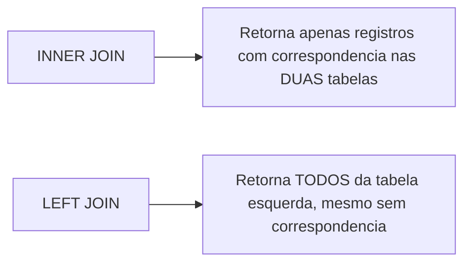

# 8.6 — SELECT e Consultas: Buscando e Filtrando Dados

[← Anterior: CREATE e INSERT](cap08-mod05-sql-criar-inserir-conteudo.md) · [Próximo: UPDATE e DELETE →](cap08-mod07-sql-update-delete-conteudo.md)

---

## Introdução

Nos módulos anteriores, você criou tabelas e inseriu dados. Agora vem a parte mais usada do SQL: buscar dados. O comando **SELECT** é, de longe, o comando SQL mais executado em qualquer sistema. Para cada INSERT ou UPDATE, existem centenas ou milhares de SELECTs. Toda vez que você abre um aplicativo, carrega uma página web ou faz uma pesquisa, dezenas de SELECTs são executados nos bastidores.

SELECT é onde o SQL brilha como linguagem declarativa. Em vez de escrever loops e condicionais para filtrar dados (como faria em Python), você simplesmente descreve o que quer: "me dê todos os produtos com preço maior que 10, ordenados por nome". O banco decide a melhor forma de executar.

Neste módulo, vamos explorar SELECT em profundidade: filtros com WHERE, ordenação com ORDER BY, funções de agregação (COUNT, SUM, AVG), agrupamento com GROUP BY e, finalmente, JOINs — a forma de combinar dados de múltiplas tabelas.

Vamos usar o banco `lanchonete.db` que criamos no módulo anterior. Se você não o criou, execute os scripts `criar_tabelas_lanchonete.py` e `inserir_dados_lanchonete.py` do módulo 8.5.

---

## Como Executar os Exemplos Deste Módulo

Você pode executar os exemplos no shell SQLite ou em Python:

```bash
# No shell SQLite (com formatacao bonita)
sqlite3 lanchonete.db
sqlite> .headers on
sqlite> .mode column
```

```bash
# Em Python
python3 nome_exemplo.py
```

---

## SELECT Básico: Buscando Todos os Dados

A forma mais simples do SELECT busca todas as colunas de todos os registros:

```sql
-- Busca TUDO da tabela produtos
-- "*" significa "todas as colunas"
SELECT * FROM produtos;
```

Saída esperada:

```
id  nome              descricao                       preco   categoria_id  disponivel
--  ----------------  ------------------------------  ------  ------------  ----------
1   X-Burguer         Hamburguer com queijo            18.9   1             1
2   X-Salada          Hamburguer com salada e queijo   21.9   1             1
3   X-Bacon           Hamburguer com bacon e queijo    24.9   1             1
4   X-Tudo            Hamburguer completo              28.9   1             1
5   Coca-Cola 350ml   Refrigerante lata                6.0    2             1
6   Guarana 350ml     Refrigerante lata                5.5    2             1
7   Suco Natural      Suco de laranja natural          8.0    2             0
8   Agua 500ml        Agua mineral sem gas             3.0    2             1
9   Pudim             Pudim de leite condensado        10.0   3             1
10  Sorvete           Sorvete 2 bolas                  12.0   3             1
11  Batata Frita      Porcao de batata frita           15.0   4             1
12  Onion Rings       Aneis de cebola empanados        18.0   4             1
```

### Selecionando Colunas Específicas

Na prática, raramente você precisa de todas as colunas. Especifique apenas as que precisa:

```sql
-- Busca apenas nome e preco
SELECT nome, preco FROM produtos;
```

Saída esperada:

```
nome              preco
----------------  ------
X-Burguer         18.9
X-Salada          21.9
X-Bacon           24.9
X-Tudo            28.9
Coca-Cola 350ml   6.0
Guarana 350ml     5.5
Suco Natural      8.0
Agua 500ml        3.0
Pudim             10.0
Sorvete           12.0
Batata Frita      15.0
Onion Rings       18.0
```

Selecionar apenas as colunas necessárias é uma boa prática — reduz a quantidade de dados transferidos e torna a consulta mais clara.

---

## WHERE: Filtrando Resultados

WHERE é o filtro do SELECT. Ele define condições que os registros devem atender para serem incluídos no resultado.

### Comparações Básicas

```sql
-- Produtos com preco maior que 15
SELECT nome, preco FROM produtos WHERE preco > 15;
```

Saída esperada:

```
nome          preco
------------  ------
X-Burguer     18.9
X-Salada      21.9
X-Bacon       24.9
X-Tudo        28.9
Onion Rings   18.0
```

```sql
-- Produtos da categoria 2 (Bebidas)
SELECT nome, preco FROM produtos WHERE categoria_id = 2;
```

Saída esperada:

```
nome              preco
----------------  ------
Coca-Cola 350ml   6.0
Guarana 350ml     5.5
Suco Natural      8.0
Agua 500ml        3.0
```

### Operadores de Comparação

| Operador | Significado | Exemplo |
|----------|-------------|---------|
| = | Igual | WHERE preco = 10 |
| != ou <> | Diferente | WHERE status != 'cancelado' |
| > | Maior que | WHERE preco > 20 |
| < | Menor que | WHERE preco < 5 |
| >= | Maior ou igual | WHERE quantidade >= 100 |
| <= | Menor ou igual | WHERE preco <= 10 |

### Operadores Lógicos: AND, OR, NOT

```sql
-- Produtos com preco entre 10 e 20 (AND = E)
SELECT nome, preco FROM produtos
WHERE preco >= 10 AND preco <= 20;
```

Saída esperada:

```
nome          preco
------------  ------
X-Burguer     18.9
Pudim         10.0
Sorvete       12.0
Batata Frita  15.0
Onion Rings   18.0
```

```sql
-- Produtos da categoria 1 (Lanches) OU categoria 3 (Sobremesas)
SELECT nome, preco, categoria_id FROM produtos
WHERE categoria_id = 1 OR categoria_id = 3;
```

Saída esperada:

```
nome       preco   categoria_id
---------  ------  ------------
X-Burguer  18.9    1
X-Salada   21.9    1
X-Bacon    24.9    1
X-Tudo     28.9    1
Pudim      10.0    3
Sorvete    12.0    3
```

```sql
-- Produtos que NAO sao da categoria 2
SELECT nome, preco FROM produtos
WHERE NOT categoria_id = 2;
-- Equivalente a: WHERE categoria_id != 2
```

### BETWEEN: Intervalo de Valores

```sql
-- Produtos com preco entre 5 e 15 (inclusive)
SELECT nome, preco FROM produtos
WHERE preco BETWEEN 5 AND 15;
```

Saída esperada:

```
nome              preco
----------------  ------
Coca-Cola 350ml   6.0
Guarana 350ml     5.5
Suco Natural      8.0
Pudim             10.0
Sorvete           12.0
Batata Frita      15.0
```

### IN: Lista de Valores

```sql
-- Produtos das categorias 1 e 3
SELECT nome, preco FROM produtos
WHERE categoria_id IN (1, 3);
-- Equivalente a: WHERE categoria_id = 1 OR categoria_id = 3
```

### LIKE: Busca por Padrão

LIKE permite buscar textos que correspondem a um padrão:
- `%` = qualquer sequência de caracteres (inclusive vazio)
- `_` = exatamente um caractere

```sql
-- Produtos que comecam com "X-"
SELECT nome FROM produtos WHERE nome LIKE 'X-%';
```

Saída esperada:

```
nome
---------
X-Burguer
X-Salada
X-Bacon
X-Tudo
```

```sql
-- Produtos que contem "350ml"
SELECT nome FROM produtos WHERE nome LIKE '%350ml%';
```

Saída esperada:

```
nome
----------------
Coca-Cola 350ml
Guarana 350ml
```

### IS NULL e IS NOT NULL

```sql
-- Clientes sem telefone cadastrado
SELECT nome, email FROM clientes WHERE telefone IS NULL;
```

Saída esperada:

```
nome              email
----------------  -----------------
Carlos Oliveira   carlos@email.com
```

---

## ORDER BY: Ordenando Resultados

ORDER BY define a ordem dos resultados. Sem ORDER BY, a ordem é indefinida — o banco pode retornar em qualquer ordem.

```sql
-- Produtos ordenados por preco (menor para maior)
-- ASC = ascending (crescente) - padrao
SELECT nome, preco FROM produtos ORDER BY preco ASC;
```

Saída esperada:

```
nome              preco
----------------  ------
Agua 500ml        3.0
Guarana 350ml     5.5
Coca-Cola 350ml   6.0
Suco Natural      8.0
Pudim             10.0
Sorvete           12.0
Batata Frita      15.0
Onion Rings       18.0
X-Burguer         18.9
X-Salada          21.9
X-Bacon           24.9
X-Tudo            28.9
```

```sql
-- Produtos ordenados por preco (maior para menor)
-- DESC = descending (decrescente)
SELECT nome, preco FROM produtos ORDER BY preco DESC;
```

```sql
-- Ordenar por categoria, depois por preco dentro de cada categoria
SELECT nome, categoria_id, preco FROM produtos
ORDER BY categoria_id ASC, preco DESC;
```

---

## LIMIT: Limitando Resultados

LIMIT restringe o número de registros retornados:

```sql
-- Os 3 produtos mais caros
SELECT nome, preco FROM produtos ORDER BY preco DESC LIMIT 3;
```

Saída esperada:

```
nome      preco
--------  ------
X-Tudo    28.9
X-Bacon   24.9
X-Salada  21.9
```

```sql
-- Pular os 2 primeiros e pegar os proximos 3 (paginacao)
-- OFFSET = quantos pular
SELECT nome, preco FROM produtos ORDER BY preco DESC LIMIT 3 OFFSET 2;
```

Saída esperada:

```
nome       preco
---------  ------
X-Salada   21.9
X-Burguer  18.9
Onion Rings 18.0
```

LIMIT com OFFSET é a base da **paginação** — quando um site mostra "Página 1 de 10", ele usa LIMIT e OFFSET para buscar apenas os registros daquela página.

---

## Funções de Agregação

Funções de agregação calculam valores a partir de múltiplos registros:

| Função | O que faz | Exemplo |
|--------|-----------|---------|
| COUNT | Conta registros | COUNT(*) |
| SUM | Soma valores | SUM(preco) |
| AVG | Calcula media | AVG(preco) |
| MIN | Menor valor | MIN(preco) |
| MAX | Maior valor | MAX(preco) |

```sql
-- Quantos produtos existem?
SELECT COUNT(*) AS total_produtos FROM produtos;
```

Saída esperada:

```
total_produtos
--------------
12
```

O `AS total_produtos` é um **alias** — dá um nome amigável à coluna do resultado.

```sql
-- Estatisticas de preco
SELECT
    COUNT(*) AS total,
    MIN(preco) AS menor_preco,
    MAX(preco) AS maior_preco,
    AVG(preco) AS preco_medio,
    SUM(preco) AS soma_precos
FROM produtos;
```

Saída esperada:

```
total  menor_preco  maior_preco  preco_medio       soma_precos
-----  -----------  -----------  ----------------  -----------
12     3.0          28.9         14.2583333333333  171.1
```

```sql
-- Quantos produtos disponiveis?
SELECT COUNT(*) AS disponiveis FROM produtos WHERE disponivel = 1;
```

Saída esperada:

```
disponiveis
-----------
11
```

---

## GROUP BY: Agrupando Resultados

GROUP BY agrupa registros que têm o mesmo valor em uma coluna e permite aplicar funções de agregação a cada grupo:

```sql
-- Quantos produtos por categoria?
SELECT categoria_id, COUNT(*) AS total
FROM produtos
GROUP BY categoria_id;
```

Saída esperada:

```
categoria_id  total
------------  -----
1             4
2             4
3             2
4             2
```

```sql
-- Preco medio por categoria
SELECT categoria_id, AVG(preco) AS preco_medio
FROM produtos
GROUP BY categoria_id;
```

Saída esperada:

```
categoria_id  preco_medio
------------  -----------
1             23.65
2             5.625
3             11.0
4             16.5
```

### HAVING: Filtrando Grupos

HAVING é como WHERE, mas para grupos. WHERE filtra registros individuais antes do agrupamento. HAVING filtra grupos depois do agrupamento.

```sql
-- Categorias com mais de 2 produtos
SELECT categoria_id, COUNT(*) AS total
FROM produtos
GROUP BY categoria_id
HAVING total > 2;
```

Saída esperada:

```
categoria_id  total
------------  -----
1             4
2             4
```

| Clausula | Quando filtra | Exemplo |
|----------|--------------|---------|
| WHERE | Antes do agrupamento (registros individuais) | WHERE preco > 10 |
| HAVING | Depois do agrupamento (grupos) | HAVING COUNT(*) > 2 |

---

## JOINs: Combinando Dados de Múltiplas Tabelas

Até agora, todas as consultas buscaram dados de uma única tabela. Mas no mundo real, os dados estão espalhados em várias tabelas relacionadas. Quando você quer "listar produtos com o nome da categoria", precisa combinar dados da tabela `produtos` com dados da tabela `categorias`. Isso é feito com **JOIN**.

JOIN é como cruzar duas planilhas pelo campo em comum. Se a tabela de produtos tem `categoria_id` e a tabela de categorias tem `id`, o JOIN conecta cada produto à sua categoria correspondente.

### INNER JOIN

O INNER JOIN retorna apenas os registros que têm correspondência nas duas tabelas:

```sql
-- Listar produtos com o nome da categoria
SELECT
    produtos.nome AS produto,
    produtos.preco,
    categorias.nome AS categoria
FROM produtos
INNER JOIN categorias ON produtos.categoria_id = categorias.id;
```

Saída esperada:

```
produto           preco   categoria
----------------  ------  ----------
X-Burguer         18.9    Lanches
X-Salada          21.9    Lanches
X-Bacon           24.9    Lanches
X-Tudo            28.9    Lanches
Coca-Cola 350ml   6.0     Bebidas
Guarana 350ml     5.5     Bebidas
Suco Natural      8.0     Bebidas
Agua 500ml        3.0     Bebidas
Pudim             10.0    Sobremesas
Sorvete           12.0    Sobremesas
Batata Frita      15.0    Porcoes
Onion Rings       18.0    Porcoes
```

Agora em vez de ver `categoria_id = 1`, vemos "Lanches". O JOIN conectou cada produto à sua categoria.

Vamos entender a sintaxe:

| Parte | Significado |
|-------|-------------|
| FROM produtos | Tabela principal |
| INNER JOIN categorias | Tabela que queremos combinar |
| ON produtos.categoria_id = categorias.id | Condição de conexão (como as tabelas se relacionam) |
| produtos.nome | Coluna "nome" da tabela "produtos" |
| categorias.nome | Coluna "nome" da tabela "categorias" |
| AS produto | Alias para a coluna no resultado |

### Usando Aliases para Tabelas

Quando os nomes das tabelas são longos, usamos aliases (apelidos) para encurtar:

```sql
-- "p" e alias para produtos, "c" para categorias
SELECT p.nome AS produto, p.preco, c.nome AS categoria
FROM produtos p
INNER JOIN categorias c ON p.categoria_id = c.id
WHERE p.disponivel = 1
ORDER BY c.nome, p.preco;
```

### LEFT JOIN

O LEFT JOIN retorna todos os registros da tabela da esquerda, mesmo que não tenham correspondência na tabela da direita. Quando não há correspondência, os campos da tabela da direita vêm como NULL.

```sql
-- Todos os clientes e seus pedidos (mesmo clientes sem pedidos)
SELECT
    c.nome AS cliente,
    p.id AS pedido_id,
    p.data_pedido,
    p.valor_total
FROM clientes c
LEFT JOIN pedidos p ON c.id = p.cliente_id;
```

Saída esperada:

```
cliente           pedido_id  data_pedido          valor_total
----------------  ---------  -------------------  -----------
Joao Silva        1          2024-03-01 12:30:00  34.9
Maria Santos      2          2024-03-01 13:15:00  27.4
Pedro Lima        3          2024-03-02 19:00:00  49.9
Ana Costa         NULL       NULL                 NULL
Carlos Oliveira   NULL       NULL                 NULL
```

Observe que Ana Costa e Carlos Oliveira aparecem no resultado mesmo sem pedidos — seus campos de pedido são NULL. Com INNER JOIN, eles não apareceriam.



| Tipo de JOIN | O que retorna |
|-------------|---------------|
| INNER JOIN | Apenas registros com correspondencia nas duas tabelas |
| LEFT JOIN | Todos da tabela esquerda + correspondencias da direita (NULL se não houver) |

Para o nosso curso, INNER JOIN e LEFT JOIN são suficientes. Existem outros tipos (RIGHT JOIN, FULL JOIN, CROSS JOIN), mas são menos comuns e o SQLite não suporta todos.

### JOIN com Múltiplas Tabelas

Você pode encadear vários JOINs para combinar 3 ou mais tabelas:

```sql
-- Detalhes completos dos pedidos: cliente, produto, quantidade, preco
SELECT
    c.nome AS cliente,
    ped.id AS pedido,
    ped.data_pedido,
    prod.nome AS produto,
    ip.quantidade,
    ip.preco_unitario,
    (ip.quantidade * ip.preco_unitario) AS subtotal
FROM pedidos ped
INNER JOIN clientes c ON ped.cliente_id = c.id
INNER JOIN itens_pedido ip ON ped.id = ip.pedido_id
INNER JOIN produtos prod ON ip.produto_id = prod.id
ORDER BY ped.id, prod.nome;
```

Saída esperada:

```
cliente       pedido  data_pedido          produto          quantidade  preco_unitario  subtotal
------------  ------  -------------------  ---------------  ----------  --------------  --------
Joao Silva    1       2024-03-01 12:30:00  Coca-Cola 350ml  1           6.0             6.0
Joao Silva    1       2024-03-01 12:30:00  Pudim            1           10.0            10.0
Joao Silva    1       2024-03-01 12:30:00  X-Burguer        1           18.9            18.9
Maria Santos  2       2024-03-01 13:15:00  Guarana 350ml    1           5.5             5.5
Maria Santos  2       2024-03-01 13:15:00  X-Salada         1           21.9            21.9
Pedro Lima    3       2024-03-02 19:00:00  Batata Frita     1           15.0            15.0
Pedro Lima    3       2024-03-02 19:00:00  Coca-Cola 350ml  1           6.0             6.0
Pedro Lima    3       2024-03-02 19:00:00  X-Tudo           1           28.9            28.9
```

Essa consulta combina 4 tabelas (pedidos, clientes, itens_pedido, produtos) para mostrar uma visão completa de cada pedido. É o tipo de consulta que sistemas reais fazem o tempo todo.

---

## SELECT com Python: Exemplo Completo

```python
# consultas_python.py
# Demonstra diversas consultas SELECT com Python
import sqlite3

with sqlite3.connect("lanchonete.db") as conn:
    conn.row_factory = sqlite3.Row
    cursor = conn.cursor()
    
    # 1. Produtos disponiveis ordenados por preco
    print("=== Produtos Disponiveis ===")
    cursor.execute("""
        SELECT p.nome, p.preco, c.nome AS categoria
        FROM produtos p
        INNER JOIN categorias c ON p.categoria_id = c.id
        WHERE p.disponivel = 1
        ORDER BY p.preco
    """)
    for row in cursor.fetchall():
        print(f"  {row['nome']:20s} R$ {row['preco']:6.2f}  ({row['categoria']})")
    
    # 2. Estatisticas por categoria
    print("\n=== Estatisticas por Categoria ===")
    cursor.execute("""
        SELECT c.nome AS categoria,
               COUNT(*) AS total,
               MIN(p.preco) AS menor,
               MAX(p.preco) AS maior,
               ROUND(AVG(p.preco), 2) AS media
        FROM produtos p
        INNER JOIN categorias c ON p.categoria_id = c.id
        GROUP BY c.nome
    """)
    for row in cursor.fetchall():
        print(f"  {row['categoria']:12s} | {row['total']} produtos | "
              f"R$ {row['menor']:.2f} - R$ {row['maior']:.2f} | Media: R$ {row['media']:.2f}")
    
    # 3. Pedidos com valor total
    print("\n=== Pedidos ===")
    cursor.execute("""
        SELECT p.id, c.nome AS cliente, p.data_pedido, p.valor_total, p.status
        FROM pedidos p
        INNER JOIN clientes c ON p.cliente_id = c.id
        ORDER BY p.data_pedido
    """)
    for row in cursor.fetchall():
        print(f"  Pedido #{row['id']} | {row['cliente']:15s} | "
              f"R$ {row['valor_total']:.2f} | {row['status']}")
    
    # 4. Produto mais vendido
    print("\n=== Produto Mais Vendido ===")
    cursor.execute("""
        SELECT prod.nome, SUM(ip.quantidade) AS total_vendido
        FROM itens_pedido ip
        INNER JOIN produtos prod ON ip.produto_id = prod.id
        GROUP BY prod.nome
        ORDER BY total_vendido DESC
        LIMIT 1
    """)
    row = cursor.fetchone()
    print(f"  {row['nome']} - {row['total_vendido']} unidades vendidas")
```

Saída esperada:

```
=== Produtos Disponiveis ===
  Agua 500ml           R$   3.00  (Bebidas)
  Guarana 350ml        R$   5.50  (Bebidas)
  Coca-Cola 350ml      R$   6.00  (Bebidas)
  Pudim                R$  10.00  (Sobremesas)
  Sorvete              R$  12.00  (Sobremesas)
  Batata Frita         R$  15.00  (Porcoes)
  Onion Rings          R$  18.00  (Porcoes)
  X-Burguer            R$  18.90  (Lanches)
  X-Salada             R$  21.90  (Lanches)
  X-Bacon              R$  24.90  (Lanches)
  X-Tudo               R$  28.90  (Lanches)

=== Estatisticas por Categoria ===
  Bebidas      | 4 produtos | R$ 3.00 - R$ 8.00 | Media: R$ 5.63
  Lanches      | 4 produtos | R$ 18.90 - R$ 28.90 | Media: R$ 23.65
  Porcoes      | 2 produtos | R$ 15.00 - R$ 18.00 | Media: R$ 16.50
  Sobremesas   | 2 produtos | R$ 10.00 - R$ 12.00 | Media: R$ 11.00

=== Pedidos ===
  Pedido #1 | Joao Silva      | R$ 34.90 | entregue
  Pedido #2 | Maria Santos    | R$ 27.40 | entregue
  Pedido #3 | Pedro Lima      | R$ 49.90 | pronto

=== Produto Mais Vendido ===
  Coca-Cola 350ml - 2 unidades vendidas
```

---

## A Ordem das Cláusulas SQL

As cláusulas do SELECT devem seguir uma ordem específica:

```sql
SELECT colunas          -- 1. O que buscar
FROM tabela             -- 2. De onde buscar
JOIN outra_tabela ON .. -- 3. Combinar com outras tabelas
WHERE condicao          -- 4. Filtrar registros
GROUP BY coluna         -- 5. Agrupar
HAVING condicao_grupo   -- 6. Filtrar grupos
ORDER BY coluna         -- 7. Ordenar
LIMIT n                 -- 8. Limitar quantidade
```

Nem todas as cláusulas são obrigatórias. Apenas SELECT e FROM são necessários. As demais são opcionais e usadas conforme a necessidade.

---

## Como a IA pode te ajudar aqui
**Prompt 1 — Listar e descobrir:**
> "Preciso de uma query SQL que liste todos os pedidos do mês de março com o nome do cliente e o valor total, ordenados por valor decrescente."

**Prompt 2 — Explorar o conceito:**
> "Explique com um exemplo simples a diferença entre INNER JOIN e LEFT JOIN. Quando eu usaria cada um?"

**Prompt 3 — Pedir ajuda prática:**
> "Tenho esta query [cole a query] que está lenta. Como posso melhorá-la?"

---

## Casos de Uso no Mundo Real

### Caso 1: Feed do Instagram

Quando você abre o Instagram, o app executa queries complexas com múltiplos JOINs: busca posts dos perfis que você segue (JOIN entre seguidores e posts), verifica quais você já curtiu (LEFT JOIN com likes), conta comentários (COUNT com GROUP BY) e ordena por relevância (ORDER BY com algoritmo). Tudo isso em milissegundos.

### Caso 2: Relatórios de Vendas

Empresas usam GROUP BY e funções de agregação diariamente para gerar relatórios: "vendas por mês" (GROUP BY mês), "produto mais vendido" (ORDER BY SUM DESC LIMIT 1), "ticket médio por cliente" (AVG com GROUP BY cliente). Essas consultas são a base de dashboards e business intelligence.

### Caso 3: Busca em E-commerce

Quando você pesquisa "camiseta azul" no Mercado Livre, o sistema executa um SELECT com WHERE usando LIKE para encontrar produtos que correspondem, JOIN com tabela de vendedores para mostrar o nome da loja, ORDER BY por relevância e preço, e LIMIT para paginação. Filtros como "preço entre R$ 50 e R$ 100" são cláusulas WHERE adicionais.

---

## Resumo do Módulo

| Conceito | Definição |
|----------|-----------|
| SELECT | Comando para buscar dados de uma ou mais tabelas |
| WHERE | Filtra registros por condição |
| ORDER BY | Ordena resultados (ASC crescente, DESC decrescente) |
| LIMIT | Limita quantidade de resultados |
| COUNT, SUM, AVG, MIN, MAX | Funções de agregacao |
| GROUP BY | Agrupa registros para aplicar funções de agregacao |
| HAVING | Filtra grupos (como WHERE, mas para grupos) |
| INNER JOIN | Combina tabelas retornando apenas correspondencias |
| LEFT JOIN | Combina tabelas retornando todos da esquerda |
| AS (alias) | Da um nome alternativo a colunas ou tabelas |
| LIKE | Busca por padrão de texto (% e _) |
| BETWEEN | Filtra por intervalo de valores |
| IN | Filtra por lista de valores |
| IS NULL | Verifica se valor e nulo |

---

## Glossário do Módulo

| Termo | Definição |
|-------|-----------|
| Agregacao (aggregation) | Operação que calcula um valor a partir de multiplos registros |
| Alias (AS) | Nome alternativo dado a uma coluna ou tabela no resultado |
| ASC (ascending) | Ordem crescente (menor para maior, A para Z) |
| BETWEEN | Operador que filtra valores dentro de um intervalo |
| DESC (descending) | Ordem decrescente (maior para menor, Z para A) |
| GROUP BY | Clausula que agrupa registros com valores iguais |
| HAVING | Clausula que filtra grupos apos o agrupamento |
| IN | Operador que verifica se um valor esta em uma lista |
| INNER JOIN | Combinacao de tabelas que retorna apenas registros com correspondencia |
| IS NULL | Operador que verifica se um valor e nulo |
| JOIN | Operação que combina dados de duas ou mais tabelas |
| LEFT JOIN | Combinacao que retorna todos da tabela esquerda, com ou sem correspondencia |
| LIKE | Operador de busca por padrão de texto |
| LIMIT | Clausula que restringe o número de resultados |
| OFFSET | Clausula que pula um número de resultados (para paginacao) |
| ORDER BY | Clausula que define a ordem dos resultados |
| Paginacao (pagination) | Técnica de dividir resultados em páginas usando LIMIT e OFFSET |
| ROUND | Função que arredonda um número decimal |
| SELECT | Comando SQL para consultar dados |
| WHERE | Clausula que filtra registros por condição |
| Wildcard (%) | Caractere coringa no LIKE que representa qualquer sequência |

---

## Na Cultura Popular

- **Moneyball — O Homem que Mudou o Jogo** (filme, 2011) — o filme mostra como o time Oakland Athletics usou análise de dados para encontrar jogadores subvalorizados. As consultas que o analista Peter Brand fazia (jogadores com mais de X% de aproveitamento, com salário menor que Y) são essencialmente SELECTs com WHERE, ORDER BY e funções de agregação. A revolução do baseball foi uma revolução de queries.

---

## Para Saber Mais

- [SQLBolt — Lições de SELECT](https://sqlbolt.com/lesson/select_queries_introduction) — *Tutorial interativo progressivo de SELECT, do básico ao avançado.*

- [Select Star SQL](https://selectstarsql.com/) — *Livro interativo que ensina SELECT usando dados reais de casos judiciais.*

- [SQL Murder Mystery](https://mystery.knightlab.com/) — *Resolva um crime usando apenas SELECT. Excelente para praticar JOINs e filtros.*

- [DB Fiddle](https://www.db-fiddle.com/) — *Teste suas queries no navegador sem instalar nada.*

---

## Perguntas Frequentes (FAQ)

**P: SELECT * é ruim?**
R: Para aprendizado e exploração, é prático. Em produção, é melhor especificar as colunas — reduz dados transferidos e torna o código mais claro. Se a tabela ganhar novas colunas, SELECT * pode retornar dados inesperados.

**P: Qual a diferença entre WHERE e HAVING?**
R: WHERE filtra registros individuais antes do agrupamento. HAVING filtra grupos depois do agrupamento. Use WHERE para condições em colunas normais e HAVING para condições em funções de agregação (COUNT, SUM, etc.).

**P: JOIN é lento?**
R: Depende. JOINs em colunas com índices são rápidos. JOINs em tabelas grandes sem índices podem ser lentos. Para o nosso nível, não se preocupe com performance — foque em escrever queries corretas.

**P: Posso fazer JOIN de uma tabela com ela mesma?**
R: Sim, isso se chama self-join. Exemplo: encontrar funcionários que ganham mais que seu gerente (ambos na mesma tabela). Mas é um caso avançado que não vamos cobrir.

**P: O que acontece se eu esquecer a condição ON no JOIN?**
R: Sem ON, o banco faz um CROSS JOIN — combina cada registro de uma tabela com todos os registros da outra. Se cada tabela tem 100 registros, o resultado tem 10.000 linhas. Quase nunca é o que você quer.

**P: Posso usar funções de agregação sem GROUP BY?**
R: Sim. Sem GROUP BY, a função se aplica a todos os registros: `SELECT COUNT(*) FROM produtos` conta todos os produtos. Com GROUP BY, a função se aplica a cada grupo separadamente.

**P: LIKE é case-sensitive?**
R: No SQLite, LIKE é case-insensitive para caracteres ASCII (a-z). `WHERE nome LIKE 'arroz'` encontra "Arroz". Em outros bancos, o comportamento pode variar.

**P: Como faço paginação com LIMIT e OFFSET?**
R: Página 1: `LIMIT 10 OFFSET 0`. Página 2: `LIMIT 10 OFFSET 10`. Página 3: `LIMIT 10 OFFSET 20`. A fórmula é: `OFFSET = (página - 1) * itens_por_pagina`.

---

## Exercícios Práticos

### Exercício 1: Consultas Básicas

Usando o banco `lanchonete.db`, escreva queries para:
a) Listar todos os produtos disponíveis com preço menor que R$ 10
b) Contar quantos clientes estão cadastrados
c) Encontrar o produto mais caro e o mais barato
d) Listar produtos ordenados por nome em ordem alfabética

### Exercício 2: JOINs

Escreva queries que:
a) Listem todos os produtos com o nome da categoria (INNER JOIN)
b) Listem todos os clientes e quantos pedidos cada um fez (LEFT JOIN + COUNT + GROUP BY)
c) Mostrem os itens do pedido #1 com nome do produto e subtotal

### Exercício 3: Relatório Completo

Crie um script Python que gere um "relatório da lanchonete" com:
- Total de produtos cadastrados
- Total de pedidos realizados
- Faturamento total (soma dos valores dos pedidos)
- Produto mais vendido
- Cliente que mais gastou

---

[← Anterior: CREATE e INSERT](cap08-mod05-sql-criar-inserir-conteudo.md) · [Próximo: UPDATE e DELETE →](cap08-mod07-sql-update-delete-conteudo.md)
