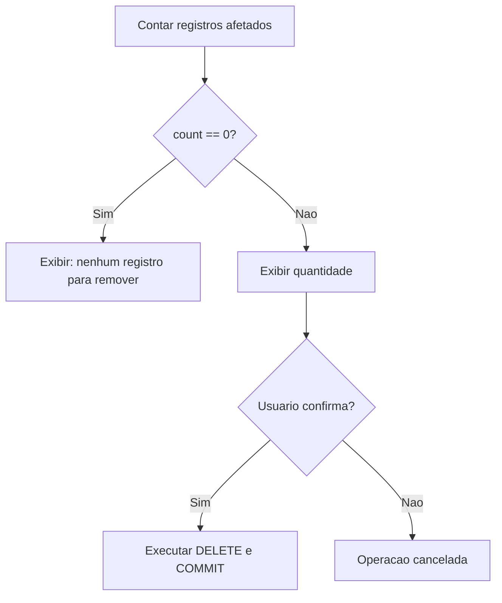

# 8.7 — UPDATE e DELETE: Atualizando e Removendo Dados com Segurança

[← Anterior: SELECT e Consultas](cap08-mod06-sql-select-conteudo.md) · [Próximo: SQL vs NoSQL →](cap08-mod08-sql-vs-nosql-conteudo.md)

---

## Introdução

Nos módulos anteriores, você aprendeu a criar tabelas (CREATE), inserir dados (INSERT) e consultar dados (SELECT). Agora vamos completar o ciclo com os dois comandos que modificam dados existentes: **UPDATE** (atualizar) e **DELETE** (remover).

Esses comandos são poderosos — e perigosos. Um UPDATE sem WHERE atualiza TODOS os registros da tabela. Um DELETE sem WHERE apaga TODOS os registros. Erros com esses comandos podem causar perda de dados irreversível. Por isso, este módulo enfatiza boas práticas de segurança: sempre testar com SELECT antes, sempre usar WHERE, e entender transações.

Pense assim: SELECT é como olhar pela janela — você observa sem mudar nada. INSERT é como colocar um móvel novo na sala. UPDATE é como repintar uma parede — se errar a cor, precisa repintar. DELETE é como demolir uma parede — se demolir a errada, o estrago é grande. Quanto mais destrutiva a operação, mais cuidado ela exige.

---

## Como Executar os Exemplos Deste Módulo

Use o banco `lanchonete.db` dos módulos anteriores:

```bash
# No shell SQLite
sqlite3 lanchonete.db
sqlite> .headers on
sqlite> .mode column
```

```bash
# Em Python
python3 nome_exemplo.py
```

---

## UPDATE: Atualizando Registros

O comando UPDATE modifica valores de registros existentes. A sintaxe:

```sql
-- Sintaxe geral
UPDATE tabela
SET coluna1 = valor1, coluna2 = valor2
WHERE condicao;
```

### Atualizando um Registro Específico

```sql
-- Atualizar o preco do X-Burguer para 19.90
UPDATE produtos
SET preco = 19.90
WHERE id = 1;
```

Saída esperada:

```
(nenhuma saida - atualizacao bem-sucedida)
```

Verificando:

```sql
SELECT nome, preco FROM produtos WHERE id = 1;
```

Saída esperada:

```
nome       preco
---------  ------
X-Burguer  19.9
```

### Atualizando Múltiplos Campos

```sql
-- Atualizar nome e preco do produto 7 (Suco Natural)
-- Tambem tornar disponivel novamente
UPDATE produtos
SET nome = 'Suco de Laranja Natural',
    preco = 9.00,
    disponivel = 1
WHERE id = 7;
```

### Atualizando Múltiplos Registros

```sql
-- Aumentar 10% no preco de todos os lanches (categoria 1)
UPDATE produtos
SET preco = preco * 1.10
WHERE categoria_id = 1;
```

Verificando:

```sql
SELECT nome, preco FROM produtos WHERE categoria_id = 1;
```

Saída esperada:

```
nome       preco
---------  ------
X-Burguer  21.89
X-Salada   24.09
X-Bacon    27.39
X-Tudo     31.79
```

### O PERIGO: UPDATE sem WHERE

```sql
-- CUIDADO! Isso atualiza TODOS os produtos!
-- UPDATE produtos SET preco = 0;
-- Todos os precos viram zero! Desastre!
```

**NUNCA** execute UPDATE sem WHERE, a menos que realmente queira atualizar todos os registros. Essa é a causa número 1 de perda de dados acidental em bancos de dados.

### Boa Prática: Testar com SELECT Antes

Antes de executar um UPDATE, transforme-o em SELECT para ver quais registros serão afetados:

```sql
-- Passo 1: Ver quais registros serao afetados
SELECT nome, preco FROM produtos WHERE categoria_id = 1;

-- Passo 2: Se o resultado estiver correto, executar o UPDATE
UPDATE produtos SET preco = preco * 1.10 WHERE categoria_id = 1;
```

Essa prática simples evita a maioria dos erros. Se o SELECT retornar registros inesperados, você ajusta a condição antes de executar o UPDATE.

---

## DELETE: Removendo Registros

O comando DELETE remove registros de uma tabela. A sintaxe:

```sql
-- Sintaxe geral
DELETE FROM tabela WHERE condicao;
```

### Removendo um Registro Específico

```sql
-- Remover o produto Onion Rings (id = 12)
DELETE FROM produtos WHERE id = 12;
```

Verificando:

```sql
SELECT COUNT(*) FROM produtos;
```

Saída esperada:

```
COUNT(*)
--------
11
```

### Removendo Múltiplos Registros

```sql
-- Remover todos os produtos indisponiveis
DELETE FROM produtos WHERE disponivel = 0;
```

### O PERIGO: DELETE sem WHERE

```sql
-- CUIDADO! Isso apaga TODOS os registros da tabela!
-- DELETE FROM produtos;
-- Tabela fica vazia! Todos os dados perdidos!
```

Assim como UPDATE, **NUNCA** execute DELETE sem WHERE, a menos que realmente queira apagar tudo.

### Boa Prática: Testar com SELECT Antes

```sql
-- Passo 1: Ver quais registros serao removidos
SELECT * FROM produtos WHERE disponivel = 0;

-- Passo 2: Se o resultado estiver correto, executar o DELETE
DELETE FROM produtos WHERE disponivel = 0;
```

### DELETE vs DROP TABLE

| Comando | O que faz |
|---------|-----------|
| DELETE FROM tabela | Remove registros, tabela continua existindo (vazia) |
| DROP TABLE tabela | Remove a tabela inteira (estrutura + dados) |

DELETE remove dados. DROP TABLE remove a tabela. São coisas diferentes.

---

## DELETE e Chaves Estrangeiras

Quando você tenta deletar um registro que é referenciado por outra tabela (via FK), o banco pode reagir de diferentes formas:

```sql
-- Tentar deletar a categoria "Lanches" (id = 1)
-- Mas existem produtos que referenciam essa categoria!
DELETE FROM categorias WHERE id = 1;
```

Com `PRAGMA foreign_keys = ON`, isso gera erro:

```
Error: FOREIGN KEY constraint failed
```

O banco protege a integridade: não permite deletar uma categoria que tem produtos associados. Você precisaria primeiro remover ou reatribuir os produtos dessa categoria.

### Opções de Comportamento (ON DELETE)

Ao criar a tabela, você pode definir o que acontece quando o registro referenciado é deletado:

```sql
-- ON DELETE CASCADE: deleta os registros filhos automaticamente
FOREIGN KEY (categoria_id) REFERENCES categorias(id) ON DELETE CASCADE

-- ON DELETE SET NULL: coloca NULL nos registros filhos
FOREIGN KEY (categoria_id) REFERENCES categorias(id) ON DELETE SET NULL

-- ON DELETE RESTRICT: impede a exclusao (padrao)
FOREIGN KEY (categoria_id) REFERENCES categorias(id) ON DELETE RESTRICT
```

| Opcao | Comportamento |
|-------|--------------|
| RESTRICT (padrão) | Impede a exclusao se existem registros filhos |
| CASCADE | Deleta automaticamente os registros filhos |
| SET NULL | Coloca NULL na FK dos registros filhos |

CASCADE é perigoso — deletar uma categoria pode deletar centenas de produtos automaticamente. Use com cuidado e consciência.

---

## Transações: Tudo ou Nada

Uma **transação** (em inglês, *transaction*) é um grupo de operações que devem ser executadas como uma unidade indivisível. Ou todas acontecem, ou nenhuma acontece.

### Por que Transações Importam

Imagine que você está processando um pedido na lanchonete:
1. Inserir o pedido na tabela `pedidos`
2. Inserir os itens na tabela `itens_pedido`
3. Atualizar o estoque dos produtos

Se o sistema travar entre os passos 2 e 3, você teria um pedido registrado mas o estoque não foi atualizado. Isso é inconsistente. Com transações, se qualquer passo falhar, todos são desfeitos.

### BEGIN, COMMIT e ROLLBACK

```sql
-- Inicia uma transacao
BEGIN TRANSACTION;

-- Executa operacoes
INSERT INTO pedidos (cliente_id, valor_total, status) VALUES (1, 25.90, 'pendente');
INSERT INTO itens_pedido (pedido_id, produto_id, quantidade, preco_unitario) VALUES (4, 1, 1, 19.90);
INSERT INTO itens_pedido (pedido_id, produto_id, quantidade, preco_unitario) VALUES (4, 5, 1, 6.00);

-- Se tudo deu certo, confirma
COMMIT;

-- Se algo deu errado, desfaz tudo
-- ROLLBACK;
```

### Transações em Python

```python
# transacoes_python.py
# Demonstra uso de transacoes em Python
import sqlite3

with sqlite3.connect("lanchonete.db") as conn:
    cursor = conn.cursor()
    cursor.execute("PRAGMA foreign_keys = ON")
    
    try:
        # Inicia transacao (Python faz isso automaticamente com 'with')
        
        # Passo 1: Criar pedido
        cursor.execute("""
            INSERT INTO pedidos (cliente_id, data_pedido, valor_total, status)
            VALUES (?, datetime('now'), ?, ?)
        """, (1, 0, "pendente"))
        
        pedido_id = cursor.lastrowid
        print(f"Pedido #{pedido_id} criado")
        
        # Passo 2: Adicionar itens
        itens = [
            (pedido_id, 1, 2, 19.90),  # 2 X-Burguer
            (pedido_id, 5, 1, 6.00),   # 1 Coca-Cola
        ]
        
        cursor.executemany("""
            INSERT INTO itens_pedido (pedido_id, produto_id, quantidade, preco_unitario)
            VALUES (?, ?, ?, ?)
        """, itens)
        print(f"{len(itens)} itens adicionados")
        
        # Passo 3: Calcular e atualizar valor total
        cursor.execute("""
            SELECT SUM(quantidade * preco_unitario) AS total
            FROM itens_pedido
            WHERE pedido_id = ?
        """, (pedido_id,))
        
        total = cursor.fetchone()[0]
        
        cursor.execute("""
            UPDATE pedidos SET valor_total = ? WHERE id = ?
        """, (total, pedido_id))
        print(f"Valor total atualizado: R$ {total:.2f}")
        
        # Confirma tudo
        conn.commit()
        print("Transacao confirmada com sucesso!")
        
    except Exception as e:
        # Se qualquer erro ocorrer, desfaz tudo
        conn.rollback()
        print(f"ERRO! Transacao desfeita: {e}")
```

Saída esperada:

```
Pedido #4 criado
2 itens adicionados
Valor total atualizado: R$ 45.80
Transacao confirmada com sucesso!
```

Se qualquer operação falhar (por exemplo, um produto_id inválido), o `except` captura o erro e o `rollback()` desfaz todas as operações — o pedido não é criado, os itens não são inseridos. Tudo ou nada.

### Performance com Transações

Transações também melhoram significativamente a performance. Sem transação explícita, cada operação é uma transação individual — o banco escreve no disco a cada INSERT. Com transação, o banco acumula as operações na memória e escreve tudo de uma vez no COMMIT.

```python
# performance_transacao.py
# Demonstra a diferenca de performance com e sem transacao
import sqlite3
import time

# Criar banco de teste
conn = sqlite3.connect(":memory:")
cursor = conn.cursor()
cursor.execute("CREATE TABLE teste (id INTEGER PRIMARY KEY, valor TEXT)")

# Sem transacao explicita: cada INSERT e um commit separado
start = time.time()
for i in range(1000):
    cursor.execute("INSERT INTO teste (valor) VALUES (?)", (f"item_{i}",))
    conn.commit()  # commit a cada insercao
elapsed_slow = time.time() - start

# Limpar tabela
cursor.execute("DELETE FROM teste")

# Com transacao: um unico commit no final
start = time.time()
for i in range(1000):
    cursor.execute("INSERT INTO teste (valor) VALUES (?)", (f"item_{i}",))
conn.commit()  # um unico commit
elapsed_fast = time.time() - start

print(f"Sem transacao: {elapsed_slow:.3f}s para 1000 insercoes")
print(f"Com transacao: {elapsed_fast:.3f}s para 1000 insercoes")
print(f"Transacao foi {elapsed_slow/elapsed_fast:.1f}x mais rapida!")

conn.close()
```

Saída esperada (valores aproximados):

```
Sem transacao: 0.850s para 1000 insercoes
Com transacao: 0.005s para 1000 insercoes
Transacao foi 170.0x mais rapida!
```

A diferença é dramática — centenas de vezes mais rápido. Isso acontece porque cada commit força uma escrita no disco (operação lenta), e agrupar tudo em uma transação reduz para uma única escrita.

---

## Exemplo Completo: CRUD em Python

Vamos juntar tudo em um exemplo que demonstra as 4 operações CRUD (Create, Read, Update, Delete):

```python
# crud_completo.py
# Demonstra todas as operacoes CRUD com Python e SQLite
import sqlite3

def connect():
    """Cria conexao com o banco"""
    conn = sqlite3.connect("lanchonete.db")
    conn.row_factory = sqlite3.Row
    conn.execute("PRAGMA foreign_keys = ON")
    return conn

def create_product(name, price, category_id):
    """Cria um novo produto (CREATE)"""
    with connect() as conn:
        cursor = conn.cursor()
        cursor.execute(
            "INSERT INTO produtos (nome, preco, categoria_id) VALUES (?, ?, ?)",
            (name, price, category_id)
        )
        conn.commit()
        print(f"Produto '{name}' criado com id {cursor.lastrowid}")
        return cursor.lastrowid

def read_products(category_id=None):
    """Lista produtos, opcionalmente filtrados por categoria (READ)"""
    with connect() as conn:
        cursor = conn.cursor()
        if category_id:
            cursor.execute("""
                SELECT p.id, p.nome, p.preco, c.nome AS categoria
                FROM produtos p
                INNER JOIN categorias c ON p.categoria_id = c.id
                WHERE p.categoria_id = ?
                ORDER BY p.nome
            """, (category_id,))
        else:
            cursor.execute("""
                SELECT p.id, p.nome, p.preco, c.nome AS categoria
                FROM produtos p
                INNER JOIN categorias c ON p.categoria_id = c.id
                ORDER BY p.nome
            """)
        
        products = cursor.fetchall()
        for p in products:
            print(f"  [{p['id']:2d}] {p['nome']:20s} R$ {p['preco']:6.2f}  ({p['categoria']})")
        return products

def update_product(product_id, price):
    """Atualiza o preco de um produto (UPDATE)"""
    with connect() as conn:
        cursor = conn.cursor()
        # Verifica se o produto existe
        cursor.execute("SELECT nome FROM produtos WHERE id = ?", (product_id,))
        product = cursor.fetchone()
        if not product:
            print(f"Produto #{product_id} nao encontrado!")
            return False
        
        cursor.execute(
            "UPDATE produtos SET preco = ? WHERE id = ?",
            (price, product_id)
        )
        conn.commit()
        print(f"Produto '{product['nome']}' atualizado para R$ {price:.2f}")
        return True

def delete_product(product_id):
    """Remove um produto (DELETE)"""
    with connect() as conn:
        cursor = conn.cursor()
        # Verifica se o produto existe
        cursor.execute("SELECT nome FROM produtos WHERE id = ?", (product_id,))
        product = cursor.fetchone()
        if not product:
            print(f"Produto #{product_id} nao encontrado!")
            return False
        
        try:
            cursor.execute("DELETE FROM produtos WHERE id = ?", (product_id,))
            conn.commit()
            print(f"Produto '{product['nome']}' removido com sucesso!")
            return True
        except sqlite3.IntegrityError:
            print(f"Nao foi possivel remover '{product['nome']}' - existem pedidos associados")
            return False

# --- Demonstracao ---
print("=== CRUD Completo ===\n")

print("1. CREATE - Criando produto:")
new_id = create_product("Milkshake", 14.90, 2)

print("\n2. READ - Listando bebidas:")
read_products(category_id=2)

print("\n3. UPDATE - Atualizando preco:")
update_product(new_id, 16.90)

print("\n4. READ - Verificando atualizacao:")
read_products(category_id=2)

print("\n5. DELETE - Removendo produto:")
delete_product(new_id)

print("\n6. READ - Verificando remocao:")
read_products(category_id=2)
```

Saída esperada:

```
=== CRUD Completo ===

1. CREATE - Criando produto:
Produto 'Milkshake' criado com id 13

2. READ - Listando bebidas:
  [ 8] Agua 500ml           R$   3.00  (Bebidas)
  [ 5] Coca-Cola 350ml      R$   6.00  (Bebidas)
  [ 6] Guarana 350ml        R$   5.50  (Bebidas)
  [13] Milkshake            R$  14.90  (Bebidas)
  [ 7] Suco de Laranja Natural R$   9.00  (Bebidas)

3. UPDATE - Atualizando preco:
Produto 'Milkshake' atualizado para R$ 16.90

4. READ - Verificando atualizacao:
  [ 8] Agua 500ml           R$   3.00  (Bebidas)
  [ 5] Coca-Cola 350ml      R$   6.00  (Bebidas)
  [ 6] Guarana 350ml        R$   5.50  (Bebidas)
  [13] Milkshake            R$  16.90  (Bebidas)
  [ 7] Suco de Laranja Natural R$   9.00  (Bebidas)

5. DELETE - Removendo produto:
Produto 'Milkshake' removido com sucesso!

6. READ - Verificando remocao:
  [ 8] Agua 500ml           R$   3.00  (Bebidas)
  [ 5] Coca-Cola 350ml      R$   6.00  (Bebidas)
  [ 6] Guarana 350ml        R$   5.50  (Bebidas)
  [ 7] Suco de Laranja Natural R$   9.00  (Bebidas)
```

Esse padrão — funções separadas para cada operação CRUD — é a base de como sistemas reais são organizados. No capítulo 10 (Arquitetura), vamos ver como estruturar isso em camadas.

---

## Boas Práticas de Segurança

### Padrão "SELECT Primeiro"

Este é o padrão mais importante deste módulo. Antes de qualquer UPDATE ou DELETE, converta o comando em SELECT para visualizar os registros afetados:

```sql
-- Quero atualizar precos da categoria Lanches
-- Passo 1: VER quais registros serao afetados
SELECT nome, preco FROM produtos WHERE categoria_id = 1;

-- Resultado: 4 produtos (X-Burguer, X-Salada, X-Bacon, X-Tudo)
-- Parece correto? Sim!

-- Passo 2: EXECUTAR o UPDATE
UPDATE produtos SET preco = preco * 1.10 WHERE categoria_id = 1;

-- Passo 3: VERIFICAR o resultado
SELECT nome, preco FROM produtos WHERE categoria_id = 1;
```

Esse padrão de três passos (ver → executar → verificar) deve se tornar automático. Profissionais experientes fazem isso instintivamente.

### Contando Antes de Deletar

Outra prática útil é contar quantos registros serão afetados:

O fluxo de decisao para deletar com seguranca segue esta logica:



```python
# contar_antes_de_deletar.py
# Demonstra a pratica de contar antes de deletar
import sqlite3

with sqlite3.connect("lanchonete.db") as conn:
    cursor = conn.cursor()
    
    # Contar quantos registros serao afetados
    cursor.execute("SELECT COUNT(*) FROM produtos WHERE disponivel = 0")
    count = cursor.fetchone()[0]
    
    if count == 0:
        print("Nenhum produto indisponivel para remover.")
    else:
        print(f"Serao removidos {count} produto(s) indisponivel(is).")
        # Em um sistema real, pediria confirmacao do usuario
        confirm = input("Confirma? (s/n): ")
        if confirm.lower() == "s":
            cursor.execute("DELETE FROM produtos WHERE disponivel = 0")
            conn.commit()
            print(f"{count} produto(s) removido(s).")
        else:
            print("Operacao cancelada.")
```

Saída esperada:

```
Serao removidos 1 produto(s) indisponivel(is).
Confirma? (s/n): s
1 produto(s) removido(s).
```

### Usando rowcount para Verificar

O cursor tem uma propriedade `rowcount` que indica quantos registros foram afetados pela última operação:

```python
# rowcount_exemplo.py
import sqlite3

with sqlite3.connect("lanchonete.db") as conn:
    cursor = conn.cursor()
    
    cursor.execute(
        "UPDATE produtos SET preco = preco * 1.05 WHERE categoria_id = ?",
        (2,)
    )
    
    print(f"Registros atualizados: {cursor.rowcount}")
    conn.commit()
```

Saída esperada:

```
Registros atualizados: 4
```

Se `rowcount` for 0, nenhum registro foi afetado — pode indicar que a condição WHERE não encontrou correspondências.

### Tabela de Boas Práticas

| Prática | Por que |
|---------|---------|
| Sempre usar WHERE em UPDATE e DELETE | Evita modificar ou apagar todos os registros |
| Testar com SELECT antes | Verifica quais registros serao afetados |
| Usar transações | Garante que operações relacionadas são atomicas |
| Usar parametros (?) | Previne SQL Injection |
| Fazer backup antes de operações em massa | Permite recuperar dados em caso de erro |
| Verificar se o registro existe antes de modificar | Evita erros silenciosos |
| Ativar PRAGMA foreign_keys | Garante integridade referencial |
| Verificar rowcount apos operação | Confirma que o número esperado de registros foi afetado |
| Contar antes de deletar em massa | Evita surpresas com DELETE que afeta mais registros que o esperado |

---

## Como a IA pode te ajudar aqui
**Prompt 1 — Explorar o conceito:**
> "Explique com um exemplo prático por que transações são importantes. O que acontece se o sistema travar no meio de uma transferência bancária sem transação?"

**Prompt 2 — Listar e descobrir:**
> "Vou executar este UPDATE [cole a query]. Está correto? Quais registros serão afetados?"

**Prompt 3 — Boas práticas:**
> "Quais são as melhores práticas para fazer DELETE em massa em um banco de produção? Como faço backup antes?"

---

## Casos de Uso no Mundo Real

### Caso 1: Atualização de Preços em E-commerce

Quando o Mercado Livre faz uma promoção de Black Friday, milhares de produtos precisam ter seus preços atualizados simultaneamente. Isso é feito com UPDATE em massa dentro de uma transação: se qualquer atualização falhar, todas são desfeitas. Imagine o caos se metade dos preços fosse atualizada e a outra metade não.

### Caso 2: LGPD e Exclusão de Dados

A Lei Geral de Proteção de Dados (LGPD) dá ao cidadão o direito de pedir a exclusão dos seus dados pessoais. Quando alguém solicita isso, a empresa precisa executar DELETEs em todas as tabelas que contêm dados dessa pessoa — cadastro, pedidos, endereços, histórico. Isso precisa ser feito com cuidado para não violar chaves estrangeiras e não apagar dados de outros usuários.

### Caso 3: Soft Delete em Redes Sociais

Quando você "deleta" um post no Instagram ou Facebook, ele não é realmente removido do banco. Em vez de DELETE, o sistema faz UPDATE para marcar o post como "deletado" (soft delete). O post continua existindo no banco mas não aparece mais para os usuários. Isso permite recuperação (se você mudar de ideia) e auditoria (se houver investigação legal).

---

## Resumo do Módulo

| Conceito | Definição |
|----------|-----------|
| UPDATE | Comando SQL para modificar registros existentes |
| DELETE | Comando SQL para remover registros |
| WHERE (em UPDATE/DELETE) | Filtro que define quais registros serao afetados |
| Transação (transaction) | Grupo de operações executadas como tudo ou nada |
| BEGIN | Inicia uma transação |
| COMMIT | Confirma e salva todas as operações da transação |
| ROLLBACK | Desfaz todas as operações da transação |
| ON DELETE CASCADE | Remove registros filhos automaticamente |
| ON DELETE RESTRICT | Impede exclusao se existem registros filhos |
| Soft delete | Marcar como deletado em vez de remover fisicamente |

---

## Glossário do Módulo

| Termo | Definição |
|-------|-----------|
| BEGIN TRANSACTION | Comando que inicia uma transação explicita |
| CASCADE | Opcao que propaga operações para registros relacionados |
| COMMIT | Comando que confirma e salva as alteracoes de uma transação |
| CRUD | Create, Read, Update, Delete - as quatro operações básicas de dados |
| DELETE | Comando SQL para remover registros de uma tabela |
| LGPD | Lei Geral de Proteção de Dados - lei brasileira de privacidade |
| ON DELETE | Clausula que define comportamento ao deletar registro referenciado |
| RESTRICT | Opcao que impede operação se existem registros dependentes |
| ROLLBACK | Comando que desfaz todas as alteracoes de uma transação |
| SET NULL | Opcao que coloca NULL em FKs quando registro referenciado e deletado |
| Soft delete | Técnica de marcar registros como inativos em vez de remove-los |
| Transação (transaction) | Unidade atomica de trabalho - tudo ou nada |
| UPDATE | Comando SQL para modificar valores de registros existentes |

---

## Na Cultura Popular

- **Mr. Robot** (série, 2015-2019) — em um dos episódios mais tensos, o grupo de hackers planeja apagar registros de dívidas de milhões de pessoas de um banco de dados financeiro. A operação envolve DELETEs massivos em tabelas de transações. A série mostra realisticamente o impacto devastador que operações de DELETE podem ter quando executadas em bancos de dados críticos.

---

## Para Saber Mais

- [SQLBolt — Lições de UPDATE e DELETE](https://sqlbolt.com/lesson/updating_rows) — *Tutorial interativo para praticar UPDATE e DELETE com segurança.*

- [SQLite Documentation — Transactions](https://www.sqlite.org/lang_transaction.html) — *Documentação oficial sobre transações no SQLite.*

- [Curso em Vídeo — MySQL](https://www.youtube.com/playlist?list=PLHz_AreHm4dkBs-795Dsgvau_ekxg8g1r) — *Aulas sobre UPDATE, DELETE e transações em português.*

- [Select Star SQL](https://selectstarsql.com/) — *Livro interativo com exercícios que envolvem consultas complexas.*

---

## Perguntas Frequentes (FAQ)

**P: Posso desfazer um DELETE depois do COMMIT?**
R: Não. Depois do COMMIT, a operação é permanente. Por isso é tão importante testar com SELECT antes e usar transações. Em sistemas profissionais, backups regulares permitem restaurar dados perdidos.

**P: O que é "soft delete" e quando usar?**
R: Soft delete é marcar um registro como inativo (ex: `ativo = 0`) em vez de removê-lo fisicamente. Use quando precisa manter histórico, permitir recuperação ou atender requisitos legais. A desvantagem é que o banco acumula registros "mortos".

**P: UPDATE pode mudar a chave primária?**
R: Tecnicamente sim, mas é fortemente desaconselhado. Mudar a PK pode quebrar referências de chaves estrangeiras em outras tabelas. Se precisar, use transações e atualize todas as referências.

**P: Como faço backup do banco SQLite antes de um DELETE grande?**
R: Copie o arquivo: `cp lanchonete.db lanchonete_backup.db`. Se algo der errado, restaure: `cp lanchonete_backup.db lanchonete.db`. Simples e eficaz.

**P: DELETE FROM tabela é o mesmo que TRUNCATE TABLE?**
R: São similares (ambos removem todos os registros), mas TRUNCATE é mais rápido porque não registra cada exclusão individualmente. O SQLite não tem TRUNCATE — use DELETE FROM tabela.

**P: Transações afetam performance?**
R: Sim, positivamente. Sem transação explícita, cada INSERT/UPDATE/DELETE é uma transação individual (auto-commit). Agrupar muitas operações em uma transação é muito mais rápido porque o banco faz apenas uma escrita no disco no final.

**P: O que acontece se eu não fizer COMMIT nem ROLLBACK?**
R: Depende. Em Python com `with`, o commit é feito automaticamente se não houver erro. No shell SQLite, se você fechar sem COMMIT, as alterações são perdidas (ROLLBACK implícito).

**P: Posso fazer UPDATE com JOIN?**
R: No SQLite, não diretamente. Mas você pode usar subqueries: `UPDATE produtos SET preco = preco * 1.1 WHERE categoria_id = (SELECT id FROM categorias WHERE nome = 'Lanches')`.

---

## Exercícios Práticos

### Exercício 1: Operações Básicas

Usando o banco `lanchonete.db`:
a) Atualize o preço de todos os produtos da categoria "Bebidas" com aumento de 15%
b) Marque o produto "Suco de Laranja Natural" como indisponível (disponível = 0)
c) Remova todos os produtos indisponíveis
d) Antes de cada operação, use SELECT para verificar quais registros serão afetados

### Exercício 2: Transações

Escreva um programa Python que:
1. Inicia uma transação
2. Cria um novo pedido para o cliente 2
3. Adiciona 3 itens ao pedido
4. Calcula e atualiza o valor total
5. Confirma a transação
6. Se qualquer passo falhar, faz rollback

### Exercício 3: CRUD Completo

Crie um programa Python com menu interativo que permita:
- [1] Listar produtos
- [2] Adicionar produto
- [3] Atualizar preço
- [4] Remover produto
- [0] Sair

Use funções separadas para cada operação e parâmetros seguros (?).

---

[← Anterior: SELECT e Consultas](cap08-mod06-sql-select-conteudo.md) · [Próximo: SQL vs NoSQL →](cap08-mod08-sql-vs-nosql-conteudo.md)
