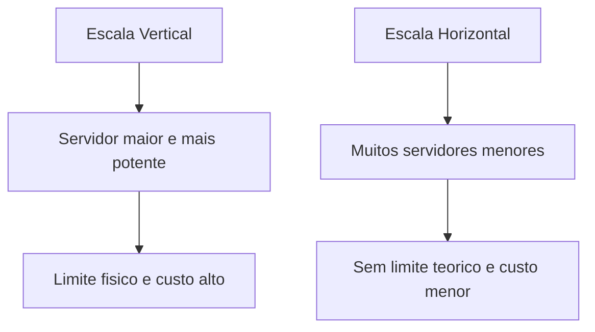
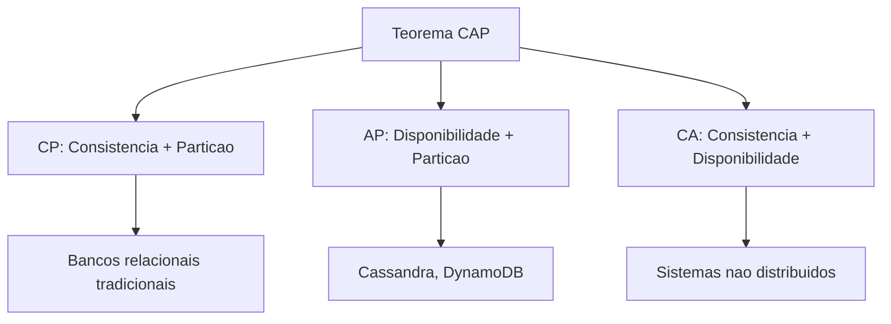
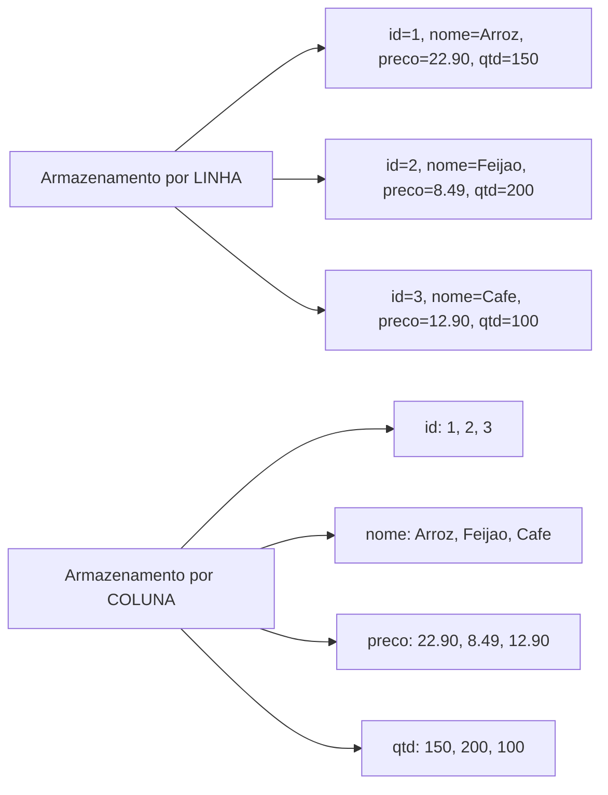
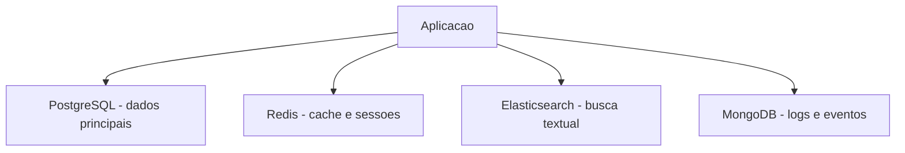
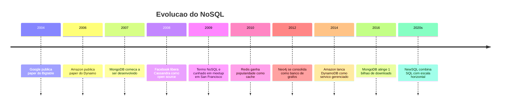
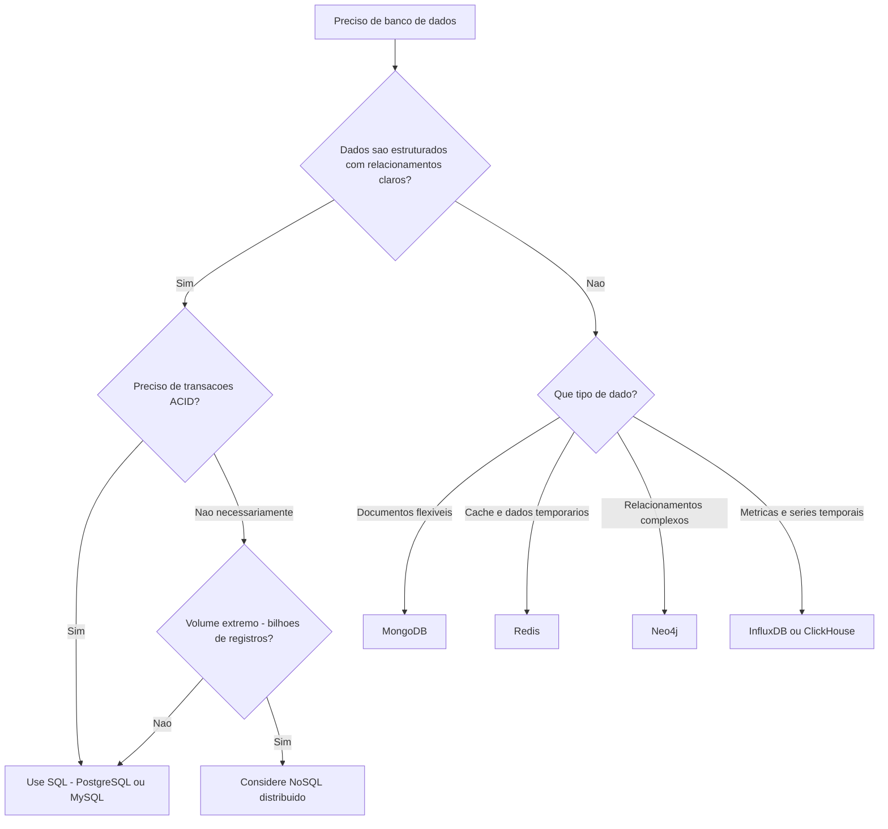

# 8.8 — SQL vs NoSQL: Quando Usar Cada Um

[← Anterior: UPDATE e DELETE](cap08-mod07-sql-update-delete-conteudo.md) · [Próximo: Projeto CRUD →](cap08-mod09-projeto-crud-conteudo.md)

---

## Introdução

Nos módulos anteriores, você aprendeu a trabalhar com bancos de dados relacionais — tabelas, SQL, chaves, JOINs, transações. Tudo isso faz parte do mundo **SQL** (bancos relacionais). Mas no módulo 8.1, mencionamos que existem outros tipos de bancos: documentos, chave-valor, grafos, colunares. Esses bancos fazem parte do mundo **NoSQL**.

Neste módulo, vamos entender o que é NoSQL, por que surgiu, como funciona cada tipo e, mais importante, quando usar SQL e quando usar NoSQL. Não vamos implementar nada em NoSQL — o objetivo é conceitual. Você precisa saber que essas alternativas existem e entender quando cada uma faz sentido, porque na sua carreira vai encontrar ambas.

A resposta curta para "SQL ou NoSQL?" é: depende do problema. Não existe "melhor" — existe "mais adequado para este caso". Um martelo é ótimo para pregos, mas péssimo para parafusos. SQL é ótimo para dados estruturados com relacionamentos. NoSQL é ótimo para dados flexíveis em grande escala. Saber escolher a ferramenta certa é uma das habilidades mais valiosas de um desenvolvedor.

---

## Por que NoSQL Surgiu

O modelo relacional dominou o mundo dos bancos de dados por décadas. De 1970 até o início dos anos 2000, praticamente todo sistema usava bancos SQL. E funcionava muito bem — para os volumes de dados da época.

Então a internet explodiu.

No início dos anos 2000, empresas como Google, Amazon e Facebook enfrentaram um problema que nenhum banco relacional conseguia resolver: **escala massiva**. O Google precisava indexar bilhões de páginas web. O Facebook armazenava bilhões de posts, fotos e interações. A Amazon processava milhões de transações por segundo na Black Friday.

Bancos relacionais tradicionais escalam **verticalmente** — você compra um servidor mais potente (mais CPU, mais RAM, mais disco). Mas existe um limite físico para o quão potente um servidor pode ser. E servidores muito potentes são extremamente caros.

A alternativa é escalar **horizontalmente** — distribuir os dados entre muitos servidores menores e mais baratos. Em vez de um servidor gigante, usar 100 servidores pequenos. Mas bancos relacionais não foram projetados para isso — JOINs entre tabelas que estão em servidores diferentes são extremamente lentos, e manter transações ACID entre múltiplos servidores é muito complexo.



Para resolver isso, essas empresas criaram seus próprios bancos de dados, otimizados para escala horizontal:

- **Google**: criou o Bigtable (2004) — banco colunar distribuído
- **Amazon**: criou o Dynamo (2007) — banco chave-valor distribuído
- **Facebook**: contribuiu para o Cassandra (2008) — banco colunar distribuído

Esses bancos abriram mão de algumas garantias do modelo relacional (como JOINs e transações ACID completas) em troca de escala e performance. O termo "NoSQL" surgiu em 2009 para descrever essa nova categoria de bancos.

### O que NoSQL Significa

NoSQL originalmente significava "No SQL" (sem SQL), mas hoje é interpretado como "Not Only SQL" (não apenas SQL). A ideia não é substituir bancos relacionais, mas complementá-los — usar a ferramenta certa para cada problema.

---

## O Teorema CAP

Para entender as diferenças entre SQL e NoSQL, precisamos conhecer o **Teorema CAP**, proposto por Eric Brewer em 2000. Ele diz que um sistema distribuído pode garantir no máximo duas das três propriedades:

- **C — Consistência** (Consistency): todos os nós veem os mesmos dados ao mesmo tempo
- **A — Disponibilidade** (Availability): toda requisição recebe uma resposta, mesmo que alguns nós estejam fora
- **P — Tolerância a Partição** (Partition Tolerance): o sistema continua funcionando mesmo que a comunicação entre nós falhe



Na prática, como falhas de rede são inevitáveis em sistemas distribuídos, a escolha real é entre **CP** (consistência + tolerância a partição) e **AP** (disponibilidade + tolerância a partição):

- **Bancos SQL** geralmente escolhem CP: preferem consistência (dados sempre corretos) mesmo que isso signifique ficar indisponível durante uma falha de rede
- **Bancos NoSQL** geralmente escolhem AP: preferem disponibilidade (sempre responder) mesmo que os dados possam estar temporariamente desatualizados

| Escolha | Prioridade | Exemplo | Cenário |
|---------|-----------|---------|---------|
| CP | Dados corretos sempre | PostgreSQL, MongoDB (config padrão) | Banco financeiro - saldo deve estar correto |
| AP | Sempre disponível | Cassandra, DynamoDB | Rede social - melhor mostrar post antigo que não mostrar nada |

---

## Tipos de Bancos NoSQL em Profundidade

### 1. Bancos de Documentos

Armazenam dados como **documentos** — geralmente em formato JSON (ou BSON, uma versão binária do JSON). Cada documento é auto-contido e pode ter estrutura diferente dos outros documentos na mesma coleção.

**Exemplo: MongoDB**

Em vez de tabelas com linhas e colunas, você tem coleções com documentos:

```json
// Colecao: produtos
{
    "_id": "prod_001",
    "nome": "Camiseta Basica",
    "preco": 49.90,
    "categoria": "Roupas",
    "tamanhos": ["P", "M", "G", "GG"],
    "cores": ["Preto", "Branco", "Azul"],
    "avaliacoes": [
        {"usuario": "Ana", "nota": 5, "comentario": "Otima qualidade"},
        {"usuario": "Bruno", "nota": 4, "comentario": "Boa, mas encolheu"}
    ]
}
```

Observe que:
- O documento contém arrays (`tamanhos`, `cores`) — em SQL, precisaríamos de tabelas separadas
- O documento contém subdocumentos (`avaliacoes`) — em SQL, seria outra tabela com JOIN
- Cada documento pode ter campos diferentes — um produto pode ter `tamanhos` e outro não

**Quando usar documentos:**
- Dados com estrutura variável (catálogos de produtos com atributos diferentes)
- Dados que são sempre acessados juntos (perfil de usuário com todas as informações)
- Prototipagem rápida (não precisa definir schema antes)

**Quando NÃO usar:**
- Dados com muitos relacionamentos (JOINs são limitados ou inexistentes)
- Quando integridade referencial é crítica
- Relatórios complexos que cruzam muitas entidades

### 2. Bancos Chave-Valor

O tipo mais simples: cada dado é um par chave-valor, como um dicionário Python gigante e distribuído.

**Exemplo: Redis**

```
SET usuario:1001:nome "Ana Silva"
SET usuario:1001:email "ana@email.com"
SET sessao:abc123 "usuario:1001"
SET cache:produto:42 '{"nome": "Arroz", "preco": 22.90}'
```

Redis é extremamente rápido porque mantém todos os dados na memória RAM. É usado principalmente como **cache** — armazenamento temporário de dados que são acessados frequentemente.

**Quando usar chave-valor:**
- Cache (dados temporários para acesso rápido)
- Sessões de usuário (quem está logado)
- Contadores em tempo real (likes, views)
- Filas de mensagens simples

**Quando NÃO usar:**
- Dados que precisam de consultas complexas (não tem WHERE, JOIN, GROUP BY)
- Dados que precisam de relacionamentos
- Armazenamento principal de dados críticos

### 3. Bancos de Grafos

Otimizados para dados com muitos **relacionamentos complexos**. Em vez de tabelas, usam nós (entidades) e arestas (relacionamentos). Cada aresta pode ter propriedades.

**Exemplo: Neo4j**

```
// Criar nos (entidades)
CREATE (ana:Pessoa {nome: "Ana"})
CREATE (bruno:Pessoa {nome: "Bruno"})
CREATE (carla:Pessoa {nome: "Carla"})

// Criar arestas (relacionamentos)
CREATE (ana)-[:AMIGO_DE]->(bruno)
CREATE (bruno)-[:AMIGO_DE]->(carla)
CREATE (ana)-[:TRABALHA_EM]->(empresa:Empresa {nome: "TechCorp"})
```

A consulta "amigos dos amigos de Ana" é trivial em um banco de grafos, mas extremamente complexa em SQL (múltiplos self-JOINs).

**Quando usar grafos:**
- Redes sociais (quem conhece quem)
- Sistemas de recomendação (quem comprou X também comprou Y)
- Detecção de fraude (conexões suspeitas entre contas)
- Mapas e rotas (cidades conectadas por estradas)

**Quando NÃO usar:**
- Dados tabulares simples (cadastros, inventários)
- Operações em massa (inserir milhões de registros)
- Quando os relacionamentos são simples e previsíveis

### 4. Bancos Colunares

Armazenam dados por **coluna** em vez de por linha. Em um banco relacional, uma linha inteira é armazenada junta no disco. Em um banco colunar, todos os valores de uma coluna são armazenados juntos.

Isso é vantajoso para consultas analíticas que acessam poucas colunas de muitas linhas:

```
-- Consulta: "qual a media de preco de todos os produtos?"
-- Banco relacional: le TODAS as colunas de TODAS as linhas
-- Banco colunar: le APENAS a coluna "preco" - muito mais rapido
```

Para entender a diferença, imagine uma tabela com 1 milhão de produtos e 20 colunas. Se você quer apenas a média de preço:

- **Banco por linha**: lê 1 milhão de linhas × 20 colunas = 20 milhões de valores
- **Banco por coluna**: lê apenas a coluna "preco" = 1 milhão de valores

O banco colunar lê 20 vezes menos dados do disco. Para consultas analíticas em tabelas grandes, a diferença de performance é enorme.



Além disso, dados da mesma coluna tendem a ser similares (todos os preços são números decimais, todos os nomes são textos curtos), o que permite **compressão** muito eficiente. Bancos colunares frequentemente comprimem dados em 10x ou mais.

**Exemplo: Apache Cassandra, ClickHouse, Amazon Redshift**

**Quando usar colunares:**
- Análise de grandes volumes de dados (data warehouses)
- Métricas e séries temporais (logs, monitoramento, IoT)
- Relatórios que agregam milhões de registros
- Business Intelligence e dashboards

**Quando NÃO usar:**
- Operações que acessam registros individuais completos (buscar um pedido por ID)
- Sistemas transacionais (CRUD de cadastros)
- Dados com muitas atualizações em registros individuais
- Aplicações que precisam de JOINs frequentes

### 5. Bancos de Séries Temporais

Um tipo especializado que merece menção: bancos otimizados para dados que mudam ao longo do tempo — métricas, sensores, logs.

**Exemplo: InfluxDB, TimescaleDB, Prometheus**

Esses bancos são otimizados para:
- Inserção rápida de dados com timestamp
- Consultas por intervalo de tempo ("dados das últimas 24 horas")
- Agregações temporais ("média por hora", "máximo por dia")
- Retenção automática (apagar dados com mais de 30 dias)

**Quando usar:**
- Monitoramento de servidores (CPU, memória, disco)
- IoT (dados de sensores)
- Métricas de aplicação (tempo de resposta, erros)
- Dados financeiros de mercado (preço de ações ao longo do tempo)

### Resumo Visual dos Tipos

| Tipo | Estrutura | Analogia | Melhor para |
|------|-----------|----------|-------------|
| Relacional (SQL) | Tabelas com linhas e colunas | Planilha organizada | Dados estruturados com relacionamentos |
| Documentos | Documentos JSON flexiveis | Pasta com fichas de formatos diferentes | Dados com estrutura variável |
| Chave-Valor | Pares chave e valor | Dicionário gigante | Cache e dados simples |
| Grafos | Nos e arestas | Mapa de conexões | Relacionamentos complexos |
| Colunar | Colunas armazenadas juntas | Planilha lida por coluna | Análise de grandes volumes |
| Series temporais | Dados com timestamp | Registro de temperatura ao longo do dia | Metricas e monitoramento |

---

## Comparação Detalhada: SQL vs NoSQL

| Critério | SQL (Relacional) | NoSQL |
|----------|-----------------|-------|
| Estrutura | Tabelas com schema fixo | Flexível (documentos, chave-valor, grafos) |
| Schema | Definido antes de inserir dados | Flexível ou inexistente |
| Linguagem | SQL padronizado | Varia por banco (APIs proprias) |
| Relacionamentos | JOINs nativos e eficientes | Limitados ou inexistentes |
| Transações | ACID completo | Varia (eventual consistency comum) |
| Escala | Vertical (servidor maior) | Horizontal (mais servidores) |
| Consistência | Forte (dados sempre corretos) | Eventual (dados podem estar desatualizados) |
| Melhor para | Dados estruturados com relacionamentos | Dados flexiveis em grande escala |
| Exemplos | PostgreSQL, MySQL, SQLite | MongoDB, Redis, Cassandra, Neo4j |

### Cenários Práticos: Qual Escolher?

| Cenário | Melhor opcao | Por que |
|---------|-------------|---------|
| Sistema bancario | SQL | Transações ACID são criticas - não pode perder dinheiro |
| Catalogo de e-commerce | SQL ou Documentos | SQL se produtos são uniformes, documentos se variam muito |
| Cache de sessoes | Chave-valor (Redis) | Acesso rápido por chave, dados temporarios |
| Rede social (conexões) | Grafos (Neo4j) | Relacionamentos complexos entre usuarios |
| Logs de aplicação | Colunar (ClickHouse) | Grandes volumes, consultas analiticas |
| Blog com posts | SQL | Estrutura clara, relacionamentos simples |
| IoT (sensores) | Colunar ou Chave-valor | Grande volume de dados temporais |
| Chat em tempo real | Documentos ou Chave-valor | Mensagens com estrutura simples, alta velocidade |

### Cenários Práticos: Qual Escolher?

| Cenário | Melhor opcao | Por que |
|---------|-------------|---------|
| Sistema bancario | SQL | Transações ACID são criticas - não pode perder dinheiro |
| Catalogo de e-commerce | SQL ou Documentos | SQL se produtos são uniformes, documentos se variam muito |
| Cache de sessoes | Chave-valor (Redis) | Acesso rápido por chave, dados temporarios |
| Rede social (conexões) | Grafos (Neo4j) | Relacionamentos complexos entre usuarios |
| Logs de aplicação | Colunar (ClickHouse) | Grandes volumes, consultas analiticas |
| Blog com posts | SQL | Estrutura clara, relacionamentos simples |
| IoT (sensores) | Colunar ou Chave-valor | Grande volume de dados temporais |
| Chat em tempo real | Documentos ou Chave-valor | Mensagens com estrutura simples, alta velocidade |

Vamos detalhar alguns cenários para entender o raciocínio:

**Sistema bancário → SQL**

Um banco financeiro não pode perder uma transação. Se você transfere R$ 100, o débito e o crédito devem acontecer juntos (atomicidade). O saldo deve estar sempre correto (consistência). Duas transferências simultâneas não podem interferir (isolamento). Uma vez confirmada, a transação não pode ser perdida (durabilidade). Essas são exatamente as garantias ACID que bancos SQL oferecem. Usar NoSQL aqui seria irresponsável.

**Catálogo de e-commerce → depende**

Se todos os produtos têm os mesmos campos (nome, preço, estoque), SQL funciona perfeitamente. Mas se você vende eletrônicos E roupas E livros, cada tipo tem atributos diferentes: eletrônicos têm voltagem e garantia, roupas têm tamanho e cor, livros têm ISBN e autor. Em SQL, você precisaria de muitas colunas NULL ou tabelas de atributos genéricos. Em um banco de documentos, cada produto tem exatamente os campos que precisa.

**Rede social → grafos para conexões, SQL para o resto**

A pergunta "quem são os amigos dos amigos de Ana que moram em São Paulo?" é trivial em um banco de grafos (percorrer 2 níveis de conexão e filtrar por cidade). Em SQL, seria um self-JOIN de 3 níveis com subqueries — possível, mas lento e complexo. Porém, os dados de perfil (nome, email, foto) ficam melhor em SQL ou documentos. Por isso redes sociais usam múltiplos bancos.

**Monitoramento de servidores → séries temporais**

Um servidor gera métricas a cada segundo: CPU 45%, memória 72%, disco 30%. São milhões de pontos de dados por dia. Consultas típicas: "qual foi a média de CPU nas últimas 24 horas?", "quando a memória ultrapassou 90%?". Bancos de séries temporais são otimizados exatamente para isso — inserção rápida, consultas por intervalo, agregações temporais e retenção automática.

---

## PostgreSQL: O Banco SQL que Aprendeu com o NoSQL

Uma história interessante é como o PostgreSQL evoluiu para incorporar funcionalidades do mundo NoSQL, tornando-se um dos bancos mais versáteis do mundo.

O PostgreSQL moderno suporta:

- **JSON e JSONB**: armazenar e consultar documentos JSON diretamente em colunas, com índices eficientes. Isso permite usar PostgreSQL como banco de documentos quando necessário.

- **Arrays**: colunas que armazenam listas de valores, sem precisar de tabela separada.

- **Busca textual (Full-Text Search)**: busca por palavras em textos longos, similar ao Elasticsearch.

- **Dados geoespaciais (PostGIS)**: armazenar e consultar coordenadas geográficas, calcular distâncias, encontrar pontos próximos.

- **Pub/Sub**: sistema de notificações em tempo real, similar a filas de mensagens.

Isso significa que para muitos projetos, PostgreSQL sozinho pode fazer o trabalho de vários bancos NoSQL. Em vez de PostgreSQL + MongoDB + Redis + Elasticsearch, você pode usar apenas PostgreSQL — com menos complexidade operacional.

Claro, bancos especializados ainda são melhores em seus nichos. Redis é mais rápido que PostgreSQL para cache. Neo4j é melhor para grafos complexos. Cassandra escala melhor horizontalmente. Mas para a maioria dos projetos, PostgreSQL é "bom o suficiente" em tudo — e excelente em dados relacionais.

---

### A Realidade: Sistemas Usam Ambos

Na prática, sistemas grandes usam múltiplos bancos de dados — cada um para o que faz melhor. Isso se chama **persistência poliglota** (polyglot persistence):



Um e-commerce típico pode usar:
- **PostgreSQL** para cadastros, pedidos e transações (dados críticos, ACID)
- **Redis** para cache de páginas e sessões de usuário (velocidade)
- **Elasticsearch** para busca de produtos por texto (busca full-text)
- **MongoDB** para logs e eventos de analytics (volume e flexibilidade)

Cada banco faz o que faz melhor. Não é "SQL ou NoSQL" — é "SQL e NoSQL, cada um no seu lugar".

---

## Comparando na Prática: O Mesmo Dado em SQL e NoSQL

Para entender concretamente a diferença, vamos ver como o mesmo dado — um pedido da lanchonete — seria representado em SQL e em um banco de documentos.

### Em SQL (como fizemos nos módulos anteriores)

Os dados estão distribuídos em 4 tabelas:

**pedidos**: `{id: 1, cliente_id: 1, data: "2024-03-01", valor: 34.90, status: "entregue"}`

**clientes**: `{id: 1, nome: "Joao Silva", email: "joao@email.com"}`

**itens_pedido**: 3 registros referenciando pedido_id = 1

**produtos**: 3 registros referenciados pelos itens

Para ver o pedido completo, precisa de JOIN entre 4 tabelas. Mas cada dado existe em um lugar só (normalizado).

### Em um Banco de Documentos (MongoDB)

Tudo em um único documento:

```json
{
    "_id": "pedido_001",
    "data": "2024-03-01T12:30:00",
    "status": "entregue",
    "valor_total": 34.90,
    "cliente": {
        "nome": "Joao Silva",
        "email": "joao@email.com",
        "telefone": "11-99999-0001"
    },
    "itens": [
        {
            "produto": "X-Burguer",
            "categoria": "Lanches",
            "quantidade": 1,
            "preco_unitario": 18.90
        },
        {
            "produto": "Coca-Cola 350ml",
            "categoria": "Bebidas",
            "quantidade": 1,
            "preco_unitario": 6.00
        },
        {
            "produto": "Pudim",
            "categoria": "Sobremesas",
            "quantidade": 1,
            "preco_unitario": 10.00
        }
    ]
}
```

Para ver o pedido completo, basta buscar um documento — sem JOINs. Mas o nome do cliente está duplicado em cada pedido (desnormalizado). Se o cliente mudar de email, precisa atualizar em todos os pedidos.

### Comparação Direta

| Aspecto | SQL (normalizado) | Documento (desnormalizado) |
|---------|-------------------|---------------------------|
| Buscar pedido completo | JOIN em 4 tabelas | Buscar 1 documento |
| Atualizar email do cliente | UPDATE em 1 registro | UPDATE em todos os pedidos do cliente |
| Garantir que cliente existe | FK automática | Validação no código |
| Espaco em disco | Menor (sem duplicacao) | Maior (dados duplicados) |
| Complexidade da query | Maior (JOINs) | Menor (documento único) |
| Consistência | Garantida pelo banco | Responsabilidade do código |

Nenhuma abordagem é universalmente melhor. SQL prioriza consistência e economia de espaço. Documentos priorizam velocidade de leitura e simplicidade de consulta.

---

## A Evolução do NoSQL: Uma Linha do Tempo

O movimento NoSQL não surgiu do nada. Foi uma resposta a problemas reais enfrentados por empresas que operavam em escala sem precedentes.



O que é notável nessa evolução é que os bancos SQL não desapareceram — pelo contrário, continuaram evoluindo. PostgreSQL ganhou suporte a JSON (permitindo armazenar documentos), índices GIN para busca textual, e extensões para dados geoespaciais. MySQL melhorou performance e escalabilidade. A competição com NoSQL tornou os bancos SQL melhores.

Hoje, a linha entre SQL e NoSQL está cada vez mais borrada. PostgreSQL pode armazenar e consultar documentos JSON. MongoDB adicionou transações ACID. Redis pode persistir dados em disco. Cada tipo de banco está incorporando funcionalidades do outro.

---

## Quando SQL é a Escolha Certa (Quase Sempre)

Para a grande maioria dos projetos que você vai encontrar na carreira, especialmente nos primeiros anos, SQL é a escolha certa. Aqui está por quê:

1. **Dados estruturados são a norma**: cadastros, pedidos, transações, inventários — a maioria dos dados de negócio é naturalmente tabular

2. **Integridade importa**: em sistemas financeiros, de saúde, de governo — dados incorretos podem ter consequências graves

3. **SQL é universal**: aprender SQL uma vez serve para PostgreSQL, MySQL, SQLite, Oracle, SQL Server. Cada banco NoSQL tem sua própria linguagem

4. **Ferramentas maduras**: décadas de ferramentas, documentação, tutoriais, profissionais experientes

5. **Escala suficiente**: PostgreSQL com hardware adequado suporta milhões de registros e milhares de conexões. A maioria dos sistemas nunca precisa de mais

6. **Menor complexidade operacional**: um banco SQL é mais simples de operar do que um cluster distribuído de NoSQL

A regra prática: **comece com SQL. Adicione NoSQL quando tiver um problema específico que SQL não resolve bem.** Nunca comece com NoSQL "porque é moderno" — isso adiciona complexidade sem benefício.

---

## Mitos sobre NoSQL

### Mito 1: "NoSQL é mais rápido que SQL"

Depende da operação. Para buscas por chave, Redis é mais rápido que PostgreSQL. Para consultas complexas com JOINs, PostgreSQL é mais rápido que MongoDB. Velocidade depende do tipo de operação e do tipo de dado, não do tipo de banco.

### Mito 2: "NoSQL não precisa de schema"

Tecnicamente verdade para alguns bancos (MongoDB aceita qualquer documento), mas na prática você sempre tem um schema implícito. Se seu código espera que todo documento tenha um campo "nome", esse é seu schema. A diferença é que em SQL o banco impõe o schema, e em NoSQL seu código precisa lidar com dados inconsistentes.

### Mito 3: "SQL não escala"

SQL escala muito bem para a maioria dos sistemas. PostgreSQL com hardware adequado suporta milhões de registros e milhares de conexões simultâneas. Apenas em escalas extremas (bilhões de registros, milhões de operações por segundo) é que NoSQL se torna necessário. A maioria dos sistemas nunca chega nessa escala.

### Mito 4: "NoSQL é mais moderno e melhor"

NoSQL é mais recente, mas não necessariamente melhor. É diferente. O modelo relacional tem 50+ anos e continua sendo a escolha certa para a maioria dos sistemas. NoSQL resolve problemas específicos que SQL não resolve bem. Usar NoSQL onde SQL seria suficiente adiciona complexidade desnecessária.

### Mito 5: "Bancos relacionais são lentos"

Bancos relacionais modernos são extremamente rápidos. PostgreSQL com índices adequados pode executar consultas em tabelas com milhões de registros em milissegundos. A "lentidão" geralmente vem de queries mal escritas, falta de índices ou modelagem inadequada — não do banco em si.

### Mito 6: "NoSQL é mais simples"

NoSQL pode parecer mais simples no início (não precisa definir schema, não precisa de JOINs), mas a complexidade se transfere para o código da aplicação. Em vez do banco garantir integridade, seu código precisa fazer isso. Em vez de JOINs, você precisa fazer múltiplas consultas e combinar os resultados manualmente. A complexidade não desaparece — ela muda de lugar.

### Mito 7: "Todo mundo está migrando para NoSQL"

O DB-Engines Ranking (que mede popularidade de bancos de dados) mostra que os 4 bancos mais populares do mundo são relacionais: Oracle, MySQL, Microsoft SQL Server e PostgreSQL. MongoDB (o NoSQL mais popular) está em 5º lugar. A maioria dos novos projetos ainda escolhe SQL.

| Posição | Banco | Tipo | Popularidade relativa |
|---------|-------|------|----------------------|
| 1 | Oracle | SQL | Muito alta |
| 2 | MySQL | SQL | Muito alta |
| 3 | Microsoft SQL Server | SQL | Alta |
| 4 | PostgreSQL | SQL | Alta e crescendo |
| 5 | MongoDB | NoSQL (documentos) | Media-alta |
| 6 | Redis | NoSQL (chave-valor) | Media |
| 7 | Elasticsearch | NoSQL (busca) | Media |
| 8 | IBM Db2 | SQL | Media |

---

## Decisão na Prática: Um Framework Simples

Quando precisar escolher um banco de dados para um projeto, use este framework de decisão:



Na dúvida, comece com PostgreSQL. Ele é versátil o suficiente para a maioria dos casos e você pode adicionar bancos especializados depois, quando tiver necessidades específicas comprovadas.

---

## Como a IA pode te ajudar aqui
**Prompt 1 — Criar com ajuda da IA:**
> "Estou construindo um sistema de [descreva o sistema]. Quais bancos de dados você recomendaria e por quê? Considere SQL e NoSQL."

**Prompt 2 — Explorar o conceito:**
> "Explique o Teorema CAP com exemplos práticos. Por que um banco não pode ter consistência, disponibilidade e tolerância a partição ao mesmo tempo?"

**Prompt 3 — Comparar alternativas:**
> "Compare MongoDB e PostgreSQL para um sistema de catálogo de produtos com 10 milhões de itens. Quais são os prós e contras de cada um?"

---

## Casos de Uso no Mundo Real

### Caso 1: Netflix e Persistência Poliglota

A Netflix usa múltiplos bancos de dados: Cassandra para dados de usuários e catálogo (escala horizontal para 200+ milhões de assinantes), MySQL para dados financeiros e de billing (transações ACID), Redis para cache de sessões e recomendações em tempo real, e Elasticsearch para busca de conteúdo. Cada banco foi escolhido pelo que faz melhor.

### Caso 2: Uber e Dados em Tempo Real

O Uber precisa rastrear a localização de milhões de motoristas em tempo real. Para isso, usa bancos otimizados para dados geoespaciais e atualizações frequentes. Os dados de corridas e pagamentos ficam em bancos SQL (integridade é crítica), enquanto dados de localização em tempo real ficam em bancos NoSQL otimizados para escrita rápida.

### Caso 3: Wikipedia e SQL Tradicional

A Wikipedia, um dos sites mais acessados do mundo, roda inteiramente em MySQL (MariaDB). Com milhões de artigos e bilhões de pageviews por mês, prova que SQL escala muito bem para a maioria dos casos. A Wikipedia não precisa de NoSQL porque seus dados são estruturados, os relacionamentos são simples e a consistência é importante.

---

## Resumo do Módulo

| Conceito | Definição |
|----------|-----------|
| NoSQL | Categoria de bancos que não seguem o modelo relacional |
| Banco de documentos | Armazena dados como documentos JSON flexiveis (MongoDB) |
| Banco chave-valor | Armazena pares chave-valor simples (Redis) |
| Banco de grafos | Otimizado para dados com relacionamentos complexos (Neo4j) |
| Banco colunar | Armazena dados por coluna para consultas analiticas (Cassandra) |
| Teorema CAP | Um sistema distribuido pode garantir no máximo 2 de 3: Consistência, Disponibilidade, Tolerancia a Particao |
| Escala vertical | Aumentar poder de um único servidor |
| Escala horizontal | Distribuir dados entre multiplos servidores |
| Persistência poliglota | Usar multiplos bancos de dados, cada um para o que faz melhor |
| Consistência eventual | Dados podem estar temporariamente desatualizados entre nos |

### Regra de Ouro

Se você está em dúvida sobre qual banco usar, comece com PostgreSQL. Ele é versátil, confiável, gratuito, bem documentado e suporta tanto dados relacionais quanto documentos JSON. Adicione bancos especializados (Redis para cache, Elasticsearch para busca) apenas quando tiver necessidades comprovadas que PostgreSQL não atende bem.

---

## Glossário do Módulo

| Termo | Definição |
|-------|-----------|
| ACID | Atomicidade, Consistência, Isolamento, Durabilidade - garantias de transações SQL |
| BASE | Basically Available, Soft state, Eventually consistent - modelo de consistência NoSQL |
| Bigtable | Banco de dados colunar distribuido criado pelo Google em 2004 |
| BSON (Binary JSON) | Formato binário do JSON usado pelo MongoDB |
| Cache | Armazenamento temporário de dados para acesso rápido |
| Cassandra | Banco de dados colunar distribuido, criado pelo Facebook |
| ClickHouse | Banco de dados colunar otimizado para consultas analiticas |
| Compressao colunar | Técnica que reduz tamanho de dados armazenados por coluna |
| Consistência eventual (eventual consistency) | Modelo onde dados podem estar temporariamente desatualizados |
| Consistência forte (strong consistency) | Modelo onde todos os nos veem os mesmos dados ao mesmo tempo |
| Data lake | Repositório de grandes volumes de dados brutos em formato original |
| Data warehouse | Banco otimizado para consultas analiticas sobre grandes volumes |
| DB-Engines Ranking | Site que classifica bancos de dados por popularidade |
| DynamoDB | Banco chave-valor da Amazon Web Services |
| Elasticsearch | Motor de busca textual distribuido |
| Escala horizontal (horizontal scaling) | Adicionar mais servidores para distribuir carga |
| Escala vertical (vertical scaling) | Aumentar recursos de um único servidor |
| Firebase | Plataforma do Google com banco de documentos em tempo real |
| Full-text search | Busca por palavras em textos longos |
| InfluxDB | Banco de dados de series temporais |
| JSONB | Tipo de dado binário JSON no PostgreSQL, com indices eficientes |
| MongoDB | Banco de documentos NoSQL mais popular |
| Neo4j | Banco de grafos mais popular |
| NewSQL | Categoria de bancos que combinam SQL com escala horizontal |
| NoSQL (Not Only SQL) | Categoria de bancos que não usam modelo relacional |
| Persistência poliglota (polyglot persistence) | Usar multiplos tipos de banco no mesmo sistema |
| PostGIS | Extensão do PostgreSQL para dados geoespaciais |
| Redis | Banco chave-valor em memória, usado como cache |
| Schema flexível | Estrutura de dados que pode variar entre registros |
| Serie temporal (time series) | Dados indexados por timestamp |
| Sharding | Técnica de distribuir dados entre multiplos servidores |
| Teorema CAP | Teorema que limita garantias de sistemas distribuidos |
| TimescaleDB | Extensão do PostgreSQL para series temporais |

---

## Na Cultura Popular

- **O Dilema das Redes** (documentário, 2020) — mostra como redes sociais coletam e processam volumes massivos de dados sobre comportamento dos usuários. Esses dados são armazenados em bancos NoSQL (documentos e grafos) porque a escala é enorme e a estrutura dos dados varia. O documentário ilustra o poder (e o perigo) de ter bancos de dados que escalam para bilhões de registros.

- **Silicon Valley** (série, 2014-2019) — a startup Pied Piper enfrenta constantemente desafios de escala. Em vários episódios, discutem como armazenar e processar grandes volumes de dados de forma eficiente — exatamente o problema que motivou a criação dos bancos NoSQL. A tensão entre "funciona para 1000 usuários" e "precisa funcionar para 1 bilhão" é o dilema central de escala que separa SQL de NoSQL.

- **The Internship** (filme, 2013) — dois vendedores conseguem estágio no Google e descobrem a escala absurda de dados que a empresa processa. O Google foi pioneiro em criar bancos NoSQL (Bigtable, Spanner) justamente porque nenhum banco SQL existente conseguia lidar com o volume de dados da busca web. O filme dá uma noção (simplificada) da escala que motivou o movimento NoSQL.

---

## O Futuro: Convergência

A tendência atual é de convergência entre SQL e NoSQL. Bancos SQL estão incorporando funcionalidades NoSQL (PostgreSQL com JSONB, MySQL com Document Store). Bancos NoSQL estão incorporando funcionalidades SQL (MongoDB com transações ACID, Cassandra com CQL que se parece com SQL).

O futuro provavelmente não será "SQL vs NoSQL", mas bancos de dados que combinam o melhor dos dois mundos — a flexibilidade e escala do NoSQL com as garantias e a linguagem padronizada do SQL. Bancos NewSQL como CockroachDB e Google Spanner já apontam nessa direção.

Para você como desenvolvedor iniciante, a mensagem é clara: domine SQL primeiro. É a base. Depois, aprenda NoSQL conforme a necessidade. E mantenha a mente aberta — o mundo dos bancos de dados está em constante evolução.

---

## Para Saber Mais

- [SQLite Documentation](https://www.sqlite.org/docs.html) — *Documentação oficial do SQLite. Referência para tudo que aprendemos nos módulos anteriores.*

- [DB Fiddle](https://www.db-fiddle.com/) — *Playground SQL no navegador. Compare queries entre diferentes bancos.*

- [Use The Index, Luke](https://use-the-index-luke.com/) — *Guia sobre como índices funcionam. Entender índices ajuda a entender por que bancos SQL são rápidos.*

- [Curso em Vídeo — MySQL](https://www.youtube.com/playlist?list=PLHz_AreHm4dkBs-795Dsgvau_ekxg8g1r) — *Curso completo de banco de dados em português. Complementa todo o capítulo 8.*

---

## Perguntas Frequentes (FAQ)

**P: Preciso aprender NoSQL agora?**
R: Não. Para o seu nível atual, SQL é muito mais importante. A maioria dos sistemas que você vai encontrar nos primeiros anos de carreira usa bancos relacionais. NoSQL é importante conhecer conceitualmente, mas aprender na prática pode esperar.

**P: MongoDB é melhor que PostgreSQL?**
R: Não existe "melhor" — existe "mais adequado". MongoDB é melhor para dados flexíveis sem muitos relacionamentos. PostgreSQL é melhor para dados estruturados com relacionamentos e integridade. A maioria dos projetos se beneficia mais de PostgreSQL.

**P: Redis substitui um banco de dados?**
R: Geralmente não. Redis é usado como complemento — cache e dados temporários. Os dados principais ficam em um banco SQL ou de documentos. Redis perde dados se o servidor reiniciar (a menos que configurado para persistir).

**P: Posso usar SQL e NoSQL no mesmo projeto?**
R: Sim, e é comum em projetos grandes. Isso se chama persistência poliglota. Cada banco faz o que faz melhor.

**P: NoSQL é mais fácil de aprender que SQL?**
R: Depende do banco. MongoDB é relativamente simples para começar (documentos JSON são intuitivos). Mas para consultas complexas, SQL é mais expressivo e padronizado. Cada banco NoSQL tem sua própria API e linguagem de consulta.

**P: O que é "eventual consistency"?**
R: É quando os dados podem estar temporariamente desatualizados entre diferentes servidores. Se você atualiza um dado no servidor A, o servidor B pode mostrar o valor antigo por alguns milissegundos até a atualização se propagar. Para redes sociais, isso é aceitável. Para bancos financeiros, não.

Para entender melhor: imagine que você posta uma foto no Instagram. Seu amigo em outra cidade pode não ver a foto imediatamente — pode levar alguns segundos para a atualização se propagar para o servidor mais próximo dele. Isso é consistência eventual. O dado eventualmente fica consistente em todos os servidores, mas não instantaneamente.

Em contraste, consistência forte (bancos SQL) garante que assim que você confirma uma transação, todos que consultarem verão o dado atualizado imediatamente. Não existe "janela" de inconsistência.

| Tipo de consistência | Comportamento | Exemplo |
|---------------------|---------------|---------|
| Forte (SQL) | Todos veem o mesmo dado imediatamente | Saldo bancario - deve estar correto sempre |
| Eventual (NoSQL) | Dados podem estar desatualizados por milissegundos | Contador de likes - pode mostrar 999 em vez de 1000 por instantes |

**P: GraphQL é um banco de dados NoSQL?**
R: Não. GraphQL é uma linguagem de consulta para APIs, não um banco de dados. Ele pode ser usado com qualquer banco (SQL ou NoSQL). O nome é confuso, mas GraphQL não tem relação com bancos de grafos.

**P: Qual banco NoSQL devo aprender primeiro se quiser?**
R: MongoDB é o mais popular e tem boa documentação. Redis é simples e útil para cache. Ambos têm tutoriais gratuitos excelentes. Mas primeiro domine SQL — é a base.

**P: Empresas pequenas usam NoSQL?**
R: Raramente como banco principal. A maioria das startups e empresas pequenas usa PostgreSQL ou MySQL para tudo. NoSQL entra quando há necessidades específicas (cache com Redis, busca com Elasticsearch) ou quando a escala exige.

**P: O que é NewSQL?**
R: NewSQL são bancos que tentam combinar o melhor dos dois mundos: a interface SQL e as garantias ACID dos bancos relacionais com a escala horizontal do NoSQL. Exemplos: CockroachDB, Google Spanner, TiDB. São relativamente novos e promissores.

**P: Posso migrar de SQL para NoSQL depois?**
R: Sim, mas não é trivial. A estrutura dos dados é fundamentalmente diferente (tabelas normalizadas vs documentos desnormalizados). A migração envolve repensar o modelo de dados, reescrever queries e adaptar o código da aplicação. É muito mais fácil escolher certo desde o início.

**P: O que é um data lake?**
R: Um data lake é um repositório que armazena grandes volumes de dados brutos em seu formato original — estruturados (SQL), semi-estruturados (JSON, XML) e não-estruturados (imagens, vídeos, logs). Diferente de um banco de dados tradicional, o data lake não impõe estrutura na entrada. Os dados são estruturados apenas quando consultados. Ferramentas como Apache Spark e Amazon S3 são usadas para data lakes.

**P: Firebase é SQL ou NoSQL?**
R: Firebase (do Google) é NoSQL — especificamente, um banco de documentos em tempo real. É popular para aplicações mobile e web porque sincroniza dados automaticamente entre dispositivos. Internamente, usa uma estrutura de documentos JSON similar ao MongoDB.

**P: O que é sharding?**
R: Sharding é a técnica de dividir os dados de uma tabela entre múltiplos servidores. Por exemplo, clientes com nomes A-M ficam no servidor 1, e N-Z no servidor 2. Isso permite que o banco cresça horizontalmente. Bancos NoSQL como MongoDB e Cassandra suportam sharding nativamente. Bancos SQL como PostgreSQL suportam com extensões (Citus).

**P: Posso usar SQLite em um aplicativo mobile?**
R: Sim, e é extremamente comum. Todo app Android e iOS tem acesso ao SQLite nativamente. Quando você salva dados offline em um app (mensagens, configurações, cache), provavelmente está usando SQLite. É o banco de dados mais implantado do mundo justamente por estar em bilhões de dispositivos móveis.


---

## Exercícios Práticos

### Exercício 1: Análise de Cenários

Para cada cenário abaixo, escolha o tipo de banco mais adequado (SQL relacional, documentos, chave-valor, grafos ou colunar) e justifique com pelo menos 3 argumentos:

a) Sistema de controle de estoque de um supermercado com 50.000 produtos, 200 fornecedores e controle de validade

b) Aplicativo de mensagens instantâneas (tipo WhatsApp) com 500 milhões de usuários enviando 100 bilhões de mensagens por dia

c) Sistema de recomendação de filmes (tipo Netflix) que precisa responder "se você gostou de X, vai gostar de Y"

d) Dashboard de métricas de um servidor que coleta CPU, memória e disco a cada segundo e precisa mostrar gráficos das últimas 24 horas

e) Sistema de prontuário eletrônico de um hospital onde erros podem custar vidas

f) Rede social para pets onde donos compartilham fotos e conectam com outros donos da mesma raça

g) Sistema de e-commerce que vende desde eletrônicos até roupas, onde cada tipo de produto tem atributos completamente diferentes

h) Plataforma de streaming de música que precisa armazenar 100 milhões de músicas e gerar playlists personalizadas

### Exercício 2: Comparação Prática

Pegue o modelo da lanchonete (módulo 8.3) e descreva como os mesmos dados seriam representados em:

a) Um banco de documentos (escreva o JSON completo de um pedido com cliente, itens e produtos)

b) Um banco chave-valor (defina as chaves e valores para armazenar os mesmos dados)

Compare detalhadamente:
- Quais consultas ficam mais fáceis em cada modelo?
- Quais ficam mais difíceis?
- O que acontece quando o preço de um produto muda?
- O que acontece quando um cliente muda de email?

### Exercício 3: Pesquisa

Pesquise e escreva um parágrafo sobre cada tema:

a) O que é o DB-Engines Ranking? Quais são os 5 bancos mais populares hoje? A posição mudou nos últimos 5 anos?

b) Por que o Google criou o Bigtable? Qual problema ele resolvia que bancos SQL não conseguiam?

c) O que é o Teorema CAP e por que ele importa para sistemas distribuídos? Dê um exemplo prático de cada combinação (CP e AP).

d) O que é o PostgreSQL JSONB? Como ele permite usar PostgreSQL como banco de documentos?

### Exercício 4: Debate

Imagine que você está em uma reunião de equipe e precisa defender a escolha de banco de dados para um novo projeto: um sistema de gestão escolar (alunos, professores, turmas, notas, frequência). Um colega sugere usar MongoDB "porque é mais moderno". Escreva 5 argumentos para usar PostgreSQL neste caso.

---

## O Cenário Brasileiro

No mercado brasileiro de tecnologia, a realidade é:

- **Startups**: a maioria usa PostgreSQL ou MySQL como banco principal, frequentemente hospedado na nuvem. Redis é comum como cache. MongoDB aparece em projetos específicos.

- **Bancos e fintechs**: predominância absoluta de bancos SQL (Oracle, PostgreSQL, SQL Server) por causa das exigências regulatórias de integridade e auditoria.

- **E-commerce**: Mercado Livre, Magazine Luiza, Americanas — todos usam bancos SQL como base, com Redis para cache e Elasticsearch para busca.

- **Governo**: sistemas do SUS, Receita Federal, INSS — predominantemente SQL (Oracle e PostgreSQL).

Para sua carreira no Brasil, dominar SQL (especialmente PostgreSQL) é a habilidade mais valiosa em bancos de dados. NoSQL é um diferencial, mas SQL é o requisito básico.


### Nota sobre a Escolha na Prática

Na prática profissional, a escolha entre SQL e NoSQL raramente é binária. Muitas empresas usam ambos — SQL para dados transacionais (pedidos, pagamentos, cadastros) e NoSQL para dados de alta velocidade (logs, cache, sessões). O importante é entender os trade-offs de cada abordagem e escolher com base no problema real, não em tendências ou preferências pessoais.

---

[← Anterior: UPDATE e DELETE](cap08-mod07-sql-update-delete-conteudo.md) · [Próximo: Projeto CRUD →](cap08-mod09-projeto-crud-conteudo.md)
