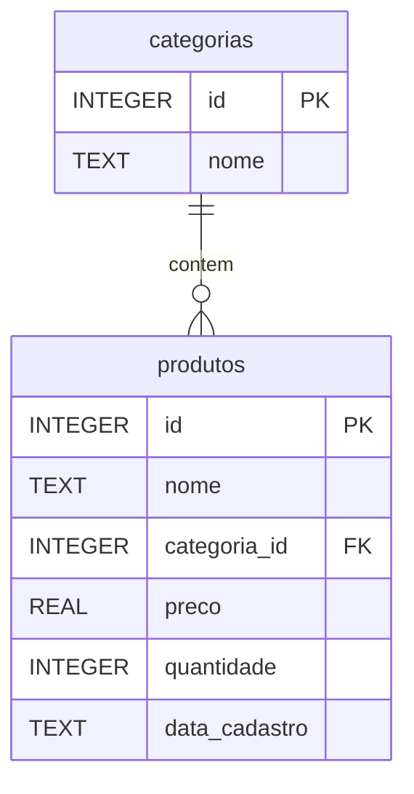
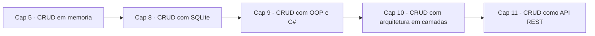

# 8.9 — Projeto: CRUD de Produtos com Python e SQLite

[← Anterior: SQL vs NoSQL](cap08-mod08-sql-vs-nosql-conteudo.md) · [Próximo: Capítulo 9 — OOP com C# →](cap09-mod01-procedural-vs-oop-conteudo.md)

---

## Introdução

Chegamos ao projeto final do capítulo 8. Ao longo dos módulos anteriores, você aprendeu o que são bancos de dados, como modelar dados, como usar SQL para criar tabelas, inserir, consultar, atualizar e remover dados, e quando usar SQL vs NoSQL. Agora é hora de juntar tudo em um projeto prático.

Lembra do CRUD que fizemos no capítulo 5? Você criou um programa que cadastrava produtos em uma lista na memória — e quando o programa fechava, tudo desaparecia. Agora vamos refazer esse projeto, mas com uma diferença fundamental: os dados vão ser armazenados em um banco de dados SQLite. Quando você fechar o programa e abrir de novo, os produtos estarão lá. Persistência em ação.

Esse projeto consolida todos os conceitos do capítulo: modelagem, CREATE TABLE, INSERT, SELECT, UPDATE, DELETE, transações, parâmetros seguros e boas práticas. É o tipo de programa que todo desenvolvedor já construiu em algum momento da carreira — e que serve de base para sistemas muito maiores.

O projeto completo está descrito em detalhes no arquivo [projeto-crud.md](../projects/projeto-crud.md). Neste módulo, vamos apresentar o projeto, explicar cada fase e mostrar o código completo com explicações.

---

## Como Executar o Projeto

```bash
# Criar pasta do projeto
mkdir -p ~/meus-projetos/curso/cap08/projeto-crud

# Navegar ate a pasta
cd ~/meus-projetos/curso/cap08/projeto-crud

# Executar o programa
python3 crud_produtos.py
```

---

## Visão Geral do Projeto

O projeto é um sistema de cadastro de produtos com menu interativo no terminal. O usuário pode:

1. **Listar** todos os produtos
2. **Buscar** produto por nome
3. **Cadastrar** novo produto
4. **Atualizar** preço de um produto
5. **Remover** um produto
6. **Sair** do programa

Os dados são armazenados em um arquivo SQLite (`produtos.db`) que persiste entre execuções.

### Modelo de Dados

Vamos usar duas tabelas: `categorias` e `produtos`.



---

## Fase 1: Criando o Banco e as Tabelas

```python
# database.py
# Modulo responsavel pela conexao e criacao do banco de dados
# "database" = banco de dados
import sqlite3

DATABASE_NAME = "produtos.db"  # nome do arquivo do banco

def get_connection():
    """Cria e retorna uma conexao com o banco de dados"""
    # "connection" = conexao
    conn = sqlite3.connect(DATABASE_NAME)
    conn.row_factory = sqlite3.Row  # permite acesso por nome de coluna
    conn.execute("PRAGMA foreign_keys = ON")  # ativa chaves estrangeiras
    return conn

def create_tables():
    """Cria as tabelas se nao existirem"""
    with get_connection() as conn:
        cursor = conn.cursor()
        
        # Tabela de categorias
        cursor.execute("""
            CREATE TABLE IF NOT EXISTS categorias (
                id INTEGER PRIMARY KEY AUTOINCREMENT,
                nome TEXT NOT NULL UNIQUE
            )
        """)
        
        # Tabela de produtos
        cursor.execute("""
            CREATE TABLE IF NOT EXISTS produtos (
                id INTEGER PRIMARY KEY AUTOINCREMENT,
                nome TEXT NOT NULL,
                categoria_id INTEGER NOT NULL,
                preco REAL NOT NULL CHECK(preco > 0),
                quantidade INTEGER NOT NULL DEFAULT 0 CHECK(quantidade >= 0),
                data_cadastro TEXT DEFAULT (date('now')),
                FOREIGN KEY (categoria_id) REFERENCES categorias(id)
            )
        """)
        
        # Inserir categorias padrao se a tabela estiver vazia
        cursor.execute("SELECT COUNT(*) FROM categorias")
        if cursor.fetchone()[0] == 0:
            categorias_padrao = [
                ("Alimentos",),
                ("Bebidas",),
                ("Limpeza",),
                ("Higiene",),
                ("Outros",),
            ]
            cursor.executemany(
                "INSERT INTO categorias (nome) VALUES (?)",
                categorias_padrao
            )
        
        conn.commit()

# Criar tabelas ao importar o modulo
create_tables()
```

Saída esperada (ao importar):

```
(nenhuma saida visivel - tabelas criadas silenciosamente)
```

---

## Fase 2: Funções CRUD

```python
# crud.py
# Funcoes CRUD para produtos
# "crud" = Create, Read, Update, Delete
import sqlite3
from database import get_connection

def list_categories():
    """Lista todas as categorias disponiveis"""
    with get_connection() as conn:
        cursor = conn.cursor()
        cursor.execute("SELECT id, nome FROM categorias ORDER BY nome")
        return cursor.fetchall()

def create_product(name, category_id, price, quantity):
    """Cria um novo produto no banco (CREATE)"""
    # "create" = criar, "product" = produto
    with get_connection() as conn:
        cursor = conn.cursor()
        try:
            cursor.execute("""
                INSERT INTO produtos (nome, categoria_id, preco, quantidade)
                VALUES (?, ?, ?, ?)
            """, (name, category_id, price, quantity))
            conn.commit()
            return cursor.lastrowid
        except sqlite3.IntegrityError as e:
            print(f"Erro ao cadastrar: {e}")
            return None

def list_products():
    """Lista todos os produtos com categoria (READ)"""
    # "list" = listar, "products" = produtos
    with get_connection() as conn:
        cursor = conn.cursor()
        cursor.execute("""
            SELECT p.id, p.nome, c.nome AS categoria,
                   p.preco, p.quantidade, p.data_cadastro
            FROM produtos p
            INNER JOIN categorias c ON p.categoria_id = c.id
            ORDER BY p.nome
        """)
        return cursor.fetchall()

def search_products(term):
    """Busca produtos por nome (READ com filtro)"""
    # "search" = buscar, "term" = termo de busca
    with get_connection() as conn:
        cursor = conn.cursor()
        cursor.execute("""
            SELECT p.id, p.nome, c.nome AS categoria,
                   p.preco, p.quantidade
            FROM produtos p
            INNER JOIN categorias c ON p.categoria_id = c.id
            WHERE p.nome LIKE ?
            ORDER BY p.nome
        """, (f"%{term}%",))
        return cursor.fetchall()

def get_product_by_id(product_id):
    """Busca um produto pelo ID"""
    with get_connection() as conn:
        cursor = conn.cursor()
        cursor.execute("""
            SELECT p.id, p.nome, c.nome AS categoria,
                   p.preco, p.quantidade
            FROM produtos p
            INNER JOIN categorias c ON p.categoria_id = c.id
            WHERE p.id = ?
        """, (product_id,))
        return cursor.fetchone()

def update_product_price(product_id, new_price):
    """Atualiza o preco de um produto (UPDATE)"""
    # "update" = atualizar, "price" = preco
    with get_connection() as conn:
        cursor = conn.cursor()
        cursor.execute(
            "UPDATE produtos SET preco = ? WHERE id = ?",
            (new_price, product_id)
        )
        conn.commit()
        return cursor.rowcount > 0

def delete_product(product_id):
    """Remove um produto do banco (DELETE)"""
    # "delete" = remover
    with get_connection() as conn:
        cursor = conn.cursor()
        cursor.execute(
            "DELETE FROM produtos WHERE id = ?",
            (product_id,)
        )
        conn.commit()
        return cursor.rowcount > 0

def get_statistics():
    """Retorna estatisticas do banco"""
    with get_connection() as conn:
        cursor = conn.cursor()
        cursor.execute("""
            SELECT
                COUNT(*) AS total,
                COALESCE(MIN(preco), 0) AS menor_preco,
                COALESCE(MAX(preco), 0) AS maior_preco,
                COALESCE(ROUND(AVG(preco), 2), 0) AS preco_medio,
                COALESCE(SUM(quantidade), 0) AS estoque_total
            FROM produtos
        """)
        return cursor.fetchone()
```

---

## Fase 3: Menu Interativo

```python
# crud_produtos.py
# Programa principal com menu interativo
# Este e o arquivo que voce executa: python3 crud_produtos.py
from crud import (
    list_categories, create_product, list_products,
    search_products, get_product_by_id,
    update_product_price, delete_product, get_statistics
)

def show_menu():
    """Mostra o menu principal"""
    print("\n" + "=" * 50)
    print("  SISTEMA DE CADASTRO DE PRODUTOS")
    print("=" * 50)
    print("  [1] Listar produtos")
    print("  [2] Buscar produto")
    print("  [3] Cadastrar produto")
    print("  [4] Atualizar preco")
    print("  [5] Remover produto")
    print("  [6] Estatisticas")
    print("  [0] Sair")
    print("=" * 50)

def action_list():
    """Lista todos os produtos"""
    products = list_products()
    if not products:
        print("\nNenhum produto cadastrado.")
        return
    
    print(f"\n{'ID':>4} | {'Nome':20s} | {'Categoria':12s} | {'Preco':>10s} | {'Qtd':>5s} | {'Cadastro':10s}")
    print("-" * 75)
    for p in products:
        print(f"{p['id']:4d} | {p['nome']:20s} | {p['categoria']:12s} | "
              f"R$ {p['preco']:7.2f} | {p['quantidade']:5d} | {p['data_cadastro']}")
    print(f"\nTotal: {len(products)} produto(s)")

def action_search():
    """Busca produtos por nome"""
    term = input("\nDigite o termo de busca: ").strip()
    if not term:
        print("Termo de busca vazio.")
        return
    
    products = search_products(term)
    if not products:
        print(f"Nenhum produto encontrado com '{term}'.")
        return
    
    print(f"\nResultados para '{term}':")
    for p in products:
        print(f"  [{p['id']}] {p['nome']} ({p['categoria']}) - R$ {p['preco']:.2f}")

def action_create():
    """Cadastra um novo produto"""
    print("\n--- Cadastrar Produto ---")
    
    # Mostrar categorias
    categories = list_categories()
    print("\nCategorias disponiveis:")
    for c in categories:
        print(f"  [{c['id']}] {c['nome']}")
    
    # Coletar dados
    name = input("\nNome do produto: ").strip()
    if not name:
        print("Nome nao pode ser vazio.")
        return
    
    try:
        cat_id = int(input("ID da categoria: "))
        price = float(input("Preco (R$): "))
        quantity = int(input("Quantidade em estoque: "))
    except ValueError:
        print("Valor invalido. Operacao cancelada.")
        return
    
    if price <= 0:
        print("Preco deve ser maior que zero.")
        return
    
    if quantity < 0:
        print("Quantidade nao pode ser negativa.")
        return
    
    # Criar produto
    product_id = create_product(name, cat_id, price, quantity)
    if product_id:
        print(f"\nProduto '{name}' cadastrado com sucesso! (ID: {product_id})")

def action_update():
    """Atualiza o preco de um produto"""
    try:
        product_id = int(input("\nID do produto: "))
    except ValueError:
        print("ID invalido.")
        return
    
    product = get_product_by_id(product_id)
    if not product:
        print(f"Produto #{product_id} nao encontrado.")
        return
    
    print(f"\nProduto: {product['nome']} ({product['categoria']})")
    print(f"Preco atual: R$ {product['preco']:.2f}")
    
    try:
        new_price = float(input("Novo preco (R$): "))
    except ValueError:
        print("Valor invalido.")
        return
    
    if new_price <= 0:
        print("Preco deve ser maior que zero.")
        return
    
    if update_product_price(product_id, new_price):
        print(f"Preco atualizado para R$ {new_price:.2f}")
    else:
        print("Erro ao atualizar.")

def action_delete():
    """Remove um produto"""
    try:
        product_id = int(input("\nID do produto: "))
    except ValueError:
        print("ID invalido.")
        return
    
    product = get_product_by_id(product_id)
    if not product:
        print(f"Produto #{product_id} nao encontrado.")
        return
    
    print(f"\nProduto: {product['nome']} - R$ {product['preco']:.2f}")
    confirm = input("Confirma remocao? (s/n): ").strip().lower()
    
    if confirm == "s":
        if delete_product(product_id):
            print("Produto removido com sucesso!")
        else:
            print("Erro ao remover.")
    else:
        print("Operacao cancelada.")

def action_stats():
    """Mostra estatisticas"""
    stats = get_statistics()
    print("\n--- Estatisticas ---")
    print(f"  Total de produtos: {stats['total']}")
    print(f"  Menor preco: R$ {stats['menor_preco']:.2f}")
    print(f"  Maior preco: R$ {stats['maior_preco']:.2f}")
    print(f"  Preco medio: R$ {stats['preco_medio']:.2f}")
    print(f"  Estoque total: {stats['estoque_total']} unidades")

def main():
    """Funcao principal - loop do menu"""
    # "main" = principal
    print("Bem-vindo ao Sistema de Cadastro de Produtos!")
    print("Os dados sao salvos automaticamente no banco de dados.")
    
    actions = {
        "1": action_list,
        "2": action_search,
        "3": action_create,
        "4": action_update,
        "5": action_delete,
        "6": action_stats,
    }
    
    while True:
        show_menu()
        choice = input("\nEscolha uma opcao: ").strip()
        
        if choice == "0":
            print("\nAte logo! Seus dados estao salvos no banco.")
            break
        
        action = actions.get(choice)
        if action:
            action()
        else:
            print("Opcao invalida. Tente novamente.")

# Ponto de entrada do programa
if __name__ == "__main__":
    main()
```

---

## Testando o Projeto

Execute o programa e teste cada funcionalidade:

```bash
python3 crud_produtos.py
```

Saída esperada (exemplo de interação):

```
Bem-vindo ao Sistema de Cadastro de Produtos!
Os dados sao salvos automaticamente no banco de dados.

==================================================
  SISTEMA DE CADASTRO DE PRODUTOS
==================================================
  [1] Listar produtos
  [2] Buscar produto
  [3] Cadastrar produto
  [4] Atualizar preco
  [5] Remover produto
  [6] Estatisticas
  [0] Sair
==================================================

Escolha uma opcao: 3

--- Cadastrar Produto ---

Categorias disponiveis:
  [1] Alimentos
  [2] Bebidas
  [3] Higiene
  [4] Limpeza
  [5] Outros

Nome do produto: Arroz 5kg
ID da categoria: 1
Preco (R$): 22.90
Quantidade em estoque: 100

Produto 'Arroz 5kg' cadastrado com sucesso! (ID: 1)
```

Agora feche o programa (opção 0) e abra novamente. Liste os produtos — o Arroz 5kg ainda está lá. Persistência funcionando.

---

## Evolução do Projeto: Do Cap 5 ao Cap 8

### Erros Comuns e Como Resolver

Ao construir o projeto, você pode encontrar alguns erros. Aqui estão os mais comuns:

**Erro: "sqlite3.OperationalError: table produtos already exists"**

Causa: tentou criar a tabela sem `IF NOT EXISTS`.
Solução: sempre use `CREATE TABLE IF NOT EXISTS`.

**Erro: "sqlite3.IntegrityError: FOREIGN KEY constraint failed"**

Causa: tentou inserir um produto com `categoria_id` que não existe na tabela de categorias.
Solução: verifique se a categoria existe antes de inserir o produto. No nosso código, as categorias são criadas automaticamente.

**Erro: "sqlite3.IntegrityError: NOT NULL constraint failed"**

Causa: tentou inserir um registro sem informar um campo obrigatório.
Solução: verifique se todos os campos NOT NULL estão preenchidos.

**Erro: "sqlite3.OperationalError: database is locked"**

Causa: outro programa (ou outra instância do mesmo programa) está usando o banco.
Solução: feche todas as outras conexões ao banco. Use `with` para garantir que conexões são fechadas automaticamente.

**Erro: "ValueError: invalid literal for int()"**

Causa: o usuário digitou texto onde era esperado um número.
Solução: use `try/except ValueError` ao converter inputs do usuário, como fizemos no código.

### Testando Cada Funcionalidade

Para garantir que o projeto funciona corretamente, teste cada operação:

1. **Cadastrar**: adicione 5 produtos em categorias diferentes
2. **Listar**: verifique se todos aparecem com categoria correta
3. **Buscar**: busque por parte do nome (ex: "Arroz")
4. **Atualizar**: mude o preço de um produto e verifique
5. **Remover**: remova um produto e verifique que sumiu da lista
6. **Persistência**: feche o programa, abra novamente e verifique que os dados estão lá
7. **Estatísticas**: verifique se os números fazem sentido
8. **Erros**: tente cadastrar com preço negativo, categoria inexistente, ID inválido

### Estrutura de Arquivos do Projeto

```
projeto-crud/
├── database.py          # Conexao e criacao do banco
├── crud.py              # Funcoes CRUD (logica de dados)
├── crud_produtos.py     # Menu interativo (interface)
└── produtos.db          # Banco de dados (criado automaticamente)
```

Essa separação em 3 arquivos é intencional e segue um princípio importante: **separação de responsabilidades**. Cada arquivo tem uma função clara:

- `database.py` sabe como conectar ao banco e criar tabelas
- `crud.py` sabe como manipular dados (INSERT, SELECT, UPDATE, DELETE)
- `crud_produtos.py` sabe como interagir com o usuário (input, print, menu)

Se amanhã você quiser trocar SQLite por PostgreSQL, só precisa mudar `database.py`. Se quiser trocar o menu de terminal por uma interface web, só precisa mudar `crud_produtos.py`. O `crud.py` continua igual nos dois casos.

Essa ideia de separar responsabilidades é a base da arquitetura de software — tema do capítulo 10.

---

## Evolução do Projeto: Do Cap 5 ao Cap 8

Compare o que mudou entre o CRUD do capítulo 5 e este:

| Aspecto | Cap 5 (memória) | Cap 8 (banco de dados) |
|---------|-----------------|----------------------|
| Armazenamento | Lista Python na RAM | Arquivo SQLite no disco |
| Persistência | Dados perdem ao fechar | Dados sobrevivem entre execucoes |
| Busca | Percorre lista inteira | Indices do banco (eficiente) |
| Integridade | Validação manual no código | Constraints do banco (automático) |
| Estrutura | Dicionários livres | Tabelas com schema definido |
| Relacionamentos | Não tem | FK entre produtos e categorias |
| Segurança | Não se aplica | Parametros ? contra SQL Injection |

Essa evolução é exatamente o que acontece em projetos reais: você começa com algo simples (dados em memória) e evolui para algo robusto (banco de dados) conforme as necessidades crescem.

---

## Conexão com os Próximos Capítulos

Este projeto vai evoluir ao longo do curso:

- **Capítulo 9 (OOP com C#)**: você vai criar um sistema similar usando classes, interfaces e o padrão Repository — separando a lógica de acesso ao banco da lógica de negócio

- **Capítulo 10 (Arquitetura)**: você vai reorganizar o código em camadas (controller, service, repository) — o mesmo CRUD, mas com arquitetura profissional

- **Capítulo 11 (APIs)**: você vai transformar este CRUD em uma API REST com FastAPI — em vez de menu no terminal, os dados serão acessados via HTTP

Cada capítulo adiciona uma camada de sofisticação ao mesmo conceito fundamental: gerenciar dados de forma organizada e confiável.

### A Jornada do CRUD



Observe como o mesmo conceito (gerenciar dados) vai ganhando camadas:

| Capítulo | O que muda | O que permanece |
|----------|-----------|-----------------|
| 5 | Dados em memória (lista) | CRUD básico |
| 8 | Dados em banco (SQLite) | CRUD básico + persistência |
| 9 | Código orientado a objetos | CRUD + persistência + OOP |
| 10 | Código em camadas | CRUD + persistência + OOP + arquitetura |
| 11 | Interface via HTTP (API) | CRUD + persistência + OOP + arquitetura + API |

Cada camada resolve um problema novo sem invalidar as anteriores. Isso é como software evolui no mundo real — incrementalmente, resolvendo um problema de cada vez.

---

## Desafios Extras (Para Quem Quer Ir Além)

Se você terminou o projeto e quer praticar mais, aqui estão desafios progressivos:

### Desafio 1: Histórico de Preços

Crie uma tabela `historico_precos` que registra toda alteração de preço:

```sql
CREATE TABLE historico_precos (
    id INTEGER PRIMARY KEY AUTOINCREMENT,
    produto_id INTEGER NOT NULL,
    preco_anterior REAL NOT NULL,
    preco_novo REAL NOT NULL,
    data_alteracao TEXT DEFAULT (datetime('now')),
    FOREIGN KEY (produto_id) REFERENCES produtos(id)
);
```

Toda vez que um preço for atualizado, insira um registro no histórico. Adicione uma opção no menu para ver o histórico de preços de um produto.

### Desafio 2: Exportar para CSV

Crie uma funcionalidade que exporta todos os produtos para um arquivo CSV:

```python
import csv

def export_to_csv():
    """Exporta produtos para arquivo CSV"""
    products = list_products()
    with open("produtos_export.csv", "w", newline="") as file:
        writer = csv.writer(file)
        writer.writerow(["ID", "Nome", "Categoria", "Preco", "Quantidade"])
        for p in products:
            writer.writerow([p['id'], p['nome'], p['categoria'],
                           p['preco'], p['quantidade']])
    print(f"Exportados {len(products)} produtos para produtos_export.csv")
```

### Desafio 3: Importar de CSV

O inverso: ler um arquivo CSV e inserir os produtos no banco. Trate duplicatas e erros de formato.

### Desafio 4: Sistema de Vendas

Adicione tabelas de `vendas` e `itens_venda`. Quando uma venda é registrada, o estoque do produto deve ser decrementado automaticamente (usando transação para garantir atomicidade).

### Desafio 5: Busca Avançada

Adicione filtros combinados: buscar por nome E categoria, buscar por faixa de preço, buscar produtos com estoque abaixo de um mínimo. Use AND e OR no WHERE para combinar condições.

---

## Como a IA pode te ajudar aqui

**Prompt 1 — Ver exemplos práticos:**
> "Quero adicionar uma funcionalidade de relatório ao meu CRUD de produtos. Me ajude a criar uma query que mostre os 5 produtos mais caros por categoria."

**Prompt 2 — Entender erros comuns:**
> "Meu programa está dando erro 'FOREIGN KEY constraint failed' quando tento cadastrar um produto. O que pode estar errado?"

**Prompt 3 — Boas práticas:**
> "Revise meu código do CRUD e sugira melhorias de organização, tratamento de erros e boas práticas."

---

## Casos de Uso no Mundo Real

### Caso 1: Sistemas de PDV (Ponto de Venda)

Todo supermercado, farmácia e loja tem um sistema de PDV que é essencialmente um CRUD de produtos com funcionalidades adicionais (vendas, estoque, relatórios). O caixa registra vendas (INSERT em tabela de vendas), consulta preços (SELECT em produtos), e o gerente atualiza preços (UPDATE) e remove produtos descontinuados (DELETE). O projeto que você acabou de construir é a base de um PDV.

### Caso 2: Painel Administrativo de E-commerce

Todo e-commerce tem um painel administrativo onde o lojista gerência seus produtos. Cadastrar novos produtos, atualizar preços, controlar estoque, organizar por categorias — tudo isso é CRUD. Plataformas como Shopify, WooCommerce e Mercado Livre oferecem interfaces visuais, mas por baixo executam os mesmos comandos SQL que você aprendeu.

### Caso 3: Sistemas de Inventário

Empresas de logística, hospitais e fábricas usam sistemas de inventário para controlar materiais. Cada item tem nome, categoria, quantidade, localização e data de validade. O sistema precisa de CRUD completo com relatórios de estoque baixo, itens próximos do vencimento e histórico de movimentações. A base é exatamente o que construímos aqui.

---

## Resumo do Módulo

| Conceito | Definição |
|----------|-----------|
| CRUD | Create, Read, Update, Delete - as quatro operações básicas |
| Modularizacao | Separar código em arquivos por responsabilidade |
| Menu interativo | Interface de texto que permite ao usuario escolher ações |
| Persistência | Dados que sobrevivem entre execucoes do programa |
| Validação de entrada | Verificar se dados do usuario são validos antes de processar |
| Tratamento de erros | Usar try/except para lidar com situações inesperadas |

---

## Glossário do Módulo

| Termo | Definição |
|-------|-----------|
| COALESCE | Função SQL que retorna o primeiro valor não-NULL de uma lista |
| CRUD | Create, Read, Update, Delete - operações básicas de manipulação de dados |
| if __name__ == "__main__" | Padrão Python que executa código apenas quando o arquivo e executado diretamente |
| Input validation | Verificacao de dados fornecidos pelo usuario antes de processar |
| Menu-driven | Programa que funciona através de um menu de opcoes |
| Módulo (module) | Arquivo Python que pode ser importado por outros arquivos |
| PDV (Ponto de Venda) | Sistema usado em lojas para registrar vendas |
| rowcount | Propriedade do cursor que indica quantos registros foram afetados |
| strip() | Método Python que remove espacos em branco do inicio e fim de uma string |

---

## Na Cultura Popular

- **O Poderoso Chefão** (filme, 1972) — Don Corleone mantém registros meticulosos de todos os seus "negócios" e favores. Em termos modernos, ele tinha um CRUD mental: cadastrava pessoas (CREATE), consultava quem devia favores (READ), atualizava status de acordos (UPDATE) e eliminava registros quando necessário (DELETE). A organização de informações é poder — seja na máfia fictícia ou em sistemas reais.

---

## Para Saber Mais

- [SQLBolt](https://sqlbolt.com/) — *Revise todos os comandos SQL que usamos no projeto com exercícios interativos.*

- [Repositórios do Fino](https://github.com/RafaelFino) — *Projetos de referência do autor do curso, incluindo CRUDs em Python.*

- [Curso em Vídeo — MySQL](https://www.youtube.com/playlist?list=PLHz_AreHm4dkBs-795Dsgvau_ekxg8g1r) — *Curso completo de banco de dados em português para aprofundar.*

- [Select Star SQL](https://selectstarsql.com/) — *Pratique queries mais complexas com dados reais.*

---

## Perguntas Frequentes (FAQ)

**P: Posso usar este projeto como base para um projeto real?**
R: Sim, com melhorias. Para um projeto real, você adicionaria: autenticação de usuário, interface gráfica ou web, backup automático, logs de operações e testes automatizados. Mas a estrutura básica (banco + CRUD + menu) é a mesma.

**P: Por que separar em 3 arquivos (database.py, crud.py, crud_produtos.py)?**
R: Separação de responsabilidades. `database.py` cuida da conexão e estrutura do banco. `crud.py` contém as operações de dados. `crud_produtos.py` é a interface com o usuário. Se quiser trocar a interface (de terminal para web), só precisa mudar `crud_produtos.py` — o resto continua igual.

**P: O que acontece se dois usuários abrirem o programa ao mesmo tempo?**
R: Com SQLite, apenas um pode escrever por vez. O segundo recebe erro "database is locked". Para múltiplos usuários simultâneos, use PostgreSQL. Mas para uso pessoal ou aprendizado, SQLite é suficiente.

**P: Como faço backup do banco?**
R: Copie o arquivo `produtos.db`: `cp produtos.db produtos_backup.db`. Para restaurar: `cp produtos_backup.db produtos.db`. Simples assim.

**P: Posso adicionar mais funcionalidades?**
R: Claro. Sugestões: relatório de produtos por categoria, exportar para CSV, importar de CSV, histórico de alterações de preço, controle de estoque mínimo com alertas.

**P: Este projeto é parecido com o que fazem em empresas?**
R: A lógica é a mesma. Em empresas, o código é mais organizado (com arquitetura em camadas, que veremos no cap 10), usa frameworks (como FastAPI, que veremos no cap 11), tem testes automatizados e roda em servidores. Mas o CRUD — criar, ler, atualizar, deletar — é a base de praticamente todo sistema.

**P: Preciso decorar todos os comandos SQL?**
R: Não. Com a prática, os comandos mais comuns (SELECT, INSERT, UPDATE, DELETE) ficam naturais. Para comandos menos frequentes, consulte a documentação. Nenhum desenvolvedor profissional decora tudo — todos consultam referências.

**P: O que é o `if __name__ == "__main__"` no final?**
R: É um padrão Python que verifica se o arquivo está sendo executado diretamente (não importado). Se você executar `python3 crud_produtos.py`, o `main()` roda. Se outro arquivo fizer `import crud_produtos`, o `main()` não roda automaticamente.

---

## Exercícios Práticos

### Exercício 1: Expandindo o CRUD

Adicione as seguintes funcionalidades ao projeto:
a) Listar produtos por categoria (o usuário escolhe a categoria)
b) Atualizar a quantidade em estoque de um produto
c) Buscar produtos com estoque abaixo de um valor mínimo

### Exercício 2: Relatório

Crie uma opção "Relatório" no menu que mostre:
- Total de produtos por categoria
- Produto mais caro e mais barato
- Valor total do estoque (soma de preço × quantidade de todos os produtos)
- Categorias sem produtos cadastrados

### Exercício 3: Seu Próprio CRUD

Escolha um tema diferente (livros, filmes, receitas, contatos) e crie um CRUD completo seguindo a mesma estrutura: banco de dados com pelo menos 2 tabelas relacionadas, menu interativo e todas as operações CRUD.

---

[← Anterior: SQL vs NoSQL](cap08-mod08-sql-vs-nosql-conteudo.md) · [Próximo: Capítulo 9 — OOP com C# →](cap09-mod01-procedural-vs-oop-conteudo.md)
