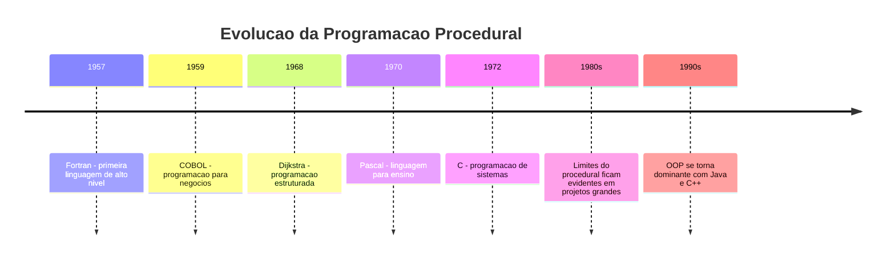
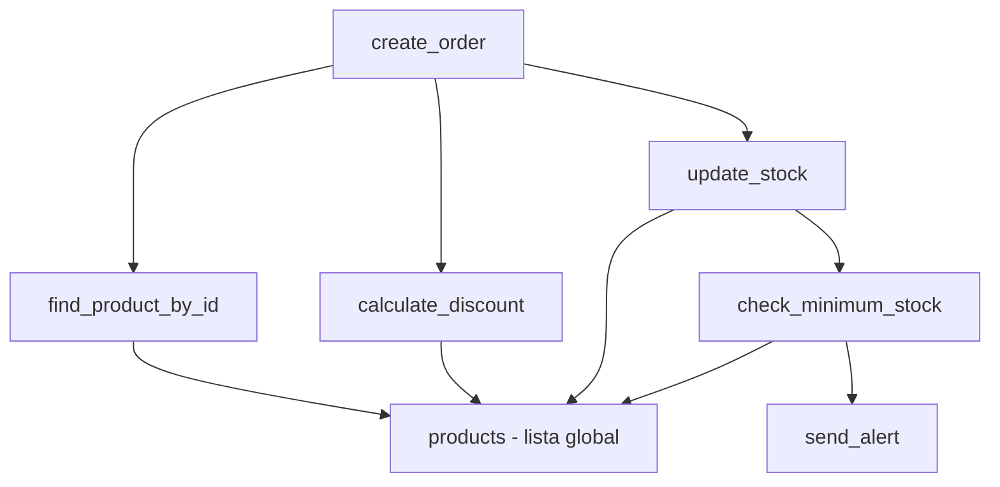
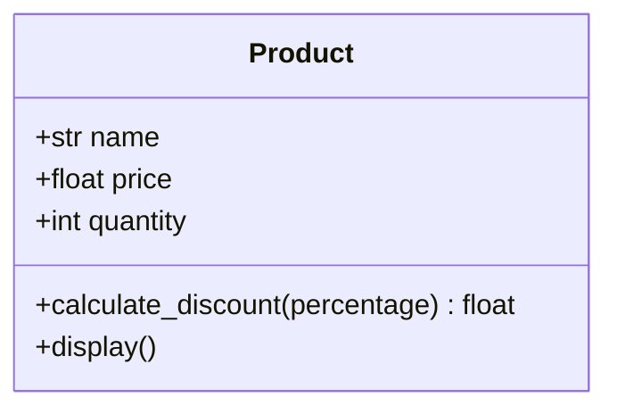
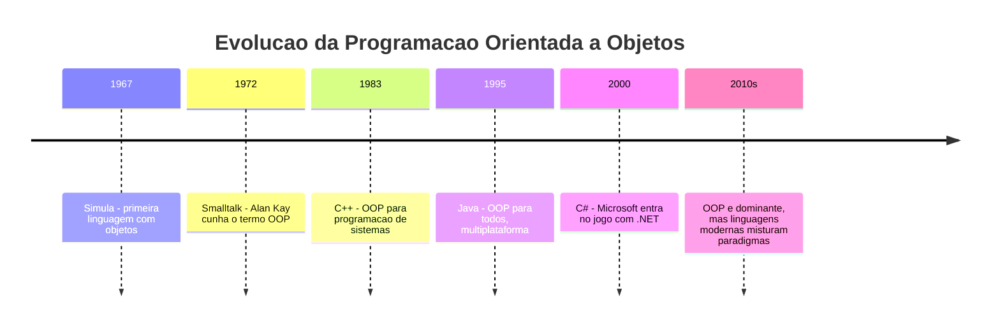
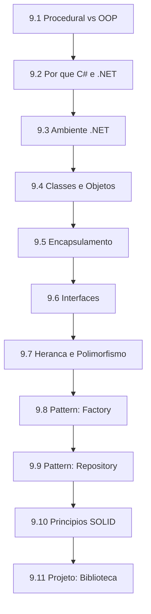

# 9.1 — Procedural vs OOP: Os Limites do que Fizemos Até Agora

[← Anterior: Projeto CRUD com Python e SQLite](cap08-mod09-projeto-crud-conteudo.md) · [Próximo: Por que C# e .NET? →](cap09-mod02-porque-csharp-conteudo.md)

---

## Introdução

Nos capítulos anteriores, você aprendeu a programar em Python, a organizar dados em estruturas como listas, filas e pilhas em C, e a persistir informações em bancos de dados com SQLite. Você criou programas que leem dados do usuário, processam informações, tomam decisões com condicionais, repetem ações com loops e organizam código em funções. No capítulo 8, você construiu um CRUD completo que cadastra, lista, edita e remove produtos de um banco de dados.

Tudo isso funciona. Seus programas rodam, resolvem problemas e produzem resultados. Mas existe um padrão em tudo que fizemos até agora que, conforme os programas crescem, começa a criar problemas. Esse padrão tem um nome: **programação procedural** (procedural programming).

Neste módulo, vamos entender o que é programação procedural, por que ela funciona bem para programas pequenos, e por que ela começa a criar dificuldades quando os programas ficam maiores e mais complexos. E vamos plantar a semente de uma forma diferente de organizar código — a **Programação Orientada a Objetos** (Object-Oriented Programming, ou OOP).

Este é um módulo de transição. Não vamos aprender uma linguagem nova ainda. Vamos olhar para trás, entender o que fizemos, e preparar o terreno para o que vem a seguir.

---

## O que é Programação Procedural?

Programação procedural é um estilo de programação onde o código é organizado como uma **sequência de instruções** agrupadas em **funções** (ou procedimentos). Os dados ficam separados das funções que os manipulam. Você cria variáveis, passa essas variáveis para funções, as funções processam os dados e devolvem resultados.

É exatamente o que fizemos em Python desde o capítulo 5.

Vamos relembrar com um exemplo concreto. No capítulo 5, quando criamos o CRUD em memória, o código tinha mais ou menos esta estrutura:

```python
# Dados separados — uma lista de dicionários
# "products" = produtos
products = []

# Função que cria um produto
# "create_product" = criar produto
# "name" = nome, "price" = preço, "quantity" = quantidade
def create_product(products, name, price, quantity):
    product = {
        "id": len(products) + 1,
        "name": name,
        "price": price,
        "quantity": quantity
    }
    products.append(product)
    return product

# Função que lista todos os produtos
# "list_products" = listar produtos
def list_products(products):
    for product in products:
        print(f"ID: {product['id']} | Nome: {product['name']} | Preço: R${product['price']:.2f}")
```

Observe o padrão: os **dados** (a lista `products` e os dicionários dentro dela) ficam em um lugar, e as **funções** que manipulam esses dados (`create_product`, `list_products`) ficam em outro. As funções precisam receber os dados como parâmetro para poder trabalhar com eles.

Isso é programação procedural. E funciona perfeitamente para programas pequenos.

### As Características da Programação Procedural

Vamos listar as características principais desse estilo:

| Característica | O que significa | Exemplo no nosso código |
|---------------|----------------|------------------------|
| Dados e funções separados | Os dados existem em variáveis, as funções recebem esses dados como parâmetro | `products` é uma lista, `create_product` recebe `products` como argumento |
| Execução sequencial | O programa executa instrução por instrução, de cima para baixo | O menu roda em um loop, chamando funções na ordem |
| Funções como unidade de organização | O código é dividido em funções que fazem tarefas específicas | `create_product`, `list_products`, `delete_product` |
| Estado global ou passado por parâmetro | Os dados ficam em variáveis globais ou são passados entre funções | A lista `products` é passada para todas as funções |
| Sem agrupamento formal | Não existe uma estrutura que diga "esses dados e essas funções pertencem ao mesmo conceito" | O dicionário `product` e a função `create_product` não têm vínculo formal |

Esse estilo tem raízes profundas na história da computação. Linguagens como C (que você usou no capítulo 7), Fortran (uma das primeiras linguagens, criada em 1957) e Pascal (criada em 1970 para ensinar programação) são todas procedurais. Durante décadas, foi a forma dominante de programar.

### Uma Breve História: De Onde Veio a Programação Procedural

Nos primórdios da computação, nos anos 1940 e 1950, os programas eram escritos diretamente em linguagem de máquina — sequências de números que o processador entendia. Não existiam funções, variáveis com nomes legíveis, nem nenhuma forma de organização. O código era uma lista enorme de instruções numéricas.

Quando as primeiras linguagens de programação surgiram (Fortran em 1957, COBOL em 1959), elas trouxeram a ideia de **sub-rotinas** — blocos de código que podiam ser chamados pelo nome e reutilizados. Isso foi revolucionário. Em vez de repetir as mesmas 50 linhas de código em 10 lugares diferentes, você escrevia uma sub-rotina e chamava ela 10 vezes.

Nos anos 1960 e 1970, a programação estruturada formalizou essas ideias. Edsger Dijkstra, um dos cientistas da computação mais influentes da história, publicou em 1968 o famoso artigo "Go To Statement Considered Harmful" (em português: "O Comando Go To é Considerado Prejudicial"), argumentando que programas deveriam ser organizados com estruturas claras — sequência, seleção (if/else) e repetição (loops) — em vez de pulos arbitrários pelo código.

A linguagem C, criada por Dennis Ritchie em 1972, é o exemplo mais bem-sucedido de programação procedural estruturada. Tudo que você fez no capítulo 7 — funções, structs, ponteiros — é programação procedural. E C continua sendo usada até hoje em sistemas operacionais, drivers e sistemas embarcados.



### Por que Procedural Funciona Bem para Programas Pequenos

Quando o programa é pequeno — digamos, até umas 500 linhas de código — a programação procedural funciona muito bem. Você consegue manter na cabeça quais funções existem, quais dados elas manipulam e como tudo se conecta.

O CRUD que fizemos no capítulo 5 tinha cerca de 150 linhas. Era fácil entender: uma lista de produtos, funções para criar, listar, editar e remover, e um menu. Qualquer pessoa que lesse o código conseguiria entender o que ele faz em poucos minutos.

O CRUD do capítulo 8, com SQLite, era um pouco maior — talvez 300 linhas. Ainda assim, era gerenciável. As funções tinham nomes claros, os dados tinham uma estrutura previsível, e o fluxo do programa era linear.

Mas o que acontece quando o programa cresce?

---

## Quando o Procedural Começa a Doer

Vamos imaginar que o seu chefe chega e diz: "O CRUD de produtos está ótimo. Agora preciso que você adicione clientes, pedidos, estoque, relatórios e um sistema de descontos."

De repente, o programa que tinha 300 linhas precisa ter 3.000. E é aí que os problemas começam a aparecer.

### Problema 1: Funções que Precisam de Muitos Parâmetros

No nosso CRUD procedural, a função `create_product` recebe 4 parâmetros: a lista de produtos, o nome, o preço e a quantidade. Isso é gerenciável.

Mas agora imagine uma função que cria um pedido. Um pedido precisa de: o cliente, a lista de produtos do pedido, as quantidades de cada produto, o endereço de entrega, a forma de pagamento, o desconto aplicado, o vendedor responsável, a data de entrega estimada...

```python
# Isso começa a ficar difícil de gerenciar
# "create_order" = criar pedido
def create_order(orders, customer, products, quantities, 
                 address, payment_method, discount, 
                 seller, delivery_date, notes):
    # ... muita lógica aqui
    pass
```

Saída esperada: nenhuma (é apenas a assinatura da função)

Quando uma função precisa de 10 parâmetros, algo está errado. É fácil errar a ordem dos argumentos, esquecer um parâmetro, ou passar o valor errado. E toda vez que você precisar adicionar uma informação nova ao pedido (por exemplo, "cupom de desconto"), precisa alterar a assinatura da função E todos os lugares que chamam essa função.

### Problema 2: Dados e Comportamentos Separados

No código procedural, os dados (dicionários, listas) ficam em um lugar e as funções que manipulam esses dados ficam em outro. Não existe nenhum vínculo formal entre eles.

```python
# Os dados de um produto
# "product" = produto
product = {
    "name": "Notebook",      # "name" = nome
    "price": 3500.00,        # "price" = preço
    "quantity": 10,           # "quantity" = quantidade
    "category": "Eletrônicos" # "category" = categoria
}

# A função que calcula desconto precisa SABER a estrutura do dicionário
# "calculate_discount" = calcular desconto
def calculate_discount(product, percentage):
    # A função precisa saber que o campo se chama "price"
    # Se alguém mudar o nome do campo para "valor", essa função quebra
    return product["price"] * (1 - percentage / 100)
```

Saída esperada: nenhuma (é apenas a definição)

O problema aqui é sutil mas importante: a função `calculate_discount` precisa **saber** que o dicionário tem um campo chamado `"price"`. Se alguém mudar o nome desse campo para `"valor"` ou `"preco"`, a função quebra. E o Python não vai te avisar até o programa rodar e dar erro.

Agora multiplique isso por 50 funções que acessam campos de dicionários. Mudar a estrutura de um dado significa revisar TODAS as funções que o utilizam. Em um programa grande, isso é um pesadelo.

### Problema 3: Código Duplicado entre Entidades Similares

Imagine que além de produtos, você agora tem clientes e fornecedores. Todos precisam de operações similares: criar, listar, buscar por ID, atualizar, remover.

```python
# Funções para produtos
# "create_product" = criar produto
def create_product(products, name, price, quantity):
    # ...
    pass

# "list_products" = listar produtos
def list_products(products):
    # ...
    pass

# "find_product_by_id" = buscar produto por ID
def find_product_by_id(products, product_id):
    # ...
    pass

# Funções para clientes — quase iguais, mas com campos diferentes
# "create_customer" = criar cliente
def create_customer(customers, name, email, phone):
    # ...
    pass

# "list_customers" = listar clientes
def list_customers(customers):
    # ...
    pass

# "find_customer_by_id" = buscar cliente por ID
def find_customer_by_id(customers, customer_id):
    # ...
    pass

# Funções para fornecedores — de novo, quase iguais
# "create_supplier" = criar fornecedor
def create_supplier(suppliers, name, contact, cnpj):
    # ...
    pass

# E assim por diante... para cada entidade nova, mais funções repetidas
```

Saída esperada: nenhuma (são apenas definições)

Percebe o padrão? Para cada entidade nova (produto, cliente, fornecedor, pedido), você precisa criar um conjunto inteiro de funções quase idênticas. A lógica de "criar", "listar" e "buscar por ID" é essencialmente a mesma — o que muda são os campos. Mas no código procedural, não existe uma forma elegante de reutilizar essa lógica.

### Problema 4: Dificuldade de Mudar uma Parte sem Quebrar Outras

Em um programa procedural grande, as funções dependem umas das outras de formas que nem sempre são óbvias. A função `create_order` chama `find_product_by_id`, que acessa a lista de produtos, que é a mesma lista que `update_stock` modifica.



Se você mudar a estrutura da lista de produtos (por exemplo, adicionar um campo novo), precisa verificar TODAS as funções que acessam essa lista. Em um programa com 3.000 linhas e 80 funções, isso é trabalhoso e propenso a erros.

### Problema 5: Dificuldade de Testar

No código procedural, as funções frequentemente dependem de dados globais ou de outras funções. Para testar a função `create_order`, você precisa ter uma lista de produtos preenchida, uma lista de clientes, um sistema de estoque funcionando... Testar uma parte isolada do código é difícil porque tudo está conectado.

### Resumo dos Problemas

| Problema | Causa | Consequência |
|----------|-------|-------------|
| Muitos parâmetros | Dados separados das funções | Funções difíceis de chamar e manter |
| Dados e comportamentos separados | Sem vínculo formal entre dados e funções | Mudança em dados quebra funções distantes |
| Código duplicado | Sem mecanismo de reutilização estrutural | Mais código para manter, mais bugs |
| Acoplamento invisível | Funções compartilham dados globais | Mudança em uma parte quebra outras |
| Dificuldade de testar | Dependências implícitas entre funções | Testes complexos e frágeis |

Esses problemas não significam que programação procedural é ruim. Ela é excelente para o que se propõe: programas menores, scripts, automações, ferramentas de linha de comando. O kernel do Linux, escrito em C, é procedural e funciona perfeitamente — mas com décadas de disciplina e convenções rigorosas.

O problema é que, para a maioria dos programas que empresas constroem hoje — aplicações web, APIs, sistemas de gestão, jogos — a programação procedural sozinha não escala bem. Precisamos de algo mais.

---

## A Analogia: Cozinha Procedural vs Cozinha Organizada

Lembra da analogia da cozinha que usamos no capítulo 1? O computador é como uma cozinha, a CPU é o cozinheiro, a RAM é a bancada de trabalho, e os programas são receitas.

Vamos estender essa analogia para entender a diferença entre procedural e OOP.

### A Cozinha Procedural

Imagine uma cozinha onde todos os ingredientes ficam espalhados pela bancada — farinha aqui, ovos ali, açúcar acolá. As receitas (funções) estão escritas em papéis soltos. Quando você quer fazer um bolo, pega o papel da receita, procura os ingredientes pela bancada, e segue as instruções.

Para um jantar simples (programa pequeno), isso funciona. Você sabe onde está cada coisa, tem poucos ingredientes e poucas receitas.

Mas imagine que agora você precisa preparar um banquete para 200 pessoas (programa grande). A bancada está lotada de ingredientes de 30 receitas diferentes. Os papéis das receitas estão misturados. Você pega o açúcar achando que é sal. Alguém move a farinha e a receita do bolo não funciona mais. Dois cozinheiros tentam usar o mesmo ingrediente ao mesmo tempo.

Caos.

### A Cozinha Orientada a Objetos

Agora imagine uma cozinha profissional de restaurante. Cada estação tem seus próprios ingredientes e utensílios organizados. A estação de confeitaria tem farinha, açúcar, ovos e formas. A estação de grelhados tem carnes, temperos e a grelha. A estação de saladas tem verduras, molhos e tigelas.

Cada estação **sabe** o que tem e **sabe** o que fazer. A estação de confeitaria sabe fazer bolos, tortas e sobremesas. Você não precisa dizer para ela onde está a farinha — ela já sabe. E se você mudar o tipo de farinha na estação de confeitaria, isso não afeta a estação de grelhados.

Essa é a ideia central da Programação Orientada a Objetos: **agrupar dados e comportamentos que pertencem ao mesmo conceito em uma única unidade**.

| Aspecto | Cozinha Procedural | Cozinha OOP |
|---------|-------------------|-------------|
| Ingredientes | Espalhados pela bancada | Organizados por estação |
| Receitas | Papéis soltos | Cada estação sabe suas receitas |
| Mudança | Mover um ingrediente afeta todas as receitas | Mudar uma estação não afeta as outras |
| Escala | Funciona para jantar simples | Funciona para banquete de 200 pessoas |
| Organização | Por tipo de ação (cortar, misturar, assar) | Por conceito (confeitaria, grelhados, saladas) |

---

## O que é Programação Orientada a Objetos?

Programação Orientada a Objetos (OOP, de Object-Oriented Programming) é um estilo de programação onde o código é organizado em **objetos** — unidades que combinam **dados** (chamados de atributos) e **comportamentos** (chamados de métodos) em uma única estrutura.

Em vez de ter dados soltos e funções separadas, você cria **classes** que definem como um tipo de objeto funciona, e depois cria **objetos** (instâncias) a partir dessas classes.

Vamos ver como o mesmo exemplo do CRUD ficaria com OOP. Não se preocupe com a sintaxe por enquanto — vamos aprender isso nos próximos módulos. O importante agora é entender a **ideia**.

```python
# Versão OOP do mesmo conceito (preview — vamos aprender a sintaxe depois)
# "Product" = Produto
class Product:
    # O construtor — define os dados que todo produto tem
    # "__init__" = inicializar
    def __init__(self, name, price, quantity):
        self.name = name          # "name" = nome
        self.price = price        # "price" = preço
        self.quantity = quantity   # "quantity" = quantidade

    # O produto SABE calcular seu próprio desconto
    # "calculate_discount" = calcular desconto
    def calculate_discount(self, percentage):
        return self.price * (1 - percentage / 100)

    # O produto SABE se apresentar
    # "display" = exibir
    def display(self):
        print(f"Nome: {self.name} | Preço: R${self.price:.2f} | Qtd: {self.quantity}")
```

Saída esperada: nenhuma (é apenas a definição da classe)

Veja a estrutura dessa classe em um diagrama:



Percebe a diferença? Na versão procedural, o produto era um dicionário burro — ele não sabia fazer nada. As funções é que sabiam o que fazer com ele. Na versão OOP, o produto é um **objeto inteligente** — ele sabe seus próprios dados E sabe o que fazer com eles.

### Comparação Lado a Lado

Vamos colocar as duas abordagens lado a lado para o mesmo problema: calcular o desconto de um produto.

**Versão Procedural:**

```python
# Dados separados da função
# "product" = produto
product = {"name": "Notebook", "price": 3500.00}

# Função recebe os dados como parâmetro
# "calculate_discount" = calcular desconto
def calculate_discount(product, percentage):
    return product["price"] * (1 - percentage / 100)

# Chamada: passo o produto E a porcentagem
# "discounted_price" = preço com desconto
discounted_price = calculate_discount(product, 10)
print(f"Preço com desconto: R${discounted_price:.2f}")
```

Saída esperada:
```
Preço com desconto: R$3150.00
```

**Versão OOP:**

```python
# Dados e comportamento juntos na classe
# "Product" = Produto
class Product:
    def __init__(self, name, price):
        self.name = name
        self.price = price

    def calculate_discount(self, percentage):
        return self.price * (1 - percentage / 100)

# Crio o objeto e peço para ELE calcular
# "notebook" = notebook (o produto)
notebook = Product("Notebook", 3500.00)
discounted_price = notebook.calculate_discount(10)
print(f"Preço com desconto: R${discounted_price:.2f}")
```

Saída esperada:
```
Preço com desconto: R$3150.00
```

O resultado é o mesmo. Mas a organização é fundamentalmente diferente:

| Aspecto | Procedural | OOP |
|---------|-----------|-----|
| Quem sabe o preço? | O dicionário (dado passivo) | O objeto Product (dado ativo) |
| Quem sabe calcular desconto? | Uma função solta | O próprio objeto |
| Se mudar o nome do campo "price"? | Quebra todas as funções que acessam | Muda só dentro da classe |
| Para adicionar "calcular imposto"? | Criar mais uma função solta | Adicionar método na classe |

---

## A História da OOP: De Onde Veio Essa Ideia?

A Programação Orientada a Objetos não surgiu do nada. Ela foi uma resposta direta aos problemas que os programadores enfrentavam com código procedural em projetos grandes.

### Simula: O Começo (1967)

A primeira linguagem com conceitos de OOP foi **Simula**, criada por Ole-Johan Dahl e Kristen Nygaard na Noruega em 1967. Simula foi criada para fazer simulações — daí o nome. Os criadores perceberam que, para simular o mundo real (carros em um trânsito, clientes em um banco, peças em uma fábrica), fazia sentido representar cada entidade como um **objeto** com suas próprias características e comportamentos.

Um carro na simulação tinha velocidade, posição e direção (dados) e sabia acelerar, frear e virar (comportamentos). Em vez de ter variáveis soltas e funções separadas, tudo ficava junto no objeto "carro".

### Smalltalk: A Revolução (1972-1980)

Alan Kay, pesquisador do Xerox PARC (o mesmo laboratório que inventou a interface gráfica e o mouse), criou **Smalltalk** nos anos 1970. Kay cunhou o termo "Programação Orientada a Objetos" e levou a ideia ao extremo: em Smalltalk, TUDO é um objeto — números, textos, até o próprio programa.

Kay tinha uma visão poderosa: ele imaginava computadores como redes de objetos que se comunicam enviando mensagens uns para os outros. Cada objeto é como uma pequena célula biológica — tem seu próprio estado interno e responde a estímulos externos.

### C++: OOP para o Mundo Real (1983)

Bjarne Stroustrup, trabalhando nos Bell Labs (o mesmo lugar onde C foi criada), criou **C++** em 1983. A ideia era simples: pegar C, que todo mundo já conhecia e usava, e adicionar suporte a objetos. O nome "C++" é uma piada de programador — o operador `++` em C significa "incrementar em 1", então C++ é "C incrementado".

C++ trouxe OOP para o mundo da programação de sistemas. Jogos, navegadores, sistemas operacionais — muitos foram escritos em C++. O Windows, por exemplo, é escrito em grande parte em C++.

### Java: OOP para Todos (1995)

James Gosling, na Sun Microsystems, criou **Java** em 1995 com uma promessa: "Write Once, Run Anywhere" (Escreva Uma Vez, Rode em Qualquer Lugar). Java era OOP pura — tudo tinha que estar dentro de uma classe. E rodava em uma máquina virtual (JVM), o que significava que o mesmo programa funcionava em Windows, Linux e Mac.

Java se tornou a linguagem mais popular do mundo nos anos 2000. Bancos, empresas de telecomunicação, governos — todos adotaram Java. O Android, sistema operacional de celulares, usa Java (e depois Kotlin) como linguagem principal.

### C#: A Resposta da Microsoft (2000)

E aqui chegamos na linguagem que vamos usar neste capítulo. **C#** (pronuncia-se "C sharp", como a nota musical Dó sustenido) foi criada por Anders Hejlsberg na Microsoft em 2000. A Microsoft queria uma linguagem moderna, orientada a objetos, que rodasse na plataforma .NET.

C# pegou o melhor de Java e C++ e adicionou melhorias. É uma linguagem elegante, com tipagem forte, garbage collector (gerenciamento automático de memória — você não precisa fazer `malloc` e `free` como em C), e suporte nativo a OOP.

Vamos aprender C# nos próximos módulos. Mas antes, precisamos entender os conceitos de OOP — eles são os mesmos em qualquer linguagem.



---

## Os Conceitos Fundamentais da OOP (Preview)

Antes de mergulhar na prática nos próximos módulos, vamos ter uma visão geral dos quatro pilares da OOP. Pense nisso como um mapa do que vamos explorar — cada conceito terá seu próprio módulo com explicações detalhadas.

### 1. Encapsulamento: Esconder a Complexidade

Encapsulamento é a ideia de que um objeto esconde seus detalhes internos e expõe apenas o que é necessário para quem o usa.

Analogia: quando você dirige um carro, usa o volante, os pedais e a alavanca de câmbio. Você não precisa saber como o motor de combustão funciona, como os pistões se movem ou como o sistema de injeção eletrônica calcula a mistura de ar e combustível. O carro **encapsula** toda essa complexidade e te oferece uma interface simples.

No código, isso significa que os dados internos de um objeto são protegidos. Ninguém de fora pode alterar o saldo de uma conta bancária diretamente — precisa usar os métodos `depositar()` e `sacar()`, que fazem validações antes de alterar o valor.

### 2. Herança: Reaproveitar e Especializar

Herança é a capacidade de criar uma classe nova baseada em uma classe existente, herdando seus dados e comportamentos e adicionando ou modificando o que for necessário.

Analogia: pense em modelos de carro. Existe o modelo base "Sedan" com motor, rodas, volante e bancos. O "Sedan Esportivo" herda tudo do Sedan base e adiciona motor turbo e suspensão rebaixada. O "Sedan Executivo" herda tudo do base e adiciona bancos de couro e teto solar. Ambos são Sedans, mas com especializações diferentes.

No código, isso evita duplicação. Se você tem uma classe `ContaBancaria` com saldo e métodos de depósito e saque, pode criar `ContaPoupanca` que herda tudo e adiciona o cálculo de rendimento, e `ContaCorrente` que herda tudo e adiciona o limite de cheque especial.

### 3. Polimorfismo: Tratar Diferentes como Iguais

Polimorfismo (do grego: "muitas formas") é a capacidade de tratar objetos de tipos diferentes de forma uniforme, desde que eles compartilhem uma interface comum.

Analogia: pense em tomadas elétricas. Você pode plugar um ventilador, uma TV, um carregador de celular ou uma geladeira na mesma tomada. A tomada não sabe (nem precisa saber) o que está plugado — ela fornece energia, e cada aparelho usa essa energia do seu jeito. A "interface" é o formato da tomada; o "polimorfismo" é cada aparelho fazer algo diferente com a mesma energia.

No código, isso significa que você pode ter uma lista de objetos de tipos diferentes (ContaPoupanca, ContaCorrente, ContaSalario) e chamar o método `calcularTaxa()` em todos eles. Cada tipo calcula a taxa do seu jeito, mas o código que chama não precisa saber qual tipo é.

### 4. Abstração: Focar no que Importa

Abstração é a capacidade de representar conceitos complexos do mundo real de forma simplificada no código, focando apenas nos aspectos relevantes para o problema que você está resolvendo.

Analogia: um mapa é uma abstração do mundo real. O mapa do metrô de São Paulo não mostra cada prédio, cada árvore e cada pessoa — mostra apenas as estações e as linhas. Essa simplificação é proposital: para navegar no metrô, você não precisa de todos os detalhes do mundo real, apenas das estações e conexões.

No código, quando você cria uma classe `Produto`, não precisa representar TUDO sobre um produto real (peso molecular, composição química, história de fabricação). Você representa apenas o que importa para o seu sistema: nome, preço, quantidade.

### Mapa do Capítulo 9



---

## Procedural vs OOP: Quando Usar Cada Um

Uma pergunta importante: se OOP é tão boa, por que não usamos sempre?

Porque cada ferramenta tem seu lugar. Programação procedural continua sendo excelente para:

- **Scripts e automações**: aquele script de 50 linhas que renomeia arquivos? Procedural é perfeito.
- **Programas pequenos**: um programa de linha de comando que faz uma tarefa específica? Procedural funciona muito bem.
- **Programação de sistemas**: o kernel do Linux é procedural (em C) e funciona perfeitamente. Quando performance e controle de memória são críticos, procedural pode ser melhor.
- **Prototipagem rápida**: quando você quer testar uma ideia rapidamente, escrever funções soltas é mais rápido do que projetar classes.

OOP brilha quando:

- **O programa é grande**: centenas ou milhares de linhas de código, com múltiplas entidades e regras de negócio.
- **Múltiplas pessoas trabalham no mesmo código**: OOP facilita dividir o trabalho — cada pessoa cuida de uma classe ou módulo.
- **O programa precisa crescer**: OOP facilita adicionar funcionalidades novas sem quebrar as existentes.
- **Existem muitas entidades com comportamentos próprios**: produtos, clientes, pedidos, pagamentos — cada um com suas regras.
- **Você precisa trocar partes do sistema**: OOP (especialmente com interfaces) permite trocar a implementação de uma parte sem afetar o resto.

| Critério | Procedural | OOP |
|----------|-----------|-----|
| Tamanho do programa | Pequeno a médio | Médio a grande |
| Complexidade do domínio | Baixa | Alta |
| Equipe | 1-2 pessoas | 2+ pessoas |
| Necessidade de extensão | Baixa | Alta |
| Performance crítica | Melhor controle | Overhead pequeno |
| Velocidade de desenvolvimento inicial | Mais rápido | Mais lento (mas compensa depois) |
| Manutenção a longo prazo | Difícil em projetos grandes | Mais fácil com boa estrutura |

Na prática, a maioria dos programas modernos usa uma **mistura** dos dois estilos. Mesmo em linguagens OOP como C# e Java, você escreve código procedural dentro dos métodos. A diferença é como você **organiza** esse código em uma escala maior.

---

## O Exemplo Completo: Sistema de Loja

Para consolidar tudo que vimos, vamos olhar um exemplo mais completo. Imagine um sistema de loja com produtos, clientes e pedidos.

### Versão Procedural (Python)

```python
# === DADOS === (separados das funções)
# "products" = produtos, "customers" = clientes, "orders" = pedidos
products = []
customers = []
orders = []
next_id = {"product": 1, "customer": 1, "order": 1}

# === FUNÇÕES DE PRODUTO ===
# "create_product" = criar produto
def create_product(name, price, stock):
    product = {
        "id": next_id["product"],
        "name": name,           # "name" = nome
        "price": price,         # "price" = preço
        "stock": stock           # "stock" = estoque
    }
    next_id["product"] += 1
    products.append(product)
    return product

# "find_product" = buscar produto
def find_product(product_id):
    for p in products:
        if p["id"] == product_id:
            return p
    return None

# === FUNÇÕES DE CLIENTE ===
# "create_customer" = criar cliente
def create_customer(name, email):
    customer = {
        "id": next_id["customer"],
        "name": name,           # "name" = nome
        "email": email          # "email" = e-mail
    }
    next_id["customer"] += 1
    customers.append(customer)
    return customer

# === FUNÇÕES DE PEDIDO ===
# "create_order" = criar pedido
def create_order(customer_id, product_id, quantity):
    customer = None
    for c in customers:
        if c["id"] == customer_id:
            customer = c
            break

    product = find_product(product_id)

    if not customer:
        print("Cliente não encontrado!")
        return None
    if not product:
        print("Produto não encontrado!")
        return None
    if product["stock"] < quantity:
        print("Estoque insuficiente!")
        return None

    # Atualiza estoque
    product["stock"] -= quantity

    order = {
        "id": next_id["order"],
        "customer_id": customer_id,
        "product_id": product_id,
        "quantity": quantity,       # "quantity" = quantidade
        "total": product["price"] * quantity  # "total" = total
    }
    next_id["order"] += 1
    orders.append(order)
    return order

# === USO ===
create_product("Notebook", 3500.00, 10)
create_product("Mouse", 89.90, 50)
create_customer("Maria", "maria@email.com")
order = create_order(1, 1, 2)
if order:
    print(f"Pedido #{order['id']} criado! Total: R${order['total']:.2f}")
```

Saída esperada:
```
Pedido #1 criado! Total: R$7000.00
```

Funciona. Mas observe: são 70 linhas para 3 entidades simples. Imagine adicionar fornecedores, categorias, descontos, formas de pagamento, relatórios... O código cresce linearmente e fica cada vez mais difícil de gerenciar.

### Versão OOP (Preview em Python)

Agora veja como o mesmo sistema ficaria com OOP. Não se preocupe em entender toda a sintaxe — vamos aprender isso nos próximos módulos. Foque na **organização**.

```python
# === CLASSES === (dados e comportamentos juntos)

# "Product" = Produto
class Product:
    _next_id = 1  # Contador compartilhado entre todos os produtos

    def __init__(self, name, price, stock):
        self.id = Product._next_id
        Product._next_id += 1
        self.name = name        # "name" = nome
        self.price = price      # "price" = preço
        self.stock = stock      # "stock" = estoque

    # O produto SABE verificar se tem estoque
    # "has_stock" = tem estoque
    def has_stock(self, quantity):
        return self.stock >= quantity

    # O produto SABE reduzir seu estoque
    # "reduce_stock" = reduzir estoque
    def reduce_stock(self, quantity):
        if self.has_stock(quantity):
            self.stock -= quantity
            return True
        return False

# "Customer" = Cliente
class Customer:
    _next_id = 1

    def __init__(self, name, email):
        self.id = Customer._next_id
        Customer._next_id += 1
        self.name = name        # "name" = nome
        self.email = email      # "email" = e-mail

# "Order" = Pedido
class Order:
    _next_id = 1

    def __init__(self, customer, product, quantity):
        self.id = Order._next_id
        Order._next_id += 1
        self.customer = customer    # O pedido CONHECE o cliente
        self.product = product      # O pedido CONHECE o produto
        self.quantity = quantity
        self.total = product.price * quantity

# === USO ===
notebook = Product("Notebook", 3500.00, 10)
mouse = Product("Mouse", 89.90, 50)
maria = Customer("Maria", "maria@email.com")

if notebook.has_stock(2):
    notebook.reduce_stock(2)
    order = Order(maria, notebook, 2)
    print(f"Pedido #{order.id} criado! Total: R${order.total:.2f}")
else:
    print("Estoque insuficiente!")
```

Saída esperada:
```
Pedido #1 criado! Total: R$7000.00
```

Observe as diferenças:

1. **Cada entidade sabe suas coisas**: o produto sabe verificar estoque e reduzi-lo. Não precisa de uma função externa.
2. **Relações são diretas**: o pedido tem uma referência ao cliente e ao produto — não apenas IDs que precisam ser buscados.
3. **Menos parâmetros**: `Order(maria, notebook, 2)` em vez de `create_order(1, 1, 2)`. Mais legível.
4. **Mais fácil de estender**: para adicionar "calcular desconto" ao produto, basta adicionar um método na classe Product. Nenhuma outra parte do código precisa mudar.

---

## O que Vem a Seguir

Este módulo foi sobre entender o problema. Nos próximos módulos, vamos aprender a solução:

- **9.2**: Vamos conhecer C# e .NET — a linguagem e plataforma que usaremos para aprender OOP
- **9.3**: Vamos instalar o ambiente e escrever nosso primeiro programa em C#
- **9.4**: Vamos aprender classes e objetos em profundidade
- **9.5**: Vamos entender encapsulamento — como proteger dados
- **9.6**: Vamos descobrir interfaces — contratos de comportamento
- **9.7**: Vamos explorar herança e polimorfismo
- **9.8 e 9.9**: Vamos aplicar tudo com design patterns reais (Factory e Repository)
- **9.10**: Vamos conhecer os princípios SOLID
- **9.11**: Vamos construir um sistema completo de biblioteca

A jornada é longa, mas cada passo constrói sobre o anterior. Vamos nessa.

---

## Como a IA pode te ajudar aqui


**Prompt 1 — Aprofundar o tema:**
> "Tenho este código procedural em Python [cole o código]. Como ficaria se eu reorganizasse usando classes e objetos?"

**Prompt 2 — Explorar o conceito:**
> "Explique com uma analogia do dia a dia por que encapsulamento é importante em programação orientada a objetos."

**Prompt 3 — Listar e descobrir:**
> "Quais são os sinais de que meu código procedural está ficando grande demais e deveria usar OOP?"

---

## Casos de Uso no Mundo Real

### E-commerce: Mercado Livre e Amazon

Plataformas de e-commerce como Mercado Livre e Amazon gerenciam milhões de produtos, clientes, pedidos, pagamentos, avaliações e entregas. Cada uma dessas entidades tem dados próprios e comportamentos específicos. Um pedido sabe calcular seu total, verificar se pode ser cancelado, gerar nota fiscal. Um produto sabe verificar disponibilidade, calcular frete, aplicar promoções.

Tentar organizar tudo isso com funções soltas e dicionários seria impossível de manter. OOP permite que cada entidade seja uma classe com responsabilidades claras, e que equipes diferentes trabalhem em partes diferentes do sistema sem interferir umas nas outras.

### Jogos: Unity e Unreal Engine

Jogos são um dos melhores exemplos de OOP em ação. Em um jogo, cada personagem, inimigo, item, projétil e cenário é um objeto. O personagem principal tem vida, posição, inventário (dados) e sabe andar, pular, atacar (comportamentos). Um inimigo herda comportamentos básicos de "personagem" e adiciona lógica de IA para perseguir o jogador.

A Unity, uma das engines de jogos mais populares do mundo, usa C# como linguagem principal. Tudo no Unity é um objeto — câmeras, luzes, personagens, partículas. Quando você joga um jogo feito em Unity (como Hollow Knight, Cuphead ou Cities: Skylines), está vendo OOP em ação.

### Sistemas Bancários

Bancos como Itaú, Bradesco e Nubank gerenciam milhões de contas, transações, cartões e investimentos. Cada tipo de conta (corrente, poupança, salário, investimento) tem regras diferentes para taxas, rendimentos e limites. Com OOP, existe uma classe base `Conta` com os comportamentos comuns (depositar, sacar, consultar saldo), e classes especializadas para cada tipo que adicionam suas regras específicas.

O padrão Repository, que vamos aprender no módulo 9.9, é usado extensivamente em sistemas bancários para abstrair o acesso ao banco de dados. Isso permite que o mesmo código funcione com diferentes bancos de dados (Oracle, PostgreSQL, SQL Server) sem alteração na lógica de negócio.

---

## Resumo do Módulo

| Conceito | Definição |
|----------|-----------|
| Programação Procedural | Estilo onde código é organizado em funções que operam sobre dados separados |
| Programação Orientada a Objetos | Estilo onde dados e comportamentos são agrupados em objetos |
| Classe | Molde que define os dados e comportamentos de um tipo de objeto |
| Objeto | Instância concreta de uma classe |
| Atributo | Dado que pertence a um objeto (suas características) |
| Método | Comportamento que pertence a um objeto (o que ele sabe fazer) |
| Encapsulamento | Esconder detalhes internos, expor apenas o necessário |
| Herança | Criar classes novas baseadas em classes existentes |
| Polimorfismo | Tratar objetos de tipos diferentes de forma uniforme |
| Abstração | Representar conceitos complexos de forma simplificada |

---

## Glossário do Módulo

| Termo | Definição |
|-------|-----------|
| Abstração (Abstraction) | Capacidade de representar conceitos complexos focando apenas nos aspectos relevantes |
| Atributo (Attribute) | Dado que pertence a um objeto, descrevendo suas características |
| C# (C Sharp) | Linguagem de programação orientada a objetos criada pela Microsoft em 2000 |
| C++ (C Plus Plus) | Linguagem criada em 1983 que adicionou OOP à linguagem C |
| Classe (Class) | Molde ou modelo que define a estrutura e comportamento de um tipo de objeto |
| Encapsulamento (Encapsulation) | Princípio de esconder detalhes internos de um objeto |
| Herança (Inheritance) | Mecanismo que permite criar classes baseadas em outras classes existentes |
| Instância (Instance) | Um objeto concreto criado a partir de uma classe |
| Java | Linguagem OOP criada pela Sun Microsystems em 1995 |
| Método (Method) | Função que pertence a um objeto, definindo seu comportamento |
| .NET (dotnet) | Plataforma de desenvolvimento da Microsoft onde C# roda |
| Objeto (Object) | Unidade que combina dados (atributos) e comportamentos (métodos) |
| OOP (Object-Oriented Programming) | Programação Orientada a Objetos |
| Polimorfismo (Polymorphism) | Capacidade de tratar objetos diferentes de forma uniforme |
| Procedural (Procedural Programming) | Estilo de programação baseado em funções e sequência de instruções |
| Simula | Primeira linguagem com conceitos de OOP, criada em 1967 na Noruega |
| Smalltalk | Linguagem criada por Alan Kay nos anos 1970 que popularizou o termo OOP |

---

## Na Cultura Popular

- **Piratas do Vale do Silício** (filme, 1999) — mostra a era em que C e programação procedural dominavam, e como a indústria de software começou a crescer a ponto de precisar de formas melhores de organizar código.
- **Halt and Catch Fire** (série, 2014-2017) — acompanha a evolução da indústria de tecnologia dos anos 1980 aos 1990, exatamente o período em que OOP se tornou dominante. A série mostra como projetos de software ficavam cada vez mais complexos.
- **The Social Network** (filme, 2010) — o Facebook foi construído inicialmente com PHP procedural e depois migrou para uma arquitetura mais orientada a objetos conforme cresceu. O filme mostra como um projeto que começa pequeno pode explodir em complexidade.

---

## Para Saber Mais

- [Microsoft Learn — C#](https://learn.microsoft.com/pt-br/dotnet/csharp/) — *Documentação oficial de C# em português, com tutoriais passo a passo*
- [Refactoring Guru — OOP Basics](https://refactoring.guru/pt-br/design-patterns/what-is-a-pattern) — *Explicação visual e acessível dos conceitos de OOP e design patterns*
- [Exercism — C# Track](https://exercism.org/tracks/csharp) — *Exercícios progressivos de C# com mentoria gratuita*
- [CS50 — Harvard](https://cs50.harvard.edu/x/) — *Curso de Harvard que cobre a transição de C para linguagens OOP*

---

## Perguntas Frequentes (FAQ)

**P: Programação procedural é ruim?**
R: Não. Programação procedural é excelente para programas pequenos, scripts, automações e programação de sistemas. O kernel do Linux é procedural e é um dos softwares mais bem-sucedidos da história. O problema aparece quando programas grandes são organizados apenas com funções soltas — fica difícil de manter.

**P: Preciso esquecer tudo que aprendi de procedural?**
R: De jeito nenhum. OOP não substitui procedural — ela adiciona uma camada de organização. Dentro dos métodos de uma classe, você continua escrevendo código procedural (variáveis, condicionais, loops, chamadas de função). A diferença é como você organiza esse código em uma escala maior.

**P: Python é procedural ou orientada a objetos?**
R: Python é multiparadigma — suporta tanto programação procedural quanto OOP. Até agora usamos Python de forma procedural. Mas Python tem classes, herança, polimorfismo e tudo mais. A versão OOP que mostramos neste módulo é Python válido.

**P: Por que vamos usar C# em vez de continuar com Python?**
R: Python é flexível demais — permite fazer OOP de forma "relaxada", sem forçar boas práticas. C# é mais rigoroso: exige que você declare tipos, use modificadores de acesso (public/private) e siga convenções. Isso força você a aprender OOP "direito". Além disso, C# é amplamente usado no mercado de trabalho.

**P: OOP é mais difícil que procedural?**
R: No início, sim. Pensar em termos de objetos, classes e responsabilidades exige uma mudança de mentalidade. Mas depois que você internaliza os conceitos, OOP torna o código mais fácil de entender, manter e estender. O investimento inicial compensa.

**P: Todo programa grande precisa ser OOP?**
R: Não necessariamente. Existem outros paradigmas (funcional, por exemplo) que também resolvem problemas de escala. Mas OOP é o paradigma mais usado no mercado para aplicações empresariais, jogos, aplicativos mobile e sistemas web. É a ferramenta mais comum para esse tipo de problema.

**P: O que são "paradigmas de programação"?**
R: Paradigmas são estilos ou filosofias de como organizar código. Os principais são: procedural (funções e sequência), orientado a objetos (classes e objetos), funcional (funções puras e imutabilidade) e lógico (regras e inferência). A maioria das linguagens modernas suporta mais de um paradigma.

**P: Vou precisar saber OOP para conseguir um emprego?**
R: Sim. A grande maioria das vagas de desenvolvimento de software exige conhecimento de OOP. Java, C#, Python, JavaScript, Kotlin, Swift — todas as linguagens mais usadas no mercado suportam OOP, e a maioria dos projetos empresariais é organizada com classes e objetos.

**P: Classes em Python são iguais a classes em C#?**
R: O conceito é o mesmo, mas a sintaxe e as regras são diferentes. Python é mais flexível (tipagem dinâmica, sem modificadores de acesso obrigatórios). C# é mais rigoroso (tipagem estática, public/private explícitos). Vamos ver essas diferenças em detalhes nos próximos módulos.

**P: O que é "acoplamento" que foi mencionado nos problemas?**
R: Acoplamento é o grau de dependência entre partes do código. Quando mudar uma função obriga você a mudar outras 10 funções, o acoplamento é alto. OOP, especialmente com interfaces, ajuda a reduzir o acoplamento — cada parte do código depende menos das outras.

---

## Exercícios Práticos

### Exercício 1: Identificando os Limites do Procedural

Olhe para o CRUD que você construiu no capítulo 8 (projeto de produtos com SQLite). Identifique e anote:

1. Quantas funções recebem mais de 3 parâmetros?
2. Quantas funções acessam diretamente o banco de dados?
3. Se você quisesse trocar de SQLite para outro banco, quantas funções precisaria alterar?
4. Se você quisesse adicionar uma entidade "Cliente" ao sistema, quantas funções novas precisaria criar?

Reflita: quais desses problemas seriam menores se os dados e comportamentos estivessem agrupados em classes?

### Exercício 2: Pensando em Objetos

Para cada item abaixo, identifique quais seriam os **atributos** (dados) e os **métodos** (comportamentos) se fossem representados como objetos:

1. Um livro em uma biblioteca
2. Uma conta bancária
3. Um aluno em uma escola
4. Um carro em uma concessionária
5. Uma receita de cozinha

Exemplo: **Produto** → Atributos: nome, preço, quantidade. Métodos: calcular_desconto(), verificar_estoque(), aplicar_promocao().

### Exercício 3: Procedural vs OOP na Prática

Escreva em Python (procedural, como fizemos até agora) um pequeno sistema que gerência uma lista de contatos com nome, telefone e email. Implemente: adicionar contato, listar contatos, buscar por nome.

Depois, olhe para o código e responda:
- Se você quisesse adicionar "endereço" a cada contato, quantos lugares do código precisaria alterar?
- Se você quisesse adicionar uma função "enviar_email" que usa o email do contato, essa função precisaria saber a estrutura interna do dicionário?
- Como você organizaria esse código se tivesse que adicionar também "empresas" e "fornecedores" com campos diferentes?

---

[← Anterior: Projeto CRUD com Python e SQLite](cap08-mod09-projeto-crud-conteudo.md) · [Próximo: Por que C# e .NET? →](cap09-mod02-porque-csharp-conteudo.md)
