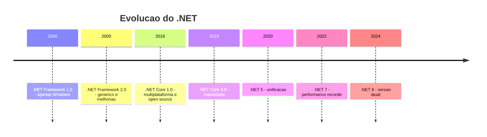
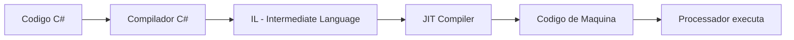
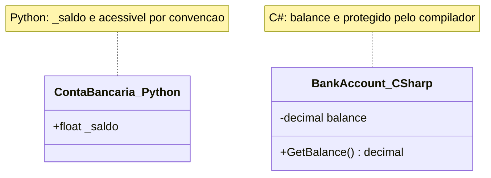

# 9.2 — Por que C# e .NET? Uma Nova Linguagem

[← Anterior: Procedural vs OOP](cap09-mod01-procedural-vs-oop-conteudo.md) · [Próximo: Ambiente .NET →](cap09-mod03-ambiente-dotnet-conteudo.md)

---

## Introdução

No módulo anterior, vimos que a programação procedural — o estilo que usamos em Python e C até agora — começa a criar problemas quando os programas ficam grandes. Vimos que a Programação Orientada a Objetos (OOP) resolve esses problemas agrupando dados e comportamentos em objetos. E vimos que linguagens como Java e C# foram criadas especificamente para trabalhar com OOP.

Agora vem a pergunta: por que vamos usar C# e não continuar com Python?

Python suporta OOP. Você pode criar classes, usar herança, implementar polimorfismo — tudo em Python. Mas Python é **flexível demais**. Ele permite que você faça OOP de forma "relaxada", sem forçar boas práticas. Você pode misturar procedural e OOP livremente, acessar atributos privados sem restrição, e ignorar tipos. Isso é ótimo para produtividade, mas ruim para aprender OOP de verdade.

C# é mais rigoroso. Ele exige que você declare tipos, use modificadores de acesso (public/private), e siga convenções. Isso pode parecer chato no início, mas é exatamente o que você precisa para internalizar os conceitos de OOP. Depois que aprender OOP "direito" em C#, vai conseguir aplicar em qualquer linguagem — Python, Java, Kotlin, TypeScript.

Neste módulo, vamos conhecer C# e a plataforma .NET: de onde vieram, por que existem, onde são usados e como se comparam com Python e C.

---

## Como Executar os Exemplos Deste Módulo

Este módulo é majoritariamente conceitual — não tem código para executar ainda. No próximo módulo (9.3), vamos instalar o ambiente .NET e escrever nosso primeiro programa em C#. Por enquanto, foque em entender os conceitos e as comparações.

---

## A História do C# e .NET

### O Contexto: A Guerra das Linguagens nos Anos 1990

Para entender por que C# existe, precisamos voltar aos anos 1990. Java, lançada pela Sun Microsystems em 1995, estava dominando o mercado. A promessa de "Write Once, Run Anywhere" (Escreva Uma Vez, Rode em Qualquer Lugar) era revolucionária — o mesmo programa Java rodava em Windows, Linux e Mac sem alteração.

A Microsoft tentou criar sua própria versão de Java (chamada Visual J++), mas a Sun processou a Microsoft por violar a licença. A Microsoft perdeu o processo e ficou sem poder usar Java do seu jeito.

A resposta da Microsoft foi criar algo melhor. Em 1999, Anders Hejlsberg — um engenheiro brilhante que já tinha criado o Turbo Pascal e o Delphi — começou a liderar o projeto de uma nova linguagem. O resultado foi **C#**, anunciada em 2000 junto com a plataforma **.NET Framework**.

### Anders Hejlsberg: O Criador

Anders Hejlsberg é dinamarquês e é considerado um dos maiores designers de linguagens de programação da história. Antes de C#, ele criou:

- **Turbo Pascal** (1983) — um compilador Pascal extremamente rápido que revolucionou a programação em PCs
- **Delphi** (1995) — uma linguagem e IDE para desenvolvimento rápido de aplicações Windows

Com C#, Hejlsberg pegou o melhor de Java (segurança de tipos, garbage collector, multiplataforma), o melhor de C++ (performance, controle) e o melhor de Delphi (produtividade, componentes visuais), e criou uma linguagem que muitos consideram superior a todas elas.

Curiosidade: em 2012, Hejlsberg também criou **TypeScript**, a linguagem que adiciona tipos ao JavaScript. Se você já ouviu falar de TypeScript, saiba que foi o mesmo cara que criou C#.

### A Evolução do .NET

A plataforma .NET passou por uma evolução importante:

| Período | Plataforma | Característica |
|---------|-----------|----------------|
| 2000-2015 | .NET Framework | Apenas Windows, código fechado |
| 2016-2019 | .NET Core | Multiplataforma, open source |
| 2020+ | .NET 5, 6, 7, 8, 9 | Unificação, multiplataforma, open source |

No início, .NET só rodava em Windows. Isso limitava muito sua adoção. Em 2016, a Microsoft fez algo surpreendente: lançou o **.NET Core**, uma versão completamente nova, **open source** e **multiplataforma**. C# agora roda em Windows, Linux e macOS.

A partir do .NET 5 (2020), a Microsoft unificou tudo em uma única plataforma chamada simplesmente ".NET". Quando dizemos ".NET" hoje, estamos falando da versão moderna, open source e multiplataforma.



---

## O que é C#?

C# é uma linguagem de programação de propósito geral, fortemente tipada, orientada a objetos, que roda na plataforma .NET. Vamos destrinchar cada parte dessa definição:

### Propósito Geral

C# pode ser usada para praticamente qualquer tipo de software:

| Tipo de Software | Exemplo | Framework/Tecnologia |
|-----------------|---------|---------------------|
| Aplicações web | Sites, APIs REST | ASP.NET Core |
| Aplicações desktop | Programas Windows | WPF, WinForms, MAUI |
| Jogos | Jogos 2D e 3D | Unity |
| Aplicativos mobile | Apps Android e iOS | .NET MAUI, Xamarin |
| Microserviços | Serviços em nuvem | ASP.NET Core, gRPC |
| Ferramentas CLI | Programas de terminal | Console Application |
| Machine Learning | Modelos de IA | ML.NET |

### Fortemente Tipada

Em Python, você pode fazer isso:

```python
# Python — tipagem dinâmica
# "x" = variável genérica
x = 42          # x é um número inteiro
x = "texto"     # agora x é uma string — Python não reclama
x = [1, 2, 3]   # agora x é uma lista — Python continua não reclamando
```

Saída esperada: nenhuma (não há erro)

Em C#, isso não funciona:

```csharp
// C# — tipagem estática
// "x" = variável
int x = 42;        // x é um inteiro
x = "texto";       // ERRO! x foi declarado como int, não pode receber string
```

Saída esperada: erro de compilação

Isso pode parecer limitante, mas é uma vantagem enorme. O compilador de C# detecta erros **antes** do programa rodar. Em Python, um erro de tipo só aparece quando o programa executa aquela linha — que pode ser em produção, com usuários reais. Em C#, o compilador te avisa na hora.

### Orientada a Objetos

C# foi projetada desde o início para OOP. Tudo em C# vive dentro de classes. Até o ponto de entrada do programa (o `Main`) é um método de uma classe. Isso força você a pensar em termos de objetos desde o primeiro programa.

### Garbage Collector

Lembra do capítulo 7, quando usamos `malloc()` e `free()` em C para gerenciar memória manualmente? Em C#, isso não é necessário. O **garbage collector** (coletor de lixo) monitora a memória automaticamente e libera objetos que não estão mais sendo usados.

| Aspecto | C (manual) | C# (automático) |
|---------|-----------|-----------------|
| Alocar memória | `malloc(sizeof(int))` | `new int()` ou simplesmente `int x;` |
| Liberar memória | `free(ptr)` — obrigatório | Automático pelo garbage collector |
| Risco de vazamento | Alto — esquecer `free()` causa memory leak | Baixo — GC cuida disso |
| Risco de acesso inválido | Alto — usar ponteiro após `free()` | Inexistente — GC impede |
| Performance | Mais controle, mais rápido em teoria | Pequeno overhead do GC |

---

## C# vs Python vs C: Comparação Detalhada

Você já conhece Python (capítulo 5) e C (capítulo 7). Vamos comparar as três linguagens para que você entenda onde C# se encaixa.

### Analogia: Ferramentas de Trabalho

Pense nas três linguagens como ferramentas de trabalho:

- **Python** é como um **canivete suíço** — faz muita coisa, é rápido de usar, cabe no bolso. Perfeito para resolver problemas rápidos, automatizar tarefas e prototipar ideias. Mas não é a melhor ferramenta para construir uma casa.

- **C** é como uma **chave de fenda manual** — dá controle total, você sente cada parafuso. Perfeito para trabalho de precisão onde você precisa saber exatamente o que está acontecendo. Mas é lento e trabalhoso para projetos grandes.

- **C#** é como uma **caixa de ferramentas profissional** — cada ferramenta no lugar certo, organizada por tipo, com proteções de segurança. Leva mais tempo para aprender a usar tudo, mas quando você domina, constrói coisas grandes com qualidade e eficiência.

### Tabela Comparativa Completa

| Aspecto | Python | C | C# |
|---------|--------|---|-----|
| Criador | Guido van Rossum (1991) | Dennis Ritchie (1972) | Anders Hejlsberg (2000) |
| Paradigma principal | Multiparadigma | Procedural | Orientado a Objetos |
| Tipagem | Dinâmica | Estática | Estática com inferência |
| Compilação | Interpretado | Compilado para binário | Compilado para IL, depois JIT |
| Gerenciamento de memória | Garbage collector | Manual (malloc/free) | Garbage collector |
| Performance | Mais lenta | Muito rápida | Rápida |
| Curva de aprendizado | Suave | Íngreme | Moderada |
| Verbosidade | Baixa | Média | Média-alta |
| Uso principal | Scripts, IA, web, automação | Sistemas, embarcados, kernel | Web, jogos, desktop, APIs |
| OOP | Suporta, não obriga | Não suporta nativamente | Obriga (quase tudo é classe) |
| Segurança de tipos | Fraca (erros em runtime) | Forte (mas sem proteção de memória) | Forte (erros em compilação) |
| Ecossistema de pacotes | pip (PyPI) | Não tem padrão | NuGet |
| IDE recomendada | VSCode, PyCharm | VSCode, CLion | VSCode, Visual Studio, Rider |

### Exemplos de Sintaxe Lado a Lado

Vamos ver como o mesmo programa fica nas três linguagens. Um programa simples que calcula a média de 3 notas:

**Python:**

```python
# Calcula a média de 3 notas
# "grade" = nota, "average" = média
grade1 = 8.5
grade2 = 7.0
grade3 = 9.5

average = (grade1 + grade2 + grade3) / 3
print(f"Média: {average:.1f}")

if average >= 7.0:
    print("Aprovado!")
else:
    print("Reprovado!")
```

Saída esperada:
```
Média: 8.3
Aprovado!
```

**C:**

```c
// Calcula a média de 3 notas
// "grade" = nota, "average" = média
#include <stdio.h>

int main() {
    float grade1 = 8.5;
    float grade2 = 7.0;
    float grade3 = 9.5;

    float average = (grade1 + grade2 + grade3) / 3;
    printf("Média: %.1f\n", average);

    if (average >= 7.0) {
        printf("Aprovado!\n");
    } else {
        printf("Reprovado!\n");
    }

    return 0;
}
```

Saída esperada:
```
Média: 8.3
Aprovado!
```

**C#:**

```csharp
// Calcula a média de 3 notas
// "grade" = nota, "average" = média
double grade1 = 8.5;
double grade2 = 7.0;
double grade3 = 9.5;

double average = (grade1 + grade2 + grade3) / 3;
Console.WriteLine($"Média: {average:F1}");

if (average >= 7.0)
{
    Console.WriteLine("Aprovado!");
}
else
{
    Console.WriteLine("Reprovado!");
}
```

Saída esperada:
```
Média: 8.3
Aprovado!
```

Observe as semelhanças e diferenças:

| Elemento | Python | C | C# |
|----------|--------|---|-----|
| Declarar variável | `grade1 = 8.5` | `float grade1 = 8.5;` | `double grade1 = 8.5;` |
| Ponto e vírgula | Não usa | Obrigatório | Obrigatório |
| Chaves para blocos | Não usa (indentação) | Obrigatório `{ }` | Obrigatório `{ }` |
| Imprimir na tela | `print()` | `printf()` | `Console.WriteLine()` |
| Interpolação de string | `f"texto {var}"` | `printf("texto %f", var)` | `$"texto {var}"` |
| Tipo de número decimal | Automático (float) | `float` ou `double` | `double` ou `decimal` |

C# se parece mais com C do que com Python na sintaxe (ponto e vírgula, chaves), mas se parece mais com Python na facilidade de uso (garbage collector, interpolação de strings, sem ponteiros).

---

## Como C# Funciona: Compilação e Execução

Quando você escreve um programa em Python e roda `python3 programa.py`, o interpretador Python lê o código linha por linha e executa. Quando você escreve em C e roda `gcc programa.c -o programa`, o compilador transforma o código diretamente em linguagem de máquina (binário) que o processador entende.

C# faz algo diferente — um processo em duas etapas:

### Etapa 1: Compilação para IL

Quando você roda `dotnet build`, o compilador C# transforma seu código em **IL** (Intermediate Language, ou Linguagem Intermediária). IL não é código de máquina — é um código intermediário que a plataforma .NET entende.

### Etapa 2: JIT Compilation

Quando você roda o programa (`dotnet run`), o **JIT Compiler** (Just-In-Time Compiler, ou Compilador Sob Demanda) transforma o IL em código de máquina nativo para o seu processador. Isso acontece na hora da execução.



### Por que Duas Etapas?

Essa abordagem tem uma vantagem enorme: o mesmo código IL roda em qualquer sistema operacional que tenha o .NET instalado. O compilador C# gera IL uma vez, e o JIT de cada plataforma (Windows, Linux, macOS) transforma em código nativo para aquele sistema.

É o mesmo conceito da JVM (Java Virtual Machine) que mencionamos no módulo anterior. Java compila para bytecode, C# compila para IL — a ideia é a mesma.

| Linguagem | Etapa 1 | Etapa 2 | Resultado |
|-----------|---------|---------|-----------|
| Python | Interpretação direta | — | Mais lento, mais flexível |
| C | Compilação para binário nativo | — | Mais rápido, específico por plataforma |
| C# | Compilação para IL | JIT para código nativo | Rápido, multiplataforma |
| Java | Compilação para bytecode | JVM interpreta/JIT | Similar ao C# |

---

## Onde C# é Usado no Mundo Real

C# não é uma linguagem de nicho — é uma das mais usadas no mundo. Vamos ver onde ela aparece:

### Jogos com Unity

A **Unity** é uma das engines de jogos mais populares do mundo. Mais de 50% dos jogos mobile e uma parcela significativa dos jogos indie para PC e consoles são feitos com Unity. E a linguagem de programação da Unity é C#.

Jogos famosos feitos com Unity e C#:
- **Hollow Knight** — jogo indie de plataforma aclamado pela crítica
- **Cuphead** — jogo com visual de desenho animado dos anos 1930
- **Cities: Skylines** — simulador de cidades
- **Pokémon Go** — o jogo de realidade aumentada que fez o mundo sair de casa
- **Among Us** — o jogo de dedução social que explodiu durante a pandemia
- **Genshin Impact** — RPG de mundo aberto com milhões de jogadores

Se você já jogou algum desses, estava interagindo com código C#.

### Aplicações Web e APIs

O **ASP.NET Core** é um dos frameworks web mais performáticos que existem. Empresas como Stack Overflow (o site de perguntas e respostas que todo programador usa), GoDaddy e UPS usam C# e ASP.NET para suas aplicações web.

O Stack Overflow, por exemplo, atende milhões de requisições por dia com apenas alguns servidores — graças à performance do C# e ASP.NET.

### Aplicações Empresariais

Bancos, seguradoras, empresas de telecomunicação e governos usam C# extensivamente. O ecossistema .NET é maduro, tem suporte de longo prazo da Microsoft, e oferece ferramentas robustas para desenvolvimento empresarial.

### Desktop e Mobile

Aplicações Windows como o Visual Studio (a IDE da Microsoft) são escritas em C#. Com .NET MAUI, é possível criar aplicativos que rodam em Android, iOS, Windows e macOS a partir do mesmo código C#.

### Cloud e Microserviços

C# é uma das linguagens mais usadas no Azure (a nuvem da Microsoft), mas também roda perfeitamente em AWS e Google Cloud. O suporte a containers (Docker) e orquestração (Kubernetes) é excelente.

---

## O Ecossistema .NET

Quando falamos de C#, não estamos falando apenas da linguagem — estamos falando de todo um ecossistema:

### O SDK (Software Development Kit)

O .NET SDK é o pacote que você instala para desenvolver em C#. Ele inclui:

- **Compilador C#** — transforma seu código em IL
- **Runtime** — executa programas .NET
- **dotnet CLI** — ferramenta de linha de comando para criar, compilar e rodar projetos
- **Bibliotecas padrão** — milhares de classes prontas para uso (manipulação de strings, arquivos, rede, coleções, etc.)

### NuGet: O Gerenciador de Pacotes

Assim como Python tem o `pip` para instalar bibliotecas, C# tem o **NuGet**. Com NuGet, você pode instalar bibliotecas de terceiros com um comando:

```bash
# Instalar uma biblioteca via NuGet (similar ao pip install)
dotnet add package Newtonsoft.Json
```

O repositório NuGet tem mais de 350.000 pacotes disponíveis — desde bibliotecas para acessar bancos de dados até frameworks de teste e ferramentas de logging.

### Ferramentas de Desenvolvimento

| Ferramenta | Tipo | Custo | Plataforma |
|-----------|------|-------|-----------|
| Visual Studio Code | Editor leve | Gratuito | Windows, Linux, macOS |
| Visual Studio | IDE completa | Gratuito (Community) | Windows, macOS |
| JetBrains Rider | IDE completa | Pago (gratuito para estudantes) | Windows, Linux, macOS |
| dotnet CLI | Linha de comando | Gratuito | Windows, Linux, macOS |

Neste curso, vamos usar o **VSCode** com a extensão C# — o mesmo editor que você já usa para Python. No próximo módulo, vamos configurar tudo.

---

## Tipos de Dados em C#: Uma Prévia

Antes de instalar o ambiente (próximo módulo), vamos ter uma prévia dos tipos de dados em C#. Isso vai te ajudar a entender o código quando começarmos a programar.

### Tipos Numéricos

| Tipo C# | Equivalente Python | Tamanho | Faixa de valores | Uso comum |
|---------|-------------------|---------|-------------------|-----------|
| `int` | `int` | 4 bytes | -2 bilhões a +2 bilhões | Números inteiros |
| `long` | `int` (grande) | 8 bytes | Muito grande | IDs, contadores grandes |
| `float` | `float` | 4 bytes | 7 dígitos de precisão | Pouco usado |
| `double` | `float` | 8 bytes | 15 dígitos de precisão | Números decimais gerais |
| `decimal` | — | 16 bytes | 28 dígitos de precisão | Dinheiro e finanças |
| `byte` | — | 1 byte | 0 a 255 | Dados binários |

A diferença entre `double` e `decimal` é importante: `double` é mais rápido mas pode ter erros de arredondamento (0.1 + 0.2 pode dar 0.30000000000000004). `decimal` é mais lento mas preciso — use para dinheiro.

### Tipos de Texto e Lógico

| Tipo C# | Equivalente Python | Descrição |
|---------|-------------------|-----------|
| `string` | `str` | Texto (sequência de caracteres) |
| `char` | — | Um único caractere |
| `bool` | `bool` | Verdadeiro ou falso (`true`/`false`) |

### Declaração de Variáveis

```csharp
// Declaração explícita — você diz o tipo
// "name" = nome, "age" = idade, "price" = preço
string name = "Maria";
int age = 25;
double price = 49.90;
bool isActive = true;    // "isActive" = está ativo

// Declaração com inferência — o compilador descobre o tipo
// "var" = o compilador infere o tipo automaticamente
var city = "São Paulo";   // o compilador sabe que é string
var count = 42;           // o compilador sabe que é int
var total = 99.90;        // o compilador sabe que é double
```

Saída esperada: nenhuma (são apenas declarações)

A palavra-chave `var` é um atalho: o compilador olha o valor que você está atribuindo e descobre o tipo automaticamente. Mas atenção: uma vez definido, o tipo não muda. `var x = 42;` faz `x` ser `int` para sempre — você não pode depois fazer `x = "texto"`.

---

## Por que Não Continuar com Python?

Essa é uma pergunta justa. Python suporta OOP. Por que aprender uma linguagem nova?

### 1. Python é Flexível Demais para Aprender OOP

Em Python, tudo é público por padrão. Não existe `private` de verdade — existe uma convenção de usar `_` no início do nome, mas nada impede o acesso. Em C#, `private` é `private` — o compilador não deixa acessar.

```python
# Python — "private" é apenas convenção
class ContaBancaria:
    def __init__(self):
        self._saldo = 1000  # O "_" é convenção, não proteção

conta = ContaBancaria()
conta._saldo = -500  # Python permite! Ninguém te impede
print(conta._saldo)  # -500 — saldo negativo sem validação
```

Saída esperada:
```
-500
```

Em C#, isso seria impossível:

```csharp
// C# — private é enforced pelo compilador
// "BankAccount" = Conta Bancaria
// "balance" = saldo
class BankAccount
{
    private decimal balance = 1000;  // private de verdade

    public decimal GetBalance()  // "GetBalance" = obter saldo
    {
        return balance;
    }
}

var account = new BankAccount();
// account.balance = -500;  // ERRO DE COMPILAÇÃO! Não compila.
```

Saída esperada: erro de compilação se tentar acessar `balance` diretamente

Veja a diferenca entre as duas abordagens em um diagrama de classes:



### 2. Tipagem Estática Pega Erros Antes

Em Python, erros de tipo só aparecem quando o programa roda. Em C#, o compilador pega na hora.

```python
# Python — erro só aparece em runtime
# "calculate_total" = calcular total
def calculate_total(price, quantity):
    return price * quantity

# Isso roda sem erro... até chegar nessa linha
result = calculate_total("abc", 5)  # "abc" * 5 = "abcabcabcabcabc" — não é o que queríamos!
print(result)
```

Saída esperada:
```
abcabcabcabcabc
```

Em C#, o compilador impediria isso:

```csharp
// C# — erro detectado em compilação
// "CalculateTotal" = calcular total
double CalculateTotal(double price, int quantity)
{
    return price * quantity;
}

// CalculateTotal("abc", 5);  // ERRO! "abc" não é double
```

### 3. C# é Amplamente Usado no Mercado

C# está consistentemente entre as 5 linguagens mais usadas no mundo (segundo o índice TIOBE e pesquisas do Stack Overflow). Saber C# abre portas para:

- Desenvolvimento de jogos (Unity)
- Desenvolvimento web (ASP.NET Core)
- Desenvolvimento empresarial
- Desenvolvimento mobile (.NET MAUI)
- Cloud e microserviços

### 4. Os Conceitos Transferem para Qualquer Linguagem

Aprender OOP em C# te prepara para Java, Kotlin, TypeScript, Swift e qualquer outra linguagem OOP. Os conceitos são os mesmos — muda apenas a sintaxe.

---

---

## C# no Contexto das Linguagens Modernas

C# não existe isolada. Ela faz parte de um ecossistema de linguagens modernas que compartilham conceitos e influenciam umas às outras. Entender onde C# se posiciona ajuda a ver o panorama completo.

### A Família de Linguagens com Chaves

C# pertence à família de linguagens que usam chaves `{ }` para delimitar blocos de código. Essa família inclui C, C++, Java, JavaScript, TypeScript, Go, Rust, Kotlin e Swift. Se você aprender a sintaxe de uma, as outras ficam mais familiares.

Essa família contrasta com linguagens que usam indentação (Python) ou palavras-chave (Ruby, Pascal). Não existe "melhor" — são apenas convenções diferentes.

### Linguagens que Rodam no .NET

C# não é a única linguagem que roda na plataforma .NET. Outras linguagens também compilam para IL e usam o mesmo runtime:

| Linguagem | Estilo | Uso principal |
|-----------|--------|---------------|
| C# | OOP, imperativa | Propósito geral |
| F# | Funcional | Análise de dados, finanças |
| VB.NET | OOP, verbosa | Legado, aplicações empresariais |
| PowerShell | Scripting | Automação de sistemas |

Na prática, C# domina o ecossistema .NET. F# tem uma comunidade menor mas apaixonada, especialmente no setor financeiro. VB.NET é usado principalmente em sistemas legados.

### O Ritmo de Evolução do C#

Uma coisa impressionante sobre C# é o ritmo de evolução. A linguagem recebe atualizações anuais com funcionalidades novas:

| Versão | Ano | Funcionalidade marcante |
|--------|-----|------------------------|
| C# 1.0 | 2002 | Versão inicial |
| C# 2.0 | 2005 | Generics (tipos genéricos) |
| C# 3.0 | 2007 | LINQ (consultas integradas) |
| C# 5.0 | 2012 | async/await (programação assíncrona) |
| C# 6.0 | 2015 | Interpolação de strings |
| C# 8.0 | 2019 | Nullable reference types |
| C# 9.0 | 2020 | Records (tipos imutáveis) |
| C# 10.0 | 2021 | Global usings, file-scoped namespaces |
| C# 11.0 | 2022 | Raw string literals |
| C# 12.0 | 2023 | Primary constructors |
| C# 13.0 | 2024 | Params collections |

Não se preocupe em entender todas essas funcionalidades agora. O importante é saber que C# é uma linguagem viva, que evolui constantemente. Quando você aprender os fundamentos, as funcionalidades novas serão extensões naturais do que já sabe.

### Open Source e Comunidade

Desde 2014, o .NET é open source. O código-fonte está no GitHub, qualquer pessoa pode contribuir, e a comunidade é ativa. A .NET Foundation, uma organização independente, governa o ecossistema.

Isso é importante porque significa que C# não depende exclusivamente da Microsoft. Se a Microsoft decidisse abandonar o .NET (improvável, mas hipotético), a comunidade poderia continuar o desenvolvimento. É o mesmo modelo que Linux, Python e muitos outros projetos open source seguem.

---

## O que Vem a Seguir

No próximo módulo (9.3), vamos:
- Instalar o .NET SDK no seu computador
- Conhecer a ferramenta `dotnet` de linha de comando
- Criar nosso primeiro projeto C#
- Escrever e executar o clássico "Hello World" em C#
- Comparar lado a lado: Hello World em Python vs C vs C#

A partir daí, cada módulo vai construir sobre o anterior, adicionando conceitos de OOP progressivamente.

---

## Como a IA pode te ajudar aqui
**Prompt 1 — Comparar alternativas:**
> "Compare C# com [linguagem que conheço]. Quais são as principais diferenças de sintaxe?"

**Prompt 2 — Listar e descobrir:**
> "Quais empresas no Brasil usam C# e .NET? Que tipo de sistemas elas constroem?"

**Prompt 3 — Explorar o conceito:**
> "Explique a diferença entre compilação JIT e interpretação como se eu tivesse 10 anos."

---

## Casos de Uso no Mundo Real

### Unity e a Indústria de Jogos

A Unity é usada por mais de 1,5 milhão de desenvolvedores no mundo. Estúdios indie e grandes empresas usam Unity com C# para criar jogos para PC, consoles, mobile e realidade virtual. O mercado de jogos movimenta mais de 180 bilhões de dólares por ano, e uma parcela significativa desse mercado usa C#. Se você sonha em trabalhar com jogos, C# é uma das linguagens mais importantes para aprender.

### Stack Overflow: Performance com C#

O Stack Overflow, o maior site de perguntas e respostas para programadores do mundo, é construído com C# e ASP.NET. O site atende mais de 100 milhões de visitantes por mês com uma infraestrutura surpreendentemente pequena — apenas 9 servidores web. Isso é possível graças à performance do C# e à eficiência do ASP.NET Core. É um exemplo real de como C# pode ser usado para construir sistemas de alta escala.

### Nubank e Fintechs

Embora o Nubank use principalmente Clojure e Kotlin, muitas fintechs e bancos tradicionais no Brasil usam C# e .NET para seus sistemas core. O ecossistema .NET é especialmente forte no setor financeiro por causa da precisão do tipo `decimal` para cálculos monetários, do suporte robusto a transações e da maturidade das ferramentas de segurança.

---

## Resumo do Módulo

| Conceito | Definição |
|----------|-----------|
| C# | Linguagem orientada a objetos criada pela Microsoft em 2000 |
| .NET | Plataforma de desenvolvimento onde C# roda (runtime, bibliotecas, ferramentas) |
| Anders Hejlsberg | Criador do C#, Turbo Pascal, Delphi e TypeScript |
| Tipagem estática | O tipo da variável é definido em compilação e não muda |
| Tipagem dinâmica | O tipo da variável pode mudar em runtime (como Python) |
| IL (Intermediate Language) | Código intermediário gerado pelo compilador C# |
| JIT (Just-In-Time) | Compilador que transforma IL em código nativo na hora da execução |
| Garbage Collector | Sistema automático de gerenciamento de memória |
| NuGet | Gerenciador de pacotes do .NET (equivalente ao pip do Python) |
| var | Palavra-chave que permite inferência de tipo em C# |

---

## Glossário do Módulo

| Termo | Definição |
|-------|-----------|
| Anders Hejlsberg | Engenheiro dinamarquês, criador de C#, TypeScript, Turbo Pascal e Delphi |
| ASP.NET Core | Framework web de alta performance para C# e .NET |
| C# (C Sharp) | Linguagem de programação orientada a objetos da Microsoft, criada em 2000 |
| CLR (Common Language Runtime) | O runtime do .NET que executa programas compilados para IL |
| decimal | Tipo numérico de alta precisão em C#, ideal para valores monetários |
| double | Tipo numérico de ponto flutuante com 15 dígitos de precisão |
| Garbage Collector (GC) | Sistema que libera memória automaticamente quando objetos não são mais usados |
| IL (Intermediate Language) | Código intermediário gerado pelo compilador C#, executado pelo CLR |
| int | Tipo inteiro de 32 bits em C# |
| JIT (Just-In-Time Compiler) | Compilador que transforma IL em código nativo durante a execução |
| .NET | Plataforma de desenvolvimento open source e multiplataforma da Microsoft |
| .NET Core | Versão multiplataforma e open source do .NET, lançada em 2016 |
| .NET Framework | Versão original do .NET, apenas Windows, lançada em 2000 |
| NuGet | Gerenciador de pacotes do ecossistema .NET |
| SDK (Software Development Kit) | Conjunto de ferramentas para desenvolvimento, inclui compilador e runtime |
| string | Tipo de dado para texto em C# |
| Unity | Engine de jogos que usa C# como linguagem de programação |
| var | Palavra-chave em C# para inferência de tipo pelo compilador |

---

## Na Cultura Popular

- **Indie Game: The Movie** (documentário, 2012) — acompanha desenvolvedores indie criando jogos. Muitos jogos indie são feitos com Unity e C#. O documentário mostra a realidade de criar jogos de forma independente.
- **Silicon Valley** (série, 2014-2019) — embora não mencione C# diretamente, a série retrata a cultura de startups de tecnologia e as decisões sobre qual linguagem e plataforma usar. A escolha de tecnologia é um tema recorrente.
- **Halt and Catch Fire** (série, 2014-2017) — mostra a evolução da indústria de software, incluindo a era em que a Microsoft se tornou dominante e começou a criar suas próprias linguagens e plataformas.

---

## Para Saber Mais

- [Microsoft Learn — C#](https://learn.microsoft.com/pt-br/dotnet/csharp/) — *Documentação oficial de C# em português, com tutoriais interativos*
- [.NET Interactive Notebooks](https://github.com/dotnet/interactive) — *Notebooks interativos para experimentar C# no navegador*
- [Tim Corey — C# Tutorials](https://www.youtube.com/@IAmTimCorey) — *Canal com tutoriais práticos de C# para iniciantes*
- [Exercism — C# Track](https://exercism.org/tracks/csharp) — *Exercícios progressivos de C# com mentoria gratuita*

---

## Perguntas Frequentes (FAQ)

**P: C# é difícil de aprender vindo de Python?**
R: A sintaxe é mais verbosa (ponto e vírgula, chaves, declaração de tipos), mas os conceitos são os mesmos. Se você entende variáveis, condicionais, loops e funções em Python, vai entender em C# — só precisa se acostumar com a sintaxe nova. A maioria dos alunos se adapta em 1-2 semanas.

**P: C# é a mesma coisa que C ou C++?**
R: Não. C# é uma linguagem completamente diferente. O nome sugere evolução (C → C++ → C#), mas C# foi criada do zero. Ela se parece com C na sintaxe (chaves, ponto e vírgula), mas é muito mais moderna e segura. Não tem ponteiros, não tem malloc/free, e tem garbage collector.

**P: Preciso de Windows para programar em C#?**
R: Não. Desde 2016, com o .NET Core, C# roda em Windows, Linux e macOS. Vamos instalar e usar no Linux no próximo módulo.

**P: C# é gratuito?**
R: Sim. O .NET SDK, o compilador, o runtime e o VSCode são todos gratuitos e open source. O Visual Studio Community (IDE completa) também é gratuito para uso individual e pequenas equipes.

**P: Java e C# são parecidos?**
R: Muito. C# foi fortemente inspirada em Java. A sintaxe é similar, ambas usam garbage collector, ambas compilam para código intermediário (bytecode/IL), e ambas são fortemente tipadas e orientadas a objetos. Se você aprender C#, vai conseguir ler código Java com facilidade.

**P: O que é melhor: C# ou Java?**
R: Depende do contexto. Java domina no Android e em sistemas corporativos tradicionais. C# domina em jogos (Unity), aplicações Windows e no ecossistema Microsoft. Ambas são excelentes linguagens OOP. A escolha geralmente depende do projeto e da empresa.

**P: Vou precisar desinstalar Python para usar C#?**
R: Não. Python e .NET coexistem perfeitamente no mesmo computador. Você pode ter Python, C (gcc), e .NET instalados ao mesmo tempo sem conflito.

**P: O que é .NET MAUI?**
R: .NET MAUI (Multi-platform App UI) é um framework para criar aplicativos que rodam em Android, iOS, Windows e macOS a partir do mesmo código C#. É o sucessor do Xamarin.

**P: TypeScript e C# foram criados pela mesma pessoa?**
R: Sim. Anders Hejlsberg criou ambas. Por isso TypeScript e C# têm semelhanças na forma de lidar com tipos e na filosofia de design. Se você aprender C#, TypeScript vai parecer familiar.

**P: Quanto ganha um desenvolvedor C# no Brasil?**
R: Varia muito por região e experiência, mas desenvolvedores C# júnior costumam ganhar entre R$3.000 e R$5.000, plenos entre R$6.000 e R$12.000, e seniores acima de R$12.000. Vagas remotas para empresas internacionais podem pagar significativamente mais.

**P: C# é mais rápido que Python?**
R: Sim, significativamente. C# é compilado e usa JIT, enquanto Python é interpretado. Para a maioria das aplicações, C# é 10 a 100 vezes mais rápido que Python. Isso importa em aplicações web de alta escala, jogos e processamento de dados. Para scripts simples e automações, a diferença de performance raramente importa.

**P: Posso usar C# para criar sites?**
R: Sim. O ASP.NET Core é um dos frameworks web mais populares e performáticos. Ele permite criar APIs REST, aplicações web com Razor Pages, e aplicações de página única (SPA) com Blazor. Muitos sites de grande escala usam ASP.NET Core.

**P: O que significa o "#" no nome C#?**
R: O símbolo "#" (sharp) vem da notação musical. Em música, o sustenido (sharp) indica uma nota meio tom acima. C# seria "C elevado" — uma versão melhorada de C. Na prática, o nome foi escolhido para sugerir evolução a partir de C e C++ (o "#" também pode ser visto como quatro sinais de "+" sobrepostos).

---

## Exercícios Práticos

### Exercício 1: Pesquisa de Mercado

Acesse sites de vagas de emprego (LinkedIn, Glassdoor, Gupy) e pesquise por vagas que pedem C# ou .NET. Anote:
1. Quantas vagas encontrou na sua região?
2. Quais são os requisitos mais comuns além de C#?
3. Qual a faixa salarial?
4. Que tipo de empresa contrata (jogos, fintech, consultoria, etc.)?

### Exercício 2: Tradução Mental

Para cada trecho de código Python abaixo, tente imaginar como ficaria em C# (não precisa ser sintaxe perfeita — o objetivo é pensar sobre tipos):

```python
# 1
name = "João"
age = 25
height = 1.75
is_student = True

# 2
numbers = [1, 2, 3, 4, 5]
total = sum(numbers)

# 3
if age >= 18:
    print("Maior de idade")
else:
    print("Menor de idade")
```

Dica: em C#, você precisa declarar o tipo de cada variável (`string`, `int`, `double`, `bool`).

### Exercício 3: Jogos e C#

Pesquise 5 jogos que foram feitos com Unity (e portanto usam C#). Para cada jogo, anote:
1. Nome do jogo
2. Plataformas onde roda (PC, mobile, console)
3. Estúdio que desenvolveu
4. Se é indie ou de uma grande empresa

Isso ajuda a visualizar o alcance real do C# na indústria de jogos.

### Exercício 4: Compilação em Duas Etapas

Desenhe (em papel ou texto) o fluxo de compilação e execução para cada linguagem:
1. Python: código → ???
2. C: código → ???
3. C#: código → ??? → ???

Para cada etapa, explique com suas palavras o que acontece. Qual a vantagem do modelo de duas etapas do C#?

### Exercício 5: Tipos de Dados

Para cada valor abaixo, diga qual tipo C# você usaria e por quê:
1. O nome de um cliente
2. A idade de uma pessoa
3. O preço de um produto
4. Se um usuário está ativo ou não
5. O saldo de uma conta bancária
6. A quantidade de itens em estoque
7. A temperatura em graus Celsius
8. O CPF de uma pessoa (com pontos e traço)

Dica: pense na diferença entre `double` e `decimal` para valores monetários, e entre `int` e `string` para dados que parecem números mas não são usados em cálculos.

### Exercício 6: Reflexão sobre Paradigmas

Escreva um parágrafo curto (5-8 linhas) respondendo: "Por que aprender uma linguagem nova (C#) em vez de continuar usando Python para aprender OOP?" Use argumentos do módulo, mas escreva com suas palavras. Isso ajuda a fixar a motivação antes de mergulhar na prática.

### Exercício 7: Timeline

Sem consultar o módulo, tente montar uma linha do tempo com os marcos principais do .NET: quando foi lançado, quando se tornou open source, quando se tornou multiplataforma, e qual é a versão atual.

---

[← Anterior: Procedural vs OOP](cap09-mod01-procedural-vs-oop-conteudo.md) · [Próximo: Ambiente .NET →](cap09-mod03-ambiente-dotnet-conteudo.md)
