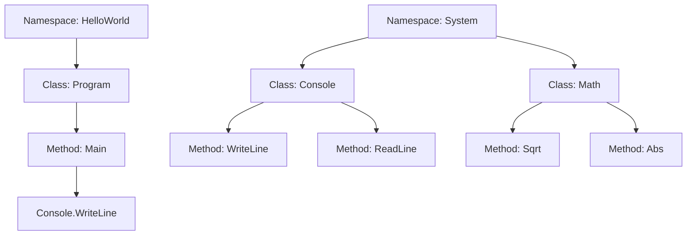
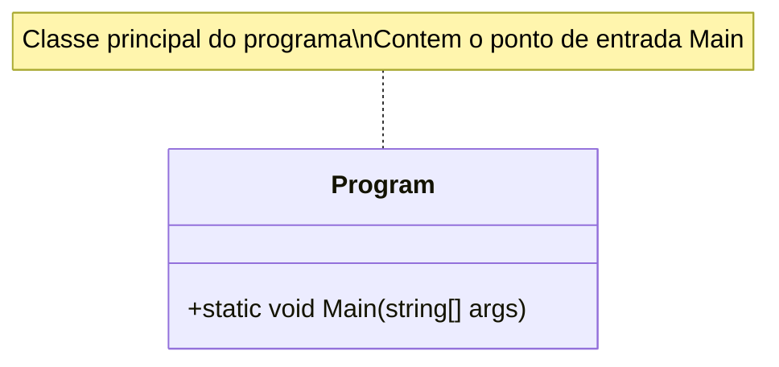
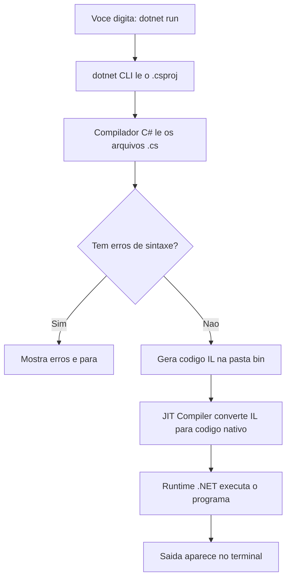

# 9.3 — Ambiente .NET: Instalação e Primeiro Projeto

[← Anterior: Por que C# e .NET?](cap09-mod02-porque-csharp-conteudo.md) · [Próximo: Classes e Objetos →](cap09-mod04-classes-objetos-conteudo.md)

---

## Introdução

No módulo anterior, conhecemos C# e a plataforma .NET: de onde vieram, por que existem, como se comparam com Python e C, e onde são usados no mundo real. Vimos que C# é uma linguagem fortemente tipada, orientada a objetos, que roda em Windows, Linux e macOS. Vimos que o .NET é open source, tem um ecossistema maduro e é usado desde jogos indie até sistemas bancários.

Mas até agora, tudo foi teoria. Você leu sobre C#, viu exemplos de código, comparou com Python e C — mas não executou nada. Isso muda agora.

Neste módulo, vamos colocar a mão na massa. Vamos instalar o .NET SDK no seu computador, conhecer a ferramenta `dotnet` de linha de comando, criar nosso primeiro projeto C# e escrever o clássico "Hello World". Depois, vamos destrinchar cada parte do código — linha por linha — para que você entenda exatamente o que está acontecendo. Vamos comparar o Hello World em Python, C e C# lado a lado. E vamos explorar os tipos básicos de C#, a estrutura de um projeto .NET e o que acontece por baixo dos panos quando você roda `dotnet run`.

Lembra da analogia do módulo anterior? Python é o canivete suíço, C é a chave de fenda manual e C# é a caixa de ferramentas profissional. Pois bem: o .NET SDK é a **oficina completa** — o lugar onde todas as ferramentas ficam organizadas e prontas para uso. E o comando `dotnet` é o **mestre de obras** que sabe montar, compilar e executar tudo para você.

Vamos montar essa oficina.

---

## Como Executar os Exemplos Deste Módulo

A partir deste módulo, todos os exemplos de código são em C# e devem ser executados usando o .NET SDK. O fluxo básico é:

1. Abra o terminal (o mesmo que você usa desde o capítulo 3)
2. Navegue até a pasta do projeto com `cd`
3. Execute o programa com `dotnet run`

Se você ainda não instalou o .NET SDK, a próxima seção vai guiar você passo a passo. Depois da instalação, o ciclo de trabalho será sempre o mesmo:

```bash
# Criar um novo projeto (só na primeira vez)
dotnet new console -n MeuProjeto

# Entrar na pasta do projeto
cd MeuProjeto

# Editar o arquivo Program.cs no VSCode
code Program.cs

# Executar o programa
dotnet run
```

Saída esperada: depende do programa que você escreveu (veremos exemplos em breve)

Esse fluxo é parecido com o que você já faz em Python (`python3 programa.py`) e em C (`gcc programa.c -o programa && ./programa`), mas com uma diferença importante: o `dotnet run` faz a compilação E a execução em um único comando. Você não precisa compilar separadamente como em C.

---

## Instalando o .NET SDK

### O que é o SDK?

Antes de instalar, vamos entender o que estamos instalando. O .NET SDK (Software Development Kit, ou Kit de Desenvolvimento de Software) é um pacote que contém tudo que você precisa para desenvolver em C#:

| Componente | O que faz | Analogia |
|-----------|----------|----------|
| Compilador C# | Transforma seu código em IL (Intermediate Language) | O tradutor que converte sua receita para a língua da cozinha |
| Runtime (.NET) | Executa programas compilados | O forno que assa o bolo |
| dotnet CLI | Ferramenta de linha de comando para criar, compilar e rodar projetos | O mestre de obras que coordena tudo |
| Bibliotecas padrão | Milhares de classes prontas para uso | Os ingredientes básicos que já vêm na despensa |
| NuGet (gerenciador de pacotes) | Instala bibliotecas de terceiros | O supermercado onde você compra ingredientes extras |

A diferença entre SDK e Runtime é importante:

- **SDK** = tudo que você precisa para **desenvolver** (compilador + runtime + ferramentas + bibliotecas)
- **Runtime** = apenas o necessário para **executar** programas já compilados

Como desenvolvedor, você precisa do SDK. Servidores em produção precisam apenas do Runtime. Nós vamos instalar o SDK.

### Verificando se Já Está Instalado

Antes de instalar, verifique se o .NET já está no seu computador. Abra o terminal e digite:

```bash
# Verificar se o dotnet está instalado
dotnet --version
```

Saída esperada (se já estiver instalado):
```
9.0.100
```

Se aparecer um número de versão (qualquer versão 6.0 ou superior serve para este curso), você já tem o .NET instalado e pode pular para a seção "Primeiro Projeto". Se aparecer "command not found" ou "comando não encontrado", siga as instruções de instalação abaixo.

### Instalação no Linux (Ubuntu/Debian)

Se você está usando Ubuntu ou Debian (o que é provável se seguiu o capítulo 2), a instalação é feita pelo terminal:

```bash
# Passo 1: Adicionar o repositório da Microsoft
# Isso diz ao seu sistema onde encontrar os pacotes do .NET
wget https://packages.microsoft.com/config/ubuntu/22.04/packages-microsoft-prod.deb -O packages-microsoft-prod.deb
sudo dpkg -i packages-microsoft-prod.deb
rm packages-microsoft-prod.deb

# Passo 2: Atualizar a lista de pacotes
sudo apt-get update

# Passo 3: Instalar o .NET SDK
sudo apt-get install -y dotnet-sdk-9.0
```

Saída esperada (resumida):
```
Reading package lists... Done
Building dependency tree... Done
...
Setting up dotnet-sdk-9.0 ...
```

Depois da instalação, verifique:

```bash
# Confirmar que a instalação funcionou
dotnet --version
```

Saída esperada:
```
9.0.100
```

Se você está usando outra distribuição Linux (Fedora, Arch, openSUSE), o processo é similar mas com comandos diferentes. A documentação oficial em [https://learn.microsoft.com/pt-br/dotnet/core/install/linux](https://learn.microsoft.com/pt-br/dotnet/core/install/linux) tem instruções para cada distribuição.

### Instalação no macOS

No macOS, a forma mais simples é usar o Homebrew (o gerenciador de pacotes do macOS que você pode ter visto no capítulo 2):

```bash
# Opção 1: Com Homebrew (recomendado)
brew install dotnet-sdk

# Opção 2: Baixar o instalador do site oficial
# Acesse https://dotnet.microsoft.com/download
# Baixe o instalador .pkg para macOS
# Execute o instalador e siga as instruções
```

Depois da instalação:

```bash
# Confirmar que a instalação funcionou
dotnet --version
```

Saída esperada:
```
9.0.100
```

### Instalação no Windows (WSL)

Se você está usando Windows com WSL (Windows Subsystem for Linux), que é o que recomendamos desde o capítulo 2, siga as instruções de Linux acima — o WSL é um Linux rodando dentro do Windows.

Se você está usando Windows nativo (sem WSL), pode baixar o instalador diretamente do site oficial: [https://dotnet.microsoft.com/download](https://dotnet.microsoft.com/download). Baixe o SDK (não o Runtime) e execute o instalador.

### Verificação Completa da Instalação

Depois de instalar, vamos fazer uma verificação mais completa para garantir que tudo está funcionando:

```bash
# Ver a versão do SDK
dotnet --version

# Ver informações detalhadas sobre o ambiente .NET
dotnet --info
```

Saída esperada (resumida):
```
.NET SDK:
 Version:           9.0.100
 Commit:            abc123

Runtime Environment:
 OS Name:     ubuntu
 OS Version:  22.04
 OS Platform: Linux
 RID:         linux-x64

.NET SDKs installed:
  9.0.100 [/usr/share/dotnet/sdk]

.NET runtimes installed:
  Microsoft.NETCore.App 9.0.0 [/usr/share/dotnet/shared/Microsoft.NETCore.App]
```

O comando `dotnet --info` mostra tudo: a versão do SDK, o sistema operacional, os SDKs instalados e os runtimes disponíveis. Se você vir algo parecido com isso, está tudo pronto.

---

## O Comando `dotnet`: Seu Mestre de Obras

Lembra que no capítulo 5 você usava `python3` para rodar programas Python? E no capítulo 7 usava `gcc` para compilar programas C? Em C#, a ferramenta principal é o comando `dotnet`. Ele faz tudo: cria projetos, compila, executa, instala pacotes e muito mais.

Vamos conhecer os comandos mais importantes:

### `dotnet new` — Criar Projetos

O comando `dotnet new` cria um novo projeto a partir de um template (modelo). O template mais básico é o `console`, que cria um programa de linha de comando:

```bash
# Criar um novo projeto de console chamado "MeuPrimeiroProjeto"
# "console" = tipo de projeto (programa de terminal)
# "-n" = nome do projeto
dotnet new console -n MeuPrimeiroProjeto
```

Saída esperada:
```
The template "Console App" was created successfully.
```

Esse comando cria uma pasta chamada `MeuPrimeiroProjeto` com a estrutura básica de um projeto C#. Vamos explorar essa estrutura em detalhes mais adiante.

Existem outros templates disponíveis, mas por enquanto vamos usar apenas `console`:

| Template | Comando | O que cria |
|----------|---------|-----------|
| Console App | `dotnet new console` | Programa de terminal |
| Class Library | `dotnet new classlib` | Biblioteca reutilizável |
| Web API | `dotnet new webapi` | API REST |
| MVC Web App | `dotnet new mvc` | Aplicação web com interface |
| xUnit Test | `dotnet new xunit` | Projeto de testes |

Não se preocupe com os outros templates agora. Vamos usar `console` durante todo o capítulo 9.

### `dotnet run` — Compilar e Executar

O comando `dotnet run` é o que você mais vai usar. Ele faz duas coisas de uma vez: compila o código e executa o programa.

```bash
# Entrar na pasta do projeto
cd MeuPrimeiroProjeto

# Compilar e executar
dotnet run
```

Saída esperada:
```
Hello, World!
```

Isso é muito mais simples do que o fluxo em C, onde você precisava compilar com `gcc` e depois executar o binário separadamente:

| Linguagem | Compilar | Executar | Tudo junto |
|-----------|---------|----------|-----------|
| Python | Não precisa | `python3 programa.py` | `python3 programa.py` |
| C | `gcc programa.c -o programa` | `./programa` | `gcc programa.c -o programa && ./programa` |
| C# | `dotnet build` | `dotnet run` (já compila) | `dotnet run` |

### `dotnet build` — Apenas Compilar

Às vezes você quer compilar sem executar — por exemplo, para verificar se o código tem erros de sintaxe:

```bash
# Apenas compilar (sem executar)
dotnet build
```

Saída esperada (quando não há erros):
```
Build succeeded.
    0 Warning(s)
    0 Error(s)
```

Saída esperada (quando há erros):
```
Build FAILED.
Program.cs(5,13): error CS1002: ; expected
    1 Error(s)
```

Perceba que o compilador te diz exatamente onde está o erro: arquivo `Program.cs`, linha 5, coluna 13, e o que está faltando (um ponto e vírgula). Isso é uma das grandes vantagens da tipagem estática — o compilador é seu aliado, não seu inimigo.

### Outros Comandos Úteis

| Comando | O que faz | Quando usar |
|---------|----------|-------------|
| `dotnet new console -n Nome` | Cria novo projeto | No início de cada exercício |
| `dotnet run` | Compila e executa | Para rodar o programa |
| `dotnet build` | Apenas compila | Para verificar erros sem executar |
| `dotnet clean` | Limpa arquivos compilados | Quando algo parece estranho |
| `dotnet add package Nome` | Instala um pacote NuGet | Quando precisar de biblioteca externa |
| `dotnet --info` | Mostra informações do ambiente | Para diagnóstico |

---

## Primeiro Projeto: Hello World em C#

Chegou o momento. Vamos criar e executar nosso primeiro programa em C#. Se você seguiu os passos de instalação, já tem tudo pronto.

### Criando o Projeto

Abra o terminal e execute:

```bash
# Criar o projeto
dotnet new console -n HelloWorld

# Entrar na pasta
cd HelloWorld
```

Saída esperada:
```
The template "Console App" was created successfully.
```

### O que Foi Criado?

Vamos ver o que o `dotnet new` gerou para nós:

```bash
# Listar os arquivos criados
ls -la
```

Saída esperada:
```
total 16
drwxr-xr-x  4 usuario usuario 4096 jan  1 10:00 .
drwxr-xr-x  3 usuario usuario 4096 jan  1 10:00 ..
-rw-r--r--  1 usuario usuario  249 jan  1 10:00 HelloWorld.csproj
drwxr-xr-x  2 usuario usuario 4096 jan  1 10:00 obj
-rw-r--r--  1 usuario usuario  105 jan  1 10:00 Program.cs
```

Dois arquivos e uma pasta. Vamos entender cada um em detalhes mais adiante. Por enquanto, o que importa é o arquivo `Program.cs` — é onde fica o código do programa.

### O Código Gerado

Abra o arquivo `Program.cs` no VSCode:

```bash
# Abrir no VSCode
code Program.cs
```

Você vai ver algo assim:

```csharp
// Programa gerado automaticamente pelo dotnet new console
// Este e o Hello World mais simples possivel em C# moderno
Console.WriteLine("Hello, World!");
```

Saída esperada:
```
Hello, World!
```

Espere — é só isso? Uma linha? Sim. Nas versões mais recentes do C# (a partir do C# 9, lançado em 2020), existe um recurso chamado **top-level statements** (instruções de nível superior) que permite escrever código sem toda a cerimônia de classes e namespaces. O compilador gera tudo isso automaticamente por baixo dos panos.

Mas isso esconde muita coisa. Para aprender de verdade, precisamos ver a versão completa.

### A Versão Completa do Hello World

Vamos reescrever o `Program.cs` com a versão completa, que mostra toda a estrutura de um programa C#:

```csharp
// Versao completa do Hello World em C#
// Cada parte sera explicada em detalhes abaixo

// "using" = importar biblioteca
// "System" = biblioteca padrao do .NET com funcoes basicas
using System;

// "namespace" = espaco de nomes, agrupa classes relacionadas
// "HelloWorld" = nome do nosso projeto
namespace HelloWorld
{
    // "class" = classe, a unidade basica de organizacao em C#
    // "Program" = nome da classe principal
    class Program
    {
        // "static" = pertence a classe, nao a um objeto
        // "void" = nao retorna nenhum valor
        // "Main" = ponto de entrada do programa
        // "string[] args" = argumentos da linha de comando
        static void Main(string[] args)
        {
            // "Console" = classe que lida com o terminal
            // "WriteLine" = escrever uma linha na tela
            Console.WriteLine("Hello, World!");
        }
    }
}
```

Saída esperada:
```
Hello, World!
```

Agora sim. Vamos destrinchar cada parte.

---

## Anatomia de um Programa C#: Linha por Linha

Cada linha do Hello World completo tem um propósito. Vamos entender todas elas, comparando com o que você já conhece de Python e C.

### `using System;` — Importando Bibliotecas

```csharp
// Importa a biblioteca System, que contem Console, Math, String, etc.
using System;
```

Em Python, você faz `import os` ou `from math import sqrt`. Em C, você faz `#include <stdio.h>`. Em C#, você faz `using System;`.

A palavra `using` diz ao compilador: "quero usar as classes que estão dentro do namespace `System`". O namespace `System` contém classes fundamentais como `Console` (para entrada e saída no terminal), `Math` (para operações matemáticas), `String` (para manipulação de texto) e muitas outras.

| Linguagem | Importar biblioteca | Exemplo |
|-----------|-------------------|---------|
| Python | `import` ou `from ... import` | `import math` |
| C | `#include` | `#include <stdio.h>` |
| C# | `using` | `using System;` |

Nas versões mais recentes do C# (10+), o `using System;` é adicionado automaticamente pelo compilador através de um recurso chamado **implicit usings** (usings implícitos). Por isso a versão simplificada não precisa dessa linha. Mas é importante saber que ela existe.

### `namespace HelloWorld` — Organizando o Código

```csharp
// Namespace = espaco de nomes que agrupa classes relacionadas
namespace HelloWorld
{
    // Tudo dentro dessas chaves pertence ao namespace HelloWorld
}
```

Um **namespace** (espaço de nomes) é como uma pasta que agrupa classes relacionadas. Imagine que você tem duas classes chamadas `Product` — uma para o módulo de vendas e outra para o módulo de estoque. Sem namespaces, haveria conflito de nomes. Com namespaces, cada uma fica no seu espaço:

- `Sales.Product` — o produto do módulo de vendas
- `Inventory.Product` — o produto do módulo de estoque

Python tem um conceito similar com módulos e pacotes. Em C, não existe namespace — tudo fica no espaço global, e conflitos de nomes são resolvidos com prefixos (como `SDL_CreateWindow` na biblioteca SDL).



### `class Program` — A Classe Principal

```csharp
// Classe = a unidade basica de organizacao em C#
// Todo codigo em C# vive dentro de uma classe
class Program
{
    // Metodos e dados da classe ficam aqui dentro
}
```

Aqui está uma diferença fundamental entre C# e Python/C: em C#, **todo código precisa estar dentro de uma classe**. Você não pode ter funções soltas como em Python ou C. Até o ponto de entrada do programa (o `Main`) é um método de uma classe.

Isso pode parecer burocrático, mas tem um propósito: forçar organização desde o início. Quando todo código está em classes, fica mais fácil encontrar onde cada coisa está, quem é responsável por quê, e como as partes se conectam.

| Linguagem | Onde fica o código principal? | Obrigatório usar classes? |
|-----------|------------------------------|--------------------------|
| Python | No arquivo, solto | Não, classes são opcionais |
| C | Na função `main()` | Não, C não tem classes |
| C# | No método `Main()` de uma classe | Sim, tudo vive em classes |

A classe `Program` é apenas uma convenção — você poderia chamar de `App`, `Application` ou qualquer outro nome. Mas `Program` é o padrão que o `dotnet new` usa, e a comunidade C# segue essa convenção.

O diagrama a seguir mostra a estrutura basica de um programa C# — o namespace agrupa classes, e a classe `Program` contem o metodo `Main` como ponto de entrada:



### `static void Main(string[] args)` — O Ponto de Entrada

```csharp
// O ponto de entrada do programa — onde a execucao comeca
// "static" = pertence a classe, nao precisa criar um objeto
// "void" = nao retorna valor
// "Main" = nome especial que o .NET reconhece como ponto de entrada
// "string[] args" = array de strings com argumentos da linha de comando
static void Main(string[] args)
{
    // O codigo do programa fica aqui
}
```

Essa é a linha mais densa do programa. Vamos destrinchar cada palavra:

**`static`** — Significa que esse método pertence à classe em si, não a um objeto criado a partir da classe. Vamos entender `static` melhor no módulo sobre classes e objetos. Por enquanto, saiba que o `Main` precisa ser `static` porque quando o programa inicia, nenhum objeto foi criado ainda — o .NET precisa de um ponto de entrada que exista sem precisar criar objetos.

**`void`** — Significa que o método não retorna nenhum valor. Em Python, seria como uma função que não tem `return`. Em C, é o mesmo `void` que você já conhece do capítulo 7.

**`Main`** — É o nome especial que o .NET reconhece como ponto de entrada do programa. Quando você roda `dotnet run`, o runtime procura um método chamado `Main` e começa a execução por ele. É o equivalente ao `main()` em C e ao `if __name__ == "__main__":` em Python.

**`string[] args`** — É um array (lista) de strings que recebe os argumentos da linha de comando. Se você rodar `dotnet run -- Maria 25`, o array `args` vai conter `["Maria", "25"]`. Em C, é o equivalente ao `int argc, char *argv[]`. Em Python, seria `sys.argv`.

| Palavra | Significado | Equivalente em C | Equivalente em Python |
|---------|------------|-------------------|----------------------|
| `static` | Pertence a classe | Não existe | Não existe |
| `void` | Não retorna valor | `void` | Função sem `return` |
| `Main` | Ponto de entrada | `main` | `if __name__ == "__main__"` |
| `string[] args` | Argumentos do terminal | `char *argv[]` | `sys.argv` |

### `Console.WriteLine("Hello, World!");` — Escrevendo na Tela

```csharp
// "Console" = classe que gerencia entrada e saida do terminal
// "WriteLine" = metodo que escreve uma linha e pula para a proxima
// "Hello, World!" = o texto a ser exibido
Console.WriteLine("Hello, World!");
```

`Console` é uma classe da biblioteca padrão do .NET que lida com o terminal. `WriteLine` é um método dessa classe que escreve texto na tela e adiciona uma quebra de linha no final.

| Linguagem | Escrever na tela | Escrever sem quebra de linha |
|-----------|-----------------|------------------------------|
| Python | `print("texto")` | `print("texto", end="")` |
| C | `printf("texto\n")` | `printf("texto")` |
| C# | `Console.WriteLine("texto")` | `Console.Write("texto")` |

Perceba que em C# existem dois métodos: `WriteLine` (escreve e pula linha) e `Write` (escreve sem pular linha). Em C, você controla isso com `\n`. Em Python, o `print()` pula linha por padrão e você usa `end=""` para evitar.

---

## Hello World: Python vs C vs C#

Agora que entendemos cada parte do Hello World em C#, vamos colocar as três linguagens lado a lado. Essa comparação vai te ajudar a mapear o que você já sabe para a nova linguagem.

### Python

```python
# Hello World em Python
# Simples e direto — sem compilacao, sem classes, sem tipos
print("Hello, World!")
```

Saída esperada:
```
Hello, World!
```

### C

```c
// Hello World em C
// Precisa de include, funcao main e return
#include <stdio.h>

int main() {
    printf("Hello, World!\n");
    return 0;
}
```

Saída esperada:
```
Hello, World!
```

### C# (versão completa)

```csharp
// Hello World em C# — versao completa
// Precisa de using, namespace, class, Main
using System;

namespace HelloWorld
{
    class Program
    {
        static void Main(string[] args)
        {
            Console.WriteLine("Hello, World!");
        }
    }
}
```

Saída esperada:
```
Hello, World!
```

### C# (versão simplificada — top-level statements)

```csharp
// Hello World em C# — versao simplificada
// Disponivel a partir do C# 9
Console.WriteLine("Hello, World!");
```

Saída esperada:
```
Hello, World!
```

### Tabela Comparativa

| Aspecto | Python | C | C# completo | C# simplificado |
|---------|--------|---|-------------|-----------------|
| Linhas de código | 1 | 6 | 13 | 1 |
| Precisa importar biblioteca | Não | Sim (`stdio.h`) | Sim (`System`) | Não (implicito) |
| Precisa de função main | Não | Sim | Sim | Não (implicito) |
| Precisa de classe | Não | Não | Sim | Não (implicito) |
| Ponto e virgula | Não | Sim | Sim | Sim |
| Chaves para blocos | Não (indentacao) | Sim | Sim | Não precisa |
| Compilação | Não (interpretado) | Sim (gcc) | Sim (dotnet build) | Sim (dotnet build) |
| Comando para executar | `python3 arquivo.py` | `gcc arquivo.c -o prog && ./prog` | `dotnet run` | `dotnet run` |

A versão simplificada do C# é quase tão concisa quanto Python. Mas por baixo dos panos, o compilador está gerando toda a estrutura completa (namespace, classe, Main) automaticamente. Neste curso, vamos usar a **versão simplificada** na maioria dos exemplos para manter o código limpo, mas é fundamental que você entenda a versão completa — porque em projetos reais com múltiplos arquivos, você vai precisar de namespaces e classes explícitas.

---

## Tipos Básicos em C#: Os Blocos de Construção

No módulo anterior, tivemos uma prévia dos tipos de dados em C#. Agora vamos aprofundar, com exemplos práticos que você pode executar.

Em Python, você não precisa declarar o tipo de uma variável — o interpretador descobre sozinho. Em C, você declara o tipo (`int`, `float`, `char`). Em C#, você também declara o tipo, mas com mais opções e mais segurança.

### Tipos Numéricos Inteiros

Vamos começar pelos números inteiros — os mais simples:

```csharp
// Tipos inteiros em C#
// Cada tipo tem um tamanho diferente em memoria

// "age" = idade — int e o tipo inteiro mais comum
int age = 25;
Console.WriteLine($"Idade: {age}");

// "population" = populacao — long para numeros muito grandes
long population = 8000000000;
Console.WriteLine($"Populacao mundial: {population}");

// "temperature" = temperatura — short para numeros menores
short temperature = -15;
Console.WriteLine($"Temperatura: {temperature} graus");

// "level" = nivel — byte para numeros de 0 a 255
byte level = 99;
Console.WriteLine($"Nivel: {level}");
```

Saída esperada:
```
Idade: 25
Populacao mundial: 8000000000
Temperatura: -15 graus
Nivel: 99
```

Por que tantos tipos inteiros? Porque cada um ocupa um espaço diferente na memória:

| Tipo | Tamanho | Faixa de valores | Quando usar |
|------|---------|------------------|-------------|
| `byte` | 1 byte | 0 a 255 | Dados binarios, níveis, cores RGB |
| `short` | 2 bytes | -32.768 a 32.767 | Números pequenos com sinal |
| `int` | 4 bytes | -2.147.483.648 a 2.147.483.647 | Uso geral — o padrão para inteiros |
| `long` | 8 bytes | -9.2 quintilhoes a +9.2 quintilhoes | IDs de banco de dados, contadores grandes |

Na prática, você vai usar `int` em 90% dos casos. Use `long` quando precisar de números muito grandes (como IDs de banco de dados ou timestamps em milissegundos) e `byte` quando trabalhar com dados binários.

Em Python, existe apenas `int`, que cresce automaticamente conforme necessário — sem limite de tamanho. Isso é conveniente, mas consome mais memória. Em C, os tipos são os mesmos (`int`, `short`, `long`), mas o tamanho pode variar entre plataformas. Em C#, os tamanhos são **garantidos** — um `int` sempre tem 4 bytes, em qualquer plataforma.

### Tipos Numéricos Decimais

Agora os números com casas decimais — aqui C# tem uma diferença importante em relação a Python e C:

```csharp
// Tipos decimais em C#

// "price" = preco — double e o padrao para decimais
double price = 49.90;
Console.WriteLine($"Preco: R${price}");

// "pi" = pi — double tem 15 digitos de precisao
double pi = 3.141592653589793;
Console.WriteLine($"Pi: {pi}");

// "salary" = salario — decimal para valores monetarios
// O sufixo "m" indica que e um decimal (money)
decimal salary = 5432.10m;
Console.WriteLine($"Salario: R${salary}");

// "weight" = peso — float tem apenas 7 digitos de precisao
// O sufixo "f" indica que e um float
float weight = 72.5f;
Console.WriteLine($"Peso: {weight} kg");
```

Saída esperada:
```
Preco: R$49.9
Preco: R$49.90
Pi: 3.141592653589793
Salario: R$5432.10
Peso: 72.5 kg
```

A diferença entre `double`, `float` e `decimal` é crucial:

| Tipo | Tamanho | Precisao | Sufixo | Quando usar |
|------|---------|----------|--------|-------------|
| `float` | 4 bytes | 7 digitos | `f` | Gráficos, jogos, quando precisao não e critica |
| `double` | 8 bytes | 15 digitos | nenhum | Uso geral — o padrão para decimais |
| `decimal` | 16 bytes | 28 digitos | `m` | Dinheiro, financas, cálculos que exigem precisao exata |

### O Problema do Ponto Flutuante

Esse é um conceito importante que vale a pena entender. Veja este exemplo:

```csharp
// O problema classico do ponto flutuante
// "result" = resultado
double result = 0.1 + 0.2;
Console.WriteLine($"0.1 + 0.2 = {result}");

// Agora com decimal
decimal resultExact = 0.1m + 0.2m;
Console.WriteLine($"0.1 + 0.2 = {resultExact} (com decimal)");
```

Saída esperada:
```
0.1 + 0.2 = 0.30000000000000004
0.1 + 0.2 = 0.3 (com decimal)
```

Surpreso? O `double` dá um resultado "errado" (0.30000000000000004 em vez de 0.3). Isso acontece porque `float` e `double` armazenam números em formato binário (base 2), e alguns números decimais (base 10) não têm representação exata em binário — assim como 1/3 não tem representação exata em decimal (0.333333...).

O `decimal` armazena números em base 10, então 0.1 + 0.2 = 0.3 exatamente. Por isso `decimal` é obrigatório para cálculos financeiros — imagine um banco perdendo centavos em cada transação por causa de erros de arredondamento.

Esse problema existe em Python e C também:

```python
# O mesmo problema existe em Python
# "result" = resultado
result = 0.1 + 0.2
print(f"0.1 + 0.2 = {result}")
# Saida: 0.1 + 0.2 = 0.30000000000000004
```

Saída esperada:
```
0.1 + 0.2 = 0.30000000000000004
```

A diferença é que C# oferece o tipo `decimal` como solução nativa. Em Python, você precisaria usar a biblioteca `decimal` (que existe, mas poucos conhecem).

### Tipo Texto: `string`

Strings em C# são muito parecidas com strings em Python:

```csharp
// Strings em C#
// "name" = nome
string name = "Maria";
Console.WriteLine($"Nome: {name}");

// "greeting" = saudacao — concatenacao com +
string greeting = "Ola, " + name + "!";
Console.WriteLine(greeting);

// Interpolacao de string com $ — igual ao f-string do Python
// "city" = cidade, "state" = estado
string city = "Sao Paulo";
string state = "SP";
Console.WriteLine($"Cidade: {city} - {state}");

// Tamanho da string com .Length
// "Length" = comprimento
Console.WriteLine($"O nome tem {name.Length} letras");

// Converter para maiusculas e minusculas
// "ToUpper" = para maiusculas, "ToLower" = para minusculas
Console.WriteLine($"Maiusculas: {name.ToUpper()}");
Console.WriteLine($"Minusculas: {name.ToLower()}");
```

Saída esperada:
```
Nome: Maria
Ola, Maria!
Cidade: Sao Paulo - SP
O nome tem 5 letras
Maiusculas: MARIA
Minusculas: maria
```

A interpolação de strings em C# usa `$"texto {variável}"` — muito parecido com o `f"texto {variável}"` do Python. A diferença é o prefixo: `$` em C#, `f` em Python.

| Operação | Python | C | C# |
|----------|--------|---|-----|
| Criar string | `name = "Maria"` | `char name[] = "Maria";` | `string name = "Maria";` |
| Concatenar | `"Ola " + name` | `strcat(buf, name)` | `"Ola " + name` |
| Interpolar | `f"Ola {name}"` | `printf("Ola %s", name)` | `$"Ola {name}"` |
| Tamanho | `len(name)` | `strlen(name)` | `name.Length` |
| Maiusculas | `name.upper()` | Não tem nativo | `name.ToUpper()` |

Perceba como C# se parece com Python na facilidade de uso de strings, mas com a segurança de tipos de C. Você não precisa se preocupar com buffers, `malloc` ou `strlen` como em C.

### Tipo Lógico: `bool`

O tipo `bool` (booleano) representa verdadeiro ou falso:

```csharp
// Tipo booleano em C#
// "isActive" = esta ativo
bool isActive = true;
Console.WriteLine($"Ativo: {isActive}");

// "hasPermission" = tem permissao
bool hasPermission = false;
Console.WriteLine($"Tem permissao: {hasPermission}");

// Resultado de comparacoes
// "age" = idade
int age = 18;
bool isAdult = age >= 18;  // "isAdult" = e adulto
Console.WriteLine($"Idade: {age}, Adulto: {isAdult}");

// Negacao com !
// "isMinor" = e menor de idade
bool isMinor = !isAdult;
Console.WriteLine($"Menor de idade: {isMinor}");
```

Saída esperada:
```
Ativo: True
Tem permissao: False
Idade: 18, Adulto: True
Menor de idade: False
```

Uma diferença sutil: em C#, os valores booleanos são `true` e `false` (minúsculos), mas quando impressos com `Console.WriteLine`, aparecem como `True` e `False` (com maiúscula). Em Python, são `True` e `False` (com maiúscula). Em C, não existe tipo `bool` nativo (usa-se `int` com 0 e 1, ou `#include <stdbool.h>`).

### Tipo Caractere: `char`

C# tem um tipo específico para um único caractere, assim como C:

```csharp
// Tipo char — um unico caractere
// Usa aspas simples (diferente de string que usa aspas duplas)
// "letter" = letra
char letter = 'A';
Console.WriteLine($"Letra: {letter}");

// "digit" = digito
char digit = '7';
Console.WriteLine($"Digito: {digit}");

// Caracteres especiais
// "newLine" = nova linha
char newLine = '\n';
char tab = '\t';
Console.WriteLine($"Com tab:{tab}texto apos tab");
```

Saída esperada:
```
Letra: A
Digito: 7
Com tab:	texto apos tab
```

Em Python, não existe tipo `char` — um caractere é simplesmente uma string de tamanho 1. Em C, `char` é na verdade um número inteiro pequeno (1 byte). Em C#, `char` é um tipo Unicode de 2 bytes que pode representar qualquer caractere, incluindo acentos, emojis e caracteres de outros idiomas.

| Aspecto | Python | C | C# |
|---------|--------|---|-----|
| Tipo caractere | Não existe (usa `str`) | `char` (1 byte, ASCII) | `char` (2 bytes, Unicode) |
| Aspas para char | Não se aplica | Aspas simples `'A'` | Aspas simples `'A'` |
| Aspas para string | Simples ou duplas | Aspas duplas `"texto"` | Aspas duplas `"texto"` |

### Inferência de Tipo com `var`

C# tem um recurso que torna a declaração de variáveis mais concisa: a palavra-chave `var`. Quando você usa `var`, o compilador olha o valor que está sendo atribuído e descobre o tipo automaticamente:

```csharp
// Declaracao explicita — voce diz o tipo
int age = 25;
string name = "Carlos";
double price = 49.90;

// Declaracao com var — o compilador infere o tipo
// "city" = cidade
var city = "Brasilia";     // o compilador sabe que e string
var count = 42;            // o compilador sabe que e int
var total = 99.90;         // o compilador sabe que e double
var isReady = true;        // o compilador sabe que e bool

// Mostrando que o tipo foi inferido corretamente
Console.WriteLine($"city e do tipo: {city.GetType().Name}");
Console.WriteLine($"count e do tipo: {count.GetType().Name}");
Console.WriteLine($"total e do tipo: {total.GetType().Name}");
Console.WriteLine($"isReady e do tipo: {isReady.GetType().Name}");
```

Saída esperada:
```
city e do tipo: String
count e do tipo: Int32
total e do tipo: Double
isReady e do tipo: Boolean
```

Importante: `var` **não** é tipagem dinâmica como Python. Uma vez que o compilador infere o tipo, ele é fixo para sempre. Você não pode fazer:

```csharp
// ERRO! var nao e tipagem dinamica
var x = 42;       // x e int
// x = "texto";   // ERRO DE COMPILACAO! x e int, nao pode receber string
```

Saída esperada: erro de compilação se descomentar a segunda linha

Isso é diferente de Python, onde `x = 42` seguido de `x = "texto"` funciona perfeitamente. Em C#, `var` é apenas um atalho para não escrever o tipo — o tipo ainda é estático e imutável.

### Tabela Completa de Tipos Básicos

| Tipo C# | Categoria | Tamanho | Equivalente Python | Equivalente C | Exemplo |
|---------|-----------|---------|-------------------|---------------|---------|
| `byte` | Inteiro | 1 byte | `int` | `unsigned char` | `byte b = 255;` |
| `short` | Inteiro | 2 bytes | `int` | `short` | `short s = -100;` |
| `int` | Inteiro | 4 bytes | `int` | `int` | `int i = 42;` |
| `long` | Inteiro | 8 bytes | `int` | `long long` | `long l = 9000000000L;` |
| `float` | Decimal | 4 bytes | `float` | `float` | `float f = 3.14f;` |
| `double` | Decimal | 8 bytes | `float` | `double` | `double d = 3.14;` |
| `decimal` | Decimal | 16 bytes | `decimal.Decimal` | Não existe | `decimal m = 9.99m;` |
| `bool` | Logico | 1 byte | `bool` | `_Bool` | `bool b = true;` |
| `char` | Caractere | 2 bytes | `str` (1 char) | `char` | `char c = 'A';` |
| `string` | Texto | Variável | `str` | `char[]` | `string s = "ola";` |

---

## Entrada e Saída: Conversando com o Usuário

No capítulo 5, você aprendeu a usar `print()` e `input()` em Python para mostrar informações e receber dados do usuário. No capítulo 7, usou `printf()` e `scanf()` em C. Em C#, os equivalentes são `Console.WriteLine()` / `Console.Write()` e `Console.ReadLine()`.

### Saída: `Console.WriteLine` e `Console.Write`

Já vimos `Console.WriteLine` nos exemplos anteriores. Vamos ver mais opções:

```csharp
// Diferentes formas de escrever na tela

// WriteLine — escreve e pula linha
Console.WriteLine("Primeira linha");
Console.WriteLine("Segunda linha");

// Write — escreve SEM pular linha
Console.Write("Tudo ");
Console.Write("na ");
Console.Write("mesma ");
Console.WriteLine("linha!");

// Linha em branco
Console.WriteLine();

// Interpolacao de string — a forma mais usada
// "name" = nome, "age" = idade
string name = "Ana";
int age = 22;
Console.WriteLine($"Nome: {name}, Idade: {age}");

// Formatacao de numeros
// "price" = preco
double price = 49.9;
Console.WriteLine($"Preco: R${price:F2}");  // F2 = 2 casas decimais

// "percentage" = porcentagem
double percentage = 0.856;
Console.WriteLine($"Porcentagem: {percentage:P1}");  // P1 = porcentagem com 1 casa
```

Saída esperada:
```
Primeira linha
Segunda linha
Tudo na mesma linha!

Nome: Ana, Idade: 22
Preco: R$49.90
Porcentagem: 85.6%
```

Os especificadores de formato são muito úteis:

| Formato | Significado | Exemplo | Resultado |
|---------|------------|---------|-----------|
| `F2` | Número fixo com 2 casas | `$"{49.9:F2}"` | `49.90` |
| `F0` | Número fixo sem casas | `$"{49.9:F0}"` | `50` |
| `N2` | Número com separador de milhar | `$"{1234567.89:N2}"` | `1,234,567.89` |
| `P1` | Porcentagem com 1 casa | `$"{0.856:P1}"` | `85.6%` |
| `C2` | Moeda com 2 casas | `$"{49.9:C2}"` | `R$49.90` (depende da cultura) |

### Entrada: `Console.ReadLine`

`Console.ReadLine()` lê uma linha de texto digitada pelo usuário. Assim como `input()` em Python, ele sempre retorna uma **string**. Se você precisa de um número, precisa converter:

```csharp
// Lendo texto do usuario
// "name" = nome
Console.Write("Digite seu nome: ");
string name = Console.ReadLine();
Console.WriteLine($"Ola, {name}!");

// Lendo um numero inteiro
// "age" = idade
Console.Write("Digite sua idade: ");
string ageText = Console.ReadLine();  // ReadLine retorna string
int age = int.Parse(ageText);         // Converte string para int
Console.WriteLine($"Voce tem {age} anos");

// Forma mais concisa — converter na mesma linha
Console.Write("Digite uma nota: ");
double grade = double.Parse(Console.ReadLine());  // "grade" = nota
Console.WriteLine($"Nota: {grade:F1}");
```

Saída esperada (com entrada do usuário "Maria", "25", "8.5"):
```
Digite seu nome: Maria
Ola, Maria!
Digite sua idade: 25
Voce tem 25 anos
Digite uma nota: 8.5
Nota: 8.5
```

A conversão de tipos é necessária porque `Console.ReadLine()` sempre retorna `string`. Compare com as outras linguagens:

| Operação | Python | C | C# |
|----------|--------|---|-----|
| Ler texto | `input()` | `scanf("%s", buf)` ou `fgets()` | `Console.ReadLine()` |
| Ler inteiro | `int(input())` | `scanf("%d", &x)` | `int.Parse(Console.ReadLine())` |
| Ler decimal | `float(input())` | `scanf("%f", &x)` | `double.Parse(Console.ReadLine())` |

### Conversão Segura com `TryParse`

O `int.Parse()` funciona, mas tem um problema: se o usuário digitar algo que não é um número (como "abc"), o programa vai dar erro e parar. Para evitar isso, C# oferece o `TryParse`, que tenta converter e retorna `true` ou `false` indicando se conseguiu:

```csharp
// Conversao segura com TryParse
Console.Write("Digite um numero: ");
string input = Console.ReadLine();  // "input" = entrada

// TryParse tenta converter e retorna true/false
// "number" = numero
if (int.TryParse(input, out int number))
{
    Console.WriteLine($"Voce digitou o numero: {number}");
}
else
{
    Console.WriteLine($"'{input}' nao e um numero valido!");
}
```

Saída esperada (se digitar "42"):
```
Digite um numero: 42
Voce digitou o numero: 42
```

Saída esperada (se digitar "abc"):
```
Digite um numero: abc
'abc' nao e um numero valido!
```

O `out int number` é uma sintaxe especial de C# que cria a variável `number` e permite que o `TryParse` coloque o valor convertido nela. Não se preocupe em entender todos os detalhes agora — vamos revisitar isso quando falarmos de métodos.

Em Python, o equivalente seria usar `try/except`:

```python
# Equivalente em Python
# "input_text" = texto de entrada
input_text = input("Digite um numero: ")
try:
    number = int(input_text)  # "number" = numero
    print(f"Voce digitou o numero: {number}")
except ValueError:
    print(f"'{input_text}' nao e um numero valido!")
```

Saída esperada (se digitar "42"):
```
Digite um numero: 42
Voce digitou o numero: 42
```

---

## Estrutura de um Projeto .NET

Quando você cria um projeto com `dotnet new console`, o .NET gera uma estrutura de arquivos e pastas. Vamos entender cada parte.

### Visão Geral

```bash
# Estrutura de um projeto .NET basico
MeuProjeto/
├── MeuProjeto.csproj    # Arquivo de configuracao do projeto
├── Program.cs           # Codigo-fonte principal
├── obj/                 # Arquivos intermediarios de compilacao
└── bin/                 # Binarios compilados (aparece apos dotnet build)
```

Vamos explorar cada elemento.

### `Program.cs` — O Código-Fonte

Este é o arquivo onde você escreve seu código C#. A extensão `.cs` significa "C Sharp". Todo arquivo de código C# tem essa extensão.

Em Python, a extensão é `.py`. Em C, é `.c`. Em C#, é `.cs`.

| Linguagem | Extensão | Exemplo |
|-----------|---------|---------|
| Python | `.py` | `programa.py` |
| C | `.c` | `programa.c` |
| C# | `.cs` | `Program.cs` |

Um projeto pode ter múltiplos arquivos `.cs`. Conforme o programa cresce, você vai criar novos arquivos para organizar o código — um arquivo por classe é a convenção em C#. Mas por enquanto, vamos trabalhar apenas com `Program.cs`.

### `MeuProjeto.csproj` — O Arquivo de Configuração

O arquivo `.csproj` (C# Project) é o arquivo de configuração do projeto. Ele diz ao .NET qual versão usar, quais pacotes instalar e como compilar o projeto. Vamos ver seu conteúdo:

```xml
<!-- Arquivo .csproj — configuracao do projeto -->
<!-- XML e uma linguagem de marcacao, parecida com HTML -->
<Project Sdk="Microsoft.NET.Sdk">

  <PropertyGroup>
    <!-- OutputType: tipo de saida — Exe significa programa executavel -->
    <OutputType>Exe</OutputType>
    <!-- TargetFramework: versao do .NET que o projeto usa -->
    <TargetFramework>net9.0</TargetFramework>
    <!-- ImplicitUsings: ativa os usings automaticos -->
    <ImplicitUsings>enable</ImplicitUsings>
    <!-- Nullable: ativa verificacao de valores nulos -->
    <Nullable>enable</Nullable>
  </PropertyGroup>

</Project>
```

Você não precisa editar esse arquivo manualmente na maioria dos casos. O `dotnet` cuida disso. Mas é bom saber o que cada parte significa:

| Propriedade | Valor | Significado |
|------------|-------|-------------|
| `OutputType` | `Exe` | Gera um programa executavel |
| `TargetFramework` | `net9.0` | Usa .NET 9 |
| `ImplicitUsings` | `enable` | Importa namespaces comuns automaticamente |
| `Nullable` | `enable` | Ativa verificacao de referências nulas |

O `.csproj` é o equivalente ao `requirements.txt` do Python (para dependências) combinado com configurações de compilação. Em C, não existe um equivalente direto — você usa `Makefile` ou compila manualmente com flags do `gcc`.

### `obj/` — Arquivos Intermediários

A pasta `obj/` contém arquivos intermediários gerados durante a compilação. Você nunca precisa mexer nessa pasta. Se algo estiver estranho, pode deletá-la com segurança — o `dotnet build` vai recriá-la.

### `bin/` — Binários Compilados

A pasta `bin/` aparece depois que você roda `dotnet build` ou `dotnet run`. Ela contém o programa compilado:

```bash
# Depois de rodar dotnet build, a estrutura fica assim
MeuProjeto/
├── MeuProjeto.csproj
├── Program.cs
├── obj/
│   └── ...
└── bin/
    └── Debug/
        └── net9.0/
            ├── MeuProjeto.dll    # O programa compilado (IL)
            ├── MeuProjeto.exe    # Executavel (Windows) ou script (Linux)
            └── MeuProjeto.runtimeconfig.json  # Configuracao de runtime
```

O arquivo `.dll` (Dynamic Link Library) contém o código IL (Intermediate Language) que vimos no módulo anterior. O `.exe` (ou equivalente no Linux) é o ponto de entrada que carrega o runtime .NET e executa o `.dll`.

Você não precisa se preocupar com esses arquivos — o `dotnet run` cuida de tudo. Mas é bom saber que eles existem.

### Comparação de Estrutura entre Linguagens

| Aspecto | Python | C | C# |
|---------|--------|---|-----|
| Arquivo de código | `programa.py` | `programa.c` | `Program.cs` |
| Arquivo de config | `requirements.txt` (opcional) | `Makefile` (opcional) | `Projeto.csproj` (obrigatório) |
| Pasta de compilação | `__pycache__/` | Não tem padrão | `bin/` e `obj/` |
| Resultado da compilação | `.pyc` (bytecode) | Binário nativo | `.dll` (IL) |
| Gerenciador de pacotes | `pip` | Não tem padrão | `NuGet` (integrado) |

---

## O que Acontece Quando Você Roda `dotnet run`

Quando você digita `dotnet run` no terminal, uma sequência de eventos acontece por baixo dos panos. Entender esse processo ajuda a diagnosticar problemas e a entender mensagens de erro.

### O Processo Completo



Vamos detalhar cada etapa:

**Etapa 1: Leitura do projeto**
O `dotnet` lê o arquivo `.csproj` para saber qual versão do .NET usar, quais pacotes são necessários e quais arquivos compilar.

**Etapa 2: Compilação**
O compilador C# (chamado Roslyn) lê todos os arquivos `.cs` do projeto e verifica se o código está correto: sintaxe, tipos, referências. Se encontrar erros, mostra mensagens detalhadas e para.

**Etapa 3: Geração de IL**
Se não houver erros, o compilador gera código IL (Intermediate Language) e salva na pasta `bin/`. O IL é um código intermediário que não é específico de nenhum processador.

**Etapa 4: JIT Compilation**
Quando o programa começa a executar, o JIT (Just-In-Time) Compiler transforma o IL em código de máquina nativo para o seu processador. Isso acontece método por método, conforme cada parte do código é chamada pela primeira vez.

**Etapa 5: Execução**
O runtime .NET executa o código nativo. A saída aparece no terminal.

### Comparação do Processo

| Etapa | Python | C | C# |
|-------|--------|---|-----|
| Ler código | Interpretador le `.py` | `gcc` le `.c` | Roslyn le `.cs` |
| Verificar erros | Em runtime (quando executa a linha) | Em compilação | Em compilação |
| Gerar código | Bytecode `.pyc` (opcional) | Binário nativo | IL `.dll` |
| Executar | Interpretador executa bytecode | SO executa binário | JIT converte IL e executa |
| Velocidade de inicio | Rápida | Muito rápida | Media (JIT precisa compilar) |
| Velocidade de execução | Lenta | Muito rápida | Rápida |

A grande vantagem do modelo C# é que os erros são detectados **antes** da execução. Em Python, um erro de tipo só aparece quando o programa chega naquela linha — que pode ser depois de 10 minutos de execução. Em C#, o compilador te avisa imediatamente.

---

## Programa Completo: Calculadora de Média

Vamos juntar tudo que aprendemos em um programa mais completo. Uma calculadora que lê 3 notas do usuário e calcula a média:

```csharp
// Calculadora de media — programa completo
// Demonstra: tipos, entrada, saida, conversao, condicional

// Titulo do programa
Console.WriteLine("=== Calculadora de Media ===");
Console.WriteLine();

// Ler as 3 notas do usuario
// "grade" = nota
Console.Write("Digite a primeira nota: ");
double grade1 = double.Parse(Console.ReadLine());

Console.Write("Digite a segunda nota: ");
double grade2 = double.Parse(Console.ReadLine());

Console.Write("Digite a terceira nota: ");
double grade3 = double.Parse(Console.ReadLine());

// Calcular a media
// "average" = media
double average = (grade1 + grade2 + grade3) / 3;

// Mostrar resultado com 1 casa decimal
Console.WriteLine();
Console.WriteLine($"Nota 1: {grade1:F1}");
Console.WriteLine($"Nota 2: {grade2:F1}");
Console.WriteLine($"Nota 3: {grade3:F1}");
Console.WriteLine($"Media: {average:F1}");

// Verificar aprovacao
// "isApproved" = esta aprovado
if (average >= 7.0)
{
    Console.WriteLine("Situacao: APROVADO!");
}
else if (average >= 5.0)
{
    Console.WriteLine("Situacao: RECUPERACAO");
}
else
{
    Console.WriteLine("Situacao: REPROVADO");
}
```

Saída esperada (com entradas 8.5, 7.0, 9.5):
```
=== Calculadora de Media ===

Digite a primeira nota: 8.5
Digite a segunda nota: 7.0
Digite a terceira nota: 9.5

Nota 1: 8.5
Nota 2: 7.0
Nota 3: 9.5
Media: 8.3
Situacao: APROVADO!
```

Compare com o mesmo programa em Python:

```python
# Calculadora de media em Python
# "grade" = nota, "average" = media
print("=== Calculadora de Media ===")
print()

grade1 = float(input("Digite a primeira nota: "))
grade2 = float(input("Digite a segunda nota: "))
grade3 = float(input("Digite a terceira nota: "))

average = (grade1 + grade2 + grade3) / 3

print()
print(f"Nota 1: {grade1:.1f}")
print(f"Nota 2: {grade2:.1f}")
print(f"Nota 3: {grade3:.1f}")
print(f"Media: {average:.1f}")

if average >= 7.0:
    print("Situacao: APROVADO!")
elif average >= 5.0:
    print("Situacao: RECUPERACAO")
else:
    print("Situacao: REPROVADO")
```

Saída esperada (com as mesmas entradas):
```
=== Calculadora de Media ===

Digite a primeira nota: 8.5
Digite a segunda nota: 7.0
Digite a terceira nota: 9.5

Nota 1: 8.5
Nota 2: 7.0
Nota 3: 9.5
Media: 8.3
Situacao: APROVADO!
```

As diferenças principais:

| Elemento | Python | C# |
|----------|--------|-----|
| Ler entrada | `input()` | `Console.ReadLine()` |
| Converter para decimal | `float()` | `double.Parse()` |
| Imprimir | `print()` | `Console.WriteLine()` |
| Formatar decimal | `:.1f` | `:F1` |
| Bloco condicional | Indentacao | Chaves `{ }` |
| Else if | `elif` | `else if` |
| Ponto e virgula | Não | Sim |

A lógica é idêntica. O que muda é a sintaxe. E essa é uma lição importante: **os conceitos que você aprendeu em Python continuam valendo em C#**. Variáveis, condicionais, operadores, entrada e saída — tudo funciona da mesma forma. A "embalagem" é diferente, mas o conteúdo é o mesmo.

---

## Erros Comuns de Iniciantes em C#

Quando você começa a programar em C#, vindo de Python, alguns erros são muito comuns. Vamos ver os mais frequentes para que você os reconheça e corrija rapidamente.

### Erro 1: Esquecer o Ponto e Vírgula

```csharp
// ERRADO — falta ponto e virgula
Console.WriteLine("Ola")

// CORRETO
Console.WriteLine("Ola");
```

Saída esperada (versão errada):
```
error CS1002: ; expected
```

Em Python, não existe ponto e vírgula. Em C#, toda instrução termina com `;`. Esse é o erro mais comum nas primeiras semanas.

### Erro 2: Esquecer as Chaves

```csharp
// ERRADO — falta chaves no if (funciona, mas so para uma linha)
// "age" = idade
int age = 15;
if (age < 18)
    Console.WriteLine("Menor de idade");
    Console.WriteLine("Nao pode entrar");  // ESTA LINHA SEMPRE EXECUTA!

// CORRETO — com chaves
if (age < 18)
{
    Console.WriteLine("Menor de idade");
    Console.WriteLine("Nao pode entrar");
}
```

Saída esperada (versão errada, com age = 25):
```
Nao pode entrar
```

Em Python, a indentação define o bloco. Em C#, as chaves `{ }` definem o bloco. A indentação em C# é apenas visual — o compilador ignora. Sem chaves, apenas a primeira linha após o `if` faz parte do bloco condicional.

### Erro 3: Usar o Tipo Errado

```csharp
// ERRADO — tentar guardar texto em variavel inteira
// "age" = idade
int age = "vinte e cinco";  // ERRO! "vinte e cinco" e string, nao int

// CORRETO
int age = 25;
string ageText = "vinte e cinco";  // "ageText" = texto da idade
```

Saída esperada (versão errada):
```
error CS0029: Cannot implicitly convert type 'string' to 'int'
```

Em Python, `x = 42` seguido de `x = "texto"` funciona. Em C#, uma vez que a variável é declarada como `int`, ela só aceita inteiros.

### Erro 4: Esquecer de Converter a Entrada

```csharp
// ERRADO — ReadLine retorna string, nao int
Console.Write("Digite sua idade: ");
int age = Console.ReadLine();  // ERRO! ReadLine retorna string

// CORRETO — converter com Parse
Console.Write("Digite sua idade: ");
int age = int.Parse(Console.ReadLine());
```

Saída esperada (versão errada):
```
error CS0029: Cannot implicitly convert type 'string' to 'int'
```

### Erro 5: Confundir `=` com `==`

```csharp
// ERRADO — usar = (atribuicao) em vez de == (comparacao)
// "x" = variavel
int x = 10;
if (x = 10)  // ERRO! = e atribuicao, nao comparacao
{
    Console.WriteLine("x e 10");
}

// CORRETO — usar == para comparar
if (x == 10)
{
    Console.WriteLine("x e 10");
}
```

Saída esperada (versão errada):
```
error CS0029: Cannot implicitly convert type 'int' to 'bool'
```

Esse erro existe em C também, mas em C o compilador não reclama (porque em C, qualquer número diferente de zero é "verdadeiro"). Em C#, o compilador é mais rigoroso e te avisa.

### Erro 6: Case Sensitivity

```csharp
// ERRADO — C# diferencia maiusculas de minusculas
console.writeline("Ola");  // ERRO! e Console.WriteLine, nao console.writeline

// CORRETO
Console.WriteLine("Ola");
```

Saída esperada (versão errada):
```
error CS0103: The name 'console' does not exist in the current context
```

C# é **case-sensitive** (diferencia maiúsculas de minúsculas), assim como C e Python. `Console` e `console` são coisas diferentes. `WriteLine` e `writeline` são coisas diferentes.

### Resumo dos Erros Comuns

| Erro | Mensagem do compilador | Solução |
|------|----------------------|---------|
| Falta `;` | `CS1002: ; expected` | Adicionar `;` no final da linha |
| Falta `{ }` | Comportamento inesperado | Sempre usar chaves em blocos |
| Tipo errado | `CS0029: Cannot convert` | Verificar o tipo da variável |
| Falta conversao | `CS0029: Cannot convert` | Usar `int.Parse()` ou `double.Parse()` |
| `=` em vez de `==` | `CS0029: Cannot convert` | Usar `==` para comparação |
| Case errado | `CS0103: name does not exist` | Verificar maiusculas e minusculas |

---

## Versões do C#: Simplificado vs Completo

Ao longo deste curso, vamos usar a versão simplificada do C# (top-level statements) na maioria dos exemplos. Mas é importante que você saiba alternar entre as duas formas.

### Quando Usar Cada Versão

| Situação | Versão recomendada | Por que |
|----------|-------------------|---------|
| Exercícios e exemplos simples | Simplificada | Menos código, foco no conceito |
| Projetos com multiplos arquivos | Completa | Precisa de namespaces e classes |
| Entrevistas de emprego | Completa | Mostra que você entende a estrutura |
| Scripts rapidos | Simplificada | Produtividade |
| Projeto final do capítulo | Completa | Prática profissional |

### Convertendo entre Versões

Qualquer programa simplificado pode ser convertido para a versão completa envolvendo o código em namespace, classe e Main:

```csharp
// VERSAO SIMPLIFICADA
// "name" = nome
Console.Write("Seu nome: ");
string name = Console.ReadLine();
Console.WriteLine($"Ola, {name}!");
```

Saída esperada (com entrada "Carlos"):
```
Seu nome: Carlos
Ola, Carlos!
```

```csharp
// VERSAO COMPLETA — mesmo programa
using System;

namespace MeuPrograma
{
    class Program
    {
        static void Main(string[] args)
        {
            // "name" = nome
            Console.Write("Seu nome: ");
            string name = Console.ReadLine();
            Console.WriteLine($"Ola, {name}!");
        }
    }
}
```

Saída esperada (com entrada "Carlos"):
```
Seu nome: Carlos
Ola, Carlos!
```

A regra é simples: pegue o código simplificado e coloque dentro do método `Main`. Adicione `using System;`, `namespace`, `class Program` e `static void Main(string[] args)` ao redor. O comportamento é idêntico.

---

## Múltiplos Projetos: Organizando seu Estudo

Conforme você avança no curso, vai criar muitos projetos. Uma boa prática é organizar tudo em uma pasta:

```bash
# Criar uma pasta para os projetos do capitulo 9
mkdir capitulo9
cd capitulo9

# Criar projetos separados para cada exercicio
dotnet new console -n HelloWorld
dotnet new console -n Calculadora
dotnet new console -n TiposBasicos
dotnet new console -n EntradaSaida
```

A estrutura fica assim:

```bash
capitulo9/
├── HelloWorld/
│   ├── HelloWorld.csproj
│   └── Program.cs
├── Calculadora/
│   ├── Calculadora.csproj
│   └── Program.cs
├── TiposBasicos/
│   ├── TiposBasicos.csproj
│   └── Program.cs
└── EntradaSaida/
    ├── EntradaSaida.csproj
    └── Program.cs
```

Para executar um projeto específico, entre na pasta dele:

```bash
# Executar o projeto Calculadora
cd Calculadora
dotnet run

# Voltar e executar outro
cd ../TiposBasicos
dotnet run
```

Essa organização é parecida com o que você fazia em Python (uma pasta por projeto) e em C (um arquivo por programa). A diferença é que cada projeto C# tem sua própria pasta com `.csproj` e `Program.cs`.

---

## Como a IA pode te ajudar aqui


**Prompt 1 — Aprofundar o tema:**
> "Converta este programa Python para C#: [cole o código Python]"

**Prompt 2 — Explorar o conceito:**
> "Explique este erro do compilador C#: [cole a mensagem de erro]"

**Prompt 3 — Comparar alternativas:**
> "Qual a diferença entre `double` e `decimal` em C#? Quando devo usar cada um? Me dê exemplos práticos."

---

## Casos de Uso no Mundo Real

### Unity: Milhões de Desenvolvedores Configurando o Ambiente

Quando um desenvolvedor de jogos começa a trabalhar com Unity, a primeira coisa que faz é instalar o .NET SDK (que vem embutido na Unity). O ambiente de desenvolvimento da Unity usa C# como linguagem principal, e o fluxo é muito parecido com o que você aprendeu aqui: criar um projeto, escrever código em arquivos `.cs`, compilar e executar. A diferença é que em vez de `Console.WriteLine`, o desenvolvedor usa `Debug.Log()` para ver mensagens, e em vez de um programa de terminal, o resultado é um jogo rodando na tela. Mais de 1,5 milhão de desenvolvedores no mundo passam por esse processo de configuração de ambiente .NET quando começam a desenvolver jogos com Unity.

### Empresas de Tecnologia: Padronização de Ambiente

Em empresas que usam C# (como Stack Overflow, Microsoft, Accenture e muitas consultorias brasileiras), a configuração do ambiente de desenvolvimento é uma das primeiras tarefas de um desenvolvedor novo. A empresa geralmente tem um documento interno que diz: "instale o .NET SDK versão X, clone o repositório Y, rode `dotnet build` para verificar que tudo funciona". O processo que você aprendeu neste módulo — instalar o SDK, criar um projeto, compilar e executar — é exatamente o que desenvolvedores profissionais fazem no primeiro dia de trabalho. A diferença é que em vez de um Hello World, eles compilam um projeto com centenas de arquivos `.cs`.

### Startups e Prototipagem Rápida

Startups que escolhem C# para seus produtos (especialmente as que usam Azure como nuvem) valorizam a velocidade do `dotnet new`. Um desenvolvedor pode criar um protótipo de API em minutos com `dotnet new webapi`, adicionar um banco de dados com `dotnet add package` e ter um serviço funcionando rapidamente. O ecossistema .NET é projetado para que a distância entre "ideia" e "código rodando" seja a menor possível — e tudo começa com os mesmos comandos que você aprendeu aqui.

---

## Resumo do Módulo

| Conceito | Definição |
|----------|-----------|
| .NET SDK | Kit de desenvolvimento que inclui compilador, runtime e ferramentas |
| dotnet CLI | Ferramenta de linha de comando para criar, compilar e executar projetos C# |
| `dotnet new console` | Cria um novo projeto de aplicação de terminal |
| `dotnet run` | Compila e executa o projeto em um único comando |
| `dotnet build` | Apenas compila o projeto, sem executar |
| `Program.cs` | Arquivo principal de código-fonte de um projeto C# |
| `.csproj` | Arquivo de configuração do projeto (versão do .NET, pacotes, etc.) |
| `bin/` e `obj/` | Pastas com arquivos de compilação gerados automaticamente |
| Top-level statements | Recurso do C# 9+ que permite escrever código sem classe e Main explicitos |
| `Console.WriteLine` | Método para escrever texto no terminal com quebra de linha |
| `Console.ReadLine` | Método para ler uma linha de texto digitada pelo usuario |
| `int.Parse` | Converte uma string para número inteiro |
| `double.Parse` | Converte uma string para número decimal |
| `TryParse` | Conversao segura que retorna true/false em vez de dar erro |
| `var` | Palavra-chave para inferencia de tipo pelo compilador |
| `$"texto {var}"` | Interpolacao de string em C# (equivalente ao f-string do Python) |
| `decimal` | Tipo numerico de alta precisao para valores monetarios |
| Roslyn | Nome do compilador C# |

---

## Glossário do Módulo

| Termo | Definição |
|-------|-----------|
| `bin/` | Pasta que contem os binarios compilados do projeto |
| `bool` | Tipo de dado booleano que armazena `true` ou `false` |
| Case-sensitive | Propriedade de linguagens que diferenciam maiusculas de minusculas |
| `char` | Tipo de dado que armazena um único caractere Unicode |
| CLI (Command Line Interface) | Interface de linha de comando, ferramenta operada pelo terminal |
| Compilador | Programa que transforma código-fonte em código executavel |
| Console | Classe do .NET que gerência entrada e saida do terminal |
| `.csproj` | Arquivo XML de configuração de um projeto C# |
| `decimal` | Tipo numerico de 16 bytes com 28 digitos de precisao, ideal para dinheiro |
| `dotnet` | Ferramenta de linha de comando principal do ecossistema .NET |
| `double` | Tipo numerico de ponto flutuante com 15 digitos de precisao |
| `float` | Tipo numerico de ponto flutuante com 7 digitos de precisao |
| Homebrew | Gerenciador de pacotes para macOS |
| IL (Intermediate Language) | Código intermediario gerado pelo compilador C#, executado pelo JIT |
| Implicit usings | Recurso do C# 10+ que importa namespaces comuns automaticamente |
| `int` | Tipo inteiro de 32 bits, o mais usado para números inteiros |
| Interpolacao de string | Recurso que permite inserir variáveis dentro de texto com `$"..."` |
| JIT (Just-In-Time Compiler) | Compilador que transforma IL em código nativo durante a execução |
| `long` | Tipo inteiro de 64 bits para números muito grandes |
| `Main` | Método especial que serve como ponto de entrada do programa |
| Namespace | Espaco de nomes que agrupa classes relacionadas para evitar conflitos |
| .NET SDK | Kit de desenvolvimento que inclui compilador, runtime, CLI e bibliotecas |
| NuGet | Gerenciador de pacotes do ecossistema .NET |
| `obj/` | Pasta com arquivos intermediarios de compilação |
| `Parse` | Método que converte uma string para outro tipo (int, double, etc.) |
| Ponto e virgula | Caractere `;` obrigatório no final de cada instrução em C# |
| `Program.cs` | Arquivo principal de código-fonte em um projeto C# |
| Roslyn | Nome do compilador C# open source |
| Runtime | Ambiente de execução que roda programas .NET |
| `short` | Tipo inteiro de 16 bits para números pequenos |
| `static` | Modificador que indica que um membro pertence a classe, não a um objeto |
| `string` | Tipo de dado para texto (sequência de caracteres) |
| Template | Modelo pre-definido usado pelo `dotnet new` para criar projetos |
| Top-level statements | Recurso do C# 9+ que permite código sem classe e Main explicitos |
| `TryParse` | Versão segura do Parse que retorna true/false em vez de lancar erro |
| `using` | Palavra-chave para importar namespaces em C# |
| `var` | Palavra-chave para inferencia automática de tipo pelo compilador |
| `void` | Tipo de retorno que indica que um método não retorna valor |
| WSL (Windows Subsystem for Linux) | Camada de compatibilidade que permite rodar Linux dentro do Windows |
| XML | Linguagem de marcacao usada no arquivo .csproj |

---

## Na Cultura Popular

- **Indie Game: The Movie** (documentário, 2012) — acompanha desenvolvedores independentes criando jogos. Muitos jogos indie são feitos com Unity e C#, e o documentário mostra a realidade de configurar ambientes de desenvolvimento, lidar com bugs de compilação e a satisfação de ver o primeiro "Hello World" de um jogo funcionando. Se você quer entender o dia a dia de quem programa jogos com C#, esse documentário é essencial.

- **The Code** (documentário, 2001) — conta a história do movimento open source, desde Linux até as ferramentas que usamos hoje. O .NET moderno é open source, e entender a filosofia por trás do software livre ajuda a apreciar por que a Microsoft abriu o código do .NET em 2014 — uma decisão que transformou o ecossistema e permitiu que C# rodasse em Linux e macOS.

---

## Para Saber Mais

- [Microsoft Learn — Primeiros Passos com C#](https://learn.microsoft.com/pt-br/dotnet/csharp/) — *Documentação oficial em português com tutoriais interativos passo a passo. Excelente para reforçar o que você aprendeu neste módulo.*

- [.NET Interactive Notebooks](https://github.com/dotnet/interactive) — *Notebooks interativos onde você pode experimentar código C# diretamente no navegador, sem instalar nada. Ótimo para testar exemplos rapidamente.*

- [Exercism — C# Track](https://exercism.org/tracks/csharp) — *Exercícios progressivos de C# com mentoria gratuita. Comece pelos exercícios básicos para praticar tipos, entrada e saída.*

- [Tim Corey — C# para Iniciantes](https://www.youtube.com/@IAmTimCorey) — *Canal no YouTube com tutoriais práticos e claros sobre C# e .NET. Os vídeos de "C# Masterclass" são especialmente bons para quem está começando.*

---

## Perguntas Frequentes (FAQ)

**P: Preciso instalar o Visual Studio para programar em C#?**
R: Não. O VSCode com a extensão C# é suficiente para tudo que faremos neste curso. O Visual Studio é uma IDE mais pesada e completa, usada em projetos empresariais grandes, mas não é necessária para aprender. O `dotnet` CLI funciona independente de qualquer IDE.

**P: Qual versão do .NET devo instalar?**
R: Instale a versão mais recente disponível (9.0 no momento da escrita). Versões 6.0 ou superiores funcionam para todos os exemplos deste curso. Evite versões abaixo de 6.0, pois são antigas e não suportam top-level statements.

**P: C# roda em Linux de verdade? Não é só coisa de Windows?**
R: Sim, roda de verdade. Desde 2016, com o .NET Core, C# é totalmente multiplataforma. Empresas como Stack Overflow e Red Hat usam C# em servidores Linux em produção. A Microsoft investe pesado no suporte a Linux.

**P: Por que `Console.ReadLine()` retorna `string` e não o tipo que eu quero?**
R: Porque o terminal trabalha com texto. Quando você digita "42", o terminal vê os caracteres '4' e '2', não o número 42. A conversão de texto para número é responsabilidade do programa. Isso é igual em todas as linguagens — em Python, `input()` também retorna string.

**P: Qual a diferença entre `Console.Write` e `Console.WriteLine`?**
R: `WriteLine` escreve o texto e pula para a próxima linha (adiciona `\n` no final). `Write` escreve o texto e mantém o cursor na mesma linha. Use `Write` quando quiser que a próxima saída apareça na mesma linha — por exemplo, antes de um `ReadLine` para que o usuário digite na mesma linha do prompt.

**P: Posso usar acentos em nomes de variáveis em C#?**
R: Tecnicamente sim, C# suporta Unicode em identificadores. Mas a convenção da comunidade é usar nomes em inglês, sem acentos. Neste curso, usamos nomes em inglês com comentários em português traduzindo.

**P: O que acontece se eu deletar as pastas `bin/` e `obj/`?**
R: Nada de grave. O `dotnet build` ou `dotnet run` vai recriá-las automaticamente. Na verdade, deletar essas pastas é uma forma comum de resolver problemas estranhos de compilação — é o equivalente a "desligar e ligar de novo".

**P: Por que C# usa chaves `{ }` em vez de indentação como Python?**
R: É uma herança de C e C++. Linguagens da "família C" (C, C++, Java, JavaScript, C#, Go, Rust) usam chaves para delimitar blocos. Linguagens como Python e Ruby usam indentação ou palavras-chave. Nenhuma abordagem é melhor — são convenções diferentes. A vantagem das chaves é que a formatação visual não afeta o comportamento do programa.

**P: `var` é a mesma coisa que tipagem dinâmica do Python?**
R: Não. `var` é inferência de tipo — o compilador descobre o tipo na hora da compilação e ele fica fixo para sempre. Em Python, o tipo pode mudar a qualquer momento. `var x = 42;` em C# faz `x` ser `int` permanentemente. `x = 42` em Python permite que depois você faça `x = "texto"`.

**P: Preciso decorar todos os tipos de dados?**
R: Não. Na prática, você vai usar `int`, `double`, `string`, `bool` e `decimal` em 95% dos casos. Os outros tipos (`byte`, `short`, `long`, `float`, `char`) são para situações específicas. Com o tempo, você vai saber quando usar cada um naturalmente.

**P: O que é esse `out` no `TryParse`?**
R: `out` é uma palavra-chave que permite que um método "retorne" um valor através de um parâmetro. É como se o método tivesse dois retornos: o `bool` (conseguiu converter?) e o valor convertido (via `out`). Vamos entender isso melhor quando estudarmos métodos em detalhes.

**P: Posso misturar código simplificado (top-level) com classes no mesmo arquivo?**
R: Sim, mas com limitações. Você pode definir classes e métodos no mesmo arquivo que usa top-level statements, mas as classes devem vir depois do código top-level. Na prática, quando o programa cresce, é melhor usar a versão completa com classes em arquivos separados.

**P: O `dotnet run` é lento na primeira vez. É normal?**
R: Sim. Na primeira execução, o .NET precisa compilar o projeto e o JIT precisa converter o IL para código nativo. Nas execuções seguintes, se o código não mudou, a compilação é pulada e a execução é mais rápida. Em projetos grandes, a diferença é bem perceptível.

**P: Como sei se meu código tem erros antes de executar?**
R: Use `dotnet build`. Ele compila sem executar e mostra todos os erros e avisos. O VSCode com a extensão C# também mostra erros em tempo real enquanto você digita, sublinhando o código problemático em vermelho.

**P: C# é mais difícil que Python?**
R: C# tem mais cerimônia (tipos explícitos, ponto e vírgula, chaves), o que pode parecer mais difícil no início. Mas essa cerimônia existe para te proteger de erros. Depois de algumas semanas, a sintaxe se torna natural e você vai apreciar as mensagens de erro claras do compilador. A curva de aprendizado é um pouco mais íngreme, mas o resultado é código mais robusto.

---

## Exercícios Práticos

### Exercício 1: Verificação do Ambiente

Instale o .NET SDK no seu computador (se ainda não instalou) e execute os seguintes comandos no terminal:

```bash
dotnet --version
dotnet --info
```

Anote a versão instalada e o sistema operacional detectado. Depois, crie um projeto Hello World, execute-o e confirme que a saída é `Hello, World!`.

Dica: se algo der errado na instalação, releia a seção de instalação deste módulo. Os erros mais comuns são: não ter adicionado o repositório da Microsoft (Linux), não ter reiniciado o terminal após a instalação, ou ter instalado o Runtime em vez do SDK.

### Exercício 2: Cartão de Apresentação

Crie um programa em C# que peça ao usuário seu nome, idade e cidade, e depois exiba um "cartão de apresentação" formatado:

```
=== Cartao de Apresentacao ===
Nome: Maria Silva
Idade: 25 anos
Cidade: Sao Paulo
==============================
```

Use `Console.ReadLine()` para ler os dados, `int.Parse()` para converter a idade, e interpolação de string (`$"..."`) para formatar a saída.

Desafio extra: adicione uma verificação — se a idade for menor que 18, mostre "Menor de idade" ao lado da idade.

### Exercício 3: Conversor de Temperaturas

Crie um programa que leia uma temperatura em Celsius e converta para Fahrenheit e Kelvin. As fórmulas são:

- Fahrenheit = Celsius * 9/5 + 32
- Kelvin = Celsius + 273.15

O programa deve mostrar os resultados com 1 casa decimal. Use o tipo `double` para os cálculos.

Exemplo de saída esperada (com entrada 25):
```
=== Conversor de Temperaturas ===
Digite a temperatura em Celsius: 25
Fahrenheit: 77.0 F
Kelvin: 298.1 K
```

Dica: lembre-se de converter a entrada com `double.Parse(Console.ReadLine())`.

---

[← Anterior: Por que C# e .NET?](cap09-mod02-porque-csharp-conteudo.md) · [Próximo: Classes e Objetos →](cap09-mod04-classes-objetos-conteudo.md)