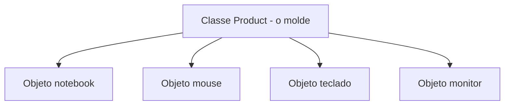
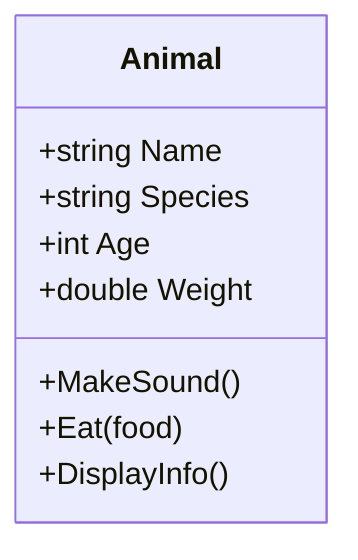
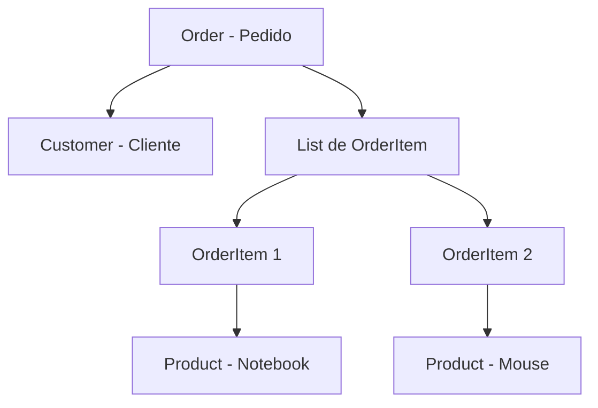
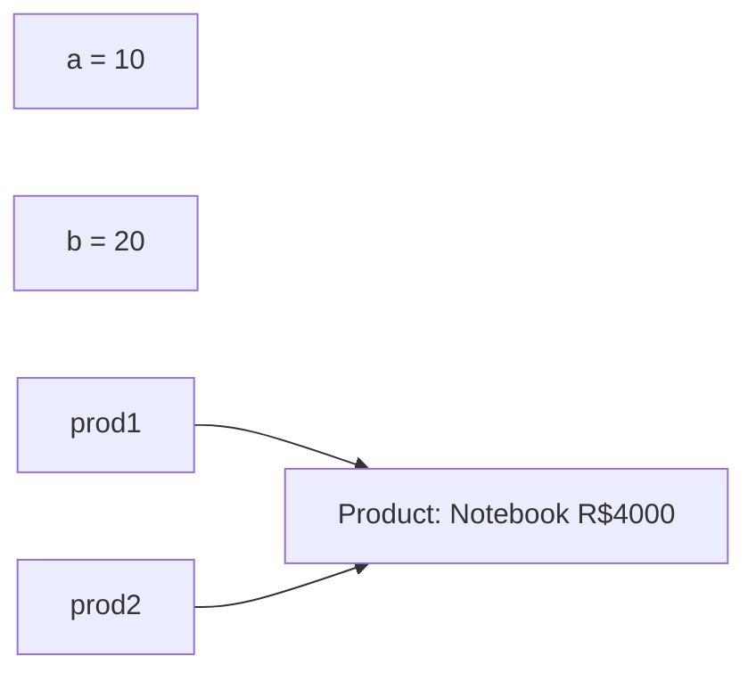

# 9.4 — Classes e Objetos: Dados e Comportamentos Juntos

[← Anterior: Ambiente .NET](cap09-mod03-ambiente-dotnet-conteudo.md) · [Próximo: Encapsulamento →](cap09-mod05-encapsulamento-conteudo.md)

---

## Introdução

No módulo anterior, você instalou o .NET SDK, criou seu primeiro projeto C# e escreveu programas com variáveis, condicionais, loops e funções. Agora vamos dar o passo mais importante deste capítulo: aprender **classes e objetos**.

Lembra do módulo 9.1, quando vimos que na programação procedural os dados ficam separados das funções? Que um produto era um dicionário "burro" e as funções é que sabiam o que fazer com ele? Classes e objetos resolvem exatamente esse problema: eles **juntam dados e comportamentos em uma única unidade**.

Este é o módulo fundamental do capítulo 9. Tudo que vem depois — encapsulamento, interfaces, herança, patterns — depende de você entender bem o que são classes e objetos. Vamos com calma, com muitos exemplos e paralelos com Python e C.

---

## Como Executar os Exemplos Deste Módulo

Todos os exemplos deste módulo são programas C# completos. Para executar:

1. Abra o terminal na pasta do seu projeto C# (criado no módulo 9.3)
2. Substitua o conteúdo de `Program.cs` pelo código do exemplo
3. Execute com `dotnet run`

Se preferir criar projetos separados para cada exemplo:
```bash
# Crie uma pasta para os exemplos do módulo 9.4
mkdir -p ~/curso-csharp/mod04-classes
# Crie um novo projeto
dotnet new console -o ~/curso-csharp/mod04-classes/exemplo01
```

---

## De Structs a Classes: A Evolução

No capítulo 7, quando programamos em C, você aprendeu a criar **structs** — tipos compostos que agrupam dados relacionados:

```c
// C — struct agrupa dados, mas não tem comportamentos
// "Product" = Produto
struct Product {
    int id;
    char name[100];    // "name" = nome
    float price;       // "price" = preço
    int quantity;      // "quantity" = quantidade
};
```

Uma struct em C é como uma ficha de cadastro: tem campos para preencher, mas não sabe fazer nada. Para calcular o desconto de um produto, você precisava de uma função separada que recebia a struct como parâmetro.

Em C#, uma **classe** é a evolução da struct: ela agrupa dados **E** comportamentos. É como se a ficha de cadastro ganhasse vida e soubesse fazer coisas.

```csharp
// C# — classe agrupa dados E comportamentos
// "Product" = Produto
class Product
{
    // Dados (atributos)
    public int Id;              // "Id" = identificador
    public string Name;         // "Name" = nome
    public double Price;        // "Price" = preço
    public int Quantity;        // "Quantity" = quantidade

    // Comportamento (método) — o produto SABE calcular seu desconto
    // "CalculateDiscount" = calcular desconto
    public double CalculateDiscount(double percentage)
    {
        return Price * (1 - percentage / 100);
    }
}
```

Saída esperada: nenhuma (é apenas a definição da classe)

| Aspecto | Struct em C | Classe em C# |
|---------|------------|-------------|
| Agrupa dados | Sim | Sim |
| Tem métodos | Não | Sim |
| Gerenciamento de memória | Manual (malloc/free) | Automático (garbage collector) |
| Pode ter construtor | Não | Sim |
| Pode ter herança | Não | Sim |
| Pode implementar interfaces | Não | Sim |

---

## O que é uma Classe?

Uma classe é um **molde** (ou modelo, ou planta) que define:
- Quais **dados** (atributos) um tipo de objeto possui
- Quais **comportamentos** (métodos) esse tipo de objeto sabe executar

Analogia: pense em uma classe como a **planta de uma casa**. A planta define quantos quartos a casa tem, onde fica a cozinha, qual o tamanho do banheiro. Mas a planta não é uma casa — é o projeto. A partir de uma mesma planta, você pode construir 10, 100 ou 1000 casas idênticas.



### Anatomia de uma Classe em C#

```csharp
// Definição da classe — o molde
// "Animal" = Animal
class Animal
{
    // === ATRIBUTOS (dados) ===
    // Descrevem O QUE o objeto É
    public string Name;       // "Name" = nome
    public string Species;    // "Species" = espécie
    public int Age;           // "Age" = idade
    public double Weight;     // "Weight" = peso

    // === MÉTODOS (comportamentos) ===
    // Descrevem O QUE o objeto FAZ

    // "MakeSound" = fazer som
    public void MakeSound()
    {
        Console.WriteLine($"{Name} faz um som!");
    }

    // "Eat" = comer
    public void Eat(string food)
    {
        Console.WriteLine($"{Name} está comendo {food}.");
        Weight += 0.1;  // Ganha um pouquinho de peso
    }

    // "DisplayInfo" = exibir informações
    public void DisplayInfo()
    {
        Console.WriteLine($"Nome: {Name} | Espécie: {Species} | Idade: {Age} | Peso: {Weight:F1}kg");
    }
}
```

Saída esperada: nenhuma (é apenas a definição da classe)

Vamos destrinchar cada parte:

| Elemento | Sintaxe | Significado |
|----------|---------|-------------|
| `class Animal` | Palavra-chave `class` + nome | Define uma nova classe chamada Animal |
| `public string Name;` | Modificador + tipo + nome | Atributo público do tipo string |
| `public void MakeSound()` | Modificador + retorno + nome + parâmetros | Método público que não retorna nada |
| `public void Eat(string food)` | Método com parâmetro | Recebe uma string chamada food |
| `this` (implícito) | Referência ao próprio objeto | Quando usamos `Name` dentro do método, é o Name DESTE objeto |

### Comparação com Python

Em Python, a mesma classe ficaria assim:

```python
# Python — mesma classe Animal
class Animal:
    def __init__(self):
        self.name = ""        # "name" = nome
        self.species = ""     # "species" = espécie
        self.age = 0          # "age" = idade
        self.weight = 0.0     # "weight" = peso

    def make_sound(self):
        print(f"{self.name} faz um som!")

    def eat(self, food):
        print(f"{self.name} está comendo {food}.")
        self.weight += 0.1

    def display_info(self):
        print(f"Nome: {self.name} | Espécie: {self.species} | Idade: {self.age} | Peso: {self.weight:.1f}kg")
```

| Diferença | Python | C# |
|-----------|--------|-----|
| Declarar atributos | No `__init__` com `self.` | Direto no corpo da classe com tipo |
| Referência ao objeto | `self` explícito em todo método | Implícito (não precisa escrever `this`) |
| Tipo dos atributos | Não declarado | Obrigatório (`string`, `int`, `double`) |
| Convenção de nomes | snake_case (`make_sound`) | PascalCase (`MakeSound`) |
| Blocos de código | Indentação | Chaves `{ }` |

Veja a estrutura da classe Animal em um diagrama:



---

## O que é um Objeto?

Um objeto é uma **instância** concreta de uma classe. Se a classe é a planta da casa, o objeto é a casa construída. Cada objeto tem seus próprios valores para os atributos definidos na classe.

### Criando Objetos

```csharp
// Programa completo — criando e usando objetos
// "Animal" = Animal
class Animal
{
    public string Name;
    public string Species;
    public int Age;
    public double Weight;

    public void MakeSound()
    {
        Console.WriteLine($"{Name} faz um som!");
    }

    public void Eat(string food)
    {
        Console.WriteLine($"{Name} está comendo {food}.");
        Weight += 0.1;
    }

    public void DisplayInfo()
    {
        Console.WriteLine($"Nome: {Name} | Espécie: {Species} | Idade: {Age} | Peso: {Weight:F1}kg");
    }
}

// === Criando objetos (instâncias) ===

// "rex" = Rex (nome do cachorro)
var rex = new Animal();    // "new" cria um novo objeto a partir da classe
rex.Name = "Rex";
rex.Species = "Cachorro";
rex.Age = 5;
rex.Weight = 12.5;

// "mimi" = Mimi (nome da gata)
var mimi = new Animal();
mimi.Name = "Mimi";
mimi.Species = "Gato";
mimi.Age = 3;
mimi.Weight = 4.2;

// Usando os objetos
rex.DisplayInfo();
mimi.DisplayInfo();

Console.WriteLine();

rex.MakeSound();
mimi.MakeSound();

Console.WriteLine();

rex.Eat("ração");
rex.DisplayInfo();  // Peso aumentou!
```

Saída esperada:
```
Nome: Rex | Espécie: Cachorro | Idade: 5 | Peso: 12.5kg
Nome: Mimi | Espécie: Gato | Idade: 3 | Peso: 4.2kg

Rex faz um som!
Mimi faz um som!

Rex está comendo ração.
Nome: Rex | Espécie: Cachorro | Idade: 5 | Peso: 12.6kg
```

Observe pontos importantes:

1. **`new Animal()`** — a palavra-chave `new` cria um novo objeto. É como dizer "construa uma casa nova usando esta planta".
2. **Cada objeto é independente** — Rex e Mimi são objetos diferentes. Mudar o peso de Rex não afeta Mimi.
3. **O objeto sabe suas coisas** — quando chamamos `rex.Eat("ração")`, o método `Eat` sabe que `Name` é "Rex" e `Weight` é 12.5, porque está executando no contexto do objeto `rex`.
4. **O ponto (`.`) acessa membros** — `rex.Name` acessa o atributo Name do objeto rex. `rex.Eat()` chama o método Eat do objeto rex.

---

## Construtores: Inicializando Objetos

No exemplo anterior, criamos o objeto e depois definimos cada atributo separadamente. Isso funciona, mas tem um problema: e se alguém esquecer de definir o nome? O objeto ficaria com valores padrão (string vazia, zero).

Um **construtor** é um método especial que é chamado automaticamente quando o objeto é criado. Ele garante que o objeto nasce com todos os dados necessários.

```csharp
// Classe com construtor
// "Product" = Produto
class Product
{
    public int Id;
    public string Name;
    public double Price;
    public int Quantity;

    // Construtor — mesmo nome da classe, sem tipo de retorno
    // É chamado automaticamente quando usamos "new Product(...)"
    public Product(int id, string name, double price, int quantity)
    {
        Id = id;
        Name = name;
        Price = price;
        Quantity = quantity;
    }

    // "CalculateTotal" = calcular total
    public double CalculateTotal()
    {
        return Price * Quantity;
    }

    // "Display" = exibir
    public void Display()
    {
        Console.WriteLine($"[{Id}] {Name} — R${Price:F2} x {Quantity} = R${CalculateTotal():F2}");
    }
}

// Agora o objeto já nasce com todos os dados
var notebook = new Product(1, "Notebook", 3500.00, 2);
var mouse = new Product(2, "Mouse", 89.90, 5);

notebook.Display();
mouse.Display();
```

Saída esperada:
```
[1] Notebook — R$3500.00 x 2 = R$7000.00
[2] Mouse — R$89.90 x 5 = R$449.50
```

### Comparação: Sem Construtor vs Com Construtor

```csharp
// SEM construtor — precisa definir cada atributo manualmente
var p1 = new Product();
p1.Id = 1;
p1.Name = "Notebook";
p1.Price = 3500.00;
p1.Quantity = 2;
// E se esquecer o Price? O produto fica com preço 0.00

// COM construtor — tudo definido na criação
var p2 = new Product(1, "Notebook", 3500.00, 2);
// Impossível esquecer um campo — o compilador exige todos os parâmetros
```

Saída esperada: nenhuma (comparação conceitual)

| Aspecto | Sem construtor | Com construtor |
|---------|---------------|----------------|
| Criação | `new Product()` + atribuições | `new Product(1, "Notebook", 3500, 2)` |
| Risco de esquecer dados | Alto | Zero (compilador exige) |
| Linhas de código | 5+ linhas | 1 linha |
| Validação na criação | Não tem | Pode validar no construtor |

### Construtor em Python vs C#

```python
# Python — construtor é o __init__
class Product:
    def __init__(self, id, name, price, quantity):
        self.id = id
        self.name = name
        self.price = price
        self.quantity = quantity
```

```csharp
// C# — construtor tem o mesmo nome da classe
class Product
{
    public int Id;
    public string Name;
    public double Price;
    public int Quantity;

    public Product(int id, string name, double price, int quantity)
    {
        Id = id;
        Name = name;
        Price = price;
        Quantity = quantity;
    }
}
```

A ideia é a mesma. A diferença é que em Python o construtor se chama `__init__` e em C# tem o mesmo nome da classe.

---

## Métodos: O que o Objeto Sabe Fazer

Métodos são funções que pertencem a uma classe. A diferença entre uma função solta (procedural) e um método (OOP) é que o método tem acesso direto aos atributos do objeto — não precisa recebê-los como parâmetro.

### Métodos que Retornam Valores

```csharp
// "BankAccount" = Conta Bancária
class BankAccount
{
    public string Owner;       // "Owner" = proprietário
    public decimal Balance;    // "Balance" = saldo (decimal para dinheiro!)

    public BankAccount(string owner, decimal initialBalance)
    {
        Owner = owner;
        Balance = initialBalance;
    }

    // Método que retorna um valor (bool = verdadeiro ou falso)
    // "CanWithdraw" = pode sacar
    public bool CanWithdraw(decimal amount)
    {
        return Balance >= amount;
    }

    // Método que modifica o estado do objeto
    // "Deposit" = depositar
    public void Deposit(decimal amount)
    {
        Balance += amount;
        Console.WriteLine($"Depósito de R${amount:F2} realizado. Saldo: R${Balance:F2}");
    }

    // "Withdraw" = sacar
    public bool Withdraw(decimal amount)
    {
        if (CanWithdraw(amount))
        {
            Balance -= amount;
            Console.WriteLine($"Saque de R${amount:F2} realizado. Saldo: R${Balance:F2}");
            return true;
        }
        Console.WriteLine($"Saldo insuficiente! Saldo: R${Balance:F2}, Saque: R${amount:F2}");
        return false;
    }

    // "GetStatement" = obter extrato
    public string GetStatement()
    {
        return $"Conta de {Owner} — Saldo: R${Balance:F2}";
    }
}

// Usando a conta bancária
var conta = new BankAccount("Maria", 1000.00m);  // "m" indica decimal
Console.WriteLine(conta.GetStatement());

conta.Deposit(500.00m);
conta.Withdraw(200.00m);
conta.Withdraw(2000.00m);  // Vai falhar — saldo insuficiente

Console.WriteLine(conta.GetStatement());
```

Saída esperada:
```
Conta de Maria — Saldo: R$1000.00
Depósito de R$500.00 realizado. Saldo: R$1500.00
Saque de R$200.00 realizado. Saldo: R$1300.00
Saldo insuficiente! Saldo: R$1300.00, Saque: R$2000.00
Conta de Maria — Saldo: R$1300.00
```

Observe como o objeto `conta` gerência seu próprio saldo. Ninguém de fora precisa saber como o saldo é calculado — o objeto cuida disso. Isso é o início do **encapsulamento**, que vamos aprofundar no próximo módulo.

---

## Composição: Objetos Dentro de Objetos

Uma das ideias mais poderosas da OOP é a **composição** — objetos que contêm outros objetos. Assim como no mundo real um pedido contém produtos e pertence a um cliente, no código um objeto `Order` pode conter objetos `Product` e `Customer`.

```csharp
// "Customer" = Cliente
class Customer
{
    public int Id;
    public string Name;
    public string Email;

    public Customer(int id, string name, string email)
    {
        Id = id;
        Name = name;
        Email = email;
    }
}

// "OrderItem" = Item do Pedido
class OrderItem
{
    public Product Product;    // Composição — o item CONTÉM um produto
    public int Quantity;

    public OrderItem(Product product, int quantity)
    {
        Product = product;
        Quantity = quantity;
    }

    // "GetSubtotal" = obter subtotal
    public double GetSubtotal()
    {
        return Product.Price * Quantity;
    }
}

// "Order" = Pedido
class Order
{
    public int Id;
    public Customer Customer;           // Composição — o pedido CONHECE o cliente
    public List<OrderItem> Items;       // Composição — o pedido TEM uma lista de itens

    public Order(int id, Customer customer)
    {
        Id = id;
        Customer = customer;
        Items = new List<OrderItem>();
    }

    // "AddItem" = adicionar item
    public void AddItem(Product product, int quantity)
    {
        Items.Add(new OrderItem(product, quantity));
    }

    // "GetTotal" = obter total
    public double GetTotal()
    {
        double total = 0;
        foreach (var item in Items)
        {
            total += item.GetSubtotal();
        }
        return total;
    }

    // "Display" = exibir
    public void Display()
    {
        Console.WriteLine($"=== Pedido #{Id} — Cliente: {Customer.Name} ===");
        foreach (var item in Items)
        {
            Console.WriteLine($"  {item.Product.Name} x{item.Quantity} = R${item.GetSubtotal():F2}");
        }
        Console.WriteLine($"  TOTAL: R${GetTotal():F2}");
    }
}

// Usando composição
var maria = new Customer(1, "Maria", "maria@email.com");
var notebook = new Product(1, "Notebook", 3500.00, 10);
var mouse = new Product(2, "Mouse", 89.90, 50);

var pedido = new Order(1, maria);
pedido.AddItem(notebook, 1);
pedido.AddItem(mouse, 2);
pedido.Display();
```

Saída esperada:
```
=== Pedido #1 — Cliente: Maria ===
  Notebook x1 = R$3500.00
  Mouse x2 = R$179.80
  TOTAL: R$3679.80
```

Observe como os objetos se relacionam:



Cada objeto tem sua responsabilidade:
- `Product` sabe seu nome e preço
- `OrderItem` sabe calcular o subtotal (preço x quantidade)
- `Order` sabe calcular o total (soma dos subtotais)
- `Customer` sabe seus dados

Veja as classes e seus relacionamentos em um diagrama de classes:

```mermaid
classDiagram
    class Customer {
        +int Id
        +string Name
        +string Email
    }
    class Product {
        +int Id
        +string Name
        +double Price
        +int Quantity
    }
    class OrderItem {
        +Product Product
        +int Quantity
        +GetSubtotal() double
    }
    class Order {
        +int Id
        +Customer Customer
        +List~OrderItem~ Items
        +AddItem(product, quantity)
        +GetTotal() double
        +Display()
    }
    Order "1" --> |1| Customer : pertence a
    Order "1" --> |*| OrderItem : contem
    OrderItem "1" --> |1| Product : referencia
```

Ninguém faz o trabalho do outro. Isso é composição em ação.

---

## Múltiplos Objetos da Mesma Classe

Uma classe é um molde — você pode criar quantos objetos quiser a partir dela. Cada objeto é independente.

```csharp
// Criando vários produtos
var produtos = new List<Product>
{
    new Product(1, "Notebook", 3500.00, 5),
    new Product(2, "Mouse", 89.90, 30),
    new Product(3, "Teclado", 199.90, 20),
    new Product(4, "Monitor", 1200.00, 8),
    new Product(5, "Webcam", 249.90, 15)
};

// Listando todos
Console.WriteLine("=== Catálogo de Produtos ===");
foreach (var p in produtos)
{
    p.Display();
}

// Calculando o valor total do estoque
double totalEstoque = 0;
foreach (var p in produtos)
{
    totalEstoque += p.Price * p.Quantity;
}
Console.WriteLine($"\nValor total do estoque: R${totalEstoque:F2}");
```

Saída esperada:
```
=== Catálogo de Produtos ===
[1] Notebook — R$3500.00 x 5 = R$17500.00
[2] Mouse — R$89.90 x 30 = R$2697.00
[3] Teclado — R$199.90 x 20 = R$3998.00
[4] Monitor — R$1200.00 x 8 = R$9600.00
[5] Webcam — R$249.90 x 15 = R$3748.50
Valor total do estoque: R$37543.50
```

---

## Métodos Estáticos: Quando o Comportamento é da Classe, Não do Objeto

Às vezes, um comportamento faz sentido para a classe como um todo, não para um objeto específico. Por exemplo, um método que conta quantos produtos existem, ou que gera o próximo ID.

```csharp
// "Product" com contador estático
class Product
{
    // Atributo estático — pertence à CLASSE, não ao objeto
    private static int _nextId = 1;  // "nextId" = próximo ID

    public int Id;
    public string Name;
    public double Price;

    public Product(string name, double price)
    {
        Id = _nextId;       // Usa o contador da classe
        _nextId++;          // Incrementa para o próximo
        Name = name;
        Price = price;
    }

    // Método estático — chamado na CLASSE, não no objeto
    // "GetNextId" = obter próximo ID
    public static int GetNextId()
    {
        return _nextId;
    }

    public void Display()
    {
        Console.WriteLine($"[{Id}] {Name} — R${Price:F2}");
    }
}

// Usando
var p1 = new Product("Notebook", 3500.00);
var p2 = new Product("Mouse", 89.90);
var p3 = new Product("Teclado", 199.90);

p1.Display();
p2.Display();
p3.Display();

// Método estático é chamado na CLASSE, não no objeto
Console.WriteLine($"Próximo ID será: {Product.GetNextId()}");
```

Saída esperada:
```
[1] Notebook — R$3500.00
[2] Mouse — R$89.90
[3] Teclado — R$199.90
Próximo ID será: 4
```

| Tipo | Pertence a | Acesso | Exemplo |
|------|-----------|--------|---------|
| Atributo de instância | Cada objeto | `objeto.Atributo` | `notebook.Name` |
| Método de instância | Cada objeto | `objeto.Método()` | `notebook.Display()` |
| Atributo estático | A classe | `Classe.Atributo` | `Product._nextId` |
| Método estático | A classe | `Classe.Método()` | `Product.GetNextId()` |

Você já usou métodos estáticos sem saber: `Console.WriteLine()` é um método estático da classe `Console`. `Math.Round()` é um método estático da classe `Math`.

---

## Referência vs Valor: Como Objetos Vivem na Memória

Este é um conceito importante que conecta com o que você aprendeu sobre memória no capítulo 7.

Em C#, tipos simples (`int`, `double`, `bool`) são **tipos de valor** — o valor é armazenado diretamente na variável. Classes são **tipos de referência** — a variável armazena um endereço (referência) para o objeto na memória.

```csharp
// Tipos de valor — cada variável tem sua própria cópia
int a = 10;
int b = a;     // b recebe uma CÓPIA do valor de a
b = 20;        // Mudar b NÃO afeta a
Console.WriteLine($"a = {a}, b = {b}");

// Tipos de referência — variáveis apontam para o MESMO objeto
var prod1 = new Product("Notebook", 3500.00);
var prod2 = prod1;     // prod2 aponta para o MESMO objeto que prod1
prod2.Price = 4000.00; // Mudar prod2 AFETA prod1 (é o mesmo objeto!)
Console.WriteLine($"prod1.Price = {prod1.Price}, prod2.Price = {prod2.Price}");
```

Saída esperada:
```
a = 10, b = 20
prod1.Price = 4000, prod2.Price = 4000
```

Isso é similar ao que acontece com ponteiros em C (capítulo 7.4), mas sem a complexidade de gerenciar memória manualmente. O garbage collector cuida de tudo.



---

## Exemplo Completo: Sistema de Contatos

Vamos juntar tudo em um exemplo mais completo — um sistema de contatos que demonstra classes, construtores, métodos e composição:

```csharp
// "Contact" = Contato
class Contact
{
    public int Id;
    public string Name;
    public string Phone;
    public string Email;

    public Contact(int id, string name, string phone, string email)
    {
        Id = id;
        Name = name;
        Phone = phone;
        Email = email;
    }

    public void Display()
    {
        Console.WriteLine($"  [{Id}] {Name} | Tel: {Phone} | Email: {Email}");
    }
}

// "ContactBook" = Agenda de Contatos
class ContactBook
{
    public string OwnerName;                    // "OwnerName" = nome do dono
    public List<Contact> Contacts;              // Lista de contatos
    private int _nextId = 1;

    public ContactBook(string ownerName)
    {
        OwnerName = ownerName;
        Contacts = new List<Contact>();
    }

    // "Add" = adicionar
    public void Add(string name, string phone, string email)
    {
        var contact = new Contact(_nextId, name, phone, email);
        _nextId++;
        Contacts.Add(contact);
        Console.WriteLine($"Contato '{name}' adicionado!");
    }

    // "ListAll" = listar todos
    public void ListAll()
    {
        Console.WriteLine($"\n=== Agenda de {OwnerName} ({Contacts.Count} contatos) ===");
        if (Contacts.Count == 0)
        {
            Console.WriteLine("  (vazia)");
            return;
        }
        foreach (var c in Contacts)
        {
            c.Display();
        }
    }

    // "FindByName" = buscar por nome
    public Contact? FindByName(string searchName)
    {
        foreach (var c in Contacts)
        {
            if (c.Name.Contains(searchName, StringComparison.OrdinalIgnoreCase))
            {
                return c;
            }
        }
        return null;
    }

    // "Remove" = remover
    public bool Remove(int id)
    {
        for (int i = 0; i < Contacts.Count; i++)
        {
            if (Contacts[i].Id == id)
            {
                Console.WriteLine($"Contato '{Contacts[i].Name}' removido!");
                Contacts.RemoveAt(i);
                return true;
            }
        }
        Console.WriteLine("Contato não encontrado!");
        return false;
    }
}

// === Usando o sistema ===
var agenda = new ContactBook("João");

agenda.Add("Maria Silva", "(11) 99999-1111", "maria@email.com");
agenda.Add("Pedro Santos", "(11) 99999-2222", "pedro@email.com");
agenda.Add("Ana Costa", "(11) 99999-3333", "ana@email.com");

agenda.ListAll();

Console.WriteLine("\nBuscando 'Pedro'...");
var found = agenda.FindByName("Pedro");
if (found != null)
{
    Console.WriteLine("Encontrado:");
    found.Display();
}

agenda.Remove(2);
agenda.ListAll();
```

Saída esperada:
```
Contato 'Maria Silva' adicionado!
Contato 'Pedro Santos' adicionado!
Contato 'Ana Costa' adicionado!

=== Agenda de João (3 contatos) ===
  [1] Maria Silva | Tel: (11) 99999-1111 | Email: maria@email.com
  [2] Pedro Santos | Tel: (11) 99999-2222 | Email: pedro@email.com
  [3] Ana Costa | Tel: (11) 99999-3333 | Email: ana@email.com

Buscando 'Pedro'...
Encontrado:
  [2] Pedro Santos | Tel: (11) 99999-2222 | Email: pedro@email.com
Contato 'Pedro Santos' removido!

=== Agenda de João (2 contatos) ===
  [1] Maria Silva | Tel: (11) 99999-1111 | Email: maria@email.com
  [3] Ana Costa | Tel: (11) 99999-3333 | Email: ana@email.com
```

Compare com como esse mesmo sistema ficaria em Python procedural: funções soltas, listas de dicionários, parâmetros passados para todo lado. Aqui, cada objeto sabe suas responsabilidades. A agenda sabe gerenciar contatos. O contato sabe se exibir.

Veja a estrutura completa do sistema de contatos:

```mermaid
classDiagram
    class Contact {
        +int Id
        +string Name
        +string Phone
        +string Email
        +Display()
    }
    class ContactBook {
        +string OwnerName
        +List~Contact~ Contacts
        -int _nextId
        +Add(name, phone, email)
        +ListAll()
        +FindByName(searchName) Contact
        +Remove(id) bool
    }
    ContactBook "1" --> |*| Contact : gerencia
```

---

## Como a IA pode te ajudar aqui
**Prompt 1 — Criar com ajuda da IA:**
> "Crie uma classe C# para representar [conceito do mundo real]. Inclua atributos, construtor e 3 métodos úteis."

**Prompt 2 — Pedir ajuda prática:**
> "Tenho esta classe em Python [cole o código]. Como ficaria em C#?"

**Prompt 3 — Explorar o conceito:**
> "Explique a diferença entre tipo de valor e tipo de referência em C# com um diagrama de memória."

---

## Casos de Uso no Mundo Real

### Sistemas de E-commerce

Em qualquer loja online, cada entidade é uma classe: `Product`, `Customer`, `Order`, `Payment`, `ShippingAddress`. Um pedido contém itens (composição), pertence a um cliente (referência) e tem um pagamento associado. Essa modelagem com classes permite que equipes diferentes trabalhem em partes diferentes do sistema — uma equipe cuida do catálogo de produtos, outra do checkout, outra do pagamento.

### Jogos com Unity

Em um jogo Unity, cada elemento é um objeto. O personagem principal é um objeto da classe `Player` com atributos como vida, posição e inventário, e métodos como `Move()`, `Attack()` e `TakeDamage()`. Inimigos são objetos de classes como `Enemy` ou `Boss`. Itens coletáveis são objetos de `Collectible`. A composição é usada extensivamente — um `Player` contém um `Inventory`, que contém uma lista de `Item`.

### Aplicações Bancárias

Bancos modelam contas, transações, clientes e produtos financeiros como classes. Uma `BankAccount` tem saldo e métodos para depositar e sacar. Uma `Transaction` registra cada operação. Um `Customer` pode ter múltiplas contas (composição). Essa organização permite que regras de negócio complexas (limites, taxas, rendimentos) fiquem encapsuladas dentro de cada classe.

---

## Resumo do Módulo

| Conceito | Definição |
|----------|-----------|
| Classe | Molde que define atributos e métodos de um tipo de objeto |
| Objeto | Instância concreta de uma classe, com seus próprios valores |
| Atributo | Dado que pertence ao objeto (suas características) |
| Método | Comportamento que pertence ao objeto (o que ele sabe fazer) |
| Construtor | Método especial chamado ao criar o objeto, garante inicialização |
| Composição | Objetos que contêm outros objetos |
| new | Palavra-chave que cria um novo objeto a partir de uma classe |
| static | Membro que pertence à classe, não ao objeto |
| Tipo de valor | Variável armazena o valor diretamente (int, double, bool) |
| Tipo de referência | Variável armazena referência ao objeto na memória (classes) |

---

## Glossário do Módulo

| Termo | Definição |
|-------|-----------|
| Atributo (Attribute/Field) | Variável que pertence a uma classe, armazena dados do objeto |
| Classe (Class) | Molde que define a estrutura e comportamento de um tipo de objeto |
| Composição (Composition) | Técnica onde objetos contêm outros objetos como atributos |
| Construtor (Constructor) | Método especial executado ao criar um objeto com `new` |
| Instância (Instance) | Um objeto concreto criado a partir de uma classe |
| Instanciar (Instantiate) | Criar um novo objeto a partir de uma classe usando `new` |
| Membro (Member) | Qualquer elemento de uma classe: atributo, método, construtor |
| Método (Method) | Função que pertence a uma classe e opera sobre os dados do objeto |
| new | Operador que cria uma nova instância de uma classe |
| Objeto (Object) | Instância de uma classe com valores próprios para seus atributos |
| PascalCase | Convenção de nomes em C# onde cada palavra começa com maiúscula |
| Referência (Reference) | Endereço na memória que aponta para um objeto |
| static | Modificador que indica que o membro pertence à classe, não ao objeto |
| this | Referência ao objeto atual dentro de um método |
| Tipo de referência (Reference Type) | Tipo cujas variáveis armazenam referências a objetos |
| Tipo de valor (Value Type) | Tipo cujas variáveis armazenam o valor diretamente |
| void | Tipo de retorno que indica que o método não retorna nenhum valor |

---

## Na Cultura Popular

- **The Matrix** (filme, 1999) — o conceito de "objetos" no código tem paralelo com a ideia de que tudo na Matrix é uma representação digital de algo real. Cada pessoa, prédio e carro na Matrix é como um objeto com atributos e comportamentos.
- **Minecraft** (jogo, 2011) — cada bloco, item, mob e entidade no Minecraft é um objeto. O jogo é um exemplo massivo de OOP em ação, com milhares de tipos de objetos interagindo.

---

## Para Saber Mais

- [Microsoft Learn — Classes e Objetos](https://learn.microsoft.com/pt-br/dotnet/csharp/fundamentals/types/classes) — *Tutorial oficial sobre classes em C#, em português*
- [Refactoring Guru — OOP Basics](https://refactoring.guru/pt-br/design-patterns/what-is-a-pattern) — *Explicação visual dos conceitos de OOP*
- [Exercism — C# Track](https://exercism.org/tracks/csharp) — *Exercícios práticos de C# incluindo classes e objetos*
- [Tim Corey — C# Classes](https://www.youtube.com/@IAmTimCorey) — *Tutoriais em vídeo sobre classes em C#*

---

## Perguntas Frequentes (FAQ)

**P: Qual a diferença entre classe e objeto?**
R: Classe é o molde (a planta da casa), objeto é a instância concreta (a casa construída). Uma classe define a estrutura; um objeto é uma cópia real com valores específicos. Você pode criar muitos objetos a partir de uma mesma classe.

**P: Posso criar uma classe sem construtor?**
R: Sim. C# cria automaticamente um construtor padrão (sem parâmetros) se você não definir nenhum. Mas é boa prática criar construtores explícitos para garantir que objetos nasçam com dados válidos.

**P: O que acontece se eu esquecer o `new`?**
R: A variável fica com valor `null` (nulo — sem objeto). Se tentar usar, vai dar erro `NullReferenceException`. O `new` é obrigatório para criar o objeto na memória.

**P: Posso ter métodos sem parâmetros?**
R: Sim. Métodos como `Display()` e `GetTotal()` não recebem parâmetros — eles usam os atributos do próprio objeto.

**P: Qual a diferença entre `void` e outros tipos de retorno?**
R: `void` significa que o método não retorna nada — ele faz algo (imprime, modifica dados) mas não devolve um valor. Métodos com tipo de retorno (`int`, `double`, `string`, `bool`) devolvem um valor que pode ser usado.

**P: O que é `var`?**
R: `var` é um atalho para declaração de variáveis. O compilador infere o tipo automaticamente. `var x = new Product(...)` é o mesmo que `Product x = new Product(...)`. O tipo é definido em compilação, não muda depois.

**P: Posso ter uma classe dentro de outra?**
R: Sim, isso se chama classe aninhada (nested class). Mas não é comum e geralmente indica que o design pode ser simplificado. Composição (objetos que contêm outros objetos) é preferível.

**P: Struct existe em C#?**
R: Sim! C# tem structs, mas são diferentes das de C. Em C#, structs são tipos de valor (vivem na stack) e classes são tipos de referência (vivem no heap). Para a maioria dos casos, use classes. Structs são usadas para tipos pequenos e imutáveis.

**P: O que é `null`?**
R: `null` significa "nenhum objeto". Uma variável de tipo referência pode ser `null` se nenhum objeto foi atribuído a ela. Tentar usar um objeto `null` causa `NullReferenceException` — um dos erros mais comuns em C#.

**P: Classes em C# são iguais a classes em Python?**
R: O conceito é o mesmo, mas C# é mais rigoroso: exige tipos nos atributos, tem modificadores de acesso reais (public/private), e o construtor tem o nome da classe (não `__init__`). Python é mais flexível mas menos seguro.

---

## Exercícios Práticos

### Exercício 1: Classe Básica

Crie uma classe `Student` (Aluno) com: nome, idade, nota1, nota2, nota3. Adicione um construtor e métodos para calcular a média e verificar se está aprovado (média >= 7.0). Crie 3 objetos e exiba os resultados.

### Exercício 2: Composição

Crie classes `Author` (Autor) e `Book` (Livro). Um livro tem um autor (composição). Crie uma lista de 5 livros e exiba todos com nome do autor.

### Exercício 3: Sistema Completo

Crie um sistema de gerenciamento de tarefas (to-do list) com classes `Task` e `TaskManager`. O TaskManager deve ter métodos para adicionar, listar, marcar como concluída e remover tarefas. Compare com a versão procedural que você fez no exercício do módulo 9.1.

---

[← Anterior: Ambiente .NET](cap09-mod03-ambiente-dotnet-conteudo.md) · [Próximo: Encapsulamento →](cap09-mod05-encapsulamento-conteudo.md)
