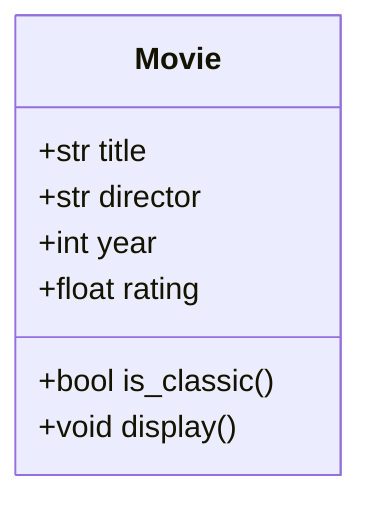

# 9.4 — Exercícios: Classes e Objetos

[← Voltar ao conteúdo: Classes e Objetos](cap09-mod04-classes-objetos-conteudo.md)

---

## Sobre Estes Exercícios

Estes exercícios praticam a criação de classes, objetos, construtores, métodos e composição em C#. Execute cada exercício criando um projeto C# separado ou substituindo o conteúdo de `Program.cs`.

---

## Exercício 1 — Classe Student

Crie uma classe `Student` (Aluno) com os seguintes atributos e métodos:

**Atributos**: Id, Name, Grade1, Grade2, Grade3

**Métodos**:
- `CalculateAverage()` — retorna a média das 3 notas
- `IsApproved()` — retorna `true` se média >= 7.0
- `GetStatus()` — retorna "Aprovado" ou "Reprovado"
- `Display()` — exibe todas as informações do aluno

Crie pelo menos 3 alunos com notas diferentes e exiba os resultados:

```csharp
// Saída esperada (exemplo):
// [1] Ana — Notas: 8.0, 9.0, 7.5 — Média: 8.2 — Aprovado
// [2] Bruno — Notas: 5.0, 6.0, 4.5 — Média: 5.2 — Reprovado
// [3] Carla — Notas: 7.0, 7.0, 7.0 — Média: 7.0 — Aprovado
```

---

## Exercício 2 — Classe Rectangle

Crie uma classe `Rectangle` (Retângulo) com:

**Atributos**: Width (largura), Height (altura)

**Métodos**:
- `CalculateArea()` — retorna a área (largura x altura)
- `CalculatePerimeter()` — retorna o perímetro (2 x largura + 2 x altura)
- `IsSquare()` — retorna `true` se largura == altura
- `Display()` — exibe dimensões, área, perímetro e se é quadrado

Crie 3 retângulos (um deles deve ser quadrado) e exiba os resultados.

---

## Exercício 3 — Composição: Author e Book

Crie duas classes:

**Author** (Autor): Name, Country, BirthYear
**Book** (Livro): Title, Author (composição!), Year, Pages

Crie pelo menos 5 livros com autores diferentes e:
1. Liste todos os livros com nome do autor
2. Encontre o livro com mais páginas
3. Liste livros de autores brasileiros

```csharp
// Exemplo de saída:
// === Biblioteca ===
// "Dom Casmurro" por Machado de Assis (Brasil, 1899) — 256 páginas
// "1984" por George Orwell (Reino Unido, 1949) — 328 páginas
```

---

## Exercício 4 — Conta Bancária Completa

Expanda a classe `BankAccount` do módulo com:

**Atributos adicionais**: AccountNumber, AccountType (Corrente/Poupança)

**Métodos adicionais**:
- `Transfer(BankAccount destination, decimal amount)` — transfere dinheiro para outra conta
- `ApplyInterest(decimal rate)` — aplica juros ao saldo (para poupança)

Crie 2 contas, faça depósitos, saques e uma transferência entre elas. Exiba o extrato de ambas.

---

## Exercício 5 — Sistema de Tarefas (To-Do)

Crie classes `Task` e `TaskManager`:

**Task**: Id, Title, Description, Priority (Alta/Média/Baixa), IsCompleted

**TaskManager**:
- `Add(title, description, priority)` — adiciona tarefa
- `ListAll()` — lista todas as tarefas
- `ListPending()` — lista apenas pendentes
- `ListByPriority(priority)` — filtra por prioridade
- `Complete(id)` — marca como concluída
- `Remove(id)` — remove tarefa
- `GetStatistics()` — exibe total, concluídas e pendentes

Crie pelo menos 5 tarefas, complete algumas, e exiba as estatísticas.

Compare este código com a versão procedural que você fez no exercício do módulo 9.1. Qual é mais organizado? Qual seria mais fácil de estender?

---

## Exercício 6 — Loja de Produtos

Crie um sistema com classes `Product`, `CartItem` e `ShoppingCart`:

**Product**: Id, Name, Price, Stock
**CartItem**: Product (composição), Quantity
**ShoppingCart**: Items (lista de CartItem), CustomerName

O `ShoppingCart` deve ter métodos para:
- Adicionar produto ao carrinho (verificando estoque)
- Remover produto do carrinho
- Calcular total
- Exibir carrinho completo
- Finalizar compra (reduz estoque dos produtos)

---

## Exercício 7 — Referência vs Valor

Sem executar o código, preveja a saída. Depois execute para verificar:

```csharp
// Parte 1 — tipos de valor
int x = 10;
int y = x;
y = 99;
Console.WriteLine($"x = {x}, y = {y}");

// Parte 2 — tipos de referência
class Box
{
    public int Value;
    public Box(int value) { Value = value; }
}

var box1 = new Box(10);
var box2 = box1;
box2.Value = 99;
Console.WriteLine($"box1.Value = {box1.Value}, box2.Value = {box2.Value}");
```

Explique por que os resultados são diferentes.

---

## Exercício 8 — Modelagem Livre

Escolha um domínio que você conhece (escola, hospital, restaurante, academia, biblioteca, loja de jogos) e modele pelo menos 3 classes com:
- Atributos relevantes
- Construtor
- Pelo menos 2 métodos por classe
- Pelo menos 1 relação de composição

Implemente e crie um programa que demonstre o uso das classes.

---

## Exercício 9 — Construtor com Validação

Crie uma classe `Temperature` (Temperatura) com:
- Atributo `Celsius` (double)
- Construtor que válida: temperatura não pode ser menor que -273.15 (zero absoluto)
- Métodos: `ToFahrenheit()`, `ToKelvin()`, `Display()`

Se o valor for inválido, o construtor deve imprimir um aviso e usar -273.15 como valor padrão.

Crie temperaturas válidas e inválidas para testar.

---

## Exercício 10 — Comparação Python vs C#

Reescreva a classe abaixo de Python para C#:

```python
class Movie:
    def __init__(self, title, director, year, rating):
        self.title = title
        self.director = director
        self.year = year
        self.rating = rating

    def is_classic(self):
        return self.year < 2000

    def display(self):
        classic = " [Clássico]" if self.is_classic() else ""
        print(f"{self.title} ({self.year}) — Dir: {self.director} — Nota: {self.rating}/10{classic}")

movies = [
    Movie("Matrix", "Wachowski", 1999, 8.7),
    Movie("Inception", "Nolan", 2010, 8.8),
    Movie("Pulp Fiction", "Tarantino", 1994, 8.9)
]

for m in movies:
    m.display()
```

Saída esperada:
```
Matrix (1999) — Dir: Wachowski — Nota: 8.7/10 [Clássico]
Inception (2010) — Dir: Nolan — Nota: 8.8/10
Pulp Fiction (1994) — Dir: Tarantino — Nota: 8.9/10 [Clássico]
```

Diagrama de classes da classe Movie em Python — sua tarefa e recriar essa estrutura em C#:



---

[← Voltar ao conteúdo: Classes e Objetos](cap09-mod04-classes-objetos-conteudo.md)
