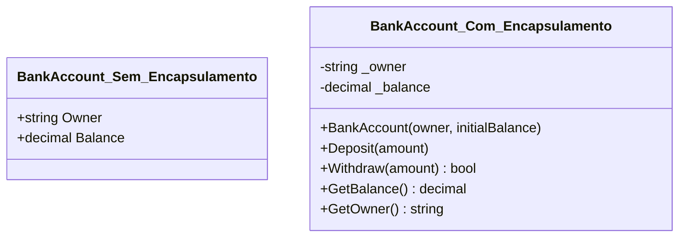
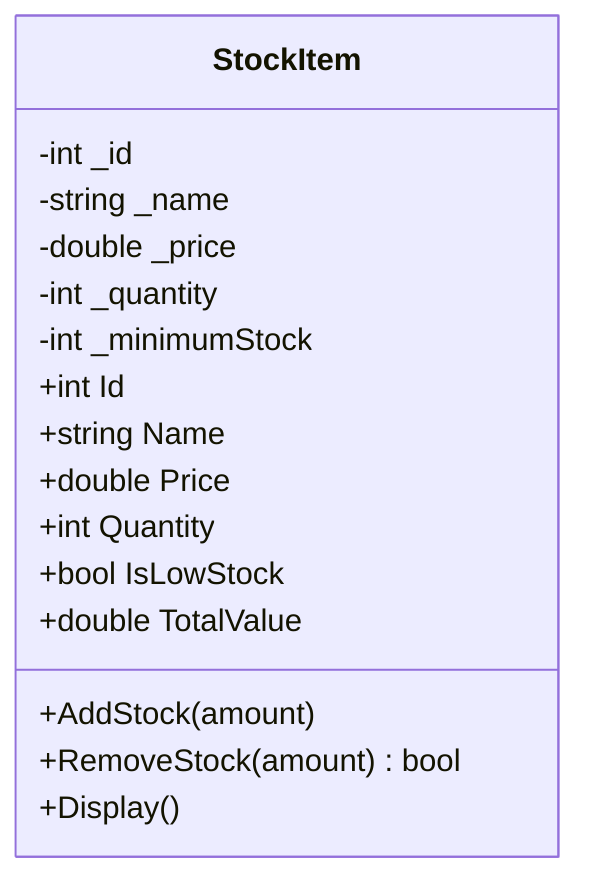
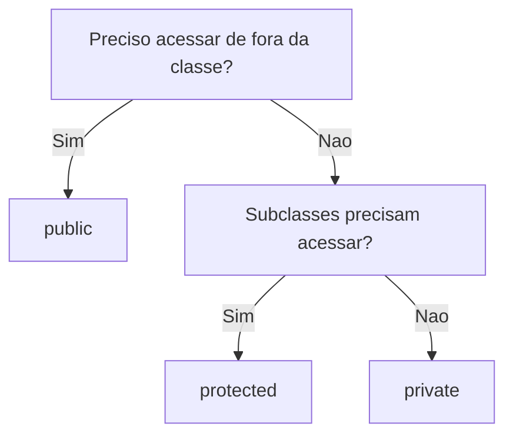

# 9.5 — Encapsulamento: Escondendo a Complexidade

[← Anterior: Classes e Objetos](cap09-mod04-classes-objetos-conteudo.md) · [Próximo: Interfaces →](cap09-mod06-interfaces-conteudo.md)

---

## Introdução

No módulo anterior, você aprendeu a criar classes e objetos em C# — agrupando dados (atributos) e comportamentos (métodos) em uma única unidade. Criamos produtos, contas bancárias, contatos e até um sistema de pedidos com composição.

Mas tem um problema nos exemplos que fizemos: todos os atributos eram `public`. Isso significa que qualquer parte do código pode acessar e modificar diretamente os dados de um objeto. Alguém pode fazer `conta.Balance = -1000000` e criar um saldo negativo de um milhão sem nenhuma validação.

Isso é como ter uma casa sem portas — qualquer pessoa entra, mexe nas suas coisas e sai. Funciona quando você mora sozinho, mas é um desastre quando o projeto cresce e muitas pessoas (ou partes do código) interagem com os mesmos objetos.

**Encapsulamento** resolve esse problema. É o princípio de esconder os detalhes internos de um objeto e expor apenas o que é necessário, de forma controlada. Neste módulo, vamos aprender como proteger dados, controlar acesso e criar objetos mais seguros e robustos.

---

## Como Executar os Exemplos Deste Módulo

Todos os exemplos são programas C# completos. Substitua o conteúdo de `Program.cs` e execute com `dotnet run`.

---

## A Analogia: O Carro

Quando você dirige um carro, interage com uma **interface simples**: volante, pedais, alavanca de câmbio, painel. Você não precisa saber como o motor de combustão funciona, como os pistões se movem, como o sistema de injeção eletrônica calcula a mistura de ar e combustível, ou como a transmissão converte rotação em movimento.

O carro **encapsula** toda essa complexidade. Você usa a interface pública (volante, pedais) e o carro cuida do resto internamente.

Mais importante: você **não pode** acessar diretamente o motor enquanto dirige. Não pode enfiar a mão no motor e girar o virabrequim manualmente. O carro protege seus componentes internos e oferece formas seguras de interagir com eles.

Encapsulamento em código é exatamente isso:
- **Interface pública**: métodos que o mundo externo pode chamar
- **Implementação interna**: dados e lógica que ficam escondidos
- **Proteção**: ninguém de fora pode alterar o estado interno diretamente

---

## O Problema: Atributos Públicos

Vamos ver por que atributos públicos são perigosos:

```csharp
// PROBLEMA: atributos públicos sem proteção
// "BankAccount" = Conta Bancária
class BankAccount
{
    public string Owner;       // "Owner" = proprietário
    public decimal Balance;    // "Balance" = saldo — PÚBLICO!
}

var conta = new BankAccount();
conta.Owner = "Maria";
conta.Balance = 1000;

// Qualquer código pode fazer isso:
conta.Balance = -999999;  // Saldo negativo! Sem validação!
Console.WriteLine($"Saldo: R${conta.Balance}");

conta.Balance = 999999999;  // Bilionária do nada! Sem validação!
Console.WriteLine($"Saldo: R${conta.Balance}");
```

Saída esperada:
```
Saldo: R$-999999
Saldo: R$999999999
```

Em um sistema bancário real, isso seria catastrófico. O saldo deveria ser modificado apenas através de operações válidas (depósito, saque, transferência), com validações em cada uma.

---

## Modificadores de Acesso

C# tem palavras-chave que controlam quem pode acessar cada membro de uma classe:

| Modificador | Quem pode acessar | Uso comum |
|------------|-------------------|-----------|
| `public` | Qualquer código, de qualquer lugar | Métodos que formam a interface pública |
| `private` | Apenas código dentro da mesma classe | Atributos internos, métodos auxiliares |
| `protected` | A classe e suas classes filhas (herança) | Atributos que subclasses precisam acessar |
| `internal` | Qualquer código no mesmo projeto | Usado em bibliotecas |

Na prática, a regra é simples: **atributos devem ser `private`, métodos devem ser `public`** (com exceções para métodos auxiliares internos).

```csharp
// Encapsulamento correto
// "BankAccount" = Conta Bancária
class BankAccount
{
    // Atributos PRIVADOS — ninguém de fora acessa diretamente
    private string _owner;
    private decimal _balance;

    // Construtor — a única forma de definir o proprietário
    public BankAccount(string owner, decimal initialBalance)
    {
        _owner = owner;
        _balance = initialBalance >= 0 ? initialBalance : 0;
    }

    // Métodos PÚBLICOS — a interface controlada
    // "Deposit" = depositar
    public void Deposit(decimal amount)
    {
        if (amount <= 0)
        {
            Console.WriteLine("Valor de depósito deve ser positivo!");
            return;
        }
        _balance += amount;
        Console.WriteLine($"Depósito de R${amount:F2}. Saldo: R${_balance:F2}");
    }

    // "Withdraw" = sacar
    public bool Withdraw(decimal amount)
    {
        if (amount <= 0)
        {
            Console.WriteLine("Valor de saque deve ser positivo!");
            return false;
        }
        if (amount > _balance)
        {
            Console.WriteLine($"Saldo insuficiente! Saldo: R${_balance:F2}");
            return false;
        }
        _balance -= amount;
        Console.WriteLine($"Saque de R${amount:F2}. Saldo: R${_balance:F2}");
        return true;
    }

    // "GetBalance" = obter saldo (somente leitura)
    public decimal GetBalance()
    {
        return _balance;
    }

    // "GetOwner" = obter proprietário
    public string GetOwner()
    {
        return _owner;
    }
}

// Usando a conta encapsulada
var conta = new BankAccount("Maria", 1000);

conta.Deposit(500);
conta.Withdraw(200);
conta.Withdraw(5000);  // Falha — saldo insuficiente
conta.Deposit(-100);   // Falha — valor negativo

Console.WriteLine($"\nSaldo final: R${conta.GetBalance():F2}");

// conta._balance = -999999;  // ERRO DE COMPILAÇÃO! _balance é private
// conta._owner = "Hacker";   // ERRO DE COMPILAÇÃO! _owner é private
```

Saída esperada:
```
Depósito de R$500.00. Saldo: R$1500.00
Saque de R$200.00. Saldo: R$1300.00
Saldo insuficiente! Saldo: R$1300.00
Valor de depósito deve ser positivo!

Saldo final: R$1300.00
```

Agora o saldo só pode ser alterado através de `Deposit()` e `Withdraw()`, que fazem validações. Ninguém consegue atribuir um valor arbitrário ao saldo.

Veja a diferenca entre a versao sem e com encapsulamento:



### Convenção de Nomes para Atributos Privados

Em C#, atributos privados usam o prefixo `_` (underscore) e camelCase:

```csharp
private string _owner;      // Privado — prefixo _ + camelCase
private decimal _balance;
private int _transactionCount;

public string Owner { get; }  // Público — PascalCase
```

Essa convenção ajuda a distinguir visualmente atributos privados de públicos no código.

---

## Propriedades: A Forma Elegante de C#

Usar métodos `GetBalance()` e `SetBalance()` funciona, mas C# tem uma forma mais elegante: **propriedades** (properties). Propriedades parecem atributos para quem usa, mas internamente são métodos com lógica de validação.

```csharp
// "Product" = Produto com propriedades
class Product
{
    private string _name;
    private double _price;
    private int _quantity;

    // Propriedade Name — com validação no set
    public string Name
    {
        get { return _name; }
        set
        {
            if (string.IsNullOrWhiteSpace(value))
            {
                Console.WriteLine("Nome não pode ser vazio!");
                return;
            }
            _name = value;
        }
    }

    // Propriedade Price — não permite preço negativo
    public double Price
    {
        get { return _price; }
        set
        {
            if (value < 0)
            {
                Console.WriteLine("Preço não pode ser negativo!");
                return;
            }
            _price = value;
        }
    }

    // Propriedade Quantity — não permite quantidade negativa
    public int Quantity
    {
        get { return _quantity; }
        set
        {
            if (value < 0)
            {
                Console.WriteLine("Quantidade não pode ser negativa!");
                return;
            }
            _quantity = value;
        }
    }

    // Propriedade somente leitura — calculada
    // "TotalValue" = valor total
    public double TotalValue
    {
        get { return _price * _quantity; }
    }

    public Product(string name, double price, int quantity)
    {
        Name = name;       // Usa a propriedade (com validação!)
        Price = price;
        Quantity = quantity;
    }

    public void Display()
    {
        Console.WriteLine($"{Name} — R${Price:F2} x {Quantity} = R${TotalValue:F2}");
    }
}

// Usando propriedades — parece atributo, mas tem validação
var produto = new Product("Notebook", 3500.00, 5);
produto.Display();

produto.Price = -100;     // Falha — validação no set
produto.Quantity = -5;    // Falha — validação no set
produto.Name = "";        // Falha — validação no set

produto.Display();        // Valores não mudaram
```

Saída esperada:
```
Notebook — R$3500.00 x 5 = R$17500.00
Preço não pode ser negativo!
Quantidade não pode ser negativa!
Nome não pode ser vazio!
Notebook — R$3500.00 x 5 = R$17500.00
```

### Propriedades Automáticas

Quando não precisa de validação, C# oferece uma sintaxe simplificada:

```csharp
// Propriedade automática — C# gera o campo privado internamente
class Customer
{
    public int Id { get; set; }           // Leitura e escrita
    public string Name { get; set; }
    public string Email { get; set; }
    public DateTime CreatedAt { get; }    // Somente leitura (sem set)

    public Customer(int id, string name, string email)
    {
        Id = id;
        Name = name;
        Email = email;
        CreatedAt = DateTime.Now;
    }
}

var cliente = new Customer(1, "Maria", "maria@email.com");
Console.WriteLine($"Cliente: {cliente.Name} — Criado em: {cliente.CreatedAt}");

cliente.Name = "Maria Silva";  // OK — tem set
// cliente.CreatedAt = DateTime.Now;  // ERRO! Não tem set — somente leitura
```

Saída esperada:
```
Cliente: Maria — Criado em: 27/04/2026 14:30:00
```

| Tipo de propriedade | Sintaxe | Uso |
|--------------------|---------|-----|
| Leitura e escrita | `public string Name { get; set; }` | Dados que podem ser alterados |
| Somente leitura | `public string Name { get; }` | Dados definidos no construtor, imutáveis depois |
| Com validação | `get { return _x; } set { if (...) _x = value; }` | Dados que precisam de regras |
| Calculada | `public double Total { get { return _price * _qty; } }` | Valores derivados de outros |

### Comparação com Python

Em Python, encapsulamento é por convenção (o `_` no início do nome). Em C#, é enforced pelo compilador:

```python
# Python — encapsulamento por CONVENÇÃO
class BankAccount:
    def __init__(self, owner, balance):
        self._owner = owner      # Convenção: _ = "não mexa"
        self._balance = balance

conta = BankAccount("Maria", 1000)
conta._balance = -999999  # Python PERMITE! A convenção não impede.
```

```csharp
// C# — encapsulamento ENFORCED pelo compilador
class BankAccount
{
    private decimal _balance;

    public BankAccount(decimal balance)
    {
        _balance = balance;
    }
}

var conta = new BankAccount(1000);
// conta._balance = -999999;  // ERRO DE COMPILAÇÃO! Não compila.
```

---

## Encapsulamento na Prática: Exemplo Completo

Vamos criar um exemplo mais realista — um sistema de estoque com encapsulamento adequado:

```csharp
// "StockItem" = Item de Estoque
class StockItem
{
    // Atributos privados
    private static int _nextId = 1;
    private int _id;
    private string _name;
    private double _price;
    private int _quantity;
    private int _minimumStock;  // "minimumStock" = estoque mínimo

    // Propriedades públicas controladas
    public int Id { get { return _id; } }
    public string Name { get { return _name; } }

    public double Price
    {
        get { return _price; }
        set { if (value >= 0) _price = value; }
    }

    public int Quantity { get { return _quantity; } }

    // Propriedade calculada
    public bool IsLowStock { get { return _quantity <= _minimumStock; } }
    public double TotalValue { get { return _price * _quantity; } }

    // Construtor
    public StockItem(string name, double price, int quantity, int minimumStock)
    {
        _id = _nextId++;
        _name = name;
        _price = price;
        _quantity = quantity >= 0 ? quantity : 0;
        _minimumStock = minimumStock >= 0 ? minimumStock : 0;
    }

    // Métodos públicos — operações controladas
    // "AddStock" = adicionar estoque
    public void AddStock(int amount)
    {
        if (amount <= 0)
        {
            Console.WriteLine("Quantidade deve ser positiva!");
            return;
        }
        _quantity += amount;
        Console.WriteLine($"  +{amount} unidades de {_name}. Estoque: {_quantity}");
    }

    // "RemoveStock" = remover estoque
    public bool RemoveStock(int amount)
    {
        if (amount <= 0)
        {
            Console.WriteLine("Quantidade deve ser positiva!");
            return false;
        }
        if (amount > _quantity)
        {
            Console.WriteLine($"  Estoque insuficiente de {_name}! Disponível: {_quantity}");
            return false;
        }
        _quantity -= amount;
        Console.WriteLine($"  -{amount} unidades de {_name}. Estoque: {_quantity}");

        if (IsLowStock)
        {
            Console.WriteLine($"  ⚠ ALERTA: {_name} com estoque baixo! ({_quantity}/{_minimumStock})");
        }
        return true;
    }

    public void Display()
    {
        string alert = IsLowStock ? " [BAIXO]" : "";
        Console.WriteLine($"  [{_id}] {_name} — R${_price:F2} | Qtd: {_quantity} | Valor: R${TotalValue:F2}{alert}");
    }
}

// === Usando o sistema ===
Console.WriteLine("=== Sistema de Estoque ===\n");

var notebook = new StockItem("Notebook", 3500.00, 10, 3);
var mouse = new StockItem("Mouse", 89.90, 50, 10);
var teclado = new StockItem("Teclado", 199.90, 5, 5);

Console.WriteLine("Estoque inicial:");
notebook.Display();
mouse.Display();
teclado.Display();

Console.WriteLine("\nOperações:");
notebook.RemoveStock(8);   // Vai ficar com estoque baixo
mouse.AddStock(20);
teclado.RemoveStock(10);   // Falha — estoque insuficiente

Console.WriteLine("\nEstoque final:");
notebook.Display();
mouse.Display();
teclado.Display();
```

Saída esperada:
```
=== Sistema de Estoque ===

Estoque inicial:
  [1] Notebook — R$3500.00 | Qtd: 10 | Valor: R$35000.00
  [2] Mouse — R$89.90 | Qtd: 50 | Valor: R$4495.00
  [3] Teclado — R$199.90 | Qtd: 5 | Valor: R$999.50 [BAIXO]

Operações:
  -8 unidades de Notebook. Estoque: 2
  ⚠ ALERTA: Notebook com estoque baixo! (2/3)
  +20 unidades de Mouse. Estoque: 70
  Estoque insuficiente de Teclado! Disponível: 5

Estoque final:
  [1] Notebook — R$3500.00 | Qtd: 2 | Valor: R$7000.00 [BAIXO]
  [2] Mouse — R$89.90 | Qtd: 70 | Valor: R$6293.00
  [3] Teclado — R$199.90 | Qtd: 5 | Valor: R$999.50 [BAIXO]
```

Observe como o encapsulamento protege o sistema:
- Ninguém pode definir `_quantity = -100` diretamente
- A remoção de estoque válida se há quantidade suficiente
- O alerta de estoque baixo é automático
- O ID é gerado internamente e não pode ser alterado

Veja a estrutura da classe StockItem com seus niveis de acesso:



---

## Imutabilidade: Objetos que Não Mudam

Um conceito relacionado ao encapsulamento é a **imutabilidade** — criar objetos cujo estado não pode ser alterado depois da criação. Isso é útil para dados que representam valores fixos, como uma data, uma coordenada ou um registro de transação.

```csharp
// "Transaction" = Transação — objeto imutável
class Transaction
{
    // Todas as propriedades são somente leitura
    public int Id { get; }
    public string Description { get; }
    public decimal Amount { get; }
    public DateTime Date { get; }
    public string Type { get; }  // "Deposit" ou "Withdrawal"

    public Transaction(int id, string description, decimal amount, string type)
    {
        Id = id;
        Description = description;
        Amount = amount;
        Date = DateTime.Now;
        Type = type;
    }

    public void Display()
    {
        string signal = Type == "Deposit" ? "+" : "-";
        Console.WriteLine($"  [{Date:dd/MM/yyyy HH:mm}] {signal}R${Amount:F2} — {Description}");
    }
}

// Uma vez criada, a transação não pode ser alterada
var t1 = new Transaction(1, "Salário", 5000, "Deposit");
t1.Display();
// t1.Amount = 999999;  // ERRO! Propriedade somente leitura
// t1.Description = "Hackeado";  // ERRO! Propriedade somente leitura
```

Saída esperada:
```
  [27/04/2026 14:30] +R$5000.00 — Salário
```

Transações bancárias reais são imutáveis — uma vez registrada, uma transação não pode ser alterada. Se houve erro, cria-se uma nova transação de estorno. Esse padrão é fundamental em sistemas financeiros e de auditoria.

### Conta Bancária com Histórico de Transações

Vamos combinar encapsulamento e imutabilidade em um exemplo mais completo:

```csharp
// "BankAccountWithHistory" = Conta com Histórico
class BankAccountWithHistory
{
    private string _owner;
    private decimal _balance;
    private List<Transaction> _transactions;
    private int _nextTransactionId = 1;

    public string Owner { get { return _owner; } }
    public decimal Balance { get { return _balance; } }

    public BankAccountWithHistory(string owner, decimal initialBalance)
    {
        _owner = owner;
        _balance = initialBalance >= 0 ? initialBalance : 0;
        _transactions = new List<Transaction>();

        if (_balance > 0)
        {
            _transactions.Add(new Transaction(
                _nextTransactionId++, "Saldo inicial", _balance, "Deposit"));
        }
    }

    public void Deposit(decimal amount)
    {
        if (amount <= 0) return;
        _balance += amount;
        _transactions.Add(new Transaction(
            _nextTransactionId++, "Depósito", amount, "Deposit"));
    }

    public bool Withdraw(decimal amount)
    {
        if (amount <= 0 || amount > _balance) return false;
        _balance -= amount;
        _transactions.Add(new Transaction(
            _nextTransactionId++, "Saque", amount, "Withdrawal"));
        return true;
    }

    // "PrintStatement" = imprimir extrato
    public void PrintStatement()
    {
        Console.WriteLine($"\n=== Extrato — {_owner} ===");
        foreach (var t in _transactions)
        {
            t.Display();
        }
        Console.WriteLine($"  Saldo atual: R${_balance:F2}");
    }
}

// Usando
var conta = new BankAccountWithHistory("Maria", 1000);
conta.Deposit(500);
conta.Withdraw(200);
conta.Deposit(1500);
conta.Withdraw(800);
conta.PrintStatement();
```

Saída esperada:
```
=== Extrato — Maria ===
  [27/04/2026 14:30] +R$1000.00 — Saldo inicial
  [27/04/2026 14:30] +R$500.00 — Depósito
  [27/04/2026 14:30] -R$200.00 — Saque
  [27/04/2026 14:30] +R$1500.00 — Depósito
  [27/04/2026 14:30] -R$800.00 — Saque
  Saldo atual: R$2000.00
```

Observe: as transações são imutáveis (não podem ser alteradas depois de criadas), a lista de transações é privada (ninguém de fora pode manipulá-la), e o saldo só muda através de Deposit/Withdraw. Múltiplas camadas de proteção.

---

## Quando Usar Cada Nível de Acesso

Uma regra prática para decidir o modificador de acesso:



| Situação | Modificador | Exemplo |
|----------|------------|---------|
| Método que outros objetos chamam | `public` | `Deposit()`, `Display()` |
| Atributo que armazena estado interno | `private` | `_balance`, `_quantity` |
| Método auxiliar usado só internamente | `private` | `ValidateAmount()` |
| Atributo que subclasses precisam | `protected` | `_basePrice` em classe base |
| Propriedade de leitura para o mundo externo | `public get` | `Balance { get; }` |

A regra de ouro: **comece com `private` e só mude para `public` quando necessário**. É mais fácil abrir acesso depois do que fechar.

---

## Como a IA pode te ajudar aqui
**Prompt 1 — Revisar com a IA:**
> "Revise esta classe C# e sugira melhorias de encapsulamento. Quais atributos deveriam ser private? Quais métodos deveriam ser adicionados?"

**Prompt 2 — Criar com ajuda da IA:**
> "Crie uma classe C# para [domínio] com encapsulamento adequado: atributos privados, propriedades com validação e métodos públicos."

**Prompt 3 — Explorar o conceito:**
> "Explique a diferença entre propriedade automática e propriedade com backing field em C#."

---

## Casos de Uso no Mundo Real

### Sistemas Bancários: Proteção de Saldo

Em sistemas bancários reais, o saldo de uma conta nunca é um atributo público. Ele é protegido por camadas de validação: verificação de limites, verificação de fraude, registro de auditoria, aprovação de compliance. Cada operação que modifica o saldo passa por múltiplas validações antes de ser efetivada. Encapsulamento é a base que torna isso possível.

### APIs REST: Validação de Entrada

Quando uma API recebe dados do usuário (por exemplo, um cadastro de produto), os dados passam por validação antes de serem armazenados. O preço não pode ser negativo, o nome não pode ser vazio, a quantidade deve ser um número inteiro. Em C#, essas validações ficam nas propriedades e métodos das classes de domínio — encapsulamento garante que dados inválidos nunca entrem no sistema.

### Jogos: Estado do Personagem

Em jogos, a vida de um personagem é encapsulada. Você não pode definir `player.Health = 999999` diretamente. O método `TakeDamage(amount)` reduz a vida considerando armadura, resistências e buffs. O método `Heal(amount)` aumenta a vida sem ultrapassar o máximo. Encapsulamento garante que as regras do jogo sejam respeitadas.

---

## Resumo do Módulo

| Conceito | Definição |
|----------|-----------|
| Encapsulamento | Princípio de esconder detalhes internos e expor interface controlada |
| public | Acessível de qualquer lugar |
| private | Acessível apenas dentro da própria classe |
| protected | Acessível na classe e em classes filhas |
| Propriedade (Property) | Membro que parece atributo mas tem lógica de get/set |
| get | Acessor que retorna o valor da propriedade |
| set | Acessor que define o valor da propriedade (com validação) |
| Propriedade automática | Propriedade sem lógica customizada: `{ get; set; }` |
| Backing field | Campo privado que armazena o valor real de uma propriedade |

---

## Glossário do Módulo

| Termo | Definição |
|-------|-----------|
| Backing field | Campo privado (`_name`) que armazena o valor de uma propriedade |
| Encapsulamento (Encapsulation) | Princípio OOP de esconder implementação interna e expor interface pública |
| get | Acessor de leitura de uma propriedade |
| internal | Modificador de acesso: visível apenas dentro do mesmo assembly/projeto |
| Modificador de acesso (Access Modifier) | Palavra-chave que controla a visibilidade de um membro |
| private | Modificador: acessível apenas dentro da própria classe |
| Propriedade (Property) | Membro de classe com acessores get e set |
| Propriedade automática (Auto Property) | Propriedade sem backing field explícito |
| protected | Modificador: acessível na classe e em classes derivadas |
| public | Modificador: acessível de qualquer lugar |
| set | Acessor de escrita de uma propriedade |
| value | Palavra-chave implícita no set que representa o valor sendo atribuído |

---

## Na Cultura Popular

- **Mr. Robot** (série, 2015-2019) — a série mostra como hackers exploram sistemas que não protegem adequadamente seus dados internos. Encapsulamento em software é como segurança em sistemas — quanto melhor a proteção, mais difícil é para alguém mal-intencionado causar danos.
- **O Dilema das Redes** (documentário, 2020) — mostra como redes sociais coletam e manipulam dados dos usuários. A falta de encapsulamento adequado (dados acessíveis sem controle) é uma das raízes dos problemas de privacidade.

---

## Para Saber Mais

- [Microsoft Learn — Encapsulamento](https://learn.microsoft.com/pt-br/dotnet/csharp/fundamentals/object-oriented/) — *Tutorial oficial sobre OOP e encapsulamento em C#*
- [Refactoring Guru — Encapsulation](https://refactoring.guru/pt-br/design-patterns) — *Explicação visual do princípio de encapsulamento*
- [Source Making — Encapsulation](https://sourcemaking.com/design_patterns) — *Exemplos práticos de encapsulamento em design patterns*
- [Tim Corey — Properties in C#](https://www.youtube.com/@IAmTimCorey) — *Tutorial em vídeo sobre propriedades e encapsulamento*

---

## Perguntas Frequentes (FAQ)

**P: Se tudo é private, como outros objetos acessam os dados?**
R: Através de métodos e propriedades públicas. O objeto controla COMO seus dados são acessados e modificados. É como um caixa eletrônico: você não acessa o cofre diretamente, mas pode sacar dinheiro através da interface do caixa.

**P: Propriedade automática não é a mesma coisa que atributo público?**
R: Quase, mas com uma diferença importante: propriedades podem ser alteradas depois para incluir validação sem mudar a interface pública. Se você começar com `public string Name;` (campo) e depois quiser adicionar validação, precisa mudar para propriedade e recompilar tudo que usa. Se começar com `public string Name { get; set; }` (propriedade), pode adicionar validação sem quebrar nada.

**P: Quando usar propriedade automática vs propriedade com validação?**
R: Use automática quando não precisa de validação (Id, datas de criação). Use com validação quando o valor precisa de regras (preço não negativo, nome não vazio, saldo controlado).

**P: O que é o `value` dentro do set?**
R: `value` é uma palavra-chave implícita que representa o valor que está sendo atribuído. Quando alguém faz `produto.Price = 100`, dentro do set, `value` é 100.

**P: Private é realmente seguro?**
R: Em C#, sim — o compilador impede acesso a membros private de fora da classe. Existe reflexão (reflection) que pode contornar isso, mas é uso avançado e intencional. Para o dia a dia, private é seguro.

**P: Posso ter um set private e get public?**
R: Sim! `public string Name { get; private set; }` permite que qualquer código leia o nome, mas apenas a própria classe pode alterá-lo. É muito útil para dados que são definidos no construtor e não devem mudar.

**P: Encapsulamento existe em Python?**
R: Por convenção, sim (prefixo `_`). Mas Python não impede acesso — é uma linguagem que confia no programador. C# é mais rigoroso e impede acesso em tempo de compilação.

**P: Qual a diferença entre campo (field) e propriedade (property)?**
R: Campo é uma variável direta (`public string Name;`). Propriedade é um membro com acessores get/set (`public string Name { get; set; }`). Propriedades permitem validação e controle; campos não. A convenção em C# é usar propriedades para membros públicos.

**P: O que é imutabilidade?**
R: Imutabilidade é quando um objeto não pode ser alterado depois de criado. Todas as propriedades são somente leitura. Se precisa de um valor diferente, cria-se um novo objeto. Isso é muito usado em transações financeiras, registros de log e dados de auditoria.

**P: Posso misturar propriedades automáticas e com validação na mesma classe?**
R: Sim, e é muito comum. Use automáticas para dados simples (Id, datas) e com validação para dados que precisam de regras (preço, quantidade, saldo). Cada propriedade pode ter seu próprio nível de controle.

**P: O que acontece se eu não definir nenhum modificador de acesso?**
R: Em C#, o padrão para membros de classe é `private`. Se você escrever `string Name;` sem modificador, ele será private. Para classes de nível superior, o padrão é `internal` (visível no mesmo projeto).

---

## Exercícios Práticos

### Exercício 1: Conta Bancária Encapsulada

Refatore a classe `BankAccount` do módulo 9.4 para usar encapsulamento adequado: atributos privados, propriedades somente leitura para Owner e Balance, e métodos Deposit/Withdraw com validação completa.

### Exercício 2: Produto com Validação

Crie uma classe `Product` onde: nome não pode ser vazio, preço não pode ser negativo, quantidade não pode ser negativa. Use propriedades com validação. Teste com valores válidos e inválidos.

### Exercício 3: Termômetro

Crie uma classe `Thermometer` com temperatura em Celsius (private). A temperatura não pode ser menor que -273.15 nem maior que 1000. Adicione propriedades para ler em Celsius, Fahrenheit e Kelvin (somente leitura calculada). Adicione métodos `Heat(degrees)` e `Cool(degrees)`.

### Exercício 4: Playlist de Músicas

Crie uma classe `Playlist` encapsulada com: nome da playlist (somente leitura após criação), lista privada de músicas, métodos para adicionar, remover, embaralhar e exibir. A playlist deve ter um limite máximo de músicas definido no construtor. Teste tentando adicionar mais músicas que o limite.

### Exercício 5: Refatoração

Pegue a classe `ContactBook` do módulo 9.4 e refatore para usar encapsulamento adequado: atributos privados, propriedades somente leitura onde faz sentido, e validação nos métodos. Compare o antes e depois — o que mudou? O que ficou mais seguro?

### Exercício 6: Análise de Encapsulamento

Para cada classe abaixo, identifique o que está errado do ponto de vista de encapsulamento e proponha uma correção:

```csharp
// Classe 1
class User
{
    public string Password;  // Senha pública?!
    public int LoginAttempts;
}

// Classe 2
class ShoppingCart
{
    public List<string> Items;  // Lista pública — qualquer um pode limpar
    public double Total;        // Total público — pode ser alterado sem adicionar itens
}
```

---

[← Anterior: Classes e Objetos](cap09-mod04-classes-objetos-conteudo.md) · [Próximo: Interfaces →](cap09-mod06-interfaces-conteudo.md)
