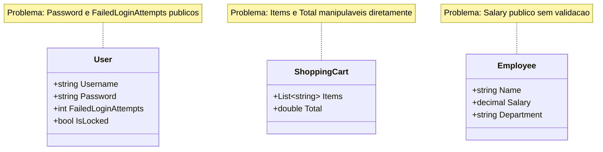

# 9.5 — Exercícios: Encapsulamento

[← Voltar ao conteúdo: Encapsulamento](cap09-mod05-encapsulamento-conteudo.md)

---

## Sobre Estes Exercícios

Estes exercícios praticam encapsulamento em C#: modificadores de acesso, propriedades com validação, propriedades somente leitura e imutabilidade. Execute cada exercício em um projeto C#.

---

## Exercício 1 — Conta Bancária Encapsulada

Refatore a classe `BankAccount` para usar encapsulamento completo:

- Atributos `_owner` e `_balance` privados
- Propriedade `Owner` somente leitura
- Propriedade `Balance` somente leitura
- Método `Deposit(amount)` com validação (valor > 0)
- Método `Withdraw(amount)` com validação (valor > 0, saldo suficiente)
- Método `Transfer(destination, amount)` que saca de uma conta e deposita em outra

Teste com cenários válidos e inválidos:

```csharp
var conta1 = new BankAccount("Maria", 1000);
var conta2 = new BankAccount("João", 500);

conta1.Deposit(500);        // OK
conta1.Deposit(-100);       // Falha
conta1.Withdraw(200);       // OK
conta1.Withdraw(5000);      // Falha
conta1.Transfer(conta2, 300); // OK

// conta1.Balance = 999999;  // Deve dar erro de compilação!
```

---

## Exercício 2 — Produto com Validação Completa

Crie uma classe `Product` com propriedades validadas:

- `Name`: não pode ser vazio nem ter menos de 2 caracteres
- `Price`: não pode ser negativo (use `decimal` para dinheiro)
- `Quantity`: não pode ser negativo
- `Category`: deve ser uma das categorias válidas: "Eletrônicos", "Roupas", "Alimentos", "Outros"
- `TotalValue`: propriedade calculada (somente leitura) = Price * Quantity

Teste com valores válidos e inválidos. Verifique que valores inválidos são rejeitados.

---

## Exercício 3 — Termômetro Encapsulado

Crie uma classe `Thermometer` com:

- Temperatura interna em Celsius (private)
- Limites: mínimo -273.15 (zero absoluto), máximo 1000
- Propriedade `Celsius` com get e set validado
- Propriedade `Fahrenheit` somente leitura (calculada: C * 9/5 + 32)
- Propriedade `Kelvin` somente leitura (calculada: C + 273.15)
- Métodos `Heat(degrees)` e `Cool(degrees)` com validação

```csharp
var t = new Thermometer(25.0);
Console.WriteLine($"Celsius: {t.Celsius}");
Console.WriteLine($"Fahrenheit: {t.Fahrenheit}");
Console.WriteLine($"Kelvin: {t.Kelvin}");

t.Heat(10);   // 35°C
t.Cool(50);   // -15°C
t.Cool(300);  // Falha — ficaria abaixo do zero absoluto
```

---

## Exercício 4 — Playlist Encapsulada

Crie uma classe `Playlist` com:

- Nome (somente leitura após criação)
- Lista privada de músicas (strings)
- Limite máximo de músicas (definido no construtor)
- Métodos: `Add(song)`, `Remove(song)`, `ListAll()`, `GetCount()`
- Validações: não adicionar duplicatas, não exceder limite, não adicionar string vazia

```csharp
var playlist = new Playlist("Favoritas", 5);
playlist.Add("Bohemian Rhapsody");
playlist.Add("Imagine");
playlist.Add("Bohemian Rhapsody");  // Falha — duplicata
playlist.Add("");                    // Falha — vazio
playlist.ListAll();
```

---

## Exercício 5 — Registro de Aluno Imutável

Crie uma classe `StudentRecord` (Registro de Aluno) que seja imutável:

- Todas as propriedades somente leitura: Id, Name, Course, Grade, EnrollmentDate
- Uma vez criado, nenhum dado pode ser alterado
- Método `Display()` para exibir os dados
- Método `IsApproved()` que retorna se a nota é >= 7.0

Crie 5 registros e liste todos. Tente alterar algum dado e verifique que o compilador impede.

---

## Exercício 6 — Análise de Código

Para cada classe abaixo, identifique problemas de encapsulamento e reescreva com proteção adequada:

```csharp
// Classe 1 — O que está errado?
class User
{
    public string Username;
    public string Password;
    public int FailedLoginAttempts;
    public bool IsLocked;
}

// Classe 2 — O que está errado?
class ShoppingCart
{
    public List<string> Items = new List<string>();
    public double Total;
}

// Classe 3 — O que está errado?
class Employee
{
    public string Name;
    public decimal Salary;
    public string Department;
}
```

Para cada classe, responda:
1. Quais atributos deveriam ser private?
2. Quais propriedades deveriam ser somente leitura?
3. Quais métodos deveriam ser adicionados para controlar o acesso?
4. Que validações estão faltando?

Diagrama de classes mostrando as 3 classes com problemas de encapsulamento — todos os campos estao publicos:



---

## Exercício 7 — Cofre Digital

Crie uma classe `DigitalVault` (Cofre Digital) que:

- Tem uma senha definida no construtor (private)
- Armazena uma lista privada de "segredos" (strings)
- Método `AddSecret(password, secret)` — só adiciona se a senha estiver correta
- Método `ListSecrets(password)` — só lista se a senha estiver correta
- Método `ChangePassword(oldPassword, newPassword)` — só muda se a senha antiga estiver correta
- Conta tentativas de senha errada e bloqueia após 3 tentativas

Este exercício demonstra encapsulamento em um cenário de segurança real.

---

## Exercício 8 — Comparação Antes e Depois

Pegue o sistema de contatos do módulo 9.4 (classe `ContactBook`) e:

1. Copie o código original (sem encapsulamento)
2. Refatore com encapsulamento adequado
3. Liste todas as mudanças que fez
4. Explique: o que ficou mais seguro? O que ficou mais difícil de quebrar?

---

## Exercício 9 — Propriedades Calculadas

Crie uma classe `Rectangle` com largura e altura (private, com validação: > 0). Adicione propriedades calculadas somente leitura para:

- `Area` (largura x altura)
- `Perimeter` (2 x largura + 2 x altura)
- `IsSquare` (largura == altura)
- `Diagonal` (raiz quadrada de largura² + altura²)

Use `Math.Sqrt()` para a diagonal.

---

## Exercício 10 — Reflexão

Escreva um parágrafo respondendo: "Por que encapsulamento é importante em projetos com múltiplos desenvolvedores?" Considere cenários onde uma pessoa altera o código de outra, onde bugs são introduzidos por acesso direto a dados internos, e onde mudanças internas precisam ser feitas sem quebrar o código existente.

---

[← Voltar ao conteúdo: Encapsulamento](cap09-mod05-encapsulamento-conteudo.md)
