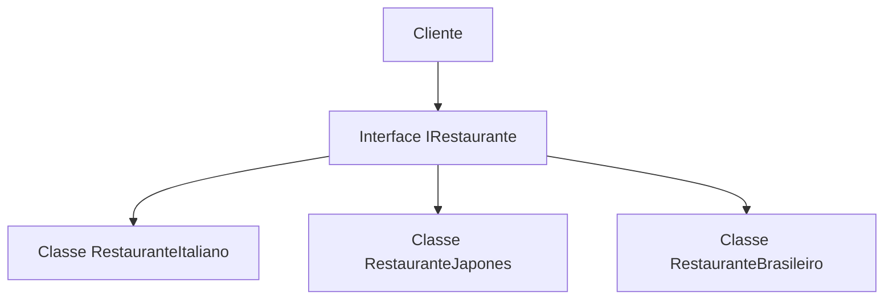
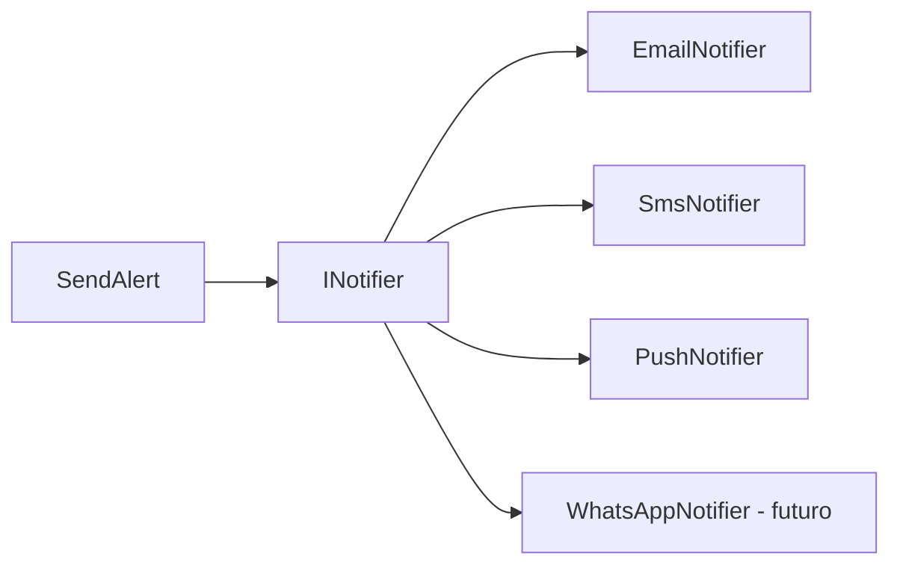
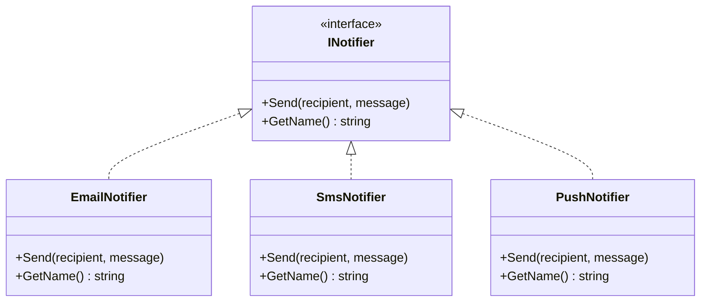
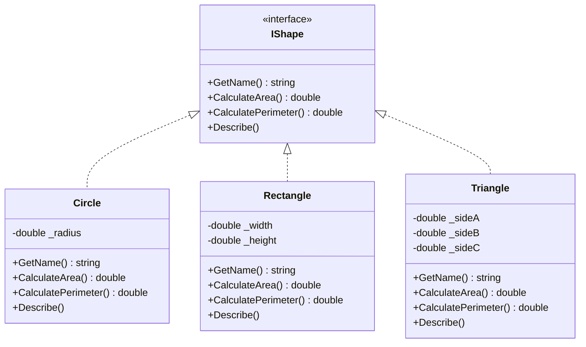
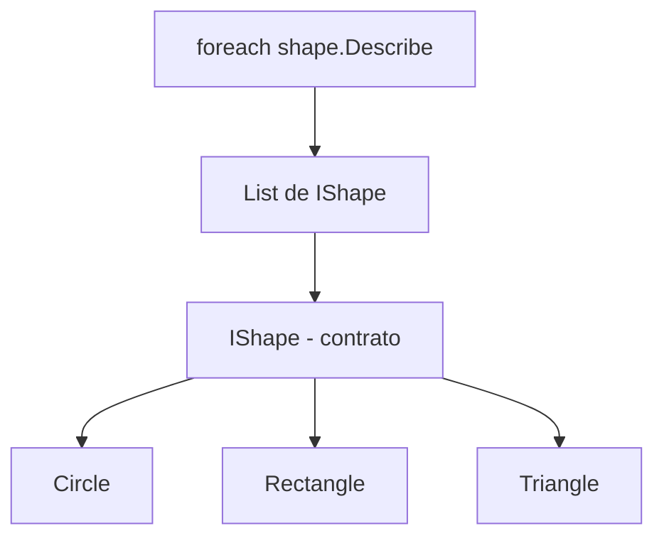
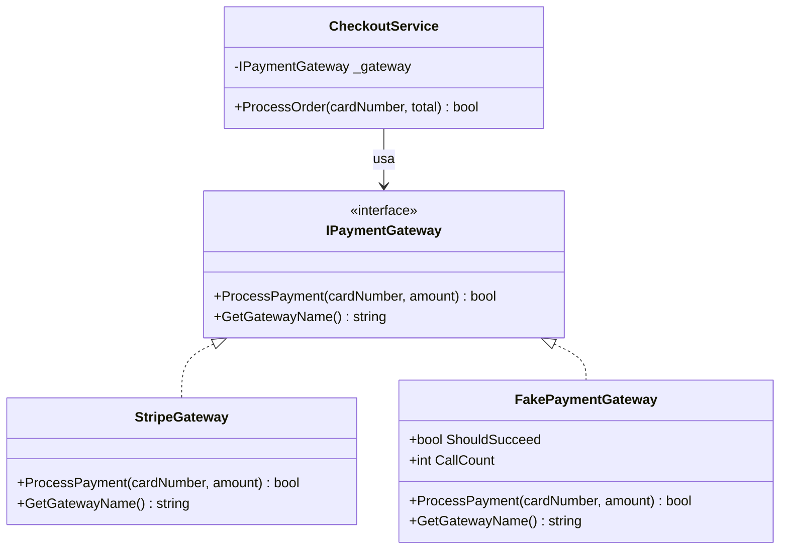
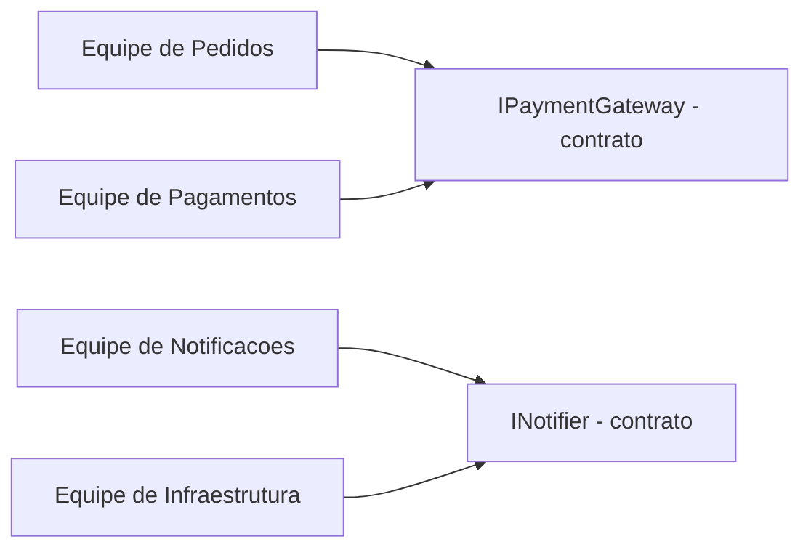
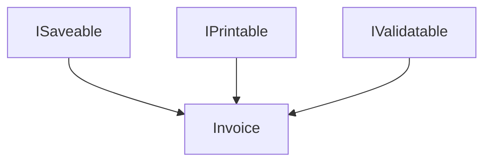
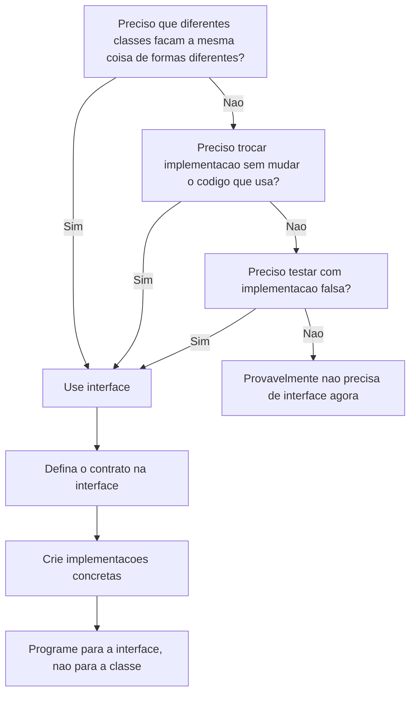

# 9.6 — Interfaces: Contratos de Comportamento

[← Anterior: Encapsulamento](cap09-mod05-encapsulamento-conteudo.md) · [Próximo: Herança e Polimorfismo →](cap09-mod07-heranca-conteudo.md)

---

## Introdução

No módulo anterior, você aprendeu a proteger os dados internos de um objeto com encapsulamento — atributos privados, propriedades com validação e métodos públicos que formam a interface controlada de cada classe. Agora o saldo de uma conta bancária não pode ser alterado diretamente; o estoque de um produto só muda através de operações validadas.

Mas existe um problema que o encapsulamento sozinho não resolve. Imagine que você está construindo um sistema de notificações. Hoje, o sistema envia notificações por e-mail. Amanhã, o chefe pede para adicionar SMS. Semana que vem, push notification no celular. Mês que vem, WhatsApp.

Se o código que envia notificações conhece diretamente a classe `EmailSender`, você precisa modificar esse código toda vez que um novo canal de notificação aparece. E modificar código que já funciona é perigoso — você pode quebrar o que estava funcionando.

É aqui que entram as **interfaces**. Uma interface é um **contrato** que define O QUE um objeto deve saber fazer, sem dizer COMO ele faz. É como um acordo formal: "qualquer classe que assinar este contrato promete implementar estes métodos". O código que usa a interface não precisa saber qual classe concreta está por trás — ele só sabe que o contrato será cumprido.

Este é o módulo mais importante do capítulo 9. Interfaces são a base de tudo que vem depois: herança, polimorfismo, design patterns (Factory, Repository) e os princípios SOLID. Se você entender bem interfaces, o resto do capítulo vai fluir naturalmente. Se não entender, tudo vai parecer confuso. Então vamos com calma, com muitos exemplos e analogias.

---

## Como Executar os Exemplos Deste Módulo

Todos os exemplos são programas C# completos. Substitua o conteúdo de `Program.cs` no seu projeto e execute com `dotnet run`. Se preferir, crie um projeto separado para este módulo:

```bash
# Crie um projeto para os exemplos de interfaces
dotnet new console -o ~/curso-csharp/mod06-interfaces
```

---

## A Analogia: O Cardápio do Restaurante

Imagine que você vai a um restaurante. O garçom te entrega o **cardápio**. O cardápio diz:

- Temos lasanha
- Temos pizza margherita
- Temos risoto de cogumelos

O cardápio te diz **O QUE** está disponível. Ele não te diz **COMO** a lasanha é feita — se o molho é caseiro ou industrializado, se o queijo é mussarela ou parmesão, se o forno é a lenha ou elétrico. Esses são detalhes internos da cozinha.

Você, como cliente, não precisa saber como a cozinha funciona. Você só precisa saber o que pode pedir. O cardápio é o **contrato** entre você e o restaurante: "se está no cardápio, o restaurante promete entregar".

Agora, imagine que existem dois restaurantes diferentes — um italiano e um japonês. Ambos têm cardápio. Os pratos são completamente diferentes, mas a **ideia** de cardápio é a mesma: uma lista do que está disponível.

Em programação:
- O **cardápio** é a **interface** — define o que está disponível (quais métodos existem)
- A **cozinha** é a **classe** — implementa como cada prato é feito (o código dos métodos)
- O **cliente** é o **código que usa a interface** — não precisa saber qual cozinha está por trás



O cliente interage com a interface `IRestaurante`. Ele não sabe (e não precisa saber) se por trás está o restaurante italiano, japonês ou brasileiro. Ele só sabe que pode pedir os pratos que estão no cardápio.

---

## O que é uma Interface?

Uma interface em C# é uma **definição de contrato**. Ela declara quais métodos uma classe deve ter, mas não implementa nenhum deles. É como uma lista de promessas: "qualquer classe que implementar esta interface promete ter estes métodos".

### A Sintaxe Básica

```csharp
// Definição de uma interface
// "INotifier" = Notificador (interface)
// Convenção C#: interfaces começam com "I" maiúsculo
interface INotifier
{
    // Apenas a ASSINATURA do método — sem corpo, sem implementação
    // "Send" = enviar
    void Send(string recipient, string message);
}
```

Saída esperada: nenhuma (é apenas a definição da interface)

Observe:
- A palavra-chave é `interface`, não `class`
- O nome começa com `I` maiúsculo — essa é a convenção em C# (INotifier, IRepository, IShape)
- O método `Send` tem apenas a **assinatura**: tipo de retorno (`void`), nome (`Send`) e parâmetros (`string recipient, string message`)
- Não tem corpo `{ }` com código — apenas um ponto e vírgula
- Não tem modificador `public` nos métodos — em interfaces, tudo é público por padrão

### Interface vs Classe: A Diferença Fundamental

| Aspecto | Interface | Classe |
|---------|-----------|--------|
| Define | O QUE fazer (contrato) | COMO fazer (implementação) |
| Tem código nos métodos? | Não — apenas assinaturas | Sim — código completo |
| Pode criar objetos? | Não — `new INotifier()` é ERRO | Sim — `new EmailNotifier()` |
| Pode ter atributos? | Não (apenas propriedades sem corpo) | Sim |
| Pode ter construtor? | Não | Sim |
| Propósito | Definir um contrato de comportamento | Implementar o comportamento |

Pense assim: a interface é o **contrato de trabalho** e a classe é o **funcionário** que assina o contrato e faz o trabalho.

---

## Implementando uma Interface

Quando uma classe **implementa** uma interface, ela está "assinando o contrato" — prometendo que vai ter todos os métodos definidos na interface, com código real.

```csharp
// A interface — o contrato
// "INotifier" = Notificador
interface INotifier
{
    // "Send" = enviar
    void Send(string recipient, string message);
    
    // "GetName" = obter nome do canal
    string GetName();
}

// Classe que IMPLEMENTA a interface — assina o contrato
// "EmailNotifier" = Notificador por Email
class EmailNotifier : INotifier  // Os dois pontos significam "implementa"
{
    // OBRIGADA a implementar Send — está no contrato
    public void Send(string recipient, string message)
    {
        Console.WriteLine($"[EMAIL] Para: {recipient}");
        Console.WriteLine($"  Mensagem: {message}");
        Console.WriteLine($"  Status: Email enviado com sucesso!");
    }

    // OBRIGADA a implementar GetName — está no contrato
    public string GetName()
    {
        return "Email";
    }
}

// Outra classe que implementa a MESMA interface
// "SmsNotifier" = Notificador por SMS
class SmsNotifier : INotifier
{
    public void Send(string recipient, string message)
    {
        // SMS tem limite de 160 caracteres
        string smsMessage = message.Length > 160 
            ? message.Substring(0, 157) + "..." 
            : message;
        Console.WriteLine($"[SMS] Para: {recipient}");
        Console.WriteLine($"  Mensagem: {smsMessage}");
        Console.WriteLine($"  Status: SMS enviado!");
    }

    public string GetName()
    {
        return "SMS";
    }
}

// === Usando as implementações ===
var email = new EmailNotifier();
var sms = new SmsNotifier();

email.Send("maria@email.com", "Seu pedido foi confirmado!");
Console.WriteLine();
sms.Send("11999991111", "Seu pedido foi confirmado!");
```

Saída esperada:
```
[EMAIL] Para: maria@email.com
  Mensagem: Seu pedido foi confirmado!
  Status: Email enviado com sucesso!

[SMS] Para: 11999991111
  Mensagem: Seu pedido foi confirmado!
  Status: SMS enviado!
```

Observe o que aconteceu:
1. A interface `INotifier` define o contrato: todo notificador deve ter `Send()` e `GetName()`
2. `EmailNotifier` implementa o contrato do seu jeito — envia por email
3. `SmsNotifier` implementa o contrato do seu jeito — envia por SMS, com limite de 160 caracteres
4. Ambas as classes cumprem o mesmo contrato, mas de formas diferentes

### O que Acontece se Não Implementar Tudo?

Se uma classe assina o contrato mas não implementa todos os métodos, o compilador C# gera um **erro**. Isso é uma proteção — garante que o contrato será cumprido.

```csharp
// ERRO DE COMPILAÇÃO — falta implementar GetName()
class BrokenNotifier : INotifier
{
    public void Send(string recipient, string message)
    {
        Console.WriteLine("Enviando...");
    }
    // Cadê o GetName()? O compilador vai reclamar!
    // Error CS0535: 'BrokenNotifier' does not implement interface member 'INotifier.GetName()'
}
```

Saída esperada: erro de compilação (o programa não compila)

Isso é uma das grandes vantagens de interfaces em C#: o compilador **garante** que o contrato será cumprido. Em Python, como veremos mais adiante, essa garantia não existe — o erro só aparece quando o programa roda.

---

## O Poder das Interfaces: Programar para o Contrato

Até agora, criamos as classes e usamos cada uma diretamente. Mas o verdadeiro poder das interfaces aparece quando você programa **para a interface**, não para a classe concreta.

Isso significa: em vez de declarar uma variável como `EmailNotifier`, declare como `INotifier`. Assim, o código funciona com QUALQUER implementação da interface.

```csharp
// Interface
interface INotifier
{
    void Send(string recipient, string message);
    string GetName();
}

// Implementação 1: Email
class EmailNotifier : INotifier
{
    public void Send(string recipient, string message)
    {
        Console.WriteLine($"[EMAIL] Para: {recipient} — {message}");
    }

    public string GetName() { return "Email"; }
}

// Implementação 2: SMS
class SmsNotifier : INotifier
{
    public void Send(string recipient, string message)
    {
        Console.WriteLine($"[SMS] Para: {recipient} — {message}");
    }

    public string GetName() { return "SMS"; }
}

// Implementação 3: Push Notification
// "PushNotifier" = Notificador por Push
class PushNotifier : INotifier
{
    public void Send(string recipient, string message)
    {
        Console.WriteLine($"[PUSH] Para dispositivo: {recipient} — {message}");
    }

    public string GetName() { return "Push"; }
}

// === A MÁGICA: código que funciona com QUALQUER notificador ===

// "SendAlert" = enviar alerta
// Recebe INotifier — aceita QUALQUER implementação!
static void SendAlert(INotifier notifier, string recipient, string message)
{
    Console.WriteLine($"Enviando via {notifier.GetName()}...");
    notifier.Send(recipient, message);
    Console.WriteLine("Alerta enviado!\n");
}

// Usando — o MESMO método funciona com implementações diferentes
SendAlert(new EmailNotifier(), "maria@email.com", "Servidor fora do ar!");
SendAlert(new SmsNotifier(), "11999991111", "Servidor fora do ar!");
SendAlert(new PushNotifier(), "device-abc-123", "Servidor fora do ar!");
```

Saída esperada:
```
Enviando via Email...
[EMAIL] Para: maria@email.com — Servidor fora do ar!
Alerta enviado!

Enviando via SMS...
[SMS] Para: 11999991111 — Servidor fora do ar!
Alerta enviado!

Enviando via Push...
[PUSH] Para dispositivo: device-abc-123 — Servidor fora do ar!
Alerta enviado!
```

Percebe o que aconteceu? O método `SendAlert` não sabe se está enviando por email, SMS ou push. Ele só sabe que recebeu algo que implementa `INotifier` — algo que tem `Send()` e `GetName()`. O método funciona com qualquer implementação, presente ou futura.

Se amanhã alguém criar um `WhatsAppNotifier` que implementa `INotifier`, o método `SendAlert` funciona com ele **sem nenhuma modificação**. Isso é extraordinariamente poderoso.



Veja a estrutura de classes e a interface em um diagrama:



### O Princípio: Dependa de Abstrações, Não de Implementações

Esse conceito tem um nome formal na engenharia de software: **Princípio da Inversão de Dependência** (um dos princípios SOLID que vamos estudar no módulo 9.10). A ideia é simples:

- **Ruim**: `SendAlert` depende de `EmailNotifier` (classe concreta) — se quiser trocar, precisa mudar o código
- **Bom**: `SendAlert` depende de `INotifier` (interface) — funciona com qualquer implementação

É como a tomada elétrica: a tomada não depende de um aparelho específico. Ela define um formato (o contrato) e qualquer aparelho que siga esse formato pode ser plugado.

---

## Múltiplas Implementações: O Exemplo Completo de Formas Geométricas

Vamos ver um exemplo clássico que aparece em praticamente todo curso de OOP: formas geométricas. Esse exemplo é perfeito para entender interfaces porque cada forma calcula área e perímetro de forma completamente diferente, mas todas compartilham o mesmo contrato.

```csharp
// Interface que define o contrato de uma forma geométrica
// "IShape" = Forma
interface IShape
{
    // "GetName" = obter nome da forma
    string GetName();
    
    // "CalculateArea" = calcular area
    double CalculateArea();
    
    // "CalculatePerimeter" = calcular perimetro
    double CalculatePerimeter();
    
    // "Describe" = descrever a forma
    void Describe();
}

// Implementação 1: Círculo
// "Circle" = Circulo
class Circle : IShape
{
    private double _radius;  // "radius" = raio

    public Circle(double radius)
    {
        _radius = radius;
    }

    public string GetName() { return "Círculo"; }

    public double CalculateArea()
    {
        return Math.PI * _radius * _radius;  // π × r²
    }

    public double CalculatePerimeter()
    {
        return 2 * Math.PI * _radius;  // 2 × π × r
    }

    public void Describe()
    {
        Console.WriteLine($"  {GetName()} com raio {_radius:F1}");
        Console.WriteLine($"    Área: {CalculateArea():F2}");
        Console.WriteLine($"    Perímetro: {CalculatePerimeter():F2}");
    }
}

// Implementação 2: Retângulo
// "Rectangle" = Retangulo
class Rectangle : IShape
{
    private double _width;   // "width" = largura
    private double _height;  // "height" = altura

    public Rectangle(double width, double height)
    {
        _width = width;
        _height = height;
    }

    public string GetName() { return "Retângulo"; }

    public double CalculateArea()
    {
        return _width * _height;  // largura × altura
    }

    public double CalculatePerimeter()
    {
        return 2 * (_width + _height);  // 2 × (largura + altura)
    }

    public void Describe()
    {
        Console.WriteLine($"  {GetName()} {_width:F1} x {_height:F1}");
        Console.WriteLine($"    Área: {CalculateArea():F2}");
        Console.WriteLine($"    Perímetro: {CalculatePerimeter():F2}");
    }
}

// Implementação 3: Triângulo
// "Triangle" = Triangulo
class Triangle : IShape
{
    private double _sideA;  // "sideA" = lado A
    private double _sideB;  // "sideB" = lado B
    private double _sideC;  // "sideC" = lado C

    public Triangle(double sideA, double sideB, double sideC)
    {
        _sideA = sideA;
        _sideB = sideB;
        _sideC = sideC;
    }

    public string GetName() { return "Triângulo"; }

    public double CalculateArea()
    {
        // Fórmula de Herão — calcula área a partir dos 3 lados
        double s = (_sideA + _sideB + _sideC) / 2;  // semi-perímetro
        return Math.Sqrt(s * (s - _sideA) * (s - _sideB) * (s - _sideC));
    }

    public double CalculatePerimeter()
    {
        return _sideA + _sideB + _sideC;
    }

    public void Describe()
    {
        Console.WriteLine($"  {GetName()} com lados {_sideA:F1}, {_sideB:F1}, {_sideC:F1}");
        Console.WriteLine($"    Área: {CalculateArea():F2}");
        Console.WriteLine($"    Perímetro: {CalculatePerimeter():F2}");
    }
}

// === Usando as formas com a interface ===

// Lista de IShape — aceita QUALQUER forma!
var shapes = new List<IShape>
{
    new Circle(5),
    new Rectangle(4, 6),
    new Triangle(3, 4, 5),
    new Circle(10),
    new Rectangle(8, 3)
};

Console.WriteLine("=== Catálogo de Formas ===\n");

double totalArea = 0;

foreach (var shape in shapes)
{
    shape.Describe();
    totalArea += shape.CalculateArea();
    Console.WriteLine();
}

Console.WriteLine($"Área total de todas as formas: {totalArea:F2}");
```

Saída esperada:
```
=== Catálogo de Formas ===

  Círculo com raio 5.0
    Área: 78.54
    Perímetro: 31.42

  Retângulo 4.0 x 6.0
    Área: 24.00
    Perímetro: 20.00

  Triângulo com lados 3.0, 4.0, 5.0
    Área: 6.00
    Perímetro: 12.00

  Círculo com raio 10.0
    Área: 314.16
    Perímetro: 62.83

  Retângulo 8.0 x 3.0
    Área: 24.00
    Perímetro: 22.00

Área total de todas as formas: 446.70
```

Observe o poder disso:

1. A lista `shapes` é do tipo `List<IShape>` — aceita qualquer objeto que implemente `IShape`
2. O `foreach` percorre a lista e chama `Describe()` e `CalculateArea()` em cada forma
3. O loop não sabe se está lidando com um círculo, retângulo ou triângulo — e não precisa saber

Veja a hierarquia de classes e a interface IShape:


4. Se amanhã alguém criar um `Pentagon` que implementa `IShape`, ele funciona na lista sem mudar nada

Isso é o que chamamos de **polimorfismo** — tratar objetos diferentes de forma uniforme através de uma interface comum. Vamos aprofundar polimorfismo no módulo 9.7, mas aqui você já está vendo ele em ação.



---

## Por que Interfaces Existem? Os Três Grandes Motivos

Interfaces podem parecer "trabalho extra" no início. Por que criar uma interface se eu posso simplesmente criar a classe direto? Existem três motivos fundamentais que justificam interfaces em qualquer projeto real.

### Motivo 1: Trocar Implementação sem Mudar o Código que Usa

Imagine um sistema que salva dados em um banco de dados. Hoje usa SQLite. Amanhã pode precisar usar PostgreSQL. Semana que vem, talvez MongoDB.

Se o código que salva dados conhece diretamente a classe `SqliteDatabase`, trocar para PostgreSQL significa mudar TODOS os lugares que usam `SqliteDatabase`. Em um sistema grande, isso pode ser dezenas ou centenas de arquivos.

Com uma interface `IDatabase`, o código que salva dados conhece apenas o contrato. Trocar de SQLite para PostgreSQL significa criar uma nova classe que implementa `IDatabase` e mudar apenas a configuração de qual classe usar. O resto do código não muda.

```csharp
// Interface — o contrato
// "IDatabase" = Banco de Dados
interface IDatabase
{
    void Save(string key, string value);
    string Load(string key);
}

// Implementação SQLite
class SqliteDatabase : IDatabase
{
    public void Save(string key, string value)
    {
        Console.WriteLine($"[SQLite] Salvando: {key} = {value}");
    }

    public string Load(string key)
    {
        Console.WriteLine($"[SQLite] Carregando: {key}");
        return $"valor-de-{key}";
    }
}

// Implementação em memória (para testes!)
// "InMemoryDatabase" = Banco em Memoria
class InMemoryDatabase : IDatabase
{
    private Dictionary<string, string> _data = new Dictionary<string, string>();

    public void Save(string key, string value)
    {
        _data[key] = value;
        Console.WriteLine($"[Memória] Salvando: {key} = {value}");
    }

    public string Load(string key)
    {
        Console.WriteLine($"[Memória] Carregando: {key}");
        return _data.ContainsKey(key) ? _data[key] : "não encontrado";
    }
}

// Serviço que USA a interface — não sabe qual banco está por trás
// "UserService" = Servico de Usuario
class UserService
{
    private IDatabase _database;  // Depende da INTERFACE, não da classe concreta

    public UserService(IDatabase database)
    {
        _database = database;  // Recebe qualquer implementação
    }

    // "RegisterUser" = registrar usuario
    public void RegisterUser(string name, string email)
    {
        _database.Save($"user:{email}", name);
        Console.WriteLine($"Usuário {name} registrado!\n");
    }

    // "FindUser" = buscar usuario
    public string FindUser(string email)
    {
        return _database.Load($"user:{email}");
    }
}

// === Usando com SQLite ===
Console.WriteLine("=== Com SQLite ===");
var sqliteService = new UserService(new SqliteDatabase());
sqliteService.RegisterUser("Maria", "maria@email.com");

// === Usando com banco em memória (para testes) ===
Console.WriteLine("=== Com Banco em Memória ===");
var memoryService = new UserService(new InMemoryDatabase());
memoryService.RegisterUser("Pedro", "pedro@email.com");
```

Saída esperada:
```
=== Com SQLite ===
[SQLite] Salvando: user:maria@email.com = Maria
Usuário Maria registrado!

=== Com Banco em Memória ===
[Memória] Salvando: user:pedro@email.com = Pedro
Usuário Pedro registrado!
```

O `UserService` funciona com qualquer banco de dados — SQLite, memória, PostgreSQL, MongoDB — desde que implemente `IDatabase`. Trocar o banco é mudar UMA linha de código (onde o `UserService` é criado), não dezenas de arquivos.

### Motivo 2: Escrever Testes Automatizados

Esse é um dos motivos mais práticos. Quando você escreve testes para o seu código, não quer depender de um banco de dados real, de um servidor de email real ou de uma API externa real. Testes precisam ser rápidos, previsíveis e independentes.

Com interfaces, você pode criar implementações "falsas" (chamadas de **mocks** ou **stubs**) que simulam o comportamento real sem depender de recursos externos.

No exemplo acima, o `InMemoryDatabase` é exatamente isso — uma implementação falsa que guarda dados em memória, perfeita para testes. O `UserService` não sabe a diferença entre o banco real e o falso, porque ambos implementam `IDatabase`.

Vamos ver isso em ação com um exemplo mais claro:

```csharp
// Interface de pagamento
// "IPaymentGateway" = Gateway de Pagamento
interface IPaymentGateway
{
    // "ProcessPayment" = processar pagamento
    bool ProcessPayment(string cardNumber, decimal amount);
    
    // "GetGatewayName" = obter nome do gateway
    string GetGatewayName();
}

// Implementação REAL — conecta com o gateway de verdade
// "StripeGateway" = Gateway Stripe
class StripeGateway : IPaymentGateway
{
    public bool ProcessPayment(string cardNumber, decimal amount)
    {
        // Em produção, aqui teria a chamada HTTP para a API do Stripe
        Console.WriteLine($"[Stripe] Cobrando R${amount:F2} no cartão {cardNumber}");
        return true;
    }

    public string GetGatewayName() { return "Stripe"; }
}

// Implementação FALSA — para testes, sem cobrar ninguém!
// "FakePaymentGateway" = Gateway Falso
class FakePaymentGateway : IPaymentGateway
{
    public bool ShouldSucceed { get; set; } = true;  // Controla se o pagamento "funciona"
    public int CallCount { get; private set; } = 0;  // Conta quantas vezes foi chamado

    public bool ProcessPayment(string cardNumber, decimal amount)
    {
        CallCount++;
        Console.WriteLine($"[FAKE] Simulando pagamento de R${amount:F2}");
        return ShouldSucceed;
    }

    public string GetGatewayName() { return "Fake (Teste)"; }
}

// Serviço de checkout que usa a interface
// "CheckoutService" = Servico de Checkout
class CheckoutService
{
    private IPaymentGateway _gateway;

    public CheckoutService(IPaymentGateway gateway)
    {
        _gateway = gateway;
    }

    // "ProcessOrder" = processar pedido
    public bool ProcessOrder(string cardNumber, decimal total)
    {
        Console.WriteLine($"Processando pedido de R${total:F2} via {_gateway.GetGatewayName()}...");
        bool success = _gateway.ProcessPayment(cardNumber, total);
        
        if (success)
            Console.WriteLine("Pedido aprovado!\n");
        else
            Console.WriteLine("Pagamento recusado!\n");
        
        return success;
    }
}

// === Em produção: usa o gateway real ===
Console.WriteLine("=== Produção ===");
var realCheckout = new CheckoutService(new StripeGateway());
realCheckout.ProcessOrder("4242-4242-4242-4242", 299.90m);

// === Em testes: usa o gateway falso ===
Console.WriteLine("=== Teste: pagamento aprovado ===");
var fakeGateway = new FakePaymentGateway();
var testCheckout = new CheckoutService(fakeGateway);
testCheckout.ProcessOrder("0000-0000-0000-0000", 99.90m);

Console.WriteLine("=== Teste: pagamento recusado ===");
fakeGateway.ShouldSucceed = false;
testCheckout.ProcessOrder("0000-0000-0000-0000", 99.90m);

Console.WriteLine($"Gateway falso foi chamado {fakeGateway.CallCount} vezes.");
```

Saída esperada:
```
=== Produção ===
Processando pedido de R$299.90 via Stripe...
[Stripe] Cobrando R$299.90 no cartão 4242-4242-4242-4242
Pedido aprovado!

=== Teste: pagamento aprovado ===
Processando pedido de R$99.90 via Fake (Teste)...
[FAKE] Simulando pagamento de R$99.90
Pedido aprovado!

=== Teste: pagamento recusado ===
Processando pedido de R$99.90 via Fake (Teste)...
[FAKE] Simulando pagamento de R$99.90
Pagamento recusado!

Gateway falso foi chamado 2 vezes.
```

Isso é incrivelmente útil. Nos testes, você pode:
- Simular pagamentos aprovados e recusados sem cobrar ninguém
- Verificar quantas vezes o gateway foi chamado
- Testar o comportamento do `CheckoutService` isoladamente
- Rodar os testes em milissegundos, sem depender de internet ou servidores externos

Veja a estrutura completa com interface, implementacoes e servico:



### Motivo 3: Desacoplar Partes do Sistema

Em um sistema grande, diferentes equipes trabalham em diferentes partes. A equipe de pagamentos cuida do gateway. A equipe de pedidos cuida do checkout. A equipe de notificações cuida dos alertas.

Interfaces permitem que essas equipes trabalhem de forma independente. A equipe de pedidos define a interface `IPaymentGateway` e programa contra ela. A equipe de pagamentos implementa a interface. Nenhuma equipe precisa esperar a outra terminar — elas concordam no contrato (a interface) e trabalham em paralelo.



---

## Interfaces com Propriedades

Interfaces em C# podem definir propriedades além de métodos. Isso é útil quando o contrato exige que o objeto tenha certas informações acessíveis.

```csharp
// Interface com propriedades
// "IProduct" = Produto
interface IProduct
{
    // Propriedades — o contrato exige que o produto tenha esses dados
    string Name { get; }           // Somente leitura
    double Price { get; set; }     // Leitura e escrita
    
    // Método
    // "GetFormattedPrice" = obter preco formatado
    string GetFormattedPrice();
}

// Implementação: Produto físico
// "PhysicalProduct" = Produto Fisico
class PhysicalProduct : IProduct
{
    public string Name { get; }
    public double Price { get; set; }
    private double _weight;  // "weight" = peso

    public PhysicalProduct(string name, double price, double weight)
    {
        Name = name;
        Price = price;
        _weight = weight;
    }

    public string GetFormattedPrice()
    {
        return $"{Name} — R${Price:F2} (Peso: {_weight:F1}kg)";
    }
}

// Implementação: Produto digital
// "DigitalProduct" = Produto Digital
class DigitalProduct : IProduct
{
    public string Name { get; }
    public double Price { get; set; }
    private string _downloadUrl;  // "downloadUrl" = URL de download

    public DigitalProduct(string name, double price, string downloadUrl)
    {
        Name = name;
        Price = price;
        _downloadUrl = downloadUrl;
    }

    public string GetFormattedPrice()
    {
        return $"{Name} — R${Price:F2} (Download: {_downloadUrl})";
    }
}

// Usando — ambos são IProduct
var products = new List<IProduct>
{
    new PhysicalProduct("Notebook", 3500.00, 2.1),
    new DigitalProduct("E-book C#", 49.90, "https://exemplo.com/ebook"),
    new PhysicalProduct("Mouse", 89.90, 0.1),
    new DigitalProduct("Curso Online", 199.90, "https://exemplo.com/curso")
};

Console.WriteLine("=== Catálogo ===");
double total = 0;
foreach (var product in products)
{
    Console.WriteLine(product.GetFormattedPrice());
    total += product.Price;
}
Console.WriteLine($"\nValor total: R${total:F2}");
```

Saída esperada:
```
=== Catálogo ===
Notebook — R$3500.00 (Peso: 2.1kg)
E-book C# — R$49.90 (Download: https://exemplo.com/ebook)
Mouse — R$89.90 (Peso: 0.1kg)
Curso Online — R$199.90 (Download: https://exemplo.com/curso)

Valor total: R$3839.70
```

Produtos físicos e digitais são completamente diferentes internamente (um tem peso, outro tem URL de download), mas ambos cumprem o contrato `IProduct` — têm nome, preço e sabem se formatar. O código que lista o catálogo não precisa saber a diferença.

---

## Uma Classe Pode Implementar Múltiplas Interfaces

Diferente de herança (que veremos no módulo 9.7), onde uma classe só pode herdar de UMA classe base, uma classe pode implementar **quantas interfaces quiser**. Isso faz sentido: uma pessoa pode assinar vários contratos diferentes ao mesmo tempo.

```csharp
// Interface 1: pode ser salvo em arquivo
// "ISaveable" = Salvavel
interface ISaveable
{
    // "SaveToFile" = salvar em arquivo
    void SaveToFile(string filename);
}

// Interface 2: pode ser impresso
// "IPrintable" = Imprimivel
interface IPrintable
{
    // "Print" = imprimir
    void Print();
}

// Interface 3: pode ser validado
// "IValidatable" = Validavel
interface IValidatable
{
    // "IsValid" = eh valido
    bool IsValid();
    
    // "GetErrors" = obter erros
    List<string> GetErrors();
}

// Uma classe que implementa TRÊS interfaces
// "Invoice" = Nota Fiscal
class Invoice : ISaveable, IPrintable, IValidatable
{
    public int Number { get; }          // "Number" = numero
    public string Customer { get; }     // "Customer" = cliente
    public decimal Total { get; }       // "Total" = total
    public DateTime Date { get; }       // "Date" = data

    public Invoice(int number, string customer, decimal total)
    {
        Number = number;
        Customer = customer;
        Total = total;
        Date = DateTime.Now;
    }

    // Implementa ISaveable
    public void SaveToFile(string filename)
    {
        Console.WriteLine($"Nota #{Number} salva em {filename}");
    }

    // Implementa IPrintable
    public void Print()
    {
        Console.WriteLine($"=== NOTA FISCAL #{Number} ===");
        Console.WriteLine($"Cliente: {Customer}");
        Console.WriteLine($"Total: R${Total:F2}");
        Console.WriteLine($"Data: {Date:dd/MM/yyyy}");
    }

    // Implementa IValidatable
    public bool IsValid()
    {
        return GetErrors().Count == 0;
    }

    public List<string> GetErrors()
    {
        var errors = new List<string>();
        if (string.IsNullOrWhiteSpace(Customer))
            errors.Add("Cliente não pode ser vazio");
        if (Total <= 0)
            errors.Add("Total deve ser positivo");
        return errors;
    }
}

// Usando a nota fiscal
var nota = new Invoice(1001, "Maria Silva", 1500.00m);

// Usando como IPrintable
nota.Print();
Console.WriteLine();

// Usando como IValidatable
if (nota.IsValid())
{
    Console.WriteLine("Nota válida!");
    // Usando como ISaveable
    nota.SaveToFile("nota-1001.txt");
}
else
{
    Console.WriteLine("Erros encontrados:");
    foreach (var error in nota.GetErrors())
    {
        Console.WriteLine($"  - {error}");
    }
}

Console.WriteLine();

// Nota inválida — total zero
var notaInvalida = new Invoice(1002, "", 0);
if (!notaInvalida.IsValid())
{
    Console.WriteLine("Nota 1002 — Erros:");
    foreach (var error in notaInvalida.GetErrors())
    {
        Console.WriteLine($"  - {error}");
    }
}
```

Saída esperada:
```
=== NOTA FISCAL #1001 ===
Cliente: Maria Silva
Total: R$1500.00
Data: 27/04/2026

Nota válida!
Nota #{1001} salva em nota-1001.txt

Nota 1002 — Erros:
  - Cliente não pode ser vazio
  - Total deve ser positivo
```

A classe `Invoice` implementa três interfaces diferentes. Ela pode ser salva, impressa e validada. Cada interface define um aspecto diferente do comportamento, e a classe cumpre todos os contratos.

Isso é como uma pessoa que é ao mesmo tempo motorista (tem carteira de habilitação), nadadora (tem certificado de natação) e programadora (tem diploma de TI). Cada "certificado" é um contrato diferente, e a pessoa cumpre todos.



---

## Paralelo com Python: Duck Typing vs Contratos Explícitos

Se você programa em Python, pode estar pensando: "Mas em Python eu não preciso de interfaces! Eu simplesmente crio os métodos e funciona."

Você está certo. Python usa uma abordagem chamada **duck typing** (tipagem pato). O nome vem de uma frase famosa:

> "Se anda como pato, nada como pato e faz quack como pato, então provavelmente é um pato."

Em Python, se um objeto tem o método que você precisa, ele funciona — não importa se ele "assinou um contrato" ou não.

```python
# Python — duck typing
# Não existe interface formal

# "EmailNotifier" = Notificador por Email
class EmailNotifier:
    def send(self, recipient, message):
        print(f"[Email] Para: {recipient} — {message}")

# "SmsNotifier" = Notificador por SMS
class SmsNotifier:
    def send(self, recipient, message):
        print(f"[SMS] Para: {recipient} — {message}")

# Funciona com qualquer objeto que tenha o método "send"
# "send_alert" = enviar alerta
def send_alert(notifier, recipient, message):
    notifier.send(recipient, message)  # Python não verifica tipo — confia que tem o método

send_alert(EmailNotifier(), "maria@email.com", "Alerta!")
send_alert(SmsNotifier(), "11999991111", "Alerta!")

# Isso também funciona... mas não deveria
class Banana:
    def send(self, recipient, message):
        print("Sou uma banana, não um notificador!")

send_alert(Banana(), "???", "Ops")  # Python aceita! Não tem contrato.
```

Saída esperada:
```
[Email] Para: maria@email.com — Alerta!
[SMS] Para: 11999991111 — Alerta!
Sou uma banana, não um notificador!
```

Em Python, a `Banana` funciona porque tem um método `send`. Python não verifica se a `Banana` é realmente um notificador — ele confia no programador.

Em C#, isso não acontece. O compilador verifica se o objeto realmente implementa a interface:

```csharp
// C# — contratos explícitos
interface INotifier
{
    void Send(string recipient, string message);
}

class EmailNotifier : INotifier
{
    public void Send(string recipient, string message)
    {
        Console.WriteLine($"[Email] Para: {recipient} — {message}");
    }
}

class Banana  // NÃO implementa INotifier
{
    public void Send(string recipient, string message)
    {
        Console.WriteLine("Sou uma banana!");
    }
}

static void SendAlert(INotifier notifier, string recipient, string message)
{
    notifier.Send(recipient, message);
}

SendAlert(new EmailNotifier(), "maria@email.com", "Alerta!");  // OK
// SendAlert(new Banana(), "???", "Ops");  // ERRO DE COMPILAÇÃO!
// Error: cannot convert from 'Banana' to 'INotifier'
```

Saída esperada:
```
[Email] Para: maria@email.com — Alerta!
```

Mesmo que `Banana` tenha um método `Send` com a mesma assinatura, ela não implementa `INotifier`, então o compilador recusa. Isso é uma proteção: erros são detectados em tempo de compilação, não em tempo de execução.

### Comparação: Duck Typing vs Interfaces Explícitas

| Aspecto | Python - Duck Typing | C# - Interfaces |
|---------|---------------------|-----------------|
| Contrato | Implícito — "se tem o método, funciona" | Explícito — precisa declarar que implementa |
| Verificação | Em tempo de execução (quando roda) | Em tempo de compilação (antes de rodar) |
| Erro detectado | Quando o programa roda e falha | Quando o programa é compilado |
| Flexibilidade | Muito flexível — qualquer objeto serve | Mais restrito — precisa implementar a interface |
| Segurança | Menor — erros podem passar despercebidos | Maior — compilador garante o contrato |
| Documentação | O contrato está "na cabeça" do programador | O contrato está no código (a interface) |
| Refatoração | Arriscada — não sabe quem depende do quê | Segura — compilador mostra o que quebrou |

Nenhuma abordagem é "melhor" que a outra — são filosofias diferentes. Python confia no programador e oferece flexibilidade. C# confia no compilador e oferece segurança. Em projetos grandes com muitas pessoas, a segurança de interfaces explícitas tende a ser mais valiosa.

> **Nota**: Python tem o módulo `abc` (Abstract Base Classes) que permite criar algo parecido com interfaces. Mas seu uso é opcional e pouco comum no dia a dia.

---

## Preview: O Padrão Repository com Interfaces

No módulo 9.9, vamos estudar o padrão Repository em profundidade. Mas como interfaces são a base desse padrão, vamos ver um preview aqui para você entender como tudo se conecta.

O padrão Repository usa uma interface para abstrair o acesso a dados. O código de negócio não sabe se os dados estão em SQLite, PostgreSQL, MongoDB ou na memória — ele só conhece a interface.

```csharp
// Interface do Repository — o contrato de acesso a dados
// "IProductRepository" = Repositorio de Produtos
interface IProductRepository
{
    // "Add" = adicionar
    void Add(string name, double price);
    
    // "GetAll" = obter todos
    List<string> GetAll();
    
    // "FindByName" = buscar por nome
    string FindByName(string name);
    
    // "Count" = contar
    int Count();
}

// Implementação 1: salva em memória (para testes e desenvolvimento)
// "InMemoryProductRepository" = Repositorio em Memoria
class InMemoryProductRepository : IProductRepository
{
    private List<string> _products = new List<string>();

    public void Add(string name, double price)
    {
        _products.Add($"{name} (R${price:F2})");
        Console.WriteLine($"[Memória] Produto adicionado: {name}");
    }

    public List<string> GetAll()
    {
        return new List<string>(_products);
    }

    public string FindByName(string name)
    {
        foreach (var p in _products)
        {
            if (p.Contains(name))
                return p;
        }
        return "Não encontrado";
    }

    public int Count()
    {
        return _products.Count;
    }
}

// Implementação 2: simula salvar em arquivo
// "FileProductRepository" = Repositorio em Arquivo
class FileProductRepository : IProductRepository
{
    private List<string> _products = new List<string>();
    private string _filename;

    public FileProductRepository(string filename)
    {
        _filename = filename;
    }

    public void Add(string name, double price)
    {
        _products.Add($"{name} (R${price:F2})");
        Console.WriteLine($"[Arquivo: {_filename}] Produto adicionado: {name}");
    }

    public List<string> GetAll()
    {
        return new List<string>(_products);
    }

    public string FindByName(string name)
    {
        foreach (var p in _products)
        {
            if (p.Contains(name))
                return p;
        }
        return "Não encontrado";
    }

    public int Count()
    {
        return _products.Count;
    }
}

// Serviço de catálogo — usa a INTERFACE, não a implementação
// "CatalogService" = Servico de Catalogo
class CatalogService
{
    private IProductRepository _repository;

    public CatalogService(IProductRepository repository)
    {
        _repository = repository;
    }

    // "AddProduct" = adicionar produto
    public void AddProduct(string name, double price)
    {
        if (price <= 0)
        {
            Console.WriteLine("Preço deve ser positivo!");
            return;
        }
        _repository.Add(name, price);
    }

    // "ListProducts" = listar produtos
    public void ListProducts()
    {
        var products = _repository.GetAll();
        Console.WriteLine($"\nCatálogo ({_repository.Count()} produtos):");
        foreach (var p in products)
        {
            Console.WriteLine($"  - {p}");
        }
    }
}

// === Usando com repositório em memória ===
Console.WriteLine("=== Repositório em Memória ===");
var memRepo = new InMemoryProductRepository();
var catalog1 = new CatalogService(memRepo);
catalog1.AddProduct("Notebook", 3500.00);
catalog1.AddProduct("Mouse", 89.90);
catalog1.ListProducts();

Console.WriteLine();

// === Usando com repositório em arquivo ===
Console.WriteLine("=== Repositório em Arquivo ===");
var fileRepo = new FileProductRepository("produtos.csv");
var catalog2 = new CatalogService(fileRepo);
catalog2.AddProduct("Teclado", 199.90);
catalog2.AddProduct("Monitor", 1200.00);
catalog2.ListProducts();
```

Saída esperada:
```
=== Repositório em Memória ===
[Memória] Produto adicionado: Notebook
[Memória] Produto adicionado: Mouse

Catálogo (2 produtos):
  - Notebook (R$3500.00)
  - Mouse (R$89.90)

=== Repositório em Arquivo ===
[Arquivo: produtos.csv] Produto adicionado: Teclado
[Arquivo: produtos.csv] Produto adicionado: Monitor

Catálogo (2 produtos):
  - Teclado (R$199.90)
  - Monitor (R$1200.00)
```

O `CatalogService` funciona exatamente igual com ambos os repositórios. Ele não sabe e não precisa saber onde os dados estão sendo armazenados. Essa é a essência do padrão Repository — e tudo começa com uma interface.

No módulo 9.9, vamos expandir esse conceito com classes de domínio completas, implementação com SQLite real e testes com repositório em memória.

---

## Interfaces do .NET que Você Já Usa

O .NET Framework usa interfaces extensivamente. Muitas funcionalidades que você já usou dependem de interfaces nos bastidores. Conhecer algumas delas ajuda a entender como interfaces são usadas em código profissional.

### IEnumerable — A Interface de Coleções

Toda vez que você usa `foreach` em C#, está usando a interface `IEnumerable`. Essa interface define o contrato: "este objeto pode ser percorrido item por item".

```csharp
// List<T>, arrays e outras coleções implementam IEnumerable
var numbers = new List<int> { 1, 2, 3, 4, 5 };

// foreach funciona porque List implementa IEnumerable
foreach (var n in numbers)
{
    Console.Write($"{n} ");
}
Console.WriteLine();

// Arrays também implementam IEnumerable
var names = new string[] { "Ana", "Pedro", "Maria" };
foreach (var name in names)
{
    Console.Write($"{name} ");
}
Console.WriteLine();
```

Saída esperada:
```
1 2 3 4 5 
Ana Pedro Maria 
```

### IComparable — A Interface de Comparação

Quando você ordena uma lista com `.Sort()`, o .NET precisa saber como comparar dois objetos. A interface `IComparable` define esse contrato.

```csharp
// "Student" = Estudante — implementa IComparable para ordenação
class Student : IComparable<Student>
{
    public string Name { get; }
    public double Grade { get; }  // "Grade" = nota

    public Student(string name, double grade)
    {
        Name = name;
        Grade = grade;
    }

    // Implementa IComparable — define como comparar dois estudantes
    // "CompareTo" = comparar com
    public int CompareTo(Student? other)
    {
        if (other == null) return 1;
        // Ordena por nota (maior primeiro)
        return other.Grade.CompareTo(this.Grade);
    }
}

var students = new List<Student>
{
    new Student("Maria", 8.5),
    new Student("Pedro", 9.2),
    new Student("Ana", 7.8),
    new Student("João", 9.5)
};

students.Sort();  // Funciona porque Student implementa IComparable!

Console.WriteLine("=== Ranking ===");
int position = 1;
foreach (var s in students)
{
    Console.WriteLine($"  {position}. {s.Name} — Nota: {s.Grade:F1}");
    position++;
}
```

Saída esperada:
```
=== Ranking ===
  1. João — Nota: 9.5
  2. Pedro — Nota: 9.2
  3. Maria — Nota: 8.5
  4. Ana — Nota: 7.8
```

### IDisposable — A Interface de Limpeza

Quando um objeto usa recursos externos (arquivos, conexões de banco, sockets de rede), ele precisa liberar esses recursos quando não for mais usado. A interface `IDisposable` define o contrato para isso.

```csharp
// "DatabaseConnection" = Conexao com Banco
class DatabaseConnection : IDisposable
{
    private string _connectionString;
    private bool _isOpen = false;

    public DatabaseConnection(string connectionString)
    {
        _connectionString = connectionString;
        _isOpen = true;
        Console.WriteLine($"Conexão aberta: {_connectionString}");
    }

    // "ExecuteQuery" = executar consulta
    public void ExecuteQuery(string query)
    {
        if (!_isOpen)
        {
            Console.WriteLine("Erro: conexão fechada!");
            return;
        }
        Console.WriteLine($"Executando: {query}");
    }

    // Implementa IDisposable — libera recursos
    // "Dispose" = descartar/liberar
    public void Dispose()
    {
        if (_isOpen)
        {
            _isOpen = false;
            Console.WriteLine($"Conexão fechada: {_connectionString}\n");
        }
    }
}

// O "using" garante que Dispose() será chamado automaticamente
using (var db = new DatabaseConnection("Server=localhost;Database=loja"))
{
    db.ExecuteQuery("SELECT * FROM products");
    db.ExecuteQuery("INSERT INTO products VALUES ('Mouse', 89.90)");
}  // Dispose() é chamado aqui automaticamente!

Console.WriteLine("Programa continua...");
```

Saída esperada:
```
Conexão aberta: Server=localhost;Database=loja
Executando: SELECT * FROM products
Executando: INSERT INTO products VALUES ('Mouse', 89.90)
Conexão fechada: Server=localhost;Database=loja

Programa continua...
```

O `using` é uma construção especial do C# que funciona com qualquer objeto que implemente `IDisposable`. Quando o bloco `using` termina, o método `Dispose()` é chamado automaticamente — mesmo se ocorrer um erro. Isso garante que recursos sejam sempre liberados.

### Resumo das Interfaces do .NET

| Interface | Contrato | Usado quando |
|-----------|----------|-------------|
| `IEnumerable<T>` | Pode ser percorrido com foreach | Coleções, listas, arrays |
| `IComparable<T>` | Pode ser comparado e ordenado | Ordenação com Sort() |
| `IDisposable` | Tem recursos para liberar | Conexões, arquivos, streams |
| `ICloneable` | Pode ser copiado | Criar cópias independentes de objetos |
| `IEquatable<T>` | Pode ser comparado por igualdade | Verificar se dois objetos são iguais |

Essas interfaces são a espinha dorsal do .NET. Quando você implementa `IComparable`, seu objeto funciona com `Sort()`, `OrderBy()` e qualquer outro método que precise comparar objetos. Quando implementa `IDisposable`, funciona com `using`. O .NET foi projetado em torno de interfaces.

---

## Exemplo Integrado: Sistema de Exportação de Relatórios

Vamos juntar tudo em um exemplo mais completo que demonstra o poder real das interfaces. Imagine um sistema que gera relatórios e precisa exportá-los em diferentes formatos: texto, CSV e HTML.

```csharp
// Interface de exportação
// "IReportExporter" = Exportador de Relatorio
interface IReportExporter
{
    // "GetFormat" = obter formato
    string GetFormat();
    
    // "ExportHeader" = exportar cabecalho
    void ExportHeader(string title);
    
    // "ExportRow" = exportar linha
    void ExportRow(string[] columns);
    
    // "ExportFooter" = exportar rodape
    void ExportFooter();
}

// Exportador para texto simples
// "TextExporter" = Exportador de Texto
class TextExporter : IReportExporter
{
    public string GetFormat() { return "TXT"; }

    public void ExportHeader(string title)
    {
        Console.WriteLine($"=== {title} ===");
        Console.WriteLine(new string('-', 40));
    }

    public void ExportRow(string[] columns)
    {
        Console.WriteLine(string.Join(" | ", columns));
    }

    public void ExportFooter()
    {
        Console.WriteLine(new string('-', 40));
        Console.WriteLine();
    }
}

// Exportador para CSV
// "CsvExporter" = Exportador CSV
class CsvExporter : IReportExporter
{
    public string GetFormat() { return "CSV"; }

    public void ExportHeader(string title)
    {
        Console.WriteLine($"# {title}");
    }

    public void ExportRow(string[] columns)
    {
        Console.WriteLine(string.Join(",", columns));
    }

    public void ExportFooter()
    {
        Console.WriteLine();
    }
}

// Exportador para HTML
// "HtmlExporter" = Exportador HTML
class HtmlExporter : IReportExporter
{
    public string GetFormat() { return "HTML"; }

    public void ExportHeader(string title)
    {
        Console.WriteLine("<table>");
        Console.WriteLine($"  <caption>{title}</caption>");
    }

    public void ExportRow(string[] columns)
    {
        Console.Write("  <tr>");
        foreach (var col in columns)
        {
            Console.Write($"<td>{col}</td>");
        }
        Console.WriteLine("</tr>");
    }

    public void ExportFooter()
    {
        Console.WriteLine("</table>");
        Console.WriteLine();
    }
}

// Gerador de relatório — usa a INTERFACE
// "ReportGenerator" = Gerador de Relatorio
class ReportGenerator
{
    private IReportExporter _exporter;

    public ReportGenerator(IReportExporter exporter)
    {
        _exporter = exporter;
    }

    // "GenerateProductReport" = gerar relatorio de produtos
    public void GenerateProductReport()
    {
        Console.WriteLine($"[Gerando relatório em formato {_exporter.GetFormat()}]\n");
        
        _exporter.ExportHeader("Relatório de Produtos");
        _exporter.ExportRow(new[] { "Notebook", "R$3500.00", "5 un" });
        _exporter.ExportRow(new[] { "Mouse", "R$89.90", "30 un" });
        _exporter.ExportRow(new[] { "Teclado", "R$199.90", "20 un" });
        _exporter.ExportFooter();
    }
}

// === Gerando o MESMO relatório em 3 formatos diferentes ===
var exporters = new List<IReportExporter>
{
    new TextExporter(),
    new CsvExporter(),
    new HtmlExporter()
};

foreach (var exporter in exporters)
{
    var generator = new ReportGenerator(exporter);
    generator.GenerateProductReport();
}
```

Saída esperada:
```
[Gerando relatório em formato TXT]

=== Relatório de Produtos ===
----------------------------------------
Notebook | R$3500.00 | 5 un
Mouse | R$89.90 | 30 un
Teclado | R$199.90 | 20 un
----------------------------------------

[Gerando relatório em formato CSV]

# Relatório de Produtos
Notebook,R$3500.00,5 un
Mouse,R$89.90,30 un
Teclado,R$199.90,20 un

[Gerando relatório em formato HTML]

<table>
  <caption>Relatório de Produtos</caption>
  <tr><td>Notebook</td><td>R$3500.00</td><td>5 un</td></tr>
  <tr><td>Mouse</td><td>R$89.90</td><td>30 un</td></tr>
  <tr><td>Teclado</td><td>R$199.90</td><td>20 un</td></tr>
</table>

```

O `ReportGenerator` não sabe nada sobre TXT, CSV ou HTML. Ele conhece apenas a interface `IReportExporter`. Cada exportador implementa o contrato do seu jeito. Adicionar um novo formato (PDF, XML, JSON) é criar uma nova classe que implementa `IReportExporter` — sem tocar no `ReportGenerator`.

Esse padrão é usado extensivamente em sistemas reais. Ferramentas como Excel, Google Sheets e sistemas de BI usam exatamente essa abordagem para exportar dados em múltiplos formatos.

---

## Erros Comuns com Interfaces

### Erro 1: Tentar Criar Instância de Interface

```csharp
// ERRO — não pode criar objeto de uma interface!
// var notifier = new INotifier();  
// Error: Cannot create an instance of the abstract type or interface 'INotifier'

// CORRETO — cria objeto de uma classe que implementa a interface
INotifier notifier = new EmailNotifier();
```

Saída esperada: erro de compilação se tentar a primeira linha

Uma interface é um contrato, não uma implementação. Você não pode "construir" um contrato — precisa de alguém que assine e cumpra o contrato.

### Erro 2: Esquecer de Implementar Todos os Métodos

```csharp
interface IAnimal
{
    void MakeSound();
    void Eat(string food);
    string GetSpecies();
}

// ERRO — falta implementar GetSpecies()
// class Dog : IAnimal
// {
//     public void MakeSound() { Console.WriteLine("Au au!"); }
//     public void Eat(string food) { Console.WriteLine($"Comendo {food}"); }
//     // Cadê GetSpecies()? ERRO DE COMPILAÇÃO!
// }

// CORRETO — implementa TODOS os métodos
class Dog : IAnimal
{
    public void MakeSound() { Console.WriteLine("Au au!"); }
    public void Eat(string food) { Console.WriteLine($"Comendo {food}"); }
    public string GetSpecies() { return "Cachorro"; }
}

var dog = new Dog();
dog.MakeSound();
Console.WriteLine(dog.GetSpecies());
```

Saída esperada:
```
Au au!
Cachorro
```

### Erro 3: Confundir Interface com Classe Abstrata

Esse é um erro conceitual comum. Interfaces e classes abstratas são parecidas, mas têm diferenças importantes:

| Aspecto | Interface | Classe Abstrata |
|---------|-----------|----------------|
| Pode ter código nos métodos? | Não | Sim — métodos com implementação |
| Pode ter atributos com valor? | Não | Sim |
| Pode ter construtor? | Não | Sim |
| Uma classe pode implementar quantas? | Quantas quiser | Apenas UMA (herança simples) |
| Quando usar? | Definir contrato de comportamento | Compartilhar código entre classes relacionadas |

Vamos ver classes abstratas em detalhes no módulo 9.7 sobre herança. Por enquanto, lembre-se: interface = contrato puro, sem código.

### Erro 4: Criar Interfaces Muito Grandes

Uma interface com 15 métodos é difícil de implementar e provavelmente está fazendo coisas demais. Prefira interfaces pequenas e focadas:

```csharp
// RUIM — interface gigante, faz tudo
interface IDoEverything
{
    void Save();
    void Load();
    void Print();
    void Export();
    void Validate();
    void Send();
    void Log();
    void Cache();
    // ... mais 10 métodos
}

// BOM — interfaces pequenas e focadas
interface ISaveable { void Save(); void Load(); }
interface IPrintable { void Print(); }
interface IExportable { void Export(string format); }
interface IValidatable { bool IsValid(); }
```

Saída esperada: nenhuma (comparação conceitual)

Esse princípio tem um nome formal: **Princípio da Segregação de Interface** (Interface Segregation Principle — o "I" do SOLID). Vamos estudá-lo no módulo 9.10.

---

## Diagrama Mental: Quando Usar Interfaces



---

## Como a IA pode te ajudar aqui
**Prompt 1 — Criar com ajuda da IA:**
> "Tenho um sistema que envia notificações por email. Preciso adicionar SMS e WhatsApp. Crie uma interface INotifier em C# e as três implementações."

**Prompt 2 — Explorar o conceito:**
> "Explique a diferença entre interface e classe abstrata em C# com exemplos. Quando devo usar cada uma?"

**Prompt 3 — Aprender sobre testes:**
> "Revise este código C# e sugira onde interfaces poderiam ser usadas para melhorar o desacoplamento e facilitar testes."

---

## Casos de Uso no Mundo Real

### Gateways de Pagamento

Toda loja online precisa processar pagamentos. Mas existem dezenas de gateways: Stripe, PayPal, PagSeguro, Mercado Pago, Cielo, Stone. Cada um tem sua própria API, seus próprios formatos de dados e suas próprias regras.

A solução? Uma interface `IPaymentGateway` com métodos como `ProcessPayment()`, `Refund()` e `GetTransactionStatus()`. Cada gateway implementa essa interface do seu jeito. O sistema de checkout conhece apenas a interface — não sabe qual gateway está por trás.

Quando a loja decide trocar de Stripe para PagSeguro (por causa de taxas menores, por exemplo), basta criar a implementação `PagSeguroGateway` e configurar o sistema para usá-la. O código de checkout, carrinho, pedidos e relatórios não muda uma linha sequer.

Empresas como Shopify, Magento e WooCommerce usam exatamente esse padrão para suportar dezenas de gateways de pagamento diferentes.

### Sistemas de Notificação

Aplicativos como Uber, iFood e Nubank precisam notificar usuários por múltiplos canais: push notification no celular, email, SMS, notificação in-app. Cada canal tem suas particularidades — push tem limite de tamanho, email pode ter HTML, SMS tem 160 caracteres.

Uma interface `INotificationChannel` define o contrato. Cada canal implementa. O serviço de notificações recebe uma lista de canais e envia por todos. Adicionar um novo canal (WhatsApp, Telegram) é criar uma nova implementação — sem tocar no serviço existente.

O Nubank, por exemplo, envia notificações de transações por push e email simultaneamente. O sistema que decide "preciso notificar o usuário" não sabe os detalhes de cada canal — ele conhece apenas a interface.

### Drivers de Banco de Dados

Quando você usa uma linguagem como C# ou Java para acessar um banco de dados, não está falando diretamente com o banco. Existe uma camada intermediária chamada **driver** que traduz as operações genéricas (conectar, executar query, ler resultados) para o protocolo específico de cada banco.

Em C#, a interface `IDbConnection` define o contrato para conexões de banco. O driver do SQLite implementa essa interface. O driver do PostgreSQL implementa a mesma interface. O driver do SQL Server também. Seu código usa `IDbConnection` e funciona com qualquer banco — basta trocar o driver.

Esse é um dos exemplos mais antigos e bem-sucedidos de interfaces na indústria de software. O padrão ODBC (Open Database Connectivity), criado nos anos 1990, já usava essa ideia de interface comum para diferentes bancos de dados.

---

## Resumo do Módulo

| Conceito | Definição |
|----------|-----------|
| Interface | Contrato que define O QUE um objeto deve fazer, sem dizer COMO |
| Implementação | Classe que "assina" o contrato e fornece o código dos métodos |
| Contrato | Conjunto de métodos e propriedades que uma classe promete ter |
| Convenção I | Em C#, nomes de interfaces começam com "I" maiúsculo |
| Múltiplas implementações | Várias classes podem implementar a mesma interface de formas diferentes |
| Múltiplas interfaces | Uma classe pode implementar várias interfaces ao mesmo tempo |
| Programar para a interface | Declarar variáveis e parâmetros como interface, não como classe concreta |
| Duck typing | Abordagem do Python: se tem o método, funciona — sem contrato formal |
| Mock/Stub | Implementação falsa de uma interface, usada em testes |
| IEnumerable | Interface do .NET que permite percorrer coleções com foreach |
| IComparable | Interface do .NET que permite ordenar objetos |
| IDisposable | Interface do .NET que permite liberar recursos com using |

---

## Glossário do Módulo

| Termo | Definição |
|-------|-----------|
| Abstração (Abstraction) | Representar conceitos complexos de forma simplificada, focando no essencial |
| Classe abstrata (Abstract Class) | Classe que pode ter métodos com e sem implementação, usada como base para herança |
| Classe concreta (Concrete Class) | Classe que implementa todos os métodos e pode ser instanciada com `new` |
| Contrato (Contract) | Conjunto de métodos e propriedades que uma interface define |
| Desacoplamento (Decoupling) | Reduzir dependências entre partes do sistema |
| Driver | Componente que traduz operações genéricas para um protocolo específico |
| Duck typing | Abordagem onde o tipo é determinado pelos métodos que o objeto tem, não por declaração formal |
| IComparable | Interface do .NET para comparação e ordenação de objetos |
| IDisposable | Interface do .NET para liberação de recursos |
| IEnumerable | Interface do .NET para iteração sobre coleções |
| Implementar (Implement) | Criar uma classe que cumpre o contrato de uma interface |
| Interface | Tipo que define apenas assinaturas de métodos e propriedades, sem implementação |
| Mock | Objeto falso que simula o comportamento de uma implementação real, usado em testes |
| Polimorfismo (Polymorphism) | Capacidade de tratar objetos de tipos diferentes de forma uniforme |
| Princípio da Inversão de Dependência | Depender de abstrações (interfaces), não de implementações concretas |
| Princípio da Segregação de Interface | Preferir interfaces pequenas e focadas a interfaces grandes |
| Repository | Padrão que abstrai o acesso a dados através de uma interface |
| SOLID | Conjunto de cinco princípios de design orientado a objetos |
| Stub | Implementação simplificada de uma interface para testes |
| using | Construção C# que garante chamada de Dispose() ao final do bloco |

---

## Na Cultura Popular

- **Matrix** (filme, 1999) — no filme, os personagens interagem com o mundo da Matrix através de uma "interface" — eles veem pessoas, prédios e carros, mas por trás é tudo código. A interface esconde a implementação real. Quando o Neo aprende a "ver a Matrix como código", ele está olhando além da interface para a implementação. No nosso contexto, programar para a interface significa confiar no contrato sem precisar ver o código por trás.
- **Halt and Catch Fire** (série, 2014-2017) — a série mostra a evolução da indústria de computadores e internet nos anos 1980-1990. Um tema recorrente é a padronização: empresas diferentes precisavam concordar em interfaces comuns (protocolos de rede, formatos de arquivo) para que seus produtos funcionassem juntos. Interfaces em código seguem a mesma lógica — são padrões que permitem que partes diferentes do sistema trabalhem juntas.

---

## Para Saber Mais

- [Microsoft Learn — Interfaces em C#](https://learn.microsoft.com/pt-br/dotnet/csharp/fundamentals/types/interfaces) — *Tutorial oficial sobre interfaces em C#, em português, com exemplos progressivos*
- [Refactoring Guru — Design Patterns](https://refactoring.guru/pt-br/design-patterns) — *Catálogo visual de design patterns que usam interfaces extensivamente, com exemplos em C#*
- [Exercism — C# Track](https://exercism.org/tracks/csharp) — *Exercícios progressivos de C# com mentoria gratuita, vários envolvem interfaces*
- [Tim Corey — Interfaces in C#](https://www.youtube.com/@IAmTimCorey) — *Canal com tutoriais práticos e claros sobre C# e .NET, incluindo vídeos dedicados a interfaces*

---

## Perguntas Frequentes (FAQ)

**P: Por que o nome da interface começa com "I"?**
R: É uma convenção do C# e do .NET. O "I" vem de "Interface". Quando você vê `INotifier`, sabe imediatamente que é uma interface, não uma classe. Isso facilita a leitura do código. Outras linguagens como Java não usam essa convenção — lá, interfaces têm nomes normais como `Comparable`, `Serializable`.

**P: Interface é a mesma coisa que API?**
R: São conceitos relacionados mas diferentes. Uma interface em C# é um contrato de código — define métodos que uma classe deve implementar. Uma API (Application Programming Interface) é um conceito mais amplo — é qualquer ponto de interação entre sistemas, como endpoints HTTP, bibliotecas ou SDKs. Mas a ideia central é a mesma: definir um contrato de como interagir com algo.

**P: Posso ter uma interface sem nenhum método?**
R: Tecnicamente sim, mas não faz sentido. Uma interface vazia é chamada de "marker interface" — serve apenas para marcar que uma classe pertence a um grupo. Em C#, isso é raro e geralmente substituído por atributos (annotations). Na prática, toda interface deve ter pelo menos um método.

**P: Quando devo criar uma interface e quando devo usar a classe diretamente?**
R: Crie uma interface quando: (1) pode haver mais de uma implementação, (2) precisa trocar implementação sem mudar código, (3) precisa testar com mocks. Use a classe diretamente quando: (1) só existe uma implementação e provavelmente nunca haverá outra, (2) é uma classe simples de dados sem comportamento complexo.

**P: Uma interface pode implementar outra interface?**
R: Sim! Uma interface pode "herdar" de outra interface, adicionando mais métodos ao contrato. Por exemplo: `interface IAdvancedNotifier : INotifier { void SendBulk(List<string> recipients, string message); }`. Quem implementar `IAdvancedNotifier` precisa implementar os métodos de `INotifier` E o `SendBulk`.

**P: Qual a diferença entre interface e tipo genérico?**
R: São conceitos diferentes que se complementam. Interface define um contrato de comportamento. Tipo genérico (`List<T>`, `Dictionary<K,V>`) define uma estrutura que funciona com qualquer tipo. Você pode combinar os dois: `List<INotifier>` é uma lista de qualquer objeto que implemente `INotifier`.

**P: Em Python, preciso usar interfaces?**
R: Python funciona bem sem interfaces formais graças ao duck typing. Mas em projetos grandes, o módulo `abc` (Abstract Base Classes) e type hints (`Protocol` do módulo `typing`) permitem criar algo parecido com interfaces. Em projetos pequenos, duck typing é suficiente. Em projetos grandes com muitas pessoas, contratos explícitos ajudam.

**P: Interfaces deixam o código mais lento?**
R: Na prática, não. O overhead de chamar um método através de uma interface é insignificante — nanossegundos. Os benefícios de organização, testabilidade e manutenção superam qualquer custo de performance. Sistemas críticos como jogos AAA e servidores de alta performance usam interfaces extensivamente.

**P: Posso ter atributos em uma interface?**
R: Não diretamente. Interfaces podem ter propriedades (com `get` e/ou `set`), mas não campos (atributos com valor). A diferença é sutil: `string Name { get; }` é uma propriedade (permitida em interface), enquanto `string Name;` é um campo (não permitido). Propriedades em interfaces definem o contrato de acesso, não o armazenamento.

**P: O que é "programar para a interface"?**
R: Significa declarar variáveis, parâmetros e retornos usando o tipo da interface em vez da classe concreta. Em vez de `EmailNotifier notifier = new EmailNotifier()`, use `INotifier notifier = new EmailNotifier()`. Assim, o código que usa `notifier` funciona com qualquer implementação de `INotifier`, não apenas com `EmailNotifier`.

---

## Exercícios Práticos

### Exercício 1: Sistema de Formas com Nova Forma

Pegue o exemplo de `IShape` deste módulo e adicione duas novas formas: `Square` (quadrado — recebe apenas o lado) e `Trapezoid` (trapézio — recebe base maior, base menor e altura). Ambas devem implementar `IShape` com `GetName()`, `CalculateArea()`, `CalculatePerimeter()` e `Describe()`. Adicione as novas formas à lista e verifique que o `foreach` funciona sem modificação.

Dica para o trapézio: área = ((base maior + base menor) / 2) * altura. Para o perímetro, você vai precisar calcular os lados laterais — simplifique assumindo que é um trapézio isósceles.

### Exercício 2: Sistema de Logs com Múltiplos Destinos

Crie uma interface `ILogger` com os métodos `Log(string message)` e `GetDestination()`. Implemente três classes: `ConsoleLogger` (imprime no console), `FileLogger` (simula salvar em arquivo, imprimindo "[Arquivo: {nome}] {mensagem}") e `DatabaseLogger` (simula salvar no banco, imprimindo "[DB] {mensagem}"). Crie um método `LogToAll(List<ILogger> loggers, string message)` que envia a mesma mensagem para todos os loggers da lista.

### Exercício 3: Calculadora de Impostos

Crie uma interface `ITaxCalculator` com o método `double CalculateTax(double value)` e `string GetTaxName()`. Implemente três calculadoras: `IcmsCalculator` (18% do valor), `IssCalculator` (5% do valor) e `IpiCalculator` (12% do valor). Crie um método que recebe um valor e uma lista de `ITaxCalculator`, calcula cada imposto e mostra o total de impostos e o valor final com todos os impostos somados.

---

[← Anterior: Encapsulamento](cap09-mod05-encapsulamento-conteudo.md) · [Próximo: Herança e Polimorfismo →](cap09-mod07-heranca-conteudo.md)
