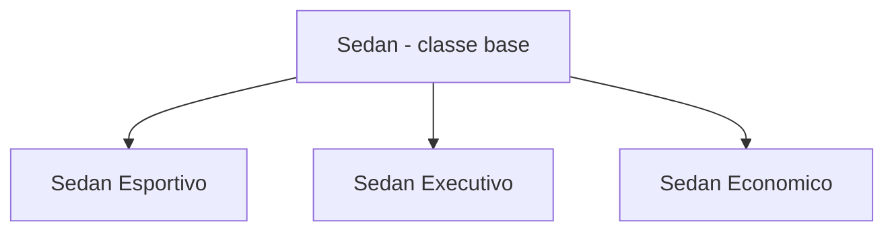
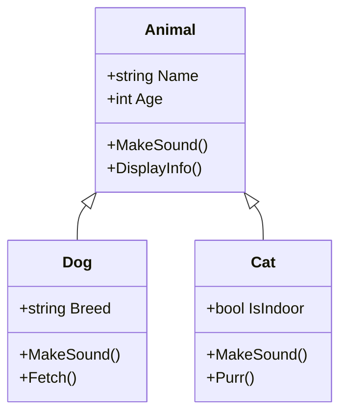
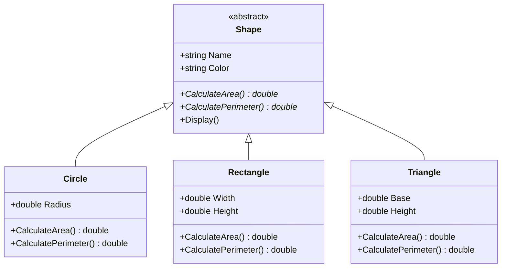
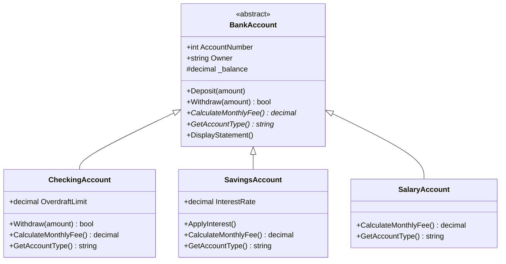
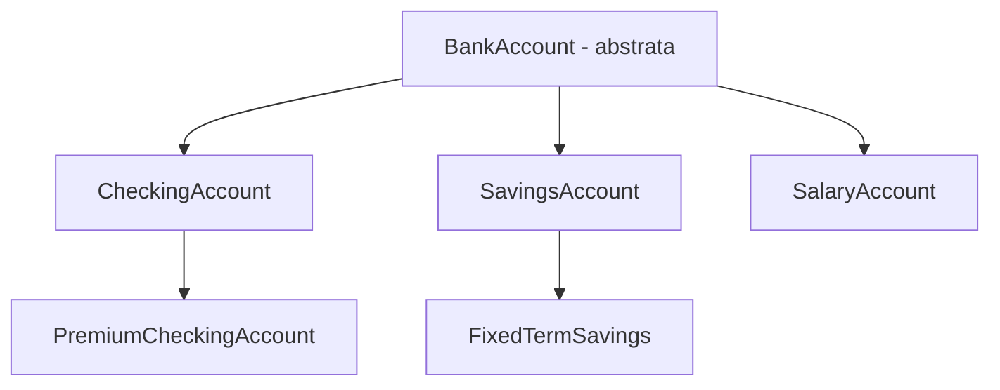

# 9.7 — Herança e Polimorfismo

[← Anterior: Interfaces](cap09-mod06-interfaces-conteudo.md) · [Próximo: Design Pattern: Factory →](cap09-mod08-patterns-factory-conteudo.md)

---

## Introdução

No módulo anterior, você aprendeu interfaces — contratos que definem O QUE um objeto deve fazer, sem dizer COMO. Interfaces são o conceito mais poderoso da OOP para desacoplamento e flexibilidade. Agora vamos aprender dois conceitos que complementam interfaces: **herança** e **polimorfismo**.

Herança permite criar classes novas baseadas em classes existentes, reaproveitando código e especializando comportamentos. Polimorfismo permite tratar objetos de tipos diferentes de forma uniforme. Juntos, eles completam o toolkit da OOP.

Um aviso importante antes de começar: herança é uma ferramenta poderosa, mas deve ser usada com moderação. A regra prática é **"prefira composição sobre herança"** — use herança quando existe uma relação genuína de "é um tipo de" (um Cachorro É UM Animal), e composição quando a relação é "tem um" (um Carro TEM UM Motor).

---

## Como Executar os Exemplos Deste Módulo

Substitua o conteúdo de `Program.cs` pelo código do exemplo e execute com `dotnet run`.

---

## O que é Herança?

Herança é o mecanismo que permite criar uma classe nova (chamada **classe derivada** ou **classe filha**) baseada em uma classe existente (chamada **classe base** ou **classe pai**). A classe derivada herda todos os atributos e métodos da classe base, e pode adicionar novos ou modificar os existentes.

### Analogia: Modelos de Carro

Pense em uma montadora de carros. Existe o modelo base "Sedan" com motor, rodas, volante, bancos e ar-condicionado. A partir desse modelo base:

- O "Sedan Esportivo" herda tudo do base e adiciona motor turbo, suspensão rebaixada e bancos esportivos
- O "Sedan Executivo" herda tudo do base e adiciona bancos de couro, teto solar e sistema de som premium
- O "Sedan Econômico" herda tudo do base mas usa motor menor e materiais mais simples

Todos são Sedans. Todos têm motor, rodas e volante. Mas cada um tem suas especializações.



### Herança em C#: Sintaxe

```csharp
// Classe base — "Animal" = Animal
class Animal
{
    public string Name { get; set; }
    public int Age { get; set; }

    public Animal(string name, int age)
    {
        Name = name;
        Age = age;
    }

    // Método virtual — pode ser sobrescrito pelas classes filhas
    // "MakeSound" = fazer som
    public virtual void MakeSound()
    {
        Console.WriteLine($"{Name} faz um som genérico.");
    }

    // "DisplayInfo" = exibir informações
    public void DisplayInfo()
    {
        Console.WriteLine($"{Name} — {Age} anos — {GetType().Name}");
    }
}

// Classe derivada — "Dog" = Cachorro
// O ":" indica herança: Dog HERDA de Animal
class Dog : Animal
{
    public string Breed { get; set; }  // "Breed" = raça

    // Construtor chama o construtor da classe base com "base(...)"
    public Dog(string name, int age, string breed) : base(name, age)
    {
        Breed = breed;
    }

    // Override — sobrescreve o método da classe base
    public override void MakeSound()
    {
        Console.WriteLine($"{Name} late: Au au!");
    }

    // Método exclusivo de Dog
    // "Fetch" = buscar
    public void Fetch()
    {
        Console.WriteLine($"{Name} busca a bolinha!");
    }
}

// Classe derivada — "Cat" = Gato
class Cat : Animal
{
    public bool IsIndoor { get; set; }  // "IsIndoor" = é de apartamento

    public Cat(string name, int age, bool isIndoor) : base(name, age)
    {
        IsIndoor = isIndoor;
    }

    public override void MakeSound()
    {
        Console.WriteLine($"{Name} mia: Miau!");
    }

    // "Purr" = ronronar
    public void Purr()
    {
        Console.WriteLine($"{Name} está ronronando...");
    }
}

// === Usando herança ===
var rex = new Dog("Rex", 5, "Labrador");
var mimi = new Cat("Mimi", 3, true);

rex.DisplayInfo();    // Herdado de Animal
rex.MakeSound();      // Sobrescrito em Dog
rex.Fetch();          // Exclusivo de Dog

Console.WriteLine();

mimi.DisplayInfo();   // Herdado de Animal
mimi.MakeSound();     // Sobrescrito em Cat
mimi.Purr();          // Exclusivo de Cat
```

Saída esperada:
```
Rex — 5 anos — Dog
Rex late: Au au!
Rex busca a bolinha!

Mimi — 3 anos — Cat
Mimi mia: Miau!
Mimi está ronronando...
```

### O que Aconteceu?

| Elemento | Explicação |
|----------|-----------|
| `class Dog : Animal` | Dog herda de Animal (Dog É UM Animal) |
| `base(name, age)` | Chama o construtor de Animal para inicializar Name e Age |
| `virtual` | Marca o método como "pode ser sobrescrito" |
| `override` | Sobrescreve o método da classe base com nova implementação |
| `DisplayInfo()` | Herdado — Dog não precisa reimplementar |
| `Fetch()` | Exclusivo de Dog — Animal não tem esse método |

Veja a hierarquia de heranca em um diagrama de classes:



---

## Polimorfismo: Tratar Diferentes como Iguais

Polimorfismo (do grego: "muitas formas") é a capacidade de tratar objetos de tipos diferentes de forma uniforme, desde que compartilhem uma classe base ou interface comum.

```csharp
// Polimorfismo em ação — lista de Animal que contém Dog e Cat
List<Animal> animals = new List<Animal>
{
    new Dog("Rex", 5, "Labrador"),
    new Cat("Mimi", 3, true),
    new Dog("Thor", 2, "Pastor Alemão"),
    new Cat("Luna", 4, false),
    new Dog("Bob", 7, "Poodle")
};

Console.WriteLine("=== Todos os animais ===");
foreach (Animal animal in animals)
{
    animal.DisplayInfo();
    animal.MakeSound();  // Cada animal faz seu próprio som!
    Console.WriteLine();
}
```

Saída esperada:
```
=== Todos os animais ===
Rex — 5 anos — Dog
Rex late: Au au!

Mimi — 3 anos — Cat
Mimi mia: Miau!

Thor — 2 anos — Pastor Alemão
Thor late: Au au!

Luna — 4 anos — Cat
Luna mia: Miau!

Bob — 7 anos — Dog
Bob late: Au au!
```

O código `animal.MakeSound()` chama o método correto para cada tipo — `Dog.MakeSound()` para cachorros e `Cat.MakeSound()` para gatos — mesmo que a variável seja do tipo `Animal`. Isso é polimorfismo.

O loop não sabe (nem precisa saber) se o animal é Dog ou Cat. Ele trata todos como Animal e cada um se comporta do seu jeito.

---

## Classes Abstratas: Moldes Incompletos

Às vezes, a classe base não faz sentido ser instanciada sozinha. Faz sentido criar um "Animal" genérico? Provavelmente não — todo animal é de algum tipo específico (cachorro, gato, pássaro). Para esses casos, usamos **classes abstratas**.

Uma classe abstrata é uma classe que:
- **Não pode ser instanciada** diretamente (não pode usar `new Animal()`)
- **Pode ter métodos abstratos** — métodos sem implementação que as classes filhas DEVEM implementar
- **Pode ter métodos concretos** — métodos com implementação que as classes filhas herdam

```csharp
// Classe abstrata — não pode ser instanciada
// "Shape" = Forma
abstract class Shape
{
    public string Name { get; set; }
    public string Color { get; set; }

    public Shape(string name, string color)
    {
        Name = name;
        Color = color;
    }

    // Método abstrato — SEM implementação
    // Cada forma DEVE implementar seu próprio cálculo de área
    public abstract double CalculateArea();
    public abstract double CalculatePerimeter();

    // Método concreto — COM implementação (herdado por todos)
    public void Display()
    {
        Console.WriteLine($"{Name} ({Color}) — Área: {CalculateArea():F2} — Perímetro: {CalculatePerimeter():F2}");
    }
}

// "Circle" = Círculo
class Circle : Shape
{
    public double Radius { get; set; }  // "Radius" = raio

    public Circle(double radius, string color) : base("Círculo", color)
    {
        Radius = radius;
    }

    public override double CalculateArea()
    {
        return Math.PI * Radius * Radius;
    }

    public override double CalculatePerimeter()
    {
        return 2 * Math.PI * Radius;
    }
}

// "Rectangle" = Retângulo
class Rectangle : Shape
{
    public double Width { get; set; }   // "Width" = largura
    public double Height { get; set; }  // "Height" = altura

    public Rectangle(double width, double height, string color) : base("Retângulo", color)
    {
        Width = width;
        Height = height;
    }

    public override double CalculateArea()
    {
        return Width * Height;
    }

    public override double CalculatePerimeter()
    {
        return 2 * (Width + Height);
    }
}

// "Triangle" = Triângulo
class Triangle : Shape
{
    public double Base { get; set; }
    public double Height { get; set; }
    public double Side1 { get; set; }
    public double Side2 { get; set; }
    public double Side3 { get; set; }

    public Triangle(double baseLen, double height, double s1, double s2, double s3, string color)
        : base("Triângulo", color)
    {
        Base = baseLen;
        Height = height;
        Side1 = s1;
        Side2 = s2;
        Side3 = s3;
    }

    public override double CalculateArea()
    {
        return (Base * Height) / 2;
    }

    public override double CalculatePerimeter()
    {
        return Side1 + Side2 + Side3;
    }
}

// === Usando polimorfismo com classe abstrata ===
List<Shape> shapes = new List<Shape>
{
    new Circle(5, "Vermelho"),
    new Rectangle(10, 4, "Azul"),
    new Triangle(6, 4, 5, 5, 6, "Verde"),
    new Circle(3, "Amarelo")
};

// var s = new Shape("teste", "preto");  // ERRO! Classe abstrata não pode ser instanciada

Console.WriteLine("=== Formas Geométricas ===");
double totalArea = 0;
foreach (var shape in shapes)
{
    shape.Display();
    totalArea += shape.CalculateArea();
}
Console.WriteLine($"\nÁrea total: {totalArea:F2}");
```

Saída esperada:
```
=== Formas Geométricas ===
Círculo (Vermelho) — Área: 78.54 — Perímetro: 31.42
Retângulo (Azul) — Área: 40.00 — Perímetro: 28.00
Triângulo (Verde) — Área: 12.00 — Perímetro: 16.00
Círculo (Amarelo) — Área: 28.27 — Perímetro: 18.85

Área total: 158.81
```

### Classe Abstrata vs Interface

| Aspecto | Classe Abstrata | Interface |
|---------|----------------|-----------|
| Pode ter implementação | Sim (métodos concretos) | Não (apenas assinaturas) |
| Pode ter atributos | Sim | Não |
| Pode ter construtor | Sim | Não |
| Herança múltipla | Não (só herda de UMA) | Sim (implementa VÁRIAS) |
| Quando usar | Relação "é um tipo de" com código compartilhado | Contrato de comportamento sem implementação |

Regra prática: use **interface** quando quer definir um contrato (o que fazer). Use **classe abstrata** quando quer compartilhar código entre classes relacionadas (como fazer parte do trabalho).

Veja a hierarquia da classe abstrata Shape:



---

## Exemplo Prático: Sistema de Contas Bancárias

Vamos ver herança e polimorfismo em um cenário real — tipos diferentes de contas bancárias:

```csharp
// Classe base abstrata
// "BankAccount" = Conta Bancária
abstract class BankAccount
{
    public int AccountNumber { get; }
    public string Owner { get; }
    protected decimal _balance;  // protected — acessível nas classes filhas

    public decimal Balance { get { return _balance; } }

    public BankAccount(int accountNumber, string owner, decimal initialBalance)
    {
        AccountNumber = accountNumber;
        Owner = owner;
        _balance = initialBalance >= 0 ? initialBalance : 0;
    }

    public void Deposit(decimal amount)
    {
        if (amount <= 0) return;
        _balance += amount;
    }

    public virtual bool Withdraw(decimal amount)
    {
        if (amount <= 0 || amount > _balance) return false;
        _balance -= amount;
        return true;
    }

    // Cada tipo de conta calcula taxa de forma diferente
    public abstract decimal CalculateMonthlyFee();
    public abstract string GetAccountType();

    public void DisplayStatement()
    {
        Console.WriteLine($"  [{GetAccountType()}] Conta {AccountNumber} — {Owner} — Saldo: R${_balance:F2} — Taxa: R${CalculateMonthlyFee():F2}");
    }
}

// "CheckingAccount" = Conta Corrente
class CheckingAccount : BankAccount
{
    public decimal OverdraftLimit { get; }  // "OverdraftLimit" = limite do cheque especial

    public CheckingAccount(int number, string owner, decimal balance, decimal overdraftLimit)
        : base(number, owner, balance)
    {
        OverdraftLimit = overdraftLimit;
    }

    // Conta corrente pode sacar além do saldo (até o limite)
    public override bool Withdraw(decimal amount)
    {
        if (amount <= 0) return false;
        if (amount > _balance + OverdraftLimit) return false;
        _balance -= amount;
        return true;
    }

    public override decimal CalculateMonthlyFee()
    {
        return 25.00m;  // Taxa fixa de R$25
    }

    public override string GetAccountType() => "Corrente";
}

// "SavingsAccount" = Conta Poupança
class SavingsAccount : BankAccount
{
    public decimal InterestRate { get; }  // "InterestRate" = taxa de juros

    public SavingsAccount(int number, string owner, decimal balance, decimal interestRate)
        : base(number, owner, balance)
    {
        InterestRate = interestRate;
    }

    // "ApplyInterest" = aplicar juros
    public void ApplyInterest()
    {
        decimal interest = _balance * InterestRate / 100;
        _balance += interest;
        Console.WriteLine($"  Juros de R${interest:F2} aplicados na conta {AccountNumber}");
    }

    public override decimal CalculateMonthlyFee()
    {
        return 0;  // Poupança não tem taxa
    }

    public override string GetAccountType() => "Poupança";
}

// "SalaryAccount" = Conta Salário
class SalaryAccount : BankAccount
{
    public SalaryAccount(int number, string owner, decimal balance)
        : base(number, owner, balance)
    {
    }

    public override decimal CalculateMonthlyFee()
    {
        return _balance > 5000 ? 15.00m : 0;  // Taxa só se saldo > 5000
    }

    public override string GetAccountType() => "Salário";
}

// === Polimorfismo em ação ===
List<BankAccount> accounts = new List<BankAccount>
{
    new CheckingAccount(1001, "Maria", 5000, 1000),
    new SavingsAccount(2001, "João", 10000, 0.5m),
    new SalaryAccount(3001, "Ana", 3000),
    new CheckingAccount(1002, "Pedro", 2000, 500),
    new SavingsAccount(2002, "Carla", 8000, 0.5m)
};

Console.WriteLine("=== Extrato de Todas as Contas ===");
decimal totalFees = 0;
foreach (var account in accounts)
{
    account.DisplayStatement();
    totalFees += account.CalculateMonthlyFee();
}
Console.WriteLine($"\nTotal de taxas mensais: R${totalFees:F2}");
```

Saída esperada:
```
=== Extrato de Todas as Contas ===
  [Corrente] Conta 1001 — Maria — Saldo: R$5000.00 — Taxa: R$25.00
  [Poupança] Conta 2001 — João — Saldo: R$10000.00 — Taxa: R$0.00
  [Salário] Conta 3001 — Ana — Saldo: R$3000.00 — Taxa: R$0.00
  [Corrente] Conta 1002 — Pedro — Saldo: R$2000.00 — Taxa: R$25.00
  [Poupança] Conta 2002 — Carla — Saldo: R$8000.00 — Taxa: R$0.00

Total de taxas mensais: R$50.00
```

Veja a hierarquia de contas bancarias:



---

## Herança e o Operador `is`: Verificando Tipos

Às vezes, mesmo usando polimorfismo, você precisa saber o tipo específico de um objeto. C# oferece o operador `is` para isso:

```csharp
// Verificando tipos com "is"
List<Animal> animals = new List<Animal>
{
    new Dog("Rex", 5, "Labrador"),
    new Cat("Mimi", 3, true),
    new Dog("Thor", 2, "Pastor Alemão")
};

foreach (var animal in animals)
{
    if (animal is Dog dog)
    {
        // Dentro deste bloco, "dog" é do tipo Dog
        dog.Fetch();  // Método exclusivo de Dog
    }
    else if (animal is Cat cat)
    {
        cat.Purr();   // Método exclusivo de Cat
    }
}
```

Saída esperada:
```
Rex busca a bolinha!
Mimi está ronronando...
Thor busca a bolinha!
```

O `is` faz duas coisas: verifica o tipo E cria uma variável tipada. É mais seguro que fazer cast direto, porque não causa erro se o tipo não bater.

---

## Herança em Cadeia: Múltiplos Níveis

Herança pode ter múltiplos níveis, mas cuidado — hierarquias profundas ficam difíceis de manter:

```csharp
// Hierarquia de 3 níveis — aceitável
abstract class Vehicle { }        // Nível 1
class Car : Vehicle { }           // Nível 2
class ElectricCar : Car { }       // Nível 3

// Hierarquia de 5+ níveis — evite!
// LivingBeing → Animal → Mammal → Canine → Dog → Labrador
// Muito profundo — difícil de entender e manter
```

A recomendação é manter hierarquias com no máximo 2-3 níveis. Se precisar de mais, provavelmente composição seria uma escolha melhor.



---

## Composição vs Herança: Quando Usar Cada Um

Uma das decisões mais importantes em OOP é escolher entre herança e composição. A regra prática:

- **Herança**: quando existe uma relação "É UM" (is-a). Um Cachorro É UM Animal. Uma ContaCorrente É UMA ContaBancária.
- **Composição**: quando existe uma relação "TEM UM" (has-a). Um Carro TEM UM Motor. Um Pedido TEM Itens.

```csharp
// HERANÇA — Dog É UM Animal (relação "é um")
class Dog : Animal { }

// COMPOSIÇÃO — Car TEM UM Engine (relação "tem um")
class Car
{
    private Engine _engine;  // Composição — o carro CONTÉM um motor
    public Car(Engine engine) { _engine = engine; }
}
```

| Critério | Herança | Composição |
|----------|---------|-----------|
| Relação | "É um tipo de" | "Tem um" / "Usa um" |
| Acoplamento | Alto (filha depende da base) | Baixo (objetos independentes) |
| Flexibilidade | Menor (hierarquia fixa) | Maior (troca em runtime) |
| Reutilização | Via hierarquia | Via delegação |
| Quando preferir | Hierarquias naturais e estáveis | Maioria dos casos |

A comunidade de desenvolvimento tem um ditado: **"Favor composition over inheritance"** (Prefira composição sobre herança). Herança cria acoplamento forte — mudanças na classe base afetam todas as filhas. Composição é mais flexível.

---

## Como a IA pode te ajudar aqui

**Prompt 1 — Pedir ajuda prática:**
> "Tenho estas classes com código duplicado [cole o código]. Faz sentido usar herança para eliminar a duplicação? Ou composição seria melhor?"

**Prompt 2 — Criar com ajuda da IA:**
> "Crie uma hierarquia de classes para [domínio] usando classe abstrata, herança e polimorfismo."

**Prompt 3 — Explorar o conceito:**
> "Explique com exemplos quando usar classe abstrata vs interface em C#."

---

## Casos de Uso no Mundo Real

### Sistemas de Pagamento

Empresas como PagSeguro, Mercado Pago e Stripe modelam diferentes formas de pagamento usando herança e polimorfismo. Existe uma classe base `Payment` com dados comuns (valor, data, status) e classes derivadas para cada tipo: `CreditCardPayment`, `PixPayment`, `BoletoPayment`. Cada uma implementa `Process()` de forma diferente, mas o sistema trata todas uniformemente.

### Jogos: Hierarquia de Personagens

Em jogos, herança é usada extensivamente. Uma classe base `Character` define vida, posição e movimento. `Player` herda e adiciona inventário e controles. `Enemy` herda e adiciona IA de perseguição. `Boss` herda de `Enemy` e adiciona ataques especiais. O sistema de combate trata todos como `Character` — polimorfismo em ação.

### Frameworks de Interface Gráfica

Frameworks como WPF (Windows), SwiftUI (Apple) e Flutter (Google) usam herança para componentes visuais. Existe uma classe base `Widget` ou `View`, e todos os componentes (botões, campos de texto, listas) herdam dela. Isso permite que o framework renderize qualquer componente de forma uniforme.

---

## Resumo do Módulo

| Conceito | Definição |
|----------|-----------|
| Herança | Criar classe nova baseada em classe existente, herdando membros |
| Classe base | Classe da qual outras herdam (pai) |
| Classe derivada | Classe que herda de outra (filha) |
| virtual | Marca método como sobrescrevível |
| override | Sobrescreve método da classe base |
| abstract class | Classe que não pode ser instanciada, pode ter métodos abstratos |
| abstract method | Método sem implementação que filhas devem implementar |
| Polimorfismo | Tratar objetos de tipos diferentes de forma uniforme |
| base | Referência à classe base (usado em construtores e métodos) |
| Composição | Objetos que contêm outros objetos (alternativa à herança) |

---

## Glossário do Módulo

| Termo | Definição |
|-------|-----------|
| abstract | Modificador que indica classe não instanciável ou método sem implementação |
| base | Palavra-chave para acessar membros da classe base |
| Classe abstrata (Abstract Class) | Classe que serve como base mas não pode ser instanciada |
| Classe base (Base Class) | Classe da qual outras classes herdam |
| Classe derivada (Derived Class) | Classe que herda de outra classe |
| Composição (Composition) | Técnica onde objetos contêm outros objetos |
| Herança (Inheritance) | Mecanismo de criar classes baseadas em outras |
| Hierarquia de classes | Árvore de relações de herança entre classes |
| override | Palavra-chave para sobrescrever método virtual ou abstrato |
| Polimorfismo (Polymorphism) | Capacidade de tratar objetos diferentes de forma uniforme |
| protected | Modificador de acesso: visível na classe e em classes derivadas |
| sealed | Modificador que impede uma classe de ser herdada |
| virtual | Modificador que permite que um método seja sobrescrito |

---

## Na Cultura Popular

- **X-Men** (filmes/quadrinhos) — os mutantes são um exemplo perfeito de herança e polimorfismo. Todos são "Mutantes" (classe base) com habilidades comuns, mas cada um tem poderes específicos (classes derivadas). O Professor Xavier trata todos como "Mutantes" (polimorfismo) mesmo que cada um tenha habilidades diferentes.
- **Pokémon** (jogos/série) — cada Pokémon é de um tipo (Fogo, Água, Planta) que herda características comuns mas tem ataques específicos. O sistema de batalha usa polimorfismo para calcular dano independente do tipo.

---

## Para Saber Mais

- [Microsoft Learn — Herança](https://learn.microsoft.com/pt-br/dotnet/csharp/fundamentals/object-oriented/inheritance) — *Tutorial oficial sobre herança em C#*
- [Refactoring Guru — Design Patterns](https://refactoring.guru/pt-br/design-patterns) — *Patterns que usam herança e polimorfismo*
- [Source Making — Inheritance](https://sourcemaking.com/design_patterns) — *Quando usar e quando evitar herança*
- [Exercism — C# Track](https://exercism.org/tracks/csharp) — *Exercícios que praticam herança e polimorfismo*

---

## Perguntas Frequentes (FAQ)

**P: Posso herdar de mais de uma classe em C#?**
R: Não. C# suporta apenas herança simples (uma classe herda de apenas uma). Mas pode implementar múltiplas interfaces. Se precisa de comportamentos de múltiplas fontes, use interfaces + composição.

**P: Qual a diferença entre virtual e abstract?**
R: `virtual` tem implementação padrão que PODE ser sobrescrita. `abstract` NÃO tem implementação e DEVE ser sobrescrita. Use virtual quando há um comportamento padrão razoável; abstract quando cada classe filha precisa de sua própria implementação.

**P: Quando usar herança vs interface?**
R: Use herança quando classes compartilham código (implementação). Use interface quando classes compartilham contrato (assinatura). Na dúvida, prefira interface — é mais flexível.

**P: O que é "sealed"?**
R: `sealed` impede que uma classe seja herdada. Use quando a classe não foi projetada para extensão. `string` em C# é sealed, por exemplo.

**P: Herança profunda (muitos níveis) é ruim?**
R: Sim, geralmente. Hierarquias com mais de 2-3 níveis ficam difíceis de entender e manter. Prefira hierarquias rasas e use composição para complexidade adicional.

**P: O que é o operador `is` em C#?**
R: `is` verifica se um objeto é de um tipo específico: `if (animal is Dog dog)` verifica se o animal é Dog e, se for, cria uma variável `dog` do tipo Dog. Útil quando precisa acessar métodos específicos da classe derivada.

**P: Posso chamar o método da classe base dentro do override?**
R: Sim, usando `base.NomeDoMetodo()`. Isso é útil quando quer estender o comportamento da base em vez de substituí-lo completamente.

**P: Composição é sempre melhor que herança?**
R: Não sempre, mas na maioria dos casos sim. Herança é a escolha certa quando existe uma relação genuína "é um tipo de" e as classes compartilham implementação significativa. Composição é melhor quando a relação é "usa" ou "tem".

**P: O que acontece se eu não implementar um método abstrato?**
R: O compilador dá erro. Se uma classe herda de uma classe abstrata, ela DEVE implementar todos os métodos abstratos, a menos que ela própria seja abstrata também.

**P: Posso ter uma classe abstrata sem métodos abstratos?**
R: Sim. Uma classe abstrata pode ter apenas métodos concretos. O `abstract` na classe apenas impede que ela seja instanciada diretamente. Isso é útil quando a classe base faz sentido como conceito mas não como objeto concreto.

**P: O que é "upcasting" e "downcasting"?**
R: Upcasting é tratar um objeto derivado como sua classe base: `Animal a = new Dog(...)`. É automático e seguro. Downcasting é o contrário: `Dog d = (Dog)animal`. É manual e pode falhar se o objeto não for realmente um Dog. Use o operador `is` para downcasting seguro.

**P: Herança funciona com structs em C#?**
R: Não. Structs em C# não suportam herança (não podem herdar de outras structs nem ser herdadas). Structs podem implementar interfaces, mas não participam de hierarquias de herança. Use classes quando precisar de herança.

**P: Python tem classes abstratas?**
R: Sim, usando o módulo `abc` (Abstract Base Classes). Mas é opcional — Python não obriga. Em C#, classes abstratas são parte fundamental da linguagem e o compilador garante que os contratos sejam respeitados.

---

## Exercícios Práticos

### Exercício 1: Hierarquia de Veículos

Crie uma classe abstrata `Vehicle` com: marca, modelo, ano, velocidade atual. Métodos: `Accelerate(amount)`, `Brake(amount)`, `abstract GetMaxSpeed()`, `Display()`. Derive: `Car` (max 200km/h), `Motorcycle` (max 250km/h), `Truck` (max 120km/h). Crie uma lista polimórfica e acelere todos.

### Exercício 2: Sistema de Funcionários

Crie uma classe abstrata `Employee` com: nome, salário base. Método abstrato `CalculateSalary()`. Derive: `FullTimeEmployee` (salário + benefícios), `PartTimeEmployee` (salário por hora x horas), `Intern` (bolsa fixa). Calcule a folha de pagamento total.

### Exercício 3: Composição vs Herança

Para o cenário "Sistema de Restaurante", modele usando herança E usando composição. Compare: qual ficou mais flexível? Qual ficou mais simples?

### Exercício 4: Contas Bancárias

Usando o exemplo de contas bancárias do módulo, adicione um novo tipo: `InvestmentAccount` (Conta Investimento) que tem uma taxa de rendimento mensal e um método `ApplyMonthlyReturn()`. A taxa mensal é de R$30 se o saldo for menor que R$10.000, e R$0 se for maior. Adicione à lista polimórfica e calcule o total de taxas.

### Exercício 5: Formas Geométricas Expandidas

Expanda o exemplo de formas geométricas adicionando: `Square` (que herda de Rectangle com largura == altura), `Ellipse` (com semi-eixo maior e menor). Adicione um método `CompareArea(Shape other)` na classe base que compara a área de duas formas.

---

## Exercício 6 — Reflexão: Herança vs Interface

Escreva um parágrafo comparando herança e interfaces. Quando cada uma é a melhor escolha? Dê um exemplo concreto de um cenário onde herança é claramente melhor e outro onde interface é claramente melhor.

---

## Exercício 7 — Análise de Hierarquia

Para cada cenário abaixo, diga se usaria herança ou composição, e justifique:

1. Um `Smartphone` e um `Tablet` compartilham funcionalidades de `Device`
2. Um `Car` tem um `Engine`
3. Um `Student` e um `Teacher` compartilham dados de `Person`
4. Um `Order` tem uma lista de `OrderItem`
5. Um `ElectricCar` é um tipo especial de `Car`
6. Um `Report` pode ser exportado como PDF, Excel ou CSV
7. Um `Bird` e um `Airplane` podem voar

Para o item 7, explique por que herança seria uma péssima escolha e como interfaces resolveriam melhor.

---

## Exercício 8 — Polimorfismo na Prática

Crie uma classe abstrata `MediaPlayer` com método abstrato `Play()` e método concreto `Stop()`. Derive: `MusicPlayer` (toca música), `VideoPlayer` (toca vídeo), `PodcastPlayer` (toca podcast). Crie uma playlist polimórfica que toca todos os tipos de mídia em sequência.

---

## Exercício 9 — Override com base

Crie uma classe `Logger` com método virtual `Log(string message)` que imprime a mensagem no console. Derive `TimestampLogger` que sobrescreve `Log` para adicionar data/hora antes da mensagem, chamando `base.Log()` internamente. Derive `FileLogger` que sobrescreve `Log` para adicionar "[FILE]" antes da mensagem. Demonstre os três tipos de logger.

---

## Exercício 10 — Linha do Tempo

Sem consultar o módulo, responda:
1. Qual a diferença entre `virtual` e `abstract`?
2. Qual a diferença entre classe abstrata e interface?
3. Quando usar herança vs composição?
4. O que é polimorfismo em uma frase?
5. Por que hierarquias profundas de herança são problemáticas?

---

[← Anterior: Interfaces](cap09-mod06-interfaces-conteudo.md) · [Próximo: Design Pattern: Factory →](cap09-mod08-patterns-factory-conteudo.md)
