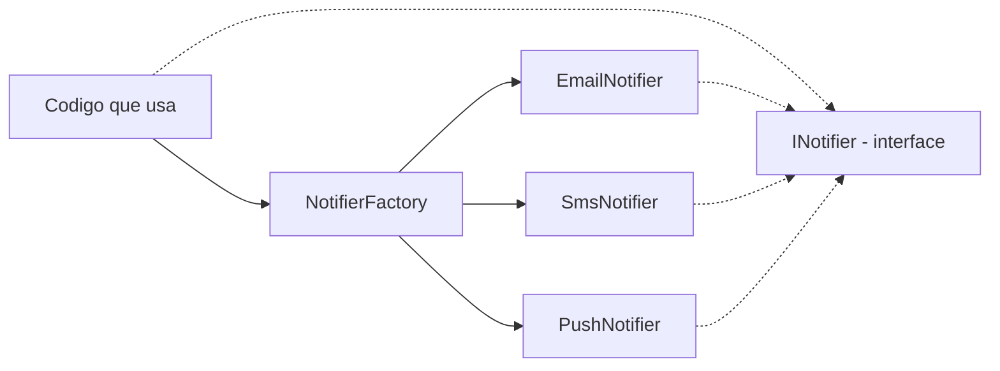
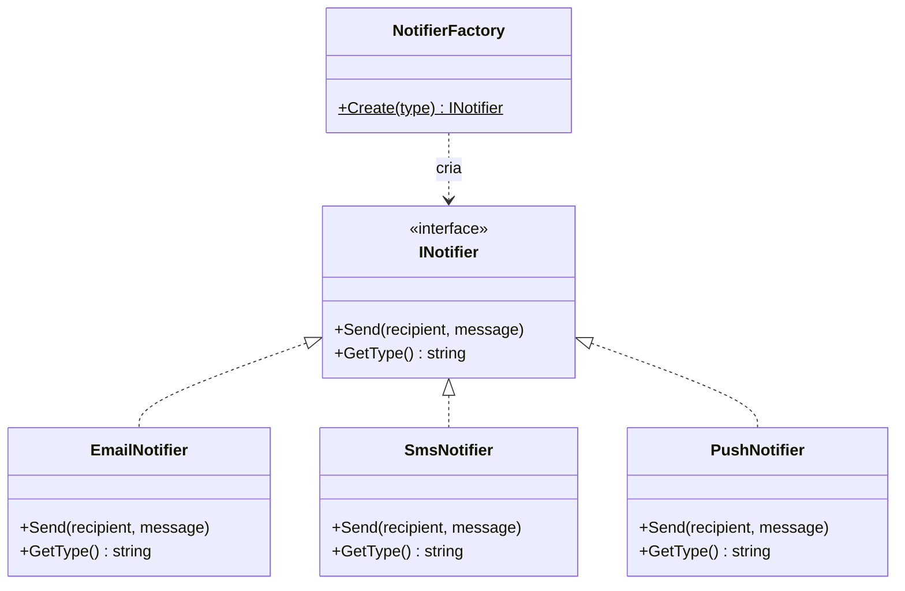
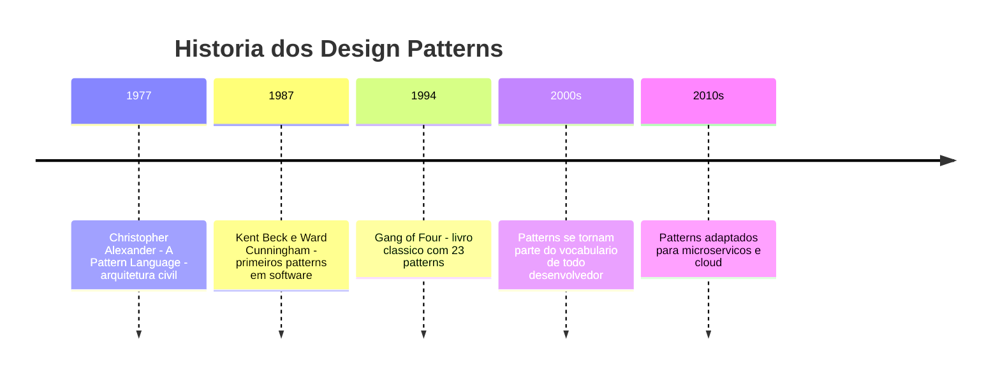

# 9.8 — Design Pattern: Factory — Criando Objetos sem Acoplar

[← Anterior: Herança e Polimorfismo](cap09-mod07-heranca-conteudo.md) · [Próximo: Design Pattern: Repository →](cap09-mod09-patterns-repository-conteudo.md)

---

## Introdução

Nos módulos anteriores, você aprendeu classes, encapsulamento, interfaces, herança e polimorfismo. Agora vamos ver como esses conceitos se combinam para resolver problemas reais de design de software. Vamos aprender nosso primeiro **design pattern** (padrão de projeto): o **Factory**.

Um design pattern é uma solução reutilizável para um problema comum em desenvolvimento de software. Não é um código pronto para copiar — é uma ideia, um modelo de como resolver um tipo específico de problema. Patterns foram catalogados por quatro autores (conhecidos como "Gang of Four" ou GoF) no livro "Design Patterns: Elements of Reusable Object-Oriented Software" (1994), um dos livros mais influentes da história da programação.

O Factory é um dos patterns mais simples e mais usados. Ele resolve o problema de **criar objetos sem que o código que usa precise saber a classe concreta**.

Vamos entender o problema que Factory resolve, ver como implementá-lo em C#, e aplicar em cenários reais como conexões de banco de dados e sistemas de notificação. Este é um módulo prático — cada exemplo é executável.

---

## Como Executar os Exemplos Deste Módulo

Substitua o conteúdo de `Program.cs` pelo código do exemplo e execute com `dotnet run`.

---

## O Problema: Criação Acoplada

Imagine que você tem um sistema de notificações. Dependendo da configuração, o sistema envia notificações por email, SMS ou push. Sem Factory, o código fica assim:

```csharp
// SEM Factory — código acoplado
// "notificationType" = tipo de notificação
string notificationType = "email";  // Vem de configuração

// O código precisa CONHECER todas as classes concretas
if (notificationType == "email")
{
    var notifier = new EmailNotifier();
    notifier.Send("maria@email.com", "Seu pedido foi enviado!");
}
else if (notificationType == "sms")
{
    var notifier = new SmsNotifier();
    notifier.Send("11999991111", "Seu pedido foi enviado!");
}
else if (notificationType == "push")
{
    var notifier = new PushNotifier();
    notifier.Send("user123", "Seu pedido foi enviado!");
}
```

Saída esperada: depende do tipo configurado

Problemas com essa abordagem:

1. **Código duplicado**: a lógica de "qual classe criar" se repete em todo lugar que precisa de um notificador
2. **Acoplamento**: o código que ENVIA a notificação precisa CONHECER todas as classes concretas
3. **Difícil de estender**: para adicionar um novo tipo (WhatsApp), precisa alterar TODOS os if/else
4. **Difícil de testar**: não dá para substituir o notificador por um mock facilmente

---

## A Solução: Factory

O Factory centraliza a criação de objetos em um único lugar. O código que usa o objeto pede para a Factory criar, e a Factory decide qual classe concreta instanciar.

```csharp
// Interface — o contrato
interface INotifier
{
    void Send(string recipient, string message);
    string GetType();
}

// Implementações concretas
class EmailNotifier : INotifier
{
    public void Send(string recipient, string message)
    {
        Console.WriteLine($"[EMAIL] Para: {recipient} — {message}");
    }
    public new string GetType() => "Email";
}

class SmsNotifier : INotifier
{
    public void Send(string recipient, string message)
    {
        Console.WriteLine($"[SMS] Para: {recipient} — {message}");
    }
    public new string GetType() => "SMS";
}

class PushNotifier : INotifier
{
    public void Send(string recipient, string message)
    {
        Console.WriteLine($"[PUSH] Para: {recipient} — {message}");
    }
    public new string GetType() => "Push";
}

// === A FACTORY ===
// "NotifierFactory" = Fábrica de Notificadores
class NotifierFactory
{
    // Método estático que cria o notificador correto baseado no tipo
    public static INotifier Create(string type)
    {
        return type.ToLower() switch
        {
            "email" => new EmailNotifier(),
            "sms" => new SmsNotifier(),
            "push" => new PushNotifier(),
            _ => throw new ArgumentException($"Tipo de notificador desconhecido: {type}")
        };
    }
}

// === Usando a Factory ===
// O código que usa NÃO conhece as classes concretas
// Ele só conhece a interface INotifier e a Factory
string configuredType = "email";  // Vem de configuração

INotifier notifier = NotifierFactory.Create(configuredType);
notifier.Send("maria@email.com", "Seu pedido foi enviado!");

// Trocar o tipo é mudar UMA string
configuredType = "sms";
notifier = NotifierFactory.Create(configuredType);
notifier.Send("11999991111", "Seu pedido foi enviado!");

configuredType = "push";
notifier = NotifierFactory.Create(configuredType);
notifier.Send("user123", "Seu pedido foi enviado!");
```

Saída esperada:
```
[EMAIL] Para: maria@email.com — Seu pedido foi enviado!
[SMS] Para: 11999991111 — Seu pedido foi enviado!
[PUSH] Para: user123 — Seu pedido foi enviado!
```

### O que Mudou?

| Aspecto | Sem Factory | Com Factory |
|---------|-----------|------------|
| Quem decide qual classe criar? | O código que usa | A Factory |
| O código que usa conhece as classes concretas? | Sim (todas) | Não (só a interface) |
| Para adicionar novo tipo? | Alterar todos os if/else | Alterar só a Factory |
| Quantos lugares mudam? | Muitos | Um |



O código que usa conhece apenas a interface `INotifier` e a `NotifierFactory`. Ele não sabe (nem precisa saber) se está usando Email, SMS ou Push. Isso é **desacoplamento**.

Veja a estrutura completa do pattern Factory:



---

## Analogia: A Fábrica de Automóveis

Pense em uma concessionária de carros. Quando você vai comprar um carro, não vai até a linha de montagem escolher peças. Você diz ao vendedor: "Quero um Sedan Esportivo vermelho". O vendedor (a Factory) sabe como montar o pedido e te entrega o carro pronto.

Você não precisa saber como o carro é montado, quais peças são usadas, ou qual linha de montagem foi utilizada. Você só precisa saber dirigir (usar a interface).

Se a fábrica mudar o fornecedor de peças ou o processo de montagem, você nem percebe — o carro que chega na sua mão continua funcionando igual.

---

## A História dos Design Patterns

O conceito de "patterns" não nasceu na programação. Veio da arquitetura civil. Em 1977, o arquiteto Christopher Alexander publicou o livro "A Pattern Language", catalogando 253 padrões de design arquitetônico — desde como posicionar janelas até como organizar bairros.

Em 1994, quatro engenheiros de software — Erich Gamma, Richard Helm, Ralph Johnson e John Vlissides — publicaram "Design Patterns: Elements of Reusable Object-Oriented Software". Eles ficaram conhecidos como **Gang of Four** (GoF, ou Gangue dos Quatro). O livro cataloga 23 patterns divididos em três categorias:

| Categoria | O que resolve | Exemplos |
|-----------|-------------|----------|
| Criacionais | Como criar objetos | Factory, Singleton, Builder |
| Estruturais | Como compor objetos | Adapter, Decorator, Facade |
| Comportamentais | Como objetos interagem | Observer, Strategy, Command |

O Factory que estamos aprendendo é um pattern **criacional** — resolve o problema de como criar objetos de forma flexível e desacoplada.

Neste curso, vamos aprender dois patterns: **Factory** (este módulo) e **Repository** (próximo módulo). São os mais úteis para iniciantes e os que você vai usar com mais frequência na carreira.



---

## Factory com Registro Dinâmico

Uma versão mais flexível da Factory usa um dicionário para registrar tipos dinamicamente:

```csharp
// Factory com registro dinâmico
// "NotifierRegistry" = Registro de Notificadores
class NotifierRegistry
{
    // Dicionário que mapeia tipo → função que cria o notificador
    private Dictionary<string, Func<INotifier>> _creators = new();

    // "Register" = registrar
    public void Register(string type, Func<INotifier> creator)
    {
        _creators[type.ToLower()] = creator;
    }

    // "Create" = criar
    public INotifier Create(string type)
    {
        if (_creators.TryGetValue(type.ToLower(), out var creator))
        {
            return creator();
        }
        throw new ArgumentException($"Tipo não registrado: {type}");
    }

    // "GetAvailableTypes" = obter tipos disponíveis
    public List<string> GetAvailableTypes()
    {
        return _creators.Keys.ToList();
    }
}

// === Usando o registro ===
var registry = new NotifierRegistry();

// Registra os tipos disponíveis
registry.Register("email", () => new EmailNotifier());
registry.Register("sms", () => new SmsNotifier());
registry.Register("push", () => new PushNotifier());

// Para adicionar WhatsApp, basta registrar — sem alterar código existente!
// registry.Register("whatsapp", () => new WhatsAppNotifier());

Console.WriteLine("Tipos disponíveis: " + string.Join(", ", registry.GetAvailableTypes()));

var notifier = registry.Create("email");
notifier.Send("maria@email.com", "Teste com registro dinâmico!");
```

Saída esperada:
```
Tipos disponíveis: email, sms, push
[EMAIL] Para: maria@email.com — Teste com registro dinâmico!
```

Essa versão é mais flexível porque novos tipos podem ser adicionados sem alterar a Factory — basta registrar. É o **Registry Pattern** combinado com Factory.

---

## Exemplo Prático: Factory de Conexões de Banco de Dados

Um cenário real onde Factory brilha: conectar a diferentes bancos de dados baseado em configuração.

```csharp
// Interface de conexão com banco
// "IDatabaseConnection" = Conexão com Banco de Dados
interface IDatabaseConnection
{
    void Connect();
    void Disconnect();
    string GetDatabaseType();
}

// Implementação SQLite
class SqliteConnection : IDatabaseConnection
{
    private string _filePath;

    public SqliteConnection(string filePath)
    {
        _filePath = filePath;
    }

    public void Connect()
    {
        Console.WriteLine($"Conectado ao SQLite: {_filePath}");
    }

    public void Disconnect()
    {
        Console.WriteLine("Desconectado do SQLite.");
    }

    public string GetDatabaseType() => "SQLite";
}

// Implementação PostgreSQL (simulada)
class PostgresConnection : IDatabaseConnection
{
    private string _connectionString;

    public PostgresConnection(string connectionString)
    {
        _connectionString = connectionString;
    }

    public void Connect()
    {
        Console.WriteLine($"Conectado ao PostgreSQL: {_connectionString}");
    }

    public void Disconnect()
    {
        Console.WriteLine("Desconectado do PostgreSQL.");
    }

    public string GetDatabaseType() => "PostgreSQL";
}

// Implementação em memória (para testes)
class InMemoryConnection : IDatabaseConnection
{
    public void Connect()
    {
        Console.WriteLine("Usando banco em memória (testes).");
    }

    public void Disconnect()
    {
        Console.WriteLine("Banco em memória liberado.");
    }

    public string GetDatabaseType() => "InMemory";
}

// Factory de conexões
class DatabaseConnectionFactory
{
    public static IDatabaseConnection Create(string type, string connectionInfo = "")
    {
        return type.ToLower() switch
        {
            "sqlite" => new SqliteConnection(connectionInfo),
            "postgres" => new PostgresConnection(connectionInfo),
            "memory" => new InMemoryConnection(),
            _ => throw new ArgumentException($"Banco não suportado: {type}")
        };
    }
}

// === Usando ===
// Em produção:
var prodDb = DatabaseConnectionFactory.Create("sqlite", "dados.db");
prodDb.Connect();
Console.WriteLine($"Tipo: {prodDb.GetDatabaseType()}");
prodDb.Disconnect();

Console.WriteLine();

// Em testes:
var testDb = DatabaseConnectionFactory.Create("memory");
testDb.Connect();
Console.WriteLine($"Tipo: {testDb.GetDatabaseType()}");
testDb.Disconnect();
```

Saída esperada:
```
Conectado ao SQLite: dados.db
Tipo: SQLite
Desconectado do SQLite.

Usando banco em memória (testes).
Tipo: InMemory
Banco em memória liberado.
```

Este exemplo prepara o terreno para o próximo módulo (Repository Pattern), onde vamos usar Factory para criar repositories que abstraem o acesso a dados.

---

## Quando Usar Factory

Antes de ver quando usar, vamos entender melhor o Factory com mais um exemplo prático que conecta com o que você já sabe.

### Factory no Contexto do CRUD

Lembra do CRUD do capítulo 8? Usamos SQLite para persistir dados. Mas e se quiséssemos que o mesmo programa funcionasse com SQLite em produção e com dados em memória nos testes? Sem Factory, teríamos if/else espalhados pelo código. Com Factory, centralizamos a decisão:

```csharp
// Interface de armazenamento
// "IStorage" = Armazenamento
interface IStorage
{
    void Save(string key, string value);
    string? Load(string key);
    void Delete(string key);
    List<string> ListKeys();
}

// Implementação em memória (para testes)
class InMemoryStorage : IStorage
{
    private Dictionary<string, string> _data = new();

    public void Save(string key, string value)
    {
        _data[key] = value;
        Console.WriteLine($"[MEMORY] Salvou: {key}");
    }

    public string? Load(string key)
    {
        return _data.TryGetValue(key, out var value) ? value : null;
    }

    public void Delete(string key)
    {
        _data.Remove(key);
        Console.WriteLine($"[MEMORY] Removeu: {key}");
    }

    public List<string> ListKeys() => _data.Keys.ToList();
}

// Implementação em arquivo (simulando persistência)
class FileStorage : IStorage
{
    private string _directory;

    public FileStorage(string directory)
    {
        _directory = directory;
        Console.WriteLine($"[FILE] Usando diretório: {_directory}");
    }

    public void Save(string key, string value)
    {
        Console.WriteLine($"[FILE] Salvou em arquivo: {key}");
    }

    public string? Load(string key)
    {
        Console.WriteLine($"[FILE] Leu do arquivo: {key}");
        return $"valor-de-{key}";
    }

    public void Delete(string key)
    {
        Console.WriteLine($"[FILE] Removeu arquivo: {key}");
    }

    public List<string> ListKeys() => new List<string>();
}

// Factory
class StorageFactory
{
    public static IStorage Create(string type, string config = "")
    {
        return type.ToLower() switch
        {
            "memory" => new InMemoryStorage(),
            "file" => new FileStorage(config),
            _ => throw new ArgumentException($"Tipo de storage desconhecido: {type}")
        };
    }
}

// === O código da aplicação não sabe qual storage está usando ===
string environment = "memory";  // Em testes: "memory". Em produção: "file"

IStorage storage = StorageFactory.Create(environment);
storage.Save("produto-1", "Notebook");
storage.Save("produto-2", "Mouse");

var valor = storage.Load("produto-1");
Console.WriteLine($"Carregou: {valor}");

var keys = storage.ListKeys();
Console.WriteLine($"Chaves: {string.Join(", ", keys)}");
```

Saída esperada:
```
[MEMORY] Salvou: produto-1
[MEMORY] Salvou: produto-2
Carregou: Notebook
Chaves: produto-1, produto-2
```

Se mudar `environment` para `"file"`, o mesmo código usa armazenamento em arquivo. Nenhuma outra linha muda. Isso é o poder do Factory + Interface.

---

## Factory e o Princípio Open/Closed

O Factory implementa naturalmente o princípio **Open/Closed** (Aberto/Fechado) do SOLID, que vamos estudar no módulo 9.10:

- **Aberto para extensão**: para adicionar um novo tipo de notificador (WhatsApp), basta criar a classe `WhatsAppNotifier` e adicionar uma linha na Factory
- **Fechado para modificação**: o código que USA o notificador não precisa mudar

Isso é fundamental em projetos grandes. Imagine um sistema com 500 arquivos que usam notificações. Sem Factory, adicionar WhatsApp significaria alterar potencialmente centenas de arquivos. Com Factory, você altera 2 arquivos: a nova classe e a Factory.

---

## Quando Usar Factory

| Cenário | Factory é útil? | Por quê |
|---------|----------------|---------|
| Criar objetos baseado em configuração | Sim | Tipo decidido em runtime |
| Criar objetos baseado em input do usuário | Sim | Tipo não é conhecido em compilação |
| Criar sempre o mesmo tipo de objeto | Não | Não precisa de indireção |
| Múltiplas implementações de uma interface | Sim | Centraliza a decisão de qual usar |
| Testes com mocks | Sim | Factory pode retornar mock em vez de implementação real |

---

## Como a IA pode te ajudar aqui
**Prompt 1 — Criar com ajuda da IA:**
> "Tenho estas classes que implementam a mesma interface [cole o código]. Crie uma Factory para elas."

**Prompt 2 — Praticar com projetos:**
> "Em quais cenários do meu projeto eu deveria usar o Factory Pattern?"

**Prompt 3 — Comparar alternativas:**
> "Qual a diferença entre Factory Method, Abstract Factory e Simple Factory?"

---

## Casos de Uso no Mundo Real

### Provedores de Pagamento

Empresas como iFood, Uber e Mercado Livre suportam múltiplas formas de pagamento: cartão de crédito, débito, Pix, boleto, carteira digital. Cada forma de pagamento é uma implementação diferente de uma interface `IPaymentProcessor`. Uma Factory decide qual processador usar baseado na escolha do usuário. Adicionar uma nova forma de pagamento (como criptomoedas) é criar uma nova classe e registrar na Factory — sem alterar o código existente.

### Drivers de Banco de Dados

Frameworks como Entity Framework (.NET), Hibernate (Java) e SQLAlchemy (Python) usam Factory para criar conexões com diferentes bancos de dados. O código da aplicação usa uma interface genérica, e a Factory cria a conexão correta (SQLite, PostgreSQL, MySQL, SQL Server) baseado na configuração. Trocar de banco é mudar uma linha de configuração.

### Engines de Jogos

Na Unity, o sistema de input usa Factory internamente. Dependendo da plataforma (PC, console, mobile), a Factory cria o handler de input correto. O código do jogo usa uma interface genérica de input, sem saber se o jogador está usando teclado, controle ou touchscreen.

---

## Resumo do Módulo

| Conceito | Definição |
|----------|-----------|
| Design Pattern | Solução reutilizável para um problema comum de design |
| Factory | Pattern que centraliza a criação de objetos |
| Desacoplamento | Reduzir dependências entre partes do código |
| Registry | Variação que usa dicionário para registrar tipos dinamicamente |
| Gang of Four (GoF) | Autores do livro clássico de design patterns (1994) |
| Open/Closed | Princípio: aberto para extensão, fechado para modificação |
| switch expression | Sintaxe moderna C# para seleção baseada em valor |

---

## Glossário do Módulo

| Termo | Definição |
|-------|-----------|
| Acoplamento (Coupling) | Grau de dependência entre partes do código |
| Desacoplamento (Decoupling) | Reduzir dependências entre módulos |
| Design Pattern | Solução reutilizável para problema recorrente de design de software |
| Factory | Pattern que encapsula a lógica de criação de objetos |
| Factory Method | Variação onde subclasses decidem qual objeto criar |
| Gang of Four (GoF) | Erich Gamma, Richard Helm, Ralph Johnson e John Vlissides — autores do livro de patterns |
| Registry Pattern | Pattern que mapeia identificadores a funções de criação |
| Simple Factory | Versão mais simples do Factory com método estático |
| switch expression | Sintaxe C# para seleção baseada em valor (usada na Factory) |
| Func<T> | Tipo delegate em C# que representa uma função que retorna T |
| Open/Closed Principle | Princípio SOLID: aberto para extensão, fechado para modificação |
| Over-engineering | Adicionar complexidade desnecessária ao código |
| Christopher Alexander | Arquiteto que originou o conceito de patterns em 1977 |
| Criacional (Creational) | Categoria de patterns que lidam com criação de objetos |
| Estrutural (Structural) | Categoria de patterns que lidam com composição de objetos |
| Comportamental (Behavioral) | Categoria de patterns que lidam com interação entre objetos |
| Indireção (Indirection) | Técnica de adicionar uma camada intermediária para desacoplar componentes |

---

## Na Cultura Popular

- **Charlie e a Fábrica de Chocolate** (filme, 2005) — a fábrica de Willy Wonka é uma analogia perfeita: você pede um tipo de doce e a fábrica produz, sem que você precise saber como é feito. Cada sala da fábrica é como uma implementação diferente.
- **Matrix** (filme, 1999) — o Arquiteto cria diferentes versões da Matrix (implementações) a partir do mesmo conceito (interface). Cada versão é "fabricada" de forma diferente mas serve ao mesmo propósito.
- **Iron Man** (filme, 2008) — Tony Stark cria diferentes versões da armadura (Mark I, II, III...) usando o mesmo "molde" conceitual. Cada versão é uma implementação diferente com capacidades específicas, mas todas são "armaduras do Iron Man" (mesma interface). O J.A.R.V.I.S. funciona como uma Factory que monta a armadura certa para cada situação.

---

## Para Saber Mais

- [Refactoring Guru — Factory Method](https://refactoring.guru/pt-br/design-patterns/factory-method) — *Explicação visual e detalhada do Factory Pattern em português, com exemplos em C#*
- [Source Making — Factory](https://sourcemaking.com/design_patterns/factory_method) — *Exemplos de Factory em múltiplas linguagens com diagramas UML*
- [Microsoft Learn — Design Patterns](https://learn.microsoft.com/en-us/dotnet/architecture/) — *Guias oficiais de arquitetura e patterns para .NET*
- [Tim Corey — Factory Pattern](https://www.youtube.com/@IAmTimCorey) — *Tutorial em vídeo sobre Factory em C# com exemplos práticos*
- [Refactoring Guru — Catálogo Completo](https://refactoring.guru/pt-br/design-patterns/catalog) — *Todos os 23 patterns do GoF explicados visualmente em português*

---

## Perguntas Frequentes (FAQ)

**P: Factory é o mesmo que construtor?**
R: Não. O construtor cria um objeto de um tipo específico (`new EmailNotifier()`). A Factory decide QUAL tipo criar baseado em um parâmetro. O construtor é chamado pela Factory internamente.

**P: Quando NÃO usar Factory?**
R: Quando você sempre cria o mesmo tipo de objeto. Se não há variação, Factory adiciona complexidade desnecessária. Use Factory quando a decisão de qual tipo criar depende de configuração, input ou contexto.

**P: Factory viola o princípio de responsabilidade única?**
R: Não, pelo contrário. A Factory tem UMA responsabilidade: decidir qual objeto criar. Sem Factory, essa responsabilidade fica espalhada por todo o código.

**P: Posso ter múltiplas Factories no mesmo projeto?**
R: Sim, e é comum. Uma Factory para notificadores, outra para conexões de banco, outra para processadores de pagamento. Cada Factory cuida de um tipo de criação.

**P: O que é Abstract Factory?**
R: É uma variação mais complexa onde a Factory cria famílias de objetos relacionados. Por exemplo, uma `UIFactory` que cria botões, campos de texto e menus — com implementações diferentes para Windows, macOS e Linux. Para este curso, Simple Factory é suficiente.

**P: Factory funciona com herança ou só com interfaces?**
R: Funciona com ambos. A Factory pode retornar uma interface (`INotifier`) ou uma classe base (`BankAccount`). O importante é que o código que usa não conheça a classe concreta.

**P: Como Factory ajuda em testes?**
R: Em testes, você pode criar uma Factory que retorna mocks ou implementações em memória em vez das implementações reais. Isso permite testar a lógica sem depender de serviços externos (banco de dados, email, API).

**P: Design patterns são obrigatórios?**
R: Não. Patterns são ferramentas — use quando o problema pedir. Usar patterns desnecessariamente (over-engineering) é tão ruim quanto não usar quando precisa. A regra é: se o código está ficando complexo e repetitivo, procure um pattern que resolva.

**P: Quantos design patterns existem?**
R: O livro original do GoF cataloga 23 patterns divididos em três categorias: criacionais (como Factory), estruturais (como Adapter e Decorator) e comportamentais (como Observer e Strategy). Existem muitos outros patterns documentados desde então, mas os 23 originais são os mais conhecidos.

**P: Preciso decorar todos os patterns?**
R: Não. O importante é entender o conceito de que patterns são soluções reutilizáveis. Na prática, você vai usar 5-6 patterns com frequência (Factory, Repository, Observer, Strategy, Singleton, Adapter) e consultar os outros quando precisar. Neste curso, focamos em Factory e Repository porque são os mais úteis para iniciantes.

**P: Factory é a mesma coisa que o operador `new`?**
R: Não. O `new` cria um objeto de um tipo específico e fixo. A Factory decide QUAL tipo criar em runtime. O `new` é usado DENTRO da Factory, mas o código que chama a Factory não usa `new` diretamente — ele recebe o objeto pronto.

**P: Posso usar Factory sem interfaces?**
R: Tecnicamente sim, usando classes base. Mas Factory funciona melhor com interfaces porque o desacoplamento é máximo — o código que usa não conhece nenhuma classe concreta, apenas a interface. Na prática, sempre prefira interfaces com Factory.

**P: Factory é usado em projetos reais?**
R: Sim, extensivamente. Praticamente todo framework e biblioteca usa alguma forma de Factory. Entity Framework usa Factory para criar conexões. ASP.NET usa Factory para criar controllers. Unity usa Factory para criar objetos de jogo. É um dos patterns mais onipresentes.

---

## Exercícios Práticos

### Exercício 1: Factory de Formas

Crie uma Factory que cria formas geométricas (`Circle`, `Rectangle`, `Triangle`) baseado em uma string. Use a interface `IShape` do módulo 9.6.

### Exercício 2: Factory de Exportação

Crie uma interface `IExporter` com método `string Export(List<string> data)`. Implemente `CsvExporter`, `JsonExporter` e `TextExporter`. Crie uma Factory que retorna o exportador correto baseado no formato.

### Exercício 3: Factory com Registro

Implemente a versão com registro dinâmico para o exercício 2. Adicione um novo formato (XML) sem alterar a Factory — apenas registrando.

### Exercício 4: Factory de Calculadoras

Crie uma interface `ICalculator` com `double Calculate(double a, double b)` e `string GetOperation()`. Implemente: `AddCalculator`, `SubtractCalculator`, `MultiplyCalculator`, `DivideCalculator`. Crie uma Factory que recebe o símbolo da operação (+, -, *, /) e retorna a calculadora correta. Crie uma calculadora interativa que lê operações do usuário.

### Exercício 5: Factory de Loggers

Crie uma interface `ILogger` com `void Log(string level, string message)`. Implemente:
- `ConsoleLogger` — imprime no console com cores (nível entre colchetes)
- `FileLogger` — simula escrita em arquivo (imprime "[FILE] ...")
- `NullLogger` — não faz nada (útil para desabilitar logs)

Crie uma Factory que retorna o logger baseado em configuração. Demonstre como trocar de ConsoleLogger para NullLogger muda o comportamento sem alterar o código da aplicação.

### Exercício 6: Refatoração com Factory

Pegue o código abaixo (sem Factory) e refatore para usar Factory:

```csharp
// Código acoplado — refatore!
string format = "json";

if (format == "json")
{
    Console.WriteLine("Exportando como JSON...");
    Console.WriteLine("{\"name\": \"Notebook\", \"price\": 3500}");
}
else if (format == "csv")
{
    Console.WriteLine("Exportando como CSV...");
    Console.WriteLine("name,price");
    Console.WriteLine("Notebook,3500");
}
else if (format == "xml")
{
    Console.WriteLine("Exportando como XML...");
    Console.WriteLine("<product><name>Notebook</name><price>3500</price></product>");
}
```

Crie uma interface `IExporter`, três implementações e uma Factory. O código final deve ter apenas:
```csharp
IExporter exporter = ExporterFactory.Create(format);
exporter.Export("Notebook", 3500);
```

### Exercício 7: Factory Combinada com Composição

Crie um sistema onde:
- `IPaymentProcessor` processa pagamentos
- `INotifier` envia notificações
- `OrderService` recebe ambos via construtor (composição)
- Duas Factories criam os processadores e notificadores baseado em configuração

Demonstre que trocar de `CreditCardProcessor` para `PixProcessor` E de `EmailNotifier` para `SmsNotifier` requer apenas mudar as strings de configuração.

### Exercício 8: Análise de Design

Para cada cenário, diga se Factory é necessário ou over-engineering:

1. Sistema que sempre usa SQLite — nunca vai trocar de banco
2. Sistema que suporta 5 formas de pagamento diferentes
3. Programa que sempre imprime no console
4. API que precisa funcionar com diferentes provedores de cloud
5. Script de automação de 50 linhas
6. Jogo que tem 20 tipos diferentes de inimigos

Justifique cada resposta.

### Exercício 9: Factory e Testes

Explique com suas palavras como Factory facilita testes unitários. Use o exemplo de banco de dados do módulo: como você testaria a lógica da aplicação sem precisar de um banco SQLite real?

### Exercício 10: Reflexão sobre Patterns

Responda: "O que é um design pattern e por que eles existem?" Use o Factory como exemplo para explicar como um pattern resolve um problema recorrente de forma reutilizável. Conecte com os conceitos de interface e polimorfismo dos módulos anteriores.

### Exercício 11: Factory Completa — Sistema de Relatórios

Crie um sistema completo de geração de relatórios:

1. Interface `IReportGenerator` com métodos:
   - `string GenerateHeader(string title)`
   - `string GenerateRow(string[] data)`
   - `string GenerateFooter()`
   - `string GetFormat()`

2. Implementações:
   - `HtmlReportGenerator` — gera HTML com tags `<table>`, `<tr>`, `<td>`
   - `MarkdownReportGenerator` — gera tabela Markdown com `|` e `-`
   - `PlainTextReportGenerator` — gera texto alinhado com espaços

3. Factory `ReportGeneratorFactory` que cria o gerador baseado no formato

4. Programa que gera o mesmo relatório de vendas nos três formatos:

```csharp
string[] formats = { "html", "markdown", "text" };
string[][] salesData = {
    new[] { "Notebook", "10", "R$35.000" },
    new[] { "Mouse", "50", "R$4.495" },
    new[] { "Teclado", "30", "R$5.997" }
};

foreach (var format in formats)
{
    var generator = ReportGeneratorFactory.Create(format);
    Console.WriteLine($"\n=== Relatório em {generator.GetFormat()} ===");
    Console.WriteLine(generator.GenerateHeader("Vendas do Mês"));
    foreach (var row in salesData)
    {
        Console.WriteLine(generator.GenerateRow(row));
    }
    Console.WriteLine(generator.GenerateFooter());
}
```

Este exercício integra Factory, interfaces, polimorfismo e encapsulamento em um cenário realista.

### Exercício 12: Diagrama de Classes

Desenhe (em papel ou Mermaid) o diagrama de classes do sistema de notificações do módulo, mostrando:
- A interface `INotifier`
- As três implementações
- A classe `NotifierFactory`
- As relações entre elas (implementa, cria)

Use a notação:
- Linha tracejada com seta aberta = "implementa"
- Linha sólida com seta = "cria/usa"

---

[← Anterior: Herança e Polimorfismo](cap09-mod07-heranca-conteudo.md) · [Próximo: Design Pattern: Repository →](cap09-mod09-patterns-repository-conteudo.md)
