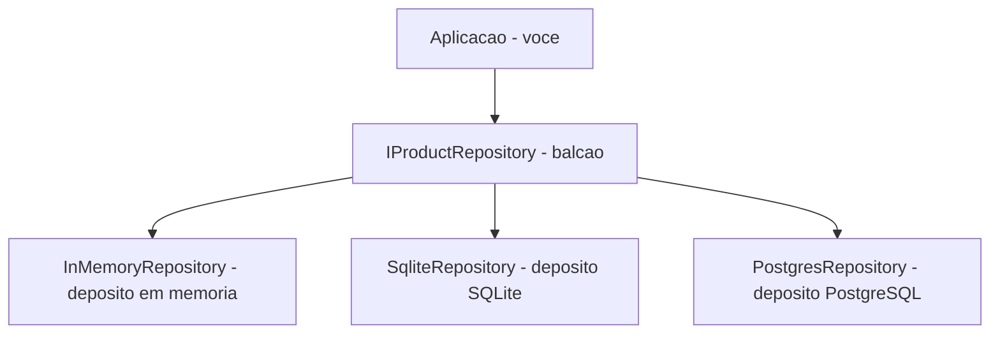
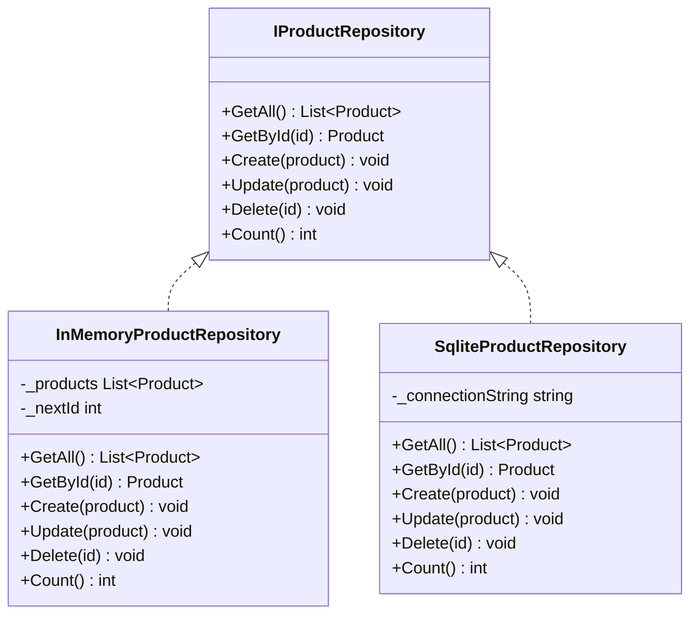
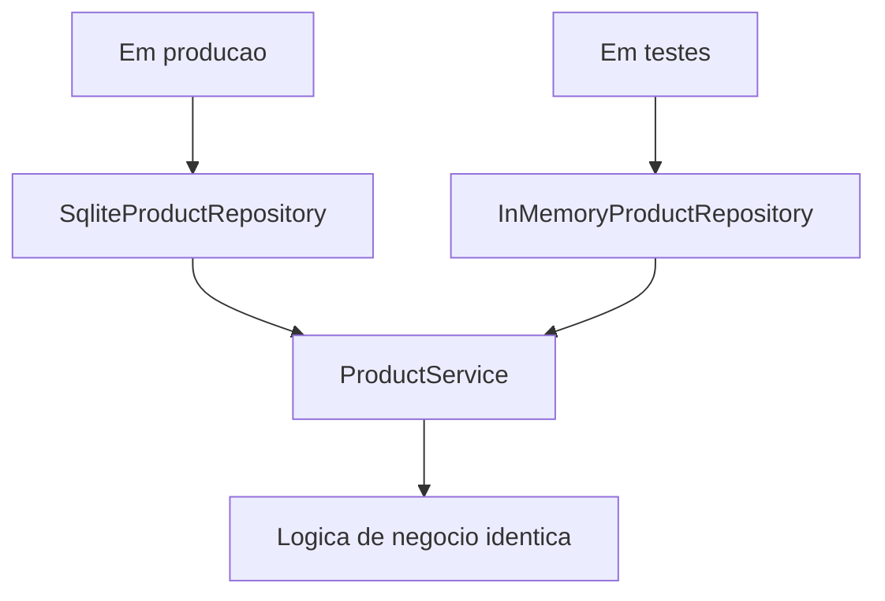
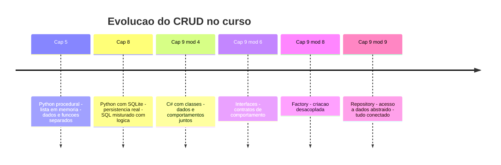
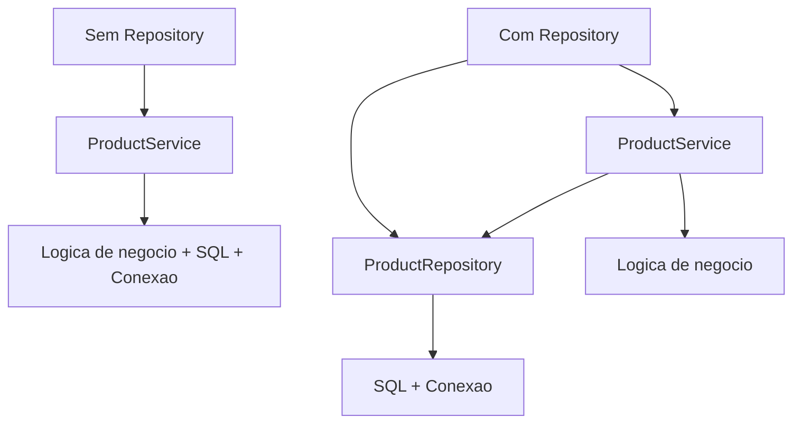

# 9.9 — Design Pattern: Repository — Abstraindo Acesso a Dados

[← Anterior: Design Pattern: Factory](cap09-mod08-patterns-factory-conteudo.md) · [Próximo: Princípios SOLID →](cap09-mod10-solid-conteudo.md)

---

## Introdução

No módulo anterior, você aprendeu o Factory Pattern — um padrão que centraliza a criação de objetos e desacopla o código que usa do código que cria. Vimos como uma Factory de notificadores permite trocar de Email para SMS mudando uma única string, e como uma Factory de conexões de banco permite alternar entre SQLite e memória sem alterar a lógica da aplicação.

Agora vamos aprender o segundo (e talvez mais impactante) design pattern deste curso: o **Repository** (Repositório). Se o Factory resolve o problema de *criar* objetos, o Repository resolve o problema de *acessar dados*. E esse é um problema que você já enfrentou.

Lembra do capítulo 8, quando construímos o CRUD de produtos com Python e SQLite? O código SQL ficava misturado com a lógica do programa. Se quiséssemos trocar de SQLite para outro banco, teríamos que reescrever praticamente tudo. E para testar a lógica sem um banco real? Impossível — o código dependia diretamente do SQLite.

O Repository Pattern resolve exatamente isso. Ele coloca uma **camada de abstração** entre a lógica da aplicação e o acesso a dados. A aplicação não sabe (e não precisa saber) se os dados estão em SQLite, PostgreSQL, MongoDB, um arquivo JSON ou na memória. Ela só sabe que pode pedir dados e receber dados — como um balcão de atendimento.

Este é o módulo "aha moment" do capítulo 9. Aqui você vai ver, de forma concreta e prática, POR QUE aprendemos interfaces, encapsulamento e Factory. Tudo se conecta. Interfaces definem o contrato. Encapsulamento esconde os detalhes. Factory escolhe a implementação. E o Repository usa tudo isso junto para resolver um problema real que todo desenvolvedor enfrenta.

---

## Como Executar os Exemplos Deste Módulo

Todos os exemplos são programas C# completos. Substitua o conteúdo de `Program.cs` no seu projeto e execute:

```bash
dotnet run
```

Se preferir, crie um projeto separado para este módulo:

```bash
dotnet new console -o ~/curso-csharp/mod09-repository
```

---

## A Analogia: O Balcao de Atendimento

Imagine que você precisa de um livro em uma biblioteca enorme. Você não entra no deposito, não procura nas prateleiras, não sabe se o livro esta no andar de cima ou no porão. Você vai ao **balcao de atendimento** e diz: "Quero o livro X". A atendente vai ate o deposito, encontra o livro e te entrega.

Se a biblioteca mudar a organização interna — trocar as prateleiras de lugar, mudar o sistema de catalogacao, ate mudar de predio — você não percebe. Você continua indo ao balcao e pedindo livros. O balcao e a sua **interface** com os dados da biblioteca.

Agora imagine que existem duas bibliotecas: uma fisica (com prateleiras reais) e uma digital (com e-books). Ambas tem um balcao de atendimento. Você pede o livro da mesma forma em ambas. A diferença e como o livro e buscado internamente — mas para você, o processo e identico.

Em programação:
- O **balcao de atendimento** e o **Repository** — você pede dados, ele busca
- O **deposito fisico** e o **banco de dados** (SQLite, PostgreSQL, etc.)
- O **deposito digital** e a **memória** (para testes)
- O **contrato do balcao** (o que você pode pedir) e a **interface** `IRepository`
- Você (o código da aplicação) não sabe e não precisa saber onde os dados estao guardados



---

## O Problema: Código de Dados Misturado com Lógica

Antes de ver a solução, vamos entender o problema com clareza. Veja como ficaria um CRUD de produtos sem Repository — o código SQL misturado com a lógica da aplicação:

```csharp
// SEM Repository — codigo acoplado ao banco de dados
// Isso e similar ao que fizemos no capitulo 8 com Python + SQLite

// "ProductService" = Servico de Produto
class ProductService
{
    // O servico CONHECE diretamente o banco de dados
    // Se trocar de SQLite para PostgreSQL, precisa reescrever TUDO aqui
    
    public void CreateProduct(string name, double price)
    {
        // Codigo SQL direto no servico — ACOPLADO!
        Console.WriteLine($"INSERT INTO products (name, price) VALUES ('{name}', {price})");
        Console.WriteLine($"Produto '{name}' criado no SQLite.");
    }

    public void ListProducts()
    {
        // Mais SQL direto — se trocar de banco, muda aqui tambem
        Console.WriteLine("SELECT * FROM products");
        Console.WriteLine("Listando produtos do SQLite...");
    }

    public void DeleteProduct(int id)
    {
        // E mais SQL...
        Console.WriteLine($"DELETE FROM products WHERE id = {id}");
        Console.WriteLine($"Produto {id} removido do SQLite.");
    }
}

// Usando
var service = new ProductService();
service.CreateProduct("Notebook", 3500.00);
service.ListProducts();
service.DeleteProduct(1);
```

Saida esperada:
```
INSERT INTO products (name, price) VALUES ('Notebook', 3500)
Produto 'Notebook' criado no SQLite.
SELECT * FROM products
Listando produtos do SQLite...
DELETE FROM products WHERE id = 1
Produto 1 removido do SQLite.
```

### Quais são os problemas?

| Problema | Consequência |
|----------|-------------|
| SQL misturado com lógica | Difícil de ler e manter |
| Servico conhece o banco diretamente | Trocar de banco = reescrever o servico |
| Impossível testar sem banco real | Testes ficam lentos e frageis |
| Código duplicado | Se outro servico precisa de produtos, repete o SQL |
| Violacao de responsabilidade | O servico faz duas coisas: lógica E acesso a dados |

Lembra do principio que vimos no módulo de interfaces (9.6)? **Dependa de abstrações, não de implementacoes.** O `ProductService` depende diretamente do SQLite — uma implementação concreta. Isso e exatamente o que queremos evitar.

---

## A Solução: O Repository Pattern

O Repository Pattern coloca uma **interface** entre a aplicação e o acesso a dados. A aplicação conversa com a interface. A interface pode ter várias implementacoes — uma para cada tipo de armazenamento.

### Passo 1: Definir o Modelo de Dados

Primeiro, precisamos de uma classe que represente nosso produto:

```csharp
// "Product" = Produto
class Product
{
    public int Id { get; set; }          // "Id" = identificador
    public string Name { get; set; }     // "Name" = nome
    public double Price { get; set; }    // "Price" = preco
    public int Quantity { get; set; }    // "Quantity" = quantidade

    // Construtor
    public Product(int id, string name, double price, int quantity)
    {
        Id = id;
        Name = name;
        Price = price;
        Quantity = quantity;
    }

    // "Display" = exibir
    public void Display()
    {
        Console.WriteLine($"  [{Id}] {Name} — R${Price:F2} (Estoque: {Quantity})");
    }
}
```

Saida esperada: nenhuma (e apenas a definição da classe)

### Passo 2: Definir a Interface do Repository

Agora, o contrato — o que qualquer repository de produtos DEVE saber fazer:

```csharp
// Interface do Repository — o contrato
// "IProductRepository" = Repositorio de Produto (interface)
interface IProductRepository
{
    // "GetAll" = obter todos
    List<Product> GetAll();

    // "GetById" = obter por ID
    Product? GetById(int id);

    // "Create" = criar
    void Create(Product product);

    // "Update" = atualizar
    void Update(Product product);

    // "Delete" = remover
    void Delete(int id);

    // "Count" = contar
    int Count();
}
```

Saida esperada: nenhuma (e apenas a definição da interface)

Observe: a interface define **O QUE** o repository faz (obter, criar, atualizar, remover, contar), mas não **COMO**. Não ha nenhuma mencao a SQL, SQLite, arquivo ou memória. O contrato e puro — apenas operações sobre produtos.

Esses cinco métodos (GetAll, GetById, Create, Update, Delete) formam o famoso **CRUD** — Create, Read, Update, Delete. Todo repository de qualquer entidade segue esse padrão básico.



---

## Implementação 1: InMemoryProductRepository

A primeira implementação guarda os dados em memória — usando uma lista. E perfeita para testes e para entender o padrão sem a complexidade de um banco de dados real.

```csharp
// Implementacao em memoria — para testes e prototipagem
// "InMemoryProductRepository" = Repositorio de Produto em Memoria
class InMemoryProductRepository : IProductRepository
{
    // Lista interna que armazena os produtos
    private List<Product> _products = new List<Product>();
    
    // Contador para gerar IDs automaticamente
    private int _nextId = 1;  // "nextId" = proximo ID

    // "GetAll" = obter todos os produtos
    public List<Product> GetAll()
    {
        // Retorna uma COPIA da lista (para proteger os dados internos)
        return new List<Product>(_products);
    }

    // "GetById" = obter produto por ID
    public Product? GetById(int id)
    {
        // Percorre a lista procurando o produto com o ID informado
        foreach (var product in _products)
        {
            if (product.Id == id)
            {
                return product;
            }
        }
        return null;  // Nao encontrou
    }

    // "Create" = criar novo produto
    public void Create(Product product)
    {
        product.Id = _nextId;  // Atribui ID automatico
        _nextId++;
        _products.Add(product);
    }

    // "Update" = atualizar produto existente
    public void Update(Product product)
    {
        // Encontra o produto pelo ID e substitui os dados
        for (int i = 0; i < _products.Count; i++)
        {
            if (_products[i].Id == product.Id)
            {
                _products[i] = product;
                return;
            }
        }
    }

    // "Delete" = remover produto por ID
    public void Delete(int id)
    {
        // Remove o produto com o ID informado
        for (int i = 0; i < _products.Count; i++)
        {
            if (_products[i].Id == id)
            {
                _products.RemoveAt(i);
                return;
            }
        }
    }

    // "Count" = contar quantos produtos existem
    public int Count()
    {
        return _products.Count;
    }
}
```

Saida esperada: nenhuma (e apenas a definição da classe)

Essa implementação e simples e direta. Os dados vivem em uma `List<Product>` na memória. Quando o programa termina, os dados desaparecem. E exatamente como o CRUD em memória que fizemos no capítulo 5 com Python — mas agora organizado com OOP.

### Testando o InMemoryProductRepository

Vamos ver essa implementação em ação:

```csharp
// === Programa completo: testando o InMemoryProductRepository ===

// Classe Product (modelo de dados)
class Product
{
    public int Id { get; set; }
    public string Name { get; set; }
    public double Price { get; set; }
    public int Quantity { get; set; }

    public Product(int id, string name, double price, int quantity)
    {
        Id = id;
        Name = name;
        Price = price;
        Quantity = quantity;
    }

    public void Display()
    {
        Console.WriteLine($"  [{Id}] {Name} — R${Price:F2} (Estoque: {Quantity})");
    }
}

// Interface do Repository
interface IProductRepository
{
    List<Product> GetAll();
    Product? GetById(int id);
    void Create(Product product);
    void Update(Product product);
    void Delete(int id);
    int Count();
}

// Implementacao em memoria
class InMemoryProductRepository : IProductRepository
{
    private List<Product> _products = new List<Product>();
    private int _nextId = 1;

    public List<Product> GetAll() => new List<Product>(_products);

    public Product? GetById(int id)
    {
        foreach (var p in _products)
            if (p.Id == id) return p;
        return null;
    }

    public void Create(Product product)
    {
        product.Id = _nextId++;
        _products.Add(product);
    }

    public void Update(Product product)
    {
        for (int i = 0; i < _products.Count; i++)
            if (_products[i].Id == product.Id)
            { _products[i] = product; return; }
    }

    public void Delete(int id)
    {
        for (int i = 0; i < _products.Count; i++)
            if (_products[i].Id == id)
            { _products.RemoveAt(i); return; }
    }

    public int Count() => _products.Count;
}

// === Usando o repository ===
IProductRepository repo = new InMemoryProductRepository();

// Criando produtos
repo.Create(new Product(0, "Notebook", 3500.00, 5));
repo.Create(new Product(0, "Mouse", 89.90, 30));
repo.Create(new Product(0, "Teclado", 199.90, 20));

// Listando todos
Console.WriteLine($"=== Produtos ({repo.Count()}) ===");
foreach (var product in repo.GetAll())
{
    product.Display();
}

// Buscando por ID
Console.WriteLine("\nBuscando produto com ID 2...");
var found = repo.GetById(2);
if (found != null)
{
    Console.WriteLine("Encontrado:");
    found.Display();
}

// Atualizando
Console.WriteLine("\nAtualizando preco do Mouse para R$99.90...");
found!.Price = 99.90;
repo.Update(found);

// Removendo
Console.WriteLine("Removendo Teclado (ID 3)...");
repo.Delete(3);

// Listando novamente
Console.WriteLine($"\n=== Produtos atualizados ({repo.Count()}) ===");
foreach (var product in repo.GetAll())
{
    product.Display();
}
```

Saida esperada:
```
=== Produtos (3) ===
  [1] Notebook — R$3500.00 (Estoque: 5)
  [2] Mouse — R$89.90 (Estoque: 30)
  [3] Teclado — R$199.90 (Estoque: 20)

Buscando produto com ID 2...
Encontrado:
  [2] Mouse — R$89.90 (Estoque: 30)

Atualizando preco do Mouse para R$99.90...
Removendo Teclado (ID 3)...

=== Produtos atualizados (2) ===
  [1] Notebook — R$3500.00 (Estoque: 5)
  [2] Mouse — R$99.90 (Estoque: 30)
```

Observe algo fundamental: a variável `repo` e do tipo `IProductRepository` (a interface), não `InMemoryProductRepository` (a classe concreta). O código que usa o repository não sabe qual implementação esta por tras. Isso e programar para a interface — o principio que aprendemos no módulo 9.6.

---

## Implementação 2: SqliteProductRepository

Agora vamos criar uma segunda implementação que simula o acesso a um banco SQLite. Em um projeto real, aqui teria código SQL de verdade (como no capítulo 8). Para manter o foco no padrão, vamos simular as operações com mensagens no console:

```csharp
// Implementacao SQLite (simulada) — para producao
// "SqliteProductRepository" = Repositorio de Produto com SQLite
class SqliteProductRepository : IProductRepository
{
    private string _databasePath;  // "databasePath" = caminho do banco

    public SqliteProductRepository(string databasePath)
    {
        _databasePath = databasePath;
        Console.WriteLine($"[SQLite] Conectado ao banco: {_databasePath}");
    }

    public List<Product> GetAll()
    {
        Console.WriteLine("[SQLite] SELECT * FROM products");
        // Em producao: executaria o SQL e retornaria os resultados
        // Aqui simulamos com dados fixos
        return new List<Product>
        {
            new Product(1, "Notebook", 3500.00, 5),
            new Product(2, "Mouse", 89.90, 30)
        };
    }

    public Product? GetById(int id)
    {
        Console.WriteLine($"[SQLite] SELECT * FROM products WHERE id = {id}");
        // Simulacao
        return new Product(id, "Produto do banco", 100.00, 10);
    }

    public void Create(Product product)
    {
        Console.WriteLine($"[SQLite] INSERT INTO products (name, price, quantity) VALUES ('{product.Name}', {product.Price}, {product.Quantity})");
    }

    public void Update(Product product)
    {
        Console.WriteLine($"[SQLite] UPDATE products SET name='{product.Name}', price={product.Price}, quantity={product.Quantity} WHERE id={product.Id}");
    }

    public void Delete(int id)
    {
        Console.WriteLine($"[SQLite] DELETE FROM products WHERE id = {id}");
    }

    public int Count()
    {
        Console.WriteLine("[SQLite] SELECT COUNT(*) FROM products");
        return 2;  // Simulacao
    }
}
```

Saida esperada: nenhuma (e apenas a definição da classe)

Em um projeto real, cada método teria o código SQL completo — exatamente como fizemos no capítulo 8 com Python. A diferença e que agora o SQL fica **isolado** dentro do repository, não espalhado pela aplicação.

---

## O Momento Magico: Trocando a Implementação em Uma Linha

Agora vem a parte mais poderosa do Repository Pattern. Veja como trocar de InMemory para SQLite muda **uma única linha** do código:

```csharp
// === A MAGICA DO REPOSITORY ===

// Toda a logica da aplicacao usa a INTERFACE
// "RunApplication" = executar aplicacao
static void RunApplication(IProductRepository repo)
{
    // Criar produtos
    repo.Create(new Product(0, "Notebook", 3500.00, 5));
    repo.Create(new Product(0, "Mouse", 89.90, 30));

    // Listar
    Console.WriteLine($"\nProdutos ({repo.Count()}):");
    foreach (var p in repo.GetAll())
    {
        p.Display();
    }

    // Buscar
    var found = repo.GetById(1);
    if (found != null)
    {
        Console.WriteLine($"\nEncontrado: {found.Name}");
    }

    // Remover
    repo.Delete(2);
    Console.WriteLine($"\nApos remocao: {repo.Count()} produtos");
}

// === TROCAR A IMPLEMENTACAO = MUDAR UMA LINHA ===

Console.WriteLine("========== COM MEMORIA ==========");
IProductRepository memoryRepo = new InMemoryProductRepository();  // <-- Esta linha
RunApplication(memoryRepo);

Console.WriteLine("\n========== COM SQLITE ==========");
IProductRepository sqliteRepo = new SqliteProductRepository("produtos.db");  // <-- Ou esta
RunApplication(sqliteRepo);
```

Saida esperada:
```
========== COM MEMORIA ==========

Produtos (2):
  [1] Notebook — R$3500.00 (Estoque: 5)
  [2] Mouse — R$89.90 (Estoque: 30)

Encontrado: Notebook

Apos remocao: 1 produtos

========== COM SQLITE ==========
[SQLite] Conectado ao banco: produtos.db
[SQLite] INSERT INTO products (name, price, quantity) VALUES ('Notebook', 3500, 5)
[SQLite] INSERT INTO products (name, price, quantity) VALUES ('Mouse', 89.9, 30)

[SQLite] SELECT COUNT(*) FROM products
Produtos (2):
[SQLite] SELECT * FROM products
  [1] Notebook — R$3500.00 (Estoque: 5)
  [2] Mouse — R$89.90 (Estoque: 30)

[SQLite] SELECT * FROM products WHERE id = 1
Encontrado: Produto do banco

[SQLite] DELETE FROM products WHERE id = 2
[SQLite] SELECT COUNT(*) FROM products
Apos remocao: 2 produtos
```

Percebe? O método `RunApplication` e **identico** nos dois casos. Ele não sabe se esta usando memória ou SQLite. Ele so conhece a interface `IProductRepository`. A única coisa que muda e qual objeto e passado como parametro.

Isso e o poder combinado de **interfaces** (módulo 9.6) + **Repository Pattern** (este módulo). E se amanha você precisar usar PostgreSQL? Cria um `PostgresProductRepository` que implementa `IProductRepository` e muda uma linha. O resto da aplicação não muda.

---

## Combinando Repository com Factory

No módulo anterior, aprendemos o Factory Pattern. Agora podemos combinar os dois patterns para criar um sistema ainda mais flexível — onde a escolha do repository vem de uma configuração:

```csharp
// === Programa completo: Repository + Factory ===

// Modelo
class Product
{
    public int Id { get; set; }
    public string Name { get; set; }
    public double Price { get; set; }
    public int Quantity { get; set; }

    public Product(int id, string name, double price, int quantity)
    {
        Id = id; Name = name; Price = price; Quantity = quantity;
    }

    public void Display()
    {
        Console.WriteLine($"  [{Id}] {Name} — R${Price:F2} (Estoque: {Quantity})");
    }
}

// Interface
interface IProductRepository
{
    List<Product> GetAll();
    Product? GetById(int id);
    void Create(Product product);
    void Update(Product product);
    void Delete(int id);
    int Count();
}

// Implementacao em memoria
class InMemoryProductRepository : IProductRepository
{
    private List<Product> _products = new();
    private int _nextId = 1;

    public List<Product> GetAll() => new List<Product>(_products);
    public Product? GetById(int id) => _products.Find(p => p.Id == id);
    public void Create(Product product) { product.Id = _nextId++; _products.Add(product); }
    public void Update(Product product)
    {
        var index = _products.FindIndex(p => p.Id == product.Id);
        if (index >= 0) _products[index] = product;
    }
    public void Delete(int id) { _products.RemoveAll(p => p.Id == id); }
    public int Count() => _products.Count;
}

// Implementacao SQLite (simulada)
class SqliteProductRepository : IProductRepository
{
    public SqliteProductRepository(string path)
    {
        Console.WriteLine($"[SQLite] Conectado: {path}");
    }

    public List<Product> GetAll()
    {
        Console.WriteLine("[SQLite] SELECT * FROM products");
        return new List<Product> { new(1, "Produto do banco", 100, 10) };
    }
    public Product? GetById(int id)
    {
        Console.WriteLine($"[SQLite] SELECT WHERE id={id}");
        return new Product(id, "Produto do banco", 100, 10);
    }
    public void Create(Product p) => Console.WriteLine($"[SQLite] INSERT: {p.Name}");
    public void Update(Product p) => Console.WriteLine($"[SQLite] UPDATE: {p.Name}");
    public void Delete(int id) => Console.WriteLine($"[SQLite] DELETE: {id}");
    public int Count() { Console.WriteLine("[SQLite] COUNT"); return 1; }
}

// === FACTORY que cria o repository baseado em configuracao ===
// "RepositoryFactory" = Fabrica de Repositorios
class RepositoryFactory
{
    public static IProductRepository Create(string type, string config = "")
    {
        return type.ToLower() switch
        {
            "memory" => new InMemoryProductRepository(),
            "sqlite" => new SqliteProductRepository(config),
            _ => throw new ArgumentException($"Tipo de repository desconhecido: {type}")
        };
    }
}

// === Usando: a configuracao decide qual repository usar ===

// Simula uma configuracao — em producao, viria de um arquivo .json ou .env
string environment = "memory";  // Mude para "sqlite" e veja a diferenca!
string dbPath = "produtos.db";

// A Factory cria o repository correto
IProductRepository repo = RepositoryFactory.Create(environment, dbPath);

// O resto do codigo NAO SABE qual repository esta usando
repo.Create(new Product(0, "Notebook", 3500.00, 5));
repo.Create(new Product(0, "Mouse", 89.90, 30));
repo.Create(new Product(0, "Teclado", 199.90, 20));

Console.WriteLine($"\n=== Catalogo ({repo.Count()} produtos) ===");
foreach (var product in repo.GetAll())
{
    product.Display();
}
```

Saida esperada (com environment = "memory"):
```

=== Catalogo (3 produtos) ===
  [1] Notebook — R$3500.00 (Estoque: 5)
  [2] Mouse — R$89.90 (Estoque: 30)
  [3] Teclado — R$199.90 (Estoque: 20)
```

Saida esperada (com environment = "sqlite"):
```
[SQLite] Conectado: produtos.db
[SQLite] INSERT: Notebook
[SQLite] INSERT: Mouse
[SQLite] INSERT: Teclado
[SQLite] COUNT

=== Catalogo (1 produtos) ===
[SQLite] SELECT * FROM products
  [1] Produto do banco — R$100.00 (Estoque: 10)
```

Agora temos um sistema completo: a **Factory** decide qual repository criar, e o **Repository** abstrai o acesso a dados. Mudar de memória para SQLite e mudar uma string de configuração. Nenhuma outra linha de código muda.

---

## Como o Repository Facilita Testes

Este e um dos motivos mais práticos para usar Repository. Lembra do módulo 9.6, quando vimos que interfaces permitem criar implementacoes "falsas" para testes? O Repository e o exemplo perfeito disso.

Sem Repository, para testar a lógica de um servico de produtos, você precisaria:
1. Instalar e configurar um banco de dados
2. Criar as tabelas
3. Inserir dados de teste
4. Rodar o teste
5. Limpar os dados depois

Com Repository, você usa o `InMemoryProductRepository` nos testes. E instantaneo, previsivel e não depende de nada externo.

```csharp
// === Exemplo: testando logica de negocio com Repository em memoria ===

// Servico que contem a logica de negocio
// "ProductService" = Servico de Produto
class ProductService
{
    private IProductRepository _repository;  // Depende da INTERFACE

    // Recebe o repository pelo construtor (injecao de dependencia)
    public ProductService(IProductRepository repository)
    {
        _repository = repository;
    }

    // "AddProduct" = adicionar produto
    // Regra de negocio: preco deve ser positivo
    public bool AddProduct(string name, double price, int quantity)
    {
        if (price <= 0)
        {
            Console.WriteLine($"ERRO: Preco deve ser positivo. Recebido: {price}");
            return false;
        }
        if (string.IsNullOrEmpty(name))
        {
            Console.WriteLine("ERRO: Nome nao pode ser vazio.");
            return false;
        }

        _repository.Create(new Product(0, name, price, quantity));
        Console.WriteLine($"Produto '{name}' adicionado com sucesso!");
        return true;
    }

    // "GetExpensiveProducts" = obter produtos caros
    // Regra de negocio: produtos acima de um valor minimo
    public List<Product> GetExpensiveProducts(double minPrice)
    {
        var all = _repository.GetAll();
        var expensive = new List<Product>();

        foreach (var product in all)
        {
            if (product.Price >= minPrice)
            {
                expensive.Add(product);
            }
        }

        return expensive;
    }

    // "GetTotalInventoryValue" = obter valor total do estoque
    public double GetTotalInventoryValue()
    {
        double total = 0;
        foreach (var product in _repository.GetAll())
        {
            total += product.Price * product.Quantity;
        }
        return total;
    }
}

// === "Teste" usando InMemory — rapido, sem banco, previsivel ===
Console.WriteLine("=== Testando ProductService ===\n");

// Cria repository em memoria (nao precisa de banco!)
var testRepo = new InMemoryProductRepository();
var service = new ProductService(testRepo);

// Teste 1: adicionar produto valido
Console.WriteLine("Teste 1: Produto valido");
bool result1 = service.AddProduct("Notebook", 3500.00, 5);
Console.WriteLine($"Resultado: {result1}\n");  // true

// Teste 2: preco negativo (deve falhar)
Console.WriteLine("Teste 2: Preco negativo");
bool result2 = service.AddProduct("Produto Invalido", -100, 1);
Console.WriteLine($"Resultado: {result2}\n");  // false

// Teste 3: nome vazio (deve falhar)
Console.WriteLine("Teste 3: Nome vazio");
bool result3 = service.AddProduct("", 50.00, 1);
Console.WriteLine($"Resultado: {result3}\n");  // false

// Teste 4: adicionar mais produtos e filtrar
service.AddProduct("Mouse", 89.90, 30);
service.AddProduct("Monitor", 1200.00, 8);

Console.WriteLine("\nProdutos caros (acima de R$500):");
var expensive = service.GetExpensiveProducts(500);
foreach (var p in expensive)
{
    p.Display();
}

Console.WriteLine($"\nValor total do estoque: R${service.GetTotalInventoryValue():F2}");
```

Saida esperada:
```
=== Testando ProductService ===

Teste 1: Produto valido
Produto 'Notebook' adicionado com sucesso!
Resultado: True

Teste 2: Preco negativo
ERRO: Preco deve ser positivo. Recebido: -100
Resultado: False

Teste 3: Nome vazio
ERRO: Nome nao pode ser vazio.
Resultado: False

Produto 'Mouse' adicionado com sucesso!
Produto 'Monitor' adicionado com sucesso!

Produtos caros (acima de R$500):
  [1] Notebook — R$3500.00 (Estoque: 5)
  [3] Monitor — R$1200.00 (Estoque: 8)

Valor total do estoque: R$29797.00
```

Observe o que aconteceu:

1. O `ProductService` recebe um `IProductRepository` pelo construtor — não sabe qual implementação e
2. Nos testes, passamos `InMemoryProductRepository` — rápido, sem banco, sem configuração
3. Em produção, passariamos `SqliteProductRepository` — com banco real
4. A lógica de negocio (validação de preco, filtro de produtos caros, cálculo de estoque) e testada **sem nenhuma dependência externa**

Isso e o que profissionais chamam de **injecao de dependência** — em vez do servico criar seu proprio repository, ele recebe um de fora. Quem decide qual repository usar e quem cria o servico, não o servico em si.



---

## A Evolução: Do Capítulo 5 ao Capítulo 9

Vamos fazer uma retrospectiva para ver como chegamos ate aqui. Essa evolução mostra por que cada conceito que aprendemos foi necessário:

### Capítulo 5 — CRUD Procedural em Python

```python
# Capitulo 5: tudo em memoria, tudo procedural
# "products" = produtos (lista de dicionarios)
products = []

def add_product(name, price):
    products.append({"name": name, "price": price})

def list_products():
    for p in products:
        print(f"{p['name']} — R${p['price']:.2f}")
```

**Problema**: dados e funções separados. Sem organização. Sem persistência.

### Capítulo 8 — CRUD com SQLite em Python

```python
# Capitulo 8: persistencia com banco, mas SQL misturado
import sqlite3

def add_product(name, price):
    conn = sqlite3.connect("produtos.db")
    conn.execute("INSERT INTO products (name, price) VALUES (?, ?)", (name, price))
    conn.commit()
    conn.close()
```

**Problema**: SQL misturado com lógica. Trocar de banco = reescrever tudo.

### Capítulo 9 — CRUD com Repository em C#

```csharp
// Capitulo 9: organizado, desacoplado, testavel
// O servico NAO sabe qual banco esta usando
public bool AddProduct(string name, double price, int quantity)
{
    if (price <= 0) return false;
    _repository.Create(new Product(0, name, price, quantity));
    return true;
}
```

**Solução**: lógica separada de dados. Trocar de banco = mudar uma linha. Testar = usar InMemory.

### Tabela Comparativa da Evolução

| Aspecto | Cap 5 - Python | Cap 8 - SQLite | Cap 9 - Repository |
|---------|---------------|----------------|-------------------|
| Linguagem | Python | Python | C# |
| Armazenamento | Lista em memória | SQLite | Qualquer (via interface) |
| Organização | Procedural | Procedural | OOP com patterns |
| Trocar banco | Não se aplica | Reescrever tudo | Mudar uma linha |
| Testar sem banco | Automático (e em memória) | Impossível | Usar InMemory |
| Validação | Nas funções | Nas funções | No servico (separado) |
| Reutilização | Baixa | Baixa | Alta |



---

## Sem Repository vs Com Repository: Comparação Detalhada

Vamos comparar os dois cenários lado a lado para deixar claro o impacto do pattern:

### Cenário: Adicionar suporte a PostgreSQL

**Sem Repository:**
1. Encontrar todos os arquivos que tem código SQL
2. Para cada arquivo, reescrever as queries para PostgreSQL
3. Alterar as conexões em todos os lugares
4. Testar tudo novamente (sem garantia de que não quebrou nada)
5. Resultado: dezenas de arquivos alterados, alto risco de bugs

**Com Repository:**
1. Criar `PostgresProductRepository` que implementa `IProductRepository`
2. Alterar a Factory (ou configuração) para usar o novo repository
3. Testar com os mesmos testes que ja existem
4. Resultado: 2 arquivos alterados, risco mínimo

### Cenário: Testar a lógica de cálculo de desconto

**Sem Repository:**
1. Instalar banco de dados na máquina de teste
2. Criar tabelas e inserir dados de teste
3. Rodar o teste (que depende do banco estar funcionando)
4. Se o banco estiver fora do ar, o teste falha — mesmo que a lógica esteja correta
5. Limpar os dados depois do teste

**Com Repository:**
1. Criar `InMemoryProductRepository` com dados de teste
2. Rodar o teste (instantaneo, sem dependências)
3. O teste válida APENAS a lógica, não o banco

### Tabela Resumo

| Critério | Sem Repository | Com Repository |
|----------|---------------|----------------|
| Trocar banco de dados | Reescrever dezenas de arquivos | Criar 1 classe nova |
| Testar lógica de negocio | Precisa de banco real | Usa InMemory |
| Velocidade dos testes | Lenta (acesso a disco e rede) | Instantanea (memória) |
| Risco ao mudar | Alto (muitos arquivos) | Baixo (1-2 arquivos) |
| Código SQL | Espalhado pela aplicação | Isolado no repository |
| Responsabilidade | Servico faz lógica E acesso a dados | Cada um faz uma coisa |
| Adicionar novo banco | Alterar código existente | Adicionar código novo |
| Complexidade inicial | Menor (menos arquivos) | Maior (mais arquivos) |

A última linha e importante: Repository adiciona complexidade inicial. Você cria mais arquivos e mais classes. Mas essa complexidade **se paga** rapidamente quando o projeto cresce, quando você precisa testar, ou quando precisa trocar de banco.

---

## Repository Genérico: Reutilizando o Padrão

Até agora, criamos um `IProductRepository` específico para produtos. Mas e se tivermos clientes, pedidos, categorias? Vamos criar um repository para cada um?

Sim — mas podemos criar uma **interface genérica** que serve de base para todos:

```csharp
// Interface generica de Repository
// "IRepository<T>" = Repositorio generico para qualquer tipo T
interface IRepository<T>
{
    List<T> GetAll();
    T? GetById(int id);
    void Create(T entity);
    void Update(T entity);
    void Delete(int id);
    int Count();
}

// Agora podemos criar repositories especificos que herdam da generica:
// IProductRepository herda de IRepository<Product>
// ICustomerRepository herda de IRepository<Customer>
// IOrderRepository herda de IRepository<Order>
```

Saida esperada: nenhuma (e apenas a definição da interface)

O `<T>` e um **tipo genérico** — significa "qualquer tipo". Quando usamos `IRepository<Product>`, o T e substituido por Product. Quando usamos `IRepository<Customer>`, o T e substituido por Customer.

Vamos ver um exemplo completo com duas entidades:

```csharp
// === Programa completo: Repository generico ===

// Interface generica
interface IRepository<T>
{
    List<T> GetAll();
    T? GetById(int id);
    void Create(T entity);
    void Delete(int id);
    int Count();
}

// Modelo: Produto
class Product
{
    public int Id { get; set; }
    public string Name { get; set; }
    public double Price { get; set; }

    public Product(int id, string name, double price)
    { Id = id; Name = name; Price = price; }

    public override string ToString() => $"[{Id}] {Name} — R${Price:F2}";
}

// Modelo: Cliente
// "Customer" = Cliente
class Customer
{
    public int Id { get; set; }
    public string Name { get; set; }    // "Name" = nome
    public string Email { get; set; }   // "Email" = email

    public Customer(int id, string name, string email)
    { Id = id; Name = name; Email = email; }

    public override string ToString() => $"[{Id}] {Name} ({Email})";
}

// Implementacao generica em memoria
// "InMemoryRepository<T>" = Repositorio em Memoria generico
class InMemoryRepository<T> : IRepository<T>
{
    private List<T> _items = new();
    private int _nextId = 1;
    private Func<T, int> _getId;       // Funcao para obter o ID
    private Action<T, int> _setId;     // Funcao para definir o ID

    public InMemoryRepository(Func<T, int> getId, Action<T, int> setId)
    {
        _getId = getId;
        _setId = setId;
    }

    public List<T> GetAll() => new List<T>(_items);

    public T? GetById(int id)
    {
        foreach (var item in _items)
            if (_getId(item) == id) return item;
        return default;
    }

    public void Create(T entity)
    {
        _setId(entity, _nextId++);
        _items.Add(entity);
    }

    public void Delete(int id)
    {
        _items.RemoveAll(item => _getId(item) == id);
    }

    public int Count() => _items.Count;
}

// === Usando repositories genericos ===

// Repository de produtos
var productRepo = new InMemoryRepository<Product>(
    p => p.Id,           // Como obter o ID de um Product
    (p, id) => p.Id = id // Como definir o ID de um Product
);

// Repository de clientes
var customerRepo = new InMemoryRepository<Customer>(
    c => c.Id,
    (c, id) => c.Id = id
);

// Adicionando produtos
productRepo.Create(new Product(0, "Notebook", 3500.00));
productRepo.Create(new Product(0, "Mouse", 89.90));

// Adicionando clientes
customerRepo.Create(new Customer(0, "Maria", "maria@email.com"));
customerRepo.Create(new Customer(0, "Pedro", "pedro@email.com"));

// Listando
Console.WriteLine($"=== Produtos ({productRepo.Count()}) ===");
foreach (var p in productRepo.GetAll())
    Console.WriteLine($"  {p}");

Console.WriteLine($"\n=== Clientes ({customerRepo.Count()}) ===");
foreach (var c in customerRepo.GetAll())
    Console.WriteLine($"  {c}");
```

Saida esperada:
```
=== Produtos (2) ===
  [1] Notebook — R$3500.00
  [2] Mouse — R$89.90

=== Clientes (2) ===
  [1] Maria (maria@email.com)
  [2] Pedro (pedro@email.com)
```

Com o repository genérico, não precisamos reescrever a lógica de armazenamento para cada entidade. A mesma classe `InMemoryRepository<T>` funciona para produtos, clientes, pedidos — qualquer tipo.

Generics e um conceito avancado que vamos apenas introduzir aqui. O importante e entender a ideia: **reutilizar código para diferentes tipos de dados**.

---

## Quando Usar Repository

Como todo pattern, Repository não e para usar em todo lugar. Veja quando faz sentido e quando não:

| Cenário | Repository e útil? | Por que |
|---------|-------------------|---------|
| Aplicação com banco de dados | Sim | Isola o SQL, facilita troca e testes |
| CRUD simples com uma entidade | Depende | Se não vai trocar de banco nem testar, pode ser over-engineering |
| Multiplas fontes de dados | Sim | Abstrai a origem dos dados |
| Projeto com testes automatizados | Sim | InMemory para testes rapidos |
| Script de 50 linhas | Não | Complexidade desnecessaria |
| Microservicos | Sim | Cada servico tem seu repository |
| Prototipo rápido | Não | Foco em velocidade, não em arquitetura |
| Projeto que vai crescer | Sim | Investimento que se paga no futuro |

A regra prática: se o projeto tem mais de uma entidade, vai ter testes, ou pode trocar de banco no futuro, use Repository. Se e um script simples ou prototipo descartavel, não precisa.

---

## Repository e o Principio da Responsabilidade Única

O Repository implementa naturalmente o **Principio da Responsabilidade Única** (SRP — Single Responsibility Principle), que vamos estudar no próximo módulo (9.10 — SOLID):

- O **Repository** tem UMA responsabilidade: acessar dados
- O **Service** tem UMA responsabilidade: lógica de negocio
- O **Model** tem UMA responsabilidade: representar os dados

Sem Repository, o Service faz duas coisas: lógica E acesso a dados. Isso viola o SRP e torna o código mais difícil de manter e testar.



---

## Exemplo Completo: Sistema de Catalogo com Repository

Vamos juntar tudo em um exemplo mais robusto — um sistema de catalogo de produtos com servico, repository e Factory:

```csharp
// === SISTEMA COMPLETO: Catalogo com Repository ===

// --- Modelo ---
class Product
{
    public int Id { get; set; }
    public string Name { get; set; }
    public double Price { get; set; }
    public int Quantity { get; set; }
    public string Category { get; set; }  // "Category" = categoria

    public Product(int id, string name, double price, int quantity, string category)
    {
        Id = id; Name = name; Price = price;
        Quantity = quantity; Category = category;
    }

    public void Display()
    {
        Console.WriteLine($"  [{Id}] {Name} — R${Price:F2} | Estoque: {Quantity} | Categoria: {Category}");
    }
}

// --- Interface do Repository ---
interface IProductRepository
{
    List<Product> GetAll();
    Product? GetById(int id);
    void Create(Product product);
    void Update(Product product);
    void Delete(int id);
    int Count();
}

// --- Implementacao em memoria ---
class InMemoryProductRepository : IProductRepository
{
    private List<Product> _products = new();
    private int _nextId = 1;

    public List<Product> GetAll() => new List<Product>(_products);
    public Product? GetById(int id) => _products.Find(p => p.Id == id);

    public void Create(Product product)
    {
        product.Id = _nextId++;
        _products.Add(product);
    }

    public void Update(Product product)
    {
        var index = _products.FindIndex(p => p.Id == product.Id);
        if (index >= 0) _products[index] = product;
    }

    public void Delete(int id) => _products.RemoveAll(p => p.Id == id);
    public int Count() => _products.Count;
}

// --- Servico com logica de negocio ---
// "CatalogService" = Servico de Catalogo
class CatalogService
{
    private IProductRepository _repo;

    public CatalogService(IProductRepository repo)
    {
        _repo = repo;
    }

    // Adicionar produto com validacao
    public bool AddProduct(string name, double price, int quantity, string category)
    {
        if (string.IsNullOrWhiteSpace(name))
        {
            Console.WriteLine("ERRO: Nome obrigatorio.");
            return false;
        }
        if (price <= 0)
        {
            Console.WriteLine("ERRO: Preco deve ser positivo.");
            return false;
        }
        if (quantity < 0)
        {
            Console.WriteLine("ERRO: Quantidade nao pode ser negativa.");
            return false;
        }

        _repo.Create(new Product(0, name, price, quantity, category));
        return true;
    }

    // Listar todos os produtos
    public void ListAll()
    {
        var products = _repo.GetAll();
        Console.WriteLine($"\n=== Catalogo ({products.Count} produtos) ===");
        if (products.Count == 0)
        {
            Console.WriteLine("  (vazio)");
            return;
        }
        foreach (var p in products)
            p.Display();
    }

    // Filtrar por categoria
    // "GetByCategory" = obter por categoria
    public List<Product> GetByCategory(string category)
    {
        var all = _repo.GetAll();
        var filtered = new List<Product>();
        foreach (var p in all)
        {
            if (p.Category.Equals(category, StringComparison.OrdinalIgnoreCase))
                filtered.Add(p);
        }
        return filtered;
    }

    // Calcular valor total do estoque
    public double GetTotalValue()
    {
        double total = 0;
        foreach (var p in _repo.GetAll())
            total += p.Price * p.Quantity;
        return total;
    }

    // Aplicar desconto em uma categoria
    // "ApplyDiscount" = aplicar desconto
    public int ApplyDiscount(string category, double percentage)
    {
        var products = GetByCategory(category);
        int count = 0;
        foreach (var p in products)
        {
            p.Price *= (1 - percentage / 100);
            _repo.Update(p);
            count++;
        }
        return count;
    }
}

// === Usando o sistema ===
var repo = new InMemoryProductRepository();
var catalog = new CatalogService(repo);

// Adicionando produtos
catalog.AddProduct("Notebook Dell", 3500.00, 5, "Informatica");
catalog.AddProduct("Mouse Logitech", 89.90, 30, "Informatica");
catalog.AddProduct("Cadeira Gamer", 1200.00, 8, "Moveis");
catalog.AddProduct("Mesa de Escritorio", 800.00, 12, "Moveis");
catalog.AddProduct("Monitor LG", 1500.00, 10, "Informatica");

catalog.ListAll();

// Filtrar por categoria
Console.WriteLine("\n--- Informatica ---");
foreach (var p in catalog.GetByCategory("Informatica"))
    p.Display();

Console.WriteLine("\n--- Moveis ---");
foreach (var p in catalog.GetByCategory("Moveis"))
    p.Display();

// Valor total
Console.WriteLine($"\nValor total do estoque: R${catalog.GetTotalValue():F2}");

// Aplicar desconto
int affected = catalog.ApplyDiscount("Informatica", 10);
Console.WriteLine($"\nDesconto de 10% aplicado em {affected} produtos de Informatica.");

catalog.ListAll();
Console.WriteLine($"Novo valor total: R${catalog.GetTotalValue():F2}");
```

Saida esperada:
```

=== Catalogo (5 produtos) ===
  [1] Notebook Dell — R$3500.00 | Estoque: 5 | Categoria: Informatica
  [2] Mouse Logitech — R$89.90 | Estoque: 30 | Categoria: Informatica
  [3] Cadeira Gamer — R$1200.00 | Estoque: 8 | Categoria: Moveis
  [4] Mesa de Escritorio — R$800.00 | Estoque: 12 | Categoria: Moveis
  [5] Monitor LG — R$1500.00 | Estoque: 10 | Categoria: Informatica

--- Informatica ---
  [1] Notebook Dell — R$3500.00 | Estoque: 5 | Categoria: Informatica
  [2] Mouse Logitech — R$89.90 | Estoque: 30 | Categoria: Informatica
  [5] Monitor LG — R$1500.00 | Estoque: 10 | Categoria: Informatica

--- Moveis ---
  [3] Cadeira Gamer — R$1200.00 | Estoque: 8 | Categoria: Moveis
  [4] Mesa de Escritorio — R$800.00 | Estoque: 12 | Categoria: Moveis

Valor total do estoque: R$49897.00

Desconto de 10% aplicado em 3 produtos de Informatica.

=== Catalogo (5 produtos) ===
  [1] Notebook Dell — R$3150.00 | Estoque: 5 | Categoria: Informatica
  [2] Mouse Logitech — R$80.91 | Estoque: 30 | Categoria: Informatica
  [3] Cadeira Gamer — R$1200.00 | Estoque: 8 | Categoria: Moveis
  [4] Mesa de Escritorio — R$800.00 | Estoque: 12 | Categoria: Moveis
  [5] Monitor LG — R$1350.00 | Estoque: 10 | Categoria: Informatica

Novo valor total: R$46477.30
```

Observe como o `CatalogService` contem toda a lógica de negocio (validação, filtro, cálculo, desconto) e o `InMemoryProductRepository` cuida apenas do armazenamento. Cada um faz uma coisa. Se amanha precisarmos trocar para SQLite, criamos um `SqliteProductRepository` e mudamos uma linha. O `CatalogService` não muda.

---

## Como a IA pode te ajudar aqui
**Prompt 1 — Criar com ajuda da IA:**
> "Tenho esta classe de modelo [cole o código]. Crie uma interface IRepository e uma implementação InMemory para ela."

**Prompt 2 — Aprofundar o tema:**
> "Meu servico acessa o banco de dados diretamente [cole o código]. Refatore para usar o Repository Pattern."

**Prompt 3 — Comparar alternativas:**
> "Qual a diferença entre Repository Pattern e DAO (Data Access Object)? Quando usar cada um?"

---

## Casos de Uso no Mundo Real

### E-commerce: Multiplos Bancos de Dados

Grandes plataformas de e-commerce como Amazon, Mercado Livre e Shopee usam diferentes bancos de dados para diferentes tipos de dados: PostgreSQL para pedidos e transações (dados relacionais que precisam de consistência), MongoDB para catalogo de produtos (dados flexiveis que mudam com frequência), Redis para cache de precos e sessoes (dados temporarios que precisam de velocidade). O Repository Pattern permite que o servico de pedidos use `IOrderRepository` sem saber se os dados estao em PostgreSQL ou em outro banco. Quando a equipe de infraestrutura decide migrar de PostgreSQL para CockroachDB, o servico de pedidos não muda — apenas o repository e substituido.

### Bancos e Fintechs: Testes de Transações Financeiras

Bancos como Nubank, Inter e C6 precisam testar lógica financeira complexa — cálculo de juros, limites de credito, transferencias entre contas. Testar isso com um banco de dados real seria lento, fragil e perigoso (imagine um teste que acidentalmente transfere dinheiro de verdade). Com Repository, os testes usam `InMemoryAccountRepository` com dados controlados. A lógica de cálculo de juros e testada milhares de vezes por dia sem tocar em nenhum banco real. Em produção, o mesmo código usa `PostgresAccountRepository` conectado ao banco de verdade.

### Microservicos: Independencia entre Equipes

Em empresas como Netflix, Spotify e Uber, cada microservico e desenvolvido por uma equipe diferente. O servico de recomendacoes da Netflix não sabe (e não precisa saber) qual banco o servico de catalogo usa. Cada servico tem seu proprio repository com sua propria implementação. Se a equipe de catalogo decide migrar de Cassandra para DynamoDB, nenhum outro servico e afetado — porque todos se comunicam através de interfaces, não de implementacoes concretas. O Repository Pattern e a base dessa independencia.

---

## Resumo do Módulo

| Conceito | Definição |
|----------|-----------|
| Repository Pattern | Padrão que abstrai o acesso a dados atras de uma interface |
| IProductRepository | Interface que define as operações sobre produtos (CRUD) |
| InMemoryProductRepository | Implementação que guarda dados em memória (para testes) |
| SqliteProductRepository | Implementação que acessa banco SQLite (para produção) |
| Injecao de Dependência | Técnica de passar dependências pelo construtor em vez de criar internamente |
| Repository Genérico | Interface com tipo genérico que serve para qualquer entidade |
| Service | Classe que contem lógica de negocio e usa o repository |
| CRUD | Create, Read, Update, Delete — as quatro operações básicas de dados |

---

## Glossário do Módulo

| Termo | Definição |
|-------|-----------|
| Abstração (Abstraction) | Esconder detalhes de implementação e expor apenas o essencial |
| Acoplamento (Coupling) | Grau de dependência entre partes do código |
| CRUD | Create, Read, Update, Delete — operações básicas de manipulação de dados |
| DAO (Data Access Object) | Padrão similar ao Repository, mais focado em operações de banco especificas |
| Desacoplamento (Decoupling) | Reduzir dependências entre módulos do código |
| Factory Pattern | Padrão que centraliza a criação de objetos |
| Generics | Recurso de linguagem que permite criar classes e interfaces parametrizadas por tipo |
| InMemory | Implementação que armazena dados na memória RAM, sem persistência |
| Injecao de Dependência (Dependency Injection) | Técnica de fornecer dependências externamente em vez de criar internamente |
| Interface | Contrato que define quais métodos uma classe deve implementar |
| Mock | Implementação falsa usada em testes para simular comportamento real |
| Over-engineering | Adicionar complexidade desnecessaria ao código |
| Persistência (Persistence) | Capacidade de manter dados apos o programa terminar |
| Repository Pattern | Padrão de projeto que abstrai o acesso a dados atras de uma interface |
| Service | Classe que contem lógica de negocio e orquestra operações |
| Single Responsibility Principle (SRP) | Principio que diz que cada classe deve ter uma única responsabilidade |
| Stub | Implementação simplificada usada em testes, com respostas fixas |
| Unit Test | Teste que válida uma unidade isolada de código |

---

## Na Cultura Popular

- **Matrix** (filme, 1999) — no filme, os personagens acessam a Matrix através de uma interface (o telefone, o operador). Eles não sabem como a Matrix funciona internamente — se os dados estao em servidores, em nuvem ou em outra dimensao. O operador e como um Repository: você pede informações ("preciso de uma saida") e ele busca, sem que você precise saber onde ou como os dados estao armazenados.
- **Biblioteca de Babel** (conto de Jorge Luis Borges, 1941) — Borges imaginou uma biblioteca infinita contendo todos os livros possiveis. Os bibliotecarios buscam livros sem saber a organização completa do acervo. Cada andar da biblioteca e como uma implementação diferente do mesmo repository — o contrato e o mesmo (buscar livros), mas a forma de armazenamento muda.

---

## Para Saber Mais

- [Microsoft Learn — C#](https://learn.microsoft.com/pt-br/dotnet/csharp/) — *Documentação oficial de C# em portugues, com tutoriais sobre interfaces e patterns*
- [Refactoring Guru — Repository](https://refactoring.guru/pt-br/design-patterns) — *Catalogo visual de design patterns com exemplos em C# e explicacoes em portugues*
- [Source Making — Design Patterns](https://sourcemaking.com/design_patterns) — *Explicacoes claras de patterns com exemplos de código em multiplas linguagens*
- [Exercism — C# Track](https://exercism.org/tracks/csharp) — *Exercícios progressivos de C# com mentoria gratuita, otimos para praticar interfaces e patterns*

---

## Perguntas Frequentes (FAQ)

**P: Repository e a mesma coisa que DAO (Data Access Object)?**
R: São parecidos, mas tem diferenças sutis. O DAO e mais focado nas operações do banco de dados (queries SQL especificas). O Repository e mais focado na coleção de objetos de dominio — ele "finge" que os dados estao em uma coleção em memória, mesmo que por tras tenha um banco. Na prática, muitos projetos usam os termos como sinonimos. Para iniciantes, a diferença não e critica — o importante e entender o conceito de abstrair o acesso a dados.

**P: Preciso criar um Repository para cada entidade?**
R: Sim, cada entidade geralmente tem seu proprio repository: `IProductRepository`, `ICustomerRepository`, `IOrderRepository`. Mas você pode usar uma interface genérica (`IRepository<T>`) como base para evitar repetição. A implementação concreta pode ser genérica também (`InMemoryRepository<T>`), como vimos no exemplo.

**P: O InMemoryRepository e usado em produção?**
R: Raramente. Ele e usado principalmente para testes e prototipagem. Em produção, você usa uma implementação que persiste dados de verdade (SQLite, PostgreSQL, MongoDB, etc.). A exceção e quando você precisa de um cache rápido — ai uma implementação em memória pode fazer sentido.

**P: Repository funciona so com bancos de dados?**
R: Não. O Repository abstrai qualquer fonte de dados: banco de dados, arquivo JSON, arquivo CSV, API externa, cache em memória, ou ate um servico remoto. O código que usa o repository não sabe e não precisa saber de onde os dados vem.

**P: Posso ter mais de uma implementação de repository no mesmo projeto?**
R: Sim, e isso e comum. Você pode ter `InMemoryProductRepository` para testes, `SqliteProductRepository` para desenvolvimento local e `PostgresProductRepository` para produção. A Factory ou a configuração decide qual usar em cada ambiente.

**P: O que e injecao de dependência?**
R: E a técnica de passar dependências pelo construtor em vez de criar internamente. Em vez de o `ProductService` criar seu proprio repository (`new SqliteProductRepository()`), ele recebe um `IProductRepository` pelo construtor. Quem cria o servico decide qual repository passar. Isso permite trocar a implementação sem alterar o servico.

**P: Repository adiciona muita complexidade?**
R: Adiciona alguma complexidade inicial — mais arquivos, mais classes. Mas essa complexidade e **organizada** e se paga rapidamente. Sem Repository, a complexidade fica **escondida** dentro de servicos que fazem coisas demais. E mais fácil manter 5 arquivos pequenos e focados do que 1 arquivo gigante que faz tudo.

**P: Quando NAO usar Repository?**
R: Em scripts simples, prototipos descartaveis, ou aplicações muito pequenas que nunca vao crescer. Se você tem certeza absoluta de que nunca vai trocar de banco, nunca vai escrever testes e o projeto tem menos de 500 linhas, Repository pode ser over-engineering. Mas na duvida, use — e raro se arrepender de ter usado Repository.

**P: Repository substitui o ORM (Object-Relational Mapping)?**
R: Não, eles se complementam. O ORM (como Entity Framework em C#) facilita o mapeamento entre objetos e tabelas do banco. O Repository usa o ORM internamente para executar as operações. O Repository e a camada de abstração; o ORM e a ferramenta que o Repository usa por dentro.

**P: Como o Repository se conecta com o Factory do módulo anterior?**
R: O Factory decide QUAL repository criar (InMemory, SQLite, Postgres). O Repository abstrai COMO os dados são acessados. Juntos, eles formam um sistema flexível: a Factory cria o repository correto baseado em configuração, e o servico usa o repository sem saber qual implementação e.

---

## Exercícios Práticos

### Exercício 1: Repository de Clientes

Crie um sistema completo com Repository para gerenciar clientes:

1. Classe `Customer` com propriedades: `Id`, `Name`, `Email`, `Phone`
2. Interface `ICustomerRepository` com os métodos CRUD (GetAll, GetById, Create, Update, Delete, Count)
3. Implementação `InMemoryCustomerRepository`
4. Classe `CustomerService` com:
   - `RegisterCustomer(name, email, phone)` — válida que email contem "@" e nome não e vazio
   - `FindByEmail(email)` — busca cliente por email
   - `ListAll()` — lista todos os clientes
5. Teste o sistema criando 3 clientes, buscando por email e listando todos

Dica: siga a mesma estrutura do exemplo de produtos deste módulo. A interface e quase identica — muda apenas o tipo de `Product` para `Customer`.

### Exercício 2: Duas Implementacoes

Usando o repository de clientes do exercício 1:

1. Crie uma segunda implementação: `FileCustomerRepository` que simula salvar em arquivo (imprime mensagens como `[FILE] Salvando cliente...`)
2. Crie uma `CustomerRepositoryFactory` que cria o repository correto baseado em uma string ("memory" ou "file")
3. Demonstre que o `CustomerService` funciona identicamente com ambas as implementacoes, mudando apenas a string de configuração

Dica: revise o exemplo de Factory + Repository deste módulo. A estrutura e a mesma.

### Exercício 3: Reflexao — Conectando os Conceitos

Responda com suas palavras:

1. Qual e a relação entre interfaces (módulo 9.6) e o Repository Pattern?
2. Como o Factory Pattern (módulo 9.8) complementa o Repository Pattern?
3. Por que o `InMemoryProductRepository` e útil para testes, mesmo que nunca seja usado em produção?
4. Imagine que você esta construindo um sistema de biblioteca (como o projeto do capítulo 9). Quais repositories você criaria? Quais métodos cada um teria?

Dica: releia as seções "O Poder das Interfaces" (módulo 9.6) e "Factory e o Principio Open/Closed" (módulo 9.8) antes de responder.

---

[← Anterior: Design Pattern: Factory](cap09-mod08-patterns-factory-conteudo.md) · [Próximo: Princípios SOLID →](cap09-mod10-solid-conteudo.md)
