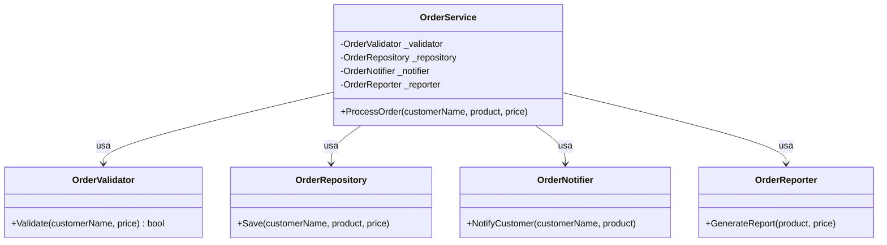
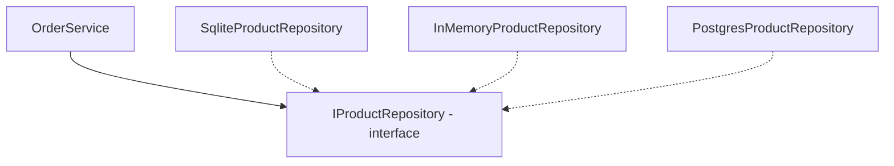
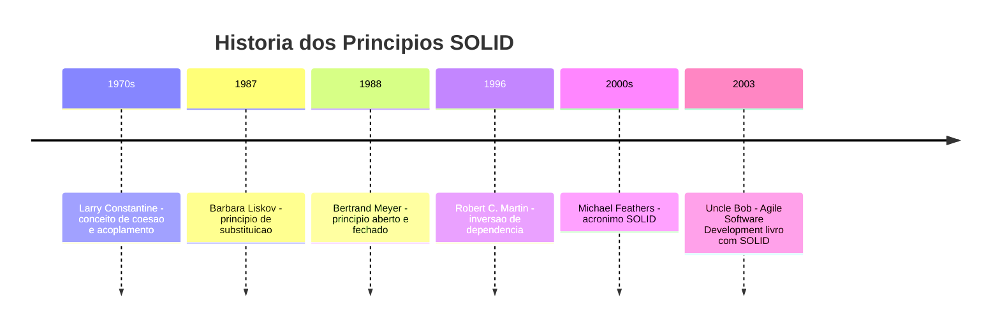

# 9.10 — Princípios SOLID: Código que Dura

[← Anterior: Design Pattern: Repository](cap09-mod09-patterns-repository-conteudo.md) · [Próximo: Projeto Biblioteca →](cap09-mod11-projeto-biblioteca-conteudo.md)

---

## Introdução

Nos módulos anteriores, você aprendeu classes, encapsulamento, interfaces, herança, polimorfismo e dois design patterns (Factory e Repository). Agora vamos dar um passo atrás e olhar para os **princípios** que guiam todas essas decisões de design.

SOLID é um acrônimo para cinco princípios de design orientado a objetos, formulados por Robert C. Martin (conhecido como "Uncle Bob") nos anos 2000. Esses princípios não são regras absolutas — são guias que ajudam a criar código mais organizado, flexível e fácil de manter.

O interessante é que você já aplicou vários desses princípios sem saber. Quando usamos interfaces no módulo 9.6, estávamos aplicando o princípio de Inversão de Dependência. Quando criamos o Factory no módulo 9.8, estávamos aplicando o princípio Aberto/Fechado. Agora vamos dar nome a essas práticas.

Este módulo é mais conceitual que os anteriores — menos código novo, mais análise e reflexão sobre o código que já escrevemos. Mas é fundamental: SOLID é o vocabulário que todo desenvolvedor profissional usa para discutir qualidade de código.

---

## Como Executar os Exemplos Deste Módulo

Substitua o conteúdo de `Program.cs` pelo código do exemplo e execute com `dotnet run`.

---

## Os Cinco Princípios

| Letra | Princípio | Em inglês | Ideia central |
|-------|-----------|-----------|---------------|
| S | Responsabilidade Única | Single Responsibility | Cada classe faz UMA coisa |
| O | Aberto/Fechado | Open/Closed | Aberto para extensão, fechado para modificação |
| L | Substituição de Liskov | Liskov Substitution | Subclasses substituem a base sem quebrar |
| I | Segregação de Interfaces | Interface Segregation | Interfaces pequenas e focadas |
| D | Inversão de Dependência | Dependency Inversion | Depender de abstrações, não de implementações |

Vamos ver cada um com exemplos práticos em C#.

---

## S — Single Responsibility Principle (Responsabilidade Única)

**Cada classe deve ter apenas UMA razão para mudar.**

Isso significa que cada classe deve ter uma única responsabilidade — fazer uma coisa e fazer bem.

### Violação do SRP

```csharp
// VIOLAÇÃO — classe faz coisas demais
// "OrderProcessor" = Processador de Pedidos
class OrderProcessor
{
    public void ProcessOrder(string customerName, string product, decimal price)
    {
        // Responsabilidade 1: Validar dados
        if (string.IsNullOrEmpty(customerName))
            throw new ArgumentException("Nome do cliente é obrigatório");
        if (price <= 0)
            throw new ArgumentException("Preço deve ser positivo");

        // Responsabilidade 2: Salvar no banco
        Console.WriteLine($"Salvando pedido no banco: {customerName} — {product}");

        // Responsabilidade 3: Enviar email
        Console.WriteLine($"Enviando email para {customerName}: Pedido confirmado!");

        // Responsabilidade 4: Gerar relatório
        Console.WriteLine($"Gerando relatório: {product} — R${price:F2}");
    }
}
```

Saída esperada: nenhuma (é apenas a definição)

Essa classe tem 4 responsabilidades. Se mudar a forma de enviar email, precisa alterar essa classe. Se mudar o banco de dados, precisa alterar essa classe. Se mudar o formato do relatório, precisa alterar essa classe. Qualquer mudança em qualquer área afeta a mesma classe.

### Aplicando o SRP

```csharp
// CORRETO — cada classe com uma responsabilidade

// Responsabilidade: validar dados do pedido
class OrderValidator
{
    public bool Validate(string customerName, decimal price)
    {
        if (string.IsNullOrEmpty(customerName))
        {
            Console.WriteLine("Erro: Nome do cliente é obrigatório");
            return false;
        }
        if (price <= 0)
        {
            Console.WriteLine("Erro: Preço deve ser positivo");
            return false;
        }
        return true;
    }
}

// Responsabilidade: persistir pedidos
class OrderRepository
{
    public void Save(string customerName, string product, decimal price)
    {
        Console.WriteLine($"[DB] Pedido salvo: {customerName} — {product} — R${price:F2}");
    }
}

// Responsabilidade: enviar notificações
class OrderNotifier
{
    public void NotifyCustomer(string customerName, string product)
    {
        Console.WriteLine($"[EMAIL] {customerName}: Seu pedido de {product} foi confirmado!");
    }
}

// Responsabilidade: gerar relatórios
class OrderReporter
{
    public void GenerateReport(string product, decimal price)
    {
        Console.WriteLine($"[REPORT] {product} — R${price:F2}");
    }
}

// Orquestrador — coordena as classes, cada uma faz sua parte
class OrderService
{
    private OrderValidator _validator = new();
    private OrderRepository _repository = new();
    private OrderNotifier _notifier = new();
    private OrderReporter _reporter = new();

    public void ProcessOrder(string customerName, string product, decimal price)
    {
        if (!_validator.Validate(customerName, price)) return;

        _repository.Save(customerName, product, price);
        _notifier.NotifyCustomer(customerName, product);
        _reporter.GenerateReport(product, price);

        Console.WriteLine("Pedido processado com sucesso!");
    }
}

// Usando
var service = new OrderService();
service.ProcessOrder("Maria", "Notebook", 3500);
```

Saída esperada:
```
[DB] Pedido salvo: Maria — Notebook — R$3500.00
[EMAIL] Maria: Seu pedido de Notebook foi confirmado!
[REPORT] Notebook — R$3500.00
Pedido processado com sucesso!
```

Agora cada classe tem uma única responsabilidade. Mudar o email? Altera só `OrderNotifier`. Mudar o banco? Altera só `OrderRepository`. Nenhuma mudança afeta as outras classes.

Veja como o SRP organiza as responsabilidades em classes separadas:



---

## O — Open/Closed Principle (Aberto/Fechado)

**Classes devem ser abertas para extensão e fechadas para modificação.**

Isso significa que você deve poder adicionar funcionalidades novas sem alterar o código existente. Interfaces e Factory são as ferramentas principais para isso.

### Violação do OCP

```csharp
// VIOLAÇÃO — para adicionar novo tipo, precisa modificar a classe
class DiscountCalculator
{
    public decimal Calculate(string customerType, decimal price)
    {
        if (customerType == "regular")
            return price * 0.05m;  // 5% de desconto
        else if (customerType == "premium")
            return price * 0.10m;  // 10% de desconto
        else if (customerType == "vip")
            return price * 0.20m;  // 20% de desconto
        // Para adicionar "employee" (funcionário), precisa MODIFICAR esta classe
        return 0;
    }
}
```

### Aplicando o OCP

```csharp
// CORRETO — aberto para extensão via interface
interface IDiscountStrategy
{
    decimal Calculate(decimal price);
    string GetCustomerType();
}

class RegularDiscount : IDiscountStrategy
{
    public decimal Calculate(decimal price) => price * 0.05m;
    public string GetCustomerType() => "Regular";
}

class PremiumDiscount : IDiscountStrategy
{
    public decimal Calculate(decimal price) => price * 0.10m;
    public string GetCustomerType() => "Premium";
}

class VipDiscount : IDiscountStrategy
{
    public decimal Calculate(decimal price) => price * 0.20m;
    public string GetCustomerType() => "VIP";
}

// Para adicionar "Employee", basta criar nova classe — sem modificar nada existente!
class EmployeeDiscount : IDiscountStrategy
{
    public decimal Calculate(decimal price) => price * 0.30m;
    public string GetCustomerType() => "Funcionário";
}

// Usando
List<IDiscountStrategy> strategies = new()
{
    new RegularDiscount(),
    new PremiumDiscount(),
    new VipDiscount(),
    new EmployeeDiscount()
};

decimal price = 1000m;
foreach (var strategy in strategies)
{
    decimal discount = strategy.Calculate(price);
    Console.WriteLine($"{strategy.GetCustomerType()}: R${price:F2} — Desconto: R${discount:F2} — Final: R${price - discount:F2}");
}
```

Saída esperada:
```
Regular: R$1000.00 — Desconto: R$50.00 — Final: R$950.00
Premium: R$1000.00 — Desconto: R$100.00 — Final: R$900.00
VIP: R$1000.00 — Desconto: R$200.00 — Final: R$800.00
Funcionário: R$1000.00 — Desconto: R$300.00 — Final: R$700.00
```

O Factory Pattern que aprendemos no módulo 9.8 é uma aplicação direta do OCP.

---

## L — Liskov Substitution Principle (Substituição de Liskov)

**Subclasses devem poder substituir suas classes base sem quebrar o programa.**

Nomeado em homenagem a Barbara Liskov, cientista da computação que formulou o princípio em 1987. A ideia é: se você tem código que funciona com a classe base, ele deve continuar funcionando com qualquer classe derivada.

### Violação do LSP

```csharp
// VIOLAÇÃO — Square quebra o contrato de Rectangle
class Rectangle
{
    public virtual int Width { get; set; }
    public virtual int Height { get; set; }

    public int CalculateArea() => Width * Height;
}

class Square : Rectangle
{
    // Square força Width == Height, quebrando o comportamento esperado
    public override int Width
    {
        get => base.Width;
        set { base.Width = value; base.Height = value; }
    }

    public override int Height
    {
        get => base.Height;
        set { base.Height = value; base.Width = value; }
    }
}

// Este código funciona com Rectangle mas QUEBRA com Square
Rectangle rect = new Square();
rect.Width = 5;
rect.Height = 10;
// Esperado: área = 50 (5 * 10)
// Real: área = 100 (10 * 10) — porque Square forçou Width = Height!
Console.WriteLine($"Área: {rect.CalculateArea()}");  // 100, não 50!
```

Saída esperada:
```
Área: 100
```

O código esperava que mudar Height não afetasse Width. Square viola essa expectativa. A solução é não fazer Square herdar de Rectangle — use uma interface `IShape` em vez disso.

---

## I — Interface Segregation Principle (Segregação de Interfaces)

**Nenhuma classe deve ser forçada a implementar métodos que não usa.**

Interfaces devem ser pequenas e focadas. Uma interface grande com muitos métodos força implementações a ter métodos vazios ou que lançam exceções.

### Violação do ISP

```csharp
// VIOLAÇÃO — interface muito grande
interface IWorker
{
    void Work();
    void Eat();
    void Sleep();
    void TakeVacation();
}

// Robô não come, não dorme e não tira férias!
class Robot : IWorker
{
    public void Work() => Console.WriteLine("Robô trabalhando...");
    public void Eat() => throw new NotImplementedException();      // Não faz sentido!
    public void Sleep() => throw new NotImplementedException();    // Não faz sentido!
    public void TakeVacation() => throw new NotImplementedException(); // Não faz sentido!
}
```

### Aplicando o ISP

```csharp
// CORRETO — interfaces pequenas e focadas
interface IWorkable
{
    void Work();
}

interface IFeedable
{
    void Eat();
}

interface IRestable
{
    void Sleep();
    void TakeVacation();
}

// Humano implementa todas
class Human : IWorkable, IFeedable, IRestable
{
    public void Work() => Console.WriteLine("Humano trabalhando...");
    public void Eat() => Console.WriteLine("Humano almoçando...");
    public void Sleep() => Console.WriteLine("Humano dormindo...");
    public void TakeVacation() => Console.WriteLine("Humano de férias!");
}

// Robô implementa apenas o que faz sentido
class Robot : IWorkable
{
    public void Work() => Console.WriteLine("Robô trabalhando 24/7...");
}

// Usando
IWorkable worker1 = new Human();
IWorkable worker2 = new Robot();
worker1.Work();
worker2.Work();
```

Saída esperada:
```
Humano trabalhando...
Robô trabalhando 24/7...
```

---

## D — Dependency Inversion Principle (Inversão de Dependência)

**Dependa de abstrações, não de implementações concretas.**

Este é o princípio que conecta tudo: interfaces, Factory e Repository. Em vez de uma classe depender diretamente de outra classe concreta, ela depende de uma interface. A implementação concreta é "injetada" de fora.

### Violação do DIP

```csharp
// VIOLAÇÃO — depende diretamente da implementação concreta
class OrderService
{
    // Depende DIRETAMENTE de SqliteRepository — acoplamento forte
    private SqliteProductRepository _repository = new SqliteProductRepository("dados.db");

    public void CreateOrder(string product)
    {
        _repository.Save(product);
    }
}
// Se quiser trocar para PostgreSQL ou testar com memória, precisa ALTERAR esta classe
```

### Aplicando o DIP

```csharp
// CORRETO — depende da abstração (interface)
class OrderService
{
    // Depende da INTERFACE — desacoplamento
    private IProductRepository _repository;

    // A implementação é injetada via construtor
    public OrderService(IProductRepository repository)
    {
        _repository = repository;
    }

    public void CreateOrder(string product)
    {
        _repository.Save(product);
    }
}

// Em produção:
var prodService = new OrderService(new SqliteProductRepository("dados.db"));

// Em testes:
var testService = new OrderService(new InMemoryProductRepository());
```

Isso é exatamente o que fizemos no módulo 9.9 com o Repository Pattern. O `OrderService` não sabe (nem precisa saber) se está usando SQLite, PostgreSQL ou memória. Ele depende da abstração `IProductRepository`.



---

## SOLID na Prática: Tudo Conectado

Os cinco princípios se complementam e se conectam com tudo que aprendemos neste capítulo:

| Princípio | O que fizemos nos módulos anteriores | Módulo |
|-----------|-------------------------------------|--------|
| S — Responsabilidade Única | Repository cuida de dados, Service cuida de regras | 9.9 |
| O — Aberto/Fechado | Factory permite adicionar tipos sem modificar código | 9.8 |
| L — Substituição de Liskov | InMemoryRepository substitui SqliteRepository sem quebrar | 9.9 |
| I — Segregação de Interfaces | IProductRepository tem apenas métodos de acesso a dados | 9.6, 9.9 |
| D — Inversão de Dependência | Service depende de IRepository, não de SqliteRepository | 9.9 |

Você já estava aplicando SOLID sem saber. Agora tem o vocabulário para explicar POR QUE essas decisões são boas.

### Como SOLID se Conecta com o Projeto Final

No módulo 9.11, vamos construir um Sistema de Biblioteca. Vamos aplicar SOLID conscientemente:

- **SRP**: Classes separadas para domínio (Book, Member), repositórios (IBookRepository), serviços (LibraryService) e interface CLI
- **OCP**: Novos tipos de empréstimo ou regras podem ser adicionados via novas classes
- **LSP**: InMemoryRepository e SqliteRepository são intercambiáveis
- **ISP**: Interfaces focadas para cada tipo de repositório
- **DIP**: Services dependem de interfaces, não de implementações concretas

Essa é a forma profissional de organizar código. É assim que sistemas reais são construídos em empresas.

A beleza do SOLID é que não são regras novas — são nomes para práticas que naturalmente emergem quando você programa com OOP de forma cuidadosa.

Vamos ver como isso se materializa no projeto final.

### Checklist SOLID para Code Review

Quando revisar código (seu ou de outros), use este checklist:

| Pergunta | Princípio | Se a resposta for "sim", há problema |
|----------|-----------|--------------------------------------|
| Esta classe faz mais de uma coisa? | SRP | Dividir em classes menores |
| Preciso modificar código existente para adicionar funcionalidade? | OCP | Usar interface + Factory |
| Uma subclasse quebra o comportamento esperado da base? | LSP | Repensar a hierarquia |
| Uma classe implementa métodos que não usa? | ISP | Dividir a interface |
| Uma classe cria suas próprias dependências internamente? | DIP | Injetar via construtor |

---

## SOLID Não é Dogma

Um aviso importante: SOLID são guias, não regras absolutas. Aplicar SOLID em excesso pode levar a over-engineering — código com tantas abstrações que fica mais difícil de entender do que o problema original.

### A História do SOLID

Os princípios SOLID não surgiram todos de uma vez. Foram formulados ao longo de décadas por diferentes pessoas:

- **SRP** — Robert C. Martin formalizou nos anos 2000, mas a ideia vem do conceito de "coesão" de Larry Constantine (anos 1970)
- **OCP** — Bertrand Meyer formulou em 1988 no livro "Object-Oriented Software Construction"
- **LSP** — Barbara Liskov formulou em 1987 em uma conferência acadêmica
- **ISP** — Robert C. Martin formulou nos anos 1990 trabalhando em um projeto para Xerox
- **DIP** — Robert C. Martin formulou em 1996

O acrônimo SOLID foi cunhado por Michael Feathers nos anos 2000, organizando os cinco princípios em uma sequência memorável.



### Equilíbrio é a Chave

Use SOLID quando:
- O projeto é médio a grande
- Múltiplas pessoas trabalham no código
- O código precisa ser testável
- O sistema vai crescer e mudar

Não se preocupe com SOLID quando:
- É um script de 50 linhas
- É um protótipo descartável
- A simplicidade é mais importante que a flexibilidade

---

## Como a IA pode te ajudar aqui
**Prompt 1 — Listar e descobrir:**
> "Análise este código e identifique quais princípios SOLID estão sendo violados. Sugira refatorações."

**Prompt 2 — Aprofundar o tema:**
> "Refatore esta classe para seguir o princípio de Responsabilidade Única."

**Prompt 3 — Ver exemplos práticos:**
> "Dê um exemplo prático do princípio [X] do SOLID em um sistema de [domínio]."

---

## Casos de Uso no Mundo Real

### Microserviços e SOLID

Empresas como Netflix, Uber e Spotify organizam seus sistemas em microserviços — cada serviço com uma única responsabilidade (SRP). Os serviços se comunicam via interfaces (contratos de API), não via implementação interna (DIP). Novos serviços podem ser adicionados sem alterar os existentes (OCP).

### Frameworks e Bibliotecas

O ASP.NET Core é um exemplo de SOLID em ação. Controllers têm responsabilidade única (SRP). Middleware pode ser adicionado sem alterar o framework (OCP). Services são injetados via interface (DIP). Cada interface é focada (ISP).

### Testes Automatizados

Empresas que praticam TDD (Test-Driven Development) dependem fortemente de SOLID. Sem DIP (inversão de dependência), é impossível criar mocks para testes. Sem SRP, testes ficam complexos porque cada classe faz muitas coisas. SOLID é a base que torna código testável.

### Plugins e Extensões

Editores como VSCode e navegadores como Chrome usam o princípio OCP extensivamente. O editor/navegador é "fechado para modificação" (você não altera o código-fonte), mas "aberto para extensão" (você instala plugins/extensões que adicionam funcionalidades). Cada extensão implementa uma interface definida pelo editor, e o editor carrega e executa as extensões sem saber os detalhes de cada uma. É OCP + DIP em ação.

### Sistemas de E-commerce

Em plataformas como Shopify e Magento, cada módulo segue SRP: módulo de catálogo cuida de produtos, módulo de checkout cuida de pagamentos, módulo de shipping cuida de entregas. Novos métodos de pagamento são adicionados como plugins (OCP). O sistema core depende de interfaces, não de implementações específicas de gateway de pagamento (DIP). Essa arquitetura permite que milhares de lojas usem a mesma plataforma com configurações completamente diferentes.

---

## Resumo do Módulo

| Princípio | Definição curta |
|-----------|----------------|
| S — Single Responsibility | Cada classe faz UMA coisa |
| O — Open/Closed | Extensível sem modificar código existente |
| L — Liskov Substitution | Subclasses substituem a base sem quebrar |
| I — Interface Segregation | Interfaces pequenas e focadas |
| D — Dependency Inversion | Depender de abstrações, não de concretos |

---

## Glossário do Módulo

| Termo | Definição |
|-------|-----------|
| Acoplamento (Coupling) | Grau de dependência entre classes |
| Barbara Liskov | Cientista da computação que formulou o princípio de substituição |
| Dependency Injection (DI) | Técnica de passar dependências via construtor ou parâmetro |
| DIP (Dependency Inversion) | Depender de abstrações, não de implementações |
| ISP (Interface Segregation) | Interfaces pequenas e focadas |
| LSP (Liskov Substitution) | Subclasses devem substituir a base sem quebrar |
| OCP (Open/Closed) | Aberto para extensão, fechado para modificação |
| Over-engineering | Adicionar complexidade desnecessária |
| Robert C. Martin (Uncle Bob) | Engenheiro que formulou os princípios SOLID |
| SOLID | Acrônimo para cinco princípios de design OOP |
| SRP (Single Responsibility) | Cada classe tem uma única responsabilidade |
| Strategy Pattern | Pattern comportamental usado para implementar OCP |
| Clean Code | Conjunto de práticas para escrever código legível e manutenível |
| Code Review | Prática de revisar código de outros desenvolvedores |
| Coesão (Cohesion) | Grau em que os membros de uma classe estão relacionados entre si |
| Mock | Objeto simulado usado em testes para substituir dependências reais |
| TDD (Test-Driven Development) | Prática de escrever testes antes do código |
| Refatoração (Refactoring) | Melhorar a estrutura do código sem alterar seu comportamento |

---

## Na Cultura Popular

- **O Senhor dos Anéis** (filmes/livros) — a Sociedade do Anel é um exemplo de SRP: cada membro tem uma responsabilidade específica (Gandalf guia, Aragorn lidera, Legolas atira, Gimli luta corpo a corpo). Quando cada um faz sua parte, o grupo funciona.
- **Os Vingadores** (filmes) — cada herói tem uma especialidade (SRP), mas todos seguem o mesmo "contrato" de ser um Vingador (interface). Novos heróis podem entrar no time sem mudar os existentes (OCP).

---

## Para Saber Mais

- [Refactoring Guru — SOLID](https://refactoring.guru/pt-br/design-patterns) — *Explicação visual dos princípios SOLID em português*
- [Microsoft Learn — .NET Architecture](https://learn.microsoft.com/en-us/dotnet/architecture/) — *Guias de arquitetura que aplicam SOLID*
- [Source Making — SOLID](https://sourcemaking.com/design_patterns) — *Exemplos práticos de cada princípio*
- [Tim Corey — SOLID Principles](https://www.youtube.com/@IAmTimCorey) — *Série de vídeos sobre SOLID em C# com exemplos práticos*
- [Clean Code — Robert C. Martin](https://www.oreilly.com/library/view/clean-code-a/9780136083238/) — *Livro referência sobre código limpo, inclui SOLID e muito mais*
- [Fabio Akita — SOLID](https://www.youtube.com/@Akitando) — *Vídeos em português sobre princípios de design e arquitetura*

---

## Perguntas Frequentes (FAQ)

**P: Preciso aplicar todos os 5 princípios em todo código?**
R: Não. SOLID são guias, não regras. Aplique quando fizer sentido. Em um script pequeno, SRP pode ser suficiente. Em um sistema grande, todos os 5 são relevantes.

**P: SOLID é só para OOP?**
R: Os princípios foram formulados para OOP, mas as ideias se aplicam a qualquer paradigma. SRP (responsabilidade única) e DIP (depender de abstrações) são úteis em qualquer estilo de programação.

**P: Qual princípio é o mais importante?**
R: Depende de quem você pergunta, mas muitos consideram SRP (Responsabilidade Única) o mais fundamental. Se cada classe faz uma coisa, o código naturalmente fica mais organizado.

**P: SOLID e design patterns são a mesma coisa?**
R: Não. SOLID são princípios (guias de design). Patterns são soluções concretas. Patterns frequentemente implementam princípios SOLID — Factory implementa OCP, Repository implementa DIP — mas são conceitos diferentes.

**P: O que é Dependency Injection?**
R: É a técnica de passar dependências via construtor (ou parâmetro) em vez de criar dentro da classe. É a forma prática de aplicar DIP. Quando fazemos `new OrderService(repository)`, estamos injetando a dependência.

**P: SOLID torna o código mais complexo?**
R: Pode, se aplicado em excesso. Mais classes, mais interfaces, mais indireção. O segredo é equilíbrio: aplique SOLID onde a complexidade do problema justifica. Não aplique em código simples que não vai crescer.

**P: Quem é Uncle Bob?**
R: Robert C. Martin, engenheiro de software americano, autor de livros como "Clean Code", "Clean Architecture" e "The Clean Coder". Ele formulou os princípios SOLID e é uma das vozes mais influentes em design de software.

**P: SOLID é cobrado em entrevistas de emprego?**
R: Sim, frequentemente. Perguntas sobre SOLID são comuns em entrevistas para desenvolvedores plenos e seniores. Saber explicar cada princípio com exemplos práticos é um diferencial.

**P: Existe relação entre SOLID e Clean Code?**
R: Sim. Clean Code (código limpo) é um conceito mais amplo que inclui SOLID, mas também cobre nomes significativos, funções pequenas, comentários úteis e formatação consistente. SOLID foca especificamente em design de classes e interfaces. O livro "Clean Code" de Robert C. Martin cobre ambos.

**P: Como saber se estou aplicando SOLID demais?**
R: Se o código tem mais interfaces do que classes concretas, se cada classe tem apenas 1 método, ou se você precisa navegar por 10 arquivos para entender um fluxo simples — provavelmente está exagerando. O código deve ser simples de entender. Se SOLID está tornando o código mais confuso, reduza.

**P: SOLID funciona com linguagens funcionais?**
R: Os princípios foram formulados para OOP, mas as ideias se adaptam. SRP se aplica a funções (cada função faz uma coisa). OCP se aplica a módulos. DIP se aplica a dependências entre módulos. A forma de implementar muda, mas os conceitos são universais.

**P: Qual a relação entre SOLID e design patterns?**
R: Design patterns são soluções concretas que frequentemente implementam princípios SOLID. Factory implementa OCP. Repository implementa DIP e SRP. Strategy implementa OCP. Observer implementa DIP. Patterns são a "prática" dos princípios SOLID.

---

## Exercícios Práticos

### Exercício 1: Identificar Violações

Para cada trecho de código, identifique qual princípio SOLID está sendo violado e proponha uma refatoração.

### Exercício 2: Refatorar com SRP

Pegue uma classe grande que faz múltiplas coisas e divida em classes menores, cada uma com uma responsabilidade.

### Exercício 3: Aplicar OCP

Crie um sistema de cálculo de frete com interface `IShippingCalculator` e implementações para Correios, Transportadora e Motoboy. Demonstre que adicionar um novo tipo não altera código existente.

### Exercício 4: Aplicar DIP

Refatore o código abaixo para usar inversão de dependência:

```csharp
// Código acoplado — refatore!
class ReportService
{
    private SqliteDatabase _db = new SqliteDatabase("reports.db");
    private EmailSender _email = new EmailSender();

    public void GenerateAndSend(string reportName)
    {
        var data = _db.Query("SELECT * FROM reports");
        // ... gera relatório ...
        _email.Send("admin@empresa.com", "Relatório pronto");
    }
}
```

O código refatorado deve receber as dependências via construtor usando interfaces.

### Exercício 5: Aplicar ISP

A interface abaixo é muito grande. Divida em interfaces menores e focadas:

```csharp
interface IAnimal
{
    void Walk();
    void Swim();
    void Fly();
    void Eat();
    void Sleep();
    void Hibernate();
    void LayEggs();
    void GiveMilk();
}
```

Quais animais implementariam quais interfaces? (Cachorro, Pato, Baleia, Morcego)

### Exercício 6: SOLID no CRUD

Análise o CRUD do capítulo 8 e identifique:
1. Quais princípios SOLID são violados?
2. Como o Repository Pattern (módulo 9.9) resolve algumas dessas violações?
3. Que outras refatorações seriam necessárias para tornar o código mais SOLID?

### Exercício 7: Código Review com SOLID

Para cada classe abaixo, identifique TODOS os princípios SOLID violados:

```csharp
class UserManager
{
    public void CreateUser(string name, string email, string password)
    {
        // Valida dados
        if (string.IsNullOrEmpty(name)) throw new Exception("Nome vazio");
        if (!email.Contains("@")) throw new Exception("Email inválido");
        if (password.Length < 8) throw new Exception("Senha curta");

        // Salva no banco
        Console.WriteLine($"INSERT INTO users VALUES ('{name}', '{email}', '{password}')");

        // Envia email de boas-vindas
        Console.WriteLine($"Enviando email para {email}: Bem-vindo!");

        // Registra log
        Console.WriteLine($"[LOG] Usuário {name} criado em {DateTime.Now}");

        // Atualiza cache
        Console.WriteLine($"[CACHE] Adicionando {name} ao cache");
    }
}
```

Quantas responsabilidades essa classe tem? Como você dividiria?

### Exercício 8: Quiz SOLID

Para cada afirmação, diga se é verdadeira ou falsa e justifique:

1. "Uma classe com 10 métodos viola o SRP" — V ou F?
2. "Usar if/else para decidir qual classe criar viola o OCP" — V ou F?
3. "Se uma subclasse lança exceção em um método herdado, viola o LSP" — V ou F?
4. "Uma interface com 1 método é melhor que uma com 5" — V ou F?
5. "Dependency Injection é a mesma coisa que Dependency Inversion" — V ou F?
6. "SOLID deve ser aplicado em todo código, sempre" — V ou F?
7. "Factory Pattern implementa o princípio Open/Closed" — V ou F?
8. "Repository Pattern implementa o princípio Dependency Inversion" — V ou F?

### Exercício 9: Refatoração Completa

Pegue o sistema de contatos do módulo 9.4 e refatore aplicando todos os princípios SOLID que fizerem sentido. Documente cada mudança e qual princípio motivou.

### Exercício 10: Reflexão

Escreva um parágrafo respondendo: "Qual princípio SOLID você considera mais importante e por quê?" Use exemplos dos módulos anteriores para justificar.

### Exercício 11: Mapa Mental SOLID

Crie um mapa mental com SOLID no centro e para cada princípio:
- Definição em uma frase
- Um exemplo de violação
- Um exemplo de aplicação correta
- Qual pattern ou técnica implementa esse princípio

### Exercício 12: SOLID no Dia a Dia

Para cada situação do dia a dia, identifique qual princípio SOLID se aplica:

1. Um restaurante onde o garçom anota pedidos, cozinha, serve e cobra — tudo sozinho
2. Uma tomada universal que aceita qualquer tipo de plugue
3. Um controle remoto com 50 botões, dos quais você usa apenas 5
4. Uma receita de bolo que funciona tanto no forno elétrico quanto no a gás
5. Um carro onde trocar o rádio exige desmontar o painel inteiro

### Exercício 13: Antes e Depois

Escolha uma das classes que você criou nos exercícios dos módulos anteriores (9.4 a 9.9). Análise-a sob a ótica de cada princípio SOLID. Identifique pelo menos uma melhoria possível e implemente-a. Documente: qual princípio motivou a mudança e o que melhorou.

---

[← Anterior: Design Pattern: Repository](cap09-mod09-patterns-repository-conteudo.md) · [Próximo: Projeto Biblioteca →](cap09-mod11-projeto-biblioteca-conteudo.md)
