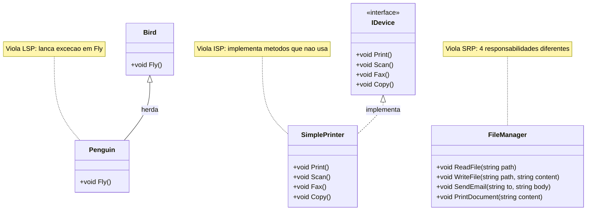

# 9.10 — Exercícios: Princípios SOLID

[← Voltar ao conteúdo: SOLID](cap09-mod10-solid-conteudo.md)

---

## Sobre Estes Exercícios

Estes exercícios praticam identificação de violações SOLID, refatoração e aplicação dos princípios em código C#.

---

## Exercício 1 — Identificar Violações

Para cada classe, identifique qual princípio SOLID é violado:

```csharp
// Classe A
class FileManager
{
    public void ReadFile(string path) { }
    public void WriteFile(string path, string content) { }
    public void SendEmail(string to, string body) { }
    public void PrintDocument(string content) { }
}

// Classe B
class Bird { public virtual void Fly() { } }
class Penguin : Bird { public override void Fly() { throw new Exception("Não voo!"); } }

// Classe C
interface IDevice { void Print(); void Scan(); void Fax(); void Copy(); }
class SimplePrinter : IDevice
{
    public void Print() { }
    public void Scan() { throw new NotImplementedException(); }
    public void Fax() { throw new NotImplementedException(); }
    public void Copy() { throw new NotImplementedException(); }
}
```

Diagrama de classes das 3 violacoes SOLID:



---

## Exercício 2 — Refatorar com SRP

Divida a classe abaixo em classes menores com responsabilidade única:

```csharp
class StudentManager
{
    public void RegisterStudent(string name, string email) { }
    public void CalculateGrade(int studentId) { }
    public void SendGradeEmail(int studentId) { }
    public void GenerateTranscript(int studentId) { }
    public void SaveToDatabase(object data) { }
}
```

---

## Exercício 3 — Aplicar OCP

Crie `IShippingCalculator` com `decimal Calculate(decimal weight, string destination)`. Implemente para Correios, Transportadora e Motoboy. Demonstre que adicionar Drone não altera código existente.

---

## Exercício 4 — Aplicar DIP

Refatore para usar inversão de dependência:

```csharp
class NotificationService
{
    private SmtpEmailSender _sender = new SmtpEmailSender();
    public void Notify(string message) { _sender.Send("admin@x.com", message); }
}
```

---

## Exercício 5 — Aplicar ISP

Divida em interfaces menores: `interface IAnimal { Walk(); Swim(); Fly(); Eat(); Sleep(); Hibernate(); LayEggs(); GiveMilk(); }`. Quais interfaces Cachorro, Pato, Baleia e Morcego implementariam?

---

## Exercício 6 — Quiz SOLID (V ou F)

1. "Classe com 10 métodos viola SRP" 2. "if/else para criar objetos viola OCP" 3. "Subclasse que lança exceção em método herdado viola LSP" 4. "Interface com 1 método é sempre melhor que com 5" 5. "DI é igual a DIP" 6. "SOLID deve ser aplicado sempre" 7. "Factory implementa OCP" 8. "Repository implementa DIP"

---

## Exercício 7 — SOLID no CRUD do Cap 8

Análise o CRUD do capítulo 8: quais princípios são violados? Como Repository resolve? Que outras refatorações seriam necessárias?

---

## Exercício 8 — Code Review

Identifique TODOS os princípios violados na classe `UserManager` do módulo. Quantas responsabilidades ela tem? Como dividiria?

---

## Exercício 9 — SOLID no Dia a Dia

Identifique qual princípio se aplica: 1. Garçom que faz tudo sozinho 2. Tomada universal 3. Controle com 50 botões 4. Receita que funciona em qualquer forno 5. Trocar rádio exige desmontar painel

---

## Exercício 10 — Refatoração Completa

Escolha uma classe dos módulos anteriores, análise sob SOLID, identifique melhorias e implemente. Documente qual princípio motivou cada mudança.


---

## Exercicio 5 — Identificar Violacoes SOLID — Nivel: Intermediario

### Enunciado

Analise o codigo abaixo e identifique quais principios SOLID estao sendo violados. Para cada violacao, explique o problema e sugira como corrigir.

```
class UserManager:
    - SaveToDatabase(user)
    - SendWelcomeEmail(user)
    - GenerateReport(users)
    - ValidatePassword(password)
    - LogAction(action)
```

### Dicas

1. Conte quantas responsabilidades a classe tem
2. SRP diz que uma classe deve ter apenas uma razao para mudar
3. Cada grupo de metodos relacionados deveria ser uma classe separada
4. Pense: se mudar o formato do email, preciso mexer no UserManager?

### Proposta de Teste

Identifique pelo menos 3 violacoes e proponha classes separadas para cada responsabilidade.

---

## Exercicio 6 — Aplicar OCP na Pratica — Nivel: Avancado

### Enunciado

Voce tem um sistema de calculo de desconto que usa if/else para cada tipo de cliente. Refatore para usar o principio Open/Closed: crie uma interface `IDiscountStrategy` e implemente `RegularDiscount`, `VipDiscount` e `EmployeeDiscount`. O sistema deve aceitar novos tipos de desconto sem modificar codigo existente.

### Dicas

1. Interface: `IDiscountStrategy` com metodo `Calculate(double price)`
2. Cada implementacao retorna o preco com desconto aplicado
3. O servico recebe a estrategia como parametro — nao decide internamente
4. Para adicionar um novo tipo, basta criar nova classe — sem tocar no servico

### Proposta de Teste

- Regular: 10% de desconto
- VIP: 20% de desconto
- Employee: 30% de desconto
- Adicionar "StudentDiscount" (15%) sem modificar nenhuma classe existente

---

[← Voltar ao conteúdo: SOLID](cap09-mod10-solid-conteudo.md)
