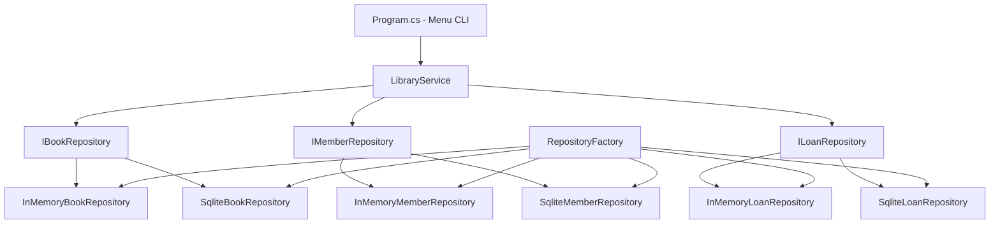
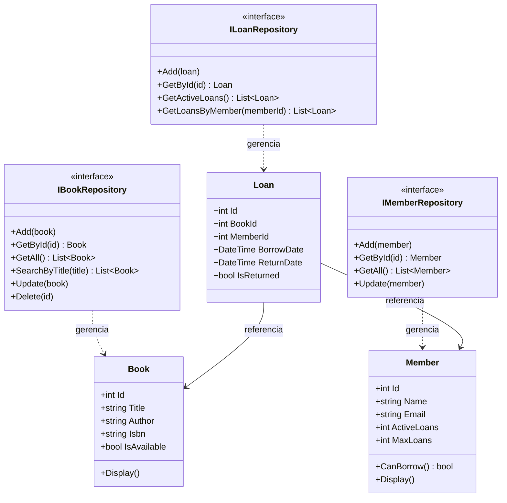

# 9.11 — Projeto: Sistema de Biblioteca OOP Completo

[← Anterior: Princípios SOLID](cap09-mod10-solid-conteudo.md) · [Próximo: Capítulo 10 — Arquitetura de Software →](cap10-mod01-por-que-arquitetura-conteudo.md)

---

## Introdução

Chegamos ao projeto final do capítulo 9. Ao longo dos 10 módulos anteriores, você aprendeu a transição de procedural para OOP, conheceu C# e .NET, e dominou os conceitos fundamentais: classes, objetos, encapsulamento, interfaces, herança, polimorfismo, Factory, Repository e SOLID.

Agora é hora de juntar tudo em um projeto prático. Vamos construir um **Sistema de Biblioteca** completo em C# que aplica todos os conceitos do capítulo. O projeto é descrito em detalhes no arquivo [projeto-biblioteca.md](../projects/projeto-biblioteca.md).

Este módulo apresenta o projeto, explica cada fase e mostra a arquitetura geral. O código completo e as instruções passo a passo estão no arquivo de projeto.

---

## Visão Geral do Projeto

O Sistema de Biblioteca permite:
- Cadastrar, listar, buscar e remover livros
- Cadastrar, listar e buscar membros
- Realizar empréstimos e devoluções
- Aplicar regras de negócio (limite de empréstimos, verificar disponibilidade)
- Persistir dados (com opção de memória para testes ou SQLite para produção)

### Conceitos Aplicados

| Conceito | Onde aparece no projeto |
|----------|----------------------|
| Classes e Objetos | Book, Member, Loan, Library |
| Encapsulamento | Atributos privados, propriedades controladas |
| Interfaces | IBookRepository, IMemberRepository, ILoanRepository |
| Herança | Não forçada — usada apenas se fizer sentido natural |
| Polimorfismo | Repositories intercambiáveis (InMemory vs SQLite) |
| Factory | RepositoryFactory para criar repositories baseado em config |
| Repository | Abstração de acesso a dados |
| SOLID | SRP nas classes, OCP via interfaces, DIP via injeção |

---

## Arquitetura do Projeto



### Estrutura de Pastas

```
BibliotecaOOP/
├── Program.cs              # Ponto de entrada e menu CLI
├── Models/                 # Classes de domínio
│   ├── Book.cs
│   ├── Member.cs
│   └── Loan.cs
├── Interfaces/             # Contratos
│   ├── IBookRepository.cs
│   ├── IMemberRepository.cs
│   └── ILoanRepository.cs
├── Repositories/           # Implementações
│   ├── InMemory/
│   │   ├── InMemoryBookRepository.cs
│   │   ├── InMemoryMemberRepository.cs
│   │   └── InMemoryLoanRepository.cs
│   └── Sqlite/
│       ├── SqliteBookRepository.cs
│       ├── SqliteMemberRepository.cs
│       └── SqliteLoanRepository.cs
├── Services/               # Lógica de negócio
│   └── LibraryService.cs
└── Factory/                # Criação de repositories
    └── RepositoryFactory.cs
```

---

## Fases do Projeto

O projeto é dividido em 8 fases incrementais. Cada fase constrói sobre a anterior.

### Fase 1: Modelar o Domínio

Criar as classes de domínio com encapsulamento adequado:

```csharp
// Models/Book.cs
// "Book" = Livro
class Book
{
    public int Id { get; }
    public string Title { get; set; }        // "Title" = título
    public string Author { get; set; }       // "Author" = autor
    public string Isbn { get; set; }         // "Isbn" = ISBN (código do livro)
    public bool IsAvailable { get; set; }    // "IsAvailable" = está disponível

    public Book(int id, string title, string author, string isbn)
    {
        Id = id;
        Title = title;
        Author = author;
        Isbn = isbn;
        IsAvailable = true;  // Livro começa disponível
    }

    public void Display()
    {
        string status = IsAvailable ? "Disponível" : "Emprestado";
        Console.WriteLine($"  [{Id}] {Title} — {Author} (ISBN: {Isbn}) [{status}]");
    }
}

// Models/Member.cs
// "Member" = Membro
class Member
{
    public int Id { get; }
    public string Name { get; set; }         // "Name" = nome
    public string Email { get; set; }        // "Email" = e-mail
    public int ActiveLoans { get; set; }     // "ActiveLoans" = empréstimos ativos
    public int MaxLoans { get; } = 3;        // "MaxLoans" = máximo de empréstimos

    public Member(int id, string name, string email)
    {
        Id = id;
        Name = name;
        Email = email;
        ActiveLoans = 0;
    }

    // "CanBorrow" = pode emprestar
    public bool CanBorrow()
    {
        return ActiveLoans < MaxLoans;
    }

    public void Display()
    {
        Console.WriteLine($"  [{Id}] {Name} — {Email} — Empréstimos: {ActiveLoans}/{MaxLoans}");
    }
}

// Models/Loan.cs
// "Loan" = Empréstimo
class Loan
{
    public int Id { get; }
    public int BookId { get; }
    public int MemberId { get; }
    public DateTime BorrowDate { get; }      // "BorrowDate" = data do empréstimo
    public DateTime? ReturnDate { get; set; } // "ReturnDate" = data da devolução
    public bool IsReturned { get; set; }     // "IsReturned" = foi devolvido

    public Loan(int id, int bookId, int memberId)
    {
        Id = id;
        BookId = bookId;
        MemberId = memberId;
        BorrowDate = DateTime.Now;
        IsReturned = false;
    }
}
```

### Fase 2: Definir Interfaces dos Repositories

Veja a estrutura completa do dominio e dos repositories:



```csharp
// Interfaces/IBookRepository.cs
interface IBookRepository
{
    void Add(Book book);
    Book? GetById(int id);
    List<Book> GetAll();
    List<Book> SearchByTitle(string title);
    void Update(Book book);
    void Delete(int id);
}

// Interfaces/IMemberRepository.cs
interface IMemberRepository
{
    void Add(Member member);
    Member? GetById(int id);
    List<Member> GetAll();
    void Update(Member member);
}

// Interfaces/ILoanRepository.cs
interface ILoanRepository
{
    void Add(Loan loan);
    Loan? GetById(int id);
    List<Loan> GetActiveLoans();
    List<Loan> GetLoansByMember(int memberId);
}
```

### Fase 3: Implementar InMemoryRepository

Implementar os repositories usando listas em memória. Isso permite testar toda a lógica sem banco de dados.

```csharp
// Repositories/InMemory/InMemoryBookRepository.cs
class InMemoryBookRepository : IBookRepository
{
    private List<Book> _books = new();

    public void Add(Book book)
    {
        _books.Add(book);
    }

    public Book? GetById(int id)
    {
        return _books.FirstOrDefault(b => b.Id == id);
    }

    public List<Book> GetAll()
    {
        return _books.ToList();  // Retorna cópia para proteger a lista interna
    }

    public List<Book> SearchByTitle(string title)
    {
        return _books.Where(b => b.Title.Contains(title, StringComparison.OrdinalIgnoreCase)).ToList();
    }

    public void Update(Book book)
    {
        // Em memória, o objeto já está atualizado (referência)
        // Em SQLite, precisaria fazer UPDATE no banco
    }

    public void Delete(int id)
    {
        _books.RemoveAll(b => b.Id == id);
    }
}

// Repositories/InMemory/InMemoryMemberRepository.cs
class InMemoryMemberRepository : IMemberRepository
{
    private List<Member> _members = new();

    public void Add(Member member) => _members.Add(member);
    public Member? GetById(int id) => _members.FirstOrDefault(m => m.Id == id);
    public List<Member> GetAll() => _members.ToList();
    public void Update(Member member) { /* referência já atualizada */ }
}

// Repositories/InMemory/InMemoryLoanRepository.cs
class InMemoryLoanRepository : ILoanRepository
{
    private List<Loan> _loans = new();

    public void Add(Loan loan) => _loans.Add(loan);
    public Loan? GetById(int id) => _loans.FirstOrDefault(l => l.Id == id);
    public List<Loan> GetActiveLoans() => _loans.Where(l => !l.IsReturned).ToList();
    public List<Loan> GetLoansByMember(int memberId) => _loans.Where(l => l.MemberId == memberId).ToList();
}
```

Saída esperada: nenhuma (são implementações de interface)

Observe como cada repository é simples — apenas operações de CRUD sobre uma lista. A lógica de negócio (validações, regras) fica no Service, não no Repository. Isso é SRP em ação.

### Fase 4: Implementar o LibraryService

O serviço contém a lógica de negócio — validações, regras e orquestração. Além dos métodos de empréstimo e devolução, o serviço precisa de métodos para adicionar livros, membros e listar dados:

```csharp
// Services/LibraryService.cs — métodos adicionais
class LibraryService
{
    private IBookRepository _bookRepo;
    private IMemberRepository _memberRepo;
    private ILoanRepository _loanRepo;
    private int _nextBookId = 1;
    private int _nextMemberId = 1;
    private int _nextLoanId = 1;

    // Dependency Injection — recebe interfaces, não implementações
    public LibraryService(IBookRepository bookRepo, IMemberRepository memberRepo, ILoanRepository loanRepo)
    {
        _bookRepo = bookRepo;
        _memberRepo = memberRepo;
        _loanRepo = loanRepo;
    }

    // "AddBook" = adicionar livro
    public void AddBook(string title, string author, string isbn)
    {
        if (string.IsNullOrWhiteSpace(title) || string.IsNullOrWhiteSpace(author))
        {
            Console.WriteLine("Título e autor são obrigatórios!");
            return;
        }
        var book = new Book(_nextBookId++, title, author, isbn);
        _bookRepo.Add(book);
        Console.WriteLine($"Livro '{title}' cadastrado com ID {book.Id}!");
    }

    // "AddMember" = adicionar membro
    public void AddMember(string name, string email)
    {
        if (string.IsNullOrWhiteSpace(name))
        {
            Console.WriteLine("Nome é obrigatório!");
            return;
        }
        var member = new Member(_nextMemberId++, name, email);
        _memberRepo.Add(member);
        Console.WriteLine($"Membro '{name}' cadastrado com ID {member.Id}!");
    }

    // "ListBooks" = listar livros
    public void ListBooks()
    {
        var books = _bookRepo.GetAll();
        if (books.Count == 0)
        {
            Console.WriteLine("Nenhum livro cadastrado.");
            return;
        }
        Console.WriteLine($"\n=== Livros ({books.Count}) ===");
        foreach (var book in books) book.Display();
    }

    // "ListMembers" = listar membros
    public void ListMembers()
    {
        var members = _memberRepo.GetAll();
        if (members.Count == 0)
        {
            Console.WriteLine("Nenhum membro cadastrado.");
            return;
        }
        Console.WriteLine($"\n=== Membros ({members.Count}) ===");
        foreach (var member in members) member.Display();
    }

    // "SearchBooks" = buscar livros
    public void SearchBooks(string title)
    {
        var results = _bookRepo.SearchByTitle(title);
        if (results.Count == 0)
        {
            Console.WriteLine($"Nenhum livro encontrado com '{title}'.");
            return;
        }
        Console.WriteLine($"\n=== Resultados para '{title}' ({results.Count}) ===");
        foreach (var book in results) book.Display();
    }

    // "ListActiveLoans" = listar empréstimos ativos
    public void ListActiveLoans()
    {
        var loans = _loanRepo.GetActiveLoans();
        if (loans.Count == 0)
        {
            Console.WriteLine("Nenhum empréstimo ativo.");
            return;
        }
        Console.WriteLine($"\n=== Empréstimos Ativos ({loans.Count}) ===");
        foreach (var loan in loans)
        {
            var book = _bookRepo.GetById(loan.BookId);
            var member = _memberRepo.GetById(loan.MemberId);
            string bookTitle = book?.Title ?? "Desconhecido";
            string memberName = member?.Name ?? "Desconhecido";
            Console.WriteLine($"  [Emp #{loan.Id}] {bookTitle} → {memberName} (desde {loan.BorrowDate:dd/MM/yyyy})");
        }
    }

    // "BorrowBook" = emprestar livro
    public bool BorrowBook(int memberId, int bookId)
    {
        var member = _memberRepo.GetById(memberId);
        var book = _bookRepo.GetById(bookId);

        if (member == null) { Console.WriteLine("Membro não encontrado!"); return false; }
        if (book == null) { Console.WriteLine("Livro não encontrado!"); return false; }
        if (!book.IsAvailable) { Console.WriteLine("Livro não disponível!"); return false; }
        if (!member.CanBorrow()) { Console.WriteLine("Limite de empréstimos atingido!"); return false; }

        // Registra o empréstimo
        var loan = new Loan(_nextLoanId++, bookId, memberId);
        _loanRepo.Add(loan);

        // Atualiza estados
        book.IsAvailable = false;
        _bookRepo.Update(book);
        member.ActiveLoans++;
        _memberRepo.Update(member);

        Console.WriteLine($"Livro '{book.Title}' emprestado para {member.Name}!");
        return true;
    }

    // "ReturnBook" = devolver livro
    public bool ReturnBook(int loanId)
    {
        var loan = _loanRepo.GetById(loanId);
        if (loan == null) { Console.WriteLine("Empréstimo não encontrado!"); return false; }
        if (loan.IsReturned) { Console.WriteLine("Livro já foi devolvido!"); return false; }

        var book = _bookRepo.GetById(loan.BookId);
        var member = _memberRepo.GetById(loan.MemberId);

        loan.IsReturned = true;
        loan.ReturnDate = DateTime.Now;

        if (book != null) { book.IsAvailable = true; _bookRepo.Update(book); }
        if (member != null) { member.ActiveLoans--; _memberRepo.Update(member); }

        Console.WriteLine("Livro devolvido com sucesso!");
        return true;
    }
}
```

### Fase 5: Criar o Menu CLI

Menu interativo no terminal com opções para todas as operações:

```csharp
// Program.cs — Menu CLI completo
string storageType = "memory";
var (bookRepo, memberRepo, loanRepo) = RepositoryFactory.Create(storageType);
var library = new LibraryService(bookRepo, memberRepo, loanRepo);

// Dados iniciais para teste
library.AddBook("Dom Casmurro", "Machado de Assis", "978-85-359-0277-1");
library.AddBook("1984", "George Orwell", "978-0-451-52493-5");
library.AddBook("O Senhor dos Anéis", "J.R.R. Tolkien", "978-0-618-64015-7");
library.AddMember("Maria Silva", "maria@email.com");
library.AddMember("João Santos", "joao@email.com");

bool running = true;
while (running)
{
    Console.WriteLine("\n=== Sistema de Biblioteca ===");
    Console.WriteLine("1. Listar livros");
    Console.WriteLine("2. Cadastrar livro");
    Console.WriteLine("3. Buscar livro por título");
    Console.WriteLine("4. Listar membros");
    Console.WriteLine("5. Cadastrar membro");
    Console.WriteLine("6. Emprestar livro");
    Console.WriteLine("7. Devolver livro");
    Console.WriteLine("8. Listar empréstimos ativos");
    Console.WriteLine("0. Sair");
    Console.Write("\nOpção: ");

    string option = Console.ReadLine() ?? "";

    switch (option)
    {
        case "1":
            library.ListBooks();
            break;
        case "2":
            Console.Write("Título: ");
            string title = Console.ReadLine() ?? "";
            Console.Write("Autor: ");
            string author = Console.ReadLine() ?? "";
            Console.Write("ISBN: ");
            string isbn = Console.ReadLine() ?? "";
            library.AddBook(title, author, isbn);
            break;
        case "3":
            Console.Write("Buscar por título: ");
            string search = Console.ReadLine() ?? "";
            library.SearchBooks(search);
            break;
        case "4":
            library.ListMembers();
            break;
        case "5":
            Console.Write("Nome: ");
            string name = Console.ReadLine() ?? "";
            Console.Write("Email: ");
            string email = Console.ReadLine() ?? "";
            library.AddMember(name, email);
            break;
        case "6":
            Console.Write("ID do membro: ");
            int memberId = int.Parse(Console.ReadLine() ?? "0");
            Console.Write("ID do livro: ");
            int bookId = int.Parse(Console.ReadLine() ?? "0");
            library.BorrowBook(memberId, bookId);
            break;
        case "7":
            Console.Write("ID do empréstimo: ");
            int loanId = int.Parse(Console.ReadLine() ?? "0");
            library.ReturnBook(loanId);
            break;
        case "8":
            library.ListActiveLoans();
            break;
        case "0":
            running = false;
            Console.WriteLine("Até logo!");
            break;
        default:
            Console.WriteLine("Opção inválida!");
            break;
    }
}
```

Saída esperada (exemplo de interação):
```
=== Sistema de Biblioteca ===
1. Listar livros
2. Cadastrar livro
...
Opção: 1

=== Livros ===
  [1] Dom Casmurro — Machado de Assis (ISBN: 978-85-359-0277-1) [Disponível]
  [2] 1984 — George Orwell (ISBN: 978-0-451-52493-5) [Disponível]
  [3] O Senhor dos Anéis — J.R.R. Tolkien (ISBN: 978-0-618-64015-7) [Disponível]

Opção: 6
ID do membro: 1
ID do livro: 2
Livro '1984' emprestado para Maria Silva!

Opção: 1
  [1] Dom Casmurro — Machado de Assis (ISBN: 978-85-359-0277-1) [Disponível]
  [2] 1984 — George Orwell (ISBN: 978-0-451-52493-5) [Emprestado]
  [3] O Senhor dos Anéis — J.R.R. Tolkien (ISBN: 978-0-618-64015-7) [Disponível]
```

### Fase 6: Implementar SqliteRepository

Adicionar persistência real com SQLite (opcional — o sistema funciona com InMemory).

### Fase 7: Usar Factory para Alternar Implementações

```csharp
// Factory/RepositoryFactory.cs
class RepositoryFactory
{
    public static (IBookRepository, IMemberRepository, ILoanRepository) Create(string type)
    {
        return type.ToLower() switch
        {
            "memory" => (
                new InMemoryBookRepository(),
                new InMemoryMemberRepository(),
                new InMemoryLoanRepository()
            ),
            "sqlite" => (
                new SqliteBookRepository("biblioteca.db"),
                new SqliteMemberRepository("biblioteca.db"),
                new SqliteLoanRepository("biblioteca.db")
            ),
            _ => throw new ArgumentException($"Tipo não suportado: {type}")
        };
    }
}

// Program.cs — ponto de entrada
string storageType = "memory";  // Mude para "sqlite" para persistência

var (bookRepo, memberRepo, loanRepo) = RepositoryFactory.Create(storageType);
var library = new LibraryService(bookRepo, memberRepo, loanRepo);

// Menu CLI usa library...
```

### Fase 8: Testar, Documentar e Refatorar

- Testar todos os cenários (empréstimo, devolução, limites, buscas)
- Verificar que trocar de "memory" para "sqlite" não quebra nada
- Documentar o código com comentários
- Refatorar se necessário

---

## Conexão com Projetos Anteriores

| Capítulo | Projeto | Evolução |
|----------|---------|----------|
| 5 | CRUD em memória (Python) | Procedural, dados em listas/dicionários |
| 8 | CRUD com SQLite (Python) | Procedural, persistência em banco |
| 9 | Sistema de Biblioteca (C#) | OOP, interfaces, patterns, SOLID |

A evolução é clara:
- No cap 5, tudo era procedural — funções soltas e dados em dicionários
- No cap 8, adicionamos banco de dados, mas o código continuava procedural
- Agora, organizamos com OOP: classes de domínio, interfaces, repositories, services e factory

No capítulo 10, vamos aprender a organizar isso em camadas formais (controller, service, repository). E no capítulo 11, vamos expor como API REST.

### O que Você Aprendeu Neste Capítulo

Olhando para trás, a jornada do capítulo 9 foi:

1. Entender os limites do procedural (9.1)
2. Conhecer C# e .NET (9.2-9.3)
3. Aprender a base: classes, objetos, encapsulamento (9.4-9.5)
4. Dominar o conceito mais poderoso: interfaces (9.6)
5. Complementar com herança e polimorfismo (9.7)
6. Aplicar com patterns reais: Factory e Repository (9.8-9.9)
7. Formalizar com princípios SOLID (9.10)
8. Consolidar tudo em um projeto prático (9.11)

Cada passo construiu sobre o anterior. Agora você tem as ferramentas para organizar código de forma profissional.

---

## Critérios de Conclusão

Seu projeto está pronto quando:

1. Todas as classes de domínio estão implementadas com encapsulamento
2. Interfaces de repository estão definidas
3. InMemoryRepository funciona para todas as entidades
4. LibraryService implementa todas as regras de negócio
5. Menu CLI permite todas as operações
6. Trocar de "memory" para "sqlite" (se implementado) não quebra nada
7. O código está organizado em pastas (Models, Interfaces, Repositories, Services, Factory)

---

## Como a IA pode te ajudar aqui

**Prompt 1 — Praticar com projetos:**
> "Revise meu código do projeto de biblioteca e sugira melhorias de encapsulamento e SOLID."

**Prompt 2 — Criar com ajuda da IA:**
> "Implemente o SqliteBookRepository baseado na interface IBookRepository que defini."

**Prompt 3 — Aprender sobre testes:**
> "Crie testes para o LibraryService usando InMemoryRepository."

---

## Casos de Uso no Mundo Real

### Sistemas de Biblioteca Reais

Bibliotecas públicas e universitárias usam sistemas como Koha (open source) e Alma (comercial) que seguem exatamente a mesma arquitetura: classes de domínio para livros, membros e empréstimos, repositories para acesso a dados, e services para regras de negócio. O projeto que você está construindo é uma versão simplificada do que roda em bibliotecas reais.

### Padrão Repository em Empresas

O padrão Repository + Service + Factory que usamos neste projeto é o padrão mais comum em aplicações empresariais com C# e .NET. Empresas como Microsoft, Stack Overflow e Accenture usam essa arquitetura em seus projetos. Quando você entrar no mercado de trabalho, vai encontrar essa estrutura em praticamente todo projeto C#.

### Evolução para Microserviços

A arquitetura que construímos (interfaces + implementações intercambiáveis) é a base para microserviços. Em um sistema maior, o BookService poderia ser um microserviço separado, o MemberService outro, e o LoanService outro. Cada um com seu próprio banco de dados e sua própria API. A interface garante que eles se comuniquem de forma padronizada.

---

## Resumo do Módulo

| Conceito | Aplicação no Projeto |
|----------|---------------------|
| Classes e Objetos | Book, Member, Loan |
| Encapsulamento | Atributos privados, propriedades controladas |
| Interfaces | IBookRepository, IMemberRepository, ILoanRepository |
| Repository Pattern | InMemory e SQLite implementações |
| Factory Pattern | RepositoryFactory para alternar implementações |
| SOLID — SRP | Cada classe com uma responsabilidade |
| SOLID — OCP | Novos repositories sem alterar código existente |
| SOLID — DIP | Service depende de interfaces |
| Composição | Service contém repositories |

---

## Glossário do Módulo

| Termo | Definição |
|-------|-----------|
| CLI (Command Line Interface) | Interface de linha de comando para interação com o usuário |
| CRUD | Create, Read, Update, Delete — operações básicas de dados |
| Dependency Injection | Técnica de passar dependências via construtor |
| Domain Model | Classes que representam entidades do domínio do problema |
| ISBN (International Standard Book Number) | Código único que identifica um livro |
| Loan (Empréstimo) | Registro de um livro emprestado a um membro |
| Member (Membro) | Pessoa cadastrada na biblioteca |
| Service Layer | Camada que contém a lógica de negócio |

---

## Na Cultura Popular

- **O Nome da Rosa** (filme, 1986 / livro, 1980) — se passa em uma biblioteca medieval onde o acesso aos livros é controlado por regras rígidas. O sistema de empréstimos e controle de acesso que construímos é a versão digital dessas regras.
- **A Biblioteca de Babel** (conto de Jorge Luis Borges, 1941) — imagina uma biblioteca infinita com todos os livros possíveis. O desafio de organizar, buscar e catalogar livros é exatamente o problema que sistemas de biblioteca resolvem.

---

## Para Saber Mais

- [Microsoft Learn — Tutorial C#](https://learn.microsoft.com/pt-br/dotnet/csharp/tour-of-csharp/) — *Tutorial completo de C# para consolidar os conceitos*
- [Refactoring Guru — Repository Pattern](https://refactoring.guru/pt-br/design-patterns) — *Explicação visual do Repository e outros patterns*
- [Exercism — C# Track](https://exercism.org/tracks/csharp) — *Exercícios para continuar praticando C#*
- [GitHub — Awesome .NET](https://github.com/quozd/awesome-dotnet) — *Lista curada de bibliotecas e frameworks .NET*

---

## Perguntas Frequentes (FAQ)

**P: Preciso implementar o SQLite para o projeto estar completo?**
R: Não. O projeto funciona perfeitamente com InMemoryRepository. SQLite é um bônus que demonstra a flexibilidade do Repository Pattern. Se quiser implementar, use a biblioteca `Microsoft.Data.Sqlite` via NuGet.

**P: Posso usar outro banco em vez de SQLite?**
R: Sim! Essa é exatamente a vantagem do Repository Pattern. Crie uma nova implementação (PostgresBookRepository, por exemplo) e registre na Factory. O resto do código não muda.

**P: O projeto é grande demais para fazer sozinho?**
R: As fases são incrementais. Comece pela Fase 1 (modelos) e vá avançando. Cada fase funciona independentemente. Se parar na Fase 5 (menu CLI com InMemory), já tem um projeto completo e funcional.

**P: Como esse projeto se compara com o CRUD do capítulo 8?**
R: O CRUD do cap 8 era procedural — funções soltas acessando SQLite diretamente. Este projeto é OOP — classes de domínio, interfaces, repositories, services e factory. A funcionalidade é similar, mas a organização é profissional.

**P: Vou usar essa arquitetura no capítulo 10?**
R: Sim! O capítulo 10 formaliza essa organização em camadas (controller, service, repository). O que construímos aqui é a base que será expandida.

**P: Posso adicionar mais funcionalidades?**
R: Claro! Ideias: multas por atraso, categorias de livros, relatórios de empréstimos, busca avançada, reservas. Cada funcionalidade nova é uma oportunidade de praticar OOP e SOLID.

**P: Como testar o projeto?**
R: Use InMemoryRepository para testes. Crie cenários: emprestar livro disponível (deve funcionar), emprestar livro já emprestado (deve falhar), atingir limite de empréstimos (deve falhar), devolver livro (deve liberar). Verifique que cada cenário produz o resultado esperado.

**P: O que é o `?` em `Book?` e `DateTime?`?**
R: O `?` indica que o tipo pode ser `null` (nulo). `Book?` significa "um Book ou null". `DateTime?` significa "uma data ou null". Isso é útil para métodos como `GetById` que podem não encontrar o objeto.

**P: O que é `FirstOrDefault` que aparece nos repositories?**
R: É um método LINQ (Language Integrated Query) que retorna o primeiro elemento que satisfaz uma condição, ou `null` se nenhum satisfizer. `_books.FirstOrDefault(b => b.Id == id)` busca o primeiro livro com o ID especificado.

**P: O que é `=>` que aparece em alguns métodos?**
R: É a sintaxe de "expression body" do C#. `public string GetType() => "Corrente";` é equivalente a `public string GetType() { return "Corrente"; }`. É um atalho para métodos com uma única expressão.

**P: Posso usar este projeto como portfólio?**
R: Sim! Um projeto OOP bem estruturado com interfaces, patterns e SOLID é excelente para portfólio. Coloque no GitHub com um README bem escrito. Recrutadores valorizam código organizado e bem documentado.

**P: Qual o próximo passo depois deste projeto?**
R: O capítulo 10 vai ensinar a organizar este tipo de código em camadas formais (arquitetura de 3 camadas). O capítulo 11 vai transformar a lógica em uma API REST com FastAPI. Cada capítulo constrói sobre o anterior.

---

## Exercícios Práticos

### Exercício 1: Implementar o Projeto Completo

Siga as 8 fases descritas neste módulo e no arquivo [projeto-biblioteca.md](../projects/projeto-biblioteca.md). Comece pela Fase 1 e avance incrementalmente.

### Exercício 2: Adicionar Funcionalidade

Após completar o projeto base, adicione uma funcionalidade nova: **busca avançada** que permite buscar livros por autor, título ou ISBN. Implemente na interface, no InMemoryRepository e no Service.

### Exercício 3: Análise SOLID

Após completar o projeto, análise seu código sob a ótica de cada princípio SOLID. Identifique: quais princípios você aplicou? Algum foi violado? Como melhoraria?

### Exercício 4: Extensão — Multas por Atraso

Adicione ao sistema a funcionalidade de multas por atraso. Regras:
- Empréstimos têm prazo de 14 dias
- Após o prazo, multa de R$1.00 por dia de atraso
- Ao devolver, o sistema calcula e exibe a multa (se houver)
- Adicione um método `CalculateFine(int loanId)` ao LibraryService

### Exercício 5: Extensão — Categorias de Livros

Adicione categorias aos livros (Ficção, Não-Ficção, Técnico, Infantil). Permita buscar livros por categoria. Adicione o campo à classe Book, à interface e às implementações de repository.

### Exercício 6: Extensão — Relatório

Adicione um método `GenerateReport()` ao LibraryService que exibe:
- Total de livros cadastrados
- Total de livros disponíveis vs emprestados
- Total de membros
- Total de empréstimos ativos
- Membro com mais empréstimos ativos
- Livro mais emprestado (histórico)

### Exercício 7: Documentação

Crie um README.md para o projeto com:
- Descrição do sistema
- Como executar
- Arquitetura (com diagrama Mermaid)
- Funcionalidades implementadas
- Tecnologias usadas
- Conceitos OOP aplicados

Este exercício prática documentação técnica — habilidade essencial para desenvolvedores.

---

[← Anterior: Princípios SOLID](cap09-mod10-solid-conteudo.md) · [Próximo: Capítulo 10 — Arquitetura de Software →](cap10-mod01-por-que-arquitetura-conteudo.md)
