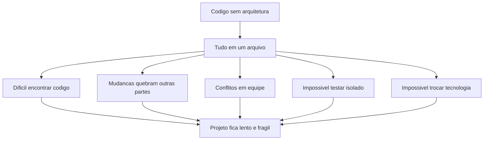
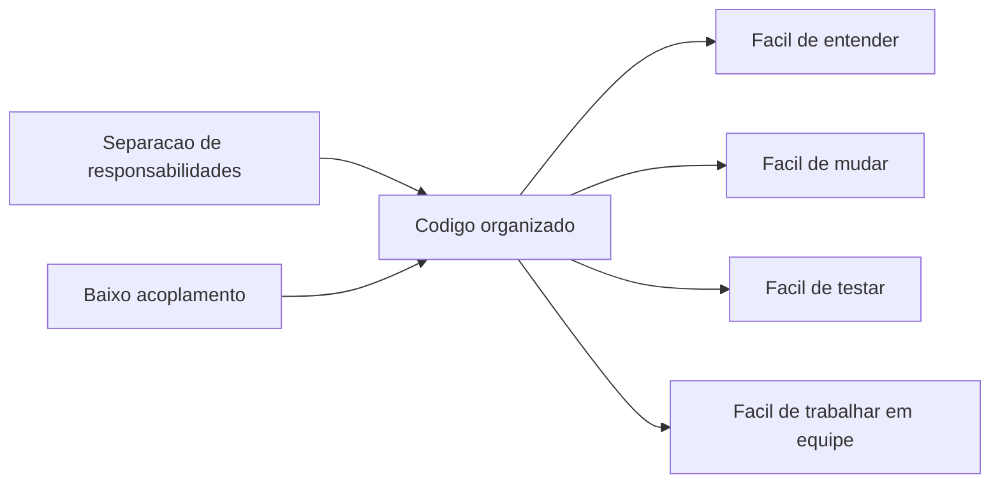
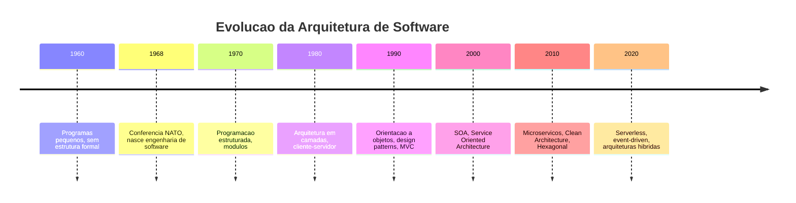
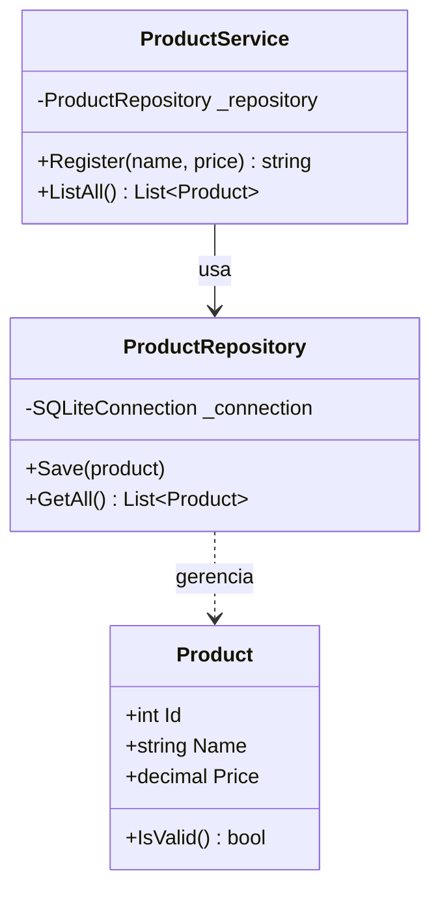

# 10.1 — Por que Arquitetura Importa

[← Anterior: Projeto Biblioteca](cap09-mod11-projeto-biblioteca-conteudo.md) · [Próximo: Arquitetura em Camadas →](cap10-mod02-camadas-tres-camadas-conteudo.md)

---

## Introdução

No capítulo 9, você construiu um sistema completo de biblioteca usando orientação a objetos, interfaces, Factory, Repository e princípios SOLID. O código ficou organizado, com classes bem definidas e responsabilidades separadas. Mas pense no seguinte: se alguém novo entrasse no projeto agora, saberia onde encontrar cada coisa? Se o projeto crescesse para 50 arquivos, 100 arquivos, 500 arquivos — como manter tudo organizado?

Esse é o problema que a arquitetura de software resolve. Até agora, você aprendeu a escrever código que funciona. Agora vai aprender a organizar código de forma que qualquer pessoa entenda onde fica cada coisa, que mudanças em uma parte não quebrem outras, e que o projeto possa crescer sem virar uma bagunça.

Este capítulo inteiro gira em torno de um princípio central: **simplicidade é a chave de um bom código**. Complexidade raramente se justifica. A melhor arquitetura é a mais simples que resolve o problema.

---

## Como Executar os Exemplos Deste Módulo

Os exemplos deste módulo usam C# (.NET), a mesma linguagem do capítulo 9. Para executar:

1. Certifique-se de que o .NET SDK está instalado (você já configurou no módulo 9.3)
2. Crie uma pasta para os exemplos: `mkdir -p ~/meus-projetos/curso/cap10`
3. Para cada exemplo, crie um projeto console: `dotnet new console -n NomeDoExemplo`
4. Cole o código no arquivo `Program.cs`
5. Execute com `dotnet run`

---

## O Problema: Código que Funciona mas Ninguém Entende

Vamos começar com uma situação real. Imagine que você escreveu um programa de cadastro de produtos — algo parecido com o que fizemos no capítulo 8. O programa funciona perfeitamente. Ele cadastra, lista, busca, edita e remove produtos. Tudo em um único arquivo.

Aqui está um exemplo simplificado de como esse código poderia ficar:

```csharp
// programa_completo.cs — Tudo em um unico arquivo
// "product" = produto, "connection" = conexao, "command" = comando
using System;
using System.Data.SQLite; // biblioteca para acessar SQLite

class Program
{
    static void Main()
    {
        // Cria conexao com o banco de dados
        var connection = new SQLiteConnection("Data Source=products.db");
        connection.Open(); // abre a conexao

        // Cria a tabela se nao existir
        var createTable = new SQLiteCommand(
            "CREATE TABLE IF NOT EXISTS products (id INTEGER PRIMARY KEY, name TEXT, price REAL)",
            connection
        );
        createTable.ExecuteNonQuery(); // executa o comando SQL

        while (true) // loop infinito do menu
        {
            Console.WriteLine("\n=== Cadastro de Produtos ===");
            Console.WriteLine("1. Cadastrar produto");
            Console.WriteLine("2. Listar produtos");
            Console.WriteLine("3. Buscar produto");
            Console.WriteLine("4. Sair");
            Console.Write("Escolha: ");

            var choice = Console.ReadLine(); // le a escolha do usuario

            if (choice == "1") // cadastrar
            {
                Console.Write("Nome: ");
                var name = Console.ReadLine(); // le o nome

                // Valida se o nome nao esta vazio
                if (string.IsNullOrWhiteSpace(name))
                {
                    Console.WriteLine("Erro: nome nao pode ser vazio!");
                    continue; // volta ao menu
                }

                Console.Write("Preco: ");
                var priceText = Console.ReadLine(); // le o preco como texto

                // Tenta converter o preco para numero
                if (!decimal.TryParse(priceText, out var price) || price <= 0)
                {
                    Console.WriteLine("Erro: preco invalido!");
                    continue; // volta ao menu
                }

                // Insere no banco de dados
                var insert = new SQLiteCommand(
                    $"INSERT INTO products (name, price) VALUES ('{name}', {price})",
                    connection
                );
                insert.ExecuteNonQuery(); // executa o INSERT
                Console.WriteLine($"Produto '{name}' cadastrado com sucesso!");
            }
            else if (choice == "2") // listar
            {
                var select = new SQLiteCommand("SELECT * FROM products", connection);
                var reader = select.ExecuteReader(); // executa o SELECT

                Console.WriteLine("\n--- Produtos ---");
                while (reader.Read()) // percorre cada linha do resultado
                {
                    // Mistura acesso ao banco com formatacao de saida
                    Console.WriteLine($"ID: {reader["id"]} | Nome: {reader["name"]} | Preco: R$ {reader["price"]:F2}");
                }
            }
            else if (choice == "3") // buscar
            {
                Console.Write("Digite o ID: ");
                var idText = Console.ReadLine(); // le o ID

                if (!int.TryParse(idText, out var id))
                {
                    Console.WriteLine("Erro: ID invalido!");
                    continue;
                }

                var select = new SQLiteCommand($"SELECT * FROM products WHERE id = {id}", connection);
                var reader = select.ExecuteReader();

                if (reader.Read())
                {
                    Console.WriteLine($"Produto encontrado: {reader["name"]} - R$ {reader["price"]:F2}");
                }
                else
                {
                    Console.WriteLine("Produto nao encontrado.");
                }
            }
            else if (choice == "4") // sair
            {
                connection.Close(); // fecha a conexao
                Console.WriteLine("Ate logo!");
                break; // sai do loop
            }
        }
    }
}
```

Saída esperada (exemplo de interação):

```
=== Cadastro de Produtos ===
1. Cadastrar produto
2. Listar produtos
3. Buscar produto
4. Sair
Escolha: 1
Nome: Notebook
Preco: 3500.00
Produto 'Notebook' cadastrado com sucesso!
```

Esse código funciona. Ele faz tudo que precisa fazer. Mas olhe com atenção: **tudo está misturado no mesmo lugar**. O menu (interface com o usuário), a validação dos dados, o acesso ao banco de dados e a formatação da saída — tudo dentro de um único método `Main`, em um único arquivo.

Para um programa pequeno como esse, não é um problema grave. Mas o que acontece quando o projeto cresce?

---

## Quando o Projeto Cresce: Os Sintomas do Código Desorganizado

Imagine que o programa de produtos precisa evoluir. O chefe pede novas funcionalidades:

- Adicionar categorias aos produtos
- Implementar controle de estoque
- Criar relatórios de vendas
- Adicionar autenticação de usuários
- Enviar notificações por email quando o estoque estiver baixo
- Gerar exportação em CSV e PDF

Cada nova funcionalidade significa mais código no mesmo arquivo. Depois de algumas semanas, o arquivo tem 2.000 linhas. Depois de alguns meses, 5.000 linhas. E então começam os problemas:

### Problema 1: Ninguém encontra nada

Com 5.000 linhas em um arquivo, encontrar onde está a lógica de cálculo de estoque exige rolar centenas de linhas. Você gasta mais tempo procurando código do que escrevendo código novo.

### Problema 2: Mudanças quebram coisas inesperadas

Você precisa mudar como o preço é calculado. Mas o cálculo de preço está misturado com a exibição no menu, que está misturada com o acesso ao banco. Ao mudar uma coisa, você acidentalmente quebra outra que parecia não ter relação.

### Problema 3: Impossível trabalhar em equipe

Se duas pessoas precisam mexer no mesmo arquivo ao mesmo tempo, os conflitos de merge no Git são constantes. Uma pessoa está adicionando categorias enquanto outra está mexendo no relatório — e as duas estão editando o mesmo arquivo de 5.000 linhas.

### Problema 4: Impossível testar partes isoladas

Você quer testar se o cálculo de desconto está correto. Mas o cálculo está dentro do método que também acessa o banco e exibe o menu. Para testar o cálculo, você precisa rodar o programa inteiro, navegar pelo menu e verificar visualmente. Não dá para testar só o cálculo.

### Problema 5: Impossível trocar tecnologias

O banco de dados precisa mudar de SQLite para PostgreSQL. Mas os comandos SQL estão espalhados por todo o código, misturados com lógica de negócio e interface. Trocar o banco significa mexer em centenas de lugares diferentes.

Esses cinco problemas têm um nome técnico: **acoplamento alto** (high coupling). Quando tudo depende de tudo, qualquer mudança tem efeito cascata.



---

## A Analogia: Casa sem Planta vs Casa com Planta

Pense em construir uma casa. Você pode simplesmente começar a empilhar tijolos e ir decidindo onde fica cada coisa conforme avança. A cozinha fica aqui, o banheiro ali, o quarto lá. Funciona? Sim, no começo. Mas quando você percebe que o encanamento do banheiro precisa passar pela cozinha, que a fiação elétrica não tem espaço, que o quarto ficou sem janela — aí os problemas aparecem.

Agora imagine construir a mesma casa com uma planta. Antes de colocar um tijolo, você define: a cozinha fica aqui (perto da área de serviço, com acesso à água e gás), o banheiro ali (com encanamento planejado), os quartos lá (com janelas para ventilação). Cada cômodo tem uma função definida. A planta não impede mudanças — você pode decidir trocar o piso da cozinha sem mexer no banheiro, porque cada parte é independente.

**Arquitetura de software é a planta da sua aplicação.** Define onde fica cada coisa, qual a função de cada parte e como as partes se comunicam. Não é sobre usar o framework mais moderno ou a tecnologia mais sofisticada — é sobre organizar de forma que qualquer pessoa entenda onde fica cada coisa.

| Sem arquitetura | Com arquitetura |
|----------------|-----------------|
| Casa sem planta | Casa com planta |
| Tudo em um arquivo | Cada parte em seu lugar |
| Mudança em uma parte quebra outras | Partes independentes |
| Só quem escreveu entende | Qualquer pessoa entende |
| Crescer = mais bagunça | Crescer = mais organização |
| Testar = rodar tudo | Testar = rodar só a parte |

---

## O que é Arquitetura de Software

Arquitetura de software é a forma como você organiza o código de uma aplicação em partes com responsabilidades claras. É a decisão de "o que fica onde" e "quem conversa com quem".

Não confunda arquitetura com:
- **Linguagem de programação** — C#, Python, Java são ferramentas. Arquitetura é como você organiza o código independente da linguagem.
- **Framework** — ASP.NET, FastAPI, Spring são frameworks. Eles ajudam a implementar a arquitetura, mas não são a arquitetura em si.
- **Design patterns** — Factory, Repository, Observer são padrões de design. Eles resolvem problemas específicos dentro da arquitetura, mas não definem a estrutura geral.
- **Infraestrutura** — Docker, Kubernetes, AWS são infraestrutura. Eles definem onde o código roda, não como ele é organizado.

Arquitetura é sobre **estrutura e organização**. É a decisão de separar o código em camadas, módulos ou componentes, definindo as responsabilidades de cada um e as regras de comunicação entre eles.

### Os Dois Objetivos da Arquitetura

Toda boa arquitetura busca dois objetivos:

1. **Separação de responsabilidades** (Separation of Concerns): cada parte do código faz uma coisa e faz bem. O código que acessa o banco não se mistura com o código que exibe dados. O código que válida entrada não se mistura com o código que calcula preços.

2. **Baixo acoplamento** (Low Coupling): as partes dependem o mínimo possível umas das outras. Se você trocar o banco de dados, só precisa mudar a parte que acessa o banco — o resto do código nem percebe.

Esses dois objetivos se complementam. Quando cada parte tem uma responsabilidade clara (separação), naturalmente as dependências entre elas diminuem (baixo acoplamento).



---

## Uma Breve História: Como a Arquitetura de Software Surgiu

Nos anos 1960 e 1970, quando a programação comercial estava começando, os programas eram pequenos. Um programa de folha de pagamento cabia em algumas centenas de linhas. Não havia necessidade de "arquitetura" — o programa inteiro cabia na cabeça de uma pessoa.

Mas conforme os computadores ficaram mais poderosos e os problemas mais complexos, os programas cresceram. Nos anos 1970, surgiu o que ficou conhecido como a **crise do software** (software crisis): projetos atrasavam, estouravam orçamento e entregavam software cheio de bugs. O problema não era a capacidade dos programadores — era a falta de métodos para organizar código grande.

Em 1968, na conferência da NATO sobre engenharia de software, o termo **engenharia de software** foi cunhado pela primeira vez. A ideia era aplicar princípios de engenharia (planejamento, estrutura, testes) ao desenvolvimento de software. A arquitetura de software nasceu dessa necessidade.

Ao longo das décadas seguintes, vários padrões de arquitetura surgiram:



Cada época trouxe novos desafios e novas formas de organizar código. Mas o princípio fundamental nunca mudou: **separar responsabilidades e reduzir acoplamento**.

### A Crise do Software: O Problema que Criou a Solução

Vale a pena entender a crise do software em mais detalhe, porque ela explica por que arquitetura importa tanto.

Nos anos 1960, o hardware evoluiu muito mais rápido que o software. Computadores ficaram poderosos o suficiente para rodar programas complexos, mas os programadores ainda escreviam código da mesma forma que escreviam para programas pequenos — tudo junto, sem estrutura.

O resultado foi desastroso. Projetos famosos que falharam:

- **OS/360 da IBM (1964-1966)**: um dos maiores projetos de software da epoca. Frederick Brooks, o gerente do projeto, escreveu depois o livro "The Mythical Man-Month" explicando por que adicionar mais programadores a um projeto atrasado so piora as coisas. O problema não era falta de gente — era falta de organização.

- **Therac-25 (1985-1987)**: uma máquina de radioterapia cujo software tinha bugs que causaram overdoses de radiacao em pacientes. O código era monolitico, sem separacao entre controle de hardware e interface. Bugs na interface afetavam o controle de radiacao porque tudo estava acoplado.

Esses casos mostraram que software precisa de estrutura. Não basta funcionar — precisa ser organizado de forma que erros sejam isolados, mudancas sejam seguras e o código seja compreensivel.

---

## Separacao de Responsabilidades na Prática

Vamos pegar o exemplo do programa de produtos e ver como a separacao de responsabilidades funciona na prática. O código original tinha tudo misturado. Vamos identificar as responsabilidades diferentes que existem nele:

| Responsabilidade | O que faz | Onde esta no código original |
|-----------------|-----------|------------------------------|
| Interface com usuario | Exibe menu, le entrada, mostra resultados | `Console.WriteLine`, `Console.ReadLine` |
| Validação de dados | Verifica se nome não e vazio, se preco e válido | `string.IsNullOrWhiteSpace`, `decimal.TryParse` |
| Regras de negocio | Define o que e um produto válido, como calcular precos | Misturado com validação e banco |
| Acesso a dados | Conecta ao banco, executa SQL, le resultados | `SQLiteConnection`, `SQLiteCommand` |
| Formatacao de saida | Formata precos com R$, organiza a exibicao | `$"R$ {price:F2}"` |

São pelo menos 5 responsabilidades diferentes, todas no mesmo método `Main`. Quando separamos cada responsabilidade em seu proprio lugar, o código fica assim:

```csharp
// models/Product.cs — Entidade de dominio
// "product" = produto
public class Product
{
    public int Id { get; set; }       // identificador unico
    public string Name { get; set; }  // nome do produto
    public decimal Price { get; set; } // preco do produto

    // Validacao: o produto sabe se ele mesmo e valido
    public bool IsValid()
    {
        return !string.IsNullOrWhiteSpace(Name) && Price > 0;
    }
}
```

Saída esperada: (esta classe não produz saída sozinha — ela é usada por outras partes)

```csharp
// repositories/ProductRepository.cs — Acesso a dados
// "repository" = repositorio (lugar onde os dados ficam guardados)
public class ProductRepository
{
    private readonly SQLiteConnection _connection; // conexao com o banco

    public ProductRepository(SQLiteConnection connection)
    {
        _connection = connection; // recebe a conexao pronta
    }

    // Salva um produto no banco
    public void Save(Product product)
    {
        var cmd = new SQLiteCommand(
            "INSERT INTO products (name, price) VALUES (@name, @price)",
            _connection
        );
        cmd.Parameters.AddWithValue("@name", product.Name);
        cmd.Parameters.AddWithValue("@price", product.Price);
        cmd.ExecuteNonQuery(); // executa o INSERT
    }

    // Busca todos os produtos
    public List<Product> GetAll()
    {
        var products = new List<Product>(); // lista vazia
        var cmd = new SQLiteCommand("SELECT * FROM products", _connection);
        var reader = cmd.ExecuteReader(); // executa o SELECT

        while (reader.Read()) // percorre cada linha
        {
            products.Add(new Product // cria um Product para cada linha
            {
                Id = Convert.ToInt32(reader["id"]),
                Name = reader["name"].ToString(),
                Price = Convert.ToDecimal(reader["price"])
            });
        }
        return products; // retorna a lista completa
    }
}
```

Saída esperada: (esta classe não produz saída sozinha — ela é usada por outras partes)

```csharp
// services/ProductService.cs — Logica de negocio
// "service" = servico (quem coordena as operacoes)
public class ProductService
{
    private readonly ProductRepository _repository; // acesso aos dados

    public ProductService(ProductRepository repository)
    {
        _repository = repository; // recebe o repositorio pronto
    }

    // Cadastra um novo produto (com validacao)
    public string Register(string name, decimal price)
    {
        var product = new Product { Name = name, Price = price };

        if (!product.IsValid()) // verifica se o produto e valido
        {
            return "Erro: dados do produto invalidos!";
        }

        _repository.Save(product); // salva no banco
        return $"Produto '{name}' cadastrado com sucesso!";
    }

    // Lista todos os produtos
    public List<Product> ListAll()
    {
        return _repository.GetAll(); // delega para o repositorio
    }
}
```

Saída esperada: (esta classe não produz saída sozinha — ela é usada por outras partes)

Perceba o que mudou: cada arquivo tem uma única responsabilidade. O `Product` sabe o que e um produto válido. O `ProductRepository` sabe como salvar e buscar no banco. O `ProductService` coordena as operações. Nenhum deles sabe como o menu funciona ou como os dados são exibidos.

Se amanha o banco mudar de SQLite para PostgreSQL, so o `ProductRepository` precisa mudar. O `ProductService` e o `Product` nem percebem. Isso e separacao de responsabilidades.

Veja como as classes se relacionam na arquitetura organizada:



---

## Acoplamento e Coesao: Os Dois Pilares

Dois conceitos fundamentais guiam toda decisao de arquitetura: acoplamento e coesao. Eles são como dois lados da mesma moeda.

### Acoplamento (Coupling)

Acoplamento mede o quanto uma parte do código depende de outra. Quanto mais uma parte depende de outra, mais acopladas elas estao.

**Acoplamento alto** (ruim): mudar uma parte exige mudar outras.

```csharp
// Acoplamento alto: o servico conhece detalhes do banco
// "service" = servico, "query" = consulta
public class ProductService
{
    public List<Product> Search(string name)
    {
        // O servico sabe que usa SQLite, sabe a string de conexao,
        // sabe a sintaxe SQL especifica — tudo acoplado
        var conn = new SQLiteConnection("Data Source=products.db");
        conn.Open();
        var cmd = new SQLiteCommand($"SELECT * FROM products WHERE name LIKE '%{name}%'", conn);
        // ... mais codigo de banco misturado com logica
        return products;
    }
}
```

Saída esperada: (exemplo conceitual — não executar isoladamente)

**Acoplamento baixo** (bom): cada parte depende apenas de interfaces, não de implementacoes concretas.

```csharp
// Acoplamento baixo: o servico depende de uma interface
// "repository" = repositorio, "interface" = contrato
public class ProductService
{
    private readonly IProductRepository _repository; // depende da interface

    public ProductService(IProductRepository repository)
    {
        _repository = repository; // recebe qualquer implementacao
    }

    public List<Product> Search(string name)
    {
        // O servico nao sabe se e SQLite, PostgreSQL ou memoria
        // Ele so sabe que o repositorio tem um metodo Search
        return _repository.Search(name);
    }
}
```

Saída esperada: (exemplo conceitual — não executar isoladamente)

No segundo exemplo, o `ProductService` não sabe nada sobre banco de dados. Ele depende de uma interface `IProductRepository` que pode ser implementada com SQLite, PostgreSQL, MongoDB ou ate uma lista em memória. Isso e acoplamento baixo.

### Coesao (Cohesion)

Coesao mede o quanto as coisas dentro de uma parte do código estao relacionadas entre si. Alta coesao significa que tudo dentro de uma classe ou módulo esta relacionado ao mesmo proposito.

**Coesao baixa** (ruim): a classe faz coisas que não tem relação entre si.

```csharp
// Coesao baixa: a classe faz de tudo
// "manager" = gerenciador
public class ProductManager
{
    public void SaveToDatabase(Product p) { /* SQL */ }  // acesso a dados
    public void SendEmail(string to) { /* SMTP */ }      // envio de email
    public string FormatPrice(decimal price) { /* R$ */ } // formatacao
    public bool ValidateInput(string input) { /* ... */ } // validacao
    public void PrintReport() { /* PDF */ }               // relatorio
}
```

Saída esperada: (exemplo conceitual — não executar isoladamente)

**Coesao alta** (bom): a classe faz apenas coisas relacionadas ao seu proposito.

```csharp
// Coesao alta: cada classe faz uma coisa
public class ProductRepository  // so acesso a dados
{
    public void Save(Product p) { /* SQL */ }
    public Product GetById(int id) { /* SQL */ }
    public List<Product> GetAll() { /* SQL */ }
}

public class EmailService  // so envio de email
{
    public void Send(string to, string subject, string body) { /* SMTP */ }
}

public class PriceFormatter  // so formatacao de precos
{
    public string Format(decimal price) { return $"R$ {price:F2}"; }
}
```

Saída esperada: (exemplo conceitual — não executar isoladamente)

### A Regra de Ouro

A combinacao ideal e: **baixo acoplamento + alta coesao**. Cada parte faz uma coisa bem (alta coesao) e depende o mínimo possível de outras partes (baixo acoplamento).

| | Acoplamento Alto | Acoplamento Baixo |
|---|-----------------|-------------------|
| Coesao Alta | Partes focadas mas dependentes | O ideal: focadas e independentes |
| Coesao Baixa | O pior cenário: faz tudo e depende de tudo | Partes independentes mas confusas |

Lembra do principio da responsabilidade única (SRP) do SOLID que vimos no capítulo 9? Ele e exatamente sobre coesao: cada classe deve ter uma única razao para mudar. E lembra do principio da inversao de dependência (DIP)? Ele e sobre acoplamento: dependa de abstrações, não de implementacoes concretas.

Arquitetura de software e a aplicação desses principios em escala maior — não apenas em classes individuais, mas na organização inteira do projeto.

---

## Estrutura de Pastas: Onde Fica Cada Coisa

Uma das formas mais visiveis de arquitetura e a estrutura de pastas do projeto. Quando você abre um projeto bem organizado, a estrutura de pastas ja conta uma história: você sabe onde encontrar cada coisa sem precisar abrir nenhum arquivo.

Compare duas estruturas para o mesmo projeto de cadastro de produtos:

### Estrutura sem arquitetura

```
MeuProjeto/
    Program.cs          # tudo aqui: menu, banco, logica, validacao
    helpers.cs           # funcoes auxiliares diversas
    utils.cs             # mais funcoes diversas
    database.cs          # algumas coisas de banco (mas nao todas)
```

Olhando essa estrutura, você não sabe onde esta a lógica de cálculo de precos. Pode estar em qualquer um dos 4 arquivos. E o que e a diferença entre `helpers.cs` e `utils.cs`? Ninguem sabe.

### Estrutura com arquitetura

```
MeuProjeto/
    Controllers/
        ProductController.cs    # recebe requisicoes de produto
        CategoryController.cs   # recebe requisicoes de categoria
    Services/
        ProductService.cs       # logica de negocio de produto
        CategoryService.cs      # logica de negocio de categoria
    Repositories/
        ProductRepository.cs    # acesso a dados de produto
        CategoryRepository.cs   # acesso a dados de categoria
    Models/
        Product.cs              # entidade Produto
        Category.cs             # entidade Categoria
    Program.cs                  # ponto de entrada (so configuracao)
```

Olhando essa estrutura, você sabe exatamente onde encontrar cada coisa:
- Quer ver como o produto e salvo no banco? Vai em `Repositories/ProductRepository.cs`
- Quer ver as regras de negocio de categoria? Vai em `Services/CategoryService.cs`
- Quer ver como a requisicao e recebida? Vai em `Controllers/ProductController.cs`

A estrutura de pastas e o primeiro sinal de que um projeto tem (ou não tem) arquitetura.

---

## Simplicidade como Valor: O Principio Central

Este e o ponto mais importante de todo o capítulo, e vale repetir: **a melhor arquitetura e a mais simples que resolve o problema**.

Existe uma tendência natural de querer usar a arquitetura mais sofisticada, o pattern mais elegante, a abstração mais genérica. Isso e chamado de **over-engineering** (engenharia excessiva) — criar complexidade que não e necessária.

Sinais de over-engineering:

- Criar 10 arquivos para um programa que caberia em 3
- Usar 5 camadas de abstração quando 2 resolveriam
- Implementar patterns sofisticados para problemas simples
- Criar interfaces para classes que so tem uma implementação e nunca terao outra
- Adicionar DTOs identicos as entidades "por precaucao"

A regra prática e: **comece simples e adicione complexidade quando (e se) o problema exigir**. Você sempre pode adicionar mais camadas, mais abstrações, mais patterns depois. Remover complexidade desnecessaria e muito mais difícil.

### O Teste da Simplicidade

Antes de adicionar qualquer camada ou abstração, faca estas perguntas:

1. **Isso resolve um problema real que eu tenho agora?** Se a resposta for "não, mas pode ser útil no futuro" — não adicione. O futuro pode nunca chegar, e você tera complexidade sem beneficio.

2. **Alguem novo no projeto entenderia isso em 5 minutos?** Se a resposta for não, provavelmente esta complexo demais.

3. **Eu consigo explicar por que isso existe em uma frase?** Se precisar de um paragrafo para justificar, talvez não seja necessário.

| Situação | Abordagem simples | Abordagem complexa demais |
|----------|-------------------|--------------------------|
| CRUD básico com 3 entidades | 3 camadas, sem DTOs | Hexagonal com 15 interfaces |
| API com 5 endpoints | Controller + Service + Repository | CQRS + Event Sourcing + Message Bus |
| Projeto pessoal | Monolito simples | 8 microservicos com Kubernetes |
| Prototipo para validar ideia | Um arquivo bem organizado | Arquitetura enterprise completa |

---

## Arquitetura não e Sobre Ferramentas

Um erro comum de iniciantes e confundir arquitetura com ferramentas. "Qual framework devo usar?" não e uma pergunta de arquitetura. "Como devo organizar meu código?" — essa sim e uma pergunta de arquitetura.

Você pode ter uma arquitetura excelente usando qualquer linguagem e qualquer framework. E pode ter uma arquitetura pessima usando as ferramentas mais modernas do mercado.

A arquitetura e sobre **decisoes de organização**:
- Quantas camadas o projeto tem?
- Qual a responsabilidade de cada camada?
- Como as camadas se comunicam?
- Onde ficam as regras de negocio?
- Onde fica o acesso a dados?
- Como o projeto lida com dependências externas?

Essas decisoes são independentes de linguagem, framework ou banco de dados. Um projeto Python com FastAPI pode ter a mesma arquitetura que um projeto C# com ASP.NET — as camadas são as mesmas, so a implementação muda.

Isso conecta diretamente com o mantra do curso: **conceitos são para sempre, ferramentas apenas os implementam**. Arquitetura e um conceito. C#, Python, FastAPI são ferramentas que implementam esse conceito.

---

## O Papel da Arquitetura no Dia a Dia de um Desenvolvedor

Você pode estar pensando: "mas eu sou iniciante, preciso me preocupar com arquitetura agora?" A resposta e sim — e não precisa ser complicado.

No dia a dia de um desenvolvedor, arquitetura aparece em situações simples:

- **Ao criar um novo arquivo**: "onde esse arquivo deve ficar? Na pasta de services? De repositories? De models?"
- **Ao adicionar uma funcionalidade**: "essa lógica pertence ao controller ou ao service?"
- **Ao corrigir um bug**: "onde esta o código que faz X? Ah, esta no repository, porque e acesso a dados."
- **Ao revisar código de um colega**: "esse SQL esta no service — deveria estar no repository."

Ter uma arquitetura clara não significa ter uma arquitetura complexa. Significa ter regras simples sobre onde cada coisa fica. Mesmo um projeto pequeno se beneficia de separar "código que fala com o banco" de "código que exibe coisas na tela".

### O que Muda na Sua Forma de Pensar

Até agora, quando você recebia um problema, pensava: "como eu resolvo isso?" A partir de agora, você vai pensar em duas etapas:

1. **Como eu resolvo isso?** (a lógica, o algoritmo, a solução)
2. **Onde essa solução fica no projeto?** (em qual camada, em qual pasta, em qual arquivo)

Essa segunda pergunta e arquitetura. E ela faz toda a diferença entre um projeto que cresce de forma saudavel e um projeto que vira uma bola de lama.

---

## Como a IA pode te ajudar aqui

A IA e uma ótima parceira para discutir decisoes de arquitetura. Aqui estao alguns prompts que você pode usar:

**Prompt 1 — Praticar com projetos:**
> "Tenho um projeto com 3 arquivos que fazem tudo. Me ajude a identificar as responsabilidades diferentes e sugerir como separar em camadas."

**Prompt 2 — Explorar o conceito:**
> "Estou em duvida se devo criar uma interface para meu repositório. O projeto e pequeno e so tem uma implementação. Vale a pena?"

**Prompt 3 — Ver exemplos práticos:**
> "Me mostre um exemplo de como organizar um projeto C# de cadastro de clientes em 3 camadas, com a estrutura de pastas e os arquivos principais."

---

## Casos de Uso no Mundo Real

### Netflix: Arquitetura que Escala

A Netflix comecou como um monolito — uma única aplicação que fazia tudo. Conforme cresceu para milhoes de usuarios, percebeu que precisava de uma arquitetura diferente. Migrou para microservicos, onde cada funcionalidade (catalogo, recomendacoes, streaming, pagamento) e um servico independente. Isso permite que a equipe de recomendacoes atualize seu código sem afetar o streaming. A decisao de arquitetura permitiu que a Netflix escalasse de milhares para centenas de milhoes de usuarios.

### Nubank: Simplicidade no Inicio

O Nubank comecou com uma arquitetura relativamente simples — poucos servicos, tecnologia enxuta. Conforme cresceu, foi adicionando complexidade onde necessário. Não comecou com 500 microservicos — comecou simples e evoluiu. Essa abordagem de "comece simples, adicione complexidade quando necessário" e exatamente o principio que estamos ensinando neste capítulo.

### Seu Projeto do Capítulo 8: O Antes e Depois

O CRUD de produtos que você construiu no capítulo 8 tinha tudo em poucos arquivos. No projeto deste capítulo, você vai reorganizar esse mesmo código em camadas. O "antes" e o "depois" vao mostrar na prática como a mesma funcionalidade pode ser organizada de formas muito diferentes — e como a versão organizada e mais fácil de entender, modificar e expandir.

---

## Resumo do Módulo

| Conceito | Definição |
|----------|-----------|
| Arquitetura de software | Forma de organizar código em partes com responsabilidades claras |
| Separacao de responsabilidades | Cada parte faz uma coisa e faz bem |
| Acoplamento | Grau de dependência entre partes do código |
| Coesao | Grau de relação entre coisas dentro de uma mesma parte |
| Over-engineering | Criar complexidade desnecessaria |
| Acoplamento alto | Partes muito dependentes — mudanca em uma afeta outras |
| Acoplamento baixo | Partes independentes — mudanca em uma não afeta outras |
| Coesao alta | Tudo dentro de uma parte esta relacionado ao mesmo proposito |
| Coesao baixa | Uma parte faz coisas sem relação entre si |
| Estrutura de pastas | Organização fisica dos arquivos que reflete a arquitetura |

---

## Glossário do Módulo

| Termo | Definição |
|-------|-----------|
| Acoplamento (Coupling) | Grau de dependência entre partes do código. Baixo acoplamento e desejavel |
| Arquitetura de software (Software Architecture) | Organização estrutural de um sistema em componentes com responsabilidades definidas |
| Camada (Layer) | Divisao lógica do código por responsabilidade |
| Coesao (Cohesion) | Grau de relação entre elementos dentro de uma mesma unidade de código |
| Crise do software (Software Crisis) | Período nos anos 1960-70 em que projetos de software falhavam sistematicamente |
| Engenharia de software (Software Engineering) | Aplicação de principios de engenharia ao desenvolvimento de software |
| Estrutura de pastas (Folder Structure) | Organização fisica dos arquivos de um projeto em diretórios |
| Framework | Conjunto de ferramentas e convencoes que facilitam o desenvolvimento |
| High coupling | Acoplamento alto — partes muito dependentes entre si |
| Low coupling | Acoplamento baixo — partes independentes entre si |
| Over-engineering | Criar complexidade além do necessário para resolver o problema |
| Separacao de responsabilidades (Separation of Concerns) | Principio de que cada parte do código deve ter uma única responsabilidade |
| SRP (Single Responsibility Principle) | Principio SOLID: cada classe deve ter uma única razao para mudar |

---

## Na Cultura Popular

- **The Mythical Man-Month** (livro, 1975) — Frederick Brooks escreveu este classico apos gerenciar o projeto OS/360 da IBM. O livro explica por que adicionar mais pessoas a um projeto atrasado so piora as coisas, e por que organização e mais importante que quantidade de programadores. E leitura obrigatória para qualquer desenvolvedor.

- **Silicon Valley** (serie, 2014-2019) — a serie mostra uma startup de tecnologia enfrentando problemas reais de engenharia de software, incluindo decisoes de arquitetura, escalabilidade e a tensao entre "fazer rápido" e "fazer direito". Vários episodios mostram o dilema entre simplicidade e complexidade.

- **Halt and Catch Fire** (serie, 2014-2017) — ambientada nos anos 1980-90, mostra a evolução da industria de computadores e software. Os personagens enfrentam exatamente os problemas que discutimos: como organizar projetos que crescem, como trabalhar em equipe em código grande, como lidar com complexidade.

---

## Para Saber Mais

- [Martin Fowler — Patterns of Enterprise Application Architecture](https://martinfowler.com/eaaCatalog/) — *Catalogo de patterns de arquitetura por um dos maiores nomes da area*
- [The Twelve-Factor App (PT-BR)](https://12factor.net/pt_br/) — *Metodologia para construir aplicações modernas, em portugues*
- [Fireship — 10 Design Patterns in 10 Minutes](https://www.youtube.com/watch?v=tv-_1er1mWI) — *Video rápido e visual sobre patterns de arquitetura*
- [Fabio Akita — Arquitetura de Software](https://www.youtube.com/@Akitando) — *Videos profundos sobre decisoes de arquitetura em portugues*
- [Microsoft — .NET Application Architecture](https://learn.microsoft.com/en-us/dotnet/architecture/) — *Guias oficiais de arquitetura para aplicações .NET*

---

## Perguntas Frequentes (FAQ)

P: Preciso me preocupar com arquitetura em projetos pequenos?
R: Sim, mas de forma proporcional. Um projeto pequeno não precisa de 10 camadas, mas se beneficia de separar "código que acessa banco" de "código que exibe coisas". Comece simples — separar em 2-3 partes ja faz diferença.

P: Existe uma arquitetura "certa" que funciona para tudo?
R: Não. Cada projeto tem necessidades diferentes. Um CRUD simples se beneficia de 3 camadas. Um sistema de streaming precisa de algo mais sofisticado. A arquitetura certa e a mais simples que resolve o problema do seu projeto.

P: Arquitetura e a mesma coisa que design patterns?
R: Não. Design patterns (Factory, Repository, Observer) são soluções para problemas específicos dentro do código. Arquitetura e a organização geral do projeto — como as partes se dividem e se comunicam. Patterns são usados dentro da arquitetura, mas não são a arquitetura em si.

P: Se meu código funciona, por que mudar a organização?
R: Porque "funcionar" e so o primeiro requisito. Código também precisa ser compreensivel (para você e para outros), modificavel (para adicionar funcionalidades) e testavel (para garantir que mudancas não quebram nada). Organização boa facilita tudo isso.

P: Quanto tempo devo gastar pensando em arquitetura antes de comecar a codar?
R: Para projetos pequenos, 15-30 minutos definindo as pastas e responsabilidades. Para projetos grandes, pode levar dias. A regra e: gaste tempo suficiente para ter clareza sobre "onde fica cada coisa", mas não tanto que você nunca comece a codar.

P: Posso mudar a arquitetura depois que o projeto ja esta pronto?
R: Sim, e isso e comum. Chama-se refatoracao (refactoring). Mas e muito mais fácil mudar uma arquitetura simples para uma mais complexa do que o contrario. Por isso comecamos simples.

P: Arquitetura e responsabilidade so de desenvolvedores senior?
R: Não. Todo desenvolvedor toma decisoes de arquitetura, mesmo sem perceber. Quando você decide criar um arquivo novo em vez de adicionar código em um existente, esta tomando uma decisao de arquitetura. Quanto mais cedo você entender os principios, melhor.

P: O que e mais importante: código bonito ou arquitetura boa?
R: Arquitetura boa. Código bonito em uma arquitetura ruim ainda e difícil de manter. Código simples em uma arquitetura boa e fácil de entender e modificar. Claro, o ideal e ter os dois.

P: Preciso usar interfaces para tudo?
R: Não. Interfaces fazem sentido quando você tem (ou planeja ter) multiplas implementacoes, ou quando quer facilitar testes. Se uma classe so tem uma implementação e provavelmente nunca tera outra, uma interface pode ser complexidade desnecessaria.

P: Como sei se estou fazendo over-engineering?
R: Se você não consegue explicar em uma frase por que uma abstração existe, provavelmente e over-engineering. Se o código tem mais "infraestrutura" (interfaces, factories, adapters) do que "lógica real", provavelmente e over-engineering. Na duvida, simplifique.

---

## Exercícios de Fixacao

Os exercícios deste módulo estao em um arquivo separado para facilitar a consulta:

**[Acessar Exercícios do Módulo 10.1](cap10-mod01-por-que-arquitetura-exercicios.md)**

---

[← Anterior: Projeto Biblioteca](cap09-mod11-projeto-biblioteca-conteudo.md) · [Próximo: Arquitetura em Camadas →](cap10-mod02-camadas-tres-camadas-conteudo.md)
