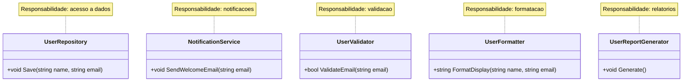

# Exercícios — Módulo 10.1: Por que Arquitetura Importa

[← Voltar ao Módulo 10.1](cap10-mod01-por-que-arquitetura-conteudo.md)

> **Como usar estes exercícios:**
> 1. Leia o enunciado com atenção
> 2. Leia as dicas antes de começar
> 3. Tente resolver sozinho
> 4. Use a Proposta de Teste para verificar se sua solução funciona
> 5. Só depois consulte a Resposta Comentada

> **Como testar cada exercício:**
> 1. Escreva seu código no VSCode
> 2. Salve o arquivo na pasta `~/meus-projetos/curso/cap10/`
> 3. Para projetos C#: `dotnet new console -n NomeExercicio`, cole o código em `Program.cs`
> 4. Execute com `dotnet run`

---

## Exercício 1 — Identificando Responsabilidades — Nível: Básico

### Enunciado

Análise o código abaixo (um programa que gerência uma lista de tarefas) e identifique quantas responsabilidades diferentes existem misturadas. Para cada responsabilidade, escreva: o que ela faz e em quais linhas do código ela aparece.

```csharp
using System;
using System.Collections.Generic;
using System.IO;

class Program
{
    static List<string> tasks = new List<string>();

    static void Main()
    {
        // Carrega tarefas do arquivo
        if (File.Exists("tasks.txt"))
        {
            tasks = new List<string>(File.ReadAllLines("tasks.txt"));
        }

        while (true)
        {
            Console.WriteLine("\n=== Lista de Tarefas ===");
            Console.WriteLine("1. Adicionar tarefa");
            Console.WriteLine("2. Listar tarefas");
            Console.WriteLine("3. Marcar como concluida");
            Console.WriteLine("4. Salvar e sair");
            Console.Write("Escolha: ");
            var choice = Console.ReadLine();

            if (choice == "1")
            {
                Console.Write("Nova tarefa: ");
                var task = Console.ReadLine();
                if (string.IsNullOrWhiteSpace(task))
                {
                    Console.WriteLine("Erro: tarefa nao pode ser vazia!");
                    continue;
                }
                tasks.Add("[ ] " + task);
                Console.WriteLine("Tarefa adicionada!");
            }
            else if (choice == "2")
            {
                for (int i = 0; i < tasks.Count; i++)
                {
                    Console.WriteLine($"  {i + 1}. {tasks[i]}");
                }
            }
            else if (choice == "3")
            {
                Console.Write("Numero da tarefa: ");
                if (int.TryParse(Console.ReadLine(), out int num) && num > 0 && num <= tasks.Count)
                {
                    tasks[num - 1] = tasks[num - 1].Replace("[ ]", "[x]");
                    Console.WriteLine("Tarefa marcada como concluida!");
                }
                else
                {
                    Console.WriteLine("Numero invalido!");
                }
            }
            else if (choice == "4")
            {
                File.WriteAllLines("tasks.txt", tasks);
                Console.WriteLine("Tarefas salvas. Ate logo!");
                break;
            }
        }
    }
}
```

### Dicas

- Pense em categorias: o que e interface com usuario? O que e acesso a dados? O que e lógica de negocio? O que e validação?
- Uma mesma linha pode pertencer a mais de uma responsabilidade
- Conte quantas "coisas diferentes" o método Main faz

### Proposta de Teste

- Você deve identificar pelo menos 4 responsabilidades diferentes
- Para cada uma, liste pelo menos 2 linhas do código onde ela aparece

### Resposta Comentada

> **Importante:** Tente resolver sozinho primeiro!

As responsabilidades são:

1. **Interface com usuario** (menu, leitura de entrada, exibicao): `Console.WriteLine` do menu, `Console.ReadLine`, `Console.Write`, exibicao da lista
2. **Persistência de dados** (salvar e carregar do arquivo): `File.Exists`, `File.ReadAllLines`, `File.WriteAllLines`
3. **Lógica de negocio** (regras de como tarefas funcionam): adicionar com prefixo `[ ]`, marcar como concluida trocando `[ ]` por `[x]`
4. **Validação de entrada** (verificar dados do usuario): `string.IsNullOrWhiteSpace`, `int.TryParse`, verificacao de limites

---

## Exercício 2 — Propondo uma Separação — Nível: Básico

### Enunciado

Com base nas responsabilidades que você identificou no Exercício 1, proponha uma estrutura de pastas e arquivos para reorganizar o código. Não precisa escrever o código — apenas liste os arquivos que você criaria e descreva em uma frase o que cada um faria.

### Dicas

- Pense em uma pasta para cada "tipo" de responsabilidade
- Cada arquivo deve ter uma única responsabilidade
- Use nomes descritivos que deixem claro o que o arquivo faz

### Proposta de Teste

- Sua estrutura deve ter pelo menos 4 arquivos além do `Program.cs`
- Cada arquivo deve ter uma descrição clara de sua responsabilidade
- Nenhum arquivo deve ter mais de uma responsabilidade

### Resposta Comentada

> **Importante:** Tente resolver sozinho primeiro!

```
TaskManager/
    Models/
        TaskItem.cs          # Classe que representa uma tarefa (nome, status)
    Repositories/
        TaskRepository.cs    # Salva e carrega tarefas do arquivo
    Services/
        TaskService.cs       # Logica de negocio: adicionar, marcar como concluida
    Controllers/
        TaskController.cs    # Menu, leitura de entrada, exibicao de resultados
    Program.cs               # Ponto de entrada: cria as dependencias e inicia
```

Cada arquivo tem uma única responsabilidade. Se amanha o armazenamento mudar de arquivo para banco de dados, so o `TaskRepository.cs` precisa mudar.

---

## Exercício 3 — Acoplamento Alto vs Baixo — Nível: Intermediário

### Enunciado

Análise os dois trechos de código abaixo. Identifique qual tem acoplamento alto e qual tem acoplamento baixo. Explique por que, e descreva o que aconteceria em cada caso se o banco de dados mudasse de SQLite para PostgreSQL.

Trecho A:
```csharp
public class OrderService
{
    public void CreateOrder(string product, int quantity)
    {
        var conn = new SQLiteConnection("Data Source=orders.db");
        conn.Open();
        var cmd = new SQLiteCommand(
            $"INSERT INTO orders (product, qty) VALUES ('{product}', {quantity})",
            conn
        );
        cmd.ExecuteNonQuery();
        conn.Close();
    }
}
```

Trecho B:
```csharp
public interface IOrderRepository
{
    void Save(Order order);
}

public class OrderService
{
    private readonly IOrderRepository _repository;

    public OrderService(IOrderRepository repository)
    {
        _repository = repository;
    }

    public void CreateOrder(string product, int quantity)
    {
        var order = new Order { Product = product, Quantity = quantity };
        _repository.Save(order);
    }
}
```

### Dicas

- Pense: se eu trocar o banco, quantos arquivos preciso mudar em cada caso?
- Olhe as dependências: de quem cada classe depende?
- Lembre do principio de inversao de dependência (DIP) do SOLID

### Proposta de Teste

- Identifique corretamente qual trecho tem acoplamento alto e qual tem baixo
- Explique o impacto da troca de banco em cada caso
- Mencione pelo menos 2 vantagens do trecho com acoplamento baixo

### Resposta Comentada

> **Importante:** Tente resolver sozinho primeiro!

**Trecho A: acoplamento alto.** O `OrderService` depende diretamente de `SQLiteConnection` e `SQLiteCommand`. Se o banco mudar para PostgreSQL, o `OrderService` inteiro precisa ser reescrito — trocar classes, trocar sintaxe SQL, trocar string de conexão. A lógica de negocio esta amarrada ao banco.

**Trecho B: acoplamento baixo.** O `OrderService` depende apenas da interface `IOrderRepository`. Ele não sabe (e não precisa saber) qual banco esta sendo usado. Se o banco mudar, basta criar uma nova implementação de `IOrderRepository` (ex: `PostgresOrderRepository`). O `OrderService` não muda nenhuma linha.

Vantagens do Trecho B: (1) trocar banco sem mexer na lógica, (2) testar o servico com um repositório falso em memória, (3) adicionar cache ou log sem mudar o servico.

---

## Exercício 4 — Coesão na Prática — Nível: Intermediário

### Enunciado

A classe abaixo tem coesao baixa — ela faz coisas que não tem relação entre si. Reescreva o código dividindo em classes com coesao alta. Cada classe deve ter uma única responsabilidade.

```csharp
public class UserManager
{
    public void SaveUser(string name, string email)
    {
        // Salva no banco
        var conn = new SQLiteConnection("Data Source=users.db");
        conn.Open();
        var cmd = new SQLiteCommand($"INSERT INTO users (name, email) VALUES ('{name}', '{email}')", conn);
        cmd.ExecuteNonQuery();
        conn.Close();
    }

    public void SendWelcomeEmail(string email)
    {
        // Envia email de boas-vindas
        Console.WriteLine($"Enviando email para {email}...");
    }

    public string FormatUserDisplay(string name, string email)
    {
        // Formata para exibicao
        return $"Usuario: {name} <{email}>";
    }

    public bool ValidateEmail(string email)
    {
        // Valida formato do email
        return email.Contains("@") && email.Contains(".");
    }

    public void GenerateReport()
    {
        // Gera relatorio de usuarios
        Console.WriteLine("Gerando relatorio...");
    }
}
```

### Dicas

- Agrupe métodos que fazem coisas relacionadas
- Pense: "se eu precisasse mudar o banco, quais métodos seriam afetados?"
- Cada classe deve poder ser descrita em uma frase curta

### Proposta de Teste

- Você deve criar pelo menos 3 classes diferentes
- Cada classe deve ter apenas métodos relacionados entre si
- Nenhuma classe deve ter mais de 2 responsabilidades

### Resposta Comentada

> **Importante:** Tente resolver sozinho primeiro!

```csharp
// Classe 1: acesso a dados de usuario
// "repository" = repositorio
public class UserRepository
{
    public void Save(string name, string email)
    {
        var conn = new SQLiteConnection("Data Source=users.db");
        conn.Open();
        var cmd = new SQLiteCommand(
            $"INSERT INTO users (name, email) VALUES ('{name}', '{email}')", conn
        );
        cmd.ExecuteNonQuery();
        conn.Close();
    }
}

// Classe 2: servico de notificacao
// "notification" = notificacao
public class NotificationService
{
    public void SendWelcomeEmail(string email)
    {
        Console.WriteLine($"Enviando email para {email}...");
    }
}

// Classe 3: validacao de dados
// "validator" = validador
public class UserValidator
{
    public bool ValidateEmail(string email)
    {
        return email.Contains("@") && email.Contains(".");
    }
}

// Classe 4: formatacao de exibicao
// "formatter" = formatador
public class UserFormatter
{
    public string FormatDisplay(string name, string email)
    {
        return $"Usuario: {name} <{email}>";
    }
}

// Classe 5: geracao de relatorios
// "report" = relatorio
public class UserReportGenerator
{
    public void Generate()
    {
        Console.WriteLine("Gerando relatorio...");
    }
}
```

Cada classe agora tem coesao alta: faz apenas coisas relacionadas ao seu proposito. Se o banco mudar, so `UserRepository` muda. Se o formato do email mudar, so `NotificationService` muda.

Diagrama de classes mostrando a separacao de responsabilidades:



---

## Exercício 5 — Estrutura de Pastas — Nível: Intermediário

### Enunciado

Você recebeu um projeto com a seguinte estrutura:

```
MeuApp/
    Program.cs
    Database.cs
    Helpers.cs
    Utils.cs
    Models.cs
    Stuff.cs
```

O projeto e um sistema de pedidos com: clientes, produtos, pedidos, cálculo de frete e envio de email de confirmacao. Proponha uma nova estrutura de pastas que siga os principios de arquitetura discutidos neste módulo. Justifique cada pasta.

### Dicas

- Identifique as entidades do dominio (cliente, produto, pedido)
- Pense nas camadas: entrada, lógica, dados
- Nomes de pasta devem ser auto-explicativos

### Proposta de Teste

- A estrutura deve ter pelo menos 4 pastas
- Cada pasta deve ter um nome que explica sua responsabilidade
- Você deve justificar por que cada pasta existe

### Resposta Comentada

> **Importante:** Tente resolver sozinho primeiro!

```
OrderSystem/
    Models/              # Entidades de dominio
        Customer.cs      # Classe Cliente
        Product.cs       # Classe Produto
        Order.cs         # Classe Pedido
    Repositories/        # Acesso a dados
        CustomerRepository.cs
        ProductRepository.cs
        OrderRepository.cs
    Services/            # Logica de negocio
        OrderService.cs       # Criar pedido, calcular total
        ShippingService.cs    # Calcular frete
        NotificationService.cs # Enviar emails
    Controllers/         # Ponto de entrada
        OrderController.cs    # Menu ou API de pedidos
    Program.cs           # Configuracao e inicializacao
```

Justificativas:
- **Models/**: contem as entidades que representam o dominio. São classes simples com dados e validacoes básicas.
- **Repositories/**: isola todo acesso a banco de dados. Se o banco mudar, so essa pasta e afetada.
- **Services/**: contem a lógica de negocio. Cada servico coordena uma operação específica.
- **Controllers/**: recebe entrada do usuario e delega para os servicos. Não tem lógica de negocio.

---

## Exercício 6 — Over-engineering — Nível: Avançado

### Enunciado

Um colega criou a seguinte estrutura para um programa que apenas lista os 5 ultimos commits de um repositório Git:

```
GitViewer/
    Domain/
        Entities/
            Commit.cs
            Author.cs
            Repository.cs
        ValueObjects/
            CommitHash.cs
            CommitMessage.cs
            AuthorEmail.cs
        Interfaces/
            ICommitRepository.cs
            IAuthorRepository.cs
    Application/
        UseCases/
            ListRecentCommitsUseCase.cs
            GetCommitDetailsUseCase.cs
        DTOs/
            CommitDto.cs
            CommitListResponseDto.cs
            CommitDetailRequestDto.cs
        Mappers/
            CommitMapper.cs
    Infrastructure/
        Persistence/
            GitCommitRepository.cs
            InMemoryCommitRepository.cs
        External/
            GitProcessAdapter.cs
    Presentation/
        Controllers/
            CommitController.cs
        ViewModels/
            CommitViewModel.cs
    Program.cs
```

Isso e over-engineering? Justifique. Proponha uma estrutura mais simples que resolva o mesmo problema.

### Dicas

- O programa so lista 5 commits — e uma funcionalidade simples
- Conte quantos arquivos existem vs quantas funcionalidades o programa tem
- Aplique o teste da simplicidade: "alguem novo entenderia isso em 5 minutos?"

### Proposta de Teste

- Identifique pelo menos 3 sinais de over-engineering
- Proponha uma estrutura com no máximo 5 arquivos
- Justifique por que a estrutura simples e suficiente

### Resposta Comentada

> **Importante:** Tente resolver sozinho primeiro!

Sim, e over-engineering. Sinais:
1. **20+ arquivos para 1 funcionalidade**: o programa so lista commits, mas tem mais arquivos de infraestrutura do que de lógica
2. **Value Objects desnecessarios**: `CommitHash`, `CommitMessage`, `AuthorEmail` são strings simples — não precisam de classes proprias
3. **DTOs identicos as entidades**: `CommitDto` provavelmente tem os mesmos campos que `Commit`
4. **Duas implementacoes de repositório**: `InMemoryCommitRepository` so faz sentido se houver testes — para um programa simples, e excesso
5. **Camada Application com UseCases**: para uma única operação, um UseCase e uma abstração desnecessaria

Estrutura simples e suficiente:

```
GitViewer/
    Commit.cs           # Classe que representa um commit
    GitService.cs       # Busca commits usando git log
    Program.cs          # Exibe os 5 ultimos commits
```

3 arquivos. Claro, direto, qualquer pessoa entende em 30 segundos. Se o projeto crescer, ai sim faz sentido adicionar camadas.

---

[← Voltar ao Módulo 10.1](cap10-mod01-por-que-arquitetura-conteudo.md)
