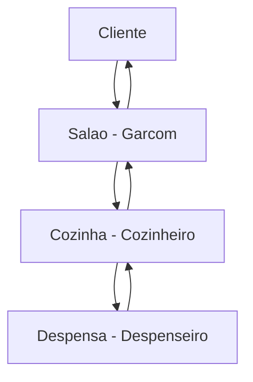
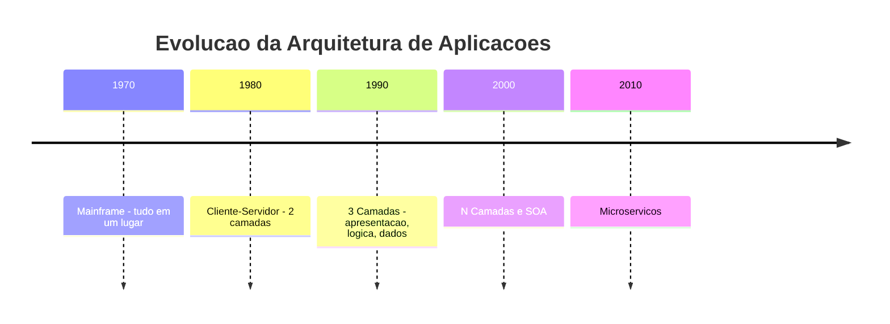
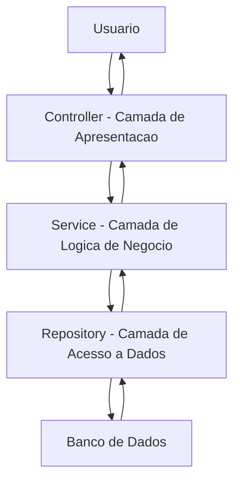
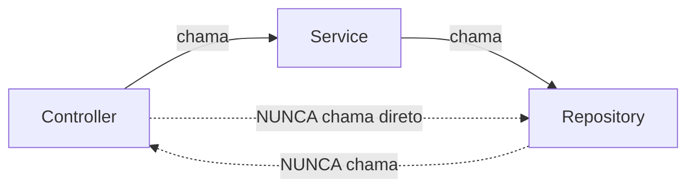
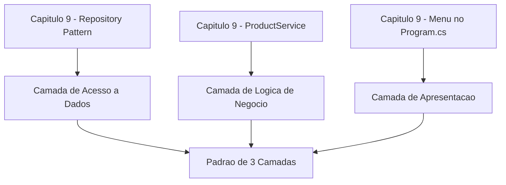
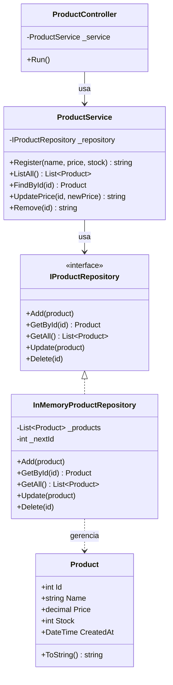
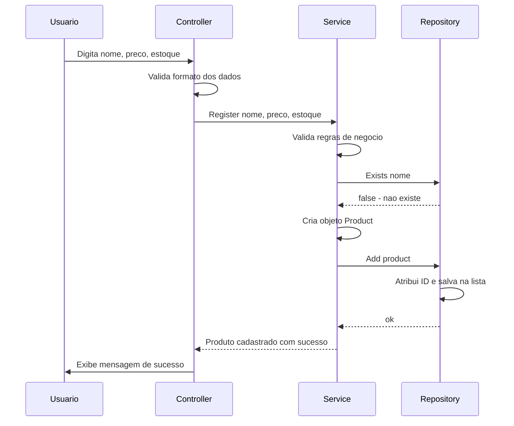
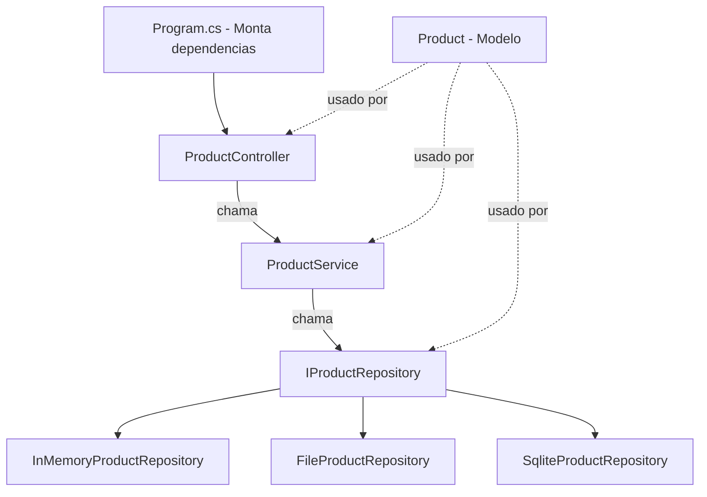

# 10.2 — Arquitetura em Camadas: O Padrão de 3 Camadas

[← Anterior: Por que Arquitetura Importa](cap10-mod01-por-que-arquitetura-conteudo.md) · [Próximo: Camada de Domínio →](cap10-mod03-camada-dominio-conteudo.md)

---

## Introdução

No módulo anterior, você entendeu por que arquitetura importa. Viu que código sem estrutura vira uma bagunça quando cresce, que separação de responsabilidades e baixo acoplamento são os dois pilares de qualquer boa arquitetura, e que simplicidade é o princípio central deste capítulo. Agora vem a pergunta natural: tá, mas como eu organizo meu código na prática?

A resposta mais comum, mais testada e mais simples é o **padrão de 3 camadas** (3-layer architecture). É o padrão que a maioria dos projetos profissionais usa. É o padrão que você vai encontrar no seu primeiro emprego. E é o padrão que vamos aprender agora.

A ideia é direta: dividir o código em 3 partes, cada uma com uma responsabilidade clara. A parte que recebe entrada do usuário. A parte que processa as regras do negócio. E a parte que acessa os dados. Três camadas. Três responsabilidades. Três pastas no projeto.

Parece simples? É simples. E essa é a beleza. Lembra do princípio que repetimos no módulo anterior? **A melhor arquitetura é a mais simples que resolve o problema.** O padrão de 3 camadas é exatamente isso — simples o suficiente para qualquer pessoa entender, robusto o suficiente para projetos reais.

E o mais interessante: você já usou partes desse padrão sem saber. No capítulo 9, quando criou o Repository Pattern, você separou o acesso a dados da lógica da aplicação. Isso já era uma camada. Agora vamos formalizar e completar o quadro.

---

## Como Executar os Exemplos Deste Módulo

Os exemplos deste módulo usam C# (.NET), a mesma linguagem do capítulo 9. Para executar:

1. Certifique-se de que o .NET SDK está instalado (você já configurou no módulo 9.3)
2. Crie uma pasta para os exemplos: `mkdir -p ~/meus-projetos/curso/cap10`
3. Para cada exemplo, crie um projeto console: `dotnet new console -n NomeDoExemplo`
4. Cole o código no arquivo `Program.cs`
5. Execute com `dotnet run`

Alguns exemplos deste módulo mostram múltiplos arquivos. Em um projeto real, cada classe ficaria em seu próprio arquivo. Para simplificar a execução dos exemplos, vamos colocar tudo em `Program.cs` — mas sempre indicando em qual arquivo cada classe ficaria em um projeto real.

---

## A Analogia: O Restaurante

Imagine um restaurante. Quando você chega, não vai direto à cozinha pegar sua comida. E o cozinheiro não sai da cozinha para anotar seu pedido. Existe uma organização clara:

1. **O salão** — onde o garçom recebe você, anota o pedido e depois traz o prato pronto. O garçom é a interface entre você (o cliente) e o restaurante. Ele não cozinha. Ele não vai à despensa buscar ingredientes. Ele recebe pedidos e entrega resultados.

2. **A cozinha** — onde o cozinheiro prepara os pratos. Ele recebe o pedido do garçom, aplica suas técnicas e receitas (as "regras do negócio"), e produz o prato. O cozinheiro não atende clientes. Ele não vai à despensa — ele pede os ingredientes.

3. **A despensa** — onde o despenseiro guarda e organiza os ingredientes. Quando a cozinha precisa de algo, o despenseiro busca. Ele sabe onde cada coisa está guardada, como conservar, quando repor. Ele não cozinha. Ele não atende clientes.

Cada pessoa tem uma função clara. O garçom não cozinha. O cozinheiro não atende mesas. O despenseiro não monta pratos. E se o restaurante trocar de fornecedor de ingredientes, só o despenseiro precisa saber — a cozinha continua recebendo os mesmos ingredientes, e o salão continua servindo os mesmos pratos.

Essa é exatamente a lógica das 3 camadas em software:

| Restaurante | Software | Responsabilidade |
|-------------|----------|-----------------|
| Salao com garcom | Controller | Recebe pedidos, entrega respostas |
| Cozinha com cozinheiro | Service | Aplica regras de negocio, processa |
| Despensa com despenseiro | Repository | Guarda e busca dados |



E a regra fundamental: **cada parte só conversa com a parte adjacente**. O cliente fala com o garçom, nunca com o cozinheiro. O garçom fala com o cozinheiro, nunca com o despenseiro. O cozinheiro fala com o despenseiro. Ninguém pula etapas.

---

## Contexto Histórico: Como o Padrão de Camadas Surgiu

Para entender por que o padrão de 3 camadas existe, precisamos voltar no tempo e ver qual problema ele resolveu.

### Anos 1970-1980: Tudo em Um Lugar

Nos primeiros sistemas comerciais, o software rodava em um único computador — o **mainframe**. O programa fazia tudo: exibia a tela para o usuário, processava as regras e acessava os dados. Tudo em um lugar, tudo misturado. Funcionava porque os programas eram relativamente simples e poucos usuários acessavam ao mesmo tempo.

### Anos 1980: Cliente-Servidor (2 Camadas)

Com a popularização dos PCs nos anos 1980, surgiu o modelo **cliente-servidor**. A ideia era separar em duas partes: o **cliente** (o programa no PC do usuário, com a interface gráfica) e o **servidor** (o banco de dados, geralmente em outro computador).

O cliente se conectava diretamente ao banco de dados. Parecia uma boa ideia, mas tinha problemas sérios:

- As regras de negócio ficavam no cliente. Se a regra mudasse, era preciso atualizar o programa em todos os PCs da empresa — às vezes centenas ou milhares de máquinas.
- Cada cliente abria uma conexão direta com o banco. Com muitos usuários, o banco ficava sobrecarregado.
- A lógica de negócio ficava duplicada: se dois programas diferentes acessavam os mesmos dados, cada um implementava suas próprias regras, e elas podiam divergir.

### Anos 1990: 3 Camadas — A Solução

Para resolver esses problemas, nos anos 1990 surgiu a arquitetura de **3 camadas** (3-tier architecture). A ideia era adicionar uma camada intermediária entre o cliente e o banco de dados — o **servidor de aplicação**. Essa camada centralizava as regras de negócio.



Com 3 camadas:
- Se a regra de negócio mudasse, bastava atualizar o servidor de aplicação — um único lugar.
- Os clientes não se conectavam mais diretamente ao banco — passavam pelo servidor de aplicação, que gerenciava as conexões.
- A lógica ficava centralizada: todos os clientes usavam as mesmas regras.

Esse padrão foi tão bem-sucedido que se tornou o padrão dominante da indústria. Frameworks como Java EE (Enterprise Edition), ASP.NET e Ruby on Rails foram construídos em torno dessa ideia. E até hoje, décadas depois, a maioria dos projetos profissionais segue esse padrão — porque ele funciona.

### A Diferença entre Tier e Layer

Você pode encontrar dois termos em inglês: **tier** e **layer**. Ambos significam "camada", mas com uma diferença sutil:

| Termo | Significado | Exemplo |
|-------|-------------|---------|
| Tier | Camada fisica — onde o código roda | PC do usuario, servidor web, servidor de banco |
| Layer | Camada lógica — como o código e organizado | Controller, Service, Repository |

Nos anos 1990, as 3 camadas eram tanto físicas quanto lógicas — cada camada rodava em um computador diferente. Hoje, em muitos projetos, as 3 camadas lógicas rodam no mesmo servidor (ou no mesmo container Docker). A separação é lógica, não física. Mas o princípio é o mesmo: cada camada tem uma responsabilidade clara.

Neste módulo, quando falamos de "3 camadas", estamos falando de **layers** — a organização lógica do código. É assim que você vai estruturar seus projetos.

---

## As 3 Camadas: Visão Geral

Vamos dar nome aos bois. As 3 camadas clássicas são:

### Camada 1: Apresentação / Entrada (Controller)

É a porta de entrada da aplicação. Recebe requisições do mundo externo — seja um usuário digitando no terminal, um navegador fazendo uma requisição HTTP, ou outro sistema chamando uma API. Sua responsabilidade é:

- Receber a entrada (dados do usuário, requisição HTTP, mensagem)
- Fazer validações básicas de formato (o campo está preenchido? o número é válido?)
- Chamar a camada de lógica de negócio
- Formatar e devolver a resposta

O que ela **não** faz:
- Não acessa banco de dados
- Não aplica regras de negócio
- Não calcula preços, descontos ou qualquer lógica do domínio

Na analogia do restaurante: é o **garçom**. Ele anota o pedido, verifica se está legível, passa para a cozinha e depois traz o prato para o cliente.

### Camada 2: Lógica de Negócio (Service / Domain)

É o coração da aplicação. Aqui ficam as regras que definem como o negócio funciona. Se o sistema é de e-commerce, aqui ficam as regras de cálculo de frete, desconto, estoque mínimo. Se é um sistema bancário, aqui ficam as regras de limite de saque, taxa de juros, validação de transferência.

Sua responsabilidade é:
- Aplicar regras de negócio
- Orquestrar operações (buscar dados, processar, salvar resultado)
- Validar regras do domínio (preço não pode ser negativo, estoque não pode ficar abaixo de zero)
- Coordenar chamadas ao repositório

O que ela **não** faz:
- Não sabe como os dados chegaram (se veio de um terminal, de uma API ou de um arquivo)
- Não sabe onde os dados estão guardados (se é SQLite, PostgreSQL ou memória)
- Não formata saída para o usuário

Na analogia do restaurante: é o **cozinheiro**. Ele recebe o pedido, aplica suas técnicas e receitas, e produz o resultado. Não importa se o pedido veio do salão ou de delivery — a receita é a mesma.

### Camada 3: Acesso a Dados (Repository)

É a camada que sabe onde e como os dados estão guardados. Ela abstrai todo o acesso a dados — banco de dados, arquivos, APIs externas, cache. O resto da aplicação não sabe (e não precisa saber) os detalhes de armazenamento.

Sua responsabilidade é:
- Conectar ao banco de dados (ou outro armazenamento)
- Executar queries (SQL, chamadas de API, leitura de arquivo)
- Converter dados do formato do banco para objetos da aplicação
- Converter objetos da aplicação para o formato do banco

O que ela **não** faz:
- Não aplica regras de negócio
- Não válida dados do domínio
- Não formata saída para o usuário

Na analogia do restaurante: é o **despenseiro**. Ele sabe onde cada ingrediente está guardado, como conservar, quando repor. A cozinha pede "me dá 500g de farinha" e o despenseiro entrega — sem se preocupar com qual receita vai usar.

### O Fluxo Completo

Quando uma requisição chega, ela percorre as 3 camadas de cima para baixo. A resposta volta de baixo para cima:



Exemplo concreto — cadastrar um produto:

1. **Controller** recebe os dados do usuário (nome: "Notebook", preço: 3500)
2. **Controller** verifica se os campos estão preenchidos (validação de formato)
3. **Controller** chama o **Service** passando os dados
4. **Service** aplica regras de negócio (preço deve ser positivo, nome não pode ser duplicado)
5. **Service** cria o objeto Product e chama o **Repository** para salvar
6. **Repository** converte o objeto para SQL e executa o INSERT no banco
7. **Repository** retorna confirmação para o **Service**
8. **Service** retorna resultado para o **Controller**
9. **Controller** formata a resposta e exibe para o usuário

Cada camada faz sua parte e passa adiante. Ninguém pula etapas.

---

## A Regra Fundamental: Só Conversa com o Vizinho

A regra mais importante do padrão de 3 camadas é: **cada camada só conversa com a camada adjacente**. O Controller chama o Service. O Service chama o Repository. Nunca o contrário, e nunca pulando camadas.



Isso significa:

| Permitido | Proibido |
|-----------|----------|
| Controller chama Service | Controller chama Repository direto |
| Service chama Repository | Repository chama Controller |
| Service retorna para Controller | Controller acessa banco direto |
| Repository retorna para Service | Service exibe dados no console |

Por que essa regra existe? Porque ela garante que cada camada pode mudar independentemente. Se o Controller chamar o Repository direto, ele fica acoplado ao banco de dados. Se o Repository chamar o Controller, ele fica acoplado à interface. A regra de "só conversa com o vizinho" mantém o acoplamento baixo.

### E se eu precisar de dados no Controller?

"Mas e se o Controller precisa de dados do banco?" — ele pede para o Service, que pede para o Repository. O Controller nunca vai direto ao banco. Parece burocrático? Pode parecer, mas essa "burocracia" é o que permite trocar o banco sem mexer no Controller, ou trocar a interface sem mexer no Repository.

Pense no restaurante: o cliente nunca vai à despensa buscar ingredientes. Ele pede ao garçom, que pede ao cozinheiro, que pede ao despenseiro. Se a despensa mudar de lugar, o cliente nem percebe.

---

## Estrutura de Pastas Concreta

Vamos ver como as 3 camadas se traduzem em pastas e arquivos em um projeto C# real. Aqui está a estrutura que vamos usar:

```
MeuProjeto/
    Controllers/
        ProductController.cs     # Recebe entrada, exibe saida
    Services/
        ProductService.cs        # Regras de negocio
    Repositories/
        ProductRepository.cs     # Acesso a dados
    Models/
        Product.cs               # Entidade de dominio
    DTOs/
        CreateProductRequest.cs  # Dados de entrada
        ProductResponse.cs       # Dados de saida
    Program.cs                   # Ponto de entrada e configuracao
```

Cada pasta corresponde a uma responsabilidade:

| Pasta | Camada | Responsabilidade |
|-------|--------|-----------------|
| Controllers/ | Apresentacao | Receber entrada, chamar servico, formatar saida |
| Services/ | Lógica de Negocio | Regras do dominio, orquestracao |
| Repositories/ | Acesso a Dados | CRUD no banco, queries, conversoes |
| Models/ | Transversal | Entidades do dominio usadas por todas as camadas |
| DTOs/ | Apresentacao | Objetos de transferencia entre camadas |
| Program.cs | Configuração | Monta as dependências e inicia a aplicação |

### O que são DTOs?

**DTO** significa **Data Transfer Object** (Objeto de Transferência de Dados). É uma classe simples que serve apenas para transportar dados entre camadas. Diferente de uma entidade de domínio (que pode ter métodos e regras), um DTO é apenas um "pacote de dados".

Por que usar DTOs? Porque às vezes os dados que o usuário envia são diferentes dos dados que a entidade armazena. O usuário envia nome e preço. A entidade tem nome, preço, ID, data de criação e status. O DTO do request tem só nome e preço. O DTO do response pode ter nome, preço e ID.

Mas atenção: DTOs nem sempre são necessários. Para projetos simples, usar a própria entidade como entrada e saída funciona perfeitamente. Lembra do princípio de simplicidade? Não crie DTOs "por precaução" — crie quando houver uma diferença real entre os dados de entrada, os dados da entidade e os dados de saída. Vamos ver exemplos concretos mais adiante.

### E a pasta Models?

A pasta `Models/` contém as entidades do domínio — as classes que representam os conceitos do negócio (Product, Customer, Order). Essas classes são usadas por todas as camadas, por isso ficam em uma pasta separada, não dentro de nenhuma camada específica.

No módulo 10.3, vamos aprofundar a camada de domínio. Por enquanto, pense nos Models como as "coisas" do seu sistema — os produtos, clientes, pedidos que o sistema gerência.

---

## Os Nomes Variam — A Responsabilidade Não

Antes de ver código, um aviso importante: **os nomes das camadas variam muito entre projetos, empresas e frameworks**. O que chamamos de "Service" aqui, outro projeto pode chamar de "UseCase", "Handler", "Manager", "Interactor" ou "BusinessLogic". O que chamamos de "Repository", outro projeto pode chamar de "DataAccess", "Store", "Gateway", "Dao" ou "Persistence".

Isso confunde muita gente no começo. Você lê um tutorial que fala em "UseCase", outro que fala em "Service", outro que fala em "Handler" — e parece que são coisas diferentes. Na maioria das vezes, são a mesma coisa com nomes diferentes.

O que importa não é o nome. O que importa é a **responsabilidade**. Se uma classe recebe entrada do usuário e formata saída, ela é um Controller — mesmo que se chame "Endpoint", "Handler" ou "Action". Se uma classe aplica regras de negócio, ela é um Service — mesmo que se chame "UseCase" ou "Manager".

| Camada | Nomes comuns | Responsabilidade (sempre a mesma) |
|--------|-------------|----------------------------------|
| Apresentacao | Controller, Endpoint, Handler, Action, View, Presenter | Receber entrada, formatar saida |
| Lógica de Negocio | Service, UseCase, Handler, Manager, Interactor, BusinessLogic | Regras do dominio, orquestracao |
| Acesso a Dados | Repository, DataAccess, Store, Gateway, Dao, Persistence | CRUD, queries, acesso a banco |

Neste curso, vamos usar os nomes mais comuns: **Controller**, **Service** e **Repository**. São os nomes que você vai encontrar na maioria dos projetos .NET, Java e Python. Mas quando entrar em um projeto que usa outros nomes, não se assuste — olhe a responsabilidade, não o nome.

---

## Paralelo com o Capítulo 9: Você Já Fez Isso

Se você está pensando "isso parece familiar", é porque é. No capítulo 9, você já usou partes desse padrão:

- No módulo 9.9, você criou o **Repository Pattern** — uma interface `IProductRepository` com implementações `InMemoryProductRepository` e `SqliteProductRepository`. Isso é a camada de acesso a dados.
- No mesmo módulo, você criou o **ProductService** — uma classe que recebia o repository e aplicava regras de negócio (validar preço positivo, filtrar produtos caros). Isso é a camada de lógica de negócio.
- O código que exibia o menu e lia entrada do usuário? Isso era a camada de apresentação — só que estava misturado no `Program.cs`.

O que faltava era formalizar: separar cada parte em sua própria pasta, dar nomes claros e estabelecer as regras de comunicação entre elas. É exatamente o que vamos fazer agora.



A diferença é que no capítulo 9, tudo ficava no mesmo arquivo ou na mesma pasta. Agora, cada camada vai para sua própria pasta, com regras claras de quem chama quem.

---

## Mão na Massa: Construindo as 3 Camadas

Vamos construir um sistema de cadastro de produtos usando as 3 camadas. Vamos fazer passo a passo, camada por camada, para que você veja como cada parte funciona e como elas se conectam.

### Passo 1: O Modelo (Models/Product.cs)

Primeiro, a entidade de domínio. O Product é a "coisa" que o sistema gerência:

```csharp
// === Em um projeto real, este codigo ficaria em Models/Product.cs ===
// "Product" = Produto — entidade de dominio

public class Product
{
    public int Id { get; set; }          // "Id" = identificador unico
    public string Name { get; set; }     // "Name" = nome do produto
    public decimal Price { get; set; }   // "Price" = preco (decimal para dinheiro)
    public int Stock { get; set; }       // "Stock" = estoque disponivel
    public DateTime CreatedAt { get; set; } // "CreatedAt" = data de criacao

    // Construtor
    public Product(string name, decimal price, int stock)
    {
        Name = name;
        Price = price;
        Stock = stock;
        CreatedAt = DateTime.Now; // data atual
    }

    // Metodo para exibir informacoes
    public override string ToString()
    {
        return $"[{Id}] {Name} — R${Price:F2} (Estoque: {Stock})";
    }
}
```

Saída esperada: nenhuma (é apenas a definição da classe)

O modelo é simples: dados e um método de exibição. Ele não sabe nada sobre banco de dados, interface ou regras de negócio complexas. É apenas a representação de um produto.

### Passo 2: O Repository (Repositories/ProductRepository.cs)

Agora, a camada de acesso a dados. Vamos usar uma implementação em memória (como no capítulo 9) para focar no padrão, sem a complexidade de um banco real:

```csharp
// === Em um projeto real, este codigo ficaria em Repositories/ProductRepository.cs ===
// "IProductRepository" = interface do repositorio de produtos
// "InMemoryProductRepository" = implementacao em memoria

public interface IProductRepository
{
    List<Product> GetAll();              // "GetAll" = obter todos
    Product GetById(int id);             // "GetById" = obter por ID
    void Add(Product product);           // "Add" = adicionar
    void Update(Product product);        // "Update" = atualizar
    void Delete(int id);                 // "Delete" = remover
    bool Exists(string name);            // "Exists" = verificar se existe
}

public class InMemoryProductRepository : IProductRepository
{
    // Lista interna que simula o banco de dados
    private List<Product> _products = new List<Product>();
    private int _nextId = 1; // "nextId" = proximo ID

    public List<Product> GetAll()
    {
        // Retorna copia da lista para proteger os dados internos
        return new List<Product>(_products);
    }

    public Product GetById(int id)
    {
        // Percorre a lista procurando pelo ID
        foreach (var product in _products)
        {
            if (product.Id == id)
                return product;
        }
        return null; // nao encontrou
    }

    public void Add(Product product)
    {
        product.Id = _nextId; // atribui ID automatico
        _nextId++;
        _products.Add(product);
    }

    public void Update(Product product)
    {
        // Encontra o produto pelo ID e substitui
        for (int i = 0; i < _products.Count; i++)
        {
            if (_products[i].Id == product.Id)
            {
                _products[i] = product;
                return;
            }
        }
    }

    public void Delete(int id)
    {
        // Remove o produto com o ID informado
        _products.RemoveAll(p => p.Id == id);
    }

    public bool Exists(string name)
    {
        // Verifica se ja existe um produto com esse nome
        foreach (var product in _products)
        {
            if (product.Name.Equals(name, StringComparison.OrdinalIgnoreCase))
                return true;
        }
        return false;
    }
}
```

Saída esperada: nenhuma (é apenas a definição das classes)

Observe: o Repository só sabe fazer operações de dados — adicionar, buscar, atualizar, remover. Ele não sabe se o preço é válido, se o estoque é suficiente ou se o nome é duplicado no sentido de regra de negócio. Ele apenas guarda e busca dados.

O método `Exists` pode parecer uma regra de negócio, mas não é — é uma consulta de dados. "Existe um produto com esse nome?" é uma pergunta sobre os dados, não uma regra sobre o que fazer com a resposta. Quem decide o que fazer (rejeitar o cadastro, por exemplo) é o Service.

### Passo 3: O Service (Services/ProductService.cs)

Agora, a camada de lógica de negócio. Aqui ficam as regras do domínio:

```csharp
// === Em um projeto real, este codigo ficaria em Services/ProductService.cs ===
// "ProductService" = servico de produtos — logica de negocio

public class ProductService
{
    private readonly IProductRepository _repository; // acesso aos dados

    // Recebe o repositorio pelo construtor (injecao de dependencia)
    public ProductService(IProductRepository repository)
    {
        _repository = repository;
    }

    // Cadastrar novo produto — com regras de negocio
    // "Register" = registrar
    public string Register(string name, decimal price, int stock)
    {
        // Regra 1: nome nao pode ser vazio
        if (string.IsNullOrWhiteSpace(name))
        {
            return "Erro: nome do produto nao pode ser vazio.";
        }

        // Regra 2: preco deve ser positivo
        if (price <= 0)
        {
            return "Erro: preco deve ser maior que zero.";
        }

        // Regra 3: estoque nao pode ser negativo
        if (stock < 0)
        {
            return "Erro: estoque nao pode ser negativo.";
        }

        // Regra 4: nao pode ter produto com nome duplicado
        if (_repository.Exists(name))
        {
            return $"Erro: ja existe um produto com o nome '{name}'.";
        }

        // Tudo valido — cria e salva o produto
        var product = new Product(name, price, stock);
        _repository.Add(product);

        return $"Produto '{name}' cadastrado com sucesso! ID: {product.Id}";
    }

    // Listar todos os produtos
    public List<Product> ListAll()
    {
        return _repository.GetAll();
    }

    // Buscar produto por ID
    public Product FindById(int id)
    {
        return _repository.GetById(id);
    }

    // Atualizar preco — com regra de negocio
    // "UpdatePrice" = atualizar preco
    public string UpdatePrice(int id, decimal newPrice)
    {
        // Regra: preco deve ser positivo
        if (newPrice <= 0)
        {
            return "Erro: preco deve ser maior que zero.";
        }

        var product = _repository.GetById(id);
        if (product == null)
        {
            return $"Erro: produto com ID {id} nao encontrado.";
        }

        product.Price = newPrice;
        _repository.Update(product);

        return $"Preco de '{product.Name}' atualizado para R${newPrice:F2}.";
    }

    // Adicionar estoque
    // "AddStock" = adicionar estoque
    public string AddStock(int id, int quantity)
    {
        // Regra: quantidade deve ser positiva
        if (quantity <= 0)
        {
            return "Erro: quantidade deve ser maior que zero.";
        }

        var product = _repository.GetById(id);
        if (product == null)
        {
            return $"Erro: produto com ID {id} nao encontrado.";
        }

        product.Stock += quantity;
        _repository.Update(product);

        return $"Estoque de '{product.Name}' atualizado para {product.Stock} unidades.";
    }

    // Remover produto
    public string Remove(int id)
    {
        var product = _repository.GetById(id);
        if (product == null)
        {
            return $"Erro: produto com ID {id} nao encontrado.";
        }

        _repository.Delete(id);
        return $"Produto '{product.Name}' removido com sucesso.";
    }
}
```

Saída esperada: nenhuma (é apenas a definição da classe)

Observe as regras de negócio no Service:
- Nome não pode ser vazio
- Preço deve ser positivo
- Estoque não pode ser negativo
- Não pode ter nome duplicado
- Quantidade adicionada ao estoque deve ser positiva

Essas são decisões do **negócio**, não decisões técnicas. O banco de dados não se importa se o preço é negativo — ele guarda qualquer número. Quem se importa é o negócio. Por isso essas regras ficam no Service, não no Repository.

Observe também que o Service **não sabe** como os dados são armazenados. Ele usa `_repository.Add()`, `_repository.GetById()` — métodos da interface. Se amanhã o repositório mudar de memória para SQLite, o Service não muda nenhuma linha.

### Passo 4: O Controller (Controllers/ProductController.cs)

Finalmente, a camada de apresentação. Aqui fica a interface com o usuário:

```csharp
// === Em um projeto real, este codigo ficaria em Controllers/ProductController.cs ===
// "ProductController" = controlador de produtos — interface com usuario

public class ProductController
{
    private readonly ProductService _service; // acesso a logica de negocio

    // Recebe o servico pelo construtor
    public ProductController(ProductService service)
    {
        _service = service;
    }

    // Inicia o menu principal
    // "Run" = executar
    public void Run()
    {
        while (true)
        {
            Console.WriteLine("\n========================================");
            Console.WriteLine("       SISTEMA DE PRODUTOS");
            Console.WriteLine("========================================");
            Console.WriteLine("  1. Cadastrar produto");
            Console.WriteLine("  2. Listar produtos");
            Console.WriteLine("  3. Buscar produto por ID");
            Console.WriteLine("  4. Atualizar preco");
            Console.WriteLine("  5. Adicionar estoque");
            Console.WriteLine("  6. Remover produto");
            Console.WriteLine("  0. Sair");
            Console.WriteLine("========================================");
            Console.Write("Escolha uma opcao: ");

            var choice = Console.ReadLine(); // le a opcao do usuario

            switch (choice)
            {
                case "1": RegisterProduct(); break;
                case "2": ListProducts(); break;
                case "3": FindProduct(); break;
                case "4": UpdatePrice(); break;
                case "5": AddStock(); break;
                case "6": RemoveProduct(); break;
                case "0":
                    Console.WriteLine("Ate logo!");
                    return; // sai do metodo Run
                default:
                    Console.WriteLine("Opcao invalida!");
                    break;
            }
        }
    }

    // Cadastrar produto — le dados e chama o servico
    private void RegisterProduct()
    {
        Console.Write("Nome do produto: ");
        var name = Console.ReadLine();

        Console.Write("Preco: ");
        if (!decimal.TryParse(Console.ReadLine(), out var price))
        {
            Console.WriteLine("Erro: preco invalido!");
            return;
        }

        Console.Write("Estoque inicial: ");
        if (!int.TryParse(Console.ReadLine(), out var stock))
        {
            Console.WriteLine("Erro: estoque invalido!");
            return;
        }

        // Chama o servico — o Controller NAO aplica regras de negocio
        var result = _service.Register(name, price, stock);
        Console.WriteLine(result);
    }

    // Listar produtos — pede ao servico e exibe
    private void ListProducts()
    {
        var products = _service.ListAll();

        if (products.Count == 0)
        {
            Console.WriteLine("\nNenhum produto cadastrado.");
            return;
        }

        Console.WriteLine($"\n--- Produtos ({products.Count}) ---");
        foreach (var product in products)
        {
            Console.WriteLine($"  {product}"); // usa o ToString do Product
        }
    }

    // Buscar produto por ID
    private void FindProduct()
    {
        Console.Write("ID do produto: ");
        if (!int.TryParse(Console.ReadLine(), out var id))
        {
            Console.WriteLine("Erro: ID invalido!");
            return;
        }

        var product = _service.FindById(id);
        if (product == null)
        {
            Console.WriteLine("Produto nao encontrado.");
        }
        else
        {
            Console.WriteLine($"\nProduto encontrado: {product}");
        }
    }

    // Atualizar preco
    private void UpdatePrice()
    {
        Console.Write("ID do produto: ");
        if (!int.TryParse(Console.ReadLine(), out var id))
        {
            Console.WriteLine("Erro: ID invalido!");
            return;
        }

        Console.Write("Novo preco: ");
        if (!decimal.TryParse(Console.ReadLine(), out var price))
        {
            Console.WriteLine("Erro: preco invalido!");
            return;
        }

        var result = _service.UpdatePrice(id, price);
        Console.WriteLine(result);
    }

    // Adicionar estoque
    private void AddStock()
    {
        Console.Write("ID do produto: ");
        if (!int.TryParse(Console.ReadLine(), out var id))
        {
            Console.WriteLine("Erro: ID invalido!");
            return;
        }

        Console.Write("Quantidade a adicionar: ");
        if (!int.TryParse(Console.ReadLine(), out var qty))
        {
            Console.WriteLine("Erro: quantidade invalida!");
            return;
        }

        var result = _service.AddStock(id, qty);
        Console.WriteLine(result);
    }

    // Remover produto
    private void RemoveProduct()
    {
        Console.Write("ID do produto: ");
        if (!int.TryParse(Console.ReadLine(), out var id))
        {
            Console.WriteLine("Erro: ID invalido!");
            return;
        }

        var result = _service.Remove(id);
        Console.WriteLine(result);
    }
}
```

Saída esperada: nenhuma (é apenas a definição da classe)

Observe o que o Controller faz e o que ele **não** faz:

| O Controller FAZ | O Controller NAO FAZ |
|-----------------|---------------------|
| Exibe o menu | Válida regras de negocio |
| Le entrada do usuario | Acessa banco de dados |
| Converte texto para número | Decide se o preco e válido |
| Chama o Service | Cria objetos Product diretamente |
| Exibe o resultado | Executa SQL |

O Controller faz validações de **formato** (o texto é um número válido?), não validações de **negócio** (o preço é positivo?). A diferença é sutil mas importante:

- Validação de formato: "o usuário digitou um número?" — responsabilidade do Controller
- Validação de negócio: "o preço é maior que zero?" — responsabilidade do Service

### Passo 5: O Program.cs — Montando Tudo

O `Program.cs` é o ponto de entrada. Ele cria as dependências e conecta as camadas:

```csharp
// === Program.cs — Ponto de entrada ===
// Aqui montamos as dependencias e iniciamos a aplicacao

// 1. Cria o repositorio (camada de dados)
IProductRepository repository = new InMemoryProductRepository();

// 2. Cria o servico, passando o repositorio (camada de logica)
var service = new ProductService(repository);

// 3. Cria o controller, passando o servico (camada de apresentacao)
var controller = new ProductController(service);

// 4. Inicia a aplicacao
controller.Run();
```

Saída esperada (ao executar o programa):

```
========================================
       SISTEMA DE PRODUTOS
========================================
  1. Cadastrar produto
  2. Listar produtos
  3. Buscar produto por ID
  4. Atualizar preco
  5. Adicionar estoque
  6. Remover produto
  0. Sair
========================================
Escolha uma opcao:
```

Observe como o `Program.cs` monta a cadeia de dependências:
- Repository não depende de ninguém
- Service depende do Repository
- Controller depende do Service

Essa montagem é feita de baixo para cima: primeiro o que não depende de nada, depois o que depende do anterior. Em projetos maiores, frameworks como ASP.NET fazem essa montagem automaticamente (chamada de **injeção de dependência**). Aqui estamos fazendo manualmente para que você entenda o que acontece por trás.

Veja a estrutura completa das 3 camadas em um diagrama de classes:



---

## Programa Completo: Tudo Junto

Agora vamos juntar todas as peças em um programa completo que você pode copiar, colar e executar. Em um projeto real, cada classe ficaria em seu próprio arquivo. Aqui, para facilitar a execução, está tudo em `Program.cs`:

```csharp
// === PROGRAMA COMPLETO: Sistema de Produtos com 3 Camadas ===
// Em um projeto real, cada classe ficaria em seu proprio arquivo.
// Aqui esta tudo junto para facilitar a execucao.

using System;
using System.Collections.Generic;

// ============================================================
// MODELS — Entidade de dominio
// ============================================================

// "Product" = Produto
public class Product
{
    public int Id { get; set; }
    public string Name { get; set; }
    public decimal Price { get; set; }
    public int Stock { get; set; }
    public DateTime CreatedAt { get; set; }

    public Product(string name, decimal price, int stock)
    {
        Name = name;
        Price = price;
        Stock = stock;
        CreatedAt = DateTime.Now;
    }

    public override string ToString()
    {
        return $"[{Id}] {Name} — R${Price:F2} (Estoque: {Stock})";
    }
}

// ============================================================
// REPOSITORIES — Acesso a dados
// ============================================================

// Interface do repositorio
public interface IProductRepository
{
    List<Product> GetAll();
    Product GetById(int id);
    void Add(Product product);
    void Update(Product product);
    void Delete(int id);
    bool Exists(string name);
}

// Implementacao em memoria
public class InMemoryProductRepository : IProductRepository
{
    private List<Product> _products = new List<Product>();
    private int _nextId = 1;

    public List<Product> GetAll() => new List<Product>(_products);

    public Product GetById(int id)
    {
        foreach (var p in _products)
            if (p.Id == id) return p;
        return null;
    }

    public void Add(Product product)
    {
        product.Id = _nextId++;
        _products.Add(product);
    }

    public void Update(Product product)
    {
        for (int i = 0; i < _products.Count; i++)
            if (_products[i].Id == product.Id)
            { _products[i] = product; return; }
    }

    public void Delete(int id)
    {
        _products.RemoveAll(p => p.Id == id);
    }

    public bool Exists(string name)
    {
        foreach (var p in _products)
            if (p.Name.Equals(name, StringComparison.OrdinalIgnoreCase))
                return true;
        return false;
    }
}

// ============================================================
// SERVICES — Logica de negocio
// ============================================================

// "ProductService" = Servico de Produtos
public class ProductService
{
    private readonly IProductRepository _repository;

    public ProductService(IProductRepository repository)
    {
        _repository = repository;
    }

    public string Register(string name, decimal price, int stock)
    {
        if (string.IsNullOrWhiteSpace(name))
            return "Erro: nome do produto nao pode ser vazio.";
        if (price <= 0)
            return "Erro: preco deve ser maior que zero.";
        if (stock < 0)
            return "Erro: estoque nao pode ser negativo.";
        if (_repository.Exists(name))
            return $"Erro: ja existe um produto com o nome '{name}'.";

        var product = new Product(name, price, stock);
        _repository.Add(product);
        return $"Produto '{name}' cadastrado com sucesso! ID: {product.Id}";
    }

    public List<Product> ListAll() => _repository.GetAll();

    public Product FindById(int id) => _repository.GetById(id);

    public string UpdatePrice(int id, decimal newPrice)
    {
        if (newPrice <= 0)
            return "Erro: preco deve ser maior que zero.";
        var product = _repository.GetById(id);
        if (product == null)
            return $"Erro: produto com ID {id} nao encontrado.";
        product.Price = newPrice;
        _repository.Update(product);
        return $"Preco de '{product.Name}' atualizado para R${newPrice:F2}.";
    }

    public string AddStock(int id, int quantity)
    {
        if (quantity <= 0)
            return "Erro: quantidade deve ser maior que zero.";
        var product = _repository.GetById(id);
        if (product == null)
            return $"Erro: produto com ID {id} nao encontrado.";
        product.Stock += quantity;
        _repository.Update(product);
        return $"Estoque de '{product.Name}' atualizado para {product.Stock} unidades.";
    }

    public string Remove(int id)
    {
        var product = _repository.GetById(id);
        if (product == null)
            return $"Erro: produto com ID {id} nao encontrado.";
        _repository.Delete(id);
        return $"Produto '{product.Name}' removido com sucesso.";
    }
}

// ============================================================
// CONTROLLERS — Interface com usuario
// ============================================================

// "ProductController" = Controlador de Produtos
public class ProductController
{
    private readonly ProductService _service;

    public ProductController(ProductService service)
    {
        _service = service;
    }

    public void Run()
    {
        while (true)
        {
            Console.WriteLine("\n========================================");
            Console.WriteLine("       SISTEMA DE PRODUTOS");
            Console.WriteLine("========================================");
            Console.WriteLine("  1. Cadastrar produto");
            Console.WriteLine("  2. Listar produtos");
            Console.WriteLine("  3. Buscar produto por ID");
            Console.WriteLine("  4. Atualizar preco");
            Console.WriteLine("  5. Adicionar estoque");
            Console.WriteLine("  6. Remover produto");
            Console.WriteLine("  0. Sair");
            Console.WriteLine("========================================");
            Console.Write("Escolha uma opcao: ");

            switch (Console.ReadLine())
            {
                case "1": RegisterProduct(); break;
                case "2": ListProducts(); break;
                case "3": FindProduct(); break;
                case "4": UpdatePrice(); break;
                case "5": AddStock(); break;
                case "6": RemoveProduct(); break;
                case "0":
                    Console.WriteLine("Ate logo!");
                    return;
                default:
                    Console.WriteLine("Opcao invalida!");
                    break;
            }
        }
    }

    private void RegisterProduct()
    {
        Console.Write("Nome do produto: ");
        var name = Console.ReadLine();
        Console.Write("Preco: ");
        if (!decimal.TryParse(Console.ReadLine(), out var price))
        { Console.WriteLine("Erro: preco invalido!"); return; }
        Console.Write("Estoque inicial: ");
        if (!int.TryParse(Console.ReadLine(), out var stock))
        { Console.WriteLine("Erro: estoque invalido!"); return; }
        Console.WriteLine(_service.Register(name, price, stock));
    }

    private void ListProducts()
    {
        var products = _service.ListAll();
        if (products.Count == 0)
        { Console.WriteLine("\nNenhum produto cadastrado."); return; }
        Console.WriteLine($"\n--- Produtos ({products.Count}) ---");
        foreach (var p in products)
            Console.WriteLine($"  {p}");
    }

    private void FindProduct()
    {
        Console.Write("ID do produto: ");
        if (!int.TryParse(Console.ReadLine(), out var id))
        { Console.WriteLine("Erro: ID invalido!"); return; }
        var product = _service.FindById(id);
        Console.WriteLine(product == null
            ? "Produto nao encontrado."
            : $"\nProduto encontrado: {product}");
    }

    private void UpdatePrice()
    {
        Console.Write("ID do produto: ");
        if (!int.TryParse(Console.ReadLine(), out var id))
        { Console.WriteLine("Erro: ID invalido!"); return; }
        Console.Write("Novo preco: ");
        if (!decimal.TryParse(Console.ReadLine(), out var price))
        { Console.WriteLine("Erro: preco invalido!"); return; }
        Console.WriteLine(_service.UpdatePrice(id, price));
    }

    private void AddStock()
    {
        Console.Write("ID do produto: ");
        if (!int.TryParse(Console.ReadLine(), out var id))
        { Console.WriteLine("Erro: ID invalido!"); return; }
        Console.Write("Quantidade a adicionar: ");
        if (!int.TryParse(Console.ReadLine(), out var qty))
        { Console.WriteLine("Erro: quantidade invalida!"); return; }
        Console.WriteLine(_service.AddStock(id, qty));
    }

    private void RemoveProduct()
    {
        Console.Write("ID do produto: ");
        if (!int.TryParse(Console.ReadLine(), out var id))
        { Console.WriteLine("Erro: ID invalido!"); return; }
        Console.WriteLine(_service.Remove(id));
    }
}

// ============================================================
// PROGRAM.CS — Ponto de entrada
// ============================================================

// Monta as dependencias de baixo para cima
IProductRepository repository = new InMemoryProductRepository();
var service = new ProductService(repository);
var controller = new ProductController(service);

// Inicia a aplicacao
controller.Run();
```

Saída esperada (exemplo de interação):

```
========================================
       SISTEMA DE PRODUTOS
========================================
  1. Cadastrar produto
  2. Listar produtos
  3. Buscar produto por ID
  4. Atualizar preco
  5. Adicionar estoque
  6. Remover produto
  0. Sair
========================================
Escolha uma opcao: 1
Nome do produto: Notebook
Preco: 3500
Estoque inicial: 10
Produto 'Notebook' cadastrado com sucesso! ID: 1

========================================
       SISTEMA DE PRODUTOS
========================================
  1. Cadastrar produto
  2. Listar produtos
  3. Buscar produto por ID
  4. Atualizar preco
  5. Adicionar estoque
  6. Remover produto
  0. Sair
========================================
Escolha uma opcao: 1
Nome do produto: Mouse
Preco: 89.90
Estoque inicial: 30
Produto 'Mouse' cadastrado com sucesso! ID: 2

========================================
       SISTEMA DE PRODUTOS
========================================
Escolha uma opcao: 2

--- Produtos (2) ---
  [1] Notebook — R$3500.00 (Estoque: 10)
  [2] Mouse — R$89.90 (Estoque: 30)

========================================
       SISTEMA DE PRODUTOS
========================================
Escolha uma opcao: 4
ID do produto: 1
Novo preco: 3200
Preco de 'Notebook' atualizado para R$3200.00.

========================================
       SISTEMA DE PRODUTOS
========================================
Escolha uma opcao: 0
Ate logo!
```

---

## Rastreando uma Requisição: O Fluxo Completo

Vamos rastrear exatamente o que acontece quando o usuário cadastra um produto. Isso ajuda a entender como as camadas se comunicam:



Passo a passo detalhado:

| Passo | Camada | O que acontece |
|-------|--------|---------------|
| 1 | Controller | Le "Notebook", "3500", "10" do teclado |
| 2 | Controller | Converte "3500" para decimal e "10" para int |
| 3 | Controller | Chama `_service.Register("Notebook", 3500, 10)` |
| 4 | Service | Verifica: nome não e vazio? Ok |
| 5 | Service | Verifica: preco maior que zero? Ok |
| 6 | Service | Verifica: estoque não e negativo? Ok |
| 7 | Service | Chama `_repository.Exists("Notebook")` |
| 8 | Repository | Percorre a lista, não encontra "Notebook" |
| 9 | Repository | Retorna `false` para o Service |
| 10 | Service | Cria `new Product("Notebook", 3500, 10)` |
| 11 | Service | Chama `_repository.Add(product)` |
| 12 | Repository | Atribui ID 1, adiciona na lista |
| 13 | Repository | Retorna para o Service |
| 14 | Service | Retorna "Produto cadastrado com sucesso! ID: 1" |
| 15 | Controller | Exibe a mensagem no console |

Observe como cada camada faz apenas sua parte. O Controller não sabe que existe uma lista interna no Repository. O Service não sabe que o usuário digitou no teclado. O Repository não sabe que existe um menu. Cada um faz o seu trabalho e passa adiante.

---

## Validação de Formato vs Validação de Negócio

Uma dúvida comum é: "onde fica a validação?" A resposta é que existem dois tipos de validação, e cada um fica em uma camada diferente.

### Validação de Formato (Controller)

Verifica se os dados estão no formato correto para serem processados. Não envolve regras do negócio — apenas garante que os dados são tecnicamente válidos.

Exemplos:
- O campo "preço" é um número? (`decimal.TryParse`)
- O campo "ID" é um inteiro? (`int.TryParse`)
- O campo "email" tem formato de email? (contém @)
- O campo "data" está no formato correto? (`DateTime.TryParse`)

Essas validações ficam no **Controller** porque são sobre a entrada do usuário, não sobre o negócio.

### Validação de Negócio (Service)

Verifica se os dados atendem às regras do domínio. Envolve decisões que o negócio definiu.

Exemplos:
- O preço é maior que zero? (regra: não vendemos de graça)
- O estoque é suficiente para a venda? (regra: não vendemos o que não temos)
- O nome do produto é único? (regra: não queremos duplicatas)
- O desconto é no máximo 50%? (regra: limite de desconto)

Essas validações ficam no **Service** porque são regras do negócio.

| Tipo | Onde fica | Pergunta que responde | Exemplo |
|------|----------|----------------------|---------|
| Formato | Controller | O dado e tecnicamente válido? | "3500" e um número? |
| Negocio | Service | O dado atende as regras do dominio? | O preco e positivo? |

### Por que separar?

Porque as validações de formato dependem da interface (terminal, API, formulário web), e as validações de negócio são universais. Se amanhã o sistema ganhar uma API REST além do terminal, as validações de formato mudam (agora vêm em JSON, não do teclado), mas as validações de negócio continuam as mesmas.

---

## O Poder da Troca: Mudando uma Camada sem Afetar as Outras

A grande vantagem do padrão de 3 camadas é que você pode trocar uma camada inteira sem afetar as outras. Vamos ver exemplos concretos.

### Exemplo 1: Trocar o Armazenamento

Imagine que o projeto precisa mudar de memória para arquivo. Basta criar uma nova implementação do Repository:

```csharp
// Nova implementacao: salva em arquivo em vez de memoria
// "FileProductRepository" = Repositorio de Produto em Arquivo
public class FileProductRepository : IProductRepository
{
    private string _filePath; // "filePath" = caminho do arquivo

    public FileProductRepository(string filePath)
    {
        _filePath = filePath;
    }

    public void Add(Product product)
    {
        // Simula salvar em arquivo
        Console.WriteLine($"[ARQUIVO] Salvando '{product.Name}' em {_filePath}");
    }

    public List<Product> GetAll()
    {
        // Simula ler do arquivo
        Console.WriteLine($"[ARQUIVO] Lendo produtos de {_filePath}");
        return new List<Product>();
    }

    // ... demais metodos seguem o mesmo padrao
    public Product GetById(int id) { return null; }
    public void Update(Product product) { }
    public void Delete(int id) { }
    public bool Exists(string name) { return false; }
}
```

Saída esperada: nenhuma (é apenas a definição da classe)

Para usar, muda **uma linha** no `Program.cs`:

```csharp
// Antes: memoria
IProductRepository repository = new InMemoryProductRepository();

// Depois: arquivo — so muda esta linha!
IProductRepository repository = new FileProductRepository("produtos.txt");

// O resto do codigo NAO MUDA
var service = new ProductService(repository);
var controller = new ProductController(service);
controller.Run();
```

Saída esperada: nenhuma (comparação conceitual)

O Service não sabe que mudou. O Controller não sabe que mudou. Só o `Program.cs` sabe — porque é ele que monta as dependências.

### Exemplo 2: Trocar a Interface

Imagine que o projeto precisa de uma interface diferente — em vez de menu interativo, uma execução direta com dados pré-definidos (útil para testes ou automação):

```csharp
// Nova interface: execucao direta sem menu
// "BatchController" = Controlador em lote
public class BatchController
{
    private readonly ProductService _service;

    public BatchController(ProductService service)
    {
        _service = service;
    }

    // Executa operacoes pre-definidas
    public void Run()
    {
        Console.WriteLine("=== Execucao em lote ===\n");

        // Cadastra produtos automaticamente
        Console.WriteLine(_service.Register("Notebook", 3500m, 10));
        Console.WriteLine(_service.Register("Mouse", 89.90m, 30));
        Console.WriteLine(_service.Register("Teclado", 199.90m, 20));

        // Lista todos
        Console.WriteLine("\n--- Catalogo ---");
        foreach (var p in _service.ListAll())
        {
            Console.WriteLine($"  {p}");
        }

        // Tenta cadastrar duplicado
        Console.WriteLine("\n--- Testando duplicata ---");
        Console.WriteLine(_service.Register("Notebook", 4000m, 5));

        // Tenta preco negativo
        Console.WriteLine("\n--- Testando preco negativo ---");
        Console.WriteLine(_service.Register("Produto Invalido", -100m, 1));
    }
}

// Para usar, muda o Program.cs:
IProductRepository repository = new InMemoryProductRepository();
var service = new ProductService(repository);
var controller = new BatchController(service); // <-- mudou o controller
controller.Run();
```

Saída esperada:

```
=== Execucao em lote ===

Produto 'Notebook' cadastrado com sucesso! ID: 1
Produto 'Mouse' cadastrado com sucesso! ID: 2
Produto 'Teclado' cadastrado com sucesso! ID: 3

--- Catalogo ---
  [1] Notebook — R$3500.00 (Estoque: 10)
  [2] Mouse — R$89.90 (Estoque: 30)
  [3] Teclado — R$199.90 (Estoque: 20)

--- Testando duplicata ---
Erro: ja existe um produto com o nome 'Notebook'.

--- Testando preco negativo ---
Erro: preco deve ser maior que zero.
```

Observe: o Service e o Repository não mudaram nada. Só trocamos o Controller. As regras de negócio (rejeitar duplicata, rejeitar preço negativo) continuam funcionando perfeitamente — porque elas estão no Service, não no Controller.

Esse é o poder real da separação em camadas: **cada camada pode evoluir independentemente**.

---

## Quando NÃO Usar 3 Camadas

Lembra do princípio de simplicidade? O padrão de 3 camadas é excelente para a maioria dos projetos, mas não é obrigatório para todos. Existem situações onde ele adiciona complexidade desnecessária:

### Scripts e Automações Simples

Se você está escrevendo um script que lê um arquivo CSV e gera um relatório, não precisa de 3 camadas. Um único arquivo com funções bem organizadas resolve.

### Protótipos e Provas de Conceito

Se você está testando uma ideia rapidamente, não precisa de arquitetura formal. Faça funcionar primeiro, organize depois — se a ideia vingar.

### Programas Muito Pequenos

Se o programa inteiro tem 100 linhas e faz uma coisa simples, dividir em 3 camadas com 6 arquivos é over-engineering.

### A Regra Prática

Use 3 camadas quando:
- O projeto tem mais de uma entidade (Product, Customer, Order)
- O projeto vai crescer com o tempo
- Mais de uma pessoa vai trabalhar no código
- Você precisa trocar tecnologias no futuro (banco, interface)
- Você precisa testar a lógica de negócio isoladamente

Não use 3 camadas quando:
- É um script descartável
- É um protótipo para validar uma ideia
- O programa inteiro cabe em um arquivo de 100 linhas
- Você é a única pessoa que vai mexer e o projeto não vai crescer

| Cenário | Recomendacao |
|---------|-------------|
| CRUD com 3+ entidades | 3 camadas |
| API REST | 3 camadas |
| Sistema para equipe | 3 camadas |
| Script de automacao | Arquivo único |
| Prototipo rápido | Arquivo único |
| Exercício de faculdade | Depende do tamanho |

---

## Erros Comuns ao Usar 3 Camadas

Mesmo entendendo o padrão, é fácil cometer erros na prática. Vamos ver os mais comuns e como evitá-los.

### Erro 1: Lógica de Negócio no Controller

O erro mais frequente. O Controller começa a acumular regras que deveriam estar no Service:

```csharp
// ERRADO: logica de negocio no Controller
public class ProductController
{
    private readonly IProductRepository _repository; // acessa o repo direto!

    public void RegisterProduct()
    {
        Console.Write("Nome: ");
        var name = Console.ReadLine();
        Console.Write("Preco: ");
        var price = decimal.Parse(Console.ReadLine());

        // Regra de negocio NO CONTROLLER — errado!
        if (price <= 0)
        {
            Console.WriteLine("Preco invalido!");
            return;
        }

        // Regra de negocio NO CONTROLLER — errado!
        if (price > 100000)
        {
            Console.WriteLine("Preco acima do limite permitido!");
            return;
        }

        // Acessa o repositorio DIRETO — pulando o Service!
        var product = new Product(name, price, 0);
        _repository.Add(product);
        Console.WriteLine("Cadastrado!");
    }
}
```

Saída esperada: nenhuma (exemplo conceitual de código errado)

```csharp
// CORRETO: Controller delega para o Service
public class ProductController
{
    private readonly ProductService _service; // usa o Service, nao o Repository

    public void RegisterProduct()
    {
        Console.Write("Nome: ");
        var name = Console.ReadLine();
        Console.Write("Preco: ");
        if (!decimal.TryParse(Console.ReadLine(), out var price))
        {
            Console.WriteLine("Formato de preco invalido!"); // validacao de FORMATO
            return;
        }

        // Delega para o Service — as regras de negocio ficam la
        var result = _service.Register(name, price, 0);
        Console.WriteLine(result);
    }
}
```

Saída esperada: nenhuma (exemplo conceitual de código correto)

### Erro 2: Acesso a Dados no Service

O Service começa a fazer queries SQL diretamente, em vez de usar o Repository:

```csharp
// ERRADO: SQL no Service
public class ProductService
{
    public Product GetCheapest()
    {
        // SQL direto no Service — errado!
        var conn = new SQLiteConnection("Data Source=products.db");
        conn.Open();
        var cmd = new SQLiteCommand("SELECT * FROM products ORDER BY price LIMIT 1", conn);
        // ...
    }
}
```

Saída esperada: nenhuma (exemplo conceitual de código errado)

```csharp
// CORRETO: Service usa o Repository
public class ProductService
{
    private readonly IProductRepository _repository;

    public Product GetCheapest()
    {
        // Pede ao Repository — o Service nao sabe SQL
        var products = _repository.GetAll();
        Product cheapest = null;
        foreach (var p in products)
        {
            if (cheapest == null || p.Price < cheapest.Price)
                cheapest = p;
        }
        return cheapest;
    }
}
```

Saída esperada: nenhuma (exemplo conceitual de código correto)

### Erro 3: Console.WriteLine no Service

O Service começa a exibir mensagens diretamente, acoplando-se à interface:

```csharp
// ERRADO: Service exibe mensagens no console
public class ProductService
{
    public void Register(string name, decimal price)
    {
        if (price <= 0)
        {
            // Exibe no console — e se a interface for uma API?
            Console.WriteLine("ERRO: preco invalido!");
            return;
        }
        _repository.Add(new Product(name, price, 0));
        Console.WriteLine("Produto cadastrado!"); // acoplado ao console!
    }
}
```

Saída esperada: nenhuma (exemplo conceitual de código errado)

```csharp
// CORRETO: Service retorna resultado, Controller exibe
public class ProductService
{
    public string Register(string name, decimal price)
    {
        if (price <= 0)
            return "Erro: preco deve ser maior que zero."; // retorna string

        _repository.Add(new Product(name, price, 0));
        return "Produto cadastrado com sucesso!"; // retorna string
    }
}

// O Controller decide COMO exibir
public class ProductController
{
    public void RegisterProduct()
    {
        // ... le dados ...
        var result = _service.Register(name, price);
        Console.WriteLine(result); // o Controller exibe
    }
}
```

Saída esperada: nenhuma (exemplo conceitual de código correto)

### Erro 4: Service que Só Repassa

Às vezes o Service vira um "passa-adiante" que não faz nada além de chamar o Repository:

```csharp
// QUESTIONAVEL: Service que so repassa
public class ProductService
{
    public List<Product> GetAll()
    {
        return _repository.GetAll(); // so repassa — nenhuma logica
    }

    public Product GetById(int id)
    {
        return _repository.GetById(id); // so repassa — nenhuma logica
    }
}
```

Saída esperada: nenhuma (exemplo conceitual)

Isso é aceitável? Depende. Para operações simples de leitura, é normal que o Service apenas repasse. A vantagem é que, se amanhã surgir uma regra (por exemplo, "só mostrar produtos ativos"), o lugar para adicioná-la já existe. Mas se **todos** os métodos do Service são apenas repasses, talvez o projeto seja simples demais para 3 camadas.

### Resumo dos Erros

| Erro | Sintoma | Solução |
|------|---------|---------|
| Lógica no Controller | Controller tem if/else de regras de negocio | Mover para o Service |
| SQL no Service | Service importa bibliotecas de banco | Mover para o Repository |
| Console no Service | Service usa Console.WriteLine | Retornar dados, Controller exibe |
| Service so repassa | Todos os métodos são uma linha | Avaliar se 3 camadas e necessário |

---

## Testando Cada Camada Isoladamente

Uma das maiores vantagens do padrão de 3 camadas é poder testar cada camada separadamente. Vamos ver como:

### Testando o Service (sem banco, sem interface)

Como o Service depende de uma interface (`IProductRepository`), podemos passar um repositório em memória e testar as regras de negócio sem banco de dados e sem interface:

```csharp
// === Teste do ProductService — sem banco, sem console ===

// Cria repositorio em memoria (rapido, sem dependencias)
IProductRepository testRepo = new InMemoryProductRepository();
var service = new ProductService(testRepo);

// Teste 1: cadastro valido
Console.WriteLine("Teste 1: Cadastro valido");
var result1 = service.Register("Notebook", 3500m, 10);
Console.WriteLine($"  Resultado: {result1}");
Console.WriteLine($"  Esperado: contem 'sucesso' = {result1.Contains("sucesso")}");

// Teste 2: preco negativo (deve rejeitar)
Console.WriteLine("\nTeste 2: Preco negativo");
var result2 = service.Register("Invalido", -100m, 5);
Console.WriteLine($"  Resultado: {result2}");
Console.WriteLine($"  Esperado: contem 'Erro' = {result2.Contains("Erro")}");

// Teste 3: nome duplicado (deve rejeitar)
Console.WriteLine("\nTeste 3: Nome duplicado");
var result3 = service.Register("Notebook", 4000m, 5);
Console.WriteLine($"  Resultado: {result3}");
Console.WriteLine($"  Esperado: contem 'ja existe' = {result3.Contains("ja existe")}");

// Teste 4: nome vazio (deve rejeitar)
Console.WriteLine("\nTeste 4: Nome vazio");
var result4 = service.Register("", 100m, 1);
Console.WriteLine($"  Resultado: {result4}");
Console.WriteLine($"  Esperado: contem 'Erro' = {result4.Contains("Erro")}");

// Teste 5: listar produtos
Console.WriteLine("\nTeste 5: Listar produtos");
var products = service.ListAll();
Console.WriteLine($"  Total de produtos: {products.Count}");
Console.WriteLine($"  Esperado: 1 produto (so o Notebook foi aceito)");

// Teste 6: atualizar preco
Console.WriteLine("\nTeste 6: Atualizar preco");
var result6 = service.UpdatePrice(1, 3200m);
Console.WriteLine($"  Resultado: {result6}");
var updated = service.FindById(1);
Console.WriteLine($"  Novo preco: R${updated.Price:F2}");
Console.WriteLine($"  Esperado: R$3200.00");
```

Saída esperada:

```
Teste 1: Cadastro valido
  Resultado: Produto 'Notebook' cadastrado com sucesso! ID: 1
  Esperado: contem 'sucesso' = True

Teste 2: Preco negativo
  Resultado: Erro: preco deve ser maior que zero.
  Esperado: contem 'Erro' = True

Teste 3: Nome duplicado
  Resultado: Erro: ja existe um produto com o nome 'Notebook'.
  Esperado: contem 'ja existe' = True

Teste 4: Nome vazio
  Resultado: Erro: nome do produto nao pode ser vazio.
  Esperado: contem 'Erro' = True

Teste 5: Listar produtos
  Total de produtos: 1
  Esperado: 1 produto (so o Notebook foi aceito)

Teste 6: Atualizar preco
  Resultado: Preco de 'Notebook' atualizado para R$3200.00.
  Novo preco: R$3200.00
  Esperado: R$3200.00
```

Observe: testamos 6 cenários de regras de negócio sem nenhum banco de dados e sem nenhuma interação com o usuário. Os testes são rápidos, previsíveis e reproduzíveis. Isso só é possível porque as camadas estão separadas.

Se as regras de negócio estivessem misturadas com o menu (como no código do módulo 10.1), seria impossível testar assim. Você teria que rodar o programa, navegar pelo menu, digitar dados e verificar visualmente. Com 3 camadas, o teste é automático.

---

## Diagrama Completo da Arquitetura

Vamos visualizar a arquitetura completa do nosso sistema de produtos:



Cada seta sólida representa uma chamada direta. As setas pontilhadas mostram que o modelo `Product` é usado por todas as camadas — ele é transversal.

O `Program.cs` fica no topo porque é ele que decide qual implementação usar. Ele é o único lugar que conhece as classes concretas. O resto do código trabalha com interfaces e abstrações.

---

## Comparação: Antes e Depois

Para fechar, vamos comparar o código do módulo 10.1 (tudo misturado) com o código deste módulo (3 camadas):

| Aspecto | Sem camadas (mod 10.1) | Com 3 camadas (mod 10.2) |
|---------|----------------------|-------------------------|
| Arquivos | 1 arquivo com tudo | 5+ arquivos organizados |
| Encontrar código | Rolar centenas de linhas | Ir na pasta certa |
| Trocar banco | Reescrever tudo | Criar novo Repository |
| Trocar interface | Reescrever tudo | Criar novo Controller |
| Testar lógica | Rodar programa inteiro | Testar Service isolado |
| Trabalho em equipe | Conflitos constantes | Cada um em sua camada |
| Regras de negocio | Espalhadas por todo lado | Centralizadas no Service |
| Acesso a dados | Misturado com lógica | Isolado no Repository |

A diferença é clara. O código com 3 camadas tem mais arquivos, mas cada arquivo é simples, focado e independente. O código sem camadas tem menos arquivos, mas cada arquivo é complexo, confuso e acoplado.

---

## Como a IA pode te ajudar aqui
**Prompt 1 — Ver exemplos práticos:**
> "Tenho este código C# em um único arquivo [cole o código]. Reorganize em 3 camadas: Controller, Service e Repository. Mostre a estrutura de pastas e o código de cada arquivo."

**Prompt 2 — Criar com ajuda da IA:**
> "Crie um sistema de [domínio] usando o padrão de 3 camadas em C#. Inclua: modelo, interface do repository, implementação em memória, service com regras de negócio e controller com menu."

**Prompt 3 — Aprofundar o tema:**
> "Neste código [cole o código], identifique violações do padrão de 3 camadas. Onde tem lógica de negócio no Controller? Onde tem acesso a dados no Service?"

---

## Casos de Uso no Mundo Real

### E-commerce: Mercado Livre e Amazon

Em qualquer plataforma de e-commerce, o padrão de 3 camadas é a base da organização. Quando você busca um produto no Mercado Livre, a requisição passa por um Controller (que recebe sua busca via HTTP), um Service (que aplica regras como filtrar por região, calcular frete, ordenar por relevância) e um Repository (que consulta o banco de dados com milhões de produtos). Se o Mercado Livre decidir trocar o banco de dados de uma tecnologia para outra, os Services e Controllers não precisam mudar — só os Repositories. Isso permite que equipes diferentes trabalhem em paralelo: uma equipe cuida da busca, outra do carrinho, outra do pagamento, cada uma com seus próprios Controllers, Services e Repositories.

### Sistemas Bancários: Nubank e Itaú

Bancos digitais como o Nubank organizam seu código em camadas rigorosas. Quando você faz uma transferência pelo app, o Controller recebe os dados (conta destino, valor), o Service aplica as regras (saldo suficiente? limite diário não excedido? conta destino existe? horário permitido?) e o Repository registra a transação no banco de dados. A separação é crítica em bancos porque as regras de negócio são complexas e reguladas por lei — elas precisam estar centralizadas e testáveis. Se uma regra de limite de transferência mudar, a equipe altera apenas o Service, sem tocar na interface do app ou no banco de dados.

### Sistemas de Saúde: Prontuário Eletrônico

Hospitais usam sistemas de prontuário eletrônico onde médicos registram consultas, exames e prescrições. O Controller recebe os dados do médico (via interface web ou app), o Service aplica regras (o medicamento é compatível com as alergias do paciente? a dosagem está dentro do limite? o exame precisa de autorização?), e o Repository salva no banco de dados. A separação em camadas é essencial porque o mesmo Service pode ser usado por diferentes interfaces — o médico acessa pelo computador, o enfermeiro pelo tablet, e o sistema de farmácia consulta automaticamente. Todos usam o mesmo Service com as mesmas regras.

---

## Resumo do Módulo

| Conceito | Definição |
|----------|-----------|
| Padrão de 3 camadas | Arquitetura que divide o código em Apresentacao, Lógica de Negocio e Acesso a Dados |
| Controller | Camada que recebe entrada e formata saida — o garcom do restaurante |
| Service | Camada que aplica regras de negocio — o cozinheiro do restaurante |
| Repository | Camada que acessa dados — o despenseiro do restaurante |
| Model | Entidade de dominio usada por todas as camadas |
| DTO | Objeto de transferencia de dados entre camadas |
| Regra do vizinho | Cada camada so conversa com a camada adjacente |
| Validação de formato | Verificacao técnica dos dados — responsabilidade do Controller |
| Validação de negocio | Verificacao de regras do dominio — responsabilidade do Service |
| Injecao de dependência | Passar dependências pelo construtor em vez de criar internamente |
| Tier | Camada fisica — onde o código roda |
| Layer | Camada lógica — como o código e organizado |

---

## Glossário do Módulo

| Termo | Definição |
|-------|-----------|
| 3-layer architecture | Padrão de arquitetura que divide o código em 3 camadas logicas |
| 3-tier architecture | Padrão de arquitetura que divide o sistema em 3 camadas fisicas |
| Acoplamento (Coupling) | Grau de dependência entre partes do código |
| Batch | Execução em lote, sem interação do usuario |
| Cliente-servidor | Modelo onde um programa cliente se conecta a um servidor |
| Controller | Camada responsável por receber entrada e formatar saida |
| DAO (Data Access Object) | Nome alternativo para Repository em alguns frameworks |
| DTO (Data Transfer Object) | Objeto simples usado para transportar dados entre camadas |
| Gateway | Nome alternativo para Repository em alguns contextos |
| Handler | Nome alternativo para Controller ou Service em alguns frameworks |
| Injecao de dependência (Dependency Injection) | Técnica de passar dependências pelo construtor |
| Interactor | Nome alternativo para Service em Clean Architecture |
| Layer | Camada lógica — organização do código |
| Mainframe | Computador central de grande porte usado nos anos 1960-1980 |
| Manager | Nome alternativo para Service em alguns projetos |
| Model | Classe que representa uma entidade do dominio |
| Over-engineering | Criar complexidade desnecessaria |
| Presenter | Nome alternativo para Controller em alguns patterns |
| Repository | Camada responsável por acessar e persistir dados |
| Service | Camada responsável por aplicar regras de negocio |
| Store | Nome alternativo para Repository em alguns frameworks |
| Tier | Camada fisica — onde o código roda |
| UseCase | Nome alternativo para Service em Clean Architecture |
| Validação de formato | Verificacao técnica dos dados de entrada |
| Validação de negocio | Verificacao de regras do dominio |

---

## Na Cultura Popular

- **Halt and Catch Fire** (série, 2014-2017) — acompanha equipes de tecnologia nos anos 1980 e 1990, exatamente o período em que a arquitetura cliente-servidor e depois 3 camadas surgiram. A série mostra como as decisões de arquitetura impactavam o sucesso ou fracasso dos produtos. Excelente para entender o contexto histórico deste módulo.

- **The Social Network** (filme, 2010) — conta a criação do Facebook. Quando o site começou a crescer de centenas para milhões de usuários, a equipe precisou reorganizar o código em camadas para que diferentes desenvolvedores pudessem trabalhar em paralelo sem quebrar o sistema. O filme mostra como o crescimento rápido força decisões de arquitetura.

- **Silicon Valley** (série, 2014-2019) — a equipe da Pied Piper enfrenta constantemente decisões de arquitetura: como organizar o código, como escalar, como separar responsabilidades. A série mostra de forma cômica (mas realista) os dilemas que todo desenvolvedor enfrenta ao estruturar um projeto.

---

## Para Saber Mais

- [Martin Fowler — Patterns of Enterprise Application Architecture](https://martinfowler.com/eaaCatalog/) — *Catálogo de patterns de arquitetura por Martin Fowler, incluindo o padrão de camadas e Repository*
- [Microsoft — .NET Application Architecture](https://learn.microsoft.com/en-us/dotnet/architecture/) — *Guias oficiais de arquitetura para aplicações .NET, com exemplos práticos de 3 camadas*
- [The Twelve-Factor App](https://12factor.net/pt_br/) — *Metodologia para construir aplicações modernas, em português — vários princípios se conectam com separação de camadas*
- [Fireship — 10 Design Patterns](https://www.youtube.com/watch?v=tv-_1er1mWI) — *Visão rápida e visual de 10 design patterns em 10 minutos, incluindo patterns usados em arquitetura de camadas*
- [Fabio Akita — Arquitetura](https://www.youtube.com/@Akitando) — *Vídeos profundos sobre arquitetura e decisões técnicas, em português*

---

## Perguntas Frequentes (FAQ)

P: O padrão de 3 camadas é o único padrão de arquitetura que existe?
R: Não. Existem vários: hexagonal, clean architecture, CQRS, event-driven, microserviços. Mas o de 3 camadas é o mais simples e o mais usado. É o melhor ponto de partida. No módulo 10.4, vamos mencionar alternativas.

P: Posso ter mais de 3 camadas?
R: Sim. Projetos maiores podem ter 4, 5 ou mais camadas (por exemplo, uma camada de cache entre o Service e o Repository). Mas comece com 3 e adicione mais só quando o problema exigir.

P: O Controller sempre é um menu de terminal?
R: Não. Em uma API REST, o Controller recebe requisições HTTP. Em uma aplicação web, recebe formulários. Em um bot, recebe mensagens. O conceito é o mesmo — receber entrada e devolver saída — mas a implementação muda conforme a interface.

P: O Service pode chamar mais de um Repository?
R: Sim. Um `OrderService` pode chamar `OrderRepository`, `ProductRepository` e `CustomerRepository`. O Service orquestra operações que envolvem múltiplas entidades.

P: Preciso criar uma interface para o Service também?
R: Depende. Se o Service tem uma única implementação e você não precisa trocar, não precisa de interface. Se precisa de implementações diferentes (por exemplo, um Service de pagamento com implementação real e uma de teste), aí sim. Lembre: simplicidade primeiro.

P: O que é injeção de dependência? Parece complicado.
R: É simplesmente passar as dependências pelo construtor em vez de criar dentro da classe. Quando fazemos `new ProductService(repository)`, estamos injetando o repository no service. O nome é sofisticado, mas o conceito é simples: "me dê o que eu preciso, em vez de eu ir buscar".

P: DTOs são obrigatórios?
R: Não. Para projetos simples, usar a própria entidade como entrada e saída funciona bem. DTOs fazem sentido quando os dados de entrada são diferentes dos dados da entidade (por exemplo, o usuário não envia o ID nem a data de criação — esses são gerados pelo sistema).

P: Posso usar o mesmo modelo (Product) em todas as camadas?
R: Sim, e é o mais comum em projetos simples. O modelo é transversal — usado por todas as camadas. Só crie modelos separados por camada se houver uma diferença real nos dados.

P: Como sei se uma regra é de negócio ou de formato?
R: Pergunte: "essa regra existiria mesmo se a interface fosse diferente?" Se sim, é regra de negócio (Service). Se não, é regra de formato (Controller). Exemplo: "preço deve ser positivo" vale para terminal, API e web — é negócio. "O campo preço deve ser um número" depende de como o dado chega — é formato.

P: O Repository pode ter lógica de negócio?
R: Não. O Repository só faz operações de dados: salvar, buscar, atualizar, remover. Se você perceber que está colocando if/else de regras no Repository, mova para o Service.

P: E se meu projeto só tem uma entidade? Ainda preciso de 3 camadas?
R: Se o projeto vai crescer, sim — é mais fácil começar organizado do que reorganizar depois. Se é um projeto pequeno que não vai crescer, um arquivo bem organizado com funções separadas pode ser suficiente.

P: Qual a diferença entre Service e UseCase?
R: Na prática, fazem a mesma coisa — contêm a lógica de negócio. "UseCase" é o nome usado em Clean Architecture, "Service" é o nome mais comum em projetos .NET e Java. A responsabilidade é idêntica.

P: O Program.cs faz parte de alguma camada?
R: Não. O Program.cs é o ponto de entrada — ele monta as dependências e inicia a aplicação. Alguns chamam de "composition root" (raiz de composição). Ele conhece todas as classes concretas, mas não contém lógica de negócio nem acesso a dados.

P: Posso ter dois Controllers para o mesmo Service?
R: Sim, e isso é uma das grandes vantagens. Um `ProductController` para o menu de terminal e um `ProductApiController` para a API REST, ambos usando o mesmo `ProductService`. As regras de negócio ficam em um lugar só.

P: Como o padrão de 3 camadas se relaciona com o SOLID do capítulo 9?
R: Diretamente. O SRP (responsabilidade única) define que cada camada tem uma responsabilidade. O DIP (inversão de dependência) define que o Service depende da interface do Repository, não da implementação. O OCP (aberto/fechado) permite adicionar novos Repositories sem mudar o Service. O padrão de 3 camadas é SOLID aplicado em escala de projeto.

---

## Exercícios de Fixação

Os exercícios deste módulo estão no arquivo separado: [Exercícios — Módulo 10.2](cap10-mod02-camadas-tres-camadas-exercicios.md)

---

[← Anterior: Por que Arquitetura Importa](cap10-mod01-por-que-arquitetura-conteudo.md) · [Próximo: Camada de Domínio →](cap10-mod03-camada-dominio-conteudo.md)
