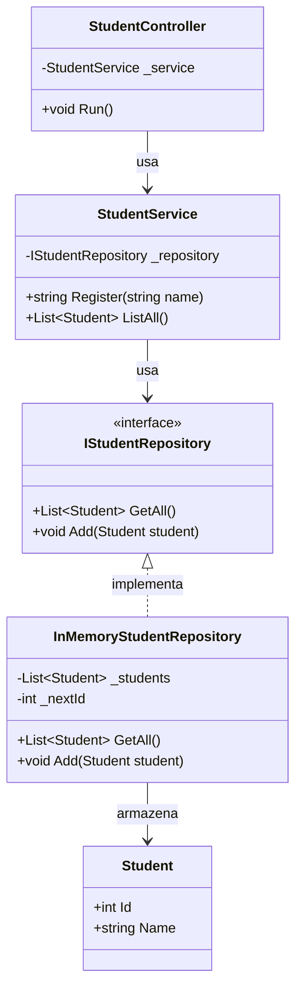
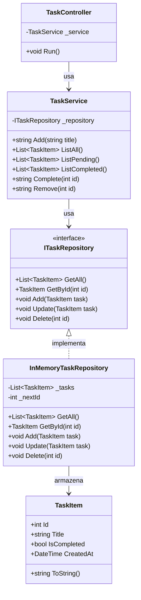

# Exercícios — Módulo 10.2: Arquitetura em Camadas — O Padrão de 3 Camadas

[← Voltar ao Módulo 10.2](cap10-mod02-camadas-tres-camadas-conteudo.md)

> **Como usar estes exercícios:**
> 1. Leia o enunciado com atenção
> 2. Leia as dicas antes de começar
> 3. Tente resolver sozinho
> 4. Use a Proposta de Teste para verificar se sua solução funciona
> 5. Só depois consulte a Resposta Comentada

> **Como testar cada exercício:**
> 1. Escreva seu código no VSCode
> 2. Salve o arquivo na pasta `~/meus-projetos/curso/cap10/`
> 3. Para projetos C#: `dotnet new console -n NomeExercicio`, cole o código em `Program.cs`
> 4. Execute com `dotnet run`

---

## Exercício 1 — Identificando as Camadas — Nível: Básico

### Enunciado

Análise o código abaixo — um sistema de cadastro de alunos em um único arquivo. Identifique quais trechos pertencem a cada camada (Controller, Service, Repository) e quais são o Model. Para cada trecho, escreva: a camada correspondente e por quê.

```csharp
using System;
using System.Collections.Generic;

class Program
{
    static List<Dictionary<string, string>> students = new List<Dictionary<string, string>>();
    static int nextId = 1;

    static void Main()
    {
        while (true)
        {
            Console.WriteLine("\n=== Cadastro de Alunos ===");
            Console.WriteLine("1. Cadastrar aluno");
            Console.WriteLine("2. Listar alunos");
            Console.WriteLine("3. Sair");
            Console.Write("Opcao: ");
            var choice = Console.ReadLine();

            if (choice == "1")
            {
                Console.Write("Nome: ");
                var name = Console.ReadLine();

                if (string.IsNullOrWhiteSpace(name))
                {
                    Console.WriteLine("Erro: nome nao pode ser vazio!");
                    continue;
                }

                if (name.Length < 3)
                {
                    Console.WriteLine("Erro: nome deve ter pelo menos 3 caracteres!");
                    continue;
                }

                var student = new Dictionary<string, string>
                {
                    { "id", nextId.ToString() },
                    { "name", name }
                };
                nextId++;
                students.Add(student);
                Console.WriteLine($"Aluno '{name}' cadastrado com ID {student["id"]}!");
            }
            else if (choice == "2")
            {
                if (students.Count == 0)
                {
                    Console.WriteLine("Nenhum aluno cadastrado.");
                    continue;
                }
                foreach (var s in students)
                {
                    Console.WriteLine($"  [{s["id"]}] {s["name"]}");
                }
            }
            else if (choice == "3")
            {
                Console.WriteLine("Ate logo!");
                break;
            }
        }
    }
}
```

### Dicas

- Separe mentalmente: o que é interface com o usuário? O que é regra de negócio? O que é armazenamento de dados?
- A validação "nome não pode ser vazio" é regra de negócio ou de formato?
- A validação "nome deve ter pelo menos 3 caracteres" é regra de negócio ou de formato?
- O dicionário com "id" e "name" representa qual conceito?

### Proposta de Teste

- Você deve identificar pelo menos 4 trechos diferentes e classificar cada um
- Para cada trecho, justifique por que pertence àquela camada
- Identifique pelo menos 1 regra de negócio e 1 operação de dados

### Resposta Comentada

> **Importante:** Tente resolver sozinho primeiro!

| Trecho | Camada | Justificativa |
|--------|--------|--------------|
| Menu, Console.WriteLine, Console.ReadLine | Controller | Interface com o usuario — exibe opcoes e le entrada |
| `string.IsNullOrWhiteSpace(name)` | Service | Regra de negocio — nome não pode ser vazio |
| `name.Length < 3` | Service | Regra de negocio — nome mínimo de 3 caracteres |
| `students.Add(student)`, lista `students` | Repository | Armazenamento de dados — guarda e recupera alunos |
| Dicionário com "id" e "name" | Model | Representacao da entidade Aluno |
| `nextId++` | Repository | Geração de ID — responsabilidade do armazenamento |
| Formatacao `$"[{s["id"]}] {s["name"]}"` | Controller | Formatacao de saida para o usuario |

---

## Exercício 2 — Refatorando para 3 Camadas — Nível: Intermediário

### Enunciado

Pegue o código do Exercício 1 e refatore para o padrão de 3 camadas. Crie as seguintes classes:

- `Student` (Model) — com propriedades Id e Name
- `IStudentRepository` (interface) e `InMemoryStudentRepository` (implementação)
- `StudentService` — com regras de negócio
- `StudentController` — com o menu
- Montagem no `Program.cs`

O comportamento deve ser idêntico ao original, mas agora organizado em camadas.

### Dicas

- Comece pelo Model — é o mais simples
- Depois o Repository — defina a interface e implemente em memória
- Depois o Service — mova as validações de negócio para cá
- Por último o Controller — só menu e chamadas ao Service
- O Program.cs monta tudo: Repository → Service → Controller

### Proposta de Teste

- O programa deve funcionar exatamente como o original
- O Controller não deve ter nenhuma regra de negócio
- O Service não deve ter Console.WriteLine
- O Repository não deve ter validações de negócio
- Teste cadastrar um aluno com nome vazio — deve rejeitar
- Teste cadastrar um aluno com nome de 2 caracteres — deve rejeitar
- Teste cadastrar e listar — deve funcionar

### Resposta Comentada

> **Importante:** Tente resolver sozinho primeiro!

```csharp
// === PROGRAMA COMPLETO: Cadastro de Alunos em 3 Camadas ===

using System;
using System.Collections.Generic;

// ============================================================
// MODEL
// ============================================================

// "Student" = Aluno
public class Student
{
    public int Id { get; set; }      // "Id" = identificador
    public string Name { get; set; } // "Name" = nome

    public Student(string name)
    {
        Name = name;
    }

    public override string ToString()
    {
        return $"[{Id}] {Name}";
    }
}

// ============================================================
// REPOSITORY
// ============================================================

// Interface do repositorio
public interface IStudentRepository
{
    void Add(Student student);          // "Add" = adicionar
    List<Student> GetAll();             // "GetAll" = obter todos
}

// Implementacao em memoria
public class InMemoryStudentRepository : IStudentRepository
{
    private List<Student> _students = new List<Student>();
    private int _nextId = 1;

    public void Add(Student student)
    {
        student.Id = _nextId++;
        _students.Add(student);
    }

    public List<Student> GetAll()
    {
        return new List<Student>(_students);
    }
}

// ============================================================
// SERVICE
// ============================================================

// "StudentService" = Servico de Alunos
public class StudentService
{
    private readonly IStudentRepository _repository;

    public StudentService(IStudentRepository repository)
    {
        _repository = repository;
    }

    // Cadastrar aluno — com regras de negocio
    public string Register(string name)
    {
        // Regra 1: nome nao pode ser vazio
        if (string.IsNullOrWhiteSpace(name))
            return "Erro: nome nao pode ser vazio!";

        // Regra 2: nome deve ter pelo menos 3 caracteres
        if (name.Length < 3)
            return "Erro: nome deve ter pelo menos 3 caracteres!";

        var student = new Student(name);
        _repository.Add(student);
        return $"Aluno '{name}' cadastrado com ID {student.Id}!";
    }

    // Listar todos os alunos
    public List<Student> ListAll()
    {
        return _repository.GetAll();
    }
}

// ============================================================
// CONTROLLER
// ============================================================

// "StudentController" = Controlador de Alunos
public class StudentController
{
    private readonly StudentService _service;

    public StudentController(StudentService service)
    {
        _service = service;
    }

    public void Run()
    {
        while (true)
        {
            Console.WriteLine("\n=== Cadastro de Alunos ===");
            Console.WriteLine("1. Cadastrar aluno");
            Console.WriteLine("2. Listar alunos");
            Console.WriteLine("3. Sair");
            Console.Write("Opcao: ");

            switch (Console.ReadLine())
            {
                case "1":
                    Console.Write("Nome: ");
                    var name = Console.ReadLine();
                    Console.WriteLine(_service.Register(name));
                    break;
                case "2":
                    var students = _service.ListAll();
                    if (students.Count == 0)
                    { Console.WriteLine("Nenhum aluno cadastrado."); break; }
                    foreach (var s in students)
                        Console.WriteLine($"  {s}");
                    break;
                case "3":
                    Console.WriteLine("Ate logo!");
                    return;
                default:
                    Console.WriteLine("Opcao invalida!");
                    break;
            }
        }
    }
}

// ============================================================
// PROGRAM.CS
// ============================================================

IStudentRepository repository = new InMemoryStudentRepository();
var service = new StudentService(repository);
var controller = new StudentController(service);
controller.Run();
```

Saída esperada (exemplo de interação):

```
=== Cadastro de Alunos ===
1. Cadastrar aluno
2. Listar alunos
3. Sair
Opcao: 1
Nome: Maria Silva
Aluno 'Maria Silva' cadastrado com ID 1!

=== Cadastro de Alunos ===
Opcao: 1
Nome: Jo
Erro: nome deve ter pelo menos 3 caracteres!

=== Cadastro de Alunos ===
Opcao: 2
  [1] Maria Silva
```

Observe: o Controller ficou simples — só menu e chamadas. As regras ficaram no Service. Os dados ficaram no Repository.

Diagrama de classes do sistema de alunos em 3 camadas:



---

## Exercício 3 — Adicionando uma Nova Funcionalidade — Nível: Intermediário

### Enunciado

Usando o código do Exercício 2 como base, adicione a funcionalidade de **buscar aluno por ID**. Você deve:

1. Adicionar o método `GetById(int id)` na interface `IStudentRepository`
2. Implementar no `InMemoryStudentRepository`
3. Adicionar o método `FindById(int id)` no `StudentService`
4. Adicionar a opção "3. Buscar aluno por ID" no `StudentController` (e mudar "Sair" para opção 4)

A busca deve retornar o aluno se encontrado, ou uma mensagem de erro se não encontrado.

### Dicas

- Comece pela interface — adicione o método `GetById`
- Implemente no Repository — percorra a lista procurando pelo ID
- No Service, retorne o aluno ou null
- No Controller, leia o ID, chame o Service e exiba o resultado
- Lembre: validação de formato (o ID é um número?) fica no Controller

### Proposta de Teste

- Cadastre 2 alunos e busque pelo ID 1 — deve encontrar
- Busque pelo ID 99 — deve mostrar "não encontrado"
- Digite "abc" como ID — deve mostrar "ID inválido" (validação de formato no Controller)

### Resposta Comentada

> **Importante:** Tente resolver sozinho primeiro!

Adicione na interface:

```csharp
// Na interface IStudentRepository, adicionar:
Student GetById(int id); // "GetById" = obter por ID
```

Implemente no Repository:

```csharp
// No InMemoryStudentRepository, adicionar:
public Student GetById(int id)
{
    foreach (var s in _students)
    {
        if (s.Id == id)
            return s;
    }
    return null; // nao encontrou
}
```

Adicione no Service:

```csharp
// No StudentService, adicionar:
public Student FindById(int id)
{
    return _repository.GetById(id);
}
```

Adicione no Controller:

```csharp
// No switch do Controller, adicionar:
case "3":
    Console.Write("ID do aluno: ");
    if (!int.TryParse(Console.ReadLine(), out var id))
    {
        Console.WriteLine("Erro: ID invalido!"); // validacao de formato
        break;
    }
    var student = _service.FindById(id);
    Console.WriteLine(student == null
        ? "Aluno nao encontrado."
        : $"Encontrado: {student}");
    break;
case "4": // sair (era 3, agora e 4)
    Console.WriteLine("Ate logo!");
    return;
```

Saída esperada: nenhuma isoladamente — integre ao programa do Exercício 2 e teste.

Observe como adicionar uma funcionalidade nova segue o fluxo natural: Repository → Service → Controller. Cada camada recebe sua parte da mudança.

---

## Exercício 4 — Identificando Violações — Nível: Intermediário

### Enunciado

O código abaixo tem 4 violações do padrão de 3 camadas. Identifique cada violação, explique por que é um problema e mostre como corrigir.

```csharp
public class BookController
{
    private readonly IBookRepository _repository; // OLHE AQUI

    public BookController(IBookRepository repository)
    {
        _repository = repository;
    }

    public void RegisterBook()
    {
        Console.Write("Titulo: ");
        var title = Console.ReadLine();
        Console.Write("Preco: ");
        var price = decimal.Parse(Console.ReadLine());

        // Regra de negocio no Controller
        if (price > 500)
        {
            Console.WriteLine("Livros acima de R$500 precisam de aprovacao!");
            return;
        }

        // Acessa o Repository direto, sem Service
        var book = new Book(title, price);
        _repository.Add(book);
        Console.WriteLine("Livro cadastrado!");
    }
}

public class BookService
{
    private readonly IBookRepository _repository;

    public BookService(IBookRepository repository)
    {
        _repository = repository;
    }

    public void ListExpensiveBooks()
    {
        var books = _repository.GetAll();
        // Service exibindo no console
        Console.WriteLine("=== Livros Caros ===");
        foreach (var b in books)
        {
            if (b.Price > 100)
                Console.WriteLine($"  {b.Title} — R${b.Price:F2}");
        }
    }
}

public class BookRepository
{
    public void Add(Book book)
    {
        // Regra de negocio no Repository
        if (book.Price <= 0)
        {
            Console.WriteLine("Preco invalido!");
            return;
        }
        Console.WriteLine($"[DB] INSERT: {book.Title}");
    }
}
```

### Dicas

- Olhe quem o Controller depende — deveria ser o Service, não o Repository
- Procure Console.WriteLine onde não deveria ter
- Procure regras de negócio fora do Service
- Cada violação tem uma correção simples

### Proposta de Teste

- Identifique as 4 violações
- Para cada uma, explique o problema e a correção
- Verifique se sua correção mantém a regra "só conversa com o vizinho"

### Resposta Comentada

> **Importante:** Tente resolver sozinho primeiro!

**Violação 1: Controller depende do Repository direto.**
O `BookController` recebe `IBookRepository` no construtor. Deveria receber `BookService`. O Controller está pulando a camada de lógica.
Correção: trocar para `BookService` no construtor.

**Violação 2: Regra de negócio no Controller.**
A verificação `if (price > 500)` é uma regra de negócio (limite de preço para aprovação). Deveria estar no `BookService`.
Correção: mover a validação para o método `Register` do Service.

**Violação 3: Console.WriteLine no Service.**
O método `ListExpensiveBooks` exibe dados diretamente no console. O Service deveria retornar a lista e deixar o Controller exibir.
Correção: retornar `List<Book>` em vez de exibir no console.

**Violação 4: Regra de negócio no Repository.**
A verificação `if (book.Price <= 0)` no `BookRepository.Add` é uma regra de negócio. O Repository deveria apenas salvar — quem válida é o Service.
Correção: mover a validação de preço para o Service.

---

## Exercício 5 — Sistema de Tarefas em 3 Camadas — Nível: Avançado

### Enunciado

Crie um sistema completo de gerenciamento de tarefas (to-do list) usando o padrão de 3 camadas. O sistema deve ter:

**Model — TaskItem:**
- Id (int)
- Title (string)
- IsCompleted (bool) — se a tarefa foi concluida
- CreatedAt (DateTime) — data de criação

**Repository — ITaskRepository:**
- Add, GetAll, GetById, Update, Delete

**Service — TaskService com regras:**
- Título deve ter pelo menos 5 caracteres
- Não pode ter título duplicado
- Marcar como concluida (muda IsCompleted para true)
- Listar apenas tarefas pendentes
- Listar apenas tarefas concluidas
- Contar total de tarefas e total de concluidas

**Controller — TaskController com menu:**
- Adicionar tarefa
- Listar todas
- Listar pendentes
- Listar concluidas
- Marcar como concluida
- Remover tarefa
- Ver estatisticas (total, concluidas, pendentes)
- Sair

### Dicas

- Comece pelo Model — defina a classe TaskItem com todas as propriedades
- Depois a interface ITaskRepository com todos os métodos necessários
- Implemente InMemoryTaskRepository
- No Service, implemente cada regra de negócio
- No Controller, crie o menu e delegue tudo para o Service
- Use `DateTime.Now` para a data de criação
- Para "marcar como concluída", busque pelo ID, mude IsCompleted e atualize

### Proposta de Teste

Execute o programa e teste:
1. Adicione 3 tarefas — devem receber IDs 1, 2, 3
2. Tente adicionar tarefa com título de 3 caracteres — deve rejeitar
3. Tente adicionar tarefa com título duplicado — deve rejeitar
4. Liste todas — deve mostrar 3 tarefas, todas pendentes
5. Marque tarefa 2 como concluída
6. Liste pendentes — deve mostrar 2
7. Liste concluídas — deve mostrar 1
8. Veja estatísticas — deve mostrar "3 total, 1 concluída, 2 pendentes"
9. Remova tarefa 1
10. Liste todas — deve mostrar 2 tarefas

### Resposta Comentada

> **Importante:** Tente resolver sozinho primeiro!

```csharp
// === PROGRAMA COMPLETO: Sistema de Tarefas em 3 Camadas ===

using System;
using System.Collections.Generic;

// ============================================================
// MODEL
// ============================================================

// "TaskItem" = Item de Tarefa (nao usar "Task" pois conflita com System.Threading.Tasks)
public class TaskItem
{
    public int Id { get; set; }
    public string Title { get; set; }          // "Title" = titulo
    public bool IsCompleted { get; set; }      // "IsCompleted" = esta concluida
    public DateTime CreatedAt { get; set; }    // "CreatedAt" = criada em

    public TaskItem(string title)
    {
        Title = title;
        IsCompleted = false;
        CreatedAt = DateTime.Now;
    }

    public override string ToString()
    {
        var status = IsCompleted ? "x" : " "; // "x" = concluida, " " = pendente
        return $"[{Id}] [{status}] {Title} (criada em {CreatedAt:dd/MM/yyyy})";
    }
}

// ============================================================
// REPOSITORY
// ============================================================

public interface ITaskRepository
{
    void Add(TaskItem task);
    List<TaskItem> GetAll();
    TaskItem GetById(int id);
    void Update(TaskItem task);
    void Delete(int id);
    bool ExistsByTitle(string title);
}

public class InMemoryTaskRepository : ITaskRepository
{
    private List<TaskItem> _tasks = new List<TaskItem>();
    private int _nextId = 1;

    public void Add(TaskItem task)
    {
        task.Id = _nextId++;
        _tasks.Add(task);
    }

    public List<TaskItem> GetAll() => new List<TaskItem>(_tasks);

    public TaskItem GetById(int id)
    {
        foreach (var t in _tasks)
            if (t.Id == id) return t;
        return null;
    }

    public void Update(TaskItem task)
    {
        for (int i = 0; i < _tasks.Count; i++)
            if (_tasks[i].Id == task.Id)
            { _tasks[i] = task; return; }
    }

    public void Delete(int id)
    {
        _tasks.RemoveAll(t => t.Id == id);
    }

    public bool ExistsByTitle(string title)
    {
        foreach (var t in _tasks)
            if (t.Title.Equals(title, StringComparison.OrdinalIgnoreCase))
                return true;
        return false;
    }
}

// ============================================================
// SERVICE
// ============================================================

public class TaskService
{
    private readonly ITaskRepository _repository;

    public TaskService(ITaskRepository repository)
    {
        _repository = repository;
    }

    public string Add(string title)
    {
        if (string.IsNullOrWhiteSpace(title))
            return "Erro: titulo nao pode ser vazio.";
        if (title.Length < 5)
            return "Erro: titulo deve ter pelo menos 5 caracteres.";
        if (_repository.ExistsByTitle(title))
            return $"Erro: ja existe uma tarefa com o titulo '{title}'.";

        var task = new TaskItem(title);
        _repository.Add(task);
        return $"Tarefa '{title}' adicionada! ID: {task.Id}";
    }

    public List<TaskItem> ListAll() => _repository.GetAll();

    public List<TaskItem> ListPending()
    {
        var result = new List<TaskItem>();
        foreach (var t in _repository.GetAll())
            if (!t.IsCompleted) result.Add(t);
        return result;
    }

    public List<TaskItem> ListCompleted()
    {
        var result = new List<TaskItem>();
        foreach (var t in _repository.GetAll())
            if (t.IsCompleted) result.Add(t);
        return result;
    }

    public string Complete(int id)
    {
        var task = _repository.GetById(id);
        if (task == null)
            return $"Erro: tarefa com ID {id} nao encontrada.";
        if (task.IsCompleted)
            return $"Tarefa '{task.Title}' ja esta concluida.";
        task.IsCompleted = true;
        _repository.Update(task);
        return $"Tarefa '{task.Title}' marcada como concluida!";
    }

    public string Remove(int id)
    {
        var task = _repository.GetById(id);
        if (task == null)
            return $"Erro: tarefa com ID {id} nao encontrada.";
        _repository.Delete(id);
        return $"Tarefa '{task.Title}' removida.";
    }

    // "GetStats" = obter estatisticas
    public string GetStats()
    {
        var all = _repository.GetAll();
        int total = all.Count;
        int completed = 0;
        foreach (var t in all)
            if (t.IsCompleted) completed++;
        int pending = total - completed;
        return $"Total: {total} | Concluidas: {completed} | Pendentes: {pending}";
    }
}

// ============================================================
// CONTROLLER
// ============================================================

public class TaskController
{
    private readonly TaskService _service;

    public TaskController(TaskService service)
    {
        _service = service;
    }

    public void Run()
    {
        while (true)
        {
            Console.WriteLine("\n========================================");
            Console.WriteLine("       GERENCIADOR DE TAREFAS");
            Console.WriteLine("========================================");
            Console.WriteLine("  1. Adicionar tarefa");
            Console.WriteLine("  2. Listar todas");
            Console.WriteLine("  3. Listar pendentes");
            Console.WriteLine("  4. Listar concluidas");
            Console.WriteLine("  5. Marcar como concluida");
            Console.WriteLine("  6. Remover tarefa");
            Console.WriteLine("  7. Estatisticas");
            Console.WriteLine("  0. Sair");
            Console.WriteLine("========================================");
            Console.Write("Opcao: ");

            switch (Console.ReadLine())
            {
                case "1":
                    Console.Write("Titulo da tarefa: ");
                    Console.WriteLine(_service.Add(Console.ReadLine()));
                    break;
                case "2": PrintTasks(_service.ListAll(), "Todas as Tarefas"); break;
                case "3": PrintTasks(_service.ListPending(), "Tarefas Pendentes"); break;
                case "4": PrintTasks(_service.ListCompleted(), "Tarefas Concluidas"); break;
                case "5":
                    Console.Write("ID da tarefa: ");
                    if (!int.TryParse(Console.ReadLine(), out var cid))
                    { Console.WriteLine("Erro: ID invalido!"); break; }
                    Console.WriteLine(_service.Complete(cid));
                    break;
                case "6":
                    Console.Write("ID da tarefa: ");
                    if (!int.TryParse(Console.ReadLine(), out var rid))
                    { Console.WriteLine("Erro: ID invalido!"); break; }
                    Console.WriteLine(_service.Remove(rid));
                    break;
                case "7":
                    Console.WriteLine($"\n{_service.GetStats()}");
                    break;
                case "0":
                    Console.WriteLine("Ate logo!");
                    return;
                default:
                    Console.WriteLine("Opcao invalida!");
                    break;
            }
        }
    }

    // Metodo auxiliar para exibir listas de tarefas
    private void PrintTasks(List<TaskItem> tasks, string header)
    {
        Console.WriteLine($"\n--- {header} ({tasks.Count}) ---");
        if (tasks.Count == 0)
        { Console.WriteLine("  Nenhuma tarefa."); return; }
        foreach (var t in tasks)
            Console.WriteLine($"  {t}");
    }
}

// ============================================================
// PROGRAM.CS
// ============================================================

ITaskRepository repository = new InMemoryTaskRepository();
var service = new TaskService(repository);
var controller = new TaskController(service);
controller.Run();
```

Saída esperada (exemplo de interação):

```
========================================
       GERENCIADOR DE TAREFAS
========================================
  1. Adicionar tarefa
  ...
Opcao: 1
Titulo da tarefa: Estudar arquitetura
Tarefa 'Estudar arquitetura' adicionada! ID: 1

Opcao: 1
Titulo da tarefa: abc
Erro: titulo deve ter pelo menos 5 caracteres.

Opcao: 7
Total: 1 | Concluidas: 0 | Pendentes: 1

Opcao: 5
ID da tarefa: 1
Tarefa 'Estudar arquitetura' marcada como concluida!

Opcao: 7
Total: 1 | Concluidas: 1 | Pendentes: 0
```

Diagrama de classes do sistema de tarefas em 3 camadas:



---

## Exercício 6 — Trocando a Implementação — Nível: Avançado

### Enunciado

Usando o sistema de tarefas do Exercício 5, crie uma segunda implementação do `ITaskRepository` chamada `FileSimulatorTaskRepository`. Essa implementação deve simular o salvamento em arquivo, imprimindo mensagens como `[ARQUIVO] Salvando tarefa...` e `[ARQUIVO] Lendo tarefas...` em cada operação (sem realmente salvar em arquivo — apenas simule com Console.WriteLine dentro do Repository).

Depois, mude apenas o `Program.cs` para usar a nova implementação. O Service e o Controller não devem mudar nenhuma linha.

### Dicas

- Copie a estrutura do `InMemoryTaskRepository` como base
- Adicione `Console.WriteLine($"[ARQUIVO] ...")` no início de cada método
- A lógica interna pode continuar usando lista em memória (é uma simulação)
- No Program.cs, troque `new InMemoryTaskRepository()` por `new FileSimulatorTaskRepository()`
- Verifique que o Service e Controller continuam funcionando sem mudanças

### Proposta de Teste

- Execute com `InMemoryTaskRepository` — deve funcionar normalmente
- Troque para `FileSimulatorTaskRepository` — deve funcionar igual, mas com mensagens `[ARQUIVO]`
- Verifique que nenhuma linha do Service ou Controller mudou

### Resposta Comentada

> **Importante:** Tente resolver sozinho primeiro!

```csharp
// Nova implementacao que simula arquivo
// "FileSimulatorTaskRepository" = Repositorio simulando arquivo
public class FileSimulatorTaskRepository : ITaskRepository
{
    private List<TaskItem> _tasks = new List<TaskItem>();
    private int _nextId = 1;

    public void Add(TaskItem task)
    {
        task.Id = _nextId++;
        _tasks.Add(task);
        Console.WriteLine($"[ARQUIVO] Tarefa '{task.Title}' salva no arquivo.");
    }

    public List<TaskItem> GetAll()
    {
        Console.WriteLine("[ARQUIVO] Lendo todas as tarefas do arquivo...");
        return new List<TaskItem>(_tasks);
    }

    public TaskItem GetById(int id)
    {
        Console.WriteLine($"[ARQUIVO] Buscando tarefa ID {id} no arquivo...");
        foreach (var t in _tasks)
            if (t.Id == id) return t;
        return null;
    }

    public void Update(TaskItem task)
    {
        Console.WriteLine($"[ARQUIVO] Atualizando tarefa '{task.Title}' no arquivo...");
        for (int i = 0; i < _tasks.Count; i++)
            if (_tasks[i].Id == task.Id)
            { _tasks[i] = task; return; }
    }

    public void Delete(int id)
    {
        Console.WriteLine($"[ARQUIVO] Removendo tarefa ID {id} do arquivo...");
        _tasks.RemoveAll(t => t.Id == id);
    }

    public bool ExistsByTitle(string title)
    {
        Console.WriteLine($"[ARQUIVO] Verificando se '{title}' existe no arquivo...");
        foreach (var t in _tasks)
            if (t.Title.Equals(title, StringComparison.OrdinalIgnoreCase))
                return true;
        return false;
    }
}

// No Program.cs, mude APENAS esta linha:
// Antes:
ITaskRepository repository = new InMemoryTaskRepository();
// Depois:
ITaskRepository repository = new FileSimulatorTaskRepository();

// O resto NAO MUDA:
var service = new TaskService(repository);
var controller = new TaskController(service);
controller.Run();
```

Saída esperada (com FileSimulatorTaskRepository):

```
Opcao: 1
Titulo da tarefa: Estudar camadas
[ARQUIVO] Verificando se 'Estudar camadas' existe no arquivo...
[ARQUIVO] Tarefa 'Estudar camadas' salva no arquivo.
Tarefa 'Estudar camadas' adicionada! ID: 1
```

O Service e o Controller não mudaram nenhuma linha. Essa é a prova concreta de que a separação em camadas funciona: trocar a implementação de dados não afeta a lógica nem a interface.

---

[← Voltar ao Módulo 10.2](cap10-mod02-camadas-tres-camadas-conteudo.md)
