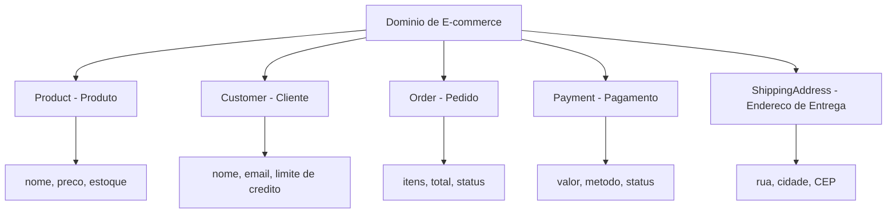
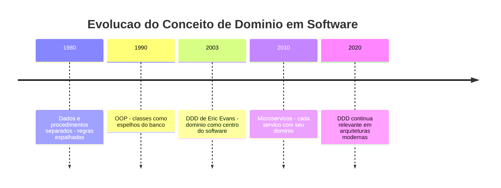
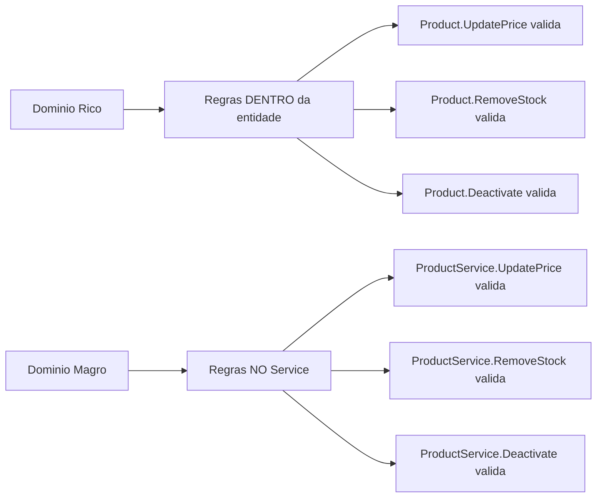
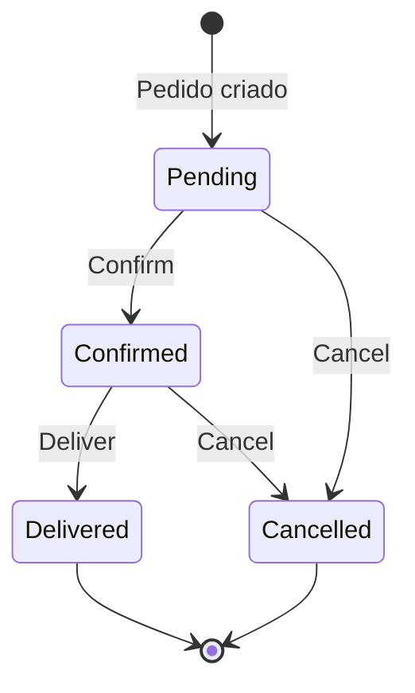
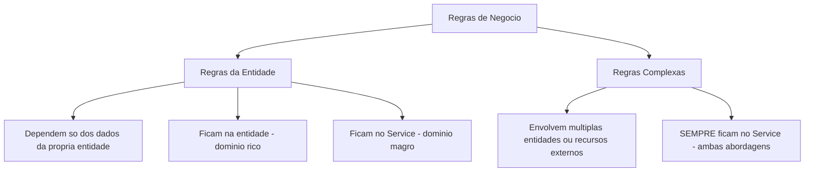

# 10.3 — Camada de Domínio: Entidades e Regras de Negócio

[← Anterior: Arquitetura em Camadas](cap10-mod02-camadas-tres-camadas-conteudo.md) · [Próximo: Camada de Serviços e DTOs →](cap10-mod04-camada-servicos-conteudo.md)

---

## Introdução

No módulo anterior, você aprendeu o padrão de 3 camadas: Controller (apresentação), Service (lógica de negócio) e Repository (acesso a dados). Viu como cada camada tem uma responsabilidade clara, como elas se comunicam e como essa separação permite trocar partes do sistema sem quebrar o resto. Construiu um sistema completo de cadastro de produtos com as 3 camadas funcionando juntas.

Agora vamos mergulhar na parte mais importante de qualquer sistema: o **domínio**. O domínio é o coração da aplicação — são as "coisas" do mundo real que o sistema representa e as regras que governam essas coisas. Quando você cria um sistema de e-commerce, o domínio são os produtos, clientes, pedidos, pagamentos e todas as regras que definem como eles se comportam. Quando cria um sistema bancário, o domínio são as contas, transações, limites e taxas.

Lembra da analogia do restaurante? O Controller é o garçom, o Repository é o despenseiro. E o domínio? O domínio são os **ingredientes e as receitas**. São as coisas reais que o restaurante manipula — a carne, o arroz, o feijão — e as regras de como combiná-los — "o molho leva alho e cebola", "a carne deve ser selada antes de ir ao forno", "o prato não pode sair sem guarnição". Sem ingredientes e receitas, o restaurante não existe. Sem domínio, o sistema não existe.

Neste módulo, vamos entender o que é a camada de domínio, como modelar entidades que representam o mundo real, e — talvez o mais importante — vamos conhecer duas abordagens completamente diferentes para organizar o domínio: o **domínio rico** e o **domínio magro**. Cada uma tem vantagens e desvantagens, e nenhuma é "a certa". São decisões de arquitetura que dependem do contexto.

---

## Como Executar os Exemplos Deste Módulo

Os exemplos deste módulo usam C# (.NET), a mesma linguagem do capítulo 9. Para executar:

1. Certifique-se de que o .NET SDK está instalado (você já configurou no módulo 9.3)
2. Crie uma pasta para os exemplos: `mkdir -p ~/meus-projetos/curso/cap10/mod03`
3. Para cada exemplo, crie um projeto console: `dotnet new console -n NomeDoExemplo`
4. Cole o código no arquivo `Program.cs`
5. Execute com `dotnet run`

Alguns exemplos mostram múltiplos arquivos. Em um projeto real, cada classe ficaria em seu próprio arquivo dentro da pasta `Models/` ou `Domain/`. Para simplificar a execução, colocamos tudo em `Program.cs` — mas sempre indicamos onde cada classe ficaria em um projeto real.

---

## O que é o Domínio?

Antes de falar de código, vamos entender o conceito. A palavra "domínio" vem do latim *dominium* — significa "território", "área de controle". Em software, o domínio é a **área de conhecimento** que o sistema representa.

Se você está construindo um sistema para uma clínica médica, o domínio é a medicina: pacientes, consultas, prontuários, médicos, especialidades, receitas. Se está construindo um sistema para uma escola, o domínio é a educação: alunos, professores, turmas, notas, disciplinas, matrículas.

O domínio não é tecnologia. O domínio é o **problema real** que o sistema resolve. A tecnologia (banco de dados, API, interface) é apenas o meio para resolver esse problema.

### Domínio vs Tecnologia

Essa distinção é fundamental e muita gente confunde no começo:

| Domínio (o problema) | Tecnologia (a solução) |
|----------------------|----------------------|
| Produto tem nome, preco e estoque | Dados ficam em SQLite ou PostgreSQL |
| Preco não pode ser negativo | Validação feita em C# ou Python |
| Pedido pertence a um cliente | Relacionamento via chave estrangeira |
| Desconto máximo eh 30% | Regra implementada no Service ou na entidade |
| Cliente tem limite de credito | Verificacao antes de aprovar pedido |

O domínio existe independente da tecnologia. Se amanhã você trocar o banco de dados de SQLite para MongoDB, as regras do domínio continuam as mesmas: o preço continua não podendo ser negativo, o desconto máximo continua sendo 30%, o cliente continua tendo limite de crédito. O que muda é como essas regras são armazenadas e verificadas — não as regras em si.

### Entidades: As "Coisas" do Domínio

As **entidades** são os objetos que representam as "coisas" do mundo real no seu sistema. No capítulo 9, você já criou entidades sem saber — a classe `Product` com nome, preço e estoque era uma entidade. A classe `BankAccount` com saldo e métodos de depósito e saque era uma entidade.

Uma entidade tem duas características fundamentais:

1. **Identidade** — cada entidade é única e identificável. Dois produtos podem ter o mesmo nome e preço, mas são entidades diferentes se têm IDs diferentes. É como duas pessoas com o mesmo nome — são pessoas diferentes.

2. **Estado** — a entidade tem dados que podem mudar ao longo do tempo. O estoque de um produto muda quando alguém compra. O saldo de uma conta muda quando alguém deposita. A entidade "vive" e evolui.



### Entidades vs Objetos de Valor

Nem tudo no domínio é uma entidade. Existem também os **objetos de valor** (Value Objects) — objetos que não têm identidade própria, são definidos apenas pelos seus dados.

Exemplo: um endereço. Se dois clientes moram no mesmo endereço (mesma rua, número, cidade, CEP), é o "mesmo" endereço — não importa se são objetos diferentes na memória. O endereço é definido pelos seus dados, não por um ID.

Já um cliente é uma entidade: mesmo que dois clientes tenham o mesmo nome e email, são clientes diferentes com IDs diferentes.

| Aspecto | Entidade | Objeto de Valor |
|---------|----------|----------------|
| Tem identidade única | Sim - ID | Não |
| Igualdade | Comparada por ID | Comparada por dados |
| Muda ao longo do tempo | Sim | Geralmente não |
| Exemplo | Product, Customer, Order | Address, Money, DateRange |

Por enquanto, vamos focar nas entidades — são o caso mais comum e o que você vai usar na maioria dos projetos.

---

## Contexto Histórico: De Onde Veio o Conceito de Domínio

O conceito de "domínio" em software não surgiu do nada. Ele tem uma história que vale a pena conhecer, porque explica por que as coisas são como são hoje.

### Anos 1980-1990: Dados e Procedimentos Separados

Nos primeiros sistemas comerciais, o código era organizado em torno de **procedimentos** (funções) e **dados** (tabelas no banco). As funções manipulavam os dados diretamente. Não existia o conceito de "entidade de domínio" — existiam tabelas no banco e funções que faziam queries.

O problema? As regras de negócio ficavam espalhadas por todo o código. A regra "preço não pode ser negativo" podia estar em 15 lugares diferentes — na tela de cadastro, na importação de planilha, na API, no relatório. Se a regra mudasse, era preciso encontrar e atualizar todos os 15 lugares. E inevitavelmente alguém esquecia um.

### Anos 1990: Orientação a Objetos e o Início do Domínio

Com a popularização da orientação a objetos (que você aprendeu no capítulo 9), surgiu a ideia de juntar dados e comportamentos em classes. Um `Product` não era mais apenas uma linha no banco — era um objeto com atributos e métodos. A regra "preço não pode ser negativo" podia ficar dentro da classe `Product`, em um único lugar.

Mas a maioria dos projetos ainda tratava as classes como "espelhos do banco de dados" — cada tabela virava uma classe, e as classes eram apenas contêineres de dados sem comportamento real. As regras continuavam nos Services ou, pior, espalhadas pelo código.

### 2003: Eric Evans e o Domain-Driven Design

Em 2003, o engenheiro de software Eric Evans publicou o livro **"Domain-Driven Design: Tackling Complexity in the Heart of Software"** (Design Orientado a Domínio: Enfrentando a Complexidade no Coração do Software). Esse livro mudou a forma como a indústria pensa sobre modelagem de software.

A ideia central de Evans era simples mas revolucionária: **o código deve refletir o domínio do negócio**. As classes não devem ser espelhos do banco de dados — devem ser representações do mundo real. Os nomes no código devem ser os mesmos nomes que as pessoas do negócio usam. Se o pessoal de vendas fala em "pedido", "item" e "desconto", o código deve ter classes chamadas `Order`, `OrderItem` e `Discount` — não `TBL_PED`, `TBL_PED_ITEM` e `VL_DESC`.

Evans introduziu vários conceitos que são usados até hoje:

| Conceito | Significado |
|----------|-------------|
| Entity | Objeto com identidade única que persiste ao longo do tempo |
| Value Object | Objeto definido por seus dados, sem identidade propria |
| Aggregate | Grupo de entidades tratadas como uma unidade |
| Repository | Interface para acessar entidades persistidas |
| Service | Operação do dominio que não pertence a nenhuma entidade |
| Ubiquitous Language | Linguagem comum entre desenvolvedores e pessoas do negocio |

Você não precisa decorar tudo isso agora. O importante é entender que o conceito de "domínio" como camada central do software tem uma origem clara e um propósito: **manter as regras de negócio organizadas, centralizadas e alinhadas com o mundo real**.



### O DDD é Obrigatório?

Não. O DDD (Domain-Driven Design) é uma abordagem para projetos complexos com muitas regras de negócio. Para um CRUD simples de cadastro de produtos, aplicar DDD completo seria como usar um canhão para matar uma mosca.

O que vamos pegar do DDD neste módulo é o conceito fundamental: **as entidades do domínio devem representar o mundo real e podem (ou não) conter regras de negócio**. Essa é a base. O resto — Aggregates, Bounded Contexts, Domain Events — são conceitos avançados que você pode estudar depois, quando trabalhar em projetos maiores.

---

## Modelando Entidades: Do Mundo Real ao Código

Vamos ao que interessa: como transformar "coisas" do mundo real em classes C#. O processo é mais intuitivo do que parece.

### Passo 1: Identifique as "Coisas" do Domínio

Olhe para o problema que o sistema resolve e pergunte: **quais são as coisas que o sistema precisa conhecer?**

Para um sistema de e-commerce:
- **Produto** — o que é vendido
- **Cliente** — quem compra
- **Pedido** — a compra em si
- **Item do Pedido** — cada produto dentro de um pedido
- **Endereço** — onde entregar

Para um sistema de biblioteca:
- **Livro** — o que é emprestado
- **Membro** — quem empresta
- **Empréstimo** — o ato de emprestar
- **Multa** — penalidade por atraso

### Passo 2: Defina os Atributos de Cada Entidade

Para cada "coisa", pergunte: **quais informações o sistema precisa guardar sobre ela?**

```csharp
// === Em um projeto real, ficaria em Models/Product.cs ===
// "Product" = Produto — entidade de dominio

public class Product
{
    public int Id { get; set; }              // "Id" = identificador unico
    public string Name { get; set; }         // "Name" = nome do produto
    public string Description { get; set; }  // "Description" = descricao
    public decimal Price { get; set; }       // "Price" = preco (decimal para dinheiro)
    public int Stock { get; set; }           // "Stock" = estoque disponivel
    public string Category { get; set; }     // "Category" = categoria
    public DateTime CreatedAt { get; set; }  // "CreatedAt" = data de criacao
    public bool IsActive { get; set; }       // "IsActive" = esta ativo?
}
```

Saída esperada: nenhuma (é apenas a definição da classe)

```csharp
// === Em um projeto real, ficaria em Models/Customer.cs ===
// "Customer" = Cliente — entidade de dominio

public class Customer
{
    public int Id { get; set; }              // "Id" = identificador unico
    public string Name { get; set; }         // "Name" = nome completo
    public string Email { get; set; }        // "Email" = email
    public string Phone { get; set; }        // "Phone" = telefone
    public decimal CreditLimit { get; set; } // "CreditLimit" = limite de credito
    public DateTime RegisteredAt { get; set; } // "RegisteredAt" = data de cadastro
}
```

Saída esperada: nenhuma (é apenas a definição da classe)

```csharp
// === Em um projeto real, ficaria em Models/Order.cs ===
// "Order" = Pedido — entidade de dominio

public class Order
{
    public int Id { get; set; }                  // "Id" = identificador unico
    public int CustomerId { get; set; }          // "CustomerId" = ID do cliente
    public Customer Customer { get; set; }       // "Customer" = referencia ao cliente
    public List<OrderItem> Items { get; set; }   // "Items" = itens do pedido
    public string Status { get; set; }           // "Status" = situacao do pedido
    public DateTime CreatedAt { get; set; }      // "CreatedAt" = data de criacao

    public Order()
    {
        Items = new List<OrderItem>();
        Status = "Pending"; // "Pending" = pendente
        CreatedAt = DateTime.Now;
    }
}
```

Saída esperada: nenhuma (é apenas a definição da classe)

```csharp
// === Em um projeto real, ficaria em Models/OrderItem.cs ===
// "OrderItem" = Item do Pedido — entidade de dominio

public class OrderItem
{
    public int Id { get; set; }              // "Id" = identificador unico
    public int ProductId { get; set; }       // "ProductId" = ID do produto
    public Product Product { get; set; }     // "Product" = referencia ao produto
    public int Quantity { get; set; }        // "Quantity" = quantidade
    public decimal UnitPrice { get; set; }   // "UnitPrice" = preco unitario no momento da compra
}
```

Saída esperada: nenhuma (é apenas a definição da classe)

Observe algo importante no `OrderItem`: o campo `UnitPrice` guarda o preço do produto **no momento da compra**. Se o preço do produto mudar depois, o pedido antigo mantém o preço original. Isso é uma decisão de domínio — o preço do item no pedido é "congelado" no momento da compra.

### Passo 3: Identifique os Relacionamentos

As entidades não vivem isoladas — elas se relacionam. Um pedido pertence a um cliente. Um pedido contém itens. Um item referência um produto.

```mermaid
classDiagram
    Customer "1" --> |*| Order : faz
    Order "1" --> |*| OrderItem : contem
    OrderItem "*" --> |1| Product : referencia
    
    class Customer {
        +int Id
        +string Name
        +string Email
        +decimal CreditLimit
    }
    
    class Order {
        +int Id
        +Customer Customer
        +List~OrderItem~ Items
        +string Status
    }
    
    class OrderItem {
        +int Id
        +Product Product
        +int Quantity
        +decimal UnitPrice
    }
    
    class Product {
        +int Id
        +string Name
        +decimal Price
        +int Stock
    }
```

Esses relacionamentos são os mesmos que você viu no capítulo 8 (bancos de dados) e no capítulo 9 (composição de objetos). A diferença é que agora estamos pensando neles como parte do **domínio** — como as coisas se relacionam no mundo real, não apenas como tabelas se conectam no banco.

---

## As Duas Abordagens: Domínio Rico vs Domínio Magro

Agora chegamos ao ponto mais importante deste módulo. Quando você modela entidades de domínio, existe uma pergunta fundamental: **onde ficam as regras de negócio?**

Existem duas respostas, e cada uma define uma abordagem completamente diferente de organizar o código. Nenhuma é certa ou errada — são decisões de arquitetura com trade-offs diferentes.

### Abordagem 1: Domínio Rico (Rich Domain Model)

No domínio rico, a entidade **sabe fazer coisas**. Ela não é apenas um pacote de dados — ela contém os comportamentos e regras que governam seus dados. A entidade é "inteligente".

A ideia é: se a regra é sobre o produto, ela fica no produto. Se a regra é sobre o pedido, ela fica no pedido. Os dados e os comportamentos vivem juntos, na mesma classe.

```csharp
// === DOMINIO RICO ===
// A entidade Product SABE suas regras de negocio
// Em um projeto real, ficaria em Domain/Product.cs

public class Product
{
    // Atributos com encapsulamento — so a propria classe altera
    public int Id { get; private set; }
    public string Name { get; private set; }
    public decimal Price { get; private set; }
    public int Stock { get; private set; }
    public bool IsActive { get; private set; }
    public DateTime CreatedAt { get; private set; }

    // Construtor com validacao — o produto ja nasce valido
    public Product(string name, decimal price, int initialStock)
    {
        // Regra: nome nao pode ser vazio
        if (string.IsNullOrWhiteSpace(name))
            throw new ArgumentException("Nome do produto nao pode ser vazio.");

        // Regra: preco deve ser positivo
        if (price <= 0)
            throw new ArgumentException("Preco deve ser maior que zero.");

        // Regra: estoque inicial nao pode ser negativo
        if (initialStock < 0)
            throw new ArgumentException("Estoque inicial nao pode ser negativo.");

        Name = name;
        Price = price;
        Stock = initialStock;
        IsActive = true;
        CreatedAt = DateTime.Now;
    }

    // Comportamento: atualizar preco com regra de negocio
    // "UpdatePrice" = atualizar preco
    public void UpdatePrice(decimal newPrice)
    {
        if (newPrice <= 0)
            throw new ArgumentException("Preco deve ser maior que zero.");

        // Regra: aumento maximo de 50% de uma vez
        if (newPrice > Price * 1.5m)
            throw new InvalidOperationException(
                $"Aumento maximo permitido eh 50%. Preco atual: {Price:F2}, maximo: {Price * 1.5m:F2}");

        Price = newPrice;
    }

    // Comportamento: adicionar estoque
    // "AddStock" = adicionar estoque
    public void AddStock(int quantity)
    {
        if (quantity <= 0)
            throw new ArgumentException("Quantidade deve ser maior que zero.");

        Stock += quantity;
    }

    // Comportamento: remover estoque (quando alguem compra)
    // "RemoveStock" = remover estoque
    public void RemoveStock(int quantity)
    {
        if (quantity <= 0)
            throw new ArgumentException("Quantidade deve ser maior que zero.");

        // Regra: nao pode vender mais do que tem
        if (quantity > Stock)
            throw new InvalidOperationException(
                $"Estoque insuficiente. Disponivel: {Stock}, solicitado: {quantity}");

        Stock -= quantity;
    }

    // Comportamento: verificar se tem estoque suficiente
    // "HasStock" = tem estoque
    public bool HasStock(int quantity)
    {
        return Stock >= quantity;
    }

    // Comportamento: desativar produto
    // "Deactivate" = desativar
    public void Deactivate()
    {
        // Regra: nao pode desativar produto com estoque
        if (Stock > 0)
            throw new InvalidOperationException(
                $"Nao pode desativar produto com {Stock} unidades em estoque.");

        IsActive = false;
    }

    // Comportamento: reativar produto
    // "Activate" = ativar
    public void Activate()
    {
        IsActive = true;
    }

    public override string ToString()
    {
        var status = IsActive ? "Ativo" : "Inativo";
        return $"[{Id}] {Name} — R${Price:F2} (Estoque: {Stock}) [{status}]";
    }
}
```

Saída esperada: nenhuma (é apenas a definição da classe)

Observe como a entidade é "inteligente":
- O construtor **válida** os dados — um produto não pode nascer com preço negativo
- Os setters são `private` — ninguém de fora pode alterar o preço diretamente
- Para alterar o preço, é preciso chamar `UpdatePrice()`, que aplica a regra de aumento máximo de 50%
- Para remover estoque, é preciso chamar `RemoveStock()`, que verifica se tem estoque suficiente
- Para desativar, é preciso chamar `Deactivate()`, que verifica se o estoque está zerado

As regras de negócio estão **dentro** da entidade, perto dos dados que elas protegem.

Vamos ver o domínio rico em ação:

```csharp
// Programa completo — Dominio Rico em acao

// === Classe Product (dominio rico) — cole a classe acima aqui ===

// Testando o dominio rico
Console.WriteLine("=== Dominio Rico em Acao ===\n");

// Criando um produto valido
var notebook = new Product("Notebook Dell", 3500.00m, 10);
Console.WriteLine($"Criado: {notebook}");

// Atualizando preco (dentro do limite de 50%)
notebook.UpdatePrice(4000.00m);
Console.WriteLine($"Preco atualizado: {notebook}");

// Tentando aumento acima de 50%
try
{
    notebook.UpdatePrice(8000.00m); // 100% de aumento — vai falhar
}
catch (InvalidOperationException ex)
{
    Console.WriteLine($"Erro esperado: {ex.Message}");
}

// Removendo estoque
notebook.RemoveStock(3);
Console.WriteLine($"Apos venda de 3: {notebook}");

// Tentando vender mais do que tem
try
{
    notebook.RemoveStock(20); // so tem 7 — vai falhar
}
catch (InvalidOperationException ex)
{
    Console.WriteLine($"Erro esperado: {ex.Message}");
}

// Tentando desativar com estoque
try
{
    notebook.Deactivate(); // tem 7 em estoque — vai falhar
}
catch (InvalidOperationException ex)
{
    Console.WriteLine($"Erro esperado: {ex.Message}");
}

// Zerando estoque e desativando
notebook.RemoveStock(7);
notebook.Deactivate();
Console.WriteLine($"Desativado: {notebook}");

// Tentando criar produto invalido
try
{
    var invalido = new Product("", -10, 5); // nome vazio e preco negativo
}
catch (ArgumentException ex)
{
    Console.WriteLine($"Erro esperado: {ex.Message}");
}
```

Saída esperada:
```
=== Dominio Rico em Acao ===

Criado: [0] Notebook Dell — R$3500.00 (Estoque: 10) [Ativo]
Preco atualizado: [0] Notebook Dell — R$4000.00 (Estoque: 10) [Ativo]
Erro esperado: Aumento maximo permitido eh 50%. Preco atual: 4000.00, maximo: 6000.00
Apos venda de 3: [0] Notebook Dell — R$4000.00 (Estoque: 7) [Ativo]
Erro esperado: Estoque insuficiente. Disponivel: 7, solicitado: 20
Erro esperado: Nao pode desativar produto com 7 unidades em estoque.
Desativado: [0] Notebook Dell — R$4000.00 (Estoque: 0) [Inativo]
Erro esperado: Nome do produto nao pode ser vazio.
```

Veja como o produto **se protege**. Ninguém consegue colocá-lo em um estado inválido. Não importa quem chama os métodos — o Controller, o Service, um teste, outro sistema — as regras são sempre aplicadas porque estão dentro da entidade.

### Abordagem 2: Domínio Magro (Anemic Domain Model)

No domínio magro, a entidade é apenas um **pacote de dados**. Ela não tem comportamentos, não tem regras, não tem validações. É como uma ficha de cadastro — tem campos para preencher, mas não sabe fazer nada. Todas as regras ficam nos Services.

```csharp
// === DOMINIO MAGRO ===
// A entidade Product eh apenas dados — sem comportamento
// Em um projeto real, ficaria em Models/Product.cs

public class Product
{
    // Todos os setters sao publicos — qualquer um pode alterar
    public int Id { get; set; }
    public string Name { get; set; }
    public decimal Price { get; set; }
    public int Stock { get; set; }
    public bool IsActive { get; set; }
    public DateTime CreatedAt { get; set; }

    // Construtor simples — sem validacao
    public Product()
    {
        IsActive = true;
        CreatedAt = DateTime.Now;
    }

    public override string ToString()
    {
        var status = IsActive ? "Ativo" : "Inativo";
        return $"[{Id}] {Name} — R${Price:F2} (Estoque: {Stock}) [{status}]";
    }
}
```

Saída esperada: nenhuma (é apenas a definição da classe)

A entidade é simples — apenas propriedades e um `ToString()`. Nenhuma regra, nenhuma validação, nenhum comportamento. Onde ficam as regras? No Service:

```csharp
// === DOMINIO MAGRO — as regras ficam no Service ===
// Em um projeto real, ficaria em Services/ProductService.cs

public class ProductService
{
    // Cadastrar produto — TODAS as regras estao aqui
    // "Register" = registrar
    public string Register(Product product)
    {
        // Regra: nome nao pode ser vazio
        if (string.IsNullOrWhiteSpace(product.Name))
            return "Erro: nome do produto nao pode ser vazio.";

        // Regra: preco deve ser positivo
        if (product.Price <= 0)
            return "Erro: preco deve ser maior que zero.";

        // Regra: estoque nao pode ser negativo
        if (product.Stock < 0)
            return "Erro: estoque nao pode ser negativo.";

        product.IsActive = true;
        product.CreatedAt = DateTime.Now;

        return $"Produto '{product.Name}' cadastrado com sucesso!";
    }

    // Atualizar preco — regra de aumento maximo
    // "UpdatePrice" = atualizar preco
    public string UpdatePrice(Product product, decimal newPrice)
    {
        if (newPrice <= 0)
            return "Erro: preco deve ser maior que zero.";

        // Regra: aumento maximo de 50%
        if (newPrice > product.Price * 1.5m)
            return $"Erro: aumento maximo permitido eh 50%. Preco atual: {product.Price:F2}";

        product.Price = newPrice;
        return $"Preco atualizado para R${newPrice:F2}.";
    }

    // Remover estoque — regra de estoque suficiente
    // "RemoveStock" = remover estoque
    public string RemoveStock(Product product, int quantity)
    {
        if (quantity <= 0)
            return "Erro: quantidade deve ser maior que zero.";

        if (quantity > product.Stock)
            return $"Erro: estoque insuficiente. Disponivel: {product.Stock}";

        product.Stock -= quantity;
        return $"Estoque reduzido em {quantity}. Novo estoque: {product.Stock}";
    }

    // Desativar produto — regra de estoque zerado
    // "Deactivate" = desativar
    public string Deactivate(Product product)
    {
        if (product.Stock > 0)
            return $"Erro: nao pode desativar com {product.Stock} unidades em estoque.";

        product.IsActive = false;
        return "Produto desativado.";
    }
}
```

Saída esperada: nenhuma (é apenas a definição da classe)

Vamos ver o domínio magro em ação:

```csharp
// Programa completo — Dominio Magro em acao

// === Classes Product e ProductService (dominio magro) — cole as classes acima aqui ===

Console.WriteLine("=== Dominio Magro em Acao ===\n");

var service = new ProductService();

// Criando um produto — a validacao esta no Service
var notebook = new Product { Name = "Notebook Dell", Price = 3500.00m, Stock = 10 };
var resultado = service.Register(notebook);
Console.WriteLine(resultado);
Console.WriteLine($"Produto: {notebook}");

// Atualizando preco
resultado = service.UpdatePrice(notebook, 4000.00m);
Console.WriteLine(resultado);

// Tentando aumento acima de 50%
resultado = service.UpdatePrice(notebook, 8000.00m);
Console.WriteLine(resultado);

// Removendo estoque
resultado = service.RemoveStock(notebook, 3);
Console.WriteLine(resultado);

// Tentando vender mais do que tem
resultado = service.RemoveStock(notebook, 20);
Console.WriteLine(resultado);

// Tentando desativar com estoque
resultado = service.Deactivate(notebook);
Console.WriteLine(resultado);

// Zerando estoque e desativando
service.RemoveStock(notebook, 7);
service.Deactivate(notebook);
Console.WriteLine($"Final: {notebook}");

// PERIGO do dominio magro: nada impede isso!
Console.WriteLine("\n--- Perigo do dominio magro ---");
notebook.Price = -999; // Ninguem impediu!
notebook.Stock = -50;  // Ninguem impediu!
Console.WriteLine($"Produto invalido: {notebook}");
Console.WriteLine("Nenhum erro! O produto esta em estado invalido.");
```

Saída esperada:
```
=== Dominio Magro em Acao ===

Produto 'Notebook Dell' cadastrado com sucesso!
Produto: [0] Notebook Dell — R$3500.00 (Estoque: 10) [Ativo]
Preco atualizado para R$4000.00.
Erro: aumento maximo permitido eh 50%. Preco atual: 4000.00
Estoque reduzido em 3. Novo estoque: 7
Erro: estoque insuficiente. Disponivel: 7
Erro: nao pode desativar com 7 unidades em estoque.
Final: [0] Notebook Dell — R$4000.00 (Estoque: 0) [Inativo]

--- Perigo do dominio magro ---
Produto invalido: [0] Notebook Dell — R$-999.00 (Estoque: -50) [Inativo]
Nenhum erro! O produto esta em estado invalido.
```

Observe o perigo no final: como a entidade não tem proteção, qualquer código pode alterar os dados diretamente e colocar o produto em um estado impossível (preço negativo, estoque negativo). No domínio rico, isso seria impossível — os setters são privados e os métodos validam tudo.

---

## Comparação Detalhada: Rico vs Magro

Agora que você viu as duas abordagens em ação, vamos comparar em detalhe:

### Onde Ficam as Regras?



### Tabela Comparativa Completa

| Aspecto | Dominio Rico | Dominio Magro |
|---------|-------------|---------------|
| Entidade tem comportamento? | Sim — métodos com lógica | Não — apenas dados |
| Onde ficam as regras? | Dentro da entidade | Nos Services |
| Setters | Privados — so a entidade altera | Publicos — qualquer um altera |
| Validação no construtor? | Sim — objeto nasce válido | Não — validação no Service |
| Proteção contra estado inválido | Alta — entidade se protege | Baixa — depende de sempre usar o Service |
| Tamanho das classes de entidade | Grandes — dados + comportamentos | Pequenas — so dados |
| Tamanho dos Services | Pequenos — orquestram | Grandes — toda lógica esta la |
| Facilidade de entender a entidade | Media — precisa ler métodos | Alta — so propriedades |
| Facilidade de encontrar regras | Alta — estao na entidade | Media — espalhadas nos Services |
| Reutilização de regras | Alta — qualquer código que usa a entidade tem as regras | Baixa — precisa sempre passar pelo Service |
| Testabilidade | Boa — testa a entidade isolada | Boa — testa o Service isolado |
| Risco de inconsistencia | Baixo — entidade se protege | Alto — se alguem alterar direto, quebra |

### Quando Usar Cada Um?

Não existe resposta universal. Depende do contexto:

| Cenário | Abordagem recomendada | Por que |
|---------|----------------------|---------|
| Muitas regras de negocio complexas | Dominio Rico | Regras perto dos dados, mais fácil manter |
| CRUD simples com poucas regras | Dominio Magro | Simplicidade, menos código |
| Equipe grande com muitos devs | Dominio Rico | Entidade se protege, menos bugs |
| Projeto pequeno, 1-2 devs | Dominio Magro | Rápido de implementar |
| Dominio complexo com muitas entidades | Dominio Rico | Cada entidade cuida de si |
| API que recebe e devolve dados | Dominio Magro | Entidades são DTOs naturais |
| Sistema financeiro com regras criticas | Dominio Rico | Proteção máxima contra estado inválido |
| Prototipo ou MVP | Dominio Magro | Velocidade de desenvolvimento |

### A Realidade: A Maioria dos Projetos Mistura

Na prática, a maioria dos projetos profissionais usa uma **mistura** das duas abordagens. Entidades com regras críticas (como `Order` ou `Payment`) podem ser ricas, enquanto entidades simples (como `Category` ou `Tag`) podem ser magras.

Não é preciso escolher uma abordagem para o projeto inteiro. Você pode — e muitas vezes deve — usar a abordagem que faz mais sentido para cada entidade.

O importante é ser **consistente dentro de cada entidade**. Se `Product` é rico, todos os comportamentos de produto ficam na classe `Product`. Se `Category` é magra, todos os comportamentos de categoria ficam no `CategoryService`. Não misture dentro da mesma entidade.

---

## Exemplo Completo: Pedido com Domínio Rico

Vamos ver um exemplo mais completo — um sistema de pedidos onde o `Order` é uma entidade rica que sabe gerenciar seus itens, calcular totais e controlar seu ciclo de vida:

```csharp
// === Entidade rica: Order (Pedido) ===
// Em um projeto real, ficaria em Domain/Order.cs

public class OrderItem
{
    public string ProductName { get; }    // "ProductName" = nome do produto
    public decimal UnitPrice { get; }     // "UnitPrice" = preco unitario
    public int Quantity { get; }          // "Quantity" = quantidade

    public OrderItem(string productName, decimal unitPrice, int quantity)
    {
        if (string.IsNullOrWhiteSpace(productName))
            throw new ArgumentException("Nome do produto nao pode ser vazio.");
        if (unitPrice <= 0)
            throw new ArgumentException("Preco unitario deve ser positivo.");
        if (quantity <= 0)
            throw new ArgumentException("Quantidade deve ser positiva.");

        ProductName = productName;
        UnitPrice = unitPrice;
        Quantity = quantity;
    }

    // "Subtotal" = subtotal do item
    public decimal Subtotal => UnitPrice * Quantity;

    public override string ToString()
    {
        return $"  {ProductName} x{Quantity} @ R${UnitPrice:F2} = R${Subtotal:F2}";
    }
}
```

```csharp
public class Order
{
    // Dados do pedido
    public int Id { get; private set; }
    public string CustomerName { get; private set; }  // "CustomerName" = nome do cliente
    public string Status { get; private set; }         // "Status" = situação
    public DateTime CreatedAt { get; private set; }    // "CreatedAt" = data de criação

    // Lista de itens — somente leitura de fora
    private List<OrderItem> _items = new List<OrderItem>();
    public IReadOnlyList<OrderItem> Items => _items.AsReadOnly();

    // Construtor — pedido nasce com cliente e status Pending
    public Order(int id, string customerName)
    {
        if (string.IsNullOrWhiteSpace(customerName))
            throw new ArgumentException("Nome do cliente não pode ser vazio.");

        Id = id;
        CustomerName = customerName;
        Status = "Pending";   // "Pending" = pendente
        CreatedAt = DateTime.Now;
    }

    // Comportamento: adicionar item ao pedido
    // "AddItem" = adicionar item
    public void AddItem(string productName, decimal unitPrice, int quantity)
    {
        // Regra: so pode adicionar itens se o pedido estiver pendente
        if (Status != "Pending")
            throw new InvalidOperationException(
                $"Não pode adicionar itens a um pedido com status '{Status}'.");

        // Regra: máximo de 10 itens por pedido
        if (_items.Count >= 10)
            throw new InvalidOperationException("Máximo de 10 itens por pedido.");

        var item = new OrderItem(productName, unitPrice, quantity);
        _items.Add(item);
    }

    // Comportamento: calcular total do pedido
    // "Total" = total
    public decimal Total
    {
        get
        {
            decimal total = 0;
            foreach (var item in _items)
            {
                total += item.Subtotal;
            }
            return total;
        }
    }

    // Comportamento: confirmar pedido
    // "Confirm" = confirmar
    public void Confirm()
    {
        // Regra: so pode confirmar pedido pendente
        if (Status != "Pending")
            throw new InvalidOperationException(
                $"Não pode confirmar pedido com status '{Status}'.");

        // Regra: pedido precisa ter pelo menos 1 item
        if (_items.Count == 0)
            throw new InvalidOperationException("Não pode confirmar pedido sem itens.");

        Status = "Confirmed"; // "Confirmed" = confirmado
    }

    // Comportamento: cancelar pedido
    // "Cancel" = cancelar
    public void Cancel(string reason)
    {
        // Regra: so pode cancelar pedido pendente ou confirmado
        if (Status != "Pending" && Status != "Confirmed")
            throw new InvalidOperationException(
                $"Não pode cancelar pedido com status '{Status}'.");

        if (string.IsNullOrWhiteSpace(reason))
            throw new ArgumentException("Motivo do cancelamento eh obrigatório.");

        Status = "Cancelled"; // "Cancelled" = cancelado
    }

    // Comportamento: marcar como entregue
    // "Deliver" = entregar
    public void Deliver()
    {
        // Regra: so pode entregar pedido confirmado
        if (Status != "Confirmed")
            throw new InvalidOperationException(
                $"Não pode entregar pedido com status '{Status}'. Precisa estar confirmado.");

        Status = "Delivered"; // "Delivered" = entregue
    }

    // Exibir pedido completo
    public void Display()
    {
        Console.WriteLine($"=== Pedido #{Id} ===");
        Console.WriteLine($"Cliente: {CustomerName}");
        Console.WriteLine($"Status: {Status}");
        Console.WriteLine($"Data: {CreatedAt:dd/MM/yyyy HH:mm}");
        Console.WriteLine($"Itens ({_items.Count}):");
        foreach (var item in _items)
        {
            Console.WriteLine(item);
        }
        Console.WriteLine($"  TOTAL: R${Total:F2}");
        Console.WriteLine();
    }
}
```

Saída esperada: nenhuma (é apenas a definição da classe)

Observe o ciclo de vida do pedido — ele tem um **diagrama de estados** claro:



Cada transição de estado tem regras. Você não pode entregar um pedido que não foi confirmado. Não pode cancelar um pedido já entregue. Não pode adicionar itens a um pedido confirmado. Essas regras estão **dentro** da entidade `Order`, garantindo que o pedido nunca fique em um estado impossível.

Vamos testar:

```csharp
// Programa completo — Order com dominio rico

// === Cole as classes OrderItem e Order acima aqui ===

Console.WriteLine("=== Ciclo de Vida do Pedido (Dominio Rico) ===\n");

// Criando pedido
var pedido = new Order(1, "Maria Silva");
pedido.Display();

// Adicionando itens
pedido.AddItem("Notebook Dell", 3500.00m, 1);
pedido.AddItem("Mouse Logitech", 89.90m, 2);
pedido.AddItem("Teclado Mecanico", 299.90m, 1);
Console.WriteLine("Itens adicionados:");
pedido.Display();

// Tentando entregar sem confirmar
try
{
    pedido.Deliver();
}
catch (InvalidOperationException ex)
{
    Console.WriteLine($"Erro esperado: {ex.Message}\n");
}

// Confirmando pedido
pedido.Confirm();
Console.WriteLine("Pedido confirmado:");
pedido.Display();

// Tentando adicionar item apos confirmacao
try
{
    pedido.AddItem("Webcam", 249.90m, 1);
}
catch (InvalidOperationException ex)
{
    Console.WriteLine($"Erro esperado: {ex.Message}\n");
}

// Entregando pedido
pedido.Deliver();
Console.WriteLine("Pedido entregue:");
pedido.Display();

// Tentando cancelar pedido ja entregue
try
{
    pedido.Cancel("Desisti da compra");
}
catch (InvalidOperationException ex)
{
    Console.WriteLine($"Erro esperado: {ex.Message}\n");
}
```

Saída esperada:
```
=== Ciclo de Vida do Pedido (Dominio Rico) ===

=== Pedido #1 ===
Cliente: Maria Silva
Status: Pending
Data: 15/01/2025 14:30
Itens (0):
  TOTAL: R$0.00

Itens adicionados:
=== Pedido #1 ===
Cliente: Maria Silva
Status: Pending
Data: 15/01/2025 14:30
Itens (3):
  Notebook Dell x1 @ R$3500.00 = R$3500.00
  Mouse Logitech x2 @ R$89.90 = R$179.80
  Teclado Mecanico x1 @ R$299.90 = R$299.90
  TOTAL: R$3979.70

Erro esperado: Não pode entregar pedido com status 'Pending'. Precisa estar confirmado.

Pedido confirmado:
=== Pedido #1 ===
Cliente: Maria Silva
Status: Confirmed
Data: 15/01/2025 14:30
Itens (3):
  Notebook Dell x1 @ R$3500.00 = R$3500.00
  Mouse Logitech x2 @ R$89.90 = R$179.80
  Teclado Mecanico x1 @ R$299.90 = R$299.90
  TOTAL: R$3979.70

Erro esperado: Não pode adicionar itens a um pedido com status 'Confirmed'.

Pedido entregue:
=== Pedido #1 ===
Cliente: Maria Silva
Status: Delivered
Data: 15/01/2025 14:30
Itens (3):
  Notebook Dell x1 @ R$3500.00 = R$3500.00
  Mouse Logitech x2 @ R$89.90 = R$179.80
  Teclado Mecanico x1 @ R$299.90 = R$299.90
  TOTAL: R$3979.70

Erro esperado: Não pode cancelar pedido com status 'Delivered'.
```

O pedido se protege em cada etapa. Não importa quem tenta fazer a operação — as regras são sempre aplicadas.

---

## O Mesmo Pedido com Domínio Magro

Para que a comparação fique clara, vamos implementar o mesmo sistema de pedidos com domínio magro. Assim você vê lado a lado como cada abordagem resolve o mesmo problema:

```csharp
// === DOMINIO MAGRO — Order como pacote de dados ===

public class OrderItem
{
    public string ProductName { get; set; }
    public decimal UnitPrice { get; set; }
    public int Quantity { get; set; }
    public decimal Subtotal => UnitPrice * Quantity;

    public override string ToString()
    {
        return $"  {ProductName} x{Quantity} @ R${UnitPrice:F2} = R${Subtotal:F2}";
    }
}

public class Order
{
    public int Id { get; set; }
    public string CustomerName { get; set; }
    public string Status { get; set; }
    public DateTime CreatedAt { get; set; }
    public List<OrderItem> Items { get; set; }

    public Order()
    {
        Items = new List<OrderItem>();
        Status = "Pending";
        CreatedAt = DateTime.Now;
    }

    public decimal Total
    {
        get
        {
            decimal total = 0;
            foreach (var item in Items)
                total += item.Subtotal;
            return total;
        }
    }

    public void Display()
    {
        Console.WriteLine($"=== Pedido #{Id} — {CustomerName} — {Status} ===");
        foreach (var item in Items)
            Console.WriteLine(item);
        Console.WriteLine($"  TOTAL: R${Total:F2}\n");
    }
}
```

Saída esperada: nenhuma (é apenas a definição das classes)

```csharp
// === DOMINIO MAGRO — Regras no OrderService ===

public class OrderService
{
    // "AddItem" = adicionar item
    public string AddItem(Order order, string productName, decimal unitPrice, int quantity)
    {
        if (order.Status != "Pending")
            return $"Erro: não pode adicionar itens ao pedido com status '{order.Status}'.";

        if (order.Items.Count >= 10)
            return "Erro: máximo de 10 itens por pedido.";

        if (string.IsNullOrWhiteSpace(productName))
            return "Erro: nome do produto não pode ser vazio.";

        if (unitPrice <= 0)
            return "Erro: preco deve ser positivo.";

        if (quantity <= 0)
            return "Erro: quantidade deve ser positiva.";

        order.Items.Add(new OrderItem
        {
            ProductName = productName,
            UnitPrice = unitPrice,
            Quantity = quantity
        });

        return $"Item '{productName}' adicionado ao pedido.";
    }

    // "Confirm" = confirmar
    public string Confirm(Order order)
    {
        if (order.Status != "Pending")
            return $"Erro: não pode confirmar pedido com status '{order.Status}'.";

        if (order.Items.Count == 0)
            return "Erro: não pode confirmar pedido sem itens.";

        order.Status = "Confirmed";
        return "Pedido confirmado!";
    }

    // "Cancel" = cancelar
    public string Cancel(Order order, string reason)
    {
        if (order.Status != "Pending" && order.Status != "Confirmed")
            return $"Erro: não pode cancelar pedido com status '{order.Status}'.";

        if (string.IsNullOrWhiteSpace(reason))
            return "Erro: motivo do cancelamento eh obrigatório.";

        order.Status = "Cancelled";
        return "Pedido cancelado.";
    }

    // "Deliver" = entregar
    public string Deliver(Order order)
    {
        if (order.Status != "Confirmed")
            return $"Erro: não pode entregar pedido com status '{order.Status}'.";

        order.Status = "Delivered";
        return "Pedido entregue!";
    }
}
```

Saída esperada: nenhuma (é apenas a definição da classe)

Agora compare como o código de uso muda entre as duas abordagens:

```csharp
// === Comparação de uso: Rico vs Magro ===

// --- DOMINIO RICO ---
// O pedido sabe fazer tudo sozinho
var pedidoRico = new Order(1, "Maria");
pedidoRico.AddItem("Notebook", 3500.00m, 1);  // pedido.AddItem(...)
pedidoRico.Confirm();                          // pedido.Confirm()
pedidoRico.Deliver();                          // pedido.Deliver()

// --- DOMINIO MAGRO ---
// O service faz tudo pelo pedido
var pedidoMagro = new Order { Id = 1, CustomerName = "Maria" };
var service = new OrderService();
service.AddItem(pedidoMagro, "Notebook", 3500.00m, 1);  // service.AddItem(pedido, ...)
service.Confirm(pedidoMagro);                             // service.Confirm(pedido)
service.Deliver(pedidoMagro);                             // service.Deliver(pedido)
```

Saída esperada: nenhuma (comparação conceitual)

A diferença é sutil mas significativa:
- No domínio rico: `pedido.Confirm()` — o pedido confirma a si mesmo
- No domínio magro: `service.Confirm(pedido)` — o service confirma o pedido

No rico, o pedido é o protagonista. No magro, o service é o protagonista e o pedido é apenas um pacote de dados que o service manipula.

### O Perigo Real do Domínio Magro

O maior risco do domínio magro é que **nada impede alguém de burlar o Service**:

```csharp
// PERIGO: alterando o pedido diretamente, sem passar pelo Service
var pedido = new Order { Id = 1, CustomerName = "Maria" };

// Isso não deveria ser possível, mas eh:
pedido.Status = "Delivered";  // Entregue sem confirmar!
pedido.Items.Add(new OrderItem { ProductName = "", UnitPrice = -10, Quantity = 0 });
// Item inválido adicionado sem validação!
```

Saída esperada: nenhuma (exemplo de código perigoso)

No domínio rico, isso seria impossível — os setters são privados e os métodos validam tudo. No domínio magro, a proteção depende de **disciplina** — todos os desenvolvedores precisam lembrar de sempre usar o Service. Em equipes grandes, essa disciplina é difícil de manter.

---

## Entidades com Relacionamentos: Composição no Domínio

No mundo real, as entidades se relacionam. Um cliente tem pedidos. Um pedido tem itens. Um item referência um produto. Vamos ver como modelar esses relacionamentos no domínio.

### Exemplo: Cliente com Limite de Crédito (Domínio Rico)

```csharp
// === Entidade rica: Customer com controle de credito ===
// Em um projeto real, ficaria em Domain/Customer.cs

public class Customer
{
    public int Id { get; private set; }
    public string Name { get; private set; }
    public string Email { get; private set; }
    public decimal CreditLimit { get; private set; }   // "CreditLimit" = limite de credito
    public decimal CreditUsed { get; private set; }    // "CreditUsed" = credito utilizado

    public Customer(int id, string name, string email, decimal creditLimit)
    {
        if (string.IsNullOrWhiteSpace(name))
            throw new ArgumentException("Nome não pode ser vazio.");
        if (creditLimit < 0)
            throw new ArgumentException("Limite de credito não pode ser negativo.");

        Id = id;
        Name = name;
        Email = email;
        CreditLimit = creditLimit;
        CreditUsed = 0;
    }

    // "AvailableCredit" = credito disponível
    public decimal AvailableCredit => CreditLimit - CreditUsed;

    // Comportamento: verificar se tem credito suficiente
    // "HasCredit" = tem credito
    public bool HasCredit(decimal amount)
    {
        return AvailableCredit >= amount;
    }

    // Comportamento: usar credito (quando faz uma compra)
    // "UseCredit" = usar credito
    public void UseCredit(decimal amount)
    {
        if (amount <= 0)
            throw new ArgumentException("Valor deve ser positivo.");

        if (!HasCredit(amount))
            throw new InvalidOperationException(
                $"Credito insuficiente. Disponível: R${AvailableCredit:F2}, solicitado: R${amount:F2}");

        CreditUsed += amount;
    }

    // Comportamento: liberar credito (quando cancela uma compra)
    // "ReleaseCredit" = liberar credito
    public void ReleaseCredit(decimal amount)
    {
        if (amount <= 0)
            throw new ArgumentException("Valor deve ser positivo.");

        if (amount > CreditUsed)
            throw new InvalidOperationException("Não pode liberar mais credito do que o utilizado.");

        CreditUsed -= amount;
    }

    public override string ToString()
    {
        return $"{Name} — Credito: R${AvailableCredit:F2} disponível de R${CreditLimit:F2}";
    }
}
```

Saída esperada: nenhuma (é apenas a definição da classe)

Vamos testar o cliente com controle de crédito:

```csharp
// Programa completo — Customer com controle de credito

// === Cole a classe Customer acima aqui ===

Console.WriteLine("=== Cliente com Controle de Credito ===\n");

var maria = new Customer(1, "Maria Silva", "maria@email.com", 5000.00m);
Console.WriteLine($"Cadastrada: {maria}");

// Usando credito
maria.UseCredit(1500.00m);
Console.WriteLine($"Apos compra de R$1500: {maria}");

maria.UseCredit(2000.00m);
Console.WriteLine($"Apos compra de R$2000: {maria}");

// Verificando credito disponível
Console.WriteLine($"Tem credito para R$2000? {maria.HasCredit(2000.00m)}");

// Tentando usar mais credito do que tem
try
{
    maria.UseCredit(2000.00m); // so tem R$1500 disponível
}
catch (InvalidOperationException ex)
{
    Console.WriteLine($"Erro esperado: {ex.Message}");
}

// Liberando credito (cancelamento de compra)
maria.ReleaseCredit(1500.00m);
Console.WriteLine($"Apos cancelamento de R$1500: {maria}");
```

Saída esperada:
```
=== Cliente com Controle de Credito ===

Cadastrada: Maria Silva — Credito: R$5000.00 disponível de R$5000.00
Apos compra de R$1500: Maria Silva — Credito: R$3500.00 disponível de R$5000.00
Apos compra de R$2000: Maria Silva — Credito: R$1500.00 disponível de R$5000.00
Tem credito para R$2000? False
Erro esperado: Credito insuficiente. Disponível: R$1500.00, solicitado: R$2000.00
Apos cancelamento de R$1500: Maria Silva — Credito: R$3000.00 disponível de R$5000.00
```

O cliente gerência seu próprio crédito. Ninguém de fora pode alterar `CreditUsed` diretamente — precisa passar por `UseCredit()` ou `ReleaseCredit()`, que validam tudo.

---

## Regras de Negócio: Onde Cada Tipo Fica

Nem toda regra de negócio pertence à entidade, mesmo no domínio rico. Existem diferentes tipos de regras, e cada tipo tem seu lugar:

### Regras da Entidade (ficam na entidade, mesmo no domínio magro com validação básica)

São regras que dependem apenas dos dados da própria entidade:
- "Preço não pode ser negativo" — depende só do preço do produto
- "Estoque não pode ficar abaixo de zero" — depende só do estoque
- "Pedido precisa ter pelo menos 1 item para ser confirmado" — depende só dos itens do pedido
- "Nome não pode ser vazio" — depende só do nome

### Regras de Negócio Complexas (ficam no Service)

São regras que envolvem múltiplas entidades ou recursos externos:
- "Cliente não pode ter mais de 5 pedidos pendentes" — precisa consultar o repositório
- "Desconto de 10% para clientes com mais de 1 ano" — precisa da data de cadastro do cliente E da data atual
- "Produto não pode ter nome duplicado" — precisa consultar outros produtos no repositório
- "Enviar email de confirmação após pedido" — precisa de um serviço de email externo



### Exemplo: Service com Regras Complexas (funciona com ambas abordagens)

```csharp
// === Service com regras que envolvem multiplas entidades ===
// Essas regras ficam no Service INDEPENDENTE da abordagem (rico ou magro)

public class OrderService
{
    private readonly IOrderRepository _orderRepository;
    private readonly IProductRepository _productRepository;

    public OrderService(IOrderRepository orderRepo, IProductRepository productRepo)
    {
        _orderRepository = orderRepo;
        _productRepository = productRepo;
    }

    // Regra complexa: criar pedido verificando limite de pedidos pendentes
    // "CreateOrder" = criar pedido
    public string CreateOrder(Customer customer)
    {
        // Regra: cliente não pode ter mais de 5 pedidos pendentes
        // Essa regra envolve CONSULTAR o repositório — não pertence a entidade
        var pendingOrders = _orderRepository.CountPendingByCustomer(customer.Id);
        if (pendingOrders >= 5)
            return "Erro: cliente ja tem 5 pedidos pendentes.";

        var order = new Order(0, customer.Name);
        _orderRepository.Add(order);
        return $"Pedido criado com sucesso! ID: {order.Id}";
    }

    // Regra complexa: adicionar item verificando estoque do produto
    // "AddItemToOrder" = adicionar item ao pedido
    public string AddItemToOrder(int orderId, int productId, int quantity)
    {
        var order = _orderRepository.GetById(orderId);
        if (order == null)
            return "Erro: pedido não encontrado.";

        var product = _productRepository.GetById(productId);
        if (product == null)
            return "Erro: produto não encontrado.";

        // Regra: verificar estoque do produto
        // Essa regra envolve OUTRA entidade — não pertence ao pedido
        if (product.Stock < quantity)
            return $"Erro: estoque insuficiente. Disponível: {product.Stock}";

        // Se dominio rico: order.AddItem(...) válida internamente
        // Se dominio magro: validar aqui antes de adicionar
        order.AddItem(product.Name, product.Price, quantity);

        return $"Item '{product.Name}' adicionado ao pedido #{orderId}.";
    }
}
```

Saída esperada: nenhuma (é apenas a definição da classe — as interfaces IOrderRepository e IProductRepository precisariam ser definidas)

Observe: mesmo no domínio rico, o Service ainda existe. Ele cuida das regras que envolvem múltiplas entidades (verificar estoque do produto ao adicionar item ao pedido) e da orquestração (buscar entidades no repositório, coordenar operações). A diferença é que no domínio rico, o Service é mais "magro" — ele orquestra, mas as regras internas de cada entidade ficam na própria entidade.

| Abordagem | Service faz | Entidade faz |
|-----------|------------|-------------|
| Dominio Rico | Orquestra, regras entre entidades | Regras internas, validacoes, transicoes de estado |
| Dominio Magro | Tudo — orquestra E regras internas | Nada — apenas armazena dados |

---

## Boas Práticas para Entidades de Domínio

Independente da abordagem escolhida (rico ou magro), existem práticas que melhoram a qualidade das suas entidades:

### 1. Use Tipos Adequados

```csharp
// RUIM — tipos genericos demais
public class Product
{
    public string Price { get; set; }    // Preco como string? Não da pra calcular!
    public string Stock { get; set; }    // Estoque como string? Não da pra comparar!
    public string CreatedAt { get; set; } // Data como string? Não da pra ordenar!
}

// BOM — tipos que representam o dado corretamente
public class Product
{
    public decimal Price { get; set; }      // decimal para dinheiro — precisao exata
    public int Stock { get; set; }          // int para quantidade inteira
    public DateTime CreatedAt { get; set; } // DateTime para datas
    public bool IsActive { get; set; }      // bool para sim/não
}
```

Saída esperada: nenhuma (comparação conceitual)

| Dado | Tipo correto | Por que |
|------|-------------|---------|
| Dinheiro | decimal | Precisao exata, sem erros de arredondamento |
| Quantidade inteira | int | Não existe 2.5 unidades de estoque |
| Data e hora | DateTime | Permite comparacoes, cálculos, formatacao |
| Sim ou nao | bool | Apenas dois valores possiveis |
| Texto curto | string | Nome, email, descrição |
| Identificador | int ou Guid | Único, comparavel |

### 2. Nomes que Refletem o Domínio

Use os mesmos nomes que as pessoas do negócio usam. Se o pessoal de vendas fala em "pedido", a classe se chama `Order`, não `SalesTransaction`. Se falam em "cliente", a classe se chama `Customer`, não `UserAccount`.

```csharp
// RUIM — nomes técnicos que não refletem o dominio
public class TBL_PED { }        // Parece nome de tabela, não de entidade
public class DataRecord { }     // Genérico demais
public class Entity1 { }        // Sem significado

// BOM — nomes do dominio
public class Order { }           // Pedido — todo mundo entende
public class Customer { }       // Cliente — claro e direto
public class Product { }        // Produto — sem ambiguidade
public class Invoice { }        // Nota fiscal — termo do negocio
```

Saída esperada: nenhuma (comparação conceitual)

### 3. Entidades Não Conhecem Infraestrutura

Uma entidade de domínio **nunca** deve saber sobre banco de dados, APIs, arquivos ou qualquer detalhe de infraestrutura. Ela representa o mundo real, não a tecnologia.

```csharp
// RUIM — entidade conhece o banco de dados
public class Product
{
    public void Save()
    {
        // ERRADO! A entidade não deve saber sobre SQL
        var sql = "INSERT INTO products (name, price) VALUES (@name, @price)";
        // ... executa SQL
    }
}

// BOM — entidade não sabe nada sobre infraestrutura
public class Product
{
    public int Id { get; set; }
    public string Name { get; set; }
    public decimal Price { get; set; }
    // Quem salva eh o Repository, não a entidade
}
```

Saída esperada: nenhuma (comparação conceitual)

Essa regra vale para ambas as abordagens. Mesmo no domínio rico, a entidade tem comportamentos de **negócio** (calcular desconto, validar preço), nunca comportamentos de **infraestrutura** (salvar no banco, enviar email).

### 4. Construtores que Garantem Estado Válido

No domínio rico, o construtor é a primeira linha de defesa. Um objeto nunca deve nascer em estado inválido:

```csharp
// BOM — construtor válida e garante estado inicial correto
public class Product
{
    public Product(string name, decimal price, int stock)
    {
        if (string.IsNullOrWhiteSpace(name))
            throw new ArgumentException("Nome eh obrigatório.");
        if (price <= 0)
            throw new ArgumentException("Preco deve ser positivo.");
        if (stock < 0)
            throw new ArgumentException("Estoque não pode ser negativo.");

        Name = name;
        Price = price;
        Stock = stock;
        IsActive = true;          // Sempre comeca ativo
        CreatedAt = DateTime.Now; // Data automática
    }
}
```

Saída esperada: nenhuma (exemplo de boa prática)

### 5. Prefira Métodos com Nomes de Negócio

Em vez de setters genéricos, use métodos com nomes que expressam a intenção do negócio:

```csharp
// RUIM — setter genérico, não expressa intencao
product.Stock = product.Stock - 5;  // O que aconteceu? Venda? Perda? Ajuste?

// BOM — método com nome de negocio
product.Sell(5);           // Claro: vendeu 5 unidades
product.AdjustStock(-5);   // Claro: ajuste de inventario
product.ReportLoss(5);     // Claro: perda de 5 unidades
```

Saída esperada: nenhuma (comparação conceitual)

Cada método pode ter regras diferentes. `Sell()` verifica estoque e registra venda. `AdjustStock()` permite valores negativos (ajuste de inventário). `ReportLoss()` registra a perda para auditoria. O nome do método comunica a intenção.

---

## Estrutura de Pastas: Onde Ficam as Entidades

No módulo 10.2, vimos a estrutura de pastas com `Models/`. Dependendo da abordagem, a organização pode variar:

### Domínio Magro — Pasta Models/

```
MeuProjeto/
    Controllers/
        ProductController.cs
    Services/
        ProductService.cs        # Regras de negocio aqui
        OrderService.cs
    Repositories/
        ProductRepository.cs
    Models/                      # Entidades simples — so dados
        Product.cs
        Customer.cs
        Order.cs
        OrderItem.cs
    Program.cs
```

### Domínio Rico — Pasta Domain/

```
MeuProjeto/
    Controllers/
        ProductController.cs
    Services/
        OrderService.cs          # Orquestracao e regras entre entidades
    Repositories/
        ProductRepository.cs
    Domain/                      # Entidades ricas — dados + comportamentos
        Product.cs
        Customer.cs
        Order.cs
        OrderItem.cs
    Program.cs
```

A diferença é sutil: `Models/` sugere "modelos de dados" (magro), enquanto `Domain/` sugere "domínio do negócio" (rico). Mas isso é convenção — o que importa é a responsabilidade das classes dentro da pasta, não o nome da pasta.

Alguns projetos usam `Entities/`, outros usam `Core/`, outros usam `Domain/Models/`. Como vimos no módulo 10.2: os nomes variam, a responsabilidade não.

---

## Conectando com o Capítulo 9: O que Você Já Sabe

Se você está pensando "domínio rico parece muito com o que fizemos no capítulo 9", você está certo. Vamos conectar os conceitos:

| Capítulo 9 | Capítulo 10 |
|------------|-------------|
| Encapsulamento — setters privados, propriedades com validação | Dominio rico — entidade protege seus dados |
| Interfaces — contratos de comportamento | Repository como interface, Service como contrato |
| Composicao — objetos dentro de objetos | Entidades com relacionamentos |
| Repository Pattern — abstrair acesso a dados | Camada de Repository na arquitetura |
| Factory Pattern — criar objetos de forma controlada | Construtores com validação no dominio rico |

O domínio rico é, essencialmente, **encapsulamento aplicado em escala de arquitetura**. No capítulo 9, você aprendeu a proteger os dados de uma classe com setters privados e métodos públicos. No domínio rico, você aplica esse mesmo princípio para proteger as regras de negócio inteiras.

E o domínio magro? É como o código procedural do capítulo 9.1 — dados separados de comportamentos. Não é errado, é uma escolha. Às vezes a simplicidade do domínio magro é exatamente o que o projeto precisa.

---

## O Debate na Indústria: Uma Questão em Aberto

O debate entre domínio rico e domínio magro é um dos mais antigos e acalorados da engenharia de software. Vale a pena conhecer os argumentos de cada lado, porque você vai encontrar esse debate em qualquer equipe profissional.

### Defensores do Domínio Rico

Martin Fowler, um dos mais influentes engenheiros de software do mundo, escreveu em 2003 um artigo chamado "AnemicDomainModel" (Modelo de Domínio Anêmico) onde critica duramente o domínio magro. Ele argumenta que entidades sem comportamento são um "anti-pattern" — um padrão que parece bom mas causa problemas. Segundo Fowler, o domínio magro desperdiça o poder da orientação a objetos, transformando classes em structs glorificadas.

Eric Evans, o criador do DDD, também defende o domínio rico. Para ele, o código deve ser um espelho do negócio, e as entidades devem "saber" suas regras assim como as coisas do mundo real "sabem" suas limitações (um copo sabe que não pode conter mais líquido do que sua capacidade).

### Defensores do Domínio Magro

Do outro lado, muitos desenvolvedores pragmáticos argumentam que o domínio magro é mais simples, mais fácil de entender e perfeitamente adequado para a maioria dos projetos. Eles apontam que frameworks como Spring (Java), ASP.NET e Django (Python) foram construídos em torno do padrão de Services com entidades simples — e milhões de projetos bem-sucedidos usam essa abordagem.

O argumento principal é: se as regras estão centralizadas nos Services e a equipe é disciplinada, o domínio magro funciona tão bem quanto o rico, com menos complexidade.

### A Posição Deste Curso

Neste curso, **não tomamos partido**. Ambas as abordagens são válidas. O que importa é:

1. **Entender as duas** — para poder escolher conscientemente
2. **Ser consistente** — não misturar abordagens na mesma entidade
3. **Escolher com base no contexto** — projeto simples? Magro. Regras complexas? Rico. Mistura? Também vale.

O pior cenário não é escolher uma abordagem "errada" — é não escolher nenhuma e deixar as regras espalhadas aleatoriamente pelo código.

---

## Exemplo Integrado: Sistema de Biblioteca (Domínio Rico)

Para consolidar tudo, vamos modelar um sistema de biblioteca com domínio rico. Esse exemplo conecta diretamente com o projeto do capítulo 9 (Sistema de Biblioteca), mas agora com foco na camada de domínio:

```csharp
// === Entidade rica: Book (Livro) ===

public class Book
{
    public int Id { get; private set; }
    public string Title { get; private set; }        // "Title" = título
    public string Author { get; private set; }       // "Author" = autor
    public string Isbn { get; private set; }         // "Isbn" = código ISBN
    public bool IsAvailable { get; private set; }    // "IsAvailable" = esta disponível
    public int TotalCopies { get; private set; }     // "TotalCopies" = total de copias
    public int AvailableCopies { get; private set; } // "AvailableCopies" = copias disponiveis

    public Book(int id, string title, string author, string isbn, int totalCopies)
    {
        if (string.IsNullOrWhiteSpace(title))
            throw new ArgumentException("Título não pode ser vazio.");
        if (string.IsNullOrWhiteSpace(author))
            throw new ArgumentException("Autor não pode ser vazio.");
        if (totalCopies <= 0)
            throw new ArgumentException("Total de copias deve ser positivo.");

        Id = id;
        Title = title;
        Author = author;
        Isbn = isbn;
        TotalCopies = totalCopies;
        AvailableCopies = totalCopies;
        IsAvailable = true;
    }

    // Comportamento: emprestar uma copia
    // "Borrow" = emprestar
    public void Borrow()
    {
        if (AvailableCopies <= 0)
            throw new InvalidOperationException(
                $"Nenhuma copia disponível de '{Title}'.");

        AvailableCopies--;
        if (AvailableCopies == 0)
            IsAvailable = false;
    }

    // Comportamento: devolver uma copia
    // "Return" = devolver
    public void ReturnCopy()
    {
        if (AvailableCopies >= TotalCopies)
            throw new InvalidOperationException(
                $"Todas as copias de '{Title}' ja estao disponiveis.");

        AvailableCopies++;
        IsAvailable = true;
    }

    public override string ToString()
    {
        var status = IsAvailable ? "Disponível" : "Indisponivel";
        return $"[{Id}] {Title} — {Author} ({AvailableCopies}/{TotalCopies} copias) [{status}]";
    }
}
```

Saída esperada: nenhuma (é apenas a definição da classe)

```csharp
// === Entidade rica: Member (Membro da biblioteca) ===

public class Member
{
    public int Id { get; private set; }
    public string Name { get; private set; }
    public int MaxLoans { get; private set; }        // "MaxLoans" = máximo de emprestimos
    public int ActiveLoans { get; private set; }     // "ActiveLoans" = emprestimos ativos

    public Member(int id, string name, int maxLoans = 3)
    {
        if (string.IsNullOrWhiteSpace(name))
            throw new ArgumentException("Nome não pode ser vazio.");

        Id = id;
        Name = name;
        MaxLoans = maxLoans;
        ActiveLoans = 0;
    }

    // Comportamento: verificar se pode emprestar mais
    // "CanBorrow" = pode emprestar
    public bool CanBorrow()
    {
        return ActiveLoans < MaxLoans;
    }

    // Comportamento: registrar emprestimo
    // "RegisterLoan" = registrar emprestimo
    public void RegisterLoan()
    {
        if (!CanBorrow())
            throw new InvalidOperationException(
                $"{Name} ja atingiu o limite de {MaxLoans} emprestimos.");

        ActiveLoans++;
    }

    // Comportamento: registrar devolucao
    // "RegisterReturn" = registrar devolucao
    public void RegisterReturn()
    {
        if (ActiveLoans <= 0)
            throw new InvalidOperationException(
                $"{Name} não tem emprestimos ativos.");

        ActiveLoans--;
    }

    public override string ToString()
    {
        return $"{Name} — {ActiveLoans}/{MaxLoans} emprestimos ativos";
    }
}
```

Saída esperada: nenhuma (é apenas a definição da classe)

Vamos testar o sistema de biblioteca:

```csharp
// Programa completo — Sistema de Biblioteca com dominio rico

// === Cole as classes Book e Member acima aqui ===

Console.WriteLine("=== Sistema de Biblioteca (Dominio Rico) ===\n");

// Criando livros
var cleanCode = new Book(1, "Clean Code", "Robert C. Martin", "978-0132350884", 3);
var ddd = new Book(2, "Domain-Driven Design", "Eric Evans", "978-0321125217", 2);
var pragmatic = new Book(3, "The Pragmatic Programmer", "Hunt e Thomas", "978-0135957059", 1);

// Criando membros
var joao = new Member(1, "Joao", 3);
var ana = new Member(2, "Ana", 2);

// Listando estado inicial
Console.WriteLine("--- Livros ---");
Console.WriteLine(cleanCode);
Console.WriteLine(ddd);
Console.WriteLine(pragmatic);
Console.WriteLine("\n--- Membros ---");
Console.WriteLine(joao);
Console.WriteLine(ana);

// Joao empresta Clean Code
Console.WriteLine("\n--- Emprestimos ---");
cleanCode.Borrow();
joao.RegisterLoan();
Console.WriteLine($"Joao emprestou Clean Code");
Console.WriteLine($"  Livro: {cleanCode}");
Console.WriteLine($"  Membro: {joao}");

// Ana empresta Clean Code e DDD
cleanCode.Borrow();
ana.RegisterLoan();
Console.WriteLine($"Ana emprestou Clean Code");

ddd.Borrow();
ana.RegisterLoan();
Console.WriteLine($"Ana emprestou DDD");
Console.WriteLine($"  Ana: {ana}");

// Ana tenta emprestar mais (limite de 2)
try
{
    ana.RegisterLoan();
}
catch (InvalidOperationException ex)
{
    Console.WriteLine($"Erro esperado: {ex.Message}");
}

// Joao empresta o último Clean Code
cleanCode.Borrow();
joao.RegisterLoan();
Console.WriteLine($"\nJoao emprestou a última copia de Clean Code");
Console.WriteLine($"  Livro: {cleanCode}");

// Alguem tenta emprestar Clean Code (sem copias)
try
{
    cleanCode.Borrow();
}
catch (InvalidOperationException ex)
{
    Console.WriteLine($"Erro esperado: {ex.Message}");
}

// Joao devolve uma copia
Console.WriteLine("\n--- Devolucoes ---");
cleanCode.ReturnCopy();
joao.RegisterReturn();
Console.WriteLine($"Joao devolveu Clean Code");
Console.WriteLine($"  Livro: {cleanCode}");
Console.WriteLine($"  Membro: {joao}");
```

Saída esperada:
```
=== Sistema de Biblioteca (Dominio Rico) ===

--- Livros ---
[1] Clean Code — Robert C. Martin (3/3 copias) [Disponível]
[2] Domain-Driven Design — Eric Evans (2/2 copias) [Disponível]
[3] The Pragmatic Programmer — Hunt e Thomas (1/1 copias) [Disponível]

--- Membros ---
Joao — 0/3 emprestimos ativos
Ana — 0/2 emprestimos ativos

--- Emprestimos ---
Joao emprestou Clean Code
  Livro: [1] Clean Code — Robert C. Martin (2/3 copias) [Disponível]
  Membro: Joao — 1/3 emprestimos ativos
Ana emprestou Clean Code
Ana emprestou DDD
  Ana: Ana — 2/2 emprestimos ativos
Erro esperado: Ana ja atingiu o limite de 2 emprestimos.

Joao emprestou a última copia de Clean Code
  Livro: [1] Clean Code — Robert C. Martin (0/3 copias) [Indisponivel]
Erro esperado: Nenhuma copia disponível de 'Clean Code'.

--- Devolucoes ---
Joao devolveu Clean Code
  Livro: [1] Clean Code — Robert C. Martin (1/3 copias) [Disponível]
  Membro: Joao — 1/3 emprestimos ativos
```

Cada entidade cuida de si: o livro controla suas cópias, o membro controla seus empréstimos. O Service (que não mostramos aqui) orquestraria a operação completa: buscar o livro, buscar o membro, chamar `book.Borrow()` e `member.RegisterLoan()` juntos, e salvar no repositório.

---

## Como a IA pode te ajudar aqui
**Prompt 1 — Aprofundar o tema:**
> "Modele uma entidade de domínio rico em C# para [conceito do mundo real]. Inclua validações no construtor, setters privados e métodos de negócio com regras."

**Prompt 2 — Converter e transformar:**
> "Tenho esta entidade com domínio magro [cole o código]. Converta para domínio rico, movendo as regras do Service para dentro da entidade."

**Prompt 3 — Explorar o conceito:**
> "Quais regras de negócio deveriam ficar na entidade e quais no Service para um sistema de [domínio]? Explique o critério de decisão."

---

## Casos de Uso no Mundo Real

### E-commerce: Regras de Pedido no iFood e Mercado Livre

Quando você faz um pedido no iFood, o sistema precisa garantir várias regras: o restaurante precisa estar aberto, o pedido precisa ter pelo menos um item, o valor mínimo precisa ser atingido, o endereço precisa estar na área de entrega. Essas regras são do domínio — existem independente da tecnologia.

Em sistemas como o Mercado Livre, a entidade `Order` (pedido) tem um ciclo de vida complexo: criado, pago, enviado, entregue, devolvido, cancelado. Cada transição tem regras (não pode enviar sem pagar, não pode devolver depois de 30 dias). Empresas desse porte geralmente usam domínio rico para entidades críticas como pedidos e pagamentos, porque a proteção contra estados inválidos é essencial quando milhões de transações acontecem por dia.

### Sistemas Bancários: Conta Corrente como Entidade Rica

Bancos são o exemplo clássico de domínio rico. Uma conta corrente não é apenas um número e um saldo — ela tem regras complexas: limite de cheque especial, taxa de manutenção, bloqueio por suspeita de fraude, limite diário de transferência, horário de operação para TED.

Cada uma dessas regras precisa ser aplicada de forma consistente, independente de como a operação chega (caixa eletrônico, app, internet banking, transferência entre bancos). Colocar essas regras dentro da entidade `Account` garante que nenhum canal de acesso consiga burlar as regras — o que é crítico quando se trata de dinheiro.

### Jogos: Personagens com Regras de Domínio

Em jogos como World of Warcraft ou League of Legends, cada personagem é uma entidade rica com dezenas de regras: vida máxima, mana, cooldown de habilidades, resistências, buffs e debuffs. A entidade `Character` sabe calcular seu dano, verificar se pode usar uma habilidade, aplicar efeitos de status.

Essas regras precisam ser consistentes — não importa se o jogador está em PvP, PvE, arena ou dungeon. O personagem "sabe" suas regras. Isso é domínio rico aplicado em escala massiva, com milhões de entidades interagindo simultaneamente.

---

## Resumo do Módulo

| Conceito | Definição |
|----------|-----------|
| Dominio | Area de conhecimento que o sistema representa — o problema real |
| Entidade | Objeto com identidade única que representa algo do mundo real |
| Objeto de Valor | Objeto sem identidade propria, definido por seus dados |
| Dominio Rico | Entidade com dados E comportamentos — regras dentro da classe |
| Dominio Magro | Entidade apenas com dados — regras nos Services |
| Regra de Entidade | Regra que depende so dos dados da propria entidade |
| Regra Complexa | Regra que envolve multiplas entidades ou recursos externos |
| DDD | Domain-Driven Design — abordagem de Eric Evans para modelar dominios complexos |
| Ubiquitous Language | Linguagem comum entre desenvolvedores e pessoas do negocio |
| Ciclo de Vida | Sequência de estados pelos quais uma entidade passa |

---

## Glossário do Módulo

| Termo | Definição |
|-------|-----------|
| Aggregate | Grupo de entidades tratadas como uma unidade no DDD |
| Anemic Domain Model | Modelo de dominio magro — entidades sem comportamento |
| DDD - Domain-Driven Design | Abordagem de modelagem de software centrada no dominio do negocio |
| Domain | Dominio — area de conhecimento que o sistema representa |
| Entity | Entidade — objeto com identidade única que persiste ao longo do tempo |
| Eric Evans | Engenheiro de software que criou o DDD em 2003 |
| Martin Fowler | Engenheiro de software influente, critico do dominio magro |
| Rich Domain Model | Modelo de dominio rico — entidades com dados e comportamentos |
| Ubiquitous Language | Linguagem ubiqua — vocabulario comum entre devs e negocio |
| Value Object | Objeto de valor — objeto definido por seus dados, sem identidade propria |
| ArgumentException | Exceção em C# para argumentos invalidos |
| InvalidOperationException | Exceção em C# para operações invalidas no estado atual |
| private set | Setter privado em C# — so a propria classe pode alterar |
| IReadOnlyList | Interface em C# para lista somente leitura |
| AsReadOnly | Método que converte uma lista em versão somente leitura |
| throw | Palavra-chave em C# para lancar uma exceção |
| decimal | Tipo numerico em C# com precisao exata, ideal para dinheiro |

---

## Na Cultura Popular

- **The Social Network** (filme, 2010) — quando Mark Zuckerberg cria o Facebook, o "domínio" do sistema é claro: usuários, perfis, conexões de amizade, posts, fotos. Cada uma dessas entidades tem regras (só pode ver o perfil de quem é amigo, não pode adicionar a si mesmo como amigo). O filme mostra como decisões sobre o domínio (quem pode ver o quê, como funciona o feed) definem o produto inteiro.

- **Halt and Catch Fire** (série, 2014-2017) — ao longo das 4 temporadas, os personagens constroem diferentes produtos de tecnologia (PC, rede online, navegador web, portal de busca). Em cada projeto, o maior desafio não é a tecnologia — é entender o domínio do problema. O que os usuários precisam? Quais são as regras? Como as coisas se relacionam? A série mostra que entender o domínio é mais importante do que dominar a tecnologia.

- **Silicon Valley** (série, 2014-2019) — a startup Pied Piper passa por várias pivotagens, mudando o domínio do produto (compressão de dados, plataforma de vídeo, internet descentralizada). Cada mudança de domínio exige repensar completamente as entidades, regras e relacionamentos do sistema — exatamente o que discutimos neste módulo.

---

## Para Saber Mais

- [Martin Fowler — Anemic Domain Model](https://martinfowler.com/bliki/AnemicDomainModel.html) — *Artigo clássico de Martin Fowler criticando o domínio magro, com argumentos detalhados sobre por que ele considera um anti-pattern*
- [Refactoring Guru — Design Patterns](https://refactoring.guru/pt-br/design-patterns) — *Catálogo visual de design patterns em português, incluindo patterns usados em modelagem de domínio*
- [Microsoft — .NET Application Architecture](https://learn.microsoft.com/en-us/dotnet/architecture/) — *Guias oficiais de arquitetura .NET com exemplos de modelagem de domínio rico e magro*
- [Fireship — 10 Design Patterns](https://www.youtube.com/watch?v=tv-_1er1mWI) — *Visão rápida e visual de 10 design patterns em 10 minutos, vários relacionados com modelagem de domínio*
- [Fabio Akita — Arquitetura](https://www.youtube.com/@Akitando) — *Vídeos profundos sobre arquitetura e decisões técnicas, em português, incluindo discussões sobre DDD*

---

## Perguntas Frequentes (FAQ)

P: Domínio rico é sempre melhor que domínio magro?
R: Não. Domínio rico é melhor quando há muitas regras de negócio complexas que precisam de proteção forte. Domínio magro é melhor quando o sistema é simples e a velocidade de desenvolvimento importa mais. Não existe "sempre melhor" — existe "melhor para este contexto".

P: Posso misturar domínio rico e magro no mesmo projeto?
R: Sim, e é muito comum. Entidades críticas (como `Order` e `Payment`) podem ser ricas, enquanto entidades simples (como `Category` e `Tag`) podem ser magras. O importante é ser consistente dentro de cada entidade.

P: Se uso domínio rico, ainda preciso de Services?
R: Sim. O Service cuida de regras que envolvem múltiplas entidades, orquestração de operações e interação com repositórios. No domínio rico, o Service é mais "magro" — ele orquestra, mas as regras internas ficam nas entidades.

P: O que é DDD? Preciso aprender DDD inteiro?
R: DDD (Domain-Driven Design) é uma abordagem completa para modelar software complexo, criada por Eric Evans em 2003. Você não precisa aprender DDD inteiro agora — o conceito de entidades de domínio que vimos neste módulo é apenas a ponta do iceberg. DDD inclui Aggregates, Bounded Contexts, Domain Events e muito mais. Estude quando trabalhar em projetos grandes e complexos.

P: Por que usar `throw` em vez de retornar mensagem de erro?
R: No domínio rico, usamos exceções (`throw`) porque a entidade precisa **impedir** a operação inválida, não apenas avisar. Se retornássemos uma string de erro, o código que chama poderia ignorar o erro e continuar. Com exceção, a operação é interrompida — não tem como ignorar. No domínio magro, retornar mensagens de erro é mais comum porque o Service controla o fluxo.

P: Entidade pode acessar o banco de dados?
R: Nunca. A entidade representa o domínio do negócio, não a infraestrutura. Quem acessa o banco é o Repository. A entidade não sabe e não precisa saber onde seus dados são armazenados.

P: Como sei se uma regra é da entidade ou do Service?
R: Pergunte: "essa regra depende apenas dos dados desta entidade?" Se sim, é da entidade. Se depende de outras entidades, do repositório ou de serviços externos, é do Service. Exemplo: "preço positivo" depende só do preço — é da entidade. "Nome não duplicado" depende de consultar outros produtos — é do Service.

P: O que acontece se eu mudar de domínio magro para rico no meio do projeto?
R: É possível, mas trabalhoso. Você precisa mover as regras dos Services para as entidades, tornar os setters privados e criar métodos de negócio. É mais fácil começar com a abordagem certa do que migrar depois. Se está em dúvida, comece magro e migre para rico quando a complexidade justificar.

P: Objeto de valor é a mesma coisa que DTO?
R: Não. Um objeto de valor (Value Object) faz parte do domínio — representa um conceito do negócio (como Money, Address, DateRange). Um DTO (Data Transfer Object) é um objeto de infraestrutura — serve para transportar dados entre camadas. O objeto de valor tem significado no negócio; o DTO é apenas um "pacote" para mover dados.

P: Por que a lista de itens do pedido é `IReadOnlyList` no domínio rico?
R: Para impedir que código externo adicione ou remova itens diretamente da lista, burlando as regras. Se a lista fosse `List<OrderItem>` pública, qualquer código poderia fazer `pedido.Items.Add(...)` sem passar pela validação de `AddItem()`. Com `IReadOnlyList`, o código externo pode ler os itens mas não pode modificar a lista.

P: Posso usar record em vez de class para entidades?
R: Records em C# são ótimos para objetos de valor (imutáveis, comparados por dados). Para entidades, classes são mais adequadas porque entidades têm identidade, mudam ao longo do tempo e precisam de métodos que alteram estado. Mas para entidades simples no domínio magro, records podem funcionar bem.

P: Como o domínio rico se relaciona com o SOLID do capítulo 9?
R: Diretamente. O SRP (responsabilidade única) define que a entidade cuida das suas próprias regras. O OCP (aberto/fechado) permite estender comportamentos sem modificar a entidade base. O encapsulamento do domínio rico é a aplicação prática do princípio de que cada classe deve proteger seus invariantes.

P: O que são "invariantes" de uma entidade?
R: Invariantes são condições que devem ser SEMPRE verdadeiras para a entidade. Por exemplo: "preço é sempre positivo", "estoque nunca é negativo", "pedido confirmado sempre tem pelo menos 1 item". No domínio rico, a entidade garante seus invariantes através de validações nos métodos. No domínio magro, o Service é responsável por manter os invariantes.

P: Entidade pode chamar outra entidade?
R: Sim, quando faz sentido no domínio. Um `Order` pode chamar métodos dos seus `OrderItem` (calcular subtotal, por exemplo). Mas uma entidade não deve buscar outras entidades no repositório — isso é trabalho do Service. A entidade trabalha com o que já tem em memória.

P: Qual abordagem é mais usada no mercado?
R: Depende do ecossistema. Em projetos Java com Spring e projetos .NET com ASP.NET, o domínio magro é mais comum (Services com entidades simples). Em projetos que seguem DDD explicitamente, o domínio rico é mais comum. Em projetos Python e Node.js, o domínio magro predomina. Mas a tendência nos últimos anos é valorizar mais o domínio rico para entidades críticas.

---

## Exercícios de Fixação

Os exercícios deste módulo estão no arquivo separado: [Exercícios — Módulo 10.3](cap10-mod03-camada-dominio-exercicios.md)

---

[← Anterior: Arquitetura em Camadas](cap10-mod02-camadas-tres-camadas-conteudo.md) · [Próximo: Camada de Serviços e DTOs →](cap10-mod04-camada-servicos-conteudo.md)
