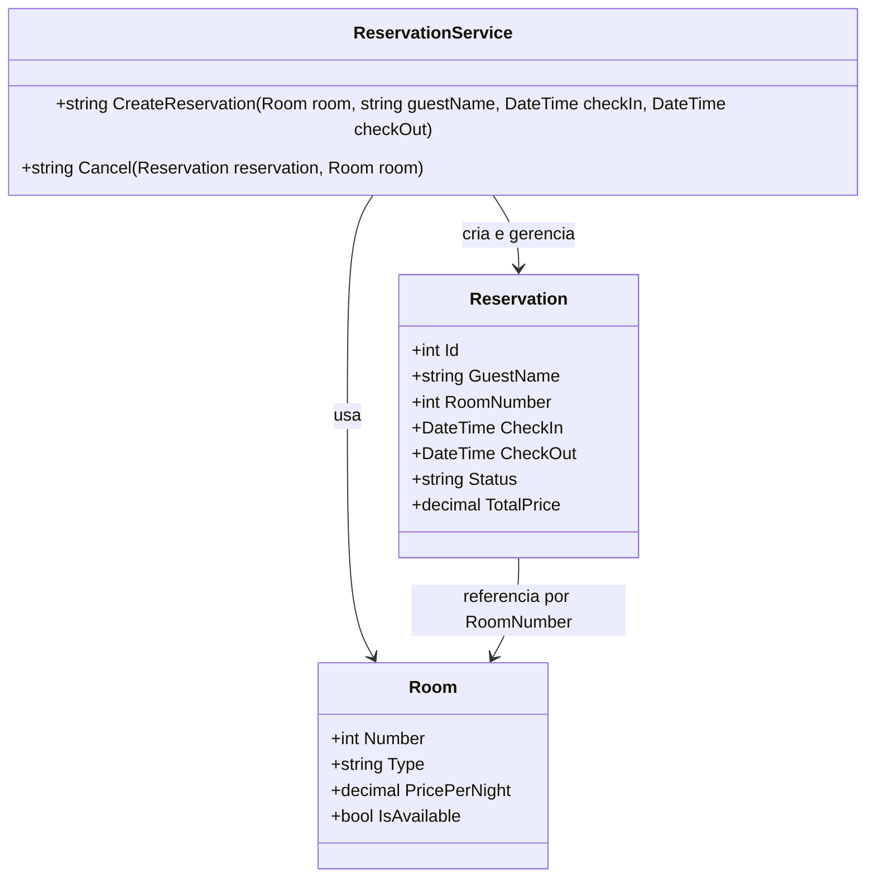

# 10.3 — Exercícios: Camada de Domínio

[← Voltar ao conteúdo](cap10-mod03-camada-dominio-conteudo.md)

---

## Como Fazer os Exercícios

Todos os exercícios usam C# (.NET). Para cada exercício:

1. Crie um projeto console: `dotnet new console -n ExercicioNome`
2. Implemente o código no arquivo `Program.cs`
3. Execute com `dotnet run`
4. Compare a saída com o esperado

Os exercícios estão organizados em ordem crescente de dificuldade: Básico, Intermediário e Avançado. Faça todos os básicos antes de passar para os intermediários.

---

## Exercício 1 — Entidade Produto com Domínio Rico (Básico)

Crie uma entidade `Product` com domínio rico que represente um produto de uma loja. A entidade deve:

- Ter os atributos: `Id`, `Name`, `Price`, `Stock`, `IsActive`
- Todos os setters devem ser privados
- O construtor deve validar:
  - Nome não pode ser vazio
  - Preço deve ser maior que zero
  - Estoque inicial não pode ser negativo
- Ter os métodos:
  - `UpdatePrice(decimal newPrice)` — atualiza o preço (deve ser positivo)
  - `AddStock(int quantity)` — adiciona estoque (quantidade deve ser positiva)
  - `Sell(int quantity)` — vende unidades (verifica se tem estoque suficiente)
  - `HasStock(int quantity)` — retorna `true` se tem estoque suficiente

Teste criando um produto, fazendo operações válidas e tentando operações inválidas (preço negativo, vender mais do que tem).

Dica: use `throw new ArgumentException(...)` para dados inválidos e `throw new InvalidOperationException(...)` para operações impossíveis no estado atual.

---

## Exercício 2 — Entidade Produto com Domínio Magro (Básico)

Crie a mesma entidade `Product` do exercício 1, mas agora com domínio magro:

- A entidade `Product` deve ter apenas propriedades públicas (sem validação, sem métodos de negócio)
- Crie um `ProductService` com os métodos:
  - `Register(Product product)` — válida e registra o produto
  - `UpdatePrice(Product product, decimal newPrice)` — válida e atualiza o preço
  - `Sell(Product product, int quantity)` — válida e realiza a venda

Teste com os mesmos cenários do exercício 1. Depois, tente alterar o preço do produto diretamente (sem usar o Service) para um valor negativo. O que acontece? Compare com o exercício 1.

Dica: no domínio magro, os métodos do Service retornam `string` com mensagem de sucesso ou erro, em vez de lançar exceções.

---

## Exercício 3 — Conta Bancária com Ciclo de Vida (Intermediário)

Crie uma entidade rica `BankAccount` (Conta Bancária) com ciclo de vida controlado. A conta deve ter os estados:

- `Active` (Ativa) — pode fazer depósitos e saques
- `Blocked` (Bloqueada) — pode fazer depósitos, mas não saques
- `Closed` (Fechada) — não pode fazer nenhuma operação

Regras:
- Conta nasce como `Active` com saldo zero
- `Deposit(decimal amount)` — deposita valor (deve ser positivo, conta não pode estar fechada)
- `Withdraw(decimal amount)` — saca valor (deve ser positivo, conta deve estar ativa, saldo suficiente)
- `Block(string reason)` — bloqueia a conta (motivo obrigatório, só pode bloquear conta ativa)
- `Unblock()` — desbloqueia a conta (só pode desbloquear conta bloqueada)
- `Close()` — fecha a conta (saldo deve ser zero, conta não pode já estar fechada)

Desenhe o diagrama de estados no papel antes de implementar. Teste todas as transições válidas e inválidas.

Dica: use um diagrama de estados como o do `Order` no módulo para planejar as transições antes de codificar.

---

## Exercício 4 — Comparação Rico vs Magro: Carrinho de Compras (Intermediário)

Implemente um `ShoppingCart` (Carrinho de Compras) nas duas abordagens e compare:

### Versão Rica

A entidade `ShoppingCart` deve ter:
- Lista de itens (produto, quantidade, preço unitário)
- Método `AddItem(string productName, decimal price, int quantity)` — adiciona item (máximo 20 itens)
- Método `RemoveItem(string productName)` — remove item pelo nome
- Método `UpdateQuantity(string productName, int newQuantity)` — atualiza quantidade (deve ser positiva)
- Propriedade `Total` — calcula o total do carrinho
- Propriedade `ItemCount` — retorna quantidade de itens distintos
- Método `Clear()` — esvazia o carrinho
- Regra: não pode adicionar o mesmo produto duas vezes (deve usar `UpdateQuantity`)

### Versão Magra

A entidade `ShoppingCart` deve ter apenas a lista de itens e propriedades públicas. Crie um `ShoppingCartService` com todos os métodos e regras.

Depois de implementar ambas, responda:
1. Qual versão tem mais linhas de código no total?
2. Em qual versão é mais fácil encontrar as regras?
3. Na versão magra, é possível adicionar o mesmo produto duas vezes burlando o Service?

---

## Exercício 5 — Sistema de Matrícula Escolar (Avançado)

Modele um sistema de matrícula escolar com domínio rico. Crie as seguintes entidades:

### Entidade `Student` (Aluno)
- Atributos: `Id`, `Name`, `Email`, `MaxCourses` (máximo de disciplinas, padrão 6)
- Atributo derivado: `EnrolledCount` (quantidade de matrículas ativas)
- Método `CanEnroll()` — verifica se pode se matricular em mais disciplinas
- Método `RegisterEnrollment()` — incrementa contador de matrículas
- Método `RegisterDropout()` — decrementa contador (não pode ficar negativo)

### Entidade `Course` (Disciplina)
- Atributos: `Id`, `Name`, `MaxStudents` (máximo de alunos), `EnrolledStudents` (alunos matriculados)
- Método `HasVacancy()` — verifica se tem vaga
- Método `EnrollStudent()` — matricula aluno (verifica vaga)
- Método `RemoveStudent()` — remove aluno (verifica se tem alunos)

### Entidade `Enrollment` (Matrícula)
- Atributos: `Id`, `StudentId`, `CourseId`, `Status`, `EnrolledAt`
- Estados: `Active` (ativa), `Completed` (concluída), `Cancelled` (cancelada)
- Método `Complete()` — marca como concluída (só se ativa)
- Método `Cancel(string reason)` — cancela (só se ativa, motivo obrigatório)

Teste o sistema com cenários:
- Aluno se matricula em 3 disciplinas
- Disciplina atinge o limite de vagas
- Aluno tenta se matricular além do limite
- Aluno cancela uma matrícula e se matricula em outra

Dica: comece modelando cada entidade separadamente. Depois, pense em como um Service orquestraria a matrícula (verificar vaga na disciplina E limite do aluno antes de criar a matrícula).

---

## Exercício 6 — Refatoração: De Magro para Rico (Avançado)

Abaixo está um sistema de reserva de hotel com domínio magro. Sua tarefa é refatorar para domínio rico, movendo as regras do Service para dentro das entidades.

### Código Original (Domínio Magro)

```csharp
// Entidade magra — apenas dados
public class Room
{
    public int Number { get; set; }
    public string Type { get; set; }      // "Standard", "Deluxe", "Suite"
    public decimal PricePerNight { get; set; }
    public bool IsAvailable { get; set; }
}

public class Reservation
{
    public int Id { get; set; }
    public string GuestName { get; set; }
    public int RoomNumber { get; set; }
    public DateTime CheckIn { get; set; }
    public DateTime CheckOut { get; set; }
    public string Status { get; set; }    // "Confirmed", "CheckedIn", "CheckedOut", "Cancelled"
    public decimal TotalPrice { get; set; }
}

// Service com todas as regras
public class ReservationService
{
    public string CreateReservation(Room room, string guestName, 
        DateTime checkIn, DateTime checkOut)
    {
        if (!room.IsAvailable)
            return "Erro: quarto nao disponivel.";
        if (string.IsNullOrWhiteSpace(guestName))
            return "Erro: nome do hospede obrigatorio.";
        if (checkIn >= checkOut)
            return "Erro: check-out deve ser depois do check-in.";
        if (checkIn < DateTime.Today)
            return "Erro: check-in nao pode ser no passado.";

        int nights = (checkOut - checkIn).Days;
        var reservation = new Reservation
        {
            GuestName = guestName,
            RoomNumber = room.Number,
            CheckIn = checkIn,
            CheckOut = checkOut,
            Status = "Confirmed",
            TotalPrice = room.PricePerNight * nights
        };

        room.IsAvailable = false;
        return $"Reserva criada! {nights} noites, total R${reservation.TotalPrice:F2}";
    }

    public string Cancel(Reservation reservation, Room room)
    {
        if (reservation.Status != "Confirmed")
            return "Erro: so pode cancelar reserva confirmada.";

        reservation.Status = "Cancelled";
        room.IsAvailable = true;
        return "Reserva cancelada.";
    }
}
```

Refatore para que:
- `Room` tenha métodos `Reserve()` e `Release()` com validações
- `Reservation` tenha construtor com validação, método `Cancel()` com regras de transição de estado, e propriedade calculada `Nights` e `TotalPrice`
- O Service fique mais enxuto, apenas orquestrando

Compare o código antes e depois. Quais vantagens você percebe na versão rica?

Diagrama de classes do sistema de reservas — versao dominio magro:



---

## Exercício 7 — Modelagem Livre: Escolha Seu Domínio (Avançado)

Escolha um domínio que você conhece bem (pode ser um hobby, um trabalho, um jogo) e modele pelo menos 3 entidades com domínio rico. Exemplos de domínios:

- **Pizzaria**: Pizza, Pedido, Cliente, Entregador
- **Academia**: Aluno, Plano, Treino, Exercício
- **Veterinária**: Animal, Dono, Consulta, Vacina
- **Estacionamento**: Vaga, Veículo, Ticket, Pagamento
- **Torneio de jogos**: Jogador, Time, Partida, Campeonato

Para cada entidade:
1. Defina os atributos com tipos adequados
2. Crie construtor com validações
3. Implemente pelo menos 2 métodos de negócio com regras
4. Use setters privados para proteger os dados
5. Teste com cenários válidos e inválidos

Depois, escreva um parágrafo explicando por que escolheu domínio rico para essas entidades (ou por que alguma delas poderia ser magra).

---

## Dicas Gerais

- Comece sempre pelo diagrama: desenhe as entidades, seus atributos e relacionamentos antes de codificar
- Pense nas regras de negócio como "o que não pode acontecer" — cada regra é uma proteção contra um estado inválido
- No domínio rico, use `throw` para impedir operações inválidas; no domínio magro, retorne mensagens de erro
- Teste sempre os casos de erro, não apenas os casos de sucesso — é nos erros que as regras aparecem
- Compare suas implementações rica e magra: qual é mais fácil de entender? Qual é mais segura?

---

[← Voltar ao conteúdo](cap10-mod03-camada-dominio-conteudo.md)
