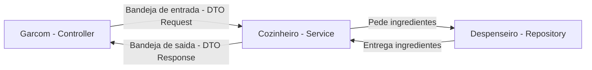
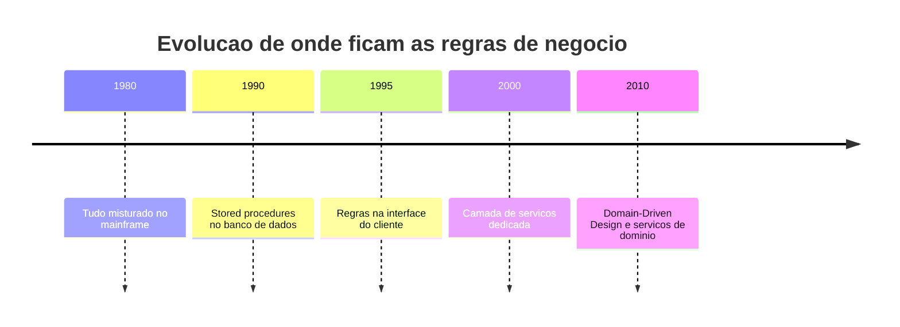
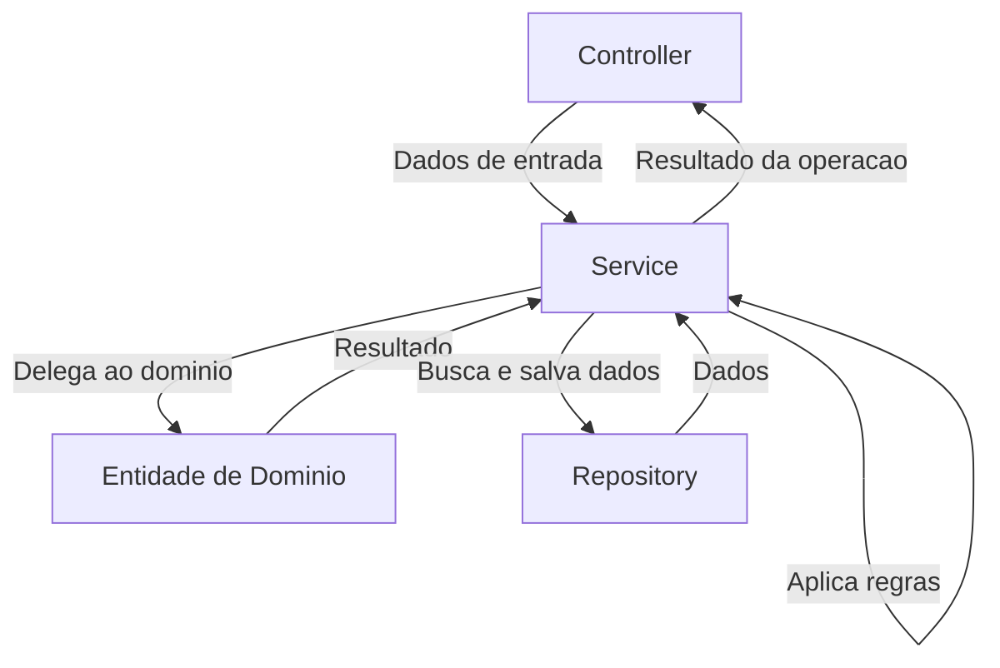
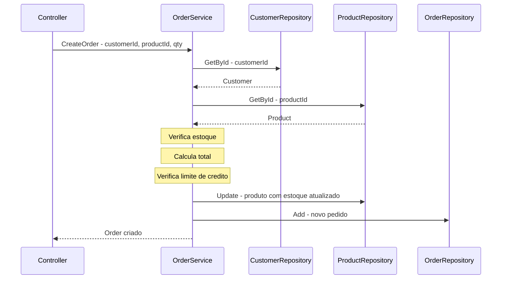
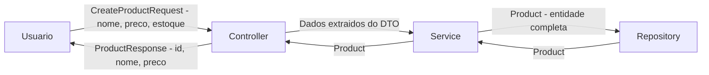
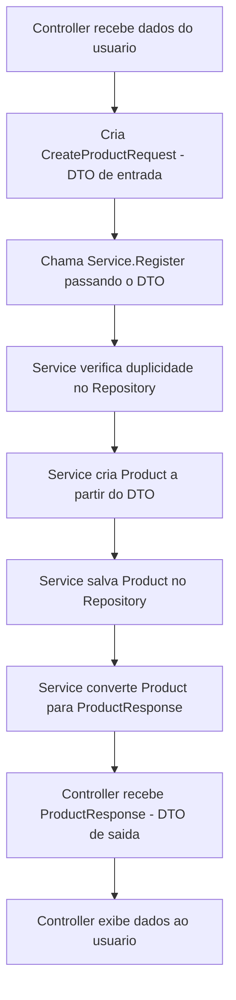
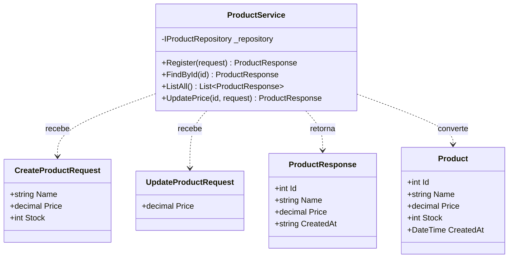
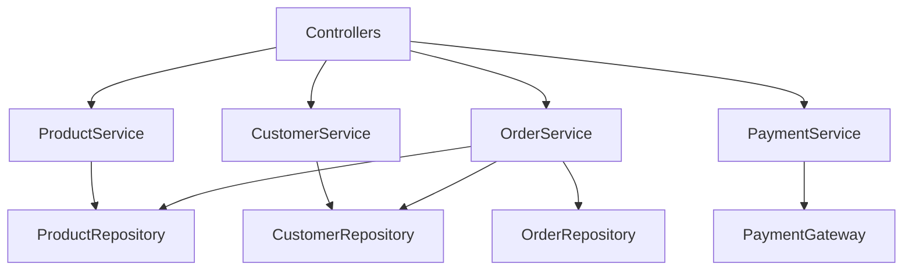
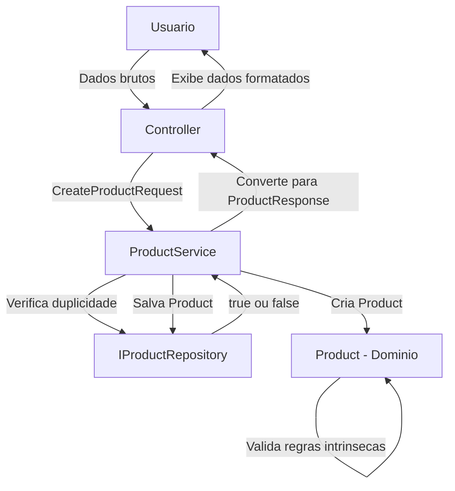

# 10.4 — Camada de Serviços e DTOs

[← Anterior: Camada de Domínio](cap10-mod03-camada-dominio-conteudo.md) · [Próximo: Repositórios e Integrações →](cap10-mod05-camada-repositorio-integracao-conteudo.md)

---

## Introdução

No módulo anterior, você mergulhou na camada de domínio — o coração do sistema, onde vivem as entidades que representam os conceitos do negócio. Viu que o `Product` não é apenas um pacote de dados: ele pode ter métodos, validações internas e comportamento próprio. Agora vem a pergunta natural: quem **usa** essas entidades? Quem coordena as operações? Quem decide o que acontece quando o usuário pede para cadastrar um produto, atualizar um preço ou processar um pedido?

A resposta é a **camada de serviços** — a camada que orquestra tudo. Se o domínio é o coração, o serviço é o cérebro. Ele recebe os dados que chegam de fora, decide o que fazer com eles, chama as entidades certas, aciona os repositórios e devolve o resultado. É o maestro da orquestra.

E junto com os serviços, vamos aprofundar um conceito que apareceu brevemente no módulo 10.2: os **DTOs** (Data Transfer Objects). Aqueles objetos simples que servem para transportar dados entre as camadas. Quando usar? Quando não usar? Por que às vezes eles são essenciais e outras vezes são puro desperdício?

Este módulo vai responder essas perguntas com profundidade. Vamos entender a história por trás dos serviços, ver exemplos concretos em C#, aprender a distinguir o que pertence ao serviço e o que pertence ao domínio, e dominar a arte de criar DTOs que fazem sentido — sem cair na armadilha de criar DTOs para tudo.

---

## Como Executar os Exemplos Deste Módulo

Os exemplos deste módulo usam C# (.NET), a mesma linguagem do capítulo 9. Para executar:

1. Certifique-se de que o .NET SDK está instalado (você já configurou no módulo 9.3)
2. Crie uma pasta para os exemplos: `mkdir -p ~/meus-projetos/curso/cap10`
3. Para cada exemplo, crie um projeto console: `dotnet new console -n NomeDoExemplo`
4. Cole o código no arquivo `Program.cs`
5. Execute com `dotnet run`

Alguns exemplos deste módulo mostram múltiplos arquivos. Em um projeto real, cada classe ficaria em seu próprio arquivo. Para simplificar a execução dos exemplos, vamos colocar tudo em `Program.cs` — mas sempre indicando em qual arquivo cada classe ficaria em um projeto real.

---

## A Analogia: O Cozinheiro e a Bandeja

No módulo 10.2, usamos a analogia do restaurante. O garçom (Controller) recebe o pedido, o cozinheiro (Service) prepara o prato, e o despenseiro (Repository) fornece os ingredientes. Agora vamos aprofundar a figura do cozinheiro e adicionar um elemento novo: a bandeja.

### O Cozinheiro: Mais do que Seguir Receitas

Pense no cozinheiro de um restaurante movimentado. Ele não faz apenas uma coisa — ele **coordena** várias:

- Recebe o pedido do garçom (dados de entrada)
- Verifica se o pedido faz sentido (o prato existe no cardápio? o cliente pediu algo compatível?)
- Consulta a despensa para saber se tem ingredientes (chama o repositório)
- Segue a receita para preparar o prato (aplica regras de negócio)
- Às vezes combina ingredientes de diferentes despensas (coordena múltiplos repositórios)
- Entrega o prato pronto ao garçom (retorna o resultado)

O cozinheiro **não** atende clientes — isso é trabalho do garçom. O cozinheiro **não** vai à despensa buscar ingredientes — ele pede ao despenseiro. O cozinheiro **não** decide como os ingredientes são armazenados — ele só pede o que precisa.

O cozinheiro é o **orquestrador**. Ele sabe a ordem das coisas, sabe quais regras aplicar e sabe a quem pedir cada coisa. Essa é exatamente a função do Service na arquitetura de software.

### A Bandeja: Transportando sem Misturar

Agora pense na bandeja que o garçom usa para levar os pratos. A bandeja não é o prato. A bandeja não é a comida. A bandeja é apenas um **meio de transporte** — ela carrega coisas de um lugar para outro.

No restaurante, a bandeja tem algumas características interessantes:

- Ela é **simples** — não tem lógica, não processa nada, só carrega
- Ela é **descartável** — depois de entregar, ninguém guarda a bandeja como algo precioso
- Ela é **adaptada ao contexto** — a bandeja do salão é diferente da bandeja da cozinha. O garçom leva ao cliente um prato bonito e arrumado. Na cozinha, os ingredientes vêm em caixas e sacos. O formato muda conforme quem está recebendo.

Essa é exatamente a função do **DTO** (Data Transfer Object). Um DTO é uma bandeja de dados — um objeto simples que transporta informações entre camadas, sem lógica, sem comportamento, apenas dados organizados para o contexto de quem vai receber.

| Restaurante | Software | Função |
|-------------|----------|--------|
| Cozinheiro | Service | Orquestra, coordena, aplica regras |
| Bandeja da cozinha | DTO de entrada | Transporta dados que chegam de fora |
| Bandeja do salao | DTO de saida | Transporta dados formatados para o cliente |
| Prato de comida | Entidade de dominio | O produto real, com substancia e valor |



---

## Contexto Histórico: Como os Serviços Surgiram

Para entender por que a camada de serviços existe, precisamos voltar no tempo e ver como o software corporativo evoluiu.

### Anos 1990: O Nascimento do Enterprise Software

Nos anos 1990, com a explosão da internet e do comércio eletrônico, as empresas começaram a construir sistemas cada vez mais complexos. Não era mais um programinha que rodava em um PC — eram sistemas que gerenciavam milhares de transações por dia, com dezenas de regras de negócio, múltiplas interfaces (web, desktop, batch) e vários bancos de dados.

O problema era: onde colocar as regras de negócio?

### A Tentativa 1: Regras no Banco de Dados

A primeira tentativa foi colocar as regras de negócio no próprio banco de dados, usando **stored procedures** — programas que rodam dentro do banco. A ideia parecia boa: como os dados já estão no banco, por que não processar lá mesmo?

O problema: stored procedures são difíceis de testar, difíceis de versionar (não entram bem no Git), difíceis de debugar e ficam amarradas a um banco específico. Se a empresa quisesse trocar de Oracle para PostgreSQL, teria que reescrever todas as stored procedures. Além disso, a linguagem SQL não foi feita para lógica complexa — tentar escrever regras de negócio em SQL é como tentar cozinhar usando apenas uma faca. Dá para fazer, mas não é a ferramenta certa.

### A Tentativa 2: Regras na Interface

A segunda tentativa foi colocar as regras na camada de apresentação — no código JavaScript do navegador ou no código do formulário desktop. "Se o preço for negativo, mostra erro" — direto na tela.

O problema: se o sistema tivesse duas interfaces (web e desktop), as regras precisavam ser duplicadas. E se alguém acessasse o banco diretamente (via API ou script), as regras não seriam aplicadas. As regras ficavam espalhadas e inconsistentes.

### A Solução: A Camada de Serviços

A solução veio com a formalização da **camada de serviços** — uma camada dedicada exclusivamente à lógica de negócio, independente da interface e independente do banco de dados.

Martin Fowler, um dos maiores nomes da arquitetura de software, descreveu o padrão **Service Layer** em seu livro "Patterns of Enterprise Application Architecture" (2002). A ideia era simples: criar uma camada que define a fronteira da aplicação, coordena as respostas e encapsula a lógica de negócio.

Com a camada de serviços:
- As regras ficam em **um lugar só** — não importa se o acesso vem da web, do app, de uma API ou de um script
- As regras são **testáveis** — você testa o Service sem precisar de interface ou banco
- As regras são **independentes** — trocar o banco ou a interface não afeta as regras
- As regras são **versionáveis** — o código do Service entra no Git como qualquer outro código



Frameworks como Java EE (com EJBs), Spring Framework e ASP.NET foram construídos em torno dessa ideia. O Spring, lançado em 2003 por Rod Johnson, popularizou enormemente o conceito de Service Layer com injeção de dependência — exatamente o que você já viu no capítulo 9 e no módulo 10.2.

### E os DTOs? De Onde Vieram?

Os DTOs surgiram do mesmo contexto enterprise dos anos 2000. Martin Fowler documentou o padrão **Data Transfer Object** como uma solução para um problema específico: quando sistemas distribuídos precisavam enviar dados pela rede, cada chamada remota era cara (lenta). Em vez de fazer várias chamadas pequenas, era melhor empacotar todos os dados necessários em um único objeto e enviar de uma vez.

Com o tempo, o conceito de DTO se expandiu. Hoje, DTOs são usados não apenas para chamadas remotas, mas para qualquer situação onde os dados que uma camada precisa são diferentes dos dados que outra camada tem. O DTO é o "tradutor" entre camadas.

---

## O que é a Camada de Serviços

Vamos ser precisos. A camada de serviços é a camada que **orquestra a lógica da aplicação**. Ela fica entre o Controller (que recebe entrada) e o Repository (que acessa dados), coordenando as operações.

### O que o Service FAZ

| Responsabilidade | Exemplo |
|-----------------|---------|
| Receber dados da camada de entrada | Recebe nome, preco e estoque do Controller |
| Aplicar regras de negocio | Verifica se preco e positivo, se nome não e duplicado |
| Delegar para o dominio | Chama métodos da entidade Product |
| Chamar repositórios | Pede ao Repository para salvar ou buscar dados |
| Coordenar operações complexas | Busca produto, verifica estoque, cria pedido, atualiza estoque |
| Retornar resultados | Devolve o resultado da operação ao Controller |

### O que o Service NAO FAZ

| Proibido | Por que |
|----------|---------|
| Conhecer HTTP, status codes, headers | Isso e responsabilidade do Controller |
| Formatar respostas em JSON ou HTML | Isso e responsabilidade do Controller |
| Acessar banco de dados diretamente | Isso e responsabilidade do Repository |
| Escrever SQL ou queries | Isso e responsabilidade do Repository |
| Ler entrada do usuario | Isso e responsabilidade do Controller |
| Exibir mensagens no console | Isso e responsabilidade do Controller |

A regra é clara: o Service não sabe **como** os dados chegaram (se veio de um terminal, de uma API HTTP ou de um arquivo) e não sabe **onde** os dados estão guardados (se é SQLite, PostgreSQL, MongoDB ou memória). Ele só sabe **o que fazer** com os dados.

### Visualizando a Posição do Service



O Service é o ponto central. Tudo passa por ele. Ele recebe do Controller, consulta o Repository, usa as entidades de domínio e devolve o resultado. É o maestro que coordena todos os músicos da orquestra.

---

## Service vs Domínio: Quem Faz o Quê?

Uma dúvida muito comum é: "se o Service aplica regras de negócio e o domínio também tem regras, qual é a diferença?"

A diferença é sutil mas importante:

- **Regras do domínio** são regras que pertencem à entidade em si. "Um produto não pode ter preço negativo" é uma regra do Product — ela existe independente de qualquer operação. No módulo 10.3, você viu que a entidade pode validar seus próprios dados.

- **Regras do serviço** são regras que envolvem **coordenação** — operações que precisam consultar dados externos, combinar múltiplas entidades ou tomar decisões que dependem do contexto da aplicação. "Não pode cadastrar produto com nome duplicado" é uma regra do Service — porque para verificar duplicidade, é preciso consultar o repositório.

Vamos ver isso em uma tabela:

| Regra | Onde fica | Por que |
|-------|-----------|---------|
| Preco não pode ser negativo | Dominio - Product | E uma regra intrinseca do produto |
| Nome não pode ser vazio | Dominio - Product | E uma regra intrinseca do produto |
| Nome não pode ser duplicado | Service | Precisa consultar o repositório |
| Desconto máximo de 50% | Dominio - Product | E uma regra do produto |
| Cliente VIP tem desconto extra de 10% | Service | Precisa consultar dados do cliente |
| Estoque mínimo de 5 unidades para venda online | Service | Depende do canal de venda |
| Pedido não pode exceder limite de credito | Service | Precisa consultar dados do cliente e do pedido |

A regra prática é: **se a regra precisa de informação que a entidade não tem, ela vai no Service. Se a regra depende apenas dos dados da própria entidade, ela vai no domínio.**

### Exemplo em Código: Domínio vs Service

Veja como a mesma operação de cadastro se divide entre domínio e serviço:

```csharp
// === Models/Product.cs — Regras do DOMINIO ===
// Regras que pertencem ao produto em si

public class Product
{
    public int Id { get; set; }
    public string Name { get; private set; }   // "Name" = nome
    public decimal Price { get; private set; }  // "Price" = preco
    public int Stock { get; private set; }      // "Stock" = estoque

    // O construtor valida regras INTRINSECAS do produto
    public Product(string name, decimal price, int stock)
    {
        // Regra do dominio: nome nao pode ser vazio
        if (string.IsNullOrWhiteSpace(name))
            throw new ArgumentException("Nome do produto nao pode ser vazio.");

        // Regra do dominio: preco deve ser positivo
        if (price <= 0)
            throw new ArgumentException("Preco deve ser maior que zero.");

        // Regra do dominio: estoque nao pode ser negativo
        if (stock < 0)
            throw new ArgumentException("Estoque nao pode ser negativo.");

        Name = name;
        Price = price;
        Stock = stock;
    }

    // Metodo do dominio: atualizar preco com validacao
    // "UpdatePrice" = atualizar preco
    public void UpdatePrice(decimal newPrice)
    {
        if (newPrice <= 0)
            throw new ArgumentException("Preco deve ser maior que zero.");
        Price = newPrice;
    }

    // Metodo do dominio: adicionar estoque
    // "AddStock" = adicionar estoque
    public void AddStock(int quantity)
    {
        if (quantity <= 0)
            throw new ArgumentException("Quantidade deve ser maior que zero.");
        Stock += quantity;
    }
}
```

Saída esperada: nenhuma (é apenas a definição da classe)

```csharp
// === Services/ProductService.cs — Regras do SERVICO ===
// Regras que precisam de coordenacao e dados externos

public class ProductService
{
    private readonly IProductRepository _repository;

    public ProductService(IProductRepository repository)
    {
        _repository = repository;
    }

    // Cadastrar produto — regras de COORDENACAO
    // "Register" = registrar
    public Product Register(string name, decimal price, int stock)
    {
        // Regra do SERVICO: nome nao pode ser duplicado
        // (precisa consultar o repositorio — o Product nao sabe disso)
        if (_repository.Exists(name))
        {
            throw new InvalidOperationException(
                $"Ja existe um produto com o nome '{name}'.");
        }

        // Cria o produto — as regras INTRINSECAS sao validadas
        // pelo construtor do Product (dominio)
        var product = new Product(name, price, stock);

        // Salva no repositorio
        _repository.Add(product);

        return product;
    }

    // Atualizar preco — coordena busca + validacao do dominio
    // "UpdatePrice" = atualizar preco
    public Product UpdatePrice(int id, decimal newPrice)
    {
        // Regra do SERVICO: produto deve existir
        var product = _repository.GetById(id);
        if (product == null)
        {
            throw new KeyNotFoundException(
                $"Produto com ID {id} nao encontrado.");
        }

        // Delega a validacao do preco para o DOMINIO
        product.UpdatePrice(newPrice);

        // Salva a alteracao
        _repository.Update(product);

        return product;
    }
}
```

Saída esperada: nenhuma (é apenas a definição da classe)

Observe a divisão clara:
- O **Product** (domínio) válida: "preço deve ser positivo", "nome não pode ser vazio"
- O **ProductService** (serviço) válida: "nome não pode ser duplicado", "produto deve existir"

O Service **delega** para o domínio o que o domínio sabe fazer. Ele não repete as validações — ele confia que o construtor do Product vai rejeitar dados inválidos. O Service cuida do que o domínio não pode fazer sozinho: consultar o repositório, verificar duplicidade, coordenar a operação completa.

---

## Anatomia de um Service: Estrutura Completa

Vamos construir um Service completo passo a passo, explicando cada decisão. Vamos usar o exemplo de um sistema de pedidos — mais complexo que o de produtos, para mostrar como o Service brilha quando há múltiplas entidades envolvidas.

```csharp
// === Services/OrderService.cs — Servico de Pedidos ===
// Exemplo completo de um Service que coordena multiplas entidades

// "OrderService" = servico de pedidos
public class OrderService
{
    // Dependencias — injetadas pelo construtor
    private readonly IOrderRepository _orderRepository;       // repositorio de pedidos
    private readonly IProductRepository _productRepository;   // repositorio de produtos
    private readonly ICustomerRepository _customerRepository; // repositorio de clientes

    // Construtor: recebe TODAS as dependencias necessarias
    public OrderService(
        IOrderRepository orderRepository,
        IProductRepository productRepository,
        ICustomerRepository customerRepository)
    {
        _orderRepository = orderRepository;
        _productRepository = productRepository;
        _customerRepository = customerRepository;
    }

    // Criar pedido — operacao que envolve MULTIPLAS entidades
    // "CreateOrder" = criar pedido
    public Order CreateOrder(int customerId, int productId, int quantity)
    {
        // Passo 1: buscar o cliente (coordenacao)
        var customer = _customerRepository.GetById(customerId);
        if (customer == null)
            throw new KeyNotFoundException("Cliente nao encontrado.");

        // Passo 2: buscar o produto (coordenacao)
        var product = _productRepository.GetById(productId);
        if (product == null)
            throw new KeyNotFoundException("Produto nao encontrado.");

        // Passo 3: verificar estoque (regra de negocio que envolve dados externos)
        if (product.Stock < quantity)
            throw new InvalidOperationException(
                $"Estoque insuficiente. Disponivel: {product.Stock}, solicitado: {quantity}.");

        // Passo 4: calcular total (regra de negocio)
        decimal total = product.Price * quantity;

        // Passo 5: verificar limite de credito do cliente (regra que envolve 2 entidades)
        if (total > customer.CreditLimit)
            throw new InvalidOperationException(
                $"Pedido excede limite de credito. Limite: R${customer.CreditLimit:F2}, total: R${total:F2}.");

        // Passo 6: criar o pedido (dominio)
        var order = new Order(customer, product, quantity, total);

        // Passo 7: atualizar estoque do produto (efeito colateral coordenado)
        product.RemoveStock(quantity);
        _productRepository.Update(product);

        // Passo 8: salvar o pedido
        _orderRepository.Add(order);

        return order;
    }
}
```

Saída esperada: nenhuma (é apenas a definição da classe)

Observe como o `OrderService.CreateOrder` coordena **8 passos** envolvendo **3 entidades** (Customer, Product, Order) e **3 repositórios**. Nenhuma dessas entidades poderia fazer isso sozinha:

- O Product não sabe quem é o cliente
- O Customer não sabe qual produto está sendo comprado
- O Order não sabe se tem estoque disponível

O Service é o único que tem visão do todo. Ele é o **orquestrador** — sabe a ordem das operações, sabe quem chamar e sabe o que fazer se algo der errado.



### Padrão de um Método de Service

Todo método de Service segue um padrão previsível:

1. **Buscar dados necessários** — consulta repositórios
2. **Validar regras de negócio** — verifica condições que dependem de dados externos
3. **Executar a operação** — cria ou modifica entidades (delegando validações intrínsecas ao domínio)
4. **Persistir resultados** — salva no repositório
5. **Retornar resultado** — devolve o resultado ao chamador

Esse padrão se repete em praticamente todo método de Service que você vai encontrar na vida profissional. Quando você vir um Service, procure esses 5 passos — eles estarão lá.

---

## DTOs: Data Transfer Objects

Agora vamos ao segundo grande tema deste módulo: os DTOs. No módulo 10.2, mencionamos brevemente que DTOs são objetos simples para transportar dados entre camadas. Agora vamos aprofundar.

### O que é um DTO

**DTO** significa **Data Transfer Object** — Objeto de Transferência de Dados. É uma classe simples que existe apenas para carregar dados de um lugar para outro. Diferente de uma entidade de domínio (que tem métodos, validações e comportamento), um DTO é apenas um **pacote de dados**.

Características de um DTO:
- **Sem lógica** — não tem métodos de negócio, não válida nada
- **Sem comportamento** — não faz cálculos, não toma decisões
- **Apenas propriedades** — só tem campos de dados (get/set)
- **Descartável** — é criado, usado para transportar dados e descartado
- **Específico para o contexto** — um DTO de entrada é diferente de um DTO de saída

### Por que DTOs Existem

O problema que DTOs resolvem é simples: **os dados que uma camada precisa nem sempre são iguais aos dados que outra camada tem**.

Pense no cadastro de um produto:

- O **usuário envia**: nome, preço e estoque (3 campos)
- A **entidade Product tem**: id, nome, preço, estoque, data de criação (5 campos)
- O **usuário recebe de volta**: id, nome, preço (3 campos, diferentes dos de entrada)

Se usarmos a entidade Product diretamente como entrada, o usuário teria que enviar o ID e a data de criação — mas esses campos são gerados pelo sistema, não pelo usuário. Se usarmos a entidade Product diretamente como saída, o usuário receberia o estoque — mas talvez não queiramos expor essa informação.

O DTO resolve isso: criamos objetos específicos para cada direção do fluxo.



### Os 3 Tipos Comuns de DTO

| Tipo | Nome comum | Direcao | Exemplo |
|------|-----------|---------|---------|
| DTO de entrada | Request, Command, Input | Usuario para Service | CreateProductRequest |
| DTO de saida | Response, Result, Output | Service para Usuario | ProductResponse |
| DTO de atualização | UpdateRequest, Patch | Usuario para Service | UpdateProductRequest |

Vamos ver cada um em código:

```csharp
// === DTOs/CreateProductRequest.cs ===
// DTO de ENTRADA — dados que o usuario envia para cadastrar um produto
// "CreateProductRequest" = requisicao de criacao de produto

public class CreateProductRequest
{
    public string Name { get; set; }     // "Name" = nome do produto
    public decimal Price { get; set; }   // "Price" = preco
    public int Stock { get; set; }       // "Stock" = estoque inicial

    // Observe: NAO tem Id, NAO tem CreatedAt
    // Esses campos sao gerados pelo sistema, nao pelo usuario
}
```

Saída esperada: nenhuma (é apenas a definição da classe)

```csharp
// === DTOs/ProductResponse.cs ===
// DTO de SAIDA — dados que o sistema devolve ao usuario
// "ProductResponse" = resposta com dados do produto

public class ProductResponse
{
    public int Id { get; set; }          // "Id" = identificador
    public string Name { get; set; }     // "Name" = nome
    public decimal Price { get; set; }   // "Price" = preco
    public string CreatedAt { get; set; } // "CreatedAt" = data de criacao (como texto)

    // Observe: NAO tem Stock (nao queremos expor o estoque ao usuario)
    // Observe: CreatedAt e string, nao DateTime (formatado para exibicao)
}
```

Saída esperada: nenhuma (é apenas a definição da classe)

```csharp
// === DTOs/UpdateProductRequest.cs ===
// DTO de ATUALIZACAO — dados que o usuario envia para atualizar um produto
// "UpdateProductRequest" = requisicao de atualizacao de produto

public class UpdateProductRequest
{
    public decimal Price { get; set; }   // "Price" = novo preco

    // Observe: so tem o campo que pode ser atualizado
    // O usuario NAO pode mudar o nome nem o estoque por aqui
}
```

Saída esperada: nenhuma (é apenas a definição da classe)

### O Fluxo Completo com DTOs

Agora vamos ver como o Service usa esses DTOs no fluxo completo:

```csharp
// === Services/ProductService.cs — Usando DTOs ===
// Versao do Service que recebe DTOs e retorna DTOs

public class ProductService
{
    private readonly IProductRepository _repository;

    public ProductService(IProductRepository repository)
    {
        _repository = repository;
    }

    // Cadastrar produto — recebe DTO de entrada, retorna DTO de saida
    public ProductResponse Register(CreateProductRequest request)
    {
        // Regra do servico: nome nao pode ser duplicado
        if (_repository.Exists(request.Name))
        {
            throw new InvalidOperationException(
                $"Ja existe um produto com o nome '{request.Name}'.");
        }

        // Converte DTO de entrada para entidade de dominio
        // O construtor do Product valida as regras intrinsecas
        var product = new Product(request.Name, request.Price, request.Stock);

        // Salva no repositorio
        _repository.Add(product);

        // Converte entidade de dominio para DTO de saida
        return ToResponse(product);
    }

    // Buscar por ID — retorna DTO de saida
    public ProductResponse FindById(int id)
    {
        var product = _repository.GetById(id);
        if (product == null)
            throw new KeyNotFoundException($"Produto com ID {id} nao encontrado.");

        return ToResponse(product);
    }

    // Listar todos — retorna lista de DTOs de saida
    public List<ProductResponse> ListAll()
    {
        var products = _repository.GetAll();
        var responses = new List<ProductResponse>();

        foreach (var product in products)
        {
            responses.Add(ToResponse(product));
        }

        return responses;
    }

    // Atualizar preco — recebe DTO de atualizacao, retorna DTO de saida
    public ProductResponse UpdatePrice(int id, UpdateProductRequest request)
    {
        var product = _repository.GetById(id);
        if (product == null)
            throw new KeyNotFoundException($"Produto com ID {id} nao encontrado.");

        // Delega validacao do preco para o dominio
        product.UpdatePrice(request.Price);

        _repository.Update(product);

        return ToResponse(product);
    }

    // Metodo auxiliar: converte Product para ProductResponse
    // "ToResponse" = converter para resposta
    private ProductResponse ToResponse(Product product)
    {
        return new ProductResponse
        {
            Id = product.Id,
            Name = product.Name,
            Price = product.Price,
            CreatedAt = product.CreatedAt.ToString("dd/MM/yyyy HH:mm")
        };
    }
}
```

Saída esperada: nenhuma (é apenas a definição da classe)

Observe o método `ToResponse` — ele é o **conversor** entre a entidade de domínio e o DTO de saída. Esse tipo de método é muito comum em Services. Alguns projetos criam classes separadas chamadas **Mappers** para fazer essa conversão, mas para projetos simples, um método privado no Service é suficiente.

O fluxo completo fica assim:



---

## Quando Usar DTOs e Quando NÃO Usar

Esta é uma das perguntas mais importantes deste módulo. DTOs são úteis, mas **nem sempre são necessários**. Criar DTOs para tudo é over-engineering — adiciona complexidade sem benefício.

Veja a relacao entre entidade, DTOs e Service:



### Quando DTOs FAZEM Sentido

| Situação | Por que usar DTO |
|----------|-----------------|
| Dados de entrada diferentes da entidade | Usuario envia 3 campos, entidade tem 7 |
| Dados de saida diferentes da entidade | Não quer expor todos os campos ao usuario |
| API pública | Precisa controlar exatamente o que entra e sai |
| Multiplas interfaces | Web, app e API usam formatos diferentes |
| Segurança | Não quer que o usuario consiga alterar campos internos |
| Versionamento | Precisa manter versões antigas da API funcionando |

### Quando DTOs NAO Fazem Sentido

| Situação | Por que NAO usar DTO |
|----------|---------------------|
| DTO identico a entidade | Se os campos são os mesmos, o DTO e redundante |
| Projeto simples com uma interface | Complexidade desnecessaria |
| CRUD básico sem regras especiais | A entidade serve como entrada e saida |
| Prototipo ou MVP | Foco em velocidade, não em perfeicao |

### A Regra de Ouro

**Se o DTO é idêntico à entidade, não crie um DTO.**

Essa regra é simples e poderosa. Se o `CreateProductRequest` tivesse exatamente os mesmos campos que o `Product`, ele seria uma cópia inútil. Cada classe no seu projeto deve existir por um motivo. Se não há diferença entre o DTO e a entidade, use a entidade diretamente.

Lembra do princípio de simplicidade do módulo 10.1? Ele se aplica aqui com força total. Não crie abstrações "por precaução" ou "porque pode precisar no futuro". Crie quando precisar. Se amanhã os dados de entrada ficarem diferentes da entidade, aí sim você cria o DTO. Até lá, mantenha simples.

### Exemplo: Sem DTO vs Com DTO

Vamos comparar as duas abordagens para o mesmo cadastro de produto:

**Sem DTO (projeto simples):**

```csharp
// Service recebe os dados diretamente — sem DTO
// Abordagem simples, funciona bem para projetos pequenos

public class ProductService
{
    private readonly IProductRepository _repository;

    public ProductService(IProductRepository repository)
    {
        _repository = repository;
    }

    // Recebe dados primitivos, retorna a entidade diretamente
    public Product Register(string name, decimal price, int stock)
    {
        if (_repository.Exists(name))
            throw new InvalidOperationException("Produto duplicado.");

        var product = new Product(name, price, stock);
        _repository.Add(product);
        return product; // retorna a entidade — sem DTO de saida
    }
}
```

Saída esperada: nenhuma (é apenas a definição da classe)

**Com DTO (projeto com API pública):**

```csharp
// Service recebe DTO e retorna DTO — controle total dos dados
// Abordagem para projetos com API publica ou multiplas interfaces

public class ProductService
{
    private readonly IProductRepository _repository;

    public ProductService(IProductRepository repository)
    {
        _repository = repository;
    }

    // Recebe DTO de entrada, retorna DTO de saida
    public ProductResponse Register(CreateProductRequest request)
    {
        if (_repository.Exists(request.Name))
            throw new InvalidOperationException("Produto duplicado.");

        var product = new Product(request.Name, request.Price, request.Stock);
        _repository.Add(product);

        // Converte para DTO de saida — controla o que o usuario ve
        return new ProductResponse
        {
            Id = product.Id,
            Name = product.Name,
            Price = product.Price,
            CreatedAt = product.CreatedAt.ToString("dd/MM/yyyy HH:mm")
        };
    }
}
```

Saída esperada: nenhuma (é apenas a definição da classe)

As duas abordagens são válidas. A primeira é mais simples — ideal para projetos pequenos, CLIs e protótipos. A segunda dá mais controle — ideal para APIs públicas, projetos com múltiplas interfaces e sistemas que precisam de segurança nos dados expostos.

---

## Resultado de Operação: Como o Service Comunica Sucesso e Erro

No módulo 10.2, o Service retornava strings como "Produto cadastrado com sucesso!" ou "Erro: preço deve ser maior que zero." Isso funciona para exemplos simples, mas em projetos reais tem problemas:

- Como o Controller sabe se deu certo ou errado? Ele teria que verificar se a string começa com "Erro"
- E se a mensagem mudar? O Controller quebra
- E se precisar retornar o produto criado junto com a mensagem?

Existem duas abordagens comuns para resolver isso:

### Abordagem 1: Exceções (Exceptions)

A abordagem mais comum em C# e Java é usar **exceções** para erros e retornar o resultado diretamente para sucesso:

```csharp
// Abordagem com excecoes — a mais comum em C# e Java
// O Service lanca excecao quando algo da errado

public class ProductService
{
    private readonly IProductRepository _repository;

    public ProductService(IProductRepository repository)
    {
        _repository = repository;
    }

    // Retorna Product em caso de sucesso
    // Lanca excecao em caso de erro
    public Product Register(string name, decimal price, int stock)
    {
        // Erro: lanca excecao
        if (_repository.Exists(name))
            throw new InvalidOperationException("Produto duplicado.");

        // Sucesso: retorna o produto
        var product = new Product(name, price, stock);
        _repository.Add(product);
        return product;
    }
}

// No Controller, trata a excecao:
// "try" = tentar, "catch" = capturar
public class ProductController
{
    private readonly ProductService _service;

    public ProductController(ProductService service)
    {
        _service = service;
    }

    public void RegisterProduct()
    {
        Console.Write("Nome: ");
        var name = Console.ReadLine();
        Console.Write("Preco: ");
        decimal.TryParse(Console.ReadLine(), out var price);
        Console.Write("Estoque: ");
        int.TryParse(Console.ReadLine(), out var stock);

        try
        {
            // Tenta cadastrar — se der erro, cai no catch
            var product = _service.Register(name, price, stock);
            Console.WriteLine($"Produto cadastrado! ID: {product.Id}");
        }
        catch (Exception ex)
        {
            // Captura o erro e exibe a mensagem
            Console.WriteLine($"Erro: {ex.Message}");
        }
    }
}
```

Saída esperada (cadastro com sucesso):
```
Nome: Notebook
Preco: 3500
Estoque: 10
Produto cadastrado! ID: 1
```

Saída esperada (produto duplicado):
```
Nome: Notebook
Preco: 3500
Estoque: 10
Erro: Produto duplicado.
```

### Abordagem 2: Objeto de Resultado (Result Pattern)

Outra abordagem é criar um objeto que encapsula tanto o sucesso quanto o erro. Essa abordagem é popular em linguagens funcionais e está ganhando espaço em C#:

```csharp
// === DTOs/OperationResult.cs ===
// Objeto que encapsula o resultado de uma operacao
// "OperationResult" = resultado da operacao

public class OperationResult<T>
{
    public bool Success { get; set; }    // "Success" = deu certo?
    public T Data { get; set; }          // "Data" = dados do resultado
    public string ErrorMessage { get; set; } // "ErrorMessage" = mensagem de erro

    // Metodo estatico para criar resultado de sucesso
    // "Ok" = tudo certo
    public static OperationResult<T> Ok(T data)
    {
        return new OperationResult<T>
        {
            Success = true,
            Data = data,
            ErrorMessage = null
        };
    }

    // Metodo estatico para criar resultado de erro
    // "Fail" = falhou
    public static OperationResult<T> Fail(string errorMessage)
    {
        return new OperationResult<T>
        {
            Success = false,
            Data = default,
            ErrorMessage = errorMessage
        };
    }
}
```

Saída esperada: nenhuma (é apenas a definição da classe)

```csharp
// Service usando OperationResult — sem excecoes
public class ProductService
{
    private readonly IProductRepository _repository;

    public ProductService(IProductRepository repository)
    {
        _repository = repository;
    }

    public OperationResult<Product> Register(string name, decimal price, int stock)
    {
        // Erro: retorna resultado de falha
        if (_repository.Exists(name))
            return OperationResult<Product>.Fail("Produto duplicado.");

        try
        {
            var product = new Product(name, price, stock);
            _repository.Add(product);
            // Sucesso: retorna resultado com o produto
            return OperationResult<Product>.Ok(product);
        }
        catch (ArgumentException ex)
        {
            // Captura erros de validacao do dominio
            return OperationResult<Product>.Fail(ex.Message);
        }
    }
}

// No Controller, verifica o resultado:
public class ProductController
{
    private readonly ProductService _service;

    public ProductController(ProductService service)
    {
        _service = service;
    }

    public void RegisterProduct()
    {
        Console.Write("Nome: ");
        var name = Console.ReadLine();
        Console.Write("Preco: ");
        decimal.TryParse(Console.ReadLine(), out var price);
        Console.Write("Estoque: ");
        int.TryParse(Console.ReadLine(), out var stock);

        var result = _service.Register(name, price, stock);

        if (result.Success)
        {
            Console.WriteLine($"Produto cadastrado! ID: {result.Data.Id}");
        }
        else
        {
            Console.WriteLine($"Erro: {result.ErrorMessage}");
        }
    }
}
```

Saída esperada (cadastro com sucesso):
```
Nome: Mouse
Preco: 89.90
Estoque: 30
Produto cadastrado! ID: 1
```

Saída esperada (preço negativo):
```
Nome: Teclado
Preco: -50
Estoque: 10
Erro: Preco deve ser maior que zero.
```

### Comparação das Abordagens

| Aspecto | Exceções | Result Pattern |
|---------|----------|---------------|
| Clareza do fluxo | Fluxo normal e limpo, erros em catch | Sempre verifica Success |
| Performance | Exceções são lentas quando lancadas | Sem custo de exceção |
| Padrão em C# e Java | Muito comum, idiomatico | Crescendo em popularidade |
| Padrão em Go e Rust | Não existe exceção em Go | Padrão nativo |
| Quando usar | Erros inesperados e excepcionais | Erros esperados e frequentes |

Neste curso, vamos usar a abordagem de **exceções** porque é a mais comum em C# e a que você vai encontrar na maioria dos projetos .NET. Mas é bom saber que o Result Pattern existe — você vai encontrá-lo em projetos mais modernos.

---

## Programa Completo: Service com DTOs

Vamos juntar tudo em um programa completo e executável. Este exemplo mostra o fluxo completo: Controller cria DTOs, Service processa e retorna DTOs, tudo organizado em camadas.

```csharp
// === PROGRAMA COMPLETO: Service com DTOs ===
// Demonstra o fluxo: DTO entrada -> Service -> DTO saida

using System;
using System.Collections.Generic;

// ============================================================
// MODELS — Entidade de dominio
// ============================================================

public class Product
{
    public int Id { get; set; }
    public string Name { get; private set; }
    public decimal Price { get; private set; }
    public int Stock { get; private set; }
    public DateTime CreatedAt { get; set; }

    public Product(string name, decimal price, int stock)
    {
        if (string.IsNullOrWhiteSpace(name))
            throw new ArgumentException("Nome nao pode ser vazio.");
        if (price <= 0)
            throw new ArgumentException("Preco deve ser maior que zero.");
        if (stock < 0)
            throw new ArgumentException("Estoque nao pode ser negativo.");

        Name = name;
        Price = price;
        Stock = stock;
        CreatedAt = DateTime.Now;
    }

    public void UpdatePrice(decimal newPrice)
    {
        if (newPrice <= 0)
            throw new ArgumentException("Preco deve ser maior que zero.");
        Price = newPrice;
    }

    public override string ToString()
    {
        return $"[{Id}] {Name} — R${Price:F2} (Estoque: {Stock})";
    }
}

// ============================================================
// DTOs — Objetos de transferencia de dados
// ============================================================

// DTO de entrada para cadastro
// "CreateProductRequest" = requisicao de criacao de produto
public class CreateProductRequest
{
    public string Name { get; set; }     // "Name" = nome
    public decimal Price { get; set; }   // "Price" = preco
    public int Stock { get; set; }       // "Stock" = estoque
}

// DTO de entrada para atualizacao de preco
// "UpdatePriceRequest" = requisicao de atualizacao de preco
public class UpdatePriceRequest
{
    public decimal NewPrice { get; set; } // "NewPrice" = novo preco
}

// DTO de saida
// "ProductResponse" = resposta com dados do produto
public class ProductResponse
{
    public int Id { get; set; }
    public string Name { get; set; }
    public string FormattedPrice { get; set; }  // "FormattedPrice" = preco formatado
    public string CreatedAt { get; set; }

    // Observe: sem Stock (nao exposto ao usuario)
    // Observe: preco como string formatada (R$ 3.500,00)
}

// ============================================================
// REPOSITORY — Acesso a dados
// ============================================================

public interface IProductRepository
{
    List<Product> GetAll();
    Product GetById(int id);
    void Add(Product product);
    void Update(Product product);
    void Delete(int id);
    bool Exists(string name);
}

public class InMemoryProductRepository : IProductRepository
{
    private List<Product> _products = new List<Product>();
    private int _nextId = 1;

    public List<Product> GetAll() => new List<Product>(_products);

    public Product GetById(int id)
    {
        foreach (var p in _products)
            if (p.Id == id) return p;
        return null;
    }

    public void Add(Product product)
    {
        product.Id = _nextId++;
        _products.Add(product);
    }

    public void Update(Product product)
    {
        for (int i = 0; i < _products.Count; i++)
            if (_products[i].Id == product.Id)
            { _products[i] = product; return; }
    }

    public void Delete(int id) => _products.RemoveAll(p => p.Id == id);

    public bool Exists(string name)
    {
        foreach (var p in _products)
            if (p.Name.Equals(name, StringComparison.OrdinalIgnoreCase))
                return true;
        return false;
    }
}

// ============================================================
// SERVICE — Logica de negocio com DTOs
// ============================================================

public class ProductService
{
    private readonly IProductRepository _repository;

    public ProductService(IProductRepository repository)
    {
        _repository = repository;
    }

    // Cadastrar: recebe DTO de entrada, retorna DTO de saida
    public ProductResponse Register(CreateProductRequest request)
    {
        if (_repository.Exists(request.Name))
            throw new InvalidOperationException(
                $"Ja existe um produto com o nome '{request.Name}'.");

        var product = new Product(request.Name, request.Price, request.Stock);
        _repository.Add(product);
        return ToResponse(product);
    }

    // Listar todos: retorna lista de DTOs de saida
    public List<ProductResponse> ListAll()
    {
        var products = _repository.GetAll();
        var responses = new List<ProductResponse>();
        foreach (var p in products)
            responses.Add(ToResponse(p));
        return responses;
    }

    // Buscar por ID: retorna DTO de saida
    public ProductResponse FindById(int id)
    {
        var product = _repository.GetById(id);
        if (product == null)
            throw new KeyNotFoundException($"Produto com ID {id} nao encontrado.");
        return ToResponse(product);
    }

    // Atualizar preco: recebe DTO de atualizacao, retorna DTO de saida
    public ProductResponse UpdatePrice(int id, UpdatePriceRequest request)
    {
        var product = _repository.GetById(id);
        if (product == null)
            throw new KeyNotFoundException($"Produto com ID {id} nao encontrado.");

        product.UpdatePrice(request.NewPrice);
        _repository.Update(product);
        return ToResponse(product);
    }

    // Remover produto
    public void Remove(int id)
    {
        var product = _repository.GetById(id);
        if (product == null)
            throw new KeyNotFoundException($"Produto com ID {id} nao encontrado.");
        _repository.Delete(id);
    }

    // Conversor: Product -> ProductResponse
    private ProductResponse ToResponse(Product product)
    {
        return new ProductResponse
        {
            Id = product.Id,
            Name = product.Name,
            FormattedPrice = $"R$ {product.Price:F2}",
            CreatedAt = product.CreatedAt.ToString("dd/MM/yyyy HH:mm")
        };
    }
}

// ============================================================
// CONTROLLER — Interface com usuario
// ============================================================

public class ProductController
{
    private readonly ProductService _service;

    public ProductController(ProductService service)
    {
        _service = service;
    }

    public void Run()
    {
        while (true)
        {
            Console.WriteLine("\n========================================");
            Console.WriteLine("   SISTEMA DE PRODUTOS (com DTOs)");
            Console.WriteLine("========================================");
            Console.WriteLine("  1. Cadastrar produto");
            Console.WriteLine("  2. Listar produtos");
            Console.WriteLine("  3. Buscar por ID");
            Console.WriteLine("  4. Atualizar preco");
            Console.WriteLine("  5. Remover produto");
            Console.WriteLine("  0. Sair");
            Console.WriteLine("========================================");
            Console.Write("Opcao: ");

            switch (Console.ReadLine())
            {
                case "1": RegisterProduct(); break;
                case "2": ListProducts(); break;
                case "3": FindProduct(); break;
                case "4": UpdatePrice(); break;
                case "5": RemoveProduct(); break;
                case "0":
                    Console.WriteLine("Ate logo!");
                    return;
                default:
                    Console.WriteLine("Opcao invalida!");
                    break;
            }
        }
    }

    private void RegisterProduct()
    {
        // Controller cria o DTO de entrada
        var request = new CreateProductRequest();

        Console.Write("Nome: ");
        request.Name = Console.ReadLine();

        Console.Write("Preco: ");
        if (!decimal.TryParse(Console.ReadLine(), out var price))
        { Console.WriteLine("Preco invalido!"); return; }
        request.Price = price;

        Console.Write("Estoque: ");
        if (!int.TryParse(Console.ReadLine(), out var stock))
        { Console.WriteLine("Estoque invalido!"); return; }
        request.Stock = stock;

        try
        {
            // Envia o DTO ao Service e recebe o DTO de saida
            var response = _service.Register(request);
            Console.WriteLine($"\nProduto cadastrado!");
            Console.WriteLine($"  ID: {response.Id}");
            Console.WriteLine($"  Nome: {response.Name}");
            Console.WriteLine($"  Preco: {response.FormattedPrice}");
        }
        catch (Exception ex)
        {
            Console.WriteLine($"Erro: {ex.Message}");
        }
    }

    private void ListProducts()
    {
        // Recebe lista de DTOs de saida
        var responses = _service.ListAll();

        if (responses.Count == 0)
        { Console.WriteLine("\nNenhum produto cadastrado."); return; }

        Console.WriteLine($"\n--- Produtos ({responses.Count}) ---");
        foreach (var r in responses)
        {
            // Usa os campos do DTO — nao da entidade
            Console.WriteLine($"  [{r.Id}] {r.Name} — {r.FormattedPrice}");
        }
    }

    private void FindProduct()
    {
        Console.Write("ID: ");
        if (!int.TryParse(Console.ReadLine(), out var id))
        { Console.WriteLine("ID invalido!"); return; }

        try
        {
            var response = _service.FindById(id);
            Console.WriteLine($"\n  ID: {response.Id}");
            Console.WriteLine($"  Nome: {response.Name}");
            Console.WriteLine($"  Preco: {response.FormattedPrice}");
            Console.WriteLine($"  Criado em: {response.CreatedAt}");
        }
        catch (Exception ex)
        {
            Console.WriteLine($"Erro: {ex.Message}");
        }
    }

    private void UpdatePrice()
    {
        Console.Write("ID: ");
        if (!int.TryParse(Console.ReadLine(), out var id))
        { Console.WriteLine("ID invalido!"); return; }

        // Controller cria o DTO de atualizacao
        var request = new UpdatePriceRequest();
        Console.Write("Novo preco: ");
        if (!decimal.TryParse(Console.ReadLine(), out var price))
        { Console.WriteLine("Preco invalido!"); return; }
        request.NewPrice = price;

        try
        {
            var response = _service.UpdatePrice(id, request);
            Console.WriteLine($"Preco atualizado! {response.Name} — {response.FormattedPrice}");
        }
        catch (Exception ex)
        {
            Console.WriteLine($"Erro: {ex.Message}");
        }
    }

    private void RemoveProduct()
    {
        Console.Write("ID: ");
        if (!int.TryParse(Console.ReadLine(), out var id))
        { Console.WriteLine("ID invalido!"); return; }

        try
        {
            _service.Remove(id);
            Console.WriteLine("Produto removido com sucesso!");
        }
        catch (Exception ex)
        {
            Console.WriteLine($"Erro: {ex.Message}");
        }
    }
}

// ============================================================
// PROGRAM.CS — Ponto de entrada
// ============================================================

IProductRepository repository = new InMemoryProductRepository();
var service = new ProductService(repository);
var controller = new ProductController(service);
controller.Run();
```

Saída esperada (exemplo de interação):

```
========================================
   SISTEMA DE PRODUTOS (com DTOs)
========================================
  1. Cadastrar produto
  2. Listar produtos
  3. Buscar por ID
  4. Atualizar preco
  5. Remover produto
  0. Sair
========================================
Opcao: 1
Nome: Notebook
Preco: 3500
Estoque: 10

Produto cadastrado!
  ID: 1
  Nome: Notebook
  Preco: R$ 3500.00

========================================
Opcao: 1
Nome: Mouse
Preco: 89.90
Estoque: 30

Produto cadastrado!
  ID: 2
  Nome: Mouse
  Preco: R$ 89.90

========================================
Opcao: 2

--- Produtos (2) ---
  [1] Notebook — R$ 3500.00
  [2] Mouse — R$ 89.90

========================================
Opcao: 3
ID: 1

  ID: 1
  Nome: Notebook
  Preco: R$ 3500.00
  Criado em: 15/01/2025 14:30

========================================
Opcao: 4
ID: 1
Novo preco: 3200
Preco atualizado! Notebook — R$ 3200.00

========================================
Opcao: 0
Ate logo!
```

Observe como o Controller nunca vê a entidade `Product` diretamente — ele só trabalha com DTOs. O `ProductResponse` não tem o campo `Stock`, então o Controller não consegue exibir o estoque mesmo que quisesse. Isso é **segurança por design** — os dados que não devem ser expostos simplesmente não existem no DTO de saída.

---

## Testando o Service Isoladamente

Uma das maiores vantagens de ter um Service bem definido é poder testá-lo sem interface e sem banco de dados. Vamos criar um programa de teste:

```csharp
// === Teste do Service com DTOs ===
// Testa as regras de negocio sem interface e sem banco

using System;
using System.Collections.Generic;

// (Inclua aqui as classes Product, DTOs, IProductRepository,
//  InMemoryProductRepository e ProductService do exemplo anterior)

// ============================================================
// TESTES
// ============================================================

Console.WriteLine("=== Testes do ProductService com DTOs ===\n");

var repository = new InMemoryProductRepository();
var service = new ProductService(repository);

// Teste 1: cadastro valido
Console.WriteLine("Teste 1: Cadastro valido");
var request1 = new CreateProductRequest
{
    Name = "Notebook",
    Price = 3500m,
    Stock = 10
};
var response1 = service.Register(request1);
Console.WriteLine($"  ID: {response1.Id}, Nome: {response1.Name}");
Console.WriteLine($"  Preco: {response1.FormattedPrice}");
Console.WriteLine($"  Esperado: ID 1, Notebook, R$ 3500.00");

// Teste 2: produto duplicado
Console.WriteLine("\nTeste 2: Produto duplicado");
try
{
    var request2 = new CreateProductRequest
    {
        Name = "Notebook",
        Price = 4000m,
        Stock = 5
    };
    service.Register(request2);
    Console.WriteLine("  FALHOU — deveria ter lancado excecao");
}
catch (InvalidOperationException ex)
{
    Console.WriteLine($"  Excecao capturada: {ex.Message}");
    Console.WriteLine("  Esperado: mensagem sobre produto duplicado");
}

// Teste 3: preco negativo
Console.WriteLine("\nTeste 3: Preco negativo");
try
{
    var request3 = new CreateProductRequest
    {
        Name = "Teclado",
        Price = -50m,
        Stock = 10
    };
    service.Register(request3);
    Console.WriteLine("  FALHOU — deveria ter lancado excecao");
}
catch (ArgumentException ex)
{
    Console.WriteLine($"  Excecao capturada: {ex.Message}");
    Console.WriteLine("  Esperado: mensagem sobre preco positivo");
}

// Teste 4: atualizar preco
Console.WriteLine("\nTeste 4: Atualizar preco");
var updateRequest = new UpdatePriceRequest { NewPrice = 3200m };
var updated = service.UpdatePrice(1, updateRequest);
Console.WriteLine($"  Novo preco: {updated.FormattedPrice}");
Console.WriteLine("  Esperado: R$ 3200.00");

// Teste 5: DTO de saida NAO tem estoque
Console.WriteLine("\nTeste 5: DTO de saida nao expoe estoque");
var found = service.FindById(1);
Console.WriteLine($"  Campos disponiveis: Id={found.Id}, Name={found.Name}");
Console.WriteLine($"  FormattedPrice={found.FormattedPrice}, CreatedAt={found.CreatedAt}");
Console.WriteLine("  Observe: nao ha campo Stock no ProductResponse!");

Console.WriteLine("\n=== Todos os testes concluidos ===");
```

Saída esperada:

```
=== Testes do ProductService com DTOs ===

Teste 1: Cadastro valido
  ID: 1, Nome: Notebook
  Preco: R$ 3500.00
  Esperado: ID 1, Notebook, R$ 3500.00

Teste 2: Produto duplicado
  Excecao capturada: Ja existe um produto com o nome 'Notebook'.
  Esperado: mensagem sobre produto duplicado

Teste 3: Preco negativo
  Excecao capturada: Preco deve ser maior que zero.
  Esperado: mensagem sobre preco positivo

Teste 4: Atualizar preco
  Novo preco: R$ 3200.00
  Esperado: R$ 3200.00

Teste 5: DTO de saida nao expoe estoque
  Campos disponiveis: Id=1, Name=Notebook
  FormattedPrice=R$ 3200.00, CreatedAt=15/01/2025 14:30
  Observe: nao ha campo Stock no ProductResponse!

=== Todos os testes concluidos ===
```

Observe: testamos 5 cenários sem nenhum menu, sem nenhuma interação com o usuário e sem nenhum banco de dados. Criamos DTOs de entrada, chamamos o Service e verificamos os DTOs de saída. Rápido, previsível e reproduzível.

---

## Erros Comuns ao Trabalhar com Services e DTOs

Vamos ver os erros mais frequentes que desenvolvedores cometem ao trabalhar com a camada de serviços e DTOs. Conhecer esses erros vai te ajudar a evitá-los.

### Erro 1: Service Anêmico — Só Repassa Dados

```csharp
// ERRADO: Service que nao faz nada — apenas repassa para o Repository
// Isso e chamado de "Service anemico" ou "pass-through service"

public class ProductService
{
    private readonly IProductRepository _repository;

    public ProductService(IProductRepository repository)
    {
        _repository = repository;
    }

    // Apenas repassa — nenhuma regra de negocio
    public void Add(Product product)
    {
        _repository.Add(product); // so repassa!
    }

    public Product GetById(int id)
    {
        return _repository.GetById(id); // so repassa!
    }

    public List<Product> GetAll()
    {
        return _repository.GetAll(); // so repassa!
    }
}
```

Se o Service não faz nada além de repassar chamadas para o Repository, ele é inútil. O Controller poderia chamar o Repository diretamente. Um Service deve existir porque tem **regras de negócio** para aplicar. Se não tem regras, não precisa de Service — pelo menos não ainda.

A exceção: em projetos que vão crescer, às vezes faz sentido criar o Service "vazio" desde o início para manter a estrutura consistente. Mas esteja ciente de que ele é um placeholder — e adicione regras assim que elas surgirem.

### Erro 2: Service Gordo — Faz Tudo

```csharp
// ERRADO: Service que faz coisas demais — acessa banco, formata saida, envia email

public class ProductService
{
    public void Register(string name, decimal price)
    {
        // Acessa banco diretamente — deveria ser no Repository!
        var conn = new SqliteConnection("Data Source=products.db");
        conn.Open();
        var cmd = new SqliteCommand(
            $"INSERT INTO products (name, price) VALUES ('{name}', {price})", conn);
        cmd.ExecuteNonQuery();
        conn.Close();

        // Formata saida — deveria ser no Controller!
        Console.WriteLine($"Produto {name} cadastrado por R${price:F2}");

        // Envia email — deveria ser em um NotificationService!
        SendEmail("admin@empresa.com", $"Novo produto: {name}");
    }
}
```

Esse Service faz três coisas que não deveria: acessa o banco diretamente (responsabilidade do Repository), exibe no console (responsabilidade do Controller) e envia email (responsabilidade de outro Service). Um Service gordo é tão ruim quanto não ter Service nenhum — as responsabilidades estão misturadas.

### Erro 3: DTO para Tudo — Over-engineering

```csharp
// ERRADO: criar DTOs quando a entidade serve perfeitamente

// DTO de entrada — identico ao Product
public class CreateProductDto
{
    public string Name { get; set; }
    public decimal Price { get; set; }
    public int Stock { get; set; }
}

// DTO de saida — identico ao Product
public class ProductDto
{
    public int Id { get; set; }
    public string Name { get; set; }
    public decimal Price { get; set; }
    public int Stock { get; set; }
    public DateTime CreatedAt { get; set; }
}

// Se os DTOs tem os mesmos campos que a entidade,
// voce esta criando complexidade sem beneficio.
// Use a entidade diretamente!
```

Lembre da regra de ouro: **se o DTO é idêntico à entidade, não crie um DTO**. Cada classe no projeto deve justificar sua existência.

### Erro 4: Lógica de Negócio no DTO

```csharp
// ERRADO: DTO com logica de negocio — DTO deve ser APENAS dados

public class CreateProductRequest
{
    public string Name { get; set; }
    public decimal Price { get; set; }

    // ERRADO: validacao de negocio no DTO!
    public bool IsValid()
    {
        return !string.IsNullOrEmpty(Name) && Price > 0;
    }

    // ERRADO: calculo no DTO!
    public decimal GetPriceWithTax()
    {
        return Price * 1.15m; // 15% de imposto
    }
}
```

DTOs são bandejas — eles carregam dados, não processam. Validações de negócio ficam no Service ou no domínio. Cálculos ficam no domínio. O DTO é apenas um pacote de dados.

### Resumo dos Erros

| Erro | Sintoma | Solução |
|------|---------|---------|
| Service anemico | Service so repassa para Repository | Adicionar regras de negocio ou remover o Service |
| Service gordo | Service acessa banco, formata saida, envia email | Mover cada responsabilidade para sua camada |
| DTO para tudo | DTOs identicos as entidades | Usar entidade diretamente |
| Lógica no DTO | DTO com métodos de validação ou cálculo | Mover lógica para Service ou dominio |

---

## Interface para o Service: Quando Usar

No módulo 10.2, você viu que o Repository usa uma interface (`IProductRepository`) para permitir trocar a implementação. A pergunta natural é: o Service também precisa de interface?

### Quando o Service NÃO Precisa de Interface

Na maioria dos projetos simples, o Service tem uma única implementação. Não existe um "ProductService de teste" e um "ProductService de produção" — as regras de negócio são as mesmas em qualquer ambiente. Nesse caso, usar a classe concreta diretamente é mais simples:

```csharp
// Sem interface — simples e direto
// Funciona bem quando ha apenas uma implementacao

public class ProductController
{
    private readonly ProductService _service; // classe concreta

    public ProductController(ProductService service)
    {
        _service = service;
    }
}
```

### Quando o Service PRECISA de Interface

Em projetos maiores, uma interface para o Service faz sentido quando:

- Você precisa de **implementações diferentes** para contextos diferentes (ex: `PaymentService` com implementação real e implementação de sandbox para testes)
- Você quer **testar o Controller isoladamente**, passando um Service falso (mock)
- O projeto usa um **framework de injeção de dependência** que exige interfaces

```csharp
// Com interface — mais flexivel, mais complexo
// Faz sentido em projetos maiores

public interface IProductService
{
    ProductResponse Register(CreateProductRequest request);
    List<ProductResponse> ListAll();
    ProductResponse FindById(int id);
}

public class ProductService : IProductService
{
    // implementacao real...
}

public class ProductController
{
    private readonly IProductService _service; // interface

    public ProductController(IProductService service)
    {
        _service = service;
    }
}
```

A regra prática: **comece sem interface. Adicione quando precisar.** Se você nunca precisar trocar a implementação do Service, a interface é complexidade desnecessária. Se precisar, adicionar depois é simples — basta extrair a interface da classe existente (o Visual Studio e o Rider fazem isso automaticamente).

---

## Múltiplos Services: Quando o Projeto Cresce

Em projetos reais, você não terá apenas um Service. Cada área do negócio terá seu próprio Service:



Observe que o `OrderService` depende de **três** repositórios — porque criar um pedido envolve produtos, clientes e pedidos. Isso é normal. Um Service pode depender de múltiplos repositórios e até de outros Services.

### Service Chamando Outro Service

Às vezes, um Service precisa de lógica que já existe em outro Service. Nesse caso, um Service pode chamar outro:

```csharp
// OrderService que usa ProductService e CustomerService
// "OrderService" = servico de pedidos

public class OrderService
{
    private readonly IOrderRepository _orderRepository;
    private readonly ProductService _productService;
    private readonly CustomerService _customerService;

    public OrderService(
        IOrderRepository orderRepository,
        ProductService productService,
        CustomerService customerService)
    {
        _orderRepository = orderRepository;
        _productService = productService;
        _customerService = customerService;
    }

    public OrderResponse CreateOrder(CreateOrderRequest request)
    {
        // Usa o ProductService para buscar e validar o produto
        var product = _productService.FindById(request.ProductId);

        // Usa o CustomerService para buscar e validar o cliente
        var customer = _customerService.FindById(request.CustomerId);

        // Logica propria do OrderService
        var order = new Order(customer, product, request.Quantity);
        _orderRepository.Add(order);

        return ToResponse(order);
    }

    private OrderResponse ToResponse(Order order)
    {
        return new OrderResponse
        {
            Id = order.Id,
            CustomerName = order.Customer.Name,
            ProductName = order.Product.Name,
            Total = $"R$ {order.Total:F2}"
        };
    }
}
```

Saída esperada: nenhuma (é apenas a definição da classe)

Cuidado com dependências circulares: se o `OrderService` chama o `ProductService` e o `ProductService` chama o `OrderService`, você tem um ciclo — e isso é um problema. Se isso acontecer, é sinal de que a divisão de responsabilidades precisa ser repensada.

---

## Mapeamento entre Camadas: O Papel do Conversor

Quando usamos DTOs, precisamos converter dados entre formatos: DTO de entrada para entidade, entidade para DTO de saída. Essa conversão pode ser feita de várias formas:

### Forma 1: Método Privado no Service (Simples)

```csharp
// Conversor como metodo privado — abordagem mais simples
// Funciona bem para projetos pequenos e medios

public class ProductService
{
    // ... outros metodos ...

    // Converte Product para ProductResponse
    private ProductResponse ToResponse(Product product)
    {
        return new ProductResponse
        {
            Id = product.Id,
            Name = product.Name,
            FormattedPrice = $"R$ {product.Price:F2}",
            CreatedAt = product.CreatedAt.ToString("dd/MM/yyyy HH:mm")
        };
    }

    // Converte CreateProductRequest para Product
    private Product FromRequest(CreateProductRequest request)
    {
        return new Product(request.Name, request.Price, request.Stock);
    }
}
```

Saída esperada: nenhuma (é apenas a definição dos métodos)

### Forma 2: Método Estático no DTO (Intermediária)

```csharp
// Conversor como metodo estatico no proprio DTO
// O DTO sabe como se criar a partir da entidade

public class ProductResponse
{
    public int Id { get; set; }
    public string Name { get; set; }
    public string FormattedPrice { get; set; }

    // Metodo estatico que cria um ProductResponse a partir de um Product
    // "FromProduct" = a partir do produto
    public static ProductResponse FromProduct(Product product)
    {
        return new ProductResponse
        {
            Id = product.Id,
            Name = product.Name,
            FormattedPrice = $"R$ {product.Price:F2}"
        };
    }
}

// Uso no Service:
// var response = ProductResponse.FromProduct(product);
```

Saída esperada: nenhuma (é apenas a definição da classe)

### Forma 3: Classe Mapper Separada (Projetos Grandes)

```csharp
// Conversor como classe separada — para projetos grandes
// Centraliza todas as conversoes em um lugar

// "ProductMapper" = mapeador de produtos
public static class ProductMapper
{
    // Product -> ProductResponse
    public static ProductResponse ToResponse(Product product)
    {
        return new ProductResponse
        {
            Id = product.Id,
            Name = product.Name,
            FormattedPrice = $"R$ {product.Price:F2}",
            CreatedAt = product.CreatedAt.ToString("dd/MM/yyyy HH:mm")
        };
    }

    // CreateProductRequest -> Product
    public static Product ToProduct(CreateProductRequest request)
    {
        return new Product(request.Name, request.Price, request.Stock);
    }

    // Lista de Products -> Lista de ProductResponses
    public static List<ProductResponse> ToResponseList(List<Product> products)
    {
        var responses = new List<ProductResponse>();
        foreach (var p in products)
            responses.Add(ToResponse(p));
        return responses;
    }
}

// Uso no Service:
// var response = ProductMapper.ToResponse(product);
// var product = ProductMapper.ToProduct(request);
```

Saída esperada: nenhuma (é apenas a definição da classe)

### Qual Forma Usar?

| Forma | Quando usar | Complexidade |
|-------|-------------|-------------|
| Método privado no Service | Projetos pequenos, poucas conversoes | Baixa |
| Método estático no DTO | Projetos medios, conversao simples | Media |
| Classe Mapper separada | Projetos grandes, muitas conversoes | Alta |

Comece com a forma mais simples (método privado). Se perceber que está repetindo conversões em vários Services, extraia para um Mapper. Não comece pelo Mapper — comece simples e evolua conforme a necessidade.

---

## Diagrama Completo: Arquitetura com DTOs

Vamos visualizar a arquitetura completa do sistema com DTOs:



Cada seta mostra o tipo de dado que trafega entre as camadas:
- **Usuário para Controller**: dados brutos (texto digitado)
- **Controller para Service**: DTO de entrada (CreateProductRequest)
- **Service para Repository**: entidade de domínio (Product)
- **Repository para Service**: entidade de domínio (Product)
- **Service para Controller**: DTO de saída (ProductResponse)
- **Controller para Usuário**: dados formatados (texto exibido)

A entidade de domínio (Product) nunca chega ao Controller quando usamos DTOs. O Controller só vê DTOs. Isso garante que:
1. O Controller não pode modificar campos internos da entidade
2. O Controller não vê dados que não deveria ver (como estoque)
3. Se a entidade mudar internamente, o Controller não é afetado (desde que o DTO não mude)

---

## Comparação: Sem DTOs vs Com DTOs

Para fechar a discussão sobre DTOs, vamos comparar as duas abordagens lado a lado:

| Aspecto | Sem DTOs | Com DTOs |
|---------|---------|---------|
| Número de classes | Menos classes | Mais classes |
| Complexidade | Menor | Maior |
| Controle dos dados expostos | Entidade inteira e visível | Apenas campos selecionados |
| Segurança | Menor — campos internos acessiveis | Maior — campos internos protegidos |
| Flexibilidade | Menor — mudanca na entidade afeta tudo | Maior — entidade e DTOs mudam independente |
| Ideal para | Projetos simples, CLIs, prototipos | APIs publicas, multiplas interfaces |
| Testabilidade | Boa | Boa |
| Manutenção | Simples enquanto projeto e pequeno | Mais trabalho, mas mais organizado |

A decisão entre usar ou não DTOs depende do contexto. Não existe resposta universal. O importante é entender **quando** cada abordagem faz sentido e **por que**.

---

## Como a IA pode te ajudar aqui

**Prompt 1 — Criar com ajuda da IA:**
> "Tenho esta entidade [cole a classe]. Crie DTOs de entrada e saída para ela, explicando quais campos ficam em cada DTO e por quê."

**Prompt 2 — Explorar o conceito:**
> "Crie um Service completo para um sistema de [domínio] em C#. O Service deve ter pelo menos 3 regras de negócio, usar DTOs de entrada e saída, e coordenar operações com o Repository."

**Prompt 3 — Entender erros comuns:**
> "Neste Service [cole o código], identifique problemas: tem lógica que deveria estar no domínio? Tem acesso a dados que deveria estar no Repository? Tem formatação que deveria estar no Controller?"

---

## Casos de Uso no Mundo Real

### Uber: Coordenando uma Corrida

Quando você pede uma corrida no Uber, um Service de pedidos coordena uma operação complexa que envolve múltiplas entidades e repositórios. O `RideService` recebe um DTO de entrada com sua localização e destino, consulta o `DriverRepository` para encontrar motoristas disponíveis próximos, consulta o `PricingService` para calcular o preço (que depende de horário, demanda e distância), verifica no `CustomerRepository` se seu método de pagamento é válido, e finalmente cria o objeto `Ride` e salva no `RideRepository`. São pelo menos 5 passos coordenados, envolvendo 4 repositórios e 1 outro Service. Nenhuma entidade sozinha poderia fazer tudo isso — é o Service que orquestra.

Os DTOs são essenciais aqui: o que o passageiro vê (nome do motorista, placa, tempo estimado) é completamente diferente do que o motorista vê (nome do passageiro, endereço, valor da corrida). São dois DTOs de saída diferentes, gerados a partir das mesmas entidades internas.

### Netflix: Recomendando Conteúdo

O sistema de recomendação da Netflix é um exemplo clássico de Service complexo. O `RecommendationService` recebe o ID do usuário, consulta o `ViewHistoryRepository` para saber o que ele já assistiu, consulta o `PreferencesRepository` para saber seus gostos, chama um algoritmo de recomendação (que pode ser outro Service) e retorna uma lista de títulos recomendados.

O DTO de saída é cuidadosamente construído: inclui título, imagem, nota, gênero e um indicador de "match" (porcentagem de compatibilidade). Mas não inclui dados internos como o score bruto do algoritmo, o custo de licenciamento do título ou métricas internas de engajamento. O DTO protege os dados internos enquanto entrega exatamente o que a interface precisa.

### iFood: Processando um Pedido

Quando você finaliza um pedido no iFood, o `OrderService` coordena uma cadeia de operações: válida os itens do carrinho (existem? estão disponíveis?), calcula o total com descontos e cupons, verifica o endereço de entrega, processa o pagamento via `PaymentService`, notifica o restaurante via `NotificationService` e cria o pedido no `OrderRepository`. Se qualquer passo falhar (pagamento recusado, restaurante fechado), o Service desfaz os passos anteriores.

Os DTOs de entrada e saída são diferentes para cada ator: o cliente envia um `CreateOrderRequest` com itens e endereço. O restaurante recebe um `RestaurantOrderNotification` com itens e instruções. O entregador recebe um `DeliveryRequest` com endereços de coleta e entrega. Três DTOs de saída diferentes, gerados a partir do mesmo pedido interno.

---

## Resumo do Módulo

| Conceito | Definição |
|----------|-----------|
| Camada de servicos | Camada que orquestra a lógica da aplicação, coordenando dominio e repositório |
| Service | Classe que aplica regras de negocio e coordena operações entre camadas |
| DTO | Data Transfer Object — objeto simples que transporta dados entre camadas |
| DTO de entrada | Objeto com os dados que o usuario envia — Request, Command, Input |
| DTO de saida | Objeto com os dados que o sistema devolve — Response, Result, Output |
| Regra do dominio | Regra intrinseca da entidade, que não depende de dados externos |
| Regra do servico | Regra que precisa de coordenacao, consulta a repositórios ou multiplas entidades |
| Service anemico | Anti-pattern — Service que apenas repassa chamadas sem lógica propria |
| Service gordo | Anti-pattern — Service que acumula responsabilidades de outras camadas |
| Mapper | Classe ou método que converte dados entre entidade e DTO |
| Result Pattern | Padrão que encapsula sucesso e erro em um único objeto de retorno |
| Orquestrador | Papel do Service — coordena a ordem das operações e quem participa |
| Service Layer | Padrão de arquitetura documentado por Martin Fowler em 2002 |

---

## Glossário do Módulo

| Termo | Definição |
|-------|-----------|
| ArgumentException | Exceção em C# para argumentos invalidos |
| Batch | Processamento em lote, sem interação do usuario |
| Command | Nome alternativo para DTO de entrada em CQRS |
| CQRS | Command Query Responsibility Segregation — padrão que separa leitura de escrita |
| Data Transfer Object - DTO | Objeto simples para transportar dados entre camadas, sem lógica |
| Dependency Injection | Injecao de dependência — passar dependências pelo construtor |
| EJB | Enterprise JavaBeans — tecnologia Java dos anos 2000 para lógica de negocio |
| Exception | Exceção — mecanismo para sinalizar erros em C# e Java |
| Factory method | Método estático que cria objetos — como FromProduct no DTO |
| Handler | Nome alternativo para Service em alguns frameworks |
| Input | Nome alternativo para DTO de entrada |
| Interactor | Nome alternativo para Service em Clean Architecture |
| InvalidOperationException | Exceção em C# para operações invalidas no contexto atual |
| Java EE | Java Enterprise Edition — plataforma Java para aplicações corporativas |
| KeyNotFoundException | Exceção em C# quando um item não e encontrado |
| Manager | Nome alternativo para Service em alguns projetos |
| Mapper | Classe que converte dados entre formatos diferentes |
| Mock | Objeto falso usado em testes para simular dependências |
| OperationResult | Padrão que encapsula sucesso ou erro em um objeto |
| Output | Nome alternativo para DTO de saida |
| Over-engineering | Criar complexidade desnecessaria para o problema atual |
| Pass-through | Service que apenas repassa chamadas sem adicionar valor |
| Request | Nome comum para DTO de entrada |
| Response | Nome comum para DTO de saida |
| Result | Nome alternativo para DTO de saida ou objeto de resultado |
| Rod Johnson | Criador do Spring Framework |
| Service Layer | Padrão de arquitetura que define a fronteira da aplicação |
| Spring Framework | Framework Java que popularizou injecao de dependência e Service Layer |
| Stored procedure | Programa que roda dentro do banco de dados |
| try-catch | Estrutura em C# para capturar e tratar exceções |
| UseCase | Nome alternativo para Service em Clean Architecture |

---

## Na Cultura Popular

- **Halt and Catch Fire** (série, 2014-2017) — na segunda temporada, a equipe da Mutiny constrói uma plataforma de jogos online e precisa lidar com a complexidade de coordenar múltiplas operações: autenticação de usuários, matchmaking de jogadores, ranking e chat. Cada uma dessas funcionalidades seria um Service diferente em uma arquitetura moderna. A série mostra como a falta de organização leva a bugs e retrabalho.

- **The Social Network** (filme, 2010) — quando o Facebook começou a crescer, a equipe precisou separar as regras de negócio (quem pode ver o quê, como o feed é montado, como as notificações funcionam) da interface e do banco de dados. Cada uma dessas regras virou um Service independente. O filme mostra como decisões de arquitetura impactam a velocidade de desenvolvimento.

- **Silicon Valley** (série, 2014-2019) — a equipe da Pied Piper frequentemente debate sobre como organizar o código. Em um episódio, discutem se devem usar "microserviços" ou manter tudo junto. Essa discussão reflete diretamente o tema deste módulo: como dividir responsabilidades entre Services e quando a divisão faz sentido.

---

## Para Saber Mais

- [Martin Fowler — Service Layer](https://martinfowler.com/eaaCatalog/serviceLayer.html) — *Definição original do padrão Service Layer por Martin Fowler, com explicação detalhada de quando e como usar*
- [Martin Fowler — Data Transfer Object](https://martinfowler.com/eaaCatalog/dataTransferObject.html) — *Definição original do padrão DTO, explicando o problema que resolve e quando faz sentido*
- [Microsoft — .NET Application Architecture](https://learn.microsoft.com/en-us/dotnet/architecture/) — *Guias oficiais de arquitetura .NET com exemplos práticos de Services e DTOs*
- [Refactoring Guru — Design Patterns](https://refactoring.guru/pt-br/design-patterns) — *Catálogo visual de design patterns em português, incluindo patterns relacionados a Services*
- [Fabio Akita — Arquitetura](https://www.youtube.com/@Akitando) — *Vídeos profundos sobre arquitetura e decisões técnicas, em português*

---

## Perguntas Frequentes (FAQ)

P: O Service é obrigatório? Posso ter Controller chamando Repository direto?
R: Tecnicamente pode, mas não é recomendado. Sem Service, as regras de negócio ficam no Controller (que deveria só lidar com entrada/saída) ou no Repository (que deveria só lidar com dados). O Service existe para centralizar as regras. Em projetos muito simples (um CRUD sem regras), você pode começar sem Service e adicionar quando as regras surgirem.

P: Qual a diferença entre Service e UseCase?
R: Na prática, fazem a mesma coisa. "Service" é o nome mais comum em projetos .NET e Java. "UseCase" é o nome usado em Clean Architecture. A responsabilidade é idêntica: orquestrar a lógica de negócio. A diferença é que um UseCase geralmente representa uma única operação (CreateOrderUseCase), enquanto um Service pode agrupar várias operações relacionadas (OrderService com Create, Cancel, Update).

P: DTOs são a mesma coisa que ViewModels?
R: São parecidos mas não idênticos. Um DTO transporta dados entre camadas (Service para Controller). Um ViewModel é específico para a camada de apresentação — contém dados formatados para exibição e pode ter lógica de apresentação (como "mostrar botão de editar se o usuário for admin"). Em projetos simples, muitas vezes o mesmo objeto faz os dois papéis.

P: Posso usar records em vez de classes para DTOs em C#?
R: Sim, e é uma ótima prática a partir do C# 9. Records são imutáveis por padrão e têm sintaxe mais concisa: `public record CreateProductRequest(string Name, decimal Price, int Stock);`. Uma linha em vez de uma classe inteira. Records são perfeitos para DTOs porque DTOs não precisam de mutabilidade.

P: O Service deve retornar a entidade ou o DTO?
R: Depende de quem chama o Service. Se o Controller chama e precisa formatar para o usuário, retornar DTO faz sentido — o Controller não precisa conhecer a entidade. Se outro Service chama, retornar a entidade pode ser mais útil. Em projetos simples, retornar a entidade é mais direto. Em APIs públicas, retornar DTO dá mais controle.

P: Como sei se uma validação é do Service ou do Controller?
R: Validações de **formato** ficam no Controller: "o campo é um número?", "o campo está preenchido?". Validações de **negócio** ficam no Service: "o preço é positivo?", "o nome é duplicado?", "o estoque é suficiente?". A regra: se a validação existiria mesmo com outra interface (API em vez de terminal), é do Service. Se depende de como o dado chega, é do Controller.

P: O que acontece se o Service ficar muito grande?
R: Se um Service tem muitos métodos ou métodos muito longos, é sinal de que ele está acumulando responsabilidades demais. A solução é dividir em Services menores e mais focados. Um `OrderService` com 30 métodos pode ser dividido em `OrderCreationService`, `OrderCancellationService` e `OrderQueryService`. Cada um com uma responsabilidade clara.

P: Posso ter um Service sem Repository?
R: Sim. Nem todo Service precisa de dados persistidos. Um `CalculationService` que calcula impostos, um `ValidationService` que válida CPF, ou um `NotificationService` que envia emails podem existir sem Repository. O Service é sobre lógica de negócio, não necessariamente sobre dados.

P: DTOs podem ter herança?
R: Podem, mas geralmente não devem. DTOs são objetos simples — adicionar herança traz complexidade desnecessária. Se dois DTOs compartilham campos, é melhor duplicar os campos (DTOs são simples, duplicação é aceitável) do que criar uma hierarquia de herança.

P: Como nomeio meus DTOs?
R: Use nomes que indiquem a direção e a operação: `CreateProductRequest` (entrada para criação), `ProductResponse` (saída com dados do produto), `UpdatePriceRequest` (entrada para atualização de preço). Evite nomes genéricos como `ProductDto` — não fica claro se é entrada ou saída.

P: O Mapper é obrigatório?
R: Não. Para projetos pequenos, um método privado no Service é suficiente. O Mapper como classe separada faz sentido quando você tem muitas conversões ou quando a mesma conversão é usada em vários Services. Comece simples e extraia o Mapper quando a repetição justificar.

P: O que é o padrão CQRS que aparece no glossário?
R: CQRS (Command Query Responsibility Segregation) é um padrão avançado que separa as operações de escrita (Commands) das operações de leitura (Queries). Em vez de um único Service com métodos de leitura e escrita, você tem Services separados. É útil em sistemas de alta escala, mas é complexo demais para a maioria dos projetos. Mencionamos aqui porque os termos "Command" e "Query" aparecem em nomes de DTOs em projetos que usam CQRS.

P: Posso usar o mesmo DTO para criar e atualizar?
R: Pode, mas geralmente não é ideal. A criação pode exigir campos que a atualização não precisa (e vice-versa). Um `CreateProductRequest` tem nome, preço e estoque. Um `UpdateProductRequest` pode ter apenas preço. Se usar o mesmo DTO, o chamador não sabe quais campos são obrigatórios em cada operação. DTOs separados deixam a intenção clara.

P: O Service deve logar (registrar logs)?
R: Sim, o Service é um ótimo lugar para logs de negócio: "Produto X cadastrado pelo usuário Y", "Tentativa de cadastro com nome duplicado", "Pedido criado com valor R$ X". Logs técnicos (queries SQL, tempo de resposta) ficam no Repository ou na infraestrutura. Logs de interface (requisição recebida, resposta enviada) ficam no Controller.

P: Como o Service se relaciona com o SOLID do capítulo 9?
R: Diretamente. O SRP define que o Service tem uma única responsabilidade (lógica de negócio). O OCP permite adicionar novos comportamentos sem modificar o Service existente (via novos métodos ou novos Services). O DIP define que o Service depende de interfaces (IProductRepository), não de implementações concretas. O ISP sugere que interfaces de Service devem ser focadas (não criar uma interface gigante com todos os métodos).

---

## Exercícios de Fixação

Os exercícios deste módulo estão no arquivo separado: [Exercícios — Módulo 10.4](cap10-mod04-camada-servicos-exercicios.md)

---

[← Anterior: Camada de Domínio](cap10-mod03-camada-dominio-conteudo.md) · [Próximo: Repositórios e Integrações →](cap10-mod05-camada-repositorio-integracao-conteudo.md)
