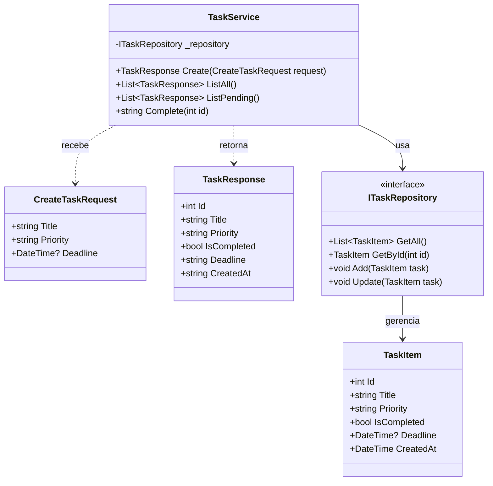
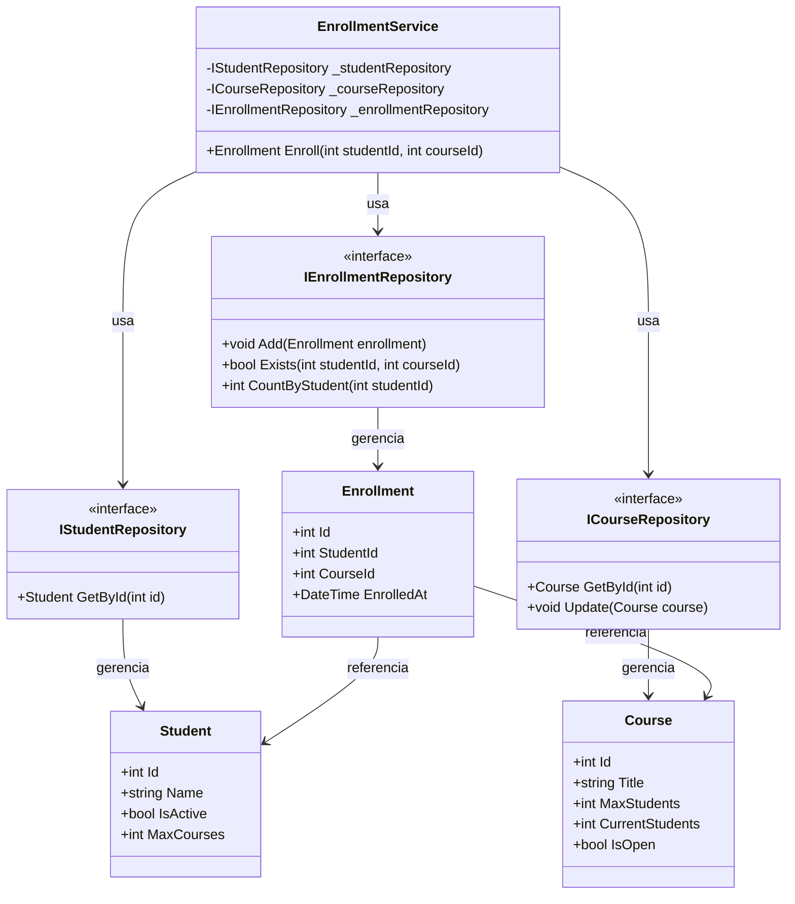

# Exercícios — Módulo 10.4: Camada de Serviços e DTOs

[← Voltar ao Módulo 10.4](cap10-mod04-camada-servicos-conteudo.md)

> **Como usar estes exercícios:**
> 1. Leia o enunciado com atenção
> 2. Leia as dicas antes de começar
> 3. Tente resolver sozinho
> 4. Use a Proposta de Teste para verificar se sua solução funciona
> 5. Só depois consulte a Resposta Comentada

> **Como testar cada exercício:**
> 1. Escreva seu código no VSCode
> 2. Salve o arquivo na pasta `~/meus-projetos/curso/cap10/`
> 3. Para projetos C#: `dotnet new console -n NomeExercicio`, cole o código em `Program.cs`
> 4. Execute com `dotnet run`

---

## Exercício 1 — Identificando Responsabilidades do Service — Nível: Básico

### Enunciado

Análise o código abaixo. Ele é um Service de uma livraria, mas tem problemas — algumas coisas que estão nele não deveriam estar, e algumas coisas que deveriam estar nele estão faltando. Identifique:

1. O que está no Service mas **não deveria** estar (e em qual camada deveria ficar)
2. O que está **faltando** no Service (regras de negócio que deveriam existir)

```csharp
public class BookService
{
    private List<Book> _books = new List<Book>(); // lista interna

    public void RegisterBook(string title, decimal price, int stock)
    {
        // Exibe mensagem no console
        Console.WriteLine("Cadastrando livro...");

        // Acessa banco diretamente
        var conn = new SqliteConnection("Data Source=books.db");
        conn.Open();
        var cmd = new SqliteCommand(
            $"INSERT INTO books (title, price, stock) VALUES ('{title}', {price}, {stock})",
            conn);
        cmd.ExecuteNonQuery();
        conn.Close();

        // Formata saida
        Console.WriteLine($"Livro '{title}' cadastrado por R${price:F2}!");
    }

    public Book FindByTitle(string title)
    {
        var conn = new SqliteConnection("Data Source=books.db");
        conn.Open();
        // ... busca no banco ...
        conn.Close();
        return null;
    }
}
```

### Dicas

- Releia as tabelas "O que o Service FAZ" e "O que o Service NAO FAZ" do módulo
- Pense: o que aconteceria se quiséssemos trocar o banco de dados?
- Pense: o que aconteceria se quiséssemos usar esse Service em uma API em vez de um terminal?
- Que regras de negócio uma livraria teria para cadastro de livros?

### Proposta de Teste

- Identifique pelo menos 3 coisas que não deveriam estar no Service
- Identifique pelo menos 2 regras de negócio que estão faltando
- Para cada problema, indique em qual camada a responsabilidade deveria ficar

### Resposta Comentada

> **Importante:** Tente resolver sozinho primeiro!

**O que NÃO deveria estar no Service:**

1. **`Console.WriteLine("Cadastrando livro...")`** — exibir mensagens é responsabilidade do **Controller**. O Service não sabe (e não deveria saber) se está sendo chamado por um terminal, uma API ou um teste.

2. **Acesso direto ao banco (`SqliteConnection`, `SqliteCommand`)** — acessar banco é responsabilidade do **Repository**. O Service deveria chamar `_repository.Add(book)`, não escrever SQL.

3. **`Console.WriteLine($"Livro '{title}' cadastrado...")`** — novamente, formatação de saída é do **Controller**.

4. **Lista interna `_books`** — se o Service mantém uma lista interna, ele está fazendo o papel do Repository. Dados devem ser gerenciados pelo Repository.

**O que está FALTANDO no Service:**

1. **Validação de preço positivo** — um livro não pode ter preço zero ou negativo
2. **Validação de título não vazio** — um livro precisa ter título
3. **Verificação de título duplicado** — não deveria cadastrar dois livros com o mesmo título
4. **Validação de estoque não negativo** — estoque não pode ser -5
5. **Uso de Repository via interface** — deveria receber `IBookRepository` pelo construtor

---

## Exercício 2 — Criando DTOs — Nível: Básico

### Enunciado

Dada a entidade `Student` (Estudante) abaixo, crie os DTOs necessários para as operações de cadastro e consulta. Explique por que cada campo está ou não está em cada DTO.

```csharp
public class Student
{
    public int Id { get; set; }              // identificador unico
    public string Name { get; set; }         // nome completo
    public string Email { get; set; }        // email
    public string PasswordHash { get; set; } // senha criptografada
    public DateTime BirthDate { get; set; }  // data de nascimento
    public DateTime EnrolledAt { get; set; } // data de matricula
    public bool IsActive { get; set; }       // esta ativo?
    public decimal GPA { get; set; }         // media de notas (Grade Point Average)
}
```

Crie:
1. `CreateStudentRequest` — DTO de entrada para cadastro
2. `StudentResponse` — DTO de saída para consulta pública
3. `StudentDetailResponse` — DTO de saída para consulta administrativa (com mais dados)

### Dicas

- O usuário não envia ID nem data de matrícula — são gerados pelo sistema
- A senha NUNCA deve aparecer em DTOs de saída
- Um administrador pode ver mais dados que um usuário comum
- Pense em quais campos são sensíveis e não devem ser expostos

### Proposta de Teste

- `CreateStudentRequest` deve ter entre 3 e 5 campos
- `StudentResponse` NÃO deve ter PasswordHash
- `StudentDetailResponse` deve ter mais campos que `StudentResponse`
- Justifique cada campo incluído ou excluído

### Resposta Comentada

> **Importante:** Tente resolver sozinho primeiro!

```csharp
// DTO de entrada para cadastro
// "CreateStudentRequest" = requisicao de criacao de estudante
public class CreateStudentRequest
{
    public string Name { get; set; }       // usuario informa o nome
    public string Email { get; set; }      // usuario informa o email
    public string Password { get; set; }   // usuario informa a senha (texto puro)
    public DateTime BirthDate { get; set; } // usuario informa a data de nascimento

    // NAO tem: Id (gerado pelo sistema)
    // NAO tem: PasswordHash (gerado a partir de Password)
    // NAO tem: EnrolledAt (gerado automaticamente)
    // NAO tem: IsActive (comeca como true por padrao)
    // NAO tem: GPA (comeca como 0)
}

// DTO de saida para consulta publica
// "StudentResponse" = resposta com dados do estudante
public class StudentResponse
{
    public int Id { get; set; }
    public string Name { get; set; }
    public string Email { get; set; }
    public bool IsActive { get; set; }

    // NAO tem: PasswordHash (NUNCA expor senha)
    // NAO tem: BirthDate (dado pessoal sensivel)
    // NAO tem: GPA (dado academico privado)
    // NAO tem: EnrolledAt (detalhe interno)
}

// DTO de saida para consulta administrativa
// "StudentDetailResponse" = resposta detalhada para admin
public class StudentDetailResponse
{
    public int Id { get; set; }
    public string Name { get; set; }
    public string Email { get; set; }
    public string BirthDate { get; set; }   // admin pode ver
    public string EnrolledAt { get; set; }  // admin pode ver
    public bool IsActive { get; set; }
    public decimal GPA { get; set; }        // admin pode ver

    // NAO tem: PasswordHash (NUNCA expor senha, nem para admin)
}
```

A chave e entender que cada DTO serve um proposito diferente. O `CreateStudentRequest` tem `Password` (texto puro) que o Service vai converter para `PasswordHash`. O `StudentResponse` esconde dados sensiveis. O `StudentDetailResponse` mostra mais dados para administradores. A senha NUNCA aparece em nenhum DTO de saida.

---

## Exercício 3 — Construindo um Service Completo — Nível: Intermediário

### Enunciado

Crie um `TaskService` (Serviço de Tarefas) para um sistema de gerenciamento de tarefas. O Service deve:

1. Receber um `ITaskRepository` pelo construtor
2. Ter um método `Create` que recebe um `CreateTaskRequest` e retorna um `TaskResponse`
3. Ter um método `Complete` que marca uma tarefa como concluída
4. Ter um método `ListPending` que retorna apenas tarefas pendentes
5. Aplicar as seguintes regras de negócio:
   - Título da tarefa não pode ser vazio
   - Título não pode ter mais de 100 caracteres
   - Não pode criar tarefa com título duplicado
   - Não pode completar uma tarefa que já está completa
   - Tarefas com prioridade "alta" devem ter uma data limite (deadline)

Use as seguintes classes de apoio:

```csharp
public class TaskItem
{
    public int Id { get; set; }
    public string Title { get; set; }
    public string Priority { get; set; }    // "low", "medium", "high"
    public bool IsCompleted { get; set; }
    public DateTime? Deadline { get; set; }  // pode ser null
    public DateTime CreatedAt { get; set; }
}

public interface ITaskRepository
{
    List<TaskItem> GetAll();
    TaskItem GetById(int id);
    void Add(TaskItem task);
    void Update(TaskItem task);
    bool ExistsByTitle(string title);
}
```

### Dicas

- Crie os DTOs primeiro: `CreateTaskRequest` e `TaskResponse`
- O `CreateTaskRequest` precisa de título, prioridade e deadline (opcional)
- O `TaskResponse` pode incluir todos os campos relevantes
- Lembre: validações intrínsecas podem ficar no domínio, validações de coordenação no Service
- Use exceções para erros

### Proposta de Teste

- O Service deve ter pelo menos 3 métodos públicos
- Cada regra de negócio deve ser verificável com um teste
- O método `Complete` deve lançar exceção se a tarefa já estiver completa
- O método `Create` deve lançar exceção se tarefa de prioridade alta não tiver deadline

### Resposta Comentada

> **Importante:** Tente resolver sozinho primeiro!

```csharp
// === DTOs ===

// "CreateTaskRequest" = requisicao de criacao de tarefa
public class CreateTaskRequest
{
    public string Title { get; set; }       // titulo da tarefa
    public string Priority { get; set; }    // prioridade: low, medium, high
    public DateTime? Deadline { get; set; } // data limite (opcional)
}

// "TaskResponse" = resposta com dados da tarefa
public class TaskResponse
{
    public int Id { get; set; }
    public string Title { get; set; }
    public string Priority { get; set; }
    public bool IsCompleted { get; set; }
    public string Deadline { get; set; }    // formatado como texto
    public string CreatedAt { get; set; }   // formatado como texto
}

// === Service ===

// "TaskService" = servico de tarefas
public class TaskService
{
    private readonly ITaskRepository _repository;

    public TaskService(ITaskRepository repository)
    {
        _repository = repository;
    }

    // Criar tarefa
    public TaskResponse Create(CreateTaskRequest request)
    {
        // Regra 1: titulo nao pode ser vazio
        if (string.IsNullOrWhiteSpace(request.Title))
            throw new ArgumentException("Titulo nao pode ser vazio.");

        // Regra 2: titulo nao pode ter mais de 100 caracteres
        if (request.Title.Length > 100)
            throw new ArgumentException("Titulo nao pode ter mais de 100 caracteres.");

        // Regra 3: titulo nao pode ser duplicado
        if (_repository.ExistsByTitle(request.Title))
            throw new InvalidOperationException("Ja existe uma tarefa com esse titulo.");

        // Regra 5: prioridade alta deve ter deadline
        if (request.Priority == "high" && request.Deadline == null)
            throw new ArgumentException(
                "Tarefas com prioridade alta devem ter uma data limite.");

        // Cria a entidade
        var task = new TaskItem
        {
            Title = request.Title,
            Priority = request.Priority ?? "medium", // padrao: medium
            IsCompleted = false,
            Deadline = request.Deadline,
            CreatedAt = DateTime.Now
        };

        _repository.Add(task);
        return ToResponse(task);
    }

    // Completar tarefa
    // "Complete" = completar
    public TaskResponse Complete(int id)
    {
        var task = _repository.GetById(id);
        if (task == null)
            throw new KeyNotFoundException($"Tarefa com ID {id} nao encontrada.");

        // Regra 4: nao pode completar tarefa ja completa
        if (task.IsCompleted)
            throw new InvalidOperationException("Tarefa ja esta completa.");

        task.IsCompleted = true;
        _repository.Update(task);
        return ToResponse(task);
    }

    // Listar pendentes
    // "ListPending" = listar pendentes
    public List<TaskResponse> ListPending()
    {
        var all = _repository.GetAll();
        var pending = new List<TaskResponse>();

        foreach (var task in all)
        {
            if (!task.IsCompleted)
                pending.Add(ToResponse(task));
        }

        return pending;
    }

    // Conversor
    private TaskResponse ToResponse(TaskItem task)
    {
        return new TaskResponse
        {
            Id = task.Id,
            Title = task.Title,
            Priority = task.Priority,
            IsCompleted = task.IsCompleted,
            Deadline = task.Deadline?.ToString("dd/MM/yyyy") ?? "Sem prazo",
            CreatedAt = task.CreatedAt.ToString("dd/MM/yyyy HH:mm")
        };
    }
}
```

Observe como cada regra de negocio esta claramente implementada no Service. O método `Create` válida 4 regras antes de criar a tarefa. O método `Complete` válida 1 regra antes de marcar como concluida. O método `ListPending` filtra as tarefas — essa e uma regra de negocio (o que significa "pendente") que fica no Service.

Diagrama de classes do sistema de tarefas:



---

## Exercício 4 — Refatorando para Usar DTOs — Nível: Intermediário

### Enunciado

O código abaixo é um Service que funciona, mas não usa DTOs — ele recebe e retorna a entidade diretamente. Refatore para usar DTOs de entrada e saída, considerando que:

- O sistema será usado como API pública (outros sistemas vão consumir)
- O campo `InternalNotes` não deve ser exposto aos consumidores
- O campo `CostPrice` (preço de custo) não deve ser exposto — só o `SalePrice` (preço de venda)
- O consumidor não envia `Id`, `CreatedAt` nem `InternalNotes`

```csharp
public class Product
{
    public int Id { get; set; }
    public string Name { get; set; }
    public decimal CostPrice { get; set; }    // preco de custo
    public decimal SalePrice { get; set; }    // preco de venda
    public int Stock { get; set; }
    public string InternalNotes { get; set; } // notas internas da equipe
    public DateTime CreatedAt { get; set; }
}

public class ProductService
{
    private readonly IProductRepository _repository;

    public ProductService(IProductRepository repository)
    {
        _repository = repository;
    }

    public Product Register(Product product)
    {
        if (_repository.Exists(product.Name))
            throw new InvalidOperationException("Produto duplicado.");

        product.CreatedAt = DateTime.Now;
        _repository.Add(product);
        return product;
    }

    public Product FindById(int id)
    {
        var product = _repository.GetById(id);
        if (product == null)
            throw new KeyNotFoundException("Produto nao encontrado.");
        return product;
    }
}
```

### Dicas

- Crie `CreateProductRequest` com apenas os campos que o consumidor envia
- Crie `ProductResponse` sem `CostPrice` e sem `InternalNotes`
- Adicione um método `ToResponse` no Service
- O Service continua trabalhando com a entidade `Product` internamente

### Proposta de Teste

- `CreateProductRequest` deve ter 4 campos: Name, CostPrice, SalePrice, Stock
- `ProductResponse` NÃO deve ter CostPrice nem InternalNotes
- O método `Register` deve receber `CreateProductRequest` e retornar `ProductResponse`
- O método `FindById` deve retornar `ProductResponse`

### Resposta Comentada

> **Importante:** Tente resolver sozinho primeiro!

```csharp
// === DTOs ===

// DTO de entrada — o que o consumidor envia
public class CreateProductRequest
{
    public string Name { get; set; }
    public decimal CostPrice { get; set; }   // preco de custo (interno)
    public decimal SalePrice { get; set; }   // preco de venda
    public int Stock { get; set; }
    // NAO tem: Id, CreatedAt, InternalNotes
}

// DTO de saida — o que o consumidor recebe
public class ProductResponse
{
    public int Id { get; set; }
    public string Name { get; set; }
    public string SalePrice { get; set; }    // preco formatado
    public int Stock { get; set; }
    public string CreatedAt { get; set; }
    // NAO tem: CostPrice (dado interno, nao expor)
    // NAO tem: InternalNotes (dado interno, nao expor)
}

// === Service refatorado ===

public class ProductService
{
    private readonly IProductRepository _repository;

    public ProductService(IProductRepository repository)
    {
        _repository = repository;
    }

    // Agora recebe DTO de entrada e retorna DTO de saida
    public ProductResponse Register(CreateProductRequest request)
    {
        if (_repository.Exists(request.Name))
            throw new InvalidOperationException("Produto duplicado.");

        // Converte DTO para entidade
        var product = new Product
        {
            Name = request.Name,
            CostPrice = request.CostPrice,
            SalePrice = request.SalePrice,
            Stock = request.Stock,
            InternalNotes = "", // vazio por padrao
            CreatedAt = DateTime.Now
        };

        _repository.Add(product);
        return ToResponse(product);
    }

    // Agora retorna DTO de saida
    public ProductResponse FindById(int id)
    {
        var product = _repository.GetById(id);
        if (product == null)
            throw new KeyNotFoundException("Produto nao encontrado.");
        return ToResponse(product);
    }

    // Conversor: esconde CostPrice e InternalNotes
    private ProductResponse ToResponse(Product product)
    {
        return new ProductResponse
        {
            Id = product.Id,
            Name = product.Name,
            SalePrice = $"R$ {product.SalePrice:F2}",
            Stock = product.Stock,
            CreatedAt = product.CreatedAt.ToString("dd/MM/yyyy")
        };
    }
}
```

A refatoracao protege dados sensiveis: o consumidor da API nunca ve o preco de custo nem as notas internas. Mesmo que alguem inspecione a resposta da API, esses campos simplesmente não existem no DTO de saida.

---

## Exercício 5 — Service com Múltiplas Entidades — Nível: Avançado

### Enunciado

Crie um `EnrollmentService` (Serviço de Matrícula) para um sistema escolar. O Service deve coordenar a matrícula de um aluno em um curso, envolvendo múltiplas entidades e repositórios.

Entidades disponíveis:

```csharp
public class Student
{
    public int Id { get; set; }
    public string Name { get; set; }
    public bool IsActive { get; set; }
    public int MaxCourses { get; set; } // maximo de cursos simultaneos
}

public class Course
{
    public int Id { get; set; }
    public string Title { get; set; }
    public int MaxStudents { get; set; }  // vagas maximas
    public int CurrentStudents { get; set; } // vagas ocupadas
    public bool IsOpen { get; set; }      // matriculas abertas?
}

public class Enrollment
{
    public int Id { get; set; }
    public int StudentId { get; set; }
    public int CourseId { get; set; }
    public DateTime EnrolledAt { get; set; }
}
```

Repositórios disponíveis:

```csharp
public interface IStudentRepository
{
    Student GetById(int id);
}

public interface ICourseRepository
{
    Course GetById(int id);
    void Update(Course course);
}

public interface IEnrollmentRepository
{
    void Add(Enrollment enrollment);
    int CountByStudent(int studentId);
    bool Exists(int studentId, int courseId);
}
```

O Service deve implementar o método `Enroll(int studentId, int courseId)` com as seguintes regras:
1. Aluno deve existir e estar ativo
2. Curso deve existir e estar com matrículas abertas
3. Curso não pode estar lotado (currentStudents < maxStudents)
4. Aluno não pode estar matriculado no mesmo curso duas vezes
5. Aluno não pode exceder o máximo de cursos simultâneos

### Dicas

- O Service precisa de 3 repositórios (injetados pelo construtor)
- Siga o padrão: buscar dados, validar regras, executar operação, persistir
- Lembre de atualizar o `CurrentStudents` do curso após a matrícula
- Crie DTOs de entrada e saída se quiser praticar, ou use tipos simples

### Proposta de Teste

- O método `Enroll` deve validar todas as 5 regras
- Cada regra deve lançar uma exceção específica com mensagem clara
- Após matrícula bem-sucedida, `CurrentStudents` do curso deve ser incrementado
- O Service deve ter 3 dependências de repositório

### Resposta Comentada

> **Importante:** Tente resolver sozinho primeiro!

```csharp
// "EnrollmentService" = servico de matricula
public class EnrollmentService
{
    private readonly IStudentRepository _studentRepository;
    private readonly ICourseRepository _courseRepository;
    private readonly IEnrollmentRepository _enrollmentRepository;

    // Recebe 3 repositorios pelo construtor
    public EnrollmentService(
        IStudentRepository studentRepository,
        ICourseRepository courseRepository,
        IEnrollmentRepository enrollmentRepository)
    {
        _studentRepository = studentRepository;
        _courseRepository = courseRepository;
        _enrollmentRepository = enrollmentRepository;
    }

    // Matricular aluno em curso
    // "Enroll" = matricular
    public Enrollment Enroll(int studentId, int courseId)
    {
        // Passo 1: buscar aluno
        var student = _studentRepository.GetById(studentId);
        if (student == null)
            throw new KeyNotFoundException("Aluno nao encontrado.");

        // Regra 1: aluno deve estar ativo
        if (!student.IsActive)
            throw new InvalidOperationException("Aluno nao esta ativo.");

        // Passo 2: buscar curso
        var course = _courseRepository.GetById(courseId);
        if (course == null)
            throw new KeyNotFoundException("Curso nao encontrado.");

        // Regra 2: matriculas devem estar abertas
        if (!course.IsOpen)
            throw new InvalidOperationException(
                $"Matriculas do curso '{course.Title}' estao fechadas.");

        // Regra 3: curso nao pode estar lotado
        if (course.CurrentStudents >= course.MaxStudents)
            throw new InvalidOperationException(
                $"Curso '{course.Title}' esta lotado ({course.MaxStudents} vagas).");

        // Regra 4: aluno nao pode estar matriculado no mesmo curso
        if (_enrollmentRepository.Exists(studentId, courseId))
            throw new InvalidOperationException(
                $"Aluno '{student.Name}' ja esta matriculado no curso '{course.Title}'.");

        // Regra 5: aluno nao pode exceder maximo de cursos
        int currentCourses = _enrollmentRepository.CountByStudent(studentId);
        if (currentCourses >= student.MaxCourses)
            throw new InvalidOperationException(
                $"Aluno '{student.Name}' ja esta matriculado em {currentCourses} cursos " +
                $"(maximo: {student.MaxCourses}).");

        // Tudo valido — criar matricula
        var enrollment = new Enrollment
        {
            StudentId = studentId,
            CourseId = courseId,
            EnrolledAt = DateTime.Now
        };

        // Salvar matricula
        _enrollmentRepository.Add(enrollment);

        // Atualizar vagas do curso
        course.CurrentStudents++;
        _courseRepository.Update(course);

        return enrollment;
    }
}
```

Observe como o Service coordena 3 repositórios e válida 5 regras de negocio em sequência. Nenhuma entidade sozinha poderia fazer tudo isso — o Student não sabe quantas vagas o curso tem, o Course não sabe quantos cursos o aluno ja faz, e o Enrollment não sabe se o aluno esta ativo. O Service e o único que tem visao do todo.

Diagrama de classes do sistema de matriculas:



---

## Exercício 6 — Identificando Over-engineering — Nível: Avançado

### Enunciado

Um colega criou a seguinte estrutura de DTOs para um sistema simples de notas (apenas cadastrar e listar notas de 0 a 10):

```csharp
// DTO de entrada para criar nota
public class CreateGradeRequestDto { public decimal Value { get; set; } }

// DTO de validacao intermediaria
public class ValidatedGradeDto { public decimal Value { get; set; } public bool IsValid { get; set; } }

// DTO de persistencia
public class GradePersistenceDto { public decimal Value { get; set; } public DateTime CreatedAt { get; set; } }

// DTO de saida basico
public class GradeResponseDto { public int Id { get; set; } public decimal Value { get; set; } }

// DTO de saida detalhado
public class GradeDetailResponseDto { public int Id { get; set; } public decimal Value { get; set; } public string CreatedAt { get; set; } }

// DTO de saida para lista
public class GradeListResponseDto { public List<GradeResponseDto> Grades { get; set; } public int Total { get; set; } }

// DTO de saida para estatisticas
public class GradeStatsResponseDto { public decimal Average { get; set; } public decimal Max { get; set; } public decimal Min { get; set; } }

// Mapper
public class GradeMapper
{
    public ValidatedGradeDto ToValidated(CreateGradeRequestDto dto) { /* ... */ }
    public GradePersistenceDto ToPersistence(ValidatedGradeDto dto) { /* ... */ }
    public Grade ToEntity(GradePersistenceDto dto) { /* ... */ }
    public GradeResponseDto ToResponse(Grade entity) { /* ... */ }
    public GradeDetailResponseDto ToDetailResponse(Grade entity) { /* ... */ }
    public GradeListResponseDto ToListResponse(List<Grade> entities) { /* ... */ }
}
```

A entidade é simplesmente:

```csharp
public class Grade
{
    public int Id { get; set; }
    public decimal Value { get; set; }
    public DateTime CreatedAt { get; set; }
}
```

Análise: isso é over-engineering? Quantos DTOs são realmente necessários? Proponha uma versão simplificada.

### Dicas

- A entidade tem apenas 3 campos
- O sistema só faz duas coisas: cadastrar e listar
- Compare o número de DTOs com o número de campos da entidade
- Aplique a regra de ouro: "se o DTO é idêntico à entidade, não crie um DTO"

### Proposta de Teste

- Identifique pelo menos 3 DTOs desnecessários e justifique
- Proponha uma versão com no máximo 2 DTOs (ou zero, se justificável)
- Explique quando a versão complexa faria sentido

### Resposta Comentada

> **Importante:** Tente resolver sozinho primeiro!

Sim, e um caso classico de over-engineering. Problemas:

1. **`ValidatedGradeDto`** — desnecessario. Validação e feita no Service com um simples `if`, não precisa de DTO intermediario.
2. **`GradePersistenceDto`** — desnecessario. O Repository recebe a entidade `Grade` diretamente.
3. **`GradeDetailResponseDto`** — quase identico ao `GradeResponseDto`, so adiciona `CreatedAt`. Para um sistema simples, um único DTO de saida basta.
4. **`GradeListResponseDto`** — desnecessario. Uma `List<GradeResponseDto>` resolve.
5. **`GradeStatsResponseDto`** — pode fazer sentido se estatisticas forem uma feature real, mas para "cadastrar e listar", e excesso.
6. **`GradeMapper` com 6 métodos** — para 3 campos, um método privado no Service basta.

**Versão simplificada — zero DTOs:**

```csharp
// A entidade Grade tem apenas 3 campos — usar diretamente!
public class GradeService
{
    private readonly IGradeRepository _repository;

    public GradeService(IGradeRepository repository)
    {
        _repository = repository;
    }

    public Grade Create(decimal value)
    {
        if (value < 0 || value > 10)
            throw new ArgumentException("Nota deve ser entre 0 e 10.");

        var grade = new Grade
        {
            Value = value,
            CreatedAt = DateTime.Now
        };

        _repository.Add(grade);
        return grade; // retorna a entidade diretamente
    }

    public List<Grade> ListAll()
    {
        return _repository.GetAll();
    }
}
```

3 campos, 2 operações, zero DTOs, zero Mappers. Simples, claro e funcional. A versão complexa faria sentido se o sistema tivesse API pública, multiplas interfaces, campos sensiveis ou dezenas de operações — mas para "cadastrar e listar notas", e excesso.

---

[← Voltar ao Módulo 10.4](cap10-mod04-camada-servicos-conteudo.md)
