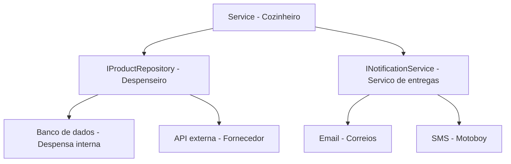
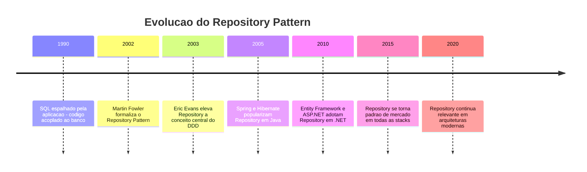
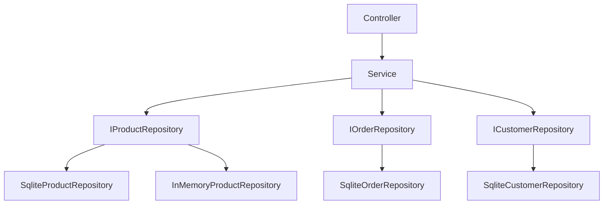
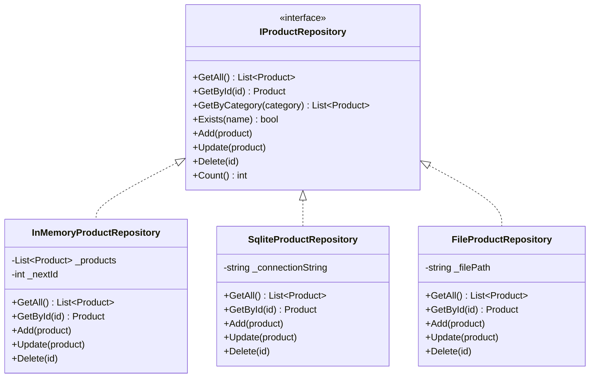
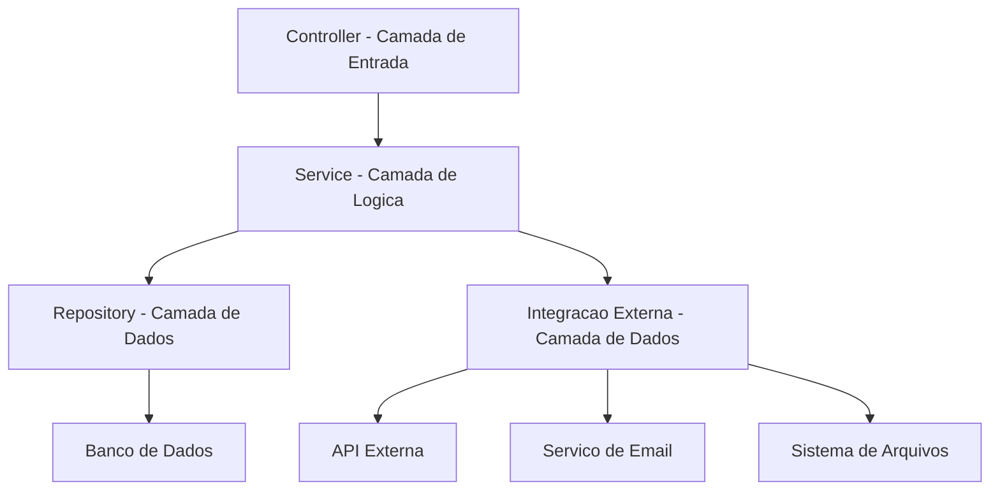
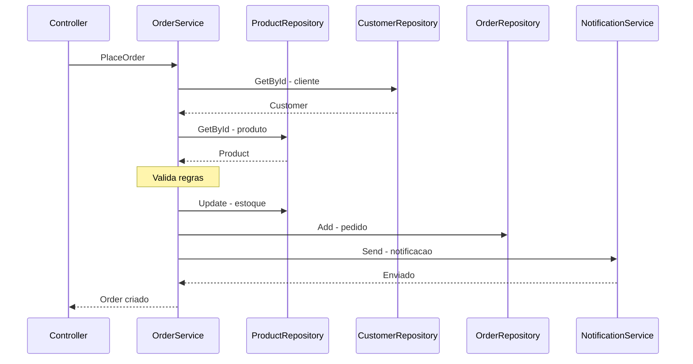
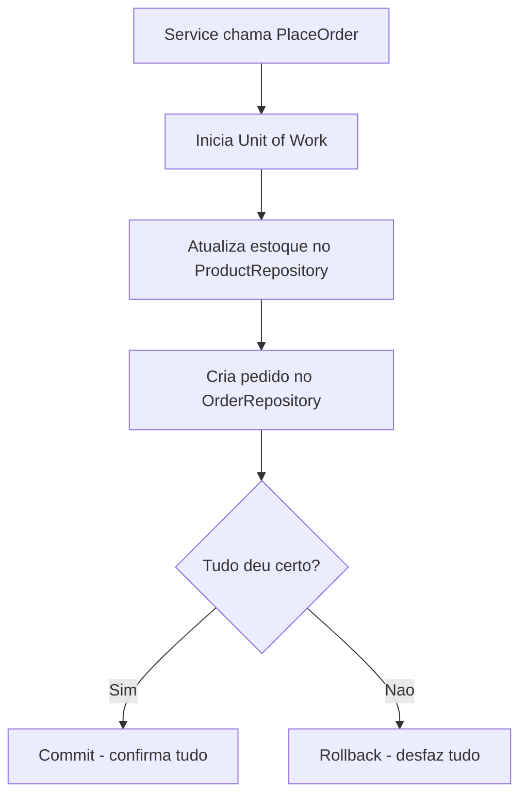
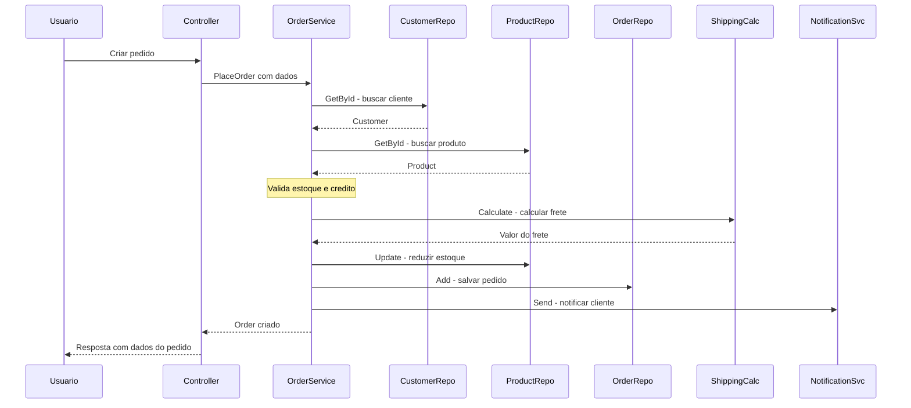
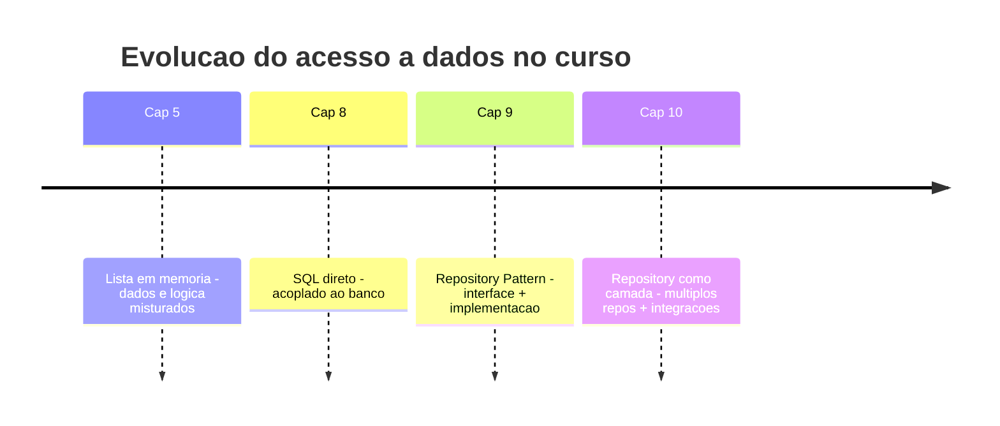
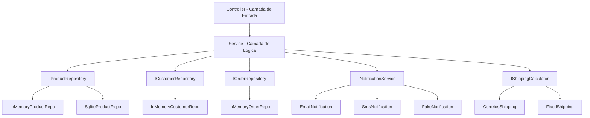

# 10.5 — Repositórios e Integrações Externas

[← Anterior: Camada de Serviços e DTOs](cap10-mod04-camada-servicos-conteudo.md) · [Próximo: Controllers e Camada de Entrada →](cap10-mod06-camada-controller-conteudo.md)

---

## Introdução

No módulo anterior, você mergulhou na camada de serviços — o cérebro do sistema, que orquestra operações, aplica regras de negócio e coordena múltiplas entidades. Viu como o `OrderService` coordena 3 repositórios e 8 passos para criar um pedido. Aprendeu sobre DTOs e quando eles fazem (ou não) sentido. E em vários exemplos, o Service chamava métodos como `_repository.Add(product)` e `_repository.GetById(id)` — mas nunca paramos para olhar com profundidade o que acontece **dentro** do repositório.

Agora é hora de abrir essa caixa preta.

Lembra do capítulo 9, módulo 9.9? Lá você aprendeu o **Repository Pattern** — a ideia de colocar uma interface entre a aplicação e o acesso a dados. Criou um `IProductRepository` com métodos como `GetAll`, `GetById`, `Create`, `Update` e `Delete`. Implementou um `InMemoryProductRepository` que guardava dados em uma lista, e um `SqliteProductRepository` que simulava acesso ao banco. Viu a mágica de trocar a implementação mudando uma única linha de código.

Aquilo foi o Repository como **pattern isolado**. Agora vamos ver o Repository como **camada da arquitetura** — uma camada inteira dedicada a abstrair o acesso a dados e a comunicação com o mundo externo. Porque na vida real, o sistema não fala apenas com bancos de dados. Ele fala com APIs externas, envia emails, pública mensagens em filas, grava arquivos, consulta serviços de terceiros. E todas essas comunicações seguem o mesmo princípio: **interface + implementação concreta**.

Este módulo conecta tudo que você aprendeu até agora: interfaces (cap 9.6), Repository Pattern (cap 9.9), Factory (cap 9.8), injeção de dependência (cap 9.9), camada de domínio (cap 10.3) e camada de serviços (cap 10.4). É o módulo onde as peças se encaixam.

---

## Como Executar os Exemplos Deste Módulo

Os exemplos deste módulo usam C# (.NET), a mesma linguagem do capítulo 9. Para executar:

1. Certifique-se de que o .NET SDK está instalado (você já configurou no módulo 9.3)
2. Crie uma pasta para os exemplos: `mkdir -p ~/meus-projetos/curso/cap10/mod05`
3. Para cada exemplo, crie um projeto console: `dotnet new console -n NomeDoExemplo`
4. Cole o código no arquivo `Program.cs`
5. Execute com `dotnet run`

Alguns exemplos mostram múltiplos arquivos. Em um projeto real, cada classe ficaria em seu próprio arquivo dentro da pasta `Repositories/` ou `Infrastructure/`. Para simplificar a execução, colocamos tudo em `Program.cs` — mas sempre indicamos onde cada classe ficaria em um projeto real.

---

## A Analogia: O Despenseiro e os Fornecedores

No módulo 10.2, usamos a analogia do restaurante. O garçom (Controller) recebe o pedido, o cozinheiro (Service) prepara o prato, e o despenseiro (Repository) fornece os ingredientes. Agora vamos aprofundar a figura do despenseiro — porque ele faz muito mais do que parece.

### O Despenseiro: Guardião dos Ingredientes

Pense no despenseiro de um restaurante grande. Ele é responsável por:

- **Guardar ingredientes** na despensa (salvar dados no banco)
- **Buscar ingredientes** quando o cozinheiro pede (consultar dados)
- **Organizar a despensa** para encontrar tudo rápido (índices e otimizações)
- **Controlar o estoque** — saber o que tem e o que não tem (verificar existência)
- **Receber entregas** dos fornecedores externos (integrar com sistemas externos)

O cozinheiro (Service) nunca vai à despensa pessoalmente. Ele diz: "preciso de 2 kg de carne e 500g de queijo". O despenseiro vai até a despensa, encontra os ingredientes e entrega. O cozinheiro não sabe se a carne está na prateleira de cima ou na geladeira do fundo. Não sabe se o queijo veio do fornecedor A ou do fornecedor B. Ele só sabe que pediu e recebeu.

E aqui vem o ponto crucial: o despenseiro não lida apenas com a despensa interna. Ele também é o ponto de contato com o **mundo externo**. Quando falta um ingrediente, ele liga para o fornecedor. Quando precisa de algo especial, ele encomenda de fora. Quando o restaurante precisa enviar uma encomenda para delivery, é o despenseiro que prepara o pacote.

No software, é a mesma coisa:

| Restaurante | Software | Função |
|-------------|----------|--------|
| Despensa interna | Banco de dados | Armazenamento principal |
| Fornecedor de carnes | API externa de pagamentos | Servico externo especializado |
| Fornecedor de bebidas | API externa de frete | Outro servico externo |
| Servico de delivery | Servico de email e SMS | Comunicação com o mundo externo |
| Caderno de anotacoes | Sistema de arquivos | Armazenamento alternativo |

O despenseiro é a **fronteira** entre o restaurante e o mundo externo. Tudo que entra e sai passa por ele. No software, o Repository e as integrações externas formam essa fronteira — a camada que separa a lógica da aplicação do mundo lá fora.



---

## Contexto Histórico: De Onde Veio o Repository Pattern

O Repository Pattern não surgiu do nada. Ele tem uma história que explica por que se tornou um dos padrões mais usados na indústria.

### O Problema Original: Código SQL Espalhado

Nos anos 1990 e início dos 2000, a maioria dos sistemas corporativos tinha código SQL espalhado por toda a aplicação. O mesmo `SELECT * FROM products WHERE id = ?` aparecia em 15 lugares diferentes — na tela de cadastro, no relatório, na exportação, na API. Se a estrutura da tabela mudasse (renomear uma coluna, por exemplo), era preciso encontrar e atualizar todos os 15 lugares.

Pior: se a empresa decidisse trocar de banco de dados (de Oracle para PostgreSQL, por exemplo), era preciso reescrever praticamente toda a aplicação. O código de negócio estava tão entrelaçado com o código SQL que era impossível separar um do outro.

### 2002: Martin Fowler e o Catálogo de Patterns

Em 2002, Martin Fowler publicou "Patterns of Enterprise Application Architecture" — o mesmo livro que formalizou o Service Layer que vimos no módulo anterior. Nesse livro, Fowler descreveu o **Repository** como um padrão que "media entre o domínio e as camadas de mapeamento de dados, usando uma interface semelhante a uma coleção para acessar objetos de domínio".

A ideia era simples: em vez de espalhar SQL pela aplicação, criar uma classe dedicada que encapsula todo o acesso a dados. A aplicação conversa com essa classe como se estivesse conversando com uma coleção em memória — `Add`, `Remove`, `Find`, `GetAll`. Por dentro, a classe traduz essas operações para SQL, chamadas de API ou qualquer outro mecanismo de persistência.

### 2003: Eric Evans e o DDD

Um ano depois, Eric Evans publicou "Domain-Driven Design" e elevou o Repository a um conceito central da arquitetura. Para Evans, o Repository não era apenas uma conveniência técnica — era uma peça fundamental para manter o domínio limpo. O Repository permite que as entidades de domínio existam sem saber nada sobre bancos de dados, frameworks ou infraestrutura.

Evans definiu o Repository como: "um mecanismo para encapsular o armazenamento, a recuperação e o comportamento de busca, que emula uma coleção de objetos". A palavra-chave é **emula** — o Repository faz parecer que os objetos estão em uma coleção simples, mesmo que por trás estejam em um banco de dados relacional, um serviço na nuvem ou um arquivo no disco.

### A Evolução: De Pattern a Camada

Com o tempo, o Repository deixou de ser apenas um pattern isolado e se tornou uma **camada inteira** da arquitetura. Frameworks como Spring (Java), ASP.NET (C#) e Django (Python) incorporaram o conceito em suas estruturas. Hoje, quando alguém fala em "camada de repositório" ou "camada de dados", está falando dessa camada que abstrai todo o acesso a dados e integrações externas.



---

## O Repository como Camada: Muito Além do Pattern

No capítulo 9, você aprendeu o Repository como um pattern — uma técnica para abstrair acesso a dados. Agora vamos expandir essa visão. Na arquitetura em camadas, o Repository não é apenas uma classe — é uma **camada inteira** com responsabilidades claras.

### O que a Camada de Repository FAZ

| Responsabilidade | Exemplo |
|-----------------|---------|
| Abstrair acesso a dados | Esconder se os dados estao em SQLite, PostgreSQL ou memória |
| Implementar operações CRUD | Create, Read, Update, Delete sobre entidades |
| Traduzir entre formatos | Converter entidade C# para registro SQL e vice-versa |
| Gerenciar conexões | Abrir e fechar conexões com o banco de dados |
| Executar queries | Escrever e executar SQL ou comandos do banco |
| Implementar buscas especificas | Buscar por nome, filtrar por categoria, paginar resultados |

### O que a Camada de Repository NAO FAZ

| Proibido | Por que |
|----------|---------|
| Aplicar regras de negocio | Isso e responsabilidade do Service ou do Dominio |
| Validar dados de entrada | Isso e responsabilidade do Service ou do Dominio |
| Formatar dados para exibicao | Isso e responsabilidade do Controller |
| Conhecer a camada de entrada | O Repository não sabe se os dados vem de API, terminal ou teste |
| Decidir o que fazer com os dados | O Repository so armazena e recupera - quem decide e o Service |
| Enviar notificacoes | Isso e responsabilidade de um servico de integração separado |

A regra é clara: o Repository é um **servo fiel**. Ele faz o que mandam — guarda, busca, atualiza, remove — sem questionar, sem decidir, sem julgar. Quem decide é o Service. Quem válida é o domínio. O Repository só executa.

### Visualizando a Camada



Observe: o Service conhece apenas as **interfaces** (IProductRepository, IOrderRepository). As implementações concretas (SqliteProductRepository, InMemoryProductRepository) ficam escondidas atrás das interfaces. O Service não sabe — e não precisa saber — qual implementação está sendo usada.

---

## Anatomia de um Repository: Estrutura Completa

Vamos construir um Repository completo, passo a passo, mostrando cada parte e explicando cada decisão. Vamos usar o exemplo de produtos — o mesmo que acompanha o curso desde o capítulo 5.

### Passo 1: A Interface do Repository

A interface define o **contrato** — o que qualquer implementação de repository de produtos deve saber fazer:

```csharp
// === Em um projeto real, ficaria em Repositories/IProductRepository.cs ===
// Interface do repositorio de produtos
// "IProductRepository" = contrato do repositorio de produtos

public interface IProductRepository
{
    // Buscar todos os produtos
    // "GetAll" = obter todos
    List<Product> GetAll();

    // Buscar produto por ID
    // "GetById" = obter por identificador
    Product GetById(int id);

    // Buscar produtos por categoria
    // "GetByCategory" = obter por categoria
    List<Product> GetByCategory(string category);

    // Verificar se existe produto com determinado nome
    // "Exists" = existe
    bool Exists(string name);

    // Adicionar novo produto
    // "Add" = adicionar
    void Add(Product product);

    // Atualizar produto existente
    // "Update" = atualizar
    void Update(Product product);

    // Remover produto por ID
    // "Delete" = remover
    void Delete(int id);

    // Contar total de produtos
    // "Count" = contar
    int Count();
}
```

Saída esperada: nenhuma (é apenas a definição da interface)

Observe que a interface não menciona SQL, SQLite, PostgreSQL, arquivo ou memória. Ela define apenas **operações sobre produtos**. Qualquer implementação que respeite esse contrato pode ser usada pelo Service.

### Passo 2: A Entidade de Domínio

Para os exemplos deste módulo, vamos usar uma entidade `Product` com domínio rico (validações internas):

```csharp
// === Em um projeto real, ficaria em Models/Product.cs ===
// Entidade de dominio com validacoes
// "Product" = Produto

public class Product
{
    public int Id { get; set; }
    public string Name { get; private set; }      // "Name" = nome
    public decimal Price { get; private set; }     // "Price" = preco
    public int Stock { get; private set; }         // "Stock" = estoque
    public string Category { get; private set; }   // "Category" = categoria
    public DateTime CreatedAt { get; set; }        // "CreatedAt" = data de criacao

    // Construtor com validacao
    public Product(string name, decimal price, int stock, string category)
    {
        if (string.IsNullOrWhiteSpace(name))
            throw new ArgumentException("Nome nao pode ser vazio.");
        if (price <= 0)
            throw new ArgumentException("Preco deve ser maior que zero.");
        if (stock < 0)
            throw new ArgumentException("Estoque nao pode ser negativo.");

        Name = name;
        Price = price;
        Stock = stock;
        Category = category ?? "Geral";
        CreatedAt = DateTime.Now;
    }

    // Metodo para atualizar preco
    // "UpdatePrice" = atualizar preco
    public void UpdatePrice(decimal newPrice)
    {
        if (newPrice <= 0)
            throw new ArgumentException("Preco deve ser maior que zero.");
        Price = newPrice;
    }

    // Metodo para adicionar estoque
    // "AddStock" = adicionar estoque
    public void AddStock(int quantity)
    {
        if (quantity <= 0)
            throw new ArgumentException("Quantidade deve ser positiva.");
        Stock += quantity;
    }

    // Metodo para remover estoque
    // "RemoveStock" = remover estoque
    public void RemoveStock(int quantity)
    {
        if (quantity <= 0)
            throw new ArgumentException("Quantidade deve ser positiva.");
        if (quantity > Stock)
            throw new InvalidOperationException("Estoque insuficiente.");
        Stock -= quantity;
    }

    public override string ToString()
    {
        return $"[{Id}] {Name} — R${Price:F2} (Estoque: {Stock}) [{Category}]";
    }
}
```

Saída esperada: nenhuma (é apenas a definição da classe)


### Passo 3: Implementação InMemoryProductRepository

A implementação em memória é a mais simples — perfeita para testes e para entender o padrão sem a complexidade de um banco real. Você já viu uma versão no capítulo 9. Agora vamos fazer uma versão mais completa:

```csharp
// === Em um projeto real, ficaria em Repositories/InMemoryProductRepository.cs ===
// Implementacao em memoria — para testes e prototipagem
// "InMemoryProductRepository" = Repositorio de Produto em Memoria

public class InMemoryProductRepository : IProductRepository
{
    // Lista interna que armazena os produtos
    // "products" = produtos
    private readonly List<Product> _products = new List<Product>();

    // Contador para gerar IDs automaticamente
    // "nextId" = proximo identificador
    private int _nextId = 1;

    // Obter todos os produtos
    public List<Product> GetAll()
    {
        // Retorna uma COPIA da lista para proteger os dados internos
        // Se retornasse a lista original, quem recebesse poderia
        // modificar a lista diretamente, sem passar pelo repository
        return new List<Product>(_products);
    }

    // Obter produto por ID
    public Product GetById(int id)
    {
        // Percorre a lista procurando o produto com o ID informado
        foreach (var product in _products)
        {
            if (product.Id == id)
                return product;
        }
        return null; // Nao encontrou
    }

    // Obter produtos por categoria
    public List<Product> GetByCategory(string category)
    {
        var result = new List<Product>();
        foreach (var product in _products)
        {
            // Comparacao sem diferenciar maiusculas e minusculas
            if (product.Category.ToLower() == category.ToLower())
                result.Add(product);
        }
        return result;
    }

    // Verificar se existe produto com determinado nome
    public bool Exists(string name)
    {
        foreach (var product in _products)
        {
            if (product.Name.ToLower() == name.ToLower())
                return true;
        }
        return false;
    }

    // Adicionar novo produto
    public void Add(Product product)
    {
        product.Id = _nextId; // Atribui ID automatico
        _nextId++;
        _products.Add(product);
    }

    // Atualizar produto existente
    public void Update(Product product)
    {
        for (int i = 0; i < _products.Count; i++)
        {
            if (_products[i].Id == product.Id)
            {
                _products[i] = product;
                return;
            }
        }
    }

    // Remover produto por ID
    public void Delete(int id)
    {
        for (int i = 0; i < _products.Count; i++)
        {
            if (_products[i].Id == id)
            {
                _products.RemoveAt(i);
                return;
            }
        }
    }

    // Contar total de produtos
    public int Count()
    {
        return _products.Count;
    }
}
```

Saída esperada: nenhuma (é apenas a definição da classe)

Essa implementação é direta: uma lista na memória, um contador de IDs e operações simples de busca, inserção, atualização e remoção. Quando o programa termina, os dados desaparecem — exatamente como o CRUD em memória do capítulo 5.

Veja a relacao entre a interface e as implementacoes do Repository:



### Passo 4: Implementação SqliteProductRepository

Agora a implementação que simula acesso a um banco SQLite. Em um projeto real, aqui teria código SQL de verdade (como no capítulo 8). Para manter o foco no padrão arquitetural, vamos simular as operações:

```csharp
// === Em um projeto real, ficaria em Repositories/SqliteProductRepository.cs ===
// Implementacao com SQLite (simulada)
// "SqliteProductRepository" = Repositorio de Produto com SQLite

public class SqliteProductRepository : IProductRepository
{
    // Caminho do banco de dados
    // "connectionString" = string de conexao
    private readonly string _connectionString;

    public SqliteProductRepository(string databasePath)
    {
        _connectionString = $"Data Source={databasePath}";
        Console.WriteLine($"[SQLite] Conectado ao banco: {databasePath}");
        // Em producao: criaria a tabela se nao existisse
        // CREATE TABLE IF NOT EXISTS products (id INTEGER PRIMARY KEY, ...)
    }

    public List<Product> GetAll()
    {
        Console.WriteLine("[SQLite] SELECT * FROM products");
        // Em producao: executaria o SQL, leria cada linha do resultado
        // e criaria um objeto Product para cada linha
        return new List<Product>();
    }

    public Product GetById(int id)
    {
        Console.WriteLine($"[SQLite] SELECT * FROM products WHERE id = {id}");
        // Em producao: executaria o SQL e retornaria o produto encontrado
        return null;
    }

    public List<Product> GetByCategory(string category)
    {
        Console.WriteLine($"[SQLite] SELECT * FROM products WHERE category = '{category}'");
        return new List<Product>();
    }

    public bool Exists(string name)
    {
        Console.WriteLine($"[SQLite] SELECT COUNT(*) FROM products WHERE name = '{name}'");
        return false;
    }

    public void Add(Product product)
    {
        Console.WriteLine(
            $"[SQLite] INSERT INTO products (name, price, stock, category) " +
            $"VALUES ('{product.Name}', {product.Price}, {product.Stock}, '{product.Category}')");
    }

    public void Update(Product product)
    {
        Console.WriteLine(
            $"[SQLite] UPDATE products SET name='{product.Name}', " +
            $"price={product.Price}, stock={product.Stock} WHERE id={product.Id}");
    }

    public void Delete(int id)
    {
        Console.WriteLine($"[SQLite] DELETE FROM products WHERE id = {id}");
    }

    public int Count()
    {
        Console.WriteLine("[SQLite] SELECT COUNT(*) FROM products");
        return 0;
    }
}
```

Saída esperada: nenhuma (é apenas a definição da classe)

Em um projeto real, cada método teria o código SQL completo — exatamente como fizemos no capítulo 8 com Python e SQLite. A diferença é que agora o SQL fica **isolado** dentro do repository, não espalhado pela aplicação. Se amanhã você trocar de SQLite para PostgreSQL, só precisa criar um `PostgresProductRepository` — o Service não muda.

### Passo 5: Implementação FileProductRepository

Para mostrar a flexibilidade do padrão, vamos criar uma terceira implementação que salva dados em arquivo. Isso demonstra que o Repository pode abstrair **qualquer** forma de armazenamento:

```csharp
// === Em um projeto real, ficaria em Repositories/FileProductRepository.cs ===
// Implementacao com arquivo (simulada)
// "FileProductRepository" = Repositorio de Produto com Arquivo

public class FileProductRepository : IProductRepository
{
    // Caminho do arquivo
    // "filePath" = caminho do arquivo
    private readonly string _filePath;

    public FileProductRepository(string filePath)
    {
        _filePath = filePath;
        Console.WriteLine($"[Arquivo] Usando arquivo: {filePath}");
    }

    public List<Product> GetAll()
    {
        Console.WriteLine($"[Arquivo] Lendo todas as linhas de {_filePath}");
        // Em producao: leria o arquivo linha por linha,
        // parsearia cada linha (CSV, JSON, etc.) e criaria objetos Product
        return new List<Product>();
    }

    public Product GetById(int id)
    {
        Console.WriteLine($"[Arquivo] Buscando produto com ID {id} em {_filePath}");
        // Em producao: leria o arquivo e procuraria a linha com o ID
        return null;
    }

    public List<Product> GetByCategory(string category)
    {
        Console.WriteLine($"[Arquivo] Filtrando por categoria '{category}' em {_filePath}");
        return new List<Product>();
    }

    public bool Exists(string name)
    {
        Console.WriteLine($"[Arquivo] Verificando se '{name}' existe em {_filePath}");
        return false;
    }

    public void Add(Product product)
    {
        Console.WriteLine(
            $"[Arquivo] Adicionando linha: {product.Name},{product.Price},{product.Stock}");
        // Em producao: abriria o arquivo em modo append e escreveria a nova linha
    }

    public void Update(Product product)
    {
        Console.WriteLine($"[Arquivo] Atualizando linha do produto {product.Id}");
        // Em producao: leria o arquivo, encontraria a linha, substituiria e reescreveria
    }

    public void Delete(int id)
    {
        Console.WriteLine($"[Arquivo] Removendo linha do produto {id}");
        // Em producao: leria o arquivo, removeria a linha e reescreveria
    }

    public int Count()
    {
        Console.WriteLine($"[Arquivo] Contando linhas em {_filePath}");
        return 0;
    }
}
```

Saída esperada: nenhuma (é apenas a definição da classe)

Agora temos **três** implementações do mesmo contrato: memória, SQLite e arquivo. O Service não sabe qual está usando — e não precisa saber. Essa é a essência do Repository como camada.

---

## O Momento Mágico: Três Implementações, Um Contrato

Vamos ver as três implementações em ação, mostrando como o mesmo código funciona com qualquer uma delas:

```csharp
// === Programa completo: 3 implementacoes do mesmo contrato ===

// (Cole aqui as classes Product, IProductRepository,
//  InMemoryProductRepository, SqliteProductRepository e FileProductRepository
//  definidas acima)

// Funcao que usa APENAS a interface — nao sabe qual implementacao esta por tras
// "DemoRepository" = demonstrar repositorio
static void DemoRepository(string label, IProductRepository repo)
{
    Console.WriteLine($"\n{'='} {label} {'='}");

    // Adicionar produtos
    repo.Add(new Product("Notebook", 3500.00m, 10, "Eletronicos"));
    repo.Add(new Product("Mouse", 89.90m, 50, "Perifericos"));
    repo.Add(new Product("Teclado", 199.90m, 30, "Perifericos"));

    // Contar
    Console.WriteLine($"Total de produtos: {repo.Count()}");

    // Listar todos
    Console.WriteLine("Todos os produtos:");
    foreach (var p in repo.GetAll())
    {
        Console.WriteLine($"  {p}");
    }

    // Buscar por categoria
    Console.WriteLine("Perifericos:");
    foreach (var p in repo.GetByCategory("Perifericos"))
    {
        Console.WriteLine($"  {p}");
    }

    // Verificar existencia
    Console.WriteLine($"Existe 'Notebook'? {repo.Exists("Notebook")}");
    Console.WriteLine($"Existe 'Tablet'? {repo.Exists("Tablet")}");
}

// === Usando as 3 implementacoes com o MESMO codigo ===

// Implementacao 1: Memoria
DemoRepository("MEMORIA", new InMemoryProductRepository());

// Implementacao 2: SQLite
DemoRepository("SQLITE", new SqliteProductRepository("produtos.db"));

// Implementacao 3: Arquivo
DemoRepository("ARQUIVO", new FileProductRepository("produtos.csv"));
```

Saída esperada (implementação em memória):
```
= MEMORIA =
Total de produtos: 3
Todos os produtos:
  [1] Notebook — R$3500.00 (Estoque: 10) [Eletronicos]
  [2] Mouse — R$89.90 (Estoque: 50) [Perifericos]
  [3] Teclado — R$199.90 (Estoque: 30) [Perifericos]
Perifericos:
  [2] Mouse — R$89.90 (Estoque: 50) [Perifericos]
  [3] Teclado — R$199.90 (Estoque: 30) [Perifericos]
Existe 'Notebook'? True
Existe 'Tablet'? False
```

O método `DemoRepository` recebe `IProductRepository` — a interface. Ele não sabe se está usando memória, SQLite ou arquivo. O código é **idêntico** para as três implementações. Essa é a força do Repository como camada: trocar o armazenamento é trocar uma linha de código.

---

## O Repository na Arquitetura de 3 Camadas

Agora vamos posicionar o Repository dentro da arquitetura completa que estamos construindo ao longo do capítulo 10. Veja como todas as camadas se conectam:



O fluxo é sempre o mesmo:

1. O **Controller** recebe a requisição do usuário
2. O **Service** aplica as regras de negócio
3. O **Repository** busca ou salva dados no banco
4. As **Integrações** se comunicam com sistemas externos

E o fluxo de volta:

1. O **Repository** retorna os dados do banco
2. As **Integrações** retornam respostas dos sistemas externos
3. O **Service** processa os resultados e aplica mais regras se necessário
4. O **Controller** formata e devolve a resposta ao usuário

### Onde Cada Coisa Fica no Projeto

Em um projeto C# organizado, a estrutura de pastas ficaria assim:

```
MeuProjeto/
    Models/                          # Entidades de dominio
        Product.cs
        Order.cs
        Customer.cs
    Services/                        # Camada de servicos
        ProductService.cs
        OrderService.cs
    Repositories/                    # Camada de repositorios
        Interfaces/
            IProductRepository.cs
            IOrderRepository.cs
        InMemory/
            InMemoryProductRepository.cs
            InMemoryOrderRepository.cs
        Sqlite/
            SqliteProductRepository.cs
            SqliteOrderRepository.cs
    Integrations/                    # Integracoes externas
        Interfaces/
            INotificationService.cs
            IPaymentGateway.cs
        Email/
            EmailNotificationService.cs
        Sms/
            SmsNotificationService.cs
    Controllers/                     # Camada de entrada
        ProductController.cs
        OrderController.cs
    Program.cs                       # Ponto de entrada
```

Observe a organização: cada camada tem sua pasta. Dentro de `Repositories/`, as interfaces ficam separadas das implementações. Cada implementação tem sua subpasta. Isso facilita encontrar o código e entender a estrutura do projeto.

---

## Múltiplos Repositórios no Mesmo Service

No módulo 10.4, você viu o `OrderService` usando 3 repositórios: `IOrderRepository`, `IProductRepository` e `ICustomerRepository`. Isso é muito comum na vida real — um Service frequentemente precisa de dados de múltiplas fontes.

Vamos construir um exemplo completo que mostra esse padrão:

```csharp
// === Programa completo: Service com multiplos repositorios ===

// --- Entidades ---

// "Product" = Produto
public class Product
{
    public int Id { get; set; }
    public string Name { get; set; }
    public decimal Price { get; set; }
    public int Stock { get; set; }

    public Product(string name, decimal price, int stock)
    {
        Name = name; Price = price; Stock = stock;
    }

    public override string ToString() => $"[{Id}] {Name} — R${Price:F2} (Est: {Stock})";
}

// "Customer" = Cliente
public class Customer
{
    public int Id { get; set; }
    public string Name { get; set; }
    public decimal CreditLimit { get; set; } // "CreditLimit" = limite de credito

    public Customer(string name, decimal creditLimit)
    {
        Name = name; CreditLimit = creditLimit;
    }
}

// "Order" = Pedido
public class Order
{
    public int Id { get; set; }
    public int CustomerId { get; set; }
    public int ProductId { get; set; }
    public int Quantity { get; set; }       // "Quantity" = quantidade
    public decimal Total { get; set; }      // "Total" = valor total
    public DateTime CreatedAt { get; set; } // "CreatedAt" = data de criacao
}

// --- Interfaces dos Repositorios ---

public interface IProductRepository
{
    Product GetById(int id);
    void Update(Product product);
}

public interface ICustomerRepository
{
    Customer GetById(int id);
}

public interface IOrderRepository
{
    void Add(Order order);
    List<Order> GetByCustomer(int customerId);
}

// --- Implementacoes em Memoria ---

public class InMemoryProductRepository : IProductRepository
{
    private readonly List<Product> _products = new List<Product>();
    private int _nextId = 1;

    // Metodo auxiliar para popular dados de teste
    // "Seed" = semear, popular com dados iniciais
    public void Seed(Product product)
    {
        product.Id = _nextId++;
        _products.Add(product);
    }

    public Product GetById(int id)
    {
        foreach (var p in _products)
            if (p.Id == id) return p;
        return null;
    }

    public void Update(Product product)
    {
        for (int i = 0; i < _products.Count; i++)
            if (_products[i].Id == product.Id)
            { _products[i] = product; return; }
    }
}

public class InMemoryCustomerRepository : ICustomerRepository
{
    private readonly List<Customer> _customers = new List<Customer>();
    private int _nextId = 1;

    public void Seed(Customer customer)
    {
        customer.Id = _nextId++;
        _customers.Add(customer);
    }

    public Customer GetById(int id)
    {
        foreach (var c in _customers)
            if (c.Id == id) return c;
        return null;
    }
}

public class InMemoryOrderRepository : IOrderRepository
{
    private readonly List<Order> _orders = new List<Order>();
    private int _nextId = 1;

    public void Add(Order order)
    {
        order.Id = _nextId++;
        order.CreatedAt = DateTime.Now;
        _orders.Add(order);
    }

    public List<Order> GetByCustomer(int customerId)
    {
        var result = new List<Order>();
        foreach (var o in _orders)
            if (o.CustomerId == customerId) result.Add(o);
        return result;
    }
}

// --- Service que usa MULTIPLOS repositorios ---

// "OrderService" = Servico de Pedidos
public class OrderService
{
    private readonly IProductRepository _productRepo;
    private readonly ICustomerRepository _customerRepo;
    private readonly IOrderRepository _orderRepo;

    // Recebe 3 repositorios pelo construtor
    public OrderService(
        IProductRepository productRepo,
        ICustomerRepository customerRepo,
        IOrderRepository orderRepo)
    {
        _productRepo = productRepo;
        _customerRepo = customerRepo;
        _orderRepo = orderRepo;
    }

    // Criar pedido — coordena 3 repositorios
    // "PlaceOrder" = fazer pedido
    public Order PlaceOrder(int customerId, int productId, int quantity)
    {
        // Passo 1: buscar cliente
        var customer = _customerRepo.GetById(customerId);
        if (customer == null)
            throw new KeyNotFoundException("Cliente nao encontrado.");

        // Passo 2: buscar produto
        var product = _productRepo.GetById(productId);
        if (product == null)
            throw new KeyNotFoundException("Produto nao encontrado.");

        // Passo 3: verificar estoque
        if (product.Stock < quantity)
            throw new InvalidOperationException(
                $"Estoque insuficiente. Disponivel: {product.Stock}");

        // Passo 4: calcular total e verificar credito
        decimal total = product.Price * quantity;
        if (total > customer.CreditLimit)
            throw new InvalidOperationException(
                $"Limite de credito excedido. Limite: R${customer.CreditLimit:F2}, " +
                $"Total: R${total:F2}");

        // Passo 5: criar pedido
        var order = new Order
        {
            CustomerId = customerId,
            ProductId = productId,
            Quantity = quantity,
            Total = total
        };

        // Passo 6: atualizar estoque
        product.Stock -= quantity;
        _productRepo.Update(product);

        // Passo 7: salvar pedido
        _orderRepo.Add(order);

        Console.WriteLine(
            $"Pedido #{order.Id} criado: {customer.Name} comprou " +
            $"{quantity}x {product.Name} por R${total:F2}");

        return order;
    }
}

// === Testando ===

// Criar repositorios em memoria
var productRepo = new InMemoryProductRepository();
var customerRepo = new InMemoryCustomerRepository();
var orderRepo = new InMemoryOrderRepository();

// Popular dados de teste
productRepo.Seed(new Product("Notebook", 3500.00m, 10));
productRepo.Seed(new Product("Mouse", 89.90m, 50));
customerRepo.Seed(new Customer("Ana Silva", 5000.00m));
customerRepo.Seed(new Customer("Carlos Lima", 200.00m));

// Criar o Service com os 3 repositorios
var orderService = new OrderService(productRepo, customerRepo, orderRepo);

// Pedido valido
orderService.PlaceOrder(customerId: 1, productId: 1, quantity: 1);

// Pedido valido — produto barato
orderService.PlaceOrder(customerId: 2, productId: 2, quantity: 2);

// Pedido invalido — limite de credito
try
{
    orderService.PlaceOrder(customerId: 2, productId: 1, quantity: 1);
}
catch (InvalidOperationException ex)
{
    Console.WriteLine($"Erro esperado: {ex.Message}");
}

// Verificar estoque atualizado
var notebook = productRepo.GetById(1);
Console.WriteLine($"\nEstoque do Notebook apos venda: {notebook.Stock}");
```

Saída esperada:
```
Pedido #1 criado: Ana Silva comprou 1x Notebook por R$3500.00
Pedido #2 criado: Carlos Lima comprou 2x Mouse por R$179.80
Erro esperado: Limite de credito excedido. Limite: R$200.00, Total: R$3500.00

Estoque do Notebook apos venda: 9
```

Observe como o `OrderService` coordena 3 repositórios em uma única operação. Cada repositório cuida do seu domínio: `IProductRepository` cuida de produtos, `ICustomerRepository` cuida de clientes, `IOrderRepository` cuida de pedidos. O Service é o único que tem visão do todo.


---

## Integrações Externas: Quando o Sistema Fala com o Mundo

Até agora, falamos de repositórios que acessam bancos de dados. Mas na vida real, o sistema precisa se comunicar com muito mais do que bancos. Ele precisa:

- **Enviar emails** quando um pedido é confirmado
- **Enviar SMS** quando uma entrega está a caminho
- **Consultar APIs externas** para calcular frete, validar CEP ou processar pagamento
- **Publicar mensagens em filas** para processamento assíncrono
- **Gravar logs** em sistemas de monitoramento
- **Gerar arquivos** (PDFs, relatórios, exportações)

Todas essas comunicações com o mundo externo seguem o **mesmo princípio** do Repository: interface + implementação concreta. A aplicação não sabe (e não precisa saber) se o email está sendo enviado pelo Gmail, pelo SendGrid ou por um servidor SMTP interno. Ela só sabe que pode pedir para enviar um email.

### O Princípio é o Mesmo

Veja a semelhança:

| Conceito | Repository | Integração Externa |
|----------|-----------|-------------------|
| Interface | IProductRepository | INotificationService |
| Implementação A | InMemoryProductRepository | EmailNotificationService |
| Implementação B | SqliteProductRepository | SmsNotificationService |
| Implementação de teste | InMemoryProductRepository | FakeNotificationService |
| O que abstrai | Onde os dados estao guardados | Como a mensagem e enviada |
| Quem usa | Service | Service |
| Quem decide qual usar | Configuração ou Factory | Configuração ou Factory |

A estrutura é idêntica. A diferença é o que está sendo abstraído: no Repository, é o armazenamento de dados. Na integração, é a comunicação com um sistema externo. Mas o padrão — interface + implementação concreta + injeção de dependência — é o mesmo.

### Exemplo: INotificationService

Vamos construir um exemplo completo de integração externa. Imagine que o sistema precisa notificar o cliente quando um pedido é criado. A notificação pode ser por email, SMS ou até push notification no celular. O Service não deve saber qual canal está sendo usado.

```csharp
// === Em um projeto real, ficaria em Integrations/Interfaces/INotificationService.cs ===
// Interface de notificacao — o contrato
// "INotificationService" = servico de notificacao

public interface INotificationService
{
    // Enviar notificacao para um destinatario
    // "Send" = enviar
    // "recipient" = destinatario
    // "subject" = assunto
    // "message" = mensagem
    void Send(string recipient, string subject, string message);

    // Verificar se o servico esta disponivel
    // "IsAvailable" = esta disponivel
    bool IsAvailable();
}
```

Saída esperada: nenhuma (é apenas a definição da interface)

Agora, as implementações concretas:

```csharp
// === Em um projeto real, ficaria em Integrations/Email/EmailNotificationService.cs ===
// Implementacao por email (simulada)
// "EmailNotificationService" = servico de notificacao por email

public class EmailNotificationService : INotificationService
{
    // Configuracao do servidor de email
    // "smtpServer" = servidor SMTP
    private readonly string _smtpServer;

    public EmailNotificationService(string smtpServer)
    {
        _smtpServer = smtpServer;
        Console.WriteLine($"[Email] Configurado com servidor: {_smtpServer}");
    }

    public void Send(string recipient, string subject, string message)
    {
        // Em producao: usaria uma biblioteca de email (SmtpClient, SendGrid, etc.)
        Console.WriteLine($"[Email] Enviando para {recipient}");
        Console.WriteLine($"[Email] Assunto: {subject}");
        Console.WriteLine($"[Email] Mensagem: {message}");
        Console.WriteLine($"[Email] Enviado com sucesso via {_smtpServer}!");
    }

    public bool IsAvailable()
    {
        // Em producao: verificaria se o servidor SMTP esta acessivel
        Console.WriteLine($"[Email] Verificando disponibilidade de {_smtpServer}...");
        return true;
    }
}
```

Saída esperada: nenhuma (é apenas a definição da classe)

```csharp
// === Em um projeto real, ficaria em Integrations/Sms/SmsNotificationService.cs ===
// Implementacao por SMS (simulada)
// "SmsNotificationService" = servico de notificacao por SMS

public class SmsNotificationService : INotificationService
{
    // Chave da API do servico de SMS
    // "apiKey" = chave da API
    private readonly string _apiKey;

    public SmsNotificationService(string apiKey)
    {
        _apiKey = apiKey;
        Console.WriteLine($"[SMS] Configurado com API key: {_apiKey.Substring(0, 4)}****");
    }

    public void Send(string recipient, string subject, string message)
    {
        // Em producao: chamaria a API do servico de SMS (Twilio, AWS SNS, etc.)
        Console.WriteLine($"[SMS] Enviando para {recipient}");
        Console.WriteLine($"[SMS] Texto: {subject} - {message}");
        Console.WriteLine($"[SMS] Enviado com sucesso!");
    }

    public bool IsAvailable()
    {
        Console.WriteLine("[SMS] Verificando creditos de SMS...");
        return true;
    }
}
```

Saída esperada: nenhuma (é apenas a definição da classe)

```csharp
// === Em um projeto real, ficaria em Integrations/Fake/FakeNotificationService.cs ===
// Implementacao falsa para testes — nao envia nada de verdade
// "FakeNotificationService" = servico de notificacao falso

public class FakeNotificationService : INotificationService
{
    // Lista de notificacoes "enviadas" — para verificar nos testes
    // "sentNotifications" = notificacoes enviadas
    public List<string> SentNotifications { get; } = new List<string>();

    public void Send(string recipient, string subject, string message)
    {
        // Nao envia nada — apenas registra que foi chamado
        var record = $"Para: {recipient} | Assunto: {subject} | Msg: {message}";
        SentNotifications.Add(record);
        Console.WriteLine($"[Fake] Notificacao registrada (nao enviada): {record}");
    }

    public bool IsAvailable()
    {
        return true; // Sempre disponivel em testes
    }
}
```

Saída esperada: nenhuma (é apenas a definição da classe)

Observe o `FakeNotificationService` — ele é o equivalente do `InMemoryProductRepository` para integrações. Em vez de enviar emails ou SMS de verdade (o que seria caro, lento e imprevisível nos testes), ele apenas registra que a notificação foi solicitada. Nos testes, você pode verificar se a notificação foi "enviada" consultando a lista `SentNotifications`.

### Usando a Integração no Service

Agora vamos integrar o serviço de notificação no `OrderService`:

```csharp
// === Service que usa Repository + Integracao Externa ===

// "OrderService" = Servico de Pedidos (versao com notificacao)
public class OrderService
{
    private readonly IProductRepository _productRepo;
    private readonly ICustomerRepository _customerRepo;
    private readonly IOrderRepository _orderRepo;
    private readonly INotificationService _notificationService; // NOVO!

    // Agora recebe 3 repositorios + 1 integracao
    public OrderService(
        IProductRepository productRepo,
        ICustomerRepository customerRepo,
        IOrderRepository orderRepo,
        INotificationService notificationService)
    {
        _productRepo = productRepo;
        _customerRepo = customerRepo;
        _orderRepo = orderRepo;
        _notificationService = notificationService;
    }

    // Criar pedido com notificacao
    public Order PlaceOrder(int customerId, int productId, int quantity)
    {
        // Buscar dados
        var customer = _customerRepo.GetById(customerId);
        if (customer == null)
            throw new KeyNotFoundException("Cliente nao encontrado.");

        var product = _productRepo.GetById(productId);
        if (product == null)
            throw new KeyNotFoundException("Produto nao encontrado.");

        // Validar regras
        if (product.Stock < quantity)
            throw new InvalidOperationException("Estoque insuficiente.");

        decimal total = product.Price * quantity;
        if (total > customer.CreditLimit)
            throw new InvalidOperationException("Limite de credito excedido.");

        // Criar pedido
        var order = new Order
        {
            CustomerId = customerId,
            ProductId = productId,
            Quantity = quantity,
            Total = total
        };

        // Atualizar estoque
        product.Stock -= quantity;
        _productRepo.Update(product);

        // Salvar pedido
        _orderRepo.Add(order);

        // NOVO: Notificar o cliente
        if (_notificationService.IsAvailable())
        {
            _notificationService.Send(
                recipient: customer.Name,
                subject: "Pedido confirmado",
                message: $"Seu pedido #{order.Id} de {quantity}x {product.Name} " +
                         $"no valor de R${total:F2} foi confirmado!");
        }

        return order;
    }
}
```

Saída esperada: nenhuma (é apenas a definição da classe)

Veja como o Service usa a integração da mesma forma que usa os repositórios: através da interface. Ele chama `_notificationService.Send(...)` sem saber se é email, SMS ou fake. A decisão de qual canal usar fica fora do Service — na configuração ou na Factory.



---

## Testando com Implementações Falsas

Uma das maiores vantagens de usar interfaces para repositórios e integrações é a facilidade de testar. Vamos ver um exemplo completo de como testar o `OrderService` sem banco de dados e sem enviar emails de verdade:

```csharp
// === Teste completo: Service com repositorios e integracoes falsas ===

// (Cole aqui todas as classes: Product, Customer, Order,
//  interfaces, implementacoes InMemory e FakeNotificationService)

Console.WriteLine("=== Testando OrderService ===\n");

// Criar repositorios em memoria (sem banco de dados!)
var productRepo = new InMemoryProductRepository();
var customerRepo = new InMemoryCustomerRepository();
var orderRepo = new InMemoryOrderRepository();

// Criar notificacao falsa (sem enviar email de verdade!)
var fakeNotification = new FakeNotificationService();

// Popular dados de teste
productRepo.Seed(new Product("Notebook", 3500.00m, 10));
customerRepo.Seed(new Customer("Ana Silva", 5000.00m));

// Criar Service com dependencias de teste
var service = new OrderService(
    productRepo, customerRepo, orderRepo, fakeNotification);

// Teste 1: pedido valido
Console.WriteLine("--- Teste 1: Pedido valido ---");
var order = service.PlaceOrder(customerId: 1, productId: 1, quantity: 1);
Console.WriteLine($"Pedido criado com ID: {order.Id}");
Console.WriteLine($"Notificacoes enviadas: {fakeNotification.SentNotifications.Count}");
Console.WriteLine();

// Teste 2: estoque insuficiente
Console.WriteLine("--- Teste 2: Estoque insuficiente ---");
try
{
    service.PlaceOrder(customerId: 1, productId: 1, quantity: 100);
}
catch (InvalidOperationException ex)
{
    Console.WriteLine($"Erro esperado: {ex.Message}");
}
Console.WriteLine();

// Teste 3: verificar que a notificacao foi registrada
Console.WriteLine("--- Teste 3: Verificar notificacoes ---");
foreach (var notification in fakeNotification.SentNotifications)
{
    Console.WriteLine($"  {notification}");
}
```

Saída esperada:
```
=== Testando OrderService ===

--- Teste 1: Pedido valido ---
[Fake] Notificacao registrada (nao enviada): Para: Ana Silva | Assunto: Pedido confirmado | Msg: Seu pedido #1 de 1x Notebook no valor de R$3500.00 foi confirmado!
Pedido criado com ID: 1
Notificacoes enviadas: 1

--- Teste 2: Estoque insuficiente ---
Erro esperado: Estoque insuficiente.

--- Teste 3: Verificar notificacoes ---
  Para: Ana Silva | Assunto: Pedido confirmado | Msg: Seu pedido #1 de 1x Notebook no valor de R$3500.00 foi confirmado!
```

Observe: nenhum banco de dados foi usado. Nenhum email foi enviado. Nenhuma API externa foi chamada. Mas testamos toda a lógica de negócio do `OrderService` — criação de pedido, validação de estoque, notificação. Tudo rápido, previsível e isolado.

Esse é o poder de programar para interfaces: você pode substituir qualquer dependência por uma versão de teste. O Service não percebe a diferença.

---

## Padrão de Múltiplas Implementações: Quando Usar Cada Uma

Na prática, cada implementação tem seu contexto ideal:

| Implementação | Quando usar | Vantagem | Desvantagem |
|--------------|-------------|----------|-------------|
| InMemory | Testes unitarios, prototipagem | Rápido, sem dependências | Dados somem ao fechar |
| SQLite | Desenvolvimento local, apps pequenos | Simples, arquivo único | Limitado para alta escala |
| PostgreSQL ou MySQL | Produção, apps medios e grandes | Robusto, escalavel | Precisa de servidor |
| File - CSV ou JSON | Exportacao, importacao, backup | Portavel, legivel | Lento para buscas |
| Fake | Testes de integração | Previsivel, controlavel | Não testa a integração real |

A regra prática é:

- **Desenvolvimento**: InMemory ou SQLite
- **Testes**: InMemory ou Fake
- **Produção**: PostgreSQL, MySQL ou outro banco robusto
- **Migração**: File (para importar/exportar dados)

E a beleza do padrão é que você pode trocar entre eles mudando apenas a configuração — o código da aplicação não muda.

---

## Unit of Work: Uma Menção Conceitual

Quando o Service coordena múltiplos repositórios em uma única operação (como o `PlaceOrder` que atualiza estoque e cria pedido), surge uma pergunta: **e se uma parte falhar no meio?**

Imagine que o `PlaceOrder` atualiza o estoque do produto com sucesso, mas falha ao salvar o pedido. O estoque foi reduzido, mas o pedido não existe. O sistema ficou em um estado inconsistente — o produto perdeu estoque sem que nenhum pedido justifique isso.

O padrão **Unit of Work** (Unidade de Trabalho) resolve esse problema. A ideia é agrupar todas as operações de uma transação em uma "unidade" que é confirmada (commit) ou revertida (rollback) como um todo. Ou tudo acontece, ou nada acontece.



Em bancos de dados, isso é implementado com **transações** (transactions) — o mesmo conceito que você viu no capítulo 8. O Unit of Work encapsula a transação do banco e garante que todos os repositórios participem da mesma transação.

Não vamos implementar o Unit of Work neste módulo — é um padrão avançado que envolve gerenciamento de transações e conexões compartilhadas. Mas é importante que você saiba que ele existe, porque vai encontrá-lo em projetos profissionais. A ideia central é simples: **operações que devem acontecer juntas devem ser tratadas como uma unidade atômica**.

Para os nossos exemplos com InMemory, esse problema não existe — tudo acontece na memória e não há risco de falha parcial. Mas em produção, com bancos de dados reais, o Unit of Work é essencial para manter a consistência dos dados.

---

## Integrações Seguem o Mesmo Princípio

Vamos reforçar esse ponto com mais um exemplo. Imagine que o sistema precisa calcular o frete de um pedido. O cálculo pode vir de diferentes fontes:

```csharp
// === Interface de calculo de frete ===
// "IShippingCalculator" = calculador de frete

public interface IShippingCalculator
{
    // Calcular frete para um CEP com determinado peso
    // "Calculate" = calcular
    // "zipCode" = CEP
    // "weightKg" = peso em quilogramas
    decimal Calculate(string zipCode, decimal weightKg);
}

// === Implementacao 1: API dos Correios (simulada) ===
// "CorreiosShippingCalculator" = calculador de frete dos Correios

public class CorreiosShippingCalculator : IShippingCalculator
{
    public decimal Calculate(string zipCode, decimal weightKg)
    {
        Console.WriteLine($"[Correios] Consultando frete para CEP {zipCode}, {weightKg}kg");
        // Em producao: chamaria a API dos Correios
        // Simulacao: R$15 base + R$5 por kg
        decimal frete = 15.00m + (weightKg * 5.00m);
        Console.WriteLine($"[Correios] Frete calculado: R${frete:F2}");
        return frete;
    }
}

// === Implementacao 2: Tabela fixa (para testes) ===
// "FixedShippingCalculator" = calculador de frete fixo

public class FixedShippingCalculator : IShippingCalculator
{
    private readonly decimal _fixedPrice;

    public FixedShippingCalculator(decimal fixedPrice)
    {
        _fixedPrice = fixedPrice;
    }

    public decimal Calculate(string zipCode, decimal weightKg)
    {
        Console.WriteLine($"[Fixo] Frete fixo: R${_fixedPrice:F2}");
        return _fixedPrice;
    }
}

// === Implementacao 3: Frete gratis (promocao) ===
// "FreeShippingCalculator" = calculador de frete gratis

public class FreeShippingCalculator : IShippingCalculator
{
    public decimal Calculate(string zipCode, decimal weightKg)
    {
        Console.WriteLine("[Gratis] Frete gratis!");
        return 0;
    }
}

// === Usando no Service ===

public class CheckoutService
{
    private readonly IShippingCalculator _shippingCalculator;

    public CheckoutService(IShippingCalculator shippingCalculator)
    {
        _shippingCalculator = shippingCalculator;
    }

    // "CalculateTotal" = calcular total
    public decimal CalculateTotal(decimal productTotal, string zipCode, decimal weightKg)
    {
        decimal shipping = _shippingCalculator.Calculate(zipCode, weightKg);
        decimal total = productTotal + shipping;
        Console.WriteLine($"Produto: R${productTotal:F2} + Frete: R${shipping:F2} = R${total:F2}");
        return total;
    }
}

// === Testando com diferentes implementacoes ===

Console.WriteLine("=== Com Correios ===");
var checkout1 = new CheckoutService(new CorreiosShippingCalculator());
checkout1.CalculateTotal(500.00m, "01310-100", 2.5m);

Console.WriteLine("\n=== Com frete fixo (teste) ===");
var checkout2 = new CheckoutService(new FixedShippingCalculator(20.00m));
checkout2.CalculateTotal(500.00m, "01310-100", 2.5m);

Console.WriteLine("\n=== Com frete gratis (promocao) ===");
var checkout3 = new CheckoutService(new FreeShippingCalculator());
checkout3.CalculateTotal(500.00m, "01310-100", 2.5m);
```

Saída esperada:
```
=== Com Correios ===
[Correios] Consultando frete para CEP 01310-100, 2.5kg
[Correios] Frete calculado: R$27.50
Produto: R$500.00 + Frete: R$27.50 = R$527.50

=== Com frete fixo (teste) ===
[Fixo] Frete fixo: R$20.00
Produto: R$500.00 + Frete: R$20.00 = R$520.00

=== Com frete gratis (promocao) ===
[Gratis] Frete gratis!
Produto: R$500.00 + Frete: R$0.00 = R$500.00
```

O `CheckoutService` não sabe como o frete é calculado. Ele só sabe que pode chamar `_shippingCalculator.Calculate(...)` e receber um valor. Se amanhã a empresa trocar dos Correios para uma transportadora privada, basta criar um `TransportadoraShippingCalculator` e injetar no Service. Nenhuma outra linha de código muda.

Esse é o padrão que se repete em toda integração externa: **interface define o contrato, implementações concretas fazem o trabalho, o Service usa a interface sem saber qual implementação está por trás**.

---

## Conectando Tudo: O Fluxo Completo

Vamos visualizar como todas as camadas se conectam em um fluxo real de criação de pedido:



Nesse fluxo, o Service coordena **5 dependências externas**: 3 repositórios (Customer, Product, Order) e 2 integrações (Shipping, Notification). Cada uma é acessada através de uma interface. Cada uma pode ser substituída por uma implementação diferente sem alterar o Service.

Essa é a arquitetura em camadas funcionando na prática. Cada camada tem sua responsabilidade:

- **Controller**: recebe a requisição, extrai os dados, chama o Service, formata a resposta
- **Service**: aplica regras de negócio, coordena repositórios e integrações
- **Repository**: busca e salva dados no banco
- **Integração**: se comunica com sistemas externos

---

## Erros Comuns ao Implementar Repositórios

Ao longo da sua carreira, você vai encontrar (e talvez cometer) alguns erros comuns ao trabalhar com repositórios. Vamos conhecê-los para evitá-los:

### Erro 1: Colocar Regras de Negócio no Repository

```csharp
// ERRADO — regra de negocio no Repository
public class ProductRepository : IProductRepository
{
    public void Add(Product product)
    {
        // ERRADO: validacao de negocio nao pertence ao Repository!
        if (product.Price <= 0)
            throw new ArgumentException("Preco invalido.");

        // ERRADO: verificacao de duplicidade e regra de negocio!
        if (Exists(product.Name))
            throw new InvalidOperationException("Produto duplicado.");

        // Correto: apenas salvar
        _products.Add(product);
    }
}
```

O Repository deve apenas salvar. Quem válida é o Service ou o domínio. Se o Repository começar a validar, as regras ficam espalhadas em duas camadas — e quando alguém precisar mudar uma regra, não vai saber onde procurar.

### Erro 2: Expor Detalhes de Implementação na Interface

```csharp
// ERRADO — interface expoe detalhes do SQLite
public interface IProductRepository
{
    // ERRADO: "SqliteConnection" e detalhe de implementacao!
    List<Product> GetAll(SqliteConnection connection);

    // ERRADO: "query" e SQL, detalhe de implementacao!
    List<Product> Search(string query);
}
```

A interface deve usar apenas tipos do domínio (Product, string, int). Nunca tipos de infraestrutura (SqliteConnection, HttpClient, etc.). Se a interface menciona SQLite, ela não pode ser implementada com PostgreSQL.

### Erro 3: Repository que Conhece o Controller

```csharp
// ERRADO — Repository formata dados para exibicao
public class ProductRepository : IProductRepository
{
    public string GetProductAsJson(int id)
    {
        // ERRADO: formatar JSON e responsabilidade do Controller!
        var product = GetById(id);
        return $"{{\"name\": \"{product.Name}\", \"price\": {product.Price}}}";
    }

    public void PrintAllProducts()
    {
        // ERRADO: exibir no console e responsabilidade do Controller!
        foreach (var p in GetAll())
            Console.WriteLine(p);
    }
}
```

O Repository retorna entidades de domínio. Quem formata para JSON, HTML, texto ou qualquer outro formato é o Controller. O Repository não sabe (e não deve saber) como os dados serão exibidos.

### Erro 4: Service que Acessa o Banco Diretamente

```csharp
// ERRADO — Service com SQL direto
public class ProductService
{
    // ERRADO: Service nao deve conhecer o banco!
    private SqliteConnection _connection;

    public Product FindById(int id)
    {
        // ERRADO: SQL no Service!
        var cmd = new SqliteCommand(
            $"SELECT * FROM products WHERE id = {id}", _connection);
        // ...
    }
}
```

Se o Service tem SQL, ele está fazendo o trabalho do Repository. Isso acopla o Service ao banco de dados e torna impossível testar sem banco.

### Tabela Resumo: Quem Faz o Quê

| Ação | Quem faz | Quem NAO faz |
|------|----------|-------------|
| Validar regras de negocio | Service ou Dominio | Repository |
| Escrever SQL | Repository | Service |
| Formatar JSON ou HTML | Controller | Repository |
| Decidir qual banco usar | Configuração ou Factory | Service |
| Enviar email ou SMS | Integração | Repository |
| Coordenar multiplas operações | Service | Repository |
| Abrir e fechar conexão com banco | Repository | Service |
| Verificar se dados existem | Repository - método Exists | Service - não faz query direta |


---

## Conectando com o Capítulo 9: A Evolução do Repository

Vamos fazer uma retrospectiva para ver como o Repository evoluiu ao longo do curso:

### Capítulo 5 — Dados em Memória (Python)

```python
# Capitulo 5: lista simples, sem abstracoes
# "products" = produtos
products = []

def add_product(name, price):
    products.append({"name": name, "price": price})

def find_product(name):
    for p in products:
        if p["name"] == name:
            return p
    return None
```

**Problema**: dados e lógica misturados. Sem organização. Sem possibilidade de trocar o armazenamento.

### Capítulo 8 — SQL Direto (Python + SQLite)

```python
# Capitulo 8: SQL misturado com logica
import sqlite3

def add_product(name, price):
    conn = sqlite3.connect("products.db")
    conn.execute(
        "INSERT INTO products (name, price) VALUES (?, ?)",
        (name, price))
    conn.commit()
    conn.close()
```

**Problema**: SQL espalhado pela aplicação. Trocar de banco = reescrever tudo.

### Capítulo 9 — Repository Pattern (C#)

```csharp
// Capitulo 9: interface + implementacao
// O Service usa a interface, nao sabe qual banco esta por tras
IProductRepository repo = new InMemoryProductRepository();
repo.Create(new Product(0, "Notebook", 3500.00, 5));
```

**Avanço**: abstração via interface. Trocar de banco = trocar uma linha.

### Capítulo 10 — Repository como Camada (C#)

```csharp
// Capitulo 10: camada completa com multiplos repositorios e integracoes
var service = new OrderService(
    productRepo,      // repositorio de produtos
    customerRepo,     // repositorio de clientes
    orderRepo,        // repositorio de pedidos
    notificationSvc); // integracao de notificacao
```

**Avanço**: camada inteira da arquitetura. Múltiplos repositórios coordenados pelo Service. Integrações externas seguem o mesmo padrão.



A cada capítulo, o código ficou mais organizado, mais flexível e mais testável. Essa é a evolução natural de um desenvolvedor: começar simples, entender os problemas e aplicar soluções progressivamente mais sofisticadas.

---

## Repository Genérico: Evitando Repetição

Quando você tem muitas entidades (Product, Customer, Order, etc.), cada uma precisa de um repository com os mesmos métodos básicos: GetAll, GetById, Add, Update, Delete. Isso gera muita repetição.

Uma solução comum é criar um **repository genérico** — uma interface base que define as operações comuns:

```csharp
// === Interface generica de repository ===
// "IRepository" = repositorio generico
// "T" = tipo da entidade (Product, Customer, Order, etc.)

public interface IRepository<T>
{
    List<T> GetAll();
    T GetById(int id);
    void Add(T entity);
    void Update(T entity);
    void Delete(int id);
    int Count();
}

// === Interfaces especificas herdam da generica ===

// Repository de produtos — herda operacoes basicas + adiciona especificas
public interface IProductRepository : IRepository<Product>
{
    // Metodos especificos de produto
    List<Product> GetByCategory(string category);
    bool Exists(string name);
}

// Repository de clientes — herda operacoes basicas + adiciona especificas
public interface ICustomerRepository : IRepository<Customer>
{
    // Metodos especificos de cliente
    Customer GetByEmail(string email);
    List<Customer> GetActiveCustomers();
}

// Repository de pedidos — herda operacoes basicas + adiciona especificas
public interface IOrderRepository : IRepository<Order>
{
    // Metodos especificos de pedido
    List<Order> GetByCustomer(int customerId);
    List<Order> GetByStatus(string status);
}
```

Saída esperada: nenhuma (é apenas a definição das interfaces)

Com essa abordagem, as operações CRUD básicas ficam na interface genérica `IRepository<T>`, e cada interface específica adiciona apenas os métodos que são únicos para aquela entidade. Isso reduz a repetição e mantém a consistência — todos os repositórios têm os mesmos métodos básicos.

Você também pode criar uma implementação genérica em memória:

```csharp
// === Implementacao generica em memoria ===
// "InMemoryRepository" = repositorio generico em memoria

public class InMemoryRepository<T> : IRepository<T>
{
    // Lista interna de entidades
    protected readonly List<T> _entities = new List<T>();
    protected int _nextId = 1;

    // Funcao para obter o ID de uma entidade
    // "idGetter" = funcao que obtem o ID
    // "idSetter" = funcao que define o ID
    private readonly Func<T, int> _idGetter;
    private readonly Action<T, int> _idSetter;

    public InMemoryRepository(Func<T, int> idGetter, Action<T, int> idSetter)
    {
        _idGetter = idGetter;
        _idSetter = idSetter;
    }

    public List<T> GetAll() => new List<T>(_entities);

    public T GetById(int id)
    {
        foreach (var entity in _entities)
            if (_idGetter(entity) == id) return entity;
        return default;
    }

    public void Add(T entity)
    {
        _idSetter(entity, _nextId++);
        _entities.Add(entity);
    }

    public void Update(T entity)
    {
        int id = _idGetter(entity);
        for (int i = 0; i < _entities.Count; i++)
        {
            if (_idGetter(_entities[i]) == id)
            {
                _entities[i] = entity;
                return;
            }
        }
    }

    public void Delete(int id)
    {
        for (int i = 0; i < _entities.Count; i++)
        {
            if (_idGetter(_entities[i]) == id)
            {
                _entities.RemoveAt(i);
                return;
            }
        }
    }

    public int Count() => _entities.Count;
}
```

Saída esperada: nenhuma (é apenas a definição da classe)

O repository genérico é uma técnica avançada que você vai encontrar em projetos profissionais. Não se preocupe em dominar agora — o importante é entender a ideia: **operações comuns podem ser generalizadas para evitar repetição**.

---

## Diagrama Completo da Arquitetura

Para fechar a visão arquitetural, vamos ver o diagrama completo de como todas as camadas se conectam:



Observe o padrão: o Service conhece apenas interfaces (lado esquerdo). As implementações concretas (lado direito) ficam escondidas. Trocar qualquer implementação não afeta o Service nem o Controller.

---

## Como a IA pode te ajudar aqui

A IA é uma excelente parceira para entender e implementar repositórios e integrações. Aqui estão alguns prompts que você pode usar:

**Prompt 1 — Criar com ajuda da IA:**
> "Tenho uma entidade `Student` com campos Id, Name, Email e GPA. Crie a interface `IStudentRepository` com operações CRUD e um método para buscar por email. Depois crie a implementação `InMemoryStudentRepository`."

**Prompt 2 — Entender o porquê:**
> "Meu `OrderService` precisa enviar uma notificação por WhatsApp quando um pedido é criado. Como eu crio uma interface `INotificationService` e uma implementação `WhatsAppNotificationService` seguindo o mesmo padrão do Repository?"

**Prompt 3 — Aprofundar o tema:**
> "Tenho um Service que acessa o banco de dados diretamente com SQL. Como refatoro para usar o Repository Pattern? Aqui está o código atual: [cole o código]"

---

## Casos de Uso no Mundo Real

### 1. Netflix — Múltiplos Repositórios para Diferentes Fontes de Dados

A Netflix armazena dados em diferentes bancos de dados dependendo do tipo de informação: Cassandra para dados de usuários e histórico de visualização, Elasticsearch para busca de conteúdo, e caches em memória (EVCache) para dados acessados frequentemente. Os serviços da Netflix usam interfaces de repositório para abstrair essas diferentes fontes. Quando um usuário abre o app e vê suas recomendações, o serviço de recomendação consulta múltiplos repositórios — cada um acessando um banco diferente — sem que a lógica de recomendação saiba de onde os dados vêm.

### 2. Mercado Livre — Integrações com Múltiplos Serviços de Frete

Quando você compra algo no Mercado Livre, o sistema precisa calcular o frete com diferentes transportadoras: Correios, Jadlog, transportadoras regionais. Cada transportadora tem sua própria API com formatos diferentes. O Mercado Livre usa o padrão de interface + implementação para abstrair essas diferenças. O serviço de checkout chama `IShippingCalculator.Calculate(...)` e recebe o valor — sem saber se o cálculo veio dos Correios ou de uma transportadora privada. Quando uma nova transportadora é adicionada, basta criar uma nova implementação da interface.

### 3. iFood — Notificações por Múltiplos Canais

Quando você faz um pedido no iFood, recebe notificações por diferentes canais: push notification no celular, email de confirmação, SMS com código de acompanhamento. O sistema do iFood usa interfaces de notificação para abstrair os diferentes canais. O serviço de pedidos chama `INotificationService.Send(...)` e a implementação decide como enviar. Em testes, uma implementação fake registra as notificações sem enviar nada de verdade — permitindo testar toda a lógica de pedidos sem depender de serviços externos.

---

## Resumo do Módulo

| Conceito | Definição |
|----------|-----------|
| Repository como camada | Camada inteira da arquitetura dedicada a abstrair acesso a dados |
| Interface do Repository | Contrato que define operações sobre entidades sem mencionar tecnologia |
| InMemoryRepository | Implementação em memória para testes e prototipagem |
| SqliteRepository | Implementação com banco SQLite para desenvolvimento e apps pequenos |
| FileRepository | Implementação com arquivo para exportacao e importacao |
| Integração externa | Comunicação com sistemas fora da aplicação usando interface + implementação |
| INotificationService | Interface para abstrair envio de notificacoes por diferentes canais |
| IShippingCalculator | Interface para abstrair cálculo de frete por diferentes transportadoras |
| FakeService | Implementação falsa para testes que não acessa sistemas reais |
| Unit of Work | Padrão que agrupa operações em uma transação atomica |
| Repository genérico | Interface base com operações CRUD comuns para qualquer entidade |
| Injecao de dependência | Técnica de passar dependências pelo construtor em vez de criar internamente |

---

## Glossário do Módulo

| Termo | Definição |
|-------|-----------|
| Add | Adicionar — método do repository para inserir nova entidade |
| API | Application Programming Interface — interface para comunicação entre sistemas |
| Atomico | Operação que acontece por completo ou não acontece — sem estado intermediario |
| Commit | Confirmar uma transação no banco de dados |
| Connection string | String de conexão — texto com informações para conectar ao banco |
| CRUD | Create, Read, Update, Delete — as 4 operações básicas sobre dados |
| DDD | Domain-Driven Design — abordagem de design orientada ao dominio |
| Delete | Remover — método do repository para excluir entidade |
| Dependency Injection | Injecao de dependência — passar dependências pelo construtor |
| Eric Evans | Autor do livro Domain-Driven Design que formalizou o conceito de Repository |
| Exists | Existe — método do repository para verificar se uma entidade existe |
| Factory | Padrão que centraliza a criação de objetos |
| Fake | Implementação falsa usada em testes |
| GetAll | Obter todos — método do repository para listar todas as entidades |
| GetById | Obter por identificador — método do repository para buscar por ID |
| InMemory | Em memória — implementação que armazena dados em lista na memória |
| Interface | Contrato que define o que uma classe deve saber fazer |
| Martin Fowler | Autor que formalizou o Repository Pattern em 2002 |
| Rollback | Reverter uma transação no banco de dados |
| Repository | Repositório — classe que abstrai o acesso a dados |
| Repository genérico | Interface base com operações CRUD para qualquer tipo de entidade |
| Seed | Semear — popular o banco ou repositório com dados iniciais de teste |
| SMTP | Simple Mail Transfer Protocol — protocolo para envio de emails |
| SQL | Structured Query Language — linguagem para consultar bancos de dados |
| SQLite | Banco de dados leve que armazena dados em um único arquivo |
| Transaction | Transação — conjunto de operações que devem acontecer juntas |
| Unit of Work | Unidade de trabalho — padrão que agrupa operações em uma transação |
| Update | Atualizar — método do repository para modificar entidade existente |

---

## Na Cultura Popular

- **Mr. Robot** (série, 2015-2019) — na série, Elliot frequentemente precisa acessar dados de diferentes fontes: bancos de dados corporativos, servidores de email, sistemas de arquivos. Cada fonte tem seu próprio protocolo e formato. Na vida real do desenvolvimento, o Repository Pattern resolve exatamente esse problema — abstrair as diferenças entre fontes de dados para que a lógica da aplicação não precise se preocupar com detalhes de cada uma.

- **The Social Network** (filme, 2010) — quando o Facebook cresceu de um projeto de dormitório para milhões de usuários, a equipe precisou trocar de banco de dados várias vezes (de MySQL para soluções distribuídas). Se o código estivesse acoplado diretamente ao MySQL, cada troca seria uma reescrita completa. O Repository Pattern permite exatamente isso: trocar o banco sem reescrever a lógica da aplicação.

- **Silicon Valley** (série, 2014-2019) — a equipe da Pied Piper frequentemente integra com serviços externos: APIs de pagamento, serviços de armazenamento, provedores de nuvem. Cada integração é uma dependência externa que pode mudar ou falhar. O padrão de interface + implementação que vimos neste módulo é como empresas reais lidam com essas dependências — abstraindo-as para que uma falha ou troca não quebre toda a aplicação.

---

## Para Saber Mais

- [Martin Fowler — Repository Pattern](https://martinfowler.com/eaaCatalog/repository.html) — *Definição original do padrão Repository por Martin Fowler, com explicação detalhada do problema que resolve*
- [Microsoft — .NET Application Architecture](https://learn.microsoft.com/en-us/dotnet/architecture/) — *Guias oficiais de arquitetura .NET com exemplos práticos de Repository e Unit of Work*
- [Refactoring Guru — Design Patterns](https://refactoring.guru/pt-br/design-patterns) — *Catálogo visual de design patterns em português, incluindo patterns de acesso a dados*
- [The Twelve-Factor App](https://12factor.net/pt_br/) — *Metodologia para construir aplicações modernas, incluindo princípios sobre backing services e integrações externas (em português)*
- [Fireship — 10 Design Patterns](https://www.youtube.com/watch?v=tv-_1er1mWI) — *Visão rápida e visual de 10 design patterns em 10 minutos, incluindo Repository*

---

## Perguntas Frequentes (FAQ)

P: Qual a diferença entre o Repository do capítulo 9 e o deste módulo?
R: No capítulo 9, o Repository era um pattern isolado — uma técnica para abstrair acesso a dados. Neste módulo, o Repository é uma camada inteira da arquitetura, com múltiplos repositórios coordenados pelo Service, integrações externas seguindo o mesmo padrão e uma organização de pastas definida. O conceito é o mesmo, mas a escala e o contexto são maiores.

P: Todo projeto precisa de Repository?
R: Não. Para scripts simples, protótipos ou projetos muito pequenos, acessar o banco diretamente pode ser suficiente. O Repository faz sentido quando você precisa de testabilidade (testar sem banco), flexibilidade (trocar de banco) ou organização (separar responsabilidades). Na prática, a maioria dos projetos profissionais usa Repository.

P: Posso ter um Repository que acessa dois bancos de dados?
R: Pode, mas geralmente não é uma boa ideia. Cada Repository deve acessar uma única fonte de dados. Se você precisa combinar dados de dois bancos, crie dois Repositories e coordene-os no Service. Isso mantém cada Repository simples e focado.

P: Integrações externas são a mesma coisa que Repositories?
R: Não exatamente, mas seguem o mesmo padrão. Repositories abstraem acesso a dados (banco, arquivo, memória). Integrações abstraem comunicação com sistemas externos (APIs, email, filas). O padrão é o mesmo — interface + implementação — mas o propósito é diferente. Alguns projetos colocam tudo na mesma pasta, outros separam em Repositories e Integrations.

P: O que acontece se a integração externa falhar?
R: Depende da criticidade. Se o envio de email falhar, o pedido pode ser criado mesmo assim (o email é secundário). Se o cálculo de frete falhar, o pedido não pode ser criado (o frete é essencial). O Service decide como tratar cada falha. Padrões como retry (tentar novamente), circuit breaker (parar de tentar após muitas falhas) e fallback (usar valor padrão) são usados em produção.

P: Preciso criar uma implementação Fake para cada integração?
R: Para testes, sim — é muito recomendado. A implementação Fake permite testar a lógica do Service sem depender de serviços externos (que podem estar fora do ar, serem lentos ou custarem dinheiro). Em projetos profissionais, toda integração externa tem uma implementação Fake para testes.

P: O Unit of Work é obrigatório?
R: Não. Para projetos simples com InMemory, não é necessário. Para projetos com banco de dados real onde múltiplas operações precisam ser atômicas (tudo ou nada), é muito recomendado. A maioria dos frameworks (Entity Framework, Hibernate) já implementa Unit of Work internamente.

P: Como decido se um método vai no Repository ou no Service?
R: Se o método é sobre buscar ou salvar dados, vai no Repository. Se o método envolve regras de negócio, coordenação de múltiplas entidades ou decisões, vai no Service. Exemplo: "buscar produtos por categoria" é Repository. "Verificar se o cliente pode comprar este produto" é Service.

P: O Repository genérico substitui os Repositories específicos?
R: Não — ele complementa. O Repository genérico fornece as operações CRUD básicas. Os Repositories específicos herdam essas operações e adicionam métodos próprios (GetByCategory, GetByEmail, etc.). Você usa os dois juntos.

P: Posso usar o mesmo Repository em vários Services?
R: Sim, e é muito comum. O `IProductRepository` pode ser usado pelo `ProductService`, pelo `OrderService` e pelo `ReportService`. Cada Service usa os métodos que precisa. O Repository é compartilhado — ele não pertence a um Service específico.

P: Como o Repository se relaciona com o SOLID do capítulo 9?
R: Diretamente. O SRP define que o Repository tem uma única responsabilidade (acesso a dados). O OCP permite adicionar novos métodos sem modificar os existentes. O LSP garante que qualquer implementação pode substituir outra (InMemory no lugar de SQLite). O ISP sugere interfaces focadas (IProductRepository separado de ICustomerRepository). O DIP define que o Service depende da interface, não da implementação.

P: O que é o padrão DAO? É a mesma coisa que Repository?
R: São parecidos mas não idênticos. DAO (Data Access Object) é um padrão mais antigo que encapsula o acesso a uma fonte de dados específica. O Repository é mais abstrato — ele emula uma coleção de objetos de domínio. Na prática, muitos projetos usam os termos como sinônimos. A diferença principal é que o Repository é orientado ao domínio (trabalha com entidades) e o DAO é orientado à persistência (trabalha com registros do banco).

P: Posso ter um Repository sem interface?
R: Tecnicamente sim, mas perde a principal vantagem: a possibilidade de trocar a implementação. Sem interface, o Service fica acoplado à implementação concreta. Não consegue usar InMemory para testes nem trocar de banco sem alterar o Service. A interface é o que torna o Repository poderoso.

P: Como testo se o Repository SQLite está funcionando corretamente?
R: Com testes de integração. Diferente dos testes unitários (que usam InMemory), os testes de integração usam o banco real. Você cria um banco SQLite temporário, executa as operações e verifica os resultados. Depois apaga o banco. Esses testes são mais lentos mas garantem que o SQL está correto.

P: Quantos métodos um Repository deve ter?
R: Depende da entidade. Os 5 métodos CRUD básicos (GetAll, GetById, Add, Update, Delete) são o mínimo. Adicione métodos específicos conforme a necessidade: GetByCategory, GetByEmail, Exists, Count, etc. Evite criar métodos que nunca serão usados. Se um método não é chamado por nenhum Service, ele não deveria existir.

---

## Exercícios de Fixação

Os exercícios deste módulo estão no arquivo separado: [Exercícios — Módulo 10.5](cap10-mod05-camada-repositorio-integracao-exercicios.md)

---

[← Anterior: Camada de Serviços e DTOs](cap10-mod04-camada-servicos-conteudo.md) · [Próximo: Controllers e Camada de Entrada →](cap10-mod06-camada-controller-conteudo.md)
