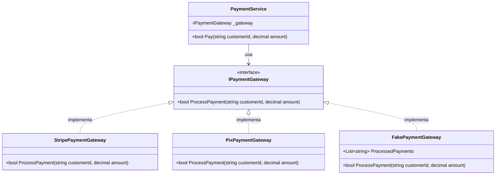
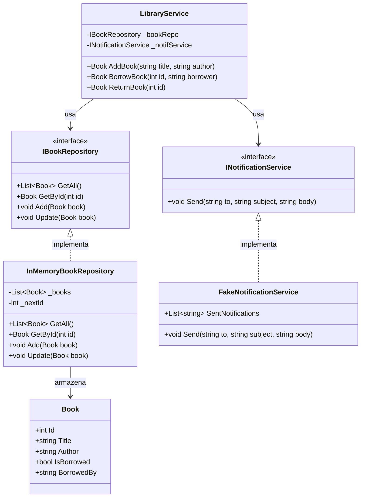

# Exercícios — Módulo 10.5: Repositórios e Integrações Externas

[← Voltar ao Módulo 10.5](cap10-mod05-camada-repositorio-integracao-conteudo.md)

> **Como usar estes exercícios:**
> 1. Leia o enunciado com atenção
> 2. Leia as dicas antes de começar
> 3. Tente resolver sozinho
> 4. Use a Proposta de Teste para verificar se sua solução funciona
> 5. Só depois consulte a Resposta Comentada

> **Como testar cada exercício:**
> 1. Escreva seu código no VSCode
> 2. Salve o arquivo na pasta `~/meus-projetos/curso/cap10/`
> 3. Para projetos C#: `dotnet new console -n NomeExercicio`, cole o código em `Program.cs`
> 4. Execute com `dotnet run`

---

## Exercício 1 — Identificando Responsabilidades do Repository — Nível: Básico

### Enunciado

Análise o código abaixo. Ele é um Repository de uma loja de livros, mas tem problemas — algumas coisas que estão nele não deveriam estar, e algumas coisas estão faltando. Identifique:

1. O que está no Repository mas **não deveria** estar (e em qual camada deveria ficar)
2. O que está **faltando** no Repository

```csharp
public class BookRepository
{
    private List<Book> _books = new List<Book>();

    public void Add(Book book)
    {
        // Valida regra de negocio
        if (book.Price <= 0)
            throw new ArgumentException("Preco invalido.");

        // Verifica duplicidade
        if (_books.Any(b => b.Title == book.Title))
            throw new InvalidOperationException("Livro duplicado.");

        _books.Add(book);

        // Envia notificacao
        Console.WriteLine($"[Email] Novo livro cadastrado: {book.Title}");
    }

    public string GetBookAsJson(int id)
    {
        var book = _books.FirstOrDefault(b => b.Id == id);
        return $"{{\"title\": \"{book.Title}\", \"price\": {book.Price}}}";
    }

    public void PrintAllBooks()
    {
        Console.WriteLine("=== Catalogo ===");
        foreach (var b in _books)
            Console.WriteLine($"  {b.Title} — R${b.Price:F2}");
    }
}
```

### Dicas

- Releia as tabelas "O que a Camada de Repository FAZ" e "O que a Camada de Repository NAO FAZ" do módulo
- Pense: o que aconteceria se quiséssemos usar esse Repository em um teste automatizado?
- Pense: o que aconteceria se quiséssemos trocar a forma de armazenamento?
- O Repository deve implementar uma interface?

### Proposta de Teste

- Identifique pelo menos 4 coisas que não deveriam estar no Repository
- Identifique pelo menos 2 coisas que estão faltando
- Para cada problema, indique em qual camada a responsabilidade deveria ficar

### Resposta Comentada

> **Importante:** Tente resolver sozinho primeiro!

**O que NÃO deveria estar no Repository:**

1. **Validação de preço (`if (book.Price <= 0)`)** — regra de negócio pertence ao **Service** ou ao **Domínio**. O Repository só salva, não válida.

2. **Verificação de duplicidade (`if (_books.Any(b => b.Title == book.Title))`)** — regra de negócio pertence ao **Service**. O Repository pode ter um método `Exists(string title)` que o Service chama, mas a decisão de rejeitar é do Service.

3. **Envio de notificação (`Console.WriteLine("[Email]...")`)** — pertence a uma **Integração Externa** (INotificationService). O Repository não envia emails.

4. **Formatação JSON (`GetBookAsJson`)** — pertence ao **Controller**. O Repository retorna entidades, não JSON.

5. **Exibição no console (`PrintAllBooks`)** — pertence ao **Controller**. O Repository não sabe como os dados serão exibidos.

**O que está FALTANDO:**

1. **Interface** — o Repository deveria implementar `IBookRepository` para permitir trocar a implementação
2. **Método `GetById`** — operação CRUD básica que todo Repository deve ter
3. **Método `Update`** — operação CRUD básica
4. **Método `Delete`** — operação CRUD básica
5. **Método `Count`** — útil para o Service saber quantos livros existem
6. **Geração automática de ID** — o método `Add` deveria atribuir um ID ao livro

---

## Exercício 2 — Criando um Repository Completo — Nível: Básico

### Enunciado

Crie a interface `IStudentRepository` e a implementação `InMemoryStudentRepository` para a entidade `Student` abaixo. O Repository deve ter todas as operações CRUD básicas mais dois métodos específicos.

```csharp
public class Student
{
    public int Id { get; set; }
    public string Name { get; set; }         // nome
    public string Email { get; set; }        // email
    public decimal GPA { get; set; }         // media de notas
    public bool IsActive { get; set; }       // esta ativo?

    public Student(string name, string email, decimal gpa)
    {
        Name = name;
        Email = email;
        GPA = gpa;
        IsActive = true;
    }

    public override string ToString()
    {
        var status = IsActive ? "Ativo" : "Inativo";
        return $"[{Id}] {Name} ({Email}) — GPA: {GPA:F1} [{status}]";
    }
}
```

A interface deve incluir:
- Operações CRUD: GetAll, GetById, Add, Update, Delete, Count
- Método específico: `GetByEmail(string email)` — buscar aluno por email
- Método específico: `GetTopStudents(decimal minGPA)` — listar alunos com GPA acima de um valor

Depois, escreva um programa que teste todas as operações.

### Dicas

- Siga o mesmo padrão do `InMemoryProductRepository` do módulo
- Use um contador `_nextId` para gerar IDs automaticamente
- O método `GetByEmail` retorna um único Student (ou null)
- O método `GetTopStudents` retorna uma lista filtrada
- Retorne cópias das listas para proteger os dados internos

### Proposta de Teste

- A interface deve ter 8 métodos
- O `Add` deve atribuir ID automaticamente
- O `GetByEmail` deve retornar null se não encontrar
- O `GetTopStudents` deve filtrar corretamente
- O programa de teste deve exercitar todas as operações

### Resposta Comentada

> **Importante:** Tente resolver sozinho primeiro!

```csharp
// === Interface ===
// "IStudentRepository" = contrato do repositorio de alunos

public interface IStudentRepository
{
    List<Student> GetAll();
    Student GetById(int id);
    Student GetByEmail(string email);        // buscar por email
    List<Student> GetTopStudents(decimal minGPA); // alunos com GPA acima de X
    void Add(Student student);
    void Update(Student student);
    void Delete(int id);
    int Count();
}

// === Implementacao em memoria ===
// "InMemoryStudentRepository" = repositorio de alunos em memoria

public class InMemoryStudentRepository : IStudentRepository
{
    private readonly List<Student> _students = new List<Student>();
    private int _nextId = 1;

    public List<Student> GetAll() => new List<Student>(_students);

    public Student GetById(int id)
    {
        foreach (var s in _students)
            if (s.Id == id) return s;
        return null;
    }

    public Student GetByEmail(string email)
    {
        foreach (var s in _students)
            if (s.Email.ToLower() == email.ToLower()) return s;
        return null;
    }

    public List<Student> GetTopStudents(decimal minGPA)
    {
        var result = new List<Student>();
        foreach (var s in _students)
            if (s.GPA >= minGPA && s.IsActive) result.Add(s);
        return result;
    }

    public void Add(Student student)
    {
        student.Id = _nextId++;
        _students.Add(student);
    }

    public void Update(Student student)
    {
        for (int i = 0; i < _students.Count; i++)
            if (_students[i].Id == student.Id)
            { _students[i] = student; return; }
    }

    public void Delete(int id)
    {
        for (int i = 0; i < _students.Count; i++)
            if (_students[i].Id == id)
            { _students.RemoveAt(i); return; }
    }

    public int Count() => _students.Count;
}

// === Teste ===
IStudentRepository repo = new InMemoryStudentRepository();

// Adicionar alunos
repo.Add(new Student("Ana Silva", "ana@email.com", 9.2m));
repo.Add(new Student("Carlos Lima", "carlos@email.com", 7.5m));
repo.Add(new Student("Maria Santos", "maria@email.com", 8.8m));

// Listar todos
Console.WriteLine($"Total: {repo.Count()} alunos");
foreach (var s in repo.GetAll())
    Console.WriteLine($"  {s}");

// Buscar por email
var found = repo.GetByEmail("carlos@email.com");
Console.WriteLine($"\nBusca por email: {found}");

// Top students (GPA >= 8.5)
Console.WriteLine("\nAlunos destaque (GPA >= 8.5):");
foreach (var s in repo.GetTopStudents(8.5m))
    Console.WriteLine($"  {s}");

// Atualizar
found.GPA = 8.0m;
repo.Update(found);
Console.WriteLine($"\nCarlos atualizado: {repo.GetById(2)}");

// Remover
repo.Delete(3);
Console.WriteLine($"\nApos remocao: {repo.Count()} alunos");
```

Saida esperada:
```
Total: 3 alunos
  [1] Ana Silva (ana@email.com) — GPA: 9.2 [Ativo]
  [2] Carlos Lima (carlos@email.com) — GPA: 7.5 [Ativo]
  [3] Maria Santos (maria@email.com) — GPA: 8.8 [Ativo]

Busca por email: [2] Carlos Lima (carlos@email.com) — GPA: 7.5 [Ativo]

Alunos destaque (GPA >= 8.5):
  [1] Ana Silva (ana@email.com) — GPA: 9.2 [Ativo]
  [3] Maria Santos (maria@email.com) — GPA: 8.8 [Ativo]

Carlos atualizado: [2] Carlos Lima (carlos@email.com) — GPA: 8.0 [Ativo]

Apos remocao: 2 alunos
```


---

## Exercício 3 — Criando uma Integração Externa — Nível: Intermediário

### Enunciado

Crie uma interface `IPaymentGateway` (Gateway de Pagamento) e três implementações:

1. `StripePaymentGateway` — simula pagamento via Stripe (imprime mensagens no console)
2. `PixPaymentGateway` — simula pagamento via Pix (imprime mensagens no console)
3. `FakePaymentGateway` — implementação falsa para testes (registra pagamentos em uma lista)

A interface deve ter:
- `ProcessPayment(string customerId, decimal amount)` — retorna `bool` (sucesso ou falha)
- `RefundPayment(string transactionId)` — retorna `bool`
- `IsAvailable()` — retorna `bool`

Depois, crie um `PaymentService` que recebe `IPaymentGateway` pelo construtor e tem um método `Pay` que válida o valor (deve ser positivo) e chama o gateway.

### Dicas

- Siga o mesmo padrão do `INotificationService` do módulo
- O `FakePaymentGateway` deve guardar uma lista de pagamentos processados
- O `PaymentService` não deve saber qual gateway está sendo usado
- Teste com as 3 implementações para mostrar a flexibilidade

### Proposta de Teste

- A interface deve ter 3 métodos
- O `FakePaymentGateway` deve permitir verificar pagamentos nos testes
- O `PaymentService` deve rejeitar valores negativos ou zero
- O mesmo `PaymentService` deve funcionar com qualquer implementação

### Resposta Comentada

> **Importante:** Tente resolver sozinho primeiro!

```csharp
// === Interface ===
// "IPaymentGateway" = gateway de pagamento

public interface IPaymentGateway
{
    // "ProcessPayment" = processar pagamento
    bool ProcessPayment(string customerId, decimal amount);

    // "RefundPayment" = reembolsar pagamento
    bool RefundPayment(string transactionId);

    // "IsAvailable" = esta disponivel
    bool IsAvailable();
}

// === Implementacao Stripe ===
public class StripePaymentGateway : IPaymentGateway
{
    public bool ProcessPayment(string customerId, decimal amount)
    {
        Console.WriteLine($"[Stripe] Processando R${amount:F2} para cliente {customerId}...");
        Console.WriteLine("[Stripe] Pagamento aprovado!");
        return true;
    }

    public bool RefundPayment(string transactionId)
    {
        Console.WriteLine($"[Stripe] Reembolsando transacao {transactionId}...");
        return true;
    }

    public bool IsAvailable()
    {
        Console.WriteLine("[Stripe] Verificando API...");
        return true;
    }
}

// === Implementacao Pix ===
public class PixPaymentGateway : IPaymentGateway
{
    public bool ProcessPayment(string customerId, decimal amount)
    {
        Console.WriteLine($"[Pix] Gerando QR Code de R${amount:F2} para {customerId}...");
        Console.WriteLine("[Pix] Pagamento confirmado!");
        return true;
    }

    public bool RefundPayment(string transactionId)
    {
        Console.WriteLine($"[Pix] Reembolso Pix para transacao {transactionId}...");
        return true;
    }

    public bool IsAvailable() => true;
}

// === Implementacao Fake ===
public class FakePaymentGateway : IPaymentGateway
{
    // Lista de pagamentos para verificacao nos testes
    public List<string> ProcessedPayments { get; } = new List<string>();

    public bool ProcessPayment(string customerId, decimal amount)
    {
        var record = $"{customerId}: R${amount:F2}";
        ProcessedPayments.Add(record);
        Console.WriteLine($"[Fake] Pagamento registrado: {record}");
        return true;
    }

    public bool RefundPayment(string transactionId)
    {
        Console.WriteLine($"[Fake] Reembolso registrado: {transactionId}");
        return true;
    }

    public bool IsAvailable() => true;
}

// === Service ===
public class PaymentService
{
    private readonly IPaymentGateway _gateway;

    public PaymentService(IPaymentGateway gateway)
    {
        _gateway = gateway;
    }

    // "Pay" = pagar
    public bool Pay(string customerId, decimal amount)
    {
        // Regra de negocio: valor deve ser positivo
        if (amount <= 0)
            throw new ArgumentException("Valor deve ser maior que zero.");

        // Verificar disponibilidade
        if (!_gateway.IsAvailable())
            throw new InvalidOperationException("Gateway indisponivel.");

        return _gateway.ProcessPayment(customerId, amount);
    }
}

// === Teste ===
Console.WriteLine("=== Stripe ===");
var svc1 = new PaymentService(new StripePaymentGateway());
svc1.Pay("cliente-001", 150.00m);

Console.WriteLine("\n=== Pix ===");
var svc2 = new PaymentService(new PixPaymentGateway());
svc2.Pay("cliente-002", 89.90m);

Console.WriteLine("\n=== Fake (teste) ===");
var fakeGateway = new FakePaymentGateway();
var svc3 = new PaymentService(fakeGateway);
svc3.Pay("cliente-003", 250.00m);
svc3.Pay("cliente-004", 75.50m);
Console.WriteLine($"Pagamentos registrados: {fakeGateway.ProcessedPayments.Count}");
```

Saida esperada:
```
=== Stripe ===
[Stripe] Verificando API...
[Stripe] Processando R$150.00 para cliente cliente-001...
[Stripe] Pagamento aprovado!

=== Pix ===
[Pix] Gerando QR Code de R$89.90 para cliente-002...
[Pix] Pagamento confirmado!

=== Fake (teste) ===
[Fake] Pagamento registrado: cliente-003: R$250.00
[Fake] Pagamento registrado: cliente-004: R$75.50
Pagamentos registrados: 2
```

Diagrama de classes do sistema de pagamentos:




---

## Exercício 4 — Service com Repository e Integração — Nível: Intermediário

### Enunciado

Crie um `LibraryService` (Serviço de Biblioteca) que coordena um repositório de livros e uma integração de notificação. O Service deve:

1. Receber `IBookRepository` e `INotificationService` pelo construtor
2. Ter um método `BorrowBook(int bookId, string memberName)` que:
   - Busca o livro pelo ID
   - Verifica se o livro está disponível (não emprestado)
   - Marca o livro como emprestado
   - Notifica o membro por email
   - Retorna o livro atualizado
3. Ter um método `ReturnBook(int bookId)` que:
   - Busca o livro pelo ID
   - Verifica se o livro está emprestado
   - Marca como disponível
   - Retorna o livro atualizado

Use as seguintes classes de apoio:

```csharp
public class Book
{
    public int Id { get; set; }
    public string Title { get; set; }
    public string Author { get; set; }
    public bool IsBorrowed { get; set; }      // esta emprestado?
    public string BorrowedBy { get; set; }    // emprestado para quem?
    public DateTime? BorrowedAt { get; set; } // quando foi emprestado?

    public Book(string title, string author)
    {
        Title = title;
        Author = author;
        IsBorrowed = false;
    }

    public override string ToString()
    {
        var status = IsBorrowed ? $"Emprestado para {BorrowedBy}" : "Disponivel";
        return $"[{Id}] {Title} ({Author}) — {status}";
    }
}
```

### Dicas

- Crie `IBookRepository` com GetAll, GetById, Add, Update, Count
- Crie `InMemoryBookRepository` seguindo o padrão do módulo
- Use `INotificationService` e `FakeNotificationService` do módulo
- O Service deve lançar exceções claras para cada erro

### Proposta de Teste

- `BorrowBook` deve lançar exceção se o livro não existir
- `BorrowBook` deve lançar exceção se o livro já estiver emprestado
- `ReturnBook` deve lançar exceção se o livro não estiver emprestado
- A notificação deve ser enviada apenas no empréstimo, não na devolução
- Teste com `FakeNotificationService` para verificar as notificações

### Resposta Comentada

> **Importante:** Tente resolver sozinho primeiro!

```csharp
// === Interface do Repository ===
public interface IBookRepository
{
    List<Book> GetAll();
    Book GetById(int id);
    void Add(Book book);
    void Update(Book book);
    int Count();
}

// === Implementacao em memoria ===
public class InMemoryBookRepository : IBookRepository
{
    private readonly List<Book> _books = new List<Book>();
    private int _nextId = 1;

    public List<Book> GetAll() => new List<Book>(_books);
    public Book GetById(int id)
    {
        foreach (var b in _books) if (b.Id == id) return b;
        return null;
    }
    public void Add(Book book) { book.Id = _nextId++; _books.Add(book); }
    public void Update(Book book)
    {
        for (int i = 0; i < _books.Count; i++)
            if (_books[i].Id == book.Id) { _books[i] = book; return; }
    }
    public int Count() => _books.Count;
}

// === Interface e Fake de notificacao (do modulo) ===
public interface INotificationService
{
    void Send(string recipient, string subject, string message);
    bool IsAvailable();
}

public class FakeNotificationService : INotificationService
{
    public List<string> SentNotifications { get; } = new List<string>();
    public void Send(string recipient, string subject, string message)
    {
        SentNotifications.Add($"Para: {recipient} | {subject} | {message}");
        Console.WriteLine($"[Fake] Notificacao: {recipient} — {subject}");
    }
    public bool IsAvailable() => true;
}

// === Service ===
// "LibraryService" = servico de biblioteca
public class LibraryService
{
    private readonly IBookRepository _bookRepo;
    private readonly INotificationService _notification;

    public LibraryService(IBookRepository bookRepo, INotificationService notification)
    {
        _bookRepo = bookRepo;
        _notification = notification;
    }

    // "BorrowBook" = emprestar livro
    public Book BorrowBook(int bookId, string memberName)
    {
        var book = _bookRepo.GetById(bookId);
        if (book == null)
            throw new KeyNotFoundException("Livro nao encontrado.");

        if (book.IsBorrowed)
            throw new InvalidOperationException(
                $"Livro '{book.Title}' ja esta emprestado para {book.BorrowedBy}.");

        // Marcar como emprestado
        book.IsBorrowed = true;
        book.BorrowedBy = memberName;
        book.BorrowedAt = DateTime.Now;
        _bookRepo.Update(book);

        // Notificar
        if (_notification.IsAvailable())
        {
            _notification.Send(
                memberName,
                "Emprestimo confirmado",
                $"Voce emprestou '{book.Title}' de {book.Author}.");
        }

        return book;
    }

    // "ReturnBook" = devolver livro
    public Book ReturnBook(int bookId)
    {
        var book = _bookRepo.GetById(bookId);
        if (book == null)
            throw new KeyNotFoundException("Livro nao encontrado.");

        if (!book.IsBorrowed)
            throw new InvalidOperationException(
                $"Livro '{book.Title}' nao esta emprestado.");

        // Marcar como disponivel
        book.IsBorrowed = false;
        book.BorrowedBy = null;
        book.BorrowedAt = null;
        _bookRepo.Update(book);

        return book;
    }
}

// === Teste ===
var bookRepo = new InMemoryBookRepository();
var fakeNotif = new FakeNotificationService();
var library = new LibraryService(bookRepo, fakeNotif);

// Popular livros
bookRepo.Add(new Book("Clean Code", "Robert C. Martin"));
bookRepo.Add(new Book("O Programador Pragmatico", "Hunt e Thomas"));

// Emprestar
Console.WriteLine("--- Emprestimo ---");
var borrowed = library.BorrowBook(1, "Ana Silva");
Console.WriteLine(borrowed);

// Tentar emprestar livro ja emprestado
Console.WriteLine("\n--- Tentativa de emprestimo duplicado ---");
try { library.BorrowBook(1, "Carlos"); }
catch (InvalidOperationException ex) { Console.WriteLine($"Erro: {ex.Message}"); }

// Devolver
Console.WriteLine("\n--- Devolucao ---");
var returned = library.ReturnBook(1);
Console.WriteLine(returned);

// Verificar notificacoes
Console.WriteLine($"\nNotificacoes enviadas: {fakeNotif.SentNotifications.Count}");
foreach (var n in fakeNotif.SentNotifications)
    Console.WriteLine($"  {n}");
```

Saida esperada:
```
--- Emprestimo ---
[Fake] Notificacao: Ana Silva — Emprestimo confirmado
[1] Clean Code (Robert C. Martin) — Emprestado para Ana Silva

--- Tentativa de emprestimo duplicado ---
Erro: Livro 'Clean Code' ja esta emprestado para Ana Silva.

--- Devolucao ---
[1] Clean Code (Robert C. Martin) — Disponivel

Notificacoes enviadas: 1
  Para: Ana Silva | Emprestimo confirmado | Voce emprestou 'Clean Code' de Robert C. Martin.
```

Observe que a notificacao foi enviada apenas no emprestimo, não na devolucao. E como usamos `FakeNotificationService`, nenhum email real foi enviado — mas podemos verificar que a lógica de notificacao funciona corretamente.

Diagrama de classes do sistema de biblioteca com repositorio e integracao:



