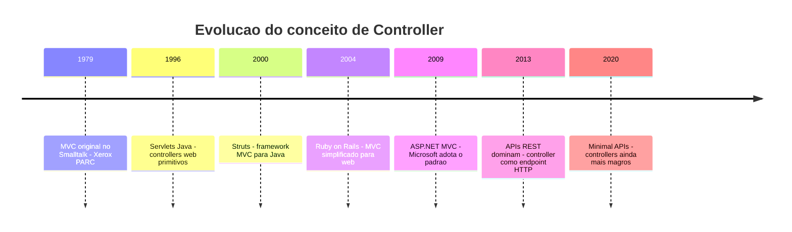
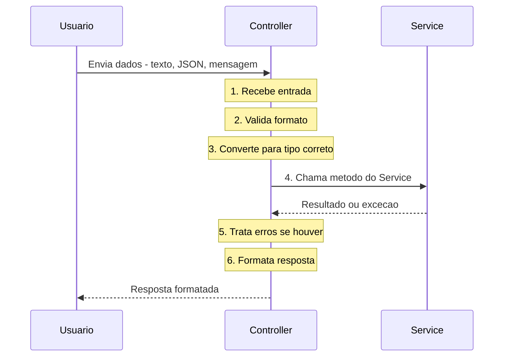
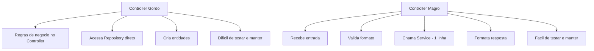
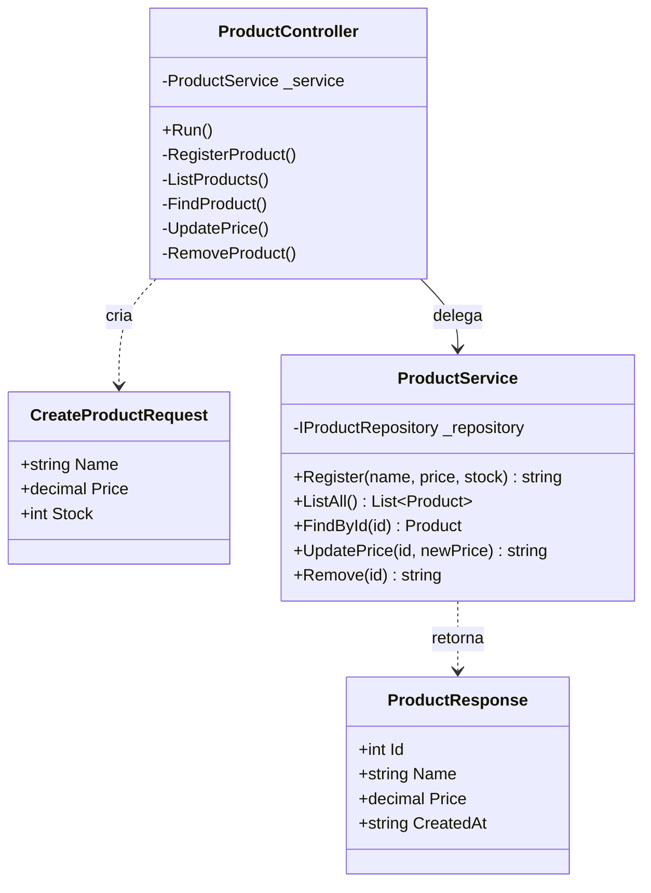
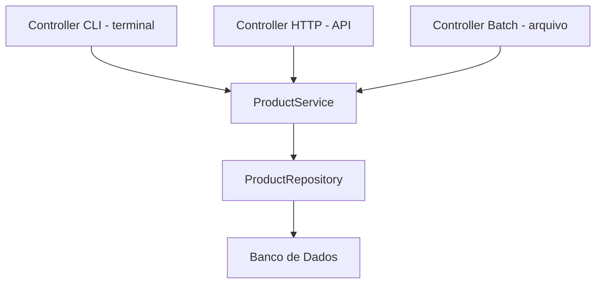
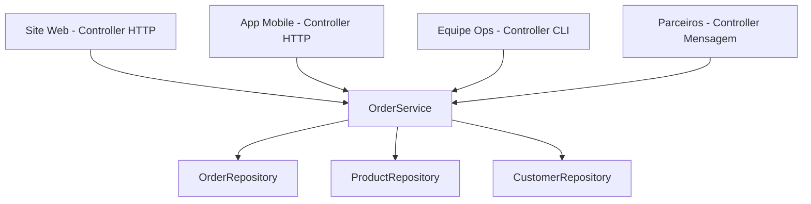
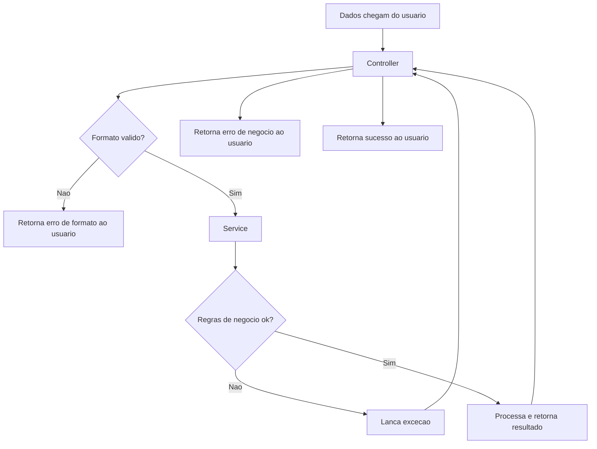

# 10.6 — Controllers e Camada de Entrada

[← Anterior: Repositórios e Integrações](cap10-mod05-camada-repositorio-integracao-conteudo.md) · [Próximo: Monolito vs Microserviços →](cap10-mod07-monolito-vs-microservicos-conteudo.md)

---

## Introdução

Nos módulos anteriores, você construiu o sistema de dentro para fora. Começou pelo domínio — as entidades que representam o mundo real (módulo 10.3). Depois subiu para os serviços — a camada que orquestra as regras de negócio e coordena operações (módulo 10.4). Em seguida, desceu para os repositórios — a camada que sabe onde e como os dados são guardados (módulo 10.5). Agora falta a última peça do quebra-cabeça: a **camada de entrada**.

A camada de entrada é a porta da frente do seu sistema. É por onde tudo começa. Quando um usuário digita algo no terminal, quando um navegador faz uma requisição HTTP, quando outro sistema envia uma mensagem — quem recebe isso? O **Controller**.

Lembra da analogia do restaurante que usamos desde o módulo 10.2? O Controller é o **garçom**. Ele recebe o pedido do cliente, verifica se está legível, passa para a cozinha (Service) e depois traz o prato pronto de volta. O garçom não cozinha. O garçom não vai à despensa. O garçom não decide a receita. Ele é o intermediário entre o mundo externo (o cliente) e o mundo interno (a cozinha).

E assim como um restaurante pode ter diferentes tipos de garçom — o garçom do salão, o atendente do delivery, o funcionário do drive-thru — um sistema pode ter diferentes tipos de Controller. Um Controller de terminal (CLI), um Controller HTTP (API), um Controller de mensagens (fila). Todos fazem a mesma coisa: recebem entrada, delegam para o Service e devolvem a resposta. A diferença é **de onde** a entrada vem e **para onde** a resposta vai.

Neste módulo, vamos entender em profundidade o que é um Controller, quais são suas responsabilidades exatas, o que ele **nunca** deve fazer, e como construir Controllers magros e eficientes. Vamos ver exemplos concretos em C# com menu CLI e até um Controller de processamento em lote (batch). E no final, vamos conectar tudo com o capítulo 11, onde você vai criar Controllers HTTP reais com FastAPI.

---

## Como Executar os Exemplos Deste Módulo

Os exemplos deste módulo usam C# (.NET), a mesma linguagem do capítulo 9. Para executar:

1. Certifique-se de que o .NET SDK está instalado (você já configurou no módulo 9.3)
2. Crie uma pasta para os exemplos: `mkdir -p ~/meus-projetos/curso/cap10/mod06`
3. Para cada exemplo, crie um projeto console: `dotnet new console -n NomeDoExemplo`
4. Cole o código no arquivo `Program.cs`
5. Execute com `dotnet run`

Alguns exemplos deste módulo mostram múltiplos arquivos. Em um projeto real, cada classe ficaria em seu próprio arquivo. Para simplificar a execução dos exemplos, vamos colocar tudo em `Program.cs` — mas sempre indicando em qual arquivo cada classe ficaria em um projeto real.

---

## A Analogia Completa: O Garçom do Restaurante

No módulo 10.2, apresentamos o garçom como a camada de apresentação. Agora vamos aprofundar essa analogia, porque ela revela exatamente o que um Controller faz — e o que ele não faz.

### O que o Garçom FAZ

Pense em um garçom competente de um bom restaurante:

1. **Recebe o cliente** — o garçom é o primeiro contato. Ele cumprimenta, acomoda e apresenta o cardápio. No software, o Controller é o primeiro ponto de contato com o mundo externo.

2. **Anota o pedido** — o garçom ouve o que o cliente quer e anota. Ele verifica se o pedido está claro: "Você disse picanha mal passada, correto?". No software, o Controller recebe os dados de entrada e verifica se estão no formato correto.

3. **Traduz para a cozinha** — o cliente pede "aquele prato com batata e molho especial". O garçom traduz para a linguagem da cozinha: "Prato 42, guarnição batata, molho da casa". No software, o Controller converte os dados brutos (texto digitado, JSON recebido) para o formato que o Service espera (DTO, parâmetros tipados).

4. **Passa o pedido para a cozinha** — o garçom não cozinha. Ele entrega o pedido ao cozinheiro e espera. No software, o Controller chama o Service e aguarda o resultado.

5. **Recebe o prato pronto** — quando a cozinha termina, o garçom recebe o prato. No software, o Controller recebe o resultado do Service.

6. **Apresenta ao cliente** — o garçom coloca o prato na mesa de forma bonita, com os talheres certos. No software, o Controller formata a resposta para o mundo externo (exibe no terminal, retorna JSON, envia mensagem).

7. **Lida com problemas** — se a cozinha diz "acabou o ingrediente", o garçom não entra em pânico. Ele volta ao cliente e diz educadamente: "Infelizmente esse prato não está disponível no momento. Posso sugerir uma alternativa?". No software, o Controller captura exceções do Service e retorna mensagens amigáveis ao usuário.

### O que o Garçom NÃO FAZ

Agora pense no que um garçom **nunca** faz:

1. **Não cozinha** — se o garçom entrar na cozinha e começar a fritar carne, o restaurante vira um caos. No software, o Controller não aplica regras de negócio.

2. **Não vai à despensa** — o garçom não sabe onde ficam os ingredientes, como são armazenados ou quando vencem. No software, o Controller não acessa o banco de dados.

3. **Não decide a receita** — o garçom não muda os ingredientes do prato porque acha que ficaria melhor. No software, o Controller não toma decisões de negócio.

4. **Não verifica o estoque** — o garçom não vai contar quantas peças de picanha sobraram. Ele pergunta à cozinha: "Tem picanha?". No software, o Controller não consulta dados — ele pede ao Service.

5. **Não calcula o preço** — o garçom não decide quanto cobrar. O cardápio (definido pelo negócio) tem os preços. No software, o Controller não faz cálculos de negócio.

| Garcom | Controller | Faz ou não faz |
|--------|-----------|----------------|
| Recebe o cliente | Recebe a requisicao | FAZ |
| Anota o pedido | Le os dados de entrada | FAZ |
| Verifica se o pedido esta legivel | Válida formato dos dados | FAZ |
| Traduz para a cozinha | Converte para DTO ou parametros | FAZ |
| Passa para o cozinheiro | Chama o Service | FAZ |
| Apresenta o prato | Formata e retorna a resposta | FAZ |
| Lida com reclamacoes | Trata exceções com mensagens amigaveis | FAZ |
| Cozinha o prato | Aplica regras de negocio | NAO FAZ |
| Vai a despensa | Acessa banco de dados | NAO FAZ |
| Decide a receita | Toma decisoes de negocio | NAO FAZ |
| Calcula o preco | Faz cálculos de negocio | NAO FAZ |


A regra de ouro é: **o Controller ideal tem entre 5 e 10 linhas por método**. Recebe, válida formato, converte, chama o Service, formata a resposta e retorna. Se o seu Controller tem 50 linhas em um método, algo está errado — provavelmente ele está fazendo trabalho que deveria ser do Service.

---

## Contexto Histórico: De Onde Veio o Controller

O conceito de Controller tem uma história longa e interessante que vale a pena conhecer, porque explica por que existem tantos nomes e variações para a mesma ideia.

### Anos 1970: O Padrão MVC Original

A história começa em 1979, no Xerox PARC (Palo Alto Research Center) — o mesmo laboratório que inventou a interface gráfica, o mouse e a impressora a laser. Um cientista norueguês chamado **Trygve Reenskaug** estava trabalhando no Smalltalk, uma das primeiras linguagens orientadas a objetos, e percebeu um problema: como separar a interface do usuário da lógica da aplicação?

A solução dele foi o padrão **MVC** — Model-View-Controller:

- **Model** (Modelo): os dados e as regras de negócio
- **View** (Visão): a interface que o usuário vê
- **Controller** (Controlador): o intermediário que recebe entrada do usuário e coordena Model e View

A ideia era revolucionária para a época: em vez de misturar tudo em um único programa, separar em três partes com responsabilidades claras. O Controller era o "maestro" — recebia os cliques e teclas do usuário, decidia o que fazer e atualizava a View.

### Anos 1990-2000: MVC na Web

Quando a web explodiu nos anos 1990, o padrão MVC foi adaptado para aplicações web. Frameworks como **Struts** (Java, 2000), **Ruby on Rails** (2004) e **ASP.NET MVC** (2009) trouxeram o conceito de Controller para o desenvolvimento web.

Mas na web, o Controller ganhou um significado ligeiramente diferente do original. No MVC de desktop, o Controller lidava com cliques e teclas. No MVC web, o Controller passou a lidar com **requisições HTTP** — receber URLs, ler parâmetros, chamar a lógica de negócio e retornar HTML ou JSON.



### O Controller no Backend Moderno

Hoje, no desenvolvimento backend (que é o foco deste capítulo), o Controller tem um papel mais específico do que no MVC original. Ele não lida com Views (isso é trabalho do frontend). Ele é simplesmente o **ponto de entrada** da aplicação — recebe requisições, delega para o Service e retorna respostas.

É por isso que neste curso usamos o termo "camada de entrada" em vez de "camada de apresentação". No backend, o Controller não "apresenta" nada visualmente — ele recebe e responde. A "apresentação" (telas, botões, formulários) fica no frontend, que é outro sistema.

### Por que Tantos Nomes?

Assim como vimos no módulo 10.2, o Controller tem muitos nomes dependendo do framework e da arquitetura:

| Nome | Framework ou Arquitetura | Mesma responsabilidade |
|------|------------------------|----------------------|
| Controller | ASP.NET MVC, Spring MVC, Rails | Sim |
| Handler | Go net/http, Mediator pattern | Sim |
| Endpoint | FastAPI, Minimal APIs | Sim |
| Action | Phoenix, alguns frameworks Ruby | Sim |
| Route | Express.js, Flask | Sim |
| Resource | JAX-RS, Django REST | Sim |
| Presenter | MVP pattern | Similar |
| View | Algumas arquiteturas MVVM | Similar |

Não importa o nome. O que importa é a responsabilidade: **receber entrada, delegar para o Service, retornar resposta**. Se uma classe faz isso, ela é um Controller — mesmo que se chame "Handler", "Endpoint" ou "Route".

---

## Responsabilidades do Controller: O Checklist Completo

Vamos ser precisos sobre o que o Controller faz. Cada método de um Controller segue um fluxo previsível com 6 passos:

### Passo 1: Receber a Entrada

O Controller é o primeiro a receber os dados do mundo externo. Dependendo do tipo de Controller, a entrada vem de lugares diferentes:

| Tipo de Controller | De onde vem a entrada | Exemplo |
|-------------------|----------------------|---------|
| CLI - terminal | Console.ReadLine | Usuario digita "Notebook" |
| HTTP - API | Requisicao HTTP | JSON com nome e preco |
| Message - fila | Mensagem de uma fila | Evento de novo pedido |
| Batch - arquivo | Arquivo CSV ou JSON | Lista de produtos para importar |
| gRPC | Chamada remota | Protobuf com dados estruturados |

### Passo 2: Validar o Formato

Aqui está uma distinção crucial que já apareceu no módulo 10.2 e que vamos reforçar agora: **validação de formato** vs **validação de negócio**.

O Controller faz **validação de formato** — verifica se os dados chegaram no formato correto:

- O campo "preço" é um número? (não uma letra)
- O campo "nome" foi preenchido? (não está vazio)
- O campo "email" tem formato de email? (tem @)
- O campo "quantidade" é um número inteiro? (não é 3.5)

O Controller **não** faz **validação de negócio** — isso é trabalho do Service:

- O preço é positivo? (regra de negócio)
- O nome é duplicado? (precisa consultar dados)
- O cliente tem crédito suficiente? (regra de negócio)
- O estoque é suficiente? (precisa consultar dados)

| Tipo de validação | Quem faz | Exemplos |
|-------------------|----------|----------|
| Formato | Controller | Campo e número? Campo esta preenchido? Formato de email? |
| Negocio | Service | Preco positivo? Nome duplicado? Estoque suficiente? |

A regra prática: **se a validação depende apenas do formato do dado (sem consultar nada), é do Controller. Se depende de regras ou de dados existentes, é do Service.**

### Passo 3: Converter para o Formato do Service

O Controller recebe dados "crus" — texto digitado pelo usuário, JSON de uma requisição, bytes de uma mensagem. O Service espera dados tipados — objetos, DTOs, parâmetros com tipos corretos.

O Controller faz essa conversão:

```csharp
// O usuario digitou texto
string priceText = Console.ReadLine(); // "49.90"

// O Controller converte para o tipo correto
decimal price = decimal.Parse(priceText); // 49.90 como numero

// E passa para o Service como parametro tipado
var result = _service.Register(name, price, stock);
```

Em APIs HTTP, essa conversão geralmente é automática (o framework faz). Em CLIs, o Controller faz manualmente.

### Passo 4: Chamar o Service

Este é o passo mais simples — e o mais importante. O Controller chama **um** método do Service e passa os dados convertidos. Uma linha. Sem lógica adicional.

```csharp
// Uma unica linha — delega tudo para o Service
var product = _service.Register(name, price, stock);
```

Se o seu Controller tem 3 chamadas ao Service em sequência, algo está errado. Provavelmente o Service deveria ter um método que coordena essas 3 operações.

### Passo 5: Tratar Erros

Quando o Service lança uma exceção (nome duplicado, produto não encontrado, estoque insuficiente), o Controller captura e transforma em uma mensagem amigável para o usuário.

```csharp
try
{
    var product = _service.Register(name, price, stock);
    Console.WriteLine($"Produto cadastrado com sucesso! ID: {product.Id}");
}
catch (InvalidOperationException ex)
{
    // Mensagem amigavel para o usuario
    Console.WriteLine($"Nao foi possivel cadastrar: {ex.Message}");
}
catch (Exception ex)
{
    // Erro inesperado
    Console.WriteLine("Ocorreu um erro inesperado. Tente novamente.");
}
```

Em APIs HTTP, o Controller traduz exceções para status codes: `InvalidOperationException` vira 400 (Bad Request), `KeyNotFoundException` vira 404 (Not Found), `UnauthorizedAccessException` vira 401 (Unauthorized).

### Passo 6: Formatar e Retornar a Resposta

O Controller formata o resultado para o mundo externo. Em um CLI, exibe no terminal. Em uma API, retorna JSON. Em um processador de mensagens, pública uma resposta na fila.

```csharp
// CLI: exibe no terminal
Console.WriteLine($"[{product.Id}] {product.Name} — R${product.Price:F2}");

// API: retornaria JSON (veremos no capitulo 11)
// return Ok(new { id = product.Id, name = product.Name, price = product.Price });
```

### O Fluxo Completo em um Diagrama



---

## O Controller Magro: Menos é Mais

Um dos princípios mais importantes da arquitetura de software é o **Controller magro** (thin controller). A ideia é simples: o Controller deve ter o mínimo de código possível. Ele recebe, válida formato, delega e retorna. Nada mais.

### Por que o Controller Deve Ser Magro?

Existem razões práticas e concretas:

1. **Testabilidade** — Services são fáceis de testar: você cria um mock do Repository, instância o Service e chama os métodos. Controllers são difíceis de testar: você precisa simular entrada do usuário, capturar saída do console, ou montar requisições HTTP. Quanto menos lógica no Controller, menos testes difíceis você precisa escrever.

2. **Reusabilidade** — se a lógica está no Service, qualquer Controller pode usá-la. Um Controller CLI e um Controller HTTP podem chamar o mesmo Service. Se a lógica estivesse no Controller CLI, o Controller HTTP teria que duplicá-la.

3. **Manutenção** — quando uma regra de negócio muda, você quer mudar em **um** lugar (o Service), não em todos os Controllers que usam essa regra.

4. **Clareza** — um Controller magro é fácil de ler. Você bate o olho e entende: "recebe nome e preço, chama o Service, exibe o resultado". Sem surpresas.

### Exemplo: Controller Gordo vs Controller Magro

Vamos ver a diferença na prática. Primeiro, um Controller **gordo** — cheio de lógica que não deveria estar ali:

```csharp
// === ERRADO: Controller GORDO ===
// Este controller faz coisas demais — tem logica de negocio misturada

public class ProductControllerGordo
{
    // Acessa o repositorio diretamente — ERRADO
    private readonly IProductRepository _repository;

    public ProductControllerGordo(IProductRepository repository)
    {
        _repository = repository;
    }

    // Metodo com logica de negocio no Controller — ERRADO
    private void RegisterProduct()
    {
        Console.Write("Nome: ");
        var name = Console.ReadLine();

        Console.Write("Preco: ");
        var price = decimal.Parse(Console.ReadLine());

        Console.Write("Estoque: ");
        var stock = int.Parse(Console.ReadLine());

        // ERRADO: regra de negocio no Controller
        if (price <= 0)
        {
            Console.WriteLine("Preco deve ser positivo!");
            return;
        }

        // ERRADO: regra de negocio no Controller
        if (stock < 0)
        {
            Console.WriteLine("Estoque nao pode ser negativo!");
            return;
        }

        // ERRADO: acessa repositorio direto, pulando o Service
        if (_repository.Exists(name))
        {
            Console.WriteLine("Produto duplicado!");
            return;
        }

        // ERRADO: cria entidade no Controller
        var product = new Product(name, price, stock);

        // ERRADO: salva direto no repositorio
        _repository.Add(product);

        // ERRADO: calculo de negocio no Controller
        decimal priceWithTax = price * 1.15m;
        Console.WriteLine($"Produto cadastrado! Preco com imposto: R${priceWithTax:F2}");
    }
}
```

Saída esperada: nenhuma (é apenas a definição da classe — e um exemplo do que NÃO fazer)

Esse Controller tem **7 problemas**:
1. Acessa o Repository diretamente (pula o Service)
2. Válida preço positivo (regra de negócio)
3. Válida estoque não negativo (regra de negócio)
4. Verifica duplicidade (regra de negócio que consulta dados)
5. Cria a entidade Product (responsabilidade do Service)
6. Salva no Repository (responsabilidade do Service)
7. Calcula preço com imposto (regra de negócio)

Agora, o mesmo Controller na versão **magra**:

```csharp
// === CORRETO: Controller MAGRO ===
// Este controller so faz o que deve: receber, validar formato, delegar, responder

public class ProductControllerMagro
{
    // Depende do SERVICE, nao do Repository
    private readonly ProductService _service;

    public ProductControllerMagro(ProductService service)
    {
        _service = service;
    }

    // Metodo magro: recebe, valida formato, delega, responde
    private void RegisterProduct()
    {
        // Passo 1 e 2: receber entrada e validar formato
        Console.Write("Nome: ");
        var name = Console.ReadLine();

        Console.Write("Preco: ");
        if (!decimal.TryParse(Console.ReadLine(), out decimal price))
        {
            Console.WriteLine("Valor invalido. Digite um numero.");
            return;
        }

        Console.Write("Estoque: ");
        if (!int.TryParse(Console.ReadLine(), out int stock))
        {
            Console.WriteLine("Valor invalido. Digite um numero inteiro.");
            return;
        }

        // Passos 4 e 5: chamar Service e tratar erros
        try
        {
            var product = _service.Register(name, price, stock);

            // Passo 6: formatar resposta
            Console.WriteLine($"Produto cadastrado! ID: {product.Id}, Nome: {product.Name}");
        }
        catch (Exception ex)
        {
            Console.WriteLine($"Erro: {ex.Message}");
        }
    }
}
```

Saída esperada: nenhuma (é apenas a definição da classe)

Compare os dois. O Controller magro:
- Não conhece o Repository
- Não válida regras de negócio
- Não cria entidades
- Não faz cálculos
- Só válida **formato** (o texto é um número?)
- Delega **tudo** para o Service
- Trata erros com mensagens amigáveis

O método tem cerca de 20 linhas — e a maioria é leitura de entrada e exibição de saída. A lógica real é uma única linha: `_service.Register(name, price, stock)`.



---

## Exemplo Completo: Controller CLI de Produtos

Vamos construir um Controller CLI completo — com menu, todas as operações CRUD e tratamento de erros. Este exemplo usa o `ProductService` que construímos no módulo 10.4.

Veja a estrutura das camadas com DTOs e Controller:



Primeiro, vamos relembrar as classes de apoio que o Controller vai usar (já definidas nos módulos anteriores):

```csharp
// === Models/Product.cs — Entidade de dominio (modulo 10.3) ===
public class Product
{
    public int Id { get; set; }
    public string Name { get; private set; }   // "Name" = nome
    public decimal Price { get; private set; }  // "Price" = preco
    public int Stock { get; private set; }      // "Stock" = estoque
    public DateTime CreatedAt { get; set; }     // "CreatedAt" = data de criacao

    public Product(string name, decimal price, int stock)
    {
        if (string.IsNullOrWhiteSpace(name))
            throw new ArgumentException("Nome nao pode ser vazio.");
        if (price <= 0)
            throw new ArgumentException("Preco deve ser maior que zero.");
        if (stock < 0)
            throw new ArgumentException("Estoque nao pode ser negativo.");

        Name = name;
        Price = price;
        Stock = stock;
        CreatedAt = DateTime.Now;
    }

    public void UpdatePrice(decimal newPrice)
    {
        if (newPrice <= 0)
            throw new ArgumentException("Preco deve ser maior que zero.");
        Price = newPrice;
    }

    public void AddStock(int quantity)
    {
        if (quantity <= 0)
            throw new ArgumentException("Quantidade deve ser maior que zero.");
        Stock += quantity;
    }

    public override string ToString()
    {
        return $"[{Id}] {Name} — R${Price:F2} (Estoque: {Stock})";
    }
}
```

Saída esperada: nenhuma (é apenas a definição da classe)

```csharp
// === Repositories/IProductRepository.cs — Interface (modulo 10.5) ===
public interface IProductRepository
{
    List<Product> GetAll();
    Product GetById(int id);
    void Add(Product product);
    void Update(Product product);
    void Delete(int id);
    bool Exists(string name);
}
```

Saída esperada: nenhuma (é apenas a definição da interface)

```csharp
// === Repositories/InMemoryProductRepository.cs — Implementacao em memoria ===
public class InMemoryProductRepository : IProductRepository
{
    private List<Product> _products = new List<Product>();
    private int _nextId = 1;

    public List<Product> GetAll() => new List<Product>(_products);

    public Product GetById(int id)
    {
        foreach (var p in _products)
            if (p.Id == id) return p;
        return null;
    }

    public void Add(Product product)
    {
        product.Id = _nextId++;
        _products.Add(product);
    }

    public void Update(Product product)
    {
        for (int i = 0; i < _products.Count; i++)
            if (_products[i].Id == product.Id) { _products[i] = product; return; }
    }

    public void Delete(int id) => _products.RemoveAll(p => p.Id == id);

    public bool Exists(string name)
    {
        foreach (var p in _products)
            if (p.Name.Equals(name, StringComparison.OrdinalIgnoreCase)) return true;
        return false;
    }
}
```

Saída esperada: nenhuma (é apenas a definição da classe)

```csharp
// === DTOs/ProductDTOs.cs — Objetos de transferencia (modulo 10.4) ===

// DTO de entrada para cadastro
// "CreateProductRequest" = requisicao de criacao de produto
public class CreateProductRequest
{
    public string Name { get; set; }
    public decimal Price { get; set; }
    public int Stock { get; set; }
}

// DTO de saida
// "ProductResponse" = resposta com dados do produto
public class ProductResponse
{
    public int Id { get; set; }
    public string Name { get; set; }
    public decimal Price { get; set; }
    public int Stock { get; set; }
    public string CreatedAt { get; set; }
}
```

Saída esperada: nenhuma (é apenas a definição das classes)

```csharp
// === Services/ProductService.cs — Logica de negocio (modulo 10.4) ===
public class ProductService
{
    private readonly IProductRepository _repository;

    public ProductService(IProductRepository repository)
    {
        _repository = repository;
    }

    // Cadastrar produto
    public ProductResponse Register(CreateProductRequest request)
    {
        if (_repository.Exists(request.Name))
            throw new InvalidOperationException(
                $"Ja existe um produto com o nome '{request.Name}'.");

        var product = new Product(request.Name, request.Price, request.Stock);
        _repository.Add(product);
        return ToResponse(product);
    }

    // Listar todos
    public List<ProductResponse> ListAll()
    {
        var products = _repository.GetAll();
        var responses = new List<ProductResponse>();
        foreach (var p in products)
            responses.Add(ToResponse(p));
        return responses;
    }

    // Buscar por ID
    public ProductResponse FindById(int id)
    {
        var product = _repository.GetById(id);
        if (product == null)
            throw new KeyNotFoundException($"Produto com ID {id} nao encontrado.");
        return ToResponse(product);
    }

    // Atualizar preco
    public ProductResponse UpdatePrice(int id, decimal newPrice)
    {
        var product = _repository.GetById(id);
        if (product == null)
            throw new KeyNotFoundException($"Produto com ID {id} nao encontrado.");
        product.UpdatePrice(newPrice);
        _repository.Update(product);
        return ToResponse(product);
    }

    // Remover
    public void Remove(int id)
    {
        var product = _repository.GetById(id);
        if (product == null)
            throw new KeyNotFoundException($"Produto com ID {id} nao encontrado.");
        _repository.Delete(id);
    }

    // Conversor
    private ProductResponse ToResponse(Product product)
    {
        return new ProductResponse
        {
            Id = product.Id,
            Name = product.Name,
            Price = product.Price,
            Stock = product.Stock,
            CreatedAt = product.CreatedAt.ToString("dd/MM/yyyy HH:mm")
        };
    }
}
```

Saída esperada: nenhuma (é apenas a definição da classe)

Agora sim — o Controller. Observe como ele é **magro**. Cada método faz apenas: ler entrada, validar formato, chamar Service, exibir resultado.

```csharp
// === Controllers/ProductController.cs — O CONTROLLER COMPLETO ===
// Camada de entrada: recebe dados do usuario, delega para o Service

public class ProductController
{
    private readonly ProductService _service; // depende do Service, NAO do Repository

    // Recebe o Service pelo construtor (injecao de dependencia)
    public ProductController(ProductService service)
    {
        _service = service;
    }

    // Menu principal — loop que exibe opcoes e direciona
    // "Run" = executar
    public void Run()
    {
        Console.WriteLine("=== Sistema de Produtos ===\n");

        while (true)
        {
            Console.WriteLine("--- Menu ---");
            Console.WriteLine("1. Cadastrar produto");
            Console.WriteLine("2. Listar produtos");
            Console.WriteLine("3. Buscar por ID");
            Console.WriteLine("4. Atualizar preco");
            Console.WriteLine("5. Remover produto");
            Console.WriteLine("0. Sair");
            Console.Write("Opcao: ");

            var option = Console.ReadLine();

            // Direciona para o metodo correto
            switch (option)
            {
                case "1": RegisterProduct(); break;
                case "2": ListProducts(); break;
                case "3": FindProduct(); break;
                case "4": UpdatePrice(); break;
                case "5": RemoveProduct(); break;
                case "0":
                    Console.WriteLine("Ate logo!");
                    return;
                default:
                    Console.WriteLine("Opcao invalida.\n");
                    break;
            }
        }
    }

    // --- CADASTRAR PRODUTO ---
    // Observe: so valida FORMATO, delega NEGOCIO para o Service
    private void RegisterProduct()
    {
        Console.Write("\nNome do produto: ");
        var name = Console.ReadLine();

        // Validacao de FORMATO: o texto e um numero?
        Console.Write("Preco: ");
        if (!decimal.TryParse(Console.ReadLine(), out decimal price))
        {
            Console.WriteLine("Valor invalido. Digite um numero.\n");
            return;
        }

        // Validacao de FORMATO: o texto e um numero inteiro?
        Console.Write("Estoque inicial: ");
        if (!int.TryParse(Console.ReadLine(), out int stock))
        {
            Console.WriteLine("Valor invalido. Digite um numero inteiro.\n");
            return;
        }

        // Monta o DTO de entrada
        var request = new CreateProductRequest
        {
            Name = name,
            Price = price,
            Stock = stock
        };

        // Delega para o Service e trata erros
        try
        {
            var response = _service.Register(request);
            Console.WriteLine($"\nProduto cadastrado com sucesso!");
            Console.WriteLine($"  ID: {response.Id}");
            Console.WriteLine($"  Nome: {response.Name}");
            Console.WriteLine($"  Preco: R${response.Price:F2}");
            Console.WriteLine($"  Estoque: {response.Stock}\n");
        }
        catch (Exception ex)
        {
            Console.WriteLine($"\nErro: {ex.Message}\n");
        }
    }

    // --- LISTAR PRODUTOS ---
    // Metodo simples: chama Service e formata a saida
    private void ListProducts()
    {
        var products = _service.ListAll();

        if (products.Count == 0)
        {
            Console.WriteLine("\nNenhum produto cadastrado.\n");
            return;
        }

        Console.WriteLine($"\n--- {products.Count} produto(s) encontrado(s) ---");
        foreach (var p in products)
        {
            Console.WriteLine($"  [{p.Id}] {p.Name} — R${p.Price:F2} (Estoque: {p.Stock})");
        }
        Console.WriteLine();
    }

    // --- BUSCAR POR ID ---
    private void FindProduct()
    {
        Console.Write("\nDigite o ID: ");
        if (!int.TryParse(Console.ReadLine(), out int id))
        {
            Console.WriteLine("ID invalido. Digite um numero inteiro.\n");
            return;
        }

        try
        {
            var product = _service.FindById(id);
            Console.WriteLine($"\n  ID: {product.Id}");
            Console.WriteLine($"  Nome: {product.Name}");
            Console.WriteLine($"  Preco: R${product.Price:F2}");
            Console.WriteLine($"  Estoque: {product.Stock}");
            Console.WriteLine($"  Criado em: {product.CreatedAt}\n");
        }
        catch (Exception ex)
        {
            Console.WriteLine($"\nErro: {ex.Message}\n");
        }
    }

    // --- ATUALIZAR PRECO ---
    private void UpdatePrice()
    {
        Console.Write("\nID do produto: ");
        if (!int.TryParse(Console.ReadLine(), out int id))
        {
            Console.WriteLine("ID invalido.\n");
            return;
        }

        Console.Write("Novo preco: ");
        if (!decimal.TryParse(Console.ReadLine(), out decimal newPrice))
        {
            Console.WriteLine("Valor invalido.\n");
            return;
        }

        try
        {
            var product = _service.UpdatePrice(id, newPrice);
            Console.WriteLine($"\nPreco atualizado! {product.Name} agora custa R${product.Price:F2}\n");
        }
        catch (Exception ex)
        {
            Console.WriteLine($"\nErro: {ex.Message}\n");
        }
    }

    // --- REMOVER PRODUTO ---
    private void RemoveProduct()
    {
        Console.Write("\nID do produto para remover: ");
        if (!int.TryParse(Console.ReadLine(), out int id))
        {
            Console.WriteLine("ID invalido.\n");
            return;
        }

        try
        {
            _service.Remove(id);
            Console.WriteLine("Produto removido com sucesso!\n");
        }
        catch (Exception ex)
        {
            Console.WriteLine($"\nErro: {ex.Message}\n");
        }
    }
}
```

Saída esperada (ao executar o programa completo):
```
=== Sistema de Produtos ===

--- Menu ---
1. Cadastrar produto
2. Listar produtos
3. Buscar por ID
4. Atualizar preco
5. Remover produto
0. Sair
Opcao: 1

Nome do produto: Notebook
Preco: 3500
Estoque inicial: 10

Produto cadastrado com sucesso!
  ID: 1
  Nome: Notebook
  Preco: R$3500.00
  Estoque: 10
```

Agora, o `Program.cs` que monta tudo — a composição das dependências:

```csharp
// === Program.cs — Ponto de entrada e composicao ===
// Aqui montamos as dependencias e iniciamos a aplicacao

// Passo 1: criar o repositorio (camada de dados)
IProductRepository repository = new InMemoryProductRepository();

// Passo 2: criar o servico, injetando o repositorio
var service = new ProductService(repository);

// Passo 3: criar o controller, injetando o servico
var controller = new ProductController(service);

// Passo 4: iniciar a aplicacao
controller.Run();
```

Saída esperada: o menu do sistema aparece no terminal (mostrado acima)

Observe a cadeia de dependências: `Repository → Service → Controller`. Cada camada recebe apenas o que precisa. O Controller não sabe que o Repository existe. O Service não sabe que o Controller existe. Cada um conhece apenas seu vizinho direto.

---

## Diferentes Tipos de Controller

Até agora, todos os nossos exemplos usaram Controllers CLI — que leem do terminal e escrevem no terminal. Mas lembra do garçom? Um restaurante pode ter o garçom do salão, o atendente do delivery e o funcionário do drive-thru. Todos fazem a mesma coisa (recebem pedido, passam para a cozinha, entregam o resultado), mas de formas diferentes.

No software é igual. O mesmo Service pode ser acessado por diferentes tipos de Controller:



Essa é uma das maiores vantagens do Controller magro: como toda a lógica está no Service, você pode criar quantos Controllers quiser sem duplicar nenhuma regra de negócio.

### Tipo 1: Controller CLI (Terminal)

É o que já vimos. Lê entrada do `Console.ReadLine()`, exibe saída com `Console.WriteLine()`. Ideal para ferramentas de linha de comando, scripts de administração e aplicações de estudo.

```csharp
// Controller CLI — ja vimos o exemplo completo acima
// Resumo: le do terminal, chama Service, exibe no terminal
```

### Tipo 2: Controller HTTP (API)

Recebe requisições HTTP (GET, POST, PUT, DELETE) e retorna respostas em JSON. É o tipo mais comum em aplicações web modernas. Vamos ver isso em profundidade no capítulo 11 com FastAPI, mas aqui vai uma prévia conceitual em C#:

```csharp
// === Controllers/ProductApiController.cs — Controller HTTP (conceitual) ===
// NOTA: este e um exemplo conceitual. No capitulo 11, voce vai
// construir controllers HTTP reais com FastAPI em Python.

// Em ASP.NET, um controller HTTP se parece com isso:
// [ApiController]
// [Route("api/products")]
public class ProductApiController
{
    private readonly ProductService _service;

    public ProductApiController(ProductService service)
    {
        _service = service;
    }

    // POST /api/products — cadastrar produto
    // Recebe JSON, retorna JSON
    // "Create" = criar
    public object Create(CreateProductRequest request)
    {
        try
        {
            // Mesma chamada ao Service — uma unica linha
            var product = _service.Register(request);

            // Retorna status 201 (Created) com os dados
            return new { status = 201, data = product };
        }
        catch (InvalidOperationException ex)
        {
            // Retorna status 400 (Bad Request)
            return new { status = 400, error = ex.Message };
        }
    }

    // GET /api/products — listar todos
    public object GetAll()
    {
        var products = _service.ListAll();
        return new { status = 200, data = products };
    }

    // GET /api/products/5 — buscar por ID
    public object GetById(int id)
    {
        try
        {
            var product = _service.FindById(id);
            return new { status = 200, data = product };
        }
        catch (KeyNotFoundException ex)
        {
            // Retorna status 404 (Not Found)
            return new { status = 404, error = ex.Message };
        }
    }
}
```

Saída esperada: nenhuma (é um exemplo conceitual — no capítulo 11 você vai construir isso de verdade)

Observe como o Controller HTTP faz **exatamente a mesma coisa** que o Controller CLI:
1. Recebe dados (JSON em vez de Console.ReadLine)
2. Chama o Service (mesma linha: `_service.Register(request)`)
3. Trata erros (status codes em vez de Console.WriteLine)
4. Retorna resposta (JSON em vez de texto no terminal)

A lógica de negócio é **zero** nos dois Controllers. Toda a inteligência está no Service.

### Tipo 3: Controller Batch (Processamento em Lote)

Um Controller batch processa uma lista de itens de uma vez — geralmente lidos de um arquivo CSV, JSON ou de uma fila de mensagens. É comum em sistemas que precisam importar dados em massa.

```csharp
// === Controllers/ProductBatchController.cs — Controller de processamento em lote ===
// Processa uma lista de produtos de uma vez

public class ProductBatchController
{
    private readonly ProductService _service;

    public ProductBatchController(ProductService service)
    {
        _service = service;
    }

    // Processa uma lista de produtos
    // "ProcessBatch" = processar lote
    public void ProcessBatch(List<CreateProductRequest> requests)
    {
        int success = 0;   // "success" = sucesso
        int errors = 0;    // "errors" = erros

        Console.WriteLine($"Processando {requests.Count} produtos...\n");

        foreach (var request in requests)
        {
            try
            {
                var product = _service.Register(request);
                Console.WriteLine($"  OK: {product.Name} (ID: {product.Id})");
                success++;
            }
            catch (Exception ex)
            {
                Console.WriteLine($"  ERRO: {request.Name} — {ex.Message}");
                errors++;
            }
        }

        Console.WriteLine($"\nResultado: {success} cadastrados, {errors} com erro.");
    }
}
```

Saída esperada:
```
Processando 4 produtos...

  OK: Notebook (ID: 1)
  OK: Mouse (ID: 2)
  ERRO: Notebook — Ja existe um produto com o nome 'Notebook'.
  OK: Teclado (ID: 3)

Resultado: 3 cadastrados, 1 com erro.
```

O Controller batch é interessante porque mostra claramente a separação de responsabilidades. Ele não sabe **nada** sobre as regras de negócio — ele só percorre a lista, chama o Service para cada item e registra o resultado. Se o Service rejeita um item (nome duplicado, preço negativo), o Controller apenas anota o erro e continua com o próximo.

### Tipo 4: Controller de Mensagens (Fila)

Em sistemas distribuídos, é comum ter Controllers que processam mensagens de uma fila (como RabbitMQ, Amazon SQS ou Apache Kafka). O conceito é o mesmo: receber dados, chamar o Service, responder.

```csharp
// === Controllers/ProductMessageController.cs — Controller de mensagens (conceitual) ===
// Processa mensagens de uma fila

public class ProductMessageController
{
    private readonly ProductService _service;

    public ProductMessageController(ProductService service)
    {
        _service = service;
    }

    // Processa uma mensagem recebida da fila
    // "HandleMessage" = processar mensagem
    public void HandleMessage(string messageJson)
    {
        try
        {
            // Passo 1: converter a mensagem JSON para DTO
            // (em um projeto real, usaria um deserializador como System.Text.Json)
            var request = ParseMessage(messageJson);

            // Passo 2: chamar o Service — mesma linha de sempre
            var product = _service.Register(request);

            // Passo 3: confirmar processamento (acknowledge)
            Console.WriteLine($"Mensagem processada: produto '{product.Name}' criado.");
        }
        catch (Exception ex)
        {
            // Passo 4: rejeitar mensagem ou enviar para fila de erros
            Console.WriteLine($"Erro ao processar mensagem: {ex.Message}");
        }
    }

    // Metodo auxiliar para simular parsing de JSON
    private CreateProductRequest ParseMessage(string json)
    {
        // Simulacao simplificada — em projeto real, usaria deserializacao
        return new CreateProductRequest
        {
            Name = "Produto da Fila",
            Price = 99.90m,
            Stock = 50
        };
    }
}
```

Saída esperada: nenhuma (é um exemplo conceitual)

### Comparação dos 4 Tipos

| Aspecto | CLI | HTTP | Batch | Mensagem |
|---------|-----|------|-------|----------|
| Entrada | Console.ReadLine | Requisicao HTTP | Lista de itens | Mensagem da fila |
| Saida | Console.WriteLine | Resposta JSON | Relatório de processamento | Acknowledge ou reject |
| Interação | Sincrona, usuario presente | Sincrona, via rede | Sincrona, sem usuario | Assincrona, sem usuario |
| Uso tipico | Ferramentas admin, estudo | APIs web, apps mobile | Importacao de dados | Sistemas distribuidos |
| Chama o Service | Sim, da mesma forma | Sim, da mesma forma | Sim, da mesma forma | Sim, da mesma forma |

A linha "Chama o Service" é a mais importante da tabela. Todos os 4 tipos chamam o **mesmo** Service, da **mesma** forma. A diferença está apenas em como os dados chegam e como a resposta é entregue.

---

## Múltiplos Controllers para o Mesmo Service

Uma das consequências mais poderosas do Controller magro é que você pode ter **vários Controllers** usando o **mesmo Service** simultaneamente. Isso não é teoria — é prática comum em sistemas reais.

Imagine um sistema de e-commerce:

- O **site** usa um Controller HTTP para que clientes façam pedidos pela web
- O **app mobile** usa o mesmo Controller HTTP (ou outro endpoint) para pedidos pelo celular
- A **equipe de operações** usa um Controller CLI para cadastrar produtos em massa
- O **sistema de parceiros** usa um Controller de mensagens para receber pedidos via integração

Todos esses Controllers chamam o **mesmo** `OrderService`. As regras de negócio (verificar estoque, calcular frete, validar pagamento) estão em um lugar só. Se uma regra muda, muda no Service — e todos os Controllers automaticamente usam a regra nova.



Se a lógica estivesse nos Controllers, cada um teria sua própria versão das regras. Quando uma regra mudasse, seria preciso atualizar 4 lugares diferentes — e inevitavelmente alguém esqueceria um, criando inconsistências.

### Exemplo Prático: CLI + Batch no Mesmo Sistema

Vamos ver um exemplo concreto onde dois Controllers coexistem no mesmo programa:

```csharp
// === Program.cs — Dois controllers usando o mesmo Service ===

// Montar dependencias (uma unica vez)
IProductRepository repository = new InMemoryProductRepository();
var service = new ProductService(repository);

// Controller 1: CLI interativo
var cliController = new ProductController(service);

// Controller 2: Batch para importacao
var batchController = new ProductBatchController(service);

// Decidir qual usar baseado em argumento de linha de comando
if (args.Length > 0 && args[0] == "--batch")
{
    // Modo batch: importar lista de produtos
    var products = new List<CreateProductRequest>
    {
        new CreateProductRequest { Name = "Notebook", Price = 3500, Stock = 10 },
        new CreateProductRequest { Name = "Mouse", Price = 49.90m, Stock = 100 },
        new CreateProductRequest { Name = "Teclado", Price = 129.90m, Stock = 50 },
        new CreateProductRequest { Name = "Monitor", Price = 1200, Stock = 15 }
    };

    batchController.ProcessBatch(products);
}
else
{
    // Modo interativo: menu CLI
    cliController.Run();
}
```

Saída esperada (modo batch com `dotnet run -- --batch`):
```
Processando 4 produtos...

  OK: Notebook (ID: 1)
  OK: Mouse (ID: 2)
  OK: Teclado (ID: 3)
  OK: Monitor (ID: 4)

Resultado: 4 cadastrados, 0 com erro.
```

Dois Controllers, um Service, zero duplicação de regras. Essa é a beleza da separação de responsabilidades.


---

## Tratamento de Erros no Controller

O tratamento de erros é uma das responsabilidades mais importantes do Controller. Quando algo dá errado no Service (produto não encontrado, nome duplicado, estoque insuficiente), o Service lança uma exceção. O Controller precisa capturar essa exceção e transformá-la em algo que o usuário entenda.

### O Problema: Exceções Técnicas vs Mensagens Amigáveis

Imagine que o Service lança: `KeyNotFoundException: Produto com ID 42 não encontrado.`

Se o Controller simplesmente deixar essa exceção explodir, o usuário vê um stack trace — aquela mensagem enorme e assustadora cheia de nomes de arquivos e números de linha. Isso é péssimo para a experiência do usuário.

O Controller deve capturar a exceção e traduzir para uma mensagem amigável:

```csharp
// ERRADO: deixar a excecao explodir
// O usuario ve um stack trace assustador
var product = _service.FindById(id);

// CORRETO: capturar e traduzir
try
{
    var product = _service.FindById(id);
    Console.WriteLine($"Produto: {product.Name}");
}
catch (KeyNotFoundException)
{
    Console.WriteLine("Produto nao encontrado. Verifique o ID e tente novamente.");
}
catch (Exception ex)
{
    Console.WriteLine($"Ocorreu um erro inesperado: {ex.Message}");
}
```

Saída esperada (quando o produto não existe):
```
Produto nao encontrado. Verifique o ID e tente novamente.
```

### Padrão de Tratamento por Tipo de Exceção

Em um Controller bem estruturado, cada tipo de exceção é tratado de forma específica:

```csharp
// Padrao de tratamento de erros no Controller
// Cada tipo de excecao gera uma resposta diferente

private void ExecuteWithErrorHandling(string operationName, Action operation)
{
    try
    {
        operation();
    }
    catch (ArgumentException ex)
    {
        // Dados invalidos enviados pelo usuario
        Console.WriteLine($"Dados invalidos: {ex.Message}");
    }
    catch (InvalidOperationException ex)
    {
        // Regra de negocio violada (duplicidade, limite excedido, etc.)
        Console.WriteLine($"Operacao nao permitida: {ex.Message}");
    }
    catch (KeyNotFoundException ex)
    {
        // Recurso nao encontrado
        Console.WriteLine($"Nao encontrado: {ex.Message}");
    }
    catch (UnauthorizedAccessException)
    {
        // Sem permissao
        Console.WriteLine("Voce nao tem permissao para esta operacao.");
    }
    catch (Exception ex)
    {
        // Erro inesperado — nunca mostrar detalhes tecnicos ao usuario
        Console.WriteLine("Ocorreu um erro inesperado. Tente novamente mais tarde.");
        // Em um sistema real, registraria o erro em um log:
        // _logger.LogError(ex, "Erro em {Operation}", operationName);
    }
}
```

Saída esperada: nenhuma (é apenas a definição do método)

### Mapeamento de Exceções para Status HTTP

Em Controllers HTTP (que você vai construir no capítulo 11), cada tipo de exceção é mapeado para um status code HTTP:

| Exceção | Status HTTP | Significado |
|---------|------------|-------------|
| ArgumentException | 400 Bad Request | Dados de entrada invalidos |
| InvalidOperationException | 400 Bad Request | Regra de negocio violada |
| KeyNotFoundException | 404 Not Found | Recurso não existe |
| UnauthorizedAccessException | 401 Unauthorized | Sem autenticação |
| ForbiddenException | 403 Forbidden | Sem permissão |
| Exception genérica | 500 Internal Server Error | Erro inesperado do servidor |

Esse mapeamento é uma das responsabilidades mais importantes do Controller HTTP. No capítulo 11, você vai implementar isso na prática com FastAPI.

### Regra de Ouro: Nunca Expor Detalhes Técnicos

Uma regra fundamental de segurança: **nunca exponha detalhes técnicos ao usuário final**. Stack traces, nomes de tabelas, queries SQL, caminhos de arquivos — nada disso deve chegar ao usuário.

```csharp
// ERRADO: expoe detalhes tecnicos
catch (Exception ex)
{
    Console.WriteLine($"Erro: {ex.ToString()}");
    // Mostra: "System.Data.SqlException: Invalid column name 'prce'
    //          at Repository.Add() in /src/Repositories/ProductRepository.cs:line 42"
    // O usuario nao precisa saber disso — e um atacante adoraria saber
}

// CORRETO: mensagem generica para o usuario, detalhes no log
catch (Exception ex)
{
    Console.WriteLine("Ocorreu um erro inesperado. Tente novamente.");
    // Log interno (nao visivel ao usuario):
    // _logger.LogError(ex, "Erro ao cadastrar produto");
}
```

Saída esperada (versão correta):
```
Ocorreu um erro inesperado. Tente novamente.
```

---

## Validação de Formato vs Validação de Negócio: Aprofundando

Essa distinção já apareceu nos módulos 10.2 e 10.4, mas é tão importante que merece uma seção dedicada aqui no módulo do Controller — porque é no Controller que a validação de formato acontece.

### O que é Validação de Formato

Validação de formato verifica se os dados **chegaram no formato correto**, sem se preocupar com regras de negócio. É como o garçom verificando se o pedido está legível antes de passar para a cozinha.

Exemplos de validação de formato:
- O campo "preço" é um número? (não é "abc")
- O campo "email" tem formato de email? (tem @ e domínio)
- O campo "nome" foi preenchido? (não está vazio ou só com espaços)
- O campo "quantidade" é um número inteiro? (não é 3.5)
- O campo "data" está no formato correto? (dd/MM/yyyy)
- O JSON recebido é válido? (não está malformado)

### O que é Validação de Negócio

Validação de negócio verifica se os dados **fazem sentido para o negócio**, o que geralmente requer consultar dados existentes ou aplicar regras específicas do domínio.

Exemplos de validação de negócio:
- O preço é positivo? (regra do domínio)
- O nome é duplicado? (precisa consultar o repositório)
- O cliente tem crédito suficiente? (precisa consultar dados do cliente)
- O estoque é suficiente para o pedido? (precisa consultar dados do produto)
- O desconto não excede 30%? (regra do domínio)
- O horário está dentro do expediente? (regra do negócio)

### Onde Cada Uma Fica



### Exemplo Prático: As Duas Validações em Ação

```csharp
// No CONTROLLER — validacao de FORMATO
private void RegisterProduct()
{
    Console.Write("Nome: ");
    var name = Console.ReadLine();

    // Validacao de formato: campo preenchido?
    if (string.IsNullOrWhiteSpace(name))
    {
        Console.WriteLine("Nome e obrigatorio.");
        return;
    }

    Console.Write("Preco: ");
    var priceText = Console.ReadLine();

    // Validacao de formato: e um numero?
    if (!decimal.TryParse(priceText, out decimal price))
    {
        Console.WriteLine("Preco deve ser um numero valido.");
        return;
    }

    // Formato ok — passa para o Service
    try
    {
        var request = new CreateProductRequest
        {
            Name = name,
            Price = price,
            Stock = 0
        };
        var product = _service.Register(request);
        Console.WriteLine($"Cadastrado: {product.Name}");
    }
    catch (ArgumentException ex)
    {
        // Validacao de NEGOCIO falhou (preco negativo, etc.)
        Console.WriteLine($"Erro de validacao: {ex.Message}");
    }
    catch (InvalidOperationException ex)
    {
        // Regra de NEGOCIO violada (nome duplicado, etc.)
        Console.WriteLine($"Operacao invalida: {ex.Message}");
    }
}
```

Saída esperada (quando o preço não é número):
```
Nome: Notebook
Preco: abc
Preco deve ser um numero valido.
```

Saída esperada (quando o preço é negativo — validação de negócio):
```
Nome: Notebook
Preco: -50
Erro de validacao: Preco deve ser maior que zero.
```

Observe: o Controller pegou o "abc" (formato inválido) antes de chamar o Service. Mas o "-50" passou pelo Controller (é um número válido) e foi rejeitado pelo Service (preço negativo é regra de negócio).

### Por que Essa Separação Importa

A separação entre validação de formato e validação de negócio não é apenas organização — tem consequências práticas:

1. **Performance** — validações de formato são baratas (não consultam banco). Se o dado nem é um número, por que chamar o Service e o Repository?

2. **Mensagens claras** — "Digite um número válido" é diferente de "Preço deve ser positivo". A primeira é sobre formato, a segunda é sobre negócio. O usuário entende melhor quando as mensagens são específicas.

3. **Reusabilidade** — as validações de negócio ficam no Service e valem para qualquer Controller. As validações de formato são específicas de cada tipo de Controller (CLI válida texto, HTTP válida JSON).

---

## Conectando com o Capítulo 11: Controllers HTTP com FastAPI

Tudo que você aprendeu neste módulo sobre Controllers se aplica diretamente ao capítulo 11, onde você vai construir Controllers HTTP reais com FastAPI em Python.

A diferença é que em vez de `Console.ReadLine()` e `Console.WriteLine()`, você vai usar decoradores como `@app.get()` e `@app.post()`, e em vez de `try/catch` com mensagens no terminal, vai retornar status codes HTTP com JSON.

Mas o princípio é idêntico:

| Conceito | Controller CLI - este módulo | Controller HTTP - capítulo 11 |
|----------|---------------------------|------------------------------|
| Receber entrada | Console.ReadLine | Parametros da requisicao HTTP |
| Validar formato | TryParse, IsNullOrEmpty | Pydantic models, type hints |
| Chamar Service | service.Register | service.register |
| Tratar erros | try-catch com Console.WriteLine | try-except com HTTPException |
| Retornar resposta | Console.WriteLine | return JSON com status code |

Quando chegar no capítulo 11, você vai perceber que já sabe o que um Controller faz — só vai aprender uma nova forma de receber entrada e retornar resposta. A essência é a mesma.

---

## Erros Comuns ao Criar Controllers

Vamos listar os erros mais frequentes que desenvolvedores iniciantes (e até experientes) cometem ao criar Controllers. Conhecer esses erros ajuda a evitá-los.

### Erro 1: Lógica de Negócio no Controller

O erro mais comum. O desenvolvedor coloca regras de negócio no Controller porque "é mais rápido" ou "é só uma regra simples".

```csharp
// ERRADO: regra de negocio no Controller
private void ApplyDiscount()
{
    // ... le dados ...

    // ERRADO: calculo de desconto e regra de negocio
    if (product.Price > 1000)
        product.Price *= 0.9m; // 10% de desconto
    else
        product.Price *= 0.95m; // 5% de desconto

    _repository.Update(product); // ERRADO: acessa repository direto
}

// CORRETO: delegar para o Service
private void ApplyDiscount()
{
    // ... le dados ...
    try
    {
        var result = _service.ApplyDiscount(productId);
        Console.WriteLine($"Desconto aplicado! Novo preco: R${result.Price:F2}");
    }
    catch (Exception ex)
    {
        Console.WriteLine($"Erro: {ex.Message}");
    }
}
```

### Erro 2: Controller Acessando Repository Diretamente

O Controller deve conhecer apenas o Service. Se ele acessa o Repository, está pulando uma camada.

```csharp
// ERRADO: Controller conhece o Repository
public class ProductController
{
    private readonly IProductRepository _repository; // NAO deveria estar aqui
    private readonly ProductService _service;

    // CORRETO: Controller conhece APENAS o Service
    public class ProductController
    {
        private readonly ProductService _service; // so isso
    }
}
```

### Erro 3: Controller com Estado

Controllers não devem manter estado entre requisições. Cada chamada deve ser independente.

```csharp
// ERRADO: Controller com estado
public class ProductController
{
    private Product _lastProduct; // NAO manter estado no Controller

    private void RegisterProduct()
    {
        // ... cadastra ...
        _lastProduct = product; // ERRADO: guarda estado
    }

    private void ShowLast()
    {
        Console.WriteLine(_lastProduct.Name); // depende de estado anterior
    }
}
```

### Erro 4: Formatação de Negócio no Controller

Formatar dados para exibição é ok. Mas formatar dados com regras de negócio não é.

```csharp
// OK: formatacao de exibicao
Console.WriteLine($"R${product.Price:F2}"); // formata como moeda

// ERRADO: formatacao com regra de negocio
if (product.Price > 1000)
    Console.WriteLine($"PREMIUM: R${product.Price:F2}"); // regra de negocio
else
    Console.WriteLine($"R${product.Price:F2}");
```

A classificação "PREMIUM" é uma regra de negócio — deveria vir do Service como um campo do DTO (por exemplo, `product.Category = "PREMIUM"`).

### Erro 5: Múltiplas Chamadas ao Service em Sequência

Se o Controller precisa chamar o Service várias vezes em sequência, provavelmente o Service deveria ter um método que faz tudo de uma vez.

```csharp
// ERRADO: multiplas chamadas sequenciais no Controller
private void CreateOrderWithDiscount()
{
    var product = _productService.FindById(productId);
    var discount = _discountService.Calculate(product.Price);
    var order = _orderService.Create(productId, discount);
    _notificationService.NotifyNewOrder(order.Id);
}

// CORRETO: uma unica chamada — o Service coordena internamente
private void CreateOrderWithDiscount()
{
    try
    {
        var order = _orderService.CreateWithDiscount(productId);
        Console.WriteLine($"Pedido {order.Id} criado com sucesso!");
    }
    catch (Exception ex)
    {
        Console.WriteLine($"Erro: {ex.Message}");
    }
}
```

| Erro | Problema | Solução |
|------|----------|---------|
| Lógica de negocio no Controller | Duplicacao, difícil de testar | Mover para o Service |
| Acessar Repository direto | Pula camada, acopla ao banco | Usar apenas o Service |
| Manter estado no Controller | Bugs entre requisicoes | Cada chamada independente |
| Formatacao com regra de negocio | Mistura responsabilidades | Regra no Service, formato no Controller |
| Multiplas chamadas ao Service | Controller orquestrando | Criar método no Service que coordena |


---

## Como a IA pode te ajudar aqui

Controllers parecem simples, mas acertar as responsabilidades exige prática. A IA pode te ajudar a identificar quando um Controller está fazendo demais e a refatorar para o padrão correto.

**Prompt 1 — Revisar responsabilidades do Controller:**
> "Tenho este Controller em C# que recebe dados do usuário, valida regras de negócio, acessa o banco de dados e formata a saída. Quais responsabilidades deveriam estar no Service e no Repository em vez de no Controller? Aqui está o código: [cole o código]"

**Prompt 2 — Criar Controller para novo canal de entrada:**
> "Tenho um ProductService com métodos Create, FindById, FindAll e Delete. Crie um Controller CLI em C# com menu interativo que use esse Service. O Controller deve tratar erros de entrada do usuário e exibir mensagens amigáveis, sem conter nenhuma lógica de negócio."

**Prompt 3 — Separar validação de formato e validação de negócio:**
> "No meu Controller, estou validando se o preço é positivo, se o nome tem pelo menos 3 caracteres e se o email é válido. Quais dessas validações são de formato e devem ficar no Controller, e quais são regras de negócio que devem ir para o Service ou para a entidade de domínio?"

Lembre-se: a IA é uma parceira de aprendizado. Use as respostas como ponto de partida para entender os conceitos, não como código final para copiar sem pensar.

## Casos de Uso no Mundo Real

### 1. APIs REST em Empresas de E-commerce

Em plataformas como Mercado Livre ou Amazon, os Controllers são os pontos de entrada das APIs REST. Quando você busca um produto no site, o navegador faz uma requisição HTTP que chega a um Controller. Esse Controller não sabe nada sobre banco de dados nem sobre regras de preço — ele apenas recebe a requisição, chama o Service adequado e devolve a resposta formatada em JSON. Se a empresa decidir criar um aplicativo mobile, basta criar novos Controllers que chamam os mesmos Services.

### 2. Chatbots e Assistentes Virtuais

Empresas como Nubank e iFood usam chatbots que recebem mensagens de texto dos clientes. O "Controller" do chatbot recebe a mensagem, identifica a intenção do usuário e chama o Service correto (consultar saldo, rastrear pedido, cancelar assinatura). A lógica de negócio fica no Service — o Controller apenas traduz entre o formato do chat e as operações internas.

### 3. Sistemas de Ponto de Venda (PDV)

Em redes de supermercado, o sistema de caixa tem um Controller que recebe os dados do leitor de código de barras, chama o Service de produtos para buscar preço e estoque, e exibe o resultado na tela do operador. Se a rede decidir adicionar self-checkout, cria um novo Controller com interface diferente, mas os mesmos Services.

## Resumo do Módulo

| Conceito | Definição |
|----------|-----------|
| Controller | Camada que recebe entrada do usuário e coordena a resposta |
| Ponto de entrada | Local onde dados externos chegam na aplicação |
| Tradução de formato | Converter dados do mundo externo para objetos internos |
| Orquestração simples | Controller chama Services sem conter lógica de negócio |
| Tratamento de erros | Controller captura exceções e exibe mensagens amigáveis |
| Canal de entrada | Meio pelo qual o usuário interage (CLI, API, Web, Chat) |
| Independência de canal | Mesmos Services funcionam com diferentes Controllers |
| Validação de formato | Verificar se dados estão no formato correto antes de enviar ao Service |

## Glossário do Módulo

| Termo | Definição |
|-------|-----------|
| API (Application Programming Interface) | Interface que permite comunicação entre sistemas |
| CLI (Command Line Interface) | Interface de linha de comando para interação com o usuário |
| Controller | Componente que recebe requisições e coordena respostas |
| DTO (Data Transfer Object) | Objeto usado para transferir dados entre camadas |
| Endpoint | URL específica de uma API que responde a requisições |
| HTTP (HyperText Transfer Protocol) | Protocolo de comunicação da web |
| JSON (JavaScript Object Notation) | Formato leve de troca de dados |
| MVC (Model-View-Controller) | Padrão arquitetural que separa modelo, visão e controlador |
| REST (Representational State Transfer) | Estilo arquitetural para APIs web |
| Service | Camada que contém a lógica de negócio da aplicação |
| Validação de formato | Verificação se dados estão no formato esperado |

## Para Saber Mais

- [Microsoft Learn — Controllers em ASP.NET](https://learn.microsoft.com/pt-br/aspnet/core/mvc/controllers/actions) — *Documentação oficial sobre Controllers no ecossistema .NET*
- [Martin Fowler — Patterns of Enterprise Application Architecture](https://martinfowler.com/eaaCatalog/) — *Catálogo de patterns incluindo Front Controller e Application Controller*
- [Refactoring Guru — Design Patterns](https://refactoring.guru/pt-br/design-patterns) — *Explicações visuais de patterns relacionados a Controllers*
- [The Twelve-Factor App](https://12factor.net/pt_br/) — *Metodologia para aplicações modernas que influencia como Controllers são projetados*

## Perguntas Frequentes (FAQ)

**P:** Qual a diferença entre Controller e Service?
**R:** O Controller recebe dados do mundo externo (teclado, HTTP, arquivo) e coordena a resposta. O Service contém a lógica de negócio — as regras que definem como a aplicação funciona. O Controller nunca deve conter regras de negócio.

**P:** Um Controller pode chamar outro Controller?
**R:** Não. Controllers são pontos de entrada independentes. Se dois Controllers precisam da mesma lógica, essa lógica deve estar em um Service compartilhado.

**P:** Posso ter mais de um Controller na mesma aplicação?
**R:** Sim, e é comum. Uma aplicação pode ter um Controller CLI para administradores e um Controller API para o frontend web, ambos usando os mesmos Services.

**P:** O Controller deve validar os dados de entrada?
**R:** O Controller valida o formato dos dados (campo não vazio, número válido, email com @). Regras de negócio (preço mínimo, estoque disponível) ficam no Service.

**P:** O que acontece se eu colocar lógica de negócio no Controller?
**R:** O código funciona, mas fica difícil de testar, de reutilizar e de manter. Se você criar outro canal de entrada (API além do CLI), terá que duplicar toda a lógica.

**P:** Controller é a mesma coisa que o "C" do MVC?
**R:** O conceito é similar, mas no MVC tradicional o Controller também gerencia a View. Na arquitetura em camadas que estamos aprendendo, o Controller é mais focado — ele apenas recebe entrada e devolve saída, sem gerenciar interface visual.

**P:** Como o Controller trata erros?
**R:** O Controller captura exceções que vêm do Service e traduz para mensagens amigáveis ao usuário. Em uma CLI, exibe texto no console. Em uma API, retorna um status code HTTP adequado (400, 404, 500).

**P:** Preciso criar um Controller para cada entidade?
**R:** Não necessariamente. Você pode ter um Controller que agrupa operações relacionadas. O importante é que cada Controller tenha uma responsabilidade clara e não fique grande demais.

**P:** O Controller pode acessar o banco de dados diretamente?
**R:** Não. O Controller deve chamar apenas Services. O acesso ao banco é responsabilidade do Repository, que é chamado pelo Service. Pular camadas cria acoplamento e dificulta testes.

**P:** Como sei se meu Controller está fazendo coisas demais?
**R:** Se o Controller tem mais de 10-15 linhas por método, provavelmente está fazendo demais. Sinais de alerta: cálculos, condicionais complexas, acesso a banco, formatação elaborada de dados.

---

[← Anterior: Camada de Repositório e Integração](cap10-mod05-camada-repositorio-integracao-conteudo.md) · [Próximo: Monolito vs Microserviços →](cap10-mod07-monolito-vs-microservicos-conteudo.md)
