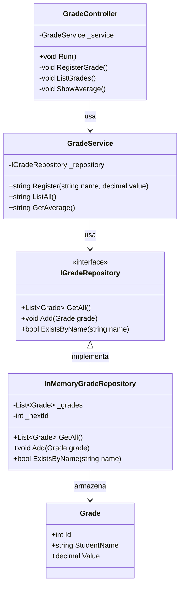
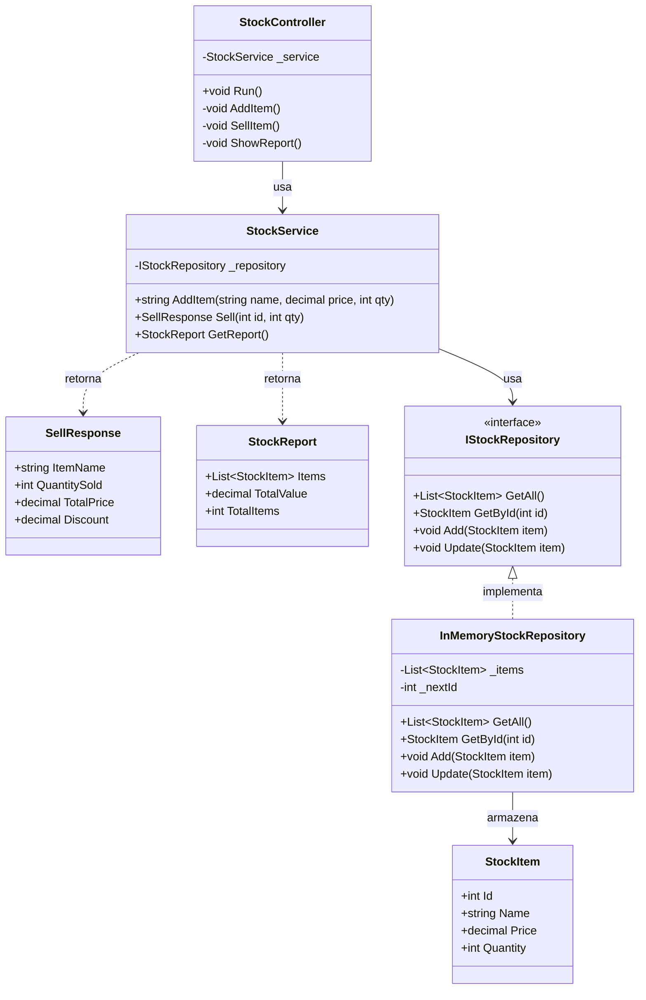
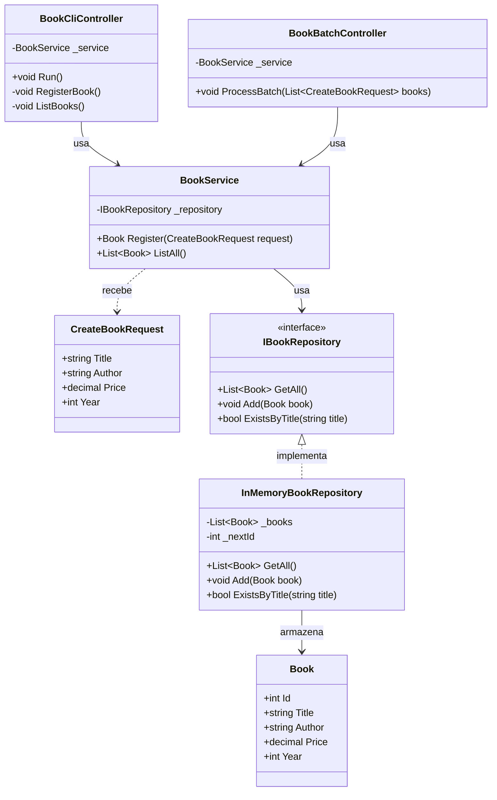
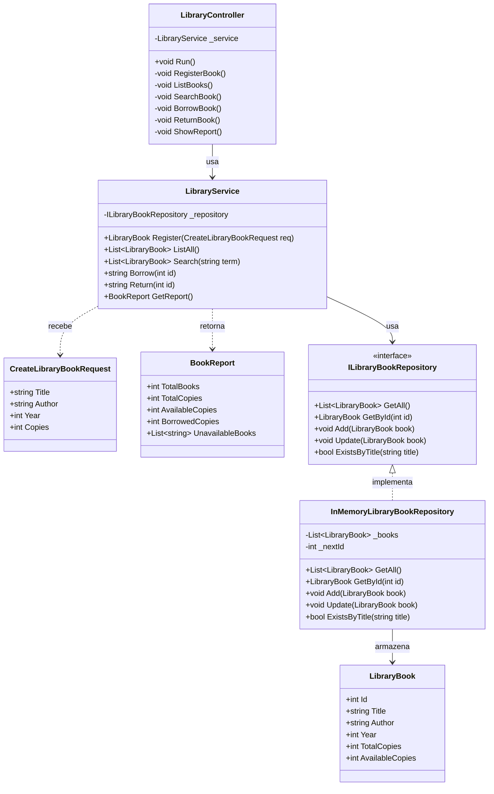

# Exercícios — Módulo 10.6: Controllers e Camada de Entrada

[← Voltar ao Módulo 10.6](cap10-mod06-camada-controller-conteudo.md)

> **Como usar estes exercícios:**
> 1. Leia o enunciado com atenção
> 2. Leia as dicas antes de começar
> 3. Tente resolver sozinho
> 4. Use a Proposta de Teste para verificar se sua solução funciona
> 5. Só depois consulte a Resposta Comentada

> **Como testar cada exercício:**
> 1. Escreva seu código no VSCode
> 2. Salve o arquivo na pasta `~/meus-projetos/curso/cap10/`
> 3. Para projetos C#: `dotnet new console -n NomeExercicio`, cole o código em `Program.cs`
> 4. Execute com `dotnet run`

---

## Exercício 1 — Identificando Violações no Controller — Nível: Básico

### Enunciado

Análise o Controller abaixo. Ele é o Controller de um sistema de notas de alunos, mas tem **vários problemas** — coisas que um Controller não deveria fazer. Identifique cada violação, explique por que está errada e diga em qual camada a responsabilidade deveria ficar.

```csharp
public class GradeController
{
    // Acessa o repositorio diretamente
    private readonly IGradeRepository _repository;
    private List<string> _log = new List<string>(); // log interno

    public GradeController(IGradeRepository repository)
    {
        _repository = repository;
    }

    private void RegisterGrade()
    {
        Console.Write("Nome do aluno: ");
        var studentName = Console.ReadLine();

        Console.Write("Nota (0 a 10): ");
        var value = decimal.Parse(Console.ReadLine());

        // Verifica se a nota e valida
        if (value < 0 || value > 10)
        {
            Console.WriteLine("Nota deve ser entre 0 e 10!");
            return;
        }

        // Verifica se o aluno ja tem nota cadastrada
        if (_repository.ExistsByStudent(studentName))
        {
            Console.WriteLine("Aluno ja tem nota!");
            return;
        }

        // Cria a entidade no Controller
        var grade = new Grade
        {
            StudentName = studentName,
            Value = value,
            CreatedAt = DateTime.Now
        };

        // Salva direto no repositorio
        _repository.Add(grade);

        // Calcula a media da turma
        var all = _repository.GetAll();
        decimal sum = 0;
        foreach (var g in all)
            sum += g.Value;
        decimal average = sum / all.Count;

        // Classifica o aluno
        string classification;
        if (value >= 9) classification = "Excelente";
        else if (value >= 7) classification = "Bom";
        else if (value >= 5) classification = "Regular";
        else classification = "Insuficiente";

        _log.Add($"{DateTime.Now}: {studentName} = {value}");

        Console.WriteLine($"Nota cadastrada! {studentName}: {value} ({classification})");
        Console.WriteLine($"Media da turma: {average:F2}");
    }
}
```

### Dicas

- Releia a tabela "O que o Controller FAZ" e "O que o Controller NÃO FAZ" do módulo 10.6
- Pense: o que aconteceria se quiséssemos usar esse Controller como API HTTP em vez de CLI?
- Conte quantas responsabilidades diferentes esse Controller tem
- Lembre: o Controller deve depender do Service, não do Repository

### Proposta de Teste

- Identifique pelo menos **6 violações** no código
- Para cada violação, indique:
  - Qual linha ou trecho está errado
  - Por que está errado
  - Em qual camada deveria ficar (Service, Domínio ou Repository)

### Resposta Comentada

> **Importante:** Tente resolver sozinho primeiro!

**Violação 1: Controller depende do Repository diretamente**

O campo `_repository` não deveria existir no Controller. O Controller deve depender apenas do **Service**. Ao acessar o Repository diretamente, o Controller pula a camada de lógica de negócio.

**Violação 2: Validação de negócio no Controller**

O trecho `if (value < 0 || value > 10)` é uma regra de negócio — "nota deve ser entre 0 e 10" é uma regra do domínio escolar. Deveria estar no **Service** ou na **entidade Grade** (domínio rico). O Controller deveria apenas validar formato (o texto digitado é um número?).

**Violação 3: Consulta de dados no Controller**

O trecho `_repository.ExistsByStudent(studentName)` é uma verificação que depende de dados existentes. Verificar duplicidade é responsabilidade do **Service**, que coordena a consulta ao Repository e aplica a regra.

**Violação 4: Criação de entidade no Controller**

O trecho `var grade = new Grade { ... }` cria a entidade diretamente no Controller. Quem cria entidades é o **Service** — ele recebe um DTO (ou parâmetros simples), aplica regras e cria a entidade.

**Violação 5: Persistência direta no Controller**

O trecho `_repository.Add(grade)` salva dados diretamente no Repository. Isso deveria ser feito pelo **Service** após aplicar todas as validações.

**Violação 6: Cálculo de negócio no Controller**

O trecho que calcula a média da turma (`sum / all.Count`) é lógica de negócio. Se amanhã a regra de cálculo mudar (média ponderada, por exemplo), teria que mudar no Controller. Deveria ser um método do **Service**: `_service.GetClassAverage()`.

**Violação 7: Classificação de negócio no Controller**

O trecho que classifica o aluno ("Excelente", "Bom", "Regular", "Insuficiente") é uma regra de negócio. Deveria vir do **Service** como parte do DTO de resposta — por exemplo, `response.Classification`.

**Violação 8: Estado interno no Controller**

O campo `_log` mantém estado no Controller. Controllers não devem manter estado entre chamadas. Se precisar de log, use um serviço de logging dedicado.

**Violação 9: `decimal.Parse` sem tratamento**

O `decimal.Parse(Console.ReadLine())` pode lançar exceção se o usuário digitar texto. Deveria usar `decimal.TryParse` para validar o formato antes de prosseguir.

**Resumo das violações:**

| Violacao | Trecho | Camada correta |
|----------|--------|----------------|
| Depende do Repository | `_repository` no construtor | Deveria depender do Service |
| Válida regra de negocio | `value < 0 ou value > 10` | Service ou Dominio |
| Consulta dados | `_repository.ExistsByStudent` | Service |
| Cria entidade | `new Grade { ... }` | Service |
| Persiste dados | `_repository.Add(grade)` | Service via Repository |
| Calcula media | `sum / all.Count` | Service |
| Classifica aluno | `if value >= 9 Excelente` | Service |
| Mantem estado | `_log` | Servico de logging |
| Parse sem proteção | `decimal.Parse` | Usar TryParse |

---

## Exercício 2 — Controller Simples para Sistema de Notas — Nível: Básico

### Enunciado

Crie um sistema completo de notas de alunos com as 3 camadas (Controller, Service, Repository). O Controller deve ser **magro** — apenas lê entrada, válida formato, delega para o Service e exibe resultados.

O sistema deve ter as seguintes funcionalidades:
1. Cadastrar nota (nome do aluno + valor da nota)
2. Listar todas as notas
3. Buscar nota por nome do aluno
4. Exibir média da turma

Use as seguintes classes de apoio:

```csharp
// Entidade de dominio
// "Grade" = Nota
public class Grade
{
    public int Id { get; set; }
    public string StudentName { get; set; }  // "StudentName" = nome do aluno
    public decimal Value { get; set; }       // "Value" = valor da nota
    public DateTime CreatedAt { get; set; }  // "CreatedAt" = data de criacao
}

// Interface do repositorio
public interface IGradeRepository
{
    List<Grade> GetAll();
    Grade GetByStudent(string studentName);
    void Add(Grade grade);
    bool ExistsByStudent(string studentName);
}
```

O Controller deve ter um menu com as 4 opções e a opção de sair.

### Dicas

- Crie primeiro o `GradeService` com as regras de negócio (nota entre 0 e 10, nome não vazio, nome não duplicado)
- O Controller só válida formato: o texto digitado é um número?
- O Controller nunca acessa o Repository — só conhece o Service
- Use `decimal.TryParse` para validar formato numérico
- Para a média, crie um método no Service que retorna o valor calculado

### Proposta de Teste

- Cadastre 3 notas: "Ana" com 8.5, "Bruno" com 6.0, "Carla" com 9.5
- Liste todas e verifique se aparecem as 3
- Busque por "Ana" e verifique se retorna 8.5
- Verifique se a média é 8.0
- Tente cadastrar "Ana" novamente — deve dar erro de duplicidade
- Tente digitar "abc" como nota — deve dar erro de formato

### Resposta Comentada

> **Importante:** Tente resolver sozinho primeiro!

```csharp
// === Programa completo: Sistema de Notas com 3 camadas ===

// --- Entidade ---
// "Grade" = Nota
public class Grade
{
    public int Id { get; set; }
    public string StudentName { get; set; }  // "StudentName" = nome do aluno
    public decimal Value { get; set; }       // "Value" = valor da nota
    public DateTime CreatedAt { get; set; }  // "CreatedAt" = data de criacao
}

// --- Interface do Repository ---
public interface IGradeRepository
{
    List<Grade> GetAll();
    Grade GetByStudent(string studentName);
    void Add(Grade grade);
    bool ExistsByStudent(string studentName);
}

// --- Implementacao em memoria ---
// "InMemoryGradeRepository" = repositorio de notas em memoria
public class InMemoryGradeRepository : IGradeRepository
{
    private List<Grade> _grades = new List<Grade>();
    private int _nextId = 1;

    public List<Grade> GetAll() => new List<Grade>(_grades);

    public Grade GetByStudent(string studentName)
    {
        foreach (var g in _grades)
            if (g.StudentName.Equals(studentName,
                StringComparison.OrdinalIgnoreCase))
                return g;
        return null;
    }

    public void Add(Grade grade)
    {
        grade.Id = _nextId++;
        _grades.Add(grade);
    }

    public bool ExistsByStudent(string studentName)
    {
        foreach (var g in _grades)
            if (g.StudentName.Equals(studentName,
                StringComparison.OrdinalIgnoreCase))
                return true;
        return false;
    }
}

// --- Service ---
// "GradeService" = servico de notas
public class GradeService
{
    private readonly IGradeRepository _repository;

    public GradeService(IGradeRepository repository)
    {
        _repository = repository;
    }

    // Cadastrar nota — regras de negocio aqui
    // "Register" = cadastrar
    public Grade Register(string studentName, decimal value)
    {
        // Regra 1: nome nao pode ser vazio
        if (string.IsNullOrWhiteSpace(studentName))
            throw new ArgumentException("Nome do aluno nao pode ser vazio.");

        // Regra 2: nota deve ser entre 0 e 10
        if (value < 0 || value > 10)
            throw new ArgumentException("Nota deve ser entre 0 e 10.");

        // Regra 3: aluno nao pode ter nota duplicada
        if (_repository.ExistsByStudent(studentName))
            throw new InvalidOperationException(
                $"Aluno '{studentName}' ja tem nota cadastrada.");

        var grade = new Grade
        {
            StudentName = studentName,
            Value = value,
            CreatedAt = DateTime.Now
        };

        _repository.Add(grade);
        return grade;
    }

    // Listar todas as notas
    public List<Grade> ListAll()
    {
        return _repository.GetAll();
    }

    // Buscar por nome do aluno
    // "FindByStudent" = buscar por aluno
    public Grade FindByStudent(string studentName)
    {
        var grade = _repository.GetByStudent(studentName);
        if (grade == null)
            throw new KeyNotFoundException(
                $"Nenhuma nota encontrada para '{studentName}'.");
        return grade;
    }

    // Calcular media da turma
    // "GetAverage" = obter media
    public decimal GetAverage()
    {
        var grades = _repository.GetAll();
        if (grades.Count == 0)
            throw new InvalidOperationException("Nenhuma nota cadastrada.");

        decimal sum = 0;
        foreach (var g in grades)
            sum += g.Value;
        return sum / grades.Count;
    }
}

// --- Controller MAGRO ---
// "GradeController" = controlador de notas
public class GradeController
{
    // Depende APENAS do Service
    private readonly GradeService _service;

    public GradeController(GradeService service)
    {
        _service = service;
    }

    // Menu principal
    public void Run()
    {
        Console.WriteLine("=== Sistema de Notas ===\n");

        while (true)
        {
            Console.WriteLine("--- Menu ---");
            Console.WriteLine("1. Cadastrar nota");
            Console.WriteLine("2. Listar notas");
            Console.WriteLine("3. Buscar por aluno");
            Console.WriteLine("4. Media da turma");
            Console.WriteLine("0. Sair");
            Console.Write("Opcao: ");

            var option = Console.ReadLine();

            switch (option)
            {
                case "1": RegisterGrade(); break;
                case "2": ListGrades(); break;
                case "3": FindGrade(); break;
                case "4": ShowAverage(); break;
                case "0":
                    Console.WriteLine("Ate logo!");
                    return;
                default:
                    Console.WriteLine("Opcao invalida.\n");
                    break;
            }
        }
    }

    // Cadastrar — valida FORMATO, delega NEGOCIO para o Service
    private void RegisterGrade()
    {
        Console.Write("\nNome do aluno: ");
        var name = Console.ReadLine();

        // Validacao de FORMATO: o texto e um numero?
        Console.Write("Nota (0 a 10): ");
        if (!decimal.TryParse(Console.ReadLine(), out decimal value))
        {
            Console.WriteLine("Valor invalido. Digite um numero.\n");
            return;
        }

        // Delega para o Service
        try
        {
            var grade = _service.Register(name, value);
            Console.WriteLine(
                $"\nNota cadastrada! {grade.StudentName}: {grade.Value}\n");
        }
        catch (Exception ex)
        {
            Console.WriteLine($"\nErro: {ex.Message}\n");
        }
    }

    // Listar — chama Service e formata saida
    private void ListGrades()
    {
        var grades = _service.ListAll();

        if (grades.Count == 0)
        {
            Console.WriteLine("\nNenhuma nota cadastrada.\n");
            return;
        }

        Console.WriteLine($"\n--- {grades.Count} nota(s) ---");
        foreach (var g in grades)
        {
            Console.WriteLine(
                $"  [{g.Id}] {g.StudentName}: {g.Value:F1}");
        }
        Console.WriteLine();
    }

    // Buscar — valida formato, delega, exibe
    private void FindGrade()
    {
        Console.Write("\nNome do aluno: ");
        var name = Console.ReadLine();

        try
        {
            var grade = _service.FindByStudent(name);
            Console.WriteLine(
                $"\n  {grade.StudentName}: {grade.Value:F1}" +
                $" (cadastrada em {grade.CreatedAt:dd/MM/yyyy})\n");
        }
        catch (Exception ex)
        {
            Console.WriteLine($"\nErro: {ex.Message}\n");
        }
    }

    // Media — chama Service e exibe
    private void ShowAverage()
    {
        try
        {
            var average = _service.GetAverage();
            Console.WriteLine($"\nMedia da turma: {average:F2}\n");
        }
        catch (Exception ex)
        {
            Console.WriteLine($"\nErro: {ex.Message}\n");
        }
    }
}

// === Program.cs — Composicao ===
IGradeRepository repository = new InMemoryGradeRepository();
var service = new GradeService(repository);
var controller = new GradeController(service);
controller.Run();
```

Saída esperada:
```
=== Sistema de Notas ===

--- Menu ---
1. Cadastrar nota
2. Listar notas
3. Buscar por aluno
4. Media da turma
0. Sair
Opcao: 1

Nome do aluno: Ana
Nota (0 a 10): 8.5

Nota cadastrada! Ana: 8.5
```

Observe como o Controller e magro: cada método tem poucas linhas. Ele le entrada, válida formato (TryParse), chama o Service (uma linha) e exibe o resultado. Toda a lógica de negocio (nota entre 0 e 10, nome duplicado, cálculo de media) esta no Service.

Diagrama de classes do sistema de notas:



---

## Exercício 3 — Refatorando um Controller Gordo — Nível: Intermediário

### Enunciado

O código abaixo é um Controller **gordo** de um sistema de estoque. Ele faz tudo: lê entrada, válida regras de negócio, acessa o repositório, calcula valores e formata saída. Sua tarefa é refatorar para a arquitetura correta em 3 camadas: Controller magro, Service com regras de negócio e Repository para dados.

```csharp
// === CONTROLLER GORDO — PRECISA SER REFATORADO ===

public class StockController
{
    private List<StockItem> _items = new List<StockItem>();
    private int _nextId = 1;

    public void Run()
    {
        while (true)
        {
            Console.WriteLine("1. Adicionar item  2. Vender  3. Relatorio  0. Sair");
            Console.Write("Opcao: ");
            var option = Console.ReadLine();

            switch (option)
            {
                case "1": AddItem(); break;
                case "2": SellItem(); break;
                case "3": Report(); break;
                case "0": return;
            }
        }
    }

    private void AddItem()
    {
        Console.Write("Nome: ");
        var name = Console.ReadLine();

        Console.Write("Preco unitario: ");
        var price = decimal.Parse(Console.ReadLine());

        Console.Write("Quantidade: ");
        var quantity = int.Parse(Console.ReadLine());

        // Regra de negocio no Controller
        if (price <= 0)
        {
            Console.WriteLine("Preco deve ser positivo!");
            return;
        }
        if (quantity <= 0)
        {
            Console.WriteLine("Quantidade deve ser positiva!");
            return;
        }

        // Verifica duplicidade no Controller
        foreach (var item in _items)
        {
            if (item.Name.ToLower() == name.ToLower())
            {
                Console.WriteLine("Item ja existe! Somando ao estoque.");
                item.Quantity += quantity;
                return;
            }
        }

        // Cria entidade e persiste no Controller
        var newItem = new StockItem
        {
            Id = _nextId++,
            Name = name,
            Price = price,
            Quantity = quantity
        };
        _items.Add(newItem);
        Console.WriteLine($"Item adicionado! ID: {newItem.Id}");
    }

    private void SellItem()
    {
        Console.Write("ID do item: ");
        var id = int.Parse(Console.ReadLine());

        Console.Write("Quantidade a vender: ");
        var qty = int.Parse(Console.ReadLine());

        // Busca no Controller
        StockItem found = null;
        foreach (var item in _items)
        {
            if (item.Id == id) { found = item; break; }
        }

        if (found == null)
        {
            Console.WriteLine("Item nao encontrado!");
            return;
        }

        // Regra de negocio no Controller
        if (qty > found.Quantity)
        {
            Console.WriteLine("Estoque insuficiente!");
            return;
        }

        found.Quantity -= qty;

        // Calculo de negocio no Controller
        decimal total = found.Price * qty;
        decimal discount = qty >= 10 ? total * 0.1m : 0;
        decimal finalPrice = total - discount;

        Console.WriteLine($"Venda realizada! Total: R${finalPrice:F2}");
        if (discount > 0)
            Console.WriteLine($"  Desconto de 10%: -R${discount:F2}");
    }

    private void Report()
    {
        if (_items.Count == 0)
        {
            Console.WriteLine("Estoque vazio.");
            return;
        }

        // Calculo de negocio no Controller
        decimal totalValue = 0;
        int totalItems = 0;
        int lowStock = 0;

        foreach (var item in _items)
        {
            totalValue += item.Price * item.Quantity;
            totalItems += item.Quantity;
            if (item.Quantity < 5) lowStock++;

            Console.WriteLine(
                $"  [{item.Id}] {item.Name} — R${item.Price:F2}" +
                $" x {item.Quantity} = R${(item.Price * item.Quantity):F2}");
        }

        Console.WriteLine($"\nTotal em estoque: {totalItems} unidades");
        Console.WriteLine($"Valor total: R${totalValue:F2}");
        Console.WriteLine($"Itens com estoque baixo (<5): {lowStock}");
    }
}

public class StockItem
{
    public int Id { get; set; }
    public string Name { get; set; }
    public decimal Price { get; set; }
    public int Quantity { get; set; }
}
```

### Dicas

- Crie uma interface `IStockRepository` com os métodos necessários (GetAll, GetById, Add, Update, ExistsByName)
- Crie um `InMemoryStockRepository` que implementa a interface
- Crie um `StockService` com os métodos: `AddItem`, `Sell`, `GetReport`
- O Service deve conter TODAS as regras: preço positivo, quantidade positiva, duplicidade, estoque suficiente, cálculo de desconto, cálculo de relatório
- O Controller refatorado deve ter apenas: leitura de entrada, TryParse, chamada ao Service, exibição de resultado
- Crie DTOs se necessário: `SellResponse` com total, desconto e preço final; `StockReport` com totais

### Proposta de Teste

- O Controller refatorado não deve ter nenhum `if` de regra de negócio
- O Controller não deve ter referência ao Repository
- O Controller não deve fazer nenhum cálculo (desconto, total, contagem)
- Cada método do Controller deve ter no máximo 15-20 linhas
- O Service deve ter pelo menos 3 métodos públicos
- Teste: adicionar item, vender com desconto (10+ unidades), gerar relatório

### Resposta Comentada

> **Importante:** Tente resolver sozinho primeiro!

```csharp
// === VERSAO REFATORADA — 3 camadas corretas ===

// --- Entidade ---
// "StockItem" = item de estoque
public class StockItem
{
    public int Id { get; set; }
    public string Name { get; set; }       // "Name" = nome
    public decimal Price { get; set; }     // "Price" = preco unitario
    public int Quantity { get; set; }      // "Quantity" = quantidade
}

// --- DTOs ---
// "SellResponse" = resposta de venda
public class SellResponse
{
    public string ItemName { get; set; }
    public int QuantitySold { get; set; }  // "QuantitySold" = quantidade vendida
    public decimal Total { get; set; }     // "Total" = total bruto
    public decimal Discount { get; set; }  // "Discount" = desconto
    public decimal FinalPrice { get; set; } // "FinalPrice" = preco final
}

// "StockReport" = relatorio de estoque
public class StockReport
{
    public List<StockItem> Items { get; set; }
    public int TotalUnits { get; set; }       // "TotalUnits" = total de unidades
    public decimal TotalValue { get; set; }   // "TotalValue" = valor total
    public int LowStockCount { get; set; }    // "LowStockCount" = itens com estoque baixo
}

// --- Interface do Repository ---
public interface IStockRepository
{
    List<StockItem> GetAll();
    StockItem GetById(int id);
    StockItem GetByName(string name);
    void Add(StockItem item);
    void Update(StockItem item);
    bool ExistsByName(string name);
}

// --- Repository em memoria ---
// "InMemoryStockRepository" = repositorio de estoque em memoria
public class InMemoryStockRepository : IStockRepository
{
    private List<StockItem> _items = new List<StockItem>();
    private int _nextId = 1;

    public List<StockItem> GetAll() => new List<StockItem>(_items);

    public StockItem GetById(int id)
    {
        foreach (var item in _items)
            if (item.Id == id) return item;
        return null;
    }

    public StockItem GetByName(string name)
    {
        foreach (var item in _items)
            if (item.Name.Equals(name, StringComparison.OrdinalIgnoreCase))
                return item;
        return null;
    }

    public void Add(StockItem item)
    {
        item.Id = _nextId++;
        _items.Add(item);
    }

    public void Update(StockItem item)
    {
        for (int i = 0; i < _items.Count; i++)
            if (_items[i].Id == item.Id) { _items[i] = item; return; }
    }

    public bool ExistsByName(string name)
    {
        foreach (var item in _items)
            if (item.Name.Equals(name, StringComparison.OrdinalIgnoreCase))
                return true;
        return false;
    }
}

// --- Service com TODAS as regras ---
// "StockService" = servico de estoque
public class StockService
{
    private readonly IStockRepository _repository;

    public StockService(IStockRepository repository)
    {
        _repository = repository;
    }

    // Adicionar item ao estoque
    public StockItem AddItem(string name, decimal price, int quantity)
    {
        // Regra: preco deve ser positivo
        if (price <= 0)
            throw new ArgumentException("Preco deve ser positivo.");

        // Regra: quantidade deve ser positiva
        if (quantity <= 0)
            throw new ArgumentException("Quantidade deve ser positiva.");

        // Regra: se ja existe, soma ao estoque
        var existing = _repository.GetByName(name);
        if (existing != null)
        {
            existing.Quantity += quantity;
            _repository.Update(existing);
            return existing;
        }

        // Cria novo item
        var item = new StockItem
        {
            Name = name,
            Price = price,
            Quantity = quantity
        };
        _repository.Add(item);
        return item;
    }

    // Vender item
    // "Sell" = vender
    public SellResponse Sell(int itemId, int quantity)
    {
        var item = _repository.GetById(itemId);
        if (item == null)
            throw new KeyNotFoundException("Item nao encontrado.");

        if (quantity <= 0)
            throw new ArgumentException("Quantidade deve ser positiva.");

        // Regra: estoque suficiente
        if (quantity > item.Quantity)
            throw new InvalidOperationException(
                $"Estoque insuficiente. Disponivel: {item.Quantity}.");

        // Regra: desconto de 10% para 10+ unidades
        decimal total = item.Price * quantity;
        decimal discount = quantity >= 10 ? total * 0.1m : 0;

        item.Quantity -= quantity;
        _repository.Update(item);

        return new SellResponse
        {
            ItemName = item.Name,
            QuantitySold = quantity,
            Total = total,
            Discount = discount,
            FinalPrice = total - discount
        };
    }

    // Gerar relatorio
    // "GetReport" = obter relatorio
    public StockReport GetReport()
    {
        var items = _repository.GetAll();
        int totalUnits = 0;
        decimal totalValue = 0;
        int lowStock = 0;

        foreach (var item in items)
        {
            totalUnits += item.Quantity;
            totalValue += item.Price * item.Quantity;
            if (item.Quantity < 5) lowStock++;
        }

        return new StockReport
        {
            Items = items,
            TotalUnits = totalUnits,
            TotalValue = totalValue,
            LowStockCount = lowStock
        };
    }
}

// --- Controller MAGRO ---
// "StockController" = controlador de estoque
public class StockController
{
    private readonly StockService _service;

    public StockController(StockService service)
    {
        _service = service;
    }

    public void Run()
    {
        while (true)
        {
            Console.WriteLine("1. Adicionar item  2. Vender  3. Relatorio  0. Sair");
            Console.Write("Opcao: ");
            var option = Console.ReadLine();

            switch (option)
            {
                case "1": AddItem(); break;
                case "2": SellItem(); break;
                case "3": Report(); break;
                case "0": return;
            }
        }
    }

    // Magro: le entrada, valida formato, delega, exibe
    private void AddItem()
    {
        Console.Write("Nome: ");
        var name = Console.ReadLine();

        Console.Write("Preco unitario: ");
        if (!decimal.TryParse(Console.ReadLine(), out decimal price))
        {
            Console.WriteLine("Valor invalido.\n");
            return;
        }

        Console.Write("Quantidade: ");
        if (!int.TryParse(Console.ReadLine(), out int quantity))
        {
            Console.WriteLine("Valor invalido.\n");
            return;
        }

        try
        {
            var item = _service.AddItem(name, price, quantity);
            Console.WriteLine($"OK! [{item.Id}] {item.Name} — Estoque: {item.Quantity}\n");
        }
        catch (Exception ex)
        {
            Console.WriteLine($"Erro: {ex.Message}\n");
        }
    }

    // Magro: le entrada, valida formato, delega, exibe
    private void SellItem()
    {
        Console.Write("ID do item: ");
        if (!int.TryParse(Console.ReadLine(), out int id))
        {
            Console.WriteLine("ID invalido.\n");
            return;
        }

        Console.Write("Quantidade: ");
        if (!int.TryParse(Console.ReadLine(), out int qty))
        {
            Console.WriteLine("Valor invalido.\n");
            return;
        }

        try
        {
            var result = _service.Sell(id, qty);
            Console.WriteLine($"Venda: {result.ItemName} x {result.QuantitySold}");
            Console.WriteLine($"  Total: R${result.FinalPrice:F2}");
            if (result.Discount > 0)
                Console.WriteLine($"  Desconto: -R${result.Discount:F2}");
            Console.WriteLine();
        }
        catch (Exception ex)
        {
            Console.WriteLine($"Erro: {ex.Message}\n");
        }
    }

    // Magro: chama Service e formata saida
    private void Report()
    {
        var report = _service.GetReport();

        if (report.Items.Count == 0)
        {
            Console.WriteLine("Estoque vazio.\n");
            return;
        }

        Console.WriteLine("\n--- Relatorio de Estoque ---");
        foreach (var item in report.Items)
        {
            Console.WriteLine(
                $"  [{item.Id}] {item.Name} — R${item.Price:F2}" +
                $" x {item.Quantity}");
        }
        Console.WriteLine($"\nTotal: {report.TotalUnits} unidades");
        Console.WriteLine($"Valor: R${report.TotalValue:F2}");
        Console.WriteLine($"Estoque baixo (<5): {report.LowStockCount}\n");
    }
}

// === Program.cs ===
IStockRepository repository = new InMemoryStockRepository();
var service = new StockService(repository);
var controller = new StockController(service);
controller.Run();
```

Saída esperada:
```
1. Adicionar item  2. Vender  3. Relatorio  0. Sair
Opcao: 1
Nome: Caneta
Preco unitario: 2.50
Quantidade: 100
OK! [1] Caneta — Estoque: 100

1. Adicionar item  2. Vender  3. Relatorio  0. Sair
Opcao: 2
ID do item: 1
Quantidade: 15
Venda: Caneta x 15
  Total: R$33.75
  Desconto: -R$3.75
```

Compare o Controller gordo original com o refatorado. O Controller gordo tinha regras de negocio, cálculos, acesso a dados e formatacao tudo misturado. O Controller magro tem apenas leitura de entrada, TryParse, uma chamada ao Service e exibicao do resultado. Toda a inteligência migrou para o Service.

Diagrama de classes do sistema de estoque refatorado:



---

## Exercício 4 — Validação de Formato vs Validação de Negócio — Nível: Intermediário

### Enunciado

Crie um sistema de cadastro de funcionários com separação clara entre validação de formato (Controller) e validação de negócio (Service). O sistema deve cadastrar funcionários com: nome, email, salário e departamento.

**Validações de FORMATO (Controller):**
- Nome foi preenchido? (não está vazio)
- Salário é um número válido? (não é texto)
- Email tem formato básico? (contém "@")

**Validações de NEGÓCIO (Service):**
- Nome deve ter pelo menos 3 caracteres
- Email não pode ser duplicado
- Salário deve ser pelo menos R$ 1.412,00 (salário mínimo)
- Salário não pode exceder R$ 50.000,00
- Departamento deve ser um dos válidos: "TI", "RH", "Financeiro", "Comercial"

Crie o sistema completo com Controller, Service e Repository. O Controller deve ter um menu com: cadastrar, listar e buscar por email.

### Dicas

- No Controller, use `string.IsNullOrWhiteSpace` para verificar se o campo foi preenchido
- No Controller, use `decimal.TryParse` para verificar se o salário é número
- No Controller, use `name.Contains("@")` para verificar formato básico de email
- No Service, use exceções com mensagens claras para cada regra violada
- Crie um DTO `CreateEmployeeRequest` para passar dados do Controller ao Service

### Proposta de Teste

Teste estes cenários e verifique se o erro vem do Controller (formato) ou do Service (negócio):

| Cenário | Entrada | Quem rejeita | Mensagem esperada |
|---------|---------|-------------|-------------------|
| Nome vazio | "" | Controller | "Nome e obrigatório" |
| Salario texto | "abc" | Controller | "Salario deve ser um número" |
| Email sem @ | "joao" | Controller | "Email deve conter @" |
| Nome curto | "Jo" | Service | "Nome deve ter pelo menos 3 caracteres" |
| Salario baixo | 1000 | Service | "Salario mínimo e R$ 1.412,00" |
| Depto inválido | "Vendas" | Service | "Departamento inválido" |
| Email duplicado | repetido | Service | "Email ja cadastrado" |

### Resposta Comentada

> **Importante:** Tente resolver sozinho primeiro!

```csharp
// === Sistema de Funcionarios — Formato vs Negocio ===

// --- Entidade ---
// "Employee" = Funcionario
public class Employee
{
    public int Id { get; set; }
    public string Name { get; set; }          // "Name" = nome
    public string Email { get; set; }         // "Email" = email
    public decimal Salary { get; set; }       // "Salary" = salario
    public string Department { get; set; }    // "Department" = departamento
    public DateTime HiredAt { get; set; }     // "HiredAt" = data de contratacao
}

// --- DTO ---
// "CreateEmployeeRequest" = requisicao de criacao de funcionario
public class CreateEmployeeRequest
{
    public string Name { get; set; }
    public string Email { get; set; }
    public decimal Salary { get; set; }
    public string Department { get; set; }
}

// --- Interface do Repository ---
public interface IEmployeeRepository
{
    List<Employee> GetAll();
    Employee GetByEmail(string email);
    void Add(Employee employee);
    bool ExistsByEmail(string email);
}

// --- Repository em memoria ---
public class InMemoryEmployeeRepository : IEmployeeRepository
{
    private List<Employee> _employees = new List<Employee>();
    private int _nextId = 1;

    public List<Employee> GetAll() => new List<Employee>(_employees);

    public Employee GetByEmail(string email)
    {
        foreach (var e in _employees)
            if (e.Email.Equals(email, StringComparison.OrdinalIgnoreCase))
                return e;
        return null;
    }

    public void Add(Employee employee)
    {
        employee.Id = _nextId++;
        _employees.Add(employee);
    }

    public bool ExistsByEmail(string email)
    {
        foreach (var e in _employees)
            if (e.Email.Equals(email, StringComparison.OrdinalIgnoreCase))
                return true;
        return false;
    }
}

// --- Service com regras de NEGOCIO ---
// "EmployeeService" = servico de funcionarios
public class EmployeeService
{
    private readonly IEmployeeRepository _repository;

    // Departamentos validos
    private readonly string[] _validDepartments =
        { "TI", "RH", "Financeiro", "Comercial" };

    public EmployeeService(IEmployeeRepository repository)
    {
        _repository = repository;
    }

    public Employee Register(CreateEmployeeRequest request)
    {
        // Regra: nome deve ter pelo menos 3 caracteres
        if (request.Name.Length < 3)
            throw new ArgumentException(
                "Nome deve ter pelo menos 3 caracteres.");

        // Regra: email nao pode ser duplicado
        if (_repository.ExistsByEmail(request.Email))
            throw new InvalidOperationException(
                $"Email '{request.Email}' ja cadastrado.");

        // Regra: salario minimo
        if (request.Salary < 1412.00m)
            throw new ArgumentException(
                "Salario minimo e R$ 1.412,00.");

        // Regra: salario maximo
        if (request.Salary > 50000.00m)
            throw new ArgumentException(
                "Salario nao pode exceder R$ 50.000,00.");

        // Regra: departamento valido
        bool validDept = false;
        foreach (var dept in _validDepartments)
        {
            if (dept.Equals(request.Department,
                StringComparison.OrdinalIgnoreCase))
            {
                validDept = true;
                break;
            }
        }
        if (!validDept)
            throw new ArgumentException(
                $"Departamento invalido. Validos: " +
                string.Join(", ", _validDepartments));

        var employee = new Employee
        {
            Name = request.Name,
            Email = request.Email,
            Salary = request.Salary,
            Department = request.Department,
            HiredAt = DateTime.Now
        };

        _repository.Add(employee);
        return employee;
    }

    public List<Employee> ListAll() => _repository.GetAll();

    public Employee FindByEmail(string email)
    {
        var employee = _repository.GetByEmail(email);
        if (employee == null)
            throw new KeyNotFoundException(
                $"Funcionario com email '{email}' nao encontrado.");
        return employee;
    }
}

// --- Controller com validacao de FORMATO ---
// "EmployeeController" = controlador de funcionarios
public class EmployeeController
{
    private readonly EmployeeService _service;

    public EmployeeController(EmployeeService service)
    {
        _service = service;
    }

    public void Run()
    {
        Console.WriteLine("=== Sistema de Funcionarios ===\n");

        while (true)
        {
            Console.WriteLine("1. Cadastrar  2. Listar  3. Buscar por email  0. Sair");
            Console.Write("Opcao: ");
            var option = Console.ReadLine();

            switch (option)
            {
                case "1": Register(); break;
                case "2": ListAll(); break;
                case "3": FindByEmail(); break;
                case "0": return;
                default: Console.WriteLine("Opcao invalida.\n"); break;
            }
        }
    }

    private void Register()
    {
        // --- Validacoes de FORMATO (Controller) ---

        Console.Write("\nNome: ");
        var name = Console.ReadLine();
        // Formato: campo preenchido?
        if (string.IsNullOrWhiteSpace(name))
        {
            Console.WriteLine("Nome e obrigatorio.\n");
            return;
        }

        Console.Write("Email: ");
        var email = Console.ReadLine();
        // Formato: tem @?
        if (string.IsNullOrWhiteSpace(email) || !email.Contains("@"))
        {
            Console.WriteLine("Email deve conter @.\n");
            return;
        }

        Console.Write("Salario: ");
        // Formato: e um numero?
        if (!decimal.TryParse(Console.ReadLine(), out decimal salary))
        {
            Console.WriteLine("Salario deve ser um numero.\n");
            return;
        }

        Console.Write("Departamento (TI, RH, Financeiro, Comercial): ");
        var department = Console.ReadLine();

        // --- Delega para o Service (regras de NEGOCIO) ---
        try
        {
            var request = new CreateEmployeeRequest
            {
                Name = name,
                Email = email,
                Salary = salary,
                Department = department
            };

            var employee = _service.Register(request);
            Console.WriteLine($"\nCadastrado! [{employee.Id}] {employee.Name}" +
                $" — {employee.Department} — R${employee.Salary:F2}\n");
        }
        catch (Exception ex)
        {
            Console.WriteLine($"\nErro: {ex.Message}\n");
        }
    }

    private void ListAll()
    {
        var employees = _service.ListAll();
        if (employees.Count == 0)
        {
            Console.WriteLine("\nNenhum funcionario cadastrado.\n");
            return;
        }

        Console.WriteLine($"\n--- {employees.Count} funcionario(s) ---");
        foreach (var e in employees)
        {
            Console.WriteLine(
                $"  [{e.Id}] {e.Name} — {e.Email}" +
                $" — {e.Department} — R${e.Salary:F2}");
        }
        Console.WriteLine();
    }

    private void FindByEmail()
    {
        Console.Write("\nEmail: ");
        var email = Console.ReadLine();

        try
        {
            var e = _service.FindByEmail(email);
            Console.WriteLine($"\n  Nome: {e.Name}");
            Console.WriteLine($"  Email: {e.Email}");
            Console.WriteLine($"  Departamento: {e.Department}");
            Console.WriteLine($"  Salario: R${e.Salary:F2}");
            Console.WriteLine($"  Contratado em: {e.HiredAt:dd/MM/yyyy}\n");
        }
        catch (Exception ex)
        {
            Console.WriteLine($"\nErro: {ex.Message}\n");
        }
    }
}

// === Program.cs ===
IEmployeeRepository repository = new InMemoryEmployeeRepository();
var service = new EmployeeService(repository);
var controller = new EmployeeController(service);
controller.Run();
```

Saída esperada (validação de formato):
```
Nome:
Nome e obrigatorio.

Email: joao
Email deve conter @.

Salario: abc
Salario deve ser um numero.
```

Saída esperada (validação de negócio):
```
Nome: Jo
Email: jo@email.com
Salario: 5000
Departamento: TI

Erro: Nome deve ter pelo menos 3 caracteres.
```

A separacao e clara: o Controller rejeita dados que nem são validos como formato (campo vazio, texto onde deveria ser número, email sem @). O Service rejeita dados que violam regras de negocio (nome curto, salario abaixo do mínimo, departamento inválido). Cada camada cuida do que e sua responsabilidade.

---

## Exercício 5 — Dois Controllers para o Mesmo Service — Nível: Avançado

### Enunciado

Crie um sistema de cadastro de livros com **dois Controllers diferentes** que usam o **mesmo Service**:

1. **Controller CLI (menu interativo)** — o usuário interage pelo terminal, cadastrando e listando livros um a um
2. **Controller Batch (processamento em lote)** — recebe uma lista de livros e processa todos de uma vez, gerando um relatório de sucesso/erro

O objetivo é demonstrar que a troca de interface (CLI vs Batch) **não afeta a lógica de negócio** — o Service é o mesmo.

O sistema deve ter:
- Entidade `Book` com: Id, Title, Author, Price, Year
- Regras de negócio no Service: título não vazio, preço positivo, ano entre 1450 e o ano atual, título não duplicado
- Controller CLI com menu: cadastrar, listar, sair
- Controller Batch que recebe `List<CreateBookRequest>` e processa todos, exibindo quantos foram cadastrados e quantos falharam

No `Program.cs`, o usuário escolhe o modo: `--cli` para interativo ou `--batch` para lote.

### Dicas

- Crie o Service primeiro — ele é compartilhado entre os dois Controllers
- O Controller CLI lê entrada com `Console.ReadLine` e válida formato com `TryParse`
- O Controller Batch percorre a lista com `foreach`, chama o Service para cada item e conta sucessos/erros
- Ambos os Controllers recebem o **mesmo** `BookService` pelo construtor
- No `Program.cs`, crie um único Repository e um único Service, e passe para ambos os Controllers

### Proposta de Teste

1. Execute no modo batch com 5 livros (incluindo 1 com título duplicado e 1 com preço negativo)
2. Verifique que o batch reporta 3 sucessos e 2 erros
3. Execute no modo CLI e liste os livros — os 3 do batch devem aparecer
4. Cadastre mais 1 pelo CLI e liste novamente — agora devem ser 4
5. Isso prova que ambos os Controllers usam o mesmo Service e Repository

### Resposta Comentada

> **Importante:** Tente resolver sozinho primeiro!

```csharp
// === Sistema de Livros — Dois Controllers, Um Service ===

// --- Entidade ---
// "Book" = Livro
public class Book
{
    public int Id { get; set; }
    public string Title { get; set; }    // "Title" = titulo
    public string Author { get; set; }   // "Author" = autor
    public decimal Price { get; set; }   // "Price" = preco
    public int Year { get; set; }        // "Year" = ano de publicacao
}

// --- DTO ---
// "CreateBookRequest" = requisicao de criacao de livro
public class CreateBookRequest
{
    public string Title { get; set; }
    public string Author { get; set; }
    public decimal Price { get; set; }
    public int Year { get; set; }
}

// --- Interface do Repository ---
public interface IBookRepository
{
    List<Book> GetAll();
    void Add(Book book);
    bool ExistsByTitle(string title);
}

// --- Repository em memoria ---
public class InMemoryBookRepository : IBookRepository
{
    private List<Book> _books = new List<Book>();
    private int _nextId = 1;

    public List<Book> GetAll() => new List<Book>(_books);

    public void Add(Book book)
    {
        book.Id = _nextId++;
        _books.Add(book);
    }

    public bool ExistsByTitle(string title)
    {
        foreach (var b in _books)
            if (b.Title.Equals(title, StringComparison.OrdinalIgnoreCase))
                return true;
        return false;
    }
}

// --- Service UNICO — compartilhado entre os dois Controllers ---
// "BookService" = servico de livros
public class BookService
{
    private readonly IBookRepository _repository;

    public BookService(IBookRepository repository)
    {
        _repository = repository;
    }

    public Book Register(CreateBookRequest request)
    {
        // Regra: titulo nao pode ser vazio
        if (string.IsNullOrWhiteSpace(request.Title))
            throw new ArgumentException("Titulo nao pode ser vazio.");

        // Regra: preco deve ser positivo
        if (request.Price <= 0)
            throw new ArgumentException("Preco deve ser positivo.");

        // Regra: ano valido (entre 1450 — invencao da prensa — e o ano atual)
        if (request.Year < 1450 || request.Year > DateTime.Now.Year)
            throw new ArgumentException(
                $"Ano deve ser entre 1450 e {DateTime.Now.Year}.");

        // Regra: titulo nao pode ser duplicado
        if (_repository.ExistsByTitle(request.Title))
            throw new InvalidOperationException(
                $"Livro '{request.Title}' ja cadastrado.");

        var book = new Book
        {
            Title = request.Title,
            Author = request.Author,
            Price = request.Price,
            Year = request.Year
        };

        _repository.Add(book);
        return book;
    }

    public List<Book> ListAll() => _repository.GetAll();
}

// --- Controller 1: CLI interativo ---
// "BookCliController" = controlador CLI de livros
public class BookCliController
{
    private readonly BookService _service;

    public BookCliController(BookService service)
    {
        _service = service;
    }

    public void Run()
    {
        Console.WriteLine("=== Livraria — Modo Interativo ===\n");

        while (true)
        {
            Console.WriteLine("1. Cadastrar  2. Listar  0. Sair");
            Console.Write("Opcao: ");
            var option = Console.ReadLine();

            switch (option)
            {
                case "1": Register(); break;
                case "2": ListAll(); break;
                case "0":
                    Console.WriteLine("Ate logo!");
                    return;
                default:
                    Console.WriteLine("Opcao invalida.\n");
                    break;
            }
        }
    }

    private void Register()
    {
        Console.Write("\nTitulo: ");
        var title = Console.ReadLine();

        Console.Write("Autor: ");
        var author = Console.ReadLine();

        Console.Write("Preco: ");
        if (!decimal.TryParse(Console.ReadLine(), out decimal price))
        {
            Console.WriteLine("Valor invalido.\n");
            return;
        }

        Console.Write("Ano: ");
        if (!int.TryParse(Console.ReadLine(), out int year))
        {
            Console.WriteLine("Ano invalido.\n");
            return;
        }

        try
        {
            var request = new CreateBookRequest
            {
                Title = title,
                Author = author,
                Price = price,
                Year = year
            };
            var book = _service.Register(request);
            Console.WriteLine(
                $"\nCadastrado! [{book.Id}] {book.Title}" +
                $" — {book.Author} ({book.Year})\n");
        }
        catch (Exception ex)
        {
            Console.WriteLine($"\nErro: {ex.Message}\n");
        }
    }

    private void ListAll()
    {
        var books = _service.ListAll();
        if (books.Count == 0)
        {
            Console.WriteLine("\nNenhum livro cadastrado.\n");
            return;
        }

        Console.WriteLine($"\n--- {books.Count} livro(s) ---");
        foreach (var b in books)
        {
            Console.WriteLine(
                $"  [{b.Id}] {b.Title} — {b.Author}" +
                $" ({b.Year}) — R${b.Price:F2}");
        }
        Console.WriteLine();
    }
}

// --- Controller 2: Batch (processamento em lote) ---
// "BookBatchController" = controlador batch de livros
public class BookBatchController
{
    private readonly BookService _service;

    public BookBatchController(BookService service)
    {
        _service = service;
    }

    // Processa uma lista de livros de uma vez
    // "ProcessBatch" = processar lote
    public void ProcessBatch(List<CreateBookRequest> requests)
    {
        int success = 0;
        int errors = 0;

        Console.WriteLine($"=== Livraria — Modo Batch ===");
        Console.WriteLine($"Processando {requests.Count} livros...\n");

        foreach (var request in requests)
        {
            try
            {
                var book = _service.Register(request);
                Console.WriteLine($"  OK: [{book.Id}] {book.Title}");
                success++;
            }
            catch (Exception ex)
            {
                Console.WriteLine(
                    $"  ERRO: {request.Title} — {ex.Message}");
                errors++;
            }
        }

        Console.WriteLine(
            $"\nResultado: {success} cadastrados, {errors} com erro.");
    }
}

// === Program.cs — Composicao com escolha de modo ===

// Dependencias compartilhadas — UM repository, UM service
IBookRepository repository = new InMemoryBookRepository();
var service = new BookService(repository);

// Dois controllers, mesmo service
var cliController = new BookCliController(service);
var batchController = new BookBatchController(service);

// Escolha do modo
if (args.Length > 0 && args[0] == "--batch")
{
    // Modo batch: lista fixa para demonstracao
    var books = new List<CreateBookRequest>
    {
        new CreateBookRequest
        {
            Title = "O Senhor dos Aneis",
            Author = "J.R.R. Tolkien",
            Price = 59.90m, Year = 1954
        },
        new CreateBookRequest
        {
            Title = "1984",
            Author = "George Orwell",
            Price = 34.90m, Year = 1949
        },
        new CreateBookRequest
        {
            Title = "O Senhor dos Aneis", // duplicado!
            Author = "Tolkien",
            Price = 49.90m, Year = 1954
        },
        new CreateBookRequest
        {
            Title = "Dom Quixote",
            Author = "Cervantes",
            Price = -10.00m, Year = 1605 // preco negativo!
        },
        new CreateBookRequest
        {
            Title = "Duna",
            Author = "Frank Herbert",
            Price = 44.90m, Year = 1965
        }
    };

    batchController.ProcessBatch(books);

    // Depois do batch, mostra o que ficou cadastrado
    Console.WriteLine("\n--- Livros cadastrados ---");
    foreach (var b in service.ListAll())
    {
        Console.WriteLine(
            $"  [{b.Id}] {b.Title} — {b.Author} ({b.Year})");
    }
}
else
{
    // Modo interativo
    cliController.Run();
}
```

Saída esperada (modo batch com `dotnet run -- --batch`):
```
=== Livraria — Modo Batch ===
Processando 5 livros...

  OK: [1] O Senhor dos Aneis
  OK: [2] 1984
  ERRO: O Senhor dos Aneis — Livro 'O Senhor dos Aneis' ja cadastrado.
  ERRO: Dom Quixote — Preco deve ser positivo.
  OK: [3] Duna

Resultado: 3 cadastrados, 2 com erro.

--- Livros cadastrados ---
  [1] O Senhor dos Aneis — J.R.R. Tolkien (1954)
  [2] 1984 — George Orwell (1949)
  [3] Duna — Frank Herbert (1965)
```

O ponto central deste exercício: os dois Controllers usam o **mesmo** Service e o **mesmo** Repository. O Controller CLI le do terminal, o Controller Batch percorre uma lista. Mas ambos chamam `_service.Register(request)` — a mesma linha, o mesmo método, as mesmas regras. Se amanha uma regra mudar (por exemplo, preco mínimo de R$ 5,00), muda no Service e ambos os Controllers automaticamente respeitam a nova regra.

Isso e a essência do Controller magro: a interface muda, a lógica não.

Diagrama de classes do sistema de livraria com dois Controllers:



---

## Exercício 6 — Controller Completo de Biblioteca — Nível: Avançado

### Enunciado

Crie um Controller completo para um sistema de biblioteca com as seguintes funcionalidades:

1. Cadastrar livro (título, autor, ano, quantidade de exemplares)
2. Listar todos os livros
3. Buscar livro por título
4. Emprestar livro (reduz exemplares disponíveis)
5. Devolver livro (aumenta exemplares disponíveis)
6. Relatório (total de livros, total de exemplares, livros sem exemplar disponível)

O Controller deve ter:
- Menu completo com todas as opções
- Validação de formato em todas as entradas
- Tratamento de erros com mensagens amigáveis para cada tipo de exceção
- Formatação de saída organizada e legível

Regras de negócio (no Service):
- Título não pode ser vazio e não pode ser duplicado
- Ano entre 1450 e o ano atual
- Quantidade de exemplares deve ser positiva no cadastro
- Não pode emprestar livro sem exemplar disponível
- Não pode devolver livro que não foi emprestado (exemplares não podem exceder o total original)

### Dicas

- A entidade `LibraryBook` precisa de dois campos de quantidade: `TotalCopies` (total de exemplares) e `AvailableCopies` (exemplares disponíveis)
- No empréstimo, o Service decrementa `AvailableCopies`; na devolução, incrementa
- A regra "não pode devolver além do total" significa: `AvailableCopies` nunca pode ser maior que `TotalCopies`
- Crie um DTO `BookReport` para o relatório com os totais calculados
- Cada método do Controller deve ter no máximo 20 linhas
- Use `try/catch` com tipos específicos: `ArgumentException`, `InvalidOperationException`, `KeyNotFoundException`

### Proposta de Teste

1. Cadastre 3 livros com quantidades diferentes
2. Liste e verifique se todos aparecem
3. Busque por título e verifique os dados
4. Empreste 1 exemplar de um livro — verifique que `AvailableCopies` diminuiu
5. Tente emprestar quando não há exemplar — deve dar erro
6. Devolva o exemplar — verifique que `AvailableCopies` voltou ao normal
7. Tente devolver novamente — deve dar erro (já está completo)
8. Gere o relatório e verifique os totais

### Resposta Comentada

> **Importante:** Tente resolver sozinho primeiro!

```csharp
// === Sistema de Biblioteca Completo ===

// --- Entidade ---
// "LibraryBook" = livro da biblioteca
public class LibraryBook
{
    public int Id { get; set; }
    public string Title { get; set; }           // "Title" = titulo
    public string Author { get; set; }          // "Author" = autor
    public int Year { get; set; }               // "Year" = ano
    public int TotalCopies { get; set; }        // "TotalCopies" = total de exemplares
    public int AvailableCopies { get; set; }    // "AvailableCopies" = exemplares disponiveis
}

// --- DTOs ---
// "CreateLibraryBookRequest" = requisicao de criacao de livro
public class CreateLibraryBookRequest
{
    public string Title { get; set; }
    public string Author { get; set; }
    public int Year { get; set; }
    public int Copies { get; set; }    // "Copies" = exemplares
}

// "BookReport" = relatorio de livros
public class BookReport
{
    public int TotalBooks { get; set; }          // "TotalBooks" = total de titulos
    public int TotalCopies { get; set; }         // total de exemplares
    public int AvailableCopies { get; set; }     // exemplares disponiveis
    public int LentCopies { get; set; }          // "LentCopies" = exemplares emprestados
    public List<string> UnavailableBooks { get; set; } // livros sem exemplar
}

// --- Interface do Repository ---
public interface ILibraryBookRepository
{
    List<LibraryBook> GetAll();
    LibraryBook GetById(int id);
    LibraryBook GetByTitle(string title);
    void Add(LibraryBook book);
    void Update(LibraryBook book);
    bool ExistsByTitle(string title);
}

// --- Repository em memoria ---
public class InMemoryLibraryBookRepository : ILibraryBookRepository
{
    private List<LibraryBook> _books = new List<LibraryBook>();
    private int _nextId = 1;

    public List<LibraryBook> GetAll() => new List<LibraryBook>(_books);

    public LibraryBook GetById(int id)
    {
        foreach (var b in _books)
            if (b.Id == id) return b;
        return null;
    }

    public LibraryBook GetByTitle(string title)
    {
        foreach (var b in _books)
            if (b.Title.Equals(title, StringComparison.OrdinalIgnoreCase))
                return b;
        return null;
    }

    public void Add(LibraryBook book)
    {
        book.Id = _nextId++;
        _books.Add(book);
    }

    public void Update(LibraryBook book)
    {
        for (int i = 0; i < _books.Count; i++)
            if (_books[i].Id == book.Id) { _books[i] = book; return; }
    }

    public bool ExistsByTitle(string title)
    {
        foreach (var b in _books)
            if (b.Title.Equals(title, StringComparison.OrdinalIgnoreCase))
                return true;
        return false;
    }
}

// --- Service com regras de negocio ---
// "LibraryService" = servico da biblioteca
public class LibraryService
{
    private readonly ILibraryBookRepository _repository;

    public LibraryService(ILibraryBookRepository repository)
    {
        _repository = repository;
    }

    // Cadastrar livro
    public LibraryBook Register(CreateLibraryBookRequest request)
    {
        if (string.IsNullOrWhiteSpace(request.Title))
            throw new ArgumentException("Titulo nao pode ser vazio.");

        if (request.Year < 1450 || request.Year > DateTime.Now.Year)
            throw new ArgumentException(
                $"Ano deve ser entre 1450 e {DateTime.Now.Year}.");

        if (request.Copies <= 0)
            throw new ArgumentException(
                "Quantidade de exemplares deve ser positiva.");

        if (_repository.ExistsByTitle(request.Title))
            throw new InvalidOperationException(
                $"Livro '{request.Title}' ja cadastrado.");

        var book = new LibraryBook
        {
            Title = request.Title,
            Author = request.Author,
            Year = request.Year,
            TotalCopies = request.Copies,
            AvailableCopies = request.Copies
        };

        _repository.Add(book);
        return book;
    }

    // Listar todos
    public List<LibraryBook> ListAll() => _repository.GetAll();

    // Buscar por titulo
    public LibraryBook FindByTitle(string title)
    {
        var book = _repository.GetByTitle(title);
        if (book == null)
            throw new KeyNotFoundException(
                $"Livro '{title}' nao encontrado.");
        return book;
    }

    // Emprestar livro
    // "Lend" = emprestar
    public LibraryBook Lend(int bookId)
    {
        var book = _repository.GetById(bookId);
        if (book == null)
            throw new KeyNotFoundException(
                $"Livro com ID {bookId} nao encontrado.");

        if (book.AvailableCopies <= 0)
            throw new InvalidOperationException(
                $"Livro '{book.Title}' nao tem exemplar disponivel.");

        book.AvailableCopies--;
        _repository.Update(book);
        return book;
    }

    // Devolver livro
    // "Return" = devolver (usamos ReturnBook para evitar conflito
    // com a palavra reservada "return" do C#)
    public LibraryBook ReturnBook(int bookId)
    {
        var book = _repository.GetById(bookId);
        if (book == null)
            throw new KeyNotFoundException(
                $"Livro com ID {bookId} nao encontrado.");

        if (book.AvailableCopies >= book.TotalCopies)
            throw new InvalidOperationException(
                $"Livro '{book.Title}' ja tem todos os exemplares disponiveis." +
                " Nao ha emprestimo pendente.");

        book.AvailableCopies++;
        _repository.Update(book);
        return book;
    }

    // Gerar relatorio
    public BookReport GetReport()
    {
        var books = _repository.GetAll();
        int totalCopies = 0;
        int availableCopies = 0;
        var unavailable = new List<string>();

        foreach (var book in books)
        {
            totalCopies += book.TotalCopies;
            availableCopies += book.AvailableCopies;
            if (book.AvailableCopies == 0)
                unavailable.Add(book.Title);
        }

        return new BookReport
        {
            TotalBooks = books.Count,
            TotalCopies = totalCopies,
            AvailableCopies = availableCopies,
            LentCopies = totalCopies - availableCopies,
            UnavailableBooks = unavailable
        };
    }
}

// --- Controller MAGRO da biblioteca ---
// "LibraryController" = controlador da biblioteca
public class LibraryController
{
    private readonly LibraryService _service;

    public LibraryController(LibraryService service)
    {
        _service = service;
    }

    public void Run()
    {
        Console.WriteLine("=== Sistema de Biblioteca ===\n");

        while (true)
        {
            Console.WriteLine("--- Menu ---");
            Console.WriteLine("1. Cadastrar livro");
            Console.WriteLine("2. Listar livros");
            Console.WriteLine("3. Buscar por titulo");
            Console.WriteLine("4. Emprestar livro");
            Console.WriteLine("5. Devolver livro");
            Console.WriteLine("6. Relatorio");
            Console.WriteLine("0. Sair");
            Console.Write("Opcao: ");

            var option = Console.ReadLine();

            switch (option)
            {
                case "1": Register(); break;
                case "2": ListAll(); break;
                case "3": FindByTitle(); break;
                case "4": LendBook(); break;
                case "5": ReturnBook(); break;
                case "6": ShowReport(); break;
                case "0":
                    Console.WriteLine("Ate logo!");
                    return;
                default:
                    Console.WriteLine("Opcao invalida.\n");
                    break;
            }
        }
    }

    // Cadastrar — valida formato, delega para Service
    private void Register()
    {
        Console.Write("\nTitulo: ");
        var title = Console.ReadLine();

        Console.Write("Autor: ");
        var author = Console.ReadLine();

        Console.Write("Ano: ");
        if (!int.TryParse(Console.ReadLine(), out int year))
        {
            Console.WriteLine("Ano invalido. Digite um numero.\n");
            return;
        }

        Console.Write("Exemplares: ");
        if (!int.TryParse(Console.ReadLine(), out int copies))
        {
            Console.WriteLine("Valor invalido. Digite um numero.\n");
            return;
        }

        try
        {
            var request = new CreateLibraryBookRequest
            {
                Title = title,
                Author = author,
                Year = year,
                Copies = copies
            };
            var book = _service.Register(request);
            Console.WriteLine(
                $"\nCadastrado! [{book.Id}] {book.Title}" +
                $" — {book.Author} ({book.Year})" +
                $" — {book.TotalCopies} exemplar(es)\n");
        }
        catch (Exception ex)
        {
            Console.WriteLine($"\nErro: {ex.Message}\n");
        }
    }

    // Listar — chama Service, formata saida
    private void ListAll()
    {
        var books = _service.ListAll();
        if (books.Count == 0)
        {
            Console.WriteLine("\nNenhum livro cadastrado.\n");
            return;
        }

        Console.WriteLine($"\n--- {books.Count} livro(s) ---");
        foreach (var b in books)
        {
            Console.WriteLine(
                $"  [{b.Id}] {b.Title} — {b.Author} ({b.Year})" +
                $" — Disponiveis: {b.AvailableCopies}/{b.TotalCopies}");
        }
        Console.WriteLine();
    }

    // Buscar por titulo
    private void FindByTitle()
    {
        Console.Write("\nTitulo: ");
        var title = Console.ReadLine();

        try
        {
            var b = _service.FindByTitle(title);
            Console.WriteLine($"\n  Titulo: {b.Title}");
            Console.WriteLine($"  Autor: {b.Author}");
            Console.WriteLine($"  Ano: {b.Year}");
            Console.WriteLine(
                $"  Exemplares: {b.AvailableCopies}" +
                $" disponiveis de {b.TotalCopies}\n");
        }
        catch (Exception ex)
        {
            Console.WriteLine($"\nErro: {ex.Message}\n");
        }
    }

    // Emprestar — valida formato do ID, delega
    private void LendBook()
    {
        Console.Write("\nID do livro: ");
        if (!int.TryParse(Console.ReadLine(), out int id))
        {
            Console.WriteLine("ID invalido.\n");
            return;
        }

        try
        {
            var book = _service.Lend(id);
            Console.WriteLine(
                $"\nEmprestimo realizado! {book.Title}" +
                $" — Restam: {book.AvailableCopies}" +
                $" de {book.TotalCopies}\n");
        }
        catch (KeyNotFoundException ex)
        {
            Console.WriteLine($"\nNao encontrado: {ex.Message}\n");
        }
        catch (InvalidOperationException ex)
        {
            Console.WriteLine($"\nNao permitido: {ex.Message}\n");
        }
        catch (Exception ex)
        {
            Console.WriteLine($"\nErro inesperado: {ex.Message}\n");
        }
    }

    // Devolver — valida formato do ID, delega
    private void ReturnBook()
    {
        Console.Write("\nID do livro: ");
        if (!int.TryParse(Console.ReadLine(), out int id))
        {
            Console.WriteLine("ID invalido.\n");
            return;
        }

        try
        {
            var book = _service.ReturnBook(id);
            Console.WriteLine(
                $"\nDevolucao realizada! {book.Title}" +
                $" — Disponiveis: {book.AvailableCopies}" +
                $" de {book.TotalCopies}\n");
        }
        catch (KeyNotFoundException ex)
        {
            Console.WriteLine($"\nNao encontrado: {ex.Message}\n");
        }
        catch (InvalidOperationException ex)
        {
            Console.WriteLine($"\nNao permitido: {ex.Message}\n");
        }
        catch (Exception ex)
        {
            Console.WriteLine($"\nErro inesperado: {ex.Message}\n");
        }
    }

    // Relatorio — chama Service, formata saida
    private void ShowReport()
    {
        var report = _service.GetReport();

        if (report.TotalBooks == 0)
        {
            Console.WriteLine("\nBiblioteca vazia.\n");
            return;
        }

        Console.WriteLine("\n--- Relatorio da Biblioteca ---");
        Console.WriteLine($"  Titulos cadastrados: {report.TotalBooks}");
        Console.WriteLine($"  Total de exemplares: {report.TotalCopies}");
        Console.WriteLine($"  Disponiveis: {report.AvailableCopies}");
        Console.WriteLine($"  Emprestados: {report.LentCopies}");

        if (report.UnavailableBooks.Count > 0)
        {
            Console.WriteLine("  Sem exemplar disponivel:");
            foreach (var title in report.UnavailableBooks)
                Console.WriteLine($"    - {title}");
        }
        else
        {
            Console.WriteLine("  Todos os livros tem exemplares disponiveis.");
        }
        Console.WriteLine();
    }
}

// === Program.cs ===
ILibraryBookRepository repository = new InMemoryLibraryBookRepository();
var service = new LibraryService(repository);
var controller = new LibraryController(service);
controller.Run();
```

Saída esperada:
```
=== Sistema de Biblioteca ===

--- Menu ---
1. Cadastrar livro
2. Listar livros
3. Buscar por titulo
4. Emprestar livro
5. Devolver livro
6. Relatorio
0. Sair
Opcao: 1

Titulo: O Hobbit
Autor: J.R.R. Tolkien
Ano: 1937
Exemplares: 3

Cadastrado! [1] O Hobbit — J.R.R. Tolkien (1937) — 3 exemplar(es)

--- Menu ---
...
Opcao: 4

ID do livro: 1

Emprestimo realizado! O Hobbit — Restam: 2 de 3
```

Observe como o Controller trata cada tipo de exceção de forma diferente: `KeyNotFoundException` gera "Não encontrado", `InvalidOperationException` gera "Não permitido", e `Exception` genérica gera "Erro inesperado". Isso da ao usuario mensagens claras sobre o que aconteceu, sem expor detalhes técnicos.

Cada método do Controller segue o mesmo padrão: ler entrada, validar formato (TryParse), chamar o Service (uma linha), tratar erros e formatar saida. O Controller não sabe nada sobre regras de negocio — não sabe que o limite de exemplares existe, não sabe que título duplicado e proibido, não sabe como calcular o relatório. Tudo isso esta no Service.

Diagrama de classes do sistema de biblioteca:



---

[← Voltar ao Módulo 10.6](cap10-mod06-camada-controller-conteudo.md)
