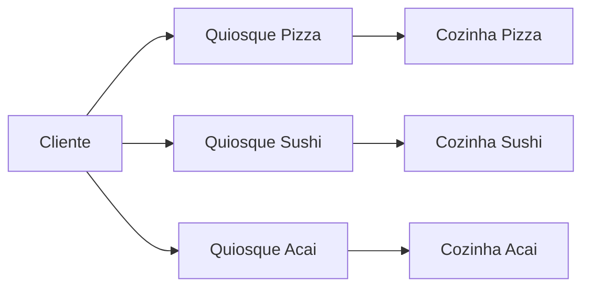
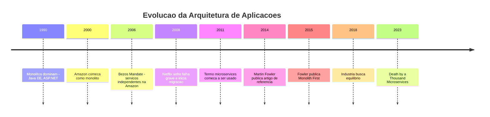
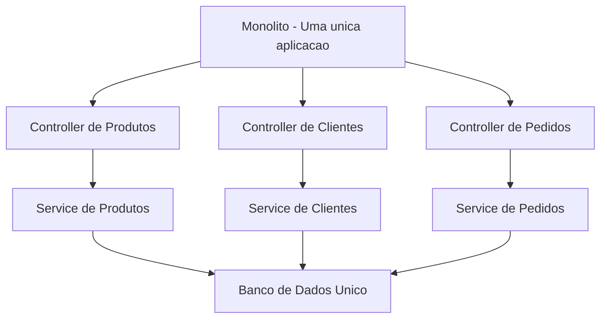
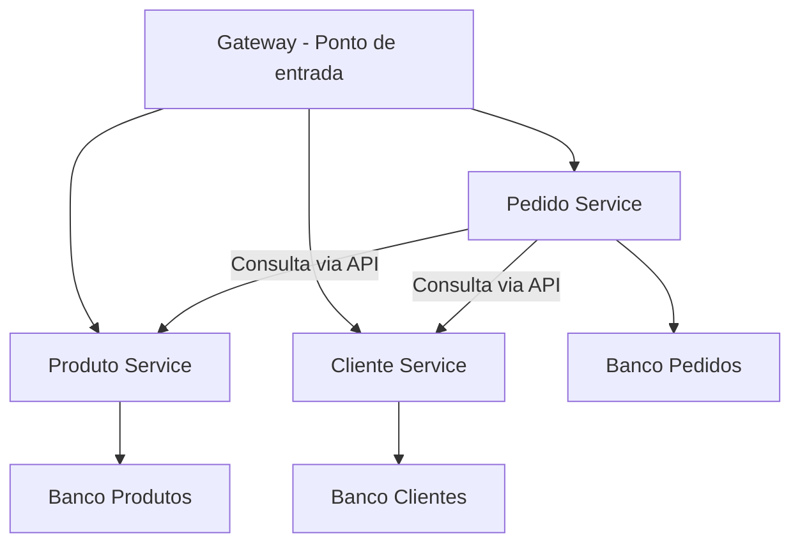
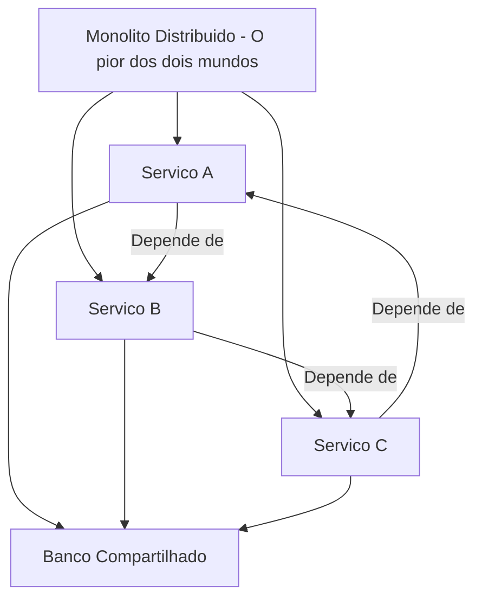
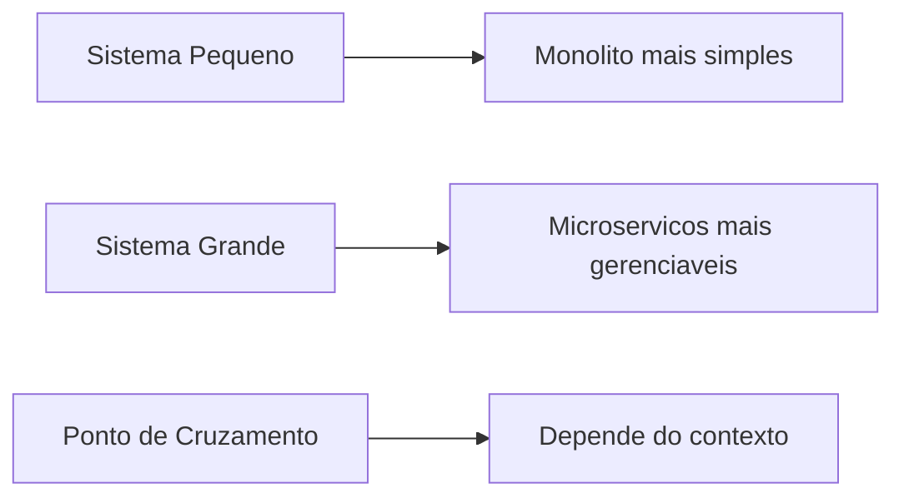
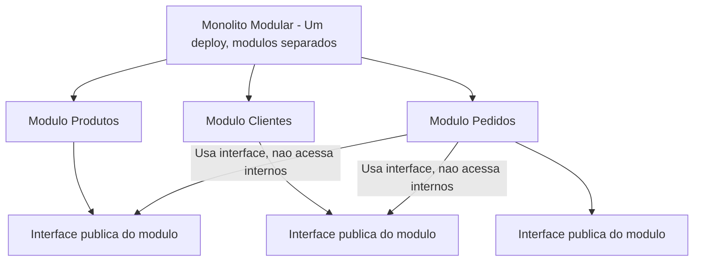
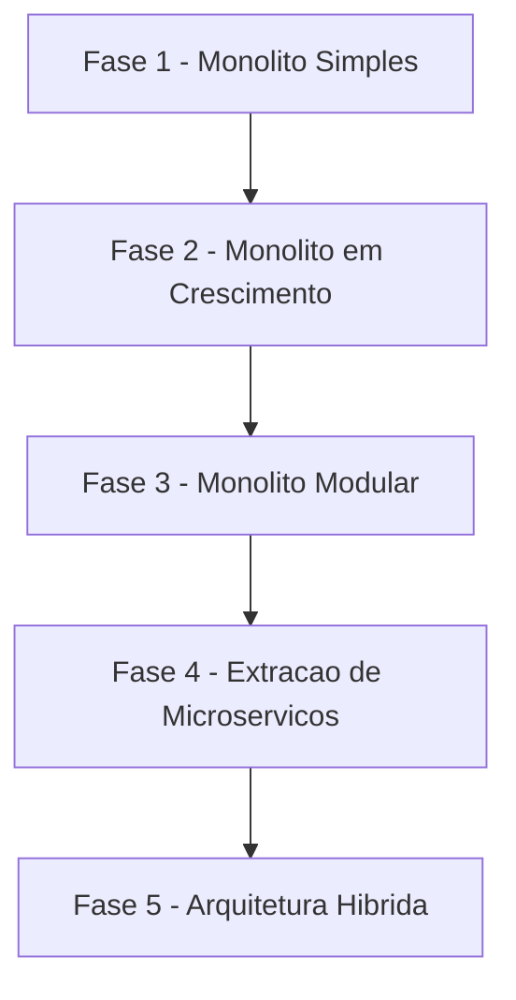
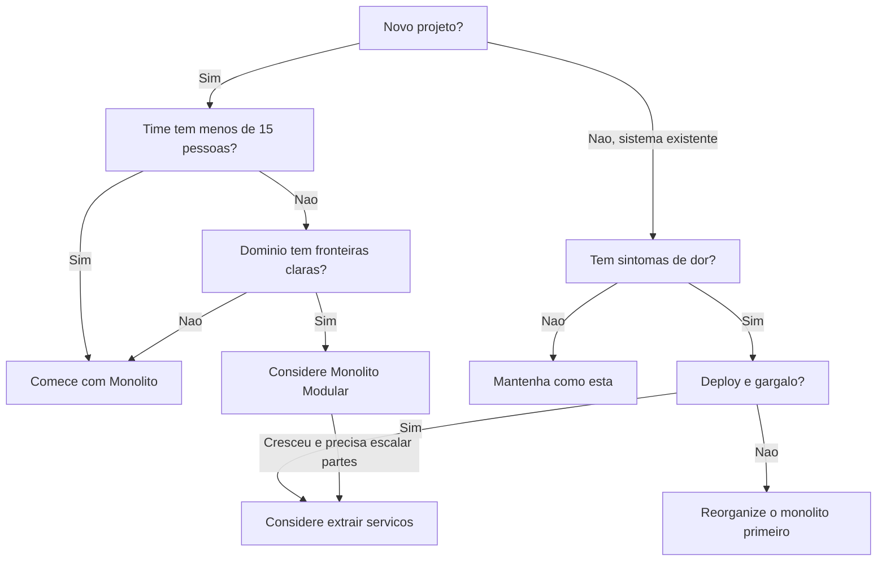

# 10.7 — Monolito vs Microserviços: Quando Usar Cada Um

[← Anterior: Controllers e Camada de Entrada](cap10-mod06-camada-controller-conteudo.md) · [Próximo: Arquiteturas Alternativas →](cap10-mod08-arquiteturas-alternativas-conteudo.md)

---

## Introdução

Nos módulos anteriores, você aprendeu a organizar o código de uma aplicação em camadas. Começou entendendo por que arquitetura importa (módulo 10.1), depois conheceu o padrão de 3 camadas (módulo 10.2), construiu a camada de domínio (módulo 10.3), a camada de serviços (módulo 10.4), a camada de repositórios (módulo 10.5) e a camada de controllers (módulo 10.6). Agora você sabe estruturar o código **dentro** de uma aplicação.

Mas existe uma pergunta que vem antes de organizar o código: **como eu organizo a aplicação como um todo?** Quando o sistema cresce, quando mais pessoas entram no time, quando novas funcionalidades aparecem — a aplicação inteira fica em um único lugar? Ou ela é dividida em pedaços menores que funcionam de forma independente?

Essa é a pergunta que separa dois modelos de organização que dominam o desenvolvimento de software moderno: o **monolito** e os **microserviços**.

E aqui vai o aviso mais importante deste módulo — grave isso: **não existe um modelo melhor que o outro**. Monolito não é "antigo" nem "ruim". Microserviços não são "modernos" nem "melhores". São escolhas. Escolhas que dependem do contexto, do tamanho do time, do orçamento, da complexidade do problema e dos planos de evolução do sistema. Escolher errado custa caro — tanto para um lado quanto para o outro.

Neste módulo, vamos entender profundamente os dois modelos, analisar as forças e fraquezas de cada um com uma análise SWOT completa, ver cenários reais de quando usar cada um, e terminar com uma regra prática que vai te guiar na maioria das situações. E no final, vamos conectar com o capítulo 11 — porque microserviços precisam se comunicar, e é lá que você vai aprender como.

---

## Como Executar os Exemplos Deste Módulo

Este módulo é mais conceitual do que os anteriores — não vamos escrever código executável como nos módulos 10.3 a 10.6. Em vez disso, vamos analisar estruturas de pastas, diagramas de arquitetura e cenários de decisão.

Quando houver exemplos de estrutura de projeto, você pode criar as pastas no seu computador para visualizar:

```bash
mkdir -p ~/meus-projetos/curso/cap10/mod07
```

Os diagramas Mermaid podem ser visualizados no VSCode com a extensão "Markdown Preview Mermaid Support", ou em sites como [mermaid.live](https://mermaid.live).

---

## A Analogia: Restaurante com Cozinha Única vs Praca de Alimentacao

Antes de entrar nos termos técnicos, vamos usar uma analogia que vai te acompanhar por todo o módulo.

### O Restaurante com Cozinha Única (Monolito)

Imagine um restaurante tradicional. Tem uma cozinha, um cardápio, uma equipe. Quando o cliente pede uma entrada, um prato principal e uma sobremesa, tudo sai da mesma cozinha. O cozinheiro de carnes está ao lado do confeiteiro. O estoquista abastece uma única despensa. O garçom leva tudo para a mesma mesa.

Se o restaurante quer mudar o cardápio de sobremesas, precisa coordenar com a cozinha inteira — porque todos compartilham o mesmo espaço, os mesmos equipamentos e o mesmo estoque. Se a cozinha pega fogo, o restaurante inteiro fecha. Mas enquanto funciona, é eficiente: a comunicação é direta (o cozinheiro grita para o confeiteiro), não tem duplicação de equipamentos e todo mundo sabe onde tudo está.

### A Praca de Alimentacao (Microservicos)

Agora imagine uma praça de alimentação. Cada quiosque é independente: um faz pizza, outro faz sushi, outro faz açaí. Cada um tem sua própria cozinha, seu próprio estoque, seus próprios funcionários. Se o quiosque de pizza pega fogo, o de sushi continua funcionando normalmente.

Se a praça quer adicionar um quiosque de comida mexicana, é só alugar um espaço novo — não precisa mexer nos outros quiosques. Cada quiosque pode crescer independentemente: se o de açaí tem muita demanda, ele contrata mais gente e compra mais equipamentos, sem afetar os outros.

Mas tem um custo: cada quiosque precisa de sua própria cozinha (duplicação de infraestrutura), a comunicação entre quiosques é mais difícil (o cliente precisa ir de um para outro), e gerenciar a praça inteira é mais complexo do que gerenciar um único restaurante.

| Aspecto | Restaurante - Monolito | Praca de Alimentacao - Microservicos |
|---------|----------------------|-------------------------------------|
| Organização | Uma cozinha, um cardapio | Vários quiosques independentes |
| Comunicação | Direta, gritando na cozinha | Indireta, entre quiosques separados |
| Falha | Cozinha pega fogo, tudo fecha | Um quiosque fecha, outros continuam |
| Crescimento | Amplia a cozinha inteira | Amplia so o quiosque que precisa |
| Novo prato | Coordena com toda a cozinha | Abre um quiosque novo |
| Custo inicial | Menor, uma cozinha so | Maior, várias cozinhas |
| Complexidade | Menor no inicio | Maior desde o inicio |




Guarde essa analogia. Vamos voltar a ela várias vezes ao longo do módulo.

---

## Contexto Histórico: Como Chegamos Aqui

Para entender por que existem dois modelos, precisamos entender como o desenvolvimento de software evoluiu. Ninguém acordou um dia e decidiu "vamos dividir tudo em microserviços". Foi uma evolução gradual, motivada por problemas reais.

### Anos 1990-2000: A Era do Monolito

Nos anos 1990 e 2000, a maioria dos sistemas era monolítica — e isso não era um problema. Era a forma natural de construir software. Você criava uma aplicação, empacotava tudo junto e fazia deploy em um servidor. Frameworks como Java EE, ASP.NET e Ruby on Rails foram construídos para esse modelo.

E funcionava. Empresas como Amazon, Netflix, eBay e Twitter começaram como monolitos. O próprio Facebook era um monolito PHP gigantesco. Não tinha nada de errado com isso — era a forma mais simples e eficiente de construir e entregar software.

O problema apareceu quando essas empresas cresceram. Muito. A Amazon, por exemplo, no início dos anos 2000, tinha um monolito enorme que fazia tudo: catálogo de produtos, carrinho de compras, pagamentos, recomendações, estoque. Quando o time de recomendações queria fazer uma mudança, precisava coordenar com todos os outros times, testar tudo junto e fazer deploy da aplicação inteira. Uma mudança em uma linha de código do sistema de recomendações podia quebrar o carrinho de compras.

### 2006-2011: Amazon e Netflix Mudam o Jogo

A Amazon foi uma das primeiras grandes empresas a migrar para o que chamamos hoje de microserviços, embora o termo ainda não existisse. Por volta de 2006, Jeff Bezos mandou um memorando interno famoso (que ficou conhecido como o "Bezos Mandate") dizendo, em resumo: "todos os times devem expor seus dados e funcionalidades através de interfaces de serviço. Não há outra forma de comunicação permitida."

Isso forçou a Amazon a dividir seu monolito em serviços independentes que se comunicavam por APIs. Cada time era dono de um serviço. Cada serviço podia ser desenvolvido, testado e implantado independentemente.

A Netflix seguiu um caminho parecido. Em 2008, a Netflix sofreu uma falha grave no seu banco de dados que derrubou o serviço por 3 dias. Isso motivou uma migração massiva: de um monolito rodando em data centers próprios para centenas de microserviços rodando na nuvem (AWS). A Netflix documentou essa jornada publicamente e se tornou referência mundial em arquitetura de microserviços.

### 2011-2014: O Termo "Microservicos" Nasce

O termo "microservices" foi popularizado por volta de 2011-2012, em conferências de software. Em 2014, **Martin Fowler** e **James Lewis** publicaram o artigo que se tornou a referência definitiva: "Microservices — a definition of this new architectural term". Nesse artigo, eles formalizaram o que empresas como Amazon e Netflix já faziam na prática.

A partir daí, microserviços viraram uma tendência forte na indústria. Muitas empresas começaram a adotar — algumas com sucesso, outras com resultados desastrosos. E é aí que mora o perigo: microserviços resolvem problemas reais de empresas grandes, mas criam problemas novos que empresas pequenas não precisam ter.

### 2018-Presente: O Retorno do Bom Senso

Depois de anos de hype, a indústria começou a perceber que microserviços não são bala de prata. Artigos como "Monolith First" (Martin Fowler, 2015) e "Death by a Thousand Microservices" (2023) trouxeram equilíbrio à discussão. Empresas que migraram para microserviços sem necessidade real começaram a voltar para monolitos — ou pelo menos para arquiteturas mais simples.

O consenso atual é pragmático: **comece simples, evolua quando necessário**. Microserviços são uma ferramenta poderosa, mas têm um custo alto. Se o problema não justifica o custo, o monolito é a escolha certa.



---

## O que e um Monolito

Vamos ser precisos. Um **monolito** (do grego *monolithos* — "pedra única") é uma aplicação onde todo o código roda como uma única unidade. Toda a lógica de negócio, todo o acesso a dados, toda a interface — tudo está no mesmo projeto, compilado junto, implantado junto.

Isso não significa que o código é bagunçado. Um monolito pode (e deve) ser bem organizado internamente — com camadas, módulos, separação de responsabilidades. Tudo que você aprendeu nos módulos 10.1 a 10.6 se aplica perfeitamente a um monolito. A diferença é que, no final, tudo vira um único executável, um único deploy, um único processo rodando no servidor.

### Estrutura Tipica de um Monolito

Lembra da estrutura de pastas que construímos nos módulos anteriores? Aquilo é um monolito:

```
MeuSistema/
    Controllers/
        ProductController.cs
        CustomerController.cs
        OrderController.cs
    Services/
        ProductService.cs
        CustomerService.cs
        OrderService.cs
    Repositories/
        ProductRepository.cs
        CustomerRepository.cs
        OrderRepository.cs
    Models/
        Product.cs
        Customer.cs
        Order.cs
    Program.cs
```

Tudo em um projeto. Quando você faz `dotnet run`, tudo sobe junto. Quando você faz deploy, tudo vai junto. Produtos, clientes e pedidos compartilham o mesmo banco de dados, o mesmo processo, a mesma memória.



### Vantagens do Monolito

O monolito tem vantagens reais e concretas que muita gente subestima:

**1. Simplicidade de desenvolvimento**

Tudo está em um lugar. Você abre o projeto no VSCode e vê tudo. Se precisa entender como o pedido usa o produto, é só navegar entre as pastas. Não precisa descobrir qual serviço faz o quê, não precisa configurar comunicação entre serviços, não precisa lidar com rede.

Para um time pequeno (1 a 10 desenvolvedores), essa simplicidade é ouro. Todo mundo conhece o código inteiro. Todo mundo sabe onde cada coisa está. A curva de aprendizado para um novo membro do time é baixa.

**2. Simplicidade de debug**

Quando algo dá errado em um monolito, você coloca um breakpoint, roda o debugger e acompanha o fluxo do início ao fim. A requisição entra no Controller, passa pelo Service, chega no Repository — tudo no mesmo processo, tudo visível no mesmo debugger.

Em microserviços, debugar um problema que atravessa 3 serviços diferentes é significativamente mais difícil. Você precisa de ferramentas especiais de rastreamento distribuído (distributed tracing), precisa correlacionar logs de serviços diferentes, precisa entender a ordem das chamadas entre serviços.

**3. Simplicidade de deploy**

Deploy de um monolito: você compila, gera um executável (ou um container Docker) e coloca no servidor. Um artefato. Um deploy. Se algo der errado, você volta para a versão anterior — um rollback.

Deploy de microserviços: você tem 10, 20, 50 serviços. Cada um com seu próprio pipeline de build, seu próprio container, sua própria configuração. Precisa garantir que as versões são compatíveis entre si. Um deploy pode envolver atualizar 3 serviços em uma ordem específica. Se algo der errado, o rollback pode ser parcial — voltar um serviço mas não outro.

**4. Performance de comunicação interna**

Dentro de um monolito, quando o `OrderService` precisa chamar o `ProductService`, é uma chamada de método — nanossegundos. Os dados estão na mesma memória, no mesmo processo.

Em microserviços, essa mesma chamada vira uma requisição HTTP ou uma mensagem em uma fila — milissegundos. Parece pouco, mas quando um fluxo envolve 5 chamadas entre serviços, a latência acumula. E se a rede falhar no meio do caminho, você precisa lidar com isso.

**5. Consistência de dados**

Em um monolito com um único banco de dados, transações são simples. Você pode criar um pedido e atualizar o estoque na mesma transação — se algo falhar, tudo volta ao estado anterior (rollback). A consistência é garantida pelo banco.

Em microserviços, cada serviço geralmente tem seu próprio banco. Criar um pedido (serviço A) e atualizar o estoque (serviço B) são operações em bancos diferentes. Se o pedido é criado mas a atualização do estoque falha, você tem um problema de consistência. Resolver isso exige padrões complexos como Saga, que são difíceis de implementar corretamente.

### Desvantagens do Monolito

O monolito também tem desvantagens reais — e são essas desvantagens que motivaram a criação dos microserviços:

**1. Escala acoplada**

Se o módulo de busca de produtos recebe 10x mais tráfego que o módulo de relatórios, você não pode escalar só a busca. Precisa escalar a aplicação inteira — colocar mais instâncias do monolito completo, mesmo que 90% do código não precise de mais recursos.

É como se, no restaurante, quando a demanda por sobremesas aumentasse, você precisasse construir uma cozinha inteira nova — com todos os equipamentos de carnes, saladas e entradas — só para fazer mais sobremesas.

**2. Deploy acoplado**

Quando o time de produtos faz uma mudança, precisa fazer deploy do sistema inteiro — incluindo o código de clientes, pedidos e relatórios que não mudou. Se o deploy quebrar algo, tudo é afetado.

Em empresas grandes, isso cria um gargalo. Se 5 times querem fazer deploy na mesma semana, precisam coordenar. "Espera, não faz deploy agora porque o time de pagamentos está testando." Isso desacelera todo mundo.

**3. Acoplamento de código**

Mesmo com boa organização em camadas, em um monolito é fácil criar dependências indesejadas. O `OrderService` pode importar diretamente o `ProductRepository` em vez de passar pelo `ProductService`. Com o tempo, essas dependências cruzadas se acumulam e o código fica cada vez mais difícil de mudar.

É o que chamam de "big ball of mud" — uma bola de lama onde tudo depende de tudo. Não é inevitável (boa disciplina evita), mas é comum em monolitos que crescem sem cuidado.

**4. Stack tecnologica única**

Em um monolito, todo o código usa a mesma linguagem, o mesmo framework, as mesmas bibliotecas. Se o sistema é em C#, tudo é C#. Se uma parte do sistema se beneficiaria de Python (por exemplo, processamento de dados com machine learning), você não pode usar — está preso à stack do monolito.

**5. Tempo de build e startup**

Conforme o monolito cresce, o tempo de compilação aumenta. O tempo para subir a aplicação aumenta. Os testes demoram mais. Em monolitos muito grandes, compilar pode levar 10-15 minutos. Rodar todos os testes pode levar horas. Isso desacelera o ciclo de desenvolvimento.

---

## O que são Microservicos

**Microserviços** são uma abordagem onde a aplicação é dividida em serviços pequenos e independentes, cada um responsável por uma funcionalidade específica do negócio. Cada serviço roda como um processo separado, tem seu próprio banco de dados e se comunica com os outros serviços através de mecanismos leves — geralmente APIs HTTP ou mensagens assíncronas.

A palavra-chave é **independente**. Cada microserviço pode ser desenvolvido por um time diferente, usando uma linguagem diferente, com um banco de dados diferente, e pode ser implantado independentemente dos outros.

### Estrutura Tipica de Microservicos

Em vez de um projeto com tudo junto, você tem vários projetos separados:

```
sistema-ecommerce/
    produto-service/
        Controllers/
        Services/
        Repositories/
        Models/
        Program.cs
        Dockerfile
    cliente-service/
        Controllers/
        Services/
        Repositories/
        Models/
        Program.cs
        Dockerfile
    pedido-service/
        Controllers/
        Services/
        Repositories/
        Models/
        Program.cs
        Dockerfile
    gateway/
        Program.cs
        Dockerfile
```

Cada serviço é um projeto completo, com suas próprias camadas (Controller, Service, Repository), seu próprio banco de dados e seu próprio Dockerfile. Cada um pode ser compilado, testado e implantado separadamente.



Observe algo importante no diagrama: o Pedido Service precisa consultar dados de produtos e clientes. Mas ele não acessa os bancos deles diretamente — ele faz chamadas via API para os outros serviços. Cada serviço é dono dos seus dados.

### Vantagens dos Microservicos

**1. Escala independente**

Se o serviço de busca de produtos recebe muito tráfego, você escala só ele — coloca mais instâncias do serviço de produtos. O serviço de relatórios, que quase ninguém usa, continua com uma instância só. Você paga apenas pelos recursos que cada parte realmente precisa.

Na analogia da praça de alimentação: se o quiosque de açaí tem fila, ele contrata mais atendentes. O quiosque de sushi, que está tranquilo, não precisa mudar nada.

**2. Deploy independente**

O time de produtos pode fazer deploy do serviço de produtos a qualquer momento, sem afetar os outros serviços. Sem coordenação com outros times. Sem esperar janela de deploy. Se o deploy der problema, o rollback afeta apenas o serviço de produtos — o resto do sistema continua funcionando.

Isso acelera drasticamente o ciclo de entrega. Empresas como Amazon fazem milhares de deploys por dia — isso só é possível porque cada deploy afeta apenas um serviço pequeno.

**3. Isolamento de falhas**

Se o serviço de recomendações cair, o site continua funcionando — o cliente pode navegar, buscar produtos e fazer compras. Só as recomendações ficam indisponíveis. Em um monolito, se o módulo de recomendações tiver um bug que causa crash, a aplicação inteira cai.

Esse isolamento é crucial para sistemas que precisam de alta disponibilidade. A Netflix, por exemplo, tem centenas de microserviços. Se um deles falha, o sistema degrada graciosamente — mostra menos informações, mas não para de funcionar.

**4. Autonomia de times**

Cada time é dono de um ou mais serviços. Eles escolhem a tecnologia, definem a arquitetura interna, decidem quando fazer deploy. Não precisam pedir permissão para outros times. Isso reduz a coordenação necessária e permite que times grandes trabalhem em paralelo sem pisar nos pés uns dos outros.

A Amazon organiza seus times seguindo a regra das "two-pizza teams" — cada time deve ser pequeno o suficiente para ser alimentado com duas pizzas (6-8 pessoas). Cada time é dono de um ou mais serviços.

**5. Flexibilidade tecnologica**

Cada serviço pode usar a tecnologia mais adequada para seu problema. O serviço de busca pode usar Elasticsearch. O serviço de recomendações pode usar Python com machine learning. O serviço de pagamentos pode usar Java por causa de bibliotecas específicas do setor financeiro. Cada um escolhe o que faz mais sentido.

### Desvantagens dos Microservicos

E aqui é onde muita gente se surpreende. Microserviços têm desvantagens sérias que são frequentemente subestimadas:

**1. Complexidade de comunicação**

Em um monolito, chamar outro módulo é uma chamada de método. Em microserviços, é uma chamada de rede. A rede pode falhar. A rede pode estar lenta. O serviço do outro lado pode estar fora do ar. Você precisa lidar com timeouts, retries, circuit breakers, fallbacks.

Cada chamada entre serviços é um ponto potencial de falha. Se o fluxo de criar um pedido envolve chamar o serviço de produtos (para verificar estoque), o serviço de clientes (para verificar crédito) e o serviço de pagamentos (para processar o pagamento), são 3 pontos de falha que não existiriam em um monolito.

**2. Complexidade de deploy e infraestrutura**

Em vez de fazer deploy de uma aplicação, você faz deploy de 10, 20, 50 serviços. Cada um precisa de: pipeline de CI/CD, container Docker, configuração de rede, monitoramento, logs, alertas. A infraestrutura necessária para rodar microserviços é significativamente mais complexa e cara.

Você precisa de ferramentas como Kubernetes para orquestrar os containers, service mesh para gerenciar a comunicação, ferramentas de observabilidade para entender o que está acontecendo. Essas ferramentas têm curva de aprendizado alta e custo operacional.

**3. Consistência de dados**

Cada serviço tem seu próprio banco de dados. Isso significa que não existe transação que abranja dois serviços. Se o serviço de pedidos cria um pedido e o serviço de estoque precisa decrementar o estoque, essas são duas operações em bancos diferentes. Se a segunda falhar, você precisa compensar a primeira.

Resolver isso exige padrões como Saga (uma sequência de transações locais com compensações) ou Event Sourcing (registrar eventos em vez de estados). São padrões poderosos, mas complexos de implementar e difíceis de debugar.

**4. Latencia**

Cada chamada entre serviços adiciona latência. Em um monolito, buscar o produto e verificar o estoque são chamadas de método — microssegundos. Em microserviços, são chamadas HTTP — milissegundos cada. Se um fluxo envolve 5 chamadas sequenciais entre serviços, a latência total pode ser perceptível para o usuário.

**5. Complexidade de monitoramento**

Em um monolito, quando algo dá errado, você olha um log. Em microserviços, uma requisição pode passar por 5 serviços diferentes. Para entender o que aconteceu, você precisa correlacionar logs de 5 serviços, rastrear a requisição através de todos eles (distributed tracing) e entender a ordem dos eventos.

Ferramentas como Jaeger, Zipkin e Datadog existem para resolver esse problema, mas adicionam mais complexidade à infraestrutura.

**6. Duplicacao de código e dados**

Quando dois serviços precisam da mesma informação (por exemplo, dados do cliente), cada um mantém sua própria cópia. Isso pode levar a inconsistências — o serviço A tem o endereço atualizado do cliente, mas o serviço B ainda tem o endereço antigo.

Além disso, código utilitário (validações, formatações, DTOs) pode acabar duplicado entre serviços. Bibliotecas compartilhadas ajudam, mas criam acoplamento entre serviços — exatamente o que microserviços tentam evitar.

---

## Análise SWOT: Monolito

SWOT é uma ferramenta de análise estratégica que vem do mundo dos negócios. A sigla significa **Strengths** (Forças), **Weaknesses** (Fraquezas), **Opportunities** (Oportunidades) e **Threats** (Ameaças). Forças e fraquezas são internas — características da própria abordagem. Oportunidades e ameaças são externas — dependem do contexto onde a abordagem é usada.

Vamos aplicar essa análise ao monolito e aos microserviços para ter uma visão completa e equilibrada.

### SWOT do Monolito

| Categoria | Descrição |
|-----------|-----------|
| **Forcas** | |
| Simplicidade de desenvolvimento | Um projeto, um repositório, um deploy. Fácil de entender, navegar e debugar |
| Comunicação interna rápida | Chamadas de método em vez de chamadas de rede. Sem latencia adicional |
| Transações simples | Um banco de dados, transações ACID nativas. Consistência garantida |
| Baixo custo inicial | Menos infraestrutura, menos ferramentas, menos overhead operacional |
| Curva de aprendizado baixa | Desenvolvedores juniores conseguem ser produtivos rapidamente |
| Debug direto | Breakpoints, stack traces e logs em um único processo |
| **Fraquezas** | |
| Escala acoplada | Precisa escalar tudo junto, mesmo que so uma parte precise de mais recursos |
| Deploy acoplado | Qualquer mudanca exige deploy do sistema inteiro |
| Risco de acoplamento interno | Fácil criar dependências cruzadas entre módulos se não houver disciplina |
| Stack única | Toda a aplicação usa a mesma linguagem e framework |
| Build lento em projetos grandes | Compilação e testes ficam lentos conforme o código cresce |
| **Oportunidades** | |
| Ideal para MVPs e startups | Permite validar ideias rapidamente com custo mínimo |
| Migração gradual | Pode extrair microservicos depois, quando o problema justificar |
| Ferramentas maduras | Frameworks e ferramentas para monolitos são maduros e bem documentados |
| Modular monolith | Tendência moderna de monolitos bem modularizados internamente |
| **Ameacas** | |
| Crescimento descontrolado | Sem disciplina, vira big ball of mud |
| Gargalo de deploy | Com muitos times, coordenacao de deploy vira problema |
| Ponto único de falha | Bug critico derruba o sistema inteiro |
| Percepcao de mercado | Algumas empresas consideram monolito como ultrapassado, sem razao técnica |

---

## Análise SWOT: Microservicos

### SWOT dos Microservicos

| Categoria | Descrição |
|-----------|-----------|
| **Forcas** | |
| Escala independente | Cada servico escala conforme sua demanda específica |
| Deploy independente | Times fazem deploy sem coordenacao com outros times |
| Isolamento de falhas | Falha em um servico não derruba os outros |
| Autonomia de times | Cada time e dono do seu servico, com liberdade tecnologica |
| Flexibilidade de stack | Cada servico pode usar a tecnologia mais adequada |
| Ciclo de entrega rápido | Servicos pequenos são rapidos de compilar, testar e implantar |
| **Fraquezas** | |
| Complexidade de comunicação | Chamadas de rede entre servicos podem falhar, ter latencia, timeout |
| Consistência de dados | Transações distribuidas são complexas e dificeis de implementar |
| Overhead operacional | Cada servico precisa de CI/CD, monitoramento, logs, alertas |
| Duplicacao | Código e dados podem ser duplicados entre servicos |
| Debug distribuido | Rastrear um problema que atravessa vários servicos e difícil |
| Custo de infraestrutura | Mais containers, mais rede, mais ferramentas, mais dinheiro |
| **Oportunidades** | |
| Escala massiva | Permite atender milhoes de usuarios com eficiência |
| Times grandes | Permite dezenas de times trabalhando em paralelo |
| Cloud native | Aproveita ao máximo servicos de nuvem como Kubernetes e service mesh |
| Evolução tecnologica | Permite adotar novas tecnologias gradualmente, servico por servico |
| **Ameacas** | |
| Over-engineering | Adotar microservicos sem necessidade real cria complexidade desnecessaria |
| Distributed monolith | Microservicos mal projetados que dependem uns dos outros como um monolito |
| Custo operacional | Infraestrutura e ferramentas podem custar mais que o beneficio |
| Escassez de talento | Poucos profissionais tem experiência real com arquitetura distribuida |

### O Antipadrao: Monolito Distribuido

Um dos maiores riscos dos microserviços é criar um **monolito distribuído** — serviços que são tecnicamente separados, mas tão acoplados que precisam ser implantados juntos, testados juntos e mudam juntos. Você tem toda a complexidade dos microserviços sem nenhuma das vantagens.

Sinais de um monolito distribuído:
- Mudar um serviço exige mudar outros serviços ao mesmo tempo
- Serviços compartilham o mesmo banco de dados
- Deploy de um serviço quebra outros serviços
- Não é possível testar um serviço isoladamente
- Chamadas síncronas em cadeia: A chama B que chama C que chama D

Se você reconhece esses sinais, provavelmente seria melhor ter ficado com um monolito — pelo menos teria a simplicidade.



---

## Comparação Direta: Monolito vs Microservicos

Vamos colocar os dois modelos lado a lado em uma comparação detalhada:

| Critério | Monolito | Microservicos |
|----------|----------|---------------|
| Complexidade inicial | Baixa | Alta |
| Complexidade em escala | Alta | Moderada, se bem projetado |
| Deploy | Um artefato, simples | Multiplos artefatos, complexo |
| Escala | Tudo junto | Independente por servico |
| Comunicação interna | Chamada de método, rápida | Chamada de rede, com latencia |
| Consistência de dados | Transações ACID simples | Consistência eventual, Sagas |
| Debug | Direto, um processo | Distribuido, precisa de tracing |
| Time ideal | 1-15 desenvolvedores | 15+ desenvolvedores |
| Custo de infraestrutura | Menor | Maior |
| Tolerancia a falhas | Ponto único de falha | Isolamento de falhas |
| Flexibilidade de stack | Uma linguagem e framework | Multiplas linguagens e frameworks |
| Tempo para primeiro deploy | Rápido | Lento, precisa de infraestrutura |
| Curva de aprendizado | Baixa | Alta |
| Autonomia de times | Baixa, deploy coordenado | Alta, deploy independente |

### O Gráfico da Complexidade

Existe um conceito importante que ajuda a entender quando cada modelo faz sentido. Conforme o sistema cresce, a complexidade de cada modelo se comporta de forma diferente:

- O **monolito** começa simples e a complexidade cresce de forma acelerada conforme o sistema fica grande
- Os **microserviços** começam complexos (toda a infraestrutura necessária) mas a complexidade cresce de forma mais controlada

Existe um ponto de cruzamento — um tamanho de sistema onde a complexidade do monolito ultrapassa a dos microserviços. Antes desse ponto, o monolito é mais simples. Depois desse ponto, os microserviços são mais gerenciáveis.



O problema é que ninguém sabe exatamente onde fica esse ponto de cruzamento. Depende do domínio, do time, da infraestrutura disponível, da experiência da equipe. Por isso a decisão não é puramente técnica — é uma decisão de negócio.

---

## Quando Usar Monolito

Vamos ser práticos. Em quais situações o monolito é a escolha certa?

### Cenário 1: Startup com 3 Desenvolvedores

A empresa acabou de ser fundada. Tem 3 desenvolvedores, um produto para validar e pouco dinheiro. Precisa colocar algo no ar rápido para testar se o mercado aceita.

**Escolha: monolito.** Por quê?

- Com 3 pessoas, não há necessidade de autonomia de times — todo mundo trabalha junto
- O produto ainda vai mudar muito — microserviços prematuros significam reescrever serviços que talvez nem existam na versão final
- O orçamento não comporta a infraestrutura de microserviços (Kubernetes, service mesh, monitoramento distribuído)
- A velocidade de desenvolvimento é crítica — monolito permite iterar mais rápido
- Se o produto não vingar, o investimento em infraestrutura de microserviços foi desperdiçado

### Cenário 2: Sistema Interno de RH

Uma empresa precisa de um sistema interno para gerenciar funcionários, folha de pagamento e férias. Vai ser usado por 50 pessoas do departamento de RH.

**Escolha: monolito.** Por quê?

- O número de usuários é pequeno e previsível — não precisa de escala independente
- O domínio é bem definido e estável — não vai mudar drasticamente
- Um time pequeno vai manter o sistema — não precisa de autonomia de times
- A complexidade do negócio é moderada — cabe bem em um monolito organizado
- O custo de manter microserviços não se justifica para 50 usuários

### Cenário 3: MVP de Aplicativo

Uma empresa quer testar uma ideia de aplicativo de delivery de comida. Precisa de um backend que gerencie restaurantes, cardápios, pedidos e entregas.

**Escolha: monolito.** Por quê?

- É um MVP — o objetivo é validar a ideia, não construir a arquitetura definitiva
- As funcionalidades ainda vão mudar muito com base no feedback dos usuários
- Velocidade de entrega é mais importante que escalabilidade neste momento
- Se o MVP der certo e crescer, pode migrar para microserviços depois

### A Regra Prática

Martin Fowler, um dos maiores nomes em arquitetura de software, tem uma frase famosa:

> "Almost all the successful microservice stories have started with a monolith that got too big and was broken up."
> (Quase todas as histórias de sucesso com microserviços começaram com um monolito que ficou grande demais e foi dividido.)

A regra prática é: **comece com monolito. Migre para microserviços quando (e se) o problema exigir.**

Isso não é preguiça nem falta de ambição. É pragmatismo. Você não sabe quais partes do sistema vão precisar escalar independentemente até que o sistema esteja em produção e você veja os padrões reais de uso. Dividir prematuramente pode significar dividir nos lugares errados.

---

## Quando Usar Microservicos

E quando microserviços fazem sentido?

### Cenário 1: E-commerce com 50 Desenvolvedores

A empresa cresceu. Tem 50 desenvolvedores divididos em 8 times: catálogo, busca, carrinho, pagamentos, logística, recomendações, marketing e suporte. O monolito original está com 500 mil linhas de código. Deploy leva 2 horas. Qualquer mudança exige coordenação entre times.

**Escolha: microserviços.** Por quê?

- 8 times precisam de autonomia — não podem esperar uns pelos outros para fazer deploy
- Partes diferentes do sistema têm demandas de escala diferentes — busca recebe 100x mais tráfego que relatórios
- O monolito ficou grande demais — o tempo de build e deploy está prejudicando a produtividade
- A empresa tem orçamento e expertise para manter a infraestrutura de microserviços

### Cenário 2: Plataforma de Streaming

Uma plataforma de streaming de vídeo precisa atender milhões de usuários simultâneos. O sistema tem funcionalidades muito diferentes: catálogo de vídeos, sistema de recomendações (machine learning), transcodificação de vídeo, sistema de pagamentos, analytics.

**Escolha: microserviços.** Por quê?

- Cada funcionalidade tem requisitos técnicos muito diferentes — recomendações usa Python com ML, transcodificação usa C++ para performance, pagamentos usa Java por compliance
- A escala é massiva e desigual — streaming de vídeo consome muito mais recursos que o catálogo
- Falhas precisam ser isoladas — se o sistema de recomendações cair, o usuário ainda precisa conseguir assistir vídeos
- Times especializados trabalham em cada área — o time de ML não precisa entender o código de pagamentos

### Cenário 3: Plataforma SaaS Multi-tenant

Uma empresa oferece uma plataforma SaaS (Software as a Service) para milhares de clientes empresariais. Cada cliente tem configurações diferentes, volumes de dados diferentes e requisitos de compliance diferentes.

**Escolha: microserviços.** Por quê?

- Diferentes clientes têm diferentes padrões de uso — alguns usam muito a API, outros usam muito o dashboard
- Isolamento é crítico — um cliente com muito tráfego não pode afetar outros clientes
- A plataforma precisa evoluir continuamente sem downtime — deploy independente é essencial
- Times especializados cuidam de diferentes aspectos da plataforma

### Sinais de que Você Precisa de Microservicos

Se você está em um monolito e começa a sentir esses sintomas, pode ser hora de considerar microserviços:

1. **Deploy é doloroso** — leva horas, exige coordenação entre muitos times, frequentemente quebra algo
2. **Times pisam nos pés uns dos outros** — mudanças de um time quebram o código de outro time
3. **Escala é desperdiçada** — você escala o sistema inteiro para atender a demanda de uma parte
4. **Build é lento** — compilar e testar leva tanto tempo que os desenvolvedores perdem produtividade
5. **Onboarding é difícil** — novos desenvolvedores levam meses para entender o código
6. **Uma falha derruba tudo** — um bug em uma parte obscura do sistema derruba a aplicação inteira

Se nenhum desses sintomas existe, provavelmente o monolito está funcionando bem. Não conserte o que não está quebrado.

---

## O Caminho do Meio: Monolito Modular

Existe uma abordagem que combina o melhor dos dois mundos e que tem ganhado muita força nos últimos anos: o **monolito modular** (modular monolith).

A ideia é simples: você mantém a aplicação como um único deploy (monolito), mas organiza o código internamente em módulos bem definidos, com fronteiras claras entre eles. Cada módulo tem seu próprio domínio, seus próprios serviços e seus próprios repositórios. Os módulos se comunicam através de interfaces bem definidas — não acessam diretamente os internos uns dos outros.

É como um restaurante que tem uma cozinha única, mas com estações separadas: a estação de carnes, a estação de massas, a estação de sobremesas. Cada estação tem seu espaço, seus equipamentos e seu cozinheiro. Elas compartilham a mesma cozinha (mesmo deploy), mas são organizadas internamente.

```
MeuSistema/
    Modules/
        Products/
            Controllers/
                ProductController.cs
            Services/
                ProductService.cs
            Repositories/
                ProductRepository.cs
            Models/
                Product.cs
        Customers/
            Controllers/
                CustomerController.cs
            Services/
                CustomerService.cs
            Repositories/
                CustomerRepository.cs
            Models/
                Customer.cs
        Orders/
            Controllers/
                OrderController.cs
            Services/
                OrderService.cs
            Repositories/
                OrderRepository.cs
            Models/
                Order.cs
    Shared/
        Interfaces/
        DTOs/
    Program.cs
```



### Vantagens do Monolito Modular

- **Simplicidade de deploy**: um artefato, como qualquer monolito
- **Fronteiras claras**: cada módulo tem responsabilidades bem definidas
- **Preparado para migração**: se um dia precisar extrair um módulo para microserviço, as fronteiras já existem
- **Sem complexidade de rede**: comunicação entre módulos é chamada de método, não chamada HTTP
- **Transações simples**: todos os módulos compartilham o mesmo banco, transações ACID funcionam

### A Regra de Ouro

A regra de ouro é: **módulos não acessam os internos de outros módulos**. O módulo de Pedidos não importa o `ProductRepository` diretamente. Ele usa a interface pública do módulo de Produtos — por exemplo, um `IProductModule` que expõe métodos como `GetProductById` e `CheckStock`.

Isso cria as mesmas fronteiras que microserviços teriam, mas sem a complexidade de rede. E se um dia você precisar extrair o módulo de Produtos para um microserviço, a interface já existe — basta trocar a implementação de "chamada de método" para "chamada HTTP".

### Quando Usar Monolito Modular

O monolito modular é ideal quando:
- O time está crescendo (5-20 desenvolvedores) mas ainda não justifica microserviços
- Você quer manter a simplicidade do monolito mas precisa de melhor organização
- Você antecipa que pode precisar de microserviços no futuro e quer se preparar
- O domínio tem fronteiras claras entre áreas de negócio

É o caminho que muitos especialistas recomendam hoje: comece com monolito modular, e extraia microserviços apenas quando (e se) necessário.

---

## A Jornada Tipica: Do Monolito aos Microservicos

Na prática, a maioria das empresas que usa microserviços com sucesso seguiu uma jornada parecida:

### Fase 1: Monolito Simples

A empresa começa com um monolito. Poucas pessoas, produto em validação. O monolito é simples, rápido de desenvolver e barato de operar.

### Fase 2: Monolito em Crescimento

O produto deu certo. Mais clientes, mais funcionalidades, mais desenvolvedores. O monolito cresce. Começa a ficar difícil de navegar, o deploy fica mais lento, os times começam a se atrapalhar.

### Fase 3: Monolito Modular

A empresa reorganiza o monolito em módulos com fronteiras claras. Cada time é responsável por um ou mais módulos. O deploy ainda é único, mas o código está melhor organizado.

### Fase 4: Extracao de Microservicos

Alguns módulos precisam escalar independentemente ou têm requisitos técnicos muito diferentes. A empresa extrai esses módulos para microserviços. Os outros continuam no monolito.

### Fase 5: Arquitetura Hibrida

A empresa tem um mix: alguns serviços independentes (os que precisam) e um monolito modular (para o resto). Essa é a realidade da maioria das empresas grandes — não é 100% microserviços nem 100% monolito.



O ponto importante é: **essa jornada não é obrigatória**. Muitas empresas ficam felizes na fase 1 ou na fase 3 para sempre. Nem todo sistema precisa chegar na fase 5. A migração só faz sentido quando o problema justifica o custo.

---

## Conectando com o Capítulo 11

Se microserviços são serviços independentes, como eles se comunicam? Essa é exatamente a pergunta que o capítulo 11 vai responder.

Existem duas formas principais:

**Comunicação síncrona** — um serviço chama outro e espera a resposta. Geralmente via API HTTP/REST. O serviço de pedidos chama o serviço de produtos via HTTP para verificar o estoque. É simples de entender, mas cria acoplamento temporal — se o serviço de produtos estiver fora do ar, o serviço de pedidos não consegue criar o pedido.

**Comunicação assíncrona** — um serviço pública uma mensagem em uma fila e outro serviço consome quando puder. O serviço de pedidos pública "pedido criado" em uma fila. O serviço de estoque consome essa mensagem e atualiza o estoque. Não há acoplamento temporal — se o serviço de estoque estiver fora do ar, a mensagem fica na fila esperando.


No capítulo 11, você vai aprender a construir APIs HTTP com FastAPI (comunicação síncrona) e vai entender os conceitos de filas e mensageria (comunicação assíncrona). Esses são os mecanismos que fazem microserviços funcionarem na prática.

Por enquanto, o que importa é entender: **microserviços sem uma boa estratégia de comunicação são apenas um monolito distribuído** — o pior dos dois mundos.

---

## Árvore de Decisao: Monolito ou Microservicos

Para facilitar a decisão na prática, aqui está uma árvore de decisão simplificada:



Essa árvore é uma simplificação — a decisão real envolve muitos outros fatores. Mas ela captura a essência: **comece simples, evolua quando necessário, e nunca migre sem um problema real para resolver**.

---

## Exemplos do Mundo Real

Vamos ver como empresas reais tomaram essas decisões:

### Amazon: Do Monolito aos Microservicos

A Amazon começou como um monolito nos anos 2000. Conforme cresceu para centenas de times e milhões de clientes, o monolito se tornou insustentável. A migração para microserviços levou anos e foi motivada por problemas reais: deploy lento, times bloqueados, escala ineficiente.

Hoje, a Amazon opera centenas de microserviços. Mas a migração não foi "vamos reescrever tudo" — foi gradual, extraindo um serviço de cada vez, começando pelos que tinham mais dor.

### Shopify: Monolito Modular

A Shopify, uma das maiores plataformas de e-commerce do mundo, fez uma escolha diferente. Em vez de migrar para microserviços, eles investiram pesado em modularizar o monolito. O resultado é um monolito modular em Ruby on Rails que atende milhões de lojas.

A Shopify argumenta que a simplicidade do monolito (um deploy, um banco, debug direto) compensa as desvantagens — e que a modularização interna resolve os problemas de acoplamento sem a complexidade de microserviços.

### Netflix: Microservicos por Necessidade

A Netflix é o exemplo clássico de microserviços. Com mais de 200 milhões de assinantes e centenas de milhões de horas de streaming por dia, a escala exige que cada parte do sistema possa escalar independentemente. O serviço de streaming precisa de muito mais recursos que o serviço de perfis de usuário.

Mas a Netflix não começou assim. Começou como um monolito. A migração para microserviços foi motivada por uma falha grave em 2008 que derrubou o serviço por 3 dias. A decisão foi pragmática: "precisamos de isolamento de falhas e escala independente para sobreviver".

### Basecamp: Monolito por Escolha

O Basecamp (criado por DHH, o criador do Ruby on Rails) é um produto usado por milhões de pessoas e é orgulhosamente um monolito. DHH argumenta que microserviços são over-engineering para a maioria dos projetos e que um monolito bem feito é mais produtivo, mais simples e mais barato.

O Basecamp tem um time relativamente pequeno (menos de 20 desenvolvedores) e um produto estável. Para eles, a simplicidade do monolito é uma vantagem competitiva — menos infraestrutura, menos complexidade, mais tempo focado no produto.

---

## Erros Comuns na Decisao

Antes de encerrar a parte conceitual, vamos falar sobre os erros mais comuns que as pessoas cometem ao escolher entre monolito e microserviços:

### Erro 1: Microservicos porque e moderno

"Todo mundo está usando microserviços, então nós também devemos usar." Esse é o erro mais comum. Microserviços são uma ferramenta, não uma moda. Usar microserviços sem necessidade real é como comprar um caminhão para ir ao supermercado — funciona, mas é caro, difícil de estacionar e consome muito combustível.

### Erro 2: Monolito porque e mais fácil

"Monolito é mais fácil, então vamos ficar com monolito para sempre." Isso também é um erro. Se o sistema cresceu, se os times estão sofrendo, se o deploy é doloroso — ignorar esses sinais e insistir no monolito por comodidade vai custar caro no longo prazo.

### Erro 3: Microservicos desde o dia 1

"Vamos começar com microserviços para não ter que migrar depois." Esse é um erro sutil. Você não sabe quais serão as fronteiras corretas dos serviços até que o sistema esteja em produção e você entenda os padrões reais de uso. Dividir prematuramente quase sempre resulta em divisões erradas — e reorganizar microserviços é muito mais difícil do que reorganizar módulos de um monolito.

### Erro 4: Um microservico por entidade

"Vamos criar um serviço para Produto, um para Cliente, um para Pedido, um para Pagamento..." Dividir por entidade de banco de dados é quase sempre errado. Microserviços devem ser divididos por **capacidade de negócio** (business capability), não por tabela. O serviço de "Checkout" pode precisar de dados de produto, cliente e pagamento — se cada um for um serviço separado, o checkout precisa fazer 3 chamadas de rede para funcionar.

### Erro 5: Ignorar o custo operacional

Microserviços têm um custo operacional real: mais containers, mais monitoramento, mais pipelines de CI/CD, mais configuração de rede, mais ferramentas. Se a empresa não tem uma equipe de infraestrutura (DevOps/SRE) para manter tudo isso, os desenvolvedores vão gastar mais tempo cuidando de infraestrutura do que escrevendo código de negócio.

---

## Como a IA pode te ajudar aqui

Este módulo é conceitual — não tem código para a IA escrever. Mas a IA pode ser uma excelente parceira para aprofundar seu entendimento:

**Prompt 1 — Explorar o conceito:**
> "Estou construindo um sistema de agendamento de consultas médicas para uma clínica com 10 médicos e 500 pacientes. O time tem 2 desenvolvedores. Devo usar monolito ou microserviços? Explique os prós e contras para esse cenário específico."

**Prompt 2 — Ver exemplos práticos:**
> "Me explique com exemplos concretos o que é consistência eventual em microserviços. O que acontece quando o serviço de pedidos cria um pedido mas o serviço de estoque falha ao decrementar o estoque? Como resolver isso?"

**Prompt 3 — Pedir ajuda prática:**
> "Tenho um monolito em C# com 100 mil linhas de código. Os módulos de pagamento e relatórios precisam escalar independentemente. Como eu faria uma migração gradual para extrair esses dois módulos como microserviços sem reescrever tudo?"

---

## Casos de Uso no Mundo Real

### Caso 1: iFood — De Monolito a Microservicos

O iFood, maior plataforma de delivery de comida do Brasil, começou como um monolito. Nos primeiros anos, com poucos restaurantes e poucos pedidos, o monolito funcionava perfeitamente. Mas conforme a plataforma cresceu para milhões de pedidos por dia, os problemas apareceram: deploy demorado, times bloqueados, escala ineficiente.

A migração para microserviços foi gradual. O primeiro serviço extraído foi o de pagamentos — porque tinha requisitos de segurança e compliance diferentes do resto. Depois vieram o serviço de busca (que precisava de escala massiva), o serviço de logística (que tinha lógica complexa de roteirização) e assim por diante.

Hoje o iFood opera com dezenas de microserviços, mas a migração levou anos e foi feita com cuidado — sempre motivada por um problema real, nunca por moda.

### Caso 2: Nubank — Microservicos desde Cedo

O Nubank é um caso interessante porque adotou microserviços relativamente cedo. Como um banco digital que precisava escalar rapidamente e atender milhões de clientes, o isolamento de falhas era crítico — uma falha no sistema de cartão de crédito não podia afetar o sistema de conta corrente.

O Nubank usa Clojure (uma linguagem funcional) para a maioria dos seus microserviços e investe pesado em infraestrutura de observabilidade e automação. Mas o Nubank também tem um time de engenharia grande e experiente — o que permite absorver a complexidade dos microserviços.

### Caso 3: Pequena Software House — Monolito por Pragmatismo

Uma software house com 5 desenvolvedores constrói sistemas sob medida para empresas locais: sistema de estoque para uma loja, sistema de agendamento para uma clínica, sistema de controle financeiro para um escritório de contabilidade. Cada sistema atende dezenas de usuários.

Para esses projetos, monolito é a escolha óbvia. O time é pequeno, os sistemas são simples, os clientes não precisam de escala massiva. Usar microserviços seria over-engineering — aumentaria o custo de desenvolvimento, o custo de infraestrutura e o tempo de entrega, sem benefício real.

---

## Resumo do Módulo

| Conceito | Definição |
|----------|-----------|
| Monolito | Aplicação onde todo o código roda como uma única unidade, compilado e implantado junto |
| Microservicos | Aplicação dividida em servicos pequenos e independentes, cada um com seu proprio deploy e banco |
| Monolito modular | Monolito organizado internamente em módulos com fronteiras claras entre eles |
| Monolito distribuido | Antipadrao onde microservicos são tao acoplados que funcionam como um monolito, mas com toda a complexidade de rede |
| Análise SWOT | Ferramenta de análise estrategica que avalia Forcas, Fraquezas, Oportunidades e Ameacas |
| Escala independente | Capacidade de escalar apenas a parte do sistema que precisa de mais recursos |
| Deploy independente | Capacidade de implantar um servico sem afetar os outros |
| Isolamento de falhas | Capacidade de conter uma falha em um servico sem derrubar os outros |
| Consistência eventual | Modelo onde os dados podem estar temporariamente inconsistentes entre servicos, mas convergem para consistência |
| Saga | Padrão para gerenciar transações distribuidas entre microservicos usando compensacoes |
| Regra prática | Comece com monolito. Migre para microservicos quando e se o problema exigir |

---

## Glossário do Módulo

| Termo | Definição |
|-------|-----------|
| ACID | Atomicity, Consistency, Isolation, Durability — propriedades de transações em bancos de dados |
| API | Application Programming Interface — interface para comunicação entre sistemas |
| Big ball of mud | Antipadrao onde o código não tem estrutura clara e tudo depende de tudo |
| Business capability | Capacidade de negocio — funcionalidade que entrega valor ao cliente |
| CI/CD | Continuous Integration e Continuous Delivery — automacao de build, teste e deploy |
| Circuit breaker | Padrão que interrompe chamadas a um servico que esta falhando para evitar cascata de falhas |
| Consistência eventual | Eventual consistency — modelo onde dados convergem para consistência ao longo do tempo |
| Deploy | Implantacao — processo de colocar o software em produção |
| DevOps | Cultura e práticas que unem desenvolvimento e operações |
| Distributed tracing | Rastreamento distribuido — técnica para acompanhar requisicoes através de multiplos servicos |
| Dockerfile | Arquivo que define como construir uma imagem Docker |
| Fallback | Comportamento alternativo quando o principal falha |
| Gateway | Ponto de entrada único que direciona requisicoes para os servicos corretos |
| HTTP | HyperText Transfer Protocol — protocolo de comunicação da web |
| Kubernetes | Plataforma de orquestracao de containers |
| Latencia | Latency — tempo entre enviar uma requisicao e receber a resposta |
| Microservicos | Microservices — arquitetura onde a aplicação e dividida em servicos independentes |
| Monolito | Monolith — aplicação que roda como uma única unidade |
| Monolito distribuido | Distributed monolith — antipadrao de microservicos acoplados |
| Monolito modular | Modular monolith — monolito com módulos internos bem separados |
| MVP | Minimum Viable Product — versão mínima do produto para validar uma ideia |
| Retry | Tentativa de repetir uma operação que falhou |
| Rollback | Reverter para uma versão anterior do software |
| SaaS | Software as a Service — software oferecido como servico na nuvem |
| Saga | Padrão para transações distribuidas usando sequência de operações com compensacoes |
| Service mesh | Camada de infraestrutura que gerência comunicação entre microservicos |
| SRE | Site Reliability Engineering — engenharia de confiabilidade de sistemas |
| SWOT | Strengths, Weaknesses, Opportunities, Threats — ferramenta de análise estrategica |
| Timeout | Tempo máximo de espera por uma resposta antes de considerar falha |
| Two-pizza team | Regra da Amazon onde um time deve ser pequeno o suficiente para ser alimentado com duas pizzas |

---

## Na Cultura Popular

- **Silicon Valley** (série, 2014-2019) — a série mostra uma startup que começa com um produto simples e vai crescendo. Os dilemas de arquitetura (escalar, reescrever, dividir o sistema) aparecem de forma cômica mas realista. Quando o Pied Piper precisa escalar para milhões de usuários, os problemas de um sistema que cresceu demais ficam evidentes.

- **The Social Network** (filme, 2010) — conta a criação do Facebook, que começou como um monolito PHP em um dormitório de Harvard. O filme mostra como um sistema simples pode crescer explosivamente — e como as decisões técnicas do início afetam tudo que vem depois. O Facebook eventualmente precisou reescrever partes inteiras do sistema para escalar.

- **Halt and Catch Fire** (série, 2014-2017) — ambientada nos anos 1980-1990, mostra a evolução da computação pessoal e da internet. A série ilustra como sistemas começam simples e se tornam complexos conforme crescem — o mesmo dilema que monolito vs microserviços representa.

---

## Para Saber Mais

- [Clean Architecture — Robert C. Martin](https://www.oreilly.com/library/view/clean-architecture-a/9780134494272/) — *Livro referência sobre arquitetura de software, com capítulos dedicados a fronteiras entre componentes e decisoes de deploy*

- [Martin Fowler — Microservices](https://martinfowler.com/articles/microservices.html) — *O artigo de referência que formalizou o conceito de microservicos em 2014. Leitura obrigatória para quem quer entender a origem do termo*

- [The Twelve-Factor App (PT-BR)](https://12factor.net/pt_br/) — *Metodologia para construir aplicações modernas que funcionam bem tanto em monolitos quanto em microservicos. Em portugues*

- [Fabio Akita — Arquitetura](https://www.youtube.com/@Akitando) — *Videos profundos sobre arquitetura de software, incluindo discussoes sobre monolito vs microservicos com exemplos reais. Em portugues*

- [Microsoft — .NET Application Architecture](https://learn.microsoft.com/en-us/dotnet/architecture/) — *Guias oficiais da Microsoft sobre como estruturar aplicações .NET, cobrindo monolitos, microservicos e arquiteturas hibridas*

---

## Perguntas Frequentes (FAQ)

**P:** Monolito é ultrapassado?
**R:** Não. Monolito é uma escolha arquitetural válida e amplamente usada. Empresas como Shopify, Basecamp e Stack Overflow usam monolitos com sucesso para atender milhões de usuários. O que é ultrapassado é monolito bagunçado — sem camadas, sem separação de responsabilidades. Um monolito bem organizado é uma excelente arquitetura.

**P:** Microserviços são sempre melhores para sistemas grandes?
**R:** Não necessariamente. Microserviços resolvem problemas específicos de sistemas grandes (escala independente, autonomia de times, isolamento de falhas). Mas se o sistema é grande porém estável, com um time coeso e sem problemas de deploy, um monolito modular pode ser mais adequado. O tamanho do sistema sozinho não justifica microserviços — os sintomas de dor é que justificam.

**P:** Posso começar com microserviços desde o início?
**R:** Pode, mas geralmente não é recomendado. No início de um projeto, você ainda não conhece bem o domínio e não sabe quais serão as fronteiras corretas entre serviços. Dividir prematuramente quase sempre resulta em divisões erradas. A recomendação da maioria dos especialistas é começar com monolito e migrar quando necessário.

**P:** Como sei que é hora de migrar do monolito para microserviços?
**R:** Quando você sente dor real: deploy é doloroso e frequente, times se bloqueiam mutuamente, partes do sistema precisam escalar independentemente, o build está muito lento, ou uma falha em uma parte derruba tudo. Se nenhum desses sintomas existe, provavelmente não é hora.

**P:** Microserviços são mais caros?
**R:** Sim, geralmente. Cada serviço precisa de sua própria infraestrutura (container, CI/CD, monitoramento, logs). Você precisa de ferramentas adicionais (Kubernetes, service mesh, distributed tracing). E precisa de profissionais com experiência em sistemas distribuídos. O custo se justifica quando os benefícios (escala, autonomia, isolamento) superam esse custo.

**P:** O que é um monolito modular?
**R:** É um monolito organizado internamente em módulos com fronteiras claras. Cada módulo tem seu próprio domínio e se comunica com outros módulos através de interfaces bem definidas. Tem a simplicidade de deploy do monolito com a organização interna que facilita uma futura migração para microserviços, se necessário.

**P:** O que é um monolito distribuído?
**R:** É o pior dos dois mundos: serviços tecnicamente separados mas tão acoplados que precisam ser implantados juntos, testados juntos e mudam juntos. Você tem toda a complexidade de rede dos microserviços sem nenhuma das vantagens de independência. É o resultado mais comum de adotar microserviços sem entender os princípios por trás deles.

**P:** Microserviços precisam de Kubernetes?
**R:** Não obrigatoriamente, mas Kubernetes é a ferramenta mais comum para orquestrar microserviços em produção. Existem alternativas mais simples (Docker Compose para ambientes pequenos, serviços gerenciados como AWS ECS ou Google Cloud Run). Mas para dezenas de serviços em produção, Kubernetes é o padrão da indústria.

**P:** Posso ter microserviços em linguagens diferentes?
**R:** Sim, essa é uma das vantagens. Cada serviço pode usar a linguagem e o framework mais adequados para seu problema. Na prática, a maioria das empresas limita a 2-3 linguagens para não fragmentar demais o conhecimento do time. Ter 10 serviços em 10 linguagens diferentes cria um problema de manutenção.

**P:** Como microserviços se comunicam?
**R:** Principalmente de duas formas: comunicação síncrona (geralmente APIs HTTP/REST — um serviço chama outro e espera a resposta) e comunicação assíncrona (geralmente filas de mensagens — um serviço pública uma mensagem e outro consome quando puder). Vamos aprofundar isso no capítulo 11.

**P:** Qual o tamanho ideal de um microserviço?
**R:** Não existe tamanho ideal em linhas de código. O critério é a responsabilidade: um microserviço deve ser responsável por uma capacidade de negócio coesa. Pode ter 500 linhas ou 50 mil linhas — o que importa é que ele faça uma coisa bem feita e possa ser desenvolvido e implantado independentemente.

**P:** Netflix usa microserviços, então eu também deveria usar?
**R:** A Netflix atende mais de 200 milhões de assinantes com centenas de milhões de horas de streaming por dia. A menos que seu sistema tenha escala e complexidade comparáveis, os problemas que a Netflix resolve com microserviços provavelmente não são os seus problemas. Use a ferramenta certa para o seu contexto, não para o contexto da Netflix.

**P:** Dá para voltar de microserviços para monolito?
**R:** Sim, e isso acontece mais do que as pessoas imaginam. Empresas que adotaram microserviços sem necessidade real às vezes voltam para monolitos (ou monolitos modulares) quando percebem que a complexidade não se justifica. O processo de consolidação é trabalhoso, mas possível.

**P:** O que o capítulo 11 tem a ver com microserviços?
**R:** Tudo. Microserviços são serviços independentes que precisam se comunicar. O capítulo 11 ensina exatamente isso: como serviços se comunicam via APIs HTTP (comunicação síncrona) e filas de mensagens (comunicação assíncrona). Sem entender comunicação entre serviços, microserviços não funcionam.

---

## Exercícios de Fixacao

Os exercícios deste módulo são conceituais — envolvem análise de cenários, tomada de decisão e argumentação. Não há código para escrever, mas há muito para pensar.

[→ Ir para os Exercícios do Módulo 10.7](cap10-mod07-monolito-vs-microservicos-exercicios.md)

---

[← Anterior: Controllers e Camada de Entrada](cap10-mod06-camada-controller-conteudo.md) · [Próximo: Arquiteturas Alternativas →](cap10-mod08-arquiteturas-alternativas-conteudo.md)
