# 10.8 — Arquiteturas Alternativas: Hexagonal e Clean Architecture

[← Anterior: Monolito vs Microserviços](cap10-mod07-monolito-vs-microservicos-conteudo.md) · [Próximo: Projeto: Estruturando uma Aplicação →](cap10-mod09-projeto-estrutura-conteudo.md)

---

## Introdução

No módulo anterior, você aprendeu a diferença entre monolito e microserviços — duas formas de organizar a aplicação **como um todo**. Viu que monolito é uma única unidade de deploy, microserviços são várias unidades independentes, e que a escolha depende do contexto, do time e do problema. Fechamos com uma regra prática: comece simples, evolua quando necessário.

Agora vamos mudar o foco. Nos módulos 10.2 a 10.6, você aprendeu a organizar o código **dentro** de uma aplicação usando o padrão de 3 camadas: Controller, Service, Repository. Essa é a forma mais comum, mais simples e mais usada na indústria. E para a grande maioria dos projetos, é mais que suficiente.

Mas existem outras formas de organizar o código interno de uma aplicação. Duas delas aparecem com frequência em conversas, entrevistas de emprego e artigos técnicos: a **Arquitetura Hexagonal** (também chamada de Ports and Adapters) e a **Clean Architecture** (Arquitetura Limpa). Se você trabalhar com desenvolvimento de software, vai ouvir esses nomes. Vai ler sobre eles. Vai encontrar projetos que os usam. E vai precisar saber do que se trata.

E aqui vai o aviso mais importante deste módulo — grave isso com letras garrafais: **essas arquiteturas tornam TODO o código mais complexo**. Mais arquivos, mais abstrações, mais indireções, mais código para fazer a mesma coisa. Para a maioria dos projetos, 3 camadas bem organizadas são mais que suficientes. Essas arquiteturas alternativas existem para resolver problemas específicos de projetos grandes e complexos — e mesmo nesses projetos, a adoção deve ser criteriosa.

O objetivo deste módulo não é que você domine essas arquiteturas. É que você **saiba que existem**, entenda o **conceito central** de cada uma, reconheça **quando fazem sentido** e — principalmente — saiba **quando não fazem sentido**. Porque a tentação de usar uma arquitetura sofisticada "porque é elegante" é real, e o custo de ceder a essa tentação é alto.

Lembra do princípio que repetimos desde o módulo 10.1? **A melhor arquitetura é a mais simples que resolve o problema.** Esse princípio continua valendo — e vale ainda mais neste módulo.

---

## Como Executar os Exemplos Deste Módulo

Este módulo é predominantemente conceitual — não vamos construir uma aplicação completa com arquitetura hexagonal ou clean. Em vez disso, vamos analisar estruturas de pastas, diagramas e comparações. Quando houver trechos de código, são ilustrativos — mostram a ideia, não uma implementação completa.

Os diagramas Mermaid podem ser visualizados no VSCode com a extensão "Markdown Preview Mermaid Support", ou em sites como [mermaid.live](https://mermaid.live).

Se quiser criar as estruturas de pastas para visualizar:

```bash
mkdir -p ~/meus-projetos/curso/cap10/mod08
```

---

## A Analogia: O Hospital

Nos módulos anteriores, usamos a analogia do restaurante para explicar as 3 camadas (garçom, cozinheiro, despenseiro) e a analogia do restaurante vs praça de alimentação para monolito vs microserviços. Agora precisamos de uma analogia nova — uma que capture a essência da arquitetura hexagonal.

Imagine um **hospital**.

No centro do hospital fica o **centro cirúrgico**. É o lugar mais importante, mais protegido e mais isolado. Dentro dele, os cirurgiões fazem o trabalho que realmente importa: as cirurgias. O centro cirúrgico tem regras rígidas: ninguém entra sem autorização, tudo é esterilizado, os protocolos são seguidos à risca. O que acontece lá dentro é o **núcleo** do hospital — a razão de ele existir.

Ao redor do centro cirúrgico, existe toda uma infraestrutura de suporte:

- A **recepção** recebe os pacientes e encaminha para o lugar certo
- O **laboratório** faz exames e entrega resultados
- A **farmácia** fornece medicamentos
- O **almoxarifado** fornece materiais cirúrgicos
- O **sistema de prontuários** guarda o histórico dos pacientes
- A **ambulância** traz pacientes de fora

Cada um desses é um **adaptador** — uma peça que conecta o mundo externo ao centro cirúrgico. O cirurgião não vai à farmácia buscar remédio. Ele não atende na recepção. Ele não dirige a ambulância. Ele trabalha no centro cirúrgico e se comunica com o mundo externo através de **interfaces padronizadas**: ele pede um exame (e o laboratório entrega), ele pede um medicamento (e a farmácia entrega), ele registra o procedimento (e o sistema de prontuários guarda).

E aqui está o ponto crucial: **o centro cirúrgico não depende de nenhum adaptador específico**. Se o hospital trocar o sistema de prontuários (de papel para digital), o cirurgião continua operando da mesma forma. Se a farmácia mudar de fornecedor, o cirurgião continua recebendo os mesmos medicamentos. Se a recepção mudar o processo de triagem, o cirurgião continua recebendo pacientes preparados para cirurgia.

O centro cirúrgico é **isolado** e **protegido**. Tudo ao redor são adaptadores que podem ser trocados sem afetar o núcleo.

Essa é exatamente a ideia da arquitetura hexagonal:

| Hospital | Arquitetura Hexagonal | Papel |
|----------|----------------------|-------|
| Centro cirurgico | Dominio da aplicação | Lógica de negocio pura, isolada |
| Recepcao | Adapter de entrada HTTP | Recebe requisicoes do mundo externo |
| Laboratorio | Adapter de saida para servico externo | Consulta sistemas externos |
| Farmacia | Adapter de saida para outro servico | Fornece recursos de outro sistema |
| Sistema de prontuarios | Adapter de saida para banco de dados | Persiste e recupera dados |
| Ambulancia | Adapter de entrada para eventos | Recebe eventos assincronos |
| Protocolos do centro cirurgico | Ports - interfaces | Contratos que definem como o dominio se comunica |

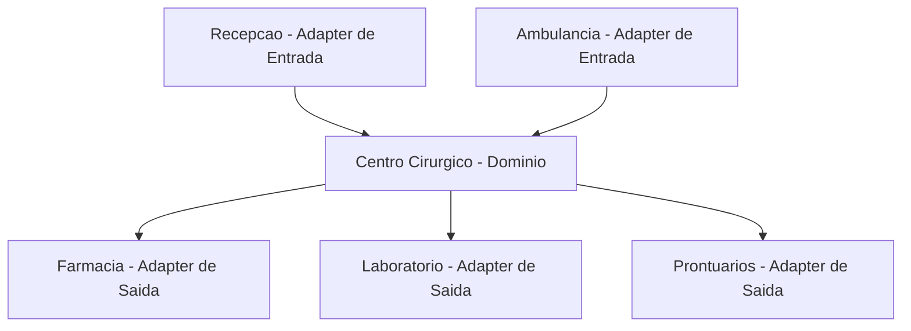

Guarde essa analogia. Ela vai te ajudar a entender tudo que vem a seguir.

---

## Contexto Histórico: De Onde Vieram Essas Ideias

Para entender por que essas arquiteturas existem, precisamos entender qual problema elas resolveram. Ninguém acordou um dia e decidiu "vamos criar mais abstrações por diversão". Foram problemas reais, em projetos reais, que motivaram essas ideias.

### O Problema: Código Colado na Infraestrutura

Nos anos 1990 e 2000, a maioria dos sistemas era construída com frameworks que misturavam lógica de negócio com infraestrutura. Em Java EE (Enterprise Edition), por exemplo, as regras de negócio ficavam dentro de componentes chamados EJBs (Enterprise JavaBeans) que dependiam diretamente do servidor de aplicação. Se você quisesse testar uma regra de negócio, precisava subir o servidor inteiro — banco de dados, servidor de aplicação, configurações de rede. Testar uma regra simples como "o preço não pode ser negativo" levava minutos, não segundos.

O mesmo acontecia em ASP.NET Web Forms: a lógica de negócio ficava misturada com o código da interface gráfica. Se você quisesse mudar a interface, precisava mexer na lógica. Se quisesse testar a lógica, precisava simular a interface. Tudo estava acoplado.

O resultado era previsível: sistemas difíceis de testar, difíceis de mudar e difíceis de evoluir. Trocar o banco de dados significava reescrever metade da aplicação. Trocar o framework de interface significava reescrever a outra metade. A lógica de negócio — a parte mais valiosa do sistema — estava presa dentro de tecnologias específicas.

### 2005: Alistair Cockburn e a Arquitetura Hexagonal

Em 2005, **Alistair Cockburn** (pronuncia-se "Cô-burn"), um dos signatários do Manifesto Ágil, publicou um artigo descrevendo o que ele chamou de **Hexagonal Architecture**, também conhecida como **Ports and Adapters** (Portas e Adaptadores).

A ideia central de Cockburn era simples e poderosa: **a lógica de negócio não deve depender de nada externo**. Nem do banco de dados, nem do framework web, nem da interface gráfica, nem de serviços externos. A lógica de negócio fica no centro, isolada. Tudo ao redor — banco, web, interface, serviços — são adaptadores que se conectam ao centro através de interfaces padronizadas (as "portas").

Por que "hexagonal"? Cockburn usou a forma de um hexágono para representar a aplicação, com cada lado representando uma porta diferente. Não há nada mágico no número 6 — o hexágono era apenas uma forma visual de mostrar que a aplicação tem múltiplos pontos de conexão com o mundo externo, e que todos são equivalentes. Poderia ser um octógono ou um decágono — o conceito seria o mesmo.

O nome "Ports and Adapters" é mais descritivo e é o preferido pelo próprio Cockburn. Mas "Hexagonal Architecture" pegou na comunidade e é o termo mais usado.

### 2008: Jeffrey Palermo e a Onion Architecture

Em 2008, **Jeffrey Palermo** publicou uma série de artigos descrevendo a **Onion Architecture** (Arquitetura Cebola). A ideia era a mesma da hexagonal — domínio no centro, infraestrutura na borda — mas representada como camadas concêntricas, como as camadas de uma cebola. A camada mais interna é o domínio puro. As camadas externas são infraestrutura.

A contribuição principal de Palermo foi formalizar a **regra de dependência**: as camadas internas nunca dependem das camadas externas. O domínio não sabe que existe um banco de dados. O domínio não sabe que existe uma API HTTP. O domínio só conhece suas próprias interfaces.

### 2012: Robert C. Martin e a Clean Architecture

Em 2012, **Robert C. Martin** (conhecido como "Uncle Bob" — Tio Bob), um dos nomes mais influentes da engenharia de software, publicou um artigo e depois um livro inteiro sobre o que chamou de **Clean Architecture** (Arquitetura Limpa).

A Clean Architecture é, na essência, a mesma ideia da hexagonal e da onion — domínio no centro, infraestrutura na borda, regra de dependência apontando para dentro. A contribuição de Uncle Bob foi consolidar essas ideias em um modelo com nomenclatura padronizada e regras claras, além de conectar com os princípios SOLID que você aprendeu no capítulo 9.

Uncle Bob definiu 4 camadas concêntricas:
1. **Entities** (Entidades) — regras de negócio da empresa, independentes de qualquer aplicação
2. **Use Cases** (Casos de Uso) — regras de negócio da aplicação específica
3. **Interface Adapters** (Adaptadores de Interface) — conversão de dados entre formatos
4. **Frameworks and Drivers** (Frameworks e Drivers) — detalhes técnicos (banco, web, UI)

### A Linha do Tempo

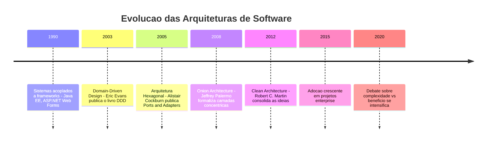

### O Ponto em Comum

Perceba algo importante: hexagonal (2005), onion (2008) e clean (2012) são **a mesma ideia com nomes diferentes**. Todas dizem a mesma coisa:

1. O domínio (lógica de negócio) fica no centro, isolado
2. A infraestrutura (banco, web, serviços externos) fica na borda
3. As dependências apontam para dentro — o domínio nunca depende da infraestrutura
4. A comunicação entre centro e borda acontece através de interfaces (portas/contratos)

A diferença entre elas é principalmente de nomenclatura e de como representam visualmente. O conceito fundamental é idêntico. Por isso, neste módulo, vamos focar na **hexagonal** (que é a mais citada e a que tem a nomenclatura mais intuitiva) e mencionar a clean como variação.

---

## Relembrando: O Padrão de 3 Camadas

Antes de entender a hexagonal, vamos relembrar como funciona o padrão de 3 camadas que você já conhece. Isso vai facilitar a comparação.

No padrão de 3 camadas, o código é organizado em:

1. **Controller** (camada de apresentação) — recebe entrada, formata saída
2. **Service** (camada de lógica de negócio) — aplica regras do domínio
3. **Repository** (camada de acesso a dados) — persiste e recupera dados

O fluxo é linear, de cima para baixo:

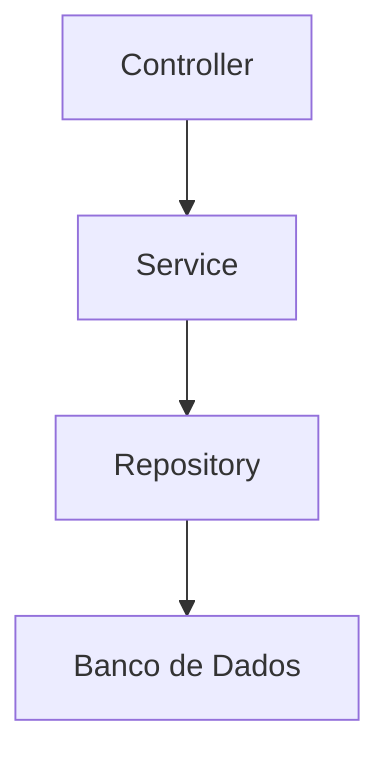

E as dependências também são de cima para baixo: o Controller depende do Service, o Service depende do Repository, o Repository depende do banco. Isso significa que **o Service conhece o Repository**. Ele sabe que existe uma camada de dados abaixo dele. Ele importa a interface do Repository e chama seus métodos.

Na prática, isso funciona muito bem. Mas tem uma consequência sutil: **a lógica de negócio (Service) depende da camada de dados (Repository)**. Se a interface do Repository mudar, o Service precisa mudar. Se o conceito de "repositório" mudar (por exemplo, se em vez de banco de dados você quiser usar uma API externa), o Service precisa saber.

Para a maioria dos projetos, isso não é um problema. Mas para projetos muito grandes, com regras de negócio muito complexas e muitas integrações externas, essa dependência pode se tornar um obstáculo.

---

## Arquitetura Hexagonal: Ports and Adapters

Agora sim, vamos entender a arquitetura hexagonal em detalhes.

### A Ideia Central

A ideia central da arquitetura hexagonal é radical na sua simplicidade: **o domínio não depende de nada**. Nada. Zero. O domínio não sabe que existe um banco de dados. Não sabe que existe uma API HTTP. Não sabe que existe um framework. O domínio é puro — contém apenas lógica de negócio e interfaces que ele mesmo define.

Tudo que não é domínio — banco de dados, API HTTP, interface gráfica, serviços externos, filas de mensagens — fica do lado de fora. São **adaptadores** que se conectam ao domínio através de **portas** (interfaces).

### Ports: As Portas

**Ports** (portas) são interfaces definidas pelo domínio. Existem dois tipos:

**Portas de entrada (driving ports / inbound ports):** definem o que o mundo externo pode pedir ao domínio. São as operações que a aplicação oferece. Por exemplo: "cadastrar produto", "buscar produto por ID", "atualizar preço". Quem chama essas operações é o mundo externo (um controller HTTP, um handler de fila, um teste automatizado).

**Portas de saída (driven ports / outbound ports):** definem o que o domínio precisa do mundo externo. São as dependências que a aplicação tem. Por exemplo: "salvar produto no armazenamento", "enviar email de notificação", "consultar taxa de câmbio". Quem implementa essas operações é a infraestrutura (um repositório de banco de dados, um serviço de email, uma API externa).

A diferença é sutil mas importante:
- Portas de entrada: "o que eu ofereço" — o domínio **define** e o mundo externo **usa**
- Portas de saída: "o que eu preciso" — o domínio **define** e a infraestrutura **implementa**

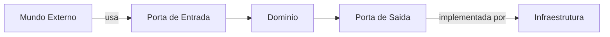

### Adapters: Os Adaptadores

**Adapters** (adaptadores) são as implementações concretas que se conectam às portas. Também existem dois tipos:

**Adaptadores de entrada (driving adapters):** implementam a forma como o mundo externo acessa o domínio. Exemplos:
- Um controller HTTP que recebe requisições REST e chama a porta de entrada
- Um handler de fila que consome mensagens e chama a porta de entrada
- Um comando CLI que lê argumentos do terminal e chama a porta de entrada
- Um teste automatizado que chama a porta de entrada diretamente

**Adaptadores de saída (driven adapters):** implementam as dependências que o domínio precisa. Exemplos:
- Um repositório que salva dados no PostgreSQL (implementa a porta de saída "salvar produto")
- Um cliente HTTP que consulta uma API externa (implementa a porta de saída "consultar taxa de câmbio")
- Um serviço de email que envia notificações via SMTP (implementa a porta de saída "enviar notificação")
- Uma implementação em memória para testes (implementa a porta de saída "salvar produto" sem banco real)

### O Diagrama Hexagonal

Agora vamos ver como tudo se encaixa visualmente:

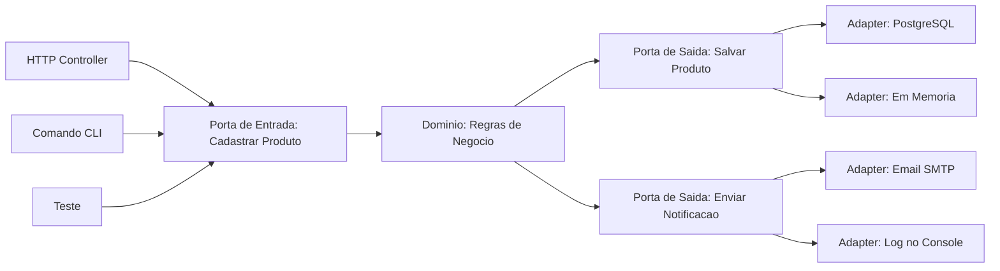

Observe o que acontece:
- O domínio está no centro. Ele não sabe se a requisição veio de HTTP, CLI ou teste
- O domínio não sabe se os dados vão para PostgreSQL ou para memória
- O domínio não sabe se a notificação vai por email ou por log
- Tudo que o domínio conhece são suas próprias portas (interfaces)

### Em Código: Como Ficaria

Vamos ver um exemplo simplificado em C# para tornar concreto. Não é para você implementar agora — é para visualizar a diferença em relação às 3 camadas.

**Porta de entrada (interface definida pelo domínio):**

```csharp
// === Domain/Ports/Inbound/IProductService.cs ===
// Porta de entrada: o que o dominio oferece ao mundo externo
// "IProductService" = interface do servico de produtos

public interface IProductService
{
    string Register(string name, decimal price);  // "Register" = cadastrar
    Product FindById(int id);                     // "FindById" = buscar por ID
    List<Product> ListAll();                      // "ListAll" = listar todos
}
```

Saída esperada: nenhuma (é apenas a definição da interface)

**Porta de saída (interface definida pelo domínio):**

```csharp
// === Domain/Ports/Outbound/IProductRepository.cs ===
// Porta de saida: o que o dominio precisa da infraestrutura
// "IProductRepository" = interface do repositorio de produtos

public interface IProductRepository
{
    void Save(Product product);          // "Save" = salvar
    Product FindById(int id);            // "FindById" = buscar por ID
    List<Product> FindAll();             // "FindAll" = buscar todos
    bool ExistsByName(string name);      // "ExistsByName" = existe com esse nome
}
```

Saída esperada: nenhuma (é apenas a definição da interface)

**Implementação do domínio (usa apenas as portas):**

```csharp
// === Domain/Services/ProductService.cs ===
// Implementacao da logica de negocio — usa apenas interfaces do dominio
// "ProductService" = servico de produtos

public class ProductService : IProductService
{
    private readonly IProductRepository _repository; // porta de saida

    public ProductService(IProductRepository repository)
    {
        _repository = repository; // recebe a implementacao por injecao
    }

    public string Register(string name, decimal price)
    {
        // Regra de negocio: preco deve ser positivo
        if (price <= 0)
            return "Erro: preco deve ser maior que zero.";

        // Regra de negocio: nome nao pode ser duplicado
        if (_repository.ExistsByName(name))
            return $"Erro: ja existe produto com nome '{name}'.";

        var product = new Product(name, price);
        _repository.Save(product);
        return $"Produto '{name}' cadastrado com sucesso!";
    }

    public Product FindById(int id)
    {
        return _repository.FindById(id);
    }

    public List<Product> ListAll()
    {
        return _repository.FindAll();
    }
}
```

Saída esperada: nenhuma (é apenas a definição da classe)

**Adaptador de saída (infraestrutura):**

```csharp
// === Infrastructure/Adapters/Outbound/PostgresProductRepository.cs ===
// Adaptador de saida: implementa a porta usando PostgreSQL
// "PostgresProductRepository" = repositorio de produtos com PostgreSQL

public class PostgresProductRepository : IProductRepository
{
    // Aqui ficaria a conexao com o banco PostgreSQL
    // Implementa todos os metodos da porta de saida

    public void Save(Product product)
    {
        // INSERT INTO products (name, price) VALUES (...)
    }

    public Product FindById(int id)
    {
        // SELECT * FROM products WHERE id = ...
        return null; // simplificado
    }

    public List<Product> FindAll()
    {
        // SELECT * FROM products
        return new List<Product>(); // simplificado
    }

    public bool ExistsByName(string name)
    {
        // SELECT COUNT(*) FROM products WHERE name = ...
        return false; // simplificado
    }
}
```

Saída esperada: nenhuma (é apenas a definição da classe)

**Adaptador de entrada (infraestrutura):**

```csharp
// === Infrastructure/Adapters/Inbound/ProductHttpController.cs ===
// Adaptador de entrada: recebe requisicoes HTTP e chama o dominio
// "ProductHttpController" = controlador HTTP de produtos

public class ProductHttpController
{
    private readonly IProductService _service; // porta de entrada

    public ProductHttpController(IProductService service)
    {
        _service = service; // usa a interface, nao a implementacao
    }

    // Recebe requisicao HTTP POST e chama o dominio
    public string HandleCreateProduct(string name, decimal price)
    {
        return _service.Register(name, price);
    }

    // Recebe requisicao HTTP GET e chama o dominio
    public List<Product> HandleListProducts()
    {
        return _service.ListAll();
    }
}
```

Saída esperada: nenhuma (é apenas a definição da classe)

### Estrutura de Pastas na Hexagonal

A estrutura de pastas reflete a separação entre domínio e infraestrutura:

```
MeuProjeto/
    Domain/                              # O centro — logica de negocio pura
        Models/
            Product.cs                   # Entidade de dominio
        Ports/
            Inbound/
                IProductService.cs       # Porta de entrada
            Outbound/
                IProductRepository.cs    # Porta de saida
        Services/
            ProductService.cs            # Implementacao da logica
    Infrastructure/                      # A borda — adaptadores
        Adapters/
            Inbound/
                ProductHttpController.cs # Adapter HTTP
                ProductCliHandler.cs     # Adapter CLI
            Outbound/
                PostgresProductRepository.cs  # Adapter PostgreSQL
                InMemoryProductRepository.cs  # Adapter em memoria
        Config/
            DependencyInjection.cs       # Monta as dependencias
    Program.cs                           # Ponto de entrada
```

Compare com a estrutura de 3 camadas:

```
MeuProjeto/
    Controllers/
        ProductController.cs
    Services/
        ProductService.cs
    Repositories/
        ProductRepository.cs
    Models/
        Product.cs
    Program.cs
```

Percebe a diferença? A hexagonal tem mais pastas, mais arquivos, mais níveis de organização. O que era 5 arquivos virou 8 ou mais. E isso é para um sistema simples com uma única entidade. Em um sistema real com 10 entidades, a diferença se multiplica.

Veja a estrutura hexagonal em um diagrama de classes:

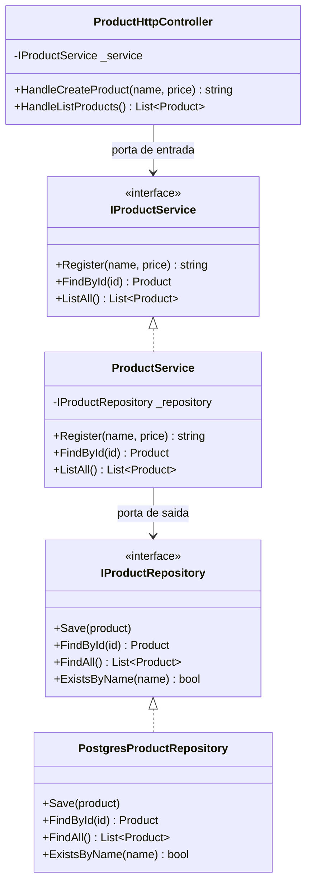

---

## A Inversao de Dependência: O Truque por Tras de Tudo

Se você prestou atenção no código acima, talvez tenha notado algo familiar. No capítulo 9, módulo 9.10, você aprendeu os princípios SOLID. O último deles — o **D** — é o **Dependency Inversion Principle** (Princípio da Inversão de Dependência). Ele diz:

> "Módulos de alto nível não devem depender de módulos de baixo nível. Ambos devem depender de abstrações."

Isso é exatamente o que a arquitetura hexagonal faz. No padrão de 3 camadas tradicional, o Service depende do Repository:

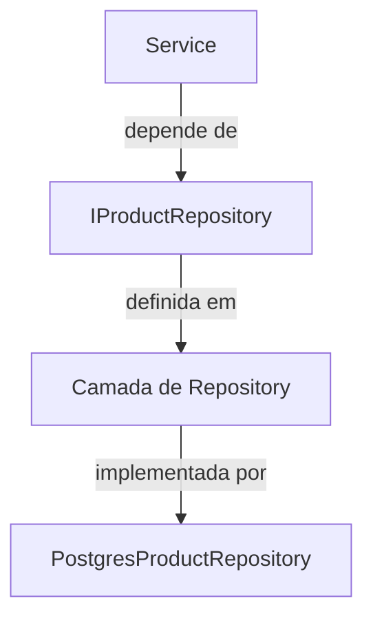

Na hexagonal, a interface `IProductRepository` é definida **pelo domínio**, não pela camada de dados:

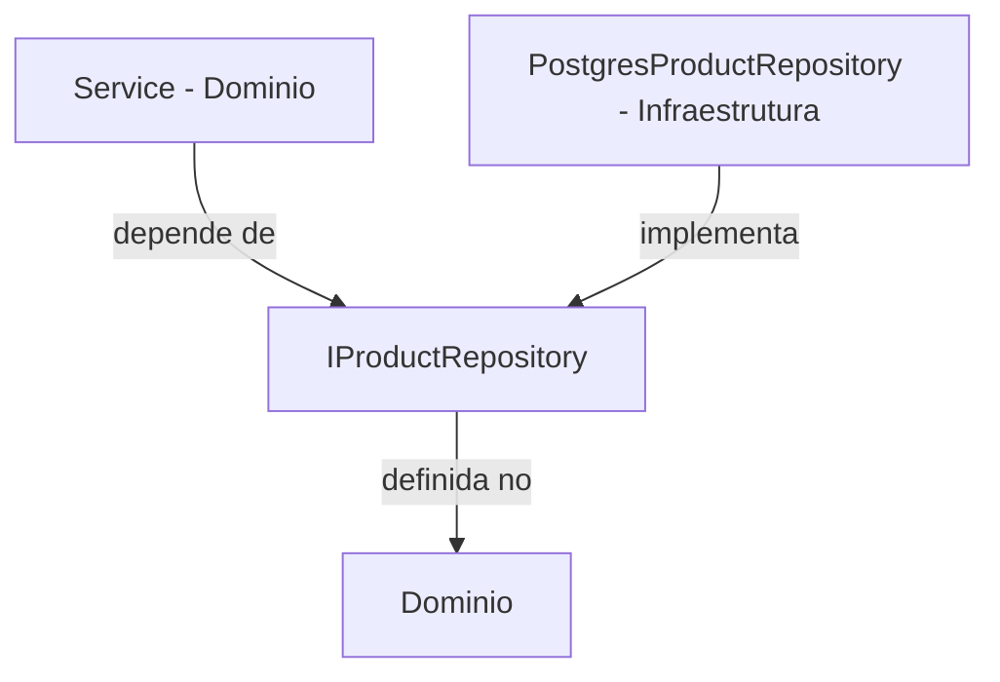

A diferença parece sutil, mas é fundamental. Na hexagonal, a **interface pertence ao domínio**. A infraestrutura é que depende do domínio — não o contrário. Isso inverte a direção da dependência: em vez de o domínio depender da infraestrutura, a infraestrutura depende do domínio.

Na prática, isso significa que:
- O domínio pode ser compilado e testado **sem nenhuma infraestrutura**
- Você pode rodar todos os testes de regras de negócio sem banco de dados, sem servidor HTTP, sem nada
- Trocar o banco de dados é criar um novo adaptador — o domínio não muda uma linha

### Mas espera — no padrão de 3 camadas ja usamos interfaces

Sim. E essa é uma observação excelente. No capítulo 9, quando você criou `IProductRepository` e implementou `InMemoryProductRepository` e `SqliteProductRepository`, você já estava usando inversão de dependência. O Service dependia da interface, não da implementação concreta.

Então qual é a diferença? Na prática, para projetos simples, **quase nenhuma**. A diferença aparece na **organização** e na **rigidez das regras**:

| Aspecto | 3 Camadas com Interface | Hexagonal |
|---------|------------------------|-----------|
| Interface definida onde | Na camada de Repository ou em pasta compartilhada | Dentro do Dominio, na pasta Ports |
| Quem depende de quem | Service depende da interface que esta na camada de dados | Infraestrutura depende da interface que esta no dominio |
| Regra de dependência | Convencao do time, não forcada | Regra arquitetural rigida, pode ser forcada por ferramentas |
| Dominio compilavel sozinho | Depende, nem sempre | Sempre — o dominio não referência nada externo |
| Complexidade | Menor | Maior |

Para a maioria dos projetos, usar interfaces no padrão de 3 camadas já dá 90% do benefício da hexagonal com 50% da complexidade. A hexagonal adiciona os outros 10% de isolamento ao custo de 50% mais complexidade. Vale a pena? Depende do projeto.

---

## Clean Architecture: A Mesma Ideia com Camadas Concentricas

A **Clean Architecture** de Robert C. Martin é, na essência, a mesma ideia da hexagonal — mas representada como camadas concêntricas em vez de um hexágono com portas.

### As 4 Camadas

Uncle Bob define 4 camadas, do centro para fora:

**1. Entities (Entidades)** — o núcleo mais interno. Contém as regras de negócio da empresa — regras que existiriam mesmo sem software. Exemplo: "um produto deve ter preço positivo" é uma regra de negócio que vale para qualquer sistema, qualquer interface, qualquer banco de dados.

**2. Use Cases (Casos de Uso)** — contém as regras de negócio da aplicação específica. Exemplo: "ao cadastrar um produto, verificar se o nome já existe e enviar notificação ao gerente" é uma regra específica desta aplicação.

**3. Interface Adapters (Adaptadores de Interface)** — converte dados entre o formato que os use cases usam e o formato que os frameworks externos usam. Controllers, Presenters, Gateways ficam aqui.

**4. Frameworks and Drivers (Frameworks e Drivers)** — a camada mais externa. Banco de dados, framework web, bibliotecas de UI. São detalhes técnicos que podem ser trocados.

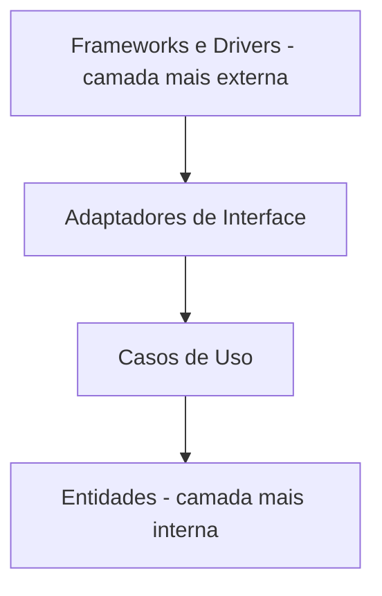

### A Regra de Dependência

A regra mais importante da Clean Architecture é a **Dependency Rule** (Regra de Dependência):

> "As dependências de código-fonte devem apontar apenas para dentro — em direção às camadas de nível mais alto (mais internas)."

Isso significa:
- Frameworks e Drivers podem depender de Adaptadores
- Adaptadores podem depender de Use Cases
- Use Cases podem depender de Entities
- **Entities não dependem de nada**
- **Use Cases não dependem de Adaptadores nem de Frameworks**

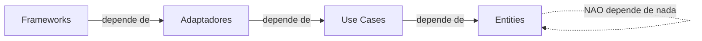

### Hexagonal vs Clean: Qual a Diferença

Na prática, a diferença é mínima. Ambas dizem a mesma coisa com vocabulários diferentes:

| Conceito | Hexagonal | Clean Architecture |
|----------|-----------|-------------------|
| Lógica de negocio no centro | Dominio | Entities + Use Cases |
| Interfaces do dominio | Ports | Interfaces nos Use Cases |
| Implementacoes externas | Adapters | Frameworks and Drivers |
| Conversao de dados | Parte dos Adapters | Interface Adapters |
| Regra principal | Dominio não depende de infraestrutura | Dependências apontam para dentro |
| Representacao visual | Hexagono com portas | Circulos concentricos |
| Criador | Alistair Cockburn, 2005 | Robert C. Martin, 2012 |

Se alguém te perguntar "qual a diferença entre hexagonal e clean?", a resposta honesta é: **o conceito é o mesmo, a nomenclatura é diferente**. A hexagonal fala em "ports" e "adapters". A clean fala em "entities", "use cases", "interface adapters" e "frameworks". Mas o princípio fundamental — domínio isolado no centro, infraestrutura na borda, dependências apontando para dentro — é idêntico.

Na comunidade de desenvolvimento, você vai encontrar projetos que dizem usar "hexagonal", outros que dizem usar "clean", e outros que misturam os dois vocabulários. Não se preocupe com o rótulo — entenda o conceito.

---

## Vantagens das Arquiteturas Alternativas

Agora que você entende o conceito, vamos ser justos e listar as vantagens reais dessas arquiteturas. Elas existem por boas razões.

### 1. Dominio Totalmente Isolado e Testavel

A maior vantagem é a testabilidade. Como o domínio não depende de nada externo, você pode testar todas as regras de negócio sem banco de dados, sem servidor HTTP, sem nenhuma infraestrutura. Os testes rodam em milissegundos, não em segundos.

Em projetos com regras de negócio complexas (sistemas financeiros, sistemas de saúde, sistemas jurídicos), isso é extremamente valioso. Você pode ter centenas de testes de regras de negócio que rodam em menos de 1 segundo. Isso dá confiança para mudar o código sem medo de quebrar algo.

### 2. Facilidade para Trocar Tecnologias

Precisa trocar o banco de dados de PostgreSQL para MongoDB? Crie um novo adaptador. O domínio não muda. Precisa adicionar uma API GraphQL além da REST? Crie um novo adaptador de entrada. O domínio não muda. Precisa trocar o serviço de email de SMTP para SendGrid? Crie um novo adaptador de saída. O domínio não muda.

Essa flexibilidade é real e valiosa — mas só se você realmente precisar trocar tecnologias. Se o banco vai ser PostgreSQL pelos próximos 5 anos, a flexibilidade de trocar facilmente não tem valor prático.

### 3. Clareza nas Fronteiras

A separação rígida entre domínio e infraestrutura torna as fronteiras muito claras. Novos desenvolvedores entendem rapidamente onde colocar cada tipo de código: regra de negócio vai no domínio, acesso a banco vai no adaptador, recebimento de requisição vai no adaptador de entrada. Não há ambiguidade.

### 4. Multiplos Pontos de Entrada

O domínio pode ser acessado por múltiplos adaptadores de entrada simultaneamente: API HTTP, CLI, fila de mensagens, testes, cron jobs. Todos usam as mesmas portas de entrada, garantindo que as mesmas regras de negócio são aplicadas independentemente de como a requisição chegou.

---

## Desvantagens das Arquiteturas Alternativas

E agora, as desvantagens. Preste muita atenção aqui — porque essas desvantagens são frequentemente subestimadas.

### 1. Muito Mais Código

Para cada operação, você precisa de: uma interface de porta de entrada, uma interface de porta de saída, uma implementação de domínio, um adaptador de entrada e um adaptador de saída. O que no padrão de 3 camadas seria 3 classes (Controller, Service, Repository), na hexagonal pode virar 5 ou mais.

Em um sistema com 10 entidades e 5 operações por entidade, a diferença é significativa. Mais código significa mais para ler, mais para manter, mais para entender, mais para dar errado.

### 2. Mais Abstrações e Indireções

Cada chamada passa por mais camadas de abstração. Para entender o fluxo completo de "cadastrar um produto", você precisa navegar por: adaptador de entrada → porta de entrada → implementação do domínio → porta de saída → adaptador de saída. São 5 saltos em vez de 3.

Para desenvolvedores juniores (e até para seniores que não conhecem o padrão), isso é confuso. "Onde fica a lógica de cadastro?" — está no domínio. "Onde fica o acesso ao banco?" — está no adaptador de saída. "Onde fica a interface?" — está na porta de entrada. A curva de aprendizado é real.

### 3. Over-Engineering para Projetos Simples

Se o seu projeto é um CRUD com 5 entidades e um time de 3 pessoas, a hexagonal é over-engineering. Você vai gastar mais tempo organizando o código do que escrevendo lógica de negócio. O benefício de isolamento total do domínio não compensa o custo de complexidade quando o domínio é simples.

Lembra da regra prática do módulo 10.7? "Se você está em dúvida entre simples e complexo, escolha simples." Essa regra se aplica perfeitamente aqui.

### 4. Falsa Sensacao de Flexibilidade

"Com hexagonal, posso trocar o banco de dados facilmente!" — sim, pode. Mas com que frequência você troca o banco de dados? Na maioria dos projetos, a resposta é: nunca. Ou talvez uma vez em 5 anos. Construir toda uma arquitetura para facilitar algo que provavelmente nunca vai acontecer é um custo sem retorno.

Isso não significa que flexibilidade é ruim. Significa que flexibilidade tem um custo, e esse custo precisa ser justificado por uma necessidade real, não por uma possibilidade teórica.

### 5. Complexidade de Configuração

Na hexagonal, todas as dependências são injetadas. Isso significa que em algum lugar do código existe uma "raiz de composição" (composition root) onde todas as peças são montadas: "use este adaptador de banco, use este adaptador de email, use este adaptador HTTP". Essa configuração pode ficar complexa em sistemas grandes.

---

## Comparação Detalhada: 3 Camadas vs Hexagonal vs Clean

Vamos colocar as três abordagens lado a lado para uma comparação completa:

| Critério | 3 Camadas | Hexagonal | Clean Architecture |
|----------|-----------|-----------|-------------------|
| Complexidade | Baixa | Alta | Alta |
| Quantidade de código | Menor | Maior | Maior |
| Curva de aprendizado | Baixa | Alta | Alta |
| Testabilidade do dominio | Boa, com interfaces | Excelente, dominio isolado | Excelente, dominio isolado |
| Facilidade de trocar tecnologias | Moderada | Alta | Alta |
| Clareza de fronteiras | Boa | Muito boa | Muito boa |
| Tempo para implementar um CRUD | Rápido | Lento | Lento |
| Ideal para times pequenos | Sim | Não | Não |
| Ideal para dominios complexos | Suficiente na maioria | Sim | Sim |
| Ideal para multiplas integracoes | Moderado | Sim | Sim |
| Risco de over-engineering | Baixo | Alto | Alto |
| Adocao na industria | Muito alta | Moderada | Moderada |
| Documentação e exemplos | Abundante | Moderada | Boa, livro de referência |
| Nomenclatura | Controller, Service, Repository | Ports, Adapters, Domain | Entities, Use Cases, Interface Adapters |
| Regra de dependência | Convencao | Rigida | Rigida |
| Representacao visual | Camadas empilhadas | Hexagono com portas | Circulos concentricos |

### Quando Usar Cada Uma

| Cenário | Recomendacao | Por que |
|---------|-------------|---------|
| CRUD simples, time pequeno, 1-5 entidades | 3 Camadas | Simplicidade máxima, sem overhead desnecessario |
| Aplicação de medio porte, 5-20 entidades, regras moderadas | 3 Camadas com interfaces | Bom equilibrio entre organização e simplicidade |
| Dominio complexo com muitas regras de negocio | Hexagonal ou Clean | Isolamento do dominio facilita testes e evolução |
| Multiplas integracoes externas que podem mudar | Hexagonal | Adaptadores facilitam trocar integracoes |
| Multiplos pontos de entrada: API, CLI, filas, cron | Hexagonal | Portas de entrada permitem multiplos adaptadores |
| Projeto com requisitos regulatorios rigorosos | Hexagonal ou Clean | Dominio isolado facilita auditoria e compliance |
| MVP ou prototipo rápido | 3 Camadas | Velocidade de desenvolvimento e prioridade |
| Projeto academico ou de aprendizado | 3 Camadas | Foco no conceito, não na arquitetura |

### A Regra Prática

Se você está em dúvida sobre qual arquitetura usar, siga esta regra:

> **Comece com 3 camadas. Use interfaces nos repositórios (como você aprendeu no capítulo 9). Se e quando o domínio ficar tão complexo que o isolamento total se justifique, migre para hexagonal. Não comece com hexagonal "por precaução".**

Essa regra é pragmática e segura. Começar simples e evoluir quando necessário é sempre melhor do que começar complexo e sofrer com a complexidade desde o dia 1.

---

## O Fluxo Completo: Comparando Visualmente

Para fixar a diferença, vamos ver o fluxo de "cadastrar um produto" nas três arquiteturas:

### Fluxo em 3 Camadas

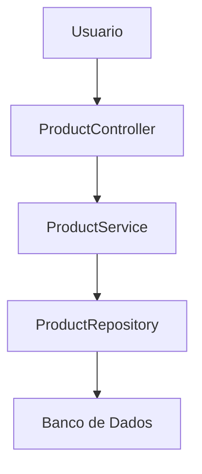

3 classes. Fluxo direto. Simples.

### Fluxo em Hexagonal

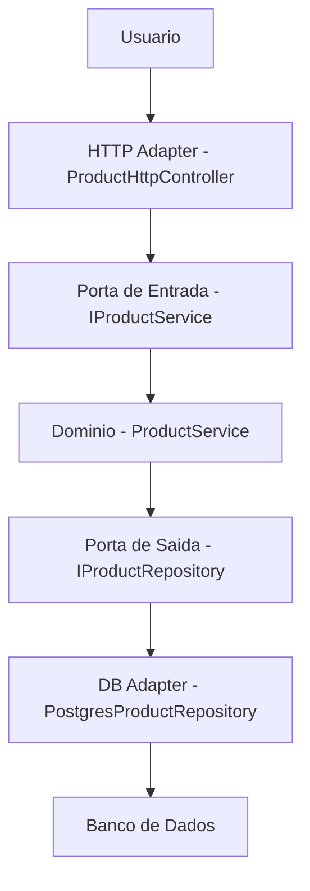

5 classes + 2 interfaces. Mais indireções. Mais isolamento.

### Fluxo em Clean Architecture

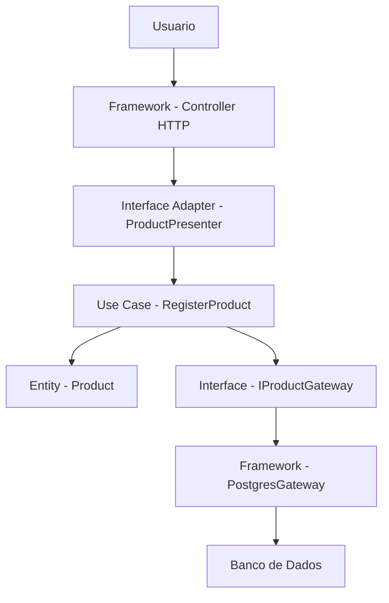

6 classes + 1 interface. Nomenclatura diferente, conceito similar à hexagonal.

A complexidade cresce visivelmente. Para um CRUD simples, essa complexidade não se paga. Para um sistema financeiro com 200 regras de negócio e 15 integrações externas, essa complexidade pode valer cada linha de código extra.

---

## O Perigo do Hype: Por Que Tanta Gente Adota Sem Necessidade

Existe um fenômeno na indústria de software que vale a pena discutir: o **hype** (empolgação exagerada) em torno de arquiteturas sofisticadas.

Quando Uncle Bob publicou o livro "Clean Architecture" em 2017, ele se tornou um best-seller. Artigos, vídeos, cursos e palestras sobre Clean Architecture explodiram. Muitos desenvolvedores leram o livro e pensaram: "preciso usar isso no meu projeto". E começaram a aplicar Clean Architecture em CRUDs simples, em MVPs, em projetos pessoais com 3 entidades.

O resultado? Projetos com 50 arquivos para fazer o que poderia ser feito com 15. Desenvolvedores gastando mais tempo navegando entre camadas do que escrevendo lógica. Times inteiros debatendo se uma classe deveria ficar em "Use Cases" ou em "Interface Adapters" em vez de entregar funcionalidades.

Isso não é culpa do Uncle Bob nem da Clean Architecture. É culpa de aplicar a ferramenta errada para o problema errado. Clean Architecture foi projetada para sistemas enterprise complexos — não para todo projeto que existe.

### Sinais de que Você Esta Usando Arquitetura Demais

Se você reconhece algum desses sinais no seu projeto, provavelmente está usando mais arquitetura do que precisa:

- Criar um novo endpoint leva mais de 30 minutos por causa de todas as camadas e interfaces
- Mais de 60% dos arquivos do projeto são interfaces com uma única implementação
- Novos desenvolvedores levam semanas para entender a estrutura do projeto
- O time debate mais sobre "onde colocar essa classe" do que sobre regras de negócio
- Você tem adaptadores que nunca foram trocados e provavelmente nunca serão
- O domínio tem 10 linhas de lógica e 200 linhas de infraestrutura ao redor

### O Conselho de Martin Fowler

Martin Fowler, um dos maiores nomes da engenharia de software, tem uma frase que resume bem:

> "Qualquer tolo pode escrever código que um computador entende. Bons programadores escrevem código que humanos entendem."

Arquitetura sofisticada que ninguém no time entende não é boa arquitetura. É complexidade desnecessária. A melhor arquitetura é aquela que o time inteiro entende, consegue manter e consegue evoluir.

---

## Quando Hexagonal e Clean Realmente Fazem Sentido

Depois de tantos avisos sobre complexidade, vamos ser justos: existem cenários onde essas arquiteturas realmente brilham.

### Cenário 1: Dominio Muito Complexo

Sistemas financeiros, sistemas de saúde, sistemas jurídicos — domínios onde as regras de negócio são complexas, numerosas e mudam com frequência. Nesses sistemas, isolar o domínio completamente permite que as regras sejam testadas exaustivamente e modificadas com confiança.

Um banco digital, por exemplo, pode ter centenas de regras sobre limites de transação, taxas, compliance regulatório, prevenção a fraude. Essas regras precisam ser testadas isoladamente, sem depender de banco de dados ou serviços externos. A hexagonal facilita isso.

### Cenário 2: Multiplas Integracoes que Mudam

Se o sistema se integra com 10 serviços externos e esses serviços mudam com frequência (APIs que atualizam versão, fornecedores que são trocados, protocolos que evoluem), ter adaptadores bem definidos facilita a manutenção. Trocar um adaptador é muito mais seguro do que mexer na lógica de negócio.

### Cenário 3: Multiplos Canais de Entrada

Se o mesmo domínio precisa ser acessado por API REST, API GraphQL, CLI, fila de mensagens e cron jobs, a hexagonal organiza isso naturalmente. Cada canal é um adaptador de entrada que usa as mesmas portas. As regras de negócio são aplicadas uma única vez, independentemente de como a requisição chegou.

### Cenário 4: Requisitos Regulatorios

Em setores regulados (financeiro, saúde, governo), pode ser necessário demonstrar que as regras de negócio estão isoladas e testadas independentemente da infraestrutura. A separação rígida da hexagonal facilita auditorias e certificações.

---

## Domain-Driven Design: O Companheiro Natural

Você pode ter ouvido falar de **DDD** — **Domain-Driven Design** (Design Orientado ao Domínio). É uma abordagem criada por **Eric Evans** em 2003, no livro "Domain-Driven Design: Tackling Complexity in the Heart of Software".

DDD não é uma arquitetura — é uma forma de pensar sobre o software a partir do domínio do negócio. A ideia central é que o código deve refletir a linguagem e os conceitos do negócio. Se o negócio fala em "pedidos", "clientes" e "entregas", o código deve ter classes chamadas `Order`, `Customer` e `Delivery` — não `DataProcessor`, `EntityManager` ou `Handler42`.

DDD e hexagonal são frequentemente usados juntos porque compartilham a mesma filosofia: **o domínio é o centro de tudo**. DDD define como modelar o domínio. Hexagonal define como isolar o domínio da infraestrutura.

Mas DDD é um assunto vasto e complexo — livros inteiros são dedicados a ele. Neste módulo, basta saber que existe e que é o companheiro natural da hexagonal. Se no futuro você trabalhar em um projeto que usa hexagonal ou clean, provavelmente vai encontrar conceitos de DDD também.

---

## Resumo Visual: As Tres Arquiteturas

Para fechar a parte conceitual, um resumo visual das três abordagens:

### 3 Camadas: Empilhadas

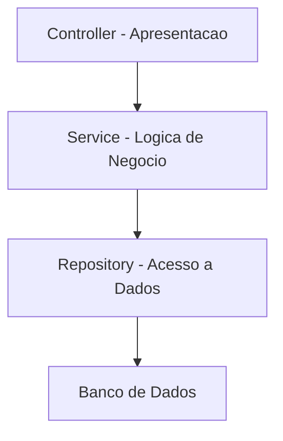

Simples. Direto. Funciona para a maioria dos projetos.

### Hexagonal: Centro e Borda

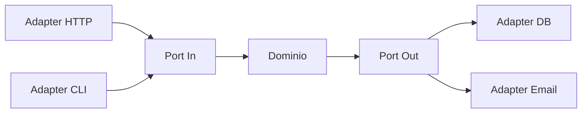

Domínio isolado. Múltiplos adaptadores. Para projetos com domínio complexo.

### Clean: Camadas Concentricas

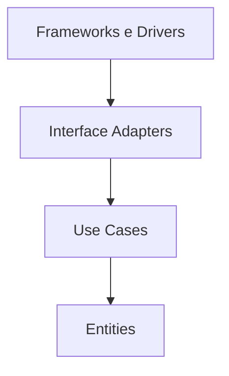

Mesma ideia da hexagonal. Nomenclatura de Uncle Bob. Regra de dependência para dentro.

---

## Erros Comuns ao Adotar Arquiteturas Alternativas

Antes de seguir para as seções finais, vamos falar sobre os erros mais comuns que desenvolvedores cometem ao adotar hexagonal ou clean architecture. Conhecer esses erros vai te ajudar a evitá-los — seja quando você adotar essas arquiteturas, seja quando entrar em um projeto que já as usa.

### Erro 1: Adotar Porque e Elegante

"Hexagonal é mais bonita, mais organizada, mais profissional." Pode até ser — mas elegância não é critério para escolher arquitetura. O critério é: **resolve o problema com o menor custo possível?** Se 3 camadas resolve, usar hexagonal por elegância é desperdício de tempo e dinheiro.

### Erro 2: Aplicar em Todo o Sistema

Nem todo módulo do sistema precisa da mesma arquitetura. O módulo de autenticação pode ser um CRUD simples com 3 camadas. O módulo de cálculo de impostos, com 50 regras complexas, pode usar hexagonal. Misturar arquiteturas dentro do mesmo sistema é perfeitamente válido — e muitas vezes é a decisão mais inteligente.

### Erro 3: Criar Interfaces para Tudo

Na hexagonal, interfaces (ports) fazem sentido para pontos de integração que podem mudar. Mas criar uma interface para cada classe, incluindo classes que nunca terão mais de uma implementação, é burocracia sem benefício. Se a classe `DateFormatter` só tem uma implementação e nunca vai ter outra, não precisa de interface.

### Erro 4: Confundir Nomenclatura com Arquitetura

Renomear a pasta "Services" para "UseCases" e a pasta "Repositories" para "Gateways" não transforma 3 camadas em Clean Architecture. A diferença está na **direção das dependências** e no **isolamento do domínio**, não nos nomes das pastas. Mudar nomes sem mudar a estrutura de dependências é teatro arquitetural.

### Erro 5: Ignorar o Custo de Onboarding

Quando um novo desenvolvedor entra no time, quanto tempo ele leva para entender a estrutura do projeto? Em 3 camadas, geralmente minutos. Em hexagonal bem implementada, pode levar dias. Esse custo de onboarding é real e deve ser considerado — especialmente em times com rotatividade alta ou com muitos juniores.

---

## A Evolução Natural: De 3 Camadas para Hexagonal

Se você começar com 3 camadas (como recomendamos) e no futuro precisar migrar para hexagonal, a boa notícia é que a migração é gradual. Você não precisa reescrever tudo de uma vez.

### Passo 1: Já Feito — Interfaces nos Repositórios

Se você seguiu o capítulo 9 e usa interfaces nos repositórios (`IProductRepository`), você já deu o primeiro passo. O Service já depende de uma abstração, não de uma implementação concreta.

### Passo 2: Mover Interfaces para o Dominio

O próximo passo é mover as interfaces dos repositórios para dentro da pasta do domínio. Em vez de a interface ficar em `Repositories/IProductRepository.cs`, ela vai para `Domain/Ports/Outbound/IProductRepository.cs`. Isso inverte a dependência: agora a infraestrutura depende do domínio.

### Passo 3: Criar Portas de Entrada

Extrair interfaces para os services: `IProductService` fica em `Domain/Ports/Inbound/`. Os controllers passam a depender dessa interface em vez da implementação concreta.

### Passo 4: Reorganizar Pastas

Mover os controllers e repositórios concretos para `Infrastructure/Adapters/`. Pronto — você tem uma arquitetura hexagonal.

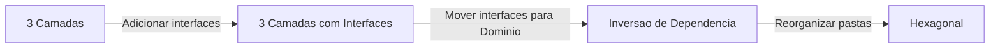

Essa migração pode ser feita módulo por módulo, sem parar o desenvolvimento. Comece pelo módulo mais complexo (que mais se beneficia do isolamento) e vá expandindo conforme a necessidade.

---

## Como a IA pode te ajudar aqui

Este módulo é conceitual, mas a IA pode ser uma parceira valiosa para aprofundar seu entendimento: **Prompt 1 — Comparação prática:**

**Prompt 1 — Comparar alternativas:**
> "Me mostre o mesmo CRUD de produtos implementado em 3 camadas e em arquitetura hexagonal usando C#. Quero ver a diferença na quantidade de arquivos, na estrutura de pastas e no fluxo de uma requisição de cadastro."

**Prompt 2 — Aprofundar o tema:**
> "Estou construindo um sistema de gestão de estoque para uma loja com 3 desenvolvedores. O sistema tem 8 entidades e regras de negócio moderadas. Devo usar 3 camadas ou hexagonal? Me dê argumentos para os dois lados."

**Prompt 3 — Explorar o conceito:**
> "Me explique a inversão de dependência na arquitetura hexagonal como se eu fosse um desenvolvedor júnior. Use um exemplo concreto com código em C# mostrando a diferença entre o domínio depender da infraestrutura e a infraestrutura depender do domínio."

---

## Casos de Uso no Mundo Real

### Caso 1: Nubank — Dominio Financeiro Complexo

O Nubank é um dos exemplos mais citados de empresa que se beneficia de arquiteturas com domínio isolado. Em um banco digital, as regras de negócio são extremamente complexas: cálculo de juros, limites de crédito, compliance regulatório, prevenção a fraude, regras do Banco Central. Cada uma dessas regras precisa ser testada exaustivamente e de forma isolada.

O problema que a arquitetura resolve: se as regras de cálculo de juros dependessem diretamente do banco de dados, testar uma mudança na fórmula de juros exigiria subir o banco, popular com dados de teste e executar queries. Com o domínio isolado, o teste é direto: cria o objeto, chama o método, verifica o resultado. Milissegundos em vez de segundos.

Além disso, o Nubank precisa se integrar com dezenas de sistemas externos: Banco Central, bandeiras de cartão, bureaus de crédito, sistemas de pagamento. Cada integração é um adaptador que pode mudar sem afetar as regras de negócio.

### Caso 2: Sistemas de Saude — Requisitos Regulatorios

Sistemas de saúde que lidam com prontuários eletrônicos (como os que seguem o padrão HL7 FHIR) precisam garantir que as regras de negócio estão corretas e auditáveis. Um erro no cálculo de dosagem de medicamento pode ter consequências graves.

O problema que a arquitetura resolve: isolar as regras de dosagem, interação medicamentosa e protocolos clínicos em um domínio puro permite que essas regras sejam testadas com cobertura de 100%, auditadas por especialistas médicos e certificadas por órgãos reguladores — tudo sem depender de infraestrutura técnica.

Os adaptadores permitem que o mesmo domínio seja acessado por diferentes sistemas: o sistema do hospital, o aplicativo do médico, o portal do paciente e integrações com laboratórios. Cada um é um adaptador de entrada diferente, mas as regras são as mesmas.

### Caso 3: E-commerce com Multiplos Canais

Uma empresa de e-commerce que vende pelo site, pelo aplicativo móvel, por marketplaces (Mercado Livre, Amazon), por WhatsApp e por uma equipe de televendas. Cada canal é um ponto de entrada diferente, mas as regras de negócio são as mesmas: verificar estoque, calcular frete, aplicar desconto, processar pagamento.

O problema que a arquitetura resolve: sem hexagonal, cada canal teria sua própria implementação das regras de negócio — e inevitavelmente elas divergiriam. "O desconto funciona no site mas não no app." Com hexagonal, cada canal é um adaptador de entrada que usa as mesmas portas. As regras são implementadas uma única vez no domínio.

---

## Resumo do Módulo

| Conceito | Definição |
|----------|-----------|
| Arquitetura Hexagonal | Padrão onde o dominio fica no centro, isolado, e tudo ao redor são adaptadores conectados por portas |
| Ports and Adapters | Outro nome para arquitetura hexagonal — portas são interfaces, adaptadores são implementacoes |
| Port de entrada | Interface que define o que o dominio oferece ao mundo externo |
| Port de saida | Interface que define o que o dominio precisa da infraestrutura |
| Adapter de entrada | Implementação que conecta o mundo externo ao dominio: HTTP, CLI, fila |
| Adapter de saida | Implementação que conecta o dominio a infraestrutura: banco, email, API externa |
| Clean Architecture | Arquitetura de Robert C. Martin com camadas concentricas e regra de dependência para dentro |
| Regra de dependência | Dependências de código apontam apenas para dentro, em direcao ao dominio |
| Inversao de dependência | Principio onde o dominio define as interfaces e a infraestrutura as implementa |
| Onion Architecture | Arquitetura de Jeffrey Palermo com camadas concentricas, similar a hexagonal e clean |
| Domain-Driven Design | Abordagem de Eric Evans que modela o software a partir do dominio do negocio |
| Over-engineering | Usar uma solução mais complexa do que o problema exige |
| Regra prática | Comece com 3 camadas. Migre para hexagonal quando e se o dominio justificar |

---

## Glossário do Módulo

| Termo | Definição |
|-------|-----------|
| Adapter | Adaptador — implementação concreta que conecta o dominio ao mundo externo ou a infraestrutura |
| Clean Architecture | Arquitetura Limpa — padrão de Robert C. Martin com camadas concentricas e regra de dependência |
| Composition root | Raiz de composicao — local no código onde todas as dependências são montadas e injetadas |
| DDD | Domain-Driven Design — abordagem de modelagem de software orientada ao dominio do negocio |
| Dependency Inversion | Inversao de Dependência — principio SOLID onde módulos de alto nível não dependem de módulos de baixo nível |
| Dependency Rule | Regra de Dependência — na Clean Architecture, dependências de código apontam apenas para dentro |
| Domain | Dominio — a parte do código que contem apenas lógica de negocio, sem dependências externas |
| Driving adapter | Adaptador de entrada — componente que inicia interação com o dominio |
| Driven adapter | Adaptador de saida — componente que o dominio usa para acessar recursos externos |
| EJB | Enterprise JavaBeans — tecnologia Java EE para componentes de negocio em servidores de aplicação |
| Entities | Entidades — na Clean Architecture, camada mais interna com regras de negocio da empresa |
| Frameworks and Drivers | Frameworks e Drivers — na Clean Architecture, camada mais externa com detalhes técnicos |
| Gateway | Porta de saida na nomenclatura Clean Architecture — interface para acesso a recursos externos |
| Hexagonal Architecture | Arquitetura Hexagonal — padrão de Alistair Cockburn onde o dominio fica no centro com portas e adaptadores |
| Inbound port | Porta de entrada — interface que define o que o dominio oferece ao mundo externo |
| Interface Adapters | Adaptadores de Interface — na Clean Architecture, camada que converte dados entre formatos |
| Onion Architecture | Arquitetura Cebola — padrão de Jeffrey Palermo com camadas concentricas |
| Outbound port | Porta de saida — interface que define o que o dominio precisa da infraestrutura |
| Over-engineering | Engenharia excessiva — usar solução mais complexa do que o problema exige |
| Port | Porta — interface definida pelo dominio para comunicação com o mundo externo |
| Ports and Adapters | Portas e Adaptadores — nome descritivo da arquitetura hexagonal |
| SOLID | Cinco principios de design orientado a objetos: Single Responsibility, Open-Closed, Liskov Substitution, Interface Segregation, Dependency Inversion |
| Uncle Bob | Apelido de Robert C. Martin, autor de Clean Architecture e Clean Code |
| Use Cases | Casos de Uso — na Clean Architecture, camada com regras de negocio da aplicação específica |

---

## Na Cultura Popular

- **Matrix** (filme, 1999) — a Matrix é um sistema onde tudo que os humanos veem (a interface) é uma camada que esconde a realidade (o domínio). Os "adaptadores" são os programas que conectam a Matrix ao mundo real. Quando Neo aprende a ver além da interface, ele entende o domínio puro — as regras que governam tudo. É uma analogia interessante com a hexagonal: o domínio (as regras reais) existe independentemente da interface (a Matrix) que o apresenta.

- **Inception** (filme, 2010) — o filme de Christopher Nolan trabalha com camadas concêntricas de sonhos: sonho dentro de sonho dentro de sonho. Cada camada tem suas próprias regras, e as camadas internas são mais "puras" e fundamentais. A regra de que "o que acontece nas camadas internas afeta as externas, mas não o contrário" é surpreendentemente similar à regra de dependência da Clean Architecture.

- **Halt and Catch Fire** (série, 2014-2017) — a série mostra engenheiros nos anos 1980-1990 construindo computadores e software. Os dilemas de "quanto de complexidade adicionar" e "quando simplificar" aparecem constantemente. A tensão entre fazer algo sofisticado e fazer algo que funciona é o mesmo dilema de 3 camadas vs hexagonal.

---

## Para Saber Mais

- [Clean Architecture — Robert C. Martin](https://www.oreilly.com/library/view/clean-architecture-a/9780134494272/) — *O livro de referência sobre Clean Architecture. Explica os principios, as camadas e a regra de dependência com exemplos detalhados*

- [Alistair Cockburn — Hexagonal Architecture](https://alistair.cockburn.us/hexagonal-architecture/) — *O artigo original de 2005 onde Cockburn descreve a arquitetura hexagonal. Leitura curta e fundamental para entender a origem do conceito*

- [Refactoring Guru — Design Patterns (PT-BR)](https://refactoring.guru/pt-br/design-patterns) — *Catalogo visual de design patterns com exemplos em multiplas linguagens. Útil para entender os patterns que sustentam essas arquiteturas, como Adapter e Strategy*

- [Martin Fowler — Patterns of Enterprise Application Architecture](https://martinfowler.com/eaaCatalog/) — *Catalogo de patterns de arquitetura por Martin Fowler. Inclui Repository, Service Layer e outros patterns que aparecem tanto em 3 camadas quanto em hexagonal*

- [Fabio Akita — Arquitetura](https://www.youtube.com/@Akitando) — *Videos profundos sobre arquitetura de software em portugues. Akita discute com pragmatismo quando usar e quando não usar arquiteturas sofisticadas*

---

## Perguntas Frequentes (FAQ)

**P:** Hexagonal e Clean Architecture são a mesma coisa?
**R:** O conceito fundamental é o mesmo: domínio isolado no centro, infraestrutura na borda, dependências apontando para dentro. A diferença é de nomenclatura e representação visual. Hexagonal fala em "ports" e "adapters", Clean fala em "entities", "use cases" e "interface adapters". Na prática, projetos que dizem usar uma ou outra geralmente aplicam os mesmos princípios.

**P:** Preciso usar hexagonal ou clean no meu projeto?
**R:** Provavelmente não. Para a maioria dos projetos, 3 camadas bem organizadas com interfaces nos repositórios são mais que suficientes. Hexagonal e clean fazem sentido para domínios muito complexos, com muitas integrações externas ou múltiplos canais de entrada. Se o seu projeto é um CRUD com poucas regras de negócio, essas arquiteturas vão adicionar complexidade sem benefício proporcional.

**P:** Meu chefe quer que eu use Clean Architecture. O que faço?
**R:** Converse sobre o contexto do projeto. Se o domínio é complexo e o time é experiente, pode fazer sentido. Se é um CRUD simples com time júnior, apresente os trade-offs: mais código, mais complexidade, curva de aprendizado maior. Mostre a tabela comparativa deste módulo. A decisão deve ser baseada no problema, não no hype.

**P:** Por que o hexágono tem 6 lados?
**R:** Não há nada especial no número 6. Cockburn usou o hexágono como forma visual para representar que a aplicação tem múltiplos pontos de conexão com o mundo externo. Poderia ser um pentágono, octógono ou qualquer polígono. O importante é o conceito de "centro isolado com portas ao redor", não a forma geométrica.

**P:** Posso misturar 3 camadas e hexagonal no mesmo projeto?
**R:** Sim, e muitas vezes é a decisão mais inteligente. Módulos com regras de negócio complexas podem usar hexagonal. Módulos simples (CRUD, configurações, autenticação) podem usar 3 camadas. Não existe regra que diga que todo o projeto precisa seguir a mesma arquitetura interna.

**P:** A inversão de dependência da hexagonal é a mesma do SOLID?
**R:** Sim. O princípio D do SOLID (Dependency Inversion Principle) é exatamente o mecanismo que a hexagonal usa para isolar o domínio. O domínio define as interfaces (portas), e a infraestrutura implementa essas interfaces (adaptadores). As dependências de código apontam da infraestrutura para o domínio, não o contrário.

**P:** Se eu usar interfaces nos repositórios (como no capítulo 9), já estou usando hexagonal?
**R:** Está usando o princípio mais importante da hexagonal (inversão de dependência), mas não a arquitetura completa. Na hexagonal, as interfaces são definidas dentro do domínio, a estrutura de pastas reflete a separação domínio/infraestrutura, e existem portas de entrada e saída formais. Usar interfaces nos repositórios é um excelente primeiro passo — e para muitos projetos, é suficiente.

**P:** O que é DDD e preciso aprender?
**R:** DDD (Domain-Driven Design) é uma abordagem de modelagem de software criada por Eric Evans. Foca em modelar o código a partir dos conceitos do negócio. É frequentemente usado junto com hexagonal, mas são coisas diferentes: DDD é sobre como modelar o domínio, hexagonal é sobre como isolar o domínio. Para o momento, saber que existe é suficiente. Se no futuro trabalhar com domínios complexos, vale aprofundar.

**P:** Hexagonal é mais difícil de aprender?
**R:** Sim. A curva de aprendizado é significativamente maior que 3 camadas. Entender ports, adapters, inversão de dependência e a estrutura de pastas leva tempo. Para um desenvolvedor júnior, recomendamos dominar 3 camadas primeiro e só depois explorar hexagonal — quando o contexto exigir.

**P:** Essas arquiteturas são modernas ou antigas?
**R:** A hexagonal é de 2005 e a clean de 2012 — não são exatamente novas. Mas ganharam popularidade nos últimos anos com o crescimento de microserviços e DDD. O conceito fundamental (separar domínio de infraestrutura) é ainda mais antigo — remonta aos anos 1990 com os princípios SOLID e a programação orientada a interfaces.

**P:** Se eu começar com 3 camadas, é difícil migrar para hexagonal depois?
**R:** Não, especialmente se você já usa interfaces nos repositórios. A migração é gradual: mover interfaces para o domínio, criar portas de entrada, reorganizar pastas. Pode ser feita módulo por módulo, sem parar o desenvolvimento. Começar simples e evoluir é sempre mais seguro do que começar complexo.

**P:** Qual arquitetura as grandes empresas usam?
**R:** Varia muito. Muitas usam 3 camadas. Algumas usam hexagonal em módulos críticos. Poucas usam Clean Architecture pura em todo o sistema. A maioria usa uma combinação pragmática: 3 camadas como base, com princípios de hexagonal onde faz sentido. Não existe uma resposta universal — cada empresa adapta ao seu contexto.

**P:** Onion Architecture é diferente de hexagonal e clean?
**R:** O conceito é o mesmo: domínio no centro, infraestrutura na borda, dependências para dentro. A onion (2008) veio entre a hexagonal (2005) e a clean (2012). A diferença é principalmente visual e de nomenclatura. Na prática, projetos que dizem usar qualquer uma das três geralmente aplicam os mesmos princípios.

**P:** Vale a pena estudar Clean Architecture a fundo?
**R:** O livro do Uncle Bob é uma leitura valiosa para qualquer desenvolvedor — não necessariamente para aplicar Clean Architecture em todo projeto, mas para entender os princípios de design de software que ele ensina. Os conceitos de separação de responsabilidades, inversão de dependência e fronteiras entre componentes são úteis independentemente da arquitetura que você escolher.

---

## Exercícios de Fixacao

Os exercícios deste módulo são conceituais — envolvem comparação de arquiteturas, análise de cenários e tomada de decisão. O objetivo é desenvolver seu pensamento crítico sobre quando usar cada abordagem.

[→ Ir para os Exercícios do Módulo 10.8](cap10-mod08-arquiteturas-alternativas-exercicios.md)

---

[← Anterior: Monolito vs Microserviços](cap10-mod07-monolito-vs-microservicos-conteudo.md) · [Próximo: Projeto: Estruturando uma Aplicação →](cap10-mod09-projeto-estrutura-conteudo.md)
