# 10.9 — Projeto: Estruturando uma Aplicação em Camadas

[← Anterior: Arquiteturas Alternativas](cap10-mod08-arquiteturas-alternativas-conteudo.md) · [Próximo: Como Serviços se Comunicam →](cap11-mod01-como-servicos-se-comunicam-conteudo.md)

---

## Introdução

Chegamos ao projeto final do capítulo 10. Ao longo dos 8 módulos anteriores, você construiu um entendimento completo de como organizar código de verdade. Começou entendendo por que arquitetura importa (módulo 10.1), aprendeu o padrão de 3 camadas (módulo 10.2), mergulhou em cada camada individualmente — domínio (10.3), serviços (10.4), repositórios (10.5) e controllers (10.6). Depois ampliou a visão para monolito vs microserviços (10.7) e conheceu arquiteturas alternativas como hexagonal e clean architecture (10.8).

Agora é hora de colocar tudo em prática. Vamos pegar um sistema que funciona — um cadastro de produtos parecido com o que você construiu nos capítulos 8 e 9 — e reorganizá-lo em camadas. Não vamos criar funcionalidades novas. Vamos pegar código que já funciona e **reestruturá-lo** para que fique organizado, manutenível e preparado para crescer.

Esse processo tem um nome no mundo profissional: **refatoração** (refactoring). Refatorar é mudar a estrutura interna do código sem mudar o que ele faz. O programa continua fazendo exatamente a mesma coisa — cadastrar, listar, buscar, atualizar e remover produtos. Mas por dentro, o código fica organizado em camadas com responsabilidades claras.

E por que isso importa? Porque no mundo real, a maioria do trabalho de um desenvolvedor não é criar sistemas do zero. É **manter e evoluir** sistemas que já existem. E manter código desorganizado é um pesadelo. Cada mudança pequena exige entender o sistema inteiro. Cada correção de bug pode criar dois bugs novos. Cada funcionalidade nova é uma aventura perigosa. Código bem estruturado resolve isso — cada parte tem seu lugar, cada mudança afeta apenas a camada certa, e qualquer pessoa nova no time consegue entender a organização em minutos.

Este projeto é o mais importante do capítulo 10 porque é onde a teoria vira prática. Você vai sentir na pele a diferença entre código misturado e código organizado. E vai sair daqui com uma habilidade que vai usar em todo projeto profissional da sua carreira.

---

## Como Executar os Exemplos Deste Módulo

Este módulo é o projeto final do capítulo 10. Todo o código usa C# (.NET), a mesma linguagem dos capítulos 9 e 10. Para executar:

1. Certifique-se de que o .NET SDK está instalado (você já configurou no módulo 9.3)
2. Crie a pasta do projeto: `mkdir -p ~/meus-projetos/curso/cap10/projeto`
3. Crie o projeto console: `dotnet new console -n ProdutosCamadas`
4. O código será organizado em múltiplos arquivos dentro de pastas
5. Execute com `dotnet run` na pasta do projeto

Diferente dos módulos anteriores, onde colocávamos tudo em `Program.cs` para simplificar, neste projeto cada classe vai para seu próprio arquivo. Essa é a forma real de trabalhar — e é exatamente o que estamos praticando.

---

## O que Vamos Fazer: Visão Geral

O projeto tem uma premissa simples: você recebe um sistema de cadastro de produtos onde **tudo está em um único arquivo**. O programa funciona perfeitamente — cadastra, lista, busca, atualiza preço, adiciona estoque e remove produtos. Mas todo o código está misturado: interface com o usuário, regras de negócio e acesso a dados, tudo junto no mesmo lugar.

Sua missão é reorganizar esse código em camadas, sem quebrar nenhuma funcionalidade. No final, o programa faz exatamente a mesma coisa, mas o código está organizado em pastas e arquivos com responsabilidades claras.

### O Antes e o Depois

Antes (tudo misturado):

```
ProdutosCamadas/
    Program.cs          # TUDO aqui: menu, regras, dados, entidades
```

Depois (organizado em camadas):

```
ProdutosCamadas/
    Program.cs              # Apenas configuracao e inicializacao
    Models/
        Product.cs          # Entidade de dominio
    Repositories/
        IProductRepository.cs       # Interface do repositorio
        InMemoryProductRepository.cs # Implementacao em memoria
    Services/
        ProductService.cs   # Logica de negocio
    Controllers/
        ProductController.cs # Interface com o usuario
    DTOs/
        CreateProductRequest.cs  # Dados de entrada
        UpdatePriceRequest.cs    # Dados de atualizacao
```

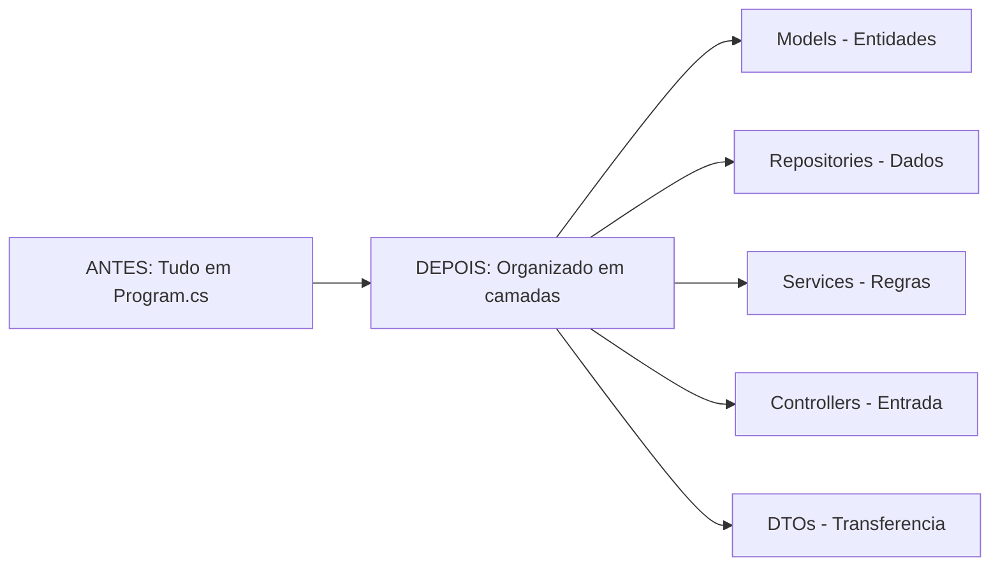

### Por que Reorganizar e Não Reescrever?

Uma pergunta que pode surgir: "por que não criar o sistema do zero já organizado?". A resposta é que reorganizar código existente é uma habilidade mais valiosa do que criar do zero. No seu primeiro emprego, você vai encontrar sistemas que já existem há anos, com código misturado, sem camadas claras. Saber reorganizar sem quebrar é uma das habilidades mais valorizadas no mercado.

Além disso, reorganizar te obriga a **entender** o código antes de mover. Você precisa olhar cada trecho e perguntar: "isso é interface? É regra de negócio? É acesso a dados?". Esse exercício de classificação é o que consolida o aprendizado dos módulos anteriores.

---

## O Código Original: O Ponto de Partida

Vamos começar olhando o código que você vai reorganizar. É um sistema completo de cadastro de produtos em C#, com tudo em um único arquivo `Program.cs`. Leia com atenção — você vai precisar entender cada parte para saber onde ela deve ir.

```csharp
// Program.cs — Sistema de Cadastro de Produtos (ANTES da reorganizacao)
// Tudo em um unico arquivo: entidades, dados, regras e interface

using System;
using System.Collections.Generic;
using System.Linq;

// === ENTIDADE ===
// "Product" = Produto — a "coisa" que o sistema gerencia
class Product
{
    public int Id { get; set; }              // "Id" = identificador unico
    public string Name { get; set; }         // "Name" = nome do produto
    public decimal Price { get; set; }       // "Price" = preco
    public int Stock { get; set; }           // "Stock" = estoque
    public DateTime CreatedAt { get; set; }  // "CreatedAt" = data de criacao

    public Product(string name, decimal price, int stock)
    {
        Name = name;
        Price = price;
        Stock = stock;
        CreatedAt = DateTime.Now;
    }

    public override string ToString()
    {
        return $"[{Id}] {Name} — R${Price:F2} (Estoque: {Stock})";
    }
}

// === DADOS EM MEMORIA ===
// Lista que simula o banco de dados
static List<Product> products = new List<Product>();
static int nextId = 1;

// === FUNCOES DE ACESSO A DADOS ===
static List<Product> GetAllProducts()
{
    return new List<Product>(products);
}

static Product GetProductById(int id)
{
    return products.FirstOrDefault(p => p.Id == id);
}

static void AddProduct(Product product)
{
    product.Id = nextId++;
    products.Add(product);
}

static void UpdateProduct(Product product)
{
    var index = products.FindIndex(p => p.Id == product.Id);
    if (index >= 0) products[index] = product;
}

static void DeleteProduct(int id)
{
    products.RemoveAll(p => p.Id == id);
}

static bool ProductExists(string name)
{
    return products.Any(p => p.Name.Equals(name, StringComparison.OrdinalIgnoreCase));
}

// === LOGICA DE NEGOCIO (misturada com interface) ===
static void RegisterProduct()
{
    Console.Write("Nome do produto: ");
    var name = Console.ReadLine();

    // Regra: nome nao pode ser vazio
    if (string.IsNullOrWhiteSpace(name))
    {
        Console.WriteLine("Erro: nome nao pode ser vazio.");
        return;
    }

    // Regra: nome nao pode ser duplicado
    if (ProductExists(name))
    {
        Console.WriteLine($"Erro: ja existe um produto com o nome '{name}'.");
        return;
    }

    Console.Write("Preco: ");
    if (!decimal.TryParse(Console.ReadLine(), out decimal price) || price <= 0)
    {
        Console.WriteLine("Erro: preco deve ser um numero maior que zero.");
        return;
    }

    Console.Write("Estoque inicial: ");
    if (!int.TryParse(Console.ReadLine(), out int stock) || stock < 0)
    {
        Console.WriteLine("Erro: estoque deve ser um numero nao negativo.");
        return;
    }

    var product = new Product(name, price, stock);
    AddProduct(product);
    Console.WriteLine($"Produto '{name}' cadastrado com sucesso! ID: {product.Id}");
}

static void ListProducts()
{
    var all = GetAllProducts();
    if (all.Count == 0)
    {
        Console.WriteLine("Nenhum produto cadastrado.");
        return;
    }
    Console.WriteLine("\n--- Lista de Produtos ---");
    foreach (var p in all)
    {
        Console.WriteLine($"  {p}");
    }
    Console.WriteLine($"Total: {all.Count} produtos");
}

static void FindProduct()
{
    Console.Write("ID do produto: ");
    if (!int.TryParse(Console.ReadLine(), out int id))
    {
        Console.WriteLine("ID invalido.");
        return;
    }
    var product = GetProductById(id);
    if (product == null)
    {
        Console.WriteLine($"Produto com ID {id} nao encontrado.");
        return;
    }
    Console.WriteLine($"\n  {product}");
    Console.WriteLine($"  Criado em: {product.CreatedAt:dd/MM/yyyy HH:mm}");
}

static void UpdatePrice()
{
    Console.Write("ID do produto: ");
    if (!int.TryParse(Console.ReadLine(), out int id))
    {
        Console.WriteLine("ID invalido.");
        return;
    }
    var product = GetProductById(id);
    if (product == null)
    {
        Console.WriteLine($"Produto com ID {id} nao encontrado.");
        return;
    }
    Console.WriteLine($"Produto: {product.Name} — Preco atual: R${product.Price:F2}");
    Console.Write("Novo preco: ");
    if (!decimal.TryParse(Console.ReadLine(), out decimal newPrice) || newPrice <= 0)
    {
        Console.WriteLine("Erro: preco deve ser maior que zero.");
        return;
    }
    product.Price = newPrice;
    UpdateProduct(product);
    Console.WriteLine($"Preco atualizado para R${newPrice:F2}.");
}

static void AddStock()
{
    Console.Write("ID do produto: ");
    if (!int.TryParse(Console.ReadLine(), out int id))
    {
        Console.WriteLine("ID invalido.");
        return;
    }
    var product = GetProductById(id);
    if (product == null)
    {
        Console.WriteLine($"Produto com ID {id} nao encontrado.");
        return;
    }
    Console.WriteLine($"Produto: {product.Name} — Estoque atual: {product.Stock}");
    Console.Write("Quantidade a adicionar: ");
    if (!int.TryParse(Console.ReadLine(), out int qty) || qty <= 0)
    {
        Console.WriteLine("Erro: quantidade deve ser maior que zero.");
        return;
    }
    product.Stock += qty;
    UpdateProduct(product);
    Console.WriteLine($"Estoque atualizado para {product.Stock} unidades.");
}

static void RemoveProduct()
{
    Console.Write("ID do produto para remover: ");
    if (!int.TryParse(Console.ReadLine(), out int id))
    {
        Console.WriteLine("ID invalido.");
        return;
    }
    var product = GetProductById(id);
    if (product == null)
    {
        Console.WriteLine($"Produto com ID {id} nao encontrado.");
        return;
    }
    Console.Write($"Remover '{product.Name}'? (s/n): ");
    if (Console.ReadLine()?.ToLower() == "s")
    {
        DeleteProduct(id);
        Console.WriteLine($"Produto '{product.Name}' removido.");
    }
    else
    {
        Console.WriteLine("Operacao cancelada.");
    }
}

// === MENU PRINCIPAL ===
static void Main(string[] args)
{
    while (true)
    {
        Console.WriteLine("\n========================================");
        Console.WriteLine("       SISTEMA DE PRODUTOS");
        Console.WriteLine("========================================");
        Console.WriteLine("  1. Cadastrar produto");
        Console.WriteLine("  2. Listar produtos");
        Console.WriteLine("  3. Buscar produto por ID");
        Console.WriteLine("  4. Atualizar preco");
        Console.WriteLine("  5. Adicionar estoque");
        Console.WriteLine("  6. Remover produto");
        Console.WriteLine("  0. Sair");
        Console.WriteLine("========================================");
        Console.Write("Escolha: ");

        switch (Console.ReadLine())
        {
            case "1": RegisterProduct(); break;
            case "2": ListProducts(); break;
            case "3": FindProduct(); break;
            case "4": UpdatePrice(); break;
            case "5": AddStock(); break;
            case "6": RemoveProduct(); break;
            case "0":
                Console.WriteLine("Ate logo!");
                return;
            default:
                Console.WriteLine("Opcao invalida.");
                break;
        }
    }
}
```

Saída esperada (ao executar e escolher opções):

```
========================================
       SISTEMA DE PRODUTOS
========================================
  1. Cadastrar produto
  2. Listar produtos
  3. Buscar produto por ID
  4. Atualizar preco
  5. Adicionar estoque
  6. Remover produto
  0. Sair
========================================
Escolha: 1
Nome do produto: Notebook
Preco: 3500
Estoque inicial: 10
Produto 'Notebook' cadastrado com sucesso! ID: 1
```

Esse código funciona. Faz tudo que precisa fazer. Mas olhe com atenção: **tudo está misturado**. A classe `Product` (domínio), as funções de acesso a dados (`GetAllProducts`, `AddProduct`), as regras de negócio (validações de nome, preço, estoque) e a interface com o usuário (`Console.Write`, `Console.ReadLine`) — tudo no mesmo arquivo, no mesmo nível.

---

## Analisando o Código: Identificando as Responsabilidades

Antes de mover qualquer coisa, precisamos **entender** o que temos. Vamos classificar cada parte do código original segundo as camadas que aprendemos nos módulos anteriores.

### Exercício Mental: O que Pertence a Cada Camada?

Olhe o código original e tente responder: se eu fosse separar em camadas, o que vai para onde?

| Trecho do código | Camada | Justificativa |
|-------------------|--------|---------------|
| Classe `Product` com propriedades e construtor | Models - Dominio | Representa a entidade do negocio |
| `List<Product> products` e `int nextId` | Repository - Dados | Armazenamento interno dos dados |
| `GetAllProducts`, `GetProductById`, `AddProduct` | Repository - Dados | Operações de leitura e escrita de dados |
| `UpdateProduct`, `DeleteProduct`, `ProductExists` | Repository - Dados | Mais operações de dados |
| Validacoes: nome vazio, preco negativo, duplicado | Service - Negocio | Regras que o negocio define |
| `Console.Write`, `Console.ReadLine`, menu | Controller - Entrada | Interface com o usuario |
| Conversao de string para decimal e int | Controller - Entrada | Parsing de dados de entrada |
| Mensagens de erro e sucesso para o usuario | Controller - Entrada | Formatacao de saida |

Observe como no código original essas responsabilidades estão **entrelaçadas**. A função `RegisterProduct()`, por exemplo, faz tudo: lê entrada do usuário (Controller), válida regras de negócio (Service), cria a entidade (Models) e salva nos dados (Repository). Uma única função com 4 responsabilidades diferentes.

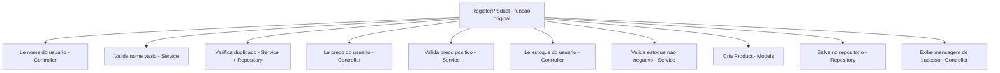

Essa mistura é exatamente o que vamos separar. Cada responsabilidade vai para sua camada. Cada camada vai para sua pasta. E no final, cada arquivo faz uma coisa só.

---

## O Plano de Reorganização: 7 Fases

Vamos reorganizar o código em 7 fases incrementais. Cada fase é um passo pequeno e verificável. Depois de cada fase, o programa continua funcionando — nunca quebramos nada no meio do caminho.

Essa abordagem incremental é fundamental no mundo profissional. Quando você refatora um sistema em produção, não pode parar tudo e reescrever. Você faz mudanças pequenas, testa, confirma que funciona, e segue para a próxima. Se algo der errado, é fácil voltar atrás porque a mudança foi pequena.

### Visão Geral das Fases

| Fase | O que fazer | Resultado |
|------|-------------|-----------|
| 1 | Analisar o código e mapear responsabilidades | Documento de análise |
| 2 | Criar a estrutura de pastas | Pastas vazias criadas |
| 3 | Extrair Models e Repositories | Entidade e dados separados |
| 4 | Extrair Services | Lógica de negocio isolada |
| 5 | Extrair Controllers | Interface com usuario separada |
| 6 | Adicionar DTOs | Objetos de transferencia |
| 7 | Documentar a arquitetura | README do projeto |

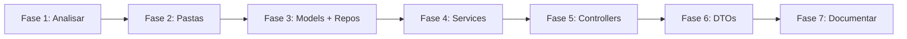

O código completo de cada fase, com instruções passo a passo e checkpoints de verificação, está no arquivo de projeto:

**[Acessar o Projeto Completo: Estruturando uma Aplicação em Camadas](../projects/projeto-cap10-arquitetura.md)**

Aqui no módulo, vamos explicar o **raciocínio** por trás de cada fase — o porquê de cada decisão. O arquivo de projeto tem o **código** completo para você implementar.

---

## Fase 1: Analisar o Código — O Mapa da Refatoração

A primeira fase não envolve escrever código. Envolve **ler e entender**. Antes de mover qualquer coisa, você precisa saber exatamente o que tem e para onde cada parte vai.

No mundo profissional, essa etapa é chamada de **análise de impacto** (impact analysis). Antes de refatorar um sistema, o desenvolvedor mapeia todas as dependências: quem chama quem, quem depende de quem, o que pode quebrar se eu mover isso. Pular essa etapa é a receita para desastre.

### Como Fazer a Análise

Pegue o código original e, para cada função e classe, responda:

1. **O que essa função faz?** — descreva em uma frase
2. **Que tipo de responsabilidade é?** — interface, negócio ou dados?
3. **De quem ela depende?** — que outras funções ou dados ela usa?
4. **Quem depende dela?** — que funções a chamam?

Vamos fazer isso juntos para as funções principais:

| Função | O que faz | Tipo | Depende de | Quem chama |
|--------|-----------|------|------------|------------|
| `Product` (classe) | Representa um produto | Dominio | Nada | Todas as funções |
| `GetAllProducts` | Retorna todos os produtos | Dados | `products` (lista) | `ListProducts` |
| `GetProductById` | Busca produto por ID | Dados | `products` (lista) | `FindProduct`, `UpdatePrice`, `AddStock`, `RemoveProduct` |
| `AddProduct` | Adiciona produto a lista | Dados | `products`, `nextId` | `RegisterProduct` |
| `UpdateProduct` | Atualiza produto na lista | Dados | `products` | `UpdatePrice`, `AddStock` |
| `DeleteProduct` | Remove produto da lista | Dados | `products` | `RemoveProduct` |
| `ProductExists` | Verifica se nome existe | Dados | `products` | `RegisterProduct` |
| `RegisterProduct` | Cadastra produto (tudo misturado) | Interface + Negocio + Dados | Várias | `Main` |
| `ListProducts` | Lista produtos (interface + dados) | Interface + Dados | `GetAllProducts` | `Main` |
| `FindProduct` | Busca e exibe produto | Interface + Dados | `GetProductById` | `Main` |
| `UpdatePrice` | Atualiza preco (tudo misturado) | Interface + Negocio + Dados | Várias | `Main` |
| `AddStock` | Adiciona estoque (tudo misturado) | Interface + Negocio + Dados | Várias | `Main` |
| `RemoveProduct` | Remove produto (interface + dados) | Interface + Dados | Várias | `Main` |
| `Main` | Menu principal | Interface | Todas as funções acima | Ponto de entrada |

Observe o padrão: as funções de acesso a dados (`GetAllProducts`, `AddProduct`, etc.) são relativamente limpas — fazem uma coisa só. Já as funções de operação (`RegisterProduct`, `UpdatePrice`, etc.) são as mais misturadas — cada uma faz interface, negócio e dados ao mesmo tempo.

### O Diagrama de Dependências

Antes de mover, é útil visualizar quem depende de quem:

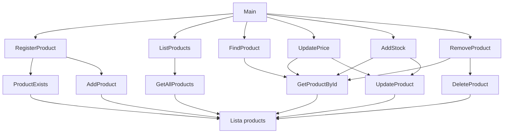

Esse diagrama mostra que a lista `products` é o centro de tudo — todas as funções de dados dependem dela. Quando movermos para o Repository, essa lista vai junto. E as funções de operação dependem tanto das funções de dados quanto do `Console` — quando separarmos, a parte de dados vai para o Service (que chama o Repository) e a parte de Console vai para o Controller.

---

## Fase 2: Criar a Estrutura de Pastas

Com a análise feita, agora criamos as pastas. Essa fase é rápida mas importante — define a organização visual do projeto.

```bash
# Na pasta do projeto ProdutosCamadas/
mkdir Models
mkdir Repositories
mkdir Services
mkdir Controllers
mkdir DTOs
```

Resultado:

```
ProdutosCamadas/
├── Controllers/     # Vazio por enquanto
├── DTOs/            # Vazio por enquanto
├── Models/          # Vazio por enquanto
├── Repositories/    # Vazio por enquanto
├── Services/        # Vazio por enquanto
├── Program.cs       # Codigo original (ainda intacto)
└── ProdutosCamadas.csproj
```

Neste ponto, o programa continua funcionando normalmente — não mudamos nada no código, só criamos pastas vazias. Esse é o princípio da refatoração incremental: cada passo é seguro.

---

## Fase 3: Extrair Models e Repositories — Separando os Dados

Agora começa a reorganização de verdade. Vamos extrair duas coisas do `Program.cs`:

1. A classe `Product` vai para `Models/Product.cs`
2. As funções de acesso a dados vão para `Repositories/`

### Por que Começar pelos Models e Repositories?

Porque são as camadas mais independentes. O Model (`Product`) não depende de nada — é uma classe pura com dados. O Repository depende apenas do Model. Nenhum dos dois depende de Console, de regras de negócio ou de interface. São as peças mais fáceis de extrair sem quebrar nada.

No mundo profissional, essa estratégia se chama **bottom-up refactoring** — começar pelas camadas de baixo (mais independentes) e subir. É mais seguro porque cada camada extraída tem menos dependências.

### O que Muda

Quando extraímos o Model, criamos o arquivo `Models/Product.cs` com a classe `Product` exatamente como está — sem mudar nada na classe, apenas movendo para seu próprio arquivo.

Quando extraímos o Repository, fazemos algo a mais: criamos uma **interface** `IProductRepository` e uma **implementação** `InMemoryProductRepository`. A interface define o contrato (quais operações existem), e a implementação faz o trabalho real (usando a lista em memória).

Por que criar a interface? Porque é o que aprendemos no módulo 10.5 — o Repository Pattern. A interface permite trocar a implementação no futuro (de memória para SQLite, por exemplo) sem mudar nenhuma outra camada. E é exatamente o que você fez no capítulo 9 com o `IProductRepository`.

### O Resultado da Fase 3

Depois desta fase, a estrutura fica:

```
ProdutosCamadas/
├── Models/
│   └── Product.cs              # Classe Product extraida
├── Repositories/
│   ├── IProductRepository.cs   # Interface do repositorio
│   └── InMemoryProductRepository.cs  # Implementacao em memoria
├── Controllers/
├── DTOs/
├── Services/
├── Program.cs                  # Ainda tem as funcoes de operacao e o menu
└── ProdutosCamadas.csproj
```

O `Program.cs` ficou menor — perdeu a classe `Product`, a lista `products`, o `nextId` e todas as funções de acesso a dados. Mas ainda tem as funções de operação (`RegisterProduct`, `ListProducts`, etc.) e o menu. Vamos extrair essas nas próximas fases.

O código completo desta fase está no arquivo de projeto.

O diagrama a seguir mostra a estrutura de classes após a Fase 3 — a entidade `Product`, a interface `IProductRepository` e a implementação em memória:

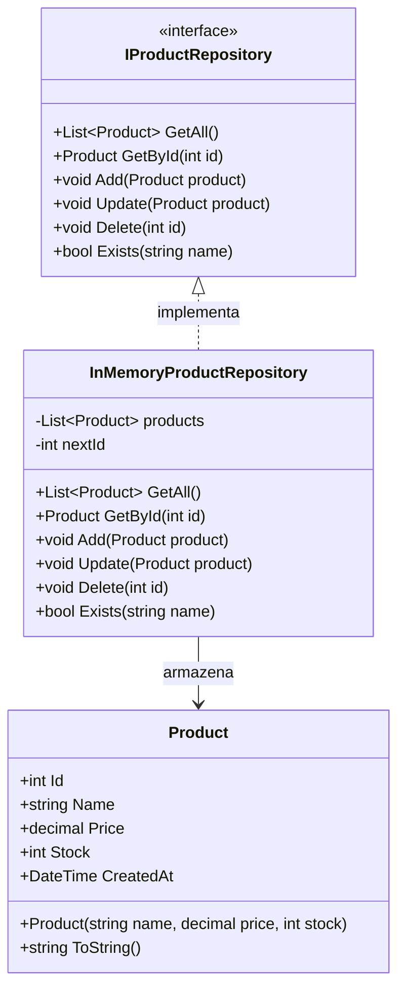

---

## Fase 4: Extrair Services — Isolando a Lógica de Negócio

Esta é a fase mais delicada. Precisamos separar o que é **regra de negócio** do que é **interface com o usuário**. E no código original, essas duas coisas estão completamente misturadas.

### O Desafio: Desenredar Interface e Negócio

Olhe a função `RegisterProduct()` original. Ela faz:

1. `Console.Write("Nome do produto: ")` — **interface**
2. `Console.ReadLine()` — **interface**
3. `string.IsNullOrWhiteSpace(name)` — **regra de negócio**
4. `ProductExists(name)` — **regra de negócio** (via repositório)
5. `Console.Write("Preco: ")` — **interface**
6. `decimal.TryParse(...)` — **interface** (parsing de entrada)
7. `price <= 0` — **regra de negócio**
8. `new Product(name, price, stock)` — **domínio**
9. `AddProduct(product)` — **dados** (via repositório)
10. `Console.WriteLine("Produto cadastrado!")` — **interface**

Para separar, precisamos criar um método no Service que receba os dados já parseados (nome, preço, estoque) e faça apenas as validações de negócio e a operação. O Controller fica responsável por ler do Console, parsear e chamar o Service.

### A Regra de Ouro da Separação

Como decidir se algo é regra de negócio ou interface? Use esta pergunta:

**"Se eu trocar a interface de terminal para API HTTP, essa regra continua existindo?"**

- "Nome não pode ser vazio" — **sim**, continua. É regra de negócio.
- "Preço deve ser positivo" — **sim**, continua. É regra de negócio.
- "Nome não pode ser duplicado" — **sim**, continua. É regra de negócio.
- "Converter string para decimal" — **não**. Em uma API, o dado já chega como número. É interface.
- "Exibir menu no console" — **não**. Em uma API, não tem menu. É interface.
- "Pedir confirmação antes de remover" — **não**. Em uma API, a confirmação é diferente. É interface.

Tudo que é específico do **meio de comunicação** (terminal, API, arquivo) é interface. Tudo que é específico do **negócio** (regras, validações, cálculos) é serviço.

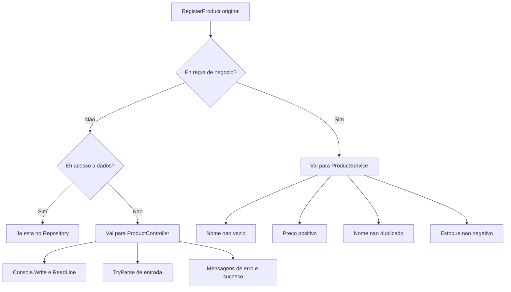

### O Resultado da Fase 4

O `ProductService` recebe o repositório pelo construtor (injeção de dependência) e expõe métodos como `Register(name, price, stock)`, `ListAll()`, `FindById(id)`, `UpdatePrice(id, newPrice)`, `AddStock(id, quantity)` e `Remove(id)`. Cada método retorna uma string com o resultado (sucesso ou erro) — simples e direto.

O Service não sabe nada sobre Console. Ele recebe dados, aplica regras e retorna resultados. Se amanhã você quiser usar esse mesmo Service em uma API HTTP, ele funciona sem mudar uma linha.

---

## Fase 5: Extrair Controllers — Separando a Interface

Com o Service pronto, agora extraímos a interface com o usuário para o Controller. O Controller fica responsável por:

- Exibir o menu
- Ler entrada do usuário
- Converter strings para tipos corretos (parsing)
- Chamar o Service com os dados parseados
- Exibir o resultado para o usuário

### O Controller é Magro

Lembra do módulo 10.6? O Controller deve ser **magro** (thin controller). Ele não tem lógica de negócio. Ele não acessa dados. Ele apenas recebe, delega e responde. Como o garçom do restaurante — anota o pedido, passa para a cozinha e traz o prato.

No nosso caso, o `ProductController` recebe o `ProductService` pelo construtor e tem métodos como `RegisterProduct()`, `ListProducts()`, `FindProduct()`, etc. Cada método:

1. Exibe um prompt para o usuário
2. Lê a entrada
3. Faz o parsing (converte string para o tipo correto)
4. Chama o método correspondente do Service
5. Exibe o resultado

### O Fluxo Completo Após a Fase 5

Depois de extrair o Controller, o fluxo de uma operação fica assim:

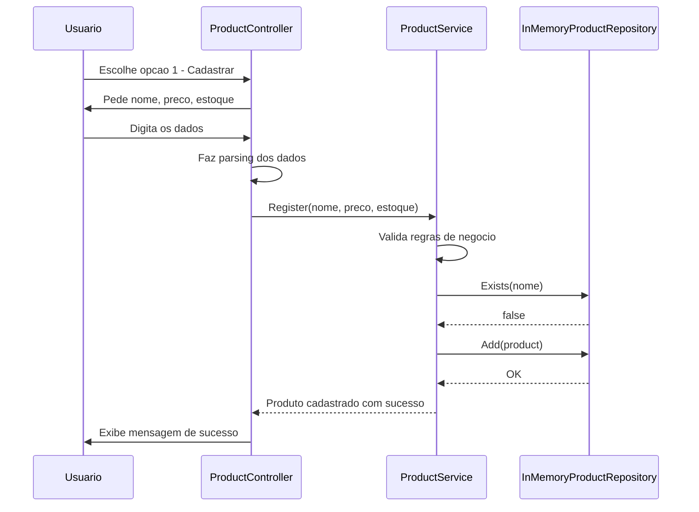

Cada participante faz sua parte. O Controller não válida regras. O Service não lê do Console. O Repository não sabe que existe um menu. Cada um na sua camada.

---

## Fase 6: Adicionar DTOs — Quando Faz Sentido

No módulo 10.4, você aprendeu sobre DTOs (Data Transfer Objects) — objetos simples que transportam dados entre camadas. Agora é hora de decidir: o nosso projeto precisa de DTOs?

### A Resposta Honesta: Depende

Para um projeto deste tamanho, DTOs são **opcionais**. O Service poderia receber parâmetros simples (`string name, decimal price, int stock`) e retornar a própria entidade `Product`. Funcionaria perfeitamente.

Mas vamos adicionar DTOs por dois motivos pedagógicos:

1. **Praticar o conceito** — você precisa saber criar e usar DTOs porque vai encontrá-los em todo projeto profissional
2. **Mostrar a separação** — DTOs deixam explícito que os dados que entram são diferentes dos dados que a entidade armazena

### Quais DTOs Criar?

Vamos criar apenas os que fazem sentido — sem exagero:

| DTO | Proposito | Campos |
|-----|-----------|--------|
| `CreateProductRequest` | Dados para cadastrar produto | Name, Price, Stock |
| `UpdatePriceRequest` | Dados para atualizar preco | ProductId, NewPrice |
| `ProductResponse` | Dados de retorno de um produto | Id, Name, Price, Stock, CreatedAt |

Observe: o `CreateProductRequest` não tem `Id` nem `CreatedAt` — esses são gerados pelo sistema, não enviados pelo usuário. O `ProductResponse` tem todos os campos que o usuário precisa ver. Essa diferença entre entrada e saída é exatamente o motivo pelo qual DTOs existem.

### Quando NÃO Criar DTOs

Não vamos criar DTOs para operações simples. Por exemplo, `AddStock` recebe apenas um ID e uma quantidade — dois parâmetros simples. Criar um `AddStockRequest` com dois campos seria over-engineering. A regra prática: se a operação tem 1-2 parâmetros simples, passe direto. Se tem 3+ parâmetros ou os dados são complexos, considere um DTO.

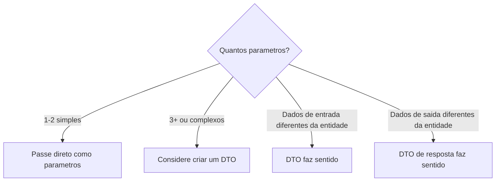

---

## Fase 7: Documentar a Arquitetura — O README do Projeto

A última fase é documentar. No mundo profissional, código sem documentação é código que ninguém entende. E a documentação mais importante de um projeto é o **README** — o arquivo que explica o que o projeto faz, como está organizado e como executar.

### O que o README Deve Conter

Para o nosso projeto, o README deve ter:

1. **O que o projeto faz** — cadastro de produtos com CRUD completo
2. **Arquitetura** — diagrama mostrando as camadas e como se comunicam
3. **Estrutura de pastas** — o que cada pasta contém
4. **Como executar** — comandos para rodar o projeto
5. **Decisões de arquitetura** — por que organizamos assim

### Por que Documentar Importa

Imagine que você sai de férias e um colega precisa fazer uma mudança no seu projeto. Se não tem documentação, ele precisa ler todo o código para entender a organização. Com um README claro, ele entende a estrutura em 2 minutos e sabe exatamente onde fazer a mudança.

Documentar também ajuda **você mesmo**. Daqui a 6 meses, quando voltar a esse projeto, não vai lembrar por que organizou de determinada forma. O README é a memória do projeto.

---

## O Program.cs Final: Apenas Configuração

Depois de todas as fases, o `Program.cs` fica com uma única responsabilidade: **configurar e iniciar** a aplicação. Ele cria as dependências (Repository, Service, Controller) e inicia o Controller.

```csharp
// Program.cs — Ponto de entrada (DEPOIS da reorganizacao)
// Responsabilidade unica: configurar dependencias e iniciar

// Cria o repositorio (camada de dados)
var repository = new InMemoryProductRepository();

// Cria o servico (camada de negocio) — recebe o repositorio
var service = new ProductService(repository);

// Cria o controller (camada de entrada) — recebe o servico
var controller = new ProductController(service);

// Inicia a aplicacao
controller.Run();
```

Saída esperada: o mesmo menu de antes — o comportamento não mudou.

São 4 linhas de código. Quatro. Compare com o `Program.cs` original que tinha centenas de linhas com tudo misturado. Agora cada parte está no seu lugar, e o ponto de entrada apenas monta as peças e inicia.

Esse padrão de "montar as dependências no ponto de entrada" é chamado de **Composition Root** — o lugar onde todas as peças são conectadas. É um conceito que você vai encontrar em todo projeto profissional, especialmente em frameworks como ASP.NET, Spring e FastAPI.

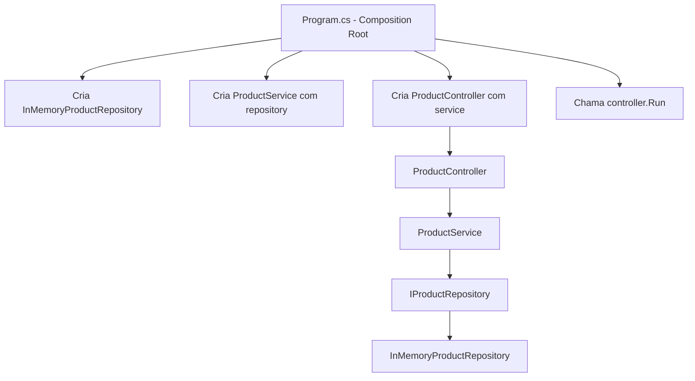

---

## Comparação: Antes vs Depois

Vamos colocar lado a lado o que mudou:

### Estrutura de Arquivos

| Antes | Depois |
|-------|--------|
| 1 arquivo (Program.cs) | 8 arquivos em 5 pastas |
| ~200 linhas em um lugar | ~30-50 linhas por arquivo |
| Tudo misturado | Cada arquivo com 1 responsabilidade |

### Responsabilidades

| Antes | Depois |
|-------|--------|
| Program.cs faz tudo | Program.cs so configura |
| Regras misturadas com Console | Regras isoladas no Service |
| Dados misturados com interface | Dados isolados no Repository |
| Entidade misturada com tudo | Entidade isolada em Models |

### Impacto de Mudanças

| Mudanca | Antes: o que precisa mudar | Depois: o que precisa mudar |
|---------|---------------------------|----------------------------|
| Trocar de memória para SQLite | Reescrever funções de dados no Program.cs | Criar SqliteProductRepository, mudar 1 linha no Program.cs |
| Trocar de terminal para API HTTP | Reescrever tudo | Criar novo Controller HTTP, manter Service e Repository |
| Adicionar regra "desconto máximo 30%" | Encontrar onde no Program.cs e adicionar | Adicionar no ProductService |
| Adicionar campo "categoria" ao produto | Mudar Product e todas as funções | Mudar Product, ajustar Repository e Service |
| Novo desenvolvedor entender o código | Ler 200+ linhas misturadas | Olhar a estrutura de pastas e entender em 1 minuto |

Essa tabela é o argumento mais forte a favor da arquitetura em camadas. Não é sobre "ficar bonito" — é sobre **reduzir o custo de mudança**. E no mundo real, mudança é a única constante.

### Diagrama de Classes: Arquitetura Completa

O diagrama a seguir mostra todas as classes e interfaces do sistema reorganizado, com seus atributos, métodos e relacionamentos:

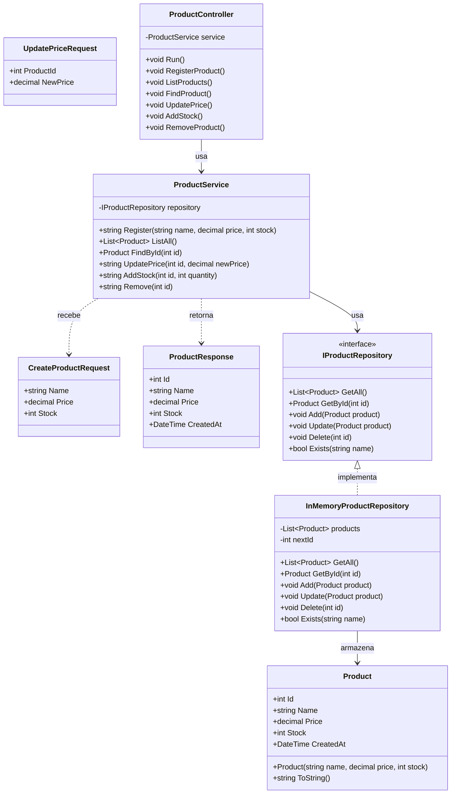

---

## O Princípio da Refatoração: Mudar Estrutura, Manter Comportamento

Ao longo de todo este projeto, seguimos um princípio fundamental: **o programa faz exatamente a mesma coisa antes e depois da reorganização**. O menu é o mesmo. As opções são as mesmas. As validações são as mesmas. As mensagens são as mesmas. O usuário não percebe nenhuma diferença.

Isso é refatoração. A definição formal, cunhada por **Martin Fowler** no livro "Refactoring" (1999), é:

> "Refatoração é o processo de mudar um sistema de software de forma que não altera o comportamento externo do código, mas melhora sua estrutura interna."

A palavra-chave é **comportamento externo**. O que o programa faz para o mundo de fora não muda. O que muda é como ele faz por dentro. É como reformar uma casa: você muda a fiação elétrica, o encanamento e a estrutura das paredes, mas a casa continua tendo os mesmos cômodos, as mesmas portas e as mesmas janelas. Quem mora lá não percebe a diferença — mas a casa fica mais segura, mais eficiente e mais fácil de manter.

### Quando Refatorar no Mundo Real

No mundo profissional, refatoração acontece o tempo todo:

- **Antes de adicionar uma funcionalidade** — "preciso adicionar relatórios, mas o código está tão misturado que não sei onde colocar. Vou refatorar primeiro."
- **Depois de corrigir um bug** — "corrigi o bug, mas percebi que o código ao redor está confuso. Vou limpar."
- **Durante code review** — "o código funciona, mas está difícil de entender. Vamos refatorar antes de aprovar."
- **Em sprints dedicadas** — algumas equipes reservam tempo específico para refatoração, chamado de "tech debt sprint" (sprint de dívida técnica).

A regra prática é a **Regra do Escoteiro** (Boy Scout Rule), popularizada por Robert C. Martin: "Deixe o código mais limpo do que você encontrou." Toda vez que você toca em um arquivo, melhore um pouco. Com o tempo, o código inteiro fica melhor.

---

## Erros Comuns na Refatoração em Camadas

Ao longo dos módulos anteriores, discutimos vários erros. Aqui estão os mais comuns especificamente na hora de reorganizar código em camadas:

### Erro 1: Mover Código sem Entender

O erro mais perigoso. Alguém pega um trecho de código e joga em uma pasta "porque parece que pertence lá", sem entender o que o código faz. Resultado: o programa quebra e ninguém sabe por quê.

**Como evitar**: sempre faça a análise da Fase 1 antes de mover qualquer coisa. Entenda cada função, suas dependências e quem a chama.

### Erro 2: Controller Gordo

Extrair o Service mas deixar regras de negócio no Controller. O Controller fica "gordo" — cheio de lógica que deveria estar no Service.

**Como identificar**: se o Controller tem `if` que verifica regras do negócio (preço positivo, nome duplicado), está gordo. O Controller só deve ter `if` para validação de formato (campo preenchido, tipo correto).

**Exemplo errado**:
```csharp
// NO CONTROLLER — errado! Regra de negocio no lugar errado
if (price <= 0)
{
    Console.WriteLine("Preco deve ser positivo.");
    return;
}
if (_repository.Exists(name))  // Controller acessando Repository direto!
{
    Console.WriteLine("Nome duplicado.");
    return;
}
```

**Exemplo correto**:
```csharp
// NO CONTROLLER — correto! Apenas parsing e delegacao
if (!decimal.TryParse(Console.ReadLine(), out decimal price))
{
    Console.WriteLine("Preco invalido. Use numeros.");
    return;
}
// Delega para o Service, que valida as regras
var result = _service.Register(name, price, stock);
Console.WriteLine(result);
```

### Erro 3: Service Acessando Console

O Service não deve saber nada sobre a interface. Se o Service tem `Console.Write` ou `Console.ReadLine`, algo está errado.

**Como identificar**: procure `Console.` dentro de qualquer arquivo em `Services/`. Se encontrar, mova para o Controller.

### Erro 4: Repository com Regras de Negócio

O Repository deve apenas guardar e buscar dados. Se ele tem validações como "preço deve ser positivo" ou "estoque não pode ser negativo", essas regras estão no lugar errado.

**Como identificar**: o Repository deve ter apenas operações de dados: Add, Get, Update, Delete, Exists, Search. Qualquer `if` que não seja sobre a mecânica de armazenamento (como "índice fora do range") está no lugar errado.

### Erro 5: Criar DTOs para Tudo

Criar um DTO para cada operação, mesmo quando a operação tem 1-2 parâmetros simples. Isso é over-engineering — adiciona complexidade sem benefício.

**Regra prática**: se a operação tem 1-2 parâmetros de tipos simples (int, string, decimal), passe direto. Se tem 3+ parâmetros ou os dados são diferentes da entidade, considere um DTO.

### Erro 6: Refatorar Tudo de Uma Vez

Tentar reorganizar o sistema inteiro em um único passo. Resultado: o programa quebra no meio e você não sabe qual mudança causou o problema.

**Como evitar**: siga as fases incrementais. Mova uma camada por vez. Teste depois de cada fase. Se algo quebrar, você sabe exatamente o que mudou.

---

## Conectando com o Capítulo 11: De Terminal para API

Este projeto reorganizou o sistema com uma interface de terminal (CLI). Mas lembra do que dissemos sobre a vantagem das camadas? Se a interface mudar, só o Controller muda. O Service e o Repository continuam iguais.

No capítulo 11, você vai aprender sobre APIs HTTP e REST. E vai construir uma API real com FastAPI e Python. A arquitetura será a mesma: Controller (endpoints HTTP) → Service (regras de negócio) → Repository (acesso a dados). A diferença é que o Controller não vai ler do Console — vai receber requisições HTTP.

Se este projeto fosse evoluir para uma API, bastaria:

1. Criar um novo Controller HTTP (em vez do Controller CLI)
2. Manter o mesmo Service
3. Manter o mesmo Repository

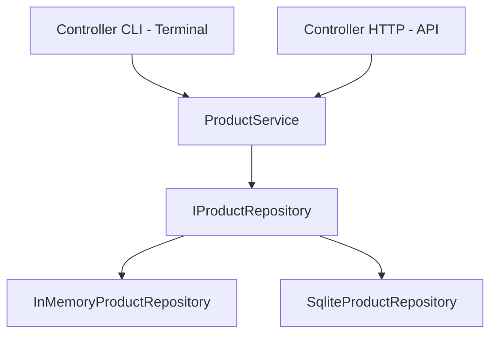

Dois Controllers diferentes, mesmo Service, mesmo Repository. Essa é a beleza da separação em camadas — cada parte é independente e intercambiável.

---

## A Evolução Natural: Do Capítulo 5 ao Capítulo 11

Este projeto é um marco na sua jornada. Vamos olhar como o mesmo conceito — um cadastro de produtos — evoluiu ao longo do curso:

| Capítulo | O que você fez | Organização |
|----------|----------------|-------------|
| 5 | CRUD em memória com Python | Tudo em um arquivo, procedural |
| 8 | CRUD com SQLite e Python | Tudo em um arquivo, com banco |
| 9 | Sistema OOP com C# | Classes e interfaces, mas sem camadas formais |
| 10 | Reorganizacao em camadas com C# | 3 camadas, cada uma em sua pasta |
| 11 | API REST com FastAPI e Python | Camadas + interface HTTP |

Cada capítulo adicionou uma dimensão nova. O capítulo 5 ensinou a lógica. O 8 ensinou persistência. O 9 ensinou orientação a objetos. O 10 ensinou organização. O 11 vai ensinar comunicação entre sistemas. E o conceito central — um cadastro de produtos — é o fio condutor que conecta tudo.

Essa progressão não é acidental. É assim que sistemas reais evoluem: começam simples, ganham persistência, ganham estrutura, ganham organização e eventualmente se tornam serviços acessíveis pela rede. Você está vivendo essa evolução em miniatura.

---

## Como a IA pode te ajudar aqui

A IA é uma parceira poderosa na hora de refatorar código. Aqui estão alguns prompts que você pode usar:

**Prompt 1 — Listar e descobrir:**
> "Análise este código e identifique quais partes são interface com o usuário, quais são regras de negócio e quais são acesso a dados."

**Prompt 2 — Aprofundar o tema:**
> "Refatore este código separando em 3 camadas: Controller, Service e Repository. Mantenha o mesmo comportamento."

**Prompt 3 — Analisar com a IA:**
> "Revise este Service e me diga se tem alguma responsabilidade que deveria estar em outra camada."

**Prompt 4 — Praticar com projetos:**
> "Crie um diagrama Mermaid mostrando as dependências entre as classes deste projeto."

Lembre-se: a IA é uma ferramenta, não um substituto. Use-a para acelerar o trabalho, mas sempre entenda o que ela gerou. Copiar código da IA sem entender é como copiar a prova do colega — você passa, mas não aprende.

---

## Casos de Uso no Mundo Real

### Caso 1: Refatoração no Nubank

O Nubank, um dos maiores bancos digitais do mundo, começou como uma startup com código relativamente simples. À medida que cresceu para milhões de clientes, precisou reorganizar seus sistemas constantemente. A equipe de engenharia do Nubank é conhecida por investir pesadamente em refatoração — eles dedicam tempo regular para melhorar a estrutura interna do código sem mudar o comportamento externo.

Por que isso importa? Porque um banco digital processa milhões de transações por dia. Se o código estiver desorganizado, uma mudança na regra de cálculo de juros pode acidentalmente afetar o sistema de transferências. Com camadas bem separadas, a regra de juros fica isolada no Service financeiro, e mudá-la não afeta nada mais.

O conceito que você praticou neste projeto — separar responsabilidades em camadas — é exatamente o que equipes como a do Nubank fazem em escala muito maior.

### Caso 2: Migração de Monolito no Mercado Livre

O Mercado Livre, maior plataforma de e-commerce da América Latina, passou por uma grande migração de monolito para microserviços. Mas antes de dividir em microserviços, eles precisaram **organizar o monolito em camadas**. Não dá para dividir código misturado — primeiro você organiza, depois divide.

O processo foi exatamente o que fizemos neste projeto, mas em escala gigante: identificar responsabilidades, separar em camadas, criar interfaces entre as partes, e só depois extrair cada parte para um serviço independente. A refatoração em camadas foi o passo fundamental que tornou a migração possível.

### Caso 3: Arquitetura em Camadas no iFood

O iFood, maior plataforma de delivery do Brasil, usa arquitetura em camadas em seus serviços backend. Quando um pedido é feito no aplicativo, a requisição passa por um Controller (que recebe o pedido HTTP), um Service (que válida regras como horário de funcionamento do restaurante, disponibilidade de entregadores e cálculo de frete) e Repositories (que acessam bancos de dados de restaurantes, cardápios, entregadores e pedidos).

Se o iFood quiser mudar a regra de cálculo de frete, a mudança acontece apenas no Service de frete. O Controller que recebe o pedido não muda. O Repository que guarda os dados de entrega não muda. Essa independência entre camadas é o que permite que dezenas de equipes trabalhem no mesmo sistema sem pisar no pé umas das outras.

---

## Resumo do Módulo

| Conceito | Definição |
|----------|-----------|
| Refatoracao | Mudar a estrutura interna do código sem mudar o comportamento externo |
| Bottom-up refactoring | Comecar a refatoracao pelas camadas mais independentes (Models, Repository) |
| Análise de impacto | Mapear dependências antes de mover código |
| Composition Root | Lugar onde todas as dependências são montadas (Program.cs) |
| Controller magro | Controller que apenas recebe, delega e responde, sem lógica de negocio |
| DTO | Objeto simples para transportar dados entre camadas |
| Regra do Escoteiro | Deixar o código mais limpo do que você encontrou |
| Refatoracao incremental | Fazer mudancas pequenas e verificaveis, uma de cada vez |
| Separacao de responsabilidades | Cada classe e arquivo faz uma única coisa |
| Intercambiabilidade | Trocar uma implementação sem afetar outras camadas |

---

## Glossário do Módulo

| Termo | Definição |
|-------|-----------|
| Bottom-up | De baixo para cima — comecar pelas camadas mais básicas |
| Composition Root | Ponto de entrada onde as dependências são configuradas e conectadas |
| Controller | Camada que recebe entrada do mundo externo e devolve respostas |
| CRUD | Create, Read, Update, Delete — as 4 operações básicas de dados |
| DTO (Data Transfer Object) | Objeto simples usado para transportar dados entre camadas |
| Impact Analysis | Análise de impacto — mapear o que pode ser afetado por uma mudanca |
| InMemory | Em memória — dados armazenados na RAM, perdidos ao fechar o programa |
| Interface | Contrato que define quais métodos uma classe deve implementar |
| Layer | Camada lógica — como o código e organizado internamente |
| Over-engineering | Criar complexidade desnecessaria para o problema em questao |
| Parsing | Converter dados de um formato para outro (ex: string para número) |
| Refactoring | Refatoracao — mudar estrutura interna sem mudar comportamento externo |
| Repository | Camada que abstrai o acesso a dados (banco, arquivo, memória) |
| Service | Camada que contem a lógica de negocio e orquestra operações |
| Tech Debt | Divida técnica — custo acumulado de decisoes de código subotimas |
| Thin Controller | Controller magro — com mínima lógica, apenas delegacao |

---

## Na Cultura Popular

- **Halt and Catch Fire** (série, 2014-2017) — acompanha equipes de desenvolvimento nos anos 1980-1990 que constantemente precisam reorganizar e reescrever código para acompanhar a evolução tecnológica. Mostra como decisões de arquitetura afetam o sucesso ou fracasso de produtos. A tensão entre "funciona" e "funciona bem" é um tema central.

- **The Phoenix Project** (livro, 2013) — de Gene Kim, Kevin Behr e George Spafford. Conta a história fictícia de um gerente de TI que precisa salvar um projeto caótico. Mostra como código desorganizado e falta de estrutura levam a falhas em cascata, e como organização e processos resolvem o problema. É uma leitura obrigatória para quem trabalha com tecnologia.

- **Silicon Valley** (série, 2014-2019) — em vários episódios, a equipe da Pied Piper precisa refatorar seu código para escalar. Mostra de forma cômica (mas realista) os desafios de reorganizar sistemas que cresceram rápido demais sem estrutura adequada.

---

## Para Saber Mais

- [Refactoring Guru — Refactoring](https://refactoring.guru/pt-br/refactoring) — *Catálogo visual de técnicas de refatoração com exemplos de código, em português. Excelente para entender cada tipo de refatoração.*

- [Martin Fowler — Patterns of Enterprise Application Architecture](https://martinfowler.com/eaaCatalog/) — *Catálogo de patterns de arquitetura incluindo Repository, Service Layer e outros padrões usados neste projeto.*

- [Microsoft — .NET Application Architecture](https://learn.microsoft.com/en-us/dotnet/architecture/) — *Guias oficiais de arquitetura para aplicações .NET, com exemplos de projetos organizados em camadas.*

- [The Twelve-Factor App](https://12factor.net/pt_br/) — *Metodologia para construir aplicações modernas, em português. Vários princípios se conectam com a organização em camadas.*

- [Fireship — 10 Design Patterns](https://www.youtube.com/watch?v=tv-_1er1mWI) — *Visão rápida e visual de 10 design patterns em 10 minutos, incluindo Repository e outros padrões usados neste módulo.*

---

## Perguntas Frequentes (FAQ)

**P: Preciso reorganizar em camadas todo código que escrevo?**
R: Não. Para scripts pequenos, exercícios e protótipos, tudo em um arquivo é perfeitamente aceitável. Camadas fazem sentido quando o projeto vai crescer, quando mais pessoas vão trabalhar nele, ou quando você precisa trocar partes do sistema (como o banco de dados). A regra prática: se o arquivo passou de 200-300 linhas e tem múltiplas responsabilidades, considere separar.

**P: E se eu errar e colocar algo na camada errada?**
R: Acontece o tempo todo, mesmo com desenvolvedores experientes. O importante é perceber e corrigir. Se você notar que o Controller está fazendo validação de negócio, mova para o Service. Se o Service está acessando o Console, mova para o Controller. Refatoração é um processo contínuo, não um evento único.

**P: O programa fica mais lento com mais arquivos e camadas?**
R: Não. A separação em camadas é uma organização lógica do código — não afeta a performance de execução. O compilador junta tudo em um único programa. A diferença é imperceptível. O que muda é a velocidade de desenvolvimento: código organizado é mais rápido de entender, modificar e debugar.

**P: Por que usar interface no Repository se só tenho uma implementação?**
R: Porque a interface prepara o código para o futuro. Hoje você tem `InMemoryProductRepository`. Amanhã pode criar `SqliteProductRepository` ou `ApiProductRepository`. Com a interface, basta criar a nova implementação e mudar uma linha no `Program.cs`. Sem a interface, você precisaria mudar o Service inteiro. Além disso, interfaces facilitam testes automatizados.

**P: Posso ter mais de 3 camadas?**
R: Sim. Projetos maiores podem ter camadas adicionais como Middleware (entre Controller e Service), Validators (validação dedicada), Mappers (conversão entre objetos) e Infrastructure (configuração e setup). Mas comece com 3 — adicione mais apenas quando a complexidade justificar.

**P: DTOs são obrigatórios?**
R: Não. Para projetos simples, usar a própria entidade como entrada e saída funciona bem. DTOs fazem sentido quando os dados de entrada são diferentes dos dados da entidade (o usuário não envia ID nem data de criação), ou quando você quer controlar exatamente quais dados são expostos na resposta. No nosso projeto, adicionamos DTOs para praticar o conceito, mas o sistema funcionaria sem eles.

**P: Qual a diferença entre refatorar e reescrever?**
R: Refatorar é mudar a estrutura mantendo o comportamento — o programa continua fazendo a mesma coisa. Reescrever é criar o programa do zero, possivelmente com comportamento diferente. Refatoração é incremental e segura. Reescrita é arriscada — você pode perder funcionalidades que existiam no código original. No mundo profissional, refatoração é quase sempre preferível a reescrita.

**P: Como sei se minha separação está boa?**
R: Faça o teste mental: "se eu trocar a interface de terminal para API HTTP, o que precisa mudar?". Se a resposta for "só o Controller", sua separação está boa. Se a resposta for "o Service também", tem regra de negócio no lugar errado. Se a resposta for "tudo", a separação não funcionou.

**P: No mundo real, os projetos já começam organizados em camadas?**
R: Depende. Projetos novos em empresas organizadas geralmente começam com uma estrutura de camadas desde o início — é mais fácil manter do que reorganizar depois. Mas muitos projetos começam como protótipos rápidos (tudo misturado) e são reorganizados quando crescem. Saber fazer as duas coisas — criar organizado e reorganizar existente — é essencial.

**P: Posso usar nomes diferentes para as pastas?**
R: Sim. O que importa é a responsabilidade, não o nome. Você pode chamar `Controllers/` de `Handlers/`, `Services/` de `UseCases/`, `Repositories/` de `DataAccess/`. O importante é que cada pasta tenha uma responsabilidade clara e que todo o time use os mesmos nomes consistentemente.

**P: E se o projeto for muito pequeno para camadas?**
R: Se o projeto tem 50-100 linhas e faz uma coisa simples, camadas são over-engineering. Lembra do exercício 6 do módulo 10.1? O programa que lista 5 commits do Git não precisa de 20 arquivos em 5 pastas. Use o bom senso: a complexidade da organização deve ser proporcional à complexidade do problema.

**P: Como a refatoração em camadas se conecta com o capítulo 11?**
R: No capítulo 11, você vai criar uma API REST com FastAPI. A arquitetura será a mesma: Controller (endpoints HTTP) → Service (regras) → Repository (dados). A diferença é que o Controller não lê do Console — recebe requisições HTTP. Se você entendeu as camadas neste projeto, o capítulo 11 vai ser natural.

**P: Posso misturar linguagens nas camadas?**
R: Em um único projeto, geralmente não — todas as camadas usam a mesma linguagem. Mas em microserviços (módulo 10.7), cada serviço pode usar uma linguagem diferente. O Service de recomendações pode ser Python (bom para IA), o Service de pagamentos pode ser Go (bom para performance), e o Controller pode ser Node.js (bom para APIs). Cada serviço tem suas próprias camadas internas.

**P: O que acontece se eu pular a Fase 1 (análise)?**
R: Você vai mover código sem entender as dependências. Resultado provável: o programa quebra, você não sabe por quê, e gasta mais tempo consertando do que teria gasto analisando. A Fase 1 parece "perda de tempo" porque não produz código, mas é o investimento que evita retrabalho. No mundo profissional, pular a análise é o erro mais caro.

**P: Esse padrão de 3 camadas funciona para qualquer tipo de aplicação?**
R: Para a maioria das aplicações backend (APIs, serviços, sistemas web), sim. Para aplicações frontend (React, Angular), a organização é diferente — usa componentes, hooks e stores em vez de Controller/Service/Repository. Para aplicações de dados (pipelines, ETL), a organização também é diferente. Mas o princípio de separação de responsabilidades é universal.

---

## Projeto Prático

O projeto completo deste módulo está em um arquivo dedicado com todas as fases, código completo, checkpoints de verificação e critérios de conclusão:

**[Acessar o Projeto: Estruturando uma Aplicação em Camadas](../projects/projeto-cap10-arquitetura.md)**

O projeto guia você passo a passo pela reorganização do sistema de produtos em 7 fases incrementais. Cada fase tem código completo, explicações e um checkpoint para verificar que tudo funciona antes de seguir.

---

[← Anterior: Arquiteturas Alternativas](cap10-mod08-arquiteturas-alternativas-conteudo.md) · [Próximo: Como Serviços se Comunicam →](cap11-mod01-como-servicos-se-comunicam-conteudo.md)