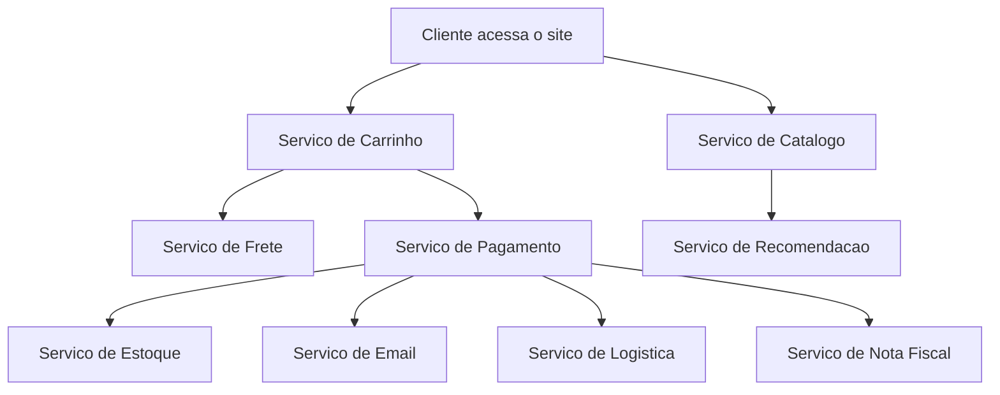
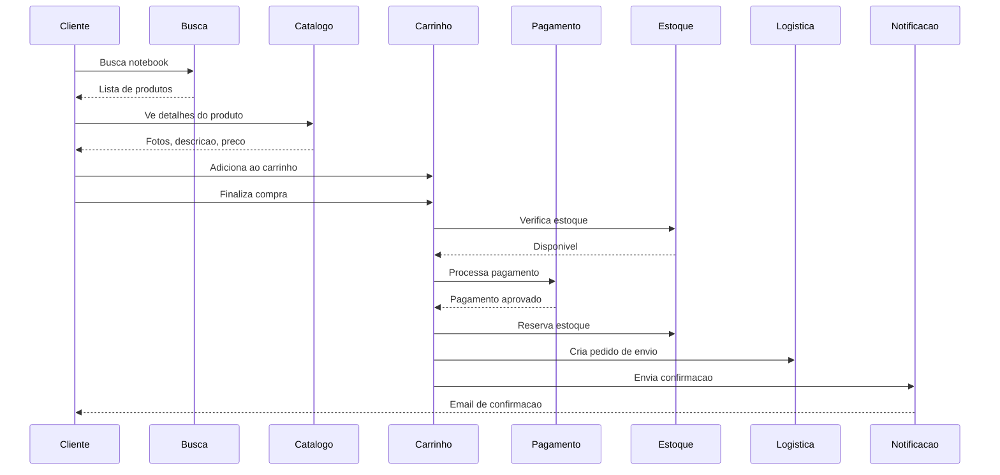
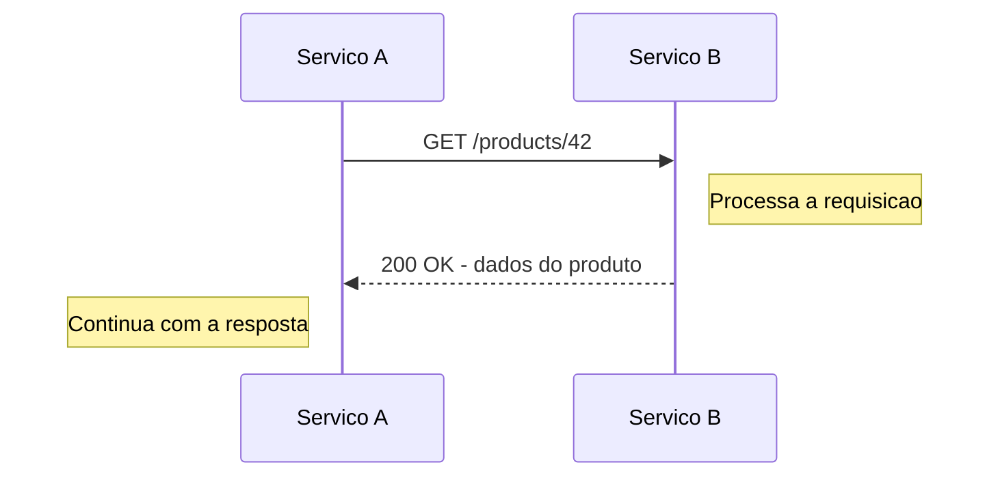
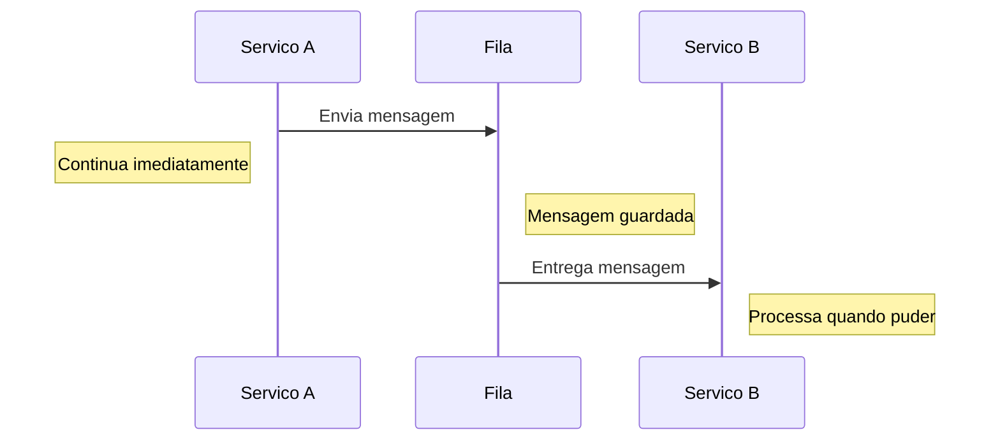
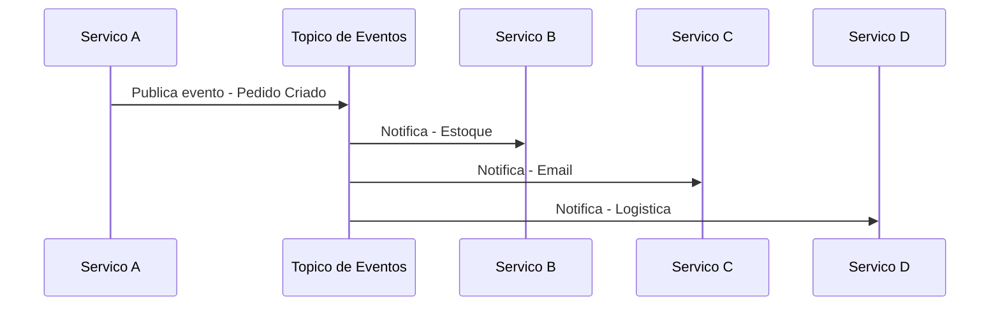
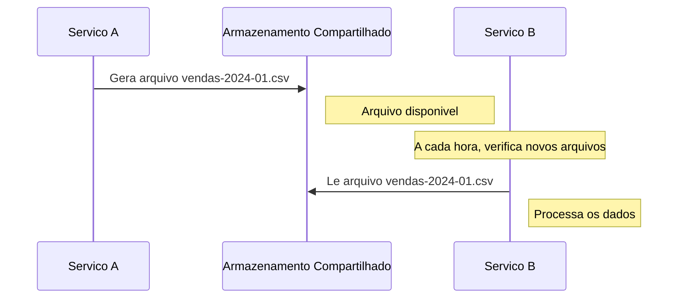
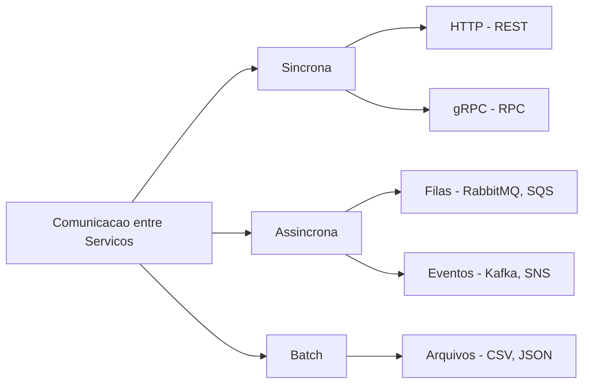
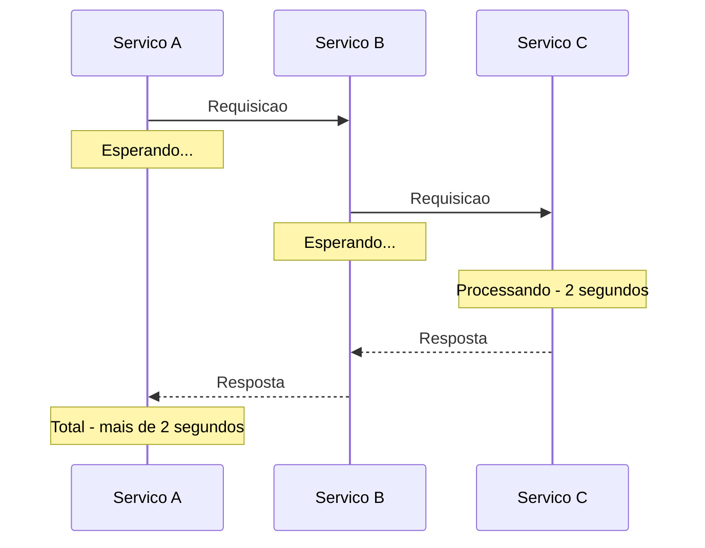
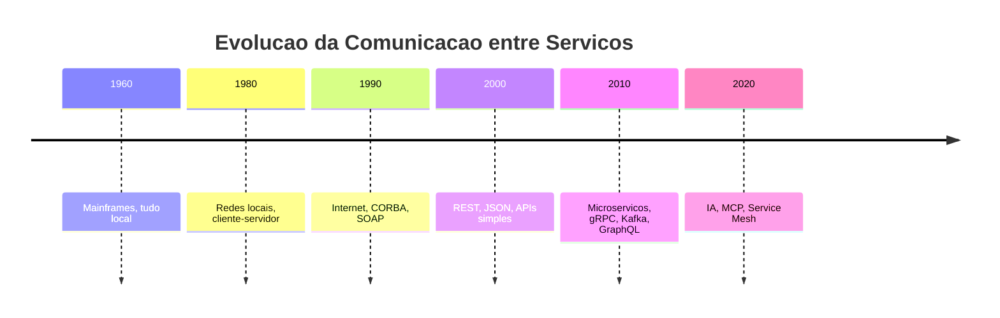
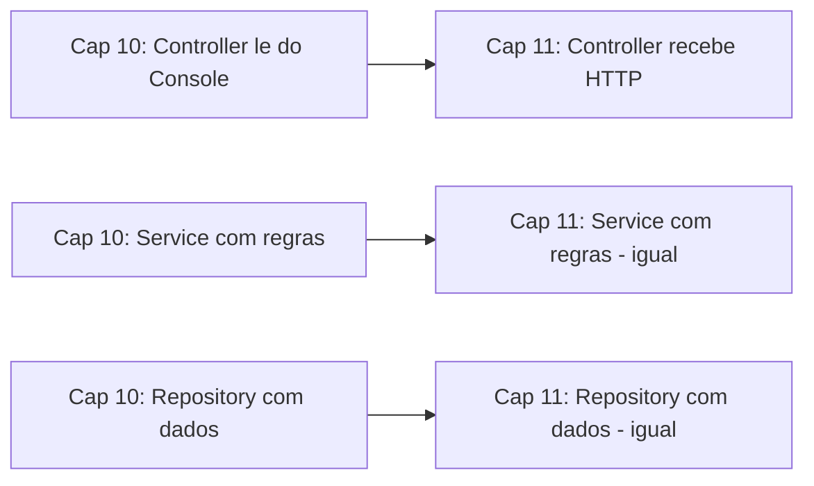

# 11.1 — Como Serviços se Comunicam

[← Anterior: Projeto — Estruturando uma Aplicação em Camadas](cap10-mod09-projeto-estrutura-conteudo.md) · [Próximo: Síncrono vs Assíncrono →](cap11-mod02-sincrono-vs-assincrono-conteudo.md)

---

## Introdução

No capítulo anterior, você aprendeu a organizar uma aplicação em camadas — Controller, Service, Repository — com responsabilidades claras. Cada camada faz sua parte, e o código fica limpo, manutenível e preparado para crescer. Mas até agora, tudo acontecia dentro de uma única aplicação. O Controller chamava o Service, que chamava o Repository, e tudo rodava no mesmo programa, no mesmo computador, no mesmo processo.

No mundo real, as coisas são diferentes. Sistemas de verdade não são uma aplicação só. São dezenas, centenas, às vezes milhares de serviços diferentes que precisam trabalhar juntos. O serviço que mostra os produtos no site não é o mesmo que processa o pagamento. O serviço que calcula o frete não é o mesmo que envia o email de confirmação. O serviço que recomenda produtos não é o mesmo que controla o estoque.

E aqui surge a pergunta central deste capítulo: **como esses serviços conversam entre si?**

Essa pergunta parece simples, mas a resposta é uma das áreas mais importantes — e mais complexas — da engenharia de software. A forma como serviços se comunicam define a performance, a confiabilidade e a escalabilidade de um sistema inteiro. Uma escolha errada aqui pode derrubar um sistema com milhões de usuários. Uma escolha certa pode fazer um sistema funcionar de forma suave mesmo sob pressão extrema.

Neste módulo, vamos entender o problema, ver exemplos reais de sistemas compostos por múltiplos serviços, e conhecer as principais formas de comunicação que existem. Nos módulos seguintes, vamos aprofundar cada uma delas.

---

## Como Executar os Exemplos Deste Módulo

Este módulo é predominantemente conceitual — não tem código para executar. Os diagramas e exemplos são para leitura e compreensão. Nos módulos 11.3 e 11.7, quando começarmos a trabalhar com APIs HTTP e FastAPI, aí sim teremos código prático.

Por enquanto, o mais importante é entender os conceitos e as analogias. Se quiser experimentar, você pode usar o `curl` (que aprendeu no módulo 3.6) para fazer requisições a APIs públicas e ver como a comunicação funciona na prática.

---

## O Problema: Aplicações que Precisam Conversar

Vamos começar pelo começo. Por que serviços precisam se comunicar?

### Quando Tudo Cabia em Uma Aplicação

Nos primeiros capítulos do curso, seus programas eram simples. No capítulo 5, você criou um CRUD em memória — tudo em um único arquivo Python. No capítulo 8, adicionou SQLite — mas ainda era um programa só. No capítulo 9, organizou em classes com C#. No capítulo 10, separou em camadas. Em todos esses casos, o programa inteiro rodava em um único processo, em um único computador.

Isso funciona perfeitamente para aplicações pequenas. Um sistema de cadastro de produtos para uma loja local, um gerenciador de tarefas pessoal, um blog simples — tudo isso pode ser uma aplicação só. E na verdade, deveria ser. Lembra do módulo 10.7? Monolito é a escolha certa quando a complexidade é baixa.

Mas o que acontece quando o sistema cresce?

### Quando Uma Aplicação Não é Suficiente

Imagine que você trabalha em um e-commerce. No começo, era um sistema simples: o cliente entra no site, vê os produtos, coloca no carrinho e paga. Tudo em uma aplicação só. Funcionava bem com 100 clientes por dia.

Aí o negócio cresceu. Agora são 10.000 clientes por dia. O sistema precisa:

- Mostrar o catálogo de produtos (com fotos, descrições, preços)
- Calcular o frete baseado no CEP do cliente
- Processar o pagamento (cartão de crédito, PIX, boleto)
- Verificar o estoque em tempo real
- Enviar email de confirmação do pedido
- Notificar o sistema de logística para separar e enviar o produto
- Atualizar o estoque depois da venda
- Gerar nota fiscal eletrônica
- Recomendar produtos baseado no histórico do cliente
- Enviar notificação push para o celular do cliente

Se tudo isso estiver em uma aplicação só, você tem um problema sério. Cada vez que alguém muda o código de recomendação de produtos, precisa fazer deploy do sistema inteiro — incluindo o processamento de pagamentos. Se o módulo de geração de nota fiscal tiver um bug e travar, o site inteiro cai — ninguém consegue nem ver os produtos. Se o envio de emails estiver lento, o processamento de pagamentos fica lento também, porque tudo roda no mesmo processo.

É por isso que sistemas grandes são divididos em serviços separados. Cada serviço faz uma coisa, roda de forma independente, e pode ser atualizado, escalado e corrigido sem afetar os outros.



Agora cada serviço é uma aplicação independente. O serviço de catálogo pode ser escrito em Python. O serviço de pagamento pode ser escrito em Go (porque precisa de alta performance). O serviço de recomendação pode usar machine learning com bibliotecas especializadas. Cada um tem seu próprio banco de dados, seu próprio deploy, sua própria equipe.

Mas agora surge o problema: **como esses serviços conversam entre si?**

Quando tudo estava em uma aplicação, a comunicação era simples — uma função chamava outra função. O Controller chamava o Service, que chamava o Repository. Tudo na mesma memória, no mesmo processo. Agora, o serviço de pagamento precisa perguntar ao serviço de estoque se o produto está disponível. O serviço de pagamento precisa avisar o serviço de email para enviar a confirmação. O serviço de logística precisa saber que um novo pedido foi criado.

Essas conversas acontecem pela **rede** — os serviços estão em computadores diferentes (ou pelo menos em processos diferentes). E comunicação pela rede é fundamentalmente diferente de uma chamada de função local.

### Por que Comunicação pela Rede é Diferente

Quando você chama uma função dentro do seu programa, três coisas são garantidas:

1. **A chamada é instantânea** — leva nanossegundos (bilionésimos de segundo)
2. **A chamada sempre funciona** — se o programa está rodando, a função existe
3. **A resposta é imediata** — você recebe o resultado na mesma linha de código

Quando um serviço chama outro pela rede, nenhuma dessas três coisas é garantida:

1. **A chamada é lenta** — leva milissegundos (milhões de vezes mais lento que uma chamada local). Parece pouco, mas quando você faz centenas de chamadas por segundo, faz diferença
2. **A chamada pode falhar** — o outro serviço pode estar fora do ar, a rede pode estar congestionada, o servidor pode estar sobrecarregado
3. **A resposta pode demorar** — ou nunca chegar. O que seu serviço faz enquanto espera?

| Aspecto | Chamada local | Chamada pela rede |
|---------|--------------|-------------------|
| Velocidade | Nanossegundos | Milissegundos |
| Confiabilidade | Garantida | Pode falhar |
| Resposta | Imediata | Pode demorar ou não chegar |
| Formato dos dados | Objetos na memória | Texto serializado - JSON, XML |
| Custo | Zero | Banda de rede, latencia |
| Debugging | Stack trace local | Logs distribuidos |

Essa diferença fundamental é o que torna a comunicação entre serviços um tema tão importante. Não basta "chamar o outro serviço" — você precisa pensar em o que fazer quando a chamada falhar, quando demorar demais, quando o formato dos dados mudar, quando o serviço estiver sobrecarregado.

---

## Exemplos Reais: Sistemas Compostos por Múltiplos Serviços

Para entender por que a comunicação entre serviços importa tanto, vamos olhar como sistemas que você usa todos os dias funcionam por dentro.

### Exemplo 1: E-commerce (Mercado Livre, Amazon, Shopee)

Quando você compra algo em um e-commerce, dezenas de serviços trabalham juntos:

1. **Serviço de busca**: você digita "notebook" e o serviço de busca encontra os produtos relevantes. Esse serviço tem seu próprio banco de dados otimizado para buscas rápidas (geralmente Elasticsearch ou similar).

2. **Serviço de catálogo**: mostra os detalhes do produto — fotos, descrição, especificações. Tem seu próprio banco com todas as informações dos produtos.

3. **Serviço de preço**: calcula o preço final considerando promoções, cupons, frete grátis. Pode mudar o preço em tempo real baseado na demanda.

4. **Serviço de carrinho**: guarda os itens que você selecionou. Precisa ser rápido e confiável — ninguém quer perder o carrinho.

5. **Serviço de pagamento**: processa o pagamento. Conversa com operadoras de cartão, bancos (para PIX), e gateways de pagamento. Esse serviço precisa ser extremamente seguro e confiável.

6. **Serviço de estoque**: verifica se o produto está disponível e reserva a quantidade. Precisa ser preciso — vender algo que não tem em estoque é um problema sério.

7. **Serviço de logística**: calcula o frete, escolhe a transportadora, gera a etiqueta de envio. Conversa com APIs externas das transportadoras.

8. **Serviço de notificação**: envia email de confirmação, SMS com código de rastreio, notificação push no app.



Observe quantas comunicações acontecem em uma única compra. Cada seta no diagrama é uma chamada pela rede entre serviços diferentes. Se qualquer uma dessas chamadas falhar, o sistema precisa saber o que fazer. O pagamento foi aprovado mas o estoque acabou? O email não foi enviado mas o pedido foi criado? Cada cenário de falha precisa ser tratado.

### Exemplo 2: Aplicativo de Transporte (Uber, 99)

Quando você pede um carro no Uber, a complexidade é ainda maior porque tudo acontece em tempo real:

1. **Serviço de localização**: rastreia a posição de todos os motoristas e passageiros em tempo real. Recebe atualizações de GPS a cada poucos segundos.

2. **Serviço de matching**: quando você pede um carro, esse serviço encontra o motorista mais próximo disponível. Precisa ser extremamente rápido — ninguém quer esperar 30 segundos para saber se tem motorista.

3. **Serviço de preço**: calcula o preço da corrida baseado na distância, tempo estimado, demanda atual (preço dinâmico) e promoções.

4. **Serviço de rota**: calcula a melhor rota entre origem e destino. Considera trânsito em tempo real, obras, acidentes.

5. **Serviço de pagamento**: processa o pagamento no final da corrida. Divide entre motorista e plataforma.

6. **Serviço de avaliação**: permite que passageiro e motorista se avaliem mutuamente.

7. **Serviço de notificação**: envia push notifications ("seu motorista está chegando", "corrida finalizada").

A diferença crucial aqui é que muitas dessas comunicações precisam acontecer em **tempo real**. O serviço de localização precisa atualizar a posição do motorista no mapa do passageiro a cada 2-3 segundos. Se essa comunicação atrasar 10 segundos, o passageiro vê o motorista no lugar errado. Se o serviço de matching demorar 30 segundos, o passageiro desiste e usa outro app.

### Exemplo 3: Rede Social (Instagram, Twitter/X)

Quando você posta uma foto no Instagram, parece simples — mas por trás:

1. **Serviço de upload**: recebe a foto, redimensiona para vários tamanhos (thumbnail, médio, grande), comprime e armazena.

2. **Serviço de feed**: decide quais posts aparecem no feed de cada usuário. Usa algoritmos complexos baseados em engajamento, relevância e preferências.

3. **Serviço de notificação**: avisa seus seguidores que você postou algo novo.

4. **Serviço de moderação**: analisa a imagem para detectar conteúdo impróprio (usando IA).

5. **Serviço de hashtags**: indexa as hashtags do post para que apareça nas buscas.

6. **Serviço de analytics**: registra métricas — quantas pessoas viram, curtiram, comentaram.

O Instagram tem mais de 2 bilhões de usuários ativos. Quando alguém com 10 milhões de seguidores posta uma foto, o serviço de notificação precisa avisar 10 milhões de pessoas. Se fizesse isso de forma síncrona (um por um, esperando cada notificação ser entregue), levaria horas. Por isso usa comunicação assíncrona — coloca as notificações em uma fila e processa em paralelo.

### O Padrão que Emerge

Olhando esses três exemplos, um padrão fica claro:

1. **Sistemas grandes são compostos por muitos serviços especializados** — cada um faz uma coisa bem feita
2. **Esses serviços precisam se comunicar constantemente** — uma ação do usuário dispara comunicação entre vários serviços
3. **Nem toda comunicação é igual** — algumas precisam de resposta imediata (verificar estoque), outras podem esperar (enviar email)
4. **Falhas acontecem** — e o sistema precisa continuar funcionando mesmo quando um serviço está fora do ar

Esse padrão nos leva à pergunta central: quais são as formas de fazer essa comunicação?

---

## As Formas de Comunicação entre Serviços

Existem várias formas de um serviço conversar com outro. Cada uma tem suas vantagens, desvantagens e cenários ideais de uso. Vamos conhecer as principais.

### A Grande Divisão: Síncrono vs Assíncrono

Antes de listar as formas específicas, precisamos entender a divisão fundamental que organiza todas elas. Toda comunicação entre serviços se encaixa em uma de duas categorias:

**Comunicação síncrona**: o serviço A chama o serviço B e **espera** a resposta antes de continuar. É como um telefonema — você liga, a pessoa atende, vocês conversam, e só depois de desligar você faz outra coisa.

**Comunicação assíncrona**: o serviço A envia uma mensagem para o serviço B e **continua** sem esperar resposta. É como enviar uma carta — você coloca no correio e segue sua vida. A resposta chega quando chegar.

Essa divisão é tão importante que o próximo módulo (11.2) é inteiramente dedicado a ela. Por enquanto, vamos ver como cada forma de comunicação se encaixa nessas duas categorias.

### Forma 1: Chamada HTTP Direta (Síncrona)

A forma mais comum e mais simples. O serviço A faz uma requisição HTTP para o serviço B e espera a resposta.

É exatamente o que acontece quando você acessa um site no navegador. O navegador (cliente) faz uma requisição HTTP para o servidor, e o servidor responde com a página. A diferença é que agora quem faz a requisição não é um navegador — é outro serviço.



**Quando usar**: quando o serviço A precisa da resposta para continuar. Exemplos: verificar se o produto está em estoque antes de processar o pagamento, buscar o endereço do cliente para calcular o frete, validar o cartão de crédito antes de confirmar a compra.

**Vantagem**: simples de entender e implementar. O fluxo é linear — requisição, resposta, próximo passo.

**Desvantagem**: se o serviço B estiver lento ou fora do ar, o serviço A fica parado esperando. Em um sistema com muitos serviços em cadeia (A chama B, que chama C, que chama D), a lentidão se acumula.

Você já usou HTTP sem saber. No módulo 3.6, quando usou `curl` para fazer requisições, estava fazendo chamadas HTTP. No módulo 11.3, vamos aprofundar HTTP e REST.

### Forma 2: Mensagens via Fila (Assíncrona)

O serviço A coloca uma mensagem em uma fila (um intermediário), e o serviço B pega essa mensagem quando estiver pronto para processar.

A fila é como uma caixa de correio compartilhada. O serviço A deposita a carta (mensagem) na caixa. O serviço B passa na caixa quando puder e pega a carta. O serviço A não precisa esperar — ele deposita e segue em frente.



**Quando usar**: quando o serviço A não precisa da resposta para continuar. Exemplos: enviar email de confirmação (o usuário não precisa esperar o email ser enviado), gerar relatório em background, processar upload de imagem (redimensionar, comprimir), enviar notificação push.

**Vantagem**: o serviço A nunca fica parado. Se o serviço B estiver fora do ar, a mensagem fica na fila esperando — quando B voltar, processa tudo que estava pendente. Isso torna o sistema muito mais resiliente.

**Desvantagem**: mais complexo de implementar e debugar. Não tem resposta imediata — se algo der errado no processamento, o serviço A não sabe na hora. Precisa de infraestrutura adicional (o servidor de filas).

No módulo 11.4, vamos aprofundar filas e mensageria.

### Forma 3: Eventos (Assíncrona)

Parecido com filas, mas com uma diferença conceitual importante. Em vez de "enviar uma mensagem para alguém específico", o serviço A **pública um evento** dizendo "algo aconteceu". Qualquer serviço interessado nesse evento pode se inscrever para recebê-lo.

A analogia aqui é um jornal. O jornal pública as notícias. Quem quiser ler, assina o jornal. O jornal não sabe (e não precisa saber) quem são os assinantes. Ele só pública.



**Quando usar**: quando uma ação dispara reações em vários serviços diferentes. Exemplo: quando um pedido é criado, o estoque precisa ser atualizado, o email precisa ser enviado, a logística precisa ser notificada, e o analytics precisa registrar. Em vez de o serviço de pedidos chamar cada um desses serviços individualmente, ele pública o evento "pedido criado" e cada serviço interessado reage.

**Vantagem**: desacoplamento total. O serviço de pedidos não precisa saber que o serviço de analytics existe. Se amanhã você criar um novo serviço de "programa de fidelidade" que precisa saber sobre novos pedidos, basta inscrevê-lo no evento — sem mudar nada no serviço de pedidos.

**Desvantagem**: mais difícil de rastrear o fluxo completo. Quando algo dá errado, você precisa investigar vários serviços para entender o que aconteceu. A ordem de processamento não é garantida.

### Forma 4: Arquivos Compartilhados (Batch)

A forma mais antiga e mais simples de integração. O serviço A gera um arquivo (CSV, JSON, XML) e coloca em um local compartilhado. O serviço B lê esse arquivo periodicamente.



**Quando usar**: integração com sistemas legados (antigos) que não suportam APIs modernas, processamento batch (relatórios diários, importação de dados), troca de dados entre empresas diferentes (muitas empresas ainda trocam dados via arquivos).

**Vantagem**: extremamente simples. Qualquer sistema consegue ler e escrever arquivos. Não precisa de infraestrutura especial.

**Desvantagem**: lento (não é tempo real), propenso a erros (arquivo corrompido, formato errado), difícil de sincronizar (quando o arquivo está pronto? e se dois serviços tentarem ler ao mesmo tempo?).

### Forma 5: Chamada RPC (Síncrona)

RPC significa Remote Procedure Call — Chamada de Procedimento Remoto. A ideia é fazer uma chamada a um serviço remoto parecer uma chamada de função local. O protocolo mais usado hoje é o gRPC, criado pelo Google.

**Quando usar**: comunicação interna entre microserviços que precisa de alta performance. O gRPC usa formato binário (Protocol Buffers) em vez de texto (JSON), o que o torna significativamente mais rápido.

**Vantagem**: muito rápido, tipagem forte (o contrato entre serviços é definido formalmente), suporte a streaming.

**Desvantagem**: mais complexo de configurar, não é legível por humanos (formato binário), menos ferramentas de debugging disponíveis.

No módulo 11.5, vamos mencionar gRPC e outras formas de integração.

### Visão Geral Comparativa

| Forma | Tipo | Velocidade | Complexidade | Quando usar |
|-------|------|-----------|-------------|-------------|
| HTTP direto | Sincrono | Media | Baixa | Precisa da resposta para continuar |
| Fila de mensagens | Assincrono | Variável | Media | Não precisa de resposta imediata |
| Eventos | Assincrono | Variável | Alta | Uma ação dispara reacoes em vários servicos |
| Arquivos | Batch | Lenta | Baixa | Sistemas legados, processamento periodico |
| RPC - gRPC | Sincrono | Alta | Media-Alta | Comunicação interna de alta performance |



---

## A Analogia Central: Telefonema vs Carta vs Jornal

Para fixar a diferença entre as formas de comunicação, vamos usar uma analogia do dia a dia que vai acompanhar todo o capítulo.

### Telefonema (Comunicação Síncrona)

Você liga para alguém. A pessoa atende. Vocês conversam. Você faz uma pergunta, espera a resposta, e só então faz a próxima pergunta. Enquanto espera a resposta, você não faz mais nada — está "preso" na ligação.

Se a pessoa não atender, você fica ouvindo o telefone tocar. Pode esperar 30 segundos, 1 minuto, e eventualmente desistir. Se a linha estiver ocupada, você nem consegue ligar.

Isso é exatamente o que acontece em uma chamada HTTP síncrona. O serviço A "liga" para o serviço B, espera a resposta, e só continua depois. Se B não responder, A fica esperando (até dar timeout). Se B estiver sobrecarregado, A pode nem conseguir conectar.

### Carta (Comunicação Assíncrona via Fila)

Você escreve uma carta, coloca no correio e segue sua vida. Não fica parado na agência esperando a resposta. A carta vai ser entregue quando o carteiro passar. O destinatário vai ler quando tiver tempo. Se quiser responder, escreve outra carta.

Se o destinatário estiver viajando, a carta fica na caixa de correio esperando. Quando ele voltar, lê todas as cartas acumuladas. Nenhuma carta se perde (em teoria) — o correio guarda até ser entregue.

Isso é o que acontece com filas de mensagens. O serviço A coloca a mensagem na fila e continua. O serviço B processa quando puder. Se B estiver fora do ar, as mensagens ficam na fila esperando. Quando B voltar, processa tudo que estava pendente.

### Jornal (Comunicação Assíncrona via Eventos)

O jornal pública as notícias do dia. Ele não sabe quem vai ler — pode ser 10 pessoas ou 10 milhões. Quem quiser receber, assina o jornal. Novos assinantes podem aparecer a qualquer momento, sem que o jornal precise mudar nada.

Se amanhã surgir uma nova revista que quer republicar as notícias do jornal, basta assinar. O jornal não precisa saber que a revista existe.

Isso é o que acontece com eventos. O serviço A pública "pedido criado". Qualquer serviço interessado se inscreve para receber esse evento. O serviço A não sabe (e não precisa saber) quantos serviços estão ouvindo.

| Analogia | Tipo | Espera resposta? | Sabe quem recebe? | Se o destinatario não esta? |
|----------|------|-----------------|-------------------|---------------------------|
| Telefonema | Sincrono | Sim, fica na linha | Sim, ligou para alguem | Fica esperando ou desiste |
| Carta | Assincrono - fila | Não, segue a vida | Sim, enderecou para alguem | Carta fica na caixa esperando |
| Jornal | Assincrono - evento | Não, so pública | Não, qualquer um pode assinar | Edicao fica disponível |

Essa analogia vai ser útil ao longo de todo o capítulo. Quando falarmos de HTTP, pense no telefonema. Quando falarmos de filas, pense na carta. Quando falarmos de eventos, pense no jornal.

---

## Como a Escolha da Comunicação Afeta o Sistema

A forma como serviços se comunicam não é apenas um detalhe técnico — é uma decisão de arquitetura que afeta profundamente o comportamento do sistema inteiro. Vamos ver como.

### Impacto na Performance

Em comunicação síncrona, a velocidade do sistema é limitada pelo serviço mais lento da cadeia. Se o serviço A chama B, que chama C, que chama D, e D demora 2 segundos para responder, toda a cadeia demora pelo menos 2 segundos. Isso se chama **latência acumulada**.



Em comunicação assíncrona, o serviço A não espera. Ele coloca a mensagem na fila e responde ao usuário imediatamente. O processamento pesado acontece em background. O usuário percebe o sistema como rápido, mesmo que o processamento total demore mais.

### Impacto na Confiabilidade

Em comunicação síncrona, se qualquer serviço da cadeia cair, toda a operação falha. Se o serviço de email estiver fora do ar e o serviço de pagamento chama o serviço de email de forma síncrona, o pagamento falha — mesmo que o problema não tenha nada a ver com pagamento.

Em comunicação assíncrona, se o serviço de email estiver fora do ar, a mensagem fica na fila. Quando o serviço de email voltar, processa as mensagens pendentes. O pagamento não é afetado.

### Impacto na Escalabilidade

Comunicação síncrona cria acoplamento temporal — os serviços precisam estar disponíveis ao mesmo tempo. Se o serviço B recebe 10.000 requisições por segundo e só aguenta 5.000, as outras 5.000 falham.

Comunicação assíncrona permite que cada serviço processe no seu próprio ritmo. Se chegam 10.000 mensagens por segundo e o serviço só processa 5.000, as outras 5.000 ficam na fila esperando. Nenhuma se perde. O serviço processa quando puder, ou você pode adicionar mais instâncias do serviço para processar mais rápido.

### A Regra Prática

Na maioria dos sistemas reais, a regra é:

- **Síncrono** para o que o usuário está esperando (consultar dados, validar informações, processar pagamento)
- **Assíncrono** para o que pode acontecer em background (enviar email, gerar relatório, processar imagem, atualizar cache)

Quase todo sistema grande usa as duas abordagens. A arte está em saber qual usar em cada situação.

---

## A Evolução Histórica: Como Chegamos Até Aqui

A comunicação entre serviços não surgiu do nada. Ela evoluiu ao longo de décadas, acompanhando a evolução da própria computação.

### Anos 1960-1970: Tudo em Um Mainframe

Nos primórdios da computação, tudo rodava em um único mainframe (computador central gigante). Não havia necessidade de comunicação entre serviços porque tudo era um serviço só. Os programas compartilhavam memória e disco no mesmo computador.

### Anos 1980: Redes Locais e Cliente-Servidor

Com o surgimento das redes locais (LANs), computadores começaram a se conectar. O modelo cliente-servidor apareceu: um computador central (servidor) fornecia dados, e vários computadores menores (clientes) consumiam. A comunicação era simples — o cliente pedia, o servidor respondia.

### Anos 1990: A Internet e os Primeiros Web Services

A internet comercial explodiu nos anos 1990. Empresas começaram a criar sites e, eventualmente, precisaram que seus sistemas conversassem com sistemas de outras empresas. Surgiram os primeiros padrões de comunicação entre serviços:

- **CORBA** (Common Object Request Broker Architecture) — tentativa de criar um padrão universal para comunicação entre objetos distribuídos. Era extremamente complexo e acabou sendo abandonado pela maioria.
- **SOAP** (Simple Object Access Protocol) — protocolo baseado em XML para troca de mensagens. Apesar do nome ter "Simple", era bastante complexo. Mas foi amplamente adotado por empresas grandes, especialmente bancos e governos.

### Anos 2000: REST e a Simplicidade

Em 2000, Roy Fielding publicou sua tese de doutorado descrevendo o estilo arquitetural REST (Representational State Transfer). A ideia era usar o próprio HTTP — que já existia e funcionava bem — como protocolo de comunicação entre serviços. Em vez de criar protocolos complexos como SOAP, bastava usar os verbos HTTP (GET, POST, PUT, DELETE) com URLs bem definidas e JSON como formato de dados.

REST era tão mais simples que SOAP que rapidamente se tornou o padrão dominante. Hoje, a grande maioria das APIs públicas usa REST.

### Anos 2010: Microserviços e a Explosão de Integrações

Com a popularização de microserviços (que vimos no módulo 10.7), o número de integrações entre serviços explodiu. Um sistema que antes era uma aplicação só agora era composto por dezenas ou centenas de serviços. Isso trouxe novos desafios:

- **gRPC** (2015, Google) — protocolo binário mais rápido que REST para comunicação interna entre microserviços
- **GraphQL** (2015, Facebook) — alternativa ao REST que permite ao cliente pedir exatamente os dados que precisa
- **Apache Kafka** (2011, LinkedIn) — plataforma de streaming de eventos para comunicação assíncrona em larga escala
- **Service Mesh** (Istio, Linkerd) — infraestrutura dedicada para gerenciar comunicação entre microserviços

### Anos 2020: IA e Novos Protocolos

Com a explosão da inteligência artificial, novos protocolos surgiram para integrar modelos de IA com ferramentas e serviços:

- **MCP** (Model Context Protocol) — protocolo para conectar agentes de IA com serviços externos, permitindo que modelos de linguagem usem ferramentas como bancos de dados, APIs e sistemas de arquivos

A evolução continua. Novos protocolos e padrões surgem conforme novos problemas aparecem. Mas os conceitos fundamentais — síncrono vs assíncrono, requisição-resposta vs mensagens, acoplamento vs desacoplamento — permanecem os mesmos.



---

## Conectando com o que Você Já Sabe

Este capítulo não começa do zero — ele se conecta com vários conceitos que você já aprendeu.

### Do Capítulo 3: curl e Requisições HTTP

No módulo 3.6, você aprendeu a usar `curl` para fazer requisições HTTP. Naquela época, você estava fazendo requisições para servidores na internet — baixando páginas, consultando APIs públicas. Agora, o conceito é o mesmo, mas quem faz a requisição não é você no terminal — é outro serviço.

Quando o serviço de carrinho precisa verificar o estoque, ele faz algo equivalente a:

```bash
# O que voce fazia no terminal
curl https://api.exemplo.com/products/42

# O que o servico de carrinho faz internamente (conceito equivalente)
# GET http://servico-estoque:8080/products/42
```

A mecânica é a mesma — requisição HTTP, resposta com dados. A diferença é que agora acontece automaticamente, entre serviços, milhares de vezes por segundo.

### Do Capítulo 5: Funções e Organização

No capítulo 5, você aprendeu a organizar código em funções. Uma função recebe parâmetros, faz algo e retorna um resultado. A comunicação entre serviços é conceitualmente a mesma coisa — mas em vez de chamar uma função local, você "chama" um serviço remoto.

```python
# Chamada local (capitulo 5)
# "get_product" = buscar produto
result = get_product(42)

# Chamada remota (capitulo 11) - conceito equivalente
# Em vez de chamar uma funcao, faz uma requisicao HTTP
# GET http://servico-catalogo/products/42
```

### Do Capítulo 8: Banco de Dados como Recurso Externo

No capítulo 8, você aprendeu que o banco de dados é um recurso externo — ele funciona separado da sua aplicação. Sua aplicação se conecta ao banco pela rede (ou pelo sistema de arquivos, no caso do SQLite) e troca dados com ele.

A comunicação entre serviços é uma extensão desse conceito. Em vez de se comunicar com um banco de dados, seu serviço se comunica com outro serviço. Os desafios são parecidos: a conexão pode falhar, a resposta pode demorar, o formato dos dados precisa ser combinado.

### Do Capítulo 10: Camadas e Responsabilidades

No capítulo 10, você organizou sua aplicação em camadas: Controller → Service → Repository. No capítulo 11, essa mesma organização vai ser usada, mas o Controller não vai ler do Console — vai receber requisições HTTP. O Service continua com as regras de negócio. O Repository continua acessando dados.

A diferença é que agora o Controller é um **endpoint HTTP** — um endereço na rede que outros serviços (ou o navegador do usuário) podem chamar.



Essa é a beleza da arquitetura em camadas: quando você troca a forma de entrada (de Console para HTTP), só o Controller muda. O Service e o Repository continuam exatamente iguais.

### Do Capítulo 10.7: Monolito vs Microserviços

No módulo 10.7, você aprendeu que microserviços são serviços independentes que se comunicam pela rede. Naquela época, mencionamos que "a comunicação entre microserviços é um tema complexo". Agora é a hora de aprofundar esse tema.

Lembra que dissemos que monolito é mais simples porque não precisa lidar com comunicação pela rede? Agora você vai entender exatamente por que a comunicação pela rede é mais complexa — e quais ferramentas existem para lidar com essa complexidade.

---

## Casos de Uso no Mundo Real

### Caso 1: Netflix — Centenas de Microserviços se Comunicando

A Netflix é um dos exemplos mais citados de arquitetura de microserviços. O sistema da Netflix é composto por mais de 700 microserviços que se comunicam entre si. Quando você abre o app e vê a tela inicial, dezenas de serviços trabalham juntos:

- O serviço de autenticação verifica quem você é
- O serviço de perfil carrega suas preferências
- O serviço de recomendação calcula quais filmes mostrar para você (usando machine learning)
- O serviço de catálogo busca os metadados dos filmes (título, sinopse, elenco)
- O serviço de imagens carrega as thumbnails e capas
- O serviço de streaming prepara o vídeo quando você clica em "play"

A Netflix usa uma combinação de comunicação síncrona (HTTP/REST para consultas que precisam de resposta imediata) e assíncrona (eventos para processamento em background, como atualizar recomendações baseado no que você assistiu).

O desafio da Netflix é escala: mais de 200 milhões de assinantes, cada um gerando dezenas de chamadas entre serviços ao abrir o app. Para lidar com isso, a Netflix criou várias ferramentas open source que se tornaram padrão na indústria, como o Hystrix (circuit breaker) e o Eureka (service discovery).

### Caso 2: iFood — Pedidos em Tempo Real

Quando você faz um pedido no iFood, a comunicação entre serviços precisa ser rápida e confiável:

- O serviço de cardápio mostra os itens disponíveis do restaurante (síncrono — você precisa ver os itens para escolher)
- O serviço de pedido registra seu pedido (síncrono — você precisa da confirmação)
- O serviço de pagamento processa o pagamento (síncrono — precisa saber se foi aprovado)
- O serviço de notificação avisa o restaurante que tem um novo pedido (assíncrono — o restaurante recebe quando a mensagem chegar)
- O serviço de rastreamento atualiza o status do pedido em tempo real (assíncrono — atualizações periódicas)
- O serviço de entregador encontra um entregador disponível (assíncrono — pode demorar)

Observe como o iFood usa síncrono para o que o usuário está esperando (ver cardápio, confirmar pedido, pagar) e assíncrono para o que acontece em background (notificar restaurante, encontrar entregador, rastrear entrega).

### Caso 3: Banco Digital — Transferências PIX

Quando você faz um PIX, a comunicação entre serviços precisa ser extremamente confiável — estamos falando de dinheiro:

- O serviço de autenticação verifica sua identidade (síncrono)
- O serviço de saldo verifica se você tem dinheiro suficiente (síncrono)
- O serviço de transação registra a transferência e debita da sua conta (síncrono, com garantias de consistência)
- O serviço do Banco Central processa a transferência via SPI (Sistema de Pagamentos Instantâneos) (síncrono)
- O serviço de notificação avisa você e o destinatário que a transferência foi concluída (assíncrono)
- O serviço de compliance registra a transação para auditoria e prevenção de fraude (assíncrono)

Aqui a confiabilidade é crítica. Se o débito aconteceu mas o crédito falhou, alguém perdeu dinheiro. Por isso, transações financeiras usam padrões especiais de comunicação que garantem que ou tudo acontece, ou nada acontece (conceito de transação atômica).

---

## O que Vem nos Próximos Módulos

Este módulo apresentou o panorama geral. Nos próximos módulos, vamos aprofundar cada aspecto:

| Módulo | Tema | O que você vai aprender |
|--------|------|------------------------|
| 11.2 | Sincrono vs Assincrono | Diferença profunda entre as duas abordagens, quando usar cada uma |
| 11.3 | APIs HTTP e REST | Como funciona HTTP, verbos, status codes, JSON, REST |
| 11.4 | Filas e Mensageria | Como filas funcionam, producers, consumers, cenários reais |
| 11.5 | Outras Integracoes | gRPC, GraphQL, MCP, TCP, webhooks - visao geral |
| 11.6 | Arquitetura de Integracoes | Como desenhar integracoes, patterns de resiliencia |
| 11.7 | FastAPI | Construir uma API REST real com Python |
| 11.8 | Projeto CRUD FastAPI | API completa com FastAPI e SQLite |

A jornada é progressiva: primeiro entendemos os conceitos (11.1 a 11.6), depois colocamos em prática (11.7 e 11.8).

---

## Como a IA pode te ajudar aqui

A comunicação entre serviços é um tema amplo. Aqui estão alguns prompts que você pode usar com uma IA para aprofundar:

**Prompt 1 — Explorar o conceito:**
> "Explique como o Uber usa comunicação síncrona e assíncrona entre seus microserviços. Dê exemplos concretos de quais serviços usam cada tipo."

**Prompt 2 — Ver exemplos práticos:**
> "Quais são os principais problemas que acontecem quando serviços se comunicam pela rede? Me dê exemplos de falhas reais e como empresas lidam com elas."

**Prompt 3 — Comparar alternativas:**
> "Compare REST, gRPC e GraphQL de forma simples. Quando eu deveria usar cada um? Me dê um cenário prático para cada."

---

## Resumo do Módulo

| Conceito | Definição |
|----------|-----------|
| Comunicação entre servicos | Forma como aplicações independentes trocam informações pela rede |
| Comunicação sincrona | O servico que chama espera a resposta antes de continuar |
| Comunicação assincrona | O servico que envia continua sem esperar resposta |
| HTTP - REST | Protocolo sincrono mais usado para APIs, baseado em requisicao e resposta |
| Fila de mensagens | Intermediario que guarda mensagens entre servicos, permite comunicação assincrona |
| Eventos | Servico pública que algo aconteceu, outros servicos interessados reagem |
| Latencia | Tempo que uma chamada pela rede leva para ir e voltar |
| Acoplamento temporal | Quando dois servicos precisam estar disponiveis ao mesmo tempo |
| Desacoplamento | Quando servicos podem funcionar independentemente um do outro |

---

## Glossário do Módulo

| Termo | Definição |
|-------|-----------|
| API | Application Programming Interface - interface que permite que programas conversem entre si |
| Assincrono | Tipo de comunicação onde o emissor não espera resposta imediata |
| Batch | Processamento em lote, geralmente periodico, não em tempo real |
| Circuit breaker | Padrão que interrompe chamadas a um servico que esta falhando repetidamente |
| Cliente-servidor | Modelo onde um computador central fornece dados e outros consomem |
| Consumer | Servico que recebe e processa mensagens de uma fila |
| CORBA | Common Object Request Broker Architecture - padrão antigo de comunicação distribuida |
| Desacoplamento | Principio onde servicos funcionam de forma independente |
| Evento | Notificacao de que algo aconteceu, publicada para qualquer interessado |
| Fila | Estrutura intermediaria que guarda mensagens entre producer e consumer |
| gRPC | Protocolo de comunicação binário criado pelo Google, mais rápido que REST |
| GraphQL | Linguagem de consulta para APIs criada pelo Facebook |
| HTTP | HyperText Transfer Protocol - protocolo base da web para requisicoes e respostas |
| JSON | JavaScript Object Notation - formato de texto para troca de dados entre servicos |
| Kafka | Plataforma de streaming de eventos criada pelo LinkedIn |
| Latencia | Tempo entre enviar uma requisicao e receber a resposta |
| Mainframe | Computador central de grande porte usado em decadas passadas |
| MCP | Model Context Protocol - protocolo para integrar agentes de IA com servicos externos |
| Microservico | Servico pequeno e independente que faz uma coisa específica |
| Producer | Servico que envia mensagens para uma fila |
| RabbitMQ | Sistema de filas de mensagens popular para comunicação assincrona |
| REST | Representational State Transfer - estilo arquitetural para APIs HTTP |
| RPC | Remote Procedure Call - chamada de procedimento remoto |
| Service Mesh | Infraestrutura dedicada para gerenciar comunicação entre microservicos |
| Sincrono | Tipo de comunicação onde o emissor espera a resposta antes de continuar |
| SOAP | Simple Object Access Protocol - protocolo antigo baseado em XML |
| Timeout | Tempo máximo que um servico espera por uma resposta antes de desistir |
| Tópico | Canal de eventos onde mensagens são publicadas e consumidas |
| Webhook | Mecanismo onde um servico avisa outro quando algo acontece via callback HTTP |
| XML | eXtensible Markup Language - formato de texto para dados, predecessor do JSON |

---

## Na Cultura Popular

- **O Dilema das Redes** (documentário, 2020) — mostra como as redes sociais funcionam por dentro, com múltiplos sistemas se comunicando para decidir o que mostrar no seu feed. Cada recomendação que aparece é resultado de dezenas de serviços trabalhando juntos em tempo real.

- **Silicon Valley** (série, 2014-2019) — a série acompanha uma startup de tecnologia e frequentemente mostra os desafios de escalar sistemas. Em vários episódios, os personagens lidam com problemas de comunicação entre serviços, latência e falhas em cascata — exatamente os temas deste capítulo.

- **O Quinto Poder** (filme, 2013) — conta a história do WikiLeaks e como a plataforma precisava lidar com milhões de documentos sendo enviados, processados e publicados. A arquitetura por trás envolvia múltiplos serviços se comunicando de forma segura e resiliente.

---

## Para Saber Mais

- [FastAPI Documentation](https://fastapi.tiangolo.com/) — *Documentação oficial do FastAPI, o framework que vamos usar nos módulos 11.7 e 11.8 para construir APIs REST com Python*

- [Postman Learning Center](https://learning.postman.com/) — *Tutoriais para entender e testar APIs — excelente para visualizar como requisições HTTP funcionam na prática*

- [REST API Tutorial](https://restfulapi.net/) — *Guia completo sobre os princípios REST, com exemplos claros de como organizar endpoints e usar verbos HTTP*

- [RabbitMQ Tutorials](https://www.rabbitmq.com/getstarted.html) — *Tutoriais oficiais de mensageria com RabbitMQ — para entender como filas funcionam na prática*

- [Rocketseat — APIs com Python](https://www.youtube.com/@rocketseat) — *Canal brasileiro com conteúdo sobre desenvolvimento de APIs, incluindo tutoriais práticos com Python*

---

## Perguntas Frequentes (FAQ)

**P: Preciso saber tudo sobre comunicação entre serviços para conseguir um emprego?**
R: Não tudo, mas precisa entender os conceitos fundamentais. Como desenvolvedor júnior, espera-se que você saiba o que é uma API REST, como fazer requisições HTTP, e a diferença conceitual entre síncrono e assíncrono. Conhecimento profundo de filas, eventos e patterns de resiliência vem com experiência. O importante é ter a base conceitual sólida — que é exatamente o que este capítulo constrói.

**P: Todo sistema precisa de microserviços e comunicação entre serviços?**
R: Não. A maioria dos sistemas pequenos e médios funciona perfeitamente como monolito. Lembra do módulo 10.7? Microserviços adicionam complexidade significativa — comunicação pela rede, falhas distribuídas, consistência de dados. Só vale a pena quando o problema exige: equipes grandes trabalhando em paralelo, partes do sistema com necessidades de escala muito diferentes, ou necessidade de usar tecnologias diferentes para partes diferentes.

**P: Qual forma de comunicação é "a melhor"?**
R: Não existe "melhor" universal. Cada forma resolve um problema diferente. HTTP/REST é a melhor para consultas que precisam de resposta imediata. Filas são melhores para processamento em background. Eventos são melhores quando uma ação dispara reações em vários serviços. A arte está em escolher a forma certa para cada situação — e a maioria dos sistemas usa várias formas ao mesmo tempo.

**P: O que acontece quando um serviço cai?**
R: Depende da forma de comunicação. Em comunicação síncrona, quem chamou recebe um erro (timeout ou connection refused) e precisa decidir o que fazer — tentar de novo, mostrar erro ao usuário, ou usar um valor padrão. Em comunicação assíncrona via fila, as mensagens ficam na fila esperando — quando o serviço voltar, processa tudo que estava pendente. Por isso, comunicação assíncrona é mais resiliente a falhas.

**P: JSON é a única forma de trocar dados entre serviços?**
R: Não, mas é a mais comum. Outras opções incluem XML (mais antigo e verboso, ainda usado em sistemas legados), Protocol Buffers (formato binário usado pelo gRPC, mais rápido mas não legível por humanos), MessagePack (binário compacto), e até texto puro. JSON se tornou o padrão porque é simples, legível por humanos e suportado por todas as linguagens de programação.

**P: Preciso instalar algo especial para fazer comunicação entre serviços?**
R: Para HTTP/REST, não — qualquer linguagem de programação tem bibliotecas para fazer requisições HTTP. Python tem `requests` e `httpx`, JavaScript tem `fetch`, Go tem `net/http`. Para filas, você precisa de um servidor de filas (RabbitMQ, Kafka, etc.), mas isso é infraestrutura — como desenvolvedor, você usa uma biblioteca cliente. No módulo 11.7, vamos usar FastAPI, que precisa apenas de `pip install fastapi uvicorn`.

**P: Como eu testo comunicação entre serviços?**
R: A forma mais simples é usar `curl` no terminal (que você aprendeu no módulo 3.6) ou ferramentas como Postman. Você faz requisições HTTP para o serviço e verifica as respostas. Para testes automatizados, existem frameworks específicos. No projeto do módulo 11.8, vamos testar nossa API com curl e com a documentação automática do Swagger.

**P: O que é uma API pública?**
R: É uma API que qualquer pessoa pode usar, geralmente com um cadastro e uma chave de acesso. Exemplos: API do GitHub (para acessar repositórios), API do Google Maps (para calcular rotas), API do OpenWeather (para consultar previsão do tempo). Muitas empresas disponibilizam APIs públicas para que outros desenvolvedores integrem com seus serviços.

**P: Comunicação entre serviços é a mesma coisa que "integração de sistemas"?**
R: Sim, são termos que se referem ao mesmo conceito. "Integração de sistemas" é o termo mais amplo — inclui qualquer forma de fazer sistemas diferentes trabalharem juntos. "Comunicação entre serviços" é mais específico para o contexto de microserviços. Neste capítulo, usamos os dois termos de forma intercambiável.

**P: Por que não usar sempre comunicação assíncrona, já que é mais resiliente?**
R: Porque nem toda operação pode ser assíncrona. Quando o usuário clica em "comprar" e precisa saber se o pagamento foi aprovado, ele não pode receber "vamos processar e te avisamos depois". Ele precisa da resposta agora. Operações que exigem resposta imediata precisam ser síncronas. A regra é: síncrono quando o usuário está esperando, assíncrono quando pode processar em background.

**P: Esse capítulo vai ter código prático?**
R: Sim. Os módulos 11.1 a 11.6 são conceituais — constroem a base teórica. Os módulos 11.7 e 11.8 são práticos — você vai construir uma API REST completa com Python e FastAPI. O projeto final do capítulo é uma API de produtos com todos os endpoints CRUD, persistência com SQLite e arquitetura em camadas.

**P: Qual a relação entre este capítulo e o TCC (capítulo 12)?**
R: O capítulo 12 é o projeto final integrador. Uma das opções mais comuns de TCC é construir uma API REST — exatamente o que você aprende aqui. Se você entender bem os conceitos deste capítulo e construir o projeto do módulo 11.8, estará preparado para criar uma API mais complexa como TCC.

---

## Exercícios Práticos

### Exercício 1: Mapeando Serviços de um Sistema Real

Escolha um aplicativo que você usa no dia a dia (pode ser Instagram, Spotify, iFood, Uber, WhatsApp, ou qualquer outro). Faça uma lista de pelo menos 5 serviços que você imagina que existem por trás desse aplicativo.

Para cada serviço, responda:
- O que esse serviço faz?
- Ele precisa se comunicar com quais outros serviços?
- A comunicação é síncrona (precisa de resposta imediata) ou assíncrona (pode processar depois)?

Dica: pense nas ações que você faz no app. Cada ação provavelmente envolve vários serviços. Por exemplo, no Spotify, quando você dá play em uma música: serviço de autenticação (quem é você?), serviço de catálogo (qual música?), serviço de streaming (entregar o áudio), serviço de recomendação (atualizar suas preferências), serviço de analytics (registrar o que você ouviu).

### Exercício 2: Telefonema, Carta ou Jornal?

Para cada cenário abaixo, identifique qual analogia se aplica (telefonema = síncrono, carta = fila assíncrona, jornal = evento assíncrono) e justifique:

1. O serviço de login verifica se a senha está correta
2. O serviço de pedidos avisa que um novo pedido foi criado, e vários serviços precisam reagir
3. O serviço de relatórios gera um PDF com as vendas do mês
4. O serviço de busca consulta o catálogo de produtos
5. O serviço de pagamento avisa o serviço de email para enviar o recibo
6. O serviço de recomendação atualiza as sugestões baseado no que o usuário comprou

### Exercício 3: Desenhando a Comunicação

Desenhe (pode ser no papel ou usando Mermaid) o diagrama de comunicação entre serviços para o seguinte cenário:

Um sistema de delivery de comida onde:
- O cliente faz um pedido pelo app
- O sistema precisa verificar se o restaurante está aberto
- O sistema precisa calcular o preço com taxa de entrega
- O pagamento precisa ser processado
- O restaurante precisa ser notificado do novo pedido
- Um entregador precisa ser encontrado
- O cliente precisa receber atualizações de status

Para cada comunicação, indique se é síncrona ou assíncrona e justifique.

---

[← Anterior: Projeto — Estruturando uma Aplicação em Camadas](cap10-mod09-projeto-estrutura-conteudo.md) · [Próximo: Síncrono vs Assíncrono →](cap11-mod02-sincrono-vs-assincrono-conteudo.md)
