# 11.2 — Síncrono vs Assíncrono: Conceitos e Diferenças

[← Anterior: Como Serviços se Comunicam](cap11-mod01-como-servicos-se-comunicam-conteudo.md) · [Próximo: APIs HTTP e REST →](cap11-mod03-apis-http-rest-conteudo.md)

---

## Introdução

No módulo anterior, vimos que serviços se comunicam de duas formas fundamentais: síncrona e assíncrona. Usamos as analogias do telefonema e da carta para dar uma ideia geral. Agora é hora de aprofundar — porque essa divisão é a decisão mais importante que você vai tomar ao projetar a comunicação entre serviços.

Entender profundamente a diferença entre síncrono e assíncrono não é apenas um conhecimento teórico. É uma habilidade prática que vai influenciar cada sistema que você construir na sua carreira. Escolher errado pode fazer um sistema inteiro travar sob carga. Escolher certo pode fazer um sistema funcionar de forma suave mesmo com milhões de requisições.

Este módulo é o mais conceitual do capítulo 11 — e talvez o mais importante. Tudo que vem depois (HTTP, filas, FastAPI) são implementações desses dois conceitos. Se você entender bem síncrono e assíncrono aqui, o resto do capítulo vai fluir naturalmente.

---

## Como Executar os Exemplos Deste Módulo

Este módulo é conceitual — os exemplos são diagramas e cenários para compreensão. Não há código para executar. Nos módulos 11.3 (HTTP) e 11.7 (FastAPI), entraremos na parte prática.

Se quiser experimentar a diferença entre síncrono e assíncrono na prática, tente este exercício mental: abra duas abas do navegador. Na primeira, acesse um site qualquer (isso é síncrono — você espera a página carregar). Na segunda, envie um email (isso é assíncrono — você envia e continua, sem esperar o destinatário ler).

---

## O Conceito Fundamental: Esperar ou Não Esperar

A diferença entre síncrono e assíncrono se resume a uma pergunta simples:

**O serviço que faz a chamada precisa esperar a resposta antes de continuar?**

- Se **sim** → comunicação síncrona
- Se **não** → comunicação assíncrona

Parece simples, mas as implicações dessa escolha são enormes. Vamos explorar cada uma em profundidade.

---

## Comunicação Síncrona: O Telefonema

### Como Funciona

Na comunicação síncrona, o serviço A envia uma requisição para o serviço B e **fica parado esperando** até receber a resposta. Só depois de receber a resposta é que A continua executando.

É como um telefonema. Você liga, a pessoa atende, vocês conversam. Enquanto está na ligação, você não faz mais nada — está "preso" esperando a outra pessoa falar.

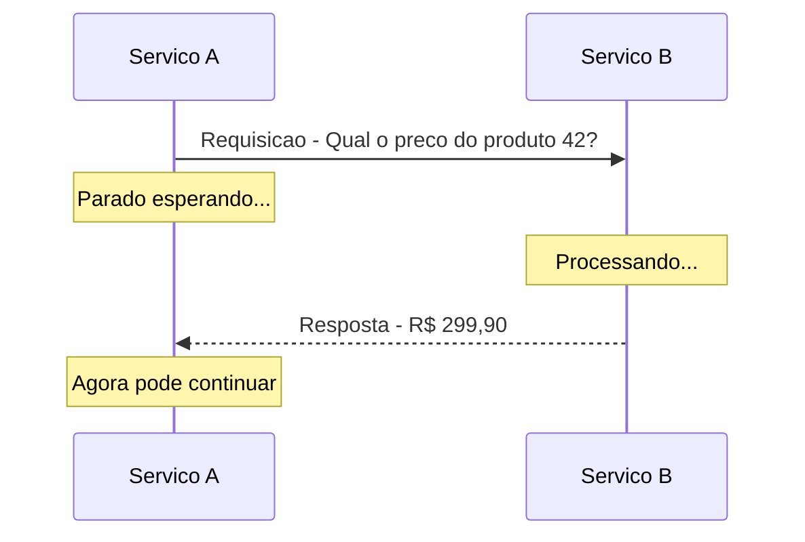

O fluxo é linear e previsível:
1. A envia a requisição
2. A espera
3. B processa
4. B envia a resposta
5. A recebe a resposta e continua

### Características da Comunicação Síncrona

| Caracteristica | Descrição |
|---------------|-----------|
| Fluxo | Linear - requisicao, espera, resposta |
| Resposta | Imediata - o chamador recebe o resultado na hora |
| Acoplamento | Temporal - ambos os servicos precisam estar disponiveis ao mesmo tempo |
| Complexidade | Baixa - fácil de entender e implementar |
| Debugging | Simples - o fluxo e sequencial, fácil de rastrear |
| Tolerancia a falhas | Baixa - se B cai, A falha |

### Quando Usar Comunicação Síncrona

Use comunicação síncrona quando o serviço que chama **precisa da resposta para continuar**. Exemplos concretos:

**Verificar estoque antes de vender**: o serviço de checkout precisa saber se o produto está disponível antes de processar o pagamento. Não faz sentido processar o pagamento de algo que não tem em estoque.

**Validar credenciais de login**: o serviço de autenticação precisa verificar se a senha está correta antes de liberar o acesso. O usuário não pode entrar no sistema "e depois a gente verifica".

**Consultar preço para mostrar ao usuário**: o serviço de catálogo precisa do preço atualizado para exibir na tela. Mostrar um preço desatualizado pode causar problemas legais e de confiança.

**Calcular frete**: o serviço de checkout precisa do valor do frete para mostrar o total ao usuário. O usuário precisa ver o valor total antes de confirmar a compra.

**Buscar dados para montar uma página**: quando o usuário acessa uma página, o backend precisa buscar os dados de vários serviços para montar a resposta. O usuário está esperando a página carregar.

A regra prática é: **se o usuário está olhando para a tela esperando algo acontecer, a comunicação provavelmente precisa ser síncrona**.

### Vantagens da Comunicação Síncrona

**Simplicidade**: o fluxo é linear. Requisição, resposta, próximo passo. Qualquer desenvolvedor entende. O código é direto — chama, espera, usa o resultado.

**Resposta imediata**: o chamador sabe na hora se deu certo ou errado. Se o pagamento foi aprovado, mostra "compra confirmada". Se foi recusado, mostra "cartão recusado". Não tem ambiguidade.

**Fácil de debugar**: quando algo dá errado, o fluxo é sequencial. Você sabe exatamente onde a falha aconteceu — na requisição, no processamento ou na resposta. O stack trace mostra o caminho completo.

**Consistência**: como a resposta é imediata, o estado do sistema é consistente a cada passo. Depois de verificar o estoque e receber "disponível", você sabe que naquele momento o produto estava disponível.

### Desvantagens da Comunicação Síncrona

**Acoplamento temporal**: os dois serviços precisam estar disponíveis ao mesmo tempo. Se B está fora do ar, A não consegue fazer nada. Em um sistema com muitos serviços em cadeia (A → B → C → D), se qualquer um cair, toda a cadeia falha.

**Latência acumulada**: cada chamada síncrona adiciona tempo. Se A chama B (100ms), B chama C (200ms), e C chama D (150ms), o tempo total é pelo menos 450ms. Em cadeias longas, a latência se acumula rapidamente.

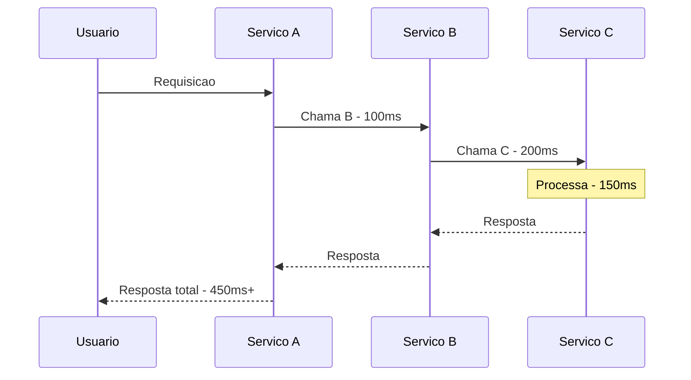

**Bloqueio de recursos**: enquanto A espera a resposta de B, A está "preso" — ocupando memória, uma thread (ou conexão) e recursos do servidor. Se muitas requisições ficam esperando ao mesmo tempo, o servidor de A pode ficar sem recursos e parar de atender novas requisições.

**Efeito cascata**: se B fica lento (em vez de responder em 100ms, demora 5 segundos), A fica lento também. E se A fica lento, quem chama A também fica lento. A lentidão se propaga como uma onda por todo o sistema. Isso se chama **cascading failure** (falha em cascata).

**Escalabilidade limitada**: se B recebe mais requisições do que consegue processar, as requisições extras ficam esperando (ou falham). Não tem "buffer" — cada requisição precisa ser processada na hora.

### O Problema do Timeout

Quando A chama B de forma síncrona, A precisa definir um **timeout** — o tempo máximo que vai esperar pela resposta. Se B não responder dentro desse tempo, A desiste e trata como erro.

Mas definir o timeout certo é difícil:

- **Timeout muito curto** (ex: 1 segundo): se B normalmente responde em 800ms mas às vezes demora 1.2 segundos, muitas requisições válidas vão falhar por timeout
- **Timeout muito longo** (ex: 30 segundos): se B está fora do ar, A fica parado 30 segundos antes de perceber. Enquanto isso, recursos ficam presos e o usuário espera

Não existe timeout perfeito. É sempre um trade-off entre falsos positivos (desistir cedo demais) e desperdício de recursos (esperar demais).

---

## Comunicação Assíncrona: A Carta

### Como Funciona

Na comunicação assíncrona, o serviço A envia uma mensagem e **continua imediatamente**, sem esperar resposta. A mensagem é processada pelo serviço B em algum momento no futuro — pode ser milissegundos depois, pode ser minutos, pode ser horas.

É como enviar uma carta. Você escreve, coloca no correio e segue sua vida. Não fica parado na agência esperando a resposta. A carta vai ser entregue quando o carteiro passar. O destinatário vai ler quando tiver tempo.

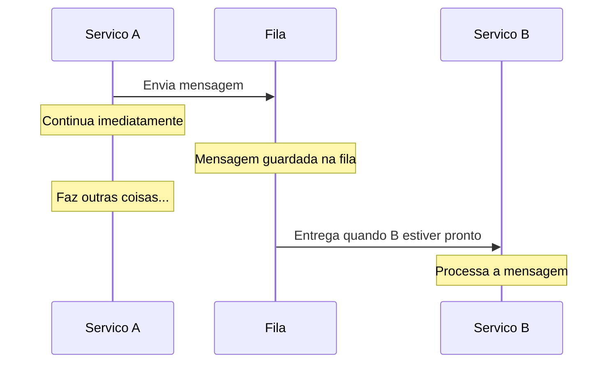

O fluxo é diferente do síncrono:
1. A envia a mensagem para um intermediário (fila, tópico de eventos)
2. A continua executando — não espera
3. B pega a mensagem quando estiver pronto
4. B processa a mensagem
5. Se B precisar informar A sobre o resultado, envia outra mensagem de volta (opcional)

### O Papel do Intermediário

Na comunicação assíncrona, quase sempre existe um **intermediário** entre os serviços. Esse intermediário é geralmente uma fila de mensagens (como RabbitMQ ou Amazon SQS) ou uma plataforma de eventos (como Apache Kafka).

O intermediário tem três funções essenciais:

1. **Guardar as mensagens**: se B não está disponível, as mensagens ficam guardadas no intermediário até B voltar
2. **Desacoplar os serviços**: A não precisa saber onde B está, nem se B está rodando. A só precisa saber onde está o intermediário
3. **Controlar o fluxo**: se chegam mais mensagens do que B consegue processar, o intermediário guarda o excesso. B processa no seu ritmo

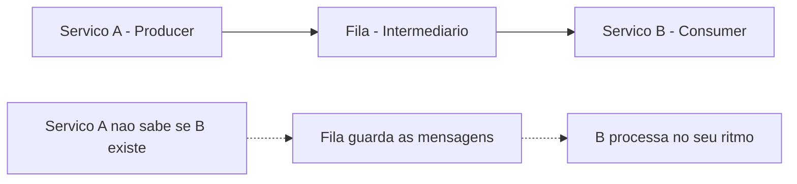

### Características da Comunicação Assíncrona

| Caracteristica | Descrição |
|---------------|-----------|
| Fluxo | Não-linear - envio e processamento acontecem em momentos diferentes |
| Resposta | Não imediata - o chamador não sabe o resultado na hora |
| Acoplamento | Mínimo - servicos não precisam estar disponiveis ao mesmo tempo |
| Complexidade | Media-alta - mais partes moveis, mais cenários de erro |
| Debugging | Complexo - o fluxo não e sequencial, precisa rastrear mensagens |
| Tolerancia a falhas | Alta - mensagens ficam na fila se o consumidor cair |

### Quando Usar Comunicação Assíncrona

Use comunicação assíncrona quando o serviço que envia **não precisa da resposta para continuar**. Exemplos concretos:

**Enviar email de confirmação**: depois que o pedido é confirmado, o email pode ser enviado em background. O usuário não precisa esperar o email ser enviado para ver a confirmação na tela.

**Processar upload de imagem**: quando o usuário faz upload de uma foto de perfil, o sistema pode aceitar o upload imediatamente e processar (redimensionar, comprimir, gerar thumbnails) em background.

**Gerar relatório**: quando o gerente pede um relatório de vendas, o sistema pode responder "seu relatório está sendo gerado" e processar em background. Quando ficar pronto, envia uma notificação.

**Atualizar recomendações**: quando o usuário compra um produto, o sistema de recomendações precisa ser atualizado. Mas isso não precisa acontecer na hora — pode processar nos próximos minutos.

**Notificar múltiplos serviços**: quando um pedido é criado, vários serviços precisam saber (estoque, logística, analytics, notificação). Em vez de chamar cada um sincronamente, pública um evento e cada serviço processa quando puder.

**Sincronizar dados entre sistemas**: quando dados mudam em um sistema, outros sistemas precisam ser atualizados. Isso pode acontecer de forma assíncrona — eventualmente todos ficam sincronizados.

A regra prática é: **se o resultado pode esperar e o usuário não está olhando para a tela esperando, a comunicação provavelmente pode ser assíncrona**.

### Vantagens da Comunicação Assíncrona

**Desacoplamento**: os serviços não precisam estar disponíveis ao mesmo tempo. A pode enviar mensagens mesmo que B esteja fora do ar. Quando B voltar, processa tudo que estava pendente.

**Resiliência**: se B cai, as mensagens ficam na fila. Nenhuma mensagem se perde. Quando B volta, processa o backlog. O sistema como um todo continua funcionando — apenas o processamento assíncrono fica atrasado.

**Escalabilidade**: se chegam mais mensagens do que B consegue processar, você pode adicionar mais instâncias de B. Cada instância pega mensagens da fila e processa. A fila distribui o trabalho automaticamente.

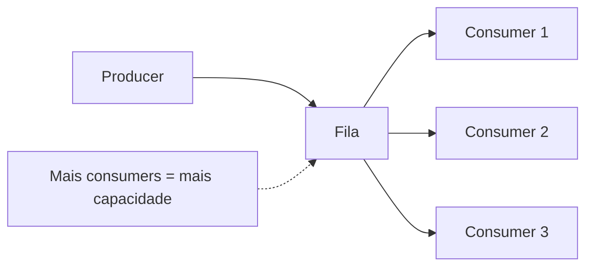

**Performance percebida**: o serviço A responde ao usuário imediatamente ("seu pedido foi recebido") sem esperar o processamento pesado. O usuário percebe o sistema como rápido, mesmo que o processamento total demore mais.

**Absorção de picos**: em momentos de pico (Black Friday, por exemplo), a fila absorve o excesso de mensagens. Os consumers processam no ritmo que conseguem. Sem fila, o sistema cairia sob a carga.

### Desvantagens da Comunicação Assíncrona

**Complexidade**: mais partes móveis. Você precisa do intermediário (fila), precisa garantir que mensagens não se percam, precisa lidar com mensagens duplicadas, precisa monitorar o tamanho da fila.

**Sem resposta imediata**: o serviço A não sabe se B processou a mensagem com sucesso. Se algo der errado no processamento, A não fica sabendo na hora. Precisa de mecanismos adicionais para lidar com falhas (dead letter queues, retries, alertas).

**Consistência eventual**: como o processamento não é imediato, o sistema pode ficar temporariamente inconsistente. Exemplo: o usuário comprou um produto, mas o estoque ainda não foi atualizado porque a mensagem está na fila. Por alguns segundos, o estoque mostra uma unidade a mais do que deveria.

**Debugging difícil**: quando algo dá errado, o fluxo não é sequencial. A mensagem foi enviada por A às 10:00, processada por B às 10:05, e o erro apareceu às 10:05. Rastrear o problema exige correlacionar logs de serviços diferentes em momentos diferentes.

**Ordenação não garantida**: em muitos sistemas de filas, a ordem de processamento não é garantida. A mensagem 1 pode ser processada depois da mensagem 2. Se a ordem importa, você precisa de mecanismos adicionais.

### O Conceito de Consistência Eventual

Um dos conceitos mais importantes da comunicação assíncrona é a **consistência eventual** (eventual consistency). Isso significa que, depois de uma mudança, o sistema pode ficar temporariamente inconsistente, mas eventualmente todos os serviços vão convergir para o mesmo estado.

Analogia: imagine que você muda de endereço. Você atualiza seu endereço no banco, na operadora de celular, no trabalho e na academia. Mas não faz tudo ao mesmo tempo — leva alguns dias. Durante esses dias, alguns lugares têm seu endereço novo e outros ainda têm o antigo. Eventualmente, todos vão ter o endereço correto. Isso é consistência eventual.

No mundo dos sistemas distribuídos, consistência eventual é aceitável para muitas operações. O email de confirmação pode chegar 30 segundos depois da compra. As recomendações podem ser atualizadas em 5 minutos. O relatório pode refletir dados de 1 hora atrás. Para essas operações, consistência eventual é perfeitamente adequada.

Mas para outras operações, consistência eventual não é aceitável. O saldo da conta bancária precisa ser preciso na hora. O estoque precisa ser verificado no momento da compra. Para essas operações, comunicação síncrona é necessária.

---

## Comparação Detalhada: Síncrono vs Assíncrono

Agora que entendemos cada abordagem em profundidade, vamos compará-las lado a lado.

### Tabela Comparativa Completa

| Aspecto | Sincrono | Assincrono |
|---------|----------|------------|
| Espera resposta | Sim | Não |
| Acoplamento | Temporal - ambos precisam estar online | Mínimo - podem funcionar independentemente |
| Velocidade percebida | Depende do servico mais lento | Rápida - responde imediatamente |
| Tolerancia a falhas | Baixa - falha se o destino cair | Alta - mensagens ficam na fila |
| Consistência | Imediata | Eventual |
| Complexidade de código | Baixa | Media-alta |
| Complexidade de infra | Baixa - so HTTP | Media - precisa de fila ou broker |
| Debugging | Simples - fluxo linear | Complexo - fluxo distribuido |
| Escalabilidade | Limitada pelo servico mais lento | Alta - adicionar consumers |
| Ordenação | Garantida - sequencial | Não garantida por padrão |
| Uso tipico | Consultas, validacoes, operações criticas | Notificacoes, processamento pesado, eventos |

### Diagrama Comparativo de Fluxo

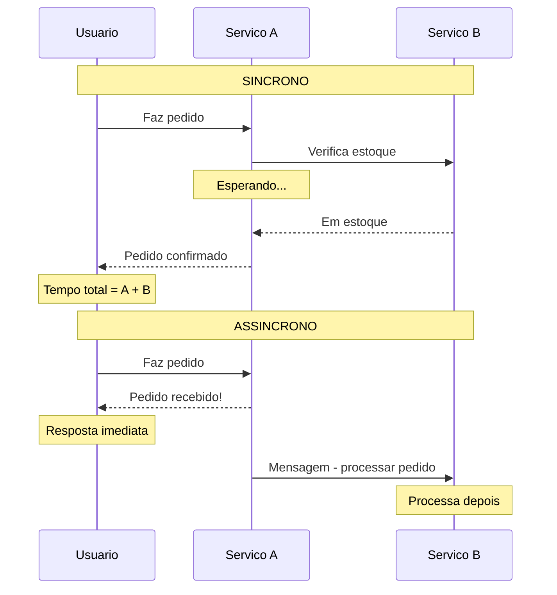

---

## Padrões Comuns: Combinando Síncrono e Assíncrono

Na prática, sistemas reais usam as duas abordagens. A arte está em saber qual usar em cada ponto do fluxo.

### Padrão 1: Síncrono na Frente, Assíncrono nos Bastidores

O padrão mais comum. O usuário faz uma ação, o sistema responde sincronamente com o essencial, e dispara processamentos assíncronos para o resto.

**Exemplo: Compra em e-commerce**

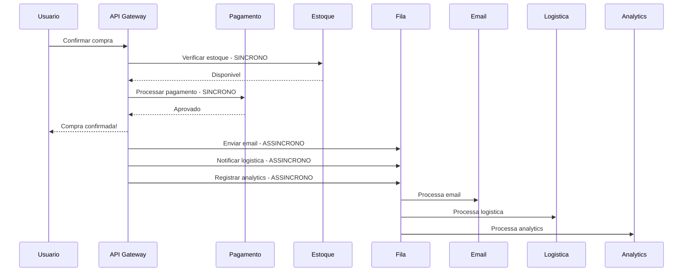

Observe: o usuário recebe a confirmação depois de duas chamadas síncronas (estoque e pagamento) — as operações críticas. O email, a logística e o analytics são processados de forma assíncrona — o usuário não precisa esperar por eles.

### Padrão 2: Aceitar e Processar Depois

Quando o processamento é pesado e o usuário não precisa do resultado imediato, o sistema aceita a requisição sincronamente e processa tudo de forma assíncrona.

**Exemplo: Upload de vídeo (YouTube)**

Quando você faz upload de um vídeo no YouTube, o sistema:
1. Aceita o arquivo (síncrono — você vê a barra de progresso)
2. Responde "upload concluído, processando..." (síncrono)
3. Transcodifica o vídeo para vários formatos e resoluções (assíncrono — leva minutos ou horas)
4. Gera thumbnails (assíncrono)
5. Analisa o conteúdo para moderação (assíncrono)
6. Indexa para busca (assíncrono)
7. Notifica seus inscritos (assíncrono)

O usuário recebe a confirmação do upload em segundos. O processamento pesado acontece em background e pode levar horas para vídeos longos.

### Padrão 3: Request-Reply Assíncrono

Às vezes você precisa de uma resposta, mas o processamento é demorado. Nesse caso, usa-se o padrão request-reply assíncrono:

1. A envia a requisição e recebe um ID de acompanhamento (síncrono)
2. B processa em background (assíncrono)
3. A consulta o status periodicamente usando o ID (síncrono — polling)
4. Quando B termina, A recebe o resultado

**Exemplo: Geração de relatório**

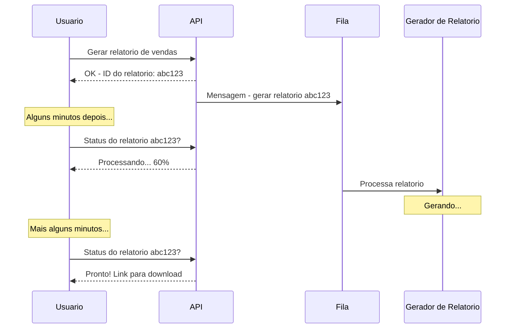

Esse padrão é usado quando o processamento é demorado demais para ser síncrono (o usuário não vai esperar 5 minutos olhando para a tela), mas o resultado é necessário (diferente de um email, que é "fire and forget").

### Padrão 4: Saga — Transações Distribuídas

Quando uma operação envolve múltiplos serviços e todos precisam ser bem-sucedidos (ou todos precisam ser revertidos), usa-se o padrão Saga. É uma sequência de transações locais, onde cada passo tem uma ação de compensação caso algo dê errado.

**Exemplo: Reserva de viagem**

Reservar uma viagem envolve: reservar voo + reservar hotel + reservar carro. Se a reserva do carro falhar depois que voo e hotel já foram reservados, você precisa cancelar o voo e o hotel.

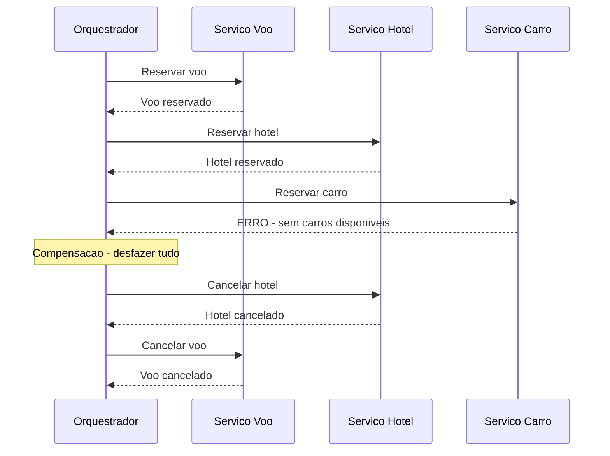

Sagas são complexas e vamos apenas mencioná-las aqui. O importante é saber que existem — quando você encontrar esse problema no futuro, vai saber o nome do padrão e onde pesquisar.

---

## Cenários Práticos: Decidindo entre Síncrono e Assíncrono

Vamos praticar a decisão com cenários reais. Para cada cenário, a pergunta é: síncrono ou assíncrono?

### Cenário 1: Login do Usuário

O usuário digita email e senha e clica em "Entrar".

**Decisão: Síncrono**

O usuário está olhando para a tela esperando entrar no sistema. Ele precisa saber na hora se as credenciais estão corretas. Não faz sentido responder "vamos verificar e te avisamos depois".

### Cenário 2: Envio de Email de Boas-Vindas

Depois que o usuário se cadastra, o sistema precisa enviar um email de boas-vindas.

**Decisão: Assíncrono**

O cadastro já foi feito. O email é um complemento — se demorar 30 segundos ou 5 minutos para chegar, não tem problema. Fazer o usuário esperar o email ser enviado para ver a tela de "cadastro concluído" seria desperdício.

### Cenário 3: Verificação de Saldo Bancário

O usuário quer fazer uma transferência PIX. O sistema precisa verificar se tem saldo suficiente.

**Decisão: Síncrono**

A transferência só pode acontecer se houver saldo. Essa verificação é crítica e precisa ser feita na hora, com dados atualizados. Consistência eventual não é aceitável para saldo bancário.

### Cenário 4: Atualização de Recomendações

O usuário acabou de assistir um filme na Netflix. O sistema de recomendações precisa ser atualizado.

**Decisão: Assíncrono**

O usuário não está esperando as recomendações serem atualizadas. Ele vai ver as novas recomendações na próxima vez que abrir o app. Processar em background é perfeitamente adequado.

### Cenário 5: Geração de Nota Fiscal

O pedido foi confirmado e pago. O sistema precisa gerar a nota fiscal eletrônica.

**Decisão: Assíncrono**

A nota fiscal pode ser gerada em background. O pedido já está confirmado. Se a geração da nota falhar, pode ser retentada sem afetar o pedido. O cliente recebe a nota por email quando estiver pronta.

### Cenário 6: Busca de Produtos

O usuário digita "notebook" na barra de busca e espera os resultados.

**Decisão: Síncrono**

O usuário está olhando para a tela esperando os resultados. A busca precisa ser rápida e retornar os dados na hora.

### Fluxograma de Decisão

Para facilitar, aqui está um fluxograma que ajuda a decidir:

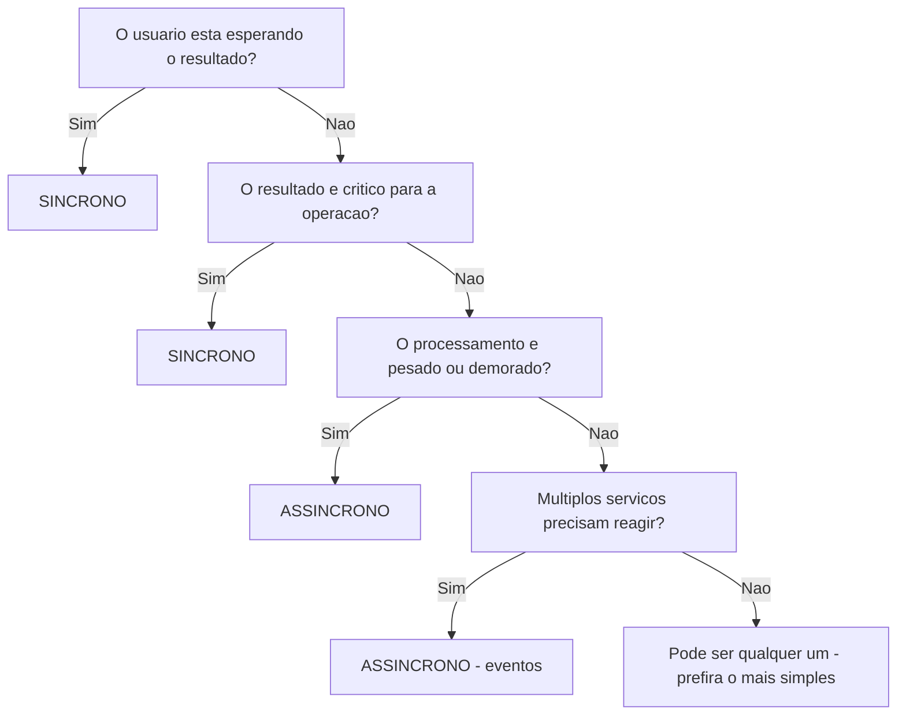

---

## O Impacto na Arquitetura do Sistema

A escolha entre síncrono e assíncrono não afeta apenas a comunicação — afeta a arquitetura inteira do sistema.

### Arquitetura Predominantemente Síncrona

Quando a maioria das comunicações é síncrona, o sistema tende a ter uma arquitetura em cadeia: A chama B, que chama C, que chama D. O fluxo é linear e previsível.

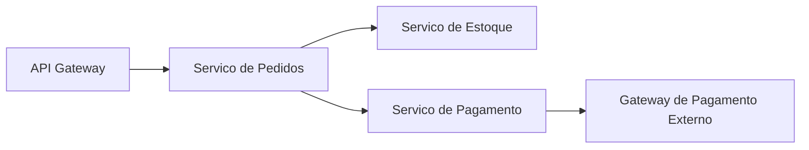

**Vantagens**: fácil de entender, fácil de debugar, consistência imediata.

**Riscos**: falha em cascata (se C cai, B falha, e A falha), latência acumulada, acoplamento forte entre serviços.

### Arquitetura Predominantemente Assíncrona (Event-Driven)

Quando a maioria das comunicações é assíncrona, o sistema tende a ser orientado a eventos: serviços publicam eventos e outros reagem.

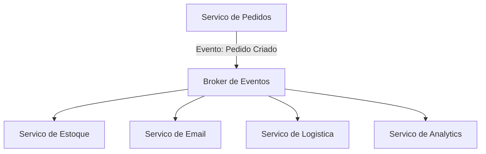

**Vantagens**: desacoplamento total, resiliência alta, escalabilidade natural.

**Riscos**: difícil de debugar (o fluxo não é linear), consistência eventual (dados podem estar temporariamente desatualizados), complexidade operacional (precisa monitorar filas, consumers, dead letters).

### A Realidade: Arquitetura Híbrida

Na prática, quase todo sistema real usa uma combinação das duas abordagens. O caminho crítico (o que o usuário está esperando) é síncrono. O processamento secundário é assíncrono.

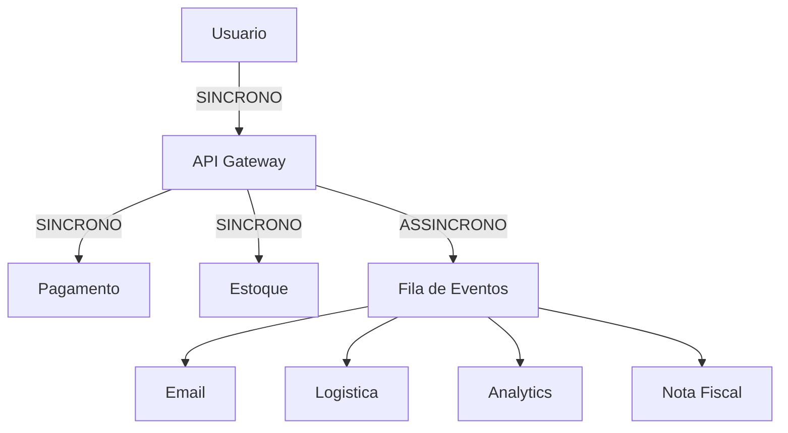

Essa é a arquitetura mais comum em sistemas de produção. O usuário recebe resposta rápida (síncrono para o essencial), e o resto acontece em background (assíncrono para o complementar).

---

## Casos de Uso no Mundo Real

### Caso 1: Mercado Livre — Síncrono para Compra, Assíncrono para o Resto

Quando você compra algo no Mercado Livre, o fluxo crítico é síncrono: verificar estoque, processar pagamento, confirmar pedido. Tudo isso acontece em segundos enquanto você espera.

Mas depois da confirmação, dezenas de processos assíncronos são disparados: notificar o vendedor, gerar etiqueta de envio, atualizar métricas de venda, calcular comissão do Mercado Livre, atualizar o ranking do vendedor, enviar email de confirmação, atualizar o histórico de compras. Nenhum desses processos precisa acontecer na hora — e se qualquer um falhar, o pedido já está confirmado e pode ser retentado.

O Mercado Livre processa milhões de transações por dia. Se todos esses processos fossem síncronos, cada compra demoraria minutos em vez de segundos, e qualquer falha em um serviço secundário derrubaria todo o fluxo de compra.

### Caso 2: Nubank — Consistência Imediata para Saldo

O Nubank é um exemplo interessante porque lida com dinheiro — onde consistência eventual não é aceitável para certas operações.

Quando você faz um PIX, a verificação de saldo e o débito precisam ser síncronos e atômicos (ou acontecem juntos, ou nenhum acontece). Não pode debitar o dinheiro e depois descobrir que não tinha saldo. Não pode mostrar saldo de 5 minutos atrás.

Mas a notificação push ("PIX de R$ 50 enviado"), o registro no extrato detalhado, a atualização do gráfico de gastos e o cálculo de cashback — tudo isso pode ser assíncrono. Se a notificação chegar 3 segundos depois do PIX, ninguém reclama.

### Caso 3: YouTube — Assíncrono por Necessidade

O YouTube recebe mais de 500 horas de vídeo por minuto. Processar um vídeo (transcodificar para múltiplas resoluções, gerar thumbnails, analisar conteúdo, indexar para busca) pode levar de minutos a horas dependendo do tamanho.

Se o upload fosse síncrono (o usuário esperasse todo o processamento terminar), ninguém usaria o YouTube. Em vez disso, o upload é aceito rapidamente (síncrono), e todo o processamento pesado acontece em background (assíncrono). O usuário vê "processando..." e pode fechar o navegador — o vídeo vai ficar disponível quando o processamento terminar.

O YouTube usa filas massivas para gerenciar o processamento. Cada vídeo gera dezenas de tarefas assíncronas (uma para cada resolução, uma para thumbnails, uma para legendas automáticas, etc.). Essas tarefas são distribuídas entre milhares de servidores que processam em paralelo.

---

## Armadilhas Comuns

### Armadilha 1: Fazer Tudo Síncrono

Desenvolvedores iniciantes tendem a fazer tudo síncrono porque é mais simples. O resultado: o sistema fica lento e frágil. Cada serviço que cai derruba todo o fluxo. Cada serviço lento torna todo o sistema lento.

**Como evitar**: para cada chamada entre serviços, pergunte "o usuário está esperando isso?". Se não, considere fazer assíncrono.

### Armadilha 2: Fazer Tudo Assíncrono

O extremo oposto: fazer tudo assíncrono "porque é mais resiliente". O resultado: o sistema fica complexo demais, difícil de debugar, e operações que precisam de resposta imediata ficam confusas.

**Como evitar**: para cada operação, pergunte "o usuário precisa do resultado agora?". Se sim, faça síncrono.

### Armadilha 3: Ignorar Falhas Assíncronas

"Coloquei na fila, pronto, não preciso me preocupar." Errado. Mensagens podem falhar no processamento. O consumer pode ter um bug. A mensagem pode estar em formato errado. Você precisa de mecanismos para lidar com falhas: retries, dead letter queues (filas de mensagens que falharam), alertas.

**Como evitar**: sempre tenha um plano para "e se a mensagem falhar no processamento?".

### Armadilha 4: Cadeia Síncrona Muito Longa

A → B → C → D → E → F. Se cada chamada leva 100ms, o total é 600ms. Se qualquer serviço ficar lento, todo o fluxo fica lento. Se qualquer serviço cair, todo o fluxo falha.

**Como evitar**: limite cadeias síncronas a 2-3 níveis. Se precisa de mais, considere quebrar em partes síncronas e assíncronas.

### Armadilha 5: Não Monitorar Filas

Colocar mensagens em uma fila e esquecer que ela existe. Semanas depois, a fila tem milhões de mensagens não processadas porque o consumer travou silenciosamente.

**Como evitar**: monitore o tamanho da fila (queue depth). Se o número de mensagens pendentes cresce continuamente, algo está errado. Configure alertas para quando a fila ultrapassar um limite.

### Armadilha 6: Tratar Assíncrono como Síncrono Disfarçado

Enviar uma mensagem para a fila e imediatamente fazer polling a cada 100ms esperando o resultado. Isso é comunicação síncrona disfarçada de assíncrona — você tem toda a complexidade do assíncrono sem nenhuma das vantagens.

**Como evitar**: se você precisa da resposta imediata, use comunicação síncrona. Se está usando assíncrono, aceite que o resultado vai demorar e projete a experiência do usuário de acordo (mostrar "processando...", enviar notificação quando pronto).

---

## Síncrono e Assíncrono no Código Python

Para dar uma ideia concreta de como essas abordagens se manifestam no código, vamos ver exemplos simplificados em Python. Não se preocupe com os detalhes de implementação — o objetivo é visualizar a diferença conceitual.

### Exemplo Síncrono (Conceitual)

```python
# Exemplo conceitual — comunicacao sincrona
# "response" = resposta
# "requests" = biblioteca para fazer requisicoes HTTP

import requests  # biblioteca para chamadas HTTP

def confirmar_pedido(pedido_id):
    # Passo 1: verificar estoque (SINCRONO — espera a resposta)
    response = requests.get(f"http://estoque-service/check/{pedido_id}")
    if response.status_code != 200:
        return "Erro: produto sem estoque"

    # Passo 2: processar pagamento (SINCRONO — espera a resposta)
    response = requests.post(f"http://pagamento-service/pay/{pedido_id}")
    if response.status_code != 200:
        return "Erro: pagamento recusado"

    # So chega aqui se AMBOS deram certo
    return "Pedido confirmado!"
```

Saída esperada (conceitual):
```
# Se tudo der certo:
Pedido confirmado!

# Se estoque falhar:
Erro: produto sem estoque

# Se pagamento falhar:
Erro: pagamento recusado
```

Observe: cada chamada `requests.get()` e `requests.post()` **bloqueia** a execução. O código fica parado na linha até receber a resposta. É simples e direto, mas se qualquer serviço demorar, todo o fluxo demora.

### Exemplo Assíncrono (Conceitual)

```python
# Exemplo conceitual — comunicacao assincrona
# "publish" = publicar mensagem na fila
# "queue" = fila de mensagens

def confirmar_pedido(pedido_id):
    # Passo 1: verificar estoque (SINCRONO — precisa da resposta)
    response = requests.get(f"http://estoque-service/check/{pedido_id}")
    if response.status_code != 200:
        return "Erro: produto sem estoque"

    # Passo 2: processar pagamento (SINCRONO — precisa da resposta)
    response = requests.post(f"http://pagamento-service/pay/{pedido_id}")
    if response.status_code != 200:
        return "Erro: pagamento recusado"

    # Passo 3: disparar processos em background (ASSINCRONO — nao espera)
    queue.publish("enviar-email", {"pedido_id": pedido_id})
    queue.publish("notificar-logistica", {"pedido_id": pedido_id})
    queue.publish("atualizar-analytics", {"pedido_id": pedido_id})

    # Responde imediatamente — email, logistica e analytics processam depois
    return "Pedido confirmado!"
```

Saída esperada (conceitual):
```
Pedido confirmado!
# Email, logistica e analytics sao processados em background
# O usuario nao espera por eles
```

Observe a diferença: os passos críticos (estoque e pagamento) continuam síncronos. Mas o email, a logística e o analytics são disparados de forma assíncrona — o `queue.publish()` retorna imediatamente, sem esperar o processamento.

Esse é o padrão "síncrono na frente, assíncrono nos bastidores" que vimos anteriormente. No módulo 11.7, quando construirmos a API com FastAPI, vamos implementar a parte síncrona na prática.

---

## Como a IA pode te ajudar aqui
**Prompt 1 — Ver exemplos práticos:**
> "Me dê 5 exemplos de operações que devem ser síncronas e 5 que devem ser assíncronas em um sistema de e-commerce. Explique o raciocínio para cada uma."

**Prompt 2 — Explorar o conceito:**
> "Explique o conceito de consistência eventual como se eu tivesse 15 anos. Use analogias do dia a dia."

**Prompt 3 — Aprofundar o tema:**
> "O que é o padrão Saga em microserviços? Me dê um exemplo prático com código pseudocódigo mostrando as ações e compensações."

---

## Resumo do Módulo

| Conceito | Definição |
|----------|-----------|
| Comunicação sincrona | O emissor espera a resposta antes de continuar - como um telefonema |
| Comunicação assincrona | O emissor continua sem esperar resposta - como uma carta |
| Acoplamento temporal | Quando dois servicos precisam estar disponiveis ao mesmo tempo |
| Consistência eventual | O sistema pode ficar temporariamente inconsistente mas converge para o estado correto |
| Fila de mensagens | Intermediario que guarda mensagens entre producer e consumer |
| Timeout | Tempo máximo que um servico espera por uma resposta sincrona |
| Falha em cascata | Quando a falha de um servico se propaga para outros servicos na cadeia |
| Dead letter queue | Fila especial para mensagens que falharam no processamento |
| Saga | Padrão para transações distribuidas com ações de compensacao |
| Fire and forget | Enviar mensagem sem se preocupar com a resposta |
| Polling | Consultar periodicamente o status de uma operação assincrona |
| Request-reply assincrono | Enviar requisicao, receber ID, consultar resultado depois |

---

## Glossário do Módulo

| Termo | Definição |
|-------|-----------|
| Acoplamento temporal | Dependência entre servicos que exige que ambos estejam disponiveis simultaneamente |
| Assincrono | Comunicação onde o emissor não espera resposta imediata |
| Backlog | Acumulo de mensagens pendentes em uma fila |
| Broker | Intermediario que gerência a distribuição de mensagens entre servicos |
| Callback | Função ou endpoint chamado quando uma operação assincrona termina |
| Cascading failure | Falha que se propaga de um servico para outros na cadeia de chamadas |
| Compensacao | Ação que desfaz uma operação anterior em caso de falha |
| Consistência eventual | Modelo onde o sistema converge para um estado consistente ao longo do tempo |
| Consistência imediata | Modelo onde o sistema esta sempre em estado consistente apos cada operação |
| Consumer | Servico que recebe e processa mensagens de uma fila |
| Dead letter queue | Fila para mensagens que falharam repetidamente no processamento |
| Event-driven | Arquitetura onde servicos reagem a eventos publicados por outros servicos |
| Fire and forget | Padrão onde o emissor envia a mensagem sem esperar confirmacao de processamento |
| Intermediario | Componente entre dois servicos que gerência a comunicação |
| Latencia | Tempo entre enviar uma requisicao e receber a resposta |
| Polling | Técnica de consultar periodicamente o status de uma operação |
| Producer | Servico que envia mensagens para uma fila ou tópico |
| Retry | Tentativa de reprocessar uma mensagem que falhou |
| Saga | Padrão para coordenar transações distribuidas entre multiplos servicos |
| Sincrono | Comunicação onde o emissor espera a resposta antes de continuar |
| Timeout | Tempo máximo de espera por uma resposta antes de considerar falha |
| Transação atomica | Operação que ou acontece completamente ou não acontece |

---

## Na Cultura Popular

- **O Dilema das Redes** (documentário, 2020) — as redes sociais processam bilhões de interações por dia. Cada curtida, comentário e compartilhamento dispara processamentos assíncronos em dezenas de serviços. O documentário mostra como esses sistemas trabalham em background para personalizar seu feed — um exemplo massivo de comunicação assíncrona em escala.

- **Halt and Catch Fire** (série, 2014-2017) — a série mostra a evolução da computação desde os PCs até a internet. Na temporada sobre a internet, os personagens lidam com os desafios de fazer sistemas se comunicarem pela rede — latência, falhas, sincronização. Os problemas que enfrentam nos anos 1990 são conceitualmente os mesmos que discutimos neste módulo.

---

## Para Saber Mais

- [RabbitMQ Tutorials](https://www.rabbitmq.com/getstarted.html) — *Tutoriais oficiais de mensageria — para ver na prática como filas funcionam com producers e consumers*

- [REST API Tutorial](https://restfulapi.net/) — *Guia completo sobre APIs REST, a forma mais comum de comunicação síncrona entre serviços*

- [Martin Fowler — Patterns of Enterprise Application Architecture](https://martinfowler.com/eaaCatalog/) — *Catálogo de patterns de arquitetura, incluindo patterns de integração entre serviços*

- [Rocketseat — APIs com Python](https://www.youtube.com/@rocketseat) — *Canal brasileiro com conteúdo sobre desenvolvimento de APIs e integrações*

- [Public APIs](https://github.com/public-apis/public-apis) — *Lista de APIs públicas gratuitas para experimentar comunicação síncrona na prática*

---

## Perguntas Frequentes (FAQ)

**P: Posso misturar síncrono e assíncrono no mesmo sistema?**
R: Sim, e é exatamente o que a maioria dos sistemas faz. O caminho crítico (o que o usuário espera) é síncrono, e o processamento secundário é assíncrono. Não existe sistema real que seja 100% síncrono ou 100% assíncrono.

**P: Comunicação assíncrona é sempre melhor que síncrona?**
R: Não. Assíncrona é melhor para resiliência e escalabilidade, mas pior para simplicidade e consistência. Se você precisa de resposta imediata e consistência garantida, síncrono é a escolha certa. A melhor abordagem depende do cenário.

**P: O que é "fire and forget"?**
R: É quando você envia uma mensagem assíncrona e não se preocupa com o resultado. Exemplo: registrar um evento de analytics. Se falhar, não tem impacto no usuário. É o nível mais simples de comunicação assíncrona.

**P: O que acontece se a fila ficar cheia?**
R: Depende da configuração. Algumas filas rejeitam novas mensagens quando estão cheias. Outras descartam mensagens antigas para dar espaço às novas. Outras expandem automaticamente. Na prática, filas cheias são um sinal de que os consumers não estão dando conta — você precisa adicionar mais consumers ou investigar por que estão lentos.

**P: Consistência eventual é perigosa?**
R: Depende do contexto. Para saldo bancário, sim — consistência eventual pode significar gastar dinheiro que não tem. Para recomendações de produtos, não — se as recomendações estiverem 5 minutos desatualizadas, ninguém percebe. O segredo é saber quais dados precisam de consistência imediata e quais podem ser eventuais.

**P: Como sei se meu sistema precisa de comunicação assíncrona?**
R: Sinais de que você precisa: operações que demoram mais de 1-2 segundos, operações que não precisam de resposta imediata, operações que disparam reações em múltiplos serviços, picos de carga que sobrecarregam serviços. Se seu sistema é simples e rápido, síncrono pode ser suficiente.

**P: Preciso de um servidor de filas para fazer comunicação assíncrona?**
R: Na maioria dos casos, sim. O servidor de filas (RabbitMQ, Kafka, SQS) é o intermediário que guarda as mensagens. Existem alternativas mais simples (como usar o próprio banco de dados como fila), mas para sistemas de produção, um servidor de filas dedicado é recomendado.

**P: O que é uma dead letter queue?**
R: É uma fila especial para mensagens que falharam no processamento após várias tentativas. Em vez de descartar a mensagem, ela vai para a dead letter queue onde pode ser investigada manualmente. É como a seção de "cartas devolvidas" dos correios — cartas que não puderam ser entregues ficam lá para alguém resolver.

**P: Saga é a mesma coisa que transação de banco de dados?**
R: Conceitualmente sim — ambas garantem que ou tudo acontece ou nada acontece. Mas a implementação é diferente. Uma transação de banco é atômica (o banco garante). Uma Saga é uma sequência de transações locais com compensações — se o passo 3 falha, você precisa desfazer os passos 1 e 2 manualmente. É mais complexo e menos garantido que uma transação de banco.

**P: Qual a diferença entre fila e evento?**
R: Na fila, a mensagem é enviada para um destinatário específico — um consumer pega e processa. Na publicação de eventos, a mensagem é publicada para qualquer interessado — múltiplos consumers podem receber o mesmo evento. Fila é "carta para alguém", evento é "notícia no jornal".

**P: Vou precisar implementar comunicação assíncrona neste capítulo?**
R: Não. Neste capítulo, vamos implementar comunicação síncrona (API REST com FastAPI). Comunicação assíncrona é apresentada conceitualmente para que você entenda o panorama completo. Implementação prática de filas e eventos é um tema mais avançado que você vai encontrar em projetos reais no futuro.

---

## Exercícios Práticos

### Exercício 1: Classificando Operações

Para o sistema de uma clínica médica online, classifique cada operação como síncrona ou assíncrona e justifique:

1. Verificar se o horário está disponível para agendamento
2. Enviar lembrete de consulta por SMS 24h antes
3. Processar pagamento da consulta
4. Gerar prontuário eletrônico após a consulta
5. Notificar o médico sobre um novo agendamento
6. Buscar o histórico de consultas do paciente

### Exercício 2: Redesenhando um Fluxo

Considere este fluxo 100% síncrono de um sistema de delivery:

1. Cliente faz pedido → sistema verifica restaurante aberto → calcula preço → processa pagamento → notifica restaurante → encontra entregador → envia confirmação por email → responde ao cliente "pedido confirmado"

Identifique quais passos poderiam ser assíncronos e redesenhe o fluxo usando o padrão "síncrono na frente, assíncrono nos bastidores". Desenhe o diagrama de sequência.

### Exercício 3: Analisando Trade-offs

Uma startup está construindo um sistema de reserva de ingressos para shows. O sistema precisa:
- Mostrar ingressos disponíveis
- Reservar o ingresso selecionado
- Processar o pagamento
- Gerar o QR code do ingresso
- Enviar o ingresso por email

O problema: shows populares esgotam em minutos, com milhares de pessoas tentando comprar ao mesmo tempo.

Análise: quais operações devem ser síncronas e quais podem ser assíncronas? Quais são os riscos de cada escolha? O que acontece se dois usuários tentarem reservar o último ingresso ao mesmo tempo?

---

[← Anterior: Como Serviços se Comunicam](cap11-mod01-como-servicos-se-comunicam-conteudo.md) · [Próximo: APIs HTTP e REST →](cap11-mod03-apis-http-rest-conteudo.md)
