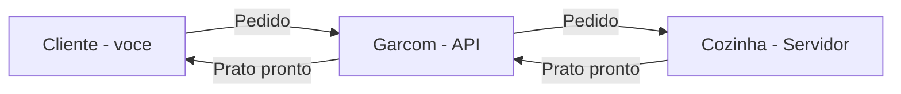
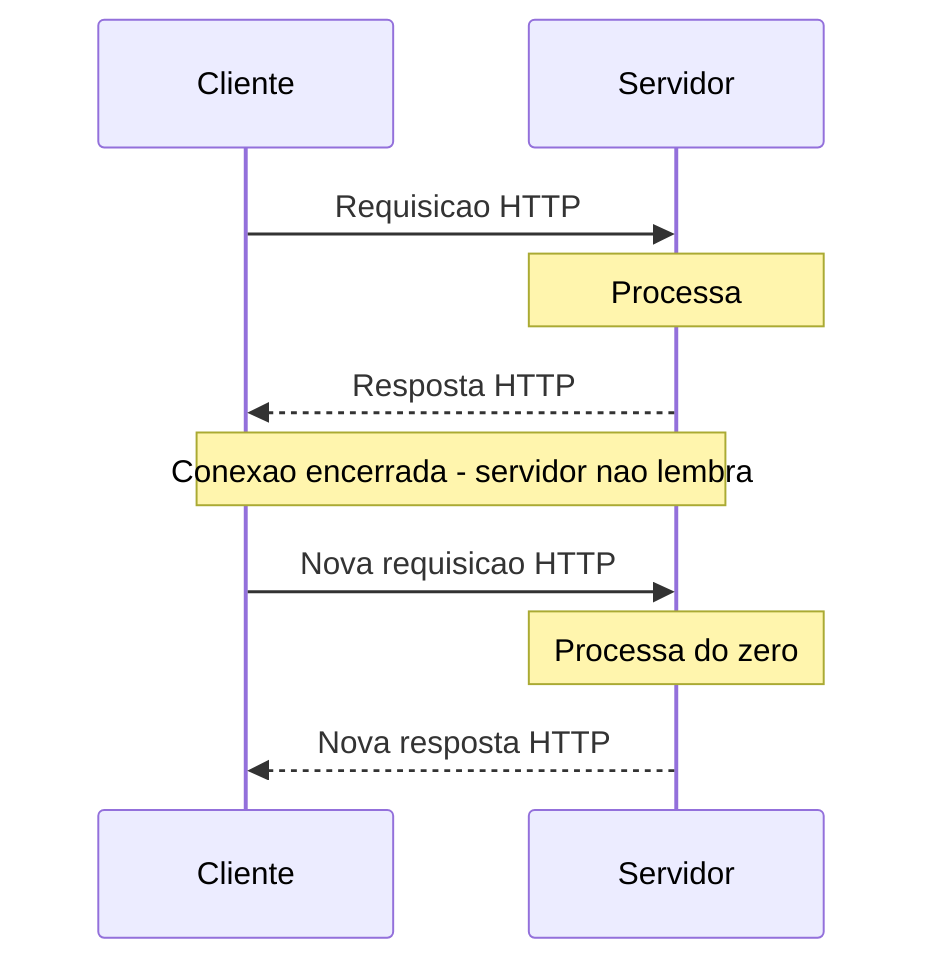
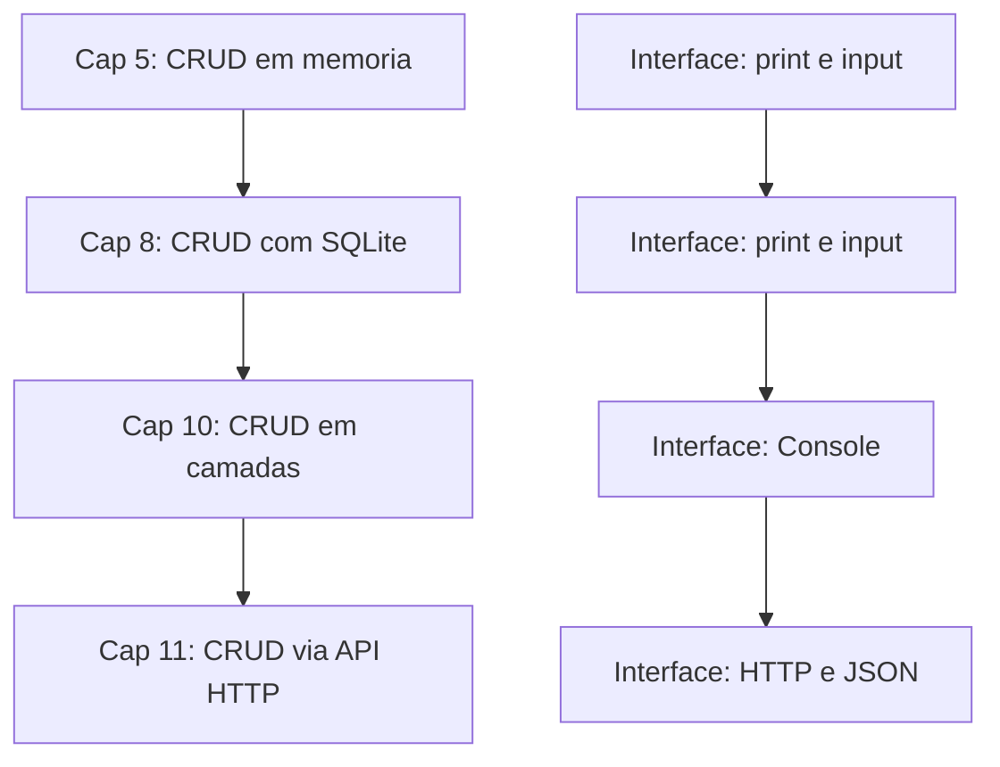

# 11.3 — APIs HTTP e REST: A Linguagem da Web

[← Anterior: Síncrono vs Assíncrono](cap11-mod02-sincrono-vs-assincrono-conteudo.md) · [Próximo: Filas e Mensageria →](cap11-mod04-filas-mensageria-conteudo.md)

---

## Introdução

No módulo anterior, você aprendeu que comunicação síncrona é como um telefonema — o serviço A chama o serviço B e espera a resposta. Agora vamos aprofundar a forma mais comum de fazer essa comunicação síncrona: APIs HTTP.

Se a comunicação entre serviços é uma conversa, HTTP é o idioma que eles falam. E REST são as regras de etiqueta dessa conversa — como pedir, como responder, como organizar os assuntos. Juntos, HTTP e REST formam a base de praticamente toda comunicação síncrona na web moderna.

Você já usou HTTP sem saber. Toda vez que acessou um site no navegador, fez uma requisição HTTP. No módulo 3.6, quando usou `curl` para fazer requisições, estava falando HTTP. Agora vamos entender o que acontece por trás — e como construir o lado que responde.

Este módulo é fundamental para o resto do capítulo. Tudo que vem depois — FastAPI, o projeto CRUD, a documentação da API — depende de você entender HTTP e REST. Vamos do básico ao completo.

---

## Como Executar os Exemplos Deste Módulo

Este módulo tem exemplos práticos com `curl` que você pode executar no terminal. Para testar requisições HTTP contra APIs reais, vamos usar APIs públicas gratuitas que não precisam de cadastro.

Requisitos:
1. Terminal aberto (você já sabe usar desde o capítulo 3)
2. `curl` instalado (já vem instalado no Linux e macOS)
3. Conexão com a internet

Para testar os exemplos, basta copiar os comandos `curl` e colar no terminal. As respostas vão aparecer em formato JSON.

---

## O que é uma API?

Antes de falar de HTTP e REST, precisamos entender o que é uma API.

**API** significa Application Programming Interface — Interface de Programação de Aplicações. Em português simples: é uma forma de um programa conversar com outro programa.

### A Analogia do Restaurante

Imagine que você está em um restaurante. Você (o cliente) quer comida (dados). A cozinha (o servidor) prepara a comida. Mas você não entra na cozinha para pegar a comida — existe um cardápio e um garçom.

- O **cardápio** é a documentação da API — lista tudo que está disponível, com descrições e preços
- O **garçom** é a API em si — o intermediário que recebe seu pedido e traz a resposta
- Você **faz o pedido** (requisição) seguindo o formato do cardápio
- A cozinha **prepara** (processa) e o garçom **traz o prato** (resposta)

Você não precisa saber como a cozinha funciona. Não precisa saber quais panelas usam, qual fogão, quantos cozinheiros tem. Você só precisa saber o que está no cardápio e como fazer o pedido. Isso é o que uma API faz — esconde a complexidade interna e oferece uma interface simples para interagir.



### APIs Estão em Todo Lugar

Você interage com APIs o tempo todo, mesmo sem perceber:

- Quando o app de clima mostra a previsão do tempo, ele consulta uma API de meteorologia
- Quando você faz login com Google em um site, o site usa a API do Google
- Quando o Uber mostra o mapa, ele usa a API do Google Maps
- Quando um site aceita pagamento com PIX, ele usa a API do banco ou gateway de pagamento
- Quando o Instagram mostra seu feed, o app consulta a API do Instagram

No contexto deste capítulo, APIs são a forma como serviços se comunicam. O serviço de carrinho chama a API do serviço de estoque. O serviço de checkout chama a API do serviço de pagamento. Cada serviço expõe uma API que outros serviços podem usar.

---

## O que é HTTP?

**HTTP** significa HyperText Transfer Protocol — Protocolo de Transferência de Hipertexto. É o protocolo que a web inteira usa para trocar informações.

### O que é um Protocolo?

Um protocolo é um conjunto de regras que define como duas partes se comunicam. É como um idioma — se duas pessoas falam o mesmo idioma, conseguem se entender.

Exemplos de protocolos do dia a dia:
- Quando você liga para alguém, existe um protocolo: discar o número, esperar atender, dizer "alô", conversar, dizer "tchau", desligar
- Quando você envia uma carta, existe um protocolo: escrever o endereço no envelope, colar o selo, colocar na caixa de correio
- Quando você entra em um restaurante, existe um protocolo: esperar ser atendido, sentar, pedir, comer, pagar, sair

HTTP é o protocolo da web. Define como um cliente (navegador, app, outro serviço) faz pedidos e como o servidor responde. Todo mundo que fala HTTP segue as mesmas regras — por isso um navegador Chrome consegue acessar qualquer site, e um app de celular consegue chamar qualquer API.

### Como HTTP Funciona: Requisição e Resposta

HTTP funciona no modelo **requisição-resposta** (request-response). É simples:

1. O cliente envia uma **requisição** (request) para o servidor
2. O servidor processa a requisição
3. O servidor envia uma **resposta** (response) de volta para o cliente

Cada requisição é independente — o servidor não "lembra" de requisições anteriores. Isso se chama **stateless** (sem estado). Cada requisição contém todas as informações necessárias para ser processada.



### Anatomia de uma Requisição HTTP

Uma requisição HTTP tem 4 partes:

```
[MÉTODO] [URL] HTTP/1.1
[HEADERS]

[BODY (opcional)]
```

Vamos ver cada parte:

**1. Método (Verbo HTTP)**: indica o que você quer fazer. Os principais são GET (buscar), POST (criar), PUT (atualizar), DELETE (remover). Vamos detalhar cada um mais adiante.

**2. URL (Uniform Resource Locator)**: o endereço do recurso que você quer acessar. Exemplo: `http://api.loja.com/products/42` — estou pedindo o produto de ID 42 na API da loja.

**3. Headers (Cabeçalhos)**: informações adicionais sobre a requisição. Exemplos: que formato de dados você aceita (`Accept: application/json`), que tipo de dados está enviando (`Content-Type: application/json`), credenciais de autenticação (`Authorization: Bearer token123`).

**4. Body (Corpo)**: os dados que você está enviando. Usado em POST e PUT (quando você está criando ou atualizando algo). GET e DELETE geralmente não têm body.

Exemplo de uma requisição real:

```
GET /products/42 HTTP/1.1
Host: api.loja.com
Accept: application/json
Authorization: Bearer meu-token-123
```

Traduzindo: "Quero buscar (GET) o produto 42 (/products/42) da API da loja (api.loja.com). Aceito a resposta em JSON. Meu token de autenticação é meu-token-123."

### Anatomia de uma Resposta HTTP

A resposta também tem partes definidas:

```
HTTP/1.1 [STATUS CODE] [STATUS TEXT]
[HEADERS]

[BODY]
```

**1. Status Code**: um número que indica o resultado da requisição. 200 = sucesso, 404 = não encontrado, 500 = erro no servidor. Vamos detalhar todos mais adiante.

**2. Headers**: informações sobre a resposta. Exemplo: `Content-Type: application/json` (a resposta está em JSON).

**3. Body**: os dados da resposta. Geralmente em formato JSON.

Exemplo de uma resposta real:

```
HTTP/1.1 200 OK
Content-Type: application/json

{
    "id": 42,
    "name": "Notebook Dell",
    "price": 3500.00,
    "stock": 15
}
```

Traduzindo: "Deu certo (200 OK). A resposta está em JSON. Aqui estão os dados do produto 42."

---

## Verbos HTTP: O que Você Quer Fazer

Os verbos HTTP (também chamados de métodos) indicam a ação que você quer realizar. Existem vários, mas os 5 principais são:

### GET — Buscar Dados

GET é o verbo mais usado. Significa "me dê essa informação". Quando você acessa um site no navegador, o navegador faz um GET para buscar a página.

- **Propósito**: buscar/ler dados
- **Tem body?**: Não
- **É seguro?**: Sim — não modifica nada no servidor
- **Exemplo**: `GET /products` (buscar todos os produtos), `GET /products/42` (buscar o produto 42)

```bash
# Exemplo pratico com curl — buscar dados de uma API publica
# "jsonplaceholder" = API de teste gratuita
curl https://jsonplaceholder.typicode.com/posts/1
```

Saída esperada:
```json
{
  "userId": 1,
  "id": 1,
  "title": "sunt aut facere repellat provident occaecati excepturi optio reprehenderit",
  "body": "quia et suscipit\nsuscipit recusandae..."
}
```

### POST — Criar Dados

POST significa "crie algo novo com esses dados". Quando você preenche um formulário de cadastro e clica em "Enviar", o navegador faz um POST com os dados do formulário.

- **Propósito**: criar um novo recurso
- **Tem body?**: Sim — os dados do novo recurso
- **É seguro?**: Não — modifica dados no servidor
- **Exemplo**: `POST /products` com body `{"name": "Mouse", "price": 89.90}`

```bash
# Exemplo pratico — criar um novo post (API de teste)
curl -X POST https://jsonplaceholder.typicode.com/posts \
  -H "Content-Type: application/json" \
  -d '{"title": "Meu Post", "body": "Conteudo do post", "userId": 1}'
```

Saída esperada:
```json
{
  "title": "Meu Post",
  "body": "Conteudo do post",
  "userId": 1,
  "id": 101
}
```

Observe: a resposta inclui o `id: 101` — o servidor criou o recurso e atribuiu um ID.

### PUT — Atualizar Dados (Completo)

PUT significa "substitua esse recurso por esses dados novos". Você envia o recurso completo — todos os campos, mesmo os que não mudaram.

- **Propósito**: atualizar um recurso existente (substituição completa)
- **Tem body?**: Sim — o recurso completo atualizado
- **É seguro?**: Não — modifica dados no servidor
- **Exemplo**: `PUT /products/42` com body `{"name": "Mouse Gamer", "price": 129.90, "stock": 50}`

```bash
# Exemplo pratico — atualizar um post (API de teste)
curl -X PUT https://jsonplaceholder.typicode.com/posts/1 \
  -H "Content-Type: application/json" \
  -d '{"id": 1, "title": "Titulo Atualizado", "body": "Novo conteudo", "userId": 1}'
```

Saída esperada:
```json
{
  "id": 1,
  "title": "Titulo Atualizado",
  "body": "Novo conteudo",
  "userId": 1
}
```

### PATCH — Atualizar Dados (Parcial)

PATCH é parecido com PUT, mas você envia apenas os campos que quer mudar — não precisa enviar o recurso completo.

- **Propósito**: atualizar parcialmente um recurso
- **Tem body?**: Sim — apenas os campos que mudaram
- **É seguro?**: Não — modifica dados no servidor
- **Exemplo**: `PATCH /products/42` com body `{"price": 99.90}` (só muda o preço)

```bash
# Exemplo pratico — atualizar parcialmente um post
curl -X PATCH https://jsonplaceholder.typicode.com/posts/1 \
  -H "Content-Type: application/json" \
  -d '{"title": "Apenas o titulo mudou"}'
```

Saída esperada:
```json
{
  "userId": 1,
  "id": 1,
  "title": "Apenas o titulo mudou",
  "body": "quia et suscipit\nsuscipit recusandae..."
}
```

Observe: o `body` do post não mudou — só o `title` foi atualizado.

### DELETE — Remover Dados

DELETE significa "remova esse recurso".

- **Propósito**: remover um recurso
- **Tem body?**: Geralmente não
- **É seguro?**: Não — modifica dados no servidor
- **Exemplo**: `DELETE /products/42` (remover o produto 42)

```bash
# Exemplo pratico — remover um post
curl -X DELETE https://jsonplaceholder.typicode.com/posts/1
```

Saída esperada:
```json
{}
```

### Tabela Resumo dos Verbos

| Verbo | Ação | Tem body? | Modifica dados? | Equivalente CRUD |
|-------|------|-----------|----------------|-----------------|
| GET | Buscar | Não | Não | Read |
| POST | Criar | Sim | Sim | Create |
| PUT | Atualizar completo | Sim | Sim | Update |
| PATCH | Atualizar parcial | Sim | Sim | Update |
| DELETE | Remover | Não | Sim | Delete |

Lembra do CRUD que você aprendeu nos capítulos 5 e 8? Create, Read, Update, Delete. Os verbos HTTP mapeiam diretamente para as operações CRUD. Essa conexão não é coincidência — REST foi projetado para que APIs reflitam operações sobre recursos.

---

## Status Codes: O que Aconteceu com Meu Pedido

Quando o servidor responde, ele inclui um **status code** — um número de 3 dígitos que indica o resultado da requisição. É como o garçom dizendo "aqui está seu prato" (200), "não temos esse prato" (404), ou "a cozinha pegou fogo" (500).

### As 5 Famílias de Status Codes

Os status codes são organizados em 5 famílias, cada uma começando com um dígito diferente:

| Familia | Significado | Exemplos |
|---------|-------------|----------|
| 1xx | Informacional | 100 Continue |
| 2xx | Sucesso | 200 OK, 201 Created |
| 3xx | Redirecionamento | 301 Moved, 304 Not Modified |
| 4xx | Erro do cliente | 400 Bad Request, 404 Not Found |
| 5xx | Erro do servidor | 500 Internal Server Error |

A regra é simples:
- **2xx** = deu certo (o problema é do lado do cliente se algo parecer errado)
- **4xx** = você (cliente) fez algo errado (URL errada, dados inválidos, sem permissão)
- **5xx** = o servidor fez algo errado (bug, servidor sobrecarregado, banco fora do ar)

### Os Status Codes Mais Importantes

Você não precisa decorar todos os status codes (são mais de 60). Mas precisa conhecer os mais comuns:

**200 OK** — Sucesso. A requisição foi processada e a resposta contém os dados pedidos. É o status mais comum — significa "tudo certo, aqui está o que você pediu".

**201 Created** — Recurso criado com sucesso. Usado como resposta a POST quando um novo recurso foi criado. Exemplo: você enviou POST /products com dados de um novo produto, e o servidor responde 201 com o produto criado (incluindo o ID gerado).

**204 No Content** — Sucesso, mas sem conteúdo na resposta. Usado em DELETE — o recurso foi removido, não tem nada para retornar.

**400 Bad Request** — Requisição inválida. Os dados que você enviou estão errados. Exemplos: JSON mal formatado, campo obrigatório faltando, valor inválido (preço negativo). É culpa do cliente.

**401 Unauthorized** — Não autenticado. Você não se identificou. Precisa enviar credenciais (token, API key, etc.). É como tentar entrar em um prédio sem crachá.

**403 Forbidden** — Não autorizado. Você se identificou, mas não tem permissão para acessar esse recurso. É como ter crachá mas tentar entrar em uma sala restrita.

**404 Not Found** — Recurso não encontrado. A URL que você pediu não existe. Exemplo: `GET /products/999` quando não existe produto com ID 999. É o erro mais famoso da internet.

**409 Conflict** — Conflito. A operação não pode ser realizada porque conflita com o estado atual do recurso. Exemplo: tentar criar um usuário com um email que já existe.

**422 Unprocessable Entity** — Entidade não processável. Os dados estão no formato correto (JSON válido), mas o conteúdo não faz sentido para o negócio. Exemplo: preço negativo, data de nascimento no futuro.

**500 Internal Server Error** — Erro interno do servidor. Algo deu errado no servidor — um bug, uma exceção não tratada, o banco de dados caiu. É culpa do servidor, não do cliente.

**503 Service Unavailable** — Serviço indisponível. O servidor está temporariamente fora do ar — manutenção, sobrecarga, reiniciando. Diferente do 500 (que é um bug), o 503 indica uma situação temporária.

### Tabela de Referência Rápida

| Código | Nome | Quando usar |
|--------|------|-------------|
| 200 | OK | GET com sucesso, PUT/PATCH com sucesso |
| 201 | Created | POST com sucesso - recurso criado |
| 204 | No Content | DELETE com sucesso |
| 400 | Bad Request | Dados invalidos, JSON mal formatado |
| 401 | Unauthorized | Sem autenticação |
| 403 | Forbidden | Sem permissão |
| 404 | Not Found | Recurso não existe |
| 409 | Conflict | Conflito - ex: email duplicado |
| 422 | Unprocessable Entity | Dados validos mas conteúdo inválido |
| 500 | Internal Server Error | Bug no servidor |
| 503 | Service Unavailable | Servidor temporariamente fora do ar |

### A Diferença entre 401 e 403

Essa confusão é muito comum, então vale explicar com clareza:

- **401 Unauthorized**: "Quem é você? Não sei quem você é." — Você não enviou credenciais, ou as credenciais são inválidas. Solução: fazer login, enviar o token correto.

- **403 Forbidden**: "Sei quem você é, mas você não pode fazer isso." — Suas credenciais são válidas, mas você não tem permissão para esse recurso. Solução: pedir permissão a um administrador.

Analogia: 401 é tentar entrar no prédio sem crachá. 403 é ter crachá de visitante e tentar entrar na sala do diretor.

---

## JSON: O Formato dos Dados

Quando serviços trocam dados via HTTP, precisam de um formato que ambos entendam. O formato mais usado hoje é **JSON** (JavaScript Object Notation — Notação de Objetos JavaScript).

### O que é JSON

JSON é um formato de texto para representar dados estruturados. Apesar do nome ter "JavaScript", JSON é usado por todas as linguagens de programação — Python, C#, Go, Java, Ruby, tudo.

JSON é simples e legível por humanos. Veja um exemplo:

```json
{
    "id": 42,
    "name": "Notebook Dell",
    "price": 3500.00,
    "in_stock": true,
    "tags": ["eletronicos", "computadores", "notebooks"],
    "specs": {
        "processor": "Intel i7",
        "ram_gb": 16,
        "storage_gb": 512
    }
}
```

### Regras do JSON

JSON tem poucas regras, o que o torna fácil de aprender:

| Tipo | Exemplo | Descrição |
|------|---------|-----------|
| String | `"texto"` | Texto entre aspas duplas |
| Número | `42`, `3.14` | Inteiro ou decimal, sem aspas |
| Booleano | `true`, `false` | Verdadeiro ou falso, sem aspas |
| Null | `null` | Valor vazio ou ausente |
| Array | `[1, 2, 3]` | Lista de valores entre colchetes |
| Objeto | `{"key": "value"}` | Pares chave-valor entre chaves |

Regras importantes:
- Chaves (keys) são sempre strings entre aspas duplas
- Strings usam aspas duplas (não simples)
- Não tem comentários (diferente de Python e JavaScript)
- Não tem vírgula depois do último item

### JSON vs Outros Formatos

Antes do JSON dominar, o formato mais usado era **XML** (eXtensible Markup Language). Compare os dois representando o mesmo dado:

JSON:
```json
{
    "product": {
        "id": 42,
        "name": "Notebook",
        "price": 3500.00
    }
}
```

XML:
```xml
<product>
    <id>42</id>
    <name>Notebook</name>
    <price>3500.00</price>
</product>
```

JSON é mais compacto e mais fácil de ler. Por isso se tornou o padrão. XML ainda é usado em sistemas legados e em alguns contextos específicos (como notas fiscais eletrônicas no Brasil), mas para APIs modernas, JSON é a escolha padrão.

### JSON em Python

Você já trabalhou com dicionários em Python no capítulo 5. JSON é praticamente a mesma coisa:

```python
# Dicionario Python (capitulo 5)
# "product" = produto
product = {
    "id": 42,
    "name": "Notebook",
    "price": 3500.00
}

# Converter para JSON (texto)
import json
json_text = json.dumps(product)
print(json_text)
# Saida: {"id": 42, "name": "Notebook", "price": 3500.0}

# Converter de JSON (texto) para dicionario
product_dict = json.loads('{"id": 42, "name": "Notebook"}')
print(product_dict["name"])
# Saida: Notebook
```

Saída esperada:
```
{"id": 42, "name": "Notebook", "price": 3500.0}
Notebook
```

Essa semelhança entre dicionários Python e JSON é uma das razões pelas quais Python é tão popular para construir APIs.

---

## O que é REST?

Agora que você entende HTTP (o protocolo), verbos (as ações), status codes (os resultados) e JSON (o formato), vamos juntar tudo com REST.

**REST** significa Representational State Transfer — Transferência de Estado Representacional. Foi definido por Roy Fielding em sua tese de doutorado em 2000. REST não é um protocolo nem uma tecnologia — é um **estilo arquitetural**, um conjunto de convenções para organizar APIs HTTP.

### A Ideia Central: Recursos

Em REST, tudo é um **recurso** (resource). Um recurso é qualquer coisa que pode ser nomeada e acessada: um produto, um usuário, um pedido, uma categoria. Cada recurso tem um endereço (URL) e pode ser manipulado usando os verbos HTTP.

Pense assim: se o seu sistema gerência produtos, "produto" é um recurso. A URL `/products` representa a coleção de todos os produtos. A URL `/products/42` representa um produto específico (o de ID 42).

### As Convenções REST

REST define convenções para organizar URLs e usar verbos HTTP de forma consistente:

| Ação | Verbo | URL | Descrição |
|------|-------|-----|-----------|
| Listar todos | GET | /products | Retorna todos os produtos |
| Buscar um | GET | /products/42 | Retorna o produto 42 |
| Criar | POST | /products | Cria um novo produto |
| Atualizar | PUT | /products/42 | Atualiza o produto 42 |
| Atualizar parcial | PATCH | /products/42 | Atualiza campos do produto 42 |
| Remover | DELETE | /products/42 | Remove o produto 42 |

Observe o padrão:
- A URL identifica o **recurso** (o que)
- O verbo indica a **ação** (o que fazer)
- O body contém os **dados** (com o que)

Isso é elegante porque a mesma URL (`/products/42`) pode ser usada com verbos diferentes para ações diferentes. GET /products/42 busca. PUT /products/42 atualiza. DELETE /products/42 remove. A URL é o "substantivo" e o verbo HTTP é o "verbo" da frase.

### Regras de Nomenclatura de URLs REST

Existem convenções amplamente aceitas para nomear URLs em APIs REST:

| Regra | Correto | Errado |
|-------|---------|--------|
| Usar substantivos, não verbos | /products | /getProducts, /createProduct |
| Usar plural | /products | /product |
| Usar kebab-case | /order-items | /orderItems, /order_items |
| Hierarquia com barra | /users/42/orders | /getUserOrders?id=42 |
| Minusculas | /products | /Products |

A URL deve descrever o recurso, não a ação. A ação vem do verbo HTTP. Por isso `/products` (substantivo) é correto, e `/getProducts` (verbo) é errado — o GET já indica que estamos buscando.

### Recursos Aninhados

Quando um recurso pertence a outro, a URL reflete essa hierarquia:

```
GET /users/42/orders          — pedidos do usuario 42
GET /users/42/orders/7        — pedido 7 do usuario 42
GET /products/42/reviews      — avaliacoes do produto 42
POST /users/42/orders         — criar pedido para o usuario 42
```

A hierarquia na URL mostra o relacionamento: pedidos pertencem a usuários, avaliações pertencem a produtos.

### Query Parameters: Filtros e Opções

Quando você precisa filtrar, ordenar ou paginar resultados, usa **query parameters** — parâmetros na URL depois do `?`:

```
GET /products?category=electronics     — filtrar por categoria
GET /products?min_price=100&max_price=500  — filtrar por faixa de preco
GET /products?sort=price&order=asc     — ordenar por preco crescente
GET /products?page=2&limit=20          — pagina 2, 20 itens por pagina
```

Query parameters são opcionais — se não forem enviados, a API retorna o comportamento padrão (todos os produtos, sem filtro, primeira página).

---

## Juntando Tudo: Uma API REST Completa

Vamos ver como uma API REST de produtos ficaria completa, com todas as operações, URLs, verbos, status codes e exemplos de request/response.

### Listar Todos os Produtos

```
Requisicao:
GET /products HTTP/1.1
Accept: application/json

Resposta:
HTTP/1.1 200 OK
Content-Type: application/json

[
    {"id": 1, "name": "Mouse", "price": 89.90, "stock": 50},
    {"id": 2, "name": "Teclado", "price": 149.90, "stock": 30},
    {"id": 3, "name": "Monitor", "price": 1299.00, "stock": 10}
]
```

### Buscar um Produto Específico

```
Requisicao:
GET /products/2 HTTP/1.1
Accept: application/json

Resposta (produto existe):
HTTP/1.1 200 OK
Content-Type: application/json

{"id": 2, "name": "Teclado", "price": 149.90, "stock": 30}

Resposta (produto nao existe):
HTTP/1.1 404 Not Found
Content-Type: application/json

{"detail": "Produto com ID 2 nao encontrado"}
```

### Criar um Novo Produto

```
Requisicao:
POST /products HTTP/1.1
Content-Type: application/json

{"name": "Webcam", "price": 199.90, "stock": 25}

Resposta (sucesso):
HTTP/1.1 201 Created
Content-Type: application/json

{"id": 4, "name": "Webcam", "price": 199.90, "stock": 25}

Resposta (dados invalidos):
HTTP/1.1 422 Unprocessable Entity
Content-Type: application/json

{"detail": "Preco deve ser maior que zero"}
```

### Atualizar um Produto

```
Requisicao:
PUT /products/4 HTTP/1.1
Content-Type: application/json

{"name": "Webcam HD", "price": 249.90, "stock": 20}

Resposta (sucesso):
HTTP/1.1 200 OK
Content-Type: application/json

{"id": 4, "name": "Webcam HD", "price": 249.90, "stock": 20}

Resposta (produto nao existe):
HTTP/1.1 404 Not Found
Content-Type: application/json

{"detail": "Produto com ID 4 nao encontrado"}
```

### Remover um Produto

```
Requisicao:
DELETE /products/4 HTTP/1.1

Resposta (sucesso):
HTTP/1.1 204 No Content

Resposta (produto nao existe):
HTTP/1.1 404 Not Found
Content-Type: application/json

{"detail": "Produto com ID 4 nao encontrado"}
```

### O Padrão Completo

| Operação | Verbo | URL | Status sucesso | Status erro |
|----------|-------|-----|---------------|-------------|
| Listar | GET | /products | 200 | - |
| Buscar | GET | /products/id | 200 | 404 |
| Criar | POST | /products | 201 | 400, 422 |
| Atualizar | PUT | /products/id | 200 | 404, 400, 422 |
| Remover | DELETE | /products/id | 204 | 404 |

Esse padrão é tão consistente que, se você conhece a API de produtos, já sabe como funciona a API de usuários, de pedidos, de categorias — todas seguem a mesma estrutura. Essa previsibilidade é uma das maiores vantagens do REST.

---

## Testando APIs com curl

Você já conhece o `curl` do módulo 3.6. Agora vamos usá-lo especificamente para testar APIs REST. O `curl` é a ferramenta mais usada por desenvolvedores para testar APIs no terminal.

### Comandos Essenciais

```bash
# GET — buscar dados (o padrao do curl)
curl https://jsonplaceholder.typicode.com/posts/1

# GET com headers bonitos (mostra status code e headers)
curl -v https://jsonplaceholder.typicode.com/posts/1

# GET mostrando apenas o status code
curl -s -o /dev/null -w "%{http_code}" https://jsonplaceholder.typicode.com/posts/1

# POST — criar dados
curl -X POST https://jsonplaceholder.typicode.com/posts \
  -H "Content-Type: application/json" \
  -d '{"title": "Novo Post", "body": "Conteudo", "userId": 1}'

# PUT — atualizar dados
curl -X PUT https://jsonplaceholder.typicode.com/posts/1 \
  -H "Content-Type: application/json" \
  -d '{"id": 1, "title": "Atualizado", "body": "Novo conteudo", "userId": 1}'

# DELETE — remover dados
curl -X DELETE https://jsonplaceholder.typicode.com/posts/1
```

### Entendendo as Flags do curl

| Flag | Significado | Exemplo |
|------|-------------|---------|
| `-X` | Define o verbo HTTP | `-X POST`, `-X PUT`, `-X DELETE` |
| `-H` | Adiciona um header | `-H "Content-Type: application/json"` |
| `-d` | Envia dados no body | `-d '{"name": "Mouse"}'` |
| `-v` | Modo verbose - mostra tudo | Mostra headers de request e response |
| `-s` | Modo silencioso | Não mostra barra de progresso |
| `-o` | Redireciona output | `-o /dev/null` descarta o body |
| `-w` | Formato de saida | `-w "%{http_code}"` mostra o status |

No módulo 11.7, quando construirmos nossa API com FastAPI, vamos usar `curl` extensivamente para testar cada endpoint.

---

## A Conexão com o CRUD dos Capítulos Anteriores

Se você parar para pensar, vai perceber que já fez tudo isso antes — só que de forma diferente.

No capítulo 5, você criou um CRUD em memória com Python. As operações eram funções chamadas pelo menu do terminal:

```python
# Capitulo 5 — CRUD em memoria
# "add_product" = adicionar produto
def add_product(name, price):
    products.append({"name": name, "price": price})

# "list_products" = listar produtos
def list_products():
    for p in products:
        print(p)
```

No capítulo 8, você adicionou SQLite. As operações viraram queries SQL:

```python
# Capitulo 8 — CRUD com SQLite
# "cursor.execute" = executar comando SQL
cursor.execute("INSERT INTO products (name, price) VALUES (?, ?)", (name, price))
cursor.execute("SELECT * FROM products")
```

No capítulo 10, você organizou em camadas. As operações ficaram no Service e Repository:

```csharp
// Capitulo 10 — CRUD em camadas (C#)
// "Register" = cadastrar
public string Register(string name, decimal price, int stock) { ... }
// "ListAll" = listar todos
public List<Product> ListAll() { ... }
```

Agora, no capítulo 11, essas mesmas operações vão virar endpoints HTTP:

```
POST   /products          — equivalente a add_product()
GET    /products          — equivalente a list_products()
GET    /products/42       — equivalente a get_product(42)
PUT    /products/42       — equivalente a update_product(42, ...)
DELETE /products/42       — equivalente a delete_product(42)
```

A lógica é a mesma. Os dados são os mesmos. O que muda é a **interface** — em vez de um menu no terminal, agora é uma API HTTP. Em vez de `input()` e `print()`, agora é JSON de entrada e JSON de saída. Em vez de rodar no seu computador, agora pode ser acessado por qualquer serviço na rede.



Essa evolução mostra algo importante: **os conceitos são permanentes, as interfaces mudam**. CRUD é CRUD, não importa se a interface é terminal, API HTTP, ou interface gráfica. A lógica de negócio (validar preço positivo, verificar nome duplicado) é a mesma. O que muda é como os dados entram e saem.

---

## HTTPS: HTTP com Segurança

Você deve ter notado que muitas URLs começam com `https://` em vez de `http://`. O "S" significa **Secure** (seguro).

HTTP transmite dados em texto puro — qualquer pessoa que intercepte a comunicação pode ler tudo. Isso é um problema sério quando os dados incluem senhas, números de cartão de crédito ou informações pessoais.

HTTPS resolve isso usando **criptografia**. Os dados são embaralhados antes de serem enviados e só podem ser desembaralhados pelo destinatário. Mesmo que alguém intercepte a comunicação, vê apenas dados ilegíveis.

Hoje, praticamente toda API de produção usa HTTPS. Navegadores modernos marcam sites HTTP como "não seguros". Para APIs internas (entre serviços dentro da mesma rede), HTTP pode ser aceitável. Para qualquer coisa exposta à internet, HTTPS é obrigatório.

Não vamos aprofundar criptografia aqui — o importante é saber que HTTPS existe e por que é necessário.

---

## Casos de Uso no Mundo Real

### Caso 1: API do GitHub — Acessando Repositórios

O GitHub oferece uma API REST pública que permite acessar informações sobre repositórios, usuários, issues e muito mais. Desenvolvedores usam essa API para criar ferramentas, dashboards e integrações.

Exemplo real — buscar informações de um repositório:

```bash
# Buscar informacoes do repositorio do Linux
curl https://api.github.com/repos/torvalds/linux
```

A resposta é um JSON enorme com nome, descrição, número de stars, linguagem, data de criação e muito mais. Ferramentas como o VS Code usam essa API para integrar com o GitHub diretamente no editor.

O GitHub segue REST rigorosamente: `/repos` para repositórios, `/users` para usuários, `/repos/{owner}/{repo}/issues` para issues de um repositório. Se você entende REST, já sabe navegar pela API do GitHub sem ler a documentação inteira.

### Caso 2: APIs de Pagamento — Stripe e PagSeguro

Quando um site aceita pagamento online, ele não processa o cartão de crédito diretamente — usa a API de um gateway de pagamento como Stripe, PagSeguro ou Mercado Pago.

O fluxo é:
1. O site envia `POST /payments` para a API do gateway com os dados do pagamento
2. O gateway processa o pagamento com a operadora do cartão
3. O gateway responde com 200 (aprovado) ou 402 (recusado)

Essas APIs são REST e usam JSON. A diferença é que exigem autenticação forte (API keys, tokens) porque lidam com dinheiro. Um erro na integração pode significar cobranças duplicadas ou pagamentos perdidos.

### Caso 3: APIs de Mapas — Google Maps e OpenStreetMap

Aplicativos como Uber, iFood e Waze usam APIs de mapas para calcular rotas, estimar tempo de chegada e mostrar mapas interativos.

Exemplo conceitual:
```
GET /directions?origin=-23.55,-46.63&destination=-22.90,-43.17
```

A API retorna a rota, distância, tempo estimado e instruções passo a passo — tudo em JSON. O app renderiza essas informações no mapa que você vê na tela.

---

## Como a IA pode te ajudar aqui

**Prompt 1 — Explorar o conceito:**
> "Me explique a diferença entre PUT e PATCH com exemplos práticos. Quando devo usar cada um em uma API de produtos?"

**Prompt 2 — Ver exemplos práticos:**
> "Crie um exemplo completo de API REST para um sistema de biblioteca, com todas as URLs, verbos, status codes e exemplos de request/response em JSON."

**Prompt 3 — Entender erros comuns:**
> "Quais são os erros mais comuns que desenvolvedores iniciantes cometem ao projetar APIs REST? Me dê exemplos do errado e do correto."

---

## Resumo do Módulo

| Conceito | Definição |
|----------|-----------|
| API | Interface que permite que programas conversem entre si |
| HTTP | Protocolo de comunicação da web, baseado em requisicao e resposta |
| Verbo HTTP | Indica a ação: GET buscar, POST criar, PUT atualizar, DELETE remover |
| Status code | Número que indica o resultado: 2xx sucesso, 4xx erro do cliente, 5xx erro do servidor |
| JSON | Formato de texto para troca de dados, baseado em pares chave-valor |
| REST | Estilo arquitetural que organiza APIs HTTP em torno de recursos |
| Recurso | Qualquer entidade acessível via URL: produto, usuario, pedido |
| URL | Endereco que identifica um recurso na API |
| Header | Informação adicional na requisicao ou resposta |
| Body | Dados enviados na requisicao ou recebidos na resposta |
| Query parameter | Parametro na URL para filtrar ou configurar a resposta |
| HTTPS | HTTP com criptografia para segurança |
| Stateless | Cada requisicao e independente, o servidor não lembra das anteriores |

---

## Glossário do Módulo

| Termo | Definição |
|-------|-----------|
| API | Application Programming Interface - interface para comunicação entre programas |
| Body | Corpo da requisicao ou resposta HTTP, contem os dados |
| CRUD | Create, Read, Update, Delete - as quatro operações básicas sobre dados |
| curl | Ferramenta de linha de comando para fazer requisicoes HTTP |
| DELETE | Verbo HTTP para remover um recurso |
| Endpoint | URL específica de uma API que aceita requisicoes |
| GET | Verbo HTTP para buscar dados |
| Header | Cabecalho HTTP com metadados sobre a requisicao ou resposta |
| HTTP | HyperText Transfer Protocol - protocolo de comunicação da web |
| HTTPS | HTTP Secure - HTTP com criptografia |
| JSON | JavaScript Object Notation - formato de texto para dados estruturados |
| PATCH | Verbo HTTP para atualizar parcialmente um recurso |
| POST | Verbo HTTP para criar um novo recurso |
| PUT | Verbo HTTP para atualizar completamente um recurso |
| Query parameter | Parametro na URL apos o sinal de interrogacao para filtros e opcoes |
| Recurso | Entidade acessível via URL em uma API REST |
| Request | Requisicao HTTP enviada pelo cliente ao servidor |
| Response | Resposta HTTP enviada pelo servidor ao cliente |
| REST | Representational State Transfer - estilo arquitetural para APIs HTTP |
| Stateless | Propriedade do HTTP onde cada requisicao e independente |
| Status code | Código numerico de 3 digitos que indica o resultado da requisicao |
| URL | Uniform Resource Locator - endereco de um recurso na web |
| XML | eXtensible Markup Language - formato de dados anterior ao JSON |

---

## Na Cultura Popular

- **Mr. Robot** (série, 2015-2019) — a série mostra hackers interagindo com APIs e servidores web. Em vários episódios, os personagens usam `curl` e ferramentas similares para fazer requisições HTTP, explorar vulnerabilidades e acessar dados. É uma representação realista de como APIs funcionam na prática — e do que acontece quando a segurança falha.

- **The Social Network** (filme, 2010) — conta a criação do Facebook. Uma das cenas mais famosas mostra Mark Zuckerberg acessando dados de sites de Harvard para criar o Facemash. Ele estava essencialmente fazendo requisições HTTP para buscar dados — o conceito fundamental que discutimos neste módulo.

---

## Para Saber Mais

- [HTTP Status Codes](https://httpstatuses.com/) — *Referência completa de todos os status codes HTTP com explicações claras e exemplos*

- [JSONPlaceholder](https://jsonplaceholder.typicode.com/) — *API REST gratuita para testes — perfeita para praticar GET, POST, PUT e DELETE sem precisar criar um servidor*

- [Postman Learning Center](https://learning.postman.com/) — *Tutoriais para testar APIs com interface gráfica — alternativa visual ao curl*

- [REST API Tutorial](https://restfulapi.net/) — *Guia completo sobre princípios REST com exemplos práticos*

- [Documentação Oficial Python — json](https://docs.python.org/pt-br/3/library/json.html) — *Referência da biblioteca json do Python para trabalhar com dados JSON*

---

## Perguntas Frequentes (FAQ)

**P: Preciso decorar todos os status codes?**
R: Não. Na prática, você usa uns 10-12 com frequência (os que listamos neste módulo). Os outros são para situações específicas. O importante é entender as famílias (2xx sucesso, 4xx erro do cliente, 5xx erro do servidor) e saber consultar a referência quando precisar.

**P: Qual a diferença entre PUT e PATCH na prática?**
R: PUT envia o recurso completo — todos os campos. Se você esquecer um campo, ele pode ser apagado. PATCH envia apenas os campos que mudaram. Na prática, muitas APIs usam PUT para tudo e ignoram PATCH. Outras usam PATCH para atualizações parciais. Não existe consenso absoluto — o importante é ser consistente na sua API.

**P: Por que usar JSON e não outro formato?**
R: JSON é simples, legível, compacto e suportado nativamente por todas as linguagens modernas. XML é mais verboso. Protocol Buffers (binário) é mais rápido mas não é legível por humanos. Para APIs públicas e a maioria das APIs internas, JSON é a escolha padrão. Só considere alternativas quando tiver necessidades específicas de performance.

**P: REST é a única forma de organizar APIs HTTP?**
R: Não. Existem alternativas como GraphQL (o cliente define quais dados quer), gRPC (protocolo binário) e JSON-RPC (chamadas de procedimento via JSON). REST é a mais comum e a mais simples de entender. Vamos mencionar as alternativas no módulo 11.5.

**P: O que significa "API RESTful"?**
R: Uma API que segue as convenções REST. Na prática, "API REST" e "API RESTful" significam a mesma coisa. Puristas argumentam que poucas APIs são "verdadeiramente RESTful" (seguem todas as restrições definidas por Fielding), mas no dia a dia o termo é usado de forma intercambiável.

**P: Como sei se uma API é boa ou ruim?**
R: Uma boa API REST é previsível (se você sabe como funciona /products, sabe como funciona /users), consistente (mesmos padrões em todos os endpoints), bem documentada (exemplos claros de request/response) e retorna status codes corretos (não retorna 200 para erros).

**P: Posso usar GET para criar dados?**
R: Tecnicamente sim — HTTP não impede. Mas é uma péssima prática. GET deve ser seguro (não modificar dados) e idempotente (chamar várias vezes produz o mesmo resultado). Usar GET para criar dados viola essas convenções e pode causar problemas (navegadores e proxies podem cachear GETs, repetindo a criação acidentalmente).

**P: O que é idempotência?**
R: Uma operação é idempotente quando chamá-la várias vezes produz o mesmo resultado que chamá-la uma vez. GET é idempotente (buscar o produto 42 dez vezes retorna o mesmo produto). PUT é idempotente (atualizar o produto 42 com os mesmos dados dez vezes resulta no mesmo estado). POST não é idempotente (criar um produto dez vezes cria dez produtos). DELETE é idempotente (deletar o produto 42 dez vezes resulta no produto deletado — as chamadas extras retornam 404).

**P: O que é versionamento de API?**
R: Quando você muda a estrutura de uma API (adiciona campos, muda formatos), pode quebrar clientes que usam a versão antiga. Versionamento permite manter versões antigas funcionando enquanto oferece a nova. Formatos comuns: `/v1/products`, `/v2/products` na URL, ou `Accept: application/vnd.api.v2+json` no header.

**P: Preciso de autenticação em toda API?**
R: Depende. APIs públicas de leitura (como consultar previsão do tempo) podem não precisar. APIs que modificam dados ou acessam informações privadas precisam de autenticação. No projeto do módulo 11.8, vamos criar uma API sem autenticação para simplificar. Em produção, autenticação é essencial.

**P: curl é a única forma de testar APIs?**
R: Não. Existem ferramentas gráficas como Postman, Insomnia e Thunder Client (extensão do VS Code). Também existem ferramentas de teste automatizado como pytest com httpx. curl é a mais universal porque funciona em qualquer terminal sem instalar nada. No módulo 11.7, vamos usar também o Swagger (documentação interativa gerada automaticamente pelo FastAPI).

---

## Exercícios Práticos

### Exercício 1: Explorando uma API Pública

Use `curl` no terminal para fazer as seguintes requisições à API JSONPlaceholder:

1. Buscar todos os posts: `GET /posts`
2. Buscar o post de ID 5: `GET /posts/5`
3. Buscar os comentários do post 1: `GET /posts/1/comments`
4. Criar um novo post: `POST /posts` com título e body
5. Atualizar o post 1: `PUT /posts/1` com novos dados
6. Deletar o post 1: `DELETE /posts/1`

Para cada requisição, anote o status code retornado e observe o formato da resposta JSON.

### Exercício 2: Projetando uma API REST

Projete a API REST completa para um sistema de gerenciamento de tarefas (to-do list). O sistema gerência tarefas com: título, descrição, status (pendente/concluída), data de criação.

Para cada endpoint, defina:
- Verbo HTTP
- URL
- Body da requisição (quando aplicável)
- Status code de sucesso
- Status codes de erro possíveis
- Exemplo de resposta JSON

### Exercício 3: Identificando Erros em APIs

Análise as seguintes URLs de API e identifique o que está errado segundo as convenções REST:

1. `GET /getProducts`
2. `POST /products/create`
3. `GET /Product/42`
4. `DELETE /products/delete/42`
5. `PUT /updateProductPrice`
6. `GET /products/search?q=notebook`

Para cada uma, explique o problema e proponha a URL correta.

---

[← Anterior: Síncrono vs Assíncrono](cap11-mod02-sincrono-vs-assincrono-conteudo.md) · [Próximo: Filas e Mensageria →](cap11-mod04-filas-mensageria-conteudo.md)
