# 11.4 — Filas e Mensageria: Comunicação Assíncrona na Prática

[← Anterior: APIs HTTP e REST](cap11-mod03-apis-http-rest-conteudo.md) · [Próximo: Outras Formas de Integração →](cap11-mod05-outras-integracoes-conteudo.md)

---

## Introdução

No módulo anterior, mergulhamos fundo no mundo das APIs HTTP e REST — a forma mais comum de comunicação síncrona entre serviços. Você aprendeu sobre verbos, status codes, JSON, e como projetar endpoints que seguem as convenções REST. Tudo isso funciona como um telefonema: o serviço A liga para o serviço B, espera a resposta e continua.

Mas lá no módulo 11.2, quando estudamos síncrono vs assíncrono, vimos que nem toda comunicação precisa ser um telefonema. Muitas vezes, o serviço A precisa apenas dizer "faz isso quando puder" e seguir em frente. É aí que entram as filas de mensagens e a mensageria.

Se APIs HTTP são o telefonema da comunicação entre serviços, filas de mensagens são o sistema de correios. Você deposita uma carta na caixa de correio, o carteiro coleta, leva até o destinatário, e o destinatário lê quando puder. Você não fica parado na frente da caixa de correio esperando a resposta — você volta para casa e continua sua vida.

Este módulo é conceitual. Não vamos implementar filas na prática — isso exigiria instalar e configurar servidores de mensageria, o que está além do escopo deste capítulo. Mas vamos entender profundamente como filas funcionam, por que existem, quais problemas resolvem e quando usá-las. Esse conhecimento conceitual é fundamental para qualquer desenvolvedor, porque sistemas reais usam filas o tempo todo.

---

## Como Executar os Exemplos Deste Módulo

Este módulo é conceitual — os exemplos são diagramas, cenários e pseudocódigo para compreensão. Não há código para executar no terminal.

Se quiser experimentar o conceito de fila na prática, pense no seguinte: quando você envia uma mensagem no WhatsApp para alguém que está offline, a mensagem fica "guardada" nos servidores do WhatsApp até que a pessoa fique online e receba. Isso é exatamente o que uma fila de mensagens faz — guarda a mensagem até que o destinatário esteja pronto para processá-la.

---

## O Problema que Filas Resolvem

Antes de entender o que é uma fila de mensagens, precisamos entender o problema que ela resolve. Vamos voltar a um cenário que já vimos no módulo 11.2, mas agora com mais detalhes.

### O Cenário: E-commerce Sob Pressão

Imagine que você trabalha em um e-commerce. O sistema tem vários serviços que precisam se comunicar:

- **Serviço de Pedidos**: recebe o pedido do cliente
- **Serviço de Pagamento**: processa o pagamento
- **Serviço de Estoque**: atualiza a quantidade disponível
- **Serviço de Email**: envia confirmação ao cliente
- **Serviço de Nota Fiscal**: gera a nota fiscal eletrônica
- **Serviço de Logística**: agenda a entrega

Quando um cliente faz um pedido, todos esses serviços precisam ser acionados. Se tudo for síncrono, o fluxo fica assim:

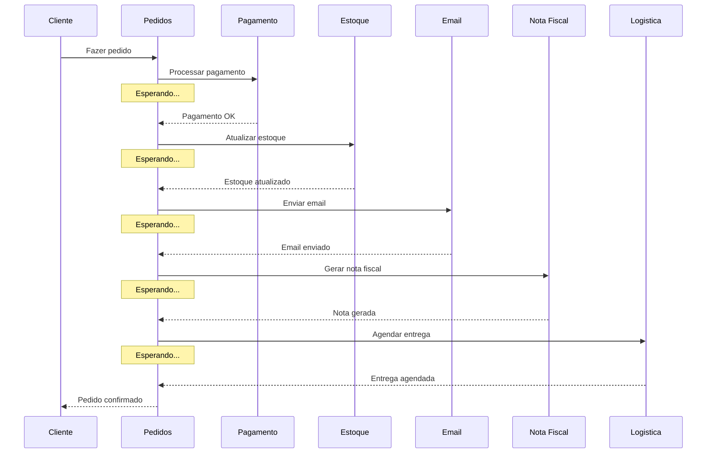

Veja o problema: o cliente fica esperando enquanto TODOS os serviços são chamados, um por um. Se cada serviço demora 500 milissegundos para responder, o cliente espera 2,5 segundos só para ver "pedido confirmado". E isso no cenário feliz — quando tudo funciona.

### Quando as Coisas Dão Errado

Agora imagine que o serviço de email está fora do ar. O que acontece?

O serviço de pedidos tenta chamar o serviço de email, não consegue, e... o pedido inteiro falha. O pagamento já foi processado, o estoque já foi atualizado, mas o cliente vê uma mensagem de erro. Pior: agora você precisa desfazer o pagamento e restaurar o estoque. Tudo porque o serviço de email — que não é crítico para a operação de compra — estava fora do ar.

Esse é o problema fundamental da comunicação síncrona em cadeia: **um elo fraco derruba toda a corrente**.

### A Pergunta Certa

Olhando para esse fluxo, a pergunta que um arquiteto de sistemas faz é:

**O cliente realmente precisa esperar o email ser enviado, a nota fiscal ser gerada e a entrega ser agendada para ver "pedido confirmado"?**

A resposta é não. O cliente precisa saber que:
1. O pedido foi registrado
2. O pagamento foi processado
3. O estoque foi reservado

O resto — email, nota fiscal, logística — pode acontecer depois. O cliente não precisa esperar por isso. E se algum desses serviços secundários falhar, o pedido não deveria falhar junto.

É exatamente esse problema que filas de mensagens resolvem.

---

## O que é uma Fila de Mensagens

Uma fila de mensagens é um componente de software que fica entre dois serviços e funciona como um intermediário. O serviço que quer enviar uma informação coloca uma mensagem na fila. O serviço que precisa processar essa informação pega a mensagem da fila quando estiver pronto.

### A Analogia dos Correios

Vamos expandir a analogia que introduzimos no módulo 11.1.

Imagine o sistema de correios de uma cidade:

- **Remetente** (quem envia a carta): é o serviço que produz a mensagem. No nosso exemplo, é o serviço de pedidos.
- **Caixa de correio** (onde deposita a carta): é a fila onde a mensagem é colocada.
- **Correios** (o sistema que transporta): é o servidor de mensageria que gerência as filas.
- **Carteiro** (quem entrega): é o mecanismo que distribui as mensagens para os consumidores.
- **Destinatário** (quem recebe a carta): é o serviço que processa a mensagem. No nosso exemplo, é o serviço de email.

O remetente não precisa saber se o destinatário está em casa. Não precisa esperar o destinatário ler a carta. Não precisa nem saber quem é o destinatário — ele só deposita a carta na caixa de correio com o endereço correto e segue sua vida.

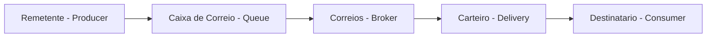

### Como Funciona na Prática

Voltando ao nosso e-commerce, com filas o fluxo fica assim:

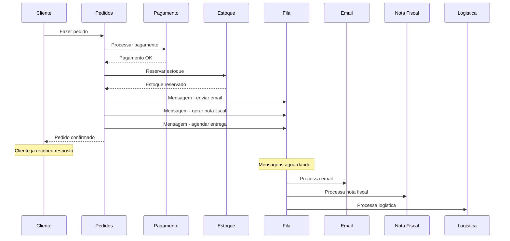

Perceba a diferença:

1. O caminho crítico (pagamento + estoque) continua síncrono — o cliente precisa dessa resposta
2. As operações secundárias (email, nota fiscal, logística) vão para a fila
3. O cliente recebe "pedido confirmado" muito mais rápido
4. Se o serviço de email estiver fora do ar, a mensagem fica na fila esperando. Quando o serviço voltar, processa tudo que estava pendente. Nenhuma mensagem se perde.

Essa é a essência da mensageria: **separar o que é urgente do que pode esperar**.

---

## Os Conceitos Fundamentais da Mensageria

Para entender mensageria, você precisa conhecer cinco conceitos que aparecem em qualquer sistema de filas, independente da ferramenta usada.

### Producer (Produtor)

O **producer** é o serviço que cria e envia mensagens para a fila. Ele "produz" as mensagens.

No nosso exemplo do e-commerce, o serviço de pedidos é o producer. Quando um pedido é confirmado, ele produz mensagens como "enviar email de confirmação para cliente X" e "gerar nota fiscal do pedido Y".

O producer não sabe (e não precisa saber) quem vai processar a mensagem. Ele só sabe que precisa colocar a mensagem na fila certa. É como depositar uma carta na caixa de correio — você não sabe qual carteiro vai entregar, nem quando o destinatário vai ler.

### Consumer (Consumidor)

O **consumer** é o serviço que pega mensagens da fila e as processa. Ele "consome" as mensagens.

No nosso exemplo, o serviço de email é um consumer. Ele fica "ouvindo" a fila de emails. Quando uma mensagem chega, ele pega, processa (envia o email) e confirma que terminou.

Um consumer pode processar mensagens no seu próprio ritmo. Se chegam 1000 mensagens por segundo mas o consumer só consegue processar 100 por segundo, as outras 900 ficam na fila esperando. Não se perdem — apenas esperam sua vez.

### Queue (Fila)

A **queue** é onde as mensagens ficam armazenadas entre o producer e o consumer. É a "caixa de correio" da analogia.

Uma fila tem uma característica fundamental: ela é **FIFO** — First In, First Out (Primeiro a Entrar, Primeiro a Sair). A primeira mensagem que entra na fila é a primeira a ser processada. É como uma fila de banco: quem chegou primeiro é atendido primeiro.

Se você lembra do capítulo 7, quando estudamos estruturas de dados em C, já vimos o conceito de fila (FIFO). Aqui é o mesmo conceito, mas aplicado a comunicação entre serviços em vez de dados em memória.

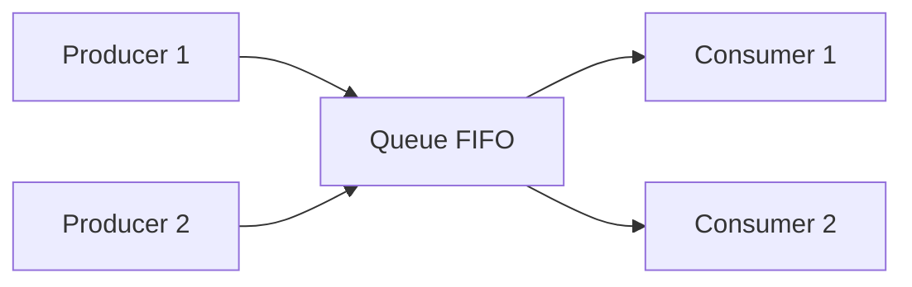

Múltiplos producers podem enviar mensagens para a mesma fila, e múltiplos consumers podem pegar mensagens da mesma fila. Quando há múltiplos consumers, cada mensagem é processada por apenas um deles — a fila distribui o trabalho.

### Broker (Intermediário)

O **broker** é o servidor que gerência as filas. Ele é responsável por:

- Receber mensagens dos producers
- Armazenar as mensagens nas filas corretas
- Entregar as mensagens aos consumers
- Garantir que mensagens não se percam
- Gerenciar múltiplas filas simultaneamente

O broker é como a agência dos correios — o prédio central que recebe, organiza e distribui todas as cartas. Sem o broker, producers e consumers não teriam como se encontrar.

Exemplos de brokers que existem no mercado:

| Broker | Empresa | Caracteristica principal |
|--------|---------|------------------------|
| RabbitMQ | VMware | Fila tradicional, fácil de usar, muito popular |
| Apache Kafka | LinkedIn/Apache | Streaming de eventos, altissima performance |
| Amazon SQS | Amazon Web Services | Fila gerenciada na nuvem, sem servidor para manter |
| Redis Streams | Redis | Fila leve usando Redis como base |
| Azure Service Bus | Microsoft | Fila gerenciada na nuvem Azure |
| Google Pub/Sub | Google Cloud | Publicacao e assinatura de eventos na nuvem Google |

Você não precisa conhecer todos esses agora. O importante é saber que existem várias opções e que todas implementam os mesmos conceitos fundamentais que estamos aprendendo.

### Acknowledgment (Confirmação)

O **acknowledgment** (ou **ack**) é a confirmação que o consumer envia de volta para o broker dizendo "processei essa mensagem com sucesso".

Esse conceito é crucial para a confiabilidade do sistema. Veja por quê:

1. O consumer pega uma mensagem da fila
2. O consumer começa a processar
3. No meio do processamento, o consumer cai (crash, falta de memória, reinício)
4. A mensagem foi processada? Não sabemos.

Sem acknowledgment, o broker não sabe se a mensagem foi processada ou não. Com acknowledgment, o fluxo fica seguro:

1. O consumer pega uma mensagem da fila
2. O broker marca a mensagem como "em processamento" (mas não remove da fila)
3. O consumer processa a mensagem
4. O consumer envia o ack: "processei com sucesso"
5. O broker remove a mensagem da fila definitivamente

Se o consumer cair antes de enviar o ack, o broker percebe (via timeout) e coloca a mensagem de volta na fila para outro consumer processar. Nenhuma mensagem se perde.

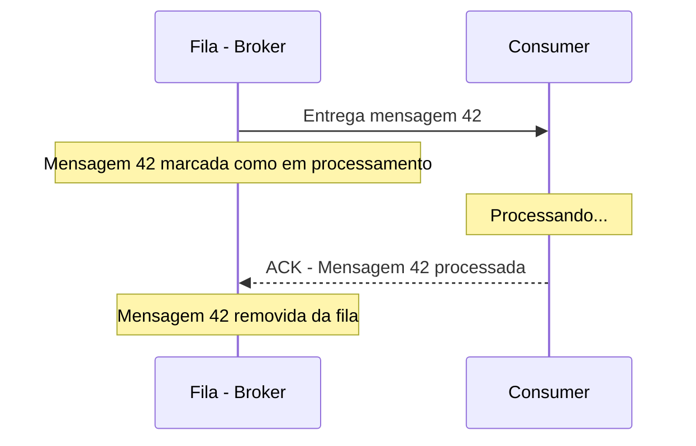

É como assinar o recebimento de uma encomenda dos correios. O carteiro só marca como "entregue" quando você assina. Se você não estiver em casa, ele tenta de novo no dia seguinte.

---

## A História das Filas de Mensagens

Para entender por que filas de mensagens existem, vale olhar para a história. Sistemas de mensageria não surgiram do nada — eles evoluíram junto com a complexidade dos sistemas de software.

### Anos 1980: O Problema Original

Nos anos 1980, empresas começaram a ter múltiplos sistemas de computador que precisavam trocar informações. Um sistema de vendas precisava informar o sistema de estoque sobre cada venda. O sistema de RH precisava informar o sistema de folha de pagamento sobre novos funcionários.

A solução mais simples era a integração direta: o sistema A chamava o sistema B diretamente. Mas isso criava um problema chamado **integração ponto a ponto** — cada sistema precisava conhecer e se conectar diretamente a todos os outros sistemas com quem precisava se comunicar.

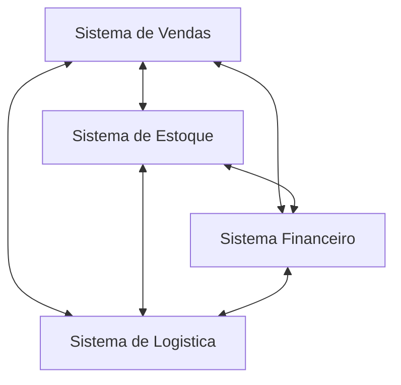

Com 4 sistemas, são 6 conexões. Com 10 sistemas, são 45 conexões. Com 50 sistemas, são 1225 conexões. Cada nova conexão precisava ser programada, testada e mantida. Era insustentável.

### 1993: IBM MQ — O Primeiro Grande Broker

Em 1993, a IBM lançou o **MQSeries** (hoje chamado IBM MQ), um dos primeiros sistemas de mensageria comerciais. A ideia era revolucionária para a época: em vez de cada sistema se conectar diretamente a todos os outros, todos se conectam a um intermediário central.

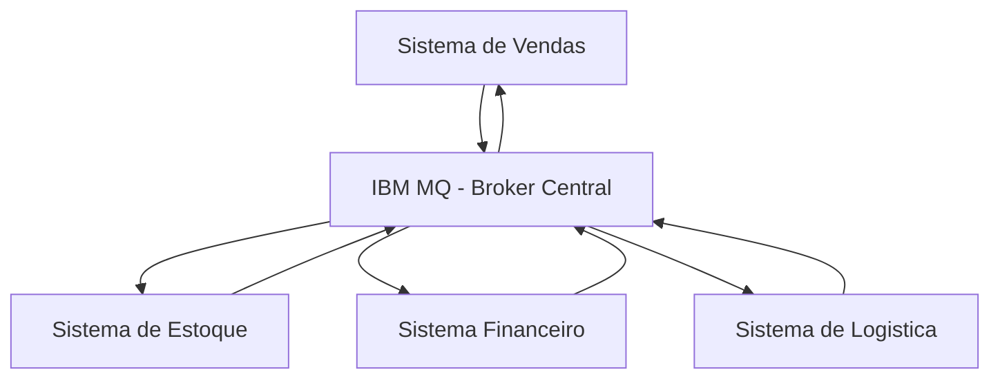

Com o broker central, cada sistema precisa de apenas uma conexão — com o broker. O broker se encarrega de rotear as mensagens para o destino correto. Com 50 sistemas, são 50 conexões em vez de 1225.

O IBM MQ introduziu conceitos que usamos até hoje: filas persistentes (mensagens sobrevivem a reinícios), acknowledgment, prioridade de mensagens e dead letter queues.

### 2003-2007: AMQP e RabbitMQ

O IBM MQ era poderoso, mas caro e proprietário. Nos anos 2000, a comunidade de software começou a buscar alternativas abertas.

Em 2003, o **JPMorgan Chase** (um dos maiores bancos do mundo) iniciou o desenvolvimento do **AMQP** (Advanced Message Queuing Protocol) — um protocolo aberto e padronizado para mensageria. A ideia era que qualquer broker que implementasse AMQP pudesse se comunicar com qualquer outro, sem depender de um fornecedor específico.

Em 2007, a empresa **Rabbit Technologies** lançou o **RabbitMQ**, um broker open source que implementava AMQP. O RabbitMQ rapidamente se tornou o broker mais popular do mundo por ser gratuito, fácil de instalar e robusto o suficiente para produção.

Até hoje, RabbitMQ é uma das escolhas mais comuns para mensageria. Se você entrar em uma empresa e perguntar "qual broker vocês usam?", há uma boa chance de ouvir "RabbitMQ".

### 2011: Apache Kafka — Uma Nova Abordagem

Em 2011, o **LinkedIn** publicou como open source uma ferramenta interna chamada **Apache Kafka**. O Kafka não era apenas mais um broker de filas — era uma plataforma de streaming de eventos com uma filosofia diferente.

A diferença fundamental entre RabbitMQ e Kafka:

- **RabbitMQ**: funciona como correios. A mensagem é entregue ao consumer e removida da fila. Cada mensagem é processada uma vez.
- **Kafka**: funciona como um jornal. As mensagens (eventos) ficam armazenadas por um período configurável (dias, semanas, para sempre). Múltiplos consumers podem ler os mesmos eventos. Cada consumer controla até onde já leu.

| Caracteristica | RabbitMQ | Apache Kafka |
|---------------|----------|-------------|
| Modelo | Fila tradicional - mensagem entregue e removida | Log de eventos - mensagem armazenada e relida |
| Analogia | Correios - carta entregue e descartada | Jornal - edicao publicada e arquivada |
| Mensagem apos consumo | Removida da fila | Permanece no tópico por tempo configuravel |
| Multiplos consumers | Cada mensagem vai para um consumer | Todos os consumers podem ler todas as mensagens |
| Performance | Milhares de mensagens por segundo | Milhoes de mensagens por segundo |
| Complexidade | Moderada | Alta |
| Caso de uso tipico | Tarefas em background, notificacoes | Streaming de dados, analytics, event sourcing |
| Quando usar | Quando cada mensagem deve ser processada uma vez | Quando multiplos servicos precisam reagir ao mesmo evento |

O Kafka foi criado porque o LinkedIn processava bilhões de eventos por dia — cliques, visualizações de perfil, atualizações de feed — e precisava de algo que aguentasse esse volume e permitisse que múltiplos sistemas consumissem os mesmos dados.

### 2010s-2020s: Filas na Nuvem

Com a popularização da computação em nuvem, os grandes provedores lançaram seus próprios serviços de mensageria gerenciados:

- **Amazon SQS** (Simple Queue Service): lançado em 2006, foi um dos primeiros serviços da AWS. Fila simples e gerenciada — você não precisa instalar nem manter nenhum servidor.
- **Google Cloud Pub/Sub**: modelo de publicação e assinatura gerenciado pelo Google.
- **Azure Service Bus**: serviço de mensageria da Microsoft Azure.

A vantagem dos serviços gerenciados é que você não precisa se preocupar com a infraestrutura do broker — a empresa de nuvem cuida de tudo. A desvantagem é que você fica dependente daquele provedor específico.

### A Linha do Tempo

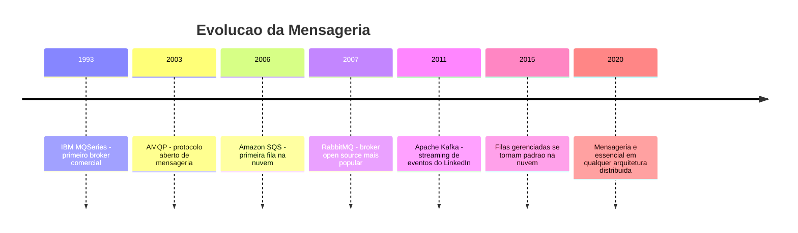

---

## Padrões de Mensageria

Existem diferentes formas de organizar a comunicação via mensagens. Cada padrão resolve um problema diferente. Vamos ver os três mais importantes.

### Padrão 1: Point-to-Point (Ponto a Ponto)

No padrão point-to-point, uma mensagem é enviada para uma fila e processada por exatamente um consumer. Se há múltiplos consumers ouvindo a mesma fila, cada mensagem vai para apenas um deles — a fila distribui o trabalho.

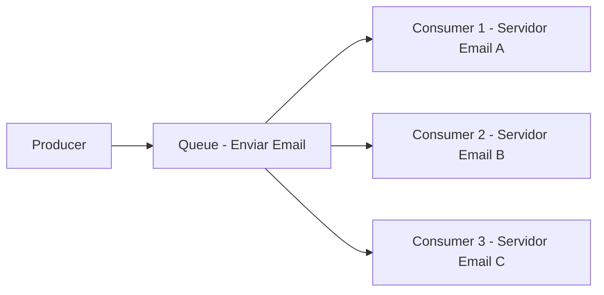
Esse padrão é ideal para distribuir trabalho. Imagine que você precisa enviar 10.000 emails de confirmação. Se tiver apenas um consumer, ele processa um por vez. Se tiver 10 consumers, cada um processa 1.000 — o trabalho termina 10 vezes mais rápido.

**Quando usar**: tarefas que precisam ser executadas exatamente uma vez. Enviar email, gerar nota fiscal, processar pagamento, redimensionar imagem.

**Analogia**: é como uma fila de banco com múltiplos caixas. Cada cliente (mensagem) é atendido por um caixa (consumer). Quando um caixa fica livre, chama o próximo da fila.

### Padrão 2: Publish/Subscribe (Publicação e Assinatura)

No padrão pub/sub, uma mensagem é publicada em um **tópico** (topic) e todos os serviços que estão inscritos nesse tópico recebem uma cópia da mensagem. Diferente do point-to-point, onde cada mensagem vai para um consumer, no pub/sub cada mensagem vai para todos os subscribers.

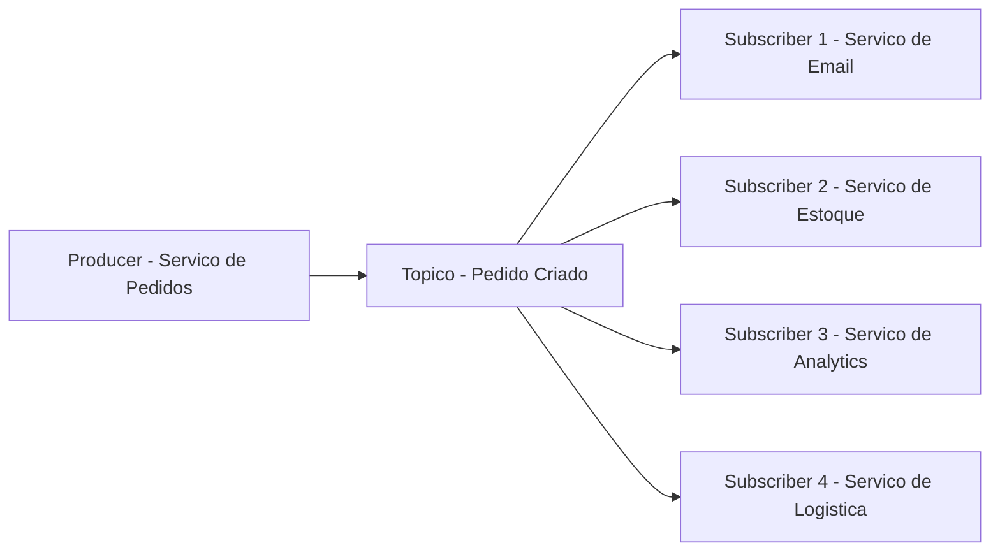

Quando o serviço de pedidos pública o evento "pedido criado", todos os serviços inscritos recebem essa informação e reagem de forma independente. O serviço de email envia a confirmação, o serviço de estoque atualiza a quantidade, o serviço de analytics registra a venda, e o serviço de logística agenda a entrega.

O producer não sabe quantos subscribers existem. Ele pública o evento e pronto. Se amanhã um novo serviço (por exemplo, um serviço de recomendações) quiser reagir a pedidos criados, basta se inscrever no tópico — sem alterar nada no serviço de pedidos.

**Quando usar**: quando múltiplos serviços precisam reagir ao mesmo evento. Notificações, analytics, sincronização de dados entre serviços.

**Analogia**: é como um jornal. O editor pública a edição (evento). Todos os assinantes (subscribers) recebem uma cópia. O editor não sabe quantos assinantes tem — ele só pública. Se alguém novo assinar o jornal amanhã, passa a receber as próximas edições automaticamente.

### Padrão 3: Request/Reply Assíncrono

Às vezes, você precisa de uma resposta, mas não quer ficar parado esperando. O padrão request/reply assíncrono resolve isso: o producer envia uma mensagem com um "endereço de retorno" (uma fila de resposta), e o consumer processa e envia a resposta para essa fila.

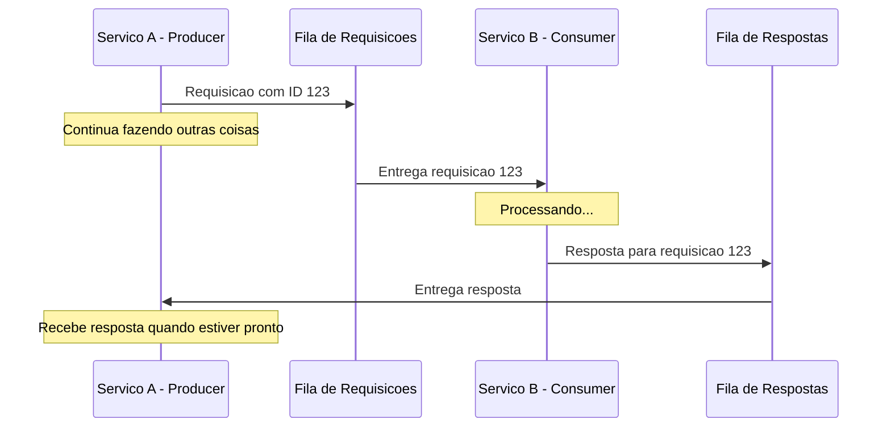

**Quando usar**: quando você precisa de uma resposta, mas o processamento é demorado e você não quer bloquear. Exemplo: solicitar a geração de um relatório complexo que demora 5 minutos. Você envia o pedido, continua trabalhando, e recebe o relatório pronto quando ficar pronto.

**Analogia**: é como enviar uma carta com envelope selado de retorno. Você envia a pergunta, continua sua vida, e eventualmente recebe a resposta na sua caixa de correio.

### Comparação dos Padrões

| Padrão | Mensagem vai para | Resposta | Caso de uso |
|--------|-------------------|----------|-------------|
| Point-to-Point | Exatamente 1 consumer | Não | Tarefas em background |
| Pub/Sub | Todos os subscribers | Não | Eventos e notificacoes |
| Request/Reply | 1 consumer com retorno | Sim, assincrona | Processamento demorado com resultado |

---

## Anatomia de uma Mensagem

Uma mensagem em um sistema de filas não é apenas um texto solto. Ela tem uma estrutura definida com metadados que ajudam o broker e os consumers a processá-la corretamente.

### Estrutura Típica de uma Mensagem

Toda mensagem tem pelo menos duas partes:

**Headers (Cabeçalhos)**: metadados sobre a mensagem — quem enviou, quando, para onde vai, qual o tipo, prioridade, etc.

**Body (Corpo)**: o conteúdo da mensagem em si — os dados que o consumer precisa para fazer seu trabalho.

Veja um exemplo de mensagem para enviar um email de confirmação de pedido:

```json
{
  "headers": {
    "message_id": "msg-2024-001-abc123",
    "timestamp": "2024-03-15T14:30:00Z",
    "source": "order-service",
    "type": "send_confirmation_email",
    "priority": "normal",
    "retry_count": 0
  },
  "body": {
    "order_id": "ORD-98765",
    "customer_email": "[email]",
    "customer_name": "[name]",
    "total": 299.90,
    "items": [
      {"name": "Teclado Mecanico", "quantity": 1, "price": 299.90}
    ]
  }
}
```

Vamos entender cada campo dos headers:

| Campo | Significado | Por que importa |
|-------|-------------|-----------------|
| message_id | Identificador único da mensagem | Evita processar a mesma mensagem duas vezes |
| timestamp | Quando a mensagem foi criada | Permite ordenar e detectar mensagens antigas |
| source | Qual servico enviou | Facilita debugging e rastreamento |
| type | Tipo da mensagem | O consumer sabe como processar |
| priority | Prioridade de processamento | Mensagens urgentes podem ser processadas primeiro |
| retry_count | Quantas vezes ja tentou processar | Evita loops infinitos de reprocessamento |

O body contém tudo que o consumer precisa para executar a tarefa. No exemplo acima, o serviço de email precisa saber o endereço de email, o nome do cliente, o número do pedido e os itens comprados para montar o email de confirmação.

### A Importância do message_id

O `message_id` merece atenção especial. Em sistemas distribuídos, é possível que a mesma mensagem seja entregue mais de uma vez. Isso pode acontecer por vários motivos:

- O consumer processou a mensagem mas caiu antes de enviar o ack
- O broker teve um problema de rede e reenviou a mensagem por precaução
- Um bug no sistema causou duplicação

Se o consumer não verificar o `message_id`, ele pode processar a mesma mensagem duas vezes — enviando dois emails de confirmação para o mesmo pedido, por exemplo.

A solução é tornar o processamento **idempotente**: antes de processar, o consumer verifica se já processou uma mensagem com aquele `message_id`. Se já processou, ignora. Se não, processa normalmente.

**Idempotente** é uma palavra que vem da matemática e significa "pode ser aplicado múltiplas vezes sem mudar o resultado". Multiplicar por 1 é idempotente — não importa quantas vezes você multiplique, o resultado é o mesmo. Enviar um email não é naturalmente idempotente — se você enviar duas vezes, o cliente recebe dois emails. Mas você pode tornar idempotente verificando o `message_id` antes de enviar.

---

## O que Acontece Quando as Coisas Dão Errado

Sistemas distribuídos falham. Redes caem, servidores reiniciam, discos enchem. Um bom sistema de mensageria precisa lidar com falhas de forma elegante. Vamos ver os cenários mais comuns e como são tratados.

### Cenário 1: O Consumer Falha no Meio do Processamento

O consumer pegou uma mensagem da fila, começou a processar, e caiu. O que acontece com a mensagem?

Se o sistema usa acknowledgment (e todo sistema sério usa), a mensagem volta para a fila automaticamente. O broker percebe que o consumer não enviou o ack dentro do tempo limite e recoloca a mensagem na fila para outro consumer processar.

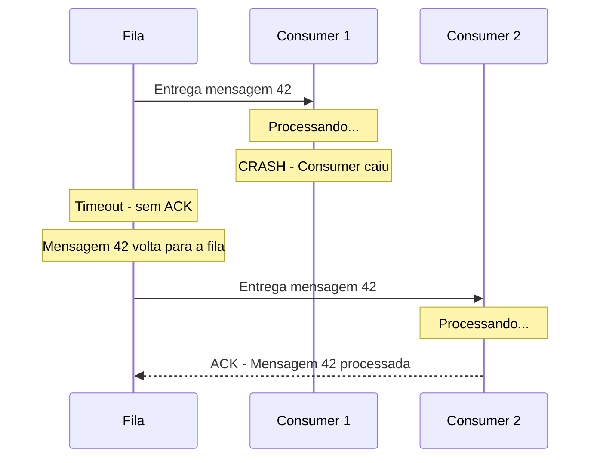

### Cenário 2: A Mensagem é Inválida (Poison Message)

Às vezes, uma mensagem tem dados inválidos que fazem o consumer falhar toda vez que tenta processar. Isso cria um loop perigoso:

1. Consumer pega a mensagem
2. Consumer tenta processar e falha
3. Mensagem volta para a fila (sem ack)
4. Outro consumer pega a mensagem
5. Falha de novo
6. Volta para a fila...

Esse loop pode travar todos os consumers, porque eles ficam tentando processar uma mensagem impossível. A solução é a **Dead Letter Queue** (DLQ).

### Dead Letter Queue (Fila de Cartas Mortas)

A Dead Letter Queue é uma fila especial para mensagens que falharam repetidamente. Funciona assim:

1. O broker conta quantas vezes uma mensagem foi reprocessada (usando o `retry_count`)
2. Se o número de tentativas ultrapassa um limite configurado (por exemplo, 3 tentativas), o broker move a mensagem para a DLQ
3. A mensagem sai da fila principal e para de atrapalhar os consumers
4. Um desenvolvedor pode investigar as mensagens na DLQ para entender o que deu errado

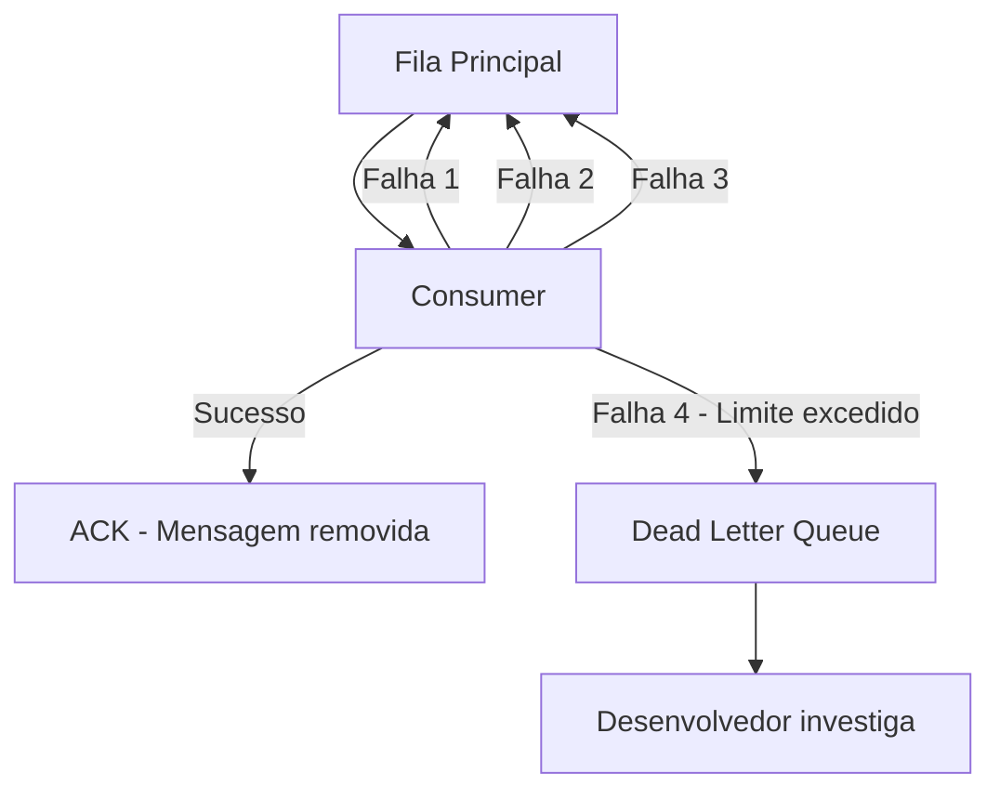

O nome "Dead Letter Queue" vem dos correios. Nos correios tradicionais, cartas que não podem ser entregues (endereço errado, destinatário não encontrado, carta danificada) vão para uma seção especial chamada "dead letter office" — o escritório de cartas mortas. Lá, funcionários tentam descobrir o que fazer com essas cartas.

### Cenário 3: O Broker Cai

E se o próprio broker cair? As mensagens se perdem?

Depende da configuração. Brokers modernos oferecem **persistência**: as mensagens são gravadas em disco, não apenas em memória. Se o broker reiniciar, as mensagens que estavam nas filas são recuperadas do disco.

Além disso, em ambientes de produção, brokers geralmente rodam em **cluster** — múltiplas instâncias que replicam as mensagens entre si. Se uma instância cai, outra assume. É como ter múltiplas agências dos correios — se uma fechar, as outras continuam funcionando.

### Cenário 4: A Fila Fica Cheia (Backpressure)

Se os producers enviam mensagens mais rápido do que os consumers conseguem processar, a fila cresce. E cresce. E cresce. Eventualmente, a fila pode ficar tão grande que consome toda a memória ou disco do broker.

Esse problema é chamado de **backpressure** (contrapressão). As estratégias para lidar com ele incluem:

| Estrategia | Como funciona | Quando usar |
|-----------|---------------|-------------|
| Adicionar consumers | Mais consumers processam mais rápido | Quando o gargalo e capacidade de processamento |
| Limitar o tamanho da fila | Rejeitar novas mensagens quando a fila atinge o limite | Quando e aceitavel perder mensagens |
| Descartar mensagens antigas | Remover mensagens mais antigas para dar espaco | Quando mensagens antigas perdem relevancia |
| Alertar e escalar | Monitorar o tamanho da fila e alertar a equipe | Sempre - como medida de segurança |
| Reduzir a taxa do producer | O producer envia mais devagar | Quando o producer pode ser controlado |

Na prática, a estratégia mais comum é monitorar o tamanho das filas e adicionar mais consumers quando necessário. Ferramentas de monitoramento como Grafana e Prometheus são usadas para criar alertas automáticos: "se a fila de emails tiver mais de 10.000 mensagens pendentes, enviar alerta para a equipe".

---

## Cenários Reais Detalhados

Vamos ver como filas de mensagens são usadas em sistemas reais que você provavelmente usa no dia a dia. Cada cenário mostra o problema, a solução com filas e por que funciona.

### Cenário 1: Envio de Emails em Massa

**O problema**: uma loja online faz uma promoção de Black Friday e precisa enviar 500.000 emails para seus clientes. Se tentar enviar todos de uma vez, o servidor de email sobrecarrega e começa a rejeitar emails. Além disso, provedores como Gmail e Outlook limitam quantos emails você pode enviar por minuto — se enviar rápido demais, seus emails vão para a pasta de spam.

**A solução com filas**: o serviço de marketing coloca 500.000 mensagens na fila, uma para cada email. Os consumers pegam as mensagens e enviam os emails respeitando os limites de taxa (por exemplo, 100 emails por minuto por provedor). Se um email falhar (endereço inválido, caixa cheia), a mensagem vai para a DLQ para investigação posterior.

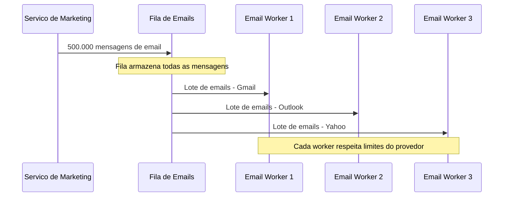

**Por que funciona**: a fila absorve o pico de 500.000 mensagens de uma vez e permite que os workers processem no ritmo adequado. Sem a fila, o serviço de marketing teria que implementar toda a lógica de rate limiting, retry e distribuição — com a fila, cada worker é simples e focado.

### Cenário 2: Processamento de Imagens

**O problema**: uma rede social permite que usuários façam upload de fotos. Cada foto precisa ser redimensionada em 5 tamanhos diferentes (thumbnail, pequena, média, grande, original), ter metadados extraídos (localização, câmera, data) e passar por um filtro de conteúdo impróprio. Tudo isso demora 3-5 segundos por foto. Se o processamento for síncrono, o usuário fica olhando uma tela de "carregando" por 5 segundos — e se 1000 usuários fizerem upload ao mesmo tempo, o servidor trava.

**A solução com filas**: quando o usuário faz upload, a foto é salva no armazenamento e uma mensagem é colocada na fila: "processar foto XYZ". O usuário recebe imediatamente "foto enviada com sucesso" e pode continuar usando o app. Em background, workers pegam as mensagens da fila e processam as fotos no seu ritmo.

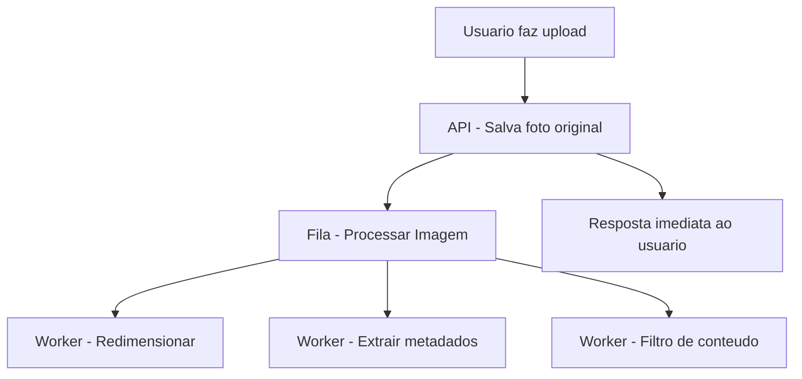

**Por que funciona**: o usuário não espera o processamento pesado. A fila permite escalar os workers independentemente — se há muitos uploads, adiciona mais workers. Se é horário de baixo uso, reduz os workers para economizar recursos.

### Cenário 3: Processamento de Pagamentos

**O problema**: um aplicativo de delivery processa milhares de pagamentos por hora. Cada pagamento envolve: validar o cartão, verificar limite, debitar o valor, registrar a transação, notificar o restaurante e notificar o entregador. Se tudo for síncrono e o serviço de notificação do restaurante estiver lento, os pagamentos ficam lentos — mesmo que o pagamento em si tenha sido processado com sucesso.

**A solução com filas**: o caminho crítico (validar cartão, verificar limite, debitar) é síncrono — o cliente precisa saber se o pagamento foi aprovado. Mas as notificações (restaurante, entregador, email de confirmação) vão para filas separadas.

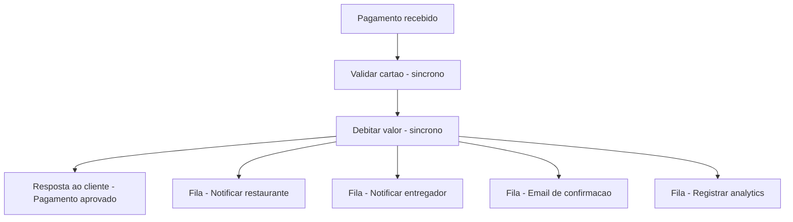

**Por que funciona**: o cliente recebe a confirmação do pagamento em milissegundos. As notificações acontecem em background. Se o serviço de notificação do restaurante cair, as mensagens ficam na fila e são entregues quando o serviço voltar — o pagamento não é afetado.

### Cenário 4: Geração de Relatórios

**O problema**: um sistema de gestão empresarial permite que gerentes gerem relatórios complexos — vendas por região, comparativo mensal, projeções. Cada relatório envolve consultas pesadas ao banco de dados que podem demorar de 30 segundos a 5 minutos. Se o relatório for gerado sincronamente, o navegador do gerente fica travado esperando, e pode até dar timeout.

**A solução com filas**: quando o gerente solicita um relatório, o sistema coloca uma mensagem na fila e responde imediatamente: "seu relatório está sendo gerado, você receberá um email quando estiver pronto". Um worker pega a mensagem, gera o relatório, salva em PDF e envia por email.

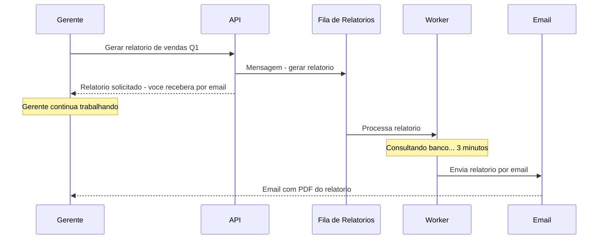

**Por que funciona**: o gerente não fica preso esperando. Pode solicitar vários relatórios e continuar trabalhando. Os workers processam um por vez, sem sobrecarregar o banco de dados. Se muitos gerentes pedirem relatórios ao mesmo tempo, as solicitações ficam na fila e são processadas na ordem.

---

## Filas vs Eventos: Entendendo a Diferença

No módulo 11.1, mencionamos que comunicação assíncrona pode ser feita via filas ou via eventos. Agora que você entende filas em profundidade, vamos esclarecer a diferença.

### Fila (Queue): Carta para Alguém

Na fila, a mensagem é enviada para um destinatário específico. O producer sabe que a mensagem vai ser processada por um consumer (ou um grupo de consumers que dividem o trabalho). Depois de processada, a mensagem é removida.

Pense em uma carta: você escreve para uma pessoa específica. A carta é entregue, lida e descartada.

### Evento (Event): Notícia no Jornal

No modelo de eventos, o producer pública um fato que aconteceu ("pedido criado", "pagamento aprovado", "usuário cadastrado"). Ele não sabe nem se importa com quem vai reagir a esse evento. Qualquer serviço interessado pode se inscrever para receber o evento.

Pense em uma notícia no jornal: o editor pública a notícia. Milhares de leitores podem ler. O editor não sabe quem vai ler nem quantos vão ler.

### Comparação Detalhada

| Aspecto | Fila | Evento |
|---------|------|--------|
| Intencao | Pedir para alguem fazer algo | Informar que algo aconteceu |
| Exemplo de mensagem | Enviar email para cliente X | Pedido 123 foi criado |
| Quem recebe | Um consumer específico | Qualquer subscriber interessado |
| Apos processamento | Mensagem removida | Evento permanece disponível |
| Acoplamento | Producer sabe que existe um consumer | Producer não sabe quem consome |
| Analogia | Carta | Jornal |
| Ferramenta tipica | RabbitMQ, Amazon SQS | Apache Kafka, Google Pub/Sub |

### Quando Usar Cada Um

**Use filas quando**: você tem uma tarefa específica que precisa ser executada. "Enviar este email", "processar este pagamento", "gerar este relatório". A tarefa tem um responsável claro.

**Use eventos quando**: você quer informar o sistema que algo aconteceu e deixar que cada serviço decida o que fazer com essa informação. "Um pedido foi criado" — o serviço de email envia confirmação, o serviço de estoque atualiza quantidade, o serviço de analytics registra a venda. Cada um reage de forma independente.

Na prática, muitos sistemas usam ambos. O serviço de pedidos pública o evento "pedido criado" (pub/sub). O serviço de email, ao receber esse evento, coloca uma tarefa na sua fila interna "enviar email de confirmação" (point-to-point). Eventos para comunicação entre serviços, filas para trabalho interno.

---

## O Fluxo Completo: Da Mensagem ao Processamento

Vamos juntar tudo que aprendemos e ver o fluxo completo de uma mensagem, do momento em que é criada até ser processada com sucesso.

### Passo a Passo

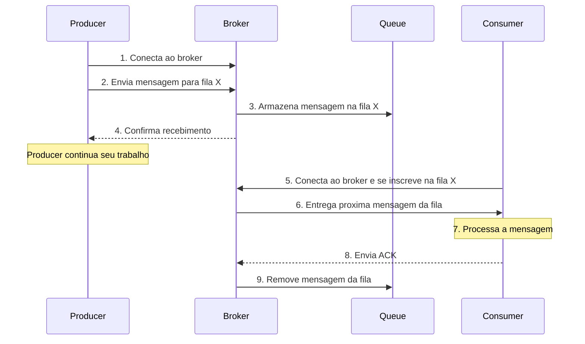

Detalhando cada passo:

1. **Conexão**: o producer se conecta ao broker (geralmente via TCP, com autenticação)
2. **Envio**: o producer envia a mensagem especificando a fila de destino
3. **Armazenamento**: o broker grava a mensagem na fila (em memória e/ou disco, dependendo da configuração)
4. **Confirmação**: o broker confirma ao producer que recebeu a mensagem. Isso é importante — se o broker não confirmar, o producer sabe que precisa reenviar
5. **Inscrição**: o consumer se conecta ao broker e diz "quero receber mensagens da fila X"
6. **Entrega**: o broker entrega a próxima mensagem disponível ao consumer
7. **Processamento**: o consumer executa a lógica de negócio (enviar email, gerar relatório, etc.)
8. **Acknowledgment**: o consumer confirma ao broker que processou com sucesso
9. **Remoção**: o broker remove a mensagem da fila definitivamente

Se o passo 8 não acontecer (consumer caiu, timeout), o broker volta ao passo 6 e entrega a mensagem para outro consumer.

### Pseudocódigo: Producer

Para ilustrar como seria o código de um producer (sem usar nenhuma ferramenta específica), veja este pseudocódigo em Python:

```python
# Pseudocodigo - NAO e codigo real executavel
# Mostra a logica de um producer de mensagens

# "connect" = conectar ao broker
# "connection" = conexao
connection = connect_to_broker("localhost", 5672)

# "channel" = canal de comunicacao com o broker
channel = connection.create_channel()

# "message" = mensagem a ser enviada
message = {
    "headers": {
        "message_id": "msg-001",
        "type": "send_email",
        "timestamp": "2024-03-15T14:30:00Z"
    },
    "body": {
        "to": "[email]",
        "subject": "Pedido confirmado",
        "template": "order_confirmation",
        "order_id": "ORD-98765"
    }
}

# "publish" = publicar a mensagem na fila
# "queue_name" = nome da fila de destino
channel.publish(
    queue_name="email_queue",  # fila de destino
    message=message             # mensagem a enviar
)

# "print" = imprimir no terminal
print("Mensagem enviada para a fila de emails")

# O producer continua executando - nao espera o email ser enviado
# "close" = fechar a conexao
connection.close()
```

Saída esperada:
```
Mensagem enviada para a fila de emails
```

### Pseudocódigo: Consumer

E o consumer que processa as mensagens:

```python
# Pseudocodigo - NAO e codigo real executavel
# Mostra a logica de um consumer de mensagens

# "connect" = conectar ao broker
connection = connect_to_broker("localhost", 5672)
channel = connection.create_channel()

# "process_message" = funcao que processa cada mensagem
def process_message(message):
    # "body" = corpo da mensagem com os dados
    body = message["body"]
    
    # "send_email" = funcao que envia o email de verdade
    # "to" = destinatario
    # "subject" = assunto
    success = send_email(
        to=body["to"],
        subject=body["subject"],
        template=body["template"],
        data={"order_id": body["order_id"]}
    )
    
    if success:
        # "acknowledge" = confirmar que processou com sucesso
        message.acknowledge()
        print(f"Email enviado para {body['to']}")
    else:
        # "reject" = rejeitar - mensagem volta para a fila
        message.reject()
        print(f"Falha ao enviar email para {body['to']}")

# "consume" = comecar a consumir mensagens da fila
# O consumer fica rodando continuamente, esperando mensagens
channel.consume(
    queue_name="email_queue",       # fila para ouvir
    callback=process_message         # funcao a chamar para cada mensagem
)

# Este ponto so e alcancado se o consumer for parado manualmente
print("Consumer encerrado")
```

Saída esperada (para cada mensagem processada):
```
Email enviado para [email]
```

Note que o consumer roda continuamente — ele fica "ouvindo" a fila e processa cada mensagem que chega. É como um funcionário dos correios que fica sentado esperando cartas chegarem e processa cada uma que aparece.

---

## Garantias de Entrega

Um dos aspectos mais importantes de um sistema de mensageria é a garantia de entrega: a mensagem vai chegar ao destino? Vai chegar quantas vezes? Existem três níveis de garantia, e cada um tem trade-offs.

### At Most Once (No Máximo Uma Vez)

A mensagem é entregue no máximo uma vez. Pode não ser entregue (se houver falha), mas nunca será entregue duas vezes.

**Como funciona**: o broker entrega a mensagem e imediatamente a remove da fila, sem esperar o ack do consumer. Se o consumer falhar, a mensagem se perde.

**Quando usar**: quando perder uma mensagem ocasionalmente é aceitável. Exemplo: métricas de monitoramento. Se uma métrica de CPU se perde, a próxima chega em 10 segundos — não faz diferença.

**Analogia**: carta sem aviso de recebimento. Você deposita na caixa de correio e torce para que chegue. Se não chegar, paciência.

### At Least Once (Pelo Menos Uma Vez)

A mensagem é entregue pelo menos uma vez. Pode ser entregue mais de uma vez (duplicata), mas nunca se perde.

**Como funciona**: o broker só remove a mensagem da fila após receber o ack do consumer. Se o consumer falhar antes de enviar o ack, a mensagem é reenviada. Isso pode causar duplicatas — o consumer precisa ser idempotente.

**Quando usar**: quando perder uma mensagem é inaceitável, mas processar duas vezes é tolerável (desde que o consumer seja idempotente). Exemplo: enviar email de confirmação — se enviar duas vezes, o cliente recebe dois emails (chato, mas não catastrófico).

**Analogia**: carta com aviso de recebimento. Se o carteiro não conseguir a assinatura, tenta de novo. Pode acabar entregando duas vezes se houver confusão, mas a carta não se perde.

### Exactly Once (Exatamente Uma Vez)

A mensagem é entregue exatamente uma vez. Não se perde e não duplica.

**Como funciona**: requer coordenação complexa entre broker e consumer, geralmente envolvendo transações distribuídas. É o nível mais difícil de implementar e o mais caro em termos de performance.

**Quando usar**: quando tanto perder quanto duplicar é inaceitável. Exemplo: transferência bancária — você não pode perder a transferência nem executá-la duas vezes.

**Analogia**: carta registrada com protocolo. Cada etapa é documentada, verificada e confirmada. Caro e lento, mas com garantia total.

### Comparação das Garantias

| Garantia | Mensagem pode se perder | Mensagem pode duplicar | Complexidade | Performance |
|----------|------------------------|----------------------|-------------|-------------|
| At Most Once | Sim | Não | Baixa | Alta |
| At Least Once | Não | Sim | Media | Media |
| Exactly Once | Não | Não | Alta | Baixa |

Na prática, a maioria dos sistemas usa **At Least Once** com consumers idempotentes. É o melhor equilíbrio entre confiabilidade e simplicidade. Exactly Once é reservado para cenários financeiros ou onde duplicação causa problemas graves.

---

## Mensageria e a Estrutura de Dados Fila

Se você lembra do capítulo 7, quando estudamos estruturas de dados em C, dedicamos um módulo inteiro a filas (FIFO — First In, First Out). Naquele momento, a fila era uma estrutura de dados em memória: você adicionava elementos no final e removia do início.

A fila de mensagens que estamos estudando agora é conceitualmente a mesma coisa — mas aplicada a um problema diferente:

| Aspecto | Fila em memória - Cap 7 | Fila de mensagens - Cap 11 |
|---------|------------------------|---------------------------|
| O que armazena | Dados em memória do programa | Mensagens entre servicos |
| Onde vive | Na RAM do computador | Em um servidor dedicado - broker |
| Quem usa | Funções dentro do mesmo programa | Servicos diferentes, possivelmente em máquinas diferentes |
| Persistência | Perde tudo se o programa fechar | Pode persistir em disco |
| Escala | Limitada a memória do programa | Pode distribuir entre multiplos servidores |
| Principio | FIFO - primeiro a entrar, primeiro a sair | FIFO - primeira mensagem enviada, primeira processada |

O conceito fundamental é o mesmo: uma estrutura onde elementos entram por um lado e saem pelo outro, na ordem em que chegaram. A diferença é a escala e o contexto de uso.

Isso ilustra um dos mantras do curso: **conceitos são para sempre, ferramentas apenas os implementam**. A fila que você implementou em C com ponteiros e a fila do RabbitMQ que processa milhões de mensagens por dia usam o mesmo conceito. Se você entende o conceito, entende qualquer implementação.

---

## Como a IA pode te ajudar aqui

**Prompt 1 — Explorar o conceito:**
> "Explique a diferença entre RabbitMQ e Kafka como se eu tivesse 10 anos"

**Prompt 2 — Ver exemplos práticos:**
> "Me dê um exemplo real de como o iFood usa filas de mensagens para processar pedidos"

**Prompt 3 — Entender erros comuns:**
> "Quais são os 5 erros mais comuns ao usar filas de mensagens em produção?"

---

## Casos de Uso no Mundo Real

### Netflix: Processamento de Vídeo

Quando um produtor de conteúdo faz upload de um filme ou série para a Netflix, o arquivo original precisa ser convertido em dezenas de formatos e resoluções diferentes — 4K, 1080p, 720p, 480p, cada um em múltiplos codecs (H.264, H.265, VP9, AV1) para diferentes dispositivos (Smart TV, celular, tablet, computador). Um único filme pode gerar mais de 1000 versões diferentes.

Esse processamento é extremamente pesado — pode levar horas para um único filme. A Netflix usa filas de mensagens para distribuir esse trabalho entre milhares de servidores. Quando um vídeo é enviado, uma mensagem é colocada na fila para cada combinação de formato e resolução. Workers especializados pegam as mensagens e processam em paralelo. Se um worker falhar no meio da conversão, a mensagem volta para a fila e outro worker assume.

Sem filas, a Netflix teria que processar cada formato sequencialmente — o que levaria dias em vez de horas. Com filas, o trabalho é distribuído e paralelizado automaticamente.

### Uber: Matching de Motoristas

Quando você solicita uma corrida no Uber, o sistema precisa encontrar o motorista mais próximo disponível. Mas o Uber processa milhões de solicitações por dia em centenas de cidades. Se cada solicitação fosse processada sincronamente por um único serviço, o sistema não aguentaria a carga.

O Uber usa um sistema de eventos e filas para distribuir as solicitações. Quando você pede uma corrida, um evento "corrida solicitada" é publicado. O serviço de matching consome esse evento, calcula o motorista ideal e pública outro evento "motorista encontrado". O serviço de notificação consome esse evento e envia a notificação para o motorista. Cada serviço trabalha de forma independente, conectado por filas e eventos.

Em horários de pico (sexta à noite, feriados, eventos), o volume de solicitações pode ser 10 vezes maior que o normal. As filas absorvem esse pico — as solicitações ficam na fila e são processadas conforme os workers conseguem. O tempo de resposta pode aumentar um pouco, mas o sistema não cai.

### Nubank: Processamento de Transações

Quando você faz uma compra com o cartão do Nubank, várias coisas precisam acontecer: validar o cartão, verificar o limite, autorizar a transação, atualizar o saldo, enviar a notificação push, registrar no extrato, calcular cashback, atualizar o score de crédito, detectar fraude.

O caminho crítico (validar, verificar limite, autorizar) é síncrono — você precisa saber em 2 segundos se a compra foi aprovada. Mas todo o resto vai para filas: a notificação push, o registro no extrato, o cálculo de cashback, a análise de fraude. Cada um desses é processado por serviços independentes que consomem mensagens de filas específicas.

Se o serviço de notificação push estiver lento, sua compra não é afetada — você só recebe a notificação alguns segundos depois. Se o serviço de detecção de fraude estiver processando um backlog, as transações continuam sendo analisadas na ordem — nenhuma é ignorada.

---

## Resumo do Módulo

| Conceito | Definição |
|----------|-----------|
| Fila de mensagens | Intermediario que armazena mensagens entre producer e consumer |
| Producer | Servico que cria e envia mensagens para a fila |
| Consumer | Servico que pega e processa mensagens da fila |
| Broker | Servidor que gerência as filas e distribui mensagens |
| Queue | Estrutura FIFO onde mensagens ficam armazenadas |
| Acknowledgment | Confirmacao do consumer de que processou a mensagem |
| Dead Letter Queue | Fila especial para mensagens que falharam repetidamente |
| Point-to-Point | Padrão onde cada mensagem vai para exatamente um consumer |
| Pub/Sub | Padrão onde cada mensagem vai para todos os subscribers |
| Backpressure | Situação onde producers enviam mais rápido que consumers processam |
| At Most Once | Garantia de entrega sem duplicatas, mas pode perder mensagens |
| At Least Once | Garantia de entrega sem perda, mas pode duplicar mensagens |
| Exactly Once | Garantia de entrega sem perda e sem duplicatas |
| Idempotente | Operação que pode ser executada multiplas vezes com o mesmo resultado |
| Poison Message | Mensagem inválida que causa falha em todo consumer que tenta processa-la |

---

## Glossário do Módulo

| Termo | Definição |
|-------|-----------|
| ACK - Acknowledgment | Confirmacao enviada pelo consumer ao broker indicando que a mensagem foi processada com sucesso |
| AMQP - Advanced Message Queuing Protocol | Protocolo aberto e padronizado para comunicação entre sistemas de mensageria |
| Apache Kafka | Plataforma de streaming de eventos criada pelo LinkedIn, focada em alta performance |
| At Least Once | Garantia de que a mensagem sera entregue pelo menos uma vez, podendo duplicar |
| At Most Once | Garantia de que a mensagem sera entregue no máximo uma vez, podendo se perder |
| Backpressure | Contrapressao que ocorre quando producers enviam mensagens mais rápido que consumers processam |
| Body | Corpo da mensagem contendo os dados que o consumer precisa para processar |
| Broker | Servidor intermediario que gerência filas, recebe mensagens de producers e entrega a consumers |
| Callback | Função chamada automaticamente quando um evento ocorre, como a chegada de uma mensagem |
| Cluster | Conjunto de multiplas instâncias de um broker trabalhando juntas para alta disponibilidade |
| Consumer | Servico ou processo que pega mensagens de uma fila e as processa |
| Dead Letter Queue - DLQ | Fila especial para mensagens que falharam no processamento apos multiplas tentativas |
| Event | Registro de algo que aconteceu no sistema, publicado para qualquer interessado |
| Event-driven | Arquitetura onde servicos reagem a eventos publicados por outros servicos |
| Exactly Once | Garantia de que a mensagem sera entregue exatamente uma vez, sem perda nem duplicata |
| FIFO - First In First Out | Principio onde o primeiro elemento a entrar e o primeiro a sair |
| Headers | Metadados da mensagem como identificador, timestamp, tipo e prioridade |
| Idempotente | Operação que produz o mesmo resultado independente de quantas vezes e executada |
| Message | Unidade de dados trocada entre producer e consumer através de uma fila |
| Message ID | Identificador único de uma mensagem, usado para evitar processamento duplicado |
| Persistência | Capacidade do broker de gravar mensagens em disco para sobreviver a reinicializacoes |
| Point-to-Point | Padrão de mensageria onde cada mensagem e processada por exatamente um consumer |
| Poison Message | Mensagem com dados invalidos que causa falha em qualquer consumer que tente processa-la |
| Producer | Servico ou processo que cria e envia mensagens para uma fila |
| Pub/Sub - Publish/Subscribe | Padrão onde mensagens são publicadas em tópicos e entregues a todos os subscribers |
| Queue | Estrutura de dados FIFO usada para armazenar mensagens entre producer e consumer |
| RabbitMQ | Broker de mensagens open source, um dos mais populares do mercado |
| Rate Limiting | Técnica de limitar a velocidade de envio para não sobrecarregar o destinatario |
| Retry | Tentativa de reprocessar uma mensagem que falhou anteriormente |
| Subscriber | Servico inscrito em um tópico para receber eventos publicados |
| Timeout | Tempo máximo de espera antes de considerar que uma operação falhou |
| Topic | Canal de publicacao de eventos onde subscribers se inscrevem para receber mensagens |
| Worker | Processo consumer dedicado a executar tarefas em background a partir de mensagens da fila |

---

## Na Cultura Popular

- **O Dilema das Redes** (documentário, 2020) — as redes sociais processam bilhões de interações por dia usando sistemas de mensageria massivos. Cada curtida, comentário e compartilhamento gera eventos que são distribuídos por filas para dezenas de serviços diferentes — recomendações, notificações, analytics, moderação de conteúdo. O documentário mostra a escala desses sistemas sem entrar nos detalhes técnicos, mas agora você sabe o que está por trás.

- **Silicon Valley** (série, 2014-2019) — a série mostra os desafios de escalar uma startup de tecnologia. Em vários episódios, os personagens lidam com problemas de performance e escalabilidade que seriam resolvidos com mensageria — processar milhões de arquivos, distribuir trabalho entre servidores, lidar com picos de uso. A série ilustra de forma cômica os problemas reais que filas de mensagens ajudam a resolver.

- **O Código Enigma / O Jogo da Imitação** (filme, 2014) — embora o filme seja sobre a Segunda Guerra Mundial, o conceito central é relevante: mensagens codificadas sendo transmitidas, interceptadas e processadas. A máquina Enigma era essencialmente um sistema de mensageria criptografada — producers (comandantes alemães) enviavam mensagens, e consumers (submarinos, tropas) as recebiam e processavam. Alan Turing criou um sistema para "consumir" essas mensagens de forma automatizada.

---

## Para Saber Mais

- [RabbitMQ Tutorials](https://www.rabbitmq.com/getstarted.html) — *Tutoriais oficiais do RabbitMQ com exemplos em Python, Java e outras linguagens. Excelente para ver na prática como producers e consumers funcionam*

- [Apache Kafka Documentation](https://kafka.apache.org/documentation/) — *Documentação oficial do Kafka com explicações detalhadas sobre streaming de eventos e arquitetura distribuída*

- [Postman Learning Center](https://learning.postman.com/) — *Tutoriais para testar APIs e integrações, incluindo cenários com webhooks e comunicação assíncrona*

- [Rocketseat — APIs com Python](https://www.youtube.com/@rocketseat) — *Canal brasileiro com conteúdo sobre desenvolvimento de APIs, integrações e arquitetura de sistemas*

- [Martin Fowler — Enterprise Integration Patterns](https://www.enterpriseintegrationpatterns.com/) — *Catálogo clássico de padrões de integração entre sistemas, incluindo todos os padrões de mensageria que discutimos neste módulo*

---

## Perguntas Frequentes (FAQ)

**P: Preciso instalar RabbitMQ ou Kafka para aprender mensageria?**
R: Não neste momento. Este módulo é conceitual — o objetivo é que você entenda como filas funcionam, por que existem e quando usar. Quando você trabalhar em um projeto real que precise de mensageria, aí sim vai instalar e configurar um broker. Neste capítulo, nosso foco prático é em APIs HTTP com FastAPI.

**P: Qual a diferença entre uma fila de mensagens e um banco de dados?**
R: Ambos armazenam dados, mas com propósitos diferentes. O banco de dados armazena dados para consulta futura — você grava e lê quando quiser, quantas vezes quiser. A fila armazena mensagens para processamento — a mensagem é lida uma vez, processada e removida. O banco é uma biblioteca (livros ficam lá para sempre), a fila é uma esteira de fábrica (peças passam e são processadas).

**P: Posso usar o banco de dados como fila?**
R: Tecnicamente sim, e muitas empresas fazem isso em sistemas simples. Você cria uma tabela com status "pendente", "processando", "concluído" e um worker que consulta periodicamente. Funciona para volumes baixos, mas não escala bem — o banco não foi projetado para esse padrão de uso. Para volumes altos, um broker dedicado é muito mais eficiente.

**P: O que acontece se eu enviar uma mensagem para uma fila que não existe?**
R: Depende do broker. No RabbitMQ, a mensagem é descartada silenciosamente (ou gera um erro, dependendo da configuração). No Kafka, o tópico pode ser criado automaticamente. Na prática, filas são criadas antes de serem usadas, geralmente como parte da configuração do sistema.

**P: Filas de mensagens são só para microserviços?**
R: Não. Filas são úteis em qualquer sistema que precise processar tarefas em background. Mesmo um monolito pode usar filas para enviar emails, gerar relatórios ou processar uploads. A diferença é que em microserviços, filas são quase obrigatórias para comunicação entre serviços, enquanto em monolitos são opcionais.

**P: Como sei se meu sistema precisa de filas?**
R: Sinais de que você precisa: operações que demoram mais de 1-2 segundos e o usuário não precisa esperar, picos de carga que sobrecarregam serviços, operações que podem falhar sem afetar o fluxo principal, necessidade de processar grandes volumes de dados em background. Se seu sistema é simples e rápido, provavelmente não precisa.

**P: Mensagens na fila ficam lá para sempre se ninguém consumir?**
R: Depende da configuração. Você pode configurar um TTL (Time To Live) — tempo máximo que uma mensagem fica na fila. Após o TTL, a mensagem é descartada ou movida para a DLQ. Também pode configurar um tamanho máximo para a fila. Na prática, se ninguém está consumindo, algo está errado e precisa ser investigado.

**P: Qual a diferença entre RabbitMQ e Kafka? Qual devo aprender primeiro?**
R: RabbitMQ é uma fila tradicional — mais simples, mais fácil de entender, ideal para tarefas em background. Kafka é uma plataforma de streaming — mais complexa, mais poderosa, ideal para processar grandes volumes de eventos. Para iniciantes, RabbitMQ é mais acessível. Na prática, a escolha depende do problema: se precisa de fila simples, RabbitMQ. Se precisa de streaming de eventos em alta escala, Kafka.

**P: O que é "event sourcing"?**
R: Event sourcing é um padrão onde, em vez de armazenar o estado atual dos dados, você armazena todos os eventos que levaram àquele estado. Em vez de guardar "saldo = R$ 500", você guarda "depósito de R$ 1000", "saque de R$ 300", "compra de R$ 200". O saldo atual é calculado reproduzindo todos os eventos. Kafka é frequentemente usado para implementar event sourcing por sua capacidade de armazenar eventos por longos períodos.

**P: Filas garantem a ordem das mensagens?**
R: Depende. Uma fila simples (single queue) garante FIFO — a ordem de entrada é a ordem de processamento. Mas quando você tem múltiplos consumers, a ordem pode variar porque cada consumer processa no seu ritmo. Kafka garante ordem dentro de uma partição, mas não entre partições. Se a ordem é crítica, você precisa configurar o sistema adequadamente.

**P: O que acontece com as mensagens se eu desligar todos os consumers?**
R: Se o broker tem persistência habilitada (e deveria ter em produção), as mensagens ficam armazenadas em disco. Quando os consumers voltarem, processam tudo que estava pendente. É como uma caixa de correio — as cartas se acumulam até alguém abrir e ler.

**P: Mensageria é a mesma coisa que webhooks?**
R: Não, mas são relacionados. Webhooks são callbacks HTTP — o serviço B avisa o serviço A via uma requisição HTTP quando algo acontece. É uma forma simples de comunicação assíncrona, mas sem intermediário. Se o serviço A estiver fora do ar quando o webhook é enviado, a mensagem se perde (a menos que o serviço B implemente retry). Filas de mensagens são mais robustas porque o broker guarda as mensagens até serem processadas.

**P: Vou usar filas no projeto deste capítulo?**
R: Não. O projeto do capítulo 11 é uma API REST com FastAPI — comunicação síncrona. Filas são apresentadas neste módulo para completar seu entendimento sobre comunicação entre serviços. Quando você trabalhar em projetos maiores no futuro, vai encontrar filas em praticamente todo sistema de produção.

---

## Exercícios Práticos

### Exercício 1: Projetando Filas para um Sistema

Considere um sistema de streaming de música (como Spotify). O sistema tem os seguintes serviços:

- Serviço de Catálogo (músicas, álbuns, artistas)
- Serviço de Reprodução (tocar música)
- Serviço de Recomendações (sugerir músicas)
- Serviço de Histórico (registrar o que o usuário ouviu)
- Serviço de Playlists (gerenciar playlists do usuário)
- Serviço de Social (mostrar o que amigos estão ouvindo)
- Serviço de Analytics (métricas de uso para artistas)

Quando um usuário dá play em uma música, quais operações devem ser síncronas e quais devem ir para filas? Para cada operação assíncrona, defina:
- Nome da fila
- Quem é o producer
- Quem é o consumer
- O que a mensagem contém
- O que acontece se o consumer estiver fora do ar

### Exercício 2: Identificando o Padrão

Para cada cenário abaixo, identifique qual padrão de mensageria é mais adequado (Point-to-Point, Pub/Sub ou Request/Reply Assíncrono) e justifique:

1. Um sistema de RH precisa enviar o holerite de 5.000 funcionários por email todo dia 5
2. Quando um produto é cadastrado no e-commerce, o serviço de busca precisa indexar, o serviço de recomendações precisa atualizar seus modelos, e o serviço de marketing precisa verificar se há campanhas ativas para aquela categoria
3. Um sistema de análise de crédito recebe uma solicitação, processa por 2 minutos consultando múltiplas fontes, e precisa retornar o resultado ao solicitante
4. Um sistema de monitoramento detecta que um servidor está com disco quase cheio e precisa alertar a equipe de infraestrutura
5. Uma plataforma de cursos online precisa gerar certificados em PDF para 10.000 alunos que concluíram o curso

### Exercício 3: Desenhando o Fluxo com Filas

Um hospital está modernizando seu sistema. Quando um paciente chega na emergência, o seguinte precisa acontecer:

1. Registrar a chegada do paciente (dados pessoais, sintomas)
2. Classificar a prioridade (verde, amarelo, vermelho)
3. Notificar o médico de plantão
4. Reservar leito (se necessário)
5. Solicitar exames iniciais ao laboratório
6. Notificar o plano de saúde
7. Atualizar o painel de espera na recepção
8. Registrar no prontuário eletrônico

Desenhe o fluxo identificando:
- Quais operações são síncronas (o atendente precisa da resposta)
- Quais vão para filas (podem acontecer em background)
- Quais usam pub/sub (múltiplos serviços precisam reagir)
- O que acontece se o serviço do plano de saúde estiver fora do ar

---

[← Anterior: APIs HTTP e REST](cap11-mod03-apis-http-rest-conteudo.md) · [Próximo: Outras Formas de Integração →](cap11-mod05-outras-integracoes-conteudo.md)
